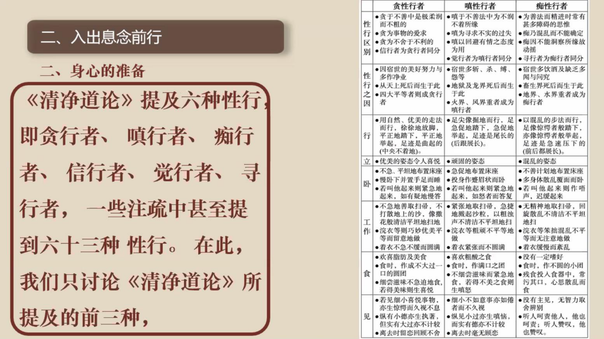
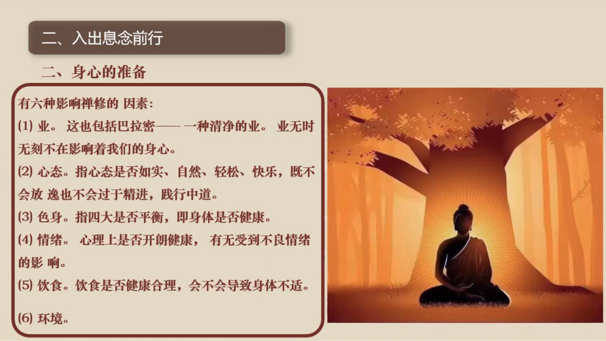
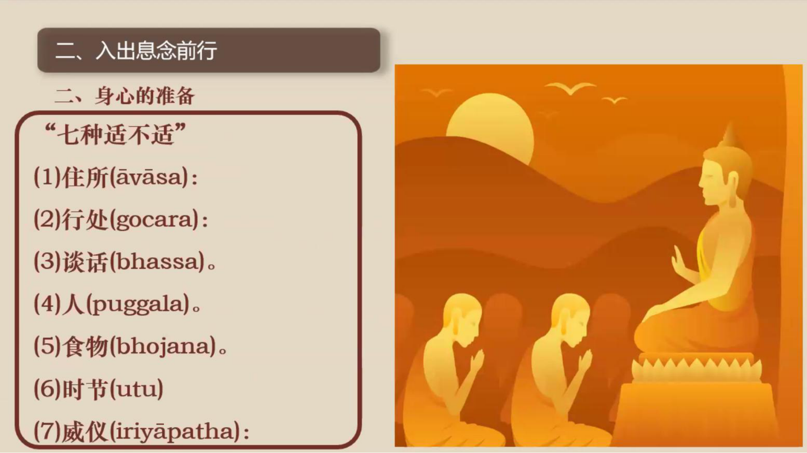
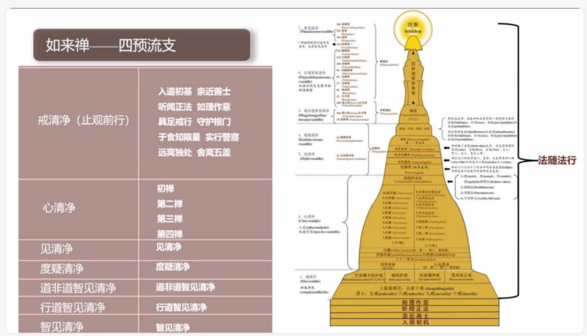

📅 最近更新：2026-09-22 21:41　|　学员版禅修练习去重：仅保留一份（禁忌/练习提示），去掉原周次子标题与“两段引导词”提示行

> 🔴🔴🔴 **【存疑·未改】** 标记之间的文字＝红方审计判定「存疑、未改」之处，照录原文一字未动，待人工核实修改。
# 第1周：禅修入门与正确坐姿（学员版）
## 📋 本周信息卡

| 项目 | 内容 |
|:----|:-----|
| 时长 | 约120分钟（设计=2小时，按新流程弹性调控） |
| 核心问题 | 什么是禅修？为什么两千多年后的今天我们还能修？；身体如何影响一坐？为什么坐姿会影响坐得久不久？ |
| 共读原文 | 共读原文1：① 禅修的本质与止观：禅修的本质、止禅定义、观禅定义、止观关系（录音转写·依据录音转写整理）② 正法依然住世：义注引文、正法五千年阶段、确立修行目标总说（PDF课件）③ ◈扩展·如来禅体系总览：什么叫如来禅、三学/七清净/十六观智框架（录音转写·依据录音转写整理）　｜　共读原文2：① 坐姿三要领：骨盆中立位/松肩坠肘开胸/头部自然中立（录音转写·依据录音转写整理）② 禅修前行检查清单：心理五项检查、性行、六类因素、七种适不适、正确修习四条件（PDF课件）③ 错误坐姿与坐垫选择（录音转写·依据录音转写整理） |
| 本周作业 | 每天睡前用2分钟回想今天心里最清楚的一次状态（不评判，只观察）；每天按三要领坐10分钟（可以只坐着看呼吸） |

---
## 🧘 静心开场（10 min）

> **开场破冰 · 暖场**（约 3 分钟）：用一句话说说：来参加读书会之前，你以为“禅修”是什么？
> （说完不必解释、不点评，只把它轻轻放在心里，带着这份真实进入今天的静心。）

> **本期共同约定（心理安全）**：① **保密**——今天在这里说的话，留在今天；② **不评判**——不评价任何人的分享；③ **可随时暂停**——坐不住、心里不舒服，随时可以调整姿势、起身或暂停，不需要向任何人解释。

---
## 📖 共读原文1（20 min）

### 原文材料①：禅修的本质与止观——什么是禅修、止禅与观禅、止观关系

> **【本周朗读段 · 开始】**（本段约 约3290 字，供中等稍慢朗读，约 25 分钟；其余为默读／选读／延伸内容）

**★核心段落**（必读）

**一、禅修的本质：培育心的素质**

> [00:01:35] 首先,我们来了解一下什么是禅修。禅修在巴利语呢,它的发音叫"巴瓦那"(bhāvanā)。它的意思是发展、培育。也就是说,它是用来进行心灵发展、提升我们心的素质的一种修行实践。

> [00:06:33] 我们习惯性是追那个结果的。而修行,它不是为结果,结果是一个自然的呈现。我们讲说"你只管做好事就行了,果报自然会来",也是这样的:修行呢,你只管在每个当下,你的心是在上行的状态、在善心的状态,自然不善心就不会生起。

> [00:07:36] 很多人最后修出很多禅病,就是因为这个心态的原因。所以我们必须从一开始特别地、一再地交代,一再地让自己明白:**禅修的目的是培育心的平静,是去除我们内心的五盖**,这个必须很了解。

**二、止禅(samatha)的定义**

> [00:03:49] 止观禅法,既然是止观呢,严格上来讲,它就分成止禅和观禅。

> [00:03:57] 止禅,这个在巴利叫"萨马塔"(samatha),过去我们翻译成"舍摩他"(奢摩他)。奢摩他的本意是(令烦恼)止息、(心)平静——"萨马塔"是一个组合词,其中"沙玛"(sama)是指平、很平静的意思。也就是说,心专注在一个位置上,不动、没烦恼、安宁的状态。

> [00:04:56] "阿"(a)呢,是巴利名词的语基,是语言的基础,它没有实际的含义。

> [00:05:08] 那么在《辨析道义注》——就是《辨析道》,过去翻译成《无碍解道》,是沙利子尊者(沙利子尊者)的论著——在《辨析道义注》和《法集义注》里面,对奢摩他有一个这样的解释:**令欲贪等诸障碍法止息、消失,故称为止**。那么这个诸障碍法,指的就是欲贪等五盖的烦恼——就是我们汉地天台(智者大师)讲的"诃欲、弃盖"里面的那个五盖。让五盖等烦恼止息消失,称为"止"。

> [00:05:56] 因此,止禅的目标,它其实是培育我们心的宁静、平静,令我们心的素质提升,得以征服烦恼,为后面开展观禅提供基础,它是起这样的目标的。

**三、观禅(vipassanā)的定义**

> [00:08:01] 接下来这个观呢,巴利语叫"维巴萨那"(vipassanā)。

> [00:08:08] 过去用我们古汉语翻译成"毗婆舍那"。毗婆舍那,其实如果用客家话来念,也是"维巴萨那"。

> [00:08:19] 维巴萨那其实也是一个组合词,就是"维"(vi)加"巴萨那"(passanā)。"维"(vi)在巴利里的意思是"不同""多样";"巴萨那"(passanā)就是观照、看。所以合起来,维巴萨那是说"通过无常等种种行相去观照诸行法"的这样一种方法,称为毗婆舍那,称为"观"。现在有人把它翻译成"内观",其实并不非常准确,因为它不仅仅是内观,还有外观。

> [00:09:14] 观,是指通过观照——我们精神和物质这两个部分称为名色嘛——观照名色等诸行法的无常、苦、无我三相来培养智慧的一种方法。那么维巴萨那的目的,是舍断对名色法的执取,也就是对五蕴身心(精神与物质)的执取,然后证悟涅槃、体证道果。

> [00:09:45] 所以观禅系统——我们如来禅的观禅系统——强调以佛陀的一代言教,就是以最接近佛陀言教的巴利三藏圣典为依托,特别注重对阿毗达摩的研究和实践。因为阿毗达摩就是修观的说明书。

> [00:10:10] 阿毗达摩讲名法、讲色法、讲缘起法,那么修观的时候,你就是要去看这个名法、看这个色法、看这个缘起法。

**★核心段落**（必读）

**四、止禅与观禅的关系：止是观的基础**

> [00:03:32] 所以如来禅的禅修,简单来讲,我们就称为止观的禅法。以传承清净的巴利三藏为依托,有着佛陀教导的严格、清晰的禅修次第。

> [00:18:58] 修什么呢?修习心与慧。"心"的修习——这里心就是指止禅的部分,让我们的心变得清净,那就是修止、修定。而"慧"的修习(bhāvanāya)是指观智,即刚才讲的维巴萨那、毗婆舍那。毗婆舍那有十六种观智。

> [00:29:08] 在佛陀时代,我们讲说佛教的解脱是通过心的修行得以实现,那禅修呢,是修心的方法。

> [00:45:18] 而止观禅修,是二者(出家人与在家人)获得解脱或者累积解脱资粮的最有效的方式。

**◈扩展段落**（可选）

**五、两条证悟路径：止观行者与纯观行者**

> [00:19:50] 这里(经中)说的有慧比库,是三因结生的,而且懂得如何来修;这样一个很热忱的、致力于熄灭烦恼的出家人,他能够解开这些结缚——也就是说,安住于戒、心清净的比库,依据次第培养戒定慧三学,以这样的方式,他可以斩断结缚、断除烦恼。(依戒→心/止→慧/观的次第)

> [00:21:57] 按照佛陀时代的传统,证悟有两种路径:一种路径我们叫做纯观行者,也有一些人称为"干观";还有一种是止观行者。

> [00:22:28] 纯观行者,就是他并没有证得(安止)禅那(初禅、二禅、三禅、四禅),但是他修观禅,这个就称为纯观行者。

> [00:24:02] 止观行者,在巴利里面叫"萨马塔亚尼卡"(samathayānika)。萨马塔刚才讲过了,就是三摩地、奢摩他,这是指证得初禅二禅乃至八定的这种安止定,再从这些定的高质量的心里面出来培养观智,这个叫止观行者。

> [00:25:46] 传统的纯观行者,虽然不需要培养安止定,但是他要培养近行定和刹那定……因此心的疲劳会经常发生,这种情况下禅修者就需要有休息处。佛陀在《中部·两种寻经》里做了一个比喻:在战场上,战士有时会感到疲惫……对于止观行者来讲,禅那就如同堡垒,可以作为修观过程的休息处;而对于纯观行者来讲,他们因为没有禅那,但可以以近行定作为堡垒来休息。

> [00:27:09] 所以在禅修理论的层面,止观行者的禅修之路完全涵盖了纯观行者。因此,我们如来禅禅修体系的介绍,是以止观行者这个角度来展开,纯观行者本身就包含在里面。

### 原文材料②：正法依然住世——五个千年与确立修行目标

**★核心段落**（必读）

**一、正法依然住世（时代特点）**

> "以得达辨析者住立千年,以六通者千年,以三明者千年,以纯观者千年,以巴帝摩卡住立千年。"(D.A.3.161)
> ——《长部义注》

> "确实唯有佛陀般涅槃后的(前)一千年能产生辨析(智),在那之后是六神通,之后连那也不能产生,则产生三明。过了(漫长的)时间,连那也不能产生,则是纯观者。不来者、一来者、入流者也是同理。"(A.A.1.1.130)
> ——《增支部义注》

**二、正法住世阶段（五个千年及对应可证果位）**

> 根据长部义注的说法:
> 第一个千年能够得到辨析智。
> 第二个千年能够得到六神通。
> 第三个千年能够得到三明(tevijjā)。
> 第四个千年能够证得纯观的阿拉汉果。
> 第五个千年连断除一切烦恼都不可能了,只能成就更低的三个果位:不来果、一来果与入流果。

**三、确立修行目标（目标总说）**

> 在上座部佛教中,有三种菩提,即正自觉菩提(sammā-sambodhi)、独觉菩提(pacceka-bodhi)、弟子菩提(sāvaka-bodhi)。在这三种菩提中,成就正自觉菩提者又被称为正自觉者(sammā-sambuddha),也即佛陀。成就独觉菩提者被称为独觉佛(pacceka-buddha)。成就弟子菩提者被称为圣弟子(ariya-sāvaka)。
>
> 这三类圣者在证悟阿拉汉果时,皆已彻见四圣谛,断除一切烦恼,完全清凉与寂静,他们在解脱上并无差异。不过,由于其往昔所发之愿、为满愿而积累的巴拉密(pāramī,波罗蜜)及累积巴拉密的时间不同,因此在最后一生解脱后,神通、智慧、福德等有很大差异。

> 《增支部·一集》中说:
> "诸比库,有一人出现于世间时,是稀有之人的出现。哪一人呢?如来、阿拉汉、正自觉者。诸比库,乃此一人出现于世间时,是稀有之人的出现。"
> "诸比库,绝无此理,无有条件,若一个世界中有两位阿拉汉、正自觉者不先不后地出现,绝无此理!诸比库,确有此理,若一个世界中只有一位阿拉汉、正自觉者出现,确有此理。"

> 若禅修者发愿成为普通弟子,致力于尽快解脱,则应了解《增支部·四集》中所说的四类人:
> 1) 敏锐知者(ugghāṭitaññū)
> 2) 详说知者(vipañcitaññū)
> 3) 可引导者(neyya)
> 4) 文句为最者(padaparama)

### 原文材料③（◈扩展）：如来禅体系总览——什么叫如来禅、三学/七清净/十六观智

**◈扩展段落**（可选）

**一、什么叫如来禅（体系名称的由来）**

> [00:10:48] 那么什么叫如来禅呢?为什么叫如来禅呢?首先我们知道什么是如来。佛陀说:诸比库,"如是说而如是行,如是行而如是说"者,故被称为如来。

> [00:11:09] 诸比库,于天魔、梵天、沙门、婆罗门、天人世间,如来是胜利者、不被征服者、见一切者、有自在力者,故被称为如来。……诸比库,有如来自觉悟之智,如来般涅槃日于其中间所说一切所谈乃至所说者,只是"如"而已,并非不如,故名如来。

> [00:12:09] (如来)行如所说,言如所行——"行如所言,言如所行",故名如来。……所以如来是佛陀对自己的自称。所以如来禅,就是佛陀所教导的禅法,从佛陀辗转传来、没有增减的这样的禅法。

> [00:12:46] 那也是我们依据的这个三藏——巴利三藏的圣典,以及义注和复注,对于佛陀所教导的禅法的这样一种解释以及修证的方法。

**二、体系总览：三学、七清净、十六观智**

> [00:13:05] 那么根据这个三藏,我们的如来禅的禅法,归结出来它是这样的次第:有三学、七清净。

> [00:13:22] 十六种观智。三学就是戒定慧三学,大家很熟悉。那七清净呢,分别是:戒清净、心清净、见清净、度疑清净、道非道智见清净、行道智见清净、智见清净。好,那么这个七清净展开来——除了戒清净和心清净之外,从见清净到智见清净这五个清净,又被展开来称为十六种观智。好,所以我们讲禅修——从如来禅的角度上来讲,禅修包括止禅还有观禅。

> **【本周朗读段 · 结束】**（以下为默读／选读／延伸内容，时间富余时再读）

**三、十六观智的第一步：名色分别智与"法住智"**

> [00:01:52] 我们(修)名色分别智,这是十六观智的第一个观智,叫名色分别智。名法就是我们精神的部分,色法就是物质的部分。我们要能够看到我们(由)四种来源(生起的)28种色法,以及它再产生的再分裂……

> [00:06:57] 名色分别能够证得,在佛陀的教法里面,你就证得了苦谛——四圣谛里面证得了苦谛。

> [00:07:24] 接下来是度疑清净,度疑清净呢就是缘摄受智,(观察)都是一堆名色(的因缘)。

> [00:11:17] 有了缘摄受(智)的基础,我们去看过去、未来,一直到你最后一生,就没有结生了……

> [00:13:42] 前面这个名色分别智跟缘摄受智,也被称为"法住智"。就是要有这个基础,我们才去观。

**四、观智成熟时：从"无常、苦、无我"到道智**

> [00:13:53] 观什么呢?观过去30生以及到你证悟涅槃这个期间的所有的生命状态——有高的有低的,有好的有不好的——这些生命状态的名色法,都是无常、苦、无我的。无常呢就是生灭,刹那生灭;苦呢就是不圆满、受逼迫、会坏掉;无我呢,就是没有一个主宰,没有一个可管控的东西在里面,没有灵魂。无常、苦、无我——那么这样的生命,你还要不要?

> [00:14:29] 就是这样的角度,他观察的是这样。思维智呢,就是先看到无常、苦、(无我);到生灭随观,就是能看到当下的生灭;(再到)坏随观,最后你只看到(灭)——就是你这一生在追求的、以及过去无数生命在追求的这个生命中"美好的东西",它其实在不断地灭、灭、灭、灭、灭……

> [00:14:51] 那个时候,如果我们的观智成熟,就会生起怖畏现起智,次第地生起怖畏现起智,就觉得:好可怕,这样的生命状态好可怕,而且我还一直都以为它很美好。然后是过患智,就觉得这样的生命不好,这样的生命状态跟涅槃比起来差太远了。

> [00:15:19] 然后厌离智——就是不喜欢这样的生命状态;然后想解脱智、欲解脱智;然后行舍智、随顺智、种姓智、道智。就是当你真的能够对这样的生命状态放手的时候,那五根平衡,道智就会生起;道智生起,就会彻底地断除一部分的烦恼,比如初果。

**五、两类行者：止观与纯观（材料③的表述，与材料①第五段互参）**

> [00:14:11] 在佛陀的时代,修这个七清净,或者界定为三学、十六种观智,它有分两类:一类是这个止观(行者),一类叫纯观。这个止观呢,就是先成就四禅八定,然后依这个定力再来修观,这个就叫止观;或者至少要先成就安止定,或者初禅的安止定,然后再来修观,这就是止观。纯观呢,就是它并不需要真的(成就)安止定,有近行定就可以。

---
## 💬 第一轮分享（10 min）

> 每人轮流分享：「最触动我的一句话／一个观点是什么？」（不评论他人）
> 时间紧时每人一句话即可。
---
## 🎯 第一轮主题讨论（10 min）

**讨论问题（按优先级）**：
- **问题①（★必答，时间不够时只讨论这个）**：原文说禅修的本质是"培育心的平静，是去除我们内心的五盖"——这和很多人以为的"打坐发呆、放松解压"有什么不同？你来参加读书会之前，以为禅修是什么？（可以先轮流说说"我来之前的想象"，再对照原文找差异）
- **问题②（◈选答）**：止禅与观禅各是什么？为什么说"止是观的基础"？（提示：先用各自的一句话说说"止禅是什么、观禅是什么"，再回到材料①"止禅的目标……为后面开展观禅提供基础"那一段）
- **问题③（◈选答，时间富余或大家感兴趣时讨论）**：正法住世五个千年的划分说明了什么？对照今天的时代，你如何理解"现在依然可以修"？（提示：可回到材料①"禅修的目的是培育心的平静，是去除我们内心的五盖"和材料②"第五个千年"那两段）

---
> **分层追问**（可视时间取用，由浅入深）：
> - 【现象】你平时听到“禅修”这个词时，脑子里浮现的第一幅画面是什么？它又是从哪里来的？
> - 【影响】回想你最近一次想让心静下来的时刻，那时的你，是想解决点什么，还是只想歇一歇？
> - 【应对】这周挑一个安静的十分钟，坐着不动，只观察此刻的心是紧的还是松的，不急着去改变它。
---
## 🧘 禅修练习（15 min）

> ⚠️ **禅修禁忌提示**：若你正处在严重抑郁、焦虑、创伤后应激，或精神类疾病的发作／用药期，或正经历强烈的情绪危机，请先咨询医生或心理师，再决定是否练习；练习中若出现明显不适（如心悸、胸闷、情绪失控），请立即停止，睁开眼睛，把注意力放回呼吸与身体，必要时离场休息。

> **练习提示（禁忌与安全）**：如有严重身心疾病（重度抑郁／焦虑发作期、精神障碍等）、近期手术或严重心血管疾病、孕期或有医嘱限制者，请先咨询医生、量力而行；练习中若出现强烈不适，可随时睁眼、停止、调整，或改为静坐观察。

---
## 📖 共读原文2（20 min）

### 原文材料①：坐姿三要领——骨盆中立位、松肩坠肘开胸、头部自然中立

> **【本周朗读段 · 开始】**（本段约 约4370 字，供中等稍慢朗读，约 25 分钟；其余为默读／选读／延伸内容）

**★核心段落**（必读）

**一、骨盆中立位**

> [00:00:00] 自然地坐好。你可以感觉一下你的座位、你的臀部。坐在凳子上的人,基本上就不用盘腿,自然把脚放下来就可以。脚平整放下后,你可以去摆动你的骨盆——往后,就感觉你的腰部要往后,这是骨盆向后;然后骨盆向前,骨盆向前就是这样直起来。直起来呢,一定不要用胸部挺起来的方式,而是让你的骨盆带动自然地坐起来。那怎么样才是正确的骨盆中立位呢?

> [00:00:57] 去摸一下你的腰,看看是不是有一个浅浅的脊柱沟——也就是说脊柱是凹进去的。有浅浅的脊柱沟,然后摸一下两边的肌肉,两边的肌肉必须是松软的。如果肌肉不松软,长时间就会腰肌劳损了。所以你摸一下:如果有浅浅的脊柱沟,两边的肌肉松软,就OK。如果肌肉不松软,你就要往后(调整)一点点,腰往外出来一点,那个肌肉就会松下来。

> [00:01:42] 腰部达到这个程度,基本上我们的腹部和骨盆就在中立位上。接下来就调手臂和胸腔。

**二、松肩坠肘、打开胸腔**

> [00:02:01] 调胸腔和手臂是什么意思呢?就是以肩膀作为一个齿轮。比如从右肩开始:右肩先往前,然后往上,然后向后旋转,感觉肩把肩胛骨去碰到那个脊柱;然后放松,手自然一放松,松肩坠肘——这样一放松,你右边胸腔就打开了,肩膀就自然下垂。左边也是这样:向前、向上、向后,然后放松,手就这样放着。那你的胸腔和肩膀就一定是自然放松的状态、胸腔自然打开的状态。

**三、头部自然中立**

> [00:02:57] 接下来是我们的头部和颈椎,颈椎跟我们头部的安放有关系。

> [00:03:04] 你感觉头部就像一个气球,自然地向上飘——或者我们觉得有一根绳子在你的百会(穴)向上拉,你像一个木偶一样被这样拉上去;拉完以后,把绳子的力量放掉,那这个头部就在一个自然的中立位。

> [00:03:30] 正常情况下,头部的百会穴跟我们的会阴穴是在一条直线上,垂直地朝向大地,这是正确的坐姿。但是你不要刻意——有些人做不到,做不到就不管他,还按你的坐姿坐;但你知道什么是正确的,你的心自动就会去调,慢慢地就会调过来。调完以后,OK,我们做好了,然后回到心脏的位置,鼓励一下我们的心——我们跟心打个招呼:我们接下来要如实、自然、轻松、快乐地觉知入出息。

**◈扩展段落**（可选）

**四（附）、收尾：回到心脏的位置与出定**

> [00:19:25] 一个致力于成就入出息念的人,要尽可能让心在一切时处都安住在那一团气息上。日常有事的时候,你只要淡淡地觉得这边有一团息就够了;坐下来的时候,你就去知道那个相、入息、出息三法。好,那我们轻轻地回到心脏的位置,给心一个点赞——刚才做得不错。如果有什么好的体验,就可以把它标记下来,知道那是正确觉知的原因。

> [00:20:59] 让我们正念地搓搓手,把热的手敷在眼睛上,搓搓、梳梳头,揉揉腰,揉揉膝盖。正念地睁开眼睛。

### 原文材料②：禅修前行检查清单——心理五项检查、三种性行、六类因素、七种适不适、正确修习四条件

**★核心段落**（必读）

**一、身心的准备：心理状态检查（五项）**

> 从以下几个方面检查自己的心理状态:
> (1) 有无心理疾病;
> (2) 有无长期困扰的性格缺陷或顽固的不善寻;
> (3) 从小到大是否遭受过严重的内心创伤;
> (4) 是否经历过很多生活的磨难;
> (5) 对禅修的目的是否有清楚的认知。

**◈扩展段落**（可选）

**二、三种性行（贪/瞋/痴行者）的特征差异**

> 《清净道论》提及六种性行,即贪行者、瞋行者、痴行者、信行者、觉行者、寻行者,一些注疏中甚至提到六十三种性行。在此,我们只讨论《清净道论》所提及的前三种:

> 🖼 **课件原图**（体系09「三种性行（贪/瞋/痴行者）」）：

| 维度 | 贪性行者 | 瞋性行者 | 痴性行者 |
|---|---|---|---|
| 性行区别 | ·贪于不善中是极柔润而不粗的·贪为事物的爱求·贪为不舍于不利的·信行者为贪行者同分 | ·瞋于不善法中为不润不着所缘·瞋为寻求不实的过失·瞋以回避有情之态度为用·觉行者为瞋行者同分 | ·为善法而精进时常有甚多障碍的思惟·痴乃混乱而不能确定·痴因不能洞察所缘故动摇·寻行者为痴行者同分 |
| 性行之因 | ·因宿世的美好努力与多作净业·从天上死后而生于此·四大平等者则成贪行者 | ·宿世多斩、杀、缚、怨等·地狱及龙界死后而生于此·火界、风界重者成为瞋行者 | ·宿世多饮酒及缺乏多闻与问究·畜生界死后而生于此·地界、水界重者成为痴行者 |
| 行 | ·用自然、优美的走法而行,徐徐地放脚,平正地踏下,平正地举起,足迹是曲起的(中央不着地)。 | ·足尖像掘地而行,足急促地踏下,急促地举起,足迹是尾长的(后跟展长)。 | ·以混乱的步法而行,足像惊愕者般踏下,亦像惊愕者般举起,足迹是急速压下的(前后都展长)。 |
| 立 | ·优美的姿态令人喜悦 | ·顽固的姿态 | ·混乱的姿态 |
| 卧 | ·不急、平坦地布置床座·慢卧下并置手足而睡·若叫他起来则紧急地起来,如有疑地慢答 | ·急促地布置床座·投身作蹙眉状而卧·若叫他起来则紧急地起来,如怒者而答复 | ·不善计划地布置床座·多身体散乱覆面而卧·若叫他起来则作唔声,迟缓起来 |
| 工作 | ·不急地善取扫帚,不打散地上的沙,像撒花般清洁平坦地扫地·浣衣等则巧妙优美平等而留意地做·着衣不急不缓而圆满 | ·紧张地取扫帚,急捷地溅起沙粒,以粗浊声不清洁不平坦地扫·浣衣等粗顽不平等地做·着衣紧张而不圆满 | ·无精神地取扫帚,回旋散乱不清洁不平坦地扫·浣衣等笨拙混乱不平等而无注意地做·着衣缓慢而紊乱 |
| 食 | ·欢喜脂肪及美食·食时,作成不大过一口的圆团·细尝滋味不急迫地食,若得美味则生喜悦 | ·喜欢粗酸之食·食时,作满口之团·不细尝滋味而紧急地食,若得不美之食则生瞋怒 | ·没有一定嗜好·食时,作不圆的小团·残食投入食器中,常污其口,心思散乱而食 |
| 见 | ·若见细小喜悦事物,亦生惊愕而久视不息·纵有小德亦生执著,但实有大过亦不计较·离去时留恋回顾不舍 | ·细小不如意事亦如倦者而不久视·纵见小过亦生瞋恼,而实有德亦不计较·离去时毫无顾恋 | ·没有主见,无智力取舍辨别·听人呵责他人,他也呵责;听人赞叹,他也赞叹。 |

**◈扩展段落**（可选）

**三、影响禅修的六类因素**

> 🖼 **课件原图**（体系09「影响禅修的六类因素」）：

> 有六种影响禅修的因素:
> (1) 业。这也包括巴拉密——一种清净的业。业无时无刻不在影响着我们的身心。
> (2) 心态。指心态是否如实、自然、轻松、快乐,既不会放逸也不会过于精进,践行中道。
> (3) 色身。指四大是否平衡,即身体是否健康。
> (4) 情绪。心理上是否开朗健康,有无受到不良情绪的影响。
> (5) 饮食。饮食是否健康合理,会不会导致身体不适。
> (6) 环境。

**◈扩展段落**（可选）

**四、"七种适不适"**

> 🖼 **课件原图**（体系09「七种适不适」）：

> (1) 住所(āvāsa);
> (2) 行处(gocara);
> (3) 谈话(bhassa);
> (4) 人(puggala);
> (5) 食物(bhojana);
> (6) 时节(utu);
> (7) 威仪(iriyāpatha)。

**★核心段落**（必读）

**五、正确修习方法需满足的四个条件**

> 正确的修习方法应该满足以下四个条件:
> (1) 符合佛陀的教导;
> (2) 依据完整的巴利三藏及《清净道论》;
> (3) 有清晰的禅修次第;
> (4) 如实知见,即可以被真实地体证。

### 原文材料③：错误坐姿与坐垫选择——错误坐姿危害、坐垫高度、初学者散盘建议

**★核心段落**（必读）

**一、常见错误坐姿及其危害**

> [00:08:39] 很多禅修者(一上手就)专注于业处,而忽视了前提之一的调身,以自己习以为常的姿势打坐;发现自己(坐得不对)时,又只是按自己理解的"挺胸、收腹、平衡"的标准去调整,最后发现怎么做都不太对,疼痛成了打坐中的家常便饭,有些严重的甚至引发腰椎间盘突出。

> [00:09:25] 很多人在打坐中觉得要坐直就必须要抬头挺胸,当发现自己弯腰时,就用力把腰挺起来,但很快身体又回到了弯腰驼背的状态,在打坐中反反复复,不是这种(驼背)就是那种(僵硬),下座后肩颈腰背酸痛僵硬。这是因为很多人都处于一种过度支撑的状态,肌肉总是在过度地发力;这种发力容易引发肌肉僵硬、酸痛,也会对关节造成过大压力,可能引起关节损伤。

> [00:11:03] 在坐姿中,这个问题就是重心没有调好。有些人重心过度向前,有些人向后,有些人重心在左侧,有些人在右侧。当重心出现异常时,就容易处于过度支撑的状态……这些紧绷发力的肌肉都容易变得僵硬疼痛。

> [00:11:27] 在理想的坐姿中,脊柱关节压力小,脊柱周边的肌肉都能放松下来。要做到这点,就需要我们保持骨盆、脊柱处于自然的状态。自然健康的骨盆处于自然(中立)的状态,过于前倾和后倾的状态都会破坏脊柱的稳定。有些人认为身体坐直就要把身体绷得像一根棍子一样——其实从侧边看,脊柱并不是一条直线:正常的脊柱有三个生理弯曲,颈曲向前、胸曲向后、腰曲向前。当这些曲度变直或者反向弯曲时,可能脊柱反而会受伤。

> [00:12:13] 我给很多人看过他们的打坐姿势。大部分人打坐时都处于骨盆后倾、腰椎后凸,胸椎以上是通过(抬头用)大椎去顶撑的异常位置。当这些人知道自己坐得不对时,就会过度挺胸,这将进一步导致重心偏移……都使肌肉不能处于自然的状态,(脊柱)周边的肌肉就不能够放松下来。

> [00:14:46] 当骨盆前倾时,腰椎会向前凸,椎间盘向前挤压,腰肌处于收缩、紧绷的状态。长时间处于这种姿势,会引起腰背酸痛。

> [00:15:00] (骨盆后倾时,)腹部肌肉(松弛)、腰背肌肉被拉长,也容易引起(腰背)酸痛。腰椎处于正常的(位置),腰椎周边的肌肉也更容易放松下来。

> [00:21:50] 还有肩膀。很多人在打坐的时候,肩膀向前(含胸),处于圆肩的状态;有些人意识到肩膀向前了,会刻意把肩膀使劲往后收,搞成肩胛骨过度向内收缩。这两种状态都会使肩关节处于异常位置,容易引起肩胛(骨缝)区域的疼痛。

> [00:27:16] 我们走路的时候要觉察自己的身体,也是要自然。同样,我们坐在那里也要自然。什么自然呢?就是你的身体要处于一个自然的中立位:你的头不要前倾或者后倾,以免造成脊椎的负担;身体也不能前倾,也不能过度抬胸、过度挺胸,也不能塌肩、佝偻,也不能把腰挺起来,也不能把腰往后弓。这些违背了身体的自然状态——没有在自然的身体曲线里面,所以你就不能坐长久。

> [00:28:10] 很多人这两天(禅修报告)都这样说:我最近单盘或者双盘,双盘半个小时,然后就开始很痛。如果你没有测试过你的髋外旋能力,做个十几分钟、二十分钟很勉强的双盘,那显然就没有必要。如果髋关节外旋的能力没有被训练出来,你是硬掰上来的,那你的膝盖就会代偿;长时间,时间久了你的半月板就会受损伤,真的就会把(膝盖)做坏掉。

**二、坐垫高度选择**

> [00:19:26] 建议采用(前高后低的楔形)垫,更容易让你的骨盆(处于)自然的中立位。(可以试)不同高度的垫子,直到你能找到(坐上去)上身轻松安定的感觉。需要注意的是,髋关节越紧张的人需要的垫子越高。若你坐上去发现(骨盆)后倾、腰椎往后凸,则说明垫子过低,要增高;若坐上去(骨盆)前倾、(腰椎)前凸、脊柱沟很深,这个说明垫子可能有点高,需要调低高度。(如果)没有习惯性骨盆后倾或前倾(却)怎么调都(不)稳定,这个需要结合其他关节的调整,让腰椎放松下来。

> [00:24:19] 坐垫应该做多高?坐垫高低与髋关节外旋角度有关。可以这样测量髋外旋角度:坐在凳子上,上身直立向上;以右髋为例,抬高右大腿与地面平行,右脚离地勾起右脚,然后以膝关节为轴,小腿向内向上提——小腿转动的角度即为一侧的髋外旋角度。如果这个角度在四十五度以内,一般需要十六至二十厘米的小坐垫;髋外旋角度在四十五至九十度,则可以尝试十五厘米以下的小坐垫。

> [00:25:05] 具体需要多高,可以参考以下两条原则:第一,坐在坐垫上,膝关节可以低于髋关节;第二,坐骨可以轻松自由地前后滚动,直到能轻松地把骨盆稳定在中立位,维持脊柱(生理曲度)的正常状态。……(如果偏移比较严重,可以)培养适当运动的习惯……调整后会有感觉不自然的情况,在这个适应过程中(的不适)可以算是(正常的)。如果出现明显的疼痛或不适,可以减小调整幅度或暂停调整,调整需要循序渐进。

> [00:33:13] (垫子很高时)你会发现那个很高,然后膝盖(挨)不着地或者是撑着,那你膝盖就要垫、脚踝要垫。对初学人来讲,这就比较安全。

> **【本周朗读段 · 结束】**（以下为默读／选读／延伸内容，时间富余时再读）

**◈扩展段落**（可选）

**三、初学者散盘建议**

> [00:23:10] 选择什么打坐姿势?取决于个人的目的和身体条件。但无论什么姿势,都以不损伤身体、舒适轻松为原则。对于想选择单盘或双盘的人,可以做一下这个测试。

> [00:23:30] 背靠墙,双脚打开与骨盆同宽,勾双脚,保持双腿伸直的情况下,将双脚向两侧转动。如果两脚外侧不能轻松地碰到地面,那么不建议选择单盘或双盘;如果两脚外侧可以轻松地触地,建议了解单盘和双盘的练习和盘腿要领后,再安全地进入单盘和双盘。对于大多数人而言,髋关节并不是很灵活,因此建议选择散盘。散盘也难坐稳的人,可以选择有支撑的跪坐,可以选择(坐禅凳),也可以选择立禅,甚至卧禅。

> [00:29:02] 所以大部分初学的人,建议散盘:一个脚在前面,一个脚在后面。有些人(是)男众,脚后跟放在自己会阴的位置——左脚放在会阴的位置,右脚放在前面自然地散开;女众可以换一个(脚)。其实无所谓,男女怎么放都行,一个脚在前面、一个脚在后面。不要随意地去做双盘和单盘,也没有必要。

> [00:32:29] (髋外旋)能(转到)九十度的人,你就可能可以双盘;如果你四十度以下就散盘,不要乱盘。同样,四十度以下的人,你的坐垫基本上要到十六公分到二十公分。(我们这里的)坐垫只有五公分,加上小坐垫也就九公分左右,是不够高的……对初学人来讲,(把膝盖、脚踝垫起来)就比较安全。

> [00:41:14] (要有)空杯的心态。我们坐的时候也是这样:我以前都是双盘嘛,人家说双盘是最好的,(后来才明白)散盘(也有讲究)——如果你的髋外旋没有到九十度,你(的水平)不够,你会受伤。

---
## 💬 第二轮分享（10 min）

> 每人轮流分享：「最触动我的一句话／一个观点是什么？」（不评论他人）
> 时间紧时每人一句话即可。
---
## 🎯 第二轮主题讨论（10 min）

**讨论问题（按优先级）**：
- **问题①（★必答，时间不够时只讨论这个）**：三要领（骨盆中立位／松肩坠肘开胸／头部自然中立）中，哪一个对你最难做到？难在哪里？（可以现场坐着感受一下再说）
- **问题②（◈选答）**：对照前行检查清单（心理五项检查、影响禅修的六类因素、七种适不适），你发现自己有哪些"不适合禅修"的状态？打算怎么调整？
- **问题③（◈选答，时间富余或大家感兴趣时讨论）**：原文说坐姿要"自然、轻松地坐着"，又说身体要"处于一个自然的中立位"，不能驼背也不能过度挺胸——"追求舒适"与"追求觉察"有什么差别？坐得舒服和坐得正确矛盾吗？

---
> **分层追问**（可视时间取用，由浅入深）：
> - 【现象】你现在坐着，能不能感觉到压着椅面或坐垫的那两个点？身体的重心落在哪里？
> - 【影响】回想一次坐久了腰酸肩紧的经历，当身体绷住的时候，你的念头是更静了还是更躁了？
> - 【应对】这周每天找一次，坐下时先让膝盖略低于髋，肩自然下沉，感受几秒身体哪里还在用力。
---
## 📚 扩展内容包（时间富余时使用）

### 扩展内容包一

> 以下内容用于共读提前结束或讨论意犹未尽时，按需选用，不必全部完成。

### 扩展一：补充原文段落

**段落1**（出自本周素材·材料②《如来禅修学体系17-禅修次第1-时代特点与确立目标-古源尊者-20250119（课件）》"禅修次第总纲"，未共读，照录——这是如来禅课程的整体框架图，可投屏给大家看一眼；看图即可，不必逐行读）：

> # 大佛寺如来禅
> # 禅修次第
> 一、时代特点与确立目标
> 二、亲近善士
> 三、听闻正法
> 四、如理作意
> 五、法随法行

> # 如来禅——四预流支
> 戒清净(止观前行)/ 心清净 / 见清净 / 度疑清净 / 道非道智见清净 / 行道智见清净 / 智见清净
> 入道初基:亲近善士、听闻正法、如理作意;具足戒行、守护根门、于食知量、实行警寤;远离独处、舍离五盖。
> (止:初禅、第二禅、第三禅、第四禅 → 观:见清净、度疑清净、道非道智见清净、行道智见清净、智见清净)
> 居士:五戒 / 八戒 / 九戒 / 十戒

**段落2**（出自本周素材·材料③《2025五月包容寺短期出家修习营01-如来禅修学体系简介-古源尊者-20250501》，未共读，照录）：

> [00:42:59] 那我们这个如来禅的十六观智呢——我们看到七清净、十六观智写的都是"清净"，对吧?它是清净。清净呢,其实就是心的净化,不然还有什么要清净的呢?这个身体洗得再干净也没有用,因为你每天要吃饭,吃饭就产生排泄物,它是不会清净的;但是心是可以不断地被清净的。

**段落3**（出处同上，未共读，照录）：

> [00:21:45] 所以我们如来禅,既教止观,也教传统纯观。那么当然大部分人是从止观开始,因为如果没有足够的定力,想能够清晰地观察名法色法是不容易的。所以我们一般对大部分的人,都会建议是修止观。

**段落4**（出处同上，未共读，照录——可作为"两条路径"的补充）：

> [00:22:20] 当然也有一些修纯观的人,他需要付出比修止观的人更多的时间,

> [00:22:29] 每天,行、住、坐、卧都要去觉察,然后能够看到究竟的名色法。好,那么就是讲如来禅这个体系。

### 扩展二：深入讨论问题

1. 原文说"修行,它不是为结果,结果是一个自然的呈现"。你生活里有没有"越盯着结果越焦虑"的经历？——工作、育儿、考试、健身都算。如果换成"只管在每个当下,你的心是在上行的状态、在善心的状态"，你正在做的那件事，做法上会有什么不同？（想不起例子的话，可以换成：上周有没有哪个瞬间，你明显感到"心是上行的、善的"？那是什么时候？）
2. 第五个千年"连断除一切烦恼都不可能了,只能成就更低的三个果位:不来果、一来果与入流果"——这句话你初读时觉得泄气还是安心？对照"确立修行目标"那一段，你会把什么样的目标，当作自己这两年现实可行的修学方向？（没有标准答案；答案可以在四周里慢慢变——这个答案不需要说给任何人听，除非你愿意。）

### 扩展三：延伸小练习

- **三次"知道呼吸"**：今天起，挑三个日常时刻（等电梯、等水开、下车前……），各停10秒，知道一次"呼吸正在进、正在出"，不调整、不延长，然后继续做手里的事。它与本周作业的区别：作业是睡前回想"心里最清楚的一次状态"，这个小练习是把"知道"带进白天的碎片时间。（做的时候不闭眼、不摆姿势，别人看不出来——知道呼吸这件事，本来就不需要任何人知道。）（小提醒：做的时候不数数、不摸脉、不深呼吸——只是"知道"。一旦发现自己在"检查效果"，笑一笑，回到"知道"本身。另一个选项：给手机设两个随机提醒，响的时候，先知道一次呼吸，再看手机。）

### 扩展四：延伸素材

- **观禅到底观什么？——一张"地图"级的回答**（依据本周素材·材料③《2025五月包容寺短期出家修习营01-如来禅修学体系简介》"十六观智"部分整理概述，与材料③第三、四段配合使用；**念原文而非讲解**）：修观的次第是——先"分别"名色（精神与物质），再"缘摄受"（看名色的因缘），这两步合称"法住智"；有了这个基础，才去观一切生命状态的无常、苦、无我；观智成熟时，怖畏、过患、厌离、欲解脱次第生起，最后五根平衡、道智生起，彻底断除一部分烦恼（比如初果）。——可用于回应"观禅到底观什么""那么多观智从哪里开始"。若有人追问细节，回答："观禅的具体修法不在本读书会范围内，今天知道'止是观的基础'就够了。"
- **常见提问速答**：若有人问"十六观智是不是要背下来"——不是，今天只需记住两句话："止是观的基础""清净的是心，不是身体"；若有人问"这些和打坐有什么关系"——回答："三学里，戒清净是止观前行，心清净靠修止，见清净以下靠修观——我们马上就要从'坐'和'呼吸'开始走这条路。"
- **与第2周的衔接**：本周立起"是什么、为什么、地图长什么样"；下周立刻落地到"身体怎么安放"。若时间富余，可以请大家各说一句：关于"坐"，你最想解决的一个问题是什么？（记下来，下周开场用。）

---
### 扩展内容包二

> 以下内容用于共读提前结束或讨论意犹未尽时，按需选用，不必全部完成。

### 扩展一：补充原文段落

**段落1**（出自本周素材·资源B《如来禅修学体系09-入出息念浅析2-前行-古源尊者-20250111（课件）》"前行中的'疑'与禅那（附）"，未共读，照录）：

> 《清净道论》(VsM.4.75)中说:"专注所缘故,或烧毁敌对法故为禅那。"

> 疑通常表现为三种情况:
> (1) 怀疑禅修方法。例如:"这个禅修方法是不是适合我?""我现在是不是要换个业处?"
> (2) 怀疑业处老师。例如,在内心评判老师所教导的方法:"这对吗?符合经教吗?"
> (3) 最严重的是怀疑自己。例如:"我是不是不行!那么没用!"造成这种不自信也有两类原因:①由于对自己期望很高,一旦禅修进展不如意,就对自己丧失了信心;②由于在禅修中碰到了一些无法解决的问题,于是开始怀疑自己。

**段落2**（出自本周素材·资源D《04_禅坐姿势调整-古源尊者-20231105》，未共读，照录——骨盆中立位不好找的人可以跟着做）：

> [00:13:29] 我们来进行骨盆转动的觉察练习。你可以坐在较硬的板凳上,坐在凳子三分之一的位置,双脚分开(与骨盆)同宽,一只手轻轻放在腰后方的脊柱上,手心贴着皮肤。尽量让胸腔不动,转动骨盆向前——此时坐骨偏前的位置与凳面接触;用手尝试倾听、触摸脊柱周边,会摸到一条两边凸起、中间凹陷的脊柱沟,也就是脊椎骨两侧的肌肉高高隆起,用手轻按这些肌肉,可以发现它们很硬很紧。再尝试将骨盆向后转动,感受此时坐骨偏后方的位置,甚至尾骨与凳面的接触——腰后方摸不到脊柱沟,只能摸到一个个凸起的脊椎骨。这两种极端状态都应该尽量避免。

> [00:15:50] (找中立位的方法:)你可以想象自己有一条长长的尾巴,当你坐着时,让尾巴自然伸展出去、放在身后。那你"坐在尾巴上",就是处于骨盆后倾、腰椎往后凸的状态;当尾巴翘得很高时,就是处于前倾、腰椎前凸的状态。

**段落3**（出处同上，未共读，照录——盘坐膝盖不适者用）：

> [00:20:26] 调整膝盖:为了避免膝盖出现扭转而引起疼痛,在盘腿时你可以这么做:张开双手向前,先屈一条腿的膝盖,让大小腿紧贴在一起;一手扶着脚踝,一手托着膝盖,让膝关节稳定;然后从腹股沟处(开始),让膝盖慢慢地放到地上,然后让脚踝放在地上。当我们盘坐时,脚踝、膝盖、(臀部)都需要稳定的支撑,给身体一个稳定的支撑。在保持(重心)和骨盆摆正的情况下,你的膝盖如果无法着地,可以在膝盖下方垫一个毛巾。不要让膝盖悬空,否则会引起髋关节周围肌肉的紧张疼痛。

### 扩展二：深入讨论问题

1. 原文说"很多人都处于一种过度支撑的状态,肌肉总是在过度地发力"——除了打坐，你的生活里还有哪些"过度支撑"的时刻（久坐刷手机、绷着肩膀开会、强撑着情绪……）？身体的"紧绷"和心的"紧绷"是怎么互相影响的？
2. 检查清单第五项问"对禅修的目的是否有清楚的认知"。经过第一周，现在轮到你回答：你禅修，是为了什么？（没有标准答案，说出此刻最真实的想法就好。）

### 扩展三：延伸小练习

- **错误坐姿观察**：今天起，留意自己在普通椅子上（上班、吃饭、刷手机）的坐姿——骨盆是后倾还是前倾？肩膀是含着还是端着？头是不是前伸？每次发现，只在心里标记一句"哦，看到了"，不要求马上纠正。晚上回想：哪种姿势出现得最多？（这是观察练习，观察本身就是正念；它与本周作业"按三要领坐10分钟"不冲突——一个是坐上修，一个是坐下看。）

### 扩展四：延伸素材

> 对呼吸的觉知是为了获得内心的平静。内心的平静如同一盆水——我们的心平常的时候就像浑水,混浊不清,严重的时候还会起波澜。觉知呼吸的时候至少没有波澜,但心大部分时候都是浑浊的。一盆浑浊的水,如果想让它变得清澈,唯一的办法就是让它自然沉淀,不要去搅动。
>
> 我们的心也是这样,借助对入出息的了知,要耐心平静——借助入出息的了知让心平静,让心不像猴子一样四处奔跑。入出息就像柱子,让我们的心能够在柱子的范围活动。心越安稳,就越容易平静;心越自然,就越容易平静;心越放松,就越容易平静。自然放松的心,是不折腾的,是不造作的,是如实的。如果我们对入出息有各种各样的分析、评价、判断,那就是去搅那盆浑水,你只会越搅越浑,越来越不能平静。因此,觉知入出息的态度就是:**自然、如实、轻松、快乐**。

---
## 🔚 收尾与回向（15 min）

### 收尾一

1. **每人一句话**：今天最大的收获是什么？
2. **下周预告**：下周我们解决最实际的问题——"如何坐好一坐"：骨盆怎么放、肩膀怎么松、头怎么摆、坐下之前要检查什么。主题是"正确坐姿与身心准备"。到时候请带一样东西来：你平时坐的椅子或坐垫——家里用什么，下周就用什么练。
3. **本周作业**：
   - 每天睡前用2分钟回想今天心里最清楚的一次状态（不评判，只观察）。
   - 小提示：不用回想"最好的一次"，就回想"最清楚的一次"；只观察、只记录，不打分、不自责。
   - 进阶（可选）：把每天回想的内容用一句话记进手机备忘录，四周结束时回看一遍。
4. **回向**（一起念）：

> **愿我此功德，导向诸漏尽！**
> **愿我此功德，为证涅槃缘！**
> **我此功德分，回向诸有情！**
> **愿彼等一切，同得功德分！**

---
### 收尾二

1. **每人一句话**：今天最大的收获是什么？
2. **下周预告**：下周开始进入方法——"呼吸怎么找、整条路怎么走"：入出息念基础方法——取相点与安般十六步框架。
3. **本周作业**：
   - 每天按三要领坐10分钟（可以只坐着看呼吸）。
   - 小提示：坐前先摸摸腰——有浅浅的脊柱沟、两边肌肉松软就对了；腿麻了就换姿势，不求久坐，更不求盘腿。
4. **回向**（一起念）：

> **愿我此功德，导向诸漏尽！**
> **愿我此功德，为证涅槃缘！**
> **我此功德分，回向诸有情！**
> **愿彼等一切，同得功德分！**

---