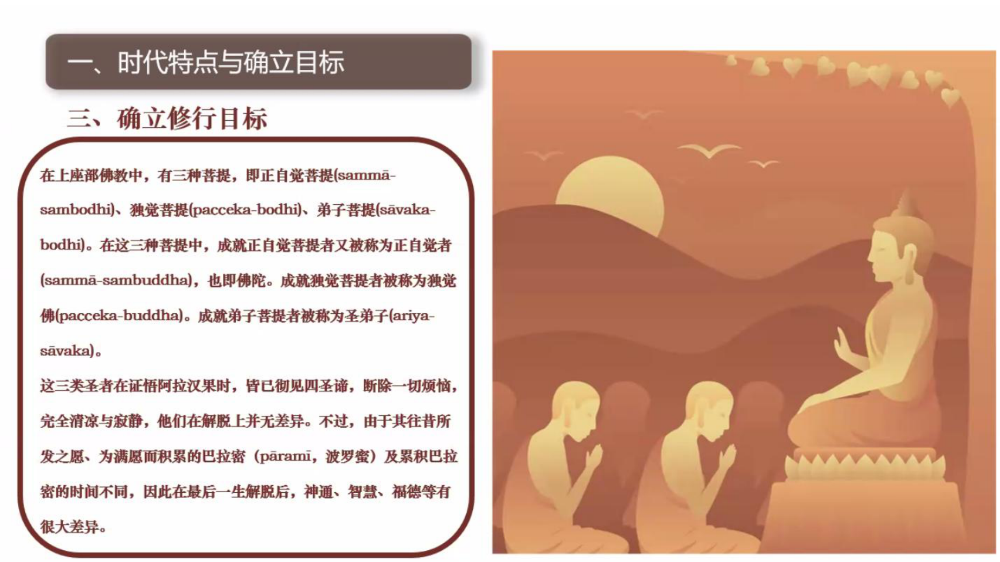
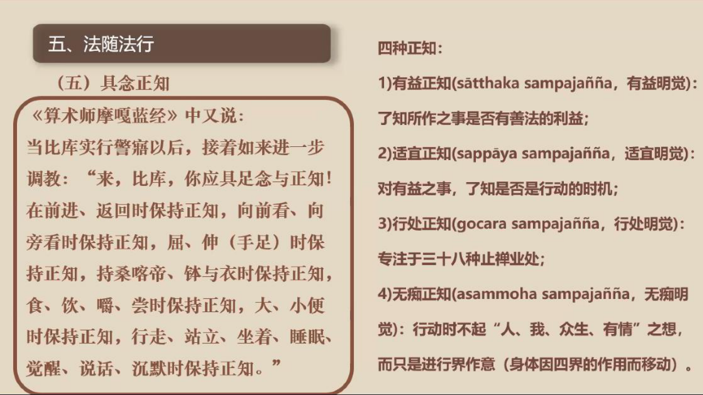

📅 最近更新：2026-09-22 22:05　|　第4周（2）日常姿势要点改为依《觉察姿势与动作》校对整理稿逐段照录（带 [mm:ss] 时间码）；去掉“整理稿/浓缩改写”与存疑标记；原文一字未改

> 🔴🔴🔴 **【存疑·未改】** 标记之间的文字＝红方审计判定「存疑、未改」之处，照录原文一字未动，待人工核实修改。
# 第4周：经行日常正念与修学规划（主持人版）
> ⭐ **本讲主持人速览**（新主持人必读，2分钟看完）
>
> 你不是老师，是"共学同行者"。你不需要懂禅修，只需要按流程走。本周由**连续两周内容合并**而成，含两段共读、两轮分享与两轮讨论。
>
> | 环节 | 标准时长 | ⏱ 时间不够→ | ⏱ 时间富余→ |
> |:-----|:----:|:-----|:-----|
> | 🧘 静心开场 | 10 min | 缩至5 min | 加2分钟静坐 |
> | 📖 共读原文1 | 20 min | 只读★核心段（约15 min） | 加读◈扩展段 |
> | 💬 第一轮分享 | 10 min | 每人1句话 | 每人3分钟 |
> | 🎯 第一轮主题讨论 | 10 min | 只讨论问题① | 讨论全部问题+扩展 |
> | 🧘 禅修练习 | 15 min | 缩至8 min（只念引导词前半） | 延长至20 min |
> | 📖 共读原文2 | 20 min | 只读★核心段 | 加读◈扩展段 |
> | 💬 第二轮分享 | 10 min | 每人1句话 | 每人3分钟 |
> | 🎯 第二轮主题讨论 | 10 min | 只讨论问题① | 讨论全部问题+扩展 |
> | 🔚 收尾与回向 | 15 min | 缩至10 min | 保持 |
>
> **主持人10条守则（精简版）**：
> > ① 不讲解、不提供答案——让原文自己说话；② 有人问"正确答案"→说"先听听大家的看法"；③ 冷场→主持人先分享自己的真实感受；④ 跑题→温和拉回："这个有意思，我们回到今天的原文"；⑤ 争论→"两种看法都很好，大家保留自己的理解"；⑥ 确保人人发言；⑦ 不评判任何人的分享；⑧ 时间到了就推进；⑨ 禅修练习照读引导词即可；⑩ 结束一起回向。

> **读书会01：禅修入门与基础 · 第4周（4周版 · 连续两周合并）**
> 主持人：你不需要提前懂禅修，按本手册推进即可。
> 本周主题：经行日常正念与修学规划。不打坐的大部分时间怎么保持正念——习惯机制、经行方法、四威仪日常练习；以及这四周我们学了什么、之后怎么走（修学规划）。
---
## 📋 本周信息卡

| 项目 | 内容 |
|:----|:-----|
| 时长 | 约120分钟（设计=2小时，按新流程弹性调控） |
| 核心问题 | 不打坐的绝大部分时间，正念怎么不断线？；这8周我们学了什么？两个月之后怎么走？ |
| 共读原文 | 共读原文1（原第7周）：① 习惯如何形成（云台寺安居禅修04·拆解习惯和经行）② 经行方法（云台寺安居禅修04·拆解习惯和经行）③ 四威仪日常练习（177讲·四威仪1＋觉察姿势与动作）　｜　共读原文2（原第8周）：回顾：① 8周回顾汇总表（资料包整理）② 三类菩提与发愿路径（如来禅修学体系17）③ 四种正知与三种远离（如来禅修学体系32）④ 把目标调整为可行（云台寺安居禅修13） |
| 本周作业 | 每天经行10分钟（读书会自拟作业量；慢走、觉知"抬—移—放—触"）；设置2个日常觉知锚点（原第8周无单独作业，可沿用本项） |

## ⏱ 时间弹性指南（本讲通用）

| 情况 | 应对方法 |
|:-----|:---------|
| **时间不够**（共读太长／讨论超时） | ① 静心开场缩至5分钟；② 两段共读原文均只读标注 **★核心** 的段落；③ 两轮分享每人只说一句话；④ 两轮主题讨论只讨论各自的问题①；⑤ 禅修练习缩至8分钟（只念引导词前半段）；⑥ 收尾回向缩至10分钟 |
| **时间富余**（共读快／讨论提前结束） | ① 用"📚 扩展内容包"中的补充原文段落继续共读；② 增加扩展讨论问题；③ 延长禅修练习时间；④ 增加"每人分享一个生活实例"环节 |

> 💡 原则：**讨论比读完重要，体验比讲完重要。** 宁可跳过扩展原文，也要让每个人都有机会说话。
---
## 🧘 静心开场（10 min）

> **开场破冰 · 暖场**（约 3 分钟）：这四周里，哪一次「只是知道」的瞬间让你印象最深？用一句话说说。
> （说完不必解释，为今天的收尾与展望铺垫。）

> **本期共同约定（心理安全）**：① **保密**——今天在这里说的话，留在今天；② **不评判**——不评价任何人的分享；③ **可随时暂停**——坐不住、心里不舒服，随时可以调整姿势、起身或暂停，不需要向任何人解释。

**主持人引导语**（照读即可）：

> 我们先静坐一分钟。闭上眼睛，回到鼻头、人中附近的触点。这是四周的最后一聚：不打坐的大部分时间，怎么让正念不断线——习惯、经行、四威仪；然后我们一起回看这四周学了什么、之后怎么走。只是知道呼吸在进出，安心坐下。（停顿60秒）
---
## 📖 共读原文1（20 min）

> ⚠️ 主持人操作：以下为完整原文文字，可直接照读或让大家轮流朗读，无需再去查知识库。出处信息见各材料下方。

### 原文材料①：习惯如何形成——跳蚤、乌龟与觉知锚点

> **段落优先级**：★核心必读（时间不够时只读★段）｜◈可选（时间富余时读）

- **标题**：云台寺安居禅修04-拆解习惯和经行-古源尊者
- **文件类型**：PDF（开示实录照录）
- **知识库出处**：知识库「古源尊者开示及上座部佛教资料」
- **media_id**：pdf_d0dd1c0cd17209afe241ece24bf6b7b4_f63405d7b12cce3377ade728557cb0927439961422831605
- **打开方式**：ima知识库搜索「云台寺 拆解习惯和经行」即可打开

> **【本周朗读段 · 开始】**（本段约 约3670 字，供中等稍慢朗读，约 25 分钟；其余为默读／选读／延伸内容）

> 📎 **完整原文见《原文全集》第二十二部分（云台寺安居禅修04·拆解习惯和经行）**，以下为相关章节完整文字（照录，未删改）：

**★核心段落**（必读）

**一、习惯的形成机制（一）：跳蚤实验**

> 一个科学家做试验，他们抓了只很强壮的跳蚤，把它罩在桌子上的玻璃罩里面，玻璃罩的罩子很高。然后每次猛烈的拍桌子，每拍一次桌子，跳蚤就使劲地跳，一般它都能够跳到超过身高 100 倍以上的高度，可以说是世界上最厉害的跳高高手。
> 接着，实验者开始慢慢地降低玻璃罩的高度，让跳蚤每次跳起来就能碰到罩子。连续几次以后，跳蚤改变了起跳高度以适应环境，每次跳跃总保持在罩顶一样的高度。随后实验者逐渐降低玻璃罩的高度，跳蚤又都在碰壁后主动降低跳跃高度，最后玻璃罩降低到接近桌面，跳蚤没法跳，后来跳蚤就不跳了，再拍桌子也不跳了。最后科学家把玻璃罩拿掉，再拍桌子，跳蚤也不再跳，所以跳蚤就变成爬蚤。
> 跳蚤为什么就变成爬蚤了呢？大家觉得是什么原因造成的？习惯？玻璃罩？还是科学家折腾呢？所以习惯，是在不知不觉中养成的，因为有情就是靠习惯活着。让跳蚤成为爬蚤到底是科学家还是玻璃罩还是科学家加玻璃罩，还是说是跳蚤的习惯呢？
> 其实，不能说爬蚤、科学家、玻璃罩彼此之间没有关联，都有关系，但核心是习惯，最主要是跳蚤没有觉察。跳蚤对被不断降低高度没有觉察，它不知道有人把高度降低。所以，当我们修行或学习遇到困难，也会有这样的习惯出现。

**习惯在修行中的显现**

> 比如说"我不行"，"我一定学不好"，"我一定克服不了，妄念就是这么多"，"我觉得跟以前比退步很多"...反正无论觉得是什么原因，就是搞不定了。
> 事实上并不是你学不好，只是习惯于学不好而已。觉得我就是不行，觉得我就是这个样子，养成了习惯。也有些同学说，我必须优秀，我必须很酷，我害怕看到人拉长着脸，我希望别人都快乐等等，也是习惯。跳蚤之所以这样，是因为它无法看到习惯形成的机制。
> 其实，从习惯的角度讲，我们并没有比跳蚤聪明多少。……但是，对于聪明的我们来说，同样被环境塑造而不自知。跳蚤是这样，人类也是这样。这种被环境塑造而不自知，就是无明和邪见这对元凶造成的。或者根源，我们总是看不到，其实是有人在整，玻璃罩不断地降低了，为什么看不到呢？因为没有念知，不能觉察。

**二、习惯的形成机制（二）：乌龟跑步机比喻**

> 有一个很流行的鸡汤，曾经在佛教圈里面也发过，我看到很多大 Bhante也在发，看了很无语，是什么呢？
> 把一只乌龟放在跑步机上，慢慢的加快速度，最后发现乌龟可以跑的飞快。他们以此说明乌龟的潜能尚且如此之大，何况人乎？乌龟都可以跑的快，你为什么不发挥你的潜能呢？这个观点，这个鸡汤，我就坚决不喝，如果我是那只乌龟，我下来一定给你一个耳光，你有没有一点龟性呢？你明知道我就是那点速度，你给我放到跑步机上，你不是摧残本龟吗？
> 不要拿龟玩命的速度跟兔子散步的速度比，玩命啊，兔子散步都比我快。最后害我这只老龟，一辈子看到跑步机都会发抖。我们要激励自己、超越自己，对要量力而行！
> 如果想要有兔子的速度，就要发愿成为兔子，成为兔子就可以跑。
> 兔子正常跑不要玩命，乌龟玩命还是赶不上它的。
> 说这个是什么意思呢？就是说：一、习惯的形成是无意识的，不知不觉就形成了。但很多人，想改习惯的时候，会设一个很高的目标。乌龟都可以跑那么快，你那么没用啊。不可以这样。
> 改毛病，首先要知道毛病是怎么形成的。我们所有的习惯，大部分都是无意识形成的，用佛法的语言来讲：其实就是没有念知的状态，你被一次次带走的。你就是这样习惯了。乃至于认为：我就是要靠这个习惯才能够有效地工作，有效率，才能够跟人沟通。成了一种无意识状态了。

**三、改变习惯的方法：把习惯变成有意识、设置觉知锚点**

> 所以要怎么办呢？
> 首先，要把不良习惯变成有意识，对那个习惯有念知。最近经常提到微习惯，微习惯要设置锚点。看到习惯以后要设置锚点。什么锚点（或者觉知点，好听点叫觉知点。）？就是你一碰到这样的所缘，或者这种环境，或者这种场景，或者心的这种状态，那个习惯会起来的，就要把所缘、环境、状态，设置为觉知点，一出现，马上觉知说：这可能会引发习惯，让习惯成为有意识的状态，有念知的状态，才有可能去改变它。
> 要有意识的慢慢训练让好的状态成为习惯，让好习惯也成为有念知、有意识的状态。一些行为因为不断地重复（重复缘的缘力），才能够成为好习惯，这个过程需要有意识地培养。培养到最后，良好习惯成为唯作，所有习惯成为唯作的状态。
> 这些能力无关学佛不学佛，世间的人要改变习惯,也要有念知，要训练，要一直不断地觉察，不然不可能被培养出来。

**◈扩展段落**（可选）

**四、培养好习惯的前提：喜欢与清晰的愿景**

> 怎样才能有个好习惯呢？要愿意有好习惯，喜欢这个习惯,有兴趣。
> 贤友问："Bhante,怎样才能够让修行上道呢？"
> 我问他："你喜欢修行吗？"他说不出来。
> 说不出来，又不喜欢修行，怎么可能修行会上道呢？你不想培养良善的习惯，不觉得良善习惯是非常想要获得的东西，怎么可能有良好的习惯呢？
> 要培养好习惯，首先要把好习惯描述出来，也就是愿景要清晰。
> 你觉得这个好习惯到底有多好，对你有什么样的影响，有多么重要，会给你带来什么样的利益？或者什么样的快乐？要清楚的描述。每天只要一想到这个，要干。……任何好习惯的形成，前提要喜欢这个习惯。对于能朝向善行的好习惯，往往都必须是心养成的习惯，都是非舒适区，都在挑战区。……这个过程还是要靠念知，所以说所有这些能力都要在觉察和禅修中获得，而且还要有办法。

### 原文材料②：经行方法——慢走、抬移放触与不批判的觉察

> **段落优先级**：★核心必读（时间不够时只读★段）｜◈可选（时间富余时读）

- **标题**：云台寺安居禅修04-拆解习惯和经行-古源尊者（同材料①）
- **文件类型**：PDF（开示实录照录）
- **知识库出处**：知识库「古源尊者开示及上座部佛教资料」
- **media_id**：pdf_d0dd1c0cd17209afe241ece24bf6b7b4_f63405d7b12cce3377ade728557cb0927439961422831605
- **打开方式**：ima知识库搜索「云台寺 拆解习惯和经行」即可打开

> 📎 **完整原文见《原文全集》第二十二部分（云台寺安居禅修04·拆解习惯和经行）**，以下为相关章节完整文字（照录，未删改）：

**★核心段落**（必读）

**五、禅修与经行要交替进行**

> 这两天大家因为环境的问题，经行比较少。我们要求长坐、短坐和经行要交替进行。长坐的人不要一股脑就是死坐，要坐 8个小时、9小时，然后连续坐一个月，最后就发现心突然间没力量了。这有太多的例子，我没有见到每天坐 9 个小时，然后连续坐半年这样坐下来的人。可能是我孤陋寡闻，没有看到过，他一定要出状况，突然间就没力量了。然后跟老师报告：没力量了。
> 其实，这样就是太作践心了，把乌龟当兔子看，不能这样。所以就要交替。不要讲说：哎呀，今天状态特别好，是不是要多坐一点，见好就收。长短坐和经行一定要交替进行。
> 对于初学来讲，如果没有安排长坐或者没有要求突破 3 个小时 4个小时，正常就一个小时到一个半小时，就要起来，然后去经行，觉察念知。……
> 为什么有些人说修禅的人总是呆呆的感觉，这是因为没有跟日常的念知结合，看起来有点木木的，所以就要求禅修与经行交替着进行。
> 这有助于调和内心的平静、寂静、轻安和精进力的平衡，有助于克服心的沉滞，或者心过度的兴奋。

**六、经行的基本方法：慢走、如实觉察**

> 现在环境还没完全好，可以在走廊、房间里练习，一定要练习。
> 对于初学者来讲，建议走得慢一点，慢才能觉察。
> 当然有些人慢，会起烦躁心。这得靠自己调整，但是至少要做到自然，简单、自然的经行，经行的时候专注脚和腿的动作。

**七、经行的步骤觉察：抬脚—推出—放下（抬移放触）**

> 以前讲经行要分成 5个步骤：如果觉得右脚要迈起，重心会向左移，然后右脚跟会提起来，然后抬起、推出去，然后会放下，踩到地上，然后重心会移到右脚，可以分成 5步这样来回。
> 如果觉得不方便，也可以只知道抬起、推出、放下 3步。实在不行至少知道在左边抬起，右边抬起，左边抬起，右边抬起，在移动，要这样觉察。这样觉察的要点在哪里？就是心不跑掉。
> 经行跟入出息一样，可以快数，可以慢数，可以数入息，也可以数出息，用各种方式来回换，目的就是让心不跑掉。
> 经行也是这样的，你觉得是要分多少个步骤来，少一点还是多一点，就在于能不能够如实自然轻松的觉察，同时又不会跑掉，以这个为原则。没有哪个标准是最好的，自己掌握，只要轻松，如实，自然，没有妄念，不跑掉，就是最好的。

**八、经行中的眼睛与转身觉察**

> 经行的时候，眼睛一般往前看三步、五步的地方，如果眼睛往外飘，马上要觉察：在飘，回来继续注意脚的动作。即使不是在经行练习，例如在服务，在走路，也应该这样，只要心开始飘：哦！国庆花开的好鲜艳啊！想去采，注意：想要，采的时候，知道采，采回来的时候内心升起来什么心？看到什么心？要及时去观察它。
> 经行的时候，走到尽头，准备要转身的时候，要观察，在快到头的时候，前两三步就会觉察到，想要转身，以前转身是无意识的转，现在转身就可以观察要向左转还是向右转。
> 为什么向左转向右转？一般来讲，如果是大众的经行道，老师会教：如果边上有上座，不能够在转身的时候把屁股朝向他，或者说边上有佛像，转身的时候不能把屁股朝向佛像，这是恭敬。你在觉察的时候要把这个带进去。如果没有这些所缘，但是会习惯性向左转或者向右转？就看说这个习惯性向右转向左转是谁在指挥？或者我想向右转，我想向左转，只是这样去觉察。

**九、如实觉察：不批判、不标记、不增加内容**

> 今天也有人问，在觉察的时候要不要去提到这是一个习惯，这是一个行动，这是一个什么感受？如实觉察当下的状态，知道就行，不要在上面增加任何内容。"这是一个不好的行为"，不要加这个内容，只是知道是一个行为，知道这个行为，心就已经知道，是好是不好，已经很清楚，不需要在脑子里面再加工。
> 很多人提到，比如修马哈西禅法的人说要有标记，其实马哈西西亚多早期的开示（当然我看不懂缅文）里面，我相信马哈西亚多没有要求标记，他说你不一定去用什么样的语言。当然，我们不是用马哈西的这种方法，但是念知都是一样的，念知并不是马哈西西亚多创造的。有些人说修过马哈西，用标记，建议你别用标记。
> 因为标记，标着标着就用脑子，就到脑子上去了。你只是去知道它……知道它就可以。甚至于脑子不要涌现出、浮现出那个字眼，或者那个声音都不需要，就是知道，心里是知道的。

**◈扩展段落**（可选）

**十、对妄念与影像的处理：不跟、不压、不批判**

> 如果在禅修，或者，在经行的时候，心里面会冒出来很多影像或者声音或者一些特别的图像，不需要去管它，心朝向那个目标，就知道朝向目标。在经行的时候，知道朝向那个目标就可以了。

> **【本周朗读段 · 结束】**（以下为默读／选读／延伸内容，时间富余时再读）
> 如果禅修的时候冒出来图像，你就知道这是冒出来的所缘，不理睬它，回到业处上。如果本身就在那打妄想，已经在那打妄想，就要去看它一下，看到它消失为止，然后再回到业处上来。这里面很重要一个，就是不要去打压它。说，哎呀，怎么又出来这个妄念。只要这样的一种批判的心出来以后，就已经解决不了这个问题了。
> 今天的禅修报告，跟大家讲，不要用世间所谓的修养、宽容、忍耐这种心去面对所缘，我怎么可以生起这种心呢？我怎么可以有这样的行为呢？我们要有修养。这里面都是各种批判和自责。即使不可以有这样心，你把它压下去。然后你会发现，在后面打坐的时候，那个东西不断地在冒出来，为什么？因为你没有解掉它，只是拿块石头给它压住。
> 所以最简单的（如果你不会三步法五步法）就是不断的看着它，不要跟着它，不要对冒出来的东西评判、批判、自责，或"某人不对"，"我不对"等等。看着那个心不要动都比去压住它要强。
> 当有影像出来，或者心又开始根据这些声音和影像跟着去联想，去浮想联翩，去放电影的时候，其实心就已经完全被带走了。如果中间有一下子回来说，怎么去放电影了，不要批判自己。我一直在讲不要批判自己，马上回来鼓励一下心说，我正念知道，我在联想了。鼓励一下心，完了以后知道刚才去联想，刚才放电影了。只要心转化掉，它就会慢慢没有力量。
> 但是如果你说：怎么搞的，这种念头还起来呢。那个念头就永远都去不掉，它会一直缠绕着你，为什么？怎么还会起来？你的心其实还在那个念头上，还在那个所缘上。……唯一的办法就是说，我看到你了，我有事，再见，它就这样过了。
> 这就是很重要的一些点，看起来很不经意，但是其实在日常禅修的过程中，它总是会不断的出现，所以，希望大家（今天第 5天）能够开始慢慢地增加经行，禅坐和经行交叉起来，日常的念知跟思惟习惯的观察能结合起来。祝福大家！

### 原文材料③：四威仪日常练习——行住坐卧皆觉知

> **段落优先级**：★核心必读（时间不够时只读★段）｜◈可选（时间富余时读◈段）

**（1）四威仪经文与零基础日常练习**

- **标题**：177讲-摄集-摄菩提分-身念处-四威仪1-古源尊者-20211022（共修版）
- **文件类型**：PDF（共修版）
- **知识库出处**：知识库「古源尊者开示及上座部佛教资料」
- **media_id**：pdf_d0dd1c0cd17209afe241ece24bf6b7b4_b4762eca9f1f5d4202505dd7c0a519387439961422831605
- **打开方式**：ima知识库搜索「177讲 四威仪」即可打开

> 📎 **完整原文见《原文全集》第二十三部分（177讲·身念处·四威仪1）**，以下为相关章节完整文字（照录，未删改）：

**★核心段落**（必读）

**《大念处经》四威仪经文**

> 今天学习四念处二十一种方法中身念处的第二种方法——四威仪。在《大念处经》中，佛陀如此开示：
> 「再者，诸比库，行走时比库了知：『我正在行走。』站立时他了知：『我正站立着。』坐着时他了知：『我正坐着。』躺着时他了知：『我正躺着。』无论身体处在哪一种姿势，他都如实地了知。」

**（一）如实了知：四威仪的核心要义**

> 现在来学习四威仪（身随观）。佛陀说"诸比库，行走时比库了知：『我正在行走。』"，对应到身念处的身随观就是威仪路的部分。无论身体所处行住坐卧任何一种姿势（行住坐卧只是总和，还有很多姿势，比如站着时有很多动作），都要如实地了知。
> 修行四威仪的开始阶段。行走为何产生？谁在行走？行走是谁的？如何了知呢？

**零基础学员的日常四威仪练习（一）：先只是觉知身体的动作**

> 对于一位尚未证得名色分别智、缘摄受智的禅修者来说，如果想修行威仪路，应该用什么样的态度呢？目标也要能生起这样的心"谁在行走？行走的是谁？行走为何？"。在以前的课程中讲过，一开始你可以不这么想，只是走，但是要知道身体的动作，要尽量地觉知。当你能够两、三个来回都能做到觉知没有妄念时，可以起一个念头"谁在走路？我为什么这样走路？我走路为什么这么大步？我为什么不能快一点走？为什么不能慢一点走？转弯时为什么我向左转？为什么向右转？"可以产生这样的疑问去问自己。

**零基础学员的日常四威仪练习（二）：心驱使身体才能动作**

> 身体的动作由心驱使。当一位禅修者还未证得观智（名色分别智、缘摄受智）时，在日常经行如何去体验"谁在行走？"或"行走者是谁？"由于看不到完整的色聚以及每个色聚里的究竟色法，特别是不能立即清晰地看到无常、苦、无我三相，帕奥西亚多说"当我们只是了知身体的动作时，这是不够的。"为什么呢？因为它不能帮助破除我见——我在行走和我想。
> 在还未能完整清晰照见时，如何破我见和我想呢？可以从这个角度去观待：先观察你在行走，虽然还看不到名色法，但你知道你在行走。在行走时，当能熟练地让你的心回到当下，这时可以起这样的念头："我为什么这么行走？为什么我不能慢一点？为什么我不能快一点？为什么我总是向左转而不是向右转？"……如果你有我，那我是谁呢？我是那个观念？我是那个老师的教导？从这个层面可以看到：我们所有行住坐卧的行为，都是受你背后的心的驱使，受心的驱使身体才能动作。
> 同样地，在经行、走路时，脚提起来向前伸出，我们知道是身体里"要经行、要提起、要放下"的心产生的心生色聚里面的火界带动着身体的其他四种色聚在移动。能如此标记时，虽然还没有观智，但生起的是有智慧的想。为什么呢？因为你将破除"有一个我在行走"的固定的认知方式。再次提醒大家，帕奥西亚多说"仅仅正念是不够的。"

**零基础学员的日常四威仪练习（三）：随顺于佛陀所教导的念知方法**

> 对于一个还没有获得名色分别智的人来讲，日常中并非在修习真正佛陀所教导的四念处，那平时要不要练习四念处呢？我认为是必要的。如果你是位止观行者，修习十年都没有获得名色分别智，那你在行住坐卧时要不要念知呢？如果你觉得需要念知，该以什么样的方式来念知呢？这样的念知是不是随顺于佛陀所教导的念知方法呢？须思考。我认为至少必须练习随顺于佛陀所教导的这样的念知方法。什么是"随顺于这样的念知"呢？首先，生起对于念知、了知过程的认知是有慧的，要有智慧。……首先，要看到贪心和瞋心后面的动机，看到动机其实就是后面的标准，标准其实就是我们的见解……当如此观察时，就是有慧的观察，只是这个慧没有观智那么强。
> 慧根的特相是透视究竟法，对于不能透视究竟法的人，难道就没有慧根吗？显然不是。……只是在世俗上（没有观智时）生起的慧没有观智那么强，低阶的观智没有高阶的观智强，世间的智慧没有道智的慧强，但是不能说他没有慧。

**观禅深入部分提示**

> （观禅深入部分将在四念处读书会深入，此处仅作提示）原文提示：行走的时候，系统地观照五蕴。如果想在行走时真正地以观智照见五蕴，我们必须系统地修行四界差别……然后必须观照五蕴及其因是无常、苦和无我。

**（2）日常姿势要点：坐、站、走的身体觉察**（◈扩展，可选）

- **标题**：觉察姿势与动作-古源尊者-20230703
- **文件类型**：录音转写（**校对整理稿**，逐段带时间码；非浓缩改写）
- **知识库出处**：知识库「古源尊者开示及上座部佛教资料」
- **media_id**：soundrecording_d0dd1c0cd17209afe241ece24bf6b7b4_d39173f04ff1d8ff916690d7aa10d3a97439961422831605
- **打开方式**：ima知识库搜索「觉察姿势与动作」即可打开

> 📎 **完整原文见《原文全集》第二十四部分（觉察姿势与动作）**。以下**照录**自知识库《觉察姿势与动作-古源尊者-20230703_校对整理稿》（录音时长约 33 分钟）；各段前置原录音时间码『分:秒』，便于回听核对；**原文一字未改**（开篇礼敬与致谢从略；现场互动、听不清处以「……」保留原样）。

**◈扩展段落**（可选）

> [01:15] 我想给大家说一点比较实用的东西。大家都喜欢禅修，而禅修呢，四种威仪都可以修，行住坐卧都可以禅修。
> [01:36] 佛陀比较常用、或者赞叹的是坐姿，所以正确的坐姿就很重要。
> [02:00] 我们看看，坐姿是跟我们的骨盆有关的。我们看看自己平常坐的时候会是什么样的一种状态。这种是正确的状态；这一种呢，是我们大部分人会有的——就是骨盆后倾，其实就是把腰拉下来、背弯出去。
> [02:27] 还有一种，是故意挺起来的，这种叫骨盆前倾。站的时候也会有这样的情况。而骨盆中正的情况下——
> [02:44] 我们会看到，这个头部下来，到腰部、到他的这个坐骨，三点成为一条线，这是正确的。不管是坐还是站，都是这样。从头部到这个腰——你看，我们讲的百会穴，从这个百会穴对下来，到腰凹进去的这个弯点，以及他坐下来的这个坐骨，
> [03:11] 这三点要成一条线。就是百会穴在这里，顺着脊柱一条线下来，就是这个腰骨，这条线下来，到我们的坐骨。坐骨就是这两个尖尖的地方，也就是大家坐在凳子上最受力的那个点，就是坐骨。
> [03:41] 好，那这个头下来到这里，跟坐骨的正中间，这条线成为一条直线。
> [03:52] 成为直线的时候，我们身体是一种自然的状态，各个部位的受力都会均衡，不会造成不正确的磨损。
> [04:12] 那这个正确的坐姿要怎么来观察呢？就是骨盆中正的时候——
> [04:23] 我们这个脊柱沟。大家看这个小孩儿，他的脊柱是有一条沟的。大家可以自己摸一下，你现在坐的时候有没有脊柱沟。有吗？脊柱沟都跑哪里去了？我们大部分坐的时候，因为骨盆前倾，所以你的脊柱是鼓出来的。你如果是自然地一升起来、头一拉起来的时候，那个脊柱沟就会出来。大家再摸摸看。脊柱沟出来了，但你要再摸一下这两边的肌肉，
> [05:01] 它不能紧绷，就是这两侧的腰肌不能紧绷。如果紧绷了，说明你撑着了——你是撑起来了，但腰肌会劳损。所以正确的呢，是脊柱沟起来了，但两边的腰肌是松软的、不用力的。
> [05:23] 那么你就要去调，坐的时候就要调到这样一种状态。没有调到那种状态，你是撑出来的，就坐不久，不是腰会受伤，就是会酸痛。
> [05:38] 那……请〔你〕来示范一下。不好意思，难受。对，这样不够。那就得换一换。弯腰呢，他这个其实还好。正常两条脊柱〔肌肉〕就会很硬，弯腰的这个还能再恢复正常。
> [06:05] 这里有一个简单的脊柱沟，然后这两条〔腰肌〕。你再放松一点，骨盆前倾一点点，一点点。嗯，不对，骨盆前倾，就是你的胯往里面摆一点点。……你自己摸这两个〔髋〕关节。对，你双脚自然前伸，摆正，不能打开。对。然后头呢，你感觉像一个气球这样，升上来。好，你再摸一下。
> [07:02] 就松下去了，对不对？所以他这个身体是整体的，不是你想让哪个地方松就能松。他这个头、肩膀跟这个上肢、这个胯〔髋部〕都要配合，脊柱沟才会出来，而且这两边还是软的，所以它是一个整体。
> [07:32] 也就是说，我们怎么判断你的站姿和坐姿是正确的？摸一下那个脊柱沟。有沟，而且两边这两条脊椎、这个腰肌是软的，那就是正确的；那如果是没有脊柱沟，或者有脊柱沟但腰肌是硬的，那就是不正确了。
> [07:57] 那调什么呢？其实就是这个从上到中到下不中正。所以你要么调你的头，看一下你的头，然后再看一下你的脚。我们今天先讲坐姿。这个是坐在凳子上的人，你会看——正常的坐呢，就是你的骨盆会往前一点点，因为它〔坐在凳子上〕不是吊着的，没办法去调，它就是骨盆会往前一点点。……它这个骨盆没法动，所以他这样就不行，就死掉了，不好。
> [08:56] 来，换一个。也就是你坐着的时候，骨盆是往前一点点。但我们大部分的人呢，一坐下来他就往后，往后就骨盆后倾，然后就会让你的腰椎二、三节很受力。如果是盘腿坐呢——比如我们现在大部分人坐的〔散盘〕，两个脚就会翘起来，对吧？那为什么呢？因为这个髋关节外旋的能力不够，外旋能力不够，所以它放不平；放不平，他就要用两个脚撑起来代偿，然后他背后从颈椎、到这个腰肌就会受力。受力时间长了，你就会坐不久，然后酸痛。
> [09:45] 那么正确的坐姿呢，是要这样：让骨盆中正，也就是说，这个脊柱是一个自然的生理曲度。那这个坐垫呢，你看，我们家的坐垫都是这种靴型的，这种坐垫。那如果你的骨盆、我们的髋关节外翻的能力没有被训练，那你这个座位就要尽量地坐高。
> [10:17] 我们初学的人呢，不建议现在你就做单盘或者双盘。当然双盘呢，因为你的髋关节外旋能力不够，所以你双盘或者单盘，他就会用那个膝盖来代偿。
> [10:35] 那坐久了膝盖就会出状况。这个膝盖，你看，正常的是这个髋关节要有这种外翻的能力，外翻能力完以后……（现场示范，对话较乱）。他这只是一个简单的讲解，不是那种完全〔标准〕的，所以他髋关节这个外翻能力，是要能翻，翻完以后你这膝盖起来，这边才不会受力。那如果髋关节这个外翻的能力没有展开，你这样再盘起来，这个地方就要打开，时间〔一长〕，然后这边就会受压，受压完以后，这膝盖就会痛。
> [11:17] 它是这样一个原理。那我们要怎么垫呢？一般你自然地散盘，就要垫到这两个膝盖，〔膝盖〕大概会下来，同时你摸一下你的腰背。
> [11:42] （现场互动）……坐下来。对，你自然〔弹〕一下。……现在没有〔沟〕对吧？然后呢，你感觉那个头像一个氢气球一样，自然地往上飘，你看，自然往上飘。对。……它就出来一点点，就感觉出来一点点。对，还不够放松，还是不够高。……你再试试看。这个有点高了，稍微〔调〕一下会下来。
> [12:38] 那你看，你自己再摸一下，它就〔凹〕进去了，对吧？这两条基本上就有点松了。
> [12:48] 那为什么现在不会松呢？……这个地方要给它〔调〕过来，不然你要撑的嘛。……这样〔调〕是对，就松下来了，对吧？
> [13:07] 对，又松下来。以现在这个腿的状态呢，你基本上就要做到这么高，而且你要把它练起来，那你就可以持续做一段时间，比如做个半个小时，你就可以〔坚持〕了，是吧？……不过我们这个蹦出来了，对吧？出来了，现在还没有完全松，但是已经比刚才好多了。那就是你要做这个座位的调整，尤其是前面这个，这个〔调〕得还是不够，只要调到你就很舒适的、自然的状态，就是这样，你要去感受，那就会舒服一点。对，那舒服多了。
> [13:52] 谢谢，谢谢。所以，那么这个坐姿呢，我们就是回去……如果你们想坐长〔时间〕，他就需要有这样〔充分〕的准备，不然你坐的时间长了，腰就会受伤。
> [14:12] 所以这次我给大家建议说，你们要带那个大毛巾，有没有带来？……对。那对大部分〔人〕呢，你们自己试一下，就是因为这个〔人〕呢，他可能原来没怎么做对，所以他这个〔要调〕得多；大部分人还是可以的，就稍微调一下就可以。大家可以感受一下。
> [14:37] 那这个是……这是一个坐姿的角度。那我们看看——其实我们的坐跟我们站是有关系的。平常我们可以自己对着〔镜子〕，或者请别人给你拍个照片，就是我们站立的时候，我们很多人的头是前倾的，或者年纪越大就会这样，最后就歪下来，就变成这样。头前倾呢，它就会有这种情况，随着年龄的增长，就会这样弯腰〔驼〕背。我们走路的时候要养成一个习惯，不要低头走路。还有，平常我们大家都在玩手机，玩手机就很容易是这样，
> [16:03] 然后他整个骨盆、这个脊柱它是这样的，时间长了这边就会长一个大大的富贵包。富贵包长起来以后，
> [16:12] 你的颈、头部的供血就会受到严重的影响。还有，躺卧的时候的姿势，我们也要看：正常的话，我们的枕头的高度，要让我们的整个脊柱是一个平衡的状态、一个正常的状态。如果枕头太高或者太低，都会出现这种你的脊柱不能够在一个正常的生理曲度，时间长了就会有代偿。
> [16:59] 所以刚才我们看到，头部跟我们的腰部是直接相关的。那这个整体呢，我们这个身体是几个部分：一个是头颈，一个是肩、跟上这个上部。其实呢，我们这个下来是一个倒三角，对吧？头部下来是一个倒三角撑着，然后这个髋关节，它是一个正三角。头部一个倒三角，一个正三角。这三个呢，要处于一种中正的状态。
> [17:43] 我们在调姿势的时候，一般先从头部开始，头部、这个颈部不能够造成挤压。那头部开始怎么调呢？就是你要想着你这个头，像一个氢气球在往上飘。那以前练过气功的人有人讲说，要头顶上像一根绳子一样把你拉上去，拉上去完了以后，你要再放松掉、放掉它。那如果你想象这个气球上去，它就不会被往上拉，就是往上飘的这种感觉。
> [18:27] 道家讲叫虚灵顶劲。它真正达成的虚灵顶劲是什么意思呢？就是你的身体这个气血足够，它能够把每一个关节顶开、自然顶开、蹬开、撑起来，然后这样顶上去。
> [18:44] 禅修修得好的人，很多人就有这种感觉。所以虚灵顶劲并不是故意这样做起来，它是一个〔状态〕：你定力够的时候，然后你的气血够了，它自然就撑上去。
> [18:58] 那么我们在这个禅修开始的时候，要先练习，让他这个身体自然中正就可以。所以对头部呢，是感觉像有一条线拉着，或者一个氢气球往上往上顶。那如果你做不到的时候，特别是你头很容易仰着的人、喜欢这样仰着的人，那你就是把两个手放在这个后脑勺，我们讲的这个枕骨这个地方，轻轻地〔把它〕往上推，就是往上推一下，然后你自然这个头就会正了。
> [19:37] 就先调这个头。头调完以后呢，你轻轻一放，这个头就放在这个肩膀上了。那放在这个肩膀上呢，它正确的姿势是什么呢？就是这个耳朵、这个耳垂，跟肩膀成一条线，或者一个平面，自然地在一个平面上。
> [20:05] 那么再下来呢，就是这个胸腔。胸腔要打开，怎么打开呢？我们讲——
> [20:16] 大家记得，最好比如说你的手臂向前、这个肩部向前，然后绕一下，你感觉往后压，就感觉那个肩颈后面的肩胛骨是向那个脊柱压过去，压过去，然后一放下来，你的胸部就挺起来了、自然挺起来了，对吧？
> [20:37] 一个手一个手来，不要一个手〔两〕个同时来。……轻轻地放下来，然后这个手。好，轻轻地放下来。正常来讲呢，你放下来以后，这个手是自然地这样往前的，对吧？这个手指头是这样自然往前的。所以我们转完以后这样放下来，如果你要两手搭着，还这样就是刚刚好的。那么这样转完以后，特别我们容易驼背的人，就是经常这样转一下，然后他这个胸腔是自然打开，然后这个胸部呢，它会自然有一点点曲度往前。那么这样调完以后呢，
> [21:22] 你就感觉这个下来——你就感觉你的骨盆跟头是正的，然后胸腔是打开的。然后你的骨盆在一个中正的位置，是什么位置呢？
> [21:33] 就是你的百会穴，对下来这个喉管里面的喉结，再往下呢，就到那个腰椎、腰椎〔往里〕凹进去的地方，下来到我们这个坐骨的正中间，它是一条直线。这样呢，那这个胸腔跟腹腔，它是一个自然的关系、自然的连接关系。好，那么这样下来完以后，怎么〔知道〕这是正确呢？
> [22:03] 还是摸那个沟，摸那个脊柱沟。如果你〔觉得〕不对呢，再往下就看你的脚，看你的脚有没有站对。正常呢，这个脚要站对，是两个脚自然地前伸。你不能这样，或者这样——内八字和外八字都不对，这是一个正常向前的状态。向前一个状态呢，这个膝盖微微地前屈，然后头部往上飘、再下来中正。那你摸一下这个腰椎，如果是有腰沟、有这个脊柱沟，然后两边是松的，就 OK。那如果觉得不对，那就肯定你这个髋关节是有问题。
> [22:57] 或者，我们有一些人的这个脚掌、足弓——足弓它是扁平足的这种。那扁平足有些是天生的，有些是不良的习惯造成的。那不良习惯造成的应该怎么办呢？
> [23:11] 要练习。像比如说我就有一点小扁平足。那它怎么做呢？
> [23:21] 就是我们这样站着，大家可以起来试一下，起来站一下。那如果没有五指袜的，可以把袜子脱掉。你感觉到这个自然〔要〕前倾，就是两个脚平行。好，然后这个五指呢，你抓地，五指要抓地。对。好，那么五指抓地呢，你先比如说右脚先把脚抬起来，然后这个五个脚趾头呢，
> [23:57] 五个脚趾头呢，抓着地，然后你感觉到这个脚后跟——就是……如果这〔底下〕是一张纸，要把它撕开一样，就是可以转一点过来。好，这个时候你看，这个足弓就出来了，对吧？这样撑起来。然后呢，脚后跟进〔旋〕——就是脚趾头不动，但脚后跟尽量往内旋，然后翻出来，哦，这个足弓就出来了。
> [24:25] 对吧，那你站立的时候呢，如果你的足弓比较平，你就怎么样？拉一下。然后这个时候你会发现呢，就这样转完以后，这两个腿呀，你再感觉一下，往边上旋一下，再往两边旋一下。这样旋是什么感觉？就感觉你的臀部是有点〔被〕夹起来〔往上〕的，这样给它夹起来。好，那这个站好以后呢，
> [24:49] 头部再飘上去，然后再转一下这个前胸，再感觉这个头部、前胸跟腹部，它是一个自然中正的位置。然后膝盖微微地屈、弯曲一点点。然后你这时候再摸一下你的这个〔足弓〕，你就会觉得它是自然的，然后两边走。所以人体它是要这样的，你要去观察它。
> [25:22] 那么为什么讲这个呢？就是你正念认知，你要觉察、觉察你的身体有没有平衡，有没有哪一个地方太用力、着力。你一着力呢，就一样，一定有某个地方他要代偿、要受偿。
> [25:38] 所以今天那个老先生讲说，那个髋关节、这股骨头也磨坏了，为什么呢？就是他走路的时候，肯定骨盆有问题，要么前倾要么后倾。我估计以他的风格，就有点〔前倾〕，前倾的多，那他这边就会磨掉。因为他其实你看他这个性格，他就是年轻的时候可能〔就这样〕，他就会磨掉。好，那么其实呢，这个就是先给大家突出讲这一些知识了，我们讲行住坐卧的一些姿势。好，那么我们还有一些日常要觉察的，
> [26:56] 比如说你站立，就标准的受力，刚才我们讲到了，就是说两个脚要平衡、自然向前。但是我们很多人一站，你自己看一下，你会发现这个跟骨会外翻，或者跟骨会内翻，就是内八字、外八字的这种情况。你只要内八字、外八字，然后你的脚踝——就是对，就标准的这种受力是这样的。然后如果你是外翻或者内翻，那你的脚踝就会受力，就会有代偿，然后你的膝盖就会有代偿，然后你这个髋关节就会代偿。
> [27:38] 那我们的身体的关节，其实是这样：这个踝关节，它是可以动的，大家可以〔转〕了，可以动，但膝盖是不能随便动的，它只能前后；再往上呢，这个髋关节它是可以动的，但是腰呢是不能随便动的，它也是只能这样；然后再往上呢，这个胸，它是可以动的、可以延展的、可以展开的，但是这个脖子是不能随便动的。所以它刚好是一个一个这样连上来。
> [28:14] 所以，如果我们全身只要有一个位置没有正，全身就不正。那只要有一个地方没有正，你的坐姿、你的站姿就会受影响。
> [28:26] 所以呢，我们讲内八字、外八字，它最后你看，它所有东西都影响到——从踝关节到膝关节到髋关节，它都是影响到。在这个〔状态下〕，大腿内旋，然后骨盆前倾，那足弓就会塌陷，像这种形式。就是我们要去注意到。但是呢，你如果有这个习惯，第一个是我们要觉察到我们这个习惯，但你不是一天就能改过来的。当你知道正确的是什么完以后呢，你平常在走路的时候，你有觉察它，它就是一种〔练习〕，而且对你的这种姿势的矫正很有帮助。
> [29:12] 好，那因为时间的原因，我们不能讲太多，因为它内容很多。
> [29:17] 我们再讲一下这个走路，就下肢的稳定。下肢的稳定呢，它就是刚才讲的，我们说那个足弓要出来，然后髋关节它要有点外旋。
> [29:36] 然后走路的时候呢，比如说我们往前走、送出去的时候呢，
> [29:40] 他要用臀肌的力量。所以大家可以摸一下，如果你的臀部没有什么力量、或者软软的，那就是你走路不是很正确。
> [29:56] 比如说，我们正常来讲，我们说这一脚抬起来，重心会移到这里来；我们左脚要先走，这个重心会移到右脚上来。那这个时候呢，
> [30:10] 你这个脚呢，〔处于〕一种非常放松的状态，就是这样子，就是这样的一种状态，就不能有硬硬的。比方说我们一直要用劲，那就不对；在这个时候，就是很自然的一种放松的状态。好，那这个抬起来完了之后，它送出去呢，是由这个右脚的臀部——你就感觉右脚这个臀部有点力量，就往前推送出去。然后回过头来是这样的，这个脚也是放松，然后这个左脚呢，这个臀部它有点力量，往前推送出去。
> [30:42] （现场提示）你要拿话筒，他们才听得，你要拿着话筒，他们才听得，
> [30:48] 不然听不见。他们不在场，跟他们讲不清楚，就在线上呢，就是没有办法。
> [30:58] 就大概就是这样，因为只能很简略地跟大家说一下，因为时间不够，因为大家只有一两个小时时间了。就是知道我们坐的时候怎么来看自己正确，站的时候怎么看自己正确，走路的时候怎么看自己正确。
> [31:17] 那其实呢，就是把握一点。你身体很复杂，或者说又是整骨、又是解剖，但是呢，有一点就是你要中正，从头到胸要中正。你只要中正，然后你就能摸到那个脊柱沟，而且两边是软的，那你是正确的。然后呢，走路的时候你是正的，你不要外翻，你不要内翻，〔不然〕你就会代偿。
> [31:43] 所以它其实呢，不管是身体，还是我们的心，它都有一个原则，其实就是一样：你要中正，要开放，要放松。只要你有任何的紧张，你就有问题，身体有问题，心有问题；那你心有问题，它就会体现在身体上。同时呢，你身体被〔你〕搞了很长时间都是紧的时候，你回来还要影响你的心，
> [32:06] 所以我们讲，不管是你想身体好，还是你的心好，还是修行，身心都要统合。
> [32:15] 我们古人讲叫调身、调心、调息。虽然说他很多调身、调息都没有调对，但是呢，他这个理路是对的，就是他要调身，然后要调心，然后调息，这样的一种说法。
> [32:33] 好，那我们〔关于〕知识的问题呢，大概就跟大家分享到这么多。就是提醒大家呢，就是你的觉察的时候，其实是以身体作为一个基本对象。那这样的觉察呢，它是有一些原则的，就是身体的正确姿势的原则，并不是说随便就这样走就对。
> [33:01] 当然，如果你对这些知识不是太了解，那么我们就把握一个点，就是说放松、〔中正〕，中正放松——就是你随时可以观察你有没有中正放松。中正呢，就是你不会偏；放松呢，就是你不会紧绷。好，那这是这个身体的角度。
---
## 💬 第一轮分享（10 min）

> 每人轮流分享：「最触动我的一句话／一个观点是什么？」（不评论他人）
> 时间紧时每人一句话即可；冷场时主持人先分享自己的真实感受。
---
## 🎯 第一轮主题讨论（10 min）

**主持人引导**：朗读下面3个问题，让大家自由讨论。**你不提供答案**，只引导。

**讨论问题（按优先级）**：
- **问题①（★必答，时间不够时只讨论这个）**：跳蚤实验照见了你的哪个"习惯性天花板"？（比如"我不行""我一定学不好""妄念就是这么多"……那只看不见的"玻璃罩"，在你的生活或修行里是什么？）
- **问题②（◈选答）**：经行的"抬—推—放"三步里，哪一步最容易丢？丢的时候，你的心一般跑去哪里？
- **问题③（◈选答，时间富余或大家感兴趣时讨论）**：给自己设计2个"觉知锚点"（如每次开门先觉知一次脚触地）——当场说出来，大家一起帮你看看可不可行、够不够小、容不容易忘。

---
> **分层追问**（可视时间取用，由浅入深）：
> - 【现象】除了打坐，你一天里走路、吃饭、洗碗的时候，有多少时候是知道自己在做什么的？
> - 【影响】你有没有过走着走着，回过神才发现，刚才那几分钟完全不知道经历了些什么？
> - 【应对】这周挑一段路或一顿饭，只做这一件事，感受脚落地或咀嚼时那十秒真实的触感。
---
## 🧘 禅修练习（15 min）

> 💡 本周由连续两周合并，含两段原周次的禅修练习引导词；时间紧可读其一，或各取前半段（合计约15分钟）。

### 禅修练习（原第7周）

> **练习提示（禁忌与安全）**：如有严重身心疾病（重度抑郁／焦虑发作期、精神障碍等）、近期手术或严重心血管疾病、孕期或有医嘱限制者，请先咨询医生、量力而行；练习中若出现强烈不适，可随时睁眼、停止、调整，或改为静坐观察。

> ⚠️ **禅修禁忌提示**：若你正处在严重抑郁、焦虑、创伤后应激，或精神类疾病的发作／用药期，或正经历强烈的情绪危机，请先咨询医生或心理师，再决定是否练习；练习中若出现明显不适（如心悸、胸闷、情绪失控），请立即停止，睁开眼睛，把注意力放回呼吸与身体，必要时离场休息。

> ⚠️ 主持人操作：照读完整引导词即可；本周练习为经行，请提前安排一段能来回走动的空间。

> 本周的练习不是坐禅，是**经行（在行走中觉察）**——不需要任何基础，找一段能来回走的直线（会议室、走廊都行）。成员中途想坐下休息、随时打断都可以——本周的功课本来就是"少坐多走"。

**引导词**（照读版）：

> 本周的练习不是坐禅，而是经行——走动不便也没关系，坐着觉察脚触地，同样有效。（停顿）
>
> 请大家起立（或原地坐好），找一段能来回走五到八步的直线。我们慢慢来，这几分钟只属于你的脚。（停顿）
>
> 先在起点站定，两脚分开与肩同宽，眼睛垂下或轻轻闭上，感觉全身站在地上：脚掌与地面接触的感觉，身体的重心，大概有一点点晃动，都知道。（停顿）
>
> 现在慢慢睁开眼睛，目光放在前面大约三到五步的地面，不看远处，不东张西望。
>
> 我们用最简单的三步来走：右脚准备抬起来的时候，知道"抬"；脚往前移动的时候，知道"移"；脚放下去、踩到地上的时候，知道"放"，感觉脚底接触地面。然后换左脚，同样：抬，知道；移，知道；放，知道。（停顿）
>
> 走得越慢越好，慢才能觉察。不用数数，也不用在心里念很多字，心里知道就够了。平衡不好就走得自然一点，我们不是走给别人看的。（停顿1-2分钟，让大家走几个来回）
>
> 走到尽头，准备转身的时候，前两三步就会觉察到"想转身了"——向左转，就慢慢地知道向左转；向右转，就慢慢地知道向右转；转过来，站一下，继续走。（停顿）
>
> 走的过程中心跑了——去想工作、想晚饭了——不用责备自己，知道"跑了"，轻轻把心带回脚上的动作。回来一次，就是一次正念。（停顿）
>
> （约10-12分钟后）好，现在停在哪一步都可以，站定，感觉两脚踩在地面上。今天回去的作业，就是每天这样走10分钟。本周也可以少坐一点、多走一点——坐禅和经行交替，心才会有力量。

---
### 禅修练习（原第8周）

> **练习提示（禁忌与安全）**：如有严重身心疾病（重度抑郁／焦虑发作期、精神障碍等）、近期手术或严重心血管疾病、孕期或有医嘱限制者，请先咨询医生、量力而行；练习中若出现强烈不适，可随时睁眼、停止、调整，或改为静坐观察。

> ⚠️ **禅修禁忌提示**：若你正处在严重抑郁、焦虑、创伤后应激，或精神类疾病的发作／用药期，或正经历强烈的情绪危机，请先咨询医生或心理师，再决定是否练习；练习中若出现明显不适（如心悸、胸闷、情绪失控），请立即停止，睁开眼睛，把注意力放回呼吸与身体，必要时离场休息。

> ⚠️ 主持人操作：照读完整引导词（整合8周所学：坐姿三要领、感恩身体、触点与呼吸、细相不追不赶、以回向心结束；改编自《禅坐引导文》与各周原文，**非逐字照读**）。

**引导词**：

> 请大家自然地坐好——骨盆坐稳、身体中正，散盘、单盘或坐在椅子上都可以。头轻轻往上顶，像氢气球往上飘；肩膀松下来，胸自然打开。（停顿）
>
> 先花一点时间，感恩身体：这8周里，是它支撑着你每一次行走、站立、坐卧、禅修。从头顶到脚底，哪里还紧，就请它再松一点。（停顿）
>
> 现在，把心轻轻放到鼻头、人中附近——气息进出时碰到皮肤的那个触点。气息进来，知道进来；气息出去，知道出去。长的时候知道长，短的时候知道短；只是知道，不控制，不评判。（停顿2-3分钟）
>
> 如果心静下来，眼前或心里出现一些细的光、细的感受——不用兴奋地追上去，也不用害怕地赶它走；轻轻地回到呼吸上就好。相只是路上的风景，我们只管走自己的路。（停顿）
>
> 如果妄念来了，知道"妄念来了"——这本身就已经是正念。轻轻回来，不用责备自己。（停顿1-2分钟）
>
> 最后，我们一起在心中默念回向：愿我此功德，导向诸漏尽；愿我此功德，为证涅槃缘；我此功德分，回向诸有情；愿彼等一切，同得功德分。（停顿）
>
> 好，慢慢动动手指、脚趾，搓搓手掌，把温热的手掌敷在眼睛上，轻轻睁开眼睛。这8周的每一次呼吸、每一步抬移放触，都会留在心里。

---
## 📖 共读原文2（20 min）

> ⚠️ 主持人操作：本周采用"回顾式共读"。以下已嵌入完整原文文字，**可直接照读或邀请成员各选一段读**，无需再去查知识库。回顾材料①为资料包整理的汇总表，供快速回顾。

### 回顾材料（含完整原文，可直接共读）

**回顾材料①：8周回顾汇总表（资料包整理）**

> **【本周朗读段 · 开始】**（本段约 约3130 字，供中等稍慢朗读，约 25 分钟；其余为默读／选读／延伸内容）

> 📌 **本表为资料包整理的回顾索引，原文见各周文档。** 时间不够时，可以只请每位成员从表中挑一行，说说"这一行我练过什么"。

| # | 主题 | 要点回顾 | 出处（周次＋资源短名） |
|:--:|:-----|:-----|:-----|
| 1 | 坐姿三要领 | 骨盆中立位、松肩坠肘开胸、头部中立（头如氢气球上飘、耳垂对肩、脊柱沟出来且两边腰肌松软） | 第2周·《18_入出息念》＋第7周·《觉察姿势与动作》（录音转写） |
| 2 | 触点与三法 | 呼吸的"相"在鼻头／人中触点；相·入息·出息三法；触点是工具，不是盯住不放的地方 | 第3周 ·《入出息念浅析6·修习2》（PDF课件） |
| 3 | 安般十六步框架 | 十六事总表：从觉知呼吸到观照无常苦无我的完整次第——先知道整条路，再一步一步走 | 第3周 ·《入出息念业处十六事》（PDF课件） |
| 4 | 四阶段与数息 | 入出息→长短息→全息→微息四阶段；慢数快数、收功；妄念来了不压不批判 | 第4周 ·《入出息念浅析6·修习2》（PDF课件）＋《14_入出息念·数息》（录音转写） |
| 5 | 禅相与安止善巧 | 心细之后的禅相：遍作相／取相／似相；五禅支；十种安止善巧；见细相不追不赶 | 第5周 ·《入出息念浅析7·修习3》（PDF课件）＋《入出息念》（帕奥西亚多，PDF） |
| 6 | 五盖与对治 | 五盖（欲贪／瞋恚／昏沉睡眠／掉举追悔／疑）的定义、成因、义注五喻与逐一对治 | 第6周 ·《止观前行实修营8·舍离五盖1》（PDF＋共修版）＋《止观前行实修营12·舍离五盖5》（录音转写）等 |
| 7 | 经行与四威仪 | 经行"抬—移—放—触"；眼睛与转身觉察；不批判不标记；觉知锚点让习惯变成有念知；行住坐卧皆觉知 | 第7周 ·《云台寺安居禅修04·拆解习惯和经行》＋《177讲·四威仪1》 |
| 8 | 修学次第 | 禅修次第五步：时代特点与确立目标→亲近善士→听闻正法→如理作意→法随法行 | 第1／8周 ·《如来禅修学体系17》＋《如来禅修学体系32》 |

**回顾材料②：修学路径——三类菩提与发愿路径（体系17）**

> **段落优先级**：★核心必读（时间不够时只读★段）｜◈可选（时间富余时读）

- **标题**：如来禅修学体系17-禅修次第1-时代特点与确立目标-古源尊者-20250119（课件）
- **文件类型**：PDF（课件，幻灯片文字照录）
- **知识库出处**：知识库「古源尊者开示及上座部佛教资料」
- **media_id**：pdf_d0dd1c0cd17209afe241ece24bf6b7b4_eb2dc03ed98c05f87f336decb36d4a2e7439961422831605
- **打开方式**：ima知识库搜索「如来禅修学体系17」即可打开

> 📎 **完整原文见《原文全集》第一部分（如来禅修学体系17·时代特点与确立目标）**，以下为相关章节完整文字（照录，未删改）：

> 🖼 **课件原图**（体系17「三类菩提」）：

**★核心段落**（必读）

**一、三类菩提的差异说明（承接第1周"总说"）**

> 在上座部佛教中,有三种菩提,即正自觉菩提(sammā-sambodhi)、独觉菩提(pacceka-bodhi)、弟子菩提(sāvaka-bodhi)。在这三种菩提中,成就正自觉菩提者又被称为正自觉者(sammā-sambuddha),也即佛陀。成就独觉菩提者被称为独觉佛(pacceka-buddha)。成就弟子菩提者被称为圣弟子(ariya-sāvaka)。
>
> 这三类圣者在证悟阿拉汉果时,皆已彻见四圣谛,断除一切烦恼,完全清凉与寂静,他们在解脱上并无差异。不过,由于其往昔所发之愿、为满愿而积累的巴拉密(pāramī,波罗蜜)及累积巴拉密的时间不同,因此在最后一生解脱后,神通、智慧、福德等有很大差异。

> 《增支部·一集》中说:
> "诸比库,有一人出现于世间时,是稀有之人的出现。哪一人呢?如来、阿拉汉、正自觉者。诸比库,乃此一人出现于世间时,是稀有之人的出现。"
> "诸比库,绝无此理,无有条件,若一个世界中有两位阿拉汉、正自觉者不先不后地出现,绝无此理!诸比库,确有此理,若一个世界中只有一位阿拉汉、正自觉者出现,确有此理。"

**二、发愿成佛：已授记与未授记两条路径**

> 假如发愿成佛,又可分为两种情况:已被授记与未被授记。已被授记的菩萨自己清楚如何累积巴拉密,他的未来是确定的,当巴拉密圆满时,就将成就无上正觉。
>
> 假如尚未被授记,就应致力于完整地学习佛陀的教法,并修习八定与五神通,培育观智至行舍智,累积足够的资粮以等待下一位佛陀或其他佛陀的授记。

**三、具备被授记的八项条件（菩萨八法）**

> (1) 生为人
> (2) 生为男性
> (3) 遇到一位活着的佛陀
> (4) 是一位相信业报的修行者
> (5) 具有四禅八定与五神通
> (6) 具足悟阿罗汉果的条件
> (7) 愿为佛陀奉献自己的性命
> (8) 有极强想要成佛的善欲

**四、三种菩萨与巴拉密累积时长（发愿所需的时间代价）**

> 一、慧者菩萨:慧者菩萨慧强信弱;
> 二、信者菩萨:信者菩萨慧中信强;
> 三、精进者菩萨:精进者菩萨信与慧皆弱,但精进强。
>
> 1. 智慧型:四阿僧祇十万大劫
> 2. 信心型:八阿僧祇十万大劫
> 3. 精进型:十六阿僧祇十万大劫

**五、发愿成为普通弟子：四类修行资质**

> 若禅修者发愿成为普通弟子,致力于尽快解脱,则应了解《增支部·四集》中所说的四类人:
> 1) 敏锐知者(ugghāṭitaññū)
> 2) 详说知者(vipañcitaññū)
> 3) 可引导者(neyya)
> 4) 文句为最者(padaparama)

**六、未获授记者的修习建议（发愿确立后的行动指引）**

> 假如尚未被授记,就应致力于完整地学习佛陀的教法,并修习八定与五神通,培育观智至行舍智,累积足够的资粮以等待下一位佛陀或其他佛陀的授记。

（说明：本课件末尾附有《Mettābhāvanā ca Patthanā ca》散播慈爱与发愿全文本——巴利原文、注音转写与中文对照，与第2周《禅坐引导文》中的发愿文本相同，此处不重复收录；发愿·回向见本周"收尾与展望"的大回向。）

**回顾材料③：日常践行——四种正知与三种远离（体系32）**

> **段落优先级**：★核心必读（时间不够时只读★段）｜◈可选（时间富余时读）

- **标题**：如来禅修学体系32-禅修次第15-法随法行3-古源尊者-20250203（课件）
- **文件类型**：PDF（课件，幻灯片文字照录）
- **知识库出处**：知识库「古源尊者开示及上座部佛教资料」
- **media_id**：pdf_d0dd1c0cd17209afe241ece24bf6b7b4_783b1986459c011eb6e11dfd673905ca7439961422831605
- **打开方式**：ima知识库搜索「如来禅修学体系32」即可打开

> 📎 **完整原文见《原文全集》第二十五部分（如来禅修学体系32·法随法行3）**，以下为相关章节完整文字（照录，未删改）：

> 🖼 **课件原图**（体系32「四种正知」）：

> 🖼 **课件原图**（体系32「三种远离」）：

**★核心段落**（必读）

**具念正知：《算术师摩嘎蓝经》的践行场景**

> 《算术师摩嘎蓝经》中又说:
> 当比库实行警寤以后,接着如来进一步调教:"来,比库,你应具足念与正知!在前进、返回时保持正知,向前看、向旁看时保持正知,屈、伸(手足)时保持正知,持桑喀帝、钵与衣时保持正知,食、饮、嚼、尝时保持正知,大、小便时保持正知,行走、站立、坐着、睡眠、觉醒、说话、沉默时保持正知。"

**四种正知的定义**

> 四种正知:
> 1) 有益正知(sātthaka sampajañña,有益明觉):了知所作之事是否有善法的利益;
> 2) 适宜正知(sappāya sampajañña,适宜明觉):对有益之事,了知是否是行动的时机;
> 3) 行处正知(gocara sampajañña,行处明觉):专注于三十八种止禅业处;
> 4) 无痴正知(asammoha sampajañña,无痴明觉):行动时不起"人、我、众生、有情"之想,而只是进行界作意(身体因四界的作用而移动)。

**具念正知（践行场景清单）**

> 具念正知:
> (1) 在前进返回时保持正知
> (2) 向前看、向旁看时保持正知
> (3) 行走、站立、坐着、睡眠、觉醒时保持正知
> (4) 说话时保持正知
>
> 佛陀说话有两个原则:
> 一、只说真实、如实、有利益之语,即说正确的话;
> 二、无论那话语对于听众是否可喜、是否合意,佛陀知道说话的合适时机,即正确地说话。

**◈扩展段落**（可选）

**修习远离：三种层次的远离**

> 《算术师摩嘎蓝经》中接着教导:
> "来,比库,你要亲近偏远的坐卧处——林野、树下、山丘、幽谷、山洞、坟场、树林、露地、草堆。"

> 🔴🔴🔴【存疑·未改】有三种层次的远离,即:【存疑·未改·止】🔴🔴🔴
> 🔴🔴🔴【存疑·未改】身远离(kāyaviveka)、【存疑·未改·止】🔴🔴🔴
> 🔴🔴🔴【存疑·未改】心远离(cittaviveka)、【存疑·未改·止】🔴🔴🔴
> 🔴🔴🔴【存疑·未改】依着远离(upadhiviveka)。【存疑·未改·止】🔴🔴🔴
> 《法句义注》说:"身远离遣除群体之乐,心远离遣除烦恼之乐,依着远离遣除诸行之乐。"

> 《中部·大空经》(Mahāsuññatasuttaṃ, M.3.3.2)中指出:"阿难,乐于集会、喜好集会、致力乐于集会、乐于群聚、喜好群聚、喜爱群聚的比库无法辉耀。阿难,若乐于集会、喜好集会、致力乐于集会、乐于群聚、喜好群聚、喜爱群聚的比库确实将对出离乐、独处乐、寂静乐、正觉乐的那种乐随欲而得、不难而得、易于获得,无有此理。阿难,若那比库独自远离群聚而住,这可被预期:该比库将对出离乐、独处乐、寂静乐、正觉乐的那种乐随欲而得、不难而得、易于获得,乃有此理。"

> 《大空经》中又教导:
> "阿难,你怎么想:'见到何种利益时,弟子在被驱逐时仍值得追随导师呢?'阿难,弟子确实不值得以经、应颂、记说之因追随导师,那是什么原因呢?因为你已长久听闻、忆持、背诵、以心随观察、以见善通达法。然而,阿难,凡这(关于)削减、有益于心离盖、导向完全厌离、离染、灭、寂静、证智、正觉、涅槃的言论,即少欲论、知足论、远离论、独处论、发勤精进论、戒论、定论、慧论、解脱论、解脱智见论——由于像这样的言论之因,阿难,弟子即使被驱逐,仍值得追随导师。"

**回顾材料④：把目标调整为可行（云台寺13）**

> **段落优先级**：★核心必读（时间不够时只读这段）

- **标题**：云台寺安居禅修13-大念处经略说-古源尊者
- **文件类型**：PDF（讲稿文字照录）
- **知识库出处**：知识库「古源尊者开示及上座部佛教资料」
- **media_id**：pdf_d0dd1c0cd17209afe241ece24bf6b7b4_100a337f9a4cdb65d984110816c6425a7439961422831605
- **打开方式**：ima知识库搜索「云台寺 大念处经略说」即可打开

> 📎 **完整原文见《原文全集》第二十六部分（云台寺安居禅修13·大念处经略说）**，以下为相关段落完整文字（照录，未删改）：

**★核心段落**（必读）

**一、把"追求禅那"调整为"每天保持若干小时念知"的可行目标**

> 很欣喜地看到,已经有一些同学在一天的生活中,念知慢慢绵密起来,他因此感觉充实,感觉法喜,这就是修行。修行不是说现在禅修成就有多高,或者定力有多强——有定力当然是好的,但它真的不是最重要的。最重要的是在日常生活中,能不能始终活在法上。
>
> "法"是什么呢?法就是念住。佛陀讲:"四念住是唯一之道"。所以你在四念住上,你就在法上;你在法上就能体会法味,这是最重要的。
>
> 所以如果你到这里来是想"什么时候证得禅那?"你最好调整为"什么时候能够一天有两个小时保持念知,或者一天有十个小时保持念知。"
>
> 想要证禅那不容易,有些人混了几十年都没搞到。但是如果你下一个目标是"一天保持两个小时的念知",只要你愿意,只要用心,就一定能做到(特别在禅林这个地方)。当你保持念住两小时的时候,体会真的不一样,禅那可能就不远了。
>
> 所以我希望大家转个角度,虽然可能不容易,但希望大家有机会转转试试。

---
> **【本周朗读段 · 结束】**（以下为默读／选读／延伸内容，时间富余时再读）
---
## 💬 第二轮分享（10 min）

> 每人轮流分享：「最触动我的一句话／一个观点是什么？」（不评论他人）
> 时间紧时每人一句话即可；冷场时主持人先分享自己的真实感受。
---
## 🎯 第二轮主题讨论（10 min）

**主持人引导**：朗读问题，让大家自由讨论。**你不提供答案**，只引导。

**讨论问题（按优先级）**：
- **问题①（★必答，时间不够时只讨论这个）**：8周里对你改变最大的一个认知／一个方法是什么？（比如"修行不是控制呼吸，而是知道呼吸""妄念不用赶，知道就已经是正念""目标可以调成'一天两小时念知'"……）
- **问题②（◈选答）**：对照回顾材料②的"发愿路径"与四类修行资质，你现在对自己修学的定位是什么？（如实就好，不比较、不高推——"可引导者""文句为最者"精勤修习，同样能走到终点。）
- **问题③（◈选答，时间富余或大家感兴趣时讨论）**：未来3个月你的禅修计划是什么？请具体到**频次／时长／检查方式**（比如"每天早上坐15分钟＋经行10分钟；每周日晚上用3句话检查这一周的念知"）。

---
> **分层追问**（可视时间取用，由浅入深）：
> - 【现象】回头看这四周，哪一次静坐是你觉得最踏实、最想再回去待一会儿的时刻？
> - 【影响】这段时间里，你有没有发现，自己对烦躁或昏沉的反应，和从前有些不一样了？
> - 【应对】这周给自己定一个下周还做得到的小练习，简单到再忙也不容易把它放下。
---
## 📚 扩展内容包（时间富余时使用）

### 扩展内容包（原第7周）

> 以下内容用于共读提前结束或讨论意犹未尽时，按需选用，不必全部完成。

### 扩展一：补充原文段落

**段落**（出自《原文全集》第二十三部分·177讲·四威仪1——"仅具一般正念不足以真正培育念处"层次说明，与材料③同一资源，media_id 同上）：

> 帕奥西亚多说"修习四威仪的开始阶段，'行走时比库了知：『我正在行走。』'这句经文，即使是猪、狗、猫等畜生，当它们行走时，它们也可以了知自己正在行走。但是佛陀在此所教导的了知不是这种简单的了知，因为这种了知不能够去除认为有众生存在的邪见，也不能去除'我'想。"
> 有人说："只要正念当下就可以了。"作为前提没有错，但仅仅如此是不够的，因为是"我在行走"，所以这不是佛陀教导的真正的念处法门，也不能真正地培育起念处。为什么呢？因为在他们行走时，无法以观智照见究竟名色法及其因，也无法观照它们的三相（无常、苦、无我）的本质。
> 然而，此比库的了知能去除认为有众生存在的邪见，也能去除'我'想，这是佛陀教导的念处法门，也是培育四念处的方法。因为当如此依着佛陀的教导行走时，他能以智慧观照名色、五蕴及其因，并且能看到无常、苦、无我的三相。
> 站立等其他姿势也以同样的方法来解释。禅修者了知：当"我要站立"这样的心生起时，它会产生许多风界特盛的色聚。风界会产生身表，而使身体由低下的姿势竖直站立起来（风界有支持的作用），这称为站立；当"我要坐下"这样的心生起时，它会产生许多风界特盛的色聚。风界会产生身表，使下半身弯曲而上半身竖直，这称为坐下；当"我要躺下"这样的心生起时，它会产生许多风界特盛的色聚。风界会产生身表，使身体水平地伸展或横卧，这称为躺下。

> 💡 读后提示：这段说明"仅仅知道'我在行走'"与"佛陀教导的念处"之间的层次差别。观禅的深入（照见名色法与三相）将在四念处读书会深入——本周我们只练习"如实觉知动作"这一层，这一层已经足够让正念在日常不断线。

### 扩展二：深入讨论问题

1. 尊者说："我们所有的习惯，大部分都是无意识形成的，用佛法的语言来讲：其实就是没有念知的状态。"——你有没有一个想改又总改不掉的小习惯？用"设置锚点"的思路，它的第一个觉知点可以设在哪里？
2. 原文说经行分几步"没有哪个标准是最好的，自己掌握，只要轻松，如实，自然，没有妄念，不跑掉，就是最好的"。你觉得这句话对坐禅意味着什么？对生活又意味着什么？

### 扩展三：延伸小练习

- **"等待时刻迷你经行"**：本周找三个"被迫等待"的时刻（等电梯、等红灯、等水烧开），把等待变成三步的迷你经行——抬，知道；移，知道；放，知道。等的东西没变，等待的品质变了。（与作业"每天经行10分钟"不重复：这个练的是"随时随地说走就走"。）

### 扩展四：延伸素材（后续读书会衔接）

- **四念处读书会（读书会06方向）**：材料③末尾提示的"观禅深入部分"——行走时系统地观照五蕴及其因、照见无常苦无我——将在四念处读书会深入；本周只需练好"如实觉知动作"这一层。
- **慈心禅读书会（读书会02）**：如果发现你的"玻璃罩"里装着很多自我批判（"我不行""我不配"），慈心的修习是软化这层硬壳的直接方法，详见读书会02。

---
### 扩展内容包（原第8周）

> 以下内容用于共读提前结束或分享意犹未尽时，按需选用，不必全部完成。

### 扩展一：补充原文段落（体系32课件未共读部分）

**段落1：实行警寤——《如是语·醒觉经》引文与五项练习**

- **出处**：《原文全集》第二十五部分（如来禅修学体系32·法随法行3），media_id 同回顾材料③

> 《如是语·醒觉经》(Jāgariyasuttaṃ, Iti.47)中说:
> "诸比库,比库应作醒觉者,应作念与正知者、得定者、喜悦者、明净者而住,并且(应作)在那(业处修习)中适时观照于诸善法者而住。诸比库,醒觉、念与正知、得定、喜悦、明净者而住,并且在那(业处修习)中适时观照于善法而住的比库有望两果之一:于现法中的究竟智(即阿拉汉果),若有烦恼残余,则为不来位。跋葛瓦已说此义。于此,如是说其为:
> 醒觉后请谛听此:汝等睡者当醒来;
> 醒觉优胜于沉睡,醒觉者无有恐惧。
> 若人醒觉、念、正知,得定、喜悦且明净;
> 适时正确思法时,彼专注而除黑暗。
> 是故实当行警寤,热忱得禅贤比库,
> 断除生老结缚后,于此得无上正觉。"

> 实行警寤:
> (1) 练习禅坐与经行
> (2) 激起善法欲
> (3) 培育精进
> (4) 培育决意
> (5) 练习常坐不卧

**段落2：舍断五盖（方法清单级）**

- **出处**：同上（体系32课件）；每一盖的详细对治禅法见第6周"五盖识别与对治"文档，此处仅作方法清单回顾

> 《算术师摩嘎蓝经》中继续说:
> 他舍离对世间的贪婪,以离贪之心而住,使心从贪婪中净化。舍离恼害、瞋恨,有无瞋之心,并通过利益一切生类来悲悯而住,使心从恼害、瞋恨中净化。舍离昏沉、睡眠,远离昏沉睡眠、持光明想、念与正知而住,使心从昏沉、睡眠中净化。舍离掉举、追悔,无掉举、内心平静而住,使心从掉举、追悔中净化。舍离疑惑,度脱疑惑,对诸善法不犹豫而住,使心从疑惑中净化。

> 五盖各目及所依经文(方法清单级):
> 一、欲贪盖:《增支部·一集》(A.1.11)中说:"诸比库,我不见有其它一法,如同此净相这样能导致未生起的欲贪生起,或已生起的欲贪增长、广大。"(对治提示:不取净相、不随净想)
> 二、瞋恚盖:《中部义注·小象迹喻经注释》:能以此毁坏心,犹如馊了的面食等那样丧失了原先的本质,故为瞋恚。(对治提示:修慈、如理作意)
> 三、昏沉睡眠盖:昏沉(thīna)是心(识蕴)的不适业性,也是怠惰状态的同义词;睡眠(middha)是其他三蕴(受、想、行三蕴,或一切心所)的不适业性。(对治提示:如上"持光明想、念与正知而住")
> 四、掉举追悔盖:"掉举"(uddhaccaṃ)指心的散乱不安,就像把石头扔到尘堆里导致尘土飞扬一样;"追悔"(kukkuccaṃ):想到应该做的事却没有做,或者做了不应该做的事,而内心后悔、懊恼。(对治提示:如上"无掉举、内心平静而住")
> 五、疑盖:指怀疑不应怀疑之事,即对八事之疑(八事:佛、法、僧、三学、过去世、未来世、过去未来世及因果法则)。(对治提示:如上"度脱疑惑,对诸善法不犹豫而住")

（注：每盖的详细对治禅法归第6周"五盖识别与对治"专题，此处仅收录方法清单与经文依据。）

### 扩展二：深入讨论问题

1. 尊者说："有定力当然是好的,但它真的不是最重要的。最重要的是在日常生活中,能不能始终活在法上。"——如果把"一天保持两小时念知"当作未来3个月的检查线，你觉得最难的是一天中的哪一段时刻？突破口可能在哪里？
2. 回顾材料②说，未获授记者"应致力于完整地学习佛陀的教法……累积足够的资粮"。对你来说，"累积资粮"眼下最现实的一步是什么？（闻法？持戒？每日定时禅修？——不评判，只说当下能做的。）

### 扩展三：延伸小练习

- **"三个月计划卡"（5-8分钟）**：在卡片或手机备忘录上写三行字：①我未来3个月每天的固定练习是______（几点、坐禅／经行各多少分钟）；②我的日常觉知锚点是______（至少2个）；③3个月后我检查自己的方式是______（如每周日回顾：这一周念知保持得最好的一天是怎么过的）。写好后两人一组互相说说——这张卡片，就是从"8周读书会"走向"日常修学"的交接棒。

### 扩展四：延伸素材（后续读书会衔接说明）

- **读书会02 · 慈心禅修习**：系统修习慈心，对治瞋恚、让心变软变暖（第6周五盖中"慈心对治嗔恚"仅简短提及，详细修习见读书会02）。
- **读书会03 · 四护卫禅**：禅修路上的四道护卫（详见读书会03资料包）。
- **四念处方向读书会**：第7周材料③提示的"观禅深入部分"（行走时观照五蕴及其因、无常苦无我）将在四念处读书会深入。
- 💡 衔接建议：不必急着"进阶"——先按回顾材料④，把"一天保持两小时念知"练稳，再进入下一个读书会，脚步会更扎实。

---
## 🔚 收尾与回向（15 min）

### 收尾回向（原第7周）

1. **每人一句话**：今天最大的收获是什么？
2. **下周预告**：下周是本读书会的最后一周——"8周之后怎么走？"我们会一起回顾这8周学过的方法，并为自己做一份未来3个月的修学规划。请大家在周内先想一想：这8周里，对你改变最大的一个认知、一个方法是什么？
3. **本周作业**：
   - 每天经行10分钟（读书会自拟作业量）：慢走，觉知"抬—移—放—触"（自然轻松就好，不必拘泥分几步）；
   - 设置2个日常觉知锚点（如：每次开门前，先觉知一次脚触地；每次拿起手机前，先觉知一次呼吸）——本周只是留意它们，不要求做到完美。
4. **回向**（一起念）：

> **愿我此功德，导向诸漏尽！**
> **愿我此功德，为证涅槃缘！**
> **我此功德分，回向诸有情！**
> **愿彼等一切，同得功德分！**

---
### 本讲主持人特别提醒

- **场地与身体**：经行只需要一小段能来回走的直线（会议室、走廊均可），提醒成员穿舒服的鞋；走动不便的成员可以坐着觉察脚触地，主持人主动说明，避免有人尴尬。
- **安静时段预告**：经行练习会有一段不讲话的行走时间，提前说明"这几分钟我们安静地走"，主持人自己也要跟着走，不要站在旁边看。
- **不给标准答案**：若有人问"我该分5步还是3步""走快一点行不行"——回到原文：原文说"没有哪个标准是最好的，自己掌握，只要轻松，如实，自然，没有妄念，不跑掉，就是最好的"。
- **下周预告**：下周是收官周（总结与修学规划），请提前告诉大家带着"8周回顾"的心情来，并想一想"改变最大的一个认知、一个方法"。

---
> 📚 **下一份文档**：`第1周_禅修入门与正确坐姿_主持人版.md`

---
### 收尾回向（原第8周）

1. **每人一句话**："8周后的我 vs 8周前的我"——说一个你最明显的变化（哪怕很小：睡得好了、走路慢了、发火前多了半秒钟……）。
2. **展望：后续读书会系列**（照读即可）：
   - **读书会02 · 慈心禅修习**：把心变软、变暖，对治瞋恚；
   - **读书会03 · 四护卫禅**：禅修路上的四道护卫——为修行保驾护航；
   - **四念处方向读书会**：身受心法——第7周四威仪的观禅部分将在那里深入。
   - 不进下一个读书会也很好：按"三个月计划卡"每天自己练，这就是这条路的走法。
   - 不确定选哪个？散会后翻一翻各周文档开头的"核心问题"，哪个问题还让你心里一动，就从哪里继续。
3. **互道祝福**：每人向右边的伙伴说一句祝愿（自由发挥，比如"愿你每天都有一点念知""愿你的禅修路上不孤单"）。
4. **大回向**（一起念，作为8周的圆满收尾）：

> **愿我此功德，导向诸漏尽！**
> **愿我此功德，为证涅槃缘！**
> **我此功德分，回向诸有情！**
> **愿彼等一切，同得功德分！**

---
## 🗂 更新记录

| 版本 | 时间（北京） | 更新内容 |
|---|---|---|
| 2026-09-22 15:34 | 4周版（第三版修订·连续两周合并）初建：原第7周＋原第8周合并 |
| v3.5 | 2026-09-19 19:26 | 存疑标识统一为 🔴🔴🔴；新增《编者语·法义术语出处对照表》；第6周无源编者表述（“五位'老朋友'”“现形记”）就地标 🔴🔴🔴【存疑·无源】 |
| v3.4 | 2026-09-19 19:26 | 存疑标识改用**浏览器可见的文字标记** `🔴🔴🔴【存疑·未改】……【存疑·未改·止】🔴🔴🔴`（原 HTML 红字在浏览器中不渲染）；照录原文一字未改 |
| v3.3 | 2026-09-19 19:26 | 存疑处改为**整句/整段标红**并覆盖每周文档（原文全集8处；第1周「智者大师」整句；第2周性行表与校注；第8周「三种远离」四句；第7周整理稿整块）；照录原文一字未改 |
| v3.2 | 2026-09-19 19:26 | 将红方「存疑、未改」之处用**红色**标出（《原文全集》5处；第1/2/8周相关文字；第7周整理稿整块），并加红字图例；照录原文一字未改 |
| v3.1 | 2026-09-19 19:26 | 补录音转写**段级时间码**（第6周12处：〔00:05:00〕等；第7周整理稿标源时间范围＋存疑）；**照录原文一律不改**、红方所疑只标不改；《原文全集》回退为第二版原样 |
| v3.0 | 2026-09-19 19:26 | 红蓝对抗校验修订：修正无源／与源冲突的细节（动态清理术语、触点部位、观察时长、出处标签、跨系列归属等）；删除重复的「分层次追问」块；据实核订朗读段字数 |
| v2.0 | 2026-09-13 18:28 | 按《读书会修订执行手册》(v1.2) 修订：六环节改 10/25/20/35/15/15（合计120）；共读原文标出“本周朗读段”；静心开场加主题破冰＋心理安全三约定；主题讨论加分层次追问；禅修练习加禁忌与安全提示；学员版由脚本重派生 |
| v1.0 | 2026-09-09 16:37 | 初版制作 |
