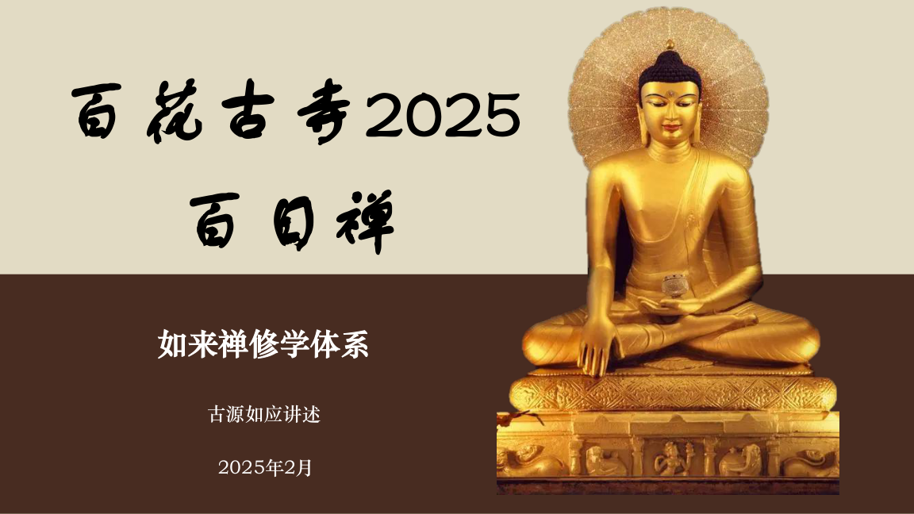
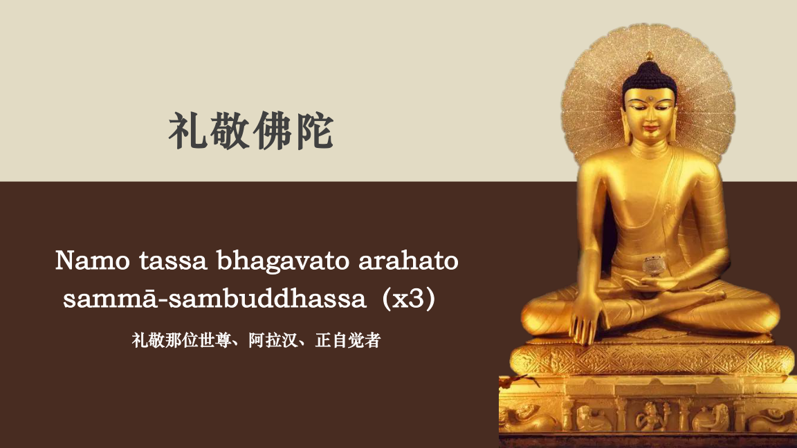
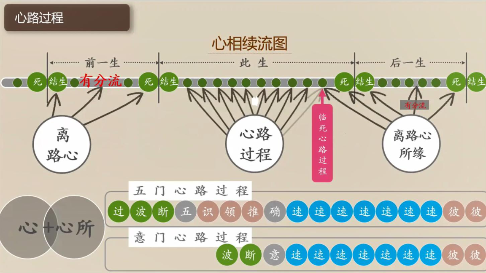
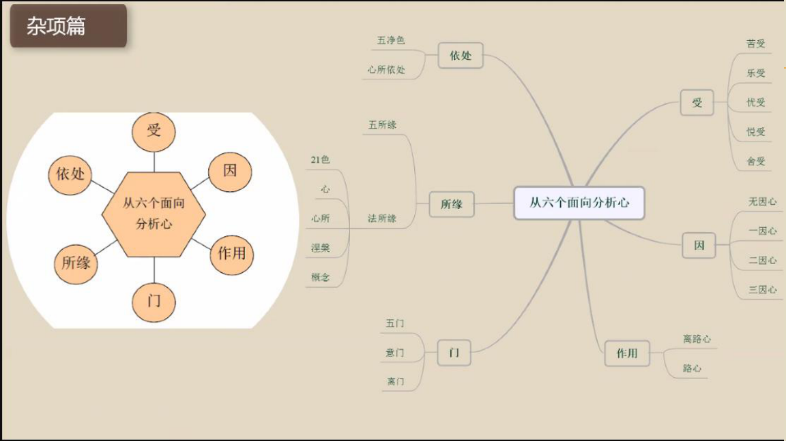
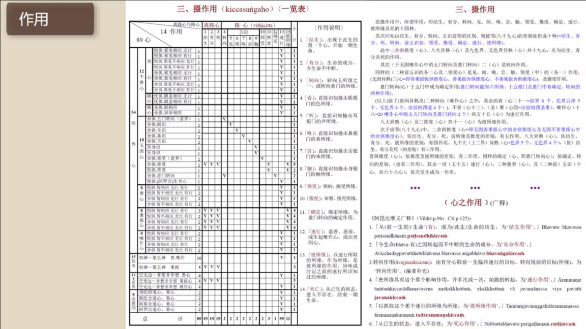
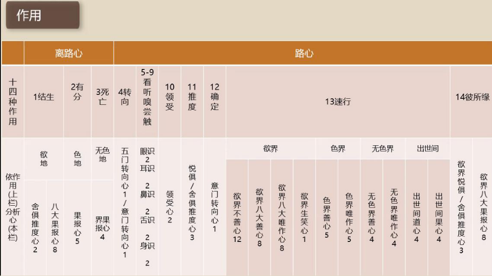
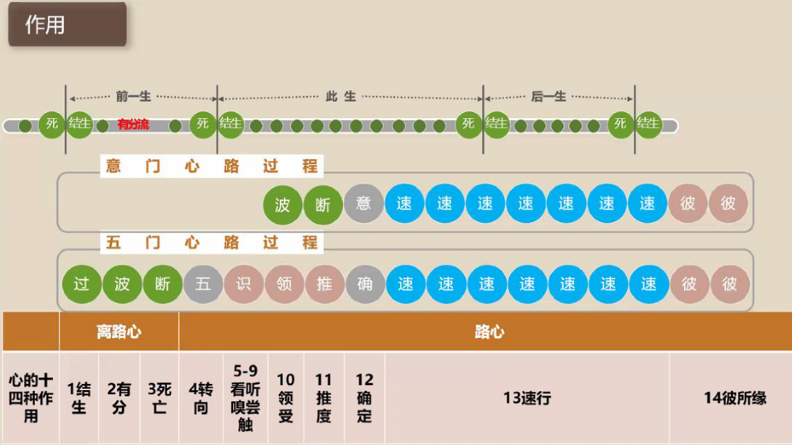
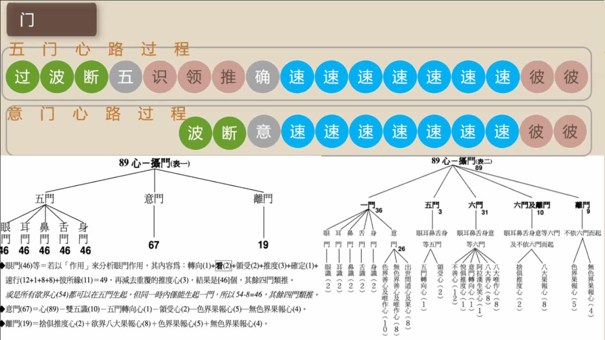
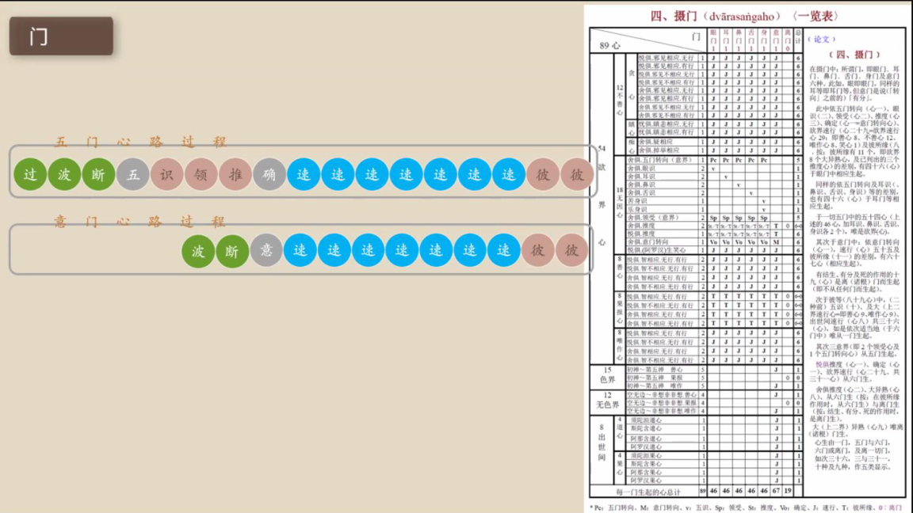
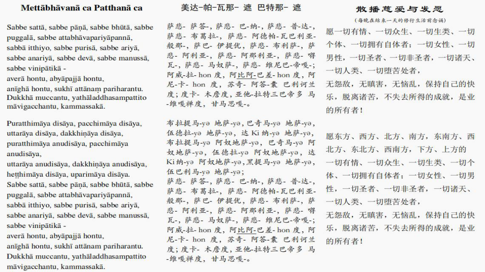

<div align="right">📅 最近更新：2026-09-23 01:51　|　第三版修订（4周版）：连续两周合并为9环节、单讲120分钟；共读原文一字未改；学员版去除主持人专属内容</div>

# 第3周：离路心与十四种心识作用（主持人版）

> ⭐ **本讲主持人速览**（新主持人必读，2分钟看完）
>
> 你不是老师，是"共学同行者"。你不需要提前懂内容，只需要按流程走。
> **本周由连续两周内容合并**而成，含两段共读、两轮分享与两轮讨论，单讲 120 分钟。
>
> | 环节 | 标准时长 | ⏱ 时间不够→ | ⏱ 时间富余→ |
> |:-----|:----:|:-----|:-----|
> | 🧘 静心开场 | 10 min | 缩至5 min | 加2分钟静坐 |
> | 📖 共读原文1 | 20 min | 只读★核心段（约15 min） | 加读◈扩展段 |
> | 💬 第一轮分享 | 10 min | 每人1句话 | 每人3分钟 |
> | 🎯 第一轮主题讨论 | 10 min | 只讨论问题① | 讨论全部问题+扩展 |
> | 🧘 禅修练习 | 15 min | 缩至8 min（只念引导词前半） | 延长至20 min |
> | 📖 共读原文2 | 20 min | 只读★核心段 | 加读◈扩展段 |
> | 💬 第二轮分享 | 10 min | 每人1句话 | 每人3分钟 |
> | 🎯 第二轮主题讨论 | 10 min | 只讨论问题① | 讨论全部问题+扩展 |
> | 🔚 收尾与回向 | 15 min | 缩至10 min | 保持 |
>
> **主持人10条守则（精简版）**：
> ① 不讲解、不提供答案——让原文自己说话；② 有人问"正确答案"→说"先听听大家的看法"；③ 冷场→主持人先分享自己的真实感受；④ 跑题→温和拉回："这个有意思，我们回到今天的原文"；⑤ 争论→"两种看法都很好，大家保留自己的理解"；⑥ 确保人人发言；⑦ 不评判任何人的分享；⑧ 时间到了就推进；⑨ 禅修练习照读引导词即可；⑩ 结束一起回向。

> **读书会15：心路过程与心识作用 · 第3周（4周版 · 连续两周合并）**
> 主持人：你不需要提前懂内容，按本手册推进即可。
> 本周主题：****；****。

## 📋 本周信息卡

| 项目 | 内容 |
|:----|:-----|
| 时长 | 120分钟（4周版 · 9环节） |
| 核心问题 | 什么是「离路心」？结生、有分、死这三种作用，分别在哪里发生、由多少种心执行？为什么说结生心与死心「同性质而不同作用」？离路心与心路过程如何交替，构成生命的相续？；十四种作用到底是哪十四种、分成哪十个阶段？这十四种作用又分别由 89 心中的哪几种心来执行？所缘的强弱，如何决定一条心路走多远、有没有彼所缘？ |
| 共读原文 | 共读原文1：材料①《如来禅修学体系45-摄杂分别1》——十四种作用之「结生／有分／死亡」三条定义、《摄阿毗达摩义论·摄作用》论段（「共十九心，名为结生、有分及死的作用」）、「心之作用」广释（结生作用／有分作用／死心作用）、依作用分析心一览表、摄门中离路心的心数（★核心；FREE 素材，全新使用）；材料②《如来禅修学体系84-摄离路分别1》——「心路过程」页的离路心结构（心路过程→临死心路过程→死→结生→有分→后一生→离路心所缘之相续；**与读书会13第7周同文件不同段落**）；材料③《阿毗达摩轻松谈》——〈第八章 临死之前的心路过程〉（四种死亡之因、最后一刻的重要性、三种征象）与〈第十一章 从梵天到猪〉（临死→结生→再生之相续；**与读书会13第5-8周、读书会14第1/4/8周同文件不同段落**）。　｜　共读原文2：材料①《第111讲 摄杂品2-共修版》——十四种作用的列举与 89 心对应总说、《义广释》各作用释义、「依归纳表讲解：14 种作用与心的对应」、离路心三作用（★核心，与本周「作用总览＋对应」主体一致）；材料②《如来禅修学体系45-摄杂分别1》——十四种作用〔作用说明〕14 条定义、摄作用论文、《义广释》作用释义、作用→心对应表（◈，**与读书会15第2周／第5周同文件不同段落**）；材料③《阿毗达摩5-摄杂品110~113讲》——六面向分类总纲、作用（14 种分成 10 阶段）、**所缘强弱与彼所缘规则**、速行心数目、所缘偈颂（，本周「所缘强弱」关键来源）；材料④《如来禅修学体系41-摄心分别3》——**与读书会14第2／3／4周同文件不同段落**（本讲取〈作用与心对应〉，彼讲取〈心／心所明细〉；经检索本课件实不含「作用与心对应」独立章节，仅取作用相关词条作坐标印证，缺口已注明）。 |
| 本周作业 | ①简答题：离路心有哪三种作用？执行这三种作用的是哪一类心、共多少种？为什么说结生心与死心是「同性质而不同作用」？②实践题：今晚上床入睡前，安静一分钟，观察一下「从清醒到睡着」的那一小段过渡——你能不能在失去意识之前，捕捉到「心还在，只是没有在忙」的那一点安静？只体会、不评判，也不必强求。；①简答题：请写出十四种作用，并说明「结生、有分、死亡」为什么是同一种心；「速行」为什么是重复七个刹那？②实践题：今天挑一次「看到一个你喜欢的东西（或听到一句不顺耳的话）」，观察自己——从「看见／听见」到「心里已经起反应」，中间大约经过了几步？只记录、不评判。 |

## ⏱ 时间弹性指南（本讲通用）

| 情况 | 应对方法 |
|:-----|:---------|
| **时间不够**（共读太长／讨论超时） | ① 静心开场缩至5分钟；② 两段共读原文均只读标注 **★核心** 的段落；③ 两轮分享每人只说一句话；④ 两轮主题讨论只讨论各自的问题①；⑤ 禅修练习缩至8分钟（只念引导词前半段）；⑥ 收尾回向缩至10分钟 |
| **时间富余**（共读快／讨论提前结束） | ① 用"📚 扩展内容包"中的补充原文段落继续共读；② 增加扩展讨论问题；③ 延长禅修练习时间；④ 增加"每人分享一个生活实例"环节 |

> 💡 原则：**讨论比读完重要，体验比讲完重要。** 宁可跳过扩展原文，也要让每个人都有机会说话。

## 🎓 本讲教学要点（主持人心里有数）

> 以下不是照读稿，是主持人自己拿捏内容的「底稿」。看完心里有数，场上就不慌。

1. **一句话主线**：离路心是与「心路心」相对的一类心——**不依根门、不撞所缘**；它由三种作用构成：**结生、有分、死**。三者串起「前一生→此生→后一生」，令生命相续不断。
2. **两把概念钥匙，务必分清**：
   - **心路心（vīthicitta）**：遇到所缘、在心路里流过的身心（前几周的转向、五识、领受、推度、确定、速行、彼所缘）。
   - **离路心（vīthimutta）**：**离开心路**的心——不依根门、不在一条心路里，是生命本身的「底色」与「接续」。
   - 记忆口诀：**心路心是「遇到事情时」的心；离路心是「没事时」与「换期时」的心。**
3. **三作用的定义（材料①，逐字）**：① 「结生」——出现于此生的第一个心，开始一期生命；② 「有分」——生命的成分，令生命不中断；③ 「死亡」——从已生的状态进入不存在，结束一期生命。三条并排记住，本周就算立住了。
4. **由多少心执行（材料①，关键数）**：**「二舍俱推度（心）、八大异熟（心）及九色界、无色界异熟（心）共十九心，名为结生、有分及死的作用。」** 即：**2＋8＋9＝19**。「二舍俱推度」＝无因善果报舍俱推度心＋无因不善果报舍俱推度心。这三组心，就是离路心的「全体工作人员」。
5. **「同性质、不同作用」是本讲最容易讲错、也最值得讲清的一点**：结生心与死心是**同一类心（果报心）**——同一组 19 心，在「这一期生命最开始」执行结生、在「这一期生命最后」执行死、在「中间无事时」执行有分。**性质相同，作用不同**（材料①广释：「从生命成为生命的结生，为结生作用」「令生命之因转起而不中断的生命的成分，为有分作用」「从已生的状态进入不存在，为死心作用」）。理解它，就理解为什么「死」不是换一个什么新东西，而是同一条流换了一站。
6. **有分心的三重角色**（材料①＋②）：① **是「潜流」**——不撞所缘时心沉在这里；② **「令生命不中断」**——生命的成分；③ **是「转向心之前」的心**——材料①摄门论文段说「意门是说（转向）之前的（有分）」。白话：有分就是我们「发呆、深睡、心歇下来」时的那条底流。
7. **离路心与心路怎么交替（材料②，本讲结构线）**：材料②「心路过程」页给出了这条环——**离路心 → 死／结生／有分流；死 → 前一生；结生 → 此生；有分流 → 后一生；前一生 → 死；此生 → 心路过程；后一生 → 离路心所缘；心路过程 → 临死心路过程 → 死。** 一句话：**生命＝「心路」与「离路」两组心，交替、无间地相续。** 有缘就起心路，无缘就沉有分；一期终了走临死心路，死心一生，结生心无间接上。
8. **生命相续「无间断」的力度**（材料①广释＋材料③）：材料①说「有分……令生命不中断」；材料③说「当我们说『一个人死亡』，这并不意味著生命的最终终点，因为一个人死亡将会投生到一个新的生命」。要点不是「不会死」，而是「这条流不会断」——**死心生起，接着下一个心识刹那，结生心就生起来**。
9. **临终为什么会决定去向（材料③）**：死心是「这一期最后一个心」，它前面就是**临死心路过程的速行**；材料③说，很重要的是「约在半小时前他有善的速行心」，若善思惟占优势直到最后一口气，临终者投生善趣；反之投生恶趣。临终现前三种征象：**业、业相、趣相**。落点是：**「最后一刻」重要，但更好的是「提前准备好」，不必等到最后一刻**。
10. **与前后周的接口**：第 1–4 周讲了总说与五门、意门心路；本周讲离路心（结生／有分／死）与生命相续；第 6 周回到「十四种心识作用与所缘强弱」，第 7 周讲「速行与业力＋安止道果心路」。**本周只立「离路心＝结生／有分／死、19 心、生命相续」这一柱**，不必提前展开速行的业力细节，也不展开三十一界（详见读书会13第7周），免得扯远。

### 🗣 白话讲解参考（主持人可选用的话术）

> 下面几段是「万一有人问、或需要你开口解释」时的现成话术，用你自己的语气讲，不必逐字。

- **什么是离路心？**「想象一条河在流——遇到石头溅起水花的那一段，叫『心路』；石头之间的平流、还有河床深处那条一直在的水，就叫『离路』。离路心不撞所见所闻，是生命本身的底色和接续。」
- **有分心是什么？**「你发呆、走神、深睡无梦的那段，心并没有消失，只是没有在忙——沉在一条『潜流』里，这条潜流就是有分心。它最要紧的作用，是『令生命不中断』。」
- **结生心、死心是不是两个心？**「不是。它们是同一类心（果报心）在不同时刻的不同作用——在这一期生命最开始，它执行『结生』；在最后，执行『死』；中间无所事事时，执行『有分』。好比同一个人：早上开门、晚上关门、白天值守，是同一个人做三件事。」
- **为什么说生命不会断？**「因为死心生起，紧接着的下一个心识刹那，结生心就无间地生起来了。就像接力赛——前一棒交出去的那一刻，后一棒已经接上，中间不留空档。所以经里说，轮回『其起点是不可知的』。」
- **谈临终会不会吓到人？**「恰恰相反——正因为它『不会断』，我们才要认真对待今天起的每一个念。材料③说，与其等到最后一刻，不如提前准备好。这不是恐怖片，是一份『你一直都在参与自己未来』的说明书。」

### ❓ 学员常见提问与回应（现场速查）

> 左边是常听到的问法，右边是简短回应（说完就把话头交回给提问者，别替他下结论）。

| 学员会问 | 主持人回应（简短、不玄谈） |
|---|---|
| 「离路心是不是『不用心』的时候？」 | 可以说是「不在心路里」的心：不依根门、不撞所缘；发呆、深睡时沉在有分，就是一种离路心。 |
| 「有分心有什么用？」 | 三条：生命的潜流（不撞所缘时沉在这里）、令生命不中断、是转向心之前的心。 |
| 「结生心、死心差在哪？」 | 差在「作用」不差在「性质」：同一类果报心，一处执行「开始」、一处执行「结束」、平时执行「有分」。 |
| 「人死了会怎样？」 | 材料③说：死亡不是终点；临终速行＋三种征象，决定下一期结生。本周不作具体去处的保证，也不算命。 |
| 「谈死亡我有点害怕怎么办？」 | 很正常。请先回到呼吸；也可以安静地暂离一下。我们只是认识心，不是吓自己。 |
| 「三十一界都在哪里、寿命多长？」 | 那是读书会13第7周的内容；本周只说到「结生到何处、依什么业」为止，点到即止。 |
| 「打坐心跑掉跟离路心有关吗？」 | 有关。心一停下来就往有分沉，一有所缘又起心路——认识有分，就懂「心为什么会跑掉」。 |
| 「临终念一句佛号就够了吗？」 | 材料③强调的是「临死速行」与「提前准备」。方向是：当下有正念、善待，比临时抱佛脚更稳。 |

### 🧭 若时间只剩一分钟（极简版主线）

> 万一时间被压到极限，只讲这四句，本周也不算白来：
>
> 1. 离路心＝**结生、有分、死**三种作用，由**19 心**执行。
> 2. 三者是**同一种果报心的三种作用**——结生、有分、死「同性质，不同作用」。
> 3. 生命＝「**心路**」与「**离路**」交替相续：**死 → 结生 → 有分 → 心路 → 临死心路 → 死……** 从不中断。
> 4. 所以「最后一刻」重要，但更好的是**提前准备**——今天起的每一个念，都在被接着走。

> 以下不是照读稿，是主持人自己拿捏内容的「底稿」。看完心里有数，场上就不慌。

1. **一句话主线**：89 颗心各自承担十四种作用中的一种或多种——把这张「功能表」看懂，就懂了「谁会造业、谁只是在传话、谁只是在休息」。
2. **十四种作用 + 十个阶段（务必分清）**：十四种作用＝**结生、有分、转向、见（看）、闻（听）、嗅、尝、触、领受、推度、确定、速行、彼所缘、死心**。内容上按顺序并成**十个阶段**：结生（1）→有分（2）→五门转向（3）→五识（4）→领受（5）→推度（6）→确定（7）→速行（8）→彼所缘（9）→死亡（10）。**离路三（结生／有分／死）＋路心七。** 材料①原文：「结生、有分、死亡这三个离路心，然后转向……领受、推度、确定、速行、彼所缘合起来叫十个阶段，十个段落。」
3. **「作用 ↔ 心 对应」的关键数字（记住 5 个数就够）**：
   - **19**：能执行结生／有分／死亡的，共 **19** 颗心（欲界八大果报 8 ＋ 善果报舍俱推度 1 ＋ 四恶趣不善果报舍俱推度 1 ＝ 10；色界、无色界果报 9；合计 19）。
   - **2**：能执行「转向」的 2 颗（五门转向心、意门转向心）。
   - **10／2／3／1**：看听嗅尝触各 2 颗（双五识，合 10）；领受 2；推度 3；确定 1。
   - **55**：能执行速行的，共 **55** 颗（善 21＋不善 12＋出世间果 4＋唯作 18）。
   - **11**：能执行彼所缘的，共 **11** 颗（欲界八大果报 8 ＋ 三个推度心 3）。
4. **重点难点一：结生、有分、死亡是「同一种心、不同作用」**（材料①）：任何有情「结生的时候结生心是什么样，他的有分心和死亡心就是什么样，它的心所的组成、心所的素质都是一样的」。像同一个人换个岗位值班，心的「体质」没变。
5. **重点难点二：速行要「重复七个」才有力量**（材料①②）：速行「同时会生起来好多个」，「欲界的速行最多七个，临终速行是五个」。**一个速行不足以成势，七个重复才成力量**——这是理解「业力」的入门，也是本周把「造业」讲实的抓手。
6. **重点难点三：所缘强弱决定心路长短与彼所缘（材料③）**：「极大所缘撞击眼净色，生起一个完整的五门心路过程，一定有彼所缘」；「只要是极大所缘，它都可以生起彼所缘」。所缘越弱，心路越短，很多念头「一闪而过」。**色界、无色界没有彼所缘。**
7. **易混点：作用名 vs 种类名**（材料③）：五门转向、双五识、领受、推度、意门转向，是**用作用来命名**的心；同一个「推度心」，它还能去做「结生、有分、死亡、彼所缘」的作用。作用与种类不能混。
8. **与前后周的接口**：第1–4周讲心路「时间结构」，第5周讲「离路心」，本周讲「功能（作用）＋所缘强弱」；**第7周**会专讲「速行心与业力＋安止／道果心路」，把本周的「速行」深化。本周只需把「十四种作用↔心」和「所缘强弱」立住，**不必提前展开业报细节**，免得扯远。
9. **一句话兜底**：若全场卡住，用这句把主线拉回——**「十四种作用，就是心这支团队的分工表；速行负责造业，而且它要重复七次。」**

### 🗣 白话讲解参考（主持人可选用的话术）

> 下面几段是「万一有人问、或需要你开口解释」时的现成话术，用你自己的语气讲，不必逐字。

- **什么是「作用」？**「把心想象成一家公司的同一个人。上班时他是会计，午休时他是吃饭的人，晚上回家他是爸爸——同一个人，不同『作用』。心也一样：同一颗心，在生命刚开始时是『结生心』，平时是『有分心』，临终是『死心』——作用不同，心没换。」
- **为什么速行要七个？**「你拍一张照片，是一次快门；但你想把一件事『拍实』，得连拍七张。速行就是心的『连拍』——重复七次，善或不善的『影像』才定得住。所以修行不是看一刹那，是看这一串。」
- **什么是所缘强弱？**「同样看一眼，有时只是眼角一扫（心路很短，一闪而过）；有时你死死盯住不放（极大所缘，完整心路，还会回味两下）。所以『没看清一个念头』太正常了——它可能本来就只是极小所缘。」
- **彼所缘为什么只有欲界有？**「彼所缘是『回味』。色界无色界的禅心沉在定里，不需要回味；我们欲界众生爱回味，所以才有这两个刹那。」

### 🧩 术语速查（读原文时随手对照）

| 名相 | 出处 | 一句话 |
|---|---|---|
| 摄作用（kicca） | 材料①② | 89 种心从「功能」角度的分类——十四种作用 |
| 十四种作用 | 材料①②③ | 结生、有分、转向、看、听、嗅、尝、触、领受、推度、确定、速行、彼所缘、死亡 |
| 十个阶段 | 材料① | 离路三（结生／有分／死）＋路心七（转向、五识、领受、推度、确定、速行、彼所缘）|
| 结生（paṭisandhi） | 材料① | 一世生命的第一个心，紧接上一世死心 |
| 有分（bhavaṅga） | 材料① | 生命潜流心；无心路时持续生灭 |
| 死心（cuti） | 材料① | 一期生命最后一个心；与结生、有分「同一种心、不同作用」|
| 转向（āvajjana） | 材料①② | 五门转向／意门转向，共 2 颗心执行「转向」作用 |
| 确定（voṭṭhapana） | 材料① | 五门里判定所缘的小唯作心，就是意门转向心 |
| 速行（javana） | 材料①②③ | 造业阶段，55 颗心执行；欲界最多 7 个刹那，重复成力量 |
| 彼所缘（tadārammaṇa） | 材料①③ | 速行后「回味」，11 颗心执行；仅欲界（极大所缘）有 |
| 唯作心（kiriyā） | 材料① | 只执行功能、不造业；20 唯作扣除二转向心＝18 属速行 |
| 双五识 | 材料①② | 眼耳鼻舌身五识各 2（善／不善果报），共 10 |
| 所缘强弱 | 材料③ | 极大所缘→完整心路＋彼所缘；越弱心路越短 |
| 无因心／有因心 | 材料③④ | 无因（18）／有因（71）——本周只在「作用」层面涉及 |

### 🧭 若时间只剩一分钟（极简版主线）

> 万一时间被压到极限，只讲这四句，本周也不算白来：
>
> 1. 十四种作用是一张**分工表**：结生、有分、转向、看、听、嗅、尝、触、领受、推度、确定、速行、彼所缘、死亡。
> 2. **结生、有分、死心是同一种心的三种作用**；能执行它们的共 **19** 颗心。
> 3. **速行才是造业的那一段，而且要重复七个刹那**（55 颗心能执行速行）。
> 4. **所缘越强，心路越长，越有彼所缘**；很多念头一闪而过——**没看清很正常，不审判自己。**

### 🪞 主持人自评清单（会后 3 分钟自检）

- [ ] 是否在开场就立起「作用＝心在干什么活」的基调，并埋下「不审判自己」？
- [ ] 共读原文是否只读不解释，解释留到分享／讨论？
- [ ] 「十四种作用 + 十个阶段」是否讲清？「19／2／55／11」四个数字是否点到？
- [ ] 「结生、有分、死心是同一种心」这个难点是否讲透？
- [ ] 「速行要重复七个刹那才有力量」是否带到？
- [ ] 「所缘强弱 → 心路长短 → 彼所缘」这条链是否讲清，并落到「没看清很正常」？
- [ ] 表格页乱码（归纳表／一览表）是否跳过、没有硬念？
- [ ] 是否有学员因「造不善业」自我批评？是否已用「不审判自己」接住？
- [ ] 时间是否守住？静心与回向是否都保留？是否预告第 7 周（速行与业力）？

### 🙋 学员常见提问与回应

| 提问 | 回应 |
|---|---|
| 「十四种作用我要背下来吗？」 | 不必背，记住十个阶段的顺位即可。材料①自己也说：「你不会背，但是你要会算。」|
| 「结生、有分、死亡怎么会是同一种心？」 | 同一颗果报心，在不同时候做不同工作——出生叫结生、平时叫有分、临终叫死。心没换，工作换了。 |
| 「速行为什么要七个？一个不够吗？」 | 速行「同时会生起来好多个」，「欲界的速行最多七个」；重复才成力量，造业的强弱就在这里。 |
| 「彼所缘到底是什么？」 | 速行之后对同一个所缘「回味」两下的心，是果报心；只有欲界、只有极大所缘才有。 |
| 「色界无色界为什么没有彼所缘？」 | 彼所缘只在欲界生起；上二界与出世间心路到速行就落回有分（材料①「上二界」段）。 |
| 「我大部分时间都在不善速行，完了吗？」 | 不是。材料②说速行是「重复七个」——正因为它重复，我们才改得动。能看见，就已经在转向的路上。 |
| 「没看清一个念头，是不是我修得差？」 | 不是。所缘弱，心路本来就短；很多念头只是一闪而过。看得见「有反应起来了」就很好。 |
| 「观察这些会不会越看越自责？」 | 会的话，请记住两句：**观察心路是了解心的自然运作，不是审判自己**；**能观察到即正念在运作**。 |

## 🧩 术语速查（读原文时随手对照）

| 名相 | 出处 | 一句话 |
|---|---|---|
| 离路心（vīthimutta） | 材料②③ | 与「心路心」相对：不依根门、不撞所缘、不在心路里的心 |
| 结生（paṭisandhi） | 材料①③ | 出现于此生的第一个心，开始一期生命 |
| 有分（bhavaṅga） | 材料①② | 生命的成分，令生命不中断；不撞所缘时的「潜流」 |
| 死（cuti） | 材料①③ | 从已生的状态进入不存在，结束一期生命 |
| 三作用 | 材料① | 结生、有分、死——同一组 19 心的三种作用 |
| 十九心 | 材料① | 2 舍俱推度＋8 大异熟＋9 上二界异熟＝结生／有分／死之担当者 |
| 舍俱推度心 | 材料① | 无因善果报／不善果报舍俱推度心 2 种，兼有结生、有分、死、彼所缘、推度五作用之一 |
| 临死心路过程 | 材料②③ | 临终最后一条心路；其速行影响下一期结生 |
| 业·业相·趣相 | 材料③ | 临终现前的三种征象：业／造业工具／将去之处的景象 |
| 生命相续流 | 材料①③ | 死心→结生心无间相接，名色相续流从未断过 |
| 四生存地／三十一界 | 材料② | 结生所到之处；**详细展开见读书会13第7周** |

## 🪞 主持人自评清单（会后 3 分钟自检）

- [ ] 是否在开场就立起「这是认识心、认识生命相续，不是恐怖故事」的基调，并埋下「不恐惧、不玄谈、不回避」？
- [ ] 共读原文是否只读不解释，解释留到分享／讨论？
- [ ] 「离路心＝结生／有分／死」与「19 心执行三作用」是否讲清楚、没讲混？
- [ ] 「结生心与死心同性质、不同作用」这个要点是否点到？
- [ ] 「离路心与心路交替（死→结生→有分→心路→临死心路→死）」这条相续之环是否画清？
- [ ] 是否有学员因谈死亡而情绪波动？是否已用「回到呼吸／可暂离」温和接住、未追问隐私？
- [ ] 是否守住了「三十一界详见读书会13第7周」的边界，未把课上成宇宙地图课？
- [ ] 时间是否守住？静心与回向是否都保留？收尾是否预告第 6 周？

---

## 🧘 静心开场（10 min）

> 💬 **破冰｜3–5分钟**：今天你有没有过一段「什么都没在想」的空白？比如发呆、走神刚回神的一刻，说说那是什么样的。

> 🛡️ **心理安全三约定**（每次开场在心里过一遍）：① **保密**——这里说的话不出这间屋子；② **不评判**——不评价任何人的分享，也不急着评价自己；③ **可随时暂停**——任何时候觉得不舒服，都可以停下来休息、喝水或离开，不需要解释。


**（主持人引导语，语速放缓，每句之间留白）**

> 各位法友，请找一个让自己舒适的坐姿，可以盘腿，也可以坐在椅子上。轻轻闭上眼睛，或者让视线柔柔地落在前方地面。先做三次深长的呼吸——吸气，慢慢地；呼气，也慢慢地。
>
> 现在，把注意力带到身体。感觉一下此刻的坐姿，感觉身体与坐垫接触的地方，感觉双手放着的温度。不需要改变什么，只是知道。
>
> 接着，把注意力放到呼吸上。知道吸气，知道呼气。不去控制呼吸，只是陪伴它。吸气进来，呼气出去……如果心跑开了，不要责备它，轻轻地把它带回来，再回到呼吸。
>
> 今天我们要谈「离路心」——结生、有分、死。这听起来是关于生命开始与结束的题目，但它其实是一份关于**生命的相续**的说明。请先给自己一个承诺：接下来的两个小时，我们只是来认识心、观察心，不是来吓自己，也不是来给自己或谁定罪。**谈这些，心里有波动是很自然的；任何时候，你都可以回到呼吸，也可以安静地暂离一下。**
>
> 现在，我们来练习一会儿慈心。先想到自己，在心里轻轻地对自己说：愿我健康，愿我快乐，愿我平安，愿我远离痛苦。
>
> 把这份善意，送给坐在你左右的每一位法友——愿他们健康，愿他们快乐，愿他们平安。
>
> 也把这份善意，送给所有正在经历病苦、正在走向生命尽头的众生——愿他们无所恐惧，愿他们被温柔以待，愿他们遇善缘、得善念。
>
> 再把它扩大一些，送给今天要学的法——愿我们听得明白，愿法义入心，愿所学能真正用在生活里。
>
> 好，保持这份开放与柔和，我们慢慢睁开眼睛，回到当下。带着这份不恐惧、不着急的心，我们一起进入今天的共读。

**（主持人操作）** 开场控制在 10 分钟内。若学员入场慢，可先让早到者安静就坐，准点再开始。本周特别要在开场就埋下三颗种子：一是「这是关于生命相续的说明，不是恐怖故事」，二是「谈死亡有情绪波动是自然的，可回呼吸、可暂离」，三是「我们只到『结生到何处、依什么业』为止」。语气始终作邀请。

- **变体一（时间紧）**：只做三次深呼吸＋观身体三处（坐姿、双手、面部）＋一句慈心愿，3—5 分钟。
- **变体二（学员情绪不稳／有近期丧亲者）**：把重点放在「呼吸为锚」，并说明：「今天如果谈到的内容让你心里难受，随时可以只是回到呼吸，也可以安静地出去走一走，不必跟着讨论走。」
- **变体三（时间富余）**：在慈心前加 2 分钟「听声音」练习——先听外在声音，再注意「声音暂停、心安静下来」的那一段，自然引出「有分心」。
- **变体四（有学员迟到／中途进出）**：不必停机等候，让迟到者安静入座、跟上呼吸即可。
- **衔接句**：静心结束到共读，用一句过渡：「现在，我们把这份安静带到文字里——接下来这些名相，是在给『生命的相续』画一条线。」

## 📖 共读原文1（20 min）

> ⚠️ **主持人操作**：本周共读三份材料。**材料①是主体（★核心）**，只读「三作用定义（结生／有分／死亡三条）＋摄作用论（十九心那句）＋心之作用广释＋依作用分析心一览表＋摄门离路心」；**材料②读「心路过程」页的离路心结构图**，用于立起「心路与离路交替」这条相续之环；**材料③读〈第八章 临死之前的心路过程〉的「四种死亡之因」「最后一刻的重要性」「三种征象」与结论**。共读时只念不解释；名相点到即止，解释留到分享与讨论。材料①的「依作用分析心表」「摄作用一览表」与材料③的长事例，可**投影对照或摘读首尾**，不逐字念完。以下照录均为逐字原文，供法友轮流照读。

> **【本周朗读段 · 开始】**（本段约 3501 字，供中等稍慢朗读，约 20 分钟；其余为默读／选读／延伸内容）

> 朗读节奏建议：材料①「结生／有分／死亡」三条与「十九心」那句，请慢念、慢念、再慢念，让大家记住数；材料②的图节点（离路心→死／结生／有分流）可先念一遍、再在板上画成环；材料③「最后一刻的重要性」一段最重要，可请不同法友各念一遍。读错的巴利文（如 bhavaṅga、paṭisandhi、cuti）不必当众纠正，事后轻声提示即可。**读到「死亡」「临死」段时，语速放慢、语气放柔，注意场上情绪。**

### 材料① ★核心《如来禅修学体系45-摄杂分别1-古源尊者-20250220（课件）》

- 文件类型：pdf（课件）
- 知识库出处：古源尊者开示及上座部佛教资料
- media_id：`pdf_d0dd1c0cd17209afe241ece24bf6b7b4_579c8e05c2f97bcc58eb4d6f602f86a37439961422831605`
- 打开方式：ima知识库搜索「如来禅修学体系45 摄杂分别1 古源尊者」
- 适用定位：本周「有分心／死心／结生心三作用」的支柱课件——十四种作用表中「结生／有分／死亡」三条定义、摄作用论（十九心）、心之作用广释、依作用分析心一览表、摄门中的离路心。
- 说明：完整 id `grep -F` 比对《_禁用清单_读书会01-14已用media_id.txt》**命中 1 次**（对应蓝图 B 类「仅存于清单、未被实际使用」，属 FREE，正常使用；参考工具命中，非实际照录）。课件内 `graph TD` 心相续流图与表格页 OCR 串行／残损者**不逐字照录**，以成段原文与可辨识表格为准。

> ⚠️ 主持人操作：只照读下面的定义与论段。课件内「心相续流图」与「依作用分析心表」属**图形／表格页**，文字未能完整提取者**如实注明缺口**；「离路心三作用之定义」以本材料成段原文为准。

**照录（逐字·十四种作用之「结生／有分／死亡」三条定义）：**

> （此段所述十四种作用等，与读书会15第6周同文件同段落，详见第6周，本讲不重复。）

**照录（逐字·摄作用（kiccasaṅgaho）论文段——「十九心」之根）：**

> （此段所述十四种作用等，与读书会15第6周同文件同段落，详见第6周，本讲不重复。）

**照录（逐字·「心之作用」广释——《阿毘达摩义广释》(Vibhv.p.96; CS:p.125)）：**

> 1. 「从(前一生的)'生命'(有)，成为(此生)生命的结生，为'结生作用'。」Bhavato bhavassa patisandhānam patisandhikiccaht.
>
> （此段所述十四种作用等，与读书会15第6周同文件同段落，详见第6周，本讲不重复。）
>
> 3.转向作用(avajanakiccain): 由有分心取前一生临终速行的目标，转向现前的目标(所缘)，为 $ \cdot $ 转向作用。(编者补充)
>
> 6. 「从已生的状态，进入不存在，为'死心作用'。」 Nibbattabhavato parigalhanam cutikiccath.

> [generated, not original text] 缺口说明：原文第 3 条「转向作用」中夹有抽取残留符号 `$ \cdot $`；第 4、5 条（速行作用、彼所缘作用）与本次主题非直接相关，未在此重复照录。

**照录（逐字·依作用分析心（一览表））：**

> |十四种作用|1结生|1结生|2有分|3死亡|4转向|5-9看听嗅尝触|10领受|11推度|12确定|13速行|13速行|13速行|13速行|13速行|13速行|13速行|13速行|13速行|14彼所缘|14彼所缘|
> |依作用(上栏)分析心(本栏)|欲地|欲地|色地|无色地|五门转向心1/意门转向心1|眼识2耳识2鼻识2舌识2身识2|领受心2|悦俱/含俱推度心3|意门转向心1|欲界|欲界|欲界|色界|色界|无色界|无色界|出世间|出世间|欲界悦俱/含俱推度心3|欲界八大果报心8|
> |依作用(上栏)分析心(本栏)|舍俱推度心2|八大果报心8|果报心5|界果报心4|五门转向心1/意门转向心1|眼识2耳识2鼻识2舌识2身识2|领受心2|悦俱/含俱推度心3|意门转向心1|欲界不善心12|欲界八大善心8|欲界八大唯作心8|色界善心5|色界唯作心5|无色界善心4|无色界唯作心4|出世间道心4|出世间果心4|欲界悦俱/含俱推度心3|欲界八大果报心8|

> [generated, not original text] 缺口说明：其中「含俱」应为「舍俱」、「界果报心4」应为「无色界果报心4」，此系表格抽取错位，原文以图表为准。

**照录（逐字·摄门中的离路心（三作用所摄之心数））：**

> $\blacktriangleright$ 眼门(46)等 = 若以「作用」来分析眼门作用，其内容为：转向(1)+看(2)+颌受(2)+推度(3)+确定(1)+速行(12+1+8+8)+彼所缘(11)=49，再减去重复的推度心(3)，结果是[46]个，其余四门类推。
>
> （此段所述十四种作用等，与读书会15第6周同文件同段落，详见第6周，本讲不重复。）
>
> $\blacktriangleright$ 离门(19)=舍俱推度心(2) + 欲界八大果报心(8) + 色界果报心(5) + 无色界果报心(4)。

**照录（逐字·摄门（dvārasangaho）论文段）：**

> （此段所述十四种作用等，与读书会15第6周同文件同段落，详见第6周，本讲不重复。）

**照录（逐字·89 心—摄门（表一）节点文字；原页为图形）：**

```
# 89 心一摄门(表一)

graph TD
    A[五门] --> B[眼门 46]
    A --> C[耳门 46]
    A --> D[鼻门 46]
    A --> E[舌门 46]
    A --> F[身门 46]
    G[意门] --> H[67]
    I[离门] --> J
```

**照录（逐字·摄作用〈一览表〉可辨识行；原表跨页、抽取错位）：**

> |8 出世间|总计|总计|总计|总计|总计|总计|89|19|19|19|19|2|2|2|2|2|2|3|1|55|

> [generated, not original text] 缺口说明：原文「三、摄作用(kiccasaṅgaho)〈一览表〉」抽取后表头重复且栏位与心名串行；可辨识者即上行——**89 心中，属结生／有分／死作用者 19 心**（与摄作用论「共十九心，名为结生、有分及死的作用」一致）、被所缘 11 心、速行 55 心。其余各行因表格提取错位，无法保证逐字准确，故不逐行照录，以原始 PDF 页面为准。

**照录（逐字·心相续流图（graph TD 节点文字；原页为图形））：**

```
graph TD
    A1[前一生] --> A2[死]
    A2 --> A3[结生]
    A3 --> A4[有分流]
    A4 --> A5[死]
    A5 --> A6[结生]
    A6 --> A7[此生]
    A7 --> A8[心路过程]
    A8 --> A9[死]
    A9 --> A10[结生]
    A10 --> A11[后一生]
    A11 --> A12[死]
    A12 --> A13[结生]
    A14[离路心] --> A3
    A14 --> A4
    A14 --> A5
    A15[心路过程] --> A7
    A16[临死心路过程] --> A9
    A17[离路心所缘] --> A10
    A17 --> A11
    A17 --> A12
    A18[心+心所] --> A19[五门心路过程]
    A18 --> A20[意门心路过程]
```

> [generated, not original text] 图形页缺口：此页为「心相续流」流程图，知识库抽取为 graph 代码文本，节点编号存在跳号；原有图形布局「无法从文本还原」。此图以「死→结生→有分流」的循环，显示：**离路心（结生、有分、死）正是串起前一生、此生、后一生、令生命相续不断的心。**

**照录（逐字·十四种作用与心路过程总览图（graph TD 节点文字；原页为图形））：**

```
graph TD
    A1[死] --> A2[结生]
    A2 --> A3[有分流]
    A3 --> A4[死]
    A4 --> A5[结生]
    A5 --> A6[意门心路过程]
    A6 --> A7[波]
    A7 --> A8[断]
    A8 --> A9[意]
    A9 --> A10[速]
    A10 --> A11[速]
    A11 --> A12[速]
    A12 --> A13[速]
    A13 --> A14[速]
    A14 --> A15[速]
    A15 --> A16[速]
    A16 --> A17[彼]
    A17 --> A18[彼]
    A18 --> A19[五门心路过程]
    A19 --> A20[过]
    A20 --> A21[波]
    A21 --> A22[断]
    A22 --> A23[五]
    A23 --> A24[识]
    A24 --> A25[领]
    A25 --> A26[推]
    A26 --> A27[确]

> **【本周朗读段 · 结束】**（以下为默读／选读／延伸内容，时间富余时再读）
    A27 --> A28[速]
    A28 --> A29[速]
    A29 --> A30[速]
    A30 --> A31[速]
    A31 --> A32[速]
    A32 --> A33[速]
    A33 --> A34[速]
    A34 --> A35[彼]
    A35 --> A36[彼]
    A36 --> A37[心的十四种作用]
    A37 --> A38[1结生]
    A38 --> A39[2有分]
    A39 --> A40[3死亡]
    A40 --> A41[4转向]
    A41 --> A42[5-9看听嗅尝触]
    A42 --> A43[10领受]
    A43 --> A44[11推度]
    A44 --> A45[12确定]
    A45 --> A46[13速行]
    A46 --> A47[14彼所缘]
```

> [generated, not original text] 图形页缺口：此页亦为 mermaid 代码，以「1 结生／2 有分／3 死亡」为十四种作用之首，显示**离路心正是承接心路过程、令整条生命链首尾相接的一环**。

### 材料② ◈扩展《如来禅修学体系84-摄离路分别1-古源尊者-20250331（课件）》

- 文件类型：pdf（课件）
- 知识库出处：古源尊者开示及上座部佛教资料
- media_id：`pdf_d0dd1c0cd17209afe241ece24bf6b7b4_fe756ed6cbb591c0e825d298ae02fb287439961422831605`
- 打开方式：ima知识库搜索「如来禅修学体系84 摄离路分别1 古源尊者」
- 适用定位：本周「离路心结构与作用」——「心路过程」页所出「心路过程→临死心路过程→死→结生→有分→后一生→离路心所缘」之相续结构。
- 同文件不同段落注明：**与读书会13第7周同文件不同段落（本讲取〈离路心结构与作用〉，彼讲取〈轮回机制与三十一界〉）**——13第7周以本文件之三十一界／四生存地／各界寿量与结生心诸表为主，本讲取「心路过程」页之离路心结构。

> ⚠️ 主持人操作：本材料原页为**mermaid 流程图**，知识库**无**可逐字照录的「离路心定义／作用」文字段落；此处只念可辨识的结构节点与交替关系，其余**如实注明缺口**，并说明「本文件文字层不含离路心定义原文」（定义请回材料①③）。

**照录（逐字·「心路过程」页标题与可辨识结构节点；原页为图形）：**

> #　心路过程

> [generated, not original text] 以下为「心路过程」页 mermaid `graph TD` 流程图（属图形，非纯正文段落），其内部节点文字逐字列出：

```
心+心所　→　五门心路过程
心+心所　→　意门心路过程
五门：过　→　波　→　断　→　五　→　识　→　领　→　推　→　确　→　速（共六速）→　彼
意门：波　→　断　→　意　→　速（共七速）→　彼　→　彼
离路心　→　死
离路心　→　结生
离路心　→　有分流
死　→　前一生
结生　→　此生
有分流　→　后一生
前一生　→　死
此生　→　心路过程
后一生　→　离路心所缘
死　→　结生
心路过程　→　临死心路过程
临死心路过程　→　死
（其后为反复出现的「死 → 结生」「结生 → 死」节点链，直至 A297 死）
```

**照录（逐字·该页关键词节点原文，摘自 mermaid 代码）：**

> A33[离路心] --> A34[死]
>
> A33 --> A35[结生]
>
> A33 --> A36[有分流]
>
> A34 --> A37[前一生]
>
> A35 --> A38[此生]
>
> A36 --> A39[后一生]
>
> A37 --> A40[死]
>
> A38 --> A41[心路过程]
>
> A39 --> A42[离路心所缘]
>
> A41 --> A44[临死心路过程]
>
> A42 --> A45[死]
>
> A44 --> A47[死]
>
> A45 --> A48[结生]
>
> A46 --> A49[有分流]

> [generated, not original text] 缺口说明：其一，「离路心结构图」在库内仅存 mermaid 代码，课件原图页**图形缺失，无法从文本还原**；其二，代码自 `A45 --> A48[结生]` 起为无意义的「死→结生」无限循环，属**解析溢出**，**非课件原文的离路心轮转结构**；其三，本文件文字层**不含**逐字可录的「离路心定义／作用」或「有分心相续」文字段落，**不以推论文字冒充原文**（三作用之定义原文见材料①、生命相续之说明见材料③）。

### 材料③ ◈扩展《阿毗达摩轻松谈.pdf》

- 文件类型：pdf（书）
- 知识库出处：古源尊者开示及上座部佛教资料
- media_id：`pdf_d0dd1c0cd17209afe241ece24bf6b7b4_b84a94f9455f038e2c40bd34537ad80e7439961422831605`
- 打开方式：ima知识库搜索「阿毗达摩轻松谈」
- 适用定位：本周「有分心与生命相续」的白话说明——临死之前的心路过程、四种死亡之因、最后一刻的重要性、三种征象、以及「从梵天到猪」的再生相续。
- 同文件不同段落注明：**与读书会13第5-8周、读书会14第1/4/8周同文件不同段落（本讲取〈第五章 习气·生命相续〉〈第八章 临死之前的心路过程〉〈第十章 结生识〉〈第十一章 生存界〉中之〈从梵天到猪〉〈人类如何开始存在（再生）〉〈无色界梵天·意识相续流〉〈涅槃·心相续流〉，13第8周取〈第七章 业〉〈第九章 再生的本质〉，14第4周取〈心所〉章）**。诚实说明：本书全文未使用「有分心（bhavaṅga-citta）」术语，其对应概念以「心相续流／结生心／死心」表述；故本周改以本书谈「临死→结生→再生相续」的成段原文为主体。

> ⚠️ 主持人操作：本材料最适合「选读」。时间紧时只读「四种死亡之因」「最后一刻的重要性」「三种征象」三节；「非时死的事例」「以喃喃自言指示」「另一种趣相」等故事段作课后阅读。读到「死亡」「投生」时，语气放柔，并留意场上情绪；不善渲染恐怖细节。

**照录（逐字·第八章 临死之前的心路过程）：**

> **第八章　临死之前的心路过程**
>
> 前面的章节已谈过心识的种类（心的类型）和业执行之法则。人总是忙于这些善和不善思惟与这些善和不善行。正当汲汲营营之时，死亡轻敲他的肩膀，他就必须抛下他的财产、土地和所爱的人，永远地与世长辞。
>
> 因此，我们应该知道临死之前那时刻的重要性，而且我们应该知道如何面对死亡的来临。

**照录（逐字·四种死亡之因／㈠ 寿命已尽／㈡ 业力已尽／㈢ 两种因素／㈣ 非时死）：**

> 死亡是由于四种原因：（一）寿命已尽；（二）【令生】业力已尽；（三）上述两者【同时】耗尽；及（四）非时死是由于【令生】业力中断，即中断业（upacchedaka kamma）。四种死亡原因，可适当地类比为一盏油灯的火焰熄灭。其可能的原因是（一）燃料耗尽；（二）灯蕊烧尽；（三）前两者皆耗尽；及（四）外来原因，譬如突然吹来一阵风或被某人故意吹熄。
>
> 不同的生存界有不同的寿命。在这个人间，寿命是依照当下的劫（ambient kappa1）（世界周期）而改变。如果世界周期是逐渐地正在增加，人类寿命也会不断增加，当处在减少中的世界周期时，人的寿命会短至十年（as short as ten years）。当乔达摩佛陀出现在这个世界的时候，平均最大年龄被认为是一百岁。
>
> 现在大约是七十五岁。具一般业的人无法超过这个最大限制，只有那些生来承俱有力善业的人可活到超过七十五岁。他们的长寿可归因于过去的善业以及特效药（rasāyana）。
>
> 在乔达摩佛陀的时代期间，寺院的施主大迦叶（Mahākassapa）尊者和阿难（Ānanda）尊者，以及毘舍佉（Visākhā），都活到一百二十岁，巴库拉大长老（Bākula Mahāthera）尊者活到一百六十岁。这些人因拥有特别高贵的过去业。没有这种善业的一般人，不会活过七十五岁的寿命。这种形式的死亡称为「正常寿命已尽」，就像油耗尽而火焰熄灭的油灯一般，即使灯蕊仍然存在。
>
> 令生业力会支持生命，从胚胎阶段开始，直到业力耗尽的那天。也有其他种业会延长主要生命的支持业（the principal life-supporting kamma），但是当这些业力耗尽时，即使正常寿命还未尽也会死。所以，如果业力在五十岁时终止，尽管正常寿命是七十五岁，那人也会死。这是类似于由于灯蕊燃尽而火焰熄灭，纵使灯内仍然有油。
>
> 有些有情众生的死亡，是由于寿命和业力两者同时耗尽，就像火焰之所以熄灭是由于油和灯蕊两者同时用尽。所以，如果有人具足业力的支持，则可活到七十五岁。上述三种死亡称为适时死（kāla-maraṇa）。
>
> 中断死亡（upacchedaka death）意为非时死或非自然死亡。一些有情众生注定要活下去，因为他们的寿命和业力允许他们这样。但是，如果往昔所造的某一个恶业在此刻突然成熟，业的恶果会导致他们丧命于非时死。这类的死亡类似于虽然灯蕊和油仍然存有，但是火焰被一阵风吹熄，或者被某人故意吹熄。这种死亡是【寿命未尽】，由于中断业，被强力的恶业果中止了【令生业力】，而导致死亡。
>
> 大目犍连（Mahā Moggallāna）尊者在他过去生的某一世中，杀了他母亲。他的这个大恶，在他名为大目犍连的这一世中时机成熟，所以在他进入般涅槃（parinibbāna）之前，他必须遭受五百位强盗的攻击。
>
> 频婆娑罗（Bimbisāra）王的前生中有一世，他穿鞋走在宝塔的平台上。因这恶业，被亲生子在他的脚底施以伤害，蒙受伤痛而死。萨玛娃蒂（Sāmāvatī）和她的侍从，在某一前生中，曾放火焚烧丛林草，而丛草中有位辟支佛正坐在那里入定（samapatti）。当草被烧毁的时候，灰烬四落，这时才发现他们放火烧了一位辟支佛。
>
> 为了要隐藏他们的错误行为（因为他们错认为他们焚烧了辟支佛，而事实上辟支佛在入定的时候不会被烧或伤害），他们朝著辟支佛堆积更多的木材，纵火之后离开，心想「现在他将被烧毁」。七天结束，辟支佛出定之后，他平安无事地下座离开。当那恶业得到了机会即产生结果，所以他们被焚烧致死，死于非时死。这些是强烈的不善业导致非时死的例子。
>
> 有些非常重大的恶业可产生立即的影响。魔罗（Māra2）杜西（Dusi）朝迦叶佛（Kassapa Buddha）上首弟子的头丢石子。阿修罗难达（Nanda）打舍利弗尊者的头。隐士甘地瓦谛（Khantivādi）菩萨被卡拉布（Kalābu）王下令杀害。他们所有人，杜西、难达及卡拉布国王，由于自己的恶业，就在他们存在的那一世被大地（the earth）吞噬，因为他们令人发指的行为，产生了立即的恶果。同样地，那些对父母、长者和长官无礼或使他们蒙羞的人，必定会蒙受自己不善业的恶果，在完满自己寿命之前死于非时死（akālamaraṇa）。

**照录（逐字·非时死的事例）：**

> 每个有情众生的身心相续流，都伴随著过去的不善业力。这些不善业力本身无法产生严厉到足以杀害那生命的效力。但是，当某个无赖不在意自己的健康和日常生活，也没有智力和知识好好照顾自己时，这些业力将有机会带给他危险和死亡。如果一个人在过去曾经使他人挨饿、痛苦、挨打、灼伤、淹死或饱受折磨，那么这个人当然是会遭遇到相同的命运。那些在过去曾经给与他人非常痛苦的人，会患有诸如哮喘、痲疯病、神经衰弱等等的慢性病，过著悲惨、不幸的生涯，随后死于那些疾病。不注意个人的生活习惯，也会招致过去不善业的生效。先贤智者曾留下许多的格言：「生命是由远见和智慧所维护。仅仅一瞬间灾害就造成了，只要一口坏食物，人的生命就将濒危。若愚蠢到一个老虎频繁出现的地方，肯定会招惹危险，是运气也无法避免的威胁。
>
> 不要跳进火中，一个人的业不会使他免于被烧的。」这些古贤圣哲话语的含意是：「每一个人都有累积过去不善的业力，如果不善业力不是太强，它们本身将得不到机会形成果报。但对那些漠不关心、漫不经心和不在乎自己生活方式的人来说，则一有机会就会形成果报。所以，如果一个人怠忽自己的生活与健康，而且缺乏远见与预防措施照顾自己，即使是小业也会有机会形成果报，对于这样的人，死亡就在转角处（即使寿命与令生业力未尽）。」 这是智者对下一代的劝勉。
>
> 简单地说，这四种死亡之中，最后一类是现今常见的，因为大多数人鲁莽地生活。不注意生活方式是非时死的主要原因。那些希望活到寿终正寝的人，必须以正念和知识保护自己的生命。

**照录（逐字·最后一刻的重要性／三种征象）：**

> 当一个人由于上述提及的任何一个原因濒临死亡的时候，很重要的是约在半小时前他有善的速行心（javana-cittas）。如果这些善思惟在他心中【相较于不善思惟】占优势直到最后一口气，临终者会投生于善趣。如果死亡之前有不善的速行心，肯定会投生于恶趣。因此，就像最后一圈对赛马来说非常重要一样，对一个人来说，要往生善趣，最后时刻非常地重要。一个人产生善或不善思惟，端视呈现在他心中的征象类别而定。

> 临死之前，临终者会看到三种征象的其中一种，分别是：业、业相（kamma-nimitta）和趣相（gatinimitta）。而此业是过去所造的善业、恶业或思。业相是造善行或恶行所用的工具或器械。趣相是将要出生之地或住处的征象。

**照录（逐字·业如何以目标显示／业相如何显示／趣相如何显示）：**

> 当过去的业或行为，无论是在几分钟前所造，或半小时或一个小时等等之前，或许多世之前，或许多亿万年前所造，其结果有机会【成熟】在来生产生结生，这些业或行为会出现在临终者的心中。关于过去业的呈现，如果那是善业例如布施或遵守戒律，他将可以忆起或有如于梦境或者换像一般见到这个映像。同样地，对恶业例如杀生来说，他将忆起这个行为或者在看到行为的影像，就有如正在造作杀业一般。所以关于不善业也有两种呈现方式。其他善业与不善业的呈现应以同样的方式了解。

> 那些造作杀业的人，会看到自己造业所用的刀剑、匕首、网、棍子等等死前影像。屠夫据说会看到一大堆牛骨的预示影像。那些造了诸如偷窃、通奸等等不道德行为的人，会看到对应于自己恶行的影像。
>
> 那些做了功德的人，譬如说建造宝塔和寺院，临死之前会看到宝塔和寺院的影像。或者他们会看到与他们建造的宝塔和寺院有关的供养物，即袈裟、钵、花、油灯和香。那些遵守戒律和实践禅修的人会看到念珠、清洁的衣服、禅修中心、森林静僻处等等。那些做了其他虔诚服务的人也会看到适当的影像。

> 濒临死亡时，预兆显示出一个人的下一生。如果你即将投生于天界，会显示天女、邸宅和花园等等，表示要投生天界。如果你即将投生为人类，会出现你未来母亲胎壁的红色。如果地狱是你的去处，那么你会看到黑狗、地狱火，或地狱的看守者。那些会变成饿鬼的人，会看到他们将居住的地方：森林、山、河水和海岸。

**照录（逐字·脸部表情／以喃喃自言指示／另一种趣相）：**

> 临终者的脸部表情会指出他的下一个投生。如果他的面容是明亮愉快，他确定会投生在善趣。阴暗、悲伤或严肃的脸指出会投生在恶趣。﹝有些人会对过去感官娱乐的狂喜微笑。这种微笑不能视为是好的预兆。﹞

> 有时候临终者会无意识地喃喃自言或以低弱声音说些模糊不清的话。从前有位长者，是阿罗汉索那（Sonā）的父亲，年轻时是一位猎人，年长时剃度为比丘。当他即将往生的时候，在他的死亡征象中，他看到黑狗向他突袭。他反复地叫：「噢 儿子！赶走那些狗。」
>
> 阿罗汉索那明白他父亲看到了坏预兆，会投生在地狱。他立刻拿著花，并且把花摊在宝塔的台阶上，他以长椅带著濒死的父亲到宝塔来，对父亲说：「噢！老和尚，请快乐愉悦啊！ 我已代替你供了花。」 这位父亲恢复知觉，全神贯注地向佛陀供花后，就再一次失去意识了。在他的死亡征象中，他现在看到了天女，所以他喃喃而言：「噢！儿子，把座位让给他们，你的继母来了。」 而儿子在想：「现在已显示天界的预兆」。这位老和尚往生了，投生在天界。

> 有些人临终之时，碰巧看到自己下一个投生的实际情景。在乔达摩佛陀时代，有钱人南谛亚（Nandiya）的妻子瑞娃蒂（Revata）是一位傲慢的悍妇。她对佛陀没有信心，而且常常诋毁比丘，她丈夫则是忠实的信徒。当他往生的时候成为天人。而当瑞娃蒂即将往生的时候，来自地狱的两位看守先把她拖上天界，指给她看南谛亚所享受的奢华。然后，看守把她拖下到地狱，惩罚她恶劣的态度。
>
> 在佛陀时代期间，有一位虔诚的信徒名叫达密卡（Dhammika）皈依三宝。他带领一群皈依者，而且过著道德的生活。当他的死期已届的时候，临终之时他聆听比丘说法，看到六辆天国的马车在上面等著载他去天界（Deva Lokas）。他也看到和听到天人们争论说，谁的马车会载到他。随即他往生了，兜率（Tusita）马车载他到天界，成为那里的天人。

**照录（逐字·第八章 结论）：**

> 当我们说「一个人死亡」这并不意味著生命的最终终点，因为一个人死亡将会投生到一个新的生命。一个人是否投生在善趣是至关重要的，而产生一个善的死亡心则往往比一般人所想的还要困难。只有当一个人的疼痛是尽可能的小；疾病是尽可能的轻微；而且一个人有好朋友（在临终之时，知道如何帮助他的朋友）时；临死之前准备好有个好心境才是可能的。所以，如果那个人提前准备好自己的未来生，而不是等到最后一刻才来做，那会是更好且更有益。人应该过著道德的生活，并且准备好临终的日子，以便轮回中有好的再生，直到成就涅槃。
>
> 在此结束临近死亡时所发生的经过。

**照录（逐字·第十一章 生存界·从梵天到猪）：**

> 投生在梵天界的梵天众中，圣者梵天（A r i y a  Brahmas）（已成就道果的圣人）不再向下到较低界。
>
> 他们将向上提升，成为阿罗汉，证悟涅槃。但对于尚未成为圣者的梵天，当他们的禅那力量竭尽时，不是向下投生在天界，就是投生在人间。但他们不会直接掉入恶趣。由于过去的业，来生他们成为二因（Dvihetuka）或三因（Tihetuka）等级的天人或凡人。从这些界，依据自己的所作所为，他们可能掉入四苦界生存地，成为动物、饿鬼或地狱的罪人。
>
> 在轮回中，尽管一般俗人、凡夫到达梵天的最高住所，但他们却容易掉入不好的较低界，例如：动物世界。有句谚语说「一朝是发光的梵天，再来是不洁的猪（Hog）」。有一天你可能会从最高的梵天界有顶天（Bhavagga）掉到苦界。只要有推进能量，火箭、导弹或砲弹就能一飞冲天，一旦能量耗尽，就必定会再次降下。所以有情众生也一样，禅那能量竭尽时，必定会回到较低界。﹝天顶（Bhavagga）是所有生存地的最高界。也称为非想非非想处天（nevasaññānasaññāyatanabhūmi）﹞
>
> 结束生存界，地的部分。

**照录（逐字·生命相续相关段落汇编——第五章〈习气：倾向，生命相续〉、第十章〈结生识〉、第十一章〈人类如何开始存在〉〈无色界梵天·意识相续流〉〈涅槃·心相续流〉）：**

> 习气(Vāsanā)若属坏的事情是烦恼障(kilesas)的力量,但习气若被视为好事则称为正欲(sammā-chanda)。这种习气是所有人类心识相续【薰习】(the mind-continuum)的天性。因此,在你的过去业行中,如果你随同养成了贪【的习性】,你的习气现在实际上是贪婪的。如果你不在今世革除这个坏倾向,贪行或习气也会在来生持续支配著你。瞋、痴和寻性格也会同样继续主导。如果你现在具有慧行(paññā-carita),而且如果你一有机会就尽量多培养智慧,这种倾向会固著于你,并且由于这倾向的结果,在即将到来的生存界,你会再生为有智慧【品质】的人。

> 因为称为羯罗蓝或清澈液体物质的身体，伴随著结生识（the patisandhi-citta）生起，我们应该了解遍及一个人的一生，物质身体之生起和结束的过程。所以，这章我们计划讨论我们应该知道的物质【或色、色法、色身】。

> 人界、天界和梵天界形成之后，有些梵天界的众生由于福尽，有些投生在较低的梵天界，有些投生在天界，有些则投生在人类世界。投生在人间的最初之人不需要父母。由于业力所成他们的再生，且立即像天人般的长大成人。劫初的人类没有性别之分，他们既没有雄性也没有雌性器官。他们不需要食物【营养】就能存活。那个时候既没有太阳也没有月亮，他们自己的身体能放出光明。他们能在空中飞翔，就像他们做为梵天众时一样。

> 无色界梵天没有色身【身体】，他们只有心识。在人间时，他们致力于证得禅那。之后，他们专注于色身的缺点，他们认为色身是痛苦的根源。接著他们培育厌离色的禅修（rūpavirāga-bhāvanā）。他们死后投生在称为无色界天（Arūpa Brahmā）的开放空间（the open  space）成为无色界天人，没有身体形式。他们以意识相续流（continuous steams of consciousness）住在天界许多劫。

> 在无色界众生心相续流（the mental  continuum）生起的心理状态种类极少且极微细。如果他是一位阿罗汉，只有十二种心识有机会在他的心相续流生起：一个意门转向心（Manodvārāvajjana），八种欲界唯作心（Kāmāvacara Kir iyā），一种非想非非想处（nevasaññānasaññāyatana）的果报心（resultant consciousness），一种非想非非想处（nevasaññānasaññāyatana）的唯作心，和一种阿罗汉果心。

> [generated, not original text] 缺口说明：第十一章其余段落（地狱、阎罗王审判、世界毁灭等）与「结生／有分／死／生命相续」主题非直接相关，未在此照录，以免与读书会13（业与轮回）所取三十一界／轮回机制章节混同。

> [generated, not original text] 缺口说明：本书全文**未以「有分心」「有分」为术语**，相关概念以「心相续流／名色相续流／蕴的相续流／心识相续流」表述，故本讲不虚构「有分心」段落；据知识库返回，第八章「正见」小节存在两处原文断句不完整，此为**知识库文本本身的缺口**，特此注明。

## 💬 第一轮分享（10 min）

**分享规则**：自愿分享，每人 90 秒～2 分钟；先邀请、不点名；主持人控时，用「90 秒」提示牌。分享只讲自己的体会，不评判他人，不做名相测验。**本周涉敏感话题：鼓励分享「体会与疑问」，不勉强任何人讲私人经历（尤其丧亲、病痛）；沉默也完全被允许。**

**起手问题（任选 1–2 个，由浅入深）**：

1. **现场体会**：刚才静心的几分钟里，你能察觉「心安静下来、没有在忙」的那一点吗？那一点，就是心往「有分」沉下去的样子。说说你的体会就好，不必用名相。
2. **切身比喻**：材料③说，「死亡并不意味著生命的最终终点」，就像油灯熄灭、燃料换了另一种方式继续。你以前听到「生命相续」，心里是平静、还是发怵、还是好奇？只描述，不评判对错。
3. **认出「相续」**：材料②把「死→结生→有分→心路→临死心路→死」画成一个环。看完这个环，你对「今天的自己」有没有一点新的看法？（例如：今天起的这一个念，也在这条流里。）

**主持人提示**：分享环节最容易滑向「玄谈来世」。请把话头拉回「当下这一念与这条相续的关系」；若有人卡在术语，用白话卡点一句就够。若有人谈起亲人离世而情绪波动，先接住：「谢谢你愿意说这些。我们慢慢来，你可以先回到呼吸，也可以先休息一下。」**切忌追问细节，也切忌给心理标签。**
**带节奏的三句话**：①「先说说刚才静心里的体会，不必用名相。」②「听到『生命相续』，你心里第一个反应是什么？」③「说感受，不比信仰、不比进境。」
**倾听约定**：别人分享时，其余人只听、不点评、不抢话；不把别人的体会当成论题来辩论，也不当众纠正他人的信仰表述。主持人用一句「谢谢你的分享」收尾，不用「但是」。
**时间提醒**：25 分钟若人多，改成「每人 90 秒＋一轮自由补充」；主持人手里始终握计时，宁可截断，也不拖到讨论时间。

## 🎯 第一轮主题讨论（10 min）

**讨论总纲**：本周三个引导问题，分别对应「三作用」「同性质不同作用」「交替相续」三条线。每题先静默 1 分钟再开口；主持人只引导、不评判、不代答。**本周尤须护持情绪：谈「临终」「死亡」时保持开放温和，遇波动给呼吸放松／暂离选项。**

**问题一（三作用）：离路心是哪三种作用？由多少种心执行？**

- 提示：请一位法友照材料①念出三条定义——**①结生：出现于此生的第一个心，开始一期生命；②有分：生命的成分，令生命不中断；③死亡：从已生的状态进入不存在，结束一期生命。** 再问：执行这三作用的，是哪三组心？（答案：二舍俱推度心＋八大异熟心＋九上二界异熟心＝**共十九心**。）
- 深化：材料①广释把三作用说成一句话——「从生命成为生命的结生，为结生作用」「令生命之因转起而不中断的生命的成分，为有分作用」「从已生的状态进入不存在，为死心作用」。请用自己的话说说：**「有分」为什么叫「生命的成分」？**（提示：它令生命「不中断」。）
- 再深化：**「有分」在我们身上哪里能体会到？**（提示：发呆、走神、深睡无梦，心没有消失，只是沉在潜流里；打坐「还没进入」的那段过渡，也贴着有分。）
- 备用追问：有分心既然是「潜流」，为什么说它是「转向心之前的心」？（提示：材料①摄门论文段「意门是说（转向）之前的（有分）」——心要起心路，先得从有分「转向」。）
- 指向实修：认识有分，不是为了背名词，而是理解——**心为什么会「跑掉」，又为什么能「回来」**：跑掉是沉入有分、被新所缘拉走，回来就是重新觉知。

**问题二（同性质不同作用）：结生心与死心，是「两个心」还是「同一个心的两种作用」？**

- 提示：材料①列出执行三作用的**同一组 19 心**，并说「共十九心，名为结生、有分及死的作用」。请大家谈谈：结生心与死心，差在「性质」还是差在「作用」？（提示：**同性质（都是果报心）、不同作用**——一处执行「开始」，一处执行「结束」，中间执行「有分」。）
- 深化：用一个比喻说说看——同一个人，早上开门、晚上关门、白天值守。这个比喻能不能帮助你理解「死」不是「换了一整套新东西」，而是**同一条流换了一站**？
- 再深化：这样看来，「死心生起」的下一步是什么？（提示：材料①说「无论怎样，你的生命相续流、名法相续流，从来没有断过。死心生起接着下一个心识刹那，无间地结生心就生起来」——**无间相接，中间不留空档**。）
- 落点：**理解「同性质、不同作用」，就能平视「死」**——它不是「我」被抹掉，而是这条「相续」换了一个站，继续走。

**问题三（交替相续）：离路心与心路过程，是怎样交替、构成生命相续的？**

- 提示：请一位法友照材料②，把这条环念一遍——**离路心 → 死／结生／有分；死 → 前一生；结生 → 此生；有分 → 后一生；此生 → 心路过程；心路过程 → 临死心路过程 → 死。** 再问：这一环里，「心路」和「离路」是怎样交替的？（提示：有缘就起心路，无缘就沉有分；一期终了走临死心路，死心一生，结生心无间接上。）
- 深化：既然「生命相续流从未断过」，那「临终最后一刻」为什么还那么重要？（提示：材料③说临死速行决定去向——「若善思惟占优势直到最后一口气，投生善趣；反之恶趣」。）
- 再深化：材料③给了答案的另一半——「**如果那个人提前准备好自己的未来生，而不是等到最后一刻才来做，那会是更好且更有益**」。这对我们「今天怎么过」有什么提醒？（提示：把功课放到当下，而不是攒到最后。）
- 落点：**本周真正要带回家的，是「我和我的未来，本来就是一条连续的流」这个认识**——正因为相续，修行才有位置、有意义；也正因为相续，我们要善待当下的每一个念。

**讨论收束句（主持人）**：今天我们看清了两件事——**结构上，离路心＝结生／有分／死，由 19 心执行，串起「前一生→此生→后一生」；意义上，生命是一条无间断的相续之流，所以「当下」重过「终局」。** 能记住这两句，比记住名词条文更有用。


> **分层追问**（可视时间取用，由浅入深）：
> - 【现象】结生、有分、死，这三种作用，你分得清它们分别发生在哪里吗？
> - 【影响】如果说结生心与死心是「同一性质、不同作用」，这让你怎么看这一生的开头与结尾？
> - 【应对】这周留意一次从睡到醒、或从走神到回神的过渡，只观察那一刻的空白。

## 🧘 禅修练习（15 min）

### 练习一

> ⚠️ **禅修禁忌提示**：若你正处在严重抑郁、焦虑、创伤后应激，或精神类疾病的发作／用药期，或正经历强烈的情绪危机，请先咨询医生或心理师，再决定是否练习；练习中若出现明显不适（如心悸、胸闷、情绪失控），请立即停止，睁开眼睛，把注意力放回呼吸与身体，必要时离场休息。


**本周练习：以慈心收摄 + 回向（照读引导词）**

> 请坐好，闭上眼睛，先做三次深呼吸，让身体放松下来。
>
> 这一次，我们不分析名相，只练习一件事——**把善意送出去**。因为在「生命相续」这条长河里，我们和一切众生，本来就是彼此相连的。
>
> 先想到自己，轻轻地对自己说：愿我健康，愿我快乐，愿我平安，愿我远离恐惧与痛苦。如果此刻心里浮起任何感受——平静也好、伤感也好——都只是知道它，不必赶走它。
>
> 现在，把这份善意送给坐在你左右的法友：愿他们健康，愿他们快乐，愿他们平安。
>
> 再把这份善意，送给你心里正在挂念的人——活着的，愿他们安好；已经离世的，愿他们遇善缘、得善念、随其所愿而得安乐。**你不必知道他们去了哪里，只需要把祝福送出去。**
>
> 再把它扩大到一切众生：一切活着的、正在病苦的、正在走向生命尽头的、以及已经不在这世上的——愿他们无怨敌、无瞋害、无恼乱，保持自己的快乐，脱离诸苦。
>
> 最后，把注意力放回呼吸，感觉此刻坐着的身体。慢慢睁开眼睛。
>
> 请在心里轻轻说一句：**「愿我所修的这点善，回向给一切众生。」**

**（主持人操作）** 引导语照读即可，语速放慢、留白。**本周练习侧重「温柔收摄」而非「观察对象」**；若有学员在送慈心给亡者时落泪，不必惊慌，可轻声说「让眼泪流一流，也是好的」。时间富余时，加 5 分钟「为临终者送慈心」；时间紧时，只做「三次呼吸＋为自己与他人各送一句慈心」，8 分钟即可。

- **变体一（时间紧）**：只做「三次呼吸＋四句慈心（我／身边人／挂念的人／一切众生）」，约 8 分钟。
- **变体二（学员情绪波动明显）**：改为以「呼吸为锚」的安住练习，慈心只送给自己一句；重申「随时可暂离」。
- **变体三（现场很安静、学员想多坐一会儿）**：把「送慈心」延长到 12 分钟，中间不加任何话，让沉默也成为一种练习。
- **收束句**：「愿这份善意，像一条不停的河——今天就把它带回去。」

### 练习二

> ⚠️ **禅修禁忌提示**：若你正处在严重抑郁、焦虑、创伤后应激，或精神类疾病的发作／用药期，或正经历强烈的情绪危机，请先咨询医生或心理师，再决定是否练习；练习中若出现明显不适（如心悸、胸闷、情绪失控），请立即停止，睁开眼睛，把注意力放回呼吸与身体，必要时离场休息。


**本周练习：观「所缘」与「我心对它的反应」（照读引导词）**

> 请坐好，闭上眼睛，先做三次深呼吸，让身体放松下来。
>
> 这一次，我们不急着观呼吸，而是来**认识一次「作用的接力」**。请把注意力先放到耳朵上，听一听现在有什么声音——不必去找，声音自己会来。
>
> 当有一个声音来时，请你**轻轻地知道**：这是「听到」——只是一次「听」。
>
> 然后，**看看接下来的两步**：心里是不是冒出了一句「这是什么」，然后是不是马上有了喜欢或不喜欢？把这三步慢动作地看见：**听到 → 判断 → 反应。** 这就像材料里说的：看、听、嗅、尝、触之后，是领受、推度、确定，然后是速行。
>
> 不必去改变反应，也不必压住它。只是**看见它走了几步**：有时候走完了三步，你反应都出来了；有时候只走到「听到」，后面还没动，就过去了。
>
> 请再记住一句话：**所缘有多强，心路就走多远；很多声音、很多念头，本来就只是一闪而过。** 没看清，不是你的错——**能看见「有一个反应起来了」，就已经是正念在运作。**
>
> 如果心跑远了、钻进故事里了，不要责备自己。发现自己跑远了，那一刻就已经是觉知在运作。轻轻地，把注意力带回来，再听、再看。
>
> 最后三十秒，把注意力放回身体，感觉坐姿、感觉双手。然后慢慢睁开眼睛。
>
> 请给自己一个友善的念头：**「能看见反应，已经很好了。不审判自己。」**

**（主持人操作）** 引导语照读即可，语速放慢、留白。若学员表示「反应太快了、根本来不及看」，重申心理安全语句：**不审判自己、速行造业是心的自然运作**。时间富余时，加 5 分钟慈心散播收摄；时间紧时，只保持「听到 → 判断 → 反应」三步这一句，8 分钟即可。

- **变体一（时间紧）**：只做「三次呼吸＋三十秒听声音观反应＋一句慈心」，约 8 分钟。
- **变体二（学员觉得无聊或焦虑）**：改为「看东西—观反应」练习——先看眼前一个物件，再「知道」心里对它生起的喜欢／不喜欢。
- **变体三（现场很安静、学员想多坐一会儿）**：把「知道三步」延长到 12 分钟，中间不加任何话，让沉默也成为一种练习。
- **收束句**：「不用把反应赶走，也不必追着它跑；今天练习的只是——**看见它走了几步**。」

## 📖 共读原文2（20 min）

> ⚠️ **主持人操作**：本周共读四份材料。**材料①是内容主体**（十四种作用列举＋89 心对应＋归纳表讲解），**材料②补 14 条定义与论文**（与第2／5周同文件不同段落），**材料③读「所缘强弱与彼所缘」**，**材料④只作坐标印证**（缺口已注明）。共读时只念不解释；名相点到即止，解释留到分享与讨论。材料①「摄作用〈归纳表〉」等表格为图形页乱码，**跳过不念**，改念其正文复述。以下照录均为逐字原文，供法友轮流照读。

> **【本周朗读段 · 开始】**（本段约 3591 字，供中等稍慢朗读，约 21 分钟；其余为默读／选读／延伸内容）

> 朗读节奏建议：「结生、有分、转向、见、闻、嗅、尝、触、领受、推度、确定、速行、彼所缘还有死心十四种」这一句，可先慢念一遍，再对照白话卡读；数字句（19／2／55／11）放慢、重复一遍更清楚。读错的巴利文不必当众纠正，事后轻声提示即可。

### 材料① ★核心《第111讲 摄杂品2-共修版》

- 文件类型：pdf（共修版讲义）
- 知识库出处：古源尊者开示及上座部佛教资料
- media_id：`pdf_d0dd1c0cd17209afe241ece24bf6b7b4_6f5c03d966ae2b6e053bcc8611df5e037439961422831605`
- 打开方式：ima知识库搜索「第111讲 摄杂品2」
- 适用定位：本周「十四种心识作用↔89 心对应」的**内容主体**。
- 同文件不同段落注明：本讲为免费素材（`6f5c03d9`，禁用清单 0 命中），未与既有系列共用。

⚠️ 主持人操作：本讲直接、成段地讲「十四种作用↔89 心」。**建议照读**「十四种作用列举与 89 心对应总说」「《义广释》各作用释义」「依归纳表讲解：14 种作用与心的对应」「离路心」；文中表格为图形页乱码，**跳过**。

**照录（逐字·摄作用总说与学习次第）：**

> 心的作用是非常重要的一部分，我们会花两个时间段来学习。
>
> 对于心的作用，在下一章节讲心路开始的时候，我们还会把心的作用再细讲一遍。真的把心路展开了，这个心到底怎么起作用？为什么这样起作用？我们后面还会再细讲。
>
> 摄作用这一部分，在这个阶段我们就先按照表解过一下。……要了解的是什么呢？就是在89种心里面，这些心分别执行什么作用，这些作用大概又有多少种心，后面在学24缘的时候它会不断地出现。如果你不熟悉的话，你就不知所云，不知道它为什么这么说。比如执行速行的有多少种心？执行彼所缘的有多少种心？这个要能明白。你不会背，但是你要会算。昨天我们已经粗讲了，今天我们按照表解再整体地说一下。

**照录（逐字·十四种作用列举与 89 心对应总说）：**

> 所谓摄作用就是14种，这个很容易记。结生、有分、转向、见、闻、嗅、尝、触、领受、推度、确定、速行、彼所缘还有死心十四种；其次应知由结生、有分、转向、五识处等的区别，则彼等八十九心的差别处但成十种，就是十个阶段。结生（一个心识刹）、有分、死亡这三个离路心，然后转向，表解把见、闻、嗅、尝、触，结成叫五识处，领受、推度、确定、速行、彼所缘合起来叫十个阶段，十个段落。
>
> 有多少种心可以作为结生呢？……8 大异熟心(8 大果报心)和 9种色界、无色界的果报心，总共有19种心，可以执行结生、有分和死亡的作用。有 2 种心是执行转向的作用，就是无因唯作心里面的五门转向和意门转向。同样的，前五识的各两种心、各二心，就是善果报、不善果报，加上两种领受心就是善果报、不善果报，它们执行的是看、听、嗅、尝、触、领受的作用。
>
> 无因果报心有三种，善果报悦俱推度心、善果报舍俱推度心、不善果报舍俱推度心，这三个心可以执行推度的作用。
>
> 意门转向心在五门里面，执行确定心的作用；确定心和意门转向心是同一种心。在五门里面执行确定心的作用，在意门里面执行意门转向心的作用。
>
> 以上所有这些除了世间果报（世间异熟）及两种转向唯作心之外，执行速行的有善心有 21个……速行心加在一起总共有55个——善心 21个，不善心12个，就 33个。然后，出世间果心呢？它也是在速行里面的，它有 4 个，加上唯作心18个，合起来是55个。有多少心执行速行的作用？55个。
>
> 那么执行彼所缘的呢？有八大果报心（异熟心）……加上 3 个推度心，总共有 11种心可以执行彼所缘的作用。3 个推度心是善果报的悦俱推度心、舍俱推度心，加上不善果报的舍俱推度心，加上 8 大异熟，就是 11 个心。次于彼等 89 心中，二舍俱推度心 (善果报和不善果报的舍俱推度心)，依结生、有分、死亡、彼所缘及推度的差别，有五种作用。
>
> 欲界的八大果报心，有哪一些作用呢？它可以执行结生、有分、死亡、彼所缘的作用，有四种。上二界，就是色界、无色界加在一起 9 个果报心，可以执行结生、有分、死亡的三种作用。那么它跟欲界的区别就是彼所缘的区别；在色界、无色界的心路里面不会有彼所缘出现。
>
> 同样的，确定心或意门转向心——执行五门的确定和意门的转向，有两种作用。其余一切 55速行心，3 种意界心、及二种前五识(10心)，总共 68 种心，依次发生成为一作用。什么意思呢？就是这些心只执行一种作用，55 速行只执行速行的作用。3 种意界心（两个领受、一个五门转向），只执行这个作用。五识就是看、听、嗅、尝、触的作用。

**照录（逐字·《阿毗达摩义广释》中对各作用的说明）：**

> 结生的作用：就是从前一生的生命，也称为“有”，成为这一生生命的结生，这个叫做结生的作用。
>
> 有分的作用：是令生命有(bhava)的因转起而不中断的生命成分，称为有分的作用，就是生命之因。当我们心不活跃的时候，没有心路生起来，就是有分心在持续生起。
>
> 第三个是转向作用：由有分心取前一生临死速行的目标……然后转向现前的所缘，称为转向作用。
>
> 速行的作用：就是在所缘具有这个那个影响作用，许多次或一次，像跑的转起，为速行作用。这个和那个的影响，就是对所缘执行善、不善或唯作相应的影响的作用，而且它同时会生起来好多个。
>
> 禅那速行可以无数个，欲界的速行最多七个，临终速行是五个，我们在讲心路的时候会再讲。
>
> 彼所缘作用：以抓取这个那个速行的所缘为所缘，就是速行心持什么为所缘，这个彼所缘就取速行的所缘为所缘。
>
> 死亡心：就是从已生的状态进入不存在，就是这个生命不存在，这个生命的名法终结了，业生色也终结了，执行的是死亡的作用。

**照录（逐字·依归纳表讲解：14 种作用与心的对应）：**

> 14 种作用，我们再重复就看得很清楚了。结生、有分、死亡、转向、看、听、嗅、尝、触、领受、推度、确定、速行、彼所缘。
>
> 速行就是造业的阶段，当然如果是阿拉汉的唯作心，它是不造业的。
>
> 第二栏，依作用来分析心，作用就是上一栏。心——结生、有分、死亡，我们知道这三种心是同一类型的心。就是任何一种有情，他结生的时候结生心是什么样，他的有分心和死亡心就是什么样，它的心所的组成、心所的素质都是一样的。
>
> 总合起来，89种心里面可以执行结生、有分、死亡的有 19 种心。这 19 种心怎么算出来的？欲界的八大果报心 8个，加上 1个善果报舍俱推度心、1个四恶趣的不善果报舍俱推度心，合起来就是 10个；色地、无色地果报心9个，加起来就是19个。
>
> 接下来，转向心。转向心有五门转向心、意门转向心两种，那就两类了。看、听、嗅、尝、触——眼识、耳识、鼻识、舌识、身识，善果报、不善果报，合起来 10 个，我们经常讲的叫“双五识”。
>
> 领受心——善果报、不善果报 2 个。推度心——善果报、不善果报 3 个。
>
> 第十二作用是确定。确定心，就是意门转向心，确定心是用在五门（心路中）转向的；意门转向是用在意门（心路中）转向的。
>
> 接下来最多的就是速行。什么样的心会执行速行的作用呢？善心、不善心、唯作心。欲界有多少不善心呢？12 个。有多少善心呢？8个。有多少唯作心呢？8个。还特别的具足 1个，有 1 个阿拉汉生笑心。色界五禅，善、唯作 10个；无色界四禅（四种定），善、唯作合起来就是 8 个。出世间道心、出世间果心 8 个，这里加一下就是55个。
>
> 彼所缘，欲界的8大果报心加上3个推度心可以执行彼所缘的作用，总共11个。色界、无色界没有彼所缘。

**照录（逐字·离路心：结生心、有分心、死心）：**

> 离路心(非路心)有三种:结生心、有分心与死心,它们都是同一种心,缘取同一个所缘,只是名称与作用不同而已。结生心是每一世生起的第一个心,它紧接着前一世的死心之后生起……结生心灭去后,紧接着有分心生起,执行维持生命的作用,它于一期生命里,介于「心路过程」与「心路过程」之间发生,一直持续流动着,直至死心生起止,然后结束一期生命。
>
> 一期生命里，结生心与死心只各出现一个心识别那，分别执行结生与死亡作用后，即灭去；而有分心则与心路过程交互地生起。只要没有心路过程生起，有分心即持续生灭。

**照录（逐字·摄门与摄所缘中与「作用」相关的文字）：**

> 此中依五门转向心，一个眼识、两个领受心、两个推度心、三个确定心，也就是意门转向心，欲界速行心有29个，总共速行心有 55个。这边出来一个欲界速行心29个，欲界速行心——8个善心、12 个不善心，再加上 8 个唯作心，再加上 1 个（阿拉汉生）笑心。在欲界里面有 12 个不善心、8 大善心、8 大唯作心、加 1 个阿拉汉生笑心，29 个欲界速行。彼所缘，这里面写彼所缘 8 个，其实彼所缘是有11个，这前面执行彼所缘的心,这 3个在前面已经写上去了，所以在这边的彼所缘写 8个。这里合起来总共有 46个心可以在眼门生起。

> **【本周朗读段 · 结束】**（以下为默读／选读／延伸内容，时间富余时再读）
>
> 其次于意门中，依意门转向心 1 个，速行心 55 个及彼所缘 11个的差别，有 67 个心相应生起。
>
> 有结生、有分、死亡的作用的 19个心，是离诸根门而生起，是不从任何门生起的，是从离门生起来的。但是结生、有分、死亡的依处，对于欲界和色界是依着心所依处生起来的；而无色界的话，它是自然生起来的，它没有依处，这个我们要知道。
>
> 悦俱推度心1 个、确定心 1个、欲界速行心 29个，加起来总共 31 心，可以分别从六门生起来。舍俱推度心 2 个、大果报心 8 个，可以从六门生起来。就是在彼所缘，起彼所缘作用，是指这 2 个舍俱推度心加上 8 个大果报心，在执行彼所缘作用的时候，在六门里面都可能出现。
>
> 上二界，就是色界、无色界的 9 个果报心唯离门生起来。它不会在其它的五门，因为它没有彼所缘。所以《摄阿毗达摩义论》里面说：心生由一门，五门及六门，六门或离门，及离一切门，如次三十六，三与三十一，十种及九种，作五类显示。

**照录（逐字·摄所缘：心取何种所缘）：**

> 再下一个是“摄所缘”，指心会取什么样的所缘。我们知道所缘有六种所缘：色所缘、香所缘、味所缘、触所缘、法所缘。
>
> 五门转向心只是针对五所缘来的。五门心路不会取法所缘，法所缘只能在意门心路过程里面生起来。五门心路只取现在的所缘，因为眼、耳、鼻、舌、身，只能是现在的所缘。
>
> 舍俱推度心、悦俱推度心是没有办法来取89种心作为所缘，因为它是在执行五门的作用。阿拉汉生笑心就是佛陀或者阿拉汉，对一些特别的所缘，可能过去、现在、未来那些特别的，看起来很好笑的所缘，他会嫣然一笑。这是阿拉汉生笑心。
>
> 果报心，不会取 89种心来作为所缘。普通的欲界果报心和色界果报心，不会取涅槃和概念作为所缘。唯作心，智不相应的心，不会取出世间心或涅槃为所缘；取出世间心和涅槃作为所缘，一定是智相应的。八个出世间心只取涅槃为所缘，涅槃是没有时间的概念的，它是离时的。

**照录（逐字·五十二心所与十四作用）：**

> 这里列出来了下一张表，是五十二种心所和心的十四种作用，大家可以对一下。我们看它底下的注明，V表示可能会生起的心所，但不是必然会生起；空白格子则表示必定不会生起。……比如不善果报的舍俱推度执行恶趣生命的结生心的时候，它就没有这么多的杂心所。它是推度心，它只有寻、伺、胜解三个杂心所，没有精进、喜和欲，所以它是不一定会生起，但它是可能生起。
>
> 五门转向心也只是到胜解，意门转向心有到胜解和精进，推度心我们看到它多1个，为什么呢？有喜，悦俱的推度心。
>
> 速行，几乎所有的心所都会生起来。彼所缘，它可以生起什么呢？我们要了解彼所缘跟结生、有分、死亡几乎是一样的。为什么呢？因为都是果报心。结生、有分、死亡和彼所缘都是果报心，果报心不会有不善心所，十四个不善心所都是不生起的，正语、正业、正命是不会生起的。区别的是什么呢？彼所缘会有慧根生起来，没有问题，但是悲和喜，这个喜是随喜，这两个四无量心在彼所缘里面是不会生起来的，但是作为结生、有分、死亡心，是可能生起悲和喜的。
>
> 正语、正业、正命，不会出现在果报心里面。正语、正业、正命只会出现在速行里面，三离心所。

> 说明：本材料照录自知识库《第111讲 摄杂品2-共修版》可提取文字；文中「摄作用〈归纳表〉」「五十二心所与十四作用」「摄门／摄所缘一览表」为**图形页乱码，缺口已注明**，其结论以上述正文复述为准。知识库返回末尾含 `[generated, not original text]` 标注，照录保留。

### 材料② ◈扩展《如来禅修学体系45-摄杂分别1-古源尊者-20250220（课件）》

- 文件类型：pdf（课件）
- 知识库出处：古源尊者开示及上座部佛教资料
- media_id：`pdf_d0dd1c0cd17209afe241ece24bf6b7b4_579c8e05c2f97bcc58eb4d6f602f86a37439961422831605`
- 打开方式：ima知识库搜索「如来禅修学体系45-摄杂分别1」
- 适用定位：本周「14 条作用定义 ＋ 摄作用论文 ＋ 作用→心对应表」。
- 同文件不同段落注明：**与读书会15第2周／第5周同文件不同段落**（第2周取〈五门心路·17 心识刹那模式〉，第5周取〈离路心·结生有分死〉，本讲取〈摄作用·14 种作用的定义与 89 心对应／摄门〉）。

⚠️ 主持人操作：本课件与第2周、第5周共用同一文件。本讲**只照读**「〔作用说明〕14 条定义」与「摄作用论文」；「摄门／摄作用一览表」为跨页勾选表格，PDF 提取严重重复、串行、讹字，**跳过**，缺口已注明。

**照录（逐字·十四种作用定义与列举）：**

> 〔作用说明〕
>
> 1. 「结生」: 出现于此生的第一个心, 开始一期生命。
>
> 2. [有分]: 生命的成分, 令生命不中断。
>
> 3. [转向]: 转向五所缘之一，或转向意门的所缘。
>
> 4. [看]: 直接识知撞击眼根门的色所缘。
>
> 5. [听]: 直接识知撞击耳 根门的声所缘。
>
> 6. [唤]: 直接知识撞击鼻根门的香所缘。
>
> 7. [尝]：直接识知撞击舌根 门的味所缘。
>
> 8. [触]：直接识知撞击身根门的触所缘。
>
> 9. [领受]: 领纳、接受所缘。
>
> 10. [推度]: 审察、推究所缘。
>
> 11. [确定]: 确定所缘。为意向转向的确定作用。
>
> 12. [速行]: 造善、恶业，或生起唯作心，或出世间心。
>
> 13. [被所缘];以速行所取 的所缘,作为所缘,是 被所缘的作用。回味或 注记之前的速行所识知 过的所缘。
>
> 14. [死亡]:从已生的状态, 进入不存在。结束一期 生命。

**照录（逐字·摄作用论文：89 心与十四种作用的对应）：**

> 在摄作用中：所谓作用，即结生、有分、转向、见、闻、嗅、尝、触、领受、推度、确定、速行、被所缘及死的十四种。
>
> 此中二舍俱推度(心)、八大异熟(心)及九色界、无色界异熟(心)共十九心，名为结生、有分及死的作用。
>
> 其次（无无因唯作心中的五门转向及意门转向）二（心）是转向作用。
>
> 同样的（二种前五识的各二心及二领受心）是见、闻、嗅、尝、触、领受（中）的（各一）作用。（无因异熟）三（心），是推度作用。
>
> 意门转向(心)于五门中成为确定作用(意门转向能知六所缘。于五根门及意门中有确定、转向的两种作用)。
>
> (以上)除了(世间异熟及)二种转向(唯作心)之外,其余的善(心二十一=欲界8个、色界五禅5个、无色界4个、出世间四道4个)、不善(心十二)、(圣)果(心四=出世间四圣果)、唯作心(十八=20唯作心中除去五门转向及意门转向2个)共五十五(心)为速行作用。
>
> 八大异熟(心)及三推度(心)共十一(心)为被所缘作用。
>
> 次于被等(八十九心)中，二舍俱推度(心)、依结生、有分、死、彼所缘及推度的差别，有五作用。八大异熟(心)，依结生、有分、死、彼所缘的差别，有四作用。九个大(上二界)异熟(心=色界5个，无色界4个)，(依)结生、有分及死(的差别)有三作用。
>
> 喜俱推度（心），依推度及彼所缘的差别，有二作用。同样的确定（心，即意门转向心），依确定、转向的差别，（也有二作用）。其余一切（五十五）速行（心），三种意界（心）、及（二种前）五识（十心，共六十八心），依次发生成为一作用。

**照录（逐字·以「作用」分析各门之心数）：**

> ▶ 眼门(46)等 = 若以「作用」来分析眼门作用，其内容为：转向(1)+看(2)+颌受(2)+推度(3)+确定(1)+速行(12+1+8+8)+彼所缘(11)=49，再减去重复的推度心(3)，结果是[46]个，其余四门类推。或是所有欲界心(54)都可以在五门生起，但同一时内仅能生起一门，所以54-8=46，其余四门类推。
>
> 意门(67)＝心(89)－双五识(10)－五门转向心(1)－领受心(2)―色界果报心(5)―无色界果报心(4)。
>
> ▶ 离门(19)=舍俱推度心(2) + 欲界八大果报心(8) + 色界果报心(5) + 无色界果报心(4)。

> 说明：本材料照录自知识库《如来禅修学体系45-摄杂分别1》可提取文字；课件「摄作用／摄门一览表」为跨页乱码表格，**缺口已注明**。知识库返回末尾含 `[generated, not original text]` 标注，照录保留。

### 材料③ 《阿毗达摩5-摄杂品110~113讲思维导图+讲义》

- 文件类型：pdf（思维导图＋讲义）
- 知识库出处：古源尊者开示及上座部佛教资料
- media_id：`pdf_d0dd1c0cd17209afe241ece24bf6b7b4_a0e57c519f63a5ad6cdae8ea948a89b57439961422831605`
- 打开方式：ima知识库搜索「阿毗达摩5-摄杂品110~113讲」
- 适用定位：本周「六面向总纲＋作用＋**所缘强弱与彼所缘规则**」的**关键来源**。
- 同文件不同段落注明：本讲为免费素材（`a0e57c51`，禁用清单 0 命中），未与既有系列共用。

⚠️ 主持人操作：本材料含导图＋讲义。**建议照读**「六面向分类总纲」「作用」「所缘强弱与彼所缘规则」「速行心的数目」；导图（graph TD）与各一览表为图形页乱码，**跳过**，缺口已注明。**「所缘强弱与彼所缘规则」是本周讨论第 3 题的核心依据，务必读到。**

**照录（逐字·六面向分类总纲）：**

> 今天我们开始进入学习在《摄阿毗达摩义论》里面称为第三品的"摄杂"的部分。这一部分的内容主要是把 89 种心，从六个相关角度来做分门别类。……接下来，我们就把 89 种心分成六个面向来进行分类。
>
> 明法尊者在这里以 89 心为纵轴，其他的分类法为横轴，详细地分析六种分类法和每一种心的关系。这里我们需要特别注意的是什么？就是关于心的种类和作用的关系。
>
> 比如，89 种心或者 121 种心，这就是种类。作用，我们前面讲过了，心有 14 种作用。种类和作用，有时候用的心是同一个名称。
>
> 比如前面讲的五门转向心、双五识、领受心、推度心、意门转向心，在讲这些心的时候，主要是用心的作用来命名。如果不能把作用和种类分清，就会容易产生混淆。

**照录（逐字·作用：14 种作用分成 10 个阶段）：**

> 作用，我们前面已经讲过一次，后面我们还会再细讲，因为作用很重要。心就是要起它的作用的。作用总共有 14 种，分成 10 个阶段。
>
> 从生命开始，从出生开始，结生、有分、五门转向、五识（眼、耳、鼻、舌、身）、领受心、推度心、确定心、速行心、彼所缘心、死亡心，细的我们后面再来讲。

**照录（逐字·所缘强弱与彼所缘规则）：**

> 举个例子讲，在五门心路过程，眼睛看到颜色，极大所缘撞击眼净色，生起一个完整的五门心路过程，一定有彼所缘。如果它是极可喜所缘，比如说你看到你很喜欢的佛像，这是极可喜所缘，它是善果报。
>
> 如果你遇到的是一个可喜所缘，但是你却不如理作意了，不开心了，你的速行是不善心。
>
> 如果是你不可喜所缘，本身是不善果报，然后你生起忧惧的心路，最后生起来的是舍俱的不善果报的推度心作为彼所缘。
>
> 所以，只要是五门，它取到的都是究竟法；只要是极大所缘，它都可以生起彼所缘。所以，在颜色这一块生起 11 种彼所缘心，这个没有问题。
>
> 彼所缘是随着前面的速行，速行心缘取什么样的所缘,它就缘取什么样的所缘。
>
> 三个推度心和八个欲界果报心，其实是指彼所缘心。前面讲过的,可以执行彼所缘作用的有 11 种心。
>
> （第110课）彼所缘，彼所缘就是回味一下，对于速行的目标做一次回味，彼所缘是果报心。果报心里面，我们来看，理论上来讲，除了双五识和领受心（双五识和领受心不会作为彼所缘出现），其它的三个推度心加上欲界的八大果报心，可以执行彼所缘的作用。这里面我们要知道，色界和无色界不会生起彼所缘。可以执行彼所缘作用的有 11 种心，分别是欲界的八大果报心，加上两个舍俱推度心和一个悦俱推度心，这个是对作用的了解。

**照录（逐字·速行心的数目）：**

> 速行，哪一些心可以执行速行的作用呢？刚才我们讲了，所有善心、不善心、唯作心都会执行速行的作用。唯作心是阿拉汉的速行心。
>
> 速行的作用：就是在所缘具有这个那个影响作用，许多次或一次，像跑的转起，为速行作用。这个和那个的影响，就是对所缘执行善、不善或唯作相应的影响的作用，而且它同时会生起来好多个。禅那速行可以无数个，欲界的速行最多七个，临终速行是五个，我们在讲心路的时候会再讲。
>
> ……速行心加在一起总共有 55 个——善心 21 个，不善心12 个，就 33 个。然后，出世间果心呢？它也是在速行里面的，它有 4 个，加上唯作心18 个，合起来是 55 个。有多少心执行速行的作用？55 个。

**照录（逐字·所缘相关偈颂）：**

> 心生由一门，五门与六门，六门或离门，及离一切门，如次三十六，三与三十一，十种及九种，作五类显示。
>
> 二十五心缘小界，六心缘无色界境，二十一心缘名言，八心唯缘涅槃境。二十心中离无上，五心除最上道果，六心普缘一切境，如是相摄有七类。

**照录（逐字·五门与意门心路所取之所缘）：**

> 五门转向心只是针对五所缘来的。五门心路不会取法所缘，法所缘只能在意门心路过程里面生起来。五门心路只取现在的所缘。五门加上双五识，只能取现在所缘。同时五所缘是单一的……其它的眼识、耳识、鼻识、舌识、身识是单独对应的。
>
> 其次于意门中，依意门转向心 1 个，速行心 55 个及彼所缘 11个的差别，有 67 个心相应生起。我们看意门，67 个心，就是可以在意门生起来的心，透由意门，由意门中生起来的心有 67 个。
>
> 意门的善、不善心能够直接取“概念”为所缘。意门的善心、不善心，其实可以取所有的 6 种所缘。
>
> 意门可以缘取一切所缘，包括所有的六所缘，包括五门的所缘和法所缘。法所缘就包括21种色法，16微细色加上净色、心、心所、涅槃和概念。

**照录（逐字·偈颂「二十五心缘小界」的解释）：**

> 就是从这里来看，“二十五心缘小界”，是哪二十五心呢？“缘小界”是讲缘欲界的，双五识加上3个意界，五门转向心加2个领受心，然后这个11个彼所缘，3个推度心、1个生笑心和8种欲界果报心。这个生笑心是阿拉汉的，其它十一个是彼所缘，合起来25个心，这是“二十五心缘小界”。
>
> 二十五心缘小界，六心缘无色界境，二十一心缘名言，八心唯缘涅槃境。二十心中离无上，五心除最上道果，六心普缘一切境，如是相摄有七类。
>
> 一 二五识 眼识 2 现在颜色；二五识 耳识 2 现在声；二五识 鼻识 2 现在香；二五识 舌识 2 现在味；二五识 身识 2 现在触；一 3意界 五门转向心、2领受心 3 现在五所缘(颜色等)；三 15色界禅心、3第一无色界禅(空无边)、3第三无色界禅(无所有) 21 概念；四 8出世间心(道心、果心) 8 涅槃；七 4欲界智相应唯作心、1(第五禅)神通善心 6 一切所缘(89心、52心所、28色、涅槃、概念)

**照录（逐字·六面向之摄受、摄因）：**

> "受"的部分，每一个心都有它的受，从这个角度上来讲，89 种心有 89 种心的受；或者 121 种心的受。……总归下来受有五种：乐受、苦受、悦受、忧受、舍受。
>
> 悦俱和舍俱，可以伴随不善心、善心、果报心、唯作心，所有的这些心都可能有悦俱或舍俱。只要提到忧俱，就只有两个跟瞋根相应的心。在《阿毗达摩》里面我们讲到乐俱，就是指善果报的身识，就是纯粹身体的感受……同样的，如果是苦俱，也是讲身识的，讲不善的果报身识。
>
> 我们要把这个区分一下，悦俱、忧俱、舍俱是心的感受；而苦俱、乐俱只讲身体的感受。
>
> 偈颂：乐及苦与舍，是名三种受。应知由喜、忧，差别成五种。乐、苦各一处，忧在于二处，喜有六十二，舍俱五十五。
>
> 因，我们知道有 6 因：贪、瞋、痴、无贪、无瞋、无痴。无因心有 18 个，剩下的 71 个心都是有因的。……三因有 47 个心，三因就是无贪、无瞋、无痴相应。
>
> 偈颂：无贪无瞋痴，善因无记因，无因十八心，二心唯一因，二因二十二，四十七三因。

**照录（逐字·六面向之门、所缘、依处）：**

> 门，就是眼门、耳门、鼻门、舌门、身门、意门，有六门。在《阿毗达摩》里面，对于离心路，还讲了一个离门，就是结生心、有分心、死亡心生起来的门。……眼、耳、鼻、舌、身，五门都是色法。……但是意门是名法，它是有分心，这要区别开来。
>
> 所缘，顾名思义，就是我们心的识知的对象……就是六种所缘：色所缘、声所缘、香所缘、味所缘、触所缘、法所缘。只要心生起来，它一定要有一个所缘，没有一个心是没有所缘的。
>
> 依处，心识的依靠处称为依处，它是支助心和心所生起来的业生色法，所有的依处都是色法，包括心所依处。……双五识——眼、耳、鼻、舌、身识，它们是以各自的净色为依处。……另外的 75 心，都是依靠心所依处色而生起来的。
>
> 论曰：于所依中，所依，即眼、耳、鼻、舌、身及心所依处六种，此等所依，与欲界中得有一切与色界无鼻、舌、身等三，于无色界一切都不显现。
>
> 偈颂：欲界 70 依六事，色界四种三所依，无色中一意识界，应知彼唯不依止。四十三心有依止，四十二心生起时，或有依止或无依，无色异熟无依止。

**照录（逐字·89 心的分类与「执行作用」概述）：**

> 这个是总收表，明法著在这里把所有的6个面向的分类，89 心为纵轴，6 种面向为横轴，它们的关系都在这个表上完整地列出来。
>
> 我们看 89 心的左边的纵向，分成欲界心、色界心和无色界心。欲界心 54 个，其中不善心有 12 个，分别是贪根、瞋根、痴根相应的；贪是 8 个，瞋是 2 个，痴是 2 个。接下来有 18 个无因心，18 个无因心也很容易认识：五门转向，眼识、耳识、鼻识、舌识、身识各有两个，我们叫它双五识，善果报的五识和不善果报的五识。身识分成两种，一种是苦的身识，一种是乐的身识，没有舍的身识，不苦的身识就是乐。
>
> 然后是领受心、推度心。推度心有三个，一个是善果报的悦俱推度心，还有善果报的舍俱推度心和不善果报的舍俱推度心。然后是意门转向心。意门心路的转向叫意门转向心，五门心路的转向叫五门转向心。然后有一个阿拉汉生笑心。
>
> 这个里面我们需要明白的，列出来的有意界。我们经常听到意界、意识界，在这里我们要分清楚。意界只有三个心，一个五门转向心和两个领受心。……89 心里面，意界是三个，除了十个双五识之外的，其它的心都叫意识界。
>
> 下面就是 24 个欲界美心——8 个善心、8 个果报心、8 个大唯作心，有行、无行都是两个。
>
> 执行作用。这些心有哪一些作用，就是执行什么样的作用。总共是十四种作用，它是分成离门和六门的角度看。……在 54 种欲界心里面，前面的 12 个不善心不会执行结生、有分、死亡；在 18 个无因心里面，除了舍俱推度心之外，其他也不会执行结生；双五识不会执行结生，它是单独一个眼识、耳识、鼻识、舌识、身识。在 24 个欲界美心里面，善心和唯作心不会执行结生、有分、死亡，只有八大果报心可以执行。色界里面也是果报心，空无边处也是果报心，出世间心不会执行结生、有分、死亡。

**照录（逐字·心如何取心或心所作为所缘）：**

> 最后这个说明，就是心如何取心或心所作为所缘，这个是我们一般不能理解的。一般我们就是眼睛看到、耳朵听到、鼻子闻到、舌头尝到、身体接触到，那心怎么取心和心所为所缘呢？
>
> 第一个，"善心如何取善所缘？"举例，省察先前做过的善行，省察心是善心，善行是善所缘。除阿拉汉以外，他在修内观的时候，内观善法的无常、苦、无我，说明内观是善心，善法是善所缘。……
>
> "不善心如何取善所缘呢？""贪爱或疑或忧心，先前所做过的善行"，这个你的心去执取……再一个是"贪爱或疑或忧心先前所入的这个所缘"，就是你对于过去入的禅那心，你以贪爱的心，或者怀疑，或者是忧惧不喜欢，对于这样的目标生起来，就是不善心取善所缘。
>
> "善心取不善所缘"。"有学省察已断或未断烦恼，省察是善心，烦恼是不善所缘。再一个（非阿拉汉）内观不善法的无常、苦、无我……非阿拉汉以他心通去知道别人的不善心。"
>
> "无记心取不善所缘"。就是"阿拉汉省察已断的烦恼（阿拉汉的心是无记唯作心，烦恼是不善所缘）。阿拉汉以他心通了知他人的不善心……取不善法的善或不善心灭，彼所缘生，（说明彼所缘是无记心；不善法是不善所缘）"。
>
> 最后一个是"不善心如何取无记所缘?"就是"爱好乐于果报无记或唯作无记心或心所，而生起来以此为所缘的贪、怀疑和瞋。"这个就是大家对于过去曾经生起来的果报无记心和唯作心，生起贪、忧、疑，这个可以在内观的情况下，也可以在平常的情况下觉知它。
>
> 这就是所缘的部分。这是比较不容易理解的，就是心怎么再去取心和心所作为所缘。

**照录（逐字·摄依处：哪些心有依处）：**

> 我们来看论文："于所依中，所依，即眼、耳、鼻、舌、身及心所依处六种，此等所依，与欲界中得有一切与色界无鼻、舌、身等三，于无色界一切都不显现"，这个容易理解。在欲界里面，六处都有。
>
> 色界，就是色界的梵天人，没有性别；他们长的都像美男子，但是他们没有性别。他们有鼻子，但是没有鼻净色，也没有舌净色，也没有身净色。无色界就完全没有依处，因为他没有色法。
>
> "此中五识界，如其次第，个别依止五净所依。"五门心路除五识界个别依止眼、耳、鼻、舌、身净色转起，其他的 "称为五门转向心及二领受心的意界（这三个心是意界），唯依止心所依处而转起。"……"其余的称为意识界的推度心三个、大异熟心八个、瞋恚心两个、初果道心一个、阿拉汉生笑心一个及色界 15 个心，为依止心所依处而转起。"
>
> "其余的善、不善、唯作、及无上（出世间心），有时候依止，有时候不依止心所依处而转起，无色界异熟四个心，则完全不依止心所依处而转起。"
>
> 心跟依处的关系，先讲到这里。需要搞明白的是，43 心一定有依止，包括：欲界的异熟心 23 个，加上无因的唯作心两个——五门转向心加生笑心，瞋恚心两个，须陀洹道心一个，色界心 15 个，它们是一定要依的。……然后 42 个心，是有时依、有时不依的。

**照录（逐字·第112／113课：彼所缘的所缘与生起）：**

> （第112课）八大善果报心只有欲地众生才会生起，取五所缘而产生的八大善果报心中含五所缘。……它们只会在那里生起呢？就是在欲地的结生心、有分心、死亡心还有彼所缘心才能生起。因为在色界，无色界，没有彼所缘。
>
> （第113课）意门，比如说，你修观智，观察自己过去或者当下你生起来的欲界心和心所，然后很清晰，生起来的是观智的速行，是善的速行，那么后面八大欲界果报心作为彼所缘。如果你对自己的心起不如理作意，生起来的是不善心，那随后就有可能是三种推度心作为彼所缘了。所以它缘取 54 个欲界心、52 心所就没有问题。
>
> （第113课）举个例子讲，在五门心路过程，眼睛看到颜色，极大所缘撞击眼净色，生起一个完整的五门心路过程，一定有彼所缘。……不善心之后，它不可能生起一个悦俱的心，因为你正在生气。……但是因为你是可喜所缘，所以你的果报心是善的。那么在忧惧的速行之后，它最多只能生起来善果报的舍俱推度心。

**照录（逐字·摄门中「3 意界」与「31 心／67 心」）：**

> 其次3意界，即 2 个领受心（善果报、不善果报领受心）及 1个五门转向心，从五门生起来。
>
> 悦俱推度心 1 个、确定心 1 个、欲界速行心 29 个，加起来总共 31 心，可以分别从六门生起来。舍俱推度心 2 个、大果报心 8 个，可以从六门生起来。
>
> 其次于意门中：依意门转向(心一),速行(心)五十五及彼所缘(十一)的差别，有六十七心(相应生起)。

> 说明：本材料照录自知识库《阿毗达摩5-摄杂品110~113讲》可提取文字；导图与各「一览表／归纳表」为**图形页乱码，缺口已注明**，其结论以正文复述为准。知识库返回末尾含 `[generated, not original text]` 标注，照录保留。

### 材料④ 《如来禅修学体系41-摄心分别3-古源尊者-20250212（课件）》

- 文件类型：pdf（课件）
- 知识库出处：古源尊者开示及上座部佛教资料
- media_id：`pdf_d0dd1c0cd17209afe241ece24bf6b7b4_8ca22c517ce959fda611ad6835db75297439961422831605`
- 打开方式：ima知识库搜索「如来禅修学体系41-摄心分别3」
- 适用定位：本周「作用与心对应」的**坐标交叉印证**。
- 同文件不同段落注明：**与读书会14第2／3／4周同文件不同段落**（读书会14 第2／3／4周取〈89／121 心明细、善不善鉴别、52 心所〉；本讲取〈作用与心对应〉，彼讲取〈心／心所明细〉）。

⚠️ 主持人操作：**本课件经逐字检索，不含「十四种作用」或「作用与心对应」的独立章节**——其可提取部分为「89／121 心明细表」与「52 心所」及涅槃对照表，而这两部分正是**读书会14 第2／3／4周已取的〈心／心所明细〉段落**。为避免段落重叠，本讲**只照读其中与「作用」相关的词条**作坐标印证，**不重复照录心／心所明细**，缺口如实注明。

**照录（逐字·89 心表中与「作用」相关的可辨认词条）：**

> 心 ／ 八十九心(与121心)明细表 —— 表中与「作用」相关的可辨认词条（OCR 原样保留，含「词／侗」当为「伺」、「含俱」当为「舍俱」等讹字，不作改动）：
>
> - 五门转向(意界)
> - 意门转向(意识界)
> - 舍俱领受(意界)
> - 舍俱推度(意识界)、悦俱推度(意识界)
> - (阿罗汉)生笑心(意识界)
> - 无因不善果报心、无因善果报心、无因唯作心
> - 有因大善心、有因大果报心、有因大唯作心
> - 出世间心、道心、果心、须陀洹道心、斯陀含道心、阿那含道心、阿罗汉道心

> ⚠️ 缺口说明（如实注明）：本课件**没有出现**「心路过程」「心的作用（十四种作用）」的章节标题或系统论述；其可提取内容为「89／121 心明细表」（表格化排版、提取后高度混乱）、「52 心所」（graph TD 流程图）、「世间法／涅槃对照表」。上述词条是被裹在表格图形中的孤立词条，**并无对应的「十四种作用」编号或心数（如 19／55／11）**，无法支撑「作用与心对应」的完整照录。本周「作用与心对应」以**材料①②③**为准；本材料仅作**坐标交叉印证**——其中「五门转向／意门转向／领受／推度／生笑心」正与材料①②的 14 种作用命名一致。本材料照录自知识库《如来禅修学体系41-摄心分别3》可提取文字；知识库返回末尾含 `[generated, not original text]` 标注，照录保留。

## 💬 第二轮分享（10 min）

**分享规则**：每人 90 秒，自愿发言，主持人控时；先邀请、不点名。分享内容不与他人的修行进境作比较，也不要求「答对」。

**起手问题（由浅入深，任选 2—3 个）：**

1. **「今天这一课，哪一个『作用』的名字，让你突然想到自己生活里的一个瞬间？」**
   （提示：例如「确定」——你一看到就下判断的那一刹那；「速行」——判断完就顺着行动，一连好几个念头。让大家用自己的话讲，不必用术语。）
2. **「你有没有发现，自己大部分时间，是待在哪个『作用』里的？」**
   （提示：材料①说「我们大部分时间是在（12 不善心）里面」，但这不是定罪，是「如实知道」。引导：能知道自己在哪，就是开始有得选。）
3. **「你有没有过『只看了一眼，就回味了半天』的经验？」**
   （提示：这就是「彼所缘」——速行之后的回味，只有欲界、只有所缘够强才有。可用一件小事（一条消息、一句话）来体会。）

**（主持人操作）** 第一轮只求「说得出、听得进」，不求「说得好、说得对」。若有人把「不善速行」讲成「我很糟糕」，立刻用心理安全句接住：**「观察心路是了解心的自然运作，不是审判自己。」** 分享冷场时，主持人可先示范 90 秒。

## 🎯 第二轮主题讨论（10 min）

**引导问题一（总览）：十四种作用到底是哪十四种、分成哪十个阶段？89 颗心又是怎么「各就各位」的？**

- 提示：引导学员一起把十四个名字排出来——**结生、有分、转向、看、听、嗅、尝、触、领受、推度、确定、速行、彼所缘、死亡**；再把它们并成十个阶段：离路三（结生／有分／死）＋路心七（转向、五识、领受、推度、确定、速行、彼所缘）。强调材料①的一句话：「你不会背，但是你要会算。」
- 深化：请学员把「作用」理解成「工作」——**哪些心只做一件工作？哪些心身兼数职？**（提示：55 速行只做「速行」；而两个舍俱推度心身兼「结生、有分、死亡、推度、彼所缘」五种作用，八大果报心身兼四种。）
- 落点：十四种作用不是要背的名词，而是**一张让心「各就各位」的分工表**；认得这张表，就知道「谁在造业」。

**引导问题二（重点）：为什么说「结生、有分、死亡」是同一种心？为什么「速行」要重复七个刹那才有力量？**

- 提示①（同一种心、不同作用）：引材料①原文——「他结生的时候结生心是什么样，他的有分心和死亡心就是什么样，它的心所的组成、心所的素质都是一样的。」请学员用「同一个人换岗位」来打比方。
- 提示②（速行×7 重复力量）：引材料①②——速行「同时会生起来好多个」「欲界的速行最多七个，临终速行是五个」。**一个速行不足以成势，重复七个才成力量。**
- 深化：既然造业的力量来自「重复」，那我们平日的「习惯」是怎样一点点被喂大的？（提示：不是一次爆发的重磅，而是每天一个「7」，日积月累。）这一问要格外温和——**只谈机制，不谈道德。**
- 落点：**看清「重复」这一层，修行就从「压下某一次的冲动」，变成「在日常里改变那一串重复」。**

**引导问题三（应用）：所缘的强弱，怎样决定一条心路走多远？「没看清一个念头」为什么很正常？**

- 提示：引材料③——「极大所缘撞击眼净色，生起一个完整的五门心路过程，一定有彼所缘」「只要是极大所缘，它都可以生起彼所缘」；而在意门，所缘越清晰、心路越长（可到彼所缘），越模糊越短。
- 深化：**「所缘强弱 → 心路长短 → 有没有彼所缘」** 这条链，正是本周的「应用落点」。可请学员回想：看手机、听人说话时，是「极大所缘」（完整心路＋回味）多，还是「极小所缘」（一闪而过）多？
- 再深化：既然「没看清一个念头」往往是因为**所缘本来就弱、心路本来就短**，那么「我连念头都没看清」的自责，是不是可以放下了？
- 落点：**训练「所缘的清晰度」，就是训练心路的长度与品质；看见就好，不审判自己。**

**讨论收束句（主持人）**：今天我们看清了三件事——**一、十四种作用是一张分工表（十四个名字、十个阶段）；二、结生／有分／死心是同一种心，速行靠「重复七个」成力量；三、所缘越强，心路越长、越有彼所缘——「没看清一个念头」很正常。** 能记住这三句，比背下整张表更有用。


> **分层追问**（可视时间取用，由浅入深）：
> - 【现象】十四种心识作用里，「结生、有分、死亡」为什么被说是同一种心？
> - 【影响】如果所缘的强弱决定心路走多远，这怎样解释你有时记得清楚、有时一片模糊？
> - 【应对】本周挑一件小事，刻意多看一眼、多听一下，观察心路是不是走得更长。

## 📚 扩展内容包（时间富余时使用）

### 扩展一

1. **话题扩展：从「深睡眠谁在睡」到「有分心」**
   材料①说，有分心是「令生命不中断的生命的成分」。可引导讨论：**深睡无梦时、麻醉昏迷时，心为什么没有「消失」？** 用有分心作答：不撞所缘时心沉入有分潜流。注意：这是**描述心的运作**，不作医学诊断，也不玄谈「灵魂」。

2. **材料扩展：临死速行与「提前准备」的智慧**
   材料③说，临终约半小时的善／不善速行影响去向，但「提前准备好，比等到最后一刻更好」。可引导：**这句话对健康的我们、对照顾长辈的我们，意味着什么？**（例如：日常多起善念、对临终者多给温和的陪伴。）**注意：不作「保证往生」的承诺，不指导具体的宗教仪式。**

3. **材料扩展：「三种征象」与心的因果性**
   材料③介绍临终三种征象：业、业相、趣相（有善有恶）。可点到即止地指出：**心的去向，是被「心的惯性」牵引的**——这正好呼应第 7 周「速行与业力」的主题，可先埋一颗种子。

4. **材料扩展：有分心与打坐「心跑掉」**
   材料①摄门论文段说「意门是说（转向）之前的（有分）」。可引导：**打坐时心一停下来就往有分沉、一有声音又起心路**——认识有分，就理解「跑掉—回来」不是道德问题，而是心的自然节奏。

5. **延伸阅读条目**：见文末「📖 延伸阅读」——材料④《如来禅修学体系39-摄心分别1》课件，其「心之现起：与后生心连接，令名相续流不断」一句，正可与本周「有分令生命不中断」互参（与第 1／3／4／7／8 周同文件不同段落）。

## 🗓 场前准备与作业批注建议

> 场前 15 分钟，把下面几件事过一遍，整场就顺了。

**一、场前准备清单**

- [ ] 打印或投屏「术语白话卡」（本周 10 条，见速览块）与「易发状况速查」。
- [ ] 材料①的「依作用分析心」表、材料②「心路过程」页、材料③「三种征象」，建议投影；把「**死→结生→有分→心路→临死心路→死**」的环画在板上，随讲随指。
- [ ] 计时器／手机计时打开：10／25／20／35／15／15，每段到点即转。
- [ ] **备好「暂离动线」说明**：本周涉死亡话题，务必提前说明「可安静出入、无需解释」；现场预备温水、纸巾。
- [ ] 回向文字放随手可及处，收尾照读。
- [ ] 心理安全三句写在便签上，贴在自己看得见的地方：**「不恐惧、不玄谈、不回避」**、**「谈死亡有波动是自然的」**、**「暂离也是一个好选择」**。

**二、本周作业批注建议（下周开场用 3 分钟带过）**

- **第①题（三作用 + 十九心 + 同性质不同作用）**：答案要点——三作用：结生、有分、死；执行者：二舍俱推度心 2＋八大异熟心 8＋九上二界异熟心 9＝**19 心**；结生心与死心是**同一种果报心的不同作用**（「开始」与「结束」），性质相同、作用不同。批注时**只肯定、不挑错**；若学员写成「结生心、死心是两个心」，温和澄清「是同一种心，在不同时刻的不同作用」，不必扣分。
- **第②题（观察「入睡前的过渡」）**：点评方向——重在**有没有「体会到心停下来」**，不在体会得深不深。若学员说「一躺下就睡着了，没抓到」，这**完全正常**：提示「今天起，能知道有『过渡』这回事，就已经够了」。**切忌让学员因「没做到」而自责。**
- 批注三条纪律：不排名、不公开差异、不把作业当考试。

**三、发音小抄（读材料时用）**

- 离路心 vīthimutta ｜ 结生 paṭisandhi ｜ 有分 bhavaṅga ｜ 死 cuti ｜ 临死速行 javana-citta ｜ 业相 kamma-nimitta ｜ 趣相 gatinimitta ｜ 适时死 kāla-maraṇa。
- 读到巴利词只需顺口念出，不必当众纠错；学员念错也不打断。

**四、投影／板书建议**

- 核心一图：**离路心「结生／有分／死」三作用 + 19 心**，旁边配「**死→结生→有分→心路→临死心路→死**」的相续环。
- 关键一句：**「生命是一条无间断的相续之流」**——可单独写一屏，收尾再回扣。
- 三条主线写在一角：**三作用（结生／有分／死）／同性质不同作用／交替相续**，随讲随划。

## 🎬 场景应变与主持人备用话术

> 以下是本场可能出现的几种「状况」与主持人可用的应对，事先看一遍，场上就不慌。核心只有一句：**护住场域、守住时间、把话头带回「当下这一念与这条相续」。**

- **状况一：一开讲死亡，场上气氛忽然变重。**
  应对：先松一口气，用一句把基调放平——「各位，今天谈的不是恐怖故事，是一份『生命为什么不会断』的说明书。」再做三次呼吸，让场子落回身体，然后才进入名词。必要时先读材料③的「结论」段（那句「死亡并不意味著生命的最终终点」），反而最能安心。

- **状况二：有学员（尤其近期丧亲者）情绪明显起伏。**
  应对：立刻接住，给选项——**「谈这些，心里有波动是很自然的。你可以先回到呼吸，也可以安静地出去走一走，不必解释。我们在这里守着。」** 不追问细节、不追问宗教信仰。事后可私下轻声关心，不公开处置。

- **状况三：讨论滑向「他去了哪里、能不能超度、天眼能不能看到」。**
  应对：温和收线——「这些都属于『玄谈』的边；本周我们只到『临终速行决定结生、生命相续不断』为止。你说的这个，读书会13第 7 周（业与轮回）会有更完整的图景，或者留到日后慢慢谈。」然后把话头拉回「当下这一念」。

- **状况四：有人把「有分心」当成「灵魂、真我」。**
  应对：只做一次澄清，不展开——「有分心也是『生灭的心』，只是『令生命不中断』的潜流；它不是一个恒常的『我』，也在刹那刹那地生灭。」澄清完立刻回到本周材料，不接续争论。

- **状况五：有人问「那我现在害怕死亡，是不是修行不行」。**
  应对：回到心理安全——**「害怕死亡，是任何一个还活着的人都会有的自然反应，不是修行失败。」** 再补一句：「今天我们练习的，是『认识它、温柔地看待它』，不是『逼自己不害怕』。」必要时带一次呼吸放松。

- **状况六：时间只剩 8 分钟，讨论刚热。**
  应对：果断进入收尾，用收束句收口——「离路心＝结生／有分／死，19 心执行；生命是一条无间断的相续之流。」回向不可省，宁可少说，也不占回向的时间。

- **状况七：全场安静、没人分享。**
  应对：一句邀请＋一个最切身的问题——「不要说法义，就说说刚才静心里，你有没有『体会过心安静下来』的那一点？」若仍无人应，主持人自己先说 30 秒作示范，再把邀请交出去。

- **状况八：有人把「离路心」理解成「死了以后的心」。**
  应对：纠正方向——「离路心不只属于死亡，它每天都陪着你：发呆、深睡、心歇下来的那段，就是有分；它是一条一直在你身边的潜流。」这一点和禅修练习的基调要一致。

### 扩展二

1. **话题扩展：从「作用」看「人格的惯性」**（材料①）：一个人「大部分时间待在哪个作用上」，其实就塑造了他的人格底色。可引导：**我自己最常在哪个『作用』里？**（提示：不是给自己贴标签，而是温和地「知道自己此刻在哪」。）注意：不作修行进境的比较。

2. **材料扩展：所缘强弱表（材料③）**：材料③有一句「只要是极大所缘，它都可以生起彼所缘」，并区分「极可喜／可喜／不可喜所缘」。可借此让大家体会：**同一次经验，所缘的可喜程度不同，后面的速行（善／不善）与彼所缘（哪一种果报心）都会不同。** 这正是「同一件事，不同的人反应不同」的论教根据。

3. **材料扩展：偈颂「二十五心缘小界」（材料③）**：材料③照录了《摄阿毗达摩义论》偈颂「二十五心缘小界，六心缘无色界境，二十一心缘名言，八心唯缘涅槃境……」——可点到即止地说明：**不同的心，能缘的所缘天地不一样**，这是「心量」的论教依据，留待后续「摄所缘」细讲。

4. **材料扩展：作用名 vs 种类名（材料③）**：可请学员厘清——「五门转向、领受、推度、意门转向，是**用作用命名**的心」，而同一颗推度心还能去做「结生、有分、死亡、彼所缘」。**作用与种类不能混**，这是本课最容易错的地方。

5. **延伸阅读条目**：见文末「📖 延伸阅读」——含《阿毗达摩6-摄路114~138讲》与《136讲 摄路23-速行／彼所缘》音声（第7 周细讲速行与彼所缘）。

6. **话题扩展：把「确定心」搬到生活里**：材料①说，确定心在五门里判定所缘可喜不可喜，而它就是意门转向心。可引导：**今天有没有一次「我一看到就已经下了判断」？那个判断，是当下的，还是过去标记的回放？** 只观察，不下结论。

## 🗓 场前准备与作业批注建议

> 场前 15 分钟，把下面几件事过一遍，整场就顺了。

**一、场前准备清单**

- [ ] 打印或投屏「术语白话卡」（本周 12 条，见速览块）与「易发状况速查」。
- [ ] 把「十四种作用 + 十个阶段」与「19／2／2／10／2／3／1／55／11」两组关键数字写在板上，随讲随指。
- [ ] 计时器／手机计时打开：10／25／20／35／15／15，每段到点即转。
- [ ] 静心段若有学员情绪波动，备一条「暂离」动线说明（可安静出入，不必解释）。
- [ ] 回向文字（见收尾）放随手可及处，收尾照读。
- [ ] 心理安全两句写在便签上，贴在自己看得见的地方：**「不审判自己」**、**「观察是了解，不是定罪」**。

**二、本周作业批注建议（下周开场用 3 分钟带过）**

- **第①题（十四种作用 + 结生有分死同一种心 + 速行×7）**：答案要点——十四种＝结生、有分、转向、看、听、嗅、尝、触、领受、推度、确定、速行、彼所缘、死亡；结生／有分／死是同一种果报心执行三种不同作用（心所组成相同）；速行「同时生起好多个」，欲界最多 7 个，重复才有力量。批注时**只肯定、不挑错**；若学员写「看听嗅尝触」合并为「五识」也算对。
- **第②题（观察一次「看见到起反应」的步骤）**：点评方向——重在**有没有「看见」**，不在「数得对不对」。若学员说「来不及数几步」，提示：不必强数，能说「我看见了反应起来了」就达标。**切忌让学员因「没看清」而自责。**
- 批注三条纪律：不排名、不公开差异、不把作业当考试。

**三、发音小抄（读材料时用）**

- 作用 kicca ｜ 结生 paṭisandhi ｜ 有分 bhavaṅga ｜ 死心 cuti ｜ 转向 āvajjana ｜ 确定 voṭṭhapana ｜ 速行 javana ｜ 彼所缘 tadārammaṇa ｜ 唯作 kiriyā。
- 读到巴利词只需顺口念出，不必当众纠错；学员念错也不打断。

**四、投影／板书建议**

- 核心一图：**「作用 ↔ 心」对应表**（左列十四种作用，右列心数与心名），把 19／2／55／11 四个数字圈出来。
- 关键一句：**「速行才是造业的那一段，而且要重复七个刹那。」**——单独写一屏，收尾再回扣。
- 三条主线写在一角：**总览（14 种／10 阶段）／对应（谁是主角）／所缘强弱（走多远）**，随讲随划。

## 🎬 场景应变与主持人备用话术

> 以下是本场可能出现的几种「状况」与主持人可用的应对，事先看一遍，场上就不慌。核心只有一句：**护住场域、守住时间、把话头带回「当下这一念」。**

- **状况一：开讲十分钟，大家还停在「十四种作用是什么」，记不住。**
  应对：先用一句现场化的话把大家拉进来——「各位，你刚才听到一句话，是『听到了』、还是已经『喜欢／不喜欢』了？这就是两个不同的作用。」先把抽象名单接到经验上，再进对应表。别急着念数字。

- **状况二：有人问「结生、有分、死亡怎么会是同一种心？那不是死期到了吗？」**
  应对：只做一次澄清，不展开——「同一颗心，在不同时候做不同的工作：出生那一刻叫结生，平时叫有分，临终那一刻叫死。心没换，工作换了。」澄清完立刻回到本周材料。

- **状况三：学员追问「那我怎么知道我现在是在不善速行？」**
  应对：把问题软化成观察——「不必急着判定善不善，先练习『知道心里有一串反应在跑』。善恶的鉴别，读书会14 讲得更细，我们今天先把『作用』认出来。」

- **状况四：有学员情绪上来，说「原来我大部分时间都在造不善业，那我完了」。**
  应对：立刻接住，回到心理安全两句——**「观察心路是了解心的自然运作，不是审判自己」**、**「能观察到，即正念在运作」**。再补一句：「速行是『重复七个』——正因为它重复，我们才改得动；改一个重复，就是改一串业。」必要时给呼吸放松或暂离的选项，不追问。

- **状况五：讨论偏到「业报、轮回、前生」上去了。**
  应对：温和收线——「业报的细节，读书会13 讲得更完整；今天我们的功课是把『作用』认出来，知道『速行是造业的那一段』就够。」然后把话题拉回「当下这一念」。

- **状况六：时间只剩 8 分钟，讨论刚热。**
  应对：果断进入收尾，用收束句收口——「十四种作用是一张分工表；结生／有分／死是同一种心；速行靠重复七个成力量；所缘越强，心路越长。」回向不可省。

- **状况七：全场安静、没人分享。**
  应对：一句邀请＋一个最切身的问题——「不要说法义，就说说今天有没有一次『一看见就下判断』？」若仍无人应，主持人自己先说 30 秒作示范。

- **状况八：有人把「不审判自己」听成「那就不必改了」。**
  应对：纠偏——「不审判自己，不等于不改变。恰恰是不急着怪自己，才有余力去改那一串重复。看清，本身就是改变的开始。」

## 🔚 收尾与回向（15 min）

### 收尾一

**总结引导（主持人照读）**：

> 各位法友，这一周我们走出了心路，认识了「离路心」。请把今天的收获收成三句话——
>
> 第一句：**离路心有哪三种作用**——结生（此生第一个心）、有分（生命的成分，令生命不中断）、死（此生最后一个心）；三者由**同一组 19 心**执行。
>
> 第二句：**它们是同一种果报心的三种作用**——结生心与死心「同性质、不同作用」；「死」不是「我」被抹掉，而是这条相续之流换了一站。
>
> 第三句：**生命是一条无间断的相续之流**——「死 → 结生 → 有分 → 心路 → 临死心路 → 死……」从未断过；所以「最后一刻」重要，但更好的是**提前准备**，把功夫放到当下。
>
> 请带着一个问题回家：**当我今天起的这一个念头，也被「接着走」时，我愿意让它是什么样的一念？**

**答疑预留（5 分钟，可并入收尾）**：若时间允许，留 5 分钟给 1–2 个提问。常见问题可直接用前文「学员常见提问与回应」表应对；遇到答不了的，坦承「这个我记不确，下次查了再说」，不必硬撑。答疑时始终守着两条：**不诊断、不玄谈**。

**下周预告**：下一周（第6周）我们会回到「**十四种心识作用**」，并看**所缘的强弱**怎样决定心路的长短——看看这十四种作用，是怎样在一瞬间里排好队、依次工作的。

**回向（照读）**：

> 愿我此功德，导向诸漏尽！
>
> 愿我此功德，为证涅槃缘！
>
> 我此功德分，回向诸有情，
>
> 愿彼等一切，同得功德分！
>
> 萨度！萨度！萨度！

### 收尾二

**总结引导（主持人照读）**：

> 各位法友，这一周我们换了一把尺子量心——从「路」换成了「作用」。请把今天的收获收成三句话——
>
> 第一句：**十四种作用，是一张分工表。** 结生、有分、转向、看、听、嗅、尝、触、领受、推度、确定、速行、彼所缘、死亡——并成十个阶段，89 颗心各就各位。
>
> 第二句：**谁在造业？** 结生、有分、死心是同一种心的三种作用；**真正造业的是速行，而且要重复七个刹那才成力量**；彼所缘是欲界才有的「回味」。
>
> 第三句：**所缘有多强，心路就走多远。** 极大所缘才有完整的心路与彼所缘；很多念头本来就只是一闪而过——**没看清，很正常，不审判自己。**
>
> 请带着一个问题回家：**今天，我对自己的心，是「更认识了」，还是「更审判了」？** 如果是前者，这一周就成功了。

**答疑预留（5 分钟，可并入收尾）**：若时间允许，留 5 分钟给 1–2 个提问。常见问题可直接用前文「易发状况速查」应对；遇到答不了的，坦承「这个我记不确，下次查了再说」，不必硬撑。答疑时始终守着两条：**不诊断、不比较**。

**下周预告**：下一周（第7周）我们会看**「速行心与业力，以及安止心路／道果心路」**——把本周提到的「速行×7」讲到透：速行怎样造业、禅那的心路有多长、道心果心为什么只生起一个刹那。

**回向（照读）**：

> 愿我此功德，导向诸漏尽！
>
> 愿我此功德，为证涅槃缘！
>
> 我此功德分，回向诸有情，
>
> 愿彼等一切，同得功德分！
>
> 萨度！萨度！萨度！

## 📚 延伸阅读（课后自由选读，均为文字版）

| 材料 | 出处 | media_id | 说明 |
|---|---|---|---|
| 《如来禅修学体系39-摄心分别1-古源尊者-20250210（课件）.pdf》 | 古源尊者开示及上座部佛教资料 | `pdf_d0dd1c0cd17209afe241ece24bf6b7b4_daab1b2353348be43d0ef16e13690fc47439961422831605` | 心之特相／作用／现起／近因与五种法则；其中「现起：与后生心连接，令名相续流不断」一句，可与本周「有分令生命不中断」互参（**与读书会15第1／3／4／7／8周同文件不同段落**） |
| 《阿毗达摩》6-摄路114~138讲思维导图+讲义.pdf | 古源尊者开示及上座部佛教资料 | `pdf_d0dd1c0cd17209afe241ece24bf6b7b4_b1350d7b385aecf83e4da86435ef91b57439961422831605` | 摄路系列总览，可作为「心路／离路」在「摄路」体系中的整体定位参考 |
| 《摄阿毗达摩义论表解-简体-完整版201802.pdf》 | 古源尊者开示及上座部佛教资料 | `pdf_d0dd1c0cd17209afe241ece24bf6b7b4_713cfba9b80cb0b72d43c5dc00cfd50d7439961422831605` | 「摄作用」「三作用（结生／有分／死）」与三十一界图表（**与读书会12第2周、读书会14第1／2／3／4周同文件不同段落**） |
<!--/EXT_READ-->

<!--W_LEAD-->
开场时，我会先说一句让场子安静、也让气氛放平的话：「今天这一周，我们不谈外面的世界，也不谈可怕的事；我们只认识一件事——心明明在不断地结束，却总能接上去。这条『接』的线，就是离路心：结生、有分、死。」然后把「这是关于生命相续的说明，不是恐怖故事；谈它有波动是自然的，可以回呼吸、也可以暂离」这颗种子先种下去，再开始。
<!--/W_LEAD-->

| 材料 | 出处 | media_id | 说明 |
|---|---|---|---|
| 《阿毗达摩》6-摄路114~138讲思维导图+讲义.pdf | 古源尊者开示及上座部佛教资料 | `pdf_d0dd1c0cd17209afe241ece24bf6b7b4_b1350d7b385aecf83e4da86435ef91b57439961422831605` | 摄路系列总览；「速行×7」「彼所缘时分」将在第7周细讲，可作为本周十四种作用在「摄路」体系中的整体定位参考 |
| 《第111讲 摄杂品2-共修版》（共修版讲义） | 古源尊者开示及上座部佛教资料 | `pdf_d0dd1c0cd17209afe241ece24bf6b7b4_6f5c03d966ae2b6e053bcc8611df5e037439961422831605` | 本周材料①本体；「摄作用〈归纳表〉」「五十二心所与十四作用」为图形页乱码，缺口已在共读原文注明 |
| 《如来禅修学体系45-摄杂分别1-古源尊者-20250220（课件）.pdf》 | 古源尊者开示及上座部佛教资料 | `pdf_d0dd1c0cd17209afe241ece24bf6b7b4_579c8e05c2f97bcc58eb4d6f602f86a37439961422831605` | 本周材料②本体；含「摄作用／摄门」表格页（与读书会15第2周／第5周同文件不同段落） |
<!--/EXT_READ-->

<!--W_LEAD-->
开场时，我会先说一句让场子安静下来的话：「前五周我们走的是『路』，这一周我们来看『心在干什么活』——你刚才听到一句话，是『听到了』、还是已经『喜欢不喜欢』了？这就是两个不同的作用。」然后把「不审判自己」这颗种子先种下去，再开始。
<!--/W_LEAD-->

### 本讲主持人特别提醒

1. **心理安全（本周重点）**：本讲涉「死亡、生命相续」，是全系列**最需要护持情绪**的一周。讨论「深睡眠谁在睡」「临终」「亲人离世」等话题时，请做到「**不恐惧、不玄谈、不回避**」，保持**开放温和**的氛围；成员情绪波动时，提供呼吸放松或**暂离**的选项，不追问隐私、不给心理学标签、不作「保证往生」的承诺。谈死亡时语速放慢、语气放柔。
2. **把「恐惧」摊在明处、用知识安顿它**：学员听到「死心、临终」会不安，是很自然的。主持人不要回避，但要**把不确定的部分说成「不确定」**——我们讲的是「生命相续不断」的原理，不是预言谁去哪。主题句可用：「**死后不是终点，是一条流换了一站**。」
3. **守住「三十一界」的边界**：四生存地、三十一界的详细展开，属于**读书会13第7周（业与轮回）**。本周只借它说明「结生到何处、依什么业」，点到即止，不展开龙天、寿量、天界名相，既避免与 13 线重复，也避免把心识课讲成「宇宙地图课」。
4. **不玄谈「往生、超度、天眼、前生」**：材料③提到三种征象与投生去向，点到即止——本周重心是「离路心三作用与生命相续」，不要把话题引向神秘体验、神通或具体的宗教操作。
5. **名相只点一句白话**：离路心、结生、有分、死心、临死速行、业相／趣相——用白话卡点明即可，不展开学术，不考试。特别澄清「有分心≠灵魂、≠真我」。
6. **照读与解释分开**：共读原文只读不解释；解释留到分享与讨论。材料①的「依作用分析表」「摄作用一览表」，以及材料③的长事例（非时死的事例等）可摘读，**宁可少读，也要留出讨论与情绪安顿的时间**。
7. **时间与回向**：严守 120 分钟流程（10／25／20／35／15／15）；无论怎么压缩，静心与回向都不可省，回向务必导向一切众生——本周尤其适合以回向收摄全场。
8. **本周的「一句话兜底」**：若全场某处卡住、或时间不够，用这一句把主线拉回来——**「离路心＝结生／有分／死，19 心执行；生命是一条无间断的相续之流。」** 说完全场就能重新聚焦。
9. **本周不做什么**：不诊断、不比较信仰与进境、不玄谈来世与神通；**不把「死亡」渲染成恐怖细节**；不要求学员「当场不怕」——**认识是过程，安心是结果。**
10. **主持人自我关怀**：死亡与相续是最贴近「存在感」的题目，带完这一场，你自己也可能被牵动。会后给自己三分钟静一静、做一次回向，也是护持场域的一部分。

---

<!--EXT_READ-->

1. **心理安全（本周重点）**：本周涉「速行造业、12 个不善心、我们大部分时间在不善速行里」，极容易引发自我审判。请在开场与练习中反复埋两句：**「观察心路是了解心的自然运作，不是审判自己」**、**「能观察到即正念在运作；不审判自己。」** 不要诊断、不要给心理学标签；成员情绪波动时，提供呼吸放松或暂离的选项。
2. **「不审判自己」是本周的护栏**：本讲讲「作用」，一不小心就会变成「你是在哪个不好的作用里」的道德评判。请把基调放在**「看见就好」**，而不是「你需要改」。速行之所以是「重复七个」，恰恰说明**它是可以被改变的**——这是鼓励，不是压力。
3. **不玄谈「业报、轮回、前生」**：本讲讲「造业」时点到即止——本周重心是「认得出十四种作用、知道速行是造业的那一段」，不要把话题引向业报细节或神秘体验（那属读书会13）。
4. **名相只点一句白话**：结生、有分、转向、领受、推度、确定、速行、彼所缘、唯作——用白话卡点明即可，不展开学术，不考试。学员记不住十四个名字也没关系，「会算」比「会背」重要。
5. **照读与解释分开**：共读原文只读不解释；解释留到分享与讨论。表格页乱码「跳过」，改念正文复述，宁可少读，也要留出讨论时间。
6. **时间与回向**：严守 120 分钟流程（10／25／20／35／15／15）；无论怎么压缩，静心与回向都不可省，回向务必导向一切众生。
7. **本周的「一句话兜底」**：若全场某处卡住、或时间不够，用这一句把主线拉回来——**「十四种作用，就是心这支团队的分工表；速行负责造业，而且它要重复七次。」** 说完全场就能重新聚焦。
8. **本周不做什么**：不诊断、不比较进境、不玄谈业报；不把「速行造业」「12 个不善心」讲成道德指责；不要求学员「当场看见反应」——**看见是结果，练习是过程。**
9. **主持人自我关怀**：本讲贴近「我是不是在造恶业」的敏感处，带完这一场，你自己也可能被牵动。会后给自己三分钟静一静、回向一下，也是护持场域的一部分。

---

<!--EXT_READ-->

---

## 🖼 课件原图（源 PDF 渲染·供投屏）

> 下列图片为正文标注「图形页／无法逐字提取／图版」处对应的**源课件整页渲染**（自知识库媒体导出后 pymupdf 渲染，最大宽约 1200px），供投屏或板书对照；每页标注源材料与页码。共读原文文字未改。

**《如来禅修学体系45-摄杂分别1-古源尊者-20250220（课件）》**（源 PDF 共渲染 10 页）：





















**《阿毗达摩轻松谈.pdf》**（源 PDF 共渲染 10 页）：


**《第111讲 摄杂品2-共修版》**（源 PDF 共渲染 10 页）：


