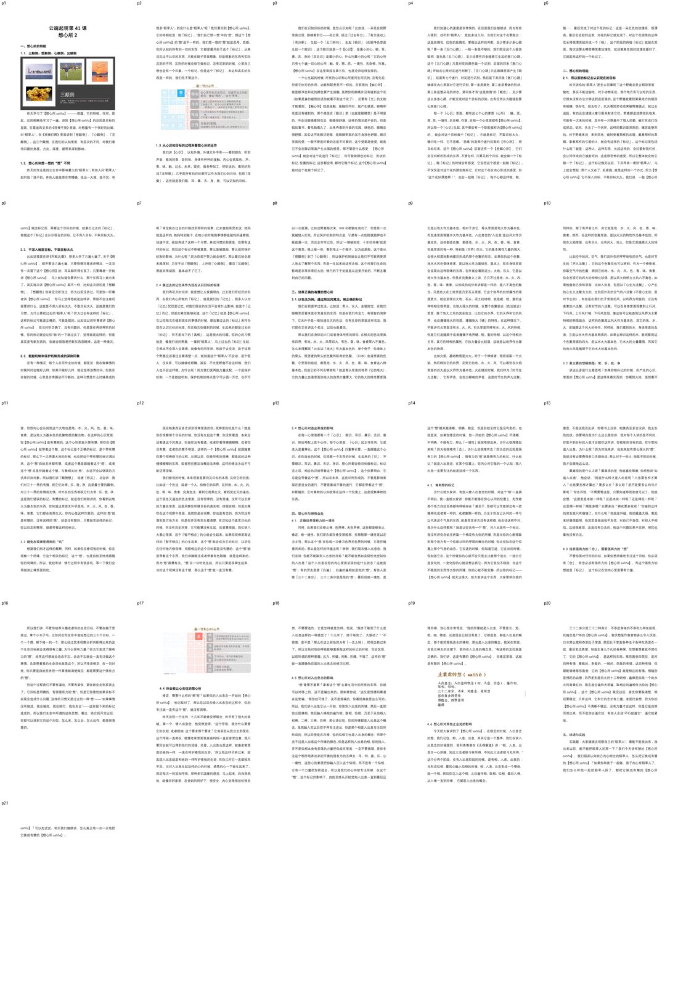
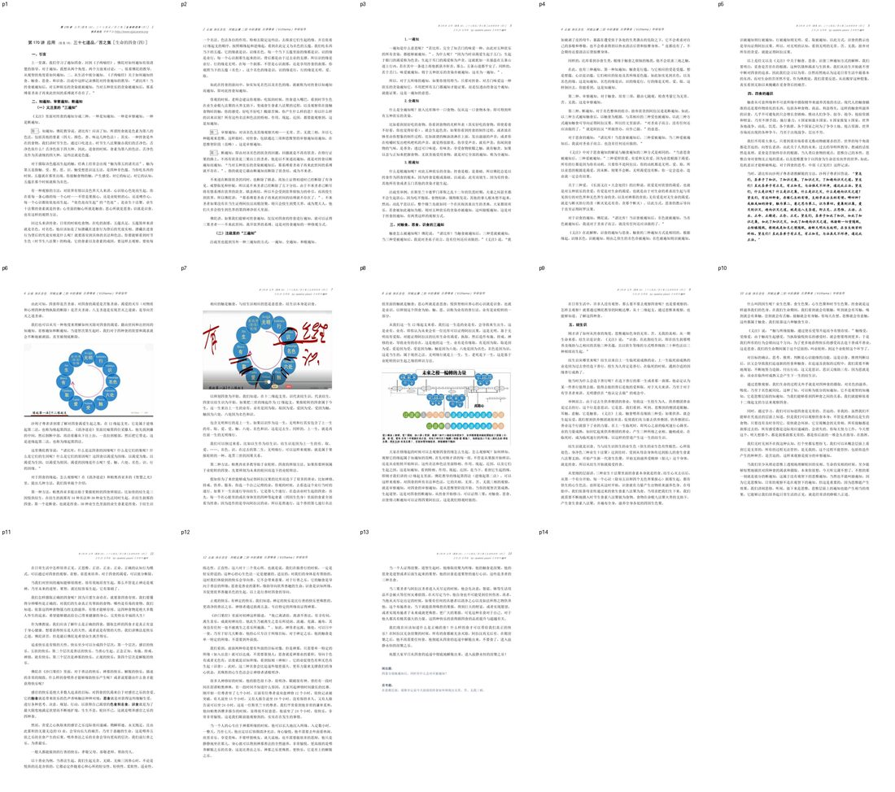
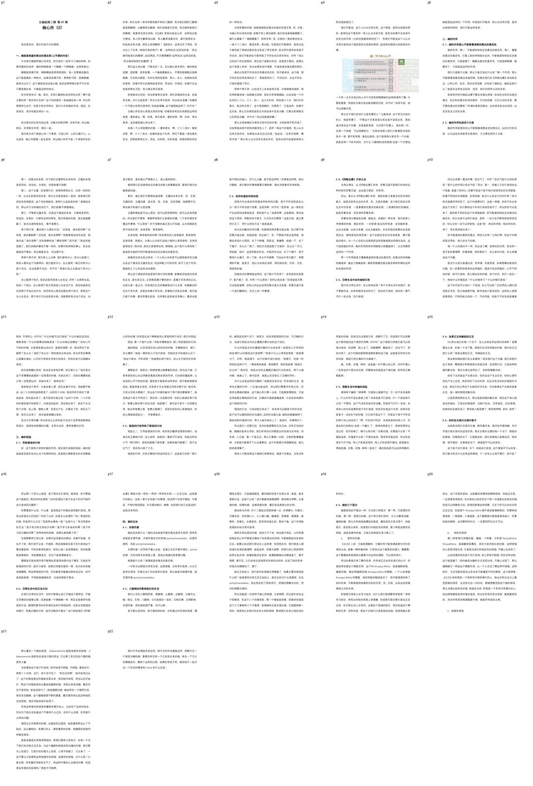
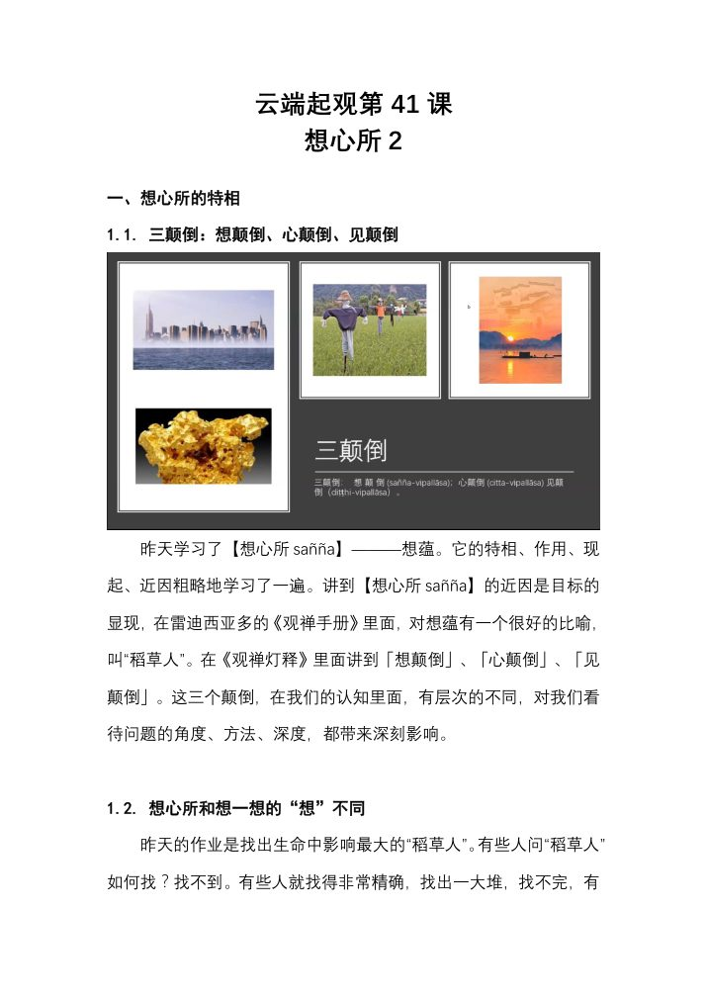
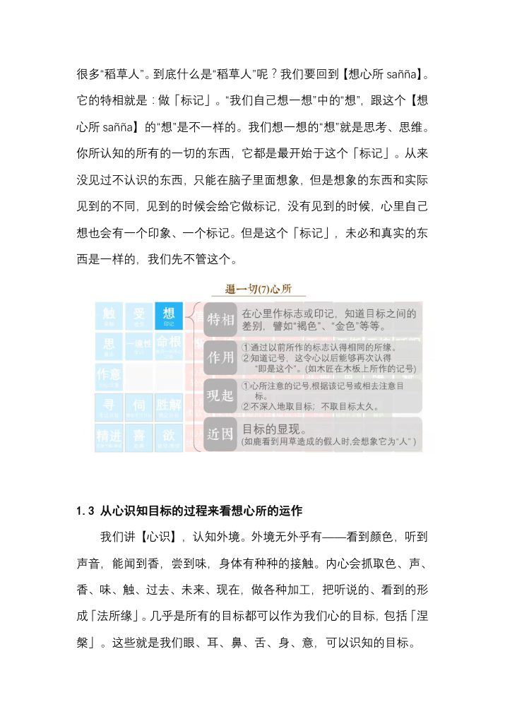
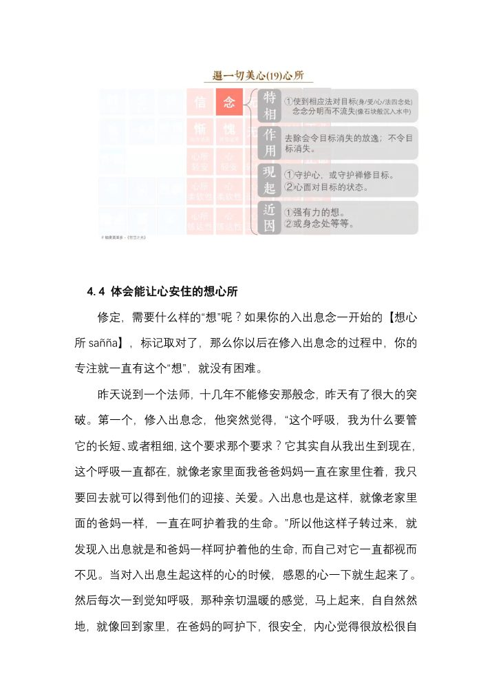
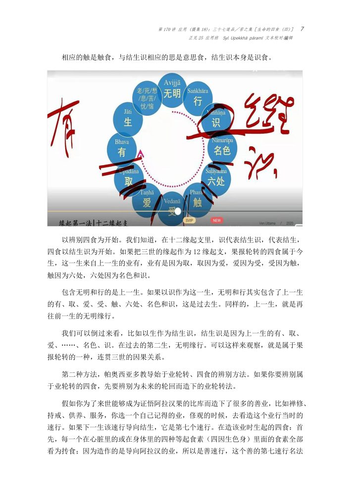
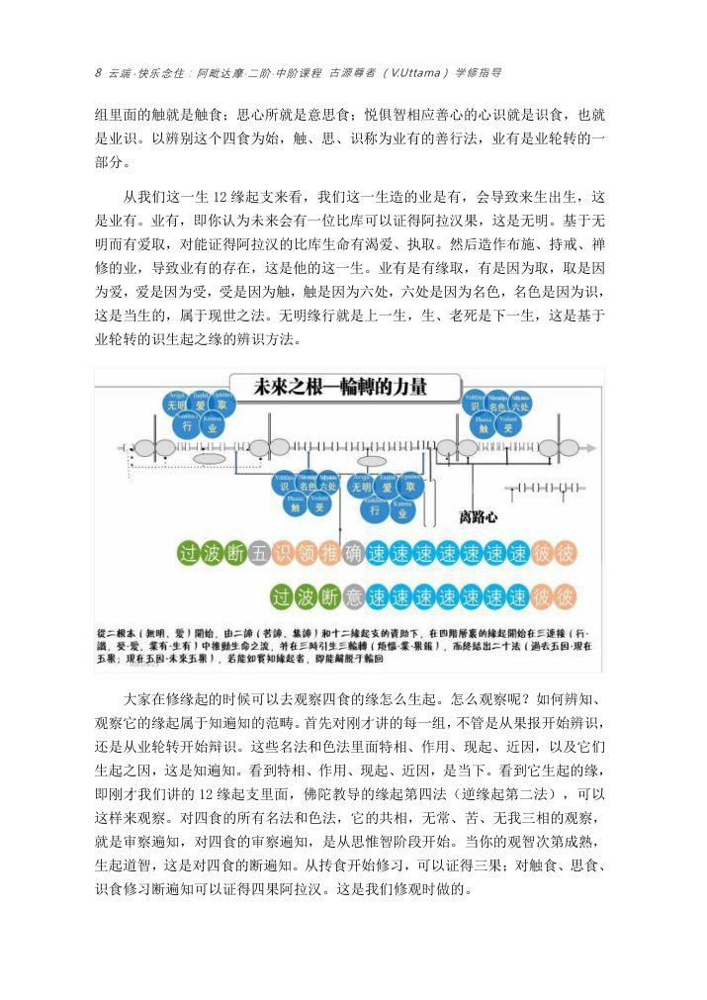
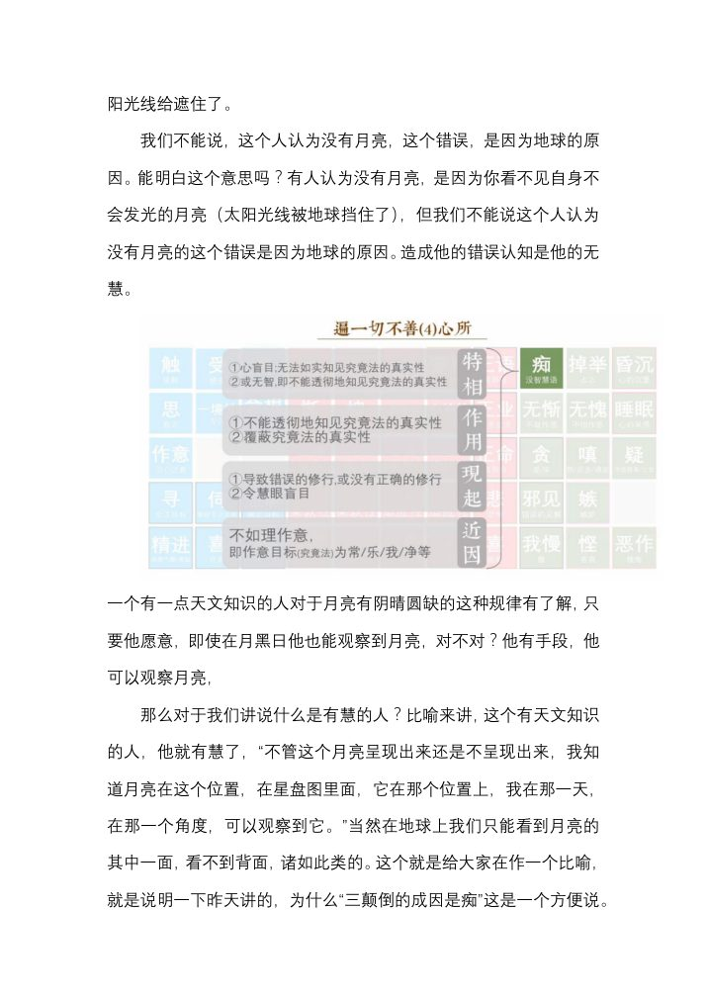

📅 最近更新：2026-09-23 01:51　|　第三版修订（4周版）：连续两周合并为9环节、单讲120分钟；共读原文一字未改；学员版去除主持人专属内容

# 第2周：三颠倒与束缚的运作机制（主持人版）

> ⭐ **本讲主持人速览**（新主持人必读，2分钟看完）
>
> 你不是老师，是"共学同行者"。你不需要提前懂内容，只需要按流程走。
> **本周由连续两周内容合并**而成，含两段共读、两轮分享与两轮讨论，单讲 120 分钟。
>
> | 环节 | 标准时长 | ⏱ 时间不够→ | ⏱ 时间富余→ |
> |:-----|:----:|:-----|:-----|
> | 🧘 静心开场 | 10 min | 缩至5 min | 加2分钟静坐 |
> | 📖 共读原文1 | 20 min | 只读★核心段（约15 min） | 加读◈扩展段 |
> | 💬 第一轮分享 | 10 min | 每人1句话 | 每人3分钟 |
> | 🎯 第一轮主题讨论 | 10 min | 只讨论问题① | 讨论全部问题+扩展 |
> | 🧘 禅修练习 | 15 min | 缩至8 min（只念引导词前半） | 延长至20 min |
> | 📖 共读原文2 | 20 min | 只读★核心段 | 加读◈扩展段 |
> | 💬 第二轮分享 | 10 min | 每人1句话 | 每人3分钟 |
> | 🎯 第二轮主题讨论 | 10 min | 只讨论问题① | 讨论全部问题+扩展 |
> | 🔚 收尾与回向 | 15 min | 缩至10 min | 保持 |
>
> **主持人10条守则（精简版）**：
> ① 不讲解、不提供答案——让原文自己说话；② 有人问"正确答案"→说"先听听大家的看法"；③ 冷场→主持人先分享自己的真实感受；④ 跑题→温和拉回："这个有意思，我们回到今天的原文"；⑤ 争论→"两种看法都很好，大家保留自己的理解"；⑥ 确保人人发言；⑦ 不评判任何人的分享；⑧ 时间到了就推进；⑨ 禅修练习照读引导词即可；⑩ 结束一起回向。

> **读书会16：突破生命的束缚 · 第2周（4周版 · 连续两周合并）**
> 主持人：你不需要提前懂内容，按本手册推进即可。
> 本周主题：****；****。

## 📋 本周信息卡

| 项目 | 内容 |
|:----|:-----|
| 时长 | 120分钟（4周版 · 9环节） |
| 核心问题 | 我们每天"看到"的世界，有多少其实是自己贴上去的旧标签？想颠倒、心颠倒、见颠倒这三层怎么一层比一层深？无明在其中扮演什么角色？从"知道有这个稻草人"到"把它拆掉"，中间要走哪几步？；束缚为什么能"自己转起来"？十二缘起这支循环里，哪一环是我们最容易下手的？四取（欲取／见取／戒禁取／我语取）和"爱"是什么关系？生命靠哪四种食存续，我一直在喂自己什么？为什么"受"是循环上最容易被打断的一环？ |
| 共读原文 | 共读原文1：本周**主源**为材料①《如来禅修学体系03-三颠倒&四种快乐-古源尊者-20250105》（`8c5c317e`，音声）——想蕴标记、麻雀与稻草人、三颠倒的口语讲解、"永远不要对果报采取非理性的行动"；**主源之二**为材料②《第41讲-想心所2-共修版.pdf》（`5712c8cc`）——想心所的特相与现起、三颠倒的定义、保护机制与鼓励机制、"常乐我净"是最主要的颠倒、有慧的想；**第三条主线**为材料③《突破生命的束缚3-古源尊者-20250422》（`e9b1dfb7`，音声）——"响应标记"与"改认知即下手处"、无明＋爱取＋行业。**扩展材料**为材料④《042讲-摄心所21-想心所3》（`d478c4aa`，音声）与材料⑤《第47讲-痴心所2-共修版.pdf》（`067f8127`）——想颠倒／心颠倒之别、见颠倒的断除次第、痴的现起与足处（非理作意）。原文全本见《读书会16素材/第3周_素材照录.md》。　｜　共读原文2：本周**主源之一**为材料①《突破生命的束缚4-古源尊者-20250423》（`a2b3e82b`，音声）——行（福行／非福行／不动行）、无明→爱取→四取、爱（欲爱／有爱／无有爱）、受、四取（欲取／戒禁取／见取／我语取）的判定、缘起与二十四缘结合修；**主源之二**为材料②《第 170 讲 应用(摄集 18)：三十七道品╱苦之集［生命的四食(四)］.pdf》（`2b97ee41`）——四食（抟食／触食／思食／识食）、义注三遍知与注疏三遍知、触食→三种受／思食→三种爱／识食→名色、四食即四圣谛、《正见经》引文；**第三条主线**为材料③《〈摄集〉汇总讲义-阿毗达摩应用二阶-153-196讲完整版.docx》（`ef11e067`）——"摄集之概括"总纲与**四执取（四取）分类表**（欲取、邪见取、戒禁取、我语取）。原文全本见《读书会16素材/第4周_素材照录.md》。 |
| 本周作业 | ①**简答题**：请用你自己的话，说出**想颠倒、心颠倒、见颠倒**三者的区别，并各举一个自己身上的例子（不要求举得准，要求举得真）。②**实践题**：本周任选一次"反应特别强"的日常情境（被一句话刺到、被某个场面触怒、突然很焦虑），事后回看：**我当时的标记是什么？这个标记是从哪一次经验来的？** 只记录、只观察，**不审判自己、不急着改**。；①**简答题**：请用你自己的话，说出**四取（欲取／见取／戒禁取／我语取）**分别指什么，并各举一个自己身上的例子（不要求举得准，要求举得真）。②**实践题**：本周任选一天，记录**三顿饭之外你还"喂"了自己什么**——刷了什么、追了什么、反复想了什么；各写一句：**我图的是哪种感受？** 只记录、只观察，不审判自己。 |

## ⏱ 时间弹性指南（本讲通用）

| 情况 | 应对方法 |
|:-----|:---------|
| **时间不够**（共读太长／讨论超时） | ① 静心开场缩至5分钟；② 两段共读原文均只读标注 **★核心** 的段落；③ 两轮分享每人只说一句话；④ 两轮主题讨论只讨论各自的问题①；⑤ 禅修练习缩至8分钟（只念引导词前半段）；⑥ 收尾回向缩至10分钟 |
| **时间富余**（共读快／讨论提前结束） | ① 用"📚 扩展内容包"中的补充原文段落继续共读；② 增加扩展讨论问题；③ 延长禅修练习时间；④ 增加"每人分享一个生活实例"环节 |

> 💡 原则：**讨论比读完重要，体验比讲完重要。** 宁可跳过扩展原文，也要让每个人都有机会说话。

## 🧘 静心开场（10 min）

> 💬 **破冰｜3–5分钟**：今天你对某个人或某件事的判断，有没有可能只是贴上去的旧标签？说一个，随即放下。

> 🛡️ **心理安全三约定**（每次开场在心里过一遍）：① **保密**——这里说的话不出这间屋子；② **不评判**——不评价任何人的分享，也不急着评价自己；③ **可随时暂停**——任何时候觉得不舒服，都可以停下来休息、喝水或离开，不需要解释。

**（一）就座与放松（0–2 min，照读）**

请找一个让自己坐得安稳的姿势，背部自然挺直，双手轻放，肩膀放松。轻轻闭上眼睛，或者微微垂视前方。做三次深长的呼吸：吸气——知道自己在吸气；呼气——知道自己在呼气。第三次呼气的时候，把今天所有的事情，暂时放在门外。这十分钟，你不需要完成任何事，只需要**回来**。

**（二）入出息念（2–7 min，照读）**

把注意力带到鼻端、带到人中这个位置，知道气息进，知道气息出。不需要控制它，不需要让它变长变细。它怎样，你就知道它怎样。如果心跑掉了，轻轻带回来，不责备。跑掉一百次，就带回来一百次——**带回来的那一下，就是修行在发生**。

（静默 2 分钟）

**（三）慈心引导（7–9 min，照读）**

现在，把这份觉知扩展到心里。对自己轻轻地默念三句：

> 愿我平安，愿我健康，愿我远离身心的痛苦。
> 愿我像了解自己一样，了解我的心。
> 愿我对自己温柔——**看清自己的心，不是审判自己**。

再把这份心意送给在场每一位法友，送给今天可能让你心烦的那个人。愿他们平安，愿他们也被自己的心温柔以待。

**（四）收摄与提示（9–10 min，照读）**

慢慢把注意力带回身体，带回坐垫，带回这个房间。睁开眼睛之前，先在心里放下一个念头：**今天我们要看的东西，不在外面，就在这里——在每一次"我知道""我早就知道"的那个标记里。** 我们现在开始，请带着这份安静，进入今天的共读。

---

## 📖 共读原文1（20 min）

> **【本周朗读段 · 开始】**（本段约 3572 字，供中等稍慢朗读，约 20 分钟；其余为默读／选读／延伸内容）

**主持人开场一句（照读）**：今天的三件材料，其实只讲一件事——**心怎么给自己贴标签，又怎么被自己的标签绑住**。请大家先只用耳朵听，把"名相"放在一边；听完之后我们再一起慢慢拆。

**阅读节奏建议**：材料①与②合计约 22 min（含读两遍的"麻雀与稻草人"），材料③约 4 min，小结 3 min，留 1 min 缓冲。

### 材料① ★核心：《如来禅修学体系03-三颠倒&四种快乐-古源尊者-20250105》（依据录音转写整理，已校对明显同音错字）

- 文件类型：音声（录音转写，保留时间码）
- 知识库出处：古源尊者开示及上座部佛教资料
- media_id：`soundrecording_d0dd1c0cd17209afe241ece24bf6b7b4_8c5c317eb4ec748306f28b18bf7e0c327439961422831605`
- 打开方式：ima知识库搜索「如来禅修学体系03 三颠倒 四种快乐 古源尊者」
- 查重说明：本 media_id 出现在《_禁用清单_参考_读书会01-14已用media_id.txt》（参考工具），但**对照《_段落级查重基线_读书会01-15.md》全表，读书会01–15 未见任何周的素材照录以本 id 为材料块**，属参考清单预留/并入项，本讲按整段取用，**无段落重叠**。另注：本文件与蓝图 W2 材料③《如来禅修学体系介绍03-古源尊者-20240623》（`38d50a4d`）系**两个不同文件**，勿混。
- 缺口说明：该音声转写稿为分段提取，**[00:24:11.950] 至 [00:48:09.700] 之间约 6600 字**在提取时被截断（含"四种快乐"前段）；本照录如实标注缺口，不以记忆补写。后段 [00:48:09.700] 起（助人之乐／念处之乐／涅槃之乐）**本周不朗读**，留待第 6 周「快乐的分层与超越」。

⚠️ 主持人操作：本材料只读下列**连续一段**（[00:05:29.300]–[00:24:11.950]，约 8 min）——想的特相·作用·现起·近因（标记／盲人摸象／稻草人）→ 麻雀与稻草人（标记错误→不会认→见颠倒）→ 权威与入出息的例子 → "不要对果报直接采取非理性的行动"→ 三颠倒的简单理解。其中 **[00:10:08.100]–[00:14:55.000]（麻雀与稻草人）请读两遍**。[00:48:09.700] 以后段落**跳读**（第 6 周用）。开头礼敬与回向段不朗读。

### 正文照录

> [00:05:29.300] 好，那我们来看这个想呢，它的特相是什么呢？它的标记所缘，譬如你认得褐色、金色等，好，那是通过标记而认的啊，就是简单来讲，它是标记所有。它的作用呢，是根据以前的标记而认得这个说明。啊，
>
> [00:05:52.430] 第二一个呢，是再一次做标记。比如说，你看到一个人热闹哦，想起来了，你是某某某啊，但是你最近好像气色不错，对吧？啊，那就对他过去的这个标记呢，要做一个调整啊。过去可能气色不大好，现在气色比较好哦，就是你又长胖了哦，你最近这个这个这个如何如何哦，他就再做一次标记，那以便下次再认得，再见到的时候还可以认他啊。
>
> [00:06:24.455] 这个就是这个啊，就像木匠给木头做标记一样。它的现起呢，这个要很注意好吗？就是这个现起就是呈现在你心里当下的那个状态。好，那它这个现起是什么呢？就是心抓住的标记。根据该标记或特征，取注意所缘。如盲人摸象摸到象鼻就认为大象像蛇啊。
>
> [00:06:53.500] 第二一个呢，它不深入不长久的取所缘，如闪电须臾即逝。啊，那大家可以体会一下。就是我们看到一个目标啊，或者遇到一件事情，我们会。很习惯的下意识的就拿出一个看法出来。啊，这个东西就是这样，而且你会非常坚持的认为这个是对的，为什么呢？我过去做了标记啊。我标记他就是这样嘛，对吧？好，但是呢，它是客观的吗。它是跟事实相符吗？就很难讲啊，对吧？
>
> [00:07:41.110] 所以那么为什么会出现盲人摸象呢？他就是因为你这个想啊。做了标记，不可观不完整的哦。而且呢，我们会很习惯是不深入不长久去做人，就一看见说哦，知道知道，不要跟我讲话，我早就清楚了啊，我想这个人怎么那么主观呢？这个人怎么那么固执呢？就是这个想在起作用呢。啊，他就是这个他不愿意深入的去观察啊，这是这个我们新的一个自然的习惯，所以我们说一个人呢，他是。这个不够主观，不够客观。啊，不够客观是一个很正常的现象，
>
> [00:08:28.570] 因为我们的心就是这样。我们不习惯客观的看问题，我们习惯用过去的标准看问题，用过去的记忆看问题。啊，我们只要我们认为这个是对的，我们就不愿意再深入的观察，就就就就就是这样的，有什么好讲的对啊，这是我们很习惯的一种表现啊。那这个就佛陀啊，就跟我们都讲的很清楚。然后他的近因呢，就已出现的所缘就像六路对草人所产生的人，想我们讲以前经常讲都是稻草人对不。啊，那。稻草人呢就是说。这个。你看到了那个，呃。
>
> [00:09:18.480] 草人啊，你以为是人？好，那，那就是为什么会有这样的标记呢？就是过去标记错了。啊，所以呢。这个一个人的心啊，他如果没有经过训练啊，我们就很习惯的主观看问题啊。
>
> [00:09:37.780] 那为什么要主观抗问题？以前标记过了，它的标记干嘛用呢？为它的生存和物种繁衍负责的呢啊对，所以呢，我们在想过去怎么标记，我们现在就怎么反应哦。
>
> [00:09:52.660] 所以我以前讲过，说你所认知的世界，是你的想蕴构建出来的，所以你是完全被你的三颠倒，被你的思想捆绑住啊。然而呢，就是。
>
> [00:10:08.100] 为什么会这个想这个？这个这个在经典里面把它给比喻成稻草人的啊，稻草人可能有些在农村里面长大的人就知道了。在中国呢，是没有鹿了啊，鹿都被我们杀完了，除了是养起来了，在国外有很多野鹿啊。那我们很多稻田里面有麻雀，当然现在麻雀也很少，都被农药毒死了。
>
> [00:10:38.660] 那我们小的时候呢，就是田里面有很多麻雀。那这个麻雀呢？怎么这个露天啊？你怎么防它呢？农民呢，就会像这样在田里面插很多稻草人。用稻草扎的，然后穿上破衣服，戴上斗笠，吓得麻雀又不敢（来）。好，
>
> [00:11:02.230] 那为什么不敢来呢？它显然有麻雀呢。在来吃稻谷的时候被这个带着。斗笠，穿着破衣服的人赶过，甚至被打过，有些麻雀被打死了。啊，这个这个这个，所以他觉得这个啊，这些戴斗笠穿蓑衣的这些人是会伤害他。啊，这个，呃，麻雀的雀身，如果遇到这样的人，我们就要离开啊，要躲起来啊。嗯。好那这个呢，就是叫做啊。这个标记错误那。就是本来呢，他是人啊，这个农民会打麻雀，但这里把它标记成凡是戴着斗笠、穿着破衣服的人。入围大权好。这是标注。
>
> [00:12:12.740] 讲的说，一朝被蛇咬，十年怕井绳哦，他就是把草绳当成了蛇，看成了蛇，就是把那个弯弯绕绕一条条的都把它标记成是蛇。那这个是标记错误。好。那你标记错误习惯了，如果说你这个雀妈妈。他被打过。然后呢，这个雀儿子呢，这个没有被打过，但是这个雀妈妈给他讲，你不要去，凡是这样的，你的不要碰。那这个却小子呢？他就不会认了，他就凡是那个的都是。哦，那说实在话呢，如果雀妈妈那个雀爸爸胆子大一点，就这看长时间都不动，
>
> [00:13:03.235] 这是真的吗？我们过去看看，再近一点，再近一点，再近一点，可以发现说哦，原来是不会动的假人，我就把它吃饱了再回来，对吧？所以，它是可以破除那个那个那个想蕴标记的这个标记错误，它是可以改变的。但是那个雀孩子呢，如果被爸爸妈妈教成的，说阿哥是会打死我们的，你坚决不能去，那么这个雀小子呢，就变成他就不会认了。啊就是连碰都不敢碰了，好就我们近一点去尝试都不敢了啊那这种状态呢，
>
> [00:13:43.175] 就是我们会完全把这一类东西都把它标记成，把它想这个这个确认成是会伤害我们的，就是你的心本身就没有这个识别的功能啊。
>
> [00:13:55.160] 前面那个雀妈妈呢，但是标记错了。那这个这你这个雀孩子呢，就是不会标记，他就他就不会认的。就是这样。啊，就前面那个我们就叫心颠倒，就叫想颠倒啊不要比如说我叫想颠倒啊不会认真就叫心颠倒，就是你的心已经失去这个识别的功能了，就像心电脑。
>
> [00:14:19.300] 然后呢，这个当这个一大群的这个麻雀在开会的时候，那这个这个这个这个雀孩子长大了，他说我要发言。我妈给我说，凡是那样的，就一定是会打我们的，一定是人啊，这个是绝对的，这是肯定的。你们想都不要再想了。这个东西不能去冒险，它已经变成这个雀孩子的一个见解，非常坚固的见解，不可改变的见解啊，那个就叫见颠倒。
>
> [00:14:55.000] 啊，这我们叫三点倒好，那我们日常呢，我们得看我们在日常生活当中啊，对待这些人事物呢啊，他就是这样的一种情况啊，对吧。

> **【本周朗读段 · 结束】**（以下为默读／选读／延伸内容，时间富余时再读）
>
> [00:15:07.300] 啊，那比如说这两天有同学讲，跟我一见到权威我就发抖，然后一见到权威就发抖的原因呢，就是过去权威曾经批评过他啊，这个这个教训过他。他留下了深刻的印象，
>
> [00:15:24.450] 就像那个麻雀一样，被这个穿着斗笠穿着破衣服的人追赶过打过啊，留下深刻印象。一碰到嗯。又是妈妈哎，所以这个时候呢，你是属于这种。想变大标记错误对吧。就是你过去的那个权威呢，批评过你啊，然后这个权威真的就会这样批评你吗？啊，不一定哦，即使批评你也是有道理的啊。啊，那。这个但是呢，你会把它定义成说。所有权威都一样好，那这个就是想见法。
>
> [00:16:07.540] 对，那我们要解决这个问题呢，我就想要把稻草人拆了啊，就看到说稻草人不是人。啊，并不是所有的权威都会伤害人，所有所有的权威都会无缘无故的欺负人，而不是这样的一个实事事实啊啊。那。
>
> [00:16:31.320] 回过头来再讲，比如说我们禅修的时候，我们入出息，我们会控制它。哦，为什么会控制他呢？因为你在日常生活当中做事情就是控制而来的。啊，你通过控制你完成的任务。所以你觉得干什么事儿我都要控制，因此呢，入出息也是要控制的，不控制怎么完成任务呢？啊，那这也是一种颠倒哦好，
>
> [00:16:58.890] 那为什么我跟大家讲说你要去，当你有嗔心升起来，当你有嗔心升起来，一定是有一个。标记它是错误的，后面一定有想颠倒，或者心颠倒，或者见颠倒。那你要去看到这个认知呢，你不去看到这个认知，你就很难改变，你只是说啊，我不要紧张，我不想控制，我不想控制，没用的啊，
>
> [00:17:28.390] 很多人有这种感受，对吧。啊，你不找到根源的，你你就是给他讲的，说不要碰，说我还是这样，我还是这样啊所以呢这个。这个佛陀讲的，我们要认识到这个颠倒啊，然后呢，这个要怎么去除这个颠倒啊？那我们看问题呢。这个。怎么去观察我们有没有颠倒呢？就。
>
> [00:18:13.050] 网友经常说的一句话叫做说，永远不要对果报采取非理性的行动。
>
> [00:18:20.780] 啊，果报是什么呢？眼睛看到，耳朵听到，鼻子闻到，舌头尝到，身体接触到的全是果报。当那个东西出来的时候，我们会一般情况下会很习惯性的就做出一个反应。大部分没有被训练的心做出来的反应呢，都是非理性的，为什么呢？就是为了生存某种反应，对底层的动物性的反应。嘿。
>
> [00:18:50.540] 修行的第一步，就是你能觉察到这个反应又出来了。啊，觉得他到这个反应出来，你能够停下来看一看，就跟我这个反应后面是不是有稻草人呢？啊，有没有错误的认知在后面支撑呢？如果有后面有错误的支撑，在这个认知在后面支撑呢，那你就不能用用这种惯性去反应，你必须把它拆掉好那。
>
> [00:19:23.600] 原则是什么呢？原则是说。外在可能有对有错，有好有坏啊，有是有非，但是你的心都不能够生起不善心。只要你生起不善心了，就一定有稻草人。啊。那有些人呢，就想说，那明明看到对方这个偷盗了啊，杀人放火了，难道你也不能生气吗？生气有用吗？关键是对我们可以谴责这样的行为，我们可以用去啊尽你的力量去阻止这样的行为，但是。
>
> [00:20:09.920] 为什么要用生气的方式去做呢？当我们一生气的时候，他就会有一个什么问题呢？因为只要不善心升起来，他就有一一定有四个心理素质跟他一起升起。
>
> [00:20:27.100] 痴、无惭、无愧。啊，你生气的时候，你看到一个人做坏事了，你生气了？生气是什么呢？痴、无惭、无愧，再去加一个嗔心。啊，那。
>
> [00:20:44.840] 为什么会有痴？在这个嗔心里面，我明明看到这个人做坏事了，我怎么会有嗔心呢？我会有痴心呢？会有吃的素质呢啊？因为你看到一个人做坏事，你的心就只是停在你对这件坏事的反应的那个感受上。对吧。这个人太可恶了，这个人怎么可以这么看的？我是能说好看的，对吧？你的心已经停在那个感受上了，而不是那个事实上。
>
> [00:21:18.780] 所以，当你的心从那个事实跳出来，变成你的这个专注在你的感受的时候，你已经掉队了。一个掉举的心，就跟事实没有在一起就是。没有看到真相就是愚痴。然后那那个时候生气了，就是你觉得生气是应该的。啊，我不害怕生气，就面对这样的人，就是要生气嘛，哦。对，就是要阻止嘛，哦，那个就是不怕自己生起这个不善心呢。啊，这个是叫做无愧。对于不善心生起，不会觉得羞耻，这个是无惭。所以所有的贪嗔之生起的后面都有痴、无惭、无愧。
>
> [00:22:12.800] 那一个不能够跟事实结合啊，在在跟当下的这个状态有充分了解充分把握的情况下啊，你去做的行为呢啊，往往都是。错误的。
>
> [00:22:30.240] 举个例子，有个人掉河里去了。你非常有慈悲，二话不说就跳进去了。结果，结果还要别人来救你。对，好，那那你看到别人作恶了，你也二话不说冲过去，结果被人家捅一刀了。对你没把别人救了，就是自己死了。
>
> [00:22:50.880] 啊，这个情况很多啊，但是我们不是说见死不救，就是你看清楚情况行不行？对吧，做出正确的行动行不行啊，就是不要对果报直接采取非理性的行动啊哎，那这个就是说我们防止这个稻草人起作用的很重要的一个啊步骤啊。啊，那么你要防止这个稻草人起作用，你拥有觉察。你不能够随着你的惯性就出去哦。那不随着惯性出去，你首先要有正面认知，你要有一点定力对吧？我们讲这个人要有一点定力啊啊你不会所谓的定力，在这个时候，所谓的定律呢，就是不会被这些惯性带走啊。啊。那。
>
> [00:23:45.700] 对就三颠倒的简单理解呢，就是说。想颠倒呢，就是标记错误。见颠倒呢，那就是错误归纳。啊，心颠倒呢，跟想颠倒的区别呢，就是想颠倒。它还可以纠正。因为它标记错误。心颠倒呢，他就于丧失这个能力啊，他觉得这个。就就是就是这样，
>
> [00:24:11.950] 经典里面讲说
>
> 【整理注记】以上为材料①共读选用段（[00:05:29.300]–[00:24:11.950]）。音声转写原稿存在大量同音错字（「线体」＝现起、「静音」＝近因、「三鞅」＝三颠倒、「见见到了」＝见颠倒、「道号」＝稻草人、「无常无愧」＝无惭无愧、「餐厅」＝嗔心、「陆主席／入出席」＝入出息、「西天导」＝心颠倒），已按原文照录，未作改写，集中校注见《第3周_素材照录.md》材料①。[generated, not original text]

### 材料② ★核心：《第41讲-想心所2-共修版.pdf》

- 文件类型：PDF（共修版讲义／课件）
- 知识库出处：古源尊者开示及上座部佛教资料
- media_id：`pdf_d0dd1c0cd17209afe241ece24bf6b7b4_5712c8cc52785cb11f608416d4327e157439961422831605`
- 打开方式：ima知识库搜索「第41讲 想心所2 共修版」
- 查重说明：经与《_段落级查重基线_读书会01-15.md》逐条比对，**读书会01–15 未见以本 id 为材料块**（读书会14 所取「摄心所分别」为其自身课件系列的**不同文件**），本讲按整段取用，**无段落重叠**。
- 缺口说明：该 PDF 附表格与图解；表格文字（1.1 节内「遍一切(7)心所」）提取后顺序混乱，**按原样保留**；文末「遍一切美心(19)心所」为 `graph TD` 图形代码，非正文，**存目不照录**。3.1 节（以色法为例）与「四、想心所与禅修业处」全节（入出息念等止业处）本周**跳读**，原文全本见《第3周_素材照录.md》材料②。

⚠️ 主持人操作：本材料读 **1.1（三颠倒定义）→1.2（想心所与"想一想"不同）→1.3（心识知目标的过程）→二 2.1–2.4（用旧标记认识现在的目标／不深入取目标／鼓励与保护机制／拿过去记忆当标准）→3.2（常乐我净）→3.3（观禅的坑）→3.4（对造业果报的影响）**，约 14 min。其中 **1.1 与 3.2 由主持人亲读**；3.1 与第四节**跳读**（一句话交代："后面讲色法与入出息念的段落，本周不读，它讲的是同一个『想』怎么用在止观上。"）。

### 正文照录

> 标题: 第41讲-想心所2-共修版.pdf
>
> # 云端起观第 41 课
> ## 想心所 2
>
> # 一、想心所的特相
>
> # 1.1. 三颠倒：想颠倒、心颠倒、见颠倒
>
> 三颠倒三颠倒：想颠倒(sanifa-vipallasa);心颠倒(citta-vipallasa)见颠倒(ditthi-vipallasa).
>
> 昨天学习了【想心所 sañña】——想蕴。它的特相、作用、现起、近因粗略地学习了一遍。讲到【想心所 sañña】的近因是目标的显现，在雷迪西亚多的《观禅手册》里面，对想蕴有一个很好的比喻，叫“稻草人”。在《观禅灯释》里面讲到「想颠倒」、「心颠倒」、「见颠倒」。这三个颠倒，在我们的认知里面，有层次的不同，对我们看待问题的角度、方法、深度，都带来深刻影响。
>
> # 1.2. 想心所和想一想的“想”不同
>
> 昨天的作业是找出生命中影响最大的“稻草人”。有些人问“稻草人”如何找？找不到。有些人就找得非常精确，找出一大堆，找不完，有很多“稻草人”。到底什么是“稻草人”呢？我们要回到【想心所 sañña】。它的特相就是：做「标记」。“我们自己想一想”中的“想”，跟这个【想心所 sañña】的“想”是不一样的。我们想一想的“想”就是思考、思维。你所认知的所有的一切的东西，它都是最开始于这个「标记」。从来没见过不认识的东西，只能在脑子里面想象，但是想象的东西和实际见到的不同，见到的时候会给它做标记，没有见到的时候，心里自己想也会有一个印象、一个标记。但是这个「标记」，未必和真实的东西是一样的，我们先不管这个。
>
> （【整理注记】此下原文附「遍一切(7)心所」表格，OCR 后文字顺序混乱，按原样保留：）
>
> 遍一切(7)心所
>
> 触想受在心里作标志或印记，知道目标之间的信特相接触印记感受差别，譬如“褐色”、“金色"等等。命根渐思一境性①通过以前所作的标志认得相同的所缘维持一刑那心专注作用之命②知道记号，这令心以后能够再次认得“即是这个".(如木匠在木板上所作的记号小月作意轻安引心注意①心所注意的记号，根据该记号或相去注意目现起标.小月寻伺胜解②不深入地取目标；不取目标太久柔软专注目标专注目的确定目标的见能目标的显现。近因小月喜欲精进(如鹿看到用草造成的假人时，会想象它为“人")练达次三气欲早/希望
>
> # 1.3 从心识知目标的过程来看想心所的运作
>
> 我们讲【心识】，认知外境。外境无外乎有——看到颜色，听到声音，能闻到香，尝到味，身体有种种的接触。内心会抓取色、声、香、味、触、过去、未来、现在，做各种加工，把听说的、看到的形成「法所缘」。几乎是所有的目标都可以作为我们心的目标，包括「涅槃」。这些就是我们眼、耳、鼻、舌、身、意，可以识知的目标。
>
> 我们在识知目标的时候，是怎么识知呢？比如说，一朵花在视野里面出现，眼睛看到它——花出现，经过「过去有分」、「有分波动」、「有分断」，生起一个「五门转向」，生起「眼识」（在眼净色里面生起一个眼识）。这个眼识就是一个【心识】，是最小的心。眼、耳、鼻、舌、身的「双五识」是最小的心。什么叫最小的心呢？它的心所只有七个遍一切心的心所：触、受、想、思、一境性、名命根、作意。
>
> 【想心所 sañña】在这里面排在第三位，也是论师这样安排的。
>
> 一个心生起的时候，所有的心识和心所是同生同灭的，没有先后，但是它执行的作用、功能和职责是不一样的。在前面的【触心所】，就是眼净色和花的颜色要产生接触，虽然你的眼睛并没有碰到这个花（如果是真的碰到的话你就看不到这个花了），还要有「光」的支助才能看到。【触心所】就是接触，接触的同时，就产生感受。眼睛和花是没有碰到的，那个感受在「眼识」里（也就是眼睛里）是不明显的，不会说眼睛看到花后，眼睛很舒服，这样的情况是不多的。但是假如看书、看电脑看久了，出来再看到外面的花园，绿色的，眼睛会很舒服。其实这不是眼识舒服，是眼睛里面的其它身净色舒服。眼识里面的受，一般不管是好看的还是不好看的，这个受都是舍受，就是它不会在眼识里面产生太强的感受。那不管是什么感受，【想心所 sañña】就会对这个花进行「标记」，你可能做颜色的标记，形状的标记，位置的标记，这些都会有，都对它做个标记。这个【想心所 sañña】就对这个花做个标记了。
>
> 我们知道心的速度是非常快的，在后面我们会继续讲，因为有些人提到，找不到“稻草人”，我就多说几句。当我们对这个花要做出：这是玫瑰花，红色的玫瑰花，要做出这样的判断，至少要多少条心路呢？要一条「五门心路」，一般一条是不够的。我们假设这个人极其聪明，首先是「五门心路」，至少还要有四条随着它生起的意门心路。
>
> 这个「五门心路」只是对花的颜色做一个识别，后面的四条「意门心路」开始在心里对花进行判断了。「五门心路」只在眼睛里面产生「眼识」，后面有七个速行，对花进行识别。然后接下来四条「意门心路」继续在内心里面对它进行识别，第一条是颜色，第二条是整体的形状，第三条是整朵花的状态，第四条才有“这是玫瑰”的「概念」。至少要这么多条心路，才能完成对这个目标的识知。也有论师认为随彼起要七条意门心路。
>
> 每一个「心识」里面，都有这七个心的素质（心所）：触、受、想、思、一境性、名命根、作意。在每一个心里面都有【想心所 sañña】，所以每一个「心识」生起，其中都会有一个职能被称为【想心所 sañña】的 ，就会对这个目标做个「标记」。它就是标记，不取目标太久，像闪电一样，它不思维。“思维”的是那个速行后面的【寻心所】，把目标拉来，这个【想心所 sañña】后面还有一个【胜解心所】，它们交互判断所形成的东西。不管怎样，只要见到个目标，就会做一个「标记」。做「标记」的时候会有感受，它会把这个感受一起做「标记」。
>
> 不仅仅是对这个花的颜色做标记，它对这个花在内心形成的感受，如“这个花好漂亮啊！”，也会一起做「标记」。每个心都这样做、做、做……，最后完成了对这个花的标记：这是一朵红色的玫瑰花，很漂亮。最后会追踪到这里，对花的标记就完成了。对这个花园里的这种花长得很漂亮就形成一个「相」，这个阶段的终极「标记」就留在里面。每次说要去哪里哪里看玫瑰花，就说某某花园的玫瑰花最好了，它就起来这样的一个标记了。
>
> 二、想心所的现起
>
> 2.1. 用以前的标记去认识现在的目标
>
> 昨天讲你的“稻草人”是怎么回事呢？这个野鹿总是去稻田里面偷吃，其实不能说偷吃，对于动物来说，那个地方有可以吃的东西，它根本没有办法分辨这到底是谁的。这个野鹿就看到某某地方的稻田有稻穗，很好吃，就去吃了。农夫看到劳动成果被野鹿侵占，就过去追赶。有的还会请猎人拿弓箭来射杀它们。野鹿都是成群结队地来，可能有一次来的时候，其中有一只野鹿中了猎人的箭，被打死或打伤或抓走、砍死，失去了一个伙伴，这样的教训是深刻的，痛苦是惨烈的。对于野鹿来说，来到田地，碰到穿着那样的衣服、戴着那样的草帽、拿着那样的弓箭的人，就会有这样的「标记」。这个标记里包括什么呢？就是：这种人，这种东西，长成这样的，会拉箭射我们的，会让同伴或自己被射死的，这是很恐怖的感受。所以它整体就会给它做一个「标记」。这个标记做完以后，下次再来一看到“稻草人”，马上就会想起：那个人又在了，赶紧跑。就是这样的一个方式。因为【想心所 sañña】它不深入目标，不取目标太久。我们讲，一般【想心所 sañña】做完标记后，再看这个目标的时候，就拿出过去的「标记」，根据这个「标记」去认识现在的目标，它不深入目标，不取目标太久。
>
> 2.2. 不深入地取目标，不取目标太久
>
> 比如说我现在讲《阿毗达摩》，很多人学了六遍七遍了。关于【想心所 sañña】，都不要说六遍七遍，只要悟德玛尊者讲佛法，一定没有一次落下这个【想心所】的，耳朵都听得长茧了。只要尊者一开始讲【想心所 sañña】，马上就知道你要讲什么，那个东西马上就出来了。其实每次讲【想心所 sañña】都不一样，比如这次讲的是「想颠倒」，「想颠倒」你肯定没听说过，因为以前没讲过。可是你一听尊者讲【想心所 sañña】，你马上觉得他就是这样讲，那就不会注意后面要讲什么，这就是不深入目标太久，不取目标太久，这就是我们的习惯。为什么要找过去的“稻草人”呢？因为过去有这样的「标记」，这样的标记可能是正确的，可能是假的。比如说以前听尊者讲【想心所 sañña】，你当时听正确了，没有问题的。但是现在再讲再听的时候，你的标记就会让你“啪”的一下就过去了，觉得就是这样的，但是其实是有新东西的，你就会很容易把新东西忽略掉。这是一种情况。
>
> 2.3. 鼓励机制和保护机制形成的深刻印象
>
> 还有一种情况，每个人在写作业的时候，都是说：我在做事情的时候同时会做好几样，如果不做好几样，就会觉得浪费时间。但其实在做的时候，心里是非常躁动不宁静的。这种习惯是什么时候养成的呢？肯定能在过去的时候找到那样的场景。比如曾经有贤友说，她妈就是这样的，她妈特别能干，在她小的时候做事情都是被妈妈逼着做，快速干完。她就养成了这样一个习惯。养成习惯的前提是，你要有这样的标记，然后这个标记不断被重复，要么是被鼓励，要么受到保护机制的影响。为什么呢？因为你若不努力就会挨打。那么最后就会越来越深刻，乃至于从「想颠倒」，上升到「心颠倒」，最后「见颠倒」，那就非常顽固，基本动不了它了。
>
> 2.4 拿过去的记忆来作为现在认识目标的标准
>
> 我们再花点时间讲，就是想让大家搞明白，过去我们所经历的东西，在我们内心所做的「标记」，就是我们的「记忆」。很多人认为「记忆」仅仅是记忆，对我们现在的生活不会有什么影响，就是个「记忆」而已。但是如果你能够知道，这个「记忆」就是【想心所 sañña】，它让你每次在碰到现在的事情的时候，都会拿过去的「标记」来作为现在认识目标的标准。而且每次你碰到的时候，生起来的都是过去的「标记」，而不是当下的「真相」，这是很大的问题。你的心的习惯就是，像我们说的野鹿，一看到“稻草人”，马上过去的「标记」生起，它根本不会深入去看看。就像有的同学讲，和孩子去交流，孩子说那个野鹿应该凑过去看清楚一点，就知道这个“稻草人”不会动，是个假人，没关系，可以继续吃稻穗。其实，不光是野鹿不会这样做，我们人也不会这样做。为什么呢？因为我们受两股力量支配，一个是保护机制，一个是鼓励机制。保护机制的特点是宁可认错一万次，也不可以一次疏漏。比如说野鹿每次来，999 次都偷吃成功了，但是有一次就被猎人打死，所以保护机制的特点是，宁愿有一点危险就跑掉也不能疏漏一次，而且会牢牢记住。所以“一朝被蛇咬，十年怕井绳”就是这个意思。晚上暗一些，看到地上一个棍子，以为这是蛇。这个是从「想颠倒」到了「心颠倒」，所以保护机制就会让我们不可能再更深入地去了解那个东西，而是一生起来就这样去做。这个对我们生命的影响是非常非常巨大的，修行的下手处就是从这里开始的，不断去看到自己的问题。
>
> 三、培养正确的有慧的想心所
>
> （【整理注记】3.1「以色法为例，通过照见究竟法，做正确的标记」本周跳读，原文见《第3周_素材照录.md》材料②。）
>
> 3.2 最主要的想颠倒是：常、乐、我、净
>
> 讲这么多是什么意思呢？如果你做标记的时候，所产生的心识，里面的【想心所 sañña】是这样来看东西的：你看到大地，虽然看不穿，但你内心会认知到这个大地也是地、水、火、风、色、香、味、食素，是以地大为基本色的色聚物质的聚合物。在这样的心识里面，你【想心所 sañña】是有慧根的。这个心所里面只要有慧，那你的【想心所 sañña】就带着这个慧，这个标记是个正确的标记，是个带有慧的标记。那么下一次再看大地的时候，也会把这个带有慧的标记调出来，这个“想”自始至终都有慧，或者这个慧是跟随着这个“想”，或者这个“想”总是伴随着这个慧。与慧相关的“想”，永远不会以错误的方式来识知对象。所以我们讲「颠倒想」，或者「邪见」，总会讲：我们对三十一界的有情，视它们为常、乐、我、净，这是最主要的颠倒。
>
> 对三十一界的有情或无情，对外在的东西都视它们为常、乐、我、净，这是我们错误的标记。有慧的标记，就是我们刚刚讲的，你看到以地大为基本色的东西，你知道这里面无外乎是地、水、火、风、色、香、味、食素，它们都在刹那生灭。你内心是这样作意的，这样的“想”就是有慧的，没有这样的“想”，就是没有慧的。只要做完这样的标记，你以后走到哪里，就都带着这样的标记。
>
> 3.3 避免在观禅里遇到的“坑”
>
> 根据我们刚才这样的解释，同样，如果你在修观智的时候，你在观察一个所缘，它这个相关的标记，这个“想”，也是自始至终地跟随你的观禅的。所以，我经常讲，修行过程中有很多坑，等一下我们会再细讲止禅里面的坑。
>
> 现在帕奥西亚多吉讲到观禅里面的坑。观禅里的坑是什么？就是你在观察那个目标的时候。你没有生起这个慧，你没有看透，本来应该看透这个究竟法，但是你没有看透，或者你看得模模糊糊，或者你没有慧，或者你的慧不明显。这样的一个【想心所 sañña】就跟随着你整个观禅修习的过程。从那以后，你修所有的观禅，都是起的这种模模糊糊的东西，或者把究竟法当概念法来修，这样的修法永远不可能证得涅槃。
>
> 我们修观的时候，本来观智是要洞见目标的本质，见到它的究竟。比如说一个色法，或者一个人，你修它的四界，见到地、水、火、风、色、香、味、食素，究竟色法，看到它刹那生灭，看到受生灭的逼迫。这个受生灭逼迫的色法里面，没有恒常的，没有灵魂，没有可以主宰的力量在里面。这是洞察你所缘目标的真实相，终极实相。但是如果你在这个观察中里面，虽然你是在观察，你也是有念的，因为你没有落到其它地方去，但是你并没有完全看清楚，在识知这个真实目标的时候，并没有完全洞穿，它可能慧没有生起，或者慧很弱。我们讲八大善心里面，这个「智不相应」的心就会生起来。如果你观禅里面这样的「智不相应」的心生起来，这个“想”就会成为它的标记，以后你在任何地方修观禅，观察相应的这个目标都是没有慧的，这个“想”就是带着这个东西。我们讲障眼法或者带着有色眼镜，就是这样来的。
>
> 因为“想”跟慧有关，“想”在一切时处生起，所以只要是观禅生起来，当时这个观禅没有这个慧，那么这个“想”就一直没有慧。
>
> 3.4 想心所对造业果报的影响
>
> 在每一心里面都有一个「心识」，眼识、耳识、鼻识、舌识、意识，然后再配上若干心所。每个心里面，「心识」起主导作用，它是老大是董事长。这个【想心所 sañña】归董事长管，一直跟随这个心识。在你造业的时候，你观察一个东西的时候，生起来的「识」，不管眼识、耳识、鼻识、舌识、身识，想心所都会给目标做标记。标记完之后，相应的识就带着这个【想心所 sañña】。这个你要明白，它总是会带着这个“想”。所以在未来，这些识所形成的，不管是影响果报还是造业的速行，不管是善或不善的速行，它都是带着这个“想”，如影随形，它对事物的认知就停在这样一个位置上。这是观察事物的东西。
>
> 四、想心所与禅修业处
>
> （【整理注记】「四、想心所与禅修业处」（4.1–4.6，谈入出息念、白遍、三十二身分等止业处中的"想"）本周跳读，原文见《第3周_素材照录.md》材料②。其中一句可在小结时引用：**「念的近因是强有力的想心所」**。）

### 材料③ ★核心：《突破生命的束缚3-古源尊者-20250422》（依据录音转写整理，已校对明显同音错字）

- 文件类型：音声（录音转写，保留时间码）
- 知识库出处：古源尊者开示及上座部佛教资料
- media_id：`soundrecording_d0dd1c0cd17209afe241ece24bf6b7b4_e9b1dfb75470ddf85840d6b3f18ad7f97439961422831605`
- 打开方式：ima知识库搜索「突破生命的束缚3 古源尊者 20250422」
- 查重说明：本 media_id 出现在《_禁用清单_参考_读书会01-14已用media_id.txt》（参考工具），但**对照《_段落级查重基线_读书会01-15.md》全表，读书会01–15 未见任何周的素材照录以本 id 为材料块**，本讲按整段取用，**无段落重叠**。
- 缺口说明：知识库返回稿为**内容片段**（非全篇），时间码多处跳跃；以下按时间码升序照录，不补写、不拼接。经核对，本片段**未出现「三颠倒」字样**，相关表述为「响应标记」「颠倒」「认知」「见解」，以及转写为「无名」的**无明**——故本材料在本周承担"无明＋爱取＋行业"与"改认知即下手处"两条线索；三颠倒定义由材料①②⑤承担。

⚠️ 主持人操作：本材料只读 **两处**（约 3 min）——[00:31:53.360]–[00:32:27.030]（下手处＝从认知改起）与 [00:37:12.120]（无名＋爱取＋行业）。[00:34:07.350]–[00:36:09.820]（三轮转）一段**只念一句**"断轮回要从烦恼轮转下手"；十二缘起支细节**不展开**，注明**「详见读书会 11／12」**。

### 正文照录

> [00:15:36.240] 啊，那如我没有正的常，那我们应该怎么办呢？啊，这个这个这两天我们花那么多时间都是给大家讲，就是你首先要看到我们生命里每天起这各种情绪啊，对吧？啊，这是为什么而取啊？它是跟我们的这个各种从小到大的这个想蕴标记有关啊啊，这个想蕴标记很多都是颠倒的好，那这个颠倒的这个标记呢，就会导致我们面对同样的人事物的时候，你就会有不同的态度啊。那有不同的态度呢啊，就会有不同的造不同的业。那如果我们这个这个这个造的业呢，是不善业呢啊，未来就会再带来不善的果报。
>
> [00:26:47.870] 说说说说说，我不知道你什么意思啊啊，这个这个这个太复杂了，这个佛法对吧？啊，有些人讲说哦，好好玩诶，怎么可以这样标出来对吧，每个人都不一样，为什么呢。啊，就是我们对果报的态度不一样。那为什么会对果报的态度不一样？因为你的想不一样。我们前面讲的要想清楚，对吧，你的标记不一样。
>
> [00:27:20.900] 啊呃，那么跟你的习惯不一样，你是一个理科理科的人，喜欢逻辑的人，就觉得哎哟好有意思对吧？一个感性的人，公共这个这个这个这个喜欢简单的人，比如说我太麻烦了，还不如念佛呢啊啊这个这就是不同的想了啊，因为不同的想你就决定你采取什么样的行动啊啊甚至于呢，你会觉得说啊，这个佛法不好。他如说，你可能升起一个排斥的心啊，那但有些人觉得哦，很喜欢啊，这个逻辑性很强啊，很有次第，我很高兴啊。那么申请一个一个一个一个悦俱心一个行，他可能是这样啊，所以那么我们每一个当下都是在面对果报采取行动啊，只要是眼耳鼻舌身相关的，然后剩下的时间呢，
>
> [00:31:53.360] 我们修行下手处呢，一个就是在这个地方下手。这个地方下手，它只有一个心识刹那，那怎么办呢？就是说。你要在果报出现的当下。就能够把握住了，这是很难的，为什么ad早就形成惯性了？好，所以要改变呢，要改变里面的这个想。想蕴标记就你的认知，要从你的认知开始改起，你不改变你的认知，你是没有办法在这个点上说我去改变它改变不了哦，
>
> [00:32:27.030] 所以我们经常讲，我们有十五一颗。啊梳理想蕴标记啊，为什么呢？因为你不梳理的话呢，你的见解是去不去不掉，去不掉的话呢，你下次再碰到还是这样。好，那那么你还没有梳理之前，或者你觉得这样的果报太强了，我没有办法面对。
>
> [00:34:07.350] 十二缘起支啊这个这个。这个三世两重因果，或者称为三轮转啊。啊，这个三轮转呢在。这个十二阳体质里面呢，它的划分呢，也可以这样来划分啊。这个无明啊，它是烦恼轮转行呢是业轮转。
>
> [00:34:36.200] 然后识名色六入触，受呢称为叫果报轮转好。那么这个爱取呢啊，又是烦恼轮转有呢，又是业轮转好后面的生啊。老死除非生老死了也是果报了是吧？愁悲苦忧恼呢是烦恼轮转好，它是指从摄原始图是这样来看，那如果我们在日常的时候呢，我们也可以看到。
>
> [00:35:29.415] 就是你的生命呢。只要这个三股麻绳呢，我们就三股麻绳呢，它滚起来的时候呢，你是逃不掉的，你一生生就这样轮了好那。我们经常讲说我要断轮回，断轮回呢，你就需要再把这个三轮转里面要干掉嘛，对不对？那么干掉呢，如果是果报轮转，他干掉就就用讲自杀嘛，对吧？把自己杀了，其实杀不死了啊，没有用，业轮转呢，就是消业障嘛，因为我们讲的是外道感的对吧。所以呢，我们这个真正的这个要去除轮回呢，要可以干掉，就干掉这个无明暗区。
>
> [00:36:09.820] 啊要从烦恼轮转下手，那烦恼轮转下手呢，在我们日常的生活当中呢，啊我们就能看到。我们每一个当下，也是三轮转。
>
> [00:36:22.510] 你现在听我说话，果报轮转好。那这个觉得啊，这个古言说的什么东西啊。蛮好文章。
>
> [00:36:34.140] 隔夜文章啊。那这个古言说的什么东西呢？这是一个称型。对吧，那他生起的是不善业，他的不善啊的这个业很在那为什么身体生心呢？因为我以前听师傅讲的，根本都不是这个样子。好那那个里面有一个想蕴标记。有你的一个想蕴标记啊，那这个认为呢。认为呢，这个。
>
> [00:37:12.120] 讲佛法就要这样讲，才对你有一个这样的认知，一个标准在那个地方，结果拿来跟这古阳一对没对上啊，那个家伙肯定乱讲啊。对，那这个什么东西呢？就是你有一个无明认为法必须是怎么讲的，就是无明好，你可爱那种想法是你的爱，你持取那种想法是你的取啊。然后现在不满你的意，然后你生气了啊，你造了一个不善业，就无明爱取行业就这样就形成了啊，

**【整理注记】**本材料转写稿同音错字：「无名」＝**无明**、「响应标记」＝**想蕴标记**、「新时差板」＝**心识刹那**、「聚生业缘」＝**俱生业缘**、「越剧之家」＝**悦俱（心）**、「十名舍利入出」＝**识名色六入触**（转写残缺）。均按原文照录，未作改写。[generated, not original text]

**共读小结（主持人照读，30 秒）**：大家听完这三件材料，请把所有的名相放下，只带走一句话：**"我一直以为我在看世界，其实我在读自己的标签。"** 而好消息是——**标签可以被看见，看见了就可以被换掉**（材料③）。这就是本周的功课。

---

## 💬 第一轮分享（10 min）

**分享规则（主持人先念，再开始）**

1. 每人 **90 秒**，用计时器或手机秒表，到点"叮"一声；说话的人不被打断，时间到了就停。
2. **不评论、不补充、不给建议**。听完只说"谢谢"或"我听懂了"。
3. 想说"我讲得不好"的，请把这句话省下来——**这里没有讲得好不好，只有讲得真不真**。
4. 不想说的人，可以举手示意"这一轮我旁听"，完全尊重。
5. 主持人**最后发言**，且只做示范，不做总结。

**起手问题（任选 2–3 个，请学员挑一个回答）**

1. 本周材料里"稻草人"这个词，让你想到了自己生活里的哪一件事？请只讲**情境**，不必讲道理。（提示：那个人／那个场面／那句话，为什么每次都让我反应这么大？）
2. "一朝被蛇咬，十年怕井绳"——你身上有没有一条"井绳"？现在的你，还会把它当成蛇吗？（提示：不要求已经不怕了，只讲"我发现了它"。）
3. 材料①说："你所认知的世界，是你的想蕴构建出来的。"你对这句话的第一反应是什么？是认同、怀疑，还是有点不服气？（提示：说"不服气"也很好，那正是值得看的地方。）

**主持人示范（30 秒，照读）**：我先来。我最容易起反应的是"被人纠正"。只要有人用某一种语气说"你这个不对吧"，我心里立刻就紧了，接着就想解释、想证明。今天我回头看，我贴的标签不是"他指出了一个问题"，而是"他在说我这个人不行"。这就是我的一个稻草人。我说出来，不是要大家同情我，而是让大家知道——**说出来，就是把它从暗处搬到亮处。**

**倾听提醒（主持人自用）**：本周分享极易变成"比惨"或"追责父母"。若出现这两种走向，主持人用一句轻收："我们只讲**自己心里的那个标记**，不用讲谁对谁错。"再请下一位。

---

## 🎯 第一轮主题讨论（10 min）

**问题一（约12 min）：三种颠倒，在我身上长什么样？**

**引导语（照读）**：想颠倒是"见到的是真的，标签贴错了"——比如把一段绳子认成蛇；心颠倒是"连识别都不对了"——把土块真的看成金块；见颠倒是"把错的说成绝对真理"——凡戴斗笠的一定会打我们，讲都不用讲。

**讨论提示**：
- 先请大家各自想一个例子：**我什么时候是"绳子看成蛇"？什么时候是"土块看成金块"？什么时候"想都不用想就下了结论"？**
- 提醒：三层不是三个不同的人，而是**同一件事的三个深度**（材料② 2.3：标记被不断重复，就从想颠倒升到心颠倒，最后见颠倒，"基本动不了它了"）。
- 若学员卡在"分不清"，主持人给一个简化的抓手：**"还能被说服的，是想颠倒；怎么说都不听的，是见颠倒。"**

**问题二（约12 min）：无明不是"我不知道"，而是"我把错的看成对的"（瞎眼与睁眼瞎）**

**引导语（照读）**：材料⑤ 用两个词形容无明：一个是**瞎眼**（看不到真相），一个是**睁眼瞎**（明明是错的，一定看成对的）。尊者又用月亮作比喻：月黑日看不见月亮，不是因为地球把月亮"变没了"，而是**我们的无慧**——月亮一直在那里。（详见扩展内容包）

**讨论提示**：
- 请大家想一想：**最近有哪一件事，我"很有把握"，后来发现是我自己看错了方向？**
- 关键一句（主持人可在白板写）：**无明不是"知道得少"，而是"把常乐我净贴上去"。**（材料② 3.2、材料⑤ 4.1）
- 心理安全提醒（务必说）：**无明是无始以来的运作，不是某个人特别糟；看清它，是了解心的自然运作，不是审判自己。** 能观察到，就是正念在运作。
- 边界注明：无明在十二缘起中的位置（无明缘行……）**本周不展开，详见读书会 11／12**。

**问题三（10 min，可砍）：从"看见稻草人"到"拆稻草人"，第一步做什么？**

**引导语（照读）**：材料① 说："修行的第一步，就是你能觉察到这个反应又出来了……跟我这个反应后面是不是有稻草人呢？" 材料② 的实践题更简单："继续去观察自己的稻草人，看能不能找出来；找出来以后，能不能把稻草人还原一下？"

**讨论提示**：
- 三步落地（主持人写在白板）：
  1. **认出来**：反应起来的时候，心里说一句"哦，稻草人来了"；
  2. **找来源**：这个标签是哪一次经验留下的？（"过去标记错了"——材料① [00:09:18]）
  3. **先不动手**：不急着改、不急着压，只是看清楚"它不是眼前这个人，是过去的那个影子"。
- 强调（材料① [00:16:58]）：**不去看到这个认知，说"我不要紧张、我不想控制"，是没有用的。**
- 收束一句：**"不在果报上直接采取非理性的行动"**（材料① [00:18:13]）——这句可以作为本周的家庭作业口令。

**主持人收束（照读）**：今天讨论里若有人发现自己的稻草人又深又顽固，请记得：**能看见它，就已经在改变。** 我们不需要在这一次读书会里拆掉任何一个稻草人；我们只需要认得它的样子。

---

> **分层追问**（可视时间取用，由浅入深）：
> - 【现象】想颠倒、心颠倒、见颠倒，这三层你觉得哪一层在你身上最常出现？
> - 【影响】如果无明不是「不知道」，而是「把错的当成对的」，你想到了哪一件事？
> - 【应对】这周找一处你最确信的判断，试着先问一句「这是真的吗」，不急下结论。

## 🧘 禅修练习（15 min）

### 练习一

> ⚠️ **禅修禁忌提示**：若你正处在严重抑郁、焦虑、创伤后应激，或精神类疾病的发作／用药期，或正经历强烈的情绪危机，请先咨询医生或心理师，再决定是否练习；练习中若出现明显不适（如心悸、胸闷、情绪失控），请立即停止，睁开眼睛，把注意力放回呼吸与身体，必要时离场休息。

**本周练习：入出息念＋"看标记"（引导词，照读，语速放缓）**

**（一）入座与安顿（0–2 min）**

请把身体坐正，双手轻放。做三次深长的呼吸。让肩膀松开、让眉头松开、让牙关松开。你不需要"表现"，只需要**在这里**。

**（二）入出息念（2–8 min）**

把注意力放在鼻端、人中这个位置。知道气息进，知道气息出。**不控制它。** 它长就长，短就短，粗就粗，细就细——你只负责知道。

（静默 3 分钟）

如果心跑掉了，你会发现：心跑掉的时候，往往是**已经贴好标签**的时候——"这声音好烦""这腿好痛""我怎么又跑神了"。请在这一刻做一个动作：**轻轻认出那个标签，然后回到呼吸。** 不用骂自己一句。认出就够了。

（静默 2 分钟）

**（三）"看标记"练习（8–12 min）**

现在，让我们把这个能力用在今天讲的主题上。请让呼吸当背景，然后做一个简单的观察：

回想**这一周里，有一次你反应特别强**的情境——也许是一句话、一个眼神、一条消息。不要重现那个场景的细节，**只去看当时心里冒出来的那句话**。

它可能是：**"他又在针对我。"**、**"我永远做不好。"**、**"这下完了。"**

请在心里，把这句话**轻轻地念一遍**，然后问自己一句：

> **"这句话……是真的，还是我贴上去的标签？"**

不需要回答。只需要让这个问题在心里放一会儿。你会发现，标签和事实之间，**有一条很细很细的缝**。今天我们不拆标签，我们只是**看见那条缝**。

（静默 3 分钟）

**（四）收摄（12–15 min）**

现在，把注意力带回呼吸，带回身体，带回这个房间。请在心里对自己说一句：

> **我看见了我的稻草人。这不是我的罪，这是我过去的功课留下的痕迹。**
> **能看见，就已经在改变。**

慢慢睁开眼睛。带着这份清明，回到今天。

---

### 练习二

**主持人引导语**（照读即可）：

> 好，我们来做今天的练习。这个练习只有两步：**觉知呼吸，觉知感受。**
>
> 先把身体坐正、放松。让呼吸回到自然。只是知道：正在吸气，正在呼气。不用控制，不用加深，呼吸有多长就多长。
>
> 现在，我们加一点点观察。每一次呼吸，留意一下心口、肩膀或鼻子附近的**感受**：这一口气是舒服的，还是有点紧？是放松的，还是有点闷？或者不明显的、中性的？**不用改变它**，只是像看天边的云一样，看着这个感受。
>
> 如果心里冒出"我怎么又紧张了""这样不对"，很好——你已经看见了。**看见了，就不用跟着它走。** 轻轻回到呼吸，回到此刻的感受：**它来了，它也会走。**
>
> 我们就这样安静地坐一会儿……（静默 8 分钟）……
>
> 最后，我们做三个深呼吸：吸气……呼出…… 吸气……呼出…… 吸气……慢慢呼出。搓搓手，轻轻把眼睛睁开。
>
> 记住这个感觉：**每一次看清自己的感受，就是在循环上松了一次手。**

> ⚠️ **禅修禁忌提示**：若你正处在严重抑郁、焦虑、创伤后应激，或精神类疾病的发作／用药期，或正经历强烈的情绪危机，请先咨询医生或心理师，再决定是否练习；练习中若出现明显不适（如心悸、胸闷、情绪失控），请立即停止，睁开眼睛，把注意力放回呼吸与身体，必要时离场休息。

> ⚠️ 主持人操作：引导语速放缓，留白足够；静默时长用手机计时；身体不适以放松为先，允许靠背或换姿势；不必强求"坐得住"，走神拉回来就是练习本身。

## 📖 共读原文2（20 min）

> **【本周朗读段 · 开始】**（本段约 3696 字，供中等稍慢朗读，约 21 分钟；其余为默读／选读／延伸内容）

**主持人开场一句（照读）**：今天的三件材料，其实只讲一件事——**束缚怎么自己转起来，我们又一直在拿什么喂它**。请大家先只用耳朵听，把"名相"放在一边；听完之后我们再一起慢慢拆。

**阅读节奏建议**：材料①约 14 min（含读两遍"四取四种"），材料②约 12 min，材料③约 2 min，小结 2 min，留 1 min 缓冲。

---

### 材料① ★核心：《突破生命的束缚4-古源尊者-20250423》（依据录音转写整理，已校对明显同音错字）

- 文件类型：音声（录音转写，保留时间码）
- 知识库出处：古源尊者开示及上座部佛教资料
- media_id：`soundrecording_d0dd1c0cd17209afe241ece24bf6b7b4_a2b3e82bb3ff548efb977ad6314929617439961422831605`
- 打开方式：ima知识库搜索「突破生命的束缚4 古源尊者 20250423」
- 查重说明：本 media_id 见于《_禁用清单_参考_读书会01-14已用media_id.txt》；对照《_段落级查重基线_读书会01-15.md》，**读书会11第2周**曾以本文件为材料③（◈扩展），取〈根本无明与枝末无明〉段（时间码 [00:02:53]、[00:03:57]、[00:15:19]、[00:19:13]、[00:52:16]、[00:52:51]）。**本讲与读书会11第2周同文件不同段落**——本讲取〈无明→行→爱取→四取→受·缘起循环〉段，**两讲时间码无交集**；涉缘支细节**详见读书会11/12**。

> ⚠️ 主持人操作：本材料只读下列**连续一段**（[00:05:25.600]–[00:14:43.130]，约 9 min）——行（福行／非福行／不动行）→ 无明导致行、爱、取 → 爱从受来 → 食物与受 → 三种爱 → 爱的加强版＝四取 → 戒禁取（学狗戒牛戒）→ 我论取（萨迦耶见）→ 四取分两类；再加读结尾两句 [00:55:27.540]–[00:55:55.460]（十二缘起与二十四缘结合修、三轮转）。其中 **[00:11:34.585]–[00:14:43.130]（四取四种）请读两遍**。开头 [00:00:50]–[00:05:25] 与 [00:15:19] 以后段落**跳读**（读书会11第2周已取）。时间码跳过不念，（）内整理注记同样跳过。

### 正文照录

> [00:05:25.600] 行吗？行是什么呢？行就是身与意的行。啊，身与意的行，那这个身与意的行出来的行有三种，一种是福行，一种是非福行，一种是不动行。行呢，就是这样的行为会导致好的结果。啊，良好的果报就叫福行。啊。非福行呢，就是以贪嗔痴造业。会留下不好的影响力，未来会产生恢复的果报，那就是恢复性。
>
> [00:06:04.680] 还有一种呢，称为叫不动性。啊，不。不动情呢，它就是特指啊是无色别的这个啊禅那啊空无边度定。一啊识无边处定，无所有处定，非想非非想处定，因为无色界的这个禅，那呢，它这个如果。成熟的时候，它是会在无色界的生命界学生那因为无色界的生命界只有名法，没有色法，所以它不会受这种冷热啊啊寒冷啊这种什么啊，外在的所有这种呃气候啊，或者是变化影响。啊，所以它是不动，它是稳定啊，这样相对稳定的这样的生命，除了它最后的生命终结以外啊，它就是稳定的，那这个就叫不动性好好，
>
> [00:07:06.150] 那么这个无明导致行呢，它其实还有两个没有列出来，就是无明。然后呢，有爱取。啊。就因为无明呢？因为因为我们不能够正确的看待这个事物，或者我们根本就不愿意去正确的看，所以我们对那个事物呢，会有欲取戒禁取见取我语取。
>
> [00:07:40.860] 哦。或者说呢，从无明下来，我们首先是爱好啊，因为它有欲爱有爱无有爱。啊，
>
> [00:07:54.710] 那么爱又怎么来呢？因为有感受。啊，那为什么都要有感受呢？因为我们就是靠这个手活着的。啊。啊，这个人事物是不是对我好，或者对我不好？啊，那无法分辨的时候呢，我们可能就会影响到我们的生存和物种的繁衍。所以，只要你是众生，因为他追求这样的对生命有可爱，那么要维持这个生命，并且把物种繁衍下去，
>
> [00:08:30.900] 他都要去为了这个生存的物种繁衍去造作种种的这个这个行为，就是要给它喂养食物啊。啊，要让我们能够持续的生存下去，就有食物啊。那食物呢？食物靠什么来去评判这个食物是好的食物是不好的食物要靠这个感受。啊。所以它的逻辑呢，就是很清楚了啊，那因为有无明啊，所以呢，我们透由这个身体的这种器官啊，去面对这些。外在的人事物，那这个外在的人事物呢，其实是为了要喂养我们的食粮啊，为了生存和物种繁衍。然后，
>
> [00:09:19.800] 然后呢，怎么去判断这个食物是好的食物不好食物呢？我们靠感受。好，那这个任何感受出来呢，我们都会有一种爱啊。啊，这个爱呢，就是欲爱，有爱无有爱。欲爱呢，就纯粹是感官的。这个可爱有爱呢，是对这个两种一种呢。嗯。一种呢，是对于生生命的贪着，就是希望你这个生命一直存在，还有这个有爱呢，就是禅，基于禅的爱。啊就是好的东西，我们希望它一直都有有一直都在啊那么这样的一种爱呢，也称为不爱哦。好，那么无有爱呢？无有爱呢，就是希望这个无有爱呢，就是希望不好的东西不要出现。
>
> [00:10:17.960] 我们渴望没有杂音。啊，我们渴望这个这个禅谈的空气都非常清新啊，我们渴望每天的饮食都非常美好，我们渴望每天一躺下去就着第二天早上就醒过来。中国好像就没感觉一样，就睡觉睡眠很好啊，那这个就是一种对那个状态的爱啊，这种友爱。只要晚上又没能睡着，我就很恼火，就对于不能够好好睡觉的这个事实。我们这个希望它不存在啊啊，但这个就是对于失眠的无有爱，对于这个杂音的。无有爱，对于这个呃，这个空气清新啊，空气污染的无有爱啊，那这就是无有啊。
>
> [00:11:12.945] 所以呢，这个不管好坏，他都是在这三种爱里面啊。好，那么当我们这个爱认为有理的时候，我们经常去抓取它的时候，呃，这个这个去确认它的时候，我们就会变成一种强有力的秩序啊，这个爱的加强版。好，那这个爱的加强版呢，
>
> [00:11:34.585] 就会变成欲取戒禁取见取我语取。其实呢，这个戒禁取见取我语取呢，都是见。啊，只是呢，戒禁取是什么呢，狭义上的戒禁取呢，
>
> [00:11:49.445] 就是我们讲说古代啊，这个佛陀时代的一些外道，
>
> [00:11:53.620] 他们学。学狗界，牛界什么意思呢？他们认为学狗可以解剖啊，学学狗的生活方式可以解脱，学牛的生活方式可以解脱，或者其他的苦行可以解脱。那这个主于戒禁取，简单来讲就是以不正确的。方式来修行，这就是戒禁取啊，那。广义上来讲呢，就是我们在修行过程中，错误的执取某一类方式，能够解决我的烦恼，那这个就是戒禁取。
>
> [00:12:40.660] 啊举一个例子讲说很常见的，大家觉得说要通过控制啊，才能够把这个露出习练修成，这就是戒禁取。啊或者认为这个啊这个消业障啊，才可以这个解脱啊，这也是一种戒禁取啊，这是一种错见啊那么。见取在这里的见取呢，是特别的指这种啊，虚无见啊，这个啊，无因见和无作见啊，这种三种很极端的啊。拔无因果啊，认为没有因果啊，没有过去啊，没有未来啊，那造作的这个啊，这个也不会有果报啊啊，造下的做的任何事情也不会留下影响力啊啊，像这一类的见呢，啊，我们把它称为见取。
>
> [00:13:39.460] 而我论群呢，就是跟我相关的，就是认为佛陀在皮带树读经里面讲到了二十种啊见啊，过去我们啊，古人把它翻译成二十种，萨迦耶见啊。
>
> [00:13:54.900] 萨亚萨提亚，这个萨迦耶见呢，就是我语取的意思。那么这个萨迦耶见指的是什么呢？就认为我们不是色受想行识五蕴吗？啊，那色受想行识五蕴呢有。四种角度来看就认为色是我啊，色在我中，我在色中啊，那像这个这个这个对啊，五蕴的四种不同方式的啊，这个执取啊，就是我语取啊。那。也就是说。对于欲爱有爱无有爱，上升到这种执取的时候呢，
>
> [00:14:43.130] 会有这个四种那么简单的分成两类呢。我们从一个就是见取，就见解上面的一个就纯粹是啊，这个欲取上面的欲取上面就是感官层面，就是我就是想要啊，我就是希望啊，那他不会对见解强又那么强调啊。所以昨天我们提到了什么叫四大和我大。啊，就是你从啊，就事论事，还是一定要坚持你的观点啊，就是这个差别了啊。
>
> [00:55:27.540] 接下来在缘起的时候，就是修缘起的时候啊，我们就一直追溯到。啊，一直追溯到。形成我们这些不良心路的过去的那些因呢啊，那这个所以在我的教导。里面十二缘起跟二十四元是结合着修啊，所以我们专门讲二十四元。
>
> [00:55:55.460] 啊。十二缘起呢，主要是从这个三轮转的角度来看。啊二十四元呢就会更广阔。

（以上音声文字由 `fetch(type="media_id")` 取回，逐字照录，未作改写；末尾附 fetch 返回的「[generated, not original text]」标注。原文转写中的明显同音错字——「无名→无明」「形→行」「借进去→戒禁取」「剑→见」「我论取→我语取」「缘色受字→缘起」等——照录原样，朗读时按括注正字。）

**[generated, not original text]**

---

### 材料② ★核心：《第 170 讲 应用 (摄集 18)：三十七道品╱苦之集［生命的四食(四)］》.pdf

- 文件类型：pdf（课件／讲义，共 13 页）
- 知识库出处：古源尊者开示及上座部佛教资料
- media_id：`pdf_d0dd1c0cd17209afe241ece24bf6b7b4_2b97ee416673cfa7215140c60fbc83e47439961422831605`
- 打开方式：ima知识库搜索「第170讲 应用 摄集18 生命的四食」
- 查重说明：本 media_id **未命中**参考禁用清单、**未命中**《_段落级查重基线_读书会01-15.md》（FREE）；与读书会09/11所用《二阶_摄集_汇总讲义153-196讲》PDF（`3d0489e9…`）、《〈摄集〉汇总讲义》docx（`ef11e067…`）为不同文件、不同讲次。**07↔08 十段重复**发生在五取蕴／十二处题材，本讲不涉、已避开。**「四取」「择食」二词在知识库收录的本讲文字中未出现**，四取照录改由材料①、③承担，此处如实注明缺口。

> **【本周朗读段 · 结束】**（以下为默读／选读／延伸内容，时间富余时再读）

> ⚠️ 主持人操作：本材料为本周「四食与受」的主源。**优先读**「一、引言」「二、知遍知／审察遍知／断遍知」「三、对触食、思食、识食的三遍知」三节（尤其注意"当触食被遍知后，三种受就被遍知"这一句，直接接本周的"受"）；「四、四食的遍识」（《正见经》引文、四食即四圣谛）为义理高点，可读；「五、结生识」与"四种快乐的四种食"篇幅较长，**时间不够只读小标题**。文内 `graph TD` 图表源码为 OCR 残片，朗读时跳过、不作解释。

### 正文照录

> 第 170 讲 应用(摄集 18)：三十七道品╱苦之集［生命的四食(四)］ 1快乐念住 学修平台
>
> 一、引言
>
> 上一堂课，我们学习了遍知四食。回到《子肉喻经》，佛陀对如何遍知有很清楚的指导。对于遍知，我想从两个角度、两个方面来讨论：一、依着佛陀的教导，从观智的角度看如何遍知；二、从生活中彼分遍知。《子肉喻经》关于如何遍知抟食、触食、思食、和识食，注疏中这样记录佛陀对抟食遍知的教导："诸比库！当抟食被遍知后，对五种娱乐的贪染就被遍知，当对五种欲乐的贪染被遍知后，那系缚着圣弟子再来此世间的系缚就不存在了。"
>
> 二、知遍知、审察遍知、断遍知（一）义注里的"三遍知"
>
> 《义注》里面对抟食的遍知分成三种，一种是知遍知，一种是审察遍知，一种是断遍知。
>
> 第一、知遍知：佛陀教导说，诸比库！应该了知，所谓抟食就是色素为第八的色法，包括其他的要素（四大、颜色、香、味这几种色法）。其实，一种抟食是外在的食物，我们讲时节生色，通过口吃进去。时节生八法聚撞击我们的舌净色，舌净色依什么？舌净色依于四大种。因此，进食的时候，食素为第八的色法、舌净色及作为其诸缘的四大种，这些法就是色蕴。
>
> 对于摄取该色蕴而生起的触，经典上经常会出现"触为第五的诸名法"。触为第五是指触、受、想、思、识。触受想思识这五法，是四种非色蕴。当你吃东西的时候，五蕴就在那里出现。你接触食物的触，产生感受，对它的标记，对它的认知，五蕴在那个时候就称为名色。
>
> 有一种观察的方法：对欲界有情以及色界天人来讲，心识依心色处而生起。你在看每一条心路的每一个心时——不管是果报心，还是业轮转的心，还是唯作心，每一个心识都依依处而生起。"依色处而生起"的"色处"，是业生十法聚。业生十法聚的食素就是抟食；心里面的触心所就是触食；思心所就是思食；识就是识食。
>
> 也有这样的观照方法。
>
> 回过头来讲抟食，日常的时候吃食物，在吃的刹那，五蕴具足，五蕴简单来讲就是名色。对名色，他应该如是了知潜藏在进食行为背后的究竟实相。潜藏在进食行为背后的究竟实相是什么呢？就要落实到具体的名法和色法，你要能够看到时节生色（时节生八法聚）的构成，它的食素以及食素的成因，要这样去观察。要依每一个名法、色法各自的作用、特相去限定这些法，去探求它们生起的缘。并且依着 12 缘起支的顺序，按照顺缘起和逆缘起，看到在此定义为名色的五蕴。我们吃东西当下的五蕴，它的缘就是识，识缘名色。每一个当下五蕴里面的缘都是识。识的缘是业行，每一个心识刹那生起来的识，背后都是由于过去业的支撑，所以识的缘是业行。行的缘是无明。在每一个刹那，不管是心识刹那，还是享用抟食的刹那，你观照当下的五蕴（名色），这个名色的缘是识，识的缘是行，行的缘是无明、爱、取。
>
> 如此在抟食的面向中，如实知见名色以及名色的缘，就被称为对抟食以知遍知而遍知，即对此抟食知遍知。
>
> 俢观的时候，老师会建议你观察：吃饭的时候，抟食进入嘴巴，看到时节生色在业生命根九法聚的火界支助下，变成食生食素八法聚的过程，以及观察你在接触食物时的触，你的感受，好吃不好吃？酸甜苦辣，你产生什么样的思？你以什么样的识来识别？所有这些名法和色法的特相、作用、现起、近因，都要能观察到，这是知遍知。
>
> 第二、审察遍知：对该名色及其缘观察共相——无常、苦、无我三相，并以七种随观来思惟。这样做时，对抟食，包括通达三项和思惟智的审察遍知而遍知，在思惟智阶段（范畴），这是审察遍知。
>
> 第三、断遍知：即由对该名色的欲贪的回撤，回撤就是不再有欲贪。在修行证果的路上，不再有欲贪是三果以上的圣者，他是以不来道而遍知，就是对抟食以断遍知而遍知，"当对五种欲乐的贪染被遍知后，那系缚着圣弟子再来此世间的系缚就不存在。"，指的就是它借由断遍知而断除了欲贪结，成为不来者。
>
> 不来道在断除欲贪的同时，也断除了瞋恚。再加上证得初道时已经断除了有身见、戒禁取见和怀疑，所以说不来圣者已经断除了五下分结。由于不来圣者已断尽将有情系缚在欲界的欲贪、瞋恚两结，所以不会受到欲界烦恼力的牵引，而再投生到欲界。所以佛陀讲："那系缚着圣弟子再来此世间的结缚就不存在了。"。不来圣者如果没有在当生证得阿拉汉而般涅槃，则只会投生到梵天界，成为梵天人，他们大多会投生到色界的第四禅净居天里面。
>
> 佛陀讲，如果我们能够对抟食遍知，仅仅对四食的抟食进行遍知，就可以证得三果圣者——不来此世间，离开欲界的系缚。这是对抟食遍知的一种修观方式。
>
> （二）注疏里的"三遍知"
>
> 注疏里也提到另外一种三遍知的方式：一遍知、全遍知、和根遍知。
>
> 1.一遍知——一遍知是什么意思呢？"若比库，完全了知舌门的味爱一种，由此对五种欲乐的所有贪染，都能够被遍知。"，为什么呢？"因为当时该渴爱生起于五门：生起于眼门的渴爱称为色贪；生起于耳门的渴爱称为声贪。这就犹如一名强盗在五条山道上行凶，若在其中一条道上将他抓获并斩首，那么，五条山道都平安了。同样的，若于舌门，味爱被遍知，则于五种欲乐的贪染亦被遍知，这名为一遍知。"。所以，对于五所缘的遍知，如果你使用得当，只要对抟食、对舌门味爱这一种欲乐的贪染遍知它，不用把所有五门都遍知才能证果，而是仅透由抟食这个遍知，就能证果。这是一遍知的意思。
>
> 2.全遍知——什么是全遍知呢？放入比库钵中一口食物，仅从这一口食物本身，即可得到所有五种欲乐的贪染。比如看到很好吃的食物，你看到食物的光鲜外表（其实好吃的食物，即使看着不好看，你也觉得好看），就会生起色贪；如果你看到抟食的制作过程，或者放在钵里由你想象的制作过程，比如滚烫的酥油浇淋在上面，发出滋滋的声音，或者你在咀嚼时发出吧叽吧叽的声音，就觉得很甜美，你享受声音，就有声贪；你闻到食物的气味，是香贪；透过可口味道，有味贪；享受食物软糯之触，就有触贪。如果以念与正知来把握食物、无欲贪地受用食物，就是对它全部的遍知，称为全遍知。
>
> 3.根遍知——什么是根遍知呢？对此五种欲乐的贪染，抟食是根、是基础。所以佛陀总是以抟食作为四食的根本，因为抟食是根或基础。注疏说：此有而彼生。因为有抟食，其他所有食或者五门其他的贪染才能生起。注疏里举例，在斯里兰卡婆罗门蒂斯之乱十二年的饥荒时期，夫妻之间甚至都不会生起欲心，因为吃不饱饭，食物短缺，饿得眼发花，其他的事儿根本想不起来。然而，动乱平息以后，整个锡兰岛就如同一个在庆祝孩童出生的圣典，大家都很欢乐。若食被如此遍知为根，则对五种欲乐的贪染亦被遍知，这叫做根遍知。这是对于抟食的遍知，有两类这样的观察方式。
>
> 三、对触食、思食、识食的三遍知
>
> 触食怎么被遍知呢？佛陀说，"诸比库！当触食被遍知后，三种受就被遍知，当三种受被遍知后，我说对圣弟子而言，没有任何还应该做的。"《义注》说，"犹如被剥了皮的母牛，暴露在遭受依于各处的生类袭击的危险之下，它不会希求对自己的恭敬和尊敬，也不会希求得到以热水清洁后背和按摩身体。"皮都没有了，不会期待还要清洁后背按摩身体。同样的，比库看到吞食生类，根缘于触食之烦恼的怖畏，他不会欲求三地之触。
>
> 在此，也有三种遍知。第一种知遍知：触食是行蕴，与它相应的受是受蕴，想是想蕴，心识是识蕴，它们相应的依处及其所缘是色蕴。如此如实见到名色，以及名色的缘，这是知遍知。名色的缘是识，识的缘是行，行的缘是无明、爱、取。这样倒回去，你能看到，这是知遍知。
>
> 第二种、审察遍知。对于触食，培育三项，籍由七随观，检查考量它为无常、苦、无我，这是审察遍知，
>
> 第三种、断遍知。对于名色整体的组合，舍弃欲贪的阿拉汉道是断遍知。如此，以三种方式遍知触食后，以触食为根源，与其相应的三种受也被遍知。以此三种方式遍知触食可导向证得阿拉汉果。所以经文里面讲，"对圣弟子而言，没有任何还应该做的了。"就是阿拉汉"所做皆办，应作已做。"的意思。
>
> 对于思食的遍知："诸比库！当思食被遍知后，三种爱被遍知，当三种爱被遍知后，我说对圣弟子而言，也没有任何还应做的。"《义注》中对于思食遍知的解说与触食遍知的三种方式是相同的，"当意思食被遍知后，三种爱被遍知。"三种爱即欲爱、有爱和无有爱。因为业思根源于渴爱，所有的行都是因为你有动机。只要你不是阿拉汉，你的动机都是无明、爱、取，所以业思的根源是渴爱，因未断，则果不会断，无明渴爱没有断，你一定会造业，造业就一定会有结果。关于三种爱，《长部义注·大念处经》的注释说，欲爱是对欲望的渴爱，也就是对五种欲乐的贪爱；有爱是对生命的渴爱，也就是由于对生命的希求而生起与常见俱行的对色界和无色界生命的贪，以及对禅那的贪欲；无有爱是对无生命的渴爱，就是与断灭俱行的贪（断灭见还有贪，贪那个断灭）。以此方式，思食的教示导向于直至证得阿罗汉果。
>
> 对于识食的遍知，佛陀说，"诸比库！当识食被遍知后，名色就被遍知，当名色被遍知后，我说对于圣弟子而言，就没有任何还应该做的了。"《义注》在此解释，识食的遍知与思食、触食的三种遍知方式是相同的。根据缘起，识缘名色，识被遍知，则由之俱生的名色亦被遍知；名色被遍知则识被遍知，识被遍知则行被遍知，行被遍知则无明、爱、取被遍知。以此方式，识食的教示也是导向证得阿拉汉果。所以，对无明的认知，看到无明的无常、苦、无我，舍弃对所有的贪爱，就能证得阿拉汉果。
>
> 以上是经文以及《义注》中关于触食、思食、识食三种遍知方式的解释。我们要明白，觅食是苦存在的根源，这种饥饿和渴求与生俱来，我们从结生开始就不曾中断对四食的追求，因此我们会习以为常，自然而然地认为这是日常生活中最基本的东西，而对生命的苦浑然不觉。作为佛教徒，我们需要反思，从而揭穿这种假象，真实看到无始以来掩藏在觅食背后的痛苦。
>
> 四、四食的遍识
>
> 触食从可意所缘和不可意所缘中摄取精华来滋养其他的名法。现代人的触食瞄准的还是那些物质化的东西，包括各种食物、商品、利益得失，这样的触食所滋养的识食，几乎不可避免的只会增长贪瞋痴，推动人们争夺、掠夺、抢夺，抢掠资源和财富，乃至不择手段，施行暴力，A 国家制裁 B 国家，B 国家报复 A 国家，世界各地战争、动乱、饥荒、各个族群、各个国家之间为了争夺土地、抢占资源、世界市场而出现的各种争斗，乃至于出现战争，层出不穷。
>
> 我们不用看大事儿，只要到菜市场看看无数动物被屠杀的苦。世界的每个角落都是苦迫的。向智长老讲：由此关于人类的未来，过去的导师所教导、教诫的话依然是真理，觅食是苦始终存在的根源。当人类以食物的观点，思惟自己的本性，思惟自身对食物无止境的需求，以及思惟置身于以四食为生命忠实伙伴的世界，如此，危机意识才能够被唤起。对于四食的思考，中部《正见经》这样记录：
>
> "贤友们，圣弟子了知识，了知识之集，了知识之灭，了知趋向识灭之道。贤友们！至此圣弟子有正见，有正知见，与法俱足不坏净，通达此正法。贤友们，什么是识呢？什么是识之集，什么是识之灭，什么是趋向识灭之道？贤友们，有这四种食，存续已生的有情，支助寻求出生的有情。哪四种？或粗或细的抟食，触为第二，意之思为第三，识为第四。爱集则识集，爱灭则识灭，趋向识灭之道，就是这八支圣道，即正见、正思惟、正语、正业、正命、正精进、正念、正定。贤友们，圣弟子如此了知识……他舍断一切贪随眠，去除瞋随眠，根绝我是知见之慢随眠，舍断无明而生起明，在当生做苦的终结。"
>
> 由此可知，四食即是苦圣谛。对四食的渴爱是苦集圣谛，渴爱的灭尽（对物质和心理四种食物执取的断除）是苦灭圣谛。八支圣道是实现苦灭之道谛，是导向苦灭之道圣谛。
>
> 我们也可以从另一种角度来理解如何灭除对四食的渴爱，籍由世间和出世间的知遍知、省察遍知和断遍知，当道智次第生起时，我们对于四种食的欲望和渴求就会不断地被剥弱，直至被彻底断除。
>
> ［原文此处嵌入 graph TD 图表源码（第一处）：A1\[Avijja 无明\] --> A2\[Sankhāra 行\] --> A3\[Vinnāna 识\] --> A4\[Nāmarūpa 名色\] --> A5\[Salāyatana 六处\] --> A6\[Phassa 触\] --> A7\[Vedanā 受\] --> A8\[Tanha 爱\] --> A9\[Upādāna 取\] --> A10\[Bhava 有\] --> A11\[Jati 生\] --> A12\[老/死/愁/苦/忧/恼\] --> A1（此处为 PDF 图形页，OCR 残片，非可读正文，照录如实标注）］
>
> 五、结生识
>
> 刚才讲了如何从抟食的角度，思惟遍知色身的无常、苦、无我的真相。从一期生命来看，结生识是识食，《义注》说："识食，在此指结生识，即在结生刹那喂养及缘助与之相应的其他三种名蕴，且以俱生等缘的方式喂养缘助三十种色法以三种相续而生起。"
>
> 结生识从哪里来呢？结生识来自上一生临死前成熟的业，上一生临死前成熟的业是因为过去曾经造下善行，投生为人肯定是善行，在临死的时候，遇到合适的因缘善行成熟了。
>
> 他当时为什么会造下善行呢？在造下善行的那一生或者那一刹那，他必定认为某一件善行值得去做，值得去做的背后是他的爱和取。对于凡夫来讲，乃至于对于有学圣者来讲，无明潜伏在"他认定去做"的观念中。
>
> 举例而言，由于过去生供养僧团的善业，导致这一生投生为人。供养僧团善业是过去的行，这个行是意思识，它是思。我们看到、听到、思惟到的僧团是眼触、耳触、意触，它是触食。《义注》上说，触食喂养及缘助三种受：如果供养，就会生起乐受，我们想到供养僧团就很欢喜，促使我们有力量去供养僧团。供养僧团后，善业这个行就留下了业的力量。在上一生临死时，即死心之前的临死速行心路里，业的力量成熟，如回忆起来供养僧团的善业，产生三种所缘之业相、趣相或业，在临死时，成为临死速行的所缘，以这样的管道产生这一生的结生识。
>
> 结生识就是识食。当与结生识俱生的业生色（俱生的业生色有性根色、心所依处色、身净色三种业生十法聚）达到住时，受到从母亲身体传达到胎儿的食生食素八法聚支助，开始产生新一代食生色聚，开始支助滋养受精卵（胎儿）这个身体，就是抟食。所以从结生开始就接受抟食。
>
> 从更细的层面讲，三种业生十法聚里面的食素本身就是抟食。结生心灭去以后，从第一个有分开始，每一个心识（除双五识和四个无色界果报心）刹那生起，都有俱生的心生色法。也即是从这时开始，识食就有力量产生出物质来滋养色身。在母胎中，我们依靠母亲传递过来的食生食素八法聚为食，当母亲把我们生下来，我们就需要不断地摄入时节生食素八法聚做为食物。食物在命根九法聚火界的支助下，产生食生食素八法聚，并遍布全身，滋养全身各处的四因生色聚。
>
> 什么叫四因生呢？业生色聚，食生色聚，心生色聚和时节生色聚。抟食就是这样滋养我们的色身。在我们生命期间，我们看到就会有眼触，听到就会有耳触，嗅到就会有鼻触，尝到就会有舌触，接触就会有身触，你每天在想、思惟就会有意触，这些都属于触食，我们依靠这六种触食生存。
>
> 《义注》说："触与所缘接触，通过使乐受等升起而令有情存续。"触缘受，受缘爱，由于触而生起感受，当执取愉悦快乐的感受时，就会想要得到更多，于是我们所有的行为会朝向这个方向，为了更多地获得快乐的感受而去造下善或不善业，这是思食。我们的生命期间属于这个层面的，叫业轮转，到这个业轮转这个环节了。
>
> 对目标的确认、思考、推理、判断是心识能缘的功能，这是识食。推理判断以后，识又会导致我们追逐新的抟食和触食。在追逐及获取的过程中，我们需要不断地规划，不断地努力造做、付出行动，这又是思识。思识又缘助三有，因为思就是业，该业在临终时成熟又会产生下一生的结生识。
>
> 通过思惟观察，我们生命的过程无外乎就是对四种食的摄取，对名色的滋养、吸收，乃至于名色被同化。这种了知，可以称为彼分的知遍知。它不是观智的知遍知，它是思惟层面的知遍知。当我们能够看到四种食之间的关系，我们就能够依着十二缘起支的方法来观察四食。
>
> 同时，通过学习，我们可以知道四食是无常的、苦迫的、非我的。虽然我们不能够在究竟法的层面上知道，但是我们可以观察抟食本身：不管是煮熟的还是生的食物，只要没有及时享用它，很快就会坏掉，它呈现概念的无常相。所有接触都是刹那过去的，所有感受都是边际效应递减的、会消失的。你每天努力工作，今天想这个，明天想那个，都是刹那刹那无常的，都是你后面的一堆念头在指导，在指挥。
>
> 我们无时无刻不在找这种认知，打个坐都妄想纷飞。我们可以从概念层面上看到它是无常的，所有的过程无法管控，是无我的。这个过程不能管控，包括你造作产生的种种苦，是苦迫的。这样来观察是彼分的审察遍知。
>
> 当我们至少从理论思惟上透彻地理解轮回的实相、生命的实相的时候，至少能够短暂地镇伏对四种食的渴求和摄取。本来你很想，今天听完课不想了，不想的那一刻就是彼分的断遍知，这属于没有观智下的思惟遍知，当然也不能叫做遍知，因为它是思惟知，日常的观察不是在观智下的遍知。但这是重要的，因为思惟能产生效果，我们讲闻思修，听闻，接下来是思惟，思惟层面上的遍知也能产生相当的效果，它能够让我们培养起日常生活的正见，就是经常讲的睁眼八正道。
>
> 在日常生活中怎样培养正见、正思惟、正语、正业、正命，正确的认知行为模式，可以通过对四食的观察、省察、省思来培养。对于四食的渴爱，可以彼分断除。当我们对世间的遍知能够很绵密、很有效地培育生起，那么不管是止禅还是观禅，乃至未来的道智、果智，就比较容易生起，它有基础了。
>
> 我们怎样摄取正确的四食呢？因为只要生命存在，就要靠四食存续。我们要懂得分辨哪些是正确的、对我们的生命真正有帮助的食物，哪些是有毒的食物。我们知道，依靠这四种食物强力的支助滋养，有情才能够存续。这四种食物是绝大多数人毕生的追求，希望能够籍此给自己带来健康的身心，完美快乐幸福的人生！作为佛教徒，我们应该了解什么是正确的四食，摄取怎样的四食才是真正有益于身心健康。想要获得快乐是人的天性，或者说是有情的天性，我们讲佛法是快乐之道，佛陀讲苦，但是最后佛陀是希望众生离苦得乐。
>
> 追求快乐是有情的天性。快乐至少可以分成四个层次：第一个层次，感官的快乐、五欲的快乐；第二个层次是善法的快乐。当善心生起、正念正知、布施、持戒、禅修，就有快乐；第三个层次是禅那的快乐，止观的快乐；第四个层次是解脱的快乐。……感官的快乐是绝大多数人追求的目标，对四食的饥渴来自于对感官之乐的贪爱。它的触食就是带来欲乐的色声香味触法种种对境；思食就是对获得这些缘触生受，进行各种思考、决意、规划、行动，以获得自己渴望的色食和名食；识食就是为了最大限度地满足欲望而不断地扩境，生生不息，轮回不已。这就是喂养感官之乐的四种食。
>
> 闻法题：四食分别被遍知后，同时有什么会对应被遍知？
> 思考题：在思维层面，观察并记录今天面前的抟食如何体现出无常、苦、无我三相。

（以上为知识库收录的本讲主要正文，逐字照录；图形页 `graph TD` 代码为 OCR 残片，已如实标注缺口，未以记忆补写。末尾保留 fetch 返回的「[generated, not original text]」标注。）

**[generated, not original text]**

---

### 材料③ ◈扩展：《〈摄集〉汇总讲义-阿毗达摩应用二阶-153-196讲完整版.docx》（"摄集之概括·四漏与四执取"章）

- 文件类型：word（课件／讲义）
- 知识库出处：古源尊者开示及上座部佛教资料
- media_id：`word_d0dd1c0cd17209afe241ece24bf6b7b4_ef11e067a026d32af1d0ce617308f0ea7439961422831605`
- 打开方式：ima知识库搜索「摄集 汇总讲义 阿毗达摩应用二阶153-196讲」
- 查重说明：本 media_id 见于《_禁用清单_参考_读书会01-14已用media_id.txt》；对照《_段落级查重基线_读书会01-15.md》：**读书会08第7周**（集圣谛·无明）以本文件为材料①（★W7主材料），自"（一）什么是无明"起取〈月黑日／狼孩与三颠倒／三种颠倒的断除〉等段；**读书会08第8周**另取〈四圣谛是看问题的基本原则〉章。**本讲与读书会08同文件不同段落**——本讲取〈一、摄集之概括〉与〈（二）四漏放在摄不善的第一位·四执取分类表〉，位于 08 所取诸节之前，段落不重叠。**07↔08 十段重复**与本讲所取段无关。

> ⚠️ 主持人操作：本材料**只念一节**——"（二）四漏放在摄不善的第一位"里的**四执取一行**：「四执取：欲取、邪见取、戒禁取、我语取」。可请一位学员朗读，读后停 10 秒，让"四取＝爱的加强版"这一句落地。**切勿展开**"（一）什么是无明"以下诸节（读书会08第7周已取用）。若时间紧，本节可整段跳过，只口头点一句"四取＝欲取、见取、戒禁取、我语取"。

### 正文照录

> ## 一、摄集之概括
>
> 在《摄阿毗达摩义论》里面，二十四缘是在第八章，第七章是《摄集》。《摄集》其实就是为二十四缘做准备的；也就是说，在《摄集》里面把《摄阿毗达摩义论》前面的六品所说的，按照《摄阿毗达摩义论》讲的是说八十二个究竟法。八十二个究竟法是怎么分的呢？第一个是心。我们讲八十九心在这八十二个究竟法里面只用一个心来代表，一个究竟法来代表；然后加上五十二个心所、二十八种色法，然后涅槃，总共是八十二个。
>
> **（摄集四类总表·照录）**
>
> - 摄不善：四漏、四暴流、四轭、四系缚、**四执取**、六盖、七随眠、十结、十烦恼
> - 摄杂：六因、七禅支、十二道支、二十六心所、二十二根、九力、四增上、九色法、四食
> - 摄菩提分：四念处、四正勤、四神足、五根、五力、七觉支、八道支
> - 摄一切：五蕴、五取蕴、十二处、十八界、四圣谛
> - 根本：89心、52心所、28色、涅槃
>
> ## （二）四漏放在摄不善的第一位
>
> **（不善之概要·照录）**
>
> - 1、四漏：欲漏、有漏、邪见漏、无明漏
> - 2、四暴流：欲暴流、有暴流、邪见暴流、无明暴流
> - 3、四轭：欲轭、有轭、邪见轭、无明轭
> - 4、四系缚：贪身系、瞋身系、戒禁取身系、执此是实身系
> - 5、**四执取：欲取、邪见取、戒禁取、我语取**
> - 6、六盖：欲欲盖、瞋患盖、昏沉睡眠盖、掉举恶作盖、疑盖、无明盖
> - 7、七随眠：贪染随眠、有染随眠、瞋恚随眠、慢随眠、见随眠、疑随眠、无明随眠
> - 8、十结(经教法)：欲染结、色染结、无色染结、瞋患结、我慢结、邪见结、戒禁取结、疑结、掉举结、无明结
> - 9、十结(论教法)：欲染结、有染结、镇惠结、我慢结、邪见结、戒禁取结、疑结、嫉结、悭结、无明结
> - 10、十烦恼：贪、瞋、痴、慢、邪见、疑、昏沉、掉举、无惭、无愧
>
> 在《摄不善》里面大家都很熟悉，第一个是四种漏。哪四种漏？欲漏、有漏、邪见漏和无明漏。那论师为什么把这个四漏放在《摄不善》的第一位呢？大家有没有考虑过，为什么把四漏放在第一位？

（以上表内文字系照录自 docx 中 OCR 提取的课件图表，已按原文词语逐项整理为列表，未增删义项；四执取一类原文作"欲取、邪见取／戒禁取、我语取"。末尾保留 fetch 返回的「[generated, not original text]」标注。）

**[generated, not original text]**

---

**主持人小结（照读，2 min）**：今天三段材料，其实只讲一条链条：**看错（无明）→ 造作（行）→ 感受（受）→ 追（爱）→ 死抓（取）→ 又造新的一轮（有→生→老死）。** 而这条链条的"燃料"，就是**四食**——抟食、触食、思食、识食。最要紧的一句是：**"触缘受，受缘爱"**——循环上最好下手的地方，就在"感受"这一道缝。看清了，就有机会松手。

**主持人自检三问（自用，读完材料后 30 秒内过一遍）**：

1. 我把"循环"讲成**画面**了吗？还是不小心讲成了一串要背的名词？
2. 我至少让学员**听到一次**"四取＝爱的加强版"和"触缘受，受缘爱"了吗？
3. 我有没有**踩到"苦/轮回"就说得又重又远**，反而让人发怵？——若有，立刻用"今天下午的三圈小轮回"拉回来。

## 💬 第二轮分享（10 min）

**分享规则（主持人先讲，照读）**：

> 接下来是第一轮分享。规则很简单：**每人自愿，90 秒到 2 分钟；不想说可以安静地听。** 我们不做评判、不比较谁懂得深，也不当场给建议。今天只请你说一件**属于你自己的小事**——不用引经典，不用讲道理，只要真实。

**起手问题（任选 1–2 个，先由主持人示范一句）**：

1. 今天哪一句话最让你"心里一动"？它触动的是你生活里的哪一件小事？
2. 回看这周，有没有哪一次，你**先有了不舒服的感受，然后马上就想做点什么**（想吃、想买、想刷、想找人评理）？那份感受是什么？
3. 你最近一次"**死抓一个看法不放**"（哪怕对方已经说得有道理），是为了什么？
4. 这周有没有哪一刻，你其实已经**很累、很饿、很闷**，却还在不停地刷、不停地想？那一刻，你到底在喂自己什么？

**主持人如何守场（自用）**：本轮的目的不是"讲对"，而是**让每个人都在自己的经验里说一句话**。请留意三件事——① 有人抢话时，温和地"我们先把时间留给还没说的法友"；② 有人越说越沉重时，不深挖，一句"谢谢你愿意说出来"后转给下一位；③ 有人说"我没什么感觉"也很好，**没有感觉本身就是一种可报告的状态**。若全场沉默，主持人可先读一遍材料里自己最有感觉的一句，然后说"我先说一句我的"，用示范破冰。

> ⚠️ 主持人操作：先由主持人示范一句自己的分享（简短、真实），再依次邀请；不点名、不逼问，照顾沉默者；有人讲到一半停住，就静静等着，或说"慢慢来"；若有人说"我是不是业障重、轮回出不去"，请温和回应"看清循环，本身就是转机；能观察到即正念在运作"。

## 🎯 第二轮主题讨论（10 min）

**引导问题 1（循环·12 min）**：材料①把束缚讲成一条会自己转的圈：**无明→行→……→受→爱→取→有**。回看你自己的一天，你觉得**哪一环最容易"卡住"你**？是"看错"（无明）、"忍不住去做"（行）、"感受一起来就跟着跑"（受），还是"死抓不放"（取）？

> 提示：可引材料① [00:07:06]–[00:11:12]——"因为有无明，我们对那个事物会有欲取戒禁取见取我论取""从无明下来，我们首先有爱……那么爱又怎么来呢？因为有感受"。**落脚：不必一样一样修，先找到自己最常卡住的那一环。**
> 追问：为什么说"受"（感受）是循环上最容易下手的一环？（可引材料② 五、"触缘受，受缘爱……当执取愉悦快乐的感受时，就会想要得到更多"）

**引导问题 2（四取·12 min）**：材料①说"四取就是爱的加强版"（[00:11:12.945]），并列出**欲取、见取、戒禁取、我语取**。请结合你自己的经验，说说这四种里，哪一种你最有感觉？"坚持我的看法"（见取）和"学错了方法还以为能解脱"（戒禁取），在你身上有影子吗？

> 提示：可引材料① [00:11:34]–[00:14:43]——欲取是感官层面"我就是想要"；见取特指虚无见／无因见／无作见；戒禁取指以不正确的方式修行（学狗戒牛戒，或"通过控制、消业障才能解脱"）；我论取即萨迦耶见（执五蕴为我）。
> 追问：**"就事论事"和"要坚持我的观点"，差别在哪里？**（材料① [00:14:43]）

**引导问题 3（四食与受·11 min）**：材料②讲生命靠四种食存续，而"符不符合感受"正是判别"食好不好"的尺子。请回想：**除了吃饭，你还在喂自己什么"食"？** 你图的是哪种感受？

> 提示：可引材料② 五、——刷手机（触食＋识食）、追剧／规划／攒钱（思食）、反复想一件事（识食）；也可引材料② 四、——"现代人的触食瞄准的还是那些物质化的东西……这样的触食所滋养的识食，几乎不可避免的只会增长贪瞋痴"。
> 追问：如果"我喂的是'被看见的感觉'"，那**哪一种食才是真正对生命有益的**？（可引材料② 四、"我们要懂得分辨哪些是正确的……哪些是有毒的食物"）
> 再追问（收束用）：**"四食都断了，会是什么样子？"**——材料② 四、说："在阿拉汉无余涅槃的时候，所有的食都被无余灭除……彻底从四食的追逐中解脱出来……进入寂静永恒的涅槃之乐。" 此处**只点一句**，不展开涅槃（留待读书会 19）。

> **分层追问**（可视时间取用，由浅入深）：
> - 【现象】无明→行→爱→取……这条循环里，你觉得哪一环自己最容易踩进去？
> - 【影响】「受」是最容易被打断的一环，这对你处理情绪的方式有什么提示？
> - 【应对】这一周，在「感觉来了」和「跟着它走」之间，试着停三秒，看看能不能断开。

> ⚠️ 主持人操作：每题先给 2 分钟静默思考，再开放分享；不空谈名相，**一律回到"我这周具体的一件事"**；涉"轮回／苦／渴爱"时保持开放温和，不恐惧、不玄谈；遇情绪波动，提供呼吸放松／暂离选项；第 3 题若时间不够，可改为作业。

**主题讨论·现场演练脚本（可选，8 min，主持人自用）**

若第 1 题讨论得较充分，可顺势加一个小演练，帮学员把"循环"从概念变成体验：

1. **请一位志愿者说出"最近一次忍不住要去做的小事"**（如"又熬夜刷手机到两点"）。
2. 主持人带着大家一起把它拆成链条（写在白板上）：**触发**（晚上躺下，手机就在手边／触）→**受**（一刷就放松、一停下来就空）→**爱**（想再多刷一会儿）→**取**（明明知道不好，还是"就看五分钟"、一遍遍给自己找理由）→**行/有**（第二天更累，循环重来）。
3. 最后停在**"受"**上问一句：**"如果那一刻你能早半秒看见'我其实是想要那个放松的感受'，事情会有一点点不同吗？"**
4. 主持人收束：**不必真改，先看清；看清那半秒，就是练习的全部。**

> ⚠️ 主持人操作：演练只用志愿者自愿提供的一件"小事"，**不要追问隐私细节、不评判选择**；若无人愿做，主持人就用自己的一件小事示范，效果一样。

**主题讨论·常见跑偏与拉回（主持人自用速查）**

| 跑偏 | 拉回 |
|---|---|
| 变成"阿毗达摩名相讲解会" | "我们今天不学定义，只回到'我这周的一件事'" |
| 变成"人生苦短"的感慨会 | "苦不是用来说的，是拿来'看清就松手'的；我们看具体的那一环" |
| 变成"比谁烦恼少" | "在这里没有排行榜，**看得见就是好事**" |
| 变成"原生家庭／社会害的" | "本周只讲**自己心里**的那台机器，不追责任何人、任何环境" |
| 有人越说越钻牛角尖 | 温和打断："我们让这句话先在这里停一停，回到呼吸三次" |

## 📚 扩展内容包（时间富余时使用）

### 扩展一

**扩展话题一（建议 6–8 min）：想颠倒与心颠倒到底怎么分？——魔术师的土块**

**引导语（照读）**：尊者用两个比喻把三层颠倒分得很清楚：**想颠倒是"先见到真的，但标签贴错了"**——野鹿见到的确实是"人"，但它把"所有戴斗笠的人"都标成了"会杀我们的"；**心颠倒更深**，是"连识别都失了准"——在魔术幻境里，**明明是一块土块，却真的看成金光闪闪的金块**；而**见颠倒**最顽固，它把错误固化成不可动摇的见解，就像夜叉把那座小镇伪装成天宫，旅人便"相信这条路通向好的村镇",于是离开正道，走进歧途。

**材料④ ◈扩展：《042讲-摄心所21-想心所3》（依据录音转写整理，已校对明显同音错字）**

- 文件类型：音声（录音转写，保留时间码）
- 知识库出处：古源尊者开示及上座部佛教资料
- media_id：`soundrecording_d0dd1c0cd17209afe241ece24bf6b7b4_d478c4aa36fc905f7d504f583e9665a37439961422831605`
- 打开方式：ima知识库搜索「042讲 摄心所21 想心所3」
- 查重说明：经与《_段落级查重基线_读书会01-15.md》逐条比对，**读书会01–15 未见以本 id 为材料块**，无段落重叠。
- 缺口说明：知识库返回稿为分段提取，**[00:24:18.940] 至 [00:41:17.240] 之间约 4100 字**被截断（贤友作业评点续及过渡段），如实标注，不以记忆补写。

⚠️ 主持人操作：扩展环节只读下列三段（约 5 min）——常乐我净＝颠倒想；想颠倒／心颠倒之别；三种颠倒的断除次第。「夜叉村镇」比喻**只讲一句**（见上方引导语），其原文可课后自阅。

### 正文照录

> [00:17:54.020] 那么。基于想的这样的一种表现或这样一种特点呢。如果我们错误的认为我们的感官对象是永恒快乐的啊，就我们常乐我净啊那。
>
> [00:18:12.820] 对于三十一界的生命，男人女人，金银财宝，我们认为它是有常乐我净的。那这个就是颠倒想啊，这样的颠倒想，它会引发菩萨好，那贪嗔痴慢啊好，这个这个嫉妒强令啊啊，他这个呢，这种想呢，这种不善。啊，不善的想。啊，那么他这种不善相。他也会追随，他追随什么呢，他就会追随这个贪啊啊嗔啊。吃啊啊这些啊。他就以他为主导。啊，那么这样的一种这个颠倒想呢？不健康的颠倒想呢？啊，
>
> [00:19:04.555] 佛陀说，将众生拖入无休止的痛苦循环的底部，在无休止的低级世界循环逃脱的机会。我们只要抓住它，从颠倒想啊，从想颠倒到心颠倒到见颠倒，那你就出来了。
>
> [00:44:28.760] 啊。想颠倒是你一开始是见到真的了。见到真的王以后，你的想。这个标记错了，标记不不能讲标记错了，它标记是这样，然后呢，由于这个标记呢，给你产生一种感受。再这样的时候呢，你判断错误啊，你你把这个假人判断为真人了啊呃，你你不深入的去观察啊，或者你不敢深入的观察啊，
>
> [00:45:07.605] 就像我们刚才很多同学提到的，很多情况是想颠倒。啊，大风一吹来，你就觉得墙壁要倒了，我会被压死掉的。啊，他不深入的去思考说这是个大风啊，对吧。啊，那位同学说，只要见到高大的女人，他就很难受排斥。啊，他不深入的说，这个女人非彼女人，那个女人早就不知道哪去了啊。他不做这样的深入的思考，
>
> [00:45:38.930] 因为想颠倒的原因啊，这是明显的想颠倒。心颠倒呢。就是你糊涂了。明明是土块，你非得说它就是金刚？啊。那你的这种。一开始标记它就是错的，就认知它就是错的。那个野鹿呢，开始人家认知人是对的，他看到真人了。现在呢，
>
> [00:46:14.540] 严重到什么呢？就是你呢，这个。这个看到明明是土块，但是要颜色涂上金的，你就会认为它是金块。啊，以及要只是个假的东西为真。啊，这个就是啊，想颠倒了啊，这个心颠倒了。啊，所以这个雷迪霞都是说你在夜晚的时候走路啊，看到一个相似的啊，这个这个一个是在前面的一个黑影啊，以为会以为是一个人啊，那就是事实，他根本不是人。不是一个人。也就是他你现在看到的东西，它跟事实不是真实的不是一样的啊。
>
> [00:47:09.960] 那么就是想颠倒。那心颠倒哈，这是心颠倒，心颠倒呢，比想颠倒呢更深。那么。即使是这样，心颠倒呢，不如见颠倒，根深蒂固。
>
> [00:47:28.840] 新颠倒呢，你可以通过调查探究这个事子啊，它的因缘把这个土块就是金的对吧？拉来牙咬一咬啊。我现在拿着这个这个这个这个这个这个这个这个喷枪啊，一切喷枪烧一烧呃，看看它到底是不是新的啊，你可以。这个呃，透由工具啊，判断啊，好记啊，可以舍断这个心颠倒。啊，那见颠倒呢？比这个心颠倒更难啊，
>
> [00:54:21.520] 啊，你就不会被查封？你就不会被魔术师骗走。然后呢，你也不会被这个稻草人吓到。别被这个稻草人的这个影像啊，所拉走。啊，回到当下，当稻草人一下一起来，恐惧出来了，马上追过去，这个恐惧从哪里来的？背后的稻草人在什么地方？当我看到他，研究他，你是个稻草人，把你拆了啊。那这个稻草人在你的内心，你就不再起作用了。
>
> [00:55:16.105] 没办法，是我们知道往事不堪回首，没有让你回首。啊。是让你如实在你的当下，那个往事如果对你现在产生影响，你就要正视它。没有什么，我们不堪回首，是不是让你去回味那个痛苦？而是你看，要到你为什么痛苦，是你把往事当稻草人了，天天扛在肩上。不是你往事不堪回首，是你不愿意放弃那个往事。牢牢的把那个往事当做你的命根，抱着最亲爱的人，拥抱着啊。在日日夜夜跟他在一起，
>
> [01:01:28.980] 啊，这个我们要把这个啊颠倒去给它断除啊。嗯，这个三种颠倒的断除哈，要一直到四道阿拉汉啊。在出道初果能够断除常乐，我净之。见颠倒邪见这一部分会断掉。常我的想颠倒和心颠倒在初果会断除啊。恶果呢就是所有缠论我定的这些剩下的啊，这个想我啊的这个这个这个静啊的这种想颠倒呢啊，会减弱它的力量啊。到三果的时候呢，这个这个静啊的想颠倒心颠倒会断除。到四道阿拉汉的时候，这个乐的想颠倒和心颠倒会断触啊。那至少在初果升起的时候啊。常啊常乐，我经里面的见颠倒。而有常和我的想颠倒心颠倒就会断除。

**【整理注记】**音声转写原稿同音错字：「三十一届」＝三十一界、「见点道」＝见颠倒、「出果／三道」＝初果／三果、「想心颠倒」＝心颠倒。按原文照录，未作改写。[generated, not original text]

**扩展话题二（建议 5–6 min）：无明＝痴＝"把常乐我净贴上去"，它的足处是非理作意**

**引导语（照读）**：最后我们来见一见"三颠倒的因"——**无明，也叫痴**。尊者说痴有两个样子：**瞎眼**（看不到）和**睁眼瞎**（明明错的一定看成对的）。而它的"足处"（立足点）只有一个：**非理作意（ayonisomanasikāra）**——**把目标作意为常、乐、我、净**。反过来，**如理作意（yonisomanasikāra）就是从根源看问题**，而"根源就是究竟法的真实相：一切有为法都是无常苦无我"。

**材料⑤ ◈扩展：《第47讲-痴心所2-共修版.pdf》**

- 文件类型：PDF（共修版讲义／课件）
- 知识库出处：古源尊者开示及上座部佛教资料
- media_id：`pdf_d0dd1c0cd17209afe241ece24bf6b7b4_067f8127f775db3cf5df1877bfe469627439961422831605`
- 打开方式：ima知识库搜索「第47讲 痴心所2 共修版」
- 查重说明：经与《_段落级查重基线_读书会01-15.md》逐条比对，**读书会01–15 未见以本 id 为材料块**。注意：读书会14 第2/4周延伸阅读收有《阿毗达摩概要精解》「无明（痴）心所界定」段（`pdf_...2792b72b9a2ebe23eed106ceae86feb5...`），与本 PDF 为**不同文件、不同段落**（本讲取〈痴的特相·作用·现起·足处〉，彼讲取〈无明的界定〉）。
- 缺口说明：该 PDF 含 `graph TD` 图表代码，已标注「略」；原文自带整理者注记【杨琼注：…】，照录保留。

⚠️ 主持人操作：只读「一、痴就是掩盖究竟法的真实相」的开头（瞎眼／睁眼瞎）与「4.1 非理作意」全段；「地球月亮」比喻与「孩子打游戏」的例子**讲一句不读原文**；「4.3 痴的三个层次」**只给一句画面**：先是不舒服（缠），再等二十分钟还那样，就骂过去了（违害）。整段原文本周不朗读。

### 正文照录

> 云端起观二期 第 47 课
>
> 痴心所（2）
>
> 各位贤友好，我们开始今天的课程。
>
> 一、痴就是掩盖究竟法的真实相(上节课的内容）
>
> 今天我们继续把痴心所讲完，昨天我们一起学习了痴的特相，如果用通俗的话讲，痴的特相就是一个瞎眼一个睁眼瞎，也很容易记。
>
> 瞎眼就是看不到，睁眼瞎就是明明是错的，他要看成真的，这个就是痴的一种特点。如果说你看不到，那情有可原；你睁眼瞎，就有点过分了。这个通俗的说法是比喻，其实这两种情况是不可分的，只要是痴出来，它都是这样的特点。
>
> 昨天有贤友问：痴、邪见、无明三颠倒形成怎样的关系？哪个是主要的因？谁在执行无明？这个动因搅在一起就跟乱码一样，所以你很难把它扯开，但是它有共同特点，我们今天把痴的作用、现起、近因讲完，或许你就会明白一点。
>
> 因为我们的生命无始以来，无数次的轮回啊，没有开始。所以痴、邪见、无明相互作用，搅在一起。
>
> 我们昨天讲了痴是心的一个素质，它是心所，心所从属于心。心生起来，痴心所跟着一起生起来，所以痴心所并不是一个单独存在的
>
> 东西。昨天也有一些同学提到搞不明白三颠倒，因为我们提到三颠倒就是想颠倒、心颠倒和见颠倒。我们讲痴是它的因，因为痴导致我们的颠倒。帕奥西亚多吉讲到，《注疏》里面也是这么讲，这种说法是方便说。有人把它翻译成比喻，有人翻译成象征性，都不是很恰当，听起来会有点绕。那怎么来理解呢？【杨琼注：这里合并了两段，因为从上下文来（地球月亮的例子）看，“这种说法”这里说的是，“因为痴导致我们的颠倒”。划成两段，不方便理解到“这种说法”这里说的是，“因为痴导致我们的颠倒”。】
>
> 我们这么来比喻，可能会好一点，在比喻之前先明白：痴的相反是慧，是智慧，是有智慧。一个被痴蒙蔽的人，不管你是瞎眼还是睁眼瞎，它的特点都是：任何东西到你面前，男人、女人、金银财宝到你面前，你看不到它的真相是变异的、苦迫的、非我的。你看不见这些是刹那生灭的，你只看见常乐我净。
>
> 即使是你讨厌的，你也希望常乐我净。我们讲嗔是因为贪，贪是因为痴。为什么起贪呢？因为它会常乐我净，所以你去贪嘛！你看到一个不能让你常乐我净的，你就起嗔嘛，这个道理就这样了，对不对？
>
> 当痴心所在你心里面出来的时候，你看到所有的东西都是这样的角度：看到美女，啊，好美，常乐我净；看到帅哥，啊，好帅，常乐我净。这些都是痴心所出来了。
>
> 如果一个人有智慧的时候，一看到美女，啊，三十二身分；看到帅哥，啊，三十二身分。他看到是这个东西，再往下看是一堆究竟名色法，刹那刹那地生灭、苦迫、没有我、没有灵魂，刹那刹那的存在
>
> 的一种状态。
>
> 当他有慧的时候，他能够透视究竟法的真实性是无常、苦、无我；当痴心所出来的时候，他看不到上面的真相，我们讲说真相被蒙蔽了。
>
> 被什么蒙蔽了？被痴蒙蔽了，他把无常、苦、无我的一堆究竟名色法，一堆三十二身分，看成帅哥、美女啦。但是我们不能够讲，是因为这个痴导致了那堆究竟名色法变成了常乐我净，因为常乐我净本来是不存在的。我们不能讲由于痴导致了不存在的东西而存在，对吧？你认为的这个存在是假的，我们这个是象征性说，或者是方便说，是要从这个角度上来讲，因为如果你说不清楚，外道或者内道会跟你辨论。
>
> 痴会让你把不存在的东西看成存在的，但不能讲说，由于痴，使不存在的东西变得存在了，那就是悖论了。不存在的，永远不存在，只是你搞错了而已。
>
> 再举个例子讲，比如说天上本来就有月亮，月球绕着地球转，然后再陪着地球一起绕着太阳转，然后月有阴晴圆缺。比如说每一个月农历的二十九、三十、初一，这几天时间，特别是三十日，我们叫月黑日，就没有月亮了，这个很准确的，月黑掉了，它是这样，你看不见月亮，那么它的原因是因为月亮自身不会发光嘛，它要太阳照射完之后再反光嘛，对不对？所以你能看到嘛！
>
> 那么当地球搁在月亮和太阳中间的时候，太阳就照不到月亮了，光自然就反射不到你的眼净色上了，是吧？那这个时候呢，有人认为没有月亮存在，如果他从来没见过月亮，他会说：“没有月亮啊，哪有月亮？”那么有人认为没有月亮的存在，是因为他不知道地球把太
>
> 阳光线给遮住了。
>
> 我们不能说，这个人认为没有月亮，这个错误，是因为地球的原因。能明白这个意思吗？有人认为没有月亮，是因为你看不见自身不会发光的月亮（太阳光线被地球挡住了），但我们不能说这个人认为没有月亮的这个错误是因为地球的原因。造成他的错误认知是他的无慧。
>
> （此后为「遍一切不善(4)心所」图表代码，已略）
>
> 一个有一点天文知识的人对于月亮有阴晴圆缺的这种规律有了解，只要他愿意，即使在月黑日他也能观察到月亮，对不对？他有手段，他可以观察月亮，
>
> 那么对于我们讲说什么是有慧的人？比喻来讲，这个有天文知识的人，他就有慧了，“不管这个月亮呈现出来还是不呈现出来，我知道月亮在这个位置，在星盘图里面，它在那个位置上，我在那一天，在那一个角度，可以观察到它。”当然在地球上我们只能看到月亮的其中一面，看不到背面，诸如此类的。这个就是给大家在作一个比喻，就是说明一下昨天讲的，为什么“三颠倒的成因是痴”这是一个方便说。
>
> 痴就是起这样的一个作用。但是我们不能讲，你认为没有月亮，是因为地球的原因，我们不能这样来讲。
>
> 四、痴的足处
>
> 4.1、非理作意
>
> 痴的足处是什么？痴的足处就是作意究竟法是常乐我净。简单来讲就是非理作意，非理作意在巴利里面 ayonisomanasikāra，如理作意呢，则是 yonisomanasikāra。
>
> 非理作意一定导致不善心生起，或者已生的不善令增长。yoniso如理，巴利词原文的角度上看，是指从根源的角度看问题。
>
> 根源是什么呢？根源就是究竟法的真实相。
>
> 一切有为法都是无常苦无我，这是根源，没有常乐我净。认为它是常乐我净，作意它这个目标是常乐我净，那么就是非根源作意，就非理作意 ayonisomanasikāra。
>
> 4.2、三颠倒如何影响我们的生活
>
> 我们人活在三颠倒里面，想颠倒、心颠倒、见颠倒，认贼作父，痴、邪见、无明、三颠倒，它们是搅在一起的，互相支撑，互相影响，非理作意，然后越来越严重，死不认账。
>
> 孩子跟父亲的结，孩子跟妈妈的结，没有通过四圣谛的角度，慢
>
> 慢地去理它，它就越搅越混，最后搞到你孩子仇恨父母、家庭，甚至离家出走。这是什么呢？双方都越来越愚痴啊，越来越无明啊。从普通的痴，轻微的痴，会越来越加强，最后变成更强大的无明。
>
> 痴也称为无明，在十二缘起支里面排第一支：无明缘行、行缘识、识缘名色、名色缘六入、六入缘六触、触缘受、受缘爱、爱缘取、取缘有、有缘生、生缘老死、愁悲苦忧恼生起。那这个痴，这个无明就是错知目标为常乐我净。

**【整理注记】**以上为材料⑤扩展选用段（特相"瞎眼／睁眼瞎"、月亮比喻、"非理作意"全段、三颠倒"认贼作父"段）。「痴的作用四个方面」「痴的现起」「痴的三个层次」等本周跳读，原文见《第3周_素材照录.md》材料⑤。[generated, not original text]

**扩展收束（照读）**：所以，本周最后一句话是——**不是先改变世界，而是先看清标记：把"常乐我净"的标签，换成"无常苦无我"的观察。** 这个换标签的功夫，就叫"如理作意"；它不需要特别的时间和场所，就在每一次"我不舒服"的那个当下。

---

### 扩展二

**扩展话题一：三遍知——"看清—审察—断除"的三级台阶（5–8 min）**

若课堂节奏宽松，可加读材料② 二、的"三遍知"框架，并讲成一句白话：

- **知遍知**：先"看见"——看清我在贪的是什么、这个感受是怎么起来的（材料② 二、"如实知见名色以及名色的缘"）；
- **审察遍知**：再看它的"共相"——**它是无常的、会过去的，是苦的、不可靠的，不是"我的"**（材料② 三、"检查考量它为无常、苦、无我"）；
- **断遍知**：最后是"松手"——不再有欲贪（材料② 二、"由对该名色的欲贪的回撤，回撤就是不再有欲贪"）。

落点：**我们凡夫当下做不到"断遍知"，但可以从"知"开始**——今天先看清自己在喂什么、贪什么感受，这就是第一级台阶。

**扩展话题二：缘起与二十四缘结合修（3–5 min，主持人自用）**

材料① [00:55:27]–[00:55:55] 提到："十二缘起跟二十四缘是结合着修……十二缘起主要是从三轮转的角度来看，二十四缘就会更广阔。"这句话**只点一句即可**，并明确边界：**十二缘起／二十四缘的完整教理详见读书会 11／12**，本讲只看"束缚的运作"总纲。

**扩展话题三：一餐饭的四食观察（5 min，实操小练习）**

若时间与氛围允许，可带大家做一次"**吃饭的四食观察**"（不必真吃，用回忆即可）：想象你最想吃的那样东西——**看到时的眼触、闻到时的鼻触（触食）；"今天要吃到"的念头与计划（思食）；"这就是我的心头好"的认定（识食）；以及食物本身（抟食）**。请留意：让这顿饭"非吃不可"的，往往不是肚子，而是**三种名食**。落点——**我真正在喂的，常常不是身体，而是某种感受。**

**扩展话题四：把"四取"放进人际关系里（3–5 min）**

把四取翻译到日常：**欲取**＝"我就是想要这件事按我的方式来"；**见取**＝"我的看法才是对的，不容讨论"；**戒禁取**＝"只有用我这一套方法（某个仪式、某种苦行、某种控制）才能解决"；**我语取**＝"这件事冒犯到了'我'"。请学员在最近一次人际摩擦里，对号入座看看自己落在哪一格。**不是要改，只要认出**——认出之后，那句"死抓不放"往往就松了一点点。

> ⚠️ 主持人操作：扩展包**按现场时间取舍**，不必全用（四个话题挑 1–2 个）；若时间已紧，直接进入收尾。

## 🔚 收尾与回向（15 min）

### 收尾一

**（一）本周回顾（3 min，照读）**

今天我们走了三站：

1. **标记**——想的特相就是"标记"；我们认出的世界，是想蕴标记出来的世界。
2. **三层颠倒**——想颠倒（标签贴错）→ 心颠倒（失去识别，认假为真）→ 见颠倒（固化成不可动摇的见解）。
3. **因与下手处**——根是**无明（痴）**：错知目标为常乐我净；下手处是**正念正知**：不在果报上直接采取非理性的行动，看清稻草人，再拆稻草人。

**（二）下周预告（2 min，照读）**

下周我们进入第 4 周：**束缚的运作机制——十二缘起循环·四取·四食与受**。今天我们认识了"标记"这颗种子；下周我们看这颗种子**怎么长成一条链条**，把一生接一生地串起来。届时我们会用到今天学的"无明"，但**缘支的细节会在那里正式展开**（想深入的同伴，可参照读书会 11／12 的缘起专题）。

**（三）作业提醒（1 min，照读）**

①**简答题**：用自己的话说出想颠倒、心颠倒、见颠倒的区别，各举一个自己身上的例子。
②**实践题**：本周任选一次"反应特别强"的情境，事后回看：我当时的标记是什么？它从哪一次经验来？**只记录、只观察，不审判自己、不急着改。**

**（四）邀请带走一件"小事"（2 min，照读）**

本周不要求大家记住任何名相。只请带走一件小事——这周里，任意一次"我反应好大"的时刻，在心里轻轻标一句：**"哦，稻草人来了。"** 然后什么都不做，继续过日子。标一周，你就会发现：原来**"起反应"和"我想骂回去"之间，真的是两件事**。这就是三颠倒这一课送给生活的礼物。它也提醒我们：**看清束缚，是了解心的自然运作，不是审判自己。**

**（五）回向（2 min，全体合掌，主持人领诵）**

> 愿以此功德，导向诸漏尽；
> 愿以此功德，为证涅槃缘；
> 我此功德分，回向诸有情；
> 愿彼等一切，同得功德分。
>
> 萨度！萨度！萨度！

**复习备课清单（建议收尾时写／投屏，逐条带过）**

1. 想的特相＝**标记**；世界是"想蕴构建的世界"。
2. 三层颠倒：**想颠倒（贴错）→ 心颠倒（认假为真）→ 见颠倒（固化不容讨论）**。
3. 因：**无明（痴）＝瞎眼＋睁眼瞎＝错知目标为常乐我净**；足处＝**非理作意**。
4. 两个机制：**保护机制**（宁可错一万次，不可疏漏一次）＋**鼓励机制**——标记被反复强化，就升到见颠倒。
5. 一句口诀：**不在果报上直接采取非理性的行动；回到当下，看标记、拆稻草人。**
6. 心理安全一句：**看清束缚是了解心的自然运作，不是审判自己；能观察到，即正念在运作。**

### 收尾二

**（一）本周小结（5 min，照读或略讲）**

> 今天我们看清了一台会自己转的机器：**看错（无明）→ 造作（行）→ 感受（受）→ 追（爱）→ 死抓（取）→ 又造新的一轮。** 它靠**四食**（抟食／触食／思食／识食）供燃料，而"符不符合感受"正是我们判别"食好不好"的尺子。最要紧的是那一道缝：**触缘受，受缘爱**——在感受生起处看清它，就有机会松手。请记住：**看清循环，不是给谁定罪，而是给一条出路。**
>
> 有一点要特别点出：这台机器**不是我们要去"打倒"的敌人**。它是无始以来缘条件而起的自然运作，几乎人人如此、时时如此。我们今天的任务，只是**第一次把它看清楚**——看清"我此刻是在哪个环节上"。就像看一台自己家里的旧机器：先看懂它怎么转，才谈得上哪天把它停下来。**看得懂，才有得选。** 这，就是本周的全部功课。

**（一·补）三个"最小可用"的口诀（主持人可板书，照读）**

1. **"看错—去做—有感受—就想要—死抓"**：这就是一圈循环，念一遍就记住了。
2. **"四取＝爱的加强版"**：想要是爱，非它不可、不容讨论，就是取。
3. **"触缘受，受缘爱"**：想松手，先在"受"上练——**感受来了，先不跟它走。**

**（一·补二）留给生活的三句话（照读）**

- **"我最近在喂自己什么食？"**——一句就能把自己从自动模式里叫醒。
- **"我图的是哪种感受？"**——把"想要东西"还原成"想要感受"，欲望就轻了一半。
- **"这是爱，还是取？"**——能这样问，就说明你已经在观察，而不是被带着走了。

**（二）下周预告（2 min，照读）**

> 下周我们进入第 5 周：**突破的路径——四圣谛与八正道**。今天我们看清了苦和它的运作，下周我们就看佛陀给出的那条**可以走的路**，把"看清"变成"走下去"。届时四圣谛与八支圣道会正式展开。

**（三）作业提醒（1 min，照读）**

①**简答题**：用自己的话说出四取（欲取／见取／戒禁取／我语取）分别指什么，各举一个自己身上的例子。
②**实践题**：本周任选一天，记录三顿饭之外你还"喂"了自己什么（刷了什么、追了什么、反复想了什么），各写一句：**我图的是哪种感受？** 只记录、只观察，不审判自己。

**（四）邀请带走一件"小事"（2 min，照读）**

本周不要求大家记住任何名相。只请带走一件小事——这周里，任意一次"**不舒服的感受突然冒出来**"的时刻，在心里轻轻标一句：**"受来了。"** 然后**什么都不做**，只是多呼吸三次，看看它会不会自己走。标一周，你就会发现：原来**"感受"和"跟着感受跑"之间，真的是两件事**。这就是这一课送给生活的礼物。它也提醒我们：**看清束缚，是了解心的自然运作，不是审判自己。**

**（五）回向（2 min，全体合掌，主持人领诵）**

> 愿以此功德，导向诸漏尽；
> 愿以此功德，为证涅槃缘；
> 我此功德分，回向诸有情；
> 愿彼等一切，同得功德分。
>
> 萨度！萨度！萨度！

**复习备课清单（建议收尾时写／投屏，逐条带过）**

1. 循环：**无明→行→识→名色→六处→触→受→爱→取→有→生→老死**，一圈接一圈。
2. 四取＝爱的加强版：**欲取（想要）·见取（把邪见当真理）·戒禁取（错修行以为解脱）·我语取（执五蕴为我）**。
3. 四食：**抟食·触食·思食·识食**；判别"食好不好"的尺子＝**感受**。
4. 下手处：**触缘受，受缘爱**——在"受"上先看清，就有机会松手。
5. 三遍知：**知→审察→断**（看清→看它无常苦无我→松手）；我们当下从"知"开始。
6. 心理安全一句：**看清束缚是了解心的自然运作，不是审判自己；能观察到，即正念在运作。**

## 📚 延伸阅读（课后自由选读，均为文字版）

| 材料 | 出处 | media_id | 说明 |
|---|---|---|---|
| 《042讲-摄心所21-想心所3》（音声转写） | 古源尊者开示及上座部佛教资料 | `soundrecording_d0dd1c0cd17209afe241ece24bf6b7b4_d478c4aa36fc905f7d504f583e9665a37439961422831605` | 本周扩展材料④。想心所＝记录／标记＝记忆；想颠倒／心颠倒之别（土块与金块、夜行者与树桩）；见颠倒的"夜叉村镇"比喻与正见（世间正见／解脱正见）；**三种颠倒的断除次第**（初果断见颠倒，二果、三果断净与常我之想心颠倒，四果阿拉汉断乐）。与本周同文件不同段落（本讲取〈想心所的类别与颠倒〉，共读取〈常乐我净与三颠倒之别〉）。ima 搜索「042讲 摄心所21 想心所3」 |
| 《第47讲-痴心所2-共修版.pdf》 | 古源尊者开示及上座部佛教资料 | `pdf_d0dd1c0cd17209afe241ece24bf6b7b4_067f8127f775db3cf5df1877bfe469627439961422831605` | 本周扩展材料⑤。痴（无明）＝"瞎眼与睁眼瞎"；月亮比喻说明"三颠倒的成因是痴"系方便说；痴的作用四个方面与现起（慧眼盲目、错误行持）；**足处＝非理作意 ayonisomanasikāra**；随眠／缠／违害三个层次。**与读书会14第2/4周同主题不同文件不同段落**（本讲取〈痴的特相·作用·现起·足处〉，彼讲取《阿毗达摩概要精解》〈无明的界定〉）。ima 搜索「第47讲 痴心所2 共修版」 |
| 《如来禅修学体系03-三颠倒&四种快乐-古源尊者-20250105》（音声转写） | 古源尊者开示及上座部佛教资料 | `soundrecording_d0dd1c0cd17209afe241ece24bf6b7b4_8c5c317eb4ec748306f28b18bf7e0c327439961422831605` | 本周共读主源①。想蕴标记的三颠倒口语全讲（麻雀与稻草人）；"永远不要对果报采取非理性的行动"；后段"四种快乐"（助人／念处／涅槃）**留待第 6 周**，同一文件不同段落（本讲取〈三颠倒〉，第 6 周取〈四种快乐〉）。ima 搜索「如来禅修学体系03 三颠倒 四种快乐 古源尊者」 |

> 说明：以上 media_id 均为完整串，可整串复制到 ima 知识库检索。查重口径见《_制作规范_读书16.md》第 3 节（段落级）；本周五件材料与既有系列的比对结果，见《读书会16素材/第3周_素材照录.md》各材料「查重说明」。
<!--/EXT_READ-->

<!--W_LEAD-->
各位法友，欢迎来到第 3 周。前两周我们看清了束缚的"样子"，今天我们要看清绳子**从哪一刹那开始缠上**——就是"标记"：心遇到任何目标，第一件事不是判断，而是**贴标签**。标签贴错了、贴死了，就形成**想颠倒、心颠倒、见颠倒**；而这一切的根，是**无明**。今天这一课，请大家格外温柔地听：**看清束缚，是了解心的自然运作，不是审判自己；能观察到，即正念在运作。** 我们只带走一件事——**"哦，稻草人来了。"**
<!--/W_LEAD-->

| 材料 | 出处 | media_id | 说明 |
|---|---|---|---|
| 《第 170 讲 应用 (摄集 18)：三十七道品╱苦之集［生命的四食(四)］.pdf》 | 古源尊者开示及上座部佛教资料 | `pdf_d0dd1c0cd17209afe241ece24bf6b7b4_2b97ee416673cfa7215140c60fbc83e47439961422831605` | 本周共读主源②。四食（抟食／触食／思食／识食）的义注三遍知与注疏三遍知；"当触食被遍知后，三种受就被遍知"（直接接本周"受"）；四食即四圣谛；《正见经》引文。本文件经检索**未被读书会01–15引用（FREE）**。ima 搜索「第170讲 应用 摄集18 生命的四食」 |
| 《突破生命的束缚4-古源尊者-20250423》（音声转写） | 古源尊者开示及上座部佛教资料 | `soundrecording_d0dd1c0cd17209afe241ece24bf6b7b4_a2b3e82bb3ff548efb977ad6314929617439961422831605` | 本周共读主源①。行（福行／非福行／不动行）→无明导致爱取→四取；爱（欲爱／有爱／无有爱）从"受"来；四取四种的判定；缘起与二十四缘结合修。**与读书会11第2周同文件不同段落**（本讲取〈无明→行→爱取→四取→受〉，彼讲取〈根本无明与枝末无明〉）。ima 搜索「突破生命的束缚4 古源尊者 20250423」 |
| 《〈摄集〉汇总讲义-阿毗达摩应用二阶-153-196讲完整版.docx》 | 古源尊者开示及上座部佛教资料 | `word_d0dd1c0cd17209afe241ece24bf6b7b4_ef11e067a026d32af1d0ce617308f0ea7439961422831605` | 本周扩展材料③。"摄集之概括"总纲（摄不善／摄杂／摄菩提分／摄一切）与**四执取分类表（欲取、邪见取、戒禁取、我语取）**。**与读书会08第7周同文件不同段落**（本讲取〈摄集之概括·四执取分类表〉，彼讲取〈四漏之无明·三颠倒〉）。ima 搜索「摄集 汇总讲义 阿毗达摩应用二阶153-196讲」 |

> 说明：以上 media_id 均为完整串，可整串复制到 ima 知识库检索。查重口径见《_制作规范_读书16.md》第 3 节（段落级）；本周三件材料与既有系列的比对结果，见《读书会16素材/第4周_素材照录.md》各材料「查重说明」。
<!--/EXT_READ-->

<!--W_LEAD-->
各位法友，欢迎来到第 4 周。前三周我们看清了束缚的"样子"——两大束缚、六种心理余势、三颠倒；今天我们要看清这台机器**怎么自己转起来**：**无明让我们看错，看错就去做（行），做着做着就有了感受（受），凭感受去追（爱），追不到就死抓（取），于是一生接一生地转。** 我们再用**四食**看自己一直在喂自己什么，最后落到**受**——这是循环上最容易下手的一道缝。请大家轻松地听：**看清循环，不是给我们定罪，而是给一条出路。**
<!--/W_LEAD-->

### 本讲主持人特别提醒

1. **心理安全（本周重点，必读）**：本周主题是"我们一直看错了",极易滑向自责："我怎么这么愚痴""我这么多稻草人"。**请务必反复提醒：看清束缚是了解心的自然运作，不是审判自己；能观察到，即正念在运作。** 发现学员陷入自责、羞愧时，主持人先接住情绪（"谢谢你愿意说出来"），强调"**看见就已经在改变**"，并提供呼吸放松或暂离选项；分享以自愿为限，主持人不诊断、不给心理学标签。
2. **不追责他人**：本周讨论极易变成"追责父母／伴侣／环境"。请守住口径：**我们只讲自己心里的标记，不评判任何人、不下对错的判词**。若学员执着于追责，一句轻收："我们今天只做一件事——把标签从暗处搬到亮处。"
3. **名相点到为止**：想心所、现起、近因、非理作意、随眠／缠／违害——一律一句话白话带过，不要求学员当场记住，更不考试。
4. **边界注明**：①十二缘起与二十四缘的细节**不展开**，注明"**详见读书会 11／12**"；②阿毗达摩心所分类不展开，注明"**详见读书会 13／14**"；③本周**不展开**"快乐的分层与四种快乐"（材料①后段已在照录中标注留待第 6 周）。
5. **材料共用与查重口径**：本周五件材料均取自蓝图 W3 表，逐一 `grep -F` 参考清单并对照段落级基线；材料①③的 id 在参考清单（参考工具）但**基线未见其被任何周用作材料块**，故本讲整段取用、无段落重叠，已在材料头注明。主持人若被问到"是不是讲过"，可答："不同文件、不同段落；同一文件跨周共用时，我们也各取不同段落。"
6. **回向不可省**：无论时间多紧，收尾必做回向，把功德导向一切众生。
7. **"先不改，先看清"**：本周最容易被学员当成"改变课"，急着回家改造自己或家人。请把节奏压住：**本周只训练"认出稻草人"**；拆稻草人的功夫，要在稳定觉察之后，一点一点来（材料② 实践题）。

**一句话收束（主持人自用，建议在讨论或收尾时至少说一遍）**：本周涉及"无明""颠倒""愚痴"这些词，最容易被误读成"我在被定罪"。请把下面这句话刻在手边：**"看清束缚，是了解心的自然运作，不是审判自己；能观察到，即正念在运作。"** 我们谈无明、谈颠倒，不是为了证明谁看得错，而是为了看见那条**可以被换掉的标签**——看见，就已经在改变。

---

<!--EXT_READ-->

1. **心理安全（本周重点，必读）**：本周主题涉及"**轮回、苦、渴爱**"，学员容易生起沉重乃至无力感。**讨论"轮回／受"时不恐惧、不玄谈、不回避**，保持开放温和氛围。**请务必反复提醒：看清束缚是了解心的自然运作，不是审判自己；能观察到，即正念在运作。** 遇情绪波动，立即提供呼吸放松或暂离选项；分享以自愿为限，主持人不诊断、不给心理学标签。**开场、中场、收尾各至少保温一次这句"不是审判自己"**——本周这句比任何名相都重要。
2. **给"苦"祛魅**：一旦"轮回"讲得太远，学员就会觉得与自己无关或太可怕。请用一句白话落地：**"今天下午你为了一句评价心里又转了三圈，那就是一次小轮回。"** 让"苦"落在可观察处。
3. **名相点到为止**：十二缘起支、四食、四取、遍知、结生识——一律一句话白话带过，**不要求学员当场记住，更不考试**。
4. **边界注明（硬口径）**：①十二缘起／二十四缘的**完整教理不展开**，注明"**详见读书会 11／12**"；②阿毗达摩心所明细不展开，注明"**详见读书会 13／14**"；③本周**不展开**"快乐的分层与四种快乐"（材料②末段已提及，留待第 6 周）。
5. **材料共用与查重口径**：本周三件材料均取自蓝图 W4 表，逐一 `grep -F` 参考清单并对照段落级基线。**材料①**（突破生命4-20250423）与**读书会11第2周同文件不同段落**——本讲取〈无明→行→爱取→四取→受〉段，彼讲取〈根本无明与枝末无明〉段，**时间码无交集**；**材料③**（汇总讲义docx）与**读书会08第7周同文件不同段落**——本讲取〈摄集之概括·四执取分类表〉，彼讲自〈（一）什么是无明〉起取〈三颠倒／狼孩／断除〉段；**材料②**（第170讲·四食）为 FREE，无段落重叠。主持人若被问到"是不是讲过"，可答：**"不同文件、不同段落；同一文件跨周共用时，我们也各取不同段落。"**
6. **回向不可省**：无论时间多紧，收尾必做回向，把功德导向一切众生。
7. **"先看清，先不急着断"**：本周最容易被学员当成"戒断课"，听完就立志"从明天起不再追剧、不再刷手机"。请把节奏压住：**本周只训练"认出自己在喂什么、贪什么感受"**；真正"松手、断除"的功夫，要在稳定觉察之后，一点一点来（材料② 三遍知：知→审察→断）。**立太狠的志愿，多半三天就崩，反而挫伤信心。**
8. **照录与主讲一致**：本讲主持人版正文与《读书会16素材/第4周_素材照录.md》逐字一致（由脚本构造性保证）；若发现任何不一致，**以素材照录为准**，并报主线程处理。

**一句话收束（主持人自用，建议在讨论或收尾时至少说一遍）**：本周涉及"无明""取""轮回"这些词，最容易被误读成"我在被定罪"。请把下面这句话刻在手边：**"看清束缚，是了解心的自然运作，不是审判自己；能观察到，即正念在运作。"** 我们谈循环、谈四取、谈四食，不是为了证明谁在轮回里出不来，而是为了看见那**一道可以松手的缝**——**看见，就已经在改变。**

---

<!--EXT_READ-->

---

## 🖼 课件原图（源 PDF 渲染·供投屏）

> 下列图片为正文标注「图形页／无法逐字提取／图版」处对应的**源课件整页渲染**（自知识库媒体导出后 pymupdf 渲染，最大宽约 1200px），供投屏或板书对照；每页标注源材料与页码。《共读原文》文字一字未改。

**拼版总图（整册缩略·目视定位用）**

- 《第41讲-想心所2-共修版.pdf》：
- 《第 170 讲 应用 (摄集 18)：三十七道品╱苦之集［生命的四食(四)］》：
- 《第47讲-痴心所2-共修版.pdf》：

**图形页（目视定位所得）**

- 《第41讲-想心所2-共修版.pdf》第1页（幻灯片图版·三颠倒（照片图解））：
- 《第41讲-想心所2-共修版.pdf》第2页（表格／图解·遍一切(7)心所（想心所））：
- 《第41讲-想心所2-共修版.pdf》第17页（表格／图解·遍一切美心(19)心所（念心所））：
- 《第 170 讲 应用 (摄集 18)：三十七道品╱苦之集［生命的四食(四)］》第6页（十二缘起轮图）：
- 《第 170 讲 应用 (摄集 18)：三十七道品╱苦之集［生命的四食(四)］》第7页（十二缘起轮图（手写批注版））：
- 《第 170 讲 应用 (摄集 18)：三十七道品╱苦之集［生命的四食(四)］》第8页（缘起流转结构图／流程图（未来之根—轮转的力量））：
- 《第47讲-痴心所2-共修版.pdf》第4页（表格／图解·遍一切不善(4)心所（痴心所））：
