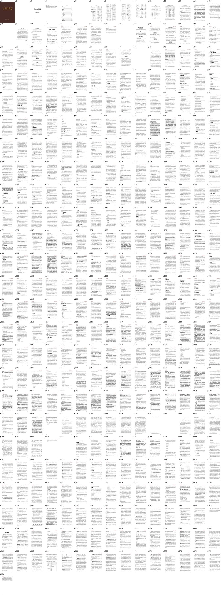
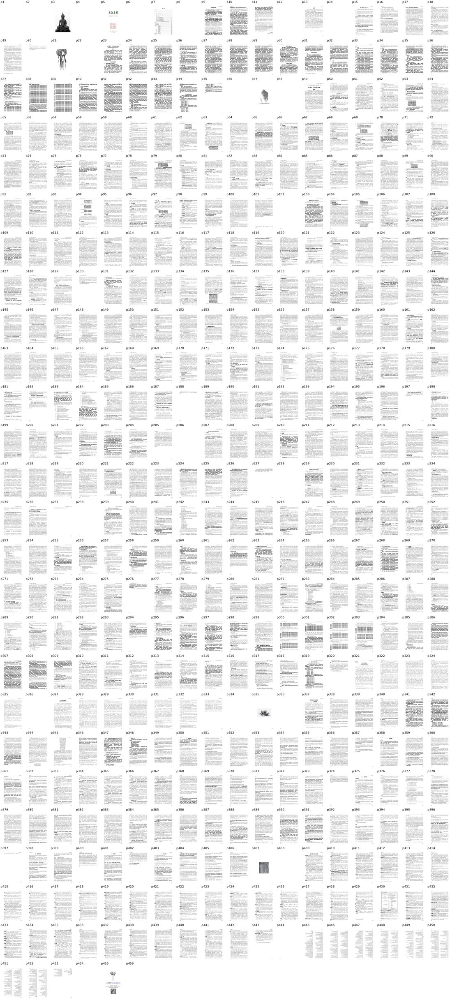
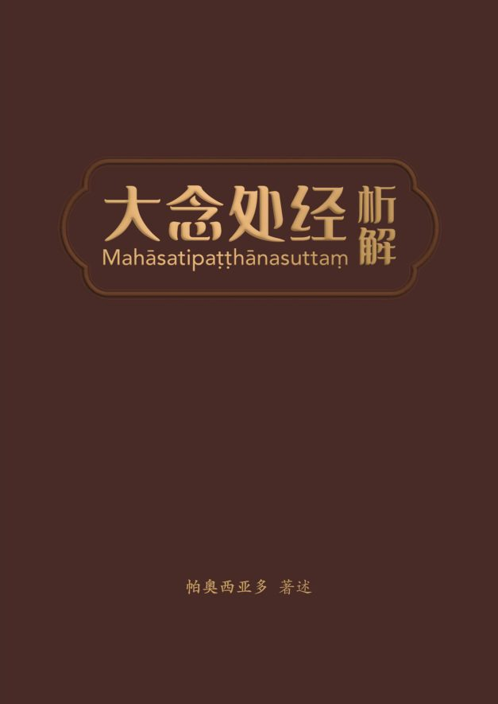
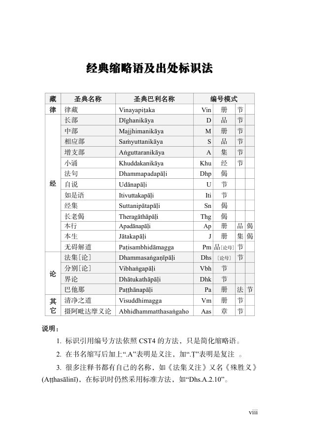
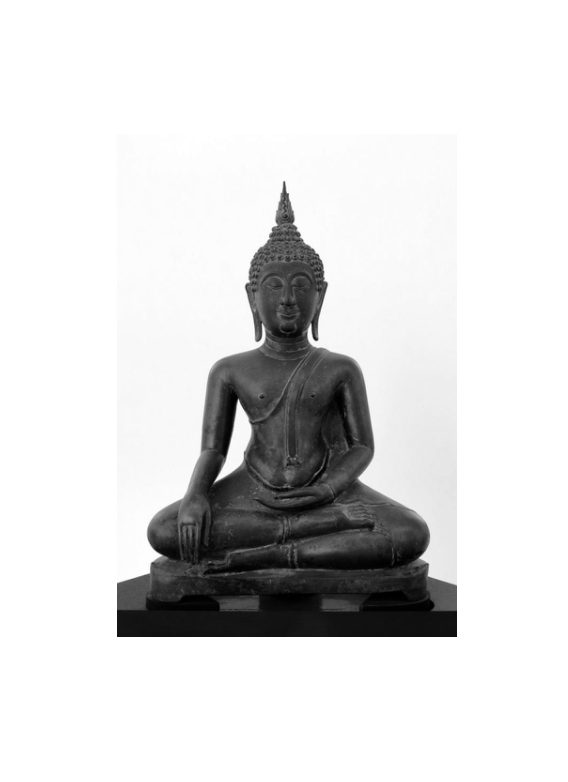
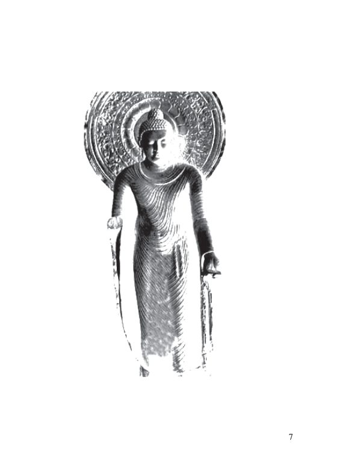
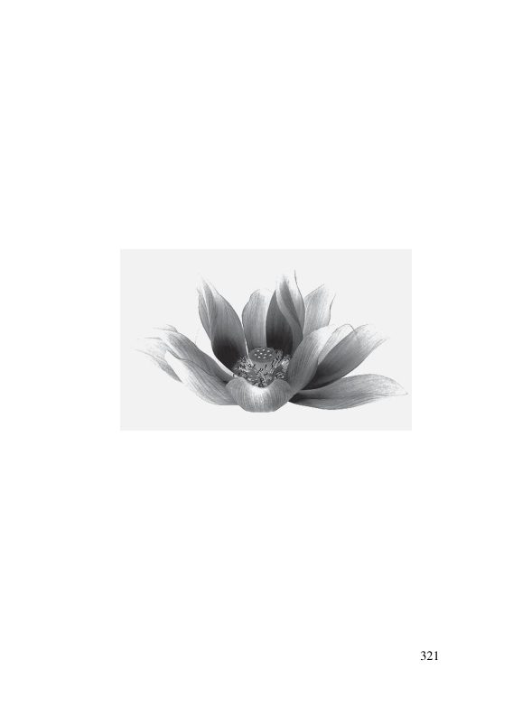
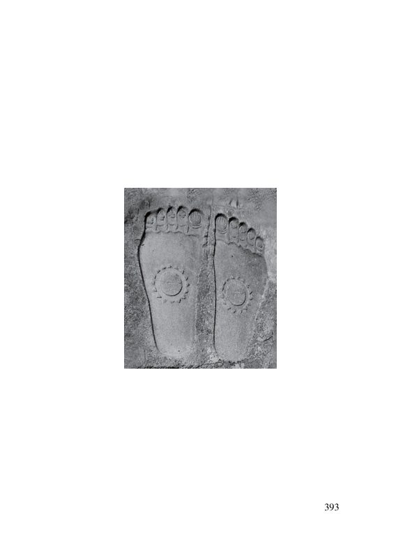
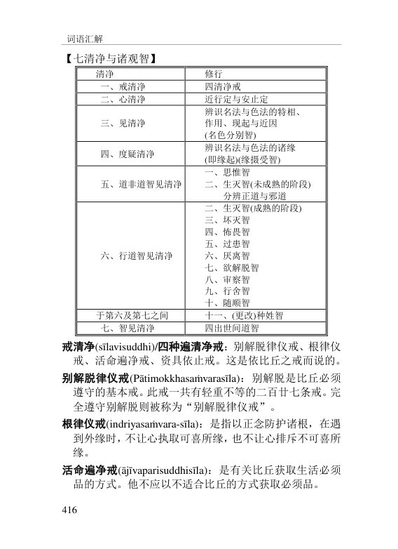

📅 最近更新：2026-09-23 01:51　|　第三版修订（4周版）：连续两周合并为9环节、单讲120分钟；共读原文一字未改；学员版去除主持人专属内容

# 第2周：身念处（下）与受念处（主持人版）

> ⭐ **本讲主持人速览**（新主持人必读，2分钟看完）
>
> 你不是老师，是"共学同行者"。你不需要提前懂内容，只需要按流程走。
> **本周由连续两周内容合并**而成，含两段共读、两轮分享与两轮讨论，单讲 120 分钟。
>
> | 环节 | 标准时长 | ⏱ 时间不够→ | ⏱ 时间富余→ |
> |:-----|:----:|:-----|:-----|
> | 🧘 静心开场 | 10 min | 缩至5 min | 加2分钟静坐 |
> | 📖 共读原文1 | 20 min | 只读★核心段（约15 min） | 加读◈扩展段 |
> | 💬 第一轮分享 | 10 min | 每人1句话 | 每人3分钟 |
> | 🎯 第一轮主题讨论 | 10 min | 只讨论问题① | 讨论全部问题+扩展 |
> | 🧘 禅修练习 | 15 min | 缩至8 min（只念引导词前半） | 延长至20 min |
> | 📖 共读原文2 | 20 min | 只读★核心段 | 加读◈扩展段 |
> | 💬 第二轮分享 | 10 min | 每人1句话 | 每人3分钟 |
> | 🎯 第二轮主题讨论 | 10 min | 只讨论问题① | 讨论全部问题+扩展 |
> | 🔚 收尾与回向 | 15 min | 缩至10 min | 保持 |
>
> **主持人10条守则（精简版）**：
> ① 不讲解、不提供答案——让原文自己说话；② 有人问"正确答案"→说"先听听大家的看法"；③ 冷场→主持人先分享自己的真实感受；④ 跑题→温和拉回："这个有意思，我们回到今天的原文"；⑤ 争论→"两种看法都很好，大家保留自己的理解"；⑥ 确保人人发言；⑦ 不评判任何人的分享；⑧ 时间到了就推进；⑨ 禅修练习照读引导词即可；⑩ 结束一起回向。

> **读书会18：大念处经精读 · 第2周（4周版 · 连续两周合并）**
> 主持人：你不需要提前懂内容，按本手册推进即可。
> 本周主题：**身念处（下）——三十二身分、界作意与墓园九相。一句话：佛陀带我们用三种"镜头"看这副身体——先是"拆开清点"（三十二身分：头发、牙齿、心、肝、尿……原来身体是这些拼起来的），再是"拆解成元素"（界作意：身体就是硬、粗、重、软、滑、轻、流动、黏结、冷、热、支持、推动这十二种特相，哪一样太强就用它的对立面来平衡，就像"熟练的屠夫把牛切成肉片"之后，牛的概念消失、只有肉片——有情的概念消失、界的概念生起），最后是"放远看它的去向"（墓园九相：肿胀、青瘀、脓烂……一直被吃到只剩白骨、骨堆、骨粉，然后拿自己的身体和它作比较——"这身体也有如此本质，必将如此，无法避免如此"）。三十二身分和墓园九相的目的，都不是吓自己，而是"舍离贪爱与怖畏"：对身体的贪著松一点，对死亡的怖畏松一点。界作意（四界差别）则是身念处里唯一可兼作"止禅"与"观禅"的业处——它让心先稳下来，再开始"拆解"。**；**受念处——九种受与受→爱。以"了知而不随"如实观受，看清可依靠与不可依靠的受，以及受如何缘起爱取。**。

## 📋 本周信息卡

| 项目 | 内容 |
|:----|:-----|
| 时长 | 120分钟（4周版 · 9环节） |
| 核心问题 | ；**同样是一份"感受"，为什么有的能依靠、有的不能依靠？我们凭什么去分辨？** |
| 共读原文 | 共读原文1：　｜　共读原文2：材料①《大念处经》析解·3.3 受随观（三种受→六种受→九种受→应培育的受→受随观修习与更高阶观智）；材料②古源尊者讲记（可依靠/不可依靠的受、爱是一种感受）；材料③《正念之道》受念处短句（经文、义注三问、猎人喻、相应部偈）。 |
| 本周作业 | ；每天记录一条"受的日记"——写下当天一个明显的乐受/苦受/不苦不乐受，并问一句："这个受，可依靠吗？" |

## ⏱ 时间弹性指南（本讲通用）

| 情况 | 应对方法 |
|:-----|:---------|
| **时间不够**（共读太长／讨论超时） | ① 静心开场缩至5分钟；② 两段共读原文均只读标注 **★核心** 的段落；③ 两轮分享每人只说一句话；④ 两轮主题讨论只讨论各自的问题①；⑤ 禅修练习缩至8分钟（只念引导词前半段）；⑥ 收尾回向缩至10分钟 |
| **时间富余**（共读快／讨论提前结束） | ① 用"📚 扩展内容包"中的补充原文段落继续共读；② 增加扩展讨论问题；③ 延长禅修练习时间；④ 增加"每人分享一个生活实例"环节 |

> 💡 原则：**讨论比读完重要，体验比讲完重要。** 宁可跳过扩展原文，也要让每个人都有机会说话。

## 🧘 静心开场（10 min）

> 💬 **破冰｜3–5分钟**：坐好，随手摸摸你的手背、脚踝。这周你有没有哪一刻突然看见自己的身体在累、在饿？说说那个时刻，说完就放。

> 🛡️ **心理安全三约定**（每次开场在心里过一遍）：① **保密**——这里说的话不出这间屋子；② **不评判**——不评价任何人的分享，也不急着评价自己；③ **可随时暂停**——任何时候觉得不舒服，都可以停下来休息、喝水或离开，不需要解释。

**主持人引导语**（照读即可）：

> 我们先静坐一分钟。闭上眼睛，感受自己的呼吸，让身体慢慢放松下来。（停顿60秒）
> 今天是我们《大念处经》"身念处"的最后一课。前两周我们已经走过：第一周看整部经的框架——"十四业处"；第二周看入出息念、四威仪、四种正知；今天，我们把身念处剩下的三样一次走完——三十二身分、界作意、墓园九相。
> 先打个招呼：今天的内容里，有一段涉及尸体腐化的过程。**如果你从来没有接触过这类修法，今天完全可以"只听不观"**——把文字当知识听，不在心里放任何画面，这是最稳妥的做法。**练习或共读中，任何时候觉得不舒服，随时可以停下来**：回到呼吸，或者睁开眼睛看看眼前的东西，起身喝口水也可以，不用坚持，也不用向任何人解释。这几句话，我会在读到坟场部分之前再说一遍。
> 另外提醒一下，"三十二身分"听起来像是在数一堆器官，但它其实是佛陀教我们"如实认识身体"的方法——就像打开一个装满各种谷物的口袋，一样一样看清楚，看清了，对身体的那种"要它好看、怕它出问题"的紧抓，就会松一点。**看清，不是为了讨厌身体，而是为了不再被它牵着走。**
> 今天有一节15分钟的"三十二身分·简版觉察"练习——我们只清点自己活着身体上的几个部分，不观想任何画面，很轻松，不用担心。今天的环节是：一起读四段原文、第一轮分享、主题讨论，最后练习、回向。
> 最后一句悄悄话：这三样法门，其实是同一件事的三个角度——**清点它（三十二身分）、拆解它（界作意）、看它的去向（墓园九相）**。不是要我们不爱惜这副身体，而是让我们在爱惜它的同时，也"知道它是什么"。今天是收官，我们慢慢走，走不完也没关系。
> 在开始之前，我还想说一点：今天这三样修行，在传统里都属于"止"或者"观"的业处——都是要坐下来真正练的。但我们今天在这里，只是"读一读、看一看、想一想"。**不练，完全成立；练一点，也很好。** 怎么走，由你自己决定；我们只把门打开一条缝，让你看看里面有什么。愿这两个小时，我们都能安安静静地、彼此陪伴地走完。

---

## 📖 共读原文1（20 min）

> ⚠️ 主持人操作：以下为本周共读原文文字，可直接照读或让大家轮流朗读，无需查知识库。出处信息见各材料下方；PDF 段落按原文字句照读（巴利语引文——即引号内罗马字转写——朗读时**跳过不念**，只读中文译文）；`[generated, not original text]` 为知识库照录标注，朗读时跳过；表格照读即可。**四段材料的照录段落互不重复**（材料①②③为同一册《大念处经》析解 pdf 的三个不同章，材料④为另一册书）。**共读墓园九相（材料③）之前，务必按"特别提醒"轻声说明"只听不观也可以，可随时暂停"；** 文字中涉及尸体腐化相（肿胀、青瘀、脓烂、虫吃、白骨）处照读即可，不做文学渲染、不做医学解读。若现场有人明显不适，主持人立即停下，轻声请其睁眼、喝水、必要时到场外休息，其余人继续。

> **【本周朗读段 · 开始】**（本段约 3628 字，供中等稍慢朗读，约 21 分钟；其余为默读／选读／延伸内容）

> **共读导航（主持人2分钟速读）**：本课共读四段，顺序请勿变动——
> - **材料①（三十二身分·厌恶作意）**：先读"身分表"和"六种果报"——这是"清点身体"；
> - **材料②（界作意·四界差别）**：读"十二特相""平衡法"和"屠夫之喻"——这是"拆解身体"；
> - **材料③（墓园九相·九墓地）**：读"【一】概述""经文〔二〕～〔九〕"和"两种不净观"——这是"看身体的去向"，**最敏感，读前必提醒"可随时暂停"**；
> - **材料④（身随观坐标）**：速读"十四种身随观"和"止的十二种方法"即可，帮大家看清这三步在整部经里的位置。
> 全程约30分钟。**宁可少读一段，也要读完一遍即进入分享**——讨论比读完重要。若现场气氛偏沉重，主持人可在材料③读完、材料④之前插入30秒静默（"我们一起安静30秒，把这些文字放一放"），再继续。**读材料③时，主持人语速放缓、语气平稳，不加评论、不渲染。**

### 原文材料①：三十二身分（厌恶作意）——"从脚底以上、发顶以下，充满种种不净"

> **段落优先级**：★核心必读（时间不够时只读★段落）｜◈扩展段落（时间富余时读）

- **标题**：《〈大念处经〉析解·帕奥西亚多 202406V2.0.pdf》（3.2.4 厌恶作意部分）
- **文件类型**：PDF（书籍·中文第二版·知识库照录原文）
- **说明**：与读书会06第5周同属"三十二身分"主题，**但文件不同**（06 取 182 讲课件，本讲取帕奥《大念处经》析解原典 3.2.4 章），文字互不重复。知识库提取返回带"[generated, not original text]"标注（经整理返回，非逐字原文），照常使用并在此保留标注。
- **知识库出处**：知识库「古源尊者开示及上座部佛教资料」
- **media_id**：pdf_d0dd1c0cd17209afe241ece24bf6b7b4_3f8421c35140ec58d355f1eb092845d47439961422831605
- **打开方式**：ima知识库搜索「大念处经 析解 帕奥西亚多」即可打开

> 📎 以下为章节完整文字（照录自本周素材文件，未删改；巴利语引文朗读时跳过）：

**★核心段落**（必读）

**一、经文原文——三十二身分表**

> "Puna caparaṃ, bhikkhave, bhikkhu imameva kāyaṃ uddhaṃ pādatalā adho kesamatthakā tacapariyantaṃ pūraṃ nānappakārassa asucino paccavekkhati …"
>
> "再者，诸比库，比库对这个从脚底以上、从发顶以下、表皮为边际、充满种种不净的身体，观察：'于此身中有头发、身毛、指甲、牙齿、皮肤，肌肉、筋腱、骨、骨髓、肾，心、肝、膜、脾、肺，肠、肠间膜、胃中物、粪便，胆汁、痰、脓、血、汗、脂肪，泪、油膏、唾液、鼻涕、关节滑液、尿。'"

**二、六种果报**

> 如此忆念身的作意即是"厌恶作意"，此业处与外道所不共，唯佛陀出现于世间之时方被教导。如此忆念身将能获得如是果报：
> 1. 大悚惧(mahāsamvega)；
> 2. 大解缚安稳(mahāyogakkhema)；
> 3. 大念与正知(mahāsatisampajañña)；
> 4. 获得智见(ñāṇadassanapaṭilābha)；
> 5. 现法乐住(diṭṭhadhammasukhavihāra)；
> 6. 现证明解脱果(vijjāvimuttiphala-sacchikiriyā)，即证悟阿拉汉道与阿拉汉果。

**三、七法十善巧（提点）**

> 此业处应当以七法而习得：1. 重复诵读三十二身分(vacasā)；2. 重复忆念三十二身分(manasā)；3. 依颜色而确定头发等身分(vaṇṇato)；4. 依形状而确定各身分(saṇṭhānato)；5. 依方位如依肚脐上方或下方而确定身体上部或下部的身分(disato)；6. 依所占空间而确定各身分(okāsato)；7. 依与其他身分的关联及差别而确定各身分(paricchedato)。
>
> 此业处应当依十善巧而习得：1. 次第而作(anupubbato)，即如一步一步爬楼梯那般一个又一个地逐次观察诸身分；2. 切勿过疾而作(nātisīghato)；3. 切勿过缓而作(nātisaṇikato)；4. 排除散乱而作(vikkhepa-paṭibāhanato)；5. 超越头发等概念而作意厌恶(paṇṇattisamatikkamanato)；6. 逐次排除不清晰身分(anupubbamuñcanato)；7. 依可证入安止的身分而作(appanāto)；8. 依《增上心经》教导而作；9. 依《清凉经》(Sītibhāvasuttaṃ, A.6.85)教导而作；10.依《觉支善巧经》教导而作。

**★核心段落**（必读）——"两端开口的袋"之喻

> "Seyyathāpi, bhikkhave, ubhatomukhā putoḷi pūrā nānāvihitassa dhaññassa, seyyathidaṃ sālīnaṃ vīhīnaṃ muggānaṃ māsānaṃ tilānaṃ taṇḍulānaṃ. Tamenaṃ cakkhumā puriso muñcitvā paccavekkheyya –'ime sālī, ime vīhī ime muggā ime māsā ime tilā ime taṇḍulā' ti."
>
> "诸比库，犹如两端开口之袋，装满了各种谷类，比如粳米、稻米、绿豆、大豆、芝麻、米粒。有眼之人打开之后，即能观察：'这是粳米，这是稻米，这是绿豆，这是大豆，这是芝麻，这是米粒。'"
>
> 此譬喻的象征为：以"两端开口之袋"而喻此由地、水、火、风四界构成之身；以"袋中之诸谷类"而喻头发等三十二身分；以"有眼之人"而喻禅修者；以"打开之后，即能观察诸谷类"而喻禅修者清晰知见三十二身分时的情形。

**◈扩展段落**（时间富余时读）——以三法修习三十二身分

> 以三法而修习三十二身分：
> 1. 色遍：即忆念任一身分的颜色而修习色遍以证得初禅至第四禅，例如，忆念骨骼的白色而修白遍以证得初禅至第四禅，以第四禅为基础而修习四无色定即可成就八定。
> 2. 厌恶作意：即如本经中的教导，作意三十二身分整体或某一身分为厌恶而证入初禅。一位名叫无畏(Abhaya)的大长老即能以此二法修习。
> 3. 四界差别：次第辨识每一身分的四界即可知见色聚，辨识此诸色聚即可知见究竟色法。此即四界差别业处广说。
>
> 在《大念处经》中，佛陀教导对此三十二身分作意厌恶。若禅修者欲如此修习，则须以观智清晰辨识三十二身分。如何辨识？先前已简述。首先，须将三十二身分铭记于心并背诵下来，继而在心中思惟此三十二身分。此法适用于尚未成就任何业处的初习者。对于已于其他业处获得成就者，例如修习入出息念而证得初禅至第四禅，或修习四界差别而证得近行定者，即可借助智慧之光而轻易辨识三十二身分。
>
> 若可作意三十二身分整体或某一身分为厌恶而证入初禅，接下来应当如何修习？佛陀开示："如此，或于内身随观身而住，或于外身随观身而住，或于内外身随观身而住。"于此有三种身，即：(1)三十二身分；(2)色身；(3)名身。禅修者须辨识内、外的这三种身。如何辨识？若可清晰辨识三十二身分，则辉煌的光明现起，此即是智慧之光。以此智慧之光为支助，禅修者可辨识前方禅修者的三十二身分，若禅修者得以清晰辨识其三十二身分，则应再辨识内三十二身分，再辨识外三十二身分。接下来可换另一位禅修者辨识。如此，禅修者交替辨识内外三十二身分。若智慧之光黯淡或消失，则应再次忆念呼吸而证入第四禅。当强而有力的光明现起之后，则可继续辨识内外三十二身分。如此，禅修者可将智慧之光延展至整个世界而辨识三十二身分，若于智慧之光中见到畜牲，也应当辨识其三十二身分。
>
> 若修习四界差别而证得近行定，此定亦可产生辉煌光明。以此光明为支助，禅修者可依上述方法辨识内外三十二身分。辨识外三十二身分后，应作意它们为厌恶，如此修习可证得近行定，却无法证得禅那。何故？因外三十二身分不似内三十二身分那样清晰。此即为何禅修者作意内三十二身分为厌恶可证得初禅，而作意外三十二身分为厌恶却无法证得初禅。
>
> 成功证入初禅后，即可以此为基础而逐一辨识三十二身分的四界。例如：辨识头发的四界以知见诸色聚，辨识此诸色聚以知见四十四种色法。对于其余三十一身分也应当如此辨识。如此辨识之后，禅修者以此修习法辨识六门，即：眼、耳、鼻、舌、身、心。应辨识六门与三十二身分的究竟色法，此色法即色身。接着，禅修者辨识禅那法和以究竟色法为所缘而生起的究竟名法。此名法即名身。如是，共有此三种身，禅修者应当于内外身随观身而住。
>
> 佛陀继续开示下一阶段："或于身随观生法而住，或于身随观灭法而住，或于身随观生灭法而住。"于此阶段，禅修者须辨识两种生灭，即：(1)缘生灭；(2)刹那生灭。缘无明、爱、取、行、业生起，故果报五蕴生起，此即缘生；缘证得阿拉汉果时五因灭尽，故于般涅槃时五蕴亦灭尽，此即缘灭。缘生与缘灭即是缘生灭。禅修者应当思惟五因即生即灭，故为无常、苦、无我；五蕴即生即灭，故亦为无常、苦、无我。此因与果的即生即灭便是刹那生灭。
>
> 下一阶段是："他现起'有身'之念，只是为了智与忆念的程度。"此处包含坏灭智至行舍智之高阶观智。佛陀继续说："他无所依而住，对世间任何皆不执取。"若禅修者次第修习，则某日观智成熟而圣道现起。四圣道摧毁不同杂染，直至烦恼皆灭尽。彼时，禅修者无所依而安住，对五蕴世间的任何事物皆不执取。
>
> 最后，佛陀总结此三十二身分部分："诸比库，比库乃如此于身随观身而住。"于此部分，五蕴及以五蕴为所缘的念为苦谛；无明、爱、取、行、业五因乃集谛；因与果的灭尽为世间灭谛，涅槃乃出世间灭谛；以名色灭尽为所缘的八圣道乃世间道谛，以涅槃为所缘的八圣道乃出世间道谛。此即四圣谛。透彻了知此四圣谛者，可脱离轮回。故此解脱之道应被了知。

> **【本周朗读段 · 结束】**（以下为默读／选读／延伸内容，时间富余时再读）
>
> [generated, not original text]

> 主持人：材料①这一章到这里就结束了。若现场已有人显出疲惫，可直接跳到材料②，只把上面"六种果报""袋之喻"两句念完即可——**周的进度，不必章章读完。**

---

### 原文材料②：界作意（四界差别）——十二特相、"屠夫之喻"与三种密集

> **段落优先级**：★核心必读｜◈扩展段落（时间富余时读）

- **标题**：《〈大念处经〉析解·帕奥西亚多 202406V2.0.pdf》（3.2.5 界作意部分）
- **文件类型**：PDF（书籍·中文第二版·知识库照录原文）
- **说明**：与读书会06第6周同度（界作意），**但文件不同**（06 取 183 讲课件，本讲取帕奥原典 3.2.5 章）；与读书会06 W3/W4 为**同文件不同章**（彼取 3.2.2 威仪路／3.2.3 正知，本讲取 3.2.5 界作意），段落不重叠，已注明。知识库提取返回带"[generated, not original text]"标注，照常使用并保留标注。
- **知识库出处**：知识库「古源尊者开示及上座部佛教资料」
- **media_id**：pdf_d0dd1c0cd17209afe241ece24bf6b7b4_3f8421c35140ec58d355f1eb092845d47439961422831605
- **打开方式**：ima知识库搜索「大念处经 析解 帕奥西亚多」即可打开

> 📎 以下为章节完整文字（照录自本周素材文件，未删改；巴利语引文朗读时跳过）：

**★核心段落**（必读）

**一、经文原文与十二特相**

> "Puna caparaṃ, bhikkhave, bhikkhu imameva kāyaṃ yathāṭhitaṃ yathāpaṇihitaṃ dhātuso paccavekkhati–'atthi imasmiṃ kāye pathavī-dhātu āpodhātu tejodhātu vāyodhātū' ti."
>
> "再者，诸比库，比库对如其住立、如其所处的这个身体，以界观察：'于此身中，有地界、水界、火界、风界。'"
>
> 于此身中有四界，即地界、水界、火界、风界。它们分别是什么？**硬、粗、重、软、滑、轻乃属地界，流动、黏结乃属水界，热、冷乃属火界，支持、推动乃属风界。**

**二、怎么观察：从容易的特相开始，逐一观察直到完整**

> 禅修者或可从推动等容易辨识的特相开始观察。无论始于何种特相，最终仍须辨识这全部十二特相。若始于推动，则从呼吸开始辨识较为容易，继而渐次辨识全身一切处的推动。还有一种相对容易的修习方法即是，先以其他业处成就禅那，尤其是第四禅，再在此基础之上辨识四界的十二特相。应当于每一座先入禅再出定，之后辨识四界，缘于此深定，故此时即可轻易且清晰地辨识它们。佛陀在《相应部•定经》(Samādhisuttaṃ)中说："诸比库，应修习定。诸比库，有定力的比库能如实了知。"
>
> 于一切威仪中辨识为最佳，若仅于禅坐之中辨识，则禅修者因念薄弱，故定无法稳步而迅速提升，这会使禅修耗时良久。

**三、四界不平衡时，用对立面来平衡**

> 当某种特相较强时，禅修者可以暂时搁置它，转而辨识与之相对的特相以趋向平衡。例如，若身之硬过于显著，则禅修者应当暂时搁置硬，转而辨识软。如此，必要时亦可依此法平衡其余五对特相：**粗与滑、重与轻、流动与黏结、热与冷、支持与推动。** 多数情况下，硬、粗、重更为显著而令禅修者难以忍受，彼时，可将此三种特相暂且搁置一旁，转而辨识软、滑、轻。
>
> 硬与软实为相同特质的不同程度。例如，当触摸棉花时感受到软，而若仔细触摸则将感受到其中的硬。故程度较弱之硬即作软，程度较强之硬即作硬。同理，程度较弱之粗即作滑，程度较强之粗即作粗。此原理亦适用于其他四对特相。如此，**仅辨识软、滑、轻即足以辨识地界。**
>
> 如此修习则四界将达至平衡而定力也将提升。若能从头至足依次第、反复、迅速辨识此十二特相，便可俯视辨识全身的四界。……若能同时辨识十二种特相，便可转依四组而辨识：辨识硬、粗、重、软、滑、轻而知此为"地"，辨识流动、黏结而知此为"水"，辨识热、冷而知此为"火"，辨识支持、推动而知此为"风"。如此，禅修者一再辨识"地、水、火、风……"
>
> 当定力提升时，禅修者将不见身体而只见到一个四界体，若禅修者忆念此体的四界，当定力提升时，其将见到身体变为白色体；若禅修者忆念此白色体之四界，当定力提升时，其将见到身体变为透明体。禅修者应持续忆念此透明体的四界。当定力再度提升之时，此透明体便会放出光明。

**★核心段落**（必读）——"屠夫之喻"

> "Seyyathāpi, bhikkhave, dakkho goghātako vā goghātakantevāsī vā gāviṃ vadhitvā catumahāpathe bilaso vibhajitvā nisinno assa, evameva kho, bhikkhave, bhikkhu imameva kāyaṃ yathāṭhitaṃ yathāpaṇihitaṃ dhātuso paccavekkhati–'atthi imasmiṃ kāye pathavīdhātu āpodhātu tejodhātu vāyodhātū' ti."
>
> "诸比库，犹如熟练的屠牛者或屠牛者的学徒，杀了牛后在四衢大道中切成肉片后坐着。同样地，诸比库，比库对如其住立、如其所处的这个身体，以界观察：'于此身中，有地界、水界、火界、风界。'"
>
> 此譬喻的象征是：当屠夫喂牛时，驱赶牛至屠宰场时，捆绑牛时，宰杀牛时，乃至见到牛的尸体时，他未曾舍弃"牛"的概念，直至他将牛切成肉片，则"牛"的概念消失而"肉片"的概念现起。对于屠夫而言，他不觉得"我在卖牛，人们取走牛"，而是认为"我在卖肉，人们取走肉"。
>
> 同理于比库，当其身住立或被置于任何威仪中，却未以界观察之，则有情或人之概念尚存。**当他以界观察身时，则有情或人之概念消失。**
>
> 以屠牛者来比喻禅修者，以牛的概念来比喻有情的概念，以四衢大道来比喻四威仪，以切成肉片之后坐在四衢大道来比喻以界观察身。

**◈扩展段落**（时间富余时读）——色聚、三种密集、"是近行定还是刹那定"

> 若禅修者次第修习四界差别，则将见到身体变为透明体，若持续辨识此透明体的四界，它们将放射出辉煌的光明。禅修者应辨识其中的空间，如此即可知见诸色聚，继而辨识每一色聚里的四界。
>
> 首先，禅修者应当于同一色聚之中逐一辨识十二特相。例如，禅修者先辨识全身整体的硬，再辨识一粒色聚的硬，如此交替、往复辨识。当能够辨识一粒色聚的硬时，即应辨识两种特相：硬与粗。……禅修者应当以此方式修习，每次增加一种特相。然而在同一色聚之中，禅修者无法观察到相对的两种特相。以地界为例：若于一粒色聚中清晰见到硬，则无法于此色聚中见到软……如是，于同一色聚之中，禅修者仅能观察到地界的三种特相：硬、粗、重或软、滑、轻。
>
> 对于水界，为了便于理解，故说它具有两种特相：流动与黏结。实际上，黏结是水的表相，唯流动是其特相。火界具有热与冷两种特相。在同一色聚中，若观察到热则无法观察到冷，反之亦然。风界以支持为特相，推动是其作用。故禅修者亦可于同一色聚中观察到此二者。如此，禅修者最多可于一粒色聚中观察到八种特相，如：硬、粗、重、流动、黏结、热、支持、推动。禅修者须辨识这八种特相，换言之，即一粒色聚中的四界。
>
> 成就此法后，禅修者应辨识六门的诸色聚，即：眼、耳、鼻、舌、身、心脏。色聚有两种：明净色聚与非明净色聚，此二者皆存在于六门，禅修者应当依上述方法辨识其中的四界。
>
> 若禅修者如此辨识，则强而有力的定将生起。依义注，此定是"近行定"；依复注则此定是"刹那定"。何故而有不同？义注之所说为譬喻，当禅修者忆念色聚的四界时，强而有力的定即现起，它的强度近乎近行定，故义注说它是近行定。而真正的近行定则近乎禅那，它与禅那现起于同一心路之中，近行灭而禅那生。然而，无论禅修者怎样精进地修习四界差别，最终都无法证得禅那。故不可说此定是近行定，此即为何复注称它为刹那定。
>
> 当禅修者能够专注于自己所辨识的每一粒色聚中的四界时，即已证入四界差别止禅高阶，彼时亦是观禅之初阶。故四界差别业处涉及止禅与观禅二者。
>
> 辨识一粒色聚中的四界后，禅修者须辨识此色聚中的所造色，如色、香、味、食素等。如果能辨识四界(四大种色)与所造色(四大所造色)，即可说他知见了究竟色法，彼时，禅修者已破除密集。
>
> 色法有三种密集：(1)相续密集(santati ghana)；(2)组合密集(samūha ghana)；(3)作用密集(kicca ghana)。通常，初习者辨识全身的四界时，他逐渐不见身体而只见一个四界组合体，彼时，他尚未破除密集。凡尚未知见色聚，则有情、男人、女人、父亲、母亲、我、他等想尚存。若深入修习，即可知见内外色聚，从而有情等想消失。何故？因破除相续密集故，他唯见色聚而不见有情。
>
> 然而，色聚并非究竟色法，禅修者须继续辨析色聚以知见究竟色法，如地界、水界、火界、风界、颜色、香、味、食素。彼时，他破除组合密集。禅修者应当继续修习以破除作用密集。每一粒色聚至少含有八种色法，它们执行各自的功能。例如地界有其独特作用而不同于水界。为了破除作用密集，故禅修者应当辨识每一种色法的特相、作用、现起与近因。
>
> 当禅修者破除此三种密集后，即可说他已知见究竟色法。此智对于观禅修习者实为必要。……彼时，他不见有情或人、男人、女人、父亲、母亲等，他唯见究竟色法。
>
> 辨识究竟色法后应当如何修习？佛陀阐述下一阶段："如此，或于内身随观身而住，或于外身随观身而住，或于内外身随观身而住。"在此，有两种身：(1)色身；(2)名身。禅修者须辨识此两种身。何故？因仅依辨识究竟色法为无常、苦、无我不足以证悟涅槃，故亦须辨识究竟名法为无常、苦、无我。辨识内在名色法后，亦须辨识外在名色法。何故？禅修者只能辨识究竟名色法为无常、苦、无我，而无法辨识有情为无常、苦、无我。因此，为了去除一切贪、邪见等烦恼，禅修者须辨识内外究竟名色法。
>
> 依观智层级，这是观智的第一阶段，称作"名色限定智(nāma rūpa pariccheda ñāṇa)"。接着，佛陀阐述下一阶段："或于身随观生法而住，或于身随观灭法而住，或于身随观生灭法而住。"在此阶段，佛陀结合了三种观智：1. 缘摄受智(paccayapariggahañāṇa)：辨识因果；2. 思惟智(sammasanañāṇa)：了知诸行无常、苦、无我本质；3. 生灭智(udayabbayañāṇa)：了知诸行的生灭为无常、苦、无我。
>
> 生灭智成熟后，即可继续修习下一阶段。佛陀如是教导："他现起'有身'之念，只是为了智与忆念的程度。"此阶段包含自坏灭智至行舍智之高阶观智。观智成熟时，禅修者将依道智与果智而证悟涅槃。佛陀说："他无所依而住，对世间任何皆不执取。"诸道智渐次摧毁诸烦恼故一切执取在心中被根除，他无所依而安住，亦不执取五蕴世间的任何。接着佛陀总结此四界差别业处道："诸比库，比库乃如此于身随观身而住。"
>
> [generated, not original text]

---

### 原文材料③：墓园九相（九墓地）——"这身体也有如此本质，必将如此，无法避免如此"

> **段落优先级**：★核心必读｜◈扩展段落（时间富余时读）
> ⚠️ 主持人提示：**本段涉尸体腐化相。读之前，请按"特别提醒"明确告诉大家："接下来这段只听不观也完全可以，任何时候觉得不舒服，随时可以停下来、睁开眼睛。"**

- **标题**：《〈大念处经〉析解·帕奥西亚多 202406V2.0.pdf》（3.2.6 九墓地部分）
- **文件类型**：PDF（书籍·中文第二版·知识库照录原文）
- **说明**：与读书会06第6周同主题（九坟场不净），**但文件不同**（06 取 183 讲课件，本讲取帕奥原典 3.2.6 章），文字互不重复。知识库提取返回带"[generated, not original text]"标注，照常使用并保留标注。
- **知识库出处**：知识库「古源尊者开示及上座部佛教资料」
- **media_id**：pdf_d0dd1c0cd17209afe241ece24bf6b7b4_3f8421c35140ec58d355f1eb092845d47439961422831605
- **打开方式**：ima知识库搜索「大念处经 析解 帕奥西亚多」即可打开

> 📎 以下为章节完整文字（照录自本周素材文件，未删改；巴利语引文朗读时跳过）：

**★核心段落**（必读）——【一】概述

> "Puna caparaṃ, bhikkhave, bhikkhu seyyathāpi passeyya sarīraṃ sivathikāya chaḍḍitaṃ ekāhamataṃ vā dvīhamataṃ vā tīhamataṃ vā uddhumātakaṃ vinīlakaṃ vipubbakajātaṃ. So imameva kāyaṃ upasaṃharati–'ayampi kho kāyo evaṃdhammo evaṃbhāvī evaṃanatīto'ti."
>
> "再者，诸比库，如同比库见到被丢弃在墓地里的尸体，已死一天，已死两天或已死三天，已肿胀、青瘀、脓烂。他比较此身：'这身体也有如此本质，必将如此，无法避免如此。'"
>
> 尸体之所以被描述为"肿胀"乃因死后它逐渐膨胀，如同被风充满的风箱般。
>
> "青瘀"乃指尸体各部分完全不同的色泽：肌肉隆起的部分为红色，化脓的部分为白色，以青蓝色为主的部分如同覆以蓝缦。
>
> 如前所述，藉由此三法——命根、业生火界与识，而身体得以立、行等；此三法分崩，故身体变为尸体，且具有腐坏性。它无法避免地逐渐肿胀、青瘀、脓烂。
>
> 此即九墓地随观第一法。依马哈希瓦长老(Mahāsīva)之见，墓地随观类似于过患、苦厄、败坏随观，何谓过患随观？这是苦随观(dukkhānupassanā)的分支……然而，依古义注，禅修者可依随观尸体之不净而证得初禅，因此，若修习墓地随观，则禅修者须择取与自己性别相同的尸体。

**★核心段落**（必读）——墓地随观其余八法（经文〔二〕～〔九〕）

> [2]"再者，诸比库，如同比库见到被丢弃在墓地里的尸体，正被乌鸦所吃、被鹰所吃、被秃鹫所吃、被苍鹭所吃、被狗所吃、被老虎所吃、被豹所吃、被豺狼所吃，或被各种虫所吃。他比较此身：'这身体也有如此本质，必将如此，无法避免如此。'"
>
> [3]"再者，诸比库，如同比库见到被丢弃在墓地里的尸体，骨锁尚有肉有血，由筋腱连结着。"
>
> [4]"[如同比库见到被丢弃在墓地里的尸体，]骨锁已无肉，为血所污，由筋腱连结着。"
>
> [5]"[如同比库见到被丢弃在墓地里的尸体，]骨锁已无血、肉，由筋腱连结着。"
>
> [6]"[如同比库见到被丢弃在墓地里的尸体，]已无连结的骨头散落各处：一处为手骨，另一处为脚骨，另一处为踝骨，另一处为胫骨，另一处为股骨，另一处为髋骨，另一处为肋骨，另一处为脊椎骨，另一处为肩胛骨，另一处为颈椎骨，另一处为颚骨，另一处为齿骨，另一处为头骨。"
>
> [7]"再者，诸比库，如同比库见到被丢弃在墓地里的尸体，白骨如螺贝色。"
>
> [8]"[如同比库见到被丢弃在墓地里的尸体，]骨头堆积经过三四年。"
>
> [9]"[如同比库见到被丢弃在墓地里的尸体，]骨头腐朽成为粉末。他比较此身：'这身体也有如此本质，必将如此，无法避免如此。'"

**★核心段落**（必读）——如何修习（节选）

> 应当如何修习？若禅修者尚未成就任何业处便首先修习墓地随观，则须前往至墓地观察尸体。然而在此，我欲先阐述已依其他业处证得强有力之定后修习墓地随观，例如依入出息念或四界差别而证得定后修习墓地随观。我建议那些成就四界差别业处的禅修者转修三十二身分，再修习色遍至第四禅，因四禅之光明辉煌无比，故甚能助益其他业处之修习。
>
> 禅坐之时，禅修者可先依入出息念或色遍证入第四禅，当强有力的光明现起后，即可辨识先前所见的尸体，作意此尸为"厌恶……厌恶……"禅修者不应辨识尸体变化后的形态。如若一年前曾观察尸体，则不应辨识它变化后的当下形态，因它或已化为白骨或灰烬。应辨识当时所见的尸体影像，并作意它为厌恶，尸体愈肿胀、青瘀、脓烂愈佳，应当择取所见之最为厌恶的尸体。
>
> 定力提升时，禅修者将能够长久地忆念尸体影像，为何能够迅速获得成就？因为此定力是基于先前的第四禅那，它对于随后业处的修习是强有力的支助因缘。此即为何当禅修者如此修习之时，其可于一座之中获得成就，定力深厚之时，强而有力的安止将会现起。
>
> 若欲证得初禅，则无须将尸体与己身作比较。在此佛陀教导："他比较此身：'这身体也有如此本质，必将如此，无法避免如此。'"缘于此，马哈希瓦长老阐释道：这只适用于过患随观。何故？对于止禅，比较内身与外尸并非必须，辨识外在尸体为厌恶即可证得初禅。而对于观禅，佛陀教导辨识内外尸，此为不净观业处之一，称作无识不净(aviññāṇaka asubha)，另一不净观业处即有识不净(saviññāṇaka asubha)。

**★核心段落**（必读）——两种不净观

> 一）无识不净：即随观无生命体的不净。首先，禅修者须辨识外在尸体为厌恶至初禅或近行定，继而类比自身："有朝一日我亦将死亡，死后我的尸体即如此尸。"接着，禅修者应尝试辨识自己的尸体并作意它为厌恶，如此一再地内、外交替辨识。然后，禅修者可转而辨识另一生者，尤应辨识你颇为执取之人，如子、女、夫或妻并思惟此事：此人终有一日亦将死亡。继而禅修者见其尸体，随观它为"厌恶……厌恶……"可将自己辨识的范围扩展至每一个方位。若禅修者对此修习感到满意，则应辨识尸体的四界以见诸色聚，继而辨析此诸色聚以见究竟色法，它们是火界所生，故为时节生色。
>
> 二）有识不净：即随观有生命体的不净，可笼统分为两类，即三十二身分与虫随观。(一) 三十二身分：以智慧之光为支助，禅修者辨识内三十二身分，若可清晰辨识头发至尿(顺)、尿至头发(逆)，则应以同样的方式辨识前方禅修者的三十二身分，并作意它们为厌恶。如此交替辨识内外三十二身分。应辨识那些你颇为执取之人，如子、女、父或母。(二) 虫随观：此身遍满虫，若智慧之光够强，则禅修者能以智慧之光为支助而清晰辨识体内诸虫，并作意它们为厌恶。何故？诸虫生存、繁衍、便、尿、病、死于此身中，此身乃其屋、厕、医院及墓地，故此身中充满了令人厌恶之物。禅修者应随观它们为"厌恶……厌恶……"如此一再地内外交替辨识。
>
> 当墓地随观的修习强而有力，该定即可去除执取(贪爱)。此即为何佛陀在《美奇亚经》(Meghiyasuttaṃ, U.31, A.9.3)中说："诸比库，应修习不净以舍断贪爱。"暂时镇伏贪爱后，禅修者可转修观禅。首先，禅修者应辨识自己身体与外在尸体的四界以知见诸色聚，继而辨析此诸色聚以知见究竟色法，也应当辨识无生命物的究竟色法。再辨识内外究竟名法。

**◈扩展段落**（时间富余时读）——更高阶的观智

> 接着是下一阶段："他现起'有身'之念，只是为了智与忆念的程度。"此阶段包含自坏灭智至行舍智之高阶观智。当观智成熟之时，禅修者将依道智与果智证悟涅槃。……在此，佛陀所指乃坏灭智至道、果智。
>
> 古时，依印度传统，人在死后常被弃置于墓地而未加以掩埋，因此人们有机会见到各种尸体。如今却极难见到不同种类的尸体，如此则应如何修习墓地随观？若已修习前述墓地随观第一法，取一具尸体为所缘而反复随观之，专注并作意它为厌恶而证入初禅后，应尝试随观它随后逐渐变化至当下形态的过程。如此，禅修者将渐次见到该尸体化为白骨或粉末。
>
> 于此九墓地部分，念与念之所缘，即五取蕴乃苦圣谛，五因是集圣谛，此二圣谛之不生是灭圣谛，证悟灭圣谛之道乃道圣谛。依四圣谛而精勤者可抵达寂静。此即是致力于九墓地随观的比库的解脱之门。
>
> [generated, not original text]

---

### 原文材料④：身随观坐标——十四种身随观、止的十二种方法、四界差别简略法

> **段落优先级**：★核心（速读用，帮助理解材料①②③在整部经中的位置）｜◈扩展

- **标题**：《证悟涅槃的唯一之道（帕奥西亚多）玛欣德尊者译.pdf》
- **文件类型**：PDF（书籍·玛欣德比库中译·知识库照录原文）
- **说明**：本文件**0 命中禁用清单（★FREE）**。本书正文围绕《大念处经·入出息念部分》展开，本讲取其"身随观定位"与"四界差别简略法"作为材料①②③的坐标。知识库提取返回带"[generated, not original text]"标注，照常使用并保留标注。
- **知识库出处**：知识库「古源尊者开示及上座部佛教资料」
- **media_id**：pdf_d0dd1c0cd17209afe241ece24bf6b7b4_6fecc2b9968cc066e802565dfb1bc4c57439961422831605
- **打开方式**：ima知识库搜索「证悟涅槃的唯一之道 玛欣德」即可打开

> 📎 以下为相关章节文字（照录自本周素材文件，未删改）：

**★核心段落**（必读）——十四种身随观与止的十二种方法

> 在《大念处经》中，佛陀一共教导了二十一种禅修业处。其中身念处有十四种，受念处和心念处各一种，法念处有五种。它们依次是：
> 一、身念处：1. 入出息念(ànàpànassati)；2. 威仪路(iriyàpatha)——行立坐卧；3. 正知(sampajàna)；4. 厌恶作意(pañikålamanasikàra)——三十二身分；5. 界作意(dhàtumanasikàra)——四界差别；6-14. 九墓地观(navasivathika)。二、受念处。三、心念处。四、法念处。
>
> 在《大念处经》中，佛陀教导了十二种修止的方法：
> ⑴ 随观入出息，可以证得四种禅那。
> ⑵ 随观身体三十二部分的不净，可以证得初禅。
> ⑶ 随观诸界，可以获得相当于近行定的定力。
> ⑷-⑿ 随观九种尸体，可以证得初禅。
>
> 如前所述，十四种身随观中有十二种属于止业处和观业处，即随观入出息、三十二身分、四界和九墓地；其馀两种身随观只属于观业处，即随观行立坐卧等姿势，正知前进返回、前瞻旁看等。然而，对于所有十四种身随观，佛陀都用同样的四个阶段来教导维巴沙那。

**◈扩展段落**（时间富余时读）——四界差别简略法与三种密集

> 佛陀以简略法或详尽法来教导色业处。在《大念处经》中，佛陀教导了简略法："再者，诸比库，比库如其住立，如其所处，以界观察此身：'于此身中，有地界(pathavīdhātu)、水界(āpo-dhātu)、火界(tejodhātu)、风界(vāyodhātū'ti)。'"我们也把色业处叫做四界差别，并且通过它们的特相来认知这四界。佛陀在《法集[论]》(170-171)中根据十二特相来解释色法：
>
> |地|地|水|火|风|
> |---|---|---|---|---|
> |1) 硬|4) 软|7) 流动|9) 热|11) 支持|
> |2) 粗|5) 滑|8) 黏结|10) 冷|12) 推动|
> |3) 重|6) 轻||||
>
> 就如入出息念可以分为修止和修观阶段，四界差别也可以分为修止和修观阶段……为了运用它来作为维巴沙那基础的禅那，你应当在每次禅坐中重温入出息第四禅。当你的心变得明亮、晃耀和闪耀时，再从第四禅出定，并转修四界差别。你要在每座中都这样做。通过入出息禅那的力量和光明，你将能很快地完成四界差别。
>
> 你必须学会如何逐一地辨识十二特相。我们通常会先教导初学者辨识较容易的特相，然后再到较难的特相。一般的顺序是：推动、硬、粗、重、支持、软、滑、轻、热、冷、黏结、流动。每个特相都必须先在身体的某个部位开始辨识，然后再扩散到全身，乃至最后需要辨识所有的十二个特相。
>
> 当你能够很快速地在全身逐一辨识这十二个特相时，则应按照佛陀教导地、水、火、风四界的顺序来辨识它们，即：硬、粗、重、软、滑、轻、流动、黏结、热、冷、支持、推动。当你能够在自身中很快速地逐一辨识到它们后，则可以同时照见许多或所有的特相。最佳的办法是仿佛从双肩后面遍照全身，或者如从头上往下看。
>
> 用这种方法修习时，可能会因为诸界不平衡而导致绷紧。此时，你可以用对立法来平衡它们。例如硬变得过强时，应多注意软等。对立的特相共有六对：
>
> |硬 软|粗 滑|重 轻|流动 黏结|热 冷|支持 推动|
> |---|---|---|---|---|---|
> |地|地|地|水|火|风|
>
> 当你几乎能同时照见所有十二特相时，则可以把它们分成地、水、火、风四组来辨识。但请保证能够清楚地照见四界的每一个特相。然后，取这些特相为所缘，以自身中的这四界来培育定力。
>
> 以自身中的四界来培育定力时，你将能接近近行定(upacāra samādhi)。但它并非真正的近行定，因为只有在即将达到禅那之前的定力才是真正的近行定，而修习四界差别是不可能达到禅那的。但你仍然能够培育非常强有力的到几乎等同于近行定的定力。
>
> 当你专注于四界时，将能见到不同种类的光。开始时它通常是烟灰色的光，就像修入出息念时的一样。不过，在此你应该专注那烟灰色光中的四界，于是它将会变得白若棉花，然后白亮如云，不久你的全身会呈现为白色的物体。当你继续专注于这白色物体中的四界时，它将变得晶莹透明犹如冰块或玻璃。
>
> 有三种密集：⑴ 认为色法是一个固定不变的相续实体，这是相续密集(santati ghana)。⑵ 认为色法是一个组合的整体，即认为色聚是究竟色法，这是组合密集(samåha ghana)。⑶ 认为色法由一个自我决定，有一个支配色法的自我，这是功用密集(kicca ghana)。
>
> 修习色业处是为了去除这三种错觉。你首先需要通过辨识色聚来去除相续密集。当身体呈现为透明体块时，你仍然要像之前一样继续辨识四界。到后来，透明体块将会闪耀并发亮。当你能持续地专注于这闪耀的透明体块中的四界至少半小时，则能达到相当于近行定(upacāra samādhi)的定力。这是四界差别修止阶段的结束。
>
> 现在你可以开始四界差别的修观阶段。通过近行定之光，你应当寻找那透明体块里的小孔隙以辨识空界(ākāsadhātu)。空界是不同色聚之间的界限。一旦你已辨识到空界，那透明体块即会破碎为小微粒，它们就是我们之前提过好几次的色聚。
>
> （小结·四界差别修止阶段）：先培育入出息第四禅，直到智慧之光明亮、晃耀、闪耀，然后辨识全身的地、水、火、风四界，一直修到身体呈现为如冰块或玻璃般晶莹透亮。专注这体块直到获得类似于近行定(upacàra samādhi)的定力。
>
> [generated, not original text]

> **主持人：共读收束语（可照读）**：材料①②③为同一册《大念处经》析解 pdf 的三个不同章（3.2.4 厌恶作意／3.2.5 界作意／3.2.6 九墓地），材料④为另一册《证悟涅槃的唯一之道》；四段照录段落互不重复，可放心共读。共读结束后，主持人可用一两句话把三段串起来——
>
> "我们今天读了身体的三种说法：**第一，它由三十二个部分组成**——头发、牙齿、心、肝、胃中物、尿……原来它是这样拼起来的；**第二，它由四种元素、十二种特相组成**——硬、软、冷、热、支持、推动，哪一种太强就用对立面来平衡；**第三，它有一个共同的去向**——会老、会病、会像坟场里那样变化。佛陀说这些，不是要我们害怕，而是——看清了，就松一点。现在我们把书放一放，说说各自的感受。"
>
> 若有人在此已眼眶发红或明显不适，**不要点破、不要当众询问**，只要轻轻说一句"我们先静一分钟"，让大家一起回到呼吸，再进入分享。

---

## 💬 第一轮分享（10 min）

**主持人引导**：

> 请大家轮流分享：读完这四段文字，最触动你的一句话是什么？为什么触动你？
> （今天的原文有点特别——不管是三十二身分里那句"从脚底以上、发顶以下，充满种种不净"，还是界作意里那句"当他以界观察身时，则有情或人之概念消失"，或者墓园九相最后那句"这身体也有如此本质，必将如此，无法避免如此"，哪句留在了你心里，就分享哪句。只分享感受，不需要"正确理解"，也可以说"今天我先不分享，听听大家的"。主持人先分享自己的，然后按顺序轮流。这一轮只说不评论。**若有人只愿意谈身体、不愿意谈死亡那一部分，完全没问题，讲到哪算哪。**）

> **主持人小提示**：本课分享可能两极——有人很想说身体、有人一句话也说不出来；有人愿意谈死亡、有人刻意回避。**两种都很好。** 你只需保证两件事："每人有机会"且"每人不被打断"。若时间紧，这一轮每人只说一句"今天最触动我的一句原文"即可；若气氛好、时间足，可再追问一句"它为什么触动你"，但仍不评价、不纠正。若有人说"我不太想说"——微笑点头、跳过，就是最好的回应。

---

## 🎯 第一轮主题讨论（10 min）

**主持人引导**：朗读下面3个问题，让大家自由讨论。**你不提供答案**，只引导；有人问"正确答案"，就说"先听听大家的看法"。

> **主持人小提示**：这三个问题由浅入深——①指向"看清身体"，②指向"调伏紧绷"（最生活化、最安全），③指向"面对无常"（最敏感）。若现场气氛尚轻，按①→②→③顺序走；**若已有人情绪起伏，就停在①②，把③留作"若有想谈的，会后单独聊"。** 三个问题都**不需要结论**，让大家"说自己的经验"即可。若讨论陷入"到底该不该观想尸体"的争论，主持人回到原文那句"**这是过患随观，目的是舍离贪爱与怖畏**"，把话题拉回"你怎么看"。

**讨论问题（按优先级）**：

- **问题①（★必答，时间不够时只讨论这个）**：三十二身分给了我们一张"身体的拼装清单"——头发、牙齿、皮肤、肌肉、骨头、心、肝、肺、肠、胃中物、粪便、胆汁、痰、脓、血、汗……原文说，看清这些之后，我们会得到"大悚惧"，也会得到"大解缚安稳"、获得智见。请你想想：平时我们说"这是我的身体""我要保养它""我怕它坏掉"——这张清单里的哪一两个部分，让你第一次觉得"原来身体是由这些组成的"？它让你对身体的感觉，是更紧，还是更松了一点？（提示：可回到材料①身分表与六种果报；找得出找不到都很好，说感受就行。**注意方向：是"看清"而不是"讨厌"——若有人表达出对身体的反感甚至厌恶，主持人可回到那句"清净道论里修习不净是为了舍离贪爱，不是要憎恨身体"**）

- **问题②（◈选答）**：界作意里，佛陀把身体"拆"成十二种特相：硬、粗、重、软、滑、轻（地），流动、黏结（水），冷、热（火），支持、推动（风）；哪一种太强，就用它的对立面来平衡——"硬太强就注意软"。原文说，就像"熟练的屠夫把牛切成肉片"之后，"牛"的概念消失了，"肉片"的概念生起。你生活里有没有哪种状态是"太强"的（比如肩膀的僵硬、心里的紧绷、遇事的急躁、睡不着的躁动）？如果试着"注意它的对立面"，你觉得会发生什么？你有过类似的经历吗？（提示：可回到材料②平衡方法三段的原文；主持人自己先举个例子，比如"开会前手心发凉，就注意一下呼气时的那点热"；没有标准答案，说自己的经验）

- **问题③（◈选答，时间富余或大家感兴趣时讨论）**：九相经文的每一句后面，都跟着同一句话——"这身体也有如此本质，必将如此，无法避免如此。"读到这句话，你的第一反应是什么——不舒服、害怕、平静，还是松了一口气？原文说这是"过患随观"，是苦随观的一种，目的是**舍离贪爱与怖畏**：对身体的贪著松了，对死亡的怖畏也松了。你怎么看——这样的"思维"，什么时候会让人消沉，什么时候反而让人放下？（提示：可回到材料③【一】概述与两种不净观；注意方向是"松开执著"，不是否定身体、更不是自我恐吓。**若有人正经历亲友病重或离世，绝不追问细节，尊重他的沉默或眼泪；他若愿意说，我们只倾听、不劝解。** 初学者若说"我只是听"，也说"这样很好"）

---

> **分层追问**（可视时间取用，由浅入深）：
> - 【现象】三十二身分、界作意、墓园九相，这三副镜头分别在做什么？
> - 【影响】看身体看得越细，你对它的贪着或对死亡的害怕有变化吗？
> - 【应对】这周用一次走路或洗澡的时间，单纯感受身体是哪些感觉拼成的。

## 🧘 禅修练习（15 min）

### 练习一

> ⚠️ **禅修禁忌提示**：若你正处在严重抑郁、焦虑、创伤后应激，或精神类疾病的发作／用药期，或正经历强烈的情绪危机，请先咨询医生或心理师，再决定是否练习；练习中若出现明显不适（如心悸、胸闷、情绪失控），请立即停止，睁开眼睛，把注意力放回呼吸与身体，必要时离场休息。

> 本引导词为照读版（依本周共读原文整理而成；括号内为操作提示与停顿，不念出来）。照读约5分钟，静坐约8分钟。**本练习只观察自己活生生的身体，不观想任何画面，不观想尸体。全程可随时睁眼、随时暂停。**
>
> **主持人须知（练习前）**：开练前先把这句话说清楚——"待会儿如果有人中途想停下来，直接睁开眼睛、回到呼吸就好，不用打招呼。" 若有成员本就不想闭眼，允许他睁眼垂目而坐。**主持人不示范观想、不引导任何画面，只照读下面这段引导词**；引导词语速放慢，尤其在"硬／软"和"回到呼吸"两处多留停顿。若中途察觉有人呼吸急促或神色不安，轻声提示一句："睁眼、喝口水，回到呼吸就好。"

**主持人引导语**（照读即可）：

> 请大家自然地坐好。坐在椅子上也完全可以，让臀部坐稳，两只脚平平地放在地上。轻轻闭上眼睛，先做三次深长的呼吸，让身体放松下来。（停顿10秒）
> 今天我们做"三十二身分·简版觉察"——不是要去厌恶身体，而是像打开一个装满谷物的小口袋，一样一样地"看清楚"自己活着身体上的几个部分。全程都只是轻轻知道，不在心里放任何画面，也不评判。（若有成员闭眼不安，允许睁眼垂目而坐。）
> 第一个部分：头发。轻轻知道"我有头发"，感受一下头顶那份重量和温度。（停顿约10秒）
> 第二个部分：牙齿。轻轻咬一下牙齿，知道"我有牙齿"，感受那份结实。（停顿约10秒，然后松开）
> 第三个部分：皮肤。感受手背、脸颊上的皮肤，它是身体的边界，包着这一整袋东西。（停顿约10秒）
> 第四个部分：腹部。把手轻轻放在肚子上，知道里面有胃、有肠、有正在消化的食物——它们一直在工作，从没让你操心。（停顿约15秒）
> 好，这些部分不用记住，看过了就好。就像原文里那个比喻：打开口袋，知道"这是这个，那是那个"，知道了就够了。
> 现在，我们把这个"清点"轻轻放下，转到另一种看身体的方式——"界作意"，看它的"状态"，不看它的"名字"。第一，硬：感受身体与坐垫、地面接触的地方，那份硬硬的、结实的感觉。（停顿约20秒）第二，软：把注意力放到肩膀和后背，让它们松下来、软下来。（如果找不到"软"，就找"不那么硬"的地方——那也是软。停顿约20秒）第三，轻：感受呼吸本身的轻——气息从鼻端进出，若有若无。
> 现在，像做一次小小的"身体体检"一样，从头到脚扫一遍：如果哪个地方觉得太硬、太紧、太僵——记得原文说的："若身之硬过于显著，则禅修者应当暂时搁置硬，转而辨识软。"不要盯着那个硬，把注意力放到它对面的柔软上，就让它去吧。（停顿约40秒）
> 好，现在把"清点"和"特相"都放下，回到呼吸上，安安静静地坐一会儿。（停顿约2分钟，主持人不再说话。）
> 如果刚才心里冒出过任何不舒服的感受——没有关系，那也是练习的一部分：知道它来了，不追它，回到呼吸，它自己就过去了。（此句照读时放慢，是给可能不适的成员的一颗定心丸。）
> 现在轻轻动一动手指和脚趾，搓搓手掌，把温热的手掌敷在眼睛上，慢慢睁开眼睛。
> 今天的练习只是"清点＋见个面"——四五个身分、三个特相，不用多。回去以后，每天花两三分钟这样清点几个部分、找一找硬软，就是把这三种法门里最温和的一步带进生活了。（练习结束后主持人可补一句）今天没有人被要求观想任何画面——这就是我们说好的"只听不观"；如果刚才你只是在听、没有跟着做，也做得很好。

---

### 练习二

> ⚠️ **禅修禁忌提示**：若你正处在严重抑郁、焦虑、创伤后应激，或精神类疾病的发作／用药期，或正经历强烈的情绪危机，请先咨询医生或心理师，再决定是否练习；练习中若出现明显不适（如心悸、胸闷、情绪失控），请立即停止，睁开眼睛，把注意力放回呼吸与身体，必要时离场休息。

**（主持人引导词，照读即可——"三层标注练习"）**

> 请大家回到坐姿，轻轻闭上眼睛。我们先安住于呼吸两分钟。（静默 2 min）
>
> 现在，不用去改变什么。我们来做一个**"标注受"**的练习，分三层：
>
> **第一层（认得它）**：此刻，如果身体或心里有任何感受升起——酸、麻、紧、暖，或者一丝烦躁、一点欢喜——请在心里轻轻地说一句："有一个感受。"不评判它好不好，也不赶走它。
>
> **第二层（给它分类）**：接着轻轻地问：它是**乐受**吗？**苦受**吗？还是**不苦不乐受**？只是认一认，像看天气预报一样。如果分不清，就说"不太清楚，也可以"。
>
> **第三层（看它变不变）**：再观察一会儿——这个受，是**一直在的，还是在变**？它会消失吗？请感受它的生起、停留、消散。（静默 5 min）
>
> 如果你在这个过程中觉得难受、想哭、或想停下——**完全可以**：请先做三次深呼吸，然后慢慢睁开眼睛，**随时暂停都是被允许的**，不需要解释。
>
> 最后，把注意力带回呼吸，带回全身，轻轻睁开眼睛。

> 主持人：练习**不做点评**；若有人分享"什么都没感觉到"，回应"这也是一种如实"。

**练习变体与常见状况（主持人备用）**

- **坐不住**：改为"动中观受"——请成员缓慢行走，留意脚落地时是乐受、苦受还是舍受，走 3 分钟。
- **情绪涌上来**：立即回到第一层"有一个感受"，并把语速放慢；若仍不稳，请其睁开眼睛、喝口水，**暂停是本练习的合法组成部分**。
- **睡着或走神**：不责备，轻轻说"发现了走神，也是一种了知"，再带回呼吸。
- **有人问"要观到多细"**：回应"今天我们只做'认得出、分得清、看得见它在变'三步；更细的色聚、名法分析，是进阶修法（见材料① 3.3.4），日后再学。"
- **收束语**：练习结束前，主持人说："刚才我们其实已经做了一次小小的受念处——不评判、不压抑，只是看着它来、看着它走。"

## 📖 共读原文2（20 min）

> **【本周朗读段 · 开始】**（本段约 3574 字，供中等稍慢朗读，约 20 分钟；其余为默读／选读／延伸内容）

> **主持人操作总纲**：本周照录文字较多，**不必全读**。建议按 ★ 标记切分：先读**材料① 3.3.1 ＋ 3.3.2.3**（约 10 min），再读**材料② 可依靠/不可依靠段**（约 8 min），材料①其余段落与材料③作为"课后自读／对照朗读"。朗读时**原文逐字照录**，`[generated, not original text]` 标注保留不读；`（ ）` 内整理注记朗读时跳过。

**逐段导读要点（主持人先看，不朗读）**

| 照录段 | 一句话要旨 | 主持提示 |
|---|---|---|
| 材料① 3.3 开头 | 身念处十四法之后，佛陀开示"受随观九法" | 点到即可，接下一段 |
| 材料① 3.3.1 三种受 | 乐／苦／不苦不乐受，了知即观；婴儿也知受，但不同于受念处 | ★必读；"知道≠受念处"是本周第一个抓手 |
| 材料① 3.3.1 义注三问／庄严山长老 | 谁在感受？只是受在感受；长老"无特定疼痛处" | ★必读；情绪敏感，读到疼痛段可停一停 |
| 材料① 3.3.2 六种受 | 有欲染／离欲染 × 乐／苦／舍 = 六种 | 读中文译文即可 |
| 材料① 3.3.2.2 五种出离 | 出家、初禅、涅槃、观智、一切善法 | 可留作扩展内容 |
| 材料① 3.3.2.3 应培育的受 | 九种受总说＋培育离欲染三受；马哈希瓦长老故事 | ★必读；"苦受也能是助缘"破除"修行必须舒服"的误解 |
| 材料① 3.3.4／3.3.4.2／3.3.4.3 | 先修身随观（色法）再修受随观（名法）；三种入手 | 进阶线索，时间紧可标"课后自读" |
| 材料① 3.3.4.4 | 受随观特点；乐受苦受明显、舍受需推理（猎人喻） | 可作扩展话题二 |
| 材料① 3.3.4.5／3.3.5 | 沙利子尊者证悟；受→爱→取的缘生灭与"无所依而住" | 进阶；点到"受为缘而生爱取"即可 |
| 材料② | 可依靠／不可依靠的受；"爱是一种感受" | ★必读；最贴近生活，最易引发共鸣 |
| 材料③ | 三种受经文、义注三问、猎人喻、相应部偈 | 对照朗读用 |

<!-- 以下为共读主体，逐字照录自《第4周_素材照录.md》；主持人版内嵌照录与档案一致 -->

**材料①** ★核心：《大念处经》析解·帕奥西亚多202406V2.0.pdf — 3.3 受随观（与读书会06第3/4周同文件不同段落——本讲取〈3.3 受随观〉章，彼讲取〈3.2.2 威仪路〉〈3.2.3 正知〉）
- 文件类型：pdf（原典析解体）
- 知识库出处：知识库「古源尊者开示及上座部佛教资料」
- media_id：`pdf_d0dd1c0cd17209afe241ece24bf6b7b4_3f8421c35140ec58d355f1eb092845d47439961422831605`
- 打开方式：ima知识库搜索「大念处经 析解 受随观」即可打开

> ⚠️ 主持人操作：材料①为本周**主经文**。★必读：3.3.1「三种受」与 3.3.2.3「应培育的受」；3.3.2「六种受」的巴利原文可只读中文译文；3.3.4.5、3.3.5 为进阶内容，时间不够可标"课后自读"。巴利原文朗读时读一遍中文即可，不必逐字母念。

**3.3 受随观（Vedanānupassanā）**

**3.3.1 三种受**

开示身念处十四法之后，佛陀开示受随观九法：

> "Kathañca pana, bhikkhave, bhikkhu vedanāsu vedanānupassī viharati?
> "Idha, bhikkhave, bhikkhu sukhaṃ vā vedanaṃ vedayamāno 'sukhaṃ vedanaṃ vedayāmī' ti pajānāti. Dukkhaṃ vā vedanaṃ vedayamāno 'dukkhaṃ vedanaṃ vedayāmī' ti pajānāti.
> Adukkhamasukhaṃ vā vedanaṃ vedayamāno 'adukkhamasukhaṃ vedanaṃ vedayāmī' ti pajānāti."

"那么，诸比库，比库又如何于受随观受而住呢？

"诸比库，在此，比库感到乐受时，了知'我感到乐受'；感到苦受时，了知'我感到苦受'；感到不苦不乐受时，了知'我感到不苦不乐受'。"

在此，比库感到乐受时，了知'我感到乐受'。诚然，当感到乐受之时，即使婴孩在仰卧吮吸母乳等之时亦了知他感到乐受，而此处，比库的了知则有不同。婴儿对于乐受的了知等一切类似的了知，无法去除"有情存在"之错信，这种了知既无法根除有情想，亦无法作为禅修业处，更无法以之培育念处。何故？有情未知见究竟名色法，未知见其因，未知见其无常、苦、无我本性，因此有情误以为"这是父亲、这是母亲、这是我、这是我的儿子、这是我的女儿等"。

而比库的了知(智)则有不同，这种了知可去除"有情存在"之错信，且能根除有情想，何故？比库知见究竟名色法及其因，比库知见此诸行法无常、苦、无我本性，因此，比库之所见仅仅是究竟名色法，而无父亲、母亲、儿子、女儿等。他的智可以去除"有情存在"之错信，且能根除有情想，此既可作为禅修业处，亦可以之培育念处。

为了明晰此义，义注以三问答来解释：(1)谁在感受？无有情或人；

(2)受是谁的？非属于有情或人；(3)受缘何而生？受缘于某些事物而生起，即受以色、声、香等为所缘而生起。

因此，比库了知，在缘取某可喜、可厌或中性所缘后而受生起，仅此而已。无"自我"在经历，只因全无造作者，或执行者，而仅有诸现象的发生而已。"仅此而已"乃点明此过程之无我。经中使用"我感到"这样的文辞，乃是依常规(即世俗谛)来阐明此无我之受的发生过程。

这应当被理解为：比库了知，以某具体事物为所缘而受被体验。

从前，庄严山(Cittalapabbata)有一位长老因患病而躺在床上翻来覆去，痛苦呻吟。一年青比库向他询问道："尊者，您的身体何处疼痛？"长老答道："诚然，并无任何特定之处疼痛。因缘取某具体事物如色、声等故苦受被体验。"

长老所说之"诚然，并无任何特定之处疼痛"是非常关键的语句。

欲修习受随观者，若认为"我的背痛、我的头痛等"则此并非受随观的修习。为何长老如此回答？正因长老已知见究竟名色法及其因，已知见其无常、苦、无我之本性故。

例如禅修之时，剧烈的苦受生起于肩，那么对于受随观的修习者，应当如何修习？禅修者应辨识身之四界，尤其应当着重辨识肩之四界，如此做时，则唯见色聚，辨析此诸色聚将能见到四十四种色法。于此四十四色之中，禅修者应着重辨识身十法聚中(kāya dasaka kalāpa)的身净色(kāyapasāda)，即身处，其附近或有强盛的地界、火界、风界，诸如强盛的硬、热、推动。此三界是触所缘，可撞击身净色。当它们一再撞击身净色时，苦受即与其相应名法共同现起于心路，彼时，禅修者或说他感到苦受。而身净色与触所缘乃无常，苦受亦是无常，因其即生即灭故。彼时禅修者不见其肩而唯见究竟名色法。"缘触所缘而苦受生"，禅修者将明晰于此。彼时，禅修者不见疼痛之处，若仍见之，则他未修习受随观。请再次谛听长老之所言："诚然，并无任何特定之处疼痛。因缘取某具体事物如色、声等而苦受被体验。"

庄严山寺乃是斯里兰卡的一座著名寺院，坐落于大森林之中。此长老乃该寺大长老，即达上二十年或以上者，他在那世证得具四无碍解智的阿拉汉果。故可知他于过去佛时期曾修观至行舍智。那世亦然，他在庄严山寺修习止观逾二十载，曾辨识究竟名色法及其因为无常、苦、无我。此即为何他不见疼痛之处而唯见究竟名色法。欲修习受随观者，应效仿此楷模。

在那寺院之中曾有逾两万比库修习止观而证悟阿拉汉。向长老发问的年青比库乃长老侍者，此年青比库又问道：

"尊者，既然如此，忍耐是为适宜？"

长老答道："贤友，我正在忍耐。"

年青比库说："尊者，忍耐是极好的。"

长老便如此忍耐着。后来，风界伤及长老心脏，肠自体内脱出，堆在床上。长老示之予年青比库并问道："贤友，至此，忍耐是为适宜？"年青比库沉默不语。长老平衡定与精进，证得具四无碍解智的阿拉汉果后般涅槃，至此，他获得终极寂静。

起初，剧烈的苦受生起之时，长老以极强的精进忍耐之，当肠自体内脱出堆在床上之时，他的苦受减轻。彼时，他得以平衡定与精进而随观诸行之无常、苦、无我。辨识任意行法皆足以令他在那时证悟涅槃，只因长老曾修观至行舍智诸多次，这是其中一因。那一世，他修习止观逾二十载，辨识究竟名色法及其因为无常、苦、无我至行舍智诸多次，因此，他证得具四无碍解智的阿拉汉果，并证入无上寂静的般涅槃。

如此，"比库感到乐受时，了知'我感到乐受'；感到苦受时，了知'我感到苦受'；感到不苦不乐受时，了知'我感到不苦不乐受'。"

至此，三种受已被详说。

**3.3.2 六种受**

接着，佛陀开示另六种受：

> "Sāmisaṃ vā sukhaṃ vedanaṃ vedayamāno 'sāmisaṃ sukhaṃ vedanaṃ vedayāmī' ti pajānāti, nirāmisaṃ vā sukhaṃ vedanaṃ vedayamāno 'nirāmisaṃ sukhaṃ vedanaṃ vedayāmī' ti pajānāti.
> Sāmisaṃ vā dukkhaṃ vedanaṃ vedayamāno 'sāmisaṃ dukkhaṃ vedanaṃ vedayāmī' ti pajānāti, nirāmisaṃ vā dukkhaṃ vedanaṃ vedayamāno 'nirāmisaṃ dukkhaṃ vedanaṃ vedayāmī' ti pajānāti.
> Sāmisaṃ vā adukkhamasukhaṃ vedanaṃ vedayamāno 'sāmisaṃ adukkhamasukhaṃ vedanaṃ vedayāmī' ti pajānāti, nirāmisaṃ vā adukkhamasukhaṃ vedanaṃ vedayamāno 'nirāmisaṃ adukkhamasukhaṃ vedanaṃ vedayāmī' ti pajānāti."

"感受到有欲染的乐受时，了知'我感受到有欲染的乐受'；感受到离欲染的乐受时，了知'我感受到离欲染的乐受'。感受到有欲染的苦受时，了知'我感受到有欲染的苦受'；感受到离欲染的苦受时，了知'我感受到离欲染的苦受'。感受到有欲染的不苦不乐受时，了知'我感受到有欲染的不苦不乐受'；感受到离欲染的不苦不乐受时，了知'我感受到离欲染的不苦不乐受'。"

> **【本周朗读段 · 结束】**（以下为默读／选读／延伸内容，时间富余时再读）

**3.3.2.1 三种有欲染之受**

有欲染之受有三种，即乐受、苦受、不苦不乐受。

"有欲染的乐受"是与六根门相关联并被烦恼所污染的六种乐受，"有欲染的苦受"是与六根门相关联并被烦恼所污染的六种苦受，"有欲染的不苦不乐受"是与六根门相关联并被烦恼所污染的六种不苦不乐受。

举例而言，若强烈执著于某些色，则有时乐受会现起，例如因看到儿子之色、女儿之色、金钱之色而感到快乐，此即有欲染的乐受；有时则苦受会现起，如因金钱的丧失、儿子或女儿的亡逝而感到痛苦，此即有欲染的苦受；有时则缘于此诸色而不苦不乐受现起，此即有欲染的不苦不乐受。

**3.3.2.2 三种离欲染之受**

离欲染之受亦有三种，即乐受、苦受、不苦不乐受。

"离欲染的乐受"乃与六根门相关联且不被烦恼所污染的六种乐受，"离欲染的苦受"乃与六根门相关联且不被烦恼所污染的六种苦受，"离欲染的不苦不乐受"乃与六根门相关联且不被烦恼所污染的六种不苦不乐受。

离欲染之受亦作出离依止受(nekkhammasita vedanā)。何谓出离(nekkhamma)？依巴利圣典，出离有五种，即：出家、初禅、涅槃、观智及一切善法。

1. 出家(pabbajjā)：特指比库、比库尼的出家生活，因其出离俗家而为无家之比库、比库尼故。

依比库、比库尼之出家生活，乐受、苦受、不苦不乐受或将现起。

如何现起？例如省思自己的戒行时，若见戒行清净，则乐受现起，此即离欲染的乐受；若见戒行有瑕疵，则苦受现起，此即离欲染的苦受；若省思之时不苦不乐受现起，此即离欲染的不苦不乐受。故此三受乃出离依止受。

再者，比库、比库尼省思其出家生活时，或因对此生活满意而乐受现起，此即离欲染的乐受；或因种种问题而苦受现起，此即离欲染的苦受；抑或省思之时不苦不乐受现起，此即离欲染的不苦不乐受。

故此三受乃出离依止受。

2. 初禅(paṭhama jhāna)：被称作"出离"乃因其能帮助有情出离欲界故，禅那是达至梵天界的根本原因。依初禅，乐受或将现起。例如证入初禅之时乐受现起，此即离欲染的乐受；依初禅，苦受亦或将现起。如何现起？例如未能如愿地证入初禅，或证入初禅之时遭遇巨大挑战，则苦受或将现起。此即离欲染的苦受；或因一再尝试证入初禅而感受平平，此即离欲染的不苦不乐受。

其余七种禅那，从第二禅那至非想非非想处禅那亦作"出离"，但它们包含在第五种出离——一切善法之中。

若禅那行者可维持禅那至其濒死时分，则该禅那将令他投生至色界或无色界梵天。彼时，他出离欲界。此即为何八种禅那皆被称作出离。

3. 涅槃：这是有情脱离轮回的根本原因故作"出离"。

应分别"知见涅槃"与"证入涅槃"二者。当说"知见涅槃"时，乃指以涅槃为所缘而知见涅槃；"证入涅槃"则指般涅槃而证入涅槃。

在此，我想阐明一个问题。一位女士向我提问道："为何我看不出圣者与凡夫的差别？"我想她或许并不知何谓圣者。

圣者有四双，即四道圣者与四果圣者，他们皆已知见涅槃。依入流道(Sotāpattimagga)与入流果(Sotāpattiphala)而知见涅槃者，他们以入流道智断除有身见(sakkāya diṭṭhi)、戒禁取与疑。入流道智尚不足以根除贪、瞋、痴，故入流圣者仍有诸烦恼，此即为何他们还会结婚、享受欲乐、恼怒等。但绝不可说他们无异于凡夫，因其已根除部分烦恼故。在佛陀时代，沙瓦提城(Sāvatthi)有五千万在家人乃入流圣者、一来圣者或不来圣者。除不来圣者外，他们皆住于俗家并享受欲乐，故不可因其如凡夫般享受欲乐便认为他们与凡夫无异。

一来道(Sakadāgāmimagga)智削弱欲贪与瞋恚，但尚未彻底根除之；不来道(Anāgāmimagga)智彻底根除欲贪与瞋恚；阿拉汉道(Arahattamagga)智根除剩余一切烦恼。因此，若相较不来圣者、阿拉汉圣者于凡夫，则或许能够觉察到些许差别。不来圣者与阿拉汉圣者再无欲贪，再无恼怒，再不受持或请他人代为受持一切金钱、信用卡、支票、钻石、金、银、宝石等。

尽管如此，欲分辨圣者与凡夫实属不易。从前，一位阿拉汉比库与一位年迈出家的比库共住。一日，年迈比库问阿拉汉比库道："尊者，阿拉汉是何模样？"阿拉汉比库答道："贤友，一些年迈出家者，即使与阿拉汉共住，他也不知道自己的同伴便是阿拉汉。阿拉汉实难辨别！"即使得到如此明显的暗示，那年迈比库仍不知此尊者便是阿拉汉。所以想要辨别入流圣者、一来圣者与不来圣者就更难了。

般涅槃之前，阿拉汉的五蕴尚存，因此他尚未完全解脱于苦。也正因如此，佛陀在般涅槃前十月遭受剧烈背痛。般涅槃后，阿拉汉即证入涅槃，彼时诸苦灭尽，而苦因则在此之前已灭尽，因此，涅槃被称作"出离"。

4. 观智(vipassanāñāṇa)：因观智能暂时去除烦恼故被称作"出离"。

5. 一切善法：由于一切善法是解脱于一切不善法或烦恼的根本原因，故被称作"出离"。

（原书页码：160）

以此五法之任一法为所缘，则三受或将生起，此受便是出离依止受，即离欲染之受。禅修者应当尝试知见它们。

**3.3.2.3 应培育的受**

至此，九种受已被详说，禅修者修习受随观时应辨识这些。于此九受之中，应当培育三种离欲染之受，以取代三种有欲染之受。我将作阐释。

修习止禅或观禅之时，若定力或观智提升，则乐受现起。禅修者应当一再培育此乐受，因其乃证悟涅槃之助缘。也应当培育离欲染的不苦不乐受，尤其应当令它在禅修时生起。而离欲染的苦受虽实属不善法，但在某种意义上，它并非全无益处，何故？我将以马哈希瓦长老(Mahāsīva Thera)的故事阐释。

马哈希瓦长老乃十八分派导师，可背诵三藏及义注，教授教理并指导禅修。依长老之教导而有六万弟子证悟阿拉汉。

一日，长老的一位阿拉汉弟子前来拜访并敦促他禅修，由此，长老心生悚惧(saṃvega)。他思惟道："若我禅修，则几日之内可证得阿拉汉果。"于是长老步入林野禅修而未告知任何人，他想在入雨安居前证得阿拉汉果。

时至入雨安居，他尚未证得阿拉汉果。于是，他想在雨安居结束之前证得阿拉汉果，故长老精进修习三个月。然而，他仍未证得阿拉汉果。因此，长老在雨安居结束的月圆日悲伤哭泣。此即是离欲染的苦受。

而后，他想在下一雨安居结束之前证得阿拉汉果，便继续精进修习止观，却又未能如愿。长老再次悲伤哭泣。如此连续三十年，每每雨安居结束之时长老便悲伤哭泣。

在第三十个雨安居结束的月圆日，他一如既往地悲伤哭泣，彼时，一位住在附近的地居天人亦于其经行道旁哭泣，长老问："是谁在哭？"

"我是住在这树上的地居天。"

"你为何哭泣？"

（原书页码：161）

"哭泣或可令人证得圣果吧，我想。"地居天说道。

彼时，长老心生悚惧，他告诫自己："马哈希瓦，地居天都在取笑你。你应当精进修习止与观，不要再哭了！"于是，长老彻夜精进修习止观。破晓时分，他证得阿拉汉果。

在此故事中，长老哭泣之时苦受即现起，此苦受之现起乃因他修习止观，而止观的威力尚不足以助其证得阿拉汉果，因此他连续三十年在雨安居结束之时哭泣。每当他哭泣，不善苦受即现起。此受虽为不善法，却实为修习止观的强力助缘，藉由此苦受，他精进禅修，正因此，他的修习逐渐变得强而有力。当五根成熟而平衡之时，他次第证得四圣道果。故此苦受并非无益。

禅修时，例如依入出息念而证入初禅乃至第三禅，则乐受现起，此乐受即出离依止受、离欲染的乐受。禅修者应培育之，因为它是禅修的强力助缘。再者，修观之时，尤其在生灭智阶段，强烈的乐受或会现起，此亦为离欲染的乐受，禅修者也应培育此受。

当证入第四禅或任一四无色禅时，不苦不乐受将会现起。禅修者应培育此受，因为它是证得其他禅那与观智的强力助缘。

当修观至行舍智时，不苦不乐受亦将现起。禅修者也应培育此受，因行舍智乃证悟圣道、圣果之近因。

修习受随观时，禅修者须辨识一切受，无论是有欲染或离欲染之受，这九种受皆为观智所缘。

**3.3.4 受随观的修习**

应如何修习？我将阐释修习法。在教导身随观之色法辨识后，佛陀开示受随观之非色法辨识。现在，请再次注意《大念处经》所教导的序列：首先，佛陀开示身随观，此处着重色法之辨识。其后，佛陀开示名法之随观。何故？尚未辨识色法便辨识名法实属艰难。对于止行者，尚未辨识色法即辨识禅那法并非困难，但若想辨识欲界名法如六门心路却未先辨识色法，则难以清晰辨识此诸名法。因此，若欲修习受随观，则禅修者须首先修习身随观，即辨识究竟色法。

**3.3.4.2 色业处**

业处可分为两种，即色业处与名(非色)业处，也就是色法的辨识与名法的辨识。

佛陀开示色业处时，以简略法与详尽法教导四界差别。简略法见于《大念处经》，详尽法则见于《大象迹譬喻经》(Mahāhatthipadopamasuttaṃ, M.1.300)、《界分别经》(Dhātuvibhaṅgasuttaṃ, M.3.342)、《大教诲拉胡叻经》(Mahārāhulovādasuttaṃ, M.2.113)及《分别》(Vibhaṅga)。

此二法皆详述于《清净之道》(Visuddhimagga)。禅修者可依简略法或详尽法修习四界差别，若依佛陀的教导修习，禅修者将知见究竟色法。

若未遵循佛陀之教导修习，则将难以知见色聚与究竟色法。

**3.3.4.3 名业处**

开示名业处时，佛陀通常教导受随观。

非色(名)业处有三种修习法，即：(1)辨识触；(2)辨识受；(3)辨识识。应如何修习？修习色业处时，有些禅修者缘于接触色所缘故"触"尤为清晰地现起；有些禅修者缘于体验色所缘故"受"尤为清晰地现起；还有些禅修者缘于识知色所缘故"识"尤为清晰地现起。

辨识色法后，若欲辨识名法，应如何修习？首先，须辨识门，何谓门？门有六种，即眼门、耳门、鼻门、舌门、身门与意门。欲辨识名法者，若未先辨识此六门，则难以清晰知见诸名法。应当如何知见此六门？须以简略法或详尽法修习四界差别而知见诸色聚，辨析色聚即可知见六门。

举例而言，若欲辨识入出息初禅那法，则应先证入此禅那，出定后辨识有分，即意门。当入出息似相现于有分时，即可先辨识五禅支，因修止禅时已曾辨识之。而此时，你亦须辨识它们相续生起许多次，继而禅修者辨识其余诸名法，初禅共有三十四名法。

当触心所清晰可见之时，它并非单独生起，而是伴以受、想、思与识；当受心所清晰可见之时，它并非单独生起，而是伴以触、想、思与识；当识清晰可见之时，它并非单独生起，而是伴以触、受、想与思。

故当辨识名法时，若触清晰可见于观智之中，则禅修者应当辨识触及一切与之相应的名法，如受、想、思与识；同样地，当辨识名法时，若受清晰可见于观智之中，则禅修者应当辨识受及一切与之相应的名法，如触、想、思与识；同样地，当辨识名法时，若识清晰可见于观智之中，则禅修者应当辨识识及一切与之相应的名法，如触、受、想与思。

义注虽仅提及"触五法"(phassapañcamaka dhamma)，何谓触五法？即以触为首的触(phassa)、受(vedanā)、想(sañña)、思(cetanā)、识(viññāṇa)五法。复注继而详释触五法：于此五法中，受乃受蕴；想乃想蕴；触与思乃行蕴；识乃识蕴。共此四名蕴。辨识名法前，禅修者须已辨识究竟色法，即色蕴，共此五蕴。于此五蕴之中，行蕴有五十名法，其中以触与思最为显著。当谈及最为显著的因素时，其余一切与之相应者即已含括于其中。何故？在《阿毗达摩藏》的《分别》中，佛陀开示行蕴时，唯述及思。

辨识触五法后，比库如是思惟："此五法缘何而生？"他如是了知："此五法缘处(vatthu)而生。"

何谓处？处即所生身 (karaja kāya)。义注援引《沙门果经》(Sāmaññaphalasuttaṃ, D.1.234)与《大萨古鲁达夷经》(Mahāsakuludāyisuttaṃ, M.2.252)而述："此识依于处、系于处。"何谓所生身？依其本性，所生身含四大种及四大种所造色，即二十八种色法，此为经教法之阐述。依此理，则一切四大种色与四大种所造色皆为处，或说所生身。何故？因为这是实修之法。而论(阿毗达摩)教法则阐述其确切含义。依阿毗达摩，眼识唯依眼门即眼净色(cakkhupasāda)而生起，耳识唯依耳门而生起，鼻识唯依鼻门而生起，舌识唯依舌门而生起，身识唯依身门而生起，意界(manodhātu)与意识界(manoviññāṇadhātu)唯依心处而生起。故此诸识唯依各自依处生起。而依实修法辨识眼净色即眼门之时，禅修者也须辨识其俱生色，因为眼净色无法单独生起，它与俱生色以色聚的方式共同生起。若辨识此色聚，即可清晰知见眼净色。

应当依同理而了知其余诸门。

于一粒眼十法聚(cakkhu dasaka kalāpa)中有十种色法，即地界、水界、火界、风界之四大种色，及色、香、味、食素、命根、眼净色之四大所造色。依经教法，此十色皆作处；依论教法，则唯眼净色是处，因为只有眼净色是眼识的依处。应当依同理而了知其余诸门与诸识。

眼球中并非仅有眼十法聚，亦有其他种类色聚，如身十法聚、性十法聚、心生八法聚、时节生八法聚及食生八法聚。眼部共有五十四种色法，若将命根九法聚含括在内，则眼部共有六十三种色法。禅修者须辨识此一切诸色。应当依同理而了知一切六门。

六门心路乃名法，六门之色即色蕴，故于此唯有名色法。

在此，比库知见名色而思惟"色是色蕴，名是四名蕴"，共此五蕴。

既不存在分离于名色的五蕴，也不存在分离于五蕴的名色。比库继而寻求五蕴之因，他见到缘于无明、爱、取、行、业生起，故五蕴生起。

彼时，他住于彻知而了知五蕴只是受诸缘制约之法，含括于缘生法内，此乃一堆空无的行法，诚然！它们只是转起而已。他知见名色法及其因与缘乃无常、苦、无我。

在获得适宜的气候、高尚的导师、适合的食物与适当的教导之后，渴望证悟的比库将到达观智巅峰并证得阿拉汉果。至此，三类根器不同者依触、受、识而修习至证悟阿拉汉的业处已被阐明。

适宜的气候是非常重要的，因为在过冷或过热之处皆不易维持定力；高尚的导师同样重要，误入歧途的导师引领弟子进入歧途，行于正道的导师则引领弟子进入正道；适合的食物亦是关键因素；适当的教导指适时听闻四圣谛之法，此亦为重要因素。获得此四适宜事后，若禅修者精进修习，辨识诸行为无常、苦、无我，则观智成熟时，他将证悟圣道果。

**3.3.4.4 受随观的特点**

色业处之修习法有二，即四界差别的简略法与详尽法；名业处之修习法有三，即分别以触、受、识为主导而辨识诸名法。

若以受为主导而辨识究竟名法，则禅修者不仅辨识受，亦辨识其相应名法，此即是受随观(vedanānupassanā)；若以识为主导而辨识究竟名法，则禅修者不仅辨识识，亦辨识其相应名法，此即是心随观(cittānupassanā)；若以触为主导而辨识究竟名法，则禅修者不仅辨识触，亦辨识其相应名法，此即是法随观(dhammānupassanā)。将最先修习的身随观(kāyānupassanā)列入，共此四种随观。

然而在此，佛陀开示名业处时谈及受。当修习以触或识为主导的业处时，其所缘对于一些禅修者来说并不清晰，而受则不然。何故？因"受"之生起明显，诚然，乐受或苦受之生起的确颇为显著。

当乐受生起而遍满全身时，它令人发出如是欢呼："啊！多么快乐！"如同食用经高温融化百次复冰水冷凝百次而得的精炼鲜奶油，亦如以价值百枚金币的舒肌油按摩身体，或如以千桶凉水冷却炽热高烧。

当苦受生起而遍满全身时，它令人发出如是哀嚎："啊！多么痛苦！"如同将烧红的犁头压置于身，亦如被熔铜浇洒，或如抛掷捆捆火杖于森林里的干枯草木上。

如是，乐受与苦受生起时明显，而不苦不乐受生起时则不然。

若禅修者如理把握，则不苦不乐受趋渐明显。他思惟："不苦不乐受生起于乐受与苦受不存在之时。"如此，他藉由参照乐受与苦受而了知。

何以喻之？猎鹿人追踪鹿的蹄印而了知鹿登上一块平坦的岩石逃去，他唯见岩石两侧有蹄印而未见岩石之上有任何印迹。他推理而知："那鹿自此处而上，自那处而下，于此二处之间、岩石之上，它从此处经过。"

乐受即如登上岩石前的蹄印，生起时显著；苦受如同从岩石上下来的蹄印，生起时显著。就像通过推理而知鹿经过岩石那般了知不苦不乐受，他思惟："中舍的不苦不乐受生起于苦受与乐受不存在之时。"如此，他藉由参照乐受与苦受而了知不苦不乐受。

如此，佛陀首先开示色业处，再从五蕴之中取受蕴开示名业处。

佛陀不仅在本经中如是教导，在《中部》的《小爱尽经》(Cūḷataṇhāsaṅkhayasuttaṃ, M.1.390)、《小智解经》(Cūḷavedallasuttaṃ,M.1.460)、《大智解经》(Mahāvedallasuttaṃ, M.1.449)、《护国经》(Raṭṭhapālasuttaṃ, M.2.293)、《玛甘帝亚经》(Māgaṇḍiyasuttaṃ, M.2.207)、《界分别经》(Dhātuvibhaṅgasuttaṃ, M.3.342)及《不动适益经》(Āneñjasappāyasuttaṃ, M.3.66)，《长部》的《大因缘经》(Mahānidānasuttaṃ,D.2.95)、《沙格问经》(Sakkapañhasuttaṃ, D.2.344)，在《相应部》的《小因缘经》(Cūḷanidānasuttaṃ)、《树譬喻经》(Rukkhūpamasuttaṃ)、《审量经》(Parivīmaṃsanasuttaṃ, S.2.51)、"受相应"(Vedanāsaṃyuttaṃ,S.4.249)所摄诸经，以及其他诸多论述中，佛陀皆依受而开示名业处。

佛陀首先开示色业处，再从五蕴之中取受蕴开示名业处。

于此"我感到乐受"之句还有另一种解释，即：藉由苦受的不生起而乐受现起，他了知"我正感到乐受"。

藉由了知：因苦受在那时未生起，故乐受被体验；以及，在那之前乐受尚未生起，而了知受乃无常，即暂时、变易之法。当禅修者如是了知此乐受时，他即对乐受有清晰的正知。

**3.3.4.5 沙利子尊者的证悟**

义注引用《中部•长爪经》(Dīghanakhasuttaṃ, M.2.201)的开示而阐释。为何以"长爪"作为此经名？因此经乃是佛陀对游方者长爪所作的开示。为何称其"长爪"？或因其指甲长故。于此经中，佛陀首先开示四界差别简略法，继而依受开示名业处，正因如此，此经亦称作《受摄受经》(Vedanāpariggahasuttaṃ)。

佛陀在证悟后第一个雨安居期间指导众比库禅修，于其时，六十位阿拉汉出现于世间。雨安居结束后，佛陀前往他证悟前苦行六年之处，即伍卢韦拉(Uruvelā)森林。于其处，佛陀教化伍卢韦拉咖沙巴(Uruvelākassapa)、伽亚咖沙巴(Gayākassapa)、那迪咖沙巴(Nadīkassapa)及其一千弟子，他们皆成为了阿拉汉。在诸阿拉汉的陪同下，佛陀应宾比萨勒(Bimbisāra)王邀请前往王舍城(rājagaha)。彼时，沙利子

（原书页码：167）

(Sāriputta)尊者与马哈摩格拉那(Mahāmoggallāna)尊者尚为游方者，遵循山咤亚•贝拉特子(Sañjayabelaṭṭhiputta)的教导修习。在佛陀到达王舍城后约两周，一日，沙利子尊者偶遇阿萨基(Assaji)尊者，即佛陀最初度化的五比库中最年青者，沙利子尊者听闻阿萨基尊者宣说此四句偈诵：

"诸法从因生，如来说其因。

彼等灭亦然，此大沙门说。"

——《本行》(Ap.1.1.286)

听闻前两句之后，沙利子尊者成为入流圣者，返回住处后，他复述此偈给马哈摩格拉那尊者。听闻此偈后，马哈摩格拉那尊者亦成为入流圣者。二人带领各自的二百五十位弟子前往竹林园(veḷuvana)的佛陀住处，于其处，他们皆成为"善来！比库。"(即佛陀在世时的出家达上方式)。佛陀教导他们四圣谛，闻法后，他们各自的二百五十位弟子皆证悟阿拉汉，而沙利子尊者与马哈摩格拉那尊者却未证悟阿拉汉。

出家一周后，马哈摩格拉那尊者证悟了阿拉汉。而沙利子尊者出家后修习观禅半月却仍未证得阿拉汉果，他是如何修习的？他以逐一法观(anupadadhamma vipassanā)修习，即逐一随观究竟名色法为无常、苦、无我。例如：先证入初禅，自初禅出定后，逐一辨识此初禅三十四或三十五名法。他随观识为无常、苦、无我，随观触为无常、苦、无我，随观受为无常、苦、无我……如此随观时，他清晰知见此诸行法的生(uppāda)、住(ṭhiti)与灭(bhaṅga)。

义注阐释，为何沙利子尊者得以清晰辨识诸行："因为他辨识名法、处与所缘。"例如，若欲辨识入出息初禅那法，则他自初禅出定后首先辨识有分，即意门；继而辨识入出息似相，当此入出息似相现于意门之时，他逐一辨识初禅那法为无常、苦、无我。如是，沙利子尊者自初禅辨识至无所有处禅，而非想非非想处禅那法则无法被逐一辨识，因为它们极微细，故只能辨识它们整体为无常、苦、无我。

（原书页码：168）

如此，沙利子尊者精进修习止观半月，他的五根逐渐成熟。何故？因他已具足巴拉密故。在一个不可数(asaṅkhyeyya，阿僧祇)与十万大劫前，他曾被最高见佛(Anomadassī Buddha)授记于未来成为果德玛佛的上首弟子。而最高见佛现世之前，他亦于更早的过去佛时期修习止观，以期被授记而在未来成为上首弟子。

在被授记后的一个不可数与十万大劫中，他尽其所能地修习止观至行舍智。何以得知？因为他证得了具四无碍解智的阿拉汉果。

对于此类人，须于过去佛时期培植四因，其中之一为前行(pubbayoga)，即于过去佛时期修观至行舍智。故沙利子尊者不仅于当生，亦于过去佛时期已曾修观。此过去巴拉密不应被忽视。在最后一生，他再次修习止观至行舍智。二月月圆之日，即在他出家后半月，其五根逐渐成熟。

那日用餐毕，佛陀同沙利子尊者前往鹫峰山猪掘洞(sūkarakhata)，落座后，游方者长爪行至此处，他曾与舅舅沙利子尊者共住，师从山咤亚•贝拉塔子，沙利子尊者前往竹林园出家时，长爪并未追随舅舅，而是留在老师山咤亚•贝拉塔子身边静候沙利子尊者音讯，他等候沙利子尊者半月却杳无音讯，故前往竹林园寻之。彼时，佛陀与沙利子尊者已行至猪掘洞，故长爪追随至此。

为何长爪要寻找他的舅舅？因为他钦佩舅舅的锐利智慧。沙利子尊者于佛陀座下出家前曾是游方者，致力于寻觅不死之境。但凡听闻任何导师教导不死，他便即刻前往讨教。然而，他常常几日后便返回，因为并不满意那导师的教导。而此番沙利子尊者前去竹林园出家却半月未返，长爪欲探寻缘由，故前往猪掘洞谒见佛陀与舅舅。

当长爪到来之时，佛陀正坐于洞中，沙利子尊者立于佛陀身后为佛陀扇扇子。长爪询问佛陀一个关于断灭见的问题，即他所持之见。

佛陀去除其断灭见后，对他开示《长爪经》。佛陀首先以简略法开示色业处，继而开示受随观(名业处)。义注援引此经之受随观文句：

"当人感到乐受时，火韦萨那，他未感到苦受或不苦不乐受，而仅感到乐受；当人感到苦受时，火韦萨那，他未感到乐受或不苦不乐受，而仅感到苦受；当人感到不苦不乐受时，他未感到乐受或苦受，

（原书页码：169）

而仅感到不苦不乐受。"

为何如此？在一个心识刹那之中，二识(心)无法同时生起。同理，二受或二触、二思、二想等亦无法同时生起于一心识刹那。在一个心识刹那之中只能生起一种受、触、思、想等。缘于此，故当乐受现起，则苦受或不苦不乐受无法现起。同样地，于一心识刹那，若苦受现起，则乐受或不苦不乐受无法现起；若不苦不乐受现起，则乐受或苦受无法现起。

当佛陀开示受随观时，沙利子尊者与长爪皆清晰知见诸法，他们是如何知见的？佛陀教导受随观前首先开示色业处，彼时此二人清晰知见究竟色法。当佛陀继续开示受随观时，二人即清晰知见受及其相应名法。为何他们能够如此轻易便知见？因沙利子尊者于过去生与当生修习止观，且已于当生证得入流果，他了知受无法独自生起，须与相应名法同生故。他的外甥长爪亦已具足证悟的巴拉密，因其乃详说知者(vipañcitaññu)，能藉由听闻详细的开示，即《长爪经》，而证悟涅槃。此即为何他得以了知佛陀所教之法。

佛陀继续开示道："诚然！火韦萨那，乐受乃无常、有为[法]、缘生[法]、衰法、坏法、离法、灭法。"

在此，佛陀说乐受乃无常，应当辨识受为无常、苦、无我。继而佛陀说乐受乃有为法与缘生法，并开示受之因，换言之，即苦之因。

彼时，他得以辨识缘起，亦得以随观名色法及其因乃无常、苦、无我。

佛陀继续开示道：

"诚然！火韦萨那，苦受乃无常、有为[法]、缘生[法]、衰法、坏法、离法、灭法。诚然！火韦萨那，不苦不乐受乃无常、有为[法]、缘生[法]、衰法、坏法、离法、灭法。

"火韦萨那，如此见时，多闻圣弟子厌离乐受、厌离苦受、厌离不苦不乐受，厌离故离染，离染故解脱，解脱时生'已解脱'智，了知：'生已尽，梵行已立，应作已作，不复这般。'"

在开示的末尾，长爪成为入流者，沙利子尊者则成为阿拉汉。义注提及：沙利子尊者即如享用为他人所备之餐食者，因他听闻此对长

（原书页码：170）

爪开示之经而证得阿拉汉故。

或许你认为证悟阿拉汉轻易无比，然而，切勿如此认为！沙利子尊者历时逾一个不可数又十万大劫圆满其巴拉密，在当生亦然，他出家后精进修习止观半月，直至观智与五根趋于成熟。佛陀了知沙利子尊者那天将证得阿拉汉果，故携他前往猪掘洞并开示《长爪经》。

**3.3.5 更高阶的观智**

至此当知，首先应当辨识究竟色法，再以随观受为始而辨识究竟名法。禅修者须辨识六门心路，于六门心路有善与不善速行，此二者皆应被辨识。

辨识究竟名色法后，应当如何修习？佛陀开示道：

> "Iti ajjhattaṃ vā vedanāsu vedanānupassī viharati, bahiddhā vā vedanāsu vedanānupassī viharati, ajjhattabahiddhā vā vedanāsu vedanānupassī viharati."

"如此，或于内受随观受而住，或于外受随观受而住，或于内外受随观受而住。"

在此，禅修者须辨识内、外究竟名色法，并着重辨识受。

接着佛陀开示下一阶段：

> "Samudayadhammānupassī vā vedanāsu viharati, vayadhammānupassī vā vedanāsu viharati, samudayavayadhammānupassī vā vedanāsu viharati."

"或于受随观生法而住，或于受随观灭法而住，或于受随观生灭法而住。"

在此，禅修者须辨识缘生灭与刹那生灭。辨识缘生灭时，禅修者须辨识过去五因，即无明、爱、取、行、业，亦须辨识色蕴的现在因。

对此，先前我已曾简述，今日我将详述。

过去五因仅针对业生色；而对于心生色，识乃其因；对于时节生色，前生色聚之火界乃其因；对于食生色，前生色聚之食素乃其因。

名蕴有两类，即果报名蕴与非果报名蕴。

对于非果报名蕴，有善法、不善法与唯作法。对于果报名蕴则有

（原书页码：171）

过去五因，即无明、爱、取、行、业，亦有现在因，即近因。若无依处则名蕴无法生起，故处是一因；若无所缘则名蕴无法生起，故所缘是一因；若无触则名蕴无法生起，故触是一因；若无作意则名蕴无法生起，故作意是一因。除此之外，依不同境况或又有不同的因。因此对于果报名蕴，禅修者须辨识过去五因及现在因。对于非果报名蕴，禅修者无须辨识过去因而仅须辨识现在因。故于此阶段，禅修者应知见：缘因生故五蕴生，缘因灭尽故五蕴灭尽。应当如此知见缘生灭。

继而禅修者辨识五蕴及其因的即生即灭，此乃刹那生灭。

应辨识这两种生灭。

接着佛陀开示下一阶段：

> "'Atthi vedanā' ti vā panassa sati paccupaṭṭhitā hoti yāvadevañāṇamattāya paṭissatimattāya."

"他现起'有受'之念，只是为了智与忆念的程度。"

此阶段含括自坏灭智至行舍智之高阶观智。

接着佛陀开示下一阶段：

> "Anissito ca viharati, na ca kiñci loke upādiyati.
> "Evampi kho, bhikkhave, bhikkhu vedanāsu vedanānupassī viharati."

"他无所依而住，对世间任何皆不执取。

"诸比库，比库乃如此于受随观受而住。"

若次第随观五蕴并着重随观受，则禅修者观智趋于成熟并证悟圣道。彼时，诸圣道次第摧毁诸烦恼。若证悟阿拉汉，则禅修者无所依而安住，不执取五蕴世间的任何。[generated, not original text]

**材料②**：《四念处5-《大念处经》讲记4-古源尊者-20241123》（依据录音转写整理，已校对明显同音错字）
- 文件类型：音声（录音转写）
- 知识库出处：知识库「古源尊者开示及上座部佛教资料」
- media_id：`soundrecording_d0dd1c0cd17209afe241ece24bf6b7b4_26c73c9fb92e252b25652e90e2f137b77439961422831605`
- 打开方式：ima知识库搜索「四念处5 大念处经 讲记4」即可打开

> ⚠️ 主持人操作：材料②是"可依靠／不可依靠"的**生活化点题**，建议**朗读 [00:03:04]～[00:05:52] 与 [00:08:12] 段**（糖尿病、爱情、慈悲三个例子＋"爱是一种感受"），其余可跳读。转写原文保留口语与时间码，主持人口头**不必念时间码**；同音错字（如"兽"＝"受"）按整理注记理解即可。

[00:02:51.380] 分成了受好想。好平，还有食。

[00:03:04.950] 那受想行识很容易理解，这个受就是感受。我们前昨天前天有学习啊，受念处啊，受就是感受啊，简单来讲就是苦受乐受不苦不乐受三种。扩展开来呢，有分成六种，比如身体的苦受、乐受、不苦不乐受和内心的苦受，不苦不乐受啊，或者苦受。就是身心都会有受。那我们如果再把它分开呢，就是说这个这个感受是可以依靠的还是不可以依靠的。啊，有人把它翻译成有污染的和没有污染的。那我比较倾向于用这个可依靠和不可依靠，

[00:04:01.820] 什么意思呢？就是我们人都是靠感受活着。啊，靠感受活着，那经常我们会靠错掉。好呃，比如说一个糖尿病患者，他往往还很爱吃糖，对吧？他往往就是一开始因为爱吃糖造成的，有些或者糖水吃多了。啊，那么他就是对那个痰有好的感受嘛。那依靠吃糖有好的感受，最后的结果是糖尿病，对吧？那显然这种感受就不可以依靠了，

[00:04:37.860] 哎。啊，那这个我们这个年轻人呢啊都渴望有一份。啊，真挚的永恒的爱情。啊，认为这种是美好的感受。那从老年人再给你们讲，事实上，因为真的能够存续的这个夫妻的关系啊，都是最后都变成亲情。

[00:05:09.220] 啊，他他已经不是那个啊，那个爱情，那个纯真的，你原来这个年纪小的时候，那个懵懵懂懂的那种理解，为什么呢？因为是感受。爱是一种感受，而感受一定是无常苦无我的。它它是一个天天都在变化啊。所以，那么，如果你认为那种爱的感受是可以恒常的，是一种可以海枯石烂的，可以这个如何的，那显然就是错的啊。你要依靠这种感受，以后苦就入你的手。好，那这个就是不可依靠的感受。

[00:05:52.380] 那什么样的感受可以依靠呢？那比如说你是一个啊，很有慈悲的人。好，你总是看到别人快乐，你也跟着快乐。你看到别人痛苦呢，你希望去帮助别人。然后啊，你总是很有智慧啊，一面对各种各样的问题，你总能够很有效的解决它啊。然后，你对那种有智慧理性的处理问题，你觉得感受挺清爽的，这种感受，他可以依靠。好，嗯，他不会给你带来麻烦。他不会给你未来带来痛苦，那这个就是可依靠的感受，不可依靠的感受的区别，对吧？

[00:06:34.500] 啊对，那么我们在前面课程里面讲到。这个。

[00:06:40.580] 佛陀为什么把名法分成四个部分，受、想、行、识啊。那名法呢？真的完全展开最宽泛的名法包含什么呢？包含八十九种心，五十二种心所对吧？八十九种心就可以生起来的心的类型。那么这些八十语种可以升起来的新的类型呢是。由五十二种心理素质区组合出来。好五十二种心理素质组合出来，那么这样的这种划分法呢，是佛陀对我们心的这种素质啊，或者新的类型啊啊一种最详细的这个划分方法啊。那这样的划分方法为什么又把它总结成四种受、想行识呢？

[00:07:36.860] 啊，那个受呢？是五十二心所之一啊，那是其中一个心所想呢，也是其中一个心所。啊。那佛陀把它单独拿出来哦，把这个五十二心所里面单独拿出来，然后剩下的呢，都把它称为行，剩下的五十种新新的数字呢，都把它称为行。啊，那识呢就是识别啊，是心识就单独列出来啊。

[00:08:12.520] 那受想行识呢？这个受单独拎出来的原因，佛陀说说一切法齐集于受，就是所有的人，所有的众生，不单是人，一切的生命都是靠感受活的。那我们喜欢一个人，是喜欢那个人带给你的感受，我们讨厌一个人，也是讨厌那个人带给你的感受。所以，你喜爱和讨厌都是讨厌你自己，而不是讨厌别人。好，这个要把它明白。所以，那么因为靠受来识别啊，这个东西好坏，那么根源呢，是对我们的生存和物种繁衍是不是有帮助啊？所以，佛陀想一切法齐集于受，所以这个受很重要。佛陀把它单独列出来啊，受想行识，那么想呢。

[00:09:03.520] 巴黎叫闪尼亚萨亚亚，就是它的特性，就是做标记。啊，也就是说我们如何去判断呃这个摆在你面前的某一个事物啊，它是好是不好，那如果是一种全新的，我们从来没有接触过的啊，甚至相类似的东西你都找不到的啊，那你就只能去试一下。通过感受来判断，对吧？你看到某一种这种植物从来没有见过，你不知道那个植物是有毒没有毒，那你一定要去试一下。哦，你才能知道，但是呢，你只要有类似的时候呢，你就会调出过去的一个经验啊，就要这个东西大概或者这个东西我知道，那这个是怎么来的呢，这个就是这个想来的哦。这个想呢，就是负责做标记。

[00:10:07.490] 我们看到一个事物，对今天看到一个完全新的事物，没见过的好，那看完以后，你你体验它的感受了，然后你就会做个标记哦。这个食物含在嘴里有点辣辣的啊，举个例子说啊，你就会给它标记了。好，那如果是一个生物学家呢，他就会拿去这个植物专家呢，他就会拿去做各种各样的。化验啊，用各种观察，然后给他标标，给他发表一个论文，说我们发现了一种全新的植物。然后，那那大家看了这个文章啊，然后就会形成一个标记啊。现在有一种植物是被发现了，叫全新的植物如何。啊，这个都是想在干活，好，那这个想呢，

[00:10:53.460] 它最后导致是什么呢？就是我们的见解，我们的看法，我们的经验，我们的认知啊，再更高的呢，可以到你的这种人生观啊啊世界观价值观等等好啊那。所以，他是人是靠感受活的，但是呢，因为你每一样东西都要去受一下，这个效率太低，所以我们的心呢，就会发展出一个我作为一个标记，我记住了我下一次就不要再重复了啊。

[00:11:26.440] 但是呢，也有一个问题，这个标记会错误，我感受会不可靠，标记呢会发生错误。对吧啊，如果那个感受本身就是这个不可靠的，然后你再一个标记为啊，比如说这个爱情对吧，它本来就不可靠，然后你给他标记说啊，这个是终身都要去追求的，那就完蛋了，这个生命就会很悲催哦，所以这个这个。这个感受不可靠，标的在发生错误，那那对我们的生活啊，我们的工作啊，我们的修行啊，那就会出现很多的错乱啊。

[00:12:10.025] 所以，佛陀把这把这两个心理素质单独列出来。啊这个作为啊，这个我们要特别去注意的一个两个心所了啊，那其他的都归为行啊，就是其他的所有行所实呢就是实啊。

（[00:27:59.310] 段·可依受之修习指向）那么这个就是我们对于色受想行识的一个基本的态度了啊，不管是啊这感受的东西啊，感受同样的，诶我身体这个感受。好，什么样的原因导致这样的感受？生气？好，那么这样的感受可依靠不可依靠？如果不可依靠的话呢，我要用一个什么样的受来去替换啊，去追求一个什么样的可依靠的感受啊，那你就要这样，就跟前面的受念处就用起来了，对吧？

[generated, not original text]

**材料③**：5-《正念之道》帕奥西亚多八本书系列(印刷版-简体版).pdf — 受念处短句（与材料①同源不同译本，仅取精炼短句对照）
- 文件类型：pdf
- 知识库出处：知识库「古源尊者开示及上座部佛教资料」
- media_id：`pdf_d0dd1c0cd17209afe241ece24bf6b7b4_aab654ae640bb5e13680ce46c3a1b67c7439961422831605`
- 打开方式：ima知识库搜索「正念之道 帕奥 受念处」即可打开

> ⚠️ 主持人操作：材料③为**对照朗读用小段**。时间富余时，由一人朗读、全场跟读一遍"三种受经文"与"义注三问"；《相应部》偈可作收尾前的回味，不必展开讲解。

**（1）三种受的经文句**（小节：受念处·一、三种受）

> "在此，诸比丘，感到乐受时，比丘了知：'我感到乐受。'感到苦受时，他了知：'我感到苦受。'感到不苦不乐受时他了知：'我感到不苦不乐受。'"

**（2）"谁在感受"三问**（小节：受念处·一、三种受·实修解释部分）

> "注释以三个问题来解释：（一）谁在感受？没有众生或人在感受。（二）感受是谁的？不是任何众生或任何人的。（三）为什么有感受产生？感受透过某些事物而产生，如透过色、声、香等作为目标而生起。"

**（3）猎人追踪鹿蹄印的譬喻句**（小节：受念处·（四）受念处的特点）

> "就好比一个猎人追踪鹿的蹄印，追踪到半路时发现那只鹿跑过一块平坦的大岩石。他可以在岩石两旁的土地上看到鹿的蹄印，但是在岩石上却看不见蹄印。他会借着推理而了知：'那只鹿从这里爬上岩石，从那里爬下去，而在这两处之间的平坦岩石上，它是循着这个路线跑过去的。'"

**（4）《相应部》偈与《中部·小方等经》法施比丘尼的说法**（小节：总说·（二）关于"受"）

> "能观乐受为苦，及观苦受如刺，离苦乐之中和，能观为无常者，必能如实了知，及寂然地行道。（相应部. iv. 第207页. P.T.S.版）"

> "贤友毘舍佉，乐受存在的时候是乐的，转变的时候是苦的。苦受存在的时候是苦的，转变的时候是乐的。知道不苦不乐受存在的时候是乐的，不知道它存在的时候是苦的。"

[generated, not original text]

> 主持人：读完材料后，用一句话过渡——"经文与析解已经把九种受和'可依靠／不可依靠'说清楚了，接下来请各位说说，哪一句最触动你？"

## 💬 第二轮分享（10 min）

**分享规则（先宣读）**：① 每人**先限 2 分钟**；② 分享**只说自己的体验与理解，不打分、不比较、不评判**；③ 可以**选择不说**，说"我跳过"即可；④ 与他人感受不同很正常，**不争论、不说服**。

**起手问题**（任选 2–3 个，按现场节奏）：

1. 今天听到"三种受／六种受／九种受"的分类，你觉得**哪一种受最贴近你的日常**？能不能举一个最近的小例子？
2. 材料②说"我们人都是靠感受活着，那经常我们会靠错掉"——你生活里有没有一个"当时觉得很好、后来发现靠不住"的感受？
3. 庄严山长老说"并没有一个特定的疼痛地方"，这句话对你的**疼痛观／情绪观**有什么触动？只要说感受，不必展开隐私。
4. "受→爱"这一句："爱是一种感受，而感受一定是无常苦无我的"——你第一次听到时，心里是抗拒、是认同，还是有疑问？

> 主持人：一轮下来若有人还没开口，**不点名**，可说"还有没有想补充的？没有的话我们进入下一个环节"。

**分享主持要点（照做即可）**

- **先宣规、再开始**：把"2 分钟／不打分／可跳过"三句说在前头，能避免多数尴尬。
- **计时用温柔的方式**：到点可用"谢谢你，我们先听到这里"，**不要举手打断**。
- **不接话、不点评**：第一轮分享的规则是"只说、不议"。主持人的话越少越好，把空间留给成员。
- **接住沉默**：若有 5 秒以上没人开口，主持人可以自己先示范一句（如"我先说一个：今天'靠感受活着'这句话让我想到……"），再邀请他人。
- **防止"跑题成心理咨询"**：若有人进入很深的个人故事，主持人可温和收束："谢谢你愿意说这些。今天我们先把这份感受放在心里，也可以私下继续。"

## 🎯 第二轮主题讨论（10 min）

**讨论规则**：三问依次推进，每问先静默 1 分钟自问，再开放交流；鼓励"说自己的体会"而非"评判别人的对错"；若某一问讨论过热，主持人可收束："我们把这一点记下，留到课后继续。"

**引导问题（由浅入深，指向实修）**

**问一（认识受）**：经文让我们"了知"乐受、苦受、不苦不乐受。**"知道有感受"和"修受念处"有什么区别？**（提示：析解说——婴儿、动物也知道有受，但那种了知不能去除"有情存在"的邪见、不能根除有情想；受念处的了知要见到"受是由究竟名色法组成、即生即灭"。）

**问二（分辨可依靠与否）**：怎么判断一个受**能不能依靠**？（提示：材料②给了两个坐标——"糖尿病患者的糖""海枯石烂的爱情"是不可依靠；"慈心与智慧带来的清爽感受"是可依靠。核心不是禁止快乐，而是看**它会不会在将来带来苦**。析解则从"有欲染／离欲染"给出究竟的标准。）

**问三（受→爱→取与超出）**：为什么"受"之后会生出"爱"？析解说，辨识缘生灭时要辨识"过去五因：无明、爱、取、行、业"，最后"他无所依而住，对世间任何皆不执取"。**在我们自己的经验里，"一个乐受→想要更多→抓取"这条链子，最快在哪一环可以切断？**（提示：不是在压抑感受，而是在"识别即觉察"的当下缓一缓。）

**主持人应答参考（不好接的话，这样接）**

- 若有人说："我根本分不清什么是乐受、什么是苦受。" → 回应："分不清也没关系，'不清楚'本身就是一种如实。我们先从不苦不乐受的'淡淡的'状态开始认。"（提示：析解说，不苦不乐受生起时不明显，需要借乐受、苦受来参照，就像猎人借岩石两旁的蹄印推出鹿的路线。）
- 若有人说："学这个是不是就不能享受生活了？" → 回应："不是。经文分的是'有欲染'与'离欲染'，不是分'好受'与'坏受'。看见儿子女儿而欢喜，可以是善的；问题只在于这份感受会不会在未来带出苦。"
- 若有人说："那爱情、亲情是不是都不能要？" → 回应："材料②说的是'认为它恒常、可以海枯石烂'这个'判断'靠不住，不是说关系本身不好。爱是一种感受，感受无常——知道它会变，反而能更珍惜当下。"
- 若有人说："我越观受越烦，越想越气。" → 回应："那就先停下观受，回到呼吸。'识别即觉察'，你已经做到了第一步。观受不是跟自己较劲，任何时候都可以暂停。"
- 若有人说："受→爱，那是不是要把爱断掉？" → 回应："这里是让我们**看清链条**：乐受→想更多→抓住不放。看清了，就有了在'想更多'那一环缓一缓的可能；这不是无情，而是不盲目。"

> 主持人备选追问：如果时间富余，可加一问——"修受念处是先把身体看清楚吗？"（提示：析解 3.3.4 说，受随观要先修身随观、辨识究竟色法，再看名法；这正是"精读·进阶"的线索。）

> **分层追问**（可视时间取用，由浅入深）：
> - 【现象】受念处的九种受是哪九种、按什么标准分出来的？
> - 【影响】有没有一种感受当时很强烈，过后却发现它根本靠不住？
> - 【应对】这周每当一阵难受起来，先只标一句这是苦受或乐受，再看它走。

## 📚 扩展内容包（时间富余时使用）

### 扩展一

> 以下内容用于共读提前结束或讨论意犹未尽时，按需选用，不必全部完成。

### 扩展一：补充原文段落

> 以下段落同样出自本周素材，未列入共读主文，供时间富余时共读或课后自行阅读用；照录方式与共读区一致（巴利语引文与 `[generated, not original text]` 标注朗读时跳过）。

**段落1**（出自本周素材·材料②《大念处经》析解 3.2.5"界作意"，202406V2.0，media_id：pdf_d0dd1c0cd17209afe241ece24bf6b7b4_3f8421c35140ec58d355f1eb092845d47439961422831605，未共读，照录——从全身到色聚的止观转折点）：

> 当禅修者能够专注于自己所辨识的每一粒色聚中的四界时，即已证入四界差别止禅高阶，彼时亦是观禅之初阶。故四界差别业处涉及止禅与观禅二者。
>
> 然而在同一色聚之中，禅修者无法观察到相对的两种特相。以地界为例：若于一粒色聚中清晰见到硬，则无法于此色聚中见到软……如是，于同一色聚之中，禅修者仅能观察到地界的三种特相：硬、粗、重或软、滑、轻。

**段落2**（出自本周素材·材料②同章"界作意"观智进阶部分，media_id 同上，未共读，照录——为什么一切生起就坏灭）：

> 一些禅修者问："为何究竟名色法即生即灭？"在《相应部•有因无常经》(Sahetuaniccasuttaṃ, S.3.18)中，佛陀说："诸比库，色无常，[因令]色生起之因与缘无常。诸比库，由无常而生之色如何能是常？"
>
> 当见此无常本性时，常想以及诸如"这是父亲""这是母亲""这是儿子""这是女儿"等错见将消失。

**段落3**（出自本周素材·材料①《大念处经》析解 3.2.4"厌恶作意"，media_id 同上，未共读，照录——从三十二身分到四界，同一条路的相邻两步）：

> 以三法而修习三十二身分：1. 色遍……2. 厌恶作意……3. 四界差别：次第辨识每一身分的四界即可知见色聚，辨识此诸色聚即可知见究竟色法。此即四界差别业处广说。
>
> 成功证入初禅后，即可以此为基础而逐一辨识三十二身分的四界。

**段落4**（出自本周素材·材料⑤《2024百花古寺禅修营28-讲记25》音声"以色法四层面观照地界"段，media_id：soundrecording_d0dd1c0cd17209afe241ece24bf6b7b4_67408037b62959ff84f5b6f5d4c5335a7439961422831605，未列入共读，照录——依据录音转写整理，已校对明显同音错字；时间码与（ ）内整理注记朗读时跳过）：

> [00:07:23.160] 那举一个其中的地界而言，它的特相呢是硬……它的作用呢，地界的作用呢，是作为同一（界聚）里面的其他色法的立足处……就是它有承载的这种作用。
>
> [00:08:22.320] 就当禅修者如此分析地界的时候……如果要知道哪一种色法以及名法的特相、作用、现起、近因呢，它这种详细的解释以及修法呢，在《清净道论》的说蕴品里面就有很清楚的解释。

### 扩展二：延伸讨论问题

- **延伸①**：材料④告诉我们，身念处十四种里，只有两种"只属于观业处"（威仪路、正知），其余十二种"既是止业处也是观业处"——三十二身分能证初禅、界作意能得近行定、九墓地观能证初禅。你如何理解"看身体"这件事，为什么它能"定慧双修"？
- **延伸②**：材料③里，老师建议"成就四界差别业处的禅修者转修三十二身分，再修习色遍至第四禅，因四禅之光明辉煌无比，故甚能助益"——这说明了什么？修行不是孤立的法门，而是"前一步为后一步铺路"。你在生活里有没有类似的"前一步铺路"的经验？
- **延伸③**：材料②说"四界差别既是止禅的业处，也是观禅的业处"——这是身念处十四种里很特别的一点。回头看你的生活：有没有哪件事，你既是在"安定自己"（止），又是在"看清真相"（观）？比如照顾生病的家人、面对工作的变动、陪伴孩子的成长——"稳住心"和"看清事"，往往是一体两面。

---

### 扩展二

**扩展话题一："五种出离"**（材料① 3.3.2.2）：离欲染的受又叫"出离依止受"，而"出离"在巴利圣典里有五种——**出家、初禅、涅槃、观智、一切善法**。可请成员思考：**在日常生活中，"出离"会以什么形式出现？**（提示：持戒、禅修、闻法、行善，都是"暂时离开不善法"的出离。）

**扩展话题二："中舍的不苦不乐受"**（材料① 3.3.4.4）：乐受、苦受都很"吵"，不苦不乐受（舍受）很"安静"，容易漏掉。析解用**猎人追踪鹿蹄印**作喻——鹿在岩石上没有留下蹄印，却能靠两旁蹄印推理过去。可以现场做一分钟"找舍受"的练习：放松后，留意那种'不苦不乐、淡淡的'状态。

**扩展话题三："九种受与七种随观"**（材料① 3.3.5＋《相应部》偈）：受念处的观照不止"知道是乐受"，经中还依次推进到**内／外／内外受随观**、**生／灭／生灭随观**，直到"**他无所依而住，对世间任何皆不执取**"。可引材料③的《相应部》偈作结——"能观乐受为苦，及观苦受如刺，离苦乐之中和，能观为无常者，必能如实了知，及寂然地行道。"请成员想一想：**"乐受为苦"不是叫我们拒绝快乐，而是看见乐受也在变——这句话对你意味着什么？**

**扩展话题四（可选·实修定位）**：受念处适合"利根的爱行人／止行人"（材料① 3.3 起句与 06 W7 亦述）。可请成员自问：自己更偏"爱行"（重感受）还是"见行"（重分析）？这有助于理解为何佛陀让不同根性者从不同念处入手——**不必定优劣，只是各有相应之门**。

## 🔚 收尾与回向（15 min）

### 收尾一

1. **每人一句话**：今天最大的收获是什么？（提示可以换这个问法，避免沉重："今天读到的原文里，有没有哪一句让你觉得'心里松了一点'？"）
2. **下周预告**：身念处的十四种修法，我们八周里到本周全部走完了；下周开始进入"受念处"。主题是"受念处——九种受与受→爱"：舒服的、不舒服的、不苦不乐的感受，配上"有贪的受"与"离贪的受"，正好九种；佛陀教我们看清"感受怎样生起、又怎样变成'我想要'"。不用准备任何东西，只需要留意一下：今天你过得最明显的一种"感受"是什么。本周把身体"清点"了、"拆解"了、"放远"了看，下周回到最切身的这一层——感受不需要观想任何画面，只是如实地知道"现在很舒服／很不舒服／说不上来"，是我们所有人每天都在经历的事。
3. **本周作业**：
   - 每天一坐"三十二身分·简版觉察"2–3分钟：顺念几个身分名（头发、牙齿、皮肤、胃中物……），只当"清点身体"，不生厌恶。想起几个算几个，忘了也没关系。
   - 每天一坐"四界简版觉察"1–2分钟：觉察硬／软，哪里太紧太硬，就注意它对面的柔软（照今晚练习的方法即可）。
   - 睡前可默念一句"这身体也有如此本质，必将如此，无法避免如此"——只作善思维，提醒自己珍惜与松开，**不观想任何画面**。想起来一下就是练习。
   - 进阶（可选）：把每天观察到的一个"最明显的特相"或"最触动的一句话"记进手机备忘录，八周结束时回看一遍——你的身体在慢慢告诉你什么？
4. **回向**（一起念）：

> （回向前主持人可加一句引导，然后一起念回向文）愿我们都能善用这副身体——在它健康时珍惜它，在它变化时心里有准备、有慈悲、有安宁。把今天听闻、讨论与练习的功德，回向给在座的每一位、我们的家人，以及一切众生——

> **愿我此功德，导向诸漏尽！**
> **愿我此功德，为证涅槃缘！**
> **我此功德分，回向诸有情！**
> **愿彼等一切，同得功德分！**

> **主持人须知（收尾）**：本周收尾尤其重要——**要让心在温暖里结束**。回向之前，主持人可先带一句"散播慈心"：请大家把手轻放胸口，默念三句——"愿我平安、健康、自在；愿在座的每一位平安、健康、自在；愿一切众生平安、健康、自在"（停顿约30秒），然后才一起念回向文。若刚才有人在共读或讨论中情绪起伏，此刻**不要点评、不要"安慰"**，只需安静陪伴、把慈心分给他；散会后若有需要，可私下轻声问候一句"今天还好吗"，不追问细节、不下判断。**收尾的完整，比共读的完整更重要。**

---

### 收尾二

**总结引导（主持人 3–4 句）**

> 今天我们认识了受念处：从三种受，到六种"有欲染／离欲染"，到九种受；也看到"可依靠"与"不可依靠"的分别，还有"受→爱"这条最贴近生活的链子。**请记住：观受不是要你变得没有感觉，而是让你在感觉里保持清醒——识别它、不评判它、不被它牵着走。**
**下周预告**：下一周我们进入**心念处——十六种心的观照**（八对心：有贪/离贪、有嗔/离嗔……）。本周的"受的日记"请继续保留，下周我们会把它和"心"放在一起看。

**回向词（照读，四句）**

> 愿以此共修功德，
> 回向一切众生，离苦得乐；
> 愿法义润泽身心，
> 愿我们于法不放逸，渐向解脱。

**收尾主持要点**

- **三句回顾法**：请 2–3 位成员各用一句话说"今天我带走的一句话"，不评论、不展开，30 秒内完成。
- **作业认领**：重申"受的日记"——每天一条，写下乐／苦／舍受各一的观察，并问"这个受可依靠吗"，下周带来分享（自愿）。
- **离场照护**：散场后留意今天曾情绪波动的成员，**可轻声问候一句，但不追问细节**；如有需要，可陪同坐一会儿或提供安静的休息处。
- **场地与秩序**：提醒最后离场者关窗、熄灯、轻放坐垫，保持场地的清净，作为"护持共修"的一份练习。
- **下周安顿**：预告下周主题与所需材料（心念处经文），便于成员提前预习。

## 📚 延伸阅读（课后自由选读，均为文字版）

| 材料 | 出处 | media_id | 说明 |
|:----|:----|:----|:----|
| 《〈大念处经〉析解·帕奥西亚多 202406V2.0.pdf》（3.2.4 厌恶作意／3.2.5 界作意／3.2.6 九墓地） | 知识库「古源尊者开示及上座部佛教资料」 | `pdf_d0dd1c0cd17209afe241ece24bf6b7b4_3f8421c35140ec58d355f1eb092845d47439961422831605` | 本周共读主力（原典逐段精读）。与读书会06 同文件不同章：06 W3/W4 取 3.2.2 威仪路／3.2.3 正知，本讲取 3.2.4／3.2.5／3.2.6 |
| 《证悟涅槃的唯一之道（帕奥西亚多）玛欣德尊者译.pdf》 | 同上 | `pdf_d0dd1c0cd17209afe241ece24bf6b7b4_6fecc2b9968cc066e802565dfb1bc4c57439961422831605` | 身随观坐标：十四种身随观、止的十二种方法、四界差别简略法与三种密集（★FREE） |
| 《2024百花古寺禅修营28-讲记25-古源尊者-20240302》音声 | 同上 | `soundrecording_d0dd1c0cd17209afe241ece24bf6b7b4_67408037b62959ff84f5b6f5d4c5335a7439961422831605` | 扩展用：以色法四层面（特相·作用·现起·近因）观照地界（★FREE；五蕴／十二处主体段属本系列 W7） |

> 打开方式：均可在 ima 知识库按上表"标题关键词"搜索。想深入"四界差别"的完整修法次第，可另读《清净之道·说蕴品》相关章节。
<!--/EXT_READ-->

<!--W_LEAD-->
主持人开场提示（照读即可）：
"欢迎回来。上周我们把身体数了一遍、看了它怎么行住坐卧；今天我们把'身念处'这一整段走完——三十二身分、界作意、墓园九相。
今天有一句话先放在最前面：**可随时暂停，只听不观也完全可以。** 读到任何让你不舒服的地方，随时可以合上书、回到呼吸，不需要理由。
我们只需要走完、听到、感受到——不需要'懂'，也不需要'敢'。开始吧。"
<!--/W_LEAD-->

| 材料 | 出处 | media_id | 说明 |
|---|---|---|---|
| 《大念处经》析解·帕奥西亚多202406V2.0.pdf（3.3 受随观 全章） | 知识库「古源尊者开示及上座部佛教资料」 | `pdf_d0dd1c0cd17209afe241ece24bf6b7b4_3f8421c35140ec58d355f1eb092845d47439961422831605` | 本周主经文来源；重点 3.3.1／3.3.2.3／3.3.4.4。与读书会06第3/4周同文件不同段落（本讲取3.3 受随观，彼讲取3.2.2/3.2.3） |
| 《四念处5-《大念处经》讲记4-古源尊者-20241123》 | 知识库「古源尊者开示及上座部佛教资料」 | `soundrecording_d0dd1c0cd17209afe241ece24bf6b7b4_26c73c9fb92e252b25652e90e2f137b77439961422831605` | "可依靠／不可依靠"生活实例（糖尿病、爱情、慈悲）；ima 搜索「四念处5 大念处经 讲记4」 |
| 5-《正念之道》帕奥西亚多八本书系列(印刷版-简体版).pdf | 知识库「古源尊者开示及上座部佛教资料」 | `pdf_d0dd1c0cd17209afe241ece24bf6b7b4_aab654ae640bb5e13680ce46c3a1b67c7439961422831605` | 与析解同源的另一中译本；短句对照（三种受经文、义注三问、猎人喻、相应部偈） |
| 77讲-摄缘-受缘爱&爱缘取1.docx（备查，本周未照录） | 知识库「古源尊者开示及上座部佛教资料」 | `word_d0dd1c0cd17209afe241ece24bf6b7b4_c315560c54b28f3d212fe44c79541d897439961422831605` | 专讲"受缘爱&爱缘取"，供课后深入"受→爱"链条；已被读书会11/12引用，引用前须段落级查重 |
<!--/EXT_READ-->

<!--W_LEAD-->
主持人开场提示（1–3 句，可与"静心开场"衔接）："各位贤友，欢迎来到《大念处经》精读第 4 周。今天我们要学的是离我们最近的一法——'受'。请先安顿好身体，我们从一个温柔的呼吸开始；这一场，你可以只做一件事：如实地感受，不评判、不压抑，随时可以暂停。"
<!--/W_LEAD-->

### 本讲主持人特别提醒

- **⚠️ 心理安全（本课涉身体与死亡观照，务必逐条做到）**：
  1. **"可随时暂停"必须说出口**：本课涉尸体腐化相（墓园九相）。主持人须在**开场**和**共读材料③之前**各明确说一次："**可随时暂停，只听不观也完全可以。**"这句话不是客套，是给全场（包括你）的一张安全牌。
  2. **初学者可只听不观**：从未接触过不净观、或觉得自己容易受画面影响的成员，今天全程可以"只听不观"——把共读当知识听、把讨论当观点交流，完全不在心里观想任何尸体或腐化画面。主持人开场即说明，并在共读坟场部分前再提醒一次。
  3. **惊怖即停、立即切回**：任何人（包括在禅修练习中）若因尸相而生起惊怖、恐惧、恶心难忍，立即停下来，切换回入出息念（觉知鼻端呼吸），或直接睁开眼睛看眼前的实物；主持人留意成员脸色与状态，发现有人不适，轻声请他睁眼、喝口水，必要时陪他到场外休息。**主持人自己若不适，也照此办理——你不必逞强。**
  4. **不以猎奇心观想**：不比谁"看得清"、不追问画面细节、不传播骇人描述——如同我们不比谁坐得久。有人炫耀式地描述细节时，温和拉回："我们回到原文说的目的上来。"
  5. **本怀是舍离贪爱与怖畏，而非压抑**：佛陀开示三十二身分与墓园九相的本怀，是帮我们舍离对身体的贪爱与对死亡的怖畏，**不是压抑、不是自我恐吓、更不是制造厌恶**。分享中若有人陷入自我厌恶或恐慌性联想，主持人可以回应："原文说的方向是'松开'，不是'害怕'——我们可以回到那句'这身体也有如此本质'的语气再体会一下。"
  6. **有创伤史者本轮以听闻为主**：有创伤史（如目睹事故、经历亲属离世冲击、躯体化／进食障碍史等）的成员，本轮建议以听闻为主，不强行观想；他不必向任何人说明原因，若愿意可提前或私下告知主持人，主持人只说"以听为主就好"，不追问细节。
  7. **以慈心与回向收尾**：无论今天练习了什么、听到了什么，收尾环节必须完整做——让大家散播一下慈心（对自己、对在座的每一位、对一切众生），再一起念回向文，把今天听闻与讨论的功德回向，让心在温暖里结束。（可在回向前加一句引导："愿我们都能善用这副身体，也能在它变化的时候，心里有准备、有慈悲、有安宁。"）
- **术语不解释**：厌恶作意、界作意、四界差别、十二特相、密集、色聚、近行定、刹那定、过患随观、名色限定智、缘摄受智、有分、五禅支……主持人只照读，不必解释；有人问就说："我们跟着原文读，读几周自然就熟了。"本周唯一值得口头点一句的是"**十二特相**"：地界六个（硬、粗、重、软、滑、轻），水界两个（流动、黏结），火界两个（冷、热），风界两个（支持、推动）——因为禅修练习要用它。
- **材料来源提醒**：材料①②③④均为 PDF 照录（知识库提取经整理返回，非逐字原文，`[generated, not original text]` 标注已保留；巴利语引文朗读时跳过）；材料⑤为录音转写整理（已校对明显同音错字），时间码与（ ）内整理注记朗读时跳过。四段共读材料照录段落互不重复；若有人问完整出处，指引知识库搜索关键词即可。
- **与读书会06/07的分工（可作开场一句说明）**：本系列与读书会06（四念处·身念处）取材不同——**06 用古源尊者的 182／183 讲课件作实修详讲，我们这一线用帕奥西亚多的《大念处经》析解原典与玛欣德译《证悟涅槃的唯一之道》作原典精读**，文字各异、同一座桥。若有人问"是不是和上次（06）讲的重复"，可以答："主题相邻，取的是不同译本、不同段落，角度是'读原典'。"
- **"调理身体"的分寸**：界作意（四界差别）在家人常被用来"观身体、调身心"。讨论中若有人把它当医疗方法，务必温和澄清：这是禅修方法，**看病就医永远是第一位的**，四界觉察只是身心调节的辅助。**本课不做任何医学解读。**
- **时间到了就推进**：本课内容沉重，宁可早十分钟在慈心里结束，也不要拖堂。
- **提问预案（本课专属·答"要不要观想"）**：① 若有人问"我该不该去观想尸体"——原文说九墓地观是"止业处和观业处"，也提到"最好能在良师的指导下"——**在家的读书会一律不要求观想**，只读、只听、只谈体会；② 若有人问"三十二身分是不是教人讨厌身体"——不是，原文的果报是"大悚惧"与"大解缚安稳"，方向是"舍离贪爱"，不是"憎恨身体"；③ 若有人问"我观四界观到一半就没了、什么特相都找不到"——完全正常，原文说"从最明显的地方一点点扩大"，我们只做简版，到不了深定阶段是常态；④ 若有人问"界作意、四界差别、界差别是不是一回事"——是同一修法的不同译名，本课材料里写作"界作意（四界差别）"。
- **给主持人自己的照顾**：本课谈身体、谈死亡，主持人也可能被触动（尤其若近期有亲友病重或离世）。**你若需要暂停，也随时可以暂停**——请一位组员代读一小段、或请大家静默一分钟，都完全可以。守住自己的安宁，才守得住全场的安宁。
- **冷场预案**：本课学员可能因内容敏感而分享变少，属正常现象。主持人可先分享自己的真实感受（哪怕只是"我读到【六】那一堆骨头散落各处时，想到自己家里的老人"），或退回问题①的"三十二身分清点"——清点身体永远安全、具体、有话说。

---

<!--EXT_READ-->

1. **【心理安全·本讲重点】受念处涉负面情绪**：观受会触及喜怒哀乐乃至旧伤。**全场基调是"不评判、不压抑、可随时暂停"**——① **不评判**：任何感受（包括"我什么都没感觉到"）都如实接纳，主持人**不评价、不打分、不给心理学标签**；② **不压抑**：不要教导"把苦受压下去""不要生气"，而是"先认出它、允许它在"；③ **可随时暂停**：开场即声明，任何人可睁眼、可离席、可只听不说，**无需解释**；若有人情绪明显波动，主持人先引导"三次深呼吸"，必要时请其安静坐到一侧，**不围观、不追问**。
2. **【不诊断、不替代治疗】**：主持人不是老师也不是咨询师。若成员谈及持续的低落、焦虑或创伤，**只做倾听与陪伴**，建议其在专业支持下另行处理，**不现场做情绪疏导或"疗愈"**。
3. **【共读切分提醒】**：本周照录文字量大，**务必按节目录切分**，不要通读全部；材料① 3.3.4.5、3.3.5 属进阶内容，时间不够标"课后自读"，避免拖堂。
4. **【不越界】**：本讲只讲**受念处**；心念处（十六种心）留待 W5，法念处（五盖/七觉支/十二处/四圣谛）留待 W6/W7；分享中若有人深入"心"或"法念处"话题，主持人温和收束："这个我们下周再展开。"
5. **【去重自觉】**：本讲素材与读书会06 W7/W8、07 W1 同涉受念处——**已刻意取不同文件/不同章节**（见照录档案边界说明）；主持人**不要引用** 06/07 讲记 184/185 讲、讲记 20/21 的表述，以免重复。
6. **【时间纪律】**：120 min 不得延期；宁肯少讲一段，也要留足 20 min 收尾与回向，让成员"带着安定离场"。
7. **【不制造"必须舒服"的压力】**：本周有两个故事（庄严山长老忍痛、马哈希瓦长老哭了三十年）容易让人误以为"修行要苦忍"或"哭就是修得好"。主持时请点明：**重点是"如实观照"，不是比较谁更能忍、谁更用功**；有人一观受就难过，恰恰提示"先回到呼吸"，而不是硬撑。
8. **【名相可宽，心态要正】**：九种受、有欲染/离欲染、出离依止受等名相偏专业，**不要求人人记住**；本周真正的目标是让每个人体会"识别感受、不评判它、看它在变"这一件事，名相听懂多少算多少。
9. **【主持人不越位】**：不在现场做"疗愈"、不做"开示式"的长篇讲解。当有人问"这是不是证果的境界"之类，回应："这些我们按经文与析解继续学，先不急着给自己或别人下结论。"
10. **【观受的底线是"诚实"】**：本周练习不追求任何"特殊感受"。"没有明显感受"本身也是如实的一种受（舍受），照实记录即可——对自己的感受保持诚实，比"有感觉"更重要。

---

<!--EXT_READ-->

---

## 🖼 课件原图（源 PDF 渲染·供投屏）

> 下列图片为正文标注「图形页／无法逐字提取／图版」处对应的**源课件整页渲染**（自知识库媒体导出后 pymupdf 渲染，最大宽约 1200px），供投屏或板书对照；每页标注源材料与页码。《共读原文》文字一字未改。**（本册图形页已按第三轮指令收敛为 ≤10 页〔拼版总图＋图形页合计〕，取各源材料代表性图形页；完整图形页清单见源 PDF。）**

**拼版总图（整册缩略·目视定位用）**

- 《大念处经析解·帕奥西亚多202406V2.0.pdf》：
- 《5-正念之道·帕奥西亚多八本书系列(印刷版-简体版).pdf》：

**图形页（目视定位所得）**

- 《大念处经析解·帕奥西亚多202406V2.0.pdf》第1页（封面图版·书籍封面装帧）：
- 《大念处经析解·帕奥西亚多202406V2.0.pdf》第12页（表格·经典缩略语及出处标识法）：
- 《5-正念之道·帕奥西亚多八本书系列(印刷版-简体版).pdf》第3页（图版·佛像照片）：
- 《5-正念之道·帕奥西亚多八本书系列(印刷版-简体版).pdf》第21页（图版·佛像照片）：
- 《5-正念之道·帕奥西亚多八本书系列(印刷版-简体版).pdf》第335页（图版·莲花插图）：
- 《5-正念之道·帕奥西亚多八本书系列(印刷版-简体版).pdf》第407页（图版·佛足印石刻照片）：
- 《5-正念之道·帕奥西亚多八本书系列(印刷版-简体版).pdf》第430页（表格·七清净与诸观智对照表）：
- 《5-正念之道·帕奥西亚多八本书系列(印刷版-简体版).pdf》第455页（图版·莲花线描图＋二维码）：
