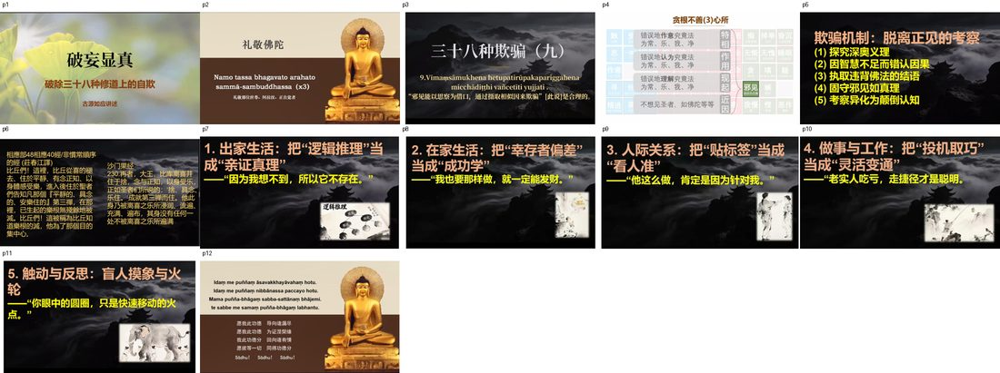
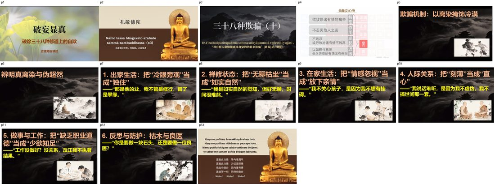
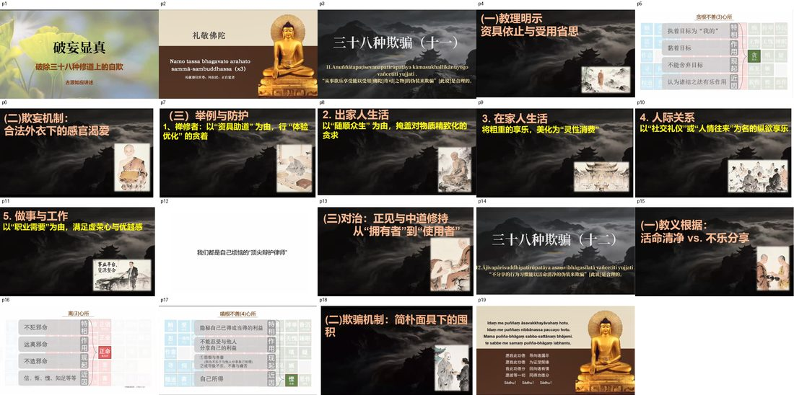
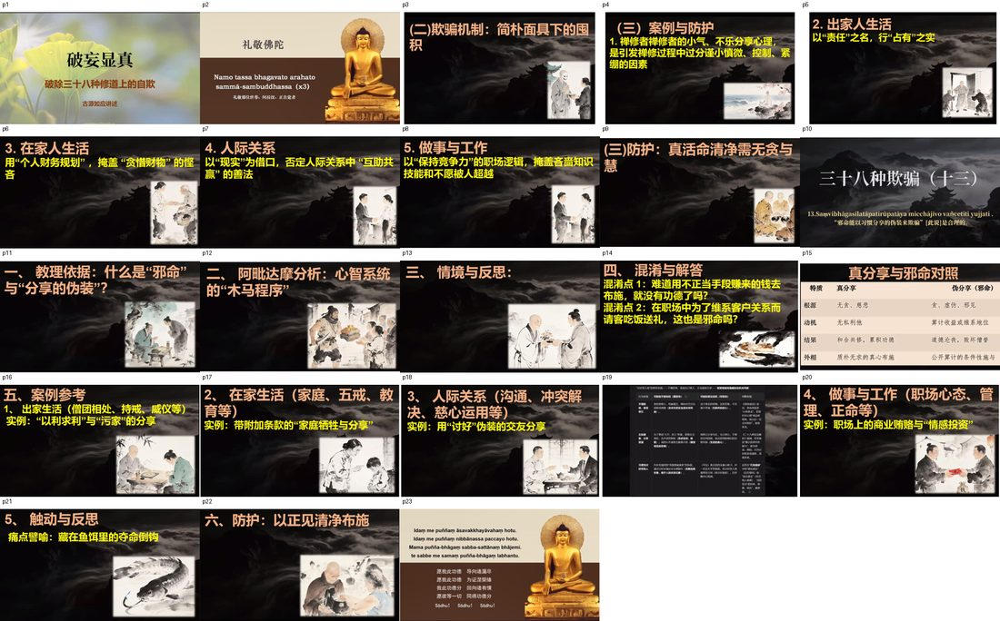
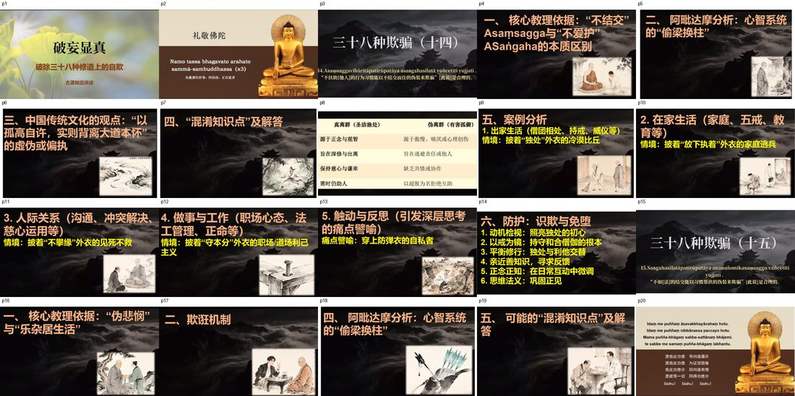
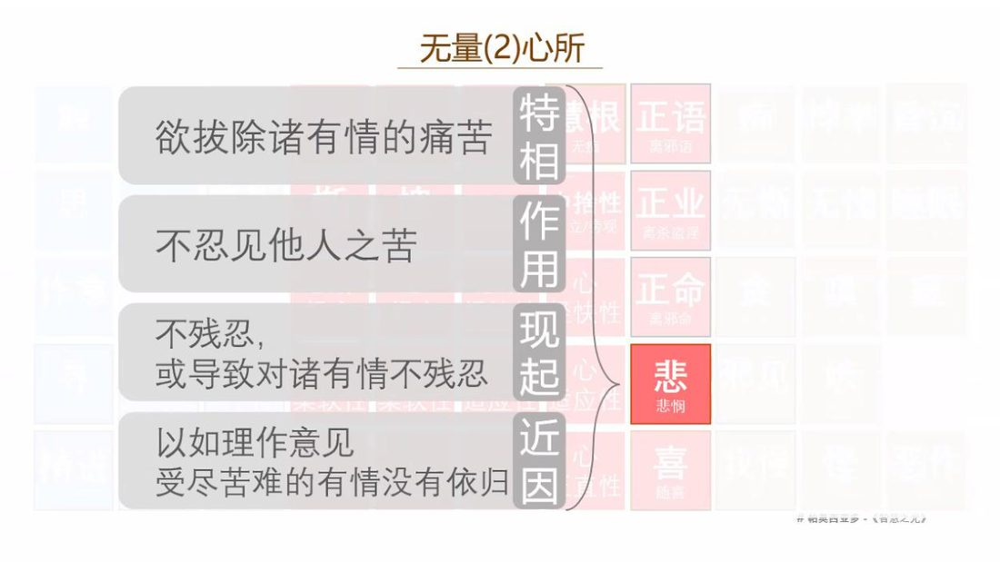
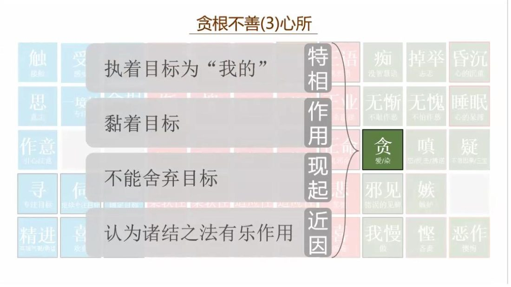
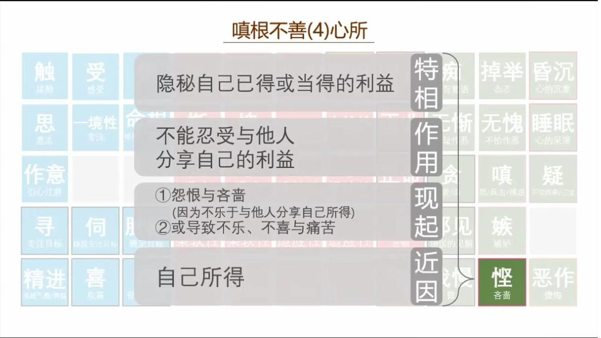
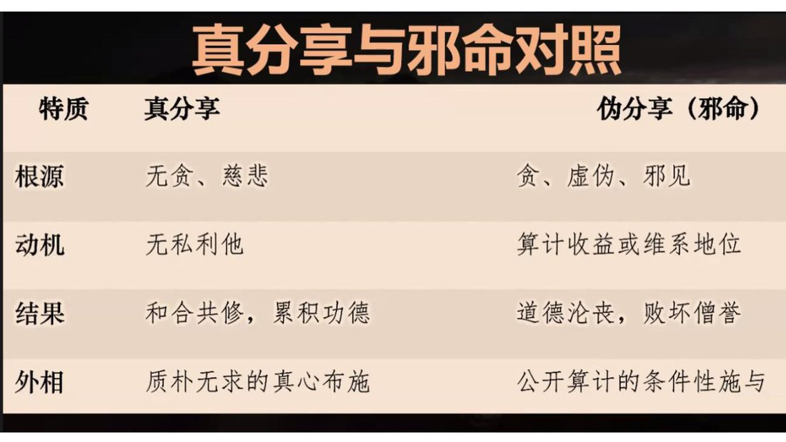

📅 最近更新：2026-09-23 01:52　|　第三版修订（4周版）：连续两周合并为9环节、单讲120分钟；共读原文一字未改；学员版去除主持人专属内容

# 第3周：邪见与我慢之伪装（主持人版）

> ⭐ **本讲主持人速览**（新主持人必读，2分钟看完）
>
> 你不是老师，是"共学同行者"。你不需要提前懂内容，只需要按流程走。
> **本周由连续两周内容合并**而成，含两段共读、两轮分享与两轮讨论，单讲 120 分钟。
>
> | 环节 | 标准时长 | ⏱ 时间不够→ | ⏱ 时间富余→ |
> |:-----|:----:|:-----|:-----|
> | 🧘 静心开场 | 10 min | 缩至5 min | 加2分钟静坐 |
> | 📖 共读原文1 | 20 min | 只读★核心段（约15 min） | 加读◈扩展段 |
> | 💬 第一轮分享 | 10 min | 每人1句话 | 每人3分钟 |
> | 🎯 第一轮主题讨论 | 10 min | 只讨论问题① | 讨论全部问题+扩展 |
> | 🧘 禅修练习 | 15 min | 缩至8 min（只念引导词前半） | 延长至20 min |
> | 📖 共读原文2 | 20 min | 只读★核心段 | 加读◈扩展段 |
> | 💬 第二轮分享 | 10 min | 每人1句话 | 每人3分钟 |
> | 🎯 第二轮主题讨论 | 10 min | 只讨论问题① | 讨论全部问题+扩展 |
> | 🔚 收尾与回向 | 15 min | 缩至10 min | 保持 |
>
> **主持人10条守则（精简版）**：
> ① 不讲解、不提供答案——让原文自己说话；② 有人问"正确答案"→说"先听听大家的看法"；③ 冷场→主持人先分享自己的真实感受；④ 跑题→温和拉回："这个有意思，我们回到今天的原文"；⑤ 争论→"两种看法都很好，大家保留自己的理解"；⑥ 确保人人发言；⑦ 不评判任何人的分享；⑧ 时间到了就推进；⑨ 禅修练习照读引导词即可；⑩ 结束一起回向。

> **读书会21：破妄显真：破除三十八种修道上的自欺 · 第3周（4周版 · 连续两周合并）**
> 主持人：你不需要提前懂内容，按本手册推进即可。
> 本周主题：**以「邪见/思察」为伪装的摄取——第九种自欺「邪见能以思察为借口，通过摄取相似因（`patirūpaka`）来欺骗」；覆盖「脱离正见的五种欺骗机制」（探究深奥义理／因智慧不足而错认因果／执取违背佛法的结语／固守邪见如真理／考察异化为颠倒认知）；并以同一条「相似外相」机制照见「缺乏正见的离染」如何把冷漠伪装成舍。**；**以「自尊/我慢」为伪装的修行姿态——我慢（māna）以修行资历、见地、苦行、少欲知足、离群独住、热心帮扶为装点，把贪欲、悭吝、冷漠与道德优越感一起合法化；真正的自知是惭（hiri）与愧（ottappa），傲慢则是把自己举高。**。

## 📋 本周信息卡

| 项目 | 内容 |
|:----|:-----|
| 时长 | 120分钟（4周版 · 9环节） |
| 核心问题 | 思察（`vīmaṃsā`）本身是善法，为什么能成为邪见的门？「相似因（`patirūpaka`）」相似在哪里、为什么相似就够用了？「脱离正见的五种欺骗机制」分别长什么样？为什么「探究深奥义理」也会成为一种欺骗？「因为我想不到，所以它不存在」错在哪一环？「把冷漠当离染」与「把离染当冷漠」怎样一眼分开？；我慢（māna）为什么最擅长以「修行姿态」出现？「以修行资历、见地、苦行为我慢装点」在录音里是怎么说出来的？「道德优越感」是怎样与邪见合谋的？「悭吝」怎么借「活命遍净／少欲知足」当防弹衣？反过来，「以习惯分享为伪装的邪命」又是怎么运作的？「不结交而住」与「习惯帮扶」为何是一体两面？真正的自知（惭／hiri）与傲慢（慢／māna）的分野在哪一句？「他证路线」与「自证路线」差在哪里？ |
| 共读原文 | 共读原文1：材料①《…自欺12…》课件——第九种自欺的巴利句式与汉译、贪根不善心所板书页、「欺骗机制：脱离正见的考察」五条、相应部48相应40经与沙门果经的两段经文引证、五类生活错认（逻辑推理／幸存者偏差／贴标签／投机取巧／盲人摸象与火轮）；材料②《…自欺13…》录音（★本周讲法正文主体）——第十种欺骗总说、离染与冷漠之别、悲心四相、菩萨出离与提婆达多等公案、「欺骗机制四条」、「厌离智」与排斥之别、出家／禅修／在家／人际／做事五类错认、「枯木与良医」、防护三条；材料③同讲课件（板书要点：「欺骗机制：以离染掩饰冷漠」与「辨明真离染与伪超然」两栏、六类场景错认）；材料④系列总论回扣——《…自欺1…》录音「欺骗的句式机制（`patirūpaka`）」段（同文件不同段落，第1周取〈vañcanā 词源与总说〉段）。　｜　共读原文2：材料①《…自欺14…》录音（★核心）——第十一种「以受用佛陀许可之物为伪装从事欲乐享受」＋第十二种「以活命清净为伪装行不分享」（开篇）；其中「我学完课程了、我禅修不错」→「合理化我的享受」、「邪见和傲慢合谋」→「道德优越感」为本周立骨之段。材料②同讲课件（板书要点：贪根／嗔根心所表、五类场景、「我们都是自己烦恼的顶尖辩护律师」）。材料③《…自欺15…》录音（★本周正位）——续讲悭吝以活命清净为伪装（「戒律成了烦恼的防弹衣」）＋第十三种「邪命能以习惯分享的伪装来欺骗」（真分享与伪分享四重对照、以利求利、污家）。材料④同讲课件（板书要点：真分享与邪命对照表、讨好型人格三行辨析）。材料⑤《…自欺16…》录音（★本周正位）——第十四种「不扶助以不结交而住为伪装」（我慢合谋→道德优越感、防弹衣的自私者）＋第十五种「不如法结交以习惯帮扶为伪装」（伪悲悯、他证／自证路线）。材料⑥同讲课件（板书要点：真离群／伪离群对照表、六条防护）。 |
| 本周作业 | ①简答题：请用自己的话写出「相似因（`patirūpaka`）」的意思，并举一个自己生活里的例子——我当时以为的因是什么？后来发现真正的因是什么？②实践题：本周每天挑一件事（一件就好），在形成结论之前先问自己一句：**「我是在看事实，还是在为我已经想要的结论找理由？」**记录「我今天认出几次」。③观察题：从材料①的五类错认中（逻辑推理当亲证真理／幸存者偏差当成功学／贴标签当看人准／投机取巧当灵活变通），挑**最像自己**的一条，写三行：我通常在什么情况下这样？当时那个「相似因」长什么样？如果不那样推，我可以怎样如理作意？；①简答题：请用自己的话写出「真修行」与「修行姿态」各三个特征，并各举一个自己生活里的例子。②实践题：本周每天挑一次「我把某件事说出口」的时刻（分享经验、劝导他人、拒绝请求都行），事后补一句：「我刚才这句话，是为了利益对方，还是为了更好地看自己？」——只记录，不评判。③观察题：从材料里挑**最像自己**的一件「外衣」（资历／见地／苦行／少欲／离群／热心），写三行：我通常在什么情况下穿上它？穿上它我心里是什么感觉？如果脱下来，我应该做的最小一步是什么？ |

## ⏱ 时间弹性指南（本讲通用）

| 情况 | 应对方法 |
|:-----|:---------|
| **时间不够**（共读太长／讨论超时） | ① 静心开场缩至5分钟；② 两段共读原文均只读标注 **★核心** 的段落；③ 两轮分享每人只说一句话；④ 两轮主题讨论只讨论各自的问题①；⑤ 禅修练习缩至8分钟（只念引导词前半段）；⑥ 收尾回向缩至10分钟 |
| **时间富余**（共读快／讨论提前结束） | ① 用"📚 扩展内容包"中的补充原文段落继续共读；② 增加扩展讨论问题；③ 延长禅修练习时间；④ 增加"每人分享一个生活实例"环节 |

> 💡 原则：**讨论比读完重要，体验比讲完重要。** 宁可跳过扩展原文，也要让每个人都有机会说话。

## 🎓 本讲教学要点（主持人心里有数）

> 以下不是照读稿，是主持人自己拿捏内容的「底稿」，看完心里有数即可，不必对学员讲。

**一、本讲的骨架：一句话、两条款、五种机制**

1. **一句话**（第九种自欺的原句）：「邪见能以**思察**为借口，通过**摄取相似因**来欺骗。」（`Vīmaṃsāmukhena hetupatirūpakapariggahena micchādiṭṭhi vañcetīti yujjati.`）
   - `vīmaṃsā mukhena`＝「以思察为门」；`hetupatirūpaka`＝「与因相似的（东西）」＝**相似因／相似外相**；`pariggahena`＝摄取、执取。**门是好的（思察是善法），被执取的东西是相似的（不是真的），结果就是邪见。**
2. **两条款**：①**门**——思察本身是修行必备（材料④原话：需要「以传承来依止，以理性来探究」）；②**相似**——不善根模仿善法的外相 `patirūpaka`，**相似不等于相同**，而自欺恰好只靠「相似」就能成立。所以本周的重点不是叫大家少想，而是**给思察配上一双正见的眼目**。
3. **五种机制**（材料①板书）：①探究深奥义理；②因智慧不足而错认因果；③执取违背佛法的结语；④固守邪见如真理；⑤考察异化为颠倒认知。**主持人理解这条线的钥匙是「次序感」**——从「认真探究」起，到「异化为颠倒认知」止，**每一步都不像犯错，每一步都像更认真**。请在讨论第 1 题时把这五步写在白板上。

**二、为什么要引那两段经文（材料①）**

- **相应部48相应40经（非惯常顺序的经）**：「从喜的褪去、住于平静、有念正知……进入第三禅，在那里，已生起的乐根无残余地被灭。……被称为比丘知道乐根的灭。」这段话在板书里的位置很关键——它出现在讲「脱离正见的考察」之前。**要传达的不是禅那知识，而是一个方法论警告**：根（`indriya`）的生灭有其**次第**，不是凭推理「我觉得应该是这样」就能推出来的；**「非惯常顺序」这个词本身就在提醒我们：不能拿顺不顺我的理路去推究法的次第。**
- **沙门果经 230**：「比库离喜并住于舍，念与正知，以身受乐……成就第三禅而住。他此身乃被离喜之乐所浸润、流遍、充满、遍布。」——经典是用**经验的语言**（浸润、流遍、充满、遍布）描述可亲证的境界，而不是用**推论的语言**。**主持人可点一句白话：「第三禅不是想出来的，是到达的。」**

**三、五类生活错认（材料①＋材料④，本讲最好用的抓手）**

- **出家生活：把「逻辑推理」当成「亲证真理」——「因为我想不到，所以它不存在。」**这是本周最锋利的一面镜子，因为**它几乎无痛**：我们不会觉得这是自欺，只会觉得自己「理性、不迷信、有批判精神」。**关键句**：想不通 ≠ 不存在；「我想不到」只是我的心智局限，不是法的边界。
- **在家生活：把「幸存者偏差」当成「成功学」——「我也要那样做，就一定能发财。」**只看活下来的样本、只看成功的那一个，把偏差当规律。这条与贪的伪装相邻（W2），但本周的角度是**「因」的选取**：他发财的**相似因**是什么？与我的因相同吗？
- **人际关系：把「贴标签」当成「看人准」——「他这么做，肯定是因为针对我。」**这是「相似因」在日常最典型的样子：**一个可能的动机**被当成了**唯一的动机**，而且是唯一让我难受的那个动机。
- **做事与工作：把「投机取巧」当成「灵活变通」——「老实人吃亏，走捷径才是聪明。」**这句错在**把结果当理由**（因为捷径有效，所以快捷径是聪明），正是材料①第②条「因智慧不足而错认因果」的生活版。
- **触动与反思：盲人摸象与火轮——「你眼中的圆圈，只是快速移动的火点。」**这一条主持时**务必慢慢读**：火轮不是「假的」，只是**被看成圆圈的因缘是「快速移动」**——我们看到的「圆圈」（我的结论）是真实的心理影像，但它**对应的对象不是圆圈**。**这就是「相似因」最贴切的比喻**：像，但未必要那样理解。

**四、跨过见地看慈悲（材料②③，本讲的第二支）**

- 讲者反复强调的接口是这句话：**「你就会慢慢养成一种缺乏正见的离染。」**——**「缺乏正见」四个字，正是本条伪装与本周主题的连接点**：不是慈悲出了问题，是**见**出了问题（把「不受情绪牵动」相似地当成「离染」）。
- **欺骗之能成立，靠的就是「相似」**：残酷冷漠与解脱离染，「在外相上有一个共同点，就是都不受对方情绪的牵动，似乎他如如不动」。
- **四条检查项**（材料②原话顺序）：①外相是否呈现「舍离人事物」的离染相？②内心有没有**排斥、厌恶、自私、逃避**？③**行为的结果**有没有影响到别人的福祉、造成伤害？④有没有把**冷漠美化为修行**的倾向？
- **一句金句**（可板书）：「**离染是把心从黏着中拔出来，而不是把心从关怀中把它关掉。**」
- **两个比喻**：假离染＝**枯木／石头**（有人溺水，它无反应——因为它没有生命；没有生命的寂静不是佛法追求的寂静）；真离染＝**良医**（刮骨疗毒时冷静，但动手的动力是救人）。主持人可只讲这两个画面，**不必解释**，让学员自己带走。

**五、与既有系列的边界（照规矩注明，不展开）**

- 心所体系（贪根不善心所、无量心所、遍一切美善心所）——**详见读书会14（阿毗达摩基础）**，本讲只作板书，不展开。
- 心路过程与随眠（`anusaya`）——**详见读书会15（心路过程）**。
- 业与轮回（业果、恶报公案、果报成熟）——**详见读书会13（业与轮回）**。
- 戒定慧三学框架（正语／正业／正命、三学）——**详见读书会19（戒定慧三学）**；本讲只讲「自欺如何腐蚀」，不重建三学框架。

**六、容易讲错的三个地方**

1. 把「思察」讲成「不该想」——错。**思察是善法，是必需**；错的是「相似因」被当成了正见。对治是**配正见**，不是**停思惟**。
2. 把「相似因」讲成「假的理由」——**不够准确**。它常常**本身就成立**（「那是他的业」在业果法则上并没有错），错在**它被用来护送一个未经如实观察的结论**。所以检验不在「话对不对」，而在**「我用它来做什么」**。
3. 把「离染」讲成「热情」——错。真离染是**心不黏着而心仍柔软**（对应材料②「阿拉汉面对八风不动摇，但心是柔软的」）；它既不冷，也不躁。

## 🧘 静心开场（10 min）

（主持人引导语，照读即可）

> 各位法友，我们开始前，先给自己三分钟，把身体安顿下来。
>
> 请坐到一个舒服而端正的位置，可以坐椅子，也可以盘腿。双手轻轻放在腿上，肩膀放松，下巴微收。眼睛轻轻闭上，或半垂着眼帘。先做三次比较深的呼吸——吸气，缓缓地；呼气，缓缓地。让胸口、肩膀、腹部一点一点松下来。
>
> 现在把注意力放到自然的呼吸上——不控制它，只是知道：此刻，气正在进来；此刻，气正在出去。可以在心里轻轻陪着它：入……出……入……出。
>
> 如果发现心跑掉了，没关系。这不是失败，这是很自然的事。轻轻把它带回来，回到这一口呼吸。走神一百次，就带回来一百次；每一次带回来，都是一次小小的「放下」。
>
> **接下来这一分钟，我们做本周特别的一道练习。** 请留意：**你的心里有没有正在「讲道理」？** 也许你正在想「今天这个主题是什么意思」「我是不是也有这个问题」「刚才那句话说得对不对」。没关系，不用赶走它——只要在心里**认出它**：「哦，我在推想。」然后**不评判地**回到呼吸。**认出，就已经回到当下了。** 这就是本周我们要练的那一分「思察配正见」。
>
> 接着，我们一起在心里轻轻念诵，为这一场共读安立一个清净的缘起：
>
> 让我与在场的每一位法友，都带着一份温和而诚实的心，来认识「相似」的伪装；
>
> 愿我们不拿这一周的题目去评判别人，也不拿它来否定自己；
>
> 愿我们今天所读的每一句法语，都成为看清一点、松一点、清明一点的因缘；
>
> 愿我们思察时，有正见为眼目；愿我们看见时，对自己不生嗔心。

> 💬 **破冰｜3–5分钟**：说说看：你有没有过「越想越有道理，其实越想越偏」的经历？

> 🛡️ **心理安全三约定**（每次开场在心里过一遍）：① **保密**——这里说的话不出这间屋子；② **不评判**——不评价任何人的分享，也不急着评价自己；③ **可随时暂停**——任何时候觉得不舒服，都可以停下来休息、喝水或离开，不需要解释。

## 📖 共读原文1（20 min）

> **【本周朗读段 · 开始】**（本段约 3530 字，供中等稍慢朗读，约 20 分钟；其余为默读／选读／延伸内容）

> **共读规则（开场先念一遍）**：本段由法友轮流照读，一人一段，**只读不解释**；读到不懂的名相，先记在纸上，讨论环节再问。本周四份材料：**材料①**为本讲正题（第九种自欺）的**板书要点**——因该讲录音版暂未取回 media_id，故以课件照录＋系列总论回扣（材料④）补足（详见弹性指南后的缺口说明）；**材料②**为《…自欺13…》**录音转写**（讲法正文主体，依据录音转写整理，已校对明显同音错字）；**材料③**为同讲**课件要点**；**材料④**为**系列总论回扣**（第1周同一录音文件的不同段落，已按段落级口径注明）。**四份材料照录共约 2.3 万字符，切忌全读**——按速览表「时间不够怎么办」列取读。

**材料①** ★核心《13_破妄显真-破除三十八种修道上的自欺12-古源尊者-20260322（课件）》（板书要点·整篇照录）

- 文件类型：pdf（课件／板书要点）
- 知识库出处：古源尊者开示及上座部佛教资料（ima.copilot 知识库，kb_id：`gUS_F0u-c-s03vZz9iozILn4CNDWZ1X3ireb8fXHIRc=`）
- media_id：`pdf_d0dd1c0cd17209afe241ece24bf6b7b4_0797c74fade7d2ea4a528a0d9fd998a17439961422831605`
- 打开方式：ima知识库搜索「13_破妄显真-破除三十八种修道上的自欺12-古源尊者-20260322」
- 适用定位：★本讲正题——**第九种自欺**「邪见能以思察为借口，通过摄取相似因来欺骗」（Vīmaṃsāmukhena hetupatirūpakapariggahena micchādiṭṭhi vañcetīti yujjati）；板书含「贪根不善(3)心所」标签页、「欺骗机制：脱离正见的考察」五条、两则经文引证（相应部48相应40经／沙门果经）、五类生活场景错认（出家／在家·幸存者偏差／人际关系·贴标签／做事工作·投机取巧／触动反思·盲人摸象与火轮）、功德回向与三遍吉祥语。
- 照录范围：全篇（课件无时间码、无正文页码顺序可辨者按提取顺序照录）。
- 校注：课件为板书提纲，部分心所标签页为**图形排版**，文本提取存在乱码与错位（如「精进 夹缝气暖力防弦」「言欢禧」等），一律**如实保留**、不作臆改；巴利语与汉字术语（`micchādiṭṭhi`、`Vīmaṃsāmukhena hetupatirūpakapariggahena`、`samādhi`）按原文照录。

**照录（逐字·整篇）：**

> #   破妄显真
>
> 破除三十八种修道上的自欺
>
> 古源如应讲述
>
> #   礼敬佛陀
>
> Namo tassa bhagavato arahato
> sammā-sambuddhassa (x3)
>
> 礼敬那位世尊、阿拉汉、正自觉者
>
> #   三十八种欺骗(九)
>
> 9. Vīmamsāmukhena hetupatirūpakapariggahena micchāditthi vañcetīti yujjati.
>
> 「邪见能以思察为借口，通过摄取相似因来欺骗」[此说]是合理的。
>
> #   贪根不善(3)心所
>
> 触
> 接触
>
> 错误地作意究竟法
> 为常、乐、我、净
>
> 思
> 意志
>
> 作意
> 引心注意
>
> 错误地认为究竟法为常、乐、我、净
>
> 错误地理解究竟法为常、乐、我、净
>
> 寻
> 专注目标
>
> 精进
> 夹缝气暖力防弦
>
> 信息
> 专用
>
> 言欢禧
>
> 不想见圣者，如佛陀等等
>
> 特相
>
> 二语
> 邪语
> 三业
> 杀盗涅
> 三命
> 邪命
> 悲
> 特响
> 喜
>
> 知
> 没智慧语
>
> 掉举
> 志恋
>
> 昏沉
> 心的沉重
>
> 无惭
> 不耻作恶
>
> 无愧
> 不怕作恶
>
> 睡眠
> 心的呆滞
>
> 贪
> 爱/染
>
> 嗔
> 终/反击/怫逆
>
> 疑
>
> 邪见
> 错误的见解
>
> 嫉
> 嫉妒
>
> 我慢
> 做
>
> 悭
> 吝啬
>
> 恶作
> 懊悔
>
> #   欺骗机制：脱离正见的考察
>
> (1) 探究深奥义理
>
> (2) 因智慧不足而错认因果
>
> (3) 执取违背佛法的结语
>
> (4) 固守邪见如真理
>
> (5) 考察异化为颠倒认知
>
> 相应部48相应40经/非惯常顺序的经(庄春江译)
>
> 比丘们！这里，比丘从喜的褪去、住于平静、有念正知、以身体感受乐，进入后住于圣者们告知凡那个『平静的、具念的、安乐住的』第三禅，在那里，已生起的乐根无残余地被灭。比丘们！这被称为比丘知道乐根的灭，他为了那个目的集中心。
>
> 沙门果经
>
> 230.再者，大王，比库离喜并住于舍，念与正知，以身受乐，正如圣者们所说的：‘舍、具念、乐住。’成就第三禅而住。他此身乃被离喜之乐所浸润、流遍、充满、遍布，其身没有任何一处不被离喜之乐所遍满
>
> #   1. 出家生活：把“逻辑推理”当成“亲证真理”——“因为我想不到，所以它不存在。”
>
> 逻辑推理
>
> #   2. 在家生活：把“幸存者偏差”当成“成功学”
>
> ——“我也要那样做，就一定能发财。”
>
> #   3.人际关系：把“贴标签”当成“看人准”
>
> ——“他这么做，肯定是因为针对我。”
>
> 4. 做事与工作：把“投机取巧”当成“灵活变通”——“老实人吃亏，走捷径才是聪明。
>
> #   5. 触动与反思：盲人摸象与火轮
>
> ——“你眼中的圆圈，只是快速移动的火点。”
>
> Idaṃ me puññaṃ āsavakkhayāvahaṃ hotu.
>
> Idam me puñnam nibbānassa paccayo hotu.
>
> Mama puñña-bhāgam sabba-sattānam bhājemi.
>
> te sabbe me samaṃ puñña-bhāgaṃ labhantu.
>
> 愿我此功德 导向诸漏尽
>
> 愿我此功德 为证涅槃缘
>
> 我此功德分 回向诸有情
>
> 愿彼等一切 同得功德分
>
> Sādhu! Sādhu! Sādhu!

> ⚠️ 主持人操作：本课件为**板书提纲**，是本讲「第九种自欺」的**结构骨架**——主持人版按「欺骗机制的五个考察入口」＋「五类生活错认」两条线组织；「贪根不善(3)心所」标签页因图形排版提取乱码，**只作板书提示，不逐字朗读**（心所体系**详见读书会14**，本讲不展开）。

---
**材料②** ★核心《14_破妄显真-破除三十八种修道上的自欺13-古源尊者-20260324》（依据录音转写整理，已校对明显同音错字）

- 文件类型：音声（录音转写，含时间码）
- 知识库出处：古源尊者开示及上座部佛教资料（ima.copilot 知识库，kb_id：`gUS_F0u-c-s03vZz9iozILn4CNDWZ1X3ireb8fXHIRc=`）
- media_id：`soundrecording_d0dd1c0cd17209afe241ece24bf6b7b4_31a22e1994961d29c78dcad299d446db7439961422831605`
- 打开方式：ima知识库搜索「14_破妄显真-破除三十八种修道上的自欺13-古源尊者-20260324」
- 适用定位：★核心——**第十种欺骗**「对有情无慈愍能以离染的伪装来欺骗」（Virattatāpatirūpakena sattesu adayāpannatā vañcetīti yujjati）的完整口语讲法。其**与第5周主题的接口**：讲者反复点出这条伪装之所以成立，正因为**「相似外相（patirūpaka）」＋「缺乏正见」**——原话即「你就会慢慢养成一种**缺乏正见的离染**」，正是「邪见以思察（看似合理的推究／理由）为门，摄取与正见相似的相似因」在**离染／无慈愍**这一相上的落地：把「冷漠的自我保护」误取为「智慧的平等舍」。故本讲与材料①的「脱离正见的五种欺骗机制」为同一机制的两种相状（一在**见地**上把相似因当正见，一在**慈悲**上把相似相当离染），本周以材料①为**正题**、材料②为**同理延伸与实修落点**。
- 照录范围：`[00:00:05.260]`–`[00:49:54.800]`（第十种欺骗总说·离染与冷漠之别·悲心四相·菩萨出离公案·提婆达多公案·佛为父母证三果公案·欺骗机制四条·厌离智与排斥之别·出家／禅修／在家／人际／做事五类错认·枯木与良医·佛陀五项义务与琉璃王／茉莉王后公案·防护三条·回向）。
- 校注：巴利语术语与明显同音错字已校正，其余口语原貌（含重复、口头语、未完成的句子）一律保留。主要校正：「迷人感／李染／李然／礼让／离然／离职／李冉」→「离染（virāga）」；「无慈敏／吴慈敏／吴悲悯／五悲悯／吴悲米／无悲米／无耻敏／无慈明」→「无慈愍（adayāpannatā）／无悲悯」；「陈根新」→「嗔恨心」；「爱尔兰」→「贪爱」；「拉布拉」→「罗睺罗（Rāhula）」；「亚苏达拉」→「耶输陀罗（Yasodharā）」；「德瓦达大／德瓦达达／德瓦达」→「提婆达多（Devadatta）」；「弥勒王请问经」→「弥兰王问经（Milindapañha）」；「真治部」→「增支部」；「具备无法」→「具备五法」；「残部」→「增支部」；「本圣经／本生经」→「本生经（Jātaka）」；「陆数习／卢出席／出行练／度出息／路数奇」→「入出息（ānāpāna）／入出息念」；「厌离痣／触之智」→「厌离智／思惟智（十六观智）」；「八分」→「八风」；「巴谢那帝王／巴基大帝王」→「波斯匿王（Pasenadi）」；「茉莉王后／茉茉莉王后／茉莉皇后」→「茉莉王后（Mallikā）」；「铁琉璃王」→「琉璃王（Viḍūḍabha）」；「不予取」→「不予取（adinnādāna，偷盗）」；「身体善心」→「遍一切美善心（相应心所）」；「零/莱」→「和合」；开头礼敬语录音转写作「南无陀三／南无瓦多阿拉多三三摩嘎萨」，已还原为 `Namo tassa bhagavato arahato sammā-sambuddhassa`；结尾回向段录音为巴利语快诵，依知识库通行回向文还原为「愿我此功德，导向诸漏尽……」四句并保留 `Sādhu! Sādhu! Sādhu!`。少数无法确证的口语音字（如「石马」「母度」）一律照原貌保留，不作臆改。

**照录（逐字·`[00:00:05.260]`–`[00:49:54.800]`）：**

> `[00:00:05.260]` 好，大家请合掌，我们一起来礼敬佛，Namo tassa bhagavato arahato sammā-sambuddhassa。
>
> `[00:00:11.860]` 礼敬那位世尊、阿拉汉、正自觉者。各位尊者，各位法师、各位贤友，晚上吉祥。

> **【本周朗读段 · 结束】**（以下为默读／选读／延伸内容，时间富余时再读）
>
> `[00:01:01.100]` 今天呢，我们学习第十种欺骗——「对有情无慈愍，能通过离染的伪装来欺骗」。那这个教义呢，它是指出啊，我们这个修行人啊，他很容易陷入这个冷漠的陷阱。
>
> `[00:01:21.920]` 那这里的核心的含义呢，是对众生无慈愍，或者说无悲悯。那一个没有悲悯的人呢，他就是很容易跟这种冷漠啊、缺乏同情心啊，甚至是残忍啊、残酷啊，它是一定会关联的。而这样的一种性格习惯，或者这样的一种行为，他往往对一个修行人来讲呢，他往往会伪装成离染。或者说啊，「我厌离呀」——「这个我不喜欢，这个我已经对这个世俗的东西啊，对你们这一些行为已经很厌离了」。所以呢，这样的一种素质啊，他欺骗修行者——「我这是为了修行解脱啊」。
>
> `[00:02:29.700]` 「我不执着于众生，我不执着于在家人啊，我不执着于其他的啊，所有的这些啊外在的东西。我断除了贪爱。」但实际上呢，他是多瞋，他是嗔心，他是……这个直接就是他是冷漠的表现啊，它不是这个离染啊，它是非真正的圣道的离染啊。那这说明呢，这个所谓的离染啊，我们讲说离执啊或者离染啊、无执着啊，这一种本来是对世俗诱惑的一种超然的态度啊，他可能被误解啊，或者被误用，从而呢，演变成无情或者残忍啊，甚至身口伤害和恼害的这种不善心啊。而它的本质，其实是嗔恨心的冷漠和排斥。
>
> `[00:03:43.660]` 那我们要知道呢，在佛法当中呢，真正的离染呢？啊，所谓离染呢，就是远离这种贪婪，对吧。它其实是智慧和慈悲的体现啊，它不是厌恶或者冷漠。那当缺乏这种慈悲与智慧的这种根本的品质的时候呢，那这些表面的超然呢？他可能就隐藏着冷漠、或是啊，这个甚至残酷。啊，那这个往往是缺乏悲心的这种烦恼的表现啊。
>
> `[00:04:28.780]` 这个在经典上啊，我们看这个菩萨，他作为悉达多太子的时候呢，啊，在他儿子罗睺罗刚刚出生呢，他就舍别子啊，去追求解脱。那从世俗的角度上来讲呢，他就是一种无情的抛弃啊。那实际上呢，从菩萨的角度上来讲，他是为了寻求啊自己和众生解脱的大道，这是一种大悲，对吧？啊，这个大悲它是无数生菩萨道的修行里面所训练出来的啊。那这种大悲心的驱动啊，它是纯粹的离染啊——就菩萨的出离呢，他不是因为厌弃啊，而是为了度脱众生脱离轮回。啊，那么什么东西可以证明呢？最后你看他回家啊，我们佛陀成佛以后回迦毗罗卫国啊，把所有的族亲呢，包括他的前妻啊耶输陀罗，还有他的儿子罗睺罗啊，都度出家，然后他们都证了阿拉汉啊，再也不受轮回之苦了。
>
> `[00:05:56.640]` 那从这里我们可以看到菩萨当时的动机，他并不是无情，而是为了究竟利他啊。所以从这个例子呢，我们就会看到，就是你当时的这种离染，它是一个什么样的动机啊，它跟这个无情它是有本质的区别的。前者呢，它是以智慧慈悲为前导啊；这个后者呢，就是对有情无慈愍啊，它是以冷漠无明为因啊。
>
> `[00:06:34.560]` 好，那我们可以简单来看一下，就是这个悲啊，我们讲慈悲。那悲心的特点是什么呢？要拔除有情的痛苦。啊，它的作用是不忍看到他人忧苦。它呈现在当下心的状态呢，就不残忍。啊，就这个人，他不会冷漠，不会残忍，是一个相对极端的角度。啊，那么他的这个低层次的呢，就是他有至少有一点同情心呢，我们讲说这个人有点同情心，他就是对有情呢不会冷漠。
>
> `[00:07:13.680]` 那他的近因呢，就是如理作意，见受尽苦难的有情没有皈依啊。但是是比较终极的角度上来讲，像菩萨这样对吧，一看到他能够看到有情在生死轮回中头出头没，没有皈依而生起大悲心啊。「我要去解脱，然后再度脱所有的苦难的众生。」那对于一个普通人来讲的话呢，他至少能够生起同理心啊、同情心啊。
>
> `[00:07:44.460]` 所以我们看到这个如理作意的角度看这个众生呢，
>
> `[00:07:50.285]` 啊，那怎么来理解呢？就是对于世间承受的苦难啊，
>
> `[00:07:56.660]` 我们大部分的人来讲呢，就如同这眼盲耳聋啊，他是看不见这个川流不息的这个人间的苦啊。如果是说，啊，我们看到众生流流泪啊，对吧？你每天都会看到川流不息的泪河啊，或者你自己的生命就是充满了眼泪啊，你的生命之流啊就是眼泪之流啊，
>
> `[00:08:19.960]` 尤其……对。所以那么我们呃这个如果去看整个世界啊，我们听不见那些持续不断的遍及世界的痛苦的哀嚎啊。呃，我们现在是大家讲说中国啊，现在是全世界最安全的地方，对吧？对呀，全世界最安全的地方啊，这个这个世界到处都在战乱之中啊，所以到处都能充满这种痛苦哀嚎。啊，那但是呢，因为我们没有感同身受啊，这个我们往往呢这个看不见，甚至呢我们任由自己一点点小的不如意呀，
>
> `[00:09:08.260]` 啊，或者一点点这个让你生起喜悦的东西啊，然后遮蔽我们的视线啊，阻碍我们的双耳啊，心呢就被自私所束缚而变得很僵硬狭隘啊。
>
> `[00:09:24.440]` 那这样的心呢？他是很难向更高的目标迈进的，怎么讲呢？就你一个人那个心啊很冷漠啊，这个然后你的禅修啊就很难进步，它不柔软，它硬邦邦的，对吧？所以我们除了讲这个傲慢对于我们的禅修是一个很大的杀手啊，然后这种动不动就以离染为伪装啊，然后其实内心冷漠僵硬啊，那他表现是什么？就对业处所缘没感情。那那那这样呢，其实他就是要么无聊要么僵硬，对吧？啊，所以那么这样的狭隘，他的心是很狭隘的。那这样狭隘的心呢，怎么修禅那呢？对吧？因为禅那心是……殊胜心啊，它是更高级的善心啊，对吧？
>
> `[00:10:19.830]` 我们称为叫善人法。诶，你一个僵硬的心怎么能够迈向善人法呢？对吧？嗯。所以我们要摒弃这种既要摒弃这种自私的贪爱，同时呢也要摒弃这种冷漠的这种残忍啊，我们才能够从苦里面解脱，才能够柔软。
>
> `[00:10:42.430]` 所以他就是平常我们要长养悲心啊，啊，他这个悲呢能够移除这些我们内心的很多障碍啊，能够通往让我们的心啊变得更柔软自由啊，内心更宽广啊。啊，然后会解除我们内心的这种自我麻痹啊。这个自我麻痹呢，就会让我们很僵硬啊，难以活动啊，就身体里有各种重担扛着的那种感觉，然后你就不能够自由地翱翔了啊等等。
>
> `[00:11:21.860]` 要怎么解决这种被离染所欺骗啊？那就是你观察一下，就是会不会有悲悯呢，对别人有悲悯呢。所以我们要观察这里的欺骗机制是什么呢？就是对有情无慈愍，他能够通过离染的伪装来欺骗。他这种欺骗之所以能成功呢，是因为这个残酷冷漠和我们的解脱离染呢，在外相上它有一个共同点，就是都不受对方情绪的牵动，啊，似乎他如如不动，对吧。
>
> `[00:12:01.655]` 但是离染的真正的含义呢，我们看弥兰王问经里面讲到说啊，佛陀如来以离爱着、以离念着，但他同时呢，是一切有情的皈依，对吧，依归；它支持……比如大地之家「就像大地支持万物，却无所……无我所之欲」，对吧？我们修大地的修法，就大地呢，它承载着万物。你好，它也存在啊；你不好，它也存在啊。它也承载金银钻石，它也承载屎尿粪便。然后他没有讲说「你怎么在我大地上拉屎了」——大地不会这么说啊，所以他是无我啊，所以佛陀呢就是这样的。
>
> `[00:12:51.400]` 啊，那所以佛陀呢，虽然断尽烦恼，但是呢，他有慈愍啊。这个每天早上凌晨的时候，所有的佛陀他都会入大悲定啊，去观察一万个轮回世界——一个佛陀的化区，一万个轮回世界啊——这所有的有缘众生啊，当天有谁能够被他度化，他就是会用一切的方法去把他度化，哪怕就是让他受个三皈依，就是佛陀每天要做的。
>
> `[00:13:25.320]` 那我跟大家熟悉的就是说啊，你看提婆达多，对吧？以佛陀的智慧，佛陀已经成佛了，在……允许他来出家嘛，对吧？他也是他是他的……他妻子的哥哥，对吧？那他来出家，佛陀以他的智慧完全能看到提婆达多的未来会害他、会分裂僧团，对吧？啊，那么很多人就问说，你这个佛陀实际上是没有智慧，对吧？就像我们昨天那个……那个什么一样的对吧？就是佛陀没有智慧，他就是不行嘛，就是提婆达多来捣乱，他当时不让他出家就完了嘛，对吧？
>
> `[00:14:05.585]` 但是呢，佛陀（在）注疏里面讲说，佛陀呢，知道，就是他……因为提婆达多……允许他出家，他还是造作了非常多的善业。而这样的善业呢，将会在他未来成为……成为这个独觉佛的很重要的资源啊。所以即使是这样，这个提婆达多啊，这个来出家啊，这个佛陀也知道注定他会多次伤害他，而且分裂僧团啊，这个最后会堕入地狱啊。当然佛陀依然度他出家，就是为了减轻他轮回的苦啊。那因此呢，真正的离染是断除了贪爱和执着啊，但不排除、不排斥这个慈悲和
>
> `[00:15:02.240]` 例行啊。
>
> `[00:15:03.900]` 那也有一个同学问了。说这个你看啊，有一次说佛陀啊，这个……十二种恶报里面，其中就是被某一个王妃诬陷了啊，谩骂，对吧。那原因呢，就是说这个王妃她原来的父母啊，他很厉害啊，他看到……佛陀走过的……角落啊，他就觉得说，哇，这一定是一个很伟大的人，这样的人配得上我的女儿，对吧。然后他就找到……找到佛陀说要把女儿嫁给他啊。
>
> `[00:15:34.980]` 佛陀呢，观察。就是，如果能够让他的父母亲深刻地看到这个问题，他们两个都可以证三果。对，但是呢，佛陀呢就要把他的女儿骂得一钱不值，说……这个……这个女人就像那个粪便一样，「我看都不会看她一眼」。对，很多人就讲说，哎呀，
>
> `[00:15:58.815]` 佛陀怎么那么不会说话呢？你就说个好听一点就不行了吗？因为如果佛陀不这么说，对吧，他的父母亲呢就不会震惊。对吧，因为女儿这么漂亮这么高级，你就想说「哎呀对不起啊，我们出家人啊，我们不结婚没有用」，对吧？他要把他的女儿骂得一钱不值啊，一钱不值完以后，他……他才会警醒，好，然后他愿意再听佛陀开示，然后他才会证三果。所以佛陀是为了他父母亲证三果。
>
> `[00:16:32.460]` 啊，对，所以呢，他就把他女儿贬得一钱不值啊，
>
> `[00:16:36.610]` 那个佛陀，他是出于悲悯，而不是佛陀不会说话，对吧？
>
> `[00:16:41.110]` 啊。那么无悲悯呢，它是表现为对他人的痛苦啊视而不见。啊，他不愿意伸出援手，就是他力所能及，他也不愿意伸出援手。那这种不作为，他在外相上看起来呢，很像舍——舍受、舍心。而实际上呢，它是冷漠，对吧。所以呢，这个运作机制呢，我们作为一个修行者呢，他可能会想给自己一个很好的理由啊，是吧？你看我们每天都在那念这个……慈悲经啊，
>
> `[00:17:15.250]` 第七条就是啊，众生都是业的所有者啊，业的继承者，以业为起源，为亲属，我帮不了他，我要修远离啊啊。这种念头看起来符合业果法则，但如果内心伴随着对他人的厌恶、排斥或者麻木，而不是智慧的平等舍，那就是无悲悯啊。
>
> `[00:17:39.880]` 所以呢，我们就是……这个经典里面经常会提到一种相反的伪装叫伪悲悯嘛啊。它就是以这个依恋家宅的爱相结合——当别人快乐的时候呢，他加倍快乐；别人悲伤的时候他加倍悲伤。好，那既然贪爱能伪装成悲悯呢？那么反过来残酷冷漠呢，就可以伪装成离染。
>
> `[00:18:11.340]` 那么根据大义师的译注啊，这个残酷、无悲悯呢，最容易伪装的就是模仿离染和解脱。所以我们要知道，真正的离染是心不被贪爱染着，如同莲花出水，对吧，如同莲花不着水，我们以前经常练习。但仍然可以拥有大悲心去利益众生啊。
>
> `[00:18:38.420]` 啊，而无悲悯的伪装离染呢，他心怀排斥冷漠，以此为借口拒绝帮助他人，认为「我不管闲事就是修行」，所以他欺骗你呢——「这是我放下了执着，这是我不攀缘」。实际上呢，他是厌恶众生的这种嗔心以及愚痴心——在愚痴心呢，就是对……注他人的苦毫无感知。好，那这样的无明加上嗔心在作祟，那我们就会拿这个理由来伪装。
>
> `[00:19:26.620]` 好，那么我们如果总结一下呢，也就是说啊，对众生无悲悯、以离染来伪装，他的这个欺骗机制啊啊，它有一些什么特点呢？它第一个呢，就是外在显示出啊，就是舍离人事物的这种离染的相。它看起来就是一种啊，「我对其他不执着，我无执着，我对人事物都无执着，我离染」。那么但是内心呢，他你要去观察，你是无执着，但你看一下你的心。它是有那种排斥吗？有那种厌恶吗？啊，那后面呢？或者说呢，自私跟逃避呀？啊，「我能不能够不要跟他碰在一起啊」，这个有这样的这种自私和逃避啊要检查了。
>
> `[00:20:14.930]` 那接下来呢，就是我们在看，你可能观察也观察不到，但是呢，你接下来的行为啊，它造成的结果，他会不会影响到别人的福祉啊？会不会造成伤害？啊，或者影响到别人的福祉。
>
> `[00:20:34.540]` 那第四个呢，就是说这个你再去看，就是这种作为啊，
>
> `[00:20:42.800]` 他有没有把冷漠美化为修行的这样的一种内心里面的倾向？啊，其实他就有点骗人的这样故意的啊，就是你是能看到的，是一种自欺欺人啊。那如果有这样呢，我们就是无悲悯呢，就会以这个离染的这个假象啊，就用离染的假象来隐藏自己了。
>
> `[00:21:10.260]` 所以往往呢，如果你习惯了这样的一种行为啊，你就会啊，慢慢养成一种缺乏正见的离染啊。这个缺乏正见的离染呢，它是以逃避责任为借口。啊，他会找出无数的借口啊对，那这个甚至于呢，就是说啊，「我不会啊」、「这个方面呢，我确实能力不足啊」，对，但是呢，这个背后呢，他会讲说「我其实呢就是不想贪染这个事儿」。好，那去伪装他内心的冷漠啊。
>
> `[00:21:56.780]` 所以呢，我们要明辨啊，这个离染和伪超然啊。这个离染呢就是心无贪着啊，啊，这个无悲悯呢是心怀排斥。那离染伪装呢，演变成无情和残忍啊，那忧恼呢，化成这种与慈悲共情。好，那这种欺骗现象呢，啊，这个我们要能够看到很清楚啊，就是说离染他一定是以智慧和悲心为基础的，不是情感麻木和逃避责任。
>
> `[00:22:41.995]` 我们在修道这个十六观智里面修到厌离智，我们这有个厌离智对吧。
>
> `[00:22:49.860]` 厌离智呢，它是一种智啊。他是在对诸行法过去、现在、未来、内在、外在、远近、胜劣、粗细十一种……究竟名色法无常苦无我三相的持续观察啊，从思惟智到生灭智、生灭随观，然后到坏灭随观，才会次第生起来悚惧智、过患智，然后厌离智。先悚惧、过患，它才会生起厌离智，它是一种智慧。好，所以他不是麻木啊、逃避啊啊。所以凡夫呢，或者是伪装的人呢，他误认排斥为修行呢啊。
>
> `[00:23:30.035]` 那么圣者呢，或者说一个有智慧的人呢，他是一从这个智慧，就是从诸行法的智慧上啊，看到对自己和他人的利益啊而舍离啊。这里面的很多微细的差别呢，是我们这个智慧或者觉悟跟这个以离染来自欺欺人的分水岭啊。
>
> `[00:23:54.800]` 好，那我们可以举一些例子哈，比如说啊，我们出家人呢，把冷眼旁观啊当成独处——「那是他的业啊，我如果不管呢，才是修行啊，管就是攀缘。」
>
> `[00:24:13.460]` 那比如说一个比丘啊，或者一个出家人，他看到同行的法友生病呢，躺在寮房里没人照顾啊，被脏物……这个排泄物弄脏了身体啊。他呢经过的时候呢，「我不要去看了」。哎，甚至他就掩着口鼻啊，他心里想说啊，「是真是苦啊」，充满了种种的不忍……不敬。「我如果去照顾他呢，就会耽误我的禅修啊。而且个人是个人的业，他生病是他过去造的恶业嘛。我也帮不了他，我也不能帮他……手拔众生苦啊，所以我要修远离不攀缘。」
>
> `[00:24:57.680]` 那这个时候呢，这种无慈愍……这种残忍啊，或者说冷漠啊，他就告诉他说：「你这个就是厌离心啊，那你这个就是不着、不执着深见啊，这就叫独处啊。」
>
> `[00:25:15.460]` 在律藏的大品里面呢，佛陀也是看到有一个比丘啊，他就是躺在寺庙里面没人照顾啊。这个最后佛陀呢去帮他清洗他的身体。清洗完以后呢，这个佛陀呢跟边上的人，所有的比库们讲说：「诸比库啊，你们没有父母照顾，如果你们不互相照顾，谁来照顾呢？」啊，所以……「如果你想你生病的时候希望有人照顾呢，那你现在就应该去照顾病人了。」所以这个佛陀也制了戒，对吧？就是同梵行者啊要互相照顾啊，生病的时候啊，对同梵行者就要去帮忙，要去照顾。
>
> `[00:26:06.325]` 所以真正的离染，他不是染着于我的身体，而是对他人的苦生起悲心。见死不救，不是离染，是残酷的表现。所以我们要怎么反思呢？如果离染让我们变得像石头一样的冷酷，连给病人啊问候一下、递一杯水都不愿意呢，他一定不是阿拉汉道啊，他一定是通往僵硬的地狱之道啊，冷漠的地狱之道啊。
>
> `[00:26:41.025]` 当我们禅修的时候呢，也可能有这样的情况，刚才我也提到，对吧，就是他……以离染的这种名义啊，他其实呢是对业处缺乏恭敬和情感连接啊，这样的禅修者。所以他在比如说他修的入出息的时候，他理解到不应该控制呼吸啊，也不应该期待境界，啊，要如实自然轻松快乐地觉知啊，所以认为这是不执着嘛。
>
> `[00:27:06.120]` 啊，也就是对所缘呢，不要产生任何期待和感情。那么这个他这个修的过程呢也会这样，一开始呢他不执着，他上座的时候努力保持觉知，当下他提醒自己呼吸只是一个呼吸，它这个无常的现象，「我不应该喜欢它，我也不应该讨厌它，只是客观如实地知道」。那这个最初呢，这个他是对入出息这个觉知的无我和舍的理解啊。
>
> `[00:27:38.560]` 然而呢，他如果把这个不执着推向这种极端呢，他就会变成对业处的情感剥离和冷漠。他就缺乏恭敬和感恩。他忘记了他所修的入出息念呢，是诸佛啊、诸阿拉汉、辟支佛修习的业处，它极为稀有难得。他没有生起「我能修此法何其幸运」的这种感恩心和稀有难得的想。相反呢，那就是法就是法嘛，那呼吸就是呼吸嘛，没有什么特别。那你在禅修的时候老搞这个恭敬和感恩，那是不是一种执着呢？
>
> `[00:28:21.660]` 是不是会变成一种控制呢？好，那么他把这种对殊胜业处的轻慢伪装成这种平等不二的所谓智慧。
>
> `[00:28:31.400]` 啊，所以为什么我经常讲说修入出息业处啊，要对那个业处培养感情，对吧？你要爱上你的入出息啊。所以我讲说你要体会每一次入出息都是甜的。啊对，如果你……啊大家很多人来报告的时候觉得很无聊，对吧？啊很无聊，就是你就没有感恩嘛，你又没有体会到那一丝入出息他对你生命的重要。
>
> `[00:28:56.115]` 不要讲说佛陀修的对吧。啊，我说再不行，我说你捂住你的呼吸，捂它半分钟、30秒啊，你再打开看看，你就觉得哇，呼吸真好，对吧？你就憋不了气嘛。哎。就你有这样一种感恩心，有这样的一种欢喜心，这呼吸怎么会无聊呢？就想每一次呼吸都在维持你的生命啊，对吧？你就不会无聊枯坐。啊，那一定是对呼吸就是呼吸嘛，啊，对他就是缺乏对呼吸有喜爱的连接啊。啊，那我们当呼吸微细的时候，觉知清晰的时候，他没有内心生起啊这个轻安的喜悦。
>
> `[00:29:38.735]` 反而是有些人甚至说啊「不能喜欢这种状态啊，这个喜欢会让我变得躁动啊，喜欢就是贪」啊。当呼吸粗动、万念纷飞的时候，他没有生起「我们要啊如实本然啊、耐心」啊，这个的这种善心啊，回来看看的心，说「刚才为什么会有那么多妄念啊」；而是觉得说「啊，一点进步都没有，好无聊」。沉闷抗拒，他就在冷漠当中对自己说「啊，这个好无聊难熬」。
>
> `[00:30:13.210]` 那这种呢，就是实质上就是对业处失去了兴趣和连接啊，又缺乏基本的恭敬感恩和对善法欲的滋养。啊对，业处对他就变成枯燥无味啊对，那随着时间的流逝呢，
>
> `[00:30:31.780]` 啊，他就这个慢慢的他的这种对入出息的修习的愿望他都会退失啊。
>
> `[00:30:41.380]` 啊，那这个就是我们禅修的时候很容易出现的情况，就是禅修变得僵化啊，禅修变成机械的打卡啊，心没有办法跟业处建立起这种鲜活的有深度的连接啊。所以那么这样的情况当然你的定力就很难以增长啊。
>
> `[00:31:01.960]` 那经典里面讲啊，快乐是一境性的近因啊，就你对入出息就是要欢喜，有欢喜才会有快乐，有快乐你才会有定啊。啊，那你就是……觉得「好无聊」对吧，你好无聊的时候呢，你就没有快乐啊。……压抑了我们修行里面生起来的自然而然的这种喜乐。
>
> `[00:31:22.840]` 我们讲说啊，遍一切美善心（相应心所）啊，轻安、轻快、柔软、练达、正直啊，他就是只要有一丝正念，我们就一定会有轻安轻快柔软这些……正直。
>
> `[00:31:34.740]` 当然有有些同学讲说，我已经好几个正念了，怎么也没有轻安轻快柔软……他增上呢。啊，就是你在想你有好几个正念的时候，其实你在好几个正念，我们就看我们已经好几个了，背后它就是很多的贪，很多的嗔，它交替地生起。啊，有一个正念，接下来有4个贪和5个嗔在后面陪着来，然后他再来一个正念，一个4个贪5个嗔，对吧。好，那这个时候呢，你的那个刚生起来一个正念的那个轻安、轻快、柔软……呢，都被撑淹没了。他怎么能体会得到呢？啊，所以你要自自然然地就去觉知的时候，它自然就会生起来。
>
> `[00:32:18.160]` 啊？那我们在家人的生活呢也容易出现这种情况啊，
>
> `[00:32:22.765]` 把情感的忽视当成放下亲情呢。啊，这个有些修行人呢，就是他不关心自己的孩子啊，就像我们没有关爱啊。啊，他为了追求所谓的清净啊，在家里面对伴侣啊、对孩子不闻不问啊，孩子的生活状态啊、考试状态啊，或者乃至于生病呢，他都面无表情——「我在修中舍啊」。啊，那这家人碰到工作碰到困难啊，请求安慰。啊，那个，「假如说你要知道一切都是无常的，我们生活在苦圣谛的世界，知道吗？所以你要学会自己面对，不要执着。」那然后结果呢，在家里什么事也不做，对吧，他觉得世俗就是个累赘呀。
>
> `[00:33:15.990]` 那这个时候呢，这个无慈愍是怎么伪装的呢？啊，这个烦恼他伪装成道心坚固啊，就觉得说「斩断情执才能够解脱啊」，
>
> `[00:33:28.175]` 「亲人就是修行的冤亲债主啊，我们对他要离染。」啊？所以佛陀不是这么教的啊。这个佛陀在增支部里面啊，这一部经典里面就很明确地规定了，在家人在家佛弟子对配偶和子女的义务啊，要爱护啊，要供给要教导啊。那佛陀在本生经里面那就更多了——过去一生他很多事啊，这个不管是修苦行啊，或者他要自己离家修行啊，一定是要把父母赡养完以后才走的啊。
>
> `[00:34:09.280]` 他这个包括佛陀啊，这个本生经里面赡养啊，这个目盲的父亲啊，或者是……这个身体有残疾的父母啊，都是照顾到……很极致了啊。所以佛陀并不是说他要修行他要解脱，他就把家人就不管了啊。
>
> `[00:34:34.900]` 我们前面讲到那个……中舍对吧，中舍的劲敌啊，最近最接近的敌人就是对世俗的无知冷漠，对吧？啊，他以修行为借口逃避责任啊，实际上是对家人的厌恶啊，而不是对轮回的厌恶。所以我们知道真正的放下他是这个心里面没有挂碍。没有挂碍呢，就是说随着每个缘起他都正确地去做。啊，但是不是事不关己。
>
> `[00:35:12.800]` 好。那跟人之间相处呢，也容易出现这个问题。
>
> `[00:35:18.160]` 比如说，我们把刻薄当成直心是道场，对吧？啊，「我说话是不是很难听啊？但是呢，我是不虚伪的，我不搞世间那一套。」好，那很多人会这样说话。所以那么跟朋友相处啊，跟我们善友相处的时候呢，说话尖酸刻薄啊，他不仅不能够随喜别人的功德，还专门泼冷水啊。当别人指正的时候他就说：「修行人就是直，心是道场。啊，我才不像那种凡夫俗子那样虚伪客套，我是离染的，我不在乎人情世故，我们是强调直指人心，那我说话就是要直指人心。」就把人家气得不行啊。啊，这这个这个时候呢，无慈愍呢，他就伪装成真诚和不随俗啊。
>
> `[00:36:16.340]` 在增支部里面，佛陀教导说，说法者应该具备五法。其中第一个呢，就是基于慈心而说，而非嗔心而说。如果言语让对方感到痛苦，而且无意……那就不是直心，那就叫出恶语。所以无慈愍者呢，他会利用不执着社交礼仪为借口啊，而随意地释放内心的攻击性啊，这是错误的。所以在这里呢，人际关系的如果要规避这种欺骗，它的反思点呢就是这个：所谓的离染啊，它就是离贪着啊，离这个世俗的攀缘，但不是离慈缘啊，不是离慈悲。啊，这个没有慈悲的直率啊，它就像没有刀鞘的利刃啊，它会伤人伤己的啊。
>
> `[00:37:21.420]` 那我们在做事上面呢，也容易出现这种情况，就是把缺乏职业道德啊当成是少欲知足啊——「工作没有做好没关系啊，反正我也不执着结果嘛。啊，能做到什么程度就算什么程度啊。」
>
> `[00:37:44.360]` 对，那么如果我们去看医生啊，这个医生对病人的痛苦麻木不仁啊，他开药很草率；或者老师对学生的困惑不耐烦呢。啊，当面对……疏忽的指责的时候，心里想：「世间法都是梦幻泡影啊，何必那么认真呢？啊，我就是不执着，我心里面充满了平等舍。」那这个时候，那个无慈愍的伪装他就被你穿上了啊。就是你的无慈愍，就伪装成解脱的风衣给你穿上。他让你觉得这是一种超然的境界啊。
>
> `[00:38:28.480]` 那在相应部里面啊，佛陀啊讲了很多的这个道相应——八正道。
>
> `[00:38:36.360]` 八正道正语、正业啊、正命啊，这这个……三个离心所啊，就是在我们做事的时候需要，啊，跟人相处的时候需要遵循的啊。如果我们从事某种职业却不尽责，导致他人受损啊，包括比如病人的病情加重呢，啊，这个呢就是不予取（adinnādāna，偷盗）啊——你就收了病人的钱啊，病人只希望你把它治好。那你不尽力，
>
> `[00:39:13.180]` 那包括呢？你在单位里面拿着工资，你不干活啊，这是不允许。呃，这个老板给你工资呢，并没有许可你可以躺平啊，对吧？就是你是说你要去做，但能力不足是另外一回事。但你讲说「我不执着，我就是我摸鱼」，对吧？啊，然后我告诉人家说我不执着，对，那就是不予取，不叫不执着。
>
> `[00:39:44.140]` 对佛陀呢？啊，讲法40多年呢，啊，就未曾有握拳不教之法啊……这个握拳不教之法就是并不是说佛陀把他证悟的法全部说完，而是众生只要有请求，他就完全没有保留的。那众生没有请求，佛陀也不会无缘无故地找人说法，对吧？「来来来，我也跟你说一段。」那这个就是对众生的悲悯啊。那无悲悯者呢，把这个懒惰不负责任啊，它包装成高级的修养。所以我们在这个时候，我们需要反思的点是什么呢？就是真正的离染呢，他是在尽职尽责之后，对结果不执着。
>
> `[00:40:38.000]` 就像我们禅修也一样的，就是对入出息啊，你如实自然轻松地……就是每一丝都没有放过啊，这一种尽责。但是呢，禅修的状态怎么样，结果怎么样，光亮不亮，稳定不稳定，不执着。啊，就是在果上不执着，而不是在因上直接放弃。好在因上直接放弃呢，他要么就是冷漠，要么就是不执着，而不是懒惰啊、不负责任或者不允许。
>
> `[00:41:22.120]` 好，那基于这个呢，我们需要这个要经常要反思的啊，就是：我们到底是要做一块石头呢，还是成为良医啊？那无慈愍就是假离染呢，它就像一块枯木啊，或者石头。啊，比如说我们河边的石头啊，看到有人溺水了，他不会有反应啊，他确实也没有贪爱，对吧？那是什么原因呢？因为它没有生命。啊，那没有生命的寂静，不是佛法追求的寂静。
>
> `[00:42:09.060]` 那真正的离染呢？他就像一个高明的外科医生啊。啊，他在……病人需要开刀啊、刮骨疗毒的时候呢，这个医生呢，他也离染啊，他很冷静啊，尤其是当他的这个病人就是他的亲人的时候，对吧？哎，他也不能随他的情绪啊波动啊去治疗，那个手会发抖啊对吧。啊，但是他也拿着刀割下去诶，流很多血对吧，但他所做的一切的动力呢，是救人，那是悲心。那如果医生呢，因为不想执着病人的生死而拒绝手术呢？那个就是失职。所以我们在修行当中呢，啊，就要去观察我们是不是把心变僵硬了，误以为我心变得强有力了。
>
> `[00:43:07.920]` 好，那我们需要经常提醒自己的时候呢，就是说……圣人才完全没有情绪反应。那圣者的无动摇，
>
> `[00:43:20.130]` 我们讲说四果阿拉汉，它是无动摇啊。每天我们念诵……慈爱经，对吧。啊，动的和不动的啊，那个不动的，这就叫不动摇啊，阿拉汉就是不动摇。啊，面对八风不会动摇，但是阿拉汉的心是柔软的。它是柔软的。
>
> `[00:43:45.560]` 啊，他这个柔软呢，来自于什么呢？它来自于对世间苦难的深刻的理解。啊，他内心里面对世间苦难充满了深刻的理解。啊，所以它不是一块冷漠的石头。啊，所以如果我们发现自己修得越来越僵硬，那就看看是不是越来越冷漠。啊，看谁都像尸体，行尸走肉。啊，那显然，你一定不是修行进步了，更不可能是证果。啊，他一定是掉进了……这个陷阱啊。
>
> `[00:44:28.000]` 所以呢，我们应该怎么防护呢？就是要以悲心和智慧为基础啊。那以悲心与智慧为基础的离染才是真的舍离啊。所以真正的舍离呢，它首先是要根植于悲心，而不是嗔心。它是具足于正见和正思维啊，而不是邪见邪思维。第三个它不仅表现为离执离染啊，它更需要现起……这个对四圣谛的运用。好，我们讲以四圣谛的角度看问题，以八正道的方式解决问题。啊，那只有这样，我们才不会在当下造成对自他的伤害啊。这个是真正舍离的、必须的。啊，所以离染呢，是把心从黏着中拔出来，而不是把心从关怀中把它关掉。
>
> `[00:45:34.900]` 好。那佛陀是世界上最离染的人，但他也是最忙碌于救度众生的人。我们讲所有成佛的佛陀，他的……一直到般涅槃之前，他的生命呢，每一天就5种……5项义务自动运转。啊，他就一直就是这样做啊。啊，佛陀睡觉就睡一个小时多一点，每天。每天都然后就……这样度众生嘛，对吧。啊，那他对你的悲悯到什么程度呢？就是那个琉璃王要去灭释迦族的时候，对吧？他就是在路口待了3次。待了3次完以后，后面就不待了。喏，就是以佛陀的智慧，那琉璃王……这个下点药都不愿下点药，就是只有给……在这个智慧就这样。
>
> `[00:46:36.600]` 佛陀的智慧呢，可以让那个那个叫什么……波斯匿王，就当……这个茉莉王后，对吧，她死的时候由于起了一个追悔的心，她就堕入地狱。那这个波斯匿王呢，他死亡以后啊……他就跑来问佛陀说这个……这个茉莉王后投生到哪里了？佛陀呢就以神通让他想不起来。每次他来见佛陀，他就忘了问，每次来见佛陀就忘了问。
>
> `[00:47:10.595]` 连续来了七天，佛陀发现，哎，这个茉莉王后呢，已经从地狱里面投生天界了。啊，然后再告诉他说啊，茉莉王后已经投生天界了。波斯匿王说：「就是啊，就是啊，她这么好的人，怎么……不可能不投生天界呢？」对吧。那你像我们想说佛陀那么厉害，如果要是……来讲的话，就是说那……你给这个琉璃王也来一下，对吧？一想出兵的时候就忘记掉，一想出兵的时候就忘记掉。你不用下药，对吧？诶，回头就是不干啊。
>
> `[00:47:48.580]` 就是……就比如佛陀这个是不是很不悲悯啊。佛陀是深刻地看到因果的运作，他知道没有人可以救……这个释迦族的人，他们的果报已经成熟，所以这个佛陀并不是不悲悯啊。哎，所以那么当我们对别人的痛苦无动于衷的时候啊，他是因为智慧的平等舍，还是因为冷漠的自我保护啊？那我们经常这样去观察，我们就可以看到啊，就可以防止我们掉入这个以离染啊为伪装啊，这个然后行的是对众生无悲悯的这种冷漠和啊这个残忍呢。
>
> `[00:48:49.420]` 好，那这个是我们需要经常去反思的。那么经常这样去观察，你回过头来会看到我们在禅修上也是这样。
>
> `[00:48:58.845]` 我们前面已经讲到了，如果一个人的心他冷漠啊、没有热情啊，或者是啊动不动就要排斥，他的心就不柔软啊，不柔软就很难修下来。啊，这个……大家可以去看看那些修上来的人，他有个最根本的特点啊，他都是血是热的啊。好，那今天我们就学习到这里，我们一起来回向功德。
>
> `[00:49:33.680]` 愿我此功德，导向诸漏尽；
>
> `[00:49:41.000]` 愿我此功德，为证涅槃缘；
>
> `[00:49:47.000]` 我此功德分，回向诸有情；
>
> `[00:49:54.800]` 愿彼等一切，同得功德分。Sādhu! Sādhu! Sādhu!

> ⚠️ 主持人操作：本讲录音共约 50 分钟，**是本讲的讲法正文主体**（约 1.1 万字）。主持人版按「总说（冷眼旁观＝独处的错认）→ 欺骗机制四条 → 五类场景错认 → 枯木与良医 → 防护三条」切分；**时间紧张时优先照读**「欺骗机制四条」（`[00:19:26]`–`[00:21:10]`）＋「出家生活／在家生活／人际关系三类错认」（`[00:23:54]`–`[00:36:20]`）＋「枯木与良医」（`[00:41:22]`–`[00:44:30]`）；公案段（提婆达多、佛为父母证三果、琉璃王、茉莉王后）可择一朗读，切忌全读以致超时。

---
**材料③**《14_破妄显真-破除三十八种修道上的自欺13-古源尊者-20260324（课件）》（板书要点·整篇照录）

- 文件类型：pdf（课件／板书要点）
- 知识库出处：古源尊者开示及上座部佛教资料（ima.copilot 知识库，kb_id：`gUS_F0u-c-s03vZz9iozILn4CNDWZ1X3ireb8fXHIRc=`）
- media_id：`pdf_d0dd1c0cd17209afe241ece24bf6b7b4_b8f1891af26fe2c0fb51deffd940642d7439961422831605`
- 打开方式：ima知识库搜索「14_破妄显真-破除三十八种修道上的自欺13-古源尊者-20260324（课件）」
- 适用定位：第十种欺骗的板书骨架——「10. Virattatāpatirūpakena sattesu adayāpannatā vañcetīti yujjati」；含「无量(2)心所」标签页（悲的特相／作用／现起／近因）、「欺骗机制：以离染掩饰冷漠」「辨明真离染与伪超然」两栏、六类场景错认（出家生活·冷眼旁观当独住／禅修状态·无聊枯坐当如实自然／在家生活·情感忽视当放下亲情／人际关系·刻薄当直心／做事工作·缺乏职业道德当少欲知足／反思与防护·枯木与良医）、功德回向与三遍吉祥语。
- 照录范围：全篇（课件图形页的标签文字有错位，「无量(2)心所」四栏已按提取顺序照录）。
- 校注：课件文本提取中「以离染掩饰冷漠」「辨明真离染与伪超然」两栏仅存栏标题、无正文（**图形页无文本层，如实注明缺口**）；「无慈憨」按原课件照录（同义于「无慈愍」）。

**照录（逐字·整篇）：**

> #   破妄显真
>
> 破除三十八种修道上的自欺
>
> 古源如应讲述
>
> #   礼敬佛陀
>
> Namo tassa bhagavato arahato
> sammā-sambuddhassa (x3)
>
> 礼敬那位世尊、阿拉汉、正自觉者
>
> #   三十八种欺骗（十）
>
> 10.Virattatāpatirūpakena sattesu adayāpannatā vañcetīti yujjati . 「对有情无慈憨能通过离染的伪装来欺骗」[此说]是合理的。
>
> #   无量(2)心所
>
> 欲拔除诸有情的痛苦
>
> 不忍见他人之苦
>
> 不残忍，
> 或导致对诸有情不残忍
>
> 以如理作意见
> 受尽苦难的有情没有依归
>
> 特相
>
> 作用
>
> 现起
>
> 近因
>
> 正语
>
> 高洲信
>
> 正业
>
> 高杀盗
>
> 正命
>
> 高外奇
>
> 悲
>
> 悲悯
>
> 谢谢
>
> 182
>
> #   欺骗机制：以离染掩饰冷漠
>
> #   辨明真离染与伪超然
>
> #   1. 出家生活：把“冷眼旁观”当成“独住”
>
> ——“那是他的业，我不管是修行，管了是攀缘。”
>
> #   2. 禅修状态：把“无聊枯坐”当成“如实自然”
>
> ——“我是如实自然的觉知，但好无聊，时间很难熬。”
>
> 3. 在家生活：把“情感忽视”当成“放下亲情”——“我不关心孩子，是因为我不想有挂碍。”
>
> #   4. 人际关系：把“刻薄”当成“直心”
>
> ——“我说话难听，是因为我不虚伪，我不搞世间那一套。”
>
> 5. 做事与工作：把“缺乏职业道德”当成“少欲知足”——“工作没做好？没关系，反正我不执著结果。”
>
> #   6. 反思与防护：枯木与良医——“你是要做一块石头，还是要做一位良医？”
>
> Idaṃ me puññaṃ āsavakkhayāvahaṃ hotu.
>
> Idam me puñnam nibbānassa paccayo hotu.
>
> Mama puñña-bhāgam sabba-sattānam bhājemi.
>
> te sabbe me samaṃ puñña-bhāgaṃ labhantu.
>
> 愿我此功德 导向诸漏尽
>
> 愿我此功德 为证涅槃缘
>
> 我此功德分 回向诸有情
>
> 愿彼等一切 同得功德分
>
> Sādhu! Sādhu! Sādhu!

> ⚠️ 主持人操作：课件作**板书要点**用；「欺骗机制：以离染掩饰冷漠」「辨明真离染与伪超然」两栏为**图形页**、无正文可提取，主持人版据材料②录音转写（`[00:11:21]`–`[00:23:30]`）代为说明，**不臆造课件原文**。

---
**材料④** 系列总论回扣《02_破妄显真-破除三十八种修道上的自欺1-古源尊者-20260211》（依据录音转写整理，已校对明显同音错字）

- 文件类型：音声（录音转写，含时间码）
- 知识库出处：古源尊者开示及上座部佛教资料（ima.copilot 知识库，kb_id：`gUS_F0u-c-s03vZz9iozILn4CNDWZ1X3ireb8fXHIRc=`）
- media_id：`soundrecording_d0dd1c0cd17209afe241ece24bf6b7b4_96692e91a4bb53397192fff046b166e57439961422831605`
- 打开方式：ima知识库搜索「02_破妄显真-破除三十八种修道上的自欺1-古源尊者-20260211」
- **同文件跨周说明**：本文件与**第1周材料①**为**同一录音文件、不同段落**——第1周取〈vañcanā 词源与过患 · 三十八种自欺总说〉段（`[00:00:56]`–`[00:11:01]`）；本讲取〈欺骗的句式机制（patirūpaka）·「以正见为先导」〉段（`[00:11:01]`–`[00:14:32]`），**段落不重叠**，已按段落级口径注明。
- 适用定位：系列**总论回扣**。本讲「第九种自欺：邪见以思察为借口摄取相似因」之所以能成立，其通用机制即此处所讲的 **`[X]mukhena [Y] vañcetīti yujjati`——不善根如何以 `patirūpaka`（相似外相）模仿善法而行欺**；「自欺的根子是正见不足」「只要有自欺，背后就有痴（moha），就不能以正见为先导」正是本周「五种脱离正见的欺骗机制」的总纲。**因自欺12 录音转写暂缺（见卷首缺口说明），特以本段作系列总论回扣，补足本周「正见—邪见」的教理底座。**
- 照录范围：`[00:11:01.340]`–`[00:14:32.660]`。
- 校注：同第1周口径——巴利语术语明显同音错字已校正（如「挖这个挖掘地地啊又加地」→ `vañcetīti yujjati`、「巴利的句式」→「巴利句式」、「批判性思维」→「批判性思察／考察（vīmaṃsā）」），其余口语原貌一律保留。

**照录（逐字·`[00:11:01.340]`–`[00:14:32.660]`）：**

> `[00:11:01.340]` 导论译注呢，对这个三十八种欺骗的这这个句式啊，它是这样的好，就是「[Y]通过[X]之门被欺骗」，那么这样的一种状况呢是经常有的，他说是合理的好。那也就是说，如果在巴利句式里面呢，它是表现为这个 [X]mukhena [Y] vañcetīti yujjati。那这个结构呢？就解释不善根如何模仿善法的外相啊，patirūpaka。啊，他以这个 patirūpaka 就是外在的一种表现，而进行自我隐蔽或者自我批评欺骗。
>
> `[00:11:53.140]` 那比如说我们的第一个这个欺骗呢，就是讲这个贪啊，他这个欲贪啊 kāmacchanda，他会以不厌恶想啊 appaṭikkūlasaññā 为借口来行骗啊，appaṭikkūlasaññā 好，他是在这里。啊，appaṭikkūlasaññā 啊，好。那。这个。kāmacchanda 呢，它是贪啊，appaṭikkūlasaññā 是不厌恶想哦啊，mukhena 呢是与外相或者以这个这个这个欺骗啊，mukhena 呢啊欺骗啊。啊，我家的的有家的好那。这个这个vañcetīti yujjati，就是以这种形式来欺骗啊。好，
>
> `[00:13:01.360]` 那同样的一样的昏沉呢，你已经昏沉了，它会假扮成禅定哈啊 thīnamiddha 啊，就是昏沉，他会讲。假扮 samādhi 啊，邪见呢啊，micchādiṭṭhi 啊，邪见呢会伪装成啊，
>
> `[00:13:21.350]` 我就考察我们讲说批判性思察啊啊。啊 vīmaṃsā 啊，就是我这个事情不能随便地信啊，我就要认真考察一下啊那这个就是这个在我们的。三十八种欺骗里面的一种形式哈。所以在这个。
>
> `[00:13:47.920]` 讨论译注里面呢，它。提出来关键的一个事经原则就是如是凡是正法而非而实非者。当依理与经典辨其欺骗的本质好，那这个是跟我们前面讲的四大教示啊，它是一脉相承呢。这需要也就是说强调需要以传承来依止啊，以理性来探究，然后去共同去揭露这个自欺和欺骗。好，那么这里面呢，我们所有的所谓的欺骗啊，不欺骗它的标准，它以什么来选择呢？
>
> `[00:14:32.660]` 在佛教里面就是善和不善。啊？那佛教里面的善的哲学观呢，是怎么样的呢？

> ⚠️ 主持人操作：本段为**系列总论回扣**，用于共读开场或主题讨论前**点一句**（「为什么『思察』能成为邪见的门？因为不善根会模仿善法的相似外相 `patirūpaka`」），**不必整段朗读**；如时间富余，可让学员对照第1周材料①的同文件前段一并回顾。

## 💬 第一轮分享（10 min）

**分享规则（先念一遍）**

1. 分享**以自愿为限**，不点名、不追问；沉默完全允许，坐着听也是参与。
2. 每人 **90 秒**（主持人举牌控时）；规则是**只讲自己的经验**，不点评、不分析别人。
3. 若有人的分享让你想起自己，先在心里记下，等第二、三轮再说——**不给回应压力**。
4. **不贴标签**：不说「你这就是邪见」「你这是偏执」；我们只报告自己。
5. 今天所有分享的内容，**只留在这一间屋子里**。

**起手问题（选 2–3 个，先邀请、不点人）**

1. **本周我们读到一个很特别的说法：「因为我想不到，所以它不存在。」** 请回想一件小事——一次你「想不通」就下了结论的经历（不一定是修行上的，生活里的都算）。当时你**省掉了哪一步**？
2. **「相似因」就是「很像正因的理由」。** 请分享一个你自己的「相似因」：当时你用什么理由说服了自己？那个理由**本身成立吗**？它是在帮你看事实，还是在帮你的结论站住？
3. **今天还有一个支线：把「冷漠」当成「离染」。** 你有没有过这样的时刻——嘴上说「我不执着了、随缘吧」，心里其实是「不想管、懒得碰、心里有怨」？（**可以只说「有，但我不展开」**——这也是完整的一次分享。）
4. **自由分享**：本周的材料里，哪一句最像在说你？读的时候心里是什么感觉？

> ⚠️ 主持人操作：第 1、2 两问是「见地线」，第 3 问是「慈悲线」，两条线**建议都点到**（哪怕只有一个人回应）。第 3 问最容易触碰情绪，请**先说**「可以只说『有』、不必展开」，再邀请；若现场明显安静，主持人可先做**30 秒的自我分享示范**（讲一件小事，不深入），把门槛降低。全程不做评判、不追问细节。

## 🎯 第一轮主题讨论（10 min）

**引导问题一：思察（`vīmaṃsā`）本身没有问题，问题在哪一步？（约 12 min）**

- 先请一位学员照读材料①的五条机制：**①探究深奥义理；②因智慧不足而错认因果；③执取违背佛法的结语；④固守邪见如真理；⑤考察异化为颠倒认知。**
- 提示（主持人可照读）：**请注意这五步的次序——它们不是五个错误，而是一条「越走越像修行」的路。** 第一步「探究深奥义理」听上去完全是好事；可一旦探究的结果被当成「我懂了」，第二步就会在智慧不足处**错认因果**；第三步再把自己的**结语执取**下来（比如「我看透了」「这都是业」）；第四步把那个结语**固守成真理**；到最后第五步，**考察本身已经异化为颠倒认知**——我们以为自己在思察，其实是在为已有的结论找证据。
- 追问：这五步里，**你最容易在哪一步滑掉**？在哪一步停下，成本最低？
- 落点（材料④）：所以问题不在「想不想」，而在**「有没有正见为眼目」**——「只要有自欺，自欺的背后就有痴（`moha`）；只要有痴，你就没有办法以正见为先导。不能以正见为先导，八正道就无法展开。」

**引导问题二：「相似因」为什么相似就够用了？（约 12 min）**

- 请学员照读材料①的第五类错认：**「盲人摸象与火轮——你眼中的圆圈，只是快速移动的火点。」**
- 提示：**火轮是真实可见的心理影像，但它的对象不是「圆圈」。** 我们的「相似因」正是如此：它常常**是真实存在的道理**（「那是他的业」「世间都是无常」「我是为了不攀缘」），但当我们把它**从它该在的位置挪出来**，去护送一个未经如实观察的结论时，它就成了相似因。
- 追问三个「换位检验」：
  1. **换位**：如果同样的理由用在**别人**身上，我会觉得它成立吗？
  2. **换果**：我用这个理由**接下来会做什么**？会让自他的苦减少，还是让我的逃避更舒服？
  3. **换源头**：这个理由是**观察来的**，还是**我想要来的**？
- 落点：材料①第②条「因智慧不足而错认因果」在这里最容易被看见——**错认因果，往往不是把 A 看成 B，而是把「我要的」看成了「事实」。**

**引导问题三：同一条「相似」机制，如何让冷漠冒充离染？——从见地走到慈悲（约 11 min）**

- 请学员照读材料②的**四条检查项**（`[00:19:26]`–`[00:20:42]`）：①外相是否呈现「舍离人事物」的离染相？②内心有没有排斥、厌恶、自私、逃避？③行为的结果有没有影响到别人的福祉？④有没有把冷漠美化为修行的倾向？
- 提示：**这四条其实就是「相似因」在慈悲上的应用**——假离染之所以能骗过我们，正因为「残酷冷漠」与「解脱离染」在外相上**相似**：「都不受对方情绪的牵动，似乎他如如不动。」
- 请两位学员分别照读材料②中「出家生活」的错认（「那是他的业，我不管才是修行，管了是攀缘」，`[00:23:54]`–`[00:26:38]`）与「人际关系」的错认（「我说话难听，是因为我不虚伪」，`[00:35:12]`–`[00:36:16]`）。
- 追问：**「那是他的业」这句话本身错吗？**（不错，它符合业果法则。）**那错在哪？**（错在它被用来护送「我不想管」——**话是对的，位置不对**。）
- 落点（材料②原话，可板书）：**「离染是把心从黏着中拔出来，而不是把心从关怀中把它关掉。」** 再补一句材料②的防护三条：**①根植于悲心而非嗔心；②具足正见与正思维而非邪见邪思维；③以四圣谛的角度看问题、以八正道的方式解决问题。**

> ⚠️ 主持人操作：三问由浅入深，**第 1 题必须开**（它是本周骨架）；时间紧张时**第 3 题压缩为「只读四条检查项＋一句金句」**，不必展开讨论。全程避免「谁的知见正／谁的知见邪」的对人评判；题目里的「我」永远指自己。第 3 题涉及「我是不是一直在用修行话语回避责任」，现场若有人情绪起伏，**立即回到呼吸或给暂离选项**。

> **分层追问**（可视时间取用，由浅入深）：
> - 【现象】你身上有没有一种「用想代替修」的习惯？
> - 【影响】光想不做、或者想偏了方向，会带来什么？
> - 【应对】这周你愿意在哪一个反复盘旋的念头上，先停下来，回到身体与呼吸？

## 🧘 禅修练习（15 min）

### 练习一

> ⚠️ **禅修禁忌提示**：若你正处在严重抑郁、焦虑、创伤后应激，或精神类疾病的发作／用药期，或正经历强烈的情绪危机，请先咨询医生或心理师，再决定是否练习；练习中若出现明显不适（如心悸、胸闷、情绪失控），请立即停止，睁开眼睛，把注意力放回呼吸与身体，必要时离场休息。

（本周练习引导词，照读即可）

> 请坐好，身体端正而放松，眼睛轻轻闭上。先做三次深呼吸，然后让呼吸回到自然。
>
> 把注意力放在鼻端或腹部的呼吸触感上，只是知道：入……出……
>
> **现在，加一道本周的功课。** 在陪着呼吸的同时，请留意三件事：
>
> **第一，有没有「讲道理」。** 心里是不是正在解释、判断、给自己找一个说法？如果有，只在心里轻轻标记一句：「**在推想。**」然后回到呼吸。**标记不是打压，它只是让「我知道我在推想」亮起来。**
>
> **第二，这个道理在为谁服务。** 当那个说法出现时，轻轻问自己一句：「**我是在看事实，还是在为我已经想要的结论找理由？**」不用回答得很清楚——**问出来，就已经是正见在照。**
>
> **第三，心里有没有一点「不想碰」。** 有没有一种对某人、某事的回避、排斥、懒得理？如果有，标记一句：「**不想碰。**」然后**不急着改变它**，只是**把它看清**。看清之后，再回到呼吸。
>
> 就这样练习大约十分钟：知道呼吸，知道在推想，知道在为谁服务，知道不想碰。**你不需要「想得很对」，你只需要「看得很清楚」。**
>
> 最后两分钟，把这份清明扩展开来，并把慈心带上：
>
> 愿我此刻能看清自己的心，而不责备自己的心；
>
> 愿我在看清之后，仍然愿意伸手，不去做一个冷漠的旁观者；
>
> 愿我不把「不执着」当成关上心门的理由，愿我的心在看清中变得更柔软。
>
> 慢慢把注意力带回身体，感觉一下坐姿、双手、脚掌的接触，然后轻轻睁开眼睛。

### 练习二

> ⚠️ **禅修禁忌提示**：若你正处在严重抑郁、焦虑、创伤后应激，或精神类疾病的发作／用药期，或正经历强烈的情绪危机，请先咨询医生或心理师，再决定是否练习；练习中若出现明显不适（如心悸、胸闷、情绪失控），请立即停止，睁开眼睛，把注意力放回呼吸与身体，必要时离场休息。

（本周练习引导词，照读即可）

> 请坐好，身体端正而放松，眼睛轻轻闭上。先做三次深呼吸，然后让呼吸回到自然。
>
> 把注意力放在鼻端或腹部的呼吸触感上，只是知道：入……出……
>
> **现在，加一道本周的功课。** 在陪着呼吸的同时，请留意三个讯号：
>
> **第一，姿态。** 有没有一种「我正在好好修行」的感觉？如果有，**不赶它走**，只在心里轻轻标记一句：「**姿态**。」然后回到呼吸。看见它，就已经松了一层。
>
> **第二，紧缩还是柔软。** 此刻的心，是缩着、绷着、有点排斥，还是柔软的、开阔的？如果是紧缩的，只标记一句：「**紧缩**。」不追求把它变柔软——**只要如实看到，它自己会松**。
>
> **第三，有没有想被看见。** 有没有一丝「希望别人知道我在用功」的念头？如果有，标记一句：「**想被看见**。」然后温柔地放掉，回到呼吸。
>
> 就这样练习大约十分钟：知道呼吸，知道姿态，知道紧缩，知道想被看见。**你不需要「修得很好」，你只需要「看得很真」。**
>
> 最后两分钟，把这份温和扩展开来：愿我此刻能看清自己的心，也愿一切众生都能看清自己的心；愿我们不因看见而责备自己，愿我们因看见而更柔软——**愿我身可独处，心常柔软；需要时，随手就能伸手。**
>
> 慢慢把注意力带回身体，感觉一下坐姿、双手、脚掌的接触，然后轻轻睁开眼睛。

## 📖 共读原文2（20 min）

> **【本周朗读段 · 开始】**（本段约 3536 字，供中等稍慢朗读，约 20 分钟；其余为默读／选读／延伸内容）

> **主持人操作总则**：本周共读原文共 6 份（材料①③⑤ 录音转写＝正文主体；材料②④⑥ 课件＝板书要点），**30 分钟读不完全部，必须取舍**。建议分配：**材料① 节读 7 分钟（只取「以资历为我慢装点→合法外衣」＋「邪见和傲慢合谋→道德优越感」两段）→ 材料② 板书 1 分钟（只念「我们都是自己烦恼的顶尖辩护律师」与五类场景标题）→ 材料③ 精读 8 分钟（悭吝以活命遍净为伪装、「戒律成了烦恼的防弹衣」、以利求利与污家）→ 材料④ 板书 2 分钟（真分享与邪命对照表）→ 材料⑤ 精读 9 分钟（不结交而住＋我慢合谋→道德优越感、「防弹衣的自私者」、他证／自证路线）→ 材料⑥ 板书 1 分钟（真离群／伪离群对照表）。** 由法友轮流照读，每段读完停一下、不解释；生僻名相当场用一句话白话点明即可，深入的解释留到分享与讨论。
>
> **照读纪律**：录音转写保留了口语原貌与时间码，读起来会有些「绕」，请法友**照字念、不跳读、也不顺手美化**；时间码可念也可略过。
>
> **六份材料与既有系列的分工**：心所体系详见**读书会14**；心路机制详见**读书会15**；业与轮回详见**读书会13**；戒定慧框架详见**读书会19**；「三慢（胜／等／卑）与惭／愧辨析」详见本系列**第4周**（自欺11）。本讲只讲「自欺如何腐蚀」，不重建这些框架。
>
> **段间串场词（材料①→材料③之间，主持人可照用）**：材料①讲的是我慢的第一件衣服——**资历**：「我有地位、我学完课程、我禅修不错，所以我值得受用」。那么，如果一个人干脆不享受、还很简朴呢？请听材料③——**我慢的第二件衣服，叫「少欲知足」**：悭吝穿上「活命清净」，戒律就成了烦恼的防弹衣。
>
> **校注与缺口说明**：本讲六份材料均按知识库真实文字逐字照录，录音转写已校对明显同音错字（校注、PDF 图形页／表格提取缺口说明详见《读书会21素材/第6周_素材照录.md》对应材料块）；`[generated, not original text]` 标注系检索侧所加，照录一律保留。

**材料①** ★核心：《15_破妄显真-破除三十八种修道上的自欺14-古源尊者-20260327》（依据录音转写整理，已校对明显同音错字）
- 文件类型：音声（录音转写，含时间码）
- 知识库出处：古源尊者开示及上座部佛教资料
- media_id：`soundrecording_d0dd1c0cd17209afe241ece24bf6b7b4_9ffd7d3c43caa10657e1867e86d7650d7439961422831605`
- 打开方式：ima知识库搜索「15_破妄显真-破除三十八种修道上的自欺14-古源尊者-20260327」

> ⚠️ 主持人操作：本讲全长约 67 分钟，**全读必超时**。只读下列三段（① `[00:01:22.120]`「这个自欺呢，它是解释什么呢」至 `[00:02:35.250]`「什么叫佛陀这个受用」（四资具如何被异化为感官享受）；② `[00:23:40.940]`「他为自己的贪欲呢，套上符合戒律」至 `[00:25:05.140]`「滑向贪欲」（**以资历、地位、『我学完课程了、我禅修不错』合理化受用**——本周正位段落）；③ `[00:57:12.920]`「那这里面呢，从阿毗达摩来分析呢」至 `[00:59:34.800]`「我是一个修行者啊」（**悭吝＝嗔根心所、邪见与傲慢合谋、道德优越感**——本周正位段落））。其余段落（贪的别名 pema／taṇhā／rāga／samudaya、六境猴喻、gūhana、五类场景举例、子肉经与对治、四受用、回向）**只作串场说明，不逐字念**。照字念即可，时间码可略。

**照录（逐字·全段，朗读时按上述三段择要）：**

> `[00:00:14.720]` Namo tassa bhagavato arahato sammā-sambuddhassa（×3）。各位尊者，各位法师，各位贤友，晚上吉祥。
>
> `[00:00:55.360]` 啊，今天呢，我们来学习。第。啊，十一种哎。
>
> `[00:01:05.450]` 第十一种欺骗。啊？从事娱乐，享受能与受用佛陀许可之物的伪装来欺骗。那。
>
> `[00:01:22.120]` 这个自欺呢，它是解释什么呢？我们把。戒律，允许或者生活必须的正当受用。比如我们出家人讲衣食住药四种资具啊。那把它异化成为对感官舒适啊，奢华享乐啊这种很隐秘的贪求。那么它的欺骗性在于哪里呢？就是说它是以如法必须啊、有利于修行啊来作为伪装啊。呃，实际上他行的是呃，滋养自己的贪欲啊，强化我执啊的这样的这个实际上的一种啊内在的贪执啊。啊？所以那这里呢就是说。我们要观察的是它是一种这种。从需要向刚好的这种丝滑的这种转移呀，好。那什么叫？佛陀这个受用。
>
> `[00:02:35.250]` 受许的使用呢，或者受用许可呢？它是指在戒律允许或者维持基本生活所需要的物品使用，比如说我们的袈裟啊、生衣啊，啊食物啊。啊，住所医药啊。那如果我们假借这个四资具的必须或者合理之名呢，而去过度地索取。或者你内心里面呢啊这么去朝向他就很容易呢沦为纵欲的享乐啊，就耽着于感官的舒适和。享乐。
>
> `[00:03:19.840]` 那举个例子说呢。啊，这个。啊，我们。这个。这个。袈裟啊，或者我们生衣啊。啊，我们这个在广州，大家说我们要用丝绸的。啊，比较。因为那么热嘛啊。对，
>
> `[00:03:42.780]` 在我们在缅甸的时候呢，我们像以前讲过最高级的这个袈裟是用莲花的，莲花的杆和莲花。这个织出来的线，然后反着加上啊，据说穿着很舒服，没穿过，对它成为一种……很实，就是你要供养一个大师……你要花很多钱去处理一套那样的袈裟。啊，但是呢，这个很多人内心也会很倾向于说，就是这样穿着长袖很好啊，对吧？啊，或者说呢，这样才是。一个这个这个我们讲说人靠衣装，出家人要靠袈裟，对，所以他就觉得要选最好的啊。
>
> `[00:04:35.900]` 啊，舍弃普通的供养啊啊，然后追求这种好吃的东西啊啊，那这个对于居住的地方呢，我们有很多的期待啊啊。对，我们在云台呢，这个大家都愿意住那个虽然云台的条件确实很差了，对吧，
>
> `[00:04:55.645]` 但是呢，住集装箱总比住土楼强啊。对，那那就。那我们内心里面其实是对不好的住所呢的一种啊排斥啊，对好的住所的一种贪求，呃内心里面倾向一般我们报告说这样呢我比较适合禅修啊啊，这个心比较能够专注啊啊。啊，或者呢，这个信众呢，这个大致诚心供养嘛啊。
>
> `[00:05:30.580]` 啊，就跟我们讲暗示啊对吧，听说苹果已经出iphone18了，据说有AI对我们备课比较好用。对吧，啊就叫暗示啊啊。这是戒律许可的嘛，对吧？我没有要求他供养啊，我只是听说那个很好啊。对，那你如果懂呢，你就要啊，你就要去做嘛对吧？
>
> `[00:05:58.525]` 对以前呢，这个有这个啊，有个笑话说这个如果一个比库啊，贪着于美味啊，他可以把寺院养的鸡呢，建议把它杀了吃了他还不犯戒啊。哎，就看到鸡呢，就跟他的亲人讲说嘎比亚嘎罗黑。亲人就知道把鸡杀了给他吃，对，这个就叫做啊，这个变黑的意思就是。给他做净，给那一只鸡做净。啊，他们就不给他做净啊，那这个就是一种，其实他是想吃鸡肉了，但是呢，戒律是许可的。我们已经嘎比嘎到黑了。嗯。对，以他这个言语上看是合理了，但是他的心呢，他是从基本需求啊滑向这种贪图享乐啊。
>
> `[00:06:54.620]` 那么正是呢，他以这个佛陀受许啊允许啊啊，这个作为伪装啊，来啊，这个这个纵容自己哈，对这个物欲的这种贪求了啊。好。那么从。
>
> `[00:07:12.500]` 教理的角度上来讲呢，什么叫做佛陀许可之物呢？我们在教戒律上呢，它是有资具依止戒嘛。啊，在戒律里面是有资具依止戒啊，就是佛陀允许出家人受用衣食住药四种生活之具啊。我们这个叫资具依止，那这是佛陀许可之物啊。但是呢，我们要知道我们在受用这些许可之物的时候啊，那你看我们晚上都有省思嘛，
>
> `[00:07:43.170]` 四种省思对吧？啊，你的饮食的省思啊，当然我们现在五观堂啊，啊，五观堂的时候，你要思存五观啊，当然是没有念诵啊。没有念诵呢，至少在念到说这个这个。这个愿这个供养的人呢啊，他能够得到安乐啊，这也算喽啊。对以正常来讲呢，饮食的形式呢是不为嬉戏，不为骄慢，不为装饰，不为庄严啊，只是为了此生助力存续，为了停止伤害，为了资助梵行啊。如是我将消除之说，并使禽兽不生，我将维持生命过且安住啊。
>
> `[00:08:22.710]` 那包括1我们要将受用受这个省思啊，这个。呃，这个住处也要这样，这个省思啊，药也要这样省思啊。如果忘了省思呢，我们是养成一个习惯呢。啊，出家人一般我们养成一个习惯，就临相之前。省思一下，一醒过来啊，这个我们一般都建议出家人一醒过来，第一个想法就先省思一下，从昨天临相开始到现在为止，
>
> `[00:08:55.255]` 所有的受用的衣食住药四资具都去省思一下，这就比较安全了，不然就变成欠债受用啊。所以我们一旦受用呢，它偏离了维持生命啊资助梵行的这种初心，而转而去追求口感啊安逸啊舒适啊啊美貌啊啊。那么即使吃下去的杯中合法的食物呢，我就穿着信众供养的袈裟呢，它其实。实质上已经变成了对五欲功德的啊，这种五欲的这种感受的贪求啊嗯。
>
> `[00:09:33.980]` 那在经典里面，我们这个佛陀对于四种受用呢，就是分成四类嘛，对吧？盗受用就是盗受用破戒者啊，受用信众的供养就叫盗受用。所以我们经常讲，说这个地狱门前僧道多。为什么呢？就是因为破戒者他还穿着那个袈裟，在接受信众的供养，那这个大概率都在地狱里了。债受用呢，就是持戒的凡夫如果不省察，每天不去省思四种资具啊，四资具的受用，它就变成欠债受用或者叫债受用。
>
> `[00:10:15.650]` 那么当禅修者呢，或者出家人呢？借着这是佛陀允许为由不加省察的啊，这种享受啊啊，这大快朵颐啊啊，这个不仅是欲乐的伪装啊，在业果上他还欠下了信众的债务。好，那么这个呢，就是说以正当化掩饰的这种自欺欺人呢啊，使自己的对贪求呢披上合法的外衣啊。

> **【本周朗读段 · 结束】**（以下为默读／选读／延伸内容，时间富余时再读）
>
> `[00:10:48.520]` 那佛陀在转法轮经里面讲了，这种世俗的贪求啊，对物质欲乐和烦恼之乐的追逐啊，它是卑劣的啊，它是世俗的，它是凡夫的行为啊，是非圣者之道，它不利于解脱啊。所以我们对于一个佛教徒呢，不管是僧俗、四众弟子啊。啊，虽然可以合理地使用资具，但是如果去追求完美，追求舒适和雅致呢，那这个受用呢，就会转化为贪着，而成为自欺的根呢。那我们怎么来判断说？他是已经滑向了这个。这个贪着呢，
>
> `[00:11:31.865]` 我们先认一下，先复习一下，什么是贪呢？啊，简单来讲，它的特相呢就是执着目标为我的。
>
> `[00:11:42.505]` 那在义注里面呢，它有一个例子啊，就是说这个。这个粘猴子的胶水啊，以前我们讲过叫六境猴嘛，对吧哈。在古印度的时候，他们猎人抓猴子啊，就是在这个猴子经常出没的这个树上。就涂上粘胶。啊，当这个猴子……一抓上树，它就手就粘在上面。连在上面呢，猴子呢，它的习惯呢，就用另一个另外一只手去推，结果另外一只手也粘住了。啊，然后他就用脚去推，结果两只脚都连上了。然后他在头上去顶，结果连头也连上了。啊，最终就被猎人抓住了，烤起来吃了。
>
> `[00:12:27.920]` 啊，同样的就是众生呢，因为色声香味触法六种所缘啊所黏着，所以我们呢堕入恶趣啊，
>
> `[00:12:36.470]` 就是我们被六境所黏着，我们称为叫六境猴。它的作用呢就是粘着目标啊，这个比喻呢就像一块肉扔在一个很热的锅里面啊，就粘锅了啊。那他的现起呢，就是表现为不能够舍弃目标。
>
> `[00:13:00.900]` 那一书里面讲一个形容啊，就是我们比如说这个衣服啊。呃，沾上油了。啊，它是很难洗掉。那过去我们也有一个形容叫如油入面啊，如油入面更难。对吧，这个油在衣服上，你有好的去污的东西还好办，对吧？现在有办法，但这个油如果跟那个面揉在一起，你要把油弄出来是很难的。好叫如油入面，所以这个贪这个东西呢，是很难洗脱的啊。那么它的境是什么呢？它对目标会升起结啊啊，那么也就是说认为诸结之法有乐的味道或者乐的作用。那。也就是说它源于两种原因，一种呢，他觉得所缘有乐味，他会来带来长久的快乐啊是。
>
> `[00:14:00.760]` 清净法啊，我们讲常乐我净的净，这个是不如理作意啊。那再一个呢，是邪见就执取所缘，是觉得快乐的如意的称心的啊，那这个我们两种都会有，就是说如果你纯粹就是贪那一口啊。这个味道啊啊口味，那这个呢就是说对本来它这个这个为什么会好吃呢？为什么会甜呢？就是这个作为人的这种物种的基因啊啊，它判断这种食物对你的生存是有帮助的，所以你就要感到好吃，
>
> `[00:14:42.655]` 感到香、感到甜，它就是这样的作用。好，你没有这样的认知呢。你认为是这个好吃啊，那这个就是不如理作意啊。那还有一种它是邪见，就是我必须啊，就是执取所缘，就是他必须这样才会好啊，才是如意的，才是称心的，那这就是邪见。
>
> `[00:15:07.000]` 所以大念处经里面在这个集谛的有一句很经典的话，就是在世间有可爱与可喜之物的任何地方。爱欲就在那里升起，就在那里建立。啊？那马天尊者把它翻译说，在那里止住而止住，升起而升起，止住而止住。啊，这里呢是叫建立啊，我觉得建立的翻译更好一点。
>
> `[00:15:35.900]` 那怎么理解呢？就是有可喜可爱之物呢，你接触它，它就会升起来。啊，要么欲爱有爱无有爱，贪就会在那里升起来啊，爱欲就会升起来。为什么呢？你的基因决定的，凡是对你的生存物种繁衍有帮助的，你就要感到快乐啊。然后你看这个就会受这个受缘爱，你爱就会起来。
>
> `[00:16:01.200]` 那么在那里建立是什么意思呢？有些人说在那里建立，有些人说在那里坚固，有些人在那里止住。就是说。诶，这个东西真的是很好哎，然后你的心就停在上面，就去构建它说啊，我怎么样让它变得更好，我怎么样是这样才是我的美好的生活。好啊，这只有这样做的话呢，我才算是在这个没有白来世间一次好，那这样的一个构建它就是邪见了。啊，所以是作意建立这个建立或者止住它是。去构建啊，去构建它是一种邪见。
>
> `[00:16:40.280]` 好，那么因为凡夫具备的这个邪见啊，比如说称心如意啊啊，把本来呢这个无常苦我的人啊东西啊或者是事物啊，看成称心如意啊，这个是邪见啊，就缘取不净的所缘而称为净啊。
>
> `[00:16:58.400]` 所以我们如果当什么叫来判断你的贪呢？就是说你觉得哦这个好，我想继续要。啊，那个或者接下就说只有我这样的人才这个这个配得起这样的好啊，
>
> `[00:17:13.985]` 但一个是贪，一个是贪慢啊啊，那如果你看到了就知道它已经不是上法的简单的这种受许许可了，而且是滑向的这种贪。啊，那么在经典里面贪有很多的别名呢，
>
> `[00:17:32.660]` 在巴利里面啊，比如说有 pema 啊，pema 呢就是指挚爱啊，就是亲情层面上的一种爱，比如说爱情啊亲情啊、钟情啊情爱啊，这些都是被称为 pema啊。
>
> `[00:17:48.450]` 那另外一个呢叫 taṇhā，大家很熟悉啊，叫渴爱。那这个渴爱呢，一般是佛陀把它用在对六种所缘的如饥似渴爱着不舍的这种经验啊，我们就称为叫 taṇhā啊。那第三个呢叫 rāga。rāga 呢，其实它一般都用在爱染。爱染呢就跟我们讲说，诶你被油染上了，或者是油如面了啊，它非常的染浊啊。因为 rāga 呢，它从巴利的另外一个意思呢就是染色，就是给衣服染色啊。所以 rāga 呢用在贪里面就是贪染啊，非常的杂染啊。这个染浊就是你它这个衣服被上色了，或者被油油脂啊浸入了。它是这个很难洗脱一样啊。那它还有一个名字呢，
>
> `[00:18:47.370]` 啊，叫 samudaya。samudaya 呢就大家很熟悉了，如果是了解的人，他是四圣谛里的集谛啊，所以集谛呢称为 samudaya。那。就集谛本身呢就是渴爱啊。嗯。
>
> `[00:19:07.600]` 对于成就……呢，它是我们的这个贪，是这个贪心所啊。啊所以不管是这个 pema 还是 taṇhā 还是 rāga 还是 samudaya 啊这些呢，这个各种的爱啊，各种爱染啊，各种贪婪啊啊，它就像这个啊绳子一样啊，把我们紧紧地绑在这个五蕴世间里面了啊，不得解脱了，所以叫诸结之法，它是会把你捆住的啊。那么对他呢，啊，是很难防范的。它需要在刚刚冒出来的时候，你就要看到它啊，要加以防范了，不然的话呢，它就会。持续增长啊。这个经典里面讲说，就像那个小牛啊，刚刚开始冒出那个尖尖的牛角。啊，它就是会慢慢长大啊。嗯。
>
> `[00:20:09.540]` 那么对于一个人呢，对一个生命来讲，他只要。这个没有解脱之前啊啊，
>
> `[00:20:16.560]` 我们经常讲就是啊，就是靠贪啊啊作为生命的动力啊去创造社会啊对吧，所以它是。与生俱来的，什么叫与生俱来呢？我们所有的生命结生以后第16个心之刹那，就一定会升起一个贪相应心啊。3个贪相应心啊，不管是什么生命，就是色界天的天神，他也会升起一个贪相应心——欲界的啊，7个贪相应心啊，就是贪什么呢？他诶我的生命又出现了啊，然后就可以继续轮回啊。所以即使很小的贪呢，它也可能演化成一个大的贪，最后把我们送到恶趣里面去了啊，那这个是我们。复习一下这个贪啊。啊，那这个。这个一起知道我们怎么是。防范这种这种自欺啊这种欺骗。
>
> `[00:21:15.080]` 啊？那么这种。以佛陀。允许受用啊，而实质上是滑向贪求呢。那他的这个新的这种心智系统啊，它是怎么完成这种？伪装呢和这个机制呢？那我们在讲三十八种欺骗的时候呢，它都是以。善法有很多相似，相就是那个烦恼跟善法有很多相似的地方。所以烦恼呢，它是很善于用这些相似相来欺骗自己啊，也包括我们这里讲说允许受用的相似相啊，欺骗而沉溺在娱乐啊。
>
> `[00:22:04.960]` 所以潜意识里面呢，就是我们的贪爱会伪装成合理需求啊，然后对自己说，我只是要维持这个色身啊啊，这是佛陀所允许的。我只是想好好地禅修啊。不受别人打扰啊啊，或者让身体呢更舒适一些，而使自己心安理得地沉溺在这个享受当中啊。
>
> `[00:22:32.380]` 那么这里面呢，它就有一个在巴利里面叫 gūhana，gūhana 呢就是有点欺诈诡诈的意思啊，他这个欺诈诡诈在这里是谁在欺诈诡诈呢？就是你内心里面那个恶欲啊。啊就是很强的那个欲啊，他高级的伪装在这个这个以资具受用为名的这样的一种欺诈当中啊。嗯。
>
> `[00:23:02.540]` 所以因此呢，我们有一些出家人呢，他为了满足更大的贪欲啊，甚至会先刻意拒绝普通的合法供养，装出很少欲知足的样子。呃，让居士认为他品德高尚，从而呢供养更昂贵更精美的资具啊。
>
> `[00:23:23.980]` 对啊。这个，呃，这个我们要自己去检查了，看有没有这样的情况哈。啊那么这种其实呢，这种贪心呢，它是往往伴随着邪见相应的啊或者是我们啊。
>
> `[00:23:40.940]` 他为自己的贪欲呢，套上符合戒律，我值得受用的这种合法的外衣啊。也就是说，当外部条件。优渥或者说你达到这样的一种条件的时候啊，比如说你有一定的地位啊，你想法不错啊，你禅修不错啊，或者被认为说哦你好像修完课程了。啊，那就是以这样的一种条件呢，啊，然后他就会合理化我的享受，我这么优秀啊，对吧？我学完课程已经成为可以被供养的对象。啊，那这个他就觉得理所当然哈，那这个就是合法外衣哈，
>
> `[00:24:31.170]` 这个进行彻底的自我欺骗的一种情况。那么这种欺骗的机制呢，它一般呢是是怎么样的一种这个这个阶段来形成啊。那首先是。我们是使用戒律允许或者生活所需的物品嘛啊。那么用着用着完以后呢，他心态呢开始慢慢的变化啊啊他就是偏向于更好啊滑向贪欲。
>
> `[00:25:05.140]` 那么这里理由很多了，一个他要有这个条件，一个他可以跟别人攀比啊，来看到别人，他有各种各样的想法，对吧，就像当时佛陀的那个……提婆达多啊，就提婆达多。他后面就是看到诶沙利的尊者啊，这个马哈莫格拉的尊者可以接受很多人的供养，他就想说啊凭什么我没有啊对吧。后面他就搞个神通去吓唬一下那个……（原音含混）啊，然后他也每天有500车的供养啊，觉得不错，他就开始心态是跟别人攀比以后变成的。
>
> `[00:25:41.960]` 然后到第三步，他就开始合理化啊，发现完一个合理化，就是我就应当可以接受这样的。啊，供养啊，或者啊，我当得此物啊，因为这个能够啊，这个帮我修行啊。啊，我们这个这个身份高了，就是说那是为了正法久住啊。啊，我们为了度化众生啊啊，这个理由很多啊。啊，那实际上内心里面是对舒适啊奢华享乐的支取嘛哦。啊，所以这个时候呢，感官娱乐呢，他就在就是如油入面了，他就渗透到他的日常的点点滴滴里面啊。这个这个，我的手串都是。安详的。对吧，至少是一千年以上的对吧，
>
> `[00:26:34.395]` 然后我们这个大和尚就开始包浆对吧，呃，包了多少浆，我这个包浆都是卖30万等等啊，在这这里面呢，就已经变成好像大家一坐下来就开始讨论包浆的问题。他就已经习惯了啊对，就是这个时候他已经那个油都在面里面。啊，他就自欺欺人啊。对这个假宗教的合规性而行呢，啊，对我们都在比带的那一串这个那个那个那个链珠啊，是多么高档啊，我是譬喻的啊，我们这个你这个算什么？我这是一串是400万。啊，那体现我这个大和尚的这个我这个这个身份嘛，
>
> `[00:27:23.115]` 对吧，都是可能的啊。我们我们这个。呃，从比袈裟到比各种各样的东西啊，坐的车对吧。啊，戴着手表啊，那这里面呢？当然有一些可能会有一些混淆啊，那有些同学呢就会问呢啊就是说。那难道吃到好吃的食物觉得美味，或者穿着舒适的衣服感到舒适，它就是？贪利恶业吗，造恶业吗
>
> `[00:27:56.475]` 很多人会不会这么问呢？啊，就是这里面我们需要澄清的是什么呢，就是说你不要混淆，叫混淆是什么呢？就是。你。你的这个速行心哈和果报心的区别啊，果报心就是说你接受的是这个果报啊，那你就我们讲，就接受果报的那种果报的感受和那个速行受它是不一样的对吧。啊，速行受呢，就是说我需要这样，我才会愉悦。好果报受呢，就是我接受这个，诶，感觉挺好。这就是一个果报。你吃到美味，看到美景产生乐受，它只是过去善业成熟的善果报，它本身没有错，它也不造业。
>
> `[00:28:44.820]` 如果你如实的知道啊，这是接收啊，我只是用我没有贪着好，他没有问题，那问题在哪里呢？就是我们。
>
> `[00:28:55.780]` 陷阱啊，就是在接下来的造业的速行心，这个造业的速行心。
>
> `[00:29:00.030]` 如果你缺乏如理作意，认为A好味好，这好有味道对吧，这是我的啊。
>
> `[00:29:06.980]` 那接下来呢，你升起来更多的想要的或者想维持的啊，想这个想拥有的这样的欲贪更新呢。啊，那你就是滑向的贪欲了啊，所以佛陀这个并不禁止你有好东西啊，居士供养你好东西呀，对吧。
>
> `[00:29:30.120]` 啊，但是呢，佛陀说你一定要诸恶莫作啊，所以诸恶莫作就是你所有的。不善心都不应该升起来啊。所以佛陀允许四资具。但是呢，你不可以追求质量上乘的四资具，你不能追求。啊，你拿到什么就是什么，这个需要把它分清楚了啊。那我们接受资具只是维持生活，为了对治病苦啊，就像伤口要涂药啊，车轴要涂润滑油啊，目的是让这个身体呢它能够休息放心。那如果在这个过程中呢，我们追求质量好坏啊，呃特定的美食啊啊穿细滑的丝绸啊，它就超出了我们这个这个修习梵行本身的这种需需要啊。
>
> `[00:30:23.370]` 那到滑向的这种贪，那这个贪呢，我们是其实是完全能感知得到的对吧，因为黏着嘛，没有它不行嘛好。啊，那这个是我们要去看到的这个欺骗的这个机制啊。
>
> `[00:30:43.300]` 好，那我们可以举一些例子来看呢，比如说禅修者啊，我们选择一个禅修坐垫最基本的啊，他他就是为了让自己坐稳了对吧。啊，那我们现在有些坐垫，我看在淘宝上要卖4000多块钱一个。对我看有些人就买了，说我家里都买了那个淘宝最贵的结果也是做的七倒八歪啊。那因为他就是他，他就是追求昂贵嘛，品牌嘛。那其实呢，你看我们大家都是大家都垃圾乱七八糟随便垫垫，对吧，坐稳就好了啊。嗯。那这个在这个百花古诗啊，
>
> `[00:31:27.900]` 大家都素食嘛，这个吃久了有些人就说受不了是吧，对对，出去出去嗨吃一顿，结果回来拉肚子。那这个这个就是这个理论上呢，他说呢，这个可能我已经一个多月就吃素啊，你这个出去吃一顿完以后胃肠不接受啊。其实不是就是贪啊吃多了对吧？我吃了很多这种，吃了很多水果，我就吃了很多这个冰激凌啊，回来就拉肚子了，这就吃坏肚子了。那不是说其他的对吧？
>
> `[00:32:06.760]` 对，那我们其实为求禅修的需求啊。啊，这是够的啊，但我们很多人这样修起来，他不就这样修上来吗？啊，他没有这个需求，那都修得挺好的。怎么你这么讲究的人都不修上呢？对吧，
>
> `[00:32:22.475]` 所以这个禅修呢，就是你基本上啊，你肚子不饿。啊，就可以了。好，那基本上肚子不饿，做起来觉得不会没劲儿，那就是挺好了。这就是营养就够了。
>
> `[00:32:44.200]` 好，那所以呢，就是我们这个这个对于禅修者来讲呢，
>
> `[00:32:52.250]` 如果我们在日常的这种。不管是饮食啊，还是坐具啊，我们有很多期待的人。你去看他在禅修上的时候，也是有很多期待。大家有多期待？他就对那个禅那、禅支要追求啊，怎么舒适啊，什么要光要明亮啊，啊心要稳定啊啊得不到的时候，他就各种各样的，肯定是这个是自己搞的，肯定是那个人刚才咳嗽了一下，肯定是因为今天天气太热，肯定是因为今天这个菜上油。对他他他这你有很多的人都是成就很烂的人。你你可以看啊。那么出家人呢？
>
> `[00:33:40.080]` 我们在佛陀时代有一个叫……啊，事实善。欢这个欢喜啊，至善欢喜，这个是一个被称为叫贪得无厌的人啊，他这个……他想法很好啊。对，然后呢，这个他呃那个时候呢，他说每一次与这个自恣之前呢，他就会带上他很多资具去不同的寺院去去去游行，然后到一个地方呢，就那个地方放一个手杖，就代表我们在这里对吧，
>
> `[00:34:15.835]` 以后呢，你们做这个迦絺那的时候啊，你要分一份给我。对，他就到这个寺院比较富有，就那里放一个东西，现在一个寺院比较富有，放一个东西，解夏安居结束以后，他就到那个地方去收东西。啊，说到后面呢，就是他要呃雇一个人，……车拉他的那个四资具啊，这个就……很大。啊，那其实呢，他没有用嘛。啊，他说头上顶着，身上穿着，腰上还绑着，然后外面还要拉一个车。
>
> `[00:34:51.560]` 那么作为出家人呢，我们接受信众供养的四资具嘛，啊啊，这个虽然戒律允许啊啊，但是你都有很多偏好啊，尤其呢现在其实呢袈裟啊。这个这个你再怎么供养啊，他哎就是就就就穿不了多少嘛对吧。啊，
>
> `[00:35:13.020]` 但是电子产品对吧，这个是就是层出不穷啊，对吧，好，还有呢就是车乘啊，有些人供养车乘啊。啊，这个供养了一个车。啊，供养多少级别的车啊啊，那药品呢也会是这样啊，它也是有很多的层次的啊啊，你对很多要求，甚至呢，他还这个这个暗示啊，我们叫暗示，甚至有些人暗示都没有了，直接索取。
>
> `[00:35:48.800]` 好，那这个就是贪呢，啊，对，他所取的就是。这个我经常要讲课啊，现在这个电脑已经很不好用了，对吧？啊啊，那你就要去想说我要怎么办对吧啊。啊，你看我这个穿的这个袈裟，现在就是老流汗啊。所以我又要做住客呢。要接待客人啊，那客人闻到我身上汗臭就不好了。对吧，所以你要穿好一点等等，它有很多理由对吧，所以它这个是邪命的温床啊啊，但理由呢，面上是随顺众生啊，但其实呢它是邪命啊。
>
> `[00:36:29.750]` 那在佛陀时代呢，啊，就是我们家要穿粪扫衣啊。啊，那真的是这个尸陀林里面，就是尸体里面扒下来的衣服啊，洗干净了，剪坏缝了，穿好。好，
>
> `[00:36:48.660]` 那我们再家人呢这个。这个去世学佛以后啊啊，他他会要成为一个佛系的家庭嘛，对吧，因为这个很佛系的，那我们家里诶你的佛台是什么东西做的对吧，你你的佛像是玉的还是檀木的。对，然后我们比那个佛串啊，对不对啊？念佛的佛串啊，点点什么香啊。喝了什么茶？我们都禅茶一味啊。你知道我喝的这个茶是念过多少声阿弥陀佛吗？就我们就比这个东西啊。所以呢，
>
> `[00:37:32.110]` 理由呢就是说啊，这个提高修行的生活品质啊，创造更好的修行环境是为了静心啊，所以呢你就花很多钱啊，装修豪华的佛堂啊啊，这个处理这个豪华的佛龛啊啊。这个然后为了养生啊，呃，消费高端的这种食品啊，滋补品啊啊啊，远远超过他的健康所需啊。啊，那这里的欺骗呢，就是把世俗的消费主义和身份象征呢，用修行需求。对它进行合理化啊，就是贪欲呢，就从很粗重的这种享乐呢，转化为一种灵性的消费啊，就是一种健康焦虑啊。
>
> `[00:38:19.980]` 对，我们有些同学一定要买某一种东西来供养……，这个是非常好的东西。对，那么这个就是就是这个我们佛教徒就是有很多呃，专门赚佛教徒钱的商人对吧？啊，然后你就投其所好啊，当然有些是真的好啊。对，但是呢，它就是贵。对呀，呃，当然就是说贵的东西呢，好的东西呢，就本来就要贵，但是你有必要吗？啊，对。所以我们要检视呢。就是。我们这种受用呢，它是真的只是维护健康履行责任吗？维度吗？那如果是真的只为维护健康履行责任，够了。他就不要再去贪求其他的，不要去追求感官的极致体验啊。
>
> `[00:39:14.940]` 当然如果是一个居士呢，他就是或者一个禅修者呢，他就是追求比较好的东西，他是真心地希望你比较好的东西来去做供养，那是他的心意啊，就是他没有贪好。他不是享受啊，他只是希望把更好的东西去供养，那这个是他是善心呢啊。
>
> `[00:39:41.180]` 啊，那我们人际关系里面也会出现这种啊，就是礼仪呀，社交礼仪呀，或者人情往来为名的这种。啊，享乐啊。啊，比如说普通的大家就社交啊啊啊这个总是会，大家现在少了，现在大家都刷小视频啊。
>
> `[00:40:01.860]` 这个以前呢我们就聚餐啊对吧，聚餐完一天吃好几顿啊啊，聚餐啊，KTV呀，牌局呀啊，奢华娱乐啊，那那这个把它称为合理化为这是必要的社交啊，是为了维护人脉关系啊。
>
> `[00:40:18.560]` 啊，我们在家人呢，说啊，其他都好守啊，就是这个酒戒不好守。啊，为什么呢？就是我不参加，不喝点酒，不合群啊。生意做不了，会被边缘化啊。或者有些认为说工作压力很大啊，这个大家都说葡萄酒啊，有利于身心健康啊，我每天晚上就是喝一小杯啊。啊，这个正当的需求或者对方盛情邀请啊，拒绝呢，很伤感情啊，不符合待客之道啊。
>
> `[00:40:49.360]` 啊，尤其我们山东人啊，对吧，对啊，呃，山东的酒文化那跑不掉啊。那这里的欺骗机制呢，它就是利用社交需求啊，人情世故啊、压力释放啊，这些世间人看起来是很合理的啊，甚至是必要的理由，然后放纵感官娱乐滋养贪欲和痴迷啊。
>
> `[00:41:12.115]` 我以前给大家讲过我们这个啊，云台的一个施主对吧，以前他的这个呃。这个每天喝酒啊，有酒必醉啊，但是呢，自从皈依以后呢，就把酒戒了。好，那真戒了，戒完以后呢，
>
> `[00:41:28.745]` 居然很多人都维护他，一吃饭的时候就假说，哎，某某人他他是他是佛教徒啊，他持戒不要给他喝酒啊，生意也没少做。啊，所以他这个认为说我不跟人家喝酒生意就会没得做，他就是这一种想喝酒的理由了啊。所以他这里面呢，我们要知道就经常会偷换概念，就是建立健康有益的人际关系啊，这个是我们世俗基本上的目标。但是呢，他偷换成这种追求感官刺激、群体认同啊，或者放纵快感或者情绪价值这个层面上来。啊，他这个就是不善心呢，不善法了，嗯。
>
> `[00:42:11.740]` 所以他的关系本质呢，就会从这种善友啊、法谊啊，就滑成酒肉朋友啊，或者共业的玩伴啊，啊，这个动机就变掉了。啊，这个我们要去。观察了啊。所以呢，我们要怎么去防护呢？就是你要看到你的动机是不是纯正啊，纯净啊啊，心态有没有平衡啊，你有没有贪在里面啊啊，所以那么像这些人呢，你需要重新定义什么是社交。好。社交的重点呢，以前我们就很低俗的这种共同放纵。啊，共同放纵要转向共同成长啊，共同成长才会能够建立好的关系对吧，
>
> `[00:42:57.235]` 就现在很多人在建啊读书会啊对吧，户外徒步啊公益服务啊啊对，那这个它其实是最好的圈子了。啊，那要懂得善巧的拒绝呀啊啊，然后这个对这个。啊，总是想搞一点世俗娱乐的人呢，啊，那你就要培育法乐啊。啊，我去喝一顿酒啊，回来又吐啊，还不如入慈心啊。对吧，那多舒服啊啊，那有法乐，你就不会享受那种粗俗的这种快乐啊。嗯。
>
> `[00:43:39.740]` 那在做事工作中呢也一样呢，我们会有工作需要啊，客户接待啊啊，然后频繁地出入高档场所啊，享受美食美酒啊，是维持事业成功的标配啊。啊或者创业者以事业平台啊啊资源整合为名啊，而追求各种奢侈品啊觉得是必要的包装，那这里的欺骗机制呢，就把职业便利社会角色把它异化成满足虚荣和优越感的这样一种工具。
>
> `[00:44:12.120]` 那这里的邪命呢，表现为是职业行为呢，实际上它是在滋养他的贪嗔痴慢啊，而不是践行正念啊。那这个呢，我们就需要知道什么是正命呢啊，作为一个在家人做做事儿呢，要以正命为基础啊啊，学习成功俭朴的这种榜样啊啊。呃，要去转型呢，不要用一种很低俗的这种这种这种感官的这种。这个这个享乐来拉，狐朋狗友啊，我们叫狐朋狗友，酒肉朋友吧啊，酒肉朋友是最不可靠的。对，那心灵的知音，它才是能够相处得久的啊。
>
> `[00:44:58.500]` 所以我们这个这个时候我们需要看到，就是说我们是不是自己烦恼的这个。顶尖辩护律师啊。
>
> `[00:45:14.975]` 啊？那在我们这个禅修营里面，我们考虑中国人中药中医用药习惯啊，我们开取大枣桂圆是终身药对吧？然有一次，
>
> `[00:45:23.950]` 有个禅修者跟我讲，说我一次吃了32个大枣、45个桂圆，结果口腔溃疡。便秘好几天，晚上睡不着觉，说尊者到底怎么办？这个就是就是你本身是大枣和桂圆，是让你在这个血糖比较低啊，有时候呢，这个这个下午的时候呢，吃那么两三个对吧，颠吧一下吃了30多个，吃了几个桂圆。对，那就像这个我们吃这个。梨膏糖啊，对吧？梨膏糖呢，或者是止咳糖浆啊。
>
> `[00:46:06.410]` 本来呢是咳嗽的时候喝嘛啊，有人给我讲说哦，实在没东西吃啊，我把那个止咳糖浆喝了好几瓶。啊，这个他这个就是理由就是啊，觉得说我要防止咳嗽嘛啊。呃，其实它就是。这个。啊，给自己造。贪那种。找这个这个方便了啊，所以我们往往去贪或者造恶业，或者我们跟人家去吵架，我们都会找一个神圣的借口啊。想吃好吃的就是为了补充体力啊，啊，想刷小视频呢，就为了了解世间百态或了解这个美伊战争。啊，这个跟人家吵架呢，是金刚怒目降伏魔怨啊。这个借口啊，那这个呢就是。
>
> `[00:47:03.640]` 佛陀讲呢，就像喝了掺了毒药的甜美饮料啊，颜色看好看，香气扑鼻啊，你还以为解渴，那其实是在服毒啊。所以那我们在要怎么对治呢？就是首先是要培养正见呢。啊，你要有正确的观念，正确的见解。什么是佛陀所许之物啊，佛陀所许之物，我们应该怎么省思对吧？佛陀教了，为了省思啊。啊，曾经呢，
>
> `[00:47:36.550]` 就是讲过一部经，叫子肉经嘛。啊，你吃饭的时候要想着就是吃你儿子的肉。啊啊要这样来省思了啊，这以这这是一个见解啊。那。如果我们没有正见的话呢，这个是很难去这个完全防范，因为贪这个东西它有强烈的感受啊，那强烈的感受很容易把我们就带走啊。
>
> `[00:48:08.300]` 好，那我们在这里面呢，我们要了解佛陀什么是正见呢？就是正见就是你要远离享乐和苦行的两边啊。然后能够在四念处里随时觉察啊那那。我们作为一个禅修者经常要自省啊，就是当你在受用这个东西的时候，你去观察你是不是把它当成你的依赖。啊，或者这个这个物品呢，它是带给你实用啊需求还是感官上的愉悦？好。好，那么你去寻求这样的受用呢？它是助长清明呢，还是滋养贪着？所以我们需要辨明这个受许的使用跟这个贪啊之间的关联吧啊。
>
> `[00:49:23.380]` 啊，那么从心态上呢，我们对于很多的。这个资具呀啊。啊的使用呢，就要学会省思嘛。啊，就像我刚才讲的，呃，最好是你当下不断的省思啊，吃一口饭就省思一下。啊，穿上衣服一穿上就是开始省思，药品一吃就开始省思啊啊，最差最差你要晚上要省思这个这个这个这个临相之前要省思啊。再一个呢就是心态了啊，就是从拥有者到使用者，就把一切的资具呢视为它只是暂时的借用啊，以完成某一种使命的工具。而不是把它定义成自我价值与幸福的。
>
> `[00:50:15.360]` 基础或者资产。他是一个使用者，就像我们说啊，经典里面讲了，说我们讲说哎我拥有一块地。啊，那个地呢，如果有。这个这个这个这个情感啊，他就会笑你对吧。这这个地的这个寿命呢，是是几十亿年了对吧，地球的地几十亿年了，你才活几年呢？说这块地是你的丢不丢人呐对吧，所以你就是在我暂时的拥有这块地的使用权。好，其他的也是一样啊啊，那既然是这样，他是一个使用者，我们就会心怀感恩和珍惜，而不是占有和挑剔了啊。好，那这个是就是说啊，不要以佛陀受许呀的使用啊，然后行这种啊这个这个享乐的这种事实哈。
>
> `[00:51:14.740]` 啊，第十二种欺骗呢。是不分享的行为啊，这个不分享的行为习惯呢，他能以活命遍净的伪装来欺骗他，是跟刚才那个是反过来的，对吧？好，那。这个在僧团伦理里面呢就很明显啊，就是说。呃，僧团里面前面有一个叫做资具依止戒啊，这接下来叫活命遍净戒啊。这活命遍净戒呢，就是你要正命而活。好。那表面上呢，你死守活命遍净戒，内在呢，却因为自私和执着而败坏啊，不乐分享，缺乏布施的心，或者拒绝分享的这种强烈的行为。
>
> `[00:52:02.560]` 啊，那么这个欺骗呢，这种欺骗的核心的啊内容呢，就是将外在符合戒律的。活命清净啊，比如说这个依法的乞食啊，远离邪命啊，啊，这个异化成内在悭吝自私的这种遮羞布。那么它这个欺骗性就在于呢啊，比如说我是少欲知足啊。我持戒严谨啊，这种清净的表象。而掩盖他占有资源拒绝共享的这种贪恋的本质啊，他腐蚀僧团和合共住和居士乐善好施的这种根基啊，这种善的根基。
>
> `[00:52:50.440]` 那么在戒律里面呢，活命清净呢，是指通过如法乞食或者这个接受供养维持正当。纯净的梵行生活啊，那出家人呢应该远离买卖啊啊欺诈啊牟利呀啊等这些动机。但是呢，如果一个出家人他囤积各种资具拒绝共享僧物而怀着自私的动机啊，选择性的布施或者啊就构成了不乐分享啊，这个以活命清净。为掩饰而破坏和合共住的这种。精神呢啊。那。我们需要正确地区分这种邪命和正行，就把布施作为一种交易手段呢，反映的是功利心而非出离的精神。那表面的分享布施掩藏不善的动机呢？它既损害僧团清净，也动摇。信众的信心。所以这是两者喽啊。
>
> `[00:54:01.540]` 好，那我们来看。从教理上呢？这个活命清净和不乐分享，它是怎么样的一种？在教理上不同的什么要求呢？
>
> `[00:54:15.080]` 在戒律里面呢，会特别强调啊，僧团呢是要我们讲和合僧、六和敬啊啊啊，僧团是谦和的，谦和的共住的这个戒律的基石。所以那么对出家人呢，要分享多余的四资具啊啊，饮食知节量资量呢就是包括衣食住药的四资具的受用啊，要知足啊。然后呢，不要把不要把僧团物或者寺院物视为个人私产或者社交的工具。那么相反的呢，不乐分享呢，就会表现为即使他人有需要。你也不给他啊，拒绝拒绝，这个利益得均分。啊，甚至呢，宁可丢弃多余的供养也不分享。啊，名义呢，就是我要守活命遍净啊，这个以免你们犯活命遍净戒啊。所以这里呢，他就是会穿上合法的。
>
> `[00:55:22.020]` 外衣啊。那么因为佛陀呢，曾经给我们出家人制定过一个。标准了啊，就修行者呢，不能够通过赠送礼物啊。啊，或者是为在家人服务啊，跑腿呀，谄媚呀啊等这种世俗的社交方式来换取供养啊。呃，不分享的这个习性呢，在教理中呢被称为吝啬，就是不愿和他人分享自己的住处、家族啊，这个信众和得利啊等等的。
>
> `[00:56:02.730]` 所以我们会用什么呢？就是佛陀讲的，我们不要给在家人走得太近啊啊，我们不要随便这个给其他人东西啊啊，那这个不然呢就会这个邪命啊啊。
>
> `[00:56:19.760]` 那么这里的伪装的底层逻辑呢，就是当一个。修行人呢，他内心升起对自身物品的贪着和吝啬的时候啊。他的这个。这个自己的惭愧系统啊，它就会发出警告啊，就是这个不恰当。但是呢，这个时候呢，它的底层烦恼啊，它就会出来穿上活命遍净的外衣给自己辩护。佛陀不是教导我们不能为了拉拢关系而送礼吗？不能够以利求利吗？所以我不能把这些东西分给其他的同学或者居士。啊，通过这种崇高戒律的伪装，他心安理得地自私地囤积合法啊，完成欺骗自己啊。
>
> `[00:57:12.920]` 那这里面呢，从阿毗达摩来分析呢，就是属于。
>
> `[00:57:17.220]` 正命和悭吝，这两个心所的不同啊。正命呢，它是。活命遍净嘛，啊就是正确，就是什么叫正命呢？他就是不以杀盗淫妄这种这个这个这个四种身恶行啊，三种身恶行，四种语恶行啊来去谋生啊，才叫正命啊。啊，但是它这里呢就变成底层有嗔了。所以佛陀……正命呢，它是属于美心所，它是善法，它的底色呢必须是无贪和无嗔，慈悲和轻安的啊。
>
> `[00:57:55.205]` 但是不分享的习性呢，它是悭吝啊。那在阿毗达摩里面呢，永远只有与伴随着……的嗔根心才会有这种悭吝啊。所以它的这个特相呢，就是隐蔽自己已得的成就，不愿意与他人的共享啊。啊？好，那么在理智上呢？在心智上的区别呢？就是他认为自己在实践。但是在这个身心的速行里面呢，他的心呢是紧缩的，排斥的，是一种防御性的嗔心好。嗯。那这里面呢，这个排斥紧缩防御性呢，我们讲这个是概念的概念层面的，但这个在心所的层面上来看呢，啊，它是这种悭吝啊啊，但是这个悭吝的形成之前呢。
>
> `[00:58:59.780]` 他一定有哪一些呢？有那种邪见和傲慢。他是邪见和傲慢合谋啊，借着活命遍净的伪装啊，然后掩盖他的悭吝，甚至他还会升起一种道德优越感。我是一个严格持戒者啊，他们都是世俗攀缘的人。啊，那在这里呢，在就是阿毗达摩里面，就是烦恼引发的这个慢性和执取呢，是是这个邪见呢，啊它就会。伪装成这个。
>
> `[00:59:34.800]` 啊，我是一个修行者啊。好，那我们简单复习这个正命呢啊，正命简单来讲就是不犯邪命啊。
>
> `[00:59:44.650]` 那什么是邪命呢？邪命就是通过四种不正语、三种不正业手段来谋生就是邪命啊。什么四种不正语呢？就是这个出恶语离间语对吧？啊，这个虚妄语和。绮语啊，杂秽语啊。三种不正业呢，就杀盗淫啊。啊，这个合起来是七种手段来谋生呢，它就是邪命。而邪命的相反呢，它就是正命。那怎么相反呢？就通过避免这其中的手段来谋生啊，谋求生计就是正命。
>
> `[01:00:22.300]` 啊，你所谓的邪命呢，就不仅是通过这7种邪命方式来谋生呢，他还是通过这7种方式把原来的东西去受用啊。这也属于邪命啊，就是这种受用他人拿来的，你去受用它啊，它也算邪命，邪命而活啊，就是要避免去这么做，同时要避免去受用啊。
>
> `[01:00:45.620]` 啊，那么它的这个。正命的特相呢，它就是能够制止通过这种7种方式来谋生呢啊，那么它的作用呢，就是远离邪命啊。这个现起呢就是不造邪命，它的近因呢就很重要，就是它的因是什么呢？它的近因是什么呢？是信心、惭愧、无贪、少欲、知足这些素质。所以我当我们觉得说我是这个啊，这个这个正命而活。啊，那那你看你的心里面有没有信啊，惭愧啊，无贪啊，少欲知足这种特性啊啊，如果没有的话呢，那就可能就滑向那种悭吝呢。
>
> `[01:01:30.400]` 那悭吝怎么看待呢？啊，悭吝的心所呢，它是特相就是隐藏自己已得或当得的利益，它的作用呢，是不能忍受和他人分享自己的利益啊。他的现起呢就是怨恨和吝啬啊，就是因为不乐意与他人分享所得。
>
> `[01:01:49.840]` 那如果有人就来找你说，哎呀，某某人这个能不能给我讲，这就很讨厌对吧？啊，怎么老找我啊？然后导致不乐不喜或者痛苦啊。那这个近因呢是自己所得。那我们刚才讲到了他这个自己所得有些呢它并不是他自己的，他就会把僧团物啊啊或者公共的东西呀啊，
>
> `[01:02:15.010]` 我们经常讲说这个这个管仓库的人都铁公鸡对吧，对管仓库的人有些人管着管着就觉得仓库的东西就是他的。啊，这个是在我们世俗的仓库里面经常会有这样的一个情况，他就会产生吝啬啊，就不乐分享啊。他本来呢，他不是自己所得，他管着公共的东西，他也不能分享啊。那这个吝啬呢有很多，
>
> `[01:02:42.095]` 比如说对住所的吝啬啊，啊，对眷属的吝啬啊，这个眷属对出家人来讲就是施主嘛，自己的亲眷嘛，徒众嘛啊，所以，这个你不可以去供养其他的人等等的啊，你必须听我的话啊。这个就是我的信众。啊，那这个是眷属，还有这利养呢，
>
> `[01:03:03.535]` 利养的悭吝是物质层面上的悭吝啊，还有荣誉的悭吝啊。就是啊，我们同学讲说。只要有别人比我好，就是我就是不行对吧？啊，那这个就是……的悭吝呢，啊，这就是荣誉的悭吝。那荣誉的悭吝呢？
>
> `[01:03:24.430]` 这个在义注里面把它分成两种，一种是容貌也算在荣誉里面，就是你讲说，哎，你这个人长得好帅啊，啊，他也是一种荣誉了，长得很漂亮啊，那种荣誉了。还有一种是功德啊，品德啊。所以呢，我们讲说一个是身体层面上的，一个是品德层面上的，都算是啊，荣誉的悭吝啊。还有一种呢就是法的悭吝，就是对教理教法啊舍不得。那么在世俗上来讲呢，就是你的能力啊，你的技能啊啊，你不愿意分享啊，他也算是法的悭吝呢啊。那这些悭吝呢，你看我们这个只要你不乐分享啊，然后你就会找出一个啊理由来啊，那这个呢就是它就属于实际上呢，它是属于啊。这个以活命遍净的名义来行这个悭吝啊。
>
> `[01:04:24.420]` 啊，那么它的欺骗机制呢？啊，这个。比如说。啊，看起来一个某一个出家人，他其实是很简朴啊，他自己都很少用，但是他囤积了很多东西。好，外观上看来。远离经商贸易，他这个很简朴。那他也受供呢，本属于僧团共享的资具啊。嗯。那按亲疏啊，回报啊，或者傲慢差别来分配或者不分配啊，那声称呢，这个是德行或者戒律，实际呢，他有悭吝的动机，他不是慈悲。那这里面我们需要知道的容易混淆的地方呢啊就是说。
>
> `[01:05:16.700]` 啊，我以严格执守活命遍净啊，拒绝送礼攀缘，拒绝污家啊，拒绝了别人的所求，
>
> `[01:05:24.100]` 那我怎么判断自己得到的是如法持戒还是中了悭吝的伪装呢？啊，那我们可以通过自己的感受和这个心的状态来去来去检验呢。
>
> `[01:05:36.730]` 啊，这阿毗达摩就说得很清楚，如果你是悭吝的伪装，悭吝呢，他就是舍不得对吧？啊，他不乐意被人家分享，他的心是紧缩的，紧张的抗拒着。它伴随着一种隐秘的害怕失去这个物品的忧受啊，你会很急于用教理来武装自己啊，内心深处呢，对求助者呢，他有排斥啊或者不耐烦好。那如果是我们是活命清净呢？它是善心跟离心所。结合的哈，所以它的底色心底色是无贪无嗔的啊，心是轻安柔软开阔的，它伴随着中舍啊，甚至有悦受啊，
>
> `[01:06:22.550]` 它只是正常诶这个情况，我们现在的情况是这样的好啊，应该怎么怎么做，我把情况跟你说清楚啊。啊，那么他的拒绝呢？他是柔软的好，他纯粹出于对于佛陀戒律的尊重，或者对于对方业果的怜悯啊，而不是绝对不是说你舍不得那件物品啊。那哪怕就那件物品呢，立刻损坏他也不会觉得可惜啊。
>
> `[01:06:50.930]` 所以佛陀制戒呢，是为了让我们斩除内心的。不善啊，那当我们用佛陀的戒律去斩断别人伸出来的手，以保护自己口袋里的利益的时候呢啊，戒律就成了我们自己烦恼的防弹衣。哎，所以我们说一个人呢。他不怕，纯粹的就是小气呀，啊，他就怕着怕这个披着活命清净的这个外衣的吝啬。啊，因为它会让我们毫无惭愧地在自我感动当中啊，然后在这种悭吝里面还不自知啊。
>
> `[01:07:35.080]` 啊，今天我们由于时间的原因，我们先学习到这里来……回向，相关的。一大美姑娘，我一达姑娘，拉萨有佛妈妈娘，巴萨巴萨南巴米。愿我此功德回向诸漏尽。愿我此功德为证涅槃圆。我此功德分回向诸有情，愿彼等一切功德，功德分三三。

**材料②** 《15_破妄显真-破除三十八种修道上的自欺14-古源尊者-20260327》（课件）
- 文件类型：PDF（课件／板书要点）
- 知识库出处：古源尊者开示及上座部佛教资料
- media_id：`pdf_d0dd1c0cd17209afe241ece24bf6b7b4_81294dc6df7f68370bbd6a161415d4687439961422831605`
- 打开方式：ima知识库搜索「15_破妄显真-破除三十八种修道上的自欺14-古源尊者-20260327（课件）」

> ⚠️ 主持人操作：本件为板书要点，**不必逐字念**。只念三处即可：①「（二）欺妄机制：合法外衣下的感官渴望」标题；②五类场景标题（禅修者「资具助道」／出家人「随顺众生」／在家人「灵性消费」／人际关系「社交礼仪」／做事工作「职业需要」）；③全页金句「我们都是自己烦恼的『顶尖辩护律师』」。两张心所表（贪根不善三心所、嗔根不善四心所）**只作板书，不逐字念**——心所体系详见读书会14。

**照录（逐字·整篇，朗读时按上述三处择要）：**

> 15_破妄显真-破除三十八种修道上的自欺14-古源尊者-20260327（课件）.pdf
>
> # 　破妄显真
>
> 破除三十八种修道上的自欺
>
> 古源如应讲述
>
> # 　礼敬佛陀
>
> Namo tassa bhagavato arahato
> sammā-sambuddhassa (x3)
>
> 礼敬那位世尊、阿拉汉、正自觉者
>
> # 　三十八种欺骗（十一）
>
> 11. Anuññātapatisevanapatirūpatāya kāmasukhallikānuyogo vañcetīti yujjati.
>
> “从事欲乐享受能以受用[佛陀]许可[之物]的伪装来欺骗”[此说]是合理的。
>
> # 　(一)教理明示 器具依止与受用省思
>
> # 　贪根不善(3)心所
>
> |触|受|执着目标为“我的”|特相|语|痴|掉举|昏沉心的花情|
> |---|---|---|---|---|---|---|---|
> |思|一境专|黏着目标|作用|业|无惭|无愧|睡眠心的爱情|
> |作意|一|不能舍弃目标|现起|贪|嗔|疑|不�因早/三至|
> |寻|何|想目标|悲|邪见|嫉|嗔||
> |精进|喜|认为诸结之法有乐作用|近因|我慢|怪|恶作|懊悔|
>
> # 　(二)欺妄机制:合法外衣下的感官渴望
>
> # 　（三）举例与防护
>
> # 　1、禅修者：以“资具助道”为由，行“体验优化”的贪着
>
> # 　2. 出家人生活
>
> 以“随顺众生”为由，掩盖对物质精致化的贪求
>
> # 　3. 在家人生活
>
> 将粗重的享乐，美化为“灵性消费”
>
> # 　4. 人际关系
>
> # 　以“社交礼仪”或“人情往来”为名的纵欲享乐
>
> # 　5. 做事与工作
>
> 以“职业需要”为由，满足虚荣心与优越感
>
> 我们都是自己烦恼的“顶尖辩护律师”
>
> # 　(三)对治：正见与中道修持从“拥有者”到“使用者”
>
> # 　三十八种欺骗（十二）
>
> l2. Ājīvapārisuddhipatirūpatāya asamvibhāgasīlatā vañcetīti yujjati “不分享的行为习惯能以活命清净的伪装来欺骗”[此说]是合理的。
>
> # 　(一)教义根据：
> 活命清净 vs.
>
> # 　离(3)心所
>
> 不犯邪命
>
> 远离邪命
>
> 不造邪命
>
> 信、惭、愧、知足等等
>
> 特相作用现起近因
>
> # 　嗔根不善(4)心所
>
> 触
> 接触<fcel>受
> 感受
> 思
> 意志<fcel>一境性
> 专注
> 作意
> 引心注意
> 寻
> 专注目标<fcel>何
> 排词专注目标
> 精进
> 差理家解/勇臣<fcel>喜欢香
>
> 隐秘自己已得或当得的利益
>
> 不能忍受与他人分享自己的利益
>
> ①怨恨与吝啬
> (因为不乐于与他人分享自己所得)
>
> ②或导致不乐、不喜与痛苦
>
> 自己所得
>
> 特相
>
> 作用现起近因
>
> 病
> 智
> 证
> ご愐
> 耻作婴
> 贪
> 嫈/ぶ
> 阝呪
> 梷的 心饭
> 戈悼
> 傲
>
> 掉举
> 志恋
> 无愧
> 不怕作恶
> 嗔
> 整/反击/拂游
> 嫉娈姊
> 悭
> 吝啬
>
> 昏沉
> 心的沉重
>
> 睡眠
> 心的呆滞
>
> 疑
>
> 不信息目录/二型
>
> 恶作
>
> 慢停
>
> # 　(二)欺骗机制:简朴面具下的囤积
>
> Idaṃ me puññaṃ āsavakkhayāvahaṃ hotu.
>
> Idam me puñnam nibbānassa paccayo hotu.
>
> Mama puñña-bhāgam sabba-sattānam bhājemi.
>
> te sabbe me samaṃ puñña-bhāgaṃ labhantu.
>
> 愿我此功德 导向诸漏尽
>
> 愿我此功德 为证涅槃缘
>
> 我此功德分 回向诸有情
>
> 愿彼等一切 同得功德分
>
> Sādhu! Sādhu! Sādhu!
>
> [generated, not original text]

**材料③** ★核心：《16_破妄显真-破除三十八种修道上的自欺15-古源尊者-20260331》（依据录音转写整理，已校对明显同音错字）
- 文件类型：音声（录音转写，含时间码）
- 知识库出处：古源尊者开示及上座部佛教资料
- media_id：`soundrecording_d0dd1c0cd17209afe241ece24bf6b7b4_f5f8eae970dea66b8ba9aae6d7ea10007439961422831605`
- 打开方式：ima知识库搜索「16_破妄显真-破除三十八种修道上的自欺15-古源尊者-20260331」

> ⚠️ 主持人操作：本讲全长约 70 分钟，**全读必超时**。只读下列四段（① `[00:01:05.040]`「我们上堂课讲到第12种」至 `[00:02:13.590]`（悭吝以「活命遍净」为伪装的机制总说）；② `[00:08:28.160]`「但是呢，当我们如果用佛陀的戒律变成一把刀」至 `[00:09:11.620]`（**「戒律成了我们自己烦恼的防弹衣」**——本周正位段落）；③ `[00:40:16.780]`「所以呢，从阿毗达摩的角度我们来看呢」至 `[00:44:28.900]`（以利求利、污家 kuladūsaka、**「邪见和傲慢，micchādiṭṭhi 和 māna 的合谋」**）；④ `[01:05:07.000]`「经典里面说有一个比喻」至 `[01:06:00.620]`（渔夫藏钩于鱼饵的痛点譬喻））。其余段落（控制紧绷的禅修案例、随手布施与祜巴温忠、五类场景、五位邪命、寺院承包与赖昌星案、商业贿赂、回向）**只作串场说明，不逐字念**。

**照录（逐字·全段，朗读时按上述四段择要）：**

> 尊者，各位法师，各位贤友，晚上吉祥。
>
> `[00:01:00.700]` 尊者，各位法师，各位贤友，晚上吉祥。
>
> `[00:01:05.040]` 啊？好，我们上堂课讲到第12种。欺骗啊，还没有讲完呢。十二种欺骗呢是。不分享的行为习惯，他能以活命遍净。的伪装来欺骗。啊，就是简单来讲呢，这个铁公鸡啊，说呢我是活命遍净的意思呢。对，其实内心呢充满了啊悭吝啊。好，那呃，
>
> `[00:01:56.440]` 上堂课呢，我们讲到了他这种悭吝，什么是悭吝？什么是分享？什么是正命嘛，啊？啊，那这种不分享。啊，以活命遍净的。形式来自欺呢？
>
> `[00:02:13.590]` 他的这种欺骗机制呢？哎呀。他外在来看呢，这个人简朴啊，好啊，一般呢，不分享的人他对自己也很吝啬，舍不得啊。对，所以它外观呢都显起来简朴啊。那作为出家人呢，他可能就很认真啊，甚至远离各种啊这个我们讲说信众啊、经商的啊这个叫交易啊等等的哈。
>
> `[00:02:48.060]` 啊？他也受供呢。本来这个属于僧团共享的资具啊啊，包括袈裟啊食物啊等等。啊，然后如果他是管这个，我们讲管僧团的这个仓库啊，啊，他就有些人会感觉那个仓库的东西就是他的了。他舍舍不得给别人，对对你要跟他说，你说你都已经有那么多了，还要再领。他会按亲疏啊啊，或者对他好不好啊，回报啊啊，或者他觉得看得起看不起的这种差别来分配，或者不分配。啊，那这个他的理由呢，
>
> `[00:03:31.550]` 就是说啊，僧团物呢，主要就是要给有德行的人嘛。对，或者说呢，这个他就没有什么贡献啊，不能领用这么多东西啊，啊，得以此为理由。那背后呢，实际上呢，他是悭吝贪或者傲慢，他不是慈悲和智慧啊。那这个呢，就是说德行假象掩护下的这种很看起来很微细的这种悭啊，悭吝。
>
> `[00:04:04.960]` 那这里面呢可能会有一些混淆啊啊，比如说人家问说，那如果我为了严格地持守活命遍净戒，比如说拒绝送礼啊、攀缘啊，拒绝污家，所谓污家呢就不给出家人……不能给在家人当狗使啊，就是某某尊者，我有一个东西麻烦你给我送给某某人一下，是不可以的，就是给。在家人做走使啊，就是做进食一样的啊。所以如果以后大家记住，就是看来出家人那个不能讲说哎，我请你把这个东西带给谁一下，这是不可以的啊。那么他呢，拒绝污家啊，拒绝别人的所求。那我们怎么判断自己到底是在如法持戒呢，还是中了这种悭吝伪装的这种圈套呢？
>
> `[00:04:55.050]` 那么从学过阿毗达摩的人就很清楚了，就你要去观察你的内心嘛。好，当时你起来的心是什么心呢？啊，你是贪嗔痴的心啊，还是无贪无嗔无痴的心对吧啊，所以你要通过我们的心念处来去检验啊，我们内在去观察啊，这种感受哈。
>
> `[00:05:16.450]` 呃，心象的状态，他如果是有悭吝啊，就是有点舍不得或者排斥的心呢，他就是嗔根的心呢，那这个时候我们的嗔根心呢，它一定有个特点就是什么呢。
>
> `[00:05:29.800]` 紧缩。紧张。抗拒对吧，排斥嘛，所有的嗔心的特点就是排斥，排斥所缘啊啊。他还伴随着一种强烈呢，就舍不得嘛，它也伴随着一种隐秘的害怕失去这个物品的这种忧愁啊，觉得这东西。虽然不是你的，但是我也舍不得给你哈这种感觉啊啊，那么但是呢。这个这个你又怕被人家观察到，所以你会。很习惯地用这个教理来武装一下自己，用戒律来武装一下自己啊。而内心深处呢，他其实对求助者他是有排斥的或者不耐烦的。
>
> `[00:06:18.635]` 好，那这个呢，如果有他就有这个情况喽，对吧，他就不是啊，他就中圈套了嘛。当然了，他也有一些情况是什么呢，就是说他刚开始的时候他可能没有。但是这讨论讨论了中间以后他就有了对吧，所以呢，这个倾向的过程我们就要去都能观察到啊。
>
> `[00:06:42.000]` 因为如果我们是真实的活命遍净呢。它是首先是善心对吧，然后是离心所啊，它是离心所的组合。所以我们的心的这个底色，或者说我们的心流的当时的状态呢，它是无贪无嗔的。那这个时候我们的心呢，它是。轻安轻快柔软，适业练达正直的嘛，他是练达的心，练达的心，他就是没有毛病的心啊啊，他是开阔的啊，伴随着中舍的状态，再或者他是有悦受的啊。
>
> `[00:07:19.540]` 那如果我们拒绝对方呢？纯粹是对佛陀戒律的尊重啊，或者说呢，对公共物品的一种正当的按照规格、按照规则来守护。好，那同时呢，对于对方业果的这样悲悯啊。那他就绝对不是因为你舍不得那件物品啊啊哪怕那件物品立刻。损坏了你也不会觉得可惜，它就是因缘法嘛，哈。
>
> `[00:07:52.840]` 所以佛陀的戒律呢，他是为了让我们。我们讲别别解脱嘛，对吧？持持戒的话就叫别解脱戒嘛，然后巴利翻译成叫别解脱戒，别解脱戒就叫别别解脱嘛。什么叫别别解脱呢？原来我在碰到这个问题的时候，我起贪起嗔，现在因为持戒了，在那个当下我想到我是一个有戒的人，你在那个贪嗔里面解脱出来，那就别别解脱。所以佛陀的制戒呢，他是为了让我们能够渐渐地在内心里能够去除这种粗重的贪嗔痴啊。
>
> `[00:08:28.160]` 啊？但是呢，当我们如果用佛陀的戒律变成一把刀。啊，然后去斩断别人伸过来的求助的手的时候呢，啊，他其实是以保护自己。口袋里的利益啊啊，然后用这个刀或者变成武器，或者用戒律成为他烦恼的。防弹衣啊，所以我们说不怕纯粹的小气啊，是怕披着清净活命外衣的这种悭吝啊，它会让我们在这种情况，它会让我们毫无惭愧地在这种自我感动里面扎根在轮回当中啊。
>
> `[00:09:11.620]` 好，那我们可以举一些例子来看。啊？我经常说一些禅修者小气哈，
>
> `[00:09:18.320]` 很多人就是觉得很委屈。我讲的小气不一定是说你这个舍不得，就是说气量不够大。我们讲说泼天富贵到接不住啊，那我今天有一个同学是说明明我感觉他已经进步很好了，但就是于是乎给自己写了8条的错误啊。这这这个呢，某种程度呢，它就是。啊，我们讲说你有对自己有悭吝、小气不乐分享的这种心理，
>
> `[00:09:52.685]` 他照这个在禅修过程中啊，它就会引发什么呢，就过分的谨小慎微。控制紧绷的这些问题啊，这个你平时就是说对自己也很苛刻，对别人也很苛刻啊，小气啊，那那这个呢，就是就会导致你在禅修的时候会碰到这个问题。那那这个呢，看起来有时候它不是表面的关联啊，但是它是一种很深刻的这种内心的这种啊心流的一种运作机制啊啊。
>
> `[00:10:26.510]` 那所以我们要观察呢，我这个这只是个比喻啊，并不代表所有人啊，这个这个。这个应谨小慎微啊，控制紧绷啊，都是由悭吝造成的对吧，或者是由于恐惧造成的。
>
> `[00:10:43.370]` 以前呢给大家讲过说控制呢基本上两大部分哈，一部分的基于嗔心，一部分基于傲慢好啊。啊，那这个所以只是原因之一了啊。好，那我们要从这个这个逻辑链来看呢就是。悭吝呢，它是嗔啊，它但是呢，没有贪就不会有嗔。啊，所以我们这个在执着的那一刻，他是贪啊，但是当别人可能跟你分享的时候，而你不能忍受的时候，他起来就是。嗔啊，所以嗔的核心是。对我所有的贪的强烈执着，以及当我所有面临分享或者失去威胁的时候产生排斥和抗拒。
>
> `[00:11:32.710]` 那么这种心态呢，它会迁移到禅修所缘上来啊。禅修呢，尤其像比如入出息念，我们要求要对一定要对所缘保持如此自然轻松不控制的觉知。然而，
>
> `[00:11:46.500]` 如果我们习惯于小气悭吝，那它的一种模式就是要抓好，就是这个禅那（状态）现在已经好不容易有点状态，嗯，抓住他。啊，他就觉得如果失去了怎么办呢？就我已经有了，我怎么可以让他失去呢？呃，他就是一种舍不得，一种小气啊，一种悭吝啊，它是抓取我所爱的，抗拒我所失去的啊。所谓的有爱无有爱交叉地在运行。
>
> `[00:12:18.500]` 那么当这种心态呢，被无意识地带到禅修里面来的时候呢，啊，这个禅支的喜啊、相啊啊乐受啊，它都变成一种我所有的珍贵资产。所以他这个心啊就不自主地就要去抓，就是贪取他想抓好的状态啊，稳定的这个相啊，愉悦的轻安的感受，还有就是观对吧啊，要抓观啊。那么他抗拒呼吸的微弱啊散乱。或者感觉消失了啊，很多同学讲说哦呼吸变很微弱怎么办啊，这个……找不到了怎么办啊，他抗拒任何可能干扰，或者你感觉有谁夺走了你这种状态的因素啊，那其实呢。
>
> `[00:13:13.080]` 每次出现这个情况，我都应该给大家讲说，你要去观察为什么微弱了，为什么散乱了，为什么消失了，它从好状态滑向不好的状态，它一定不是就开门一样的，一开就变成不好，一开就变成好，但是有个过程呢。但是我们记住你们报告的时候，往往只记住那个，诶我不好来。啊，所以那你一定是要去检查，就是你是怎么从好滑向不好的这个过程，你都不去检查，你问我啊？那我又没他心通，我就不知道你当时怎么玩的对吧？所以那你就是要自己要去观察啊。
>
> `[00:13:51.840]` 那么观察完以后呢，就是一般呢，我如果是从结果性思维的人呢，他就恐惧啊，他就控制啊，最后就把自己从这个这个前面有一点好状态变成有一点不好，最后彻底把自己打出来啊，完全不能做啊，这种情况就很多了，你们报告的情况很多哈。
>
> `[00:14:13.700]` 所以我们说从悭吝到控制和紧绷的这种谨小慎微啊啊，他是因为把。禅修的状态当成你的一种重要资产，害怕失去啊，变得异常小心啊，不敢让自己心自然流动。他总在那边检查监控啊啊，像守财奴一样的反复清点他的财物，所以你就天天把它出去给他倒腾啊。啊这这是然后最后就变成一个过度控制啊，就为了维持和占有那个好的状态啊，心呢就会不自觉地去主动干预啊，要拉长啊缩短啊加深啊啊，试图把它固定成自己喜欢的一种模式，那就最后就变成控制呼吸了啊。
>
> `[00:15:02.930]` 所以那么像这一类呢，它就是嗔病的根源啊，就是你越想控制它。希望它变得更好啊，然后他就越不好。而一旦呢他形成这种控制抓取的不良习惯，他后面呢要花很多时间来去修正它啊。所以这个时候他就内心充满紧绷和苦涩，不会啊，他说你不能放松一点，他不会对这已经形成习惯了，就是这总得做点什么嘛啊，已经变成这样了啊。
>
> `[00:15:38.890]` 这个时候呢，他就内心就转向为啊，这个吝啬的嫌弃啊，吝啬的嫌气，有点就是畏，说怕人家知道啊，未说迟语，内心苦涩啊。好。所以呢，就是那么当我们有这样的一种状态的时候呢，它就阻碍我们内心的正直啊，因为吝啬的心呢，它是卷曲的球弯的。新典义注里面讲说，像这个卷边的勺子啊，就我们以前农村用那个木勺子去舀饭嘛，对吧，舀久了以后，那那个勺子它会糗起来。啊，就是吝啬呢，就是像卷边的这个勺子，这就不正直啊，也不正直呢，他就很难有轻安、轻快、柔软、适业练达啊，所以一颗求取的心啊。哎。
>
> `[00:16:38.280]` 好，那我们就是要要知道好就是说这个……你如果是平常就有这种小气啊，你的（禅修）上也会很小气啊。
>
> `[00:16:50.180]` 那么对于一个出家人生活啊，我们想说一个住持啊，或者库头，那么北传叫库头管仓库的对吧。啊，那个这个典座管厨房食物的对吧？呃，严格的管控这个寺院的物资哈，那即使有时候他有盈余的袈裟食物啊药品啊，他有些人就宁愿把它放到坏。他也不愿意说分享，然后就是一段时间检查一下，然后差不多他有需求啊，就给他发放出去，那就要饭的，嗯。他不愿意发放，他总认为我必须严格管理，确保常住僧物，长久之用啊，这是活命遍净啊，也是我们的职责。
>
> `[00:17:36.660]` 啊？所以呢，这个时候呢，他的欺骗机制呢，就是把个人持戒的功德和这个布施分享的这种善行啊，它割裂开来啊，就是实践活命遍净，好像我就不能分享一样啊。他这个是说这个用个人财务规划的这种世俗的理性啊。啊，掩盖了贪心财物的这个悭吝性啊，就违背了这个说这个这个啊，在六和敬里面我们叫戒和同修啊啊利和同均呢对吧，啊，那这个它是六和敬要六合的嘞，它不是割裂的啊。
>
> `[00:18:18.720]` 所以呢，他的持戒呢，就因为缺乏这种布施的滋润而变得非常的呃。干枯僵硬啊，
>
> `[00:18:27.610]` 所以我们如果看一个老会计对吧，看一个老会计有时候他戴个眼镜瘦嘎嘎的，这就习惯于这个管家婆这个对吧，这个这个这个这个管家他就很容易这样的就会干枯掉啊，
>
> `[00:18:45.485]` 但是习惯哈，职业习惯。所以那这个时候呢，
>
> `[00:18:50.005]` 我们就是要思维业果，思维这个悭吝呢，悭吝啊是饿鬼的直接的业因啊。好对，那我们就是这个内心啊，它是要有一种啊分享的这种态度啊。
>
> `[00:19:07.200]` 啊，不能够用活命遍净持戒来作为伪装啊。那么人际关系里面呢，也会经常以现实为借口啊，否定人际关系的互助互赢啊对吧？那比如说我们在朋友啊或者同事圈里面啊啊，有些人他掌握一些比较有价值的信息啊，人脉啊机会啊，他不会主动分享啊。他只在呢对自己绝对有利的时候呢才去啊，或者他根本就不会分享，他就觉得这是我的资源啊，我要保护自己的竞争力，竞争力啊，这是我的这个啊这个这个无形资产啊啊啊。这个就我也没害人啊，我靠自己的本事啊，我很清净啊啊，等等哈。
>
> `[00:20:00.920]` 所以那么这个里面的机制呢，就是以自我保护啊和这个这个将把这个自我保护和这个正当的竞争啊，它都极端化啊。把它异化为我们称为叫知识的悭吝啊，哎，力量的悭吝啊。那以实现这个世界的规则为借口啊，否定人际关系之间的这个互助共赢的这种善法啊，这种心态呢，就会滋生孤独和不信任感。
>
> `[00:20:33.520]` 啊，那这个不是不懂得这个因果关系的人经常就会有这种情况会出现呢。
>
> `[00:20:39.320]` 啊，那佛陀教导我们呢，就是跟这个同心善友之间的关系呢，他就是要。这个四摄法罢了啊，布施爱语利行同事啊。啊，这是佛陀他以他的甚深的智慧和慈悲啊，观察到的，就跟人之人之间的关系就要布施爱语利行同事，你才能够真正把人际关系做好啊。这个然后这个这个是关系更加和谐。啊，
>
> `[00:21:14.800]` 那我们在做事和工作当中呢啊，如果一位成员啊，他有这个啊独特的技能啊或者关键数据啊啊不愿意分享给其他人呢，怕别人抢功劳啊，或者超越自己啊啊。他告诉自己啊，我是要保证自己的不可替代性啊，这才是职业素养啊啊，做好分内事啊，不搞歪门邪道啊，我活命遍净啊啊。那么这个对于这个我们禅修者呢也是呢就是说。啊，这个我们对自己的啊这个教理呀啊或者禅修能力啊啊很强硬啊，
>
> `[00:21:55.295]` 也很类似这样的一种情况。那这个的欺骗机制呢，他就把职业素养曲解为个人的技术壁垒或者个人的技能壁垒啊，就以保持竞争力的资产逻辑来掩盖它这个。技能的悭吝啊，以及不愿意被别人超越的慢心啊，那最终呢，慢心的特点呢，我们讲说这个，它就是搁浅了。啊，搁浅在正见之流的浅滩上啊，它最终它会限制自己的成长啊。
>
> `[00:22:30.580]` 所以那么要反复就是在正面的前提呢，我们是说什么是真诚的合作和信息垄断啊，它是不一样的啊。
>
> `[00:22:43.120]` 好，那从这些案例我们可以看到。真的活命遍净他是不需要，他是需要无贪和智慧的啊。如果一个出家人他想持活命遍净戒，他首先是于一切资具修无贪。啊，他要这个留意分享所有的僧物啊，以及盈余啊，然后不分施主的贫富贵贱啊。啊，经常呢，省思受供布施的动机啊啊，他不将这个接待分享变为交乎交易的手段，好，那这个是。
>
> `[00:23:24.990]` 你要想修活命遍净，你首先要有这样一种态度。那这样呢，才是真真的简朴喽啊，是持戒的精神，而不是说你成为这种持戒的奴隶呀。啊，我们持戒是要让自己变得自由，而不是变成那个戒条的奴隶啊。所以出家人呢外向少欲啊，但是呢他总是喜欢囤积啊，私藏啊，或者去求回报啊啊啊，那么它的这个活命呢，它既不是清净。啊，他其实已经败坏啊。就跟这个这个僧团哈，就是一个出家人的僧格啊，他这个这个这个有缺失呢，这个也是一样的啊，就是说它储存食物，储存各种各样的物品啊。
>
> `[00:24:24.000]` 那这里面呢，我们又说要对治呢，就是因为悭吝呢它是属于嗔嘛，而这个嗔呢是因为他对自己所有的贪对吧，所以呢对于贪。和这个悭吝的嗔，我们要能够很清楚地能够观察得到啊。
>
> `[00:24:37.980]` 那出家人呢，他对要克服这个悭吝啊，我们也可以看到很多的这个善知识啊啊。他们是养成一个习惯，就是随手布施啊。啊，这个信众拿过来的东西，他左手拿到右手就送出去了。啊，那当然有些信众说啊，我这供养给你的都给别人了，我是想供养你的啊，但是你要想呢，就是他转手供出去，你有两份功德了。啊，他他是这样呢，他又把你供出去了嘛。
>
> `[00:25:23.530]` 这个这个在西双版纳的时候，这个他们这个以前这个接待这个啊叫祜巴温忠啊，他是活跃在泰国老挝缅甸、中国西双版纳这个小圈子里面的一个很传奇性的出家人，叫祜巴温忠。啊，
>
> `[00:25:43.340]` 他修菩萨道，那福报很大，到每个地方呢都去的时候就人山人海，那个大家都是顶着东西送他东西，那个他都接得，他么接不接得住啊？他就左手拿过来，右手就送出去，左手拿过来，右手就送出去。对，结果他这一趟供养下来，他身上说没有任何东西，但是他做了无数的供养好，所以福报很大，所以出家人他就要养成这个习惯了，
>
> `[00:26:07.965]` 对。就是说我们通过修行啊或者是学习啊，我们要知道我们的财务啊，我们的资源啊，我们的所谓的知识啊，它是依缘而起的一种概念对吧，它没有实质，我们就生灭生灭嘛，对不对？你也在生灭生灭，那个财务也在生灭生灭，你的知识也在生灭生灭嘛，啊，没有我和我所啊，所以这个但是呢，这个生灭生灭呢，你要朝向不生灭呢？你要对这个生命放下执取了，那放下执取就随手就出去啊，别留着对。嗯。
>
> `[00:26:49.700]` 所以呢，布施呢要成为我们必修的功课啊。这布施包括什么呢？
>
> `[00:26:53.950]` 财布施法布施嘛，对吧？无畏布施嘛。好，那财布施呢就包括我们布施你的时间啊，布施你的心力啊，我们大家都在这个这个这个这个服务啊，这就是修布施嘛啊呃。嗯。不要在那边整了，你整一个出去，然后再放10个进来。刚才。把它放进来的。那我们就是这个每天就要练习这种无我的布施的，无我的布施就是包括我们的精力啊，我们的财产啊，我们的知识啊，我们的能力呀啊啊，给予别人的这种安全感啊啊，这些就无畏布施对吧啊。这个其实每天作为一个出家人每天就是必须要做的，
>
> `[00:27:48.450]` 作为一个修行者，这每天必须要做的就是啊，这个培养起这个这个布施的习惯嘛，我们修舍随念的时候对吧，啊，就是获得了所有东西的习惯，给大家分享。
>
> `[00:28:03.620]` 啊，实践跟这个念之要双运啊对，然后心态上呢，我们要从所有者变成一个托管者的这样的心态，就包括我们自己的身体、财富、知识能力它都是。暂时托管了啊，暂时托管于此生的这个这个此生的这个啊，福报资粮啊啊。所以我们的责任不是去抓住它，而是善用它来自利利他，并且在适当的时候呢，能够传递给需要的人啊，它是一种啊，托管者的心态啊。啊，
>
> `[00:28:44.360]` 那这个在这一点上呢，有些国家的这个这个一些教义啊，他说哎你这个财富呢，是你是你上帝委托你代管的对吧？哎哎这个这个这个这个角度就是蛮好的啊，那为什么他有些地方他这样的人呢，他那个地方啊他那个富足啊就很好，他就跟这个习惯性布施它是有关系的啊。啊，就是你有分享，你才会有好的福报资粮嘛，好。
>
> `[00:29:17.280]` 所以活命遍净呢，跟乐善好施呢，这是不能割裂出来的啊。修行绝不是独善其身啊，没有人可以简单地独善其身，就是你没有同行善友，你你怎么修呢？对吧啊，所以活命遍净跟乐善好施呢，它是要结合的。活命遍净呢，是我们的原则，而乐善好施呢是我们温暖的内核。好，如果没有的话呢，你就会退化为冰冷的僵化的强硬的自私啊。所以，真正的清净是内心无贪的舍。他以外显为慷慨的施呢，
>
> `[00:29:58.420]` 他是一个事儿啊，就只有打破这种悭吝的牢笼啊啊，让用世俗的角度上来讲，就是让你的资源和你的善意啊流动起来啊，那么这个财富才会流动啊。世俗上讲那个财富才会流动，我们个人修行也是这样啊。
>
> `[00:30:20.720]` 就是我们个人的才能啊啊我们的修为啊，我们的资具啊，他就要融入到僧团这个和合的这种啊大海洋里面。那这个时候我们自他的生命啊，才能够在互主中啊共同趋向于解脱。为什么呢？因为你帮助别人，别人帮助你啊，他就成为未来这个你修行的这种善缘啊。
>
> `[00:30:46.800]` 啊，你每天都觉得我要长久，你不要惹我。我禅修你不要给我安排事儿，对吧？好的啊，那这个最后的结果呢，就没有人愿意跟你在一起，没有人愿意教你。那结果就是这样嘛，你看起来好像我，你看我今天少干了一天活，我禅修多禅修了半个小时，对吧？哎，他这个失去的要比这个多得多。啊，那这个要在支线上，
>
> `[00:31:12.320]` 我们要树立起这样的一个观念呢，好啊，这个是说啊这个这个不分享啊，以活命遍净来伪装。接下来一个呢，就是相对的啊，就是邪命呢，能以习惯分享的伪装来欺骗啊，这是反过来的啊。嗯。那这句法义呢，它是很针砭时弊的啊。他觉得是一种表里不一的扭曲的一种心态，他表面上看呢是很乐意分享啊，他的行为很乐意分享，但是呢，他被不善的动机所污染啊，堕为邪命啊。那我们知道这个邪命呢，很多人就认为说，啊我不贩卖武器啊，啊这个这个我不卖酒啊，我我不杀生啊，啊就是邪命啊。那但是呢，
>
> `[00:32:12.850]` 在佛陀的教育里面，广义上来讲呢，就所有以贪嗔之方式。去去获取的它都不是正命，为什么它都有不良的后果。啊，所以邪命呢，不仅取决取决于行为的对象，它更关乎我们内在思维和实施的方式。啊，尤其呢是以身口恶业来判判断嘛，我们讲说这个身三与口四啊啊，这个的方式啊，这个不善的方式来谋生呢。啊，所以在这里呢，我们要知道这个烦恼它是很狡猾的。那么当禅修者或者在家人呢，他从事不正当的谋生手段，我们就叫邪命的时候。
>
> `[00:33:01.440]` 啊，原则上呢，我们一个佛教徒啊，他内心的惭愧系统啊，他本来就要发起警告啊，要发起警报。啊，他就是说惭愧系统就是羞耻造恶，害怕造恶嘛，对吧？啊，那种羞耻心就要起来。但是呢。如果他们把非法得来的这种财物啊，再拿了一部分出去分享布施或者请客，他就会产生一种我很慷慨，我在做善事的这种道德幻觉。那这种分享的假象呢，它有时候会完美地欺骗并掩盖其邪命的本质，
>
> `[00:33:41.270]` 那这里怎么讲呢？就是说。啊不是说哎你这个非。法得到的财物不应该去分享。而是呢，就是说。他非法得来食物去分享了，然后他去合理化他的非法。他觉得你看我都分享了，我都布施了啊，所以那我我就干嘛对吧，那这个时候呢，那个就是他伪装成行，伪装成我分享的这样的一种逻辑了啊。
>
> `[00:34:15.130]` 所以我们。这个上堂课讲到正命嘛，对吧？好，正命呢，就是它的特相呢，就说不以邪命的方式而活，那那什么是正命呢？啊，这个。
>
> `[00:34:31.740]` 佛陀讲了，居士应该远离五种邪恶的谋生手段。五种邪命包括贩卖武器、贩卖人口、从事屠宰或者饲养供屠宰的动物、贩卖麻醉品、烟酒、毒品啊，贩卖毒药等等。另外呢，通过欺骗、偷盗等手段获取财物，它也属于邪命啊，欺骗啊欺诈。那。那么对于出家人来讲呢，出家人的活命遍净啊，他是要求很严格啊，就是佛陀禁止。
>
> `[00:35:08.260]` 出家人呢，以谄媚，就是以甜言蜜语取悦信众。啊，那目的呢是取悦他说你我都这么对你这么好了，你要多供养一点给我啊那么这种形式如果达成了。啊，别人供养你了，哎，那个东西就是邪命之物啊，你拿到了就……啊，他就犯戒啊。
>
> `[00:35:35.080]` 还有使者往来，就是为在家人跑腿啊，传信啊，或者我们占卜啊，看风水啊，算命啊，这些畜生明啊，那以这种方式来谋生，谋求生活资具啊。
>
> `[00:35:49.120]` 那但他有些人呢，就是比如出家人啊，他是会风水啊啊，但是他不以谋求生活资具，那没有问题，这是他一种能力嘛对吧。
>
> `[00:36:01.745]` 但是呢你又讲说，哎某某法师特别会看风水，来请他来给他红包5000块啊，他接了，那这个就是……获取的。生活资具了啊。那这里的伪装呢，就是说用慷慨伪装去掩盖这种贪婪啊，就是当一个人违背了就我们上述的这种正命原则啊，去获得利益呢。他内心深处其实他是知道有违背戒律的，但是为了合理化自己的行为呢，他去启动这种分享布施啊。所以那么这个在经典里面指出呢，这种分享习性呢，其实它是有烦恼的相似相来伪装的。啊？所以那么人们呢，
>
> `[00:36:52.690]` 看着自己施舍的行为，他会自我的感动地说，你看我多么乐于助人呢啊，我获取供养啊，或者在家呢，我赚钱啊，我都是为了利益大众啊，为了济世安生啊。从而心安理得地继续从事邪命。
>
> `[00:37:10.940]` 因此呢，邪命在这里的界定是什么呢？就是说，比如说你欺诈牟利啊，就欺诈牟利包括前面讲的那种五种啊，就是在家人的啊。另外呢，出家人呢，他就是虽然他是说现在是安生，但是内心也有一点就是想骗你呢，所以你多供养一点啊，这次是欺骗好。滥用信任或得地位，这个就是出家人特别容易出现的问题，就是说大家对出家人很信任啊啊，经常在街上看到出家人穿着袍子，然后呢就是说我化缘了，对，然后要这个这个这个我要建寺院啊，其实都是假的对吧。
>
> `[00:37:53.225]` 我们有一次在芝加哥去一个公园，进公园的时候我被拦住了，不让我们进去了。这他是公共的，是不是不让我们进去了？所以一问说刚刚前面有两个假出家人在那里面化缘，那我们真出家人进不去。对对，他就是。这个滥用这个信众对出家人的这种信任和地位，然后他内心行这个欺骗啊。
>
> `[00:38:24.240]` 好，那么再一个呢，我们就把供养物或者宗教形象呢工具化啊，这个这个类型有很多了啊，这个我们不好讲了。对，就是这个为了获得这个这个供养啊，我们把很多宗教形象工具化，那个多少多少多少的自己这边啊，这个呢是很普遍的啊。
>
> `[00:38:47.300]` 那么这种欺骗的特殊性呢，在于以布施为伪装啊。这一类的布施呢，它不是善法，因为什么呢？动机不纯啊，追求回报，追求名誉，手段不端啊，他甚至操纵施主，隐藏他的真实的意义。好啊，这这个这个目的它是自立啊，而不是慈悲或者出离。
>
> `[00:39:13.060]` 那为什么这个中国的这个宗教呢需要整顿呢？
>
> `[00:39:17.660]` 因为其实呢，有一段时间我们的寺院是很多寺院都是被承包掉的。
>
> `[00:39:23.940]` 大家知道对吧？你到一个寺院去要烧高香的，对门口一进来说有人马站看就哇呀施主你你大富大贵对么办？对，然后你一精神进去，他就哦，你今天有血光之灾，那你要花200万消灾对吧？对这个他就是这个这个有些人讲跟我讲说我明明知道他骗我对，但是呢被他一说，我觉得我觉得还得买个心安啊，对吧？啊，结果出来花了几十万块钱，然后一肚子气对吧？啊对，当然这个这个人这个本身呢，他有迷信的成分，但是为什么寺院被。搞成这个样子呢啊，就是滥用。信任和他所属的这个宗教形象啊。哎呀。那。
>
> `[00:40:16.780]` 所以呢，从阿毗达摩的角度我们来看呢，就是你要去观察你的心流里面，我们说你的心智系统里面有没有木马程序啊啊。那这种伪装呢？我们看表面它是无贪的，但是底层呢它是贪的心啊。对我们如果是纯正的分享或者布施呢，它是无贪无嗔，它是善心嘛，对吧？啊，他是这个纯粹的中舍。而这个邪命的分享呢，在清净道论里面讲啊，它往往属于一种以利求利啊，这个巴利里面叫利卡塔啊，利卡塔就是以利求利的一种隐蔽邪命啊，这是给你利益的，但是呢，希望你能更好地对你。
>
> `[00:41:08.960]` 啊，或者呢把。这个一处的物品拿到另外一处好啊，这个以这个。这个这个这个A的食物这个物品呢啊去需求更高级的那个B的这种。这个这个这个物品啊，对这个。
>
> `[00:41:33.140]` 在经典里面叫变求啊贪求啊啊，那么这种分享呢，本质上是我们讲投资啊。放长线放长线钓大鱼啊好，那这个速行呢，其实他完全是被欲贪啊，渴求更多的利养名誉啊，人脉所驱动的啊。啊，
>
> `[00:41:59.180]` 那这里面呢，其实如果我们用阿毗达摩的角度来看呢，它是邪见和傲慢，就 micchādiṭṭhi 和 māna 的合谋。就当邪命者呢，他通过分享获得他人的赞美。哇，你真是一个大善人呐，你是一个了不起的和尚啊，啊，那么激激发他自己的膨胀的慢心啊，以及认为做点坏事只要多做善行就能抵消那个邪见。啊，那么这三者他慢见合谋，让原本应该生起惭愧的恶业被包裹在分享的这种。糖衣里面的好，对，然后你还会自我感动啊。那这种情景呢？
>
> `[00:42:50.490]` 我们再来说明一下，比如说我们一些出家人为了获得信众长期的护持啊。他不是把精力放在教理啊禅修啊或者寺院管理服务上面呢啊，而是呢用信众供养的财物啊啊或者寺院里面的物品啊啊，这个这个经常去嗯搞关系呀，跟信众搞关系呀。啊去攀缘啊，啊去说听说哪一个是大老板啊对，完了去去巴结一下啊，甚至呢帮居士跑腿呀。
>
> `[00:43:32.700]` 啊，这个算命啊，啊这个送东西啊啊，那这个呢其实蛮多的对吧。那。
>
> `[00:43:44.370]` 这个时候为什么佛陀反对这种。行为呢？他就叫污家。污家，什么是污染在家的？污染在家什么？那我送东西怎么就污染在家人呢？污染了在家人对法的纯正的信心啊，纯洁的信心啊。在家人对于寺院，对于出家人，他是……产生信心的嘛啊，修习法来产生信心的，而不是说哇这位大师傅好慈悲啊，他好大方啊，他好关怀我啊，对，然后觉得他好温暖啊，但是这些东西是什么？这个东西它就是跟法没有关系啊对吧。
>
> `[00:44:28.900]` 啊，然后呢，我比丘这一听完就你看我是非常能够广结善缘的。好，那在这个时候呢，在律藏里面叫污家啊。叫古拉都萨卡（kuladūsaka）啊，污家，或者说是以利求利，这就是绝对的邪命啊。他用分享结缘的合法外衣，完美地掩盖了自己谄媚居士以求长期供养的贪婪的本质。
>
> `[00:44:58.120]` 那在家人呢，他有时候也会这样呢，我们会看到这个前段时间对吧，所以有一个。湖北的省省委书记对吧，啊，就电视上说嘛，说这个他是怎么被拉下水的，对吧，他说他有一个。就是那个最后把他供出来的人呢。整整这个围猎了他10年。好，10年就是帮大家无偿做各种各样的事儿。啊，他说完全不求索取，他就问他说诶某某你有什么事吗？没事儿没事儿，没事儿没事儿没事，十年都没事儿啊对，所以十几年后他就觉得这个人就已经当到什么农业银行行长了，好。然后他觉得实在是过意不去了，说这个你这个你就没有事儿吗？啊，他说这个，那你现在有什么事可以让我帮忙啊？那就把农行的所有的这个项目拉出来给他看一眼啊。
>
> `[00:46:00.090]` 那其中有一项是全国的所有ATM取款机，以前有取款机现在不用了对吧？以前全国到处取款机隔三差五取款机啊，全国这个几百万台取款机，一单就给他了。啊，就把10年的所有活所有的付出就挣回来了，好，那么这个呢，你看它。你说他是黑心商人吗？他不是诶这个但是呢，他就是活生生地把一个这个部级干部就给用10年时间拉下水了啊对，他说刚开始呢是怎么接近他家的呢。他给他妈呢，他给他钱，他不要，给他妈送钱，他妈不要。他妈还是有觉悟的，对吧？
>
> `[00:46:41.510]` 但他妈呢，喜欢我。打麻将，他打麻将呢，他就就几分钱几分钱的打嘛，啊，所以呢，他就给他放了一堆的零钱。就是五毛的一块的，换了一堆零钱给他妈，他说这个小钱嘛，对吧？那就是打着玩嘛。他妈呢，就就没有警惕性了，这就小钱嘛。对，所以这个我们上堂课讲到这个贪啊，就像那个小牛长牛角。对，它就是会慢慢长大的对吧，所以你若是一开始没有觉察，它就嗯又长成一个弯弯的那个长的，对对对，所以那么这个人就是这样被整下来了嘛。
>
> `[00:47:24.640]` 好，这个在福建，当时你们在20年前有说这个赖昌星对吧，啊，厦门的红楼哈，那赖昌星怎么跑掉的呢？是当时的福建省公安厅副厅长。把他放出去的这公安厅副厅长是当时的福建省漳州那个120，就全国120，就是是任何事都可以打120，就是他开始搞的是一个非常有原则的，非常有事业心的一个公安局局长。最后被赖昌星拉下水，
>
> `[00:47:55.330]` 怎么拉下水呢？他就想说，最怕的是细雨润无声啊，就一点一点一点一点的，你就被论进去了啊对，那么就是家家生活呢，就是说。比如说我们啊这种处处心积虑的要把谁拿下好，最后你获得了利益，那这个就是一种邪命呢啊。那当然了，就是从事贩卖假货啊，经营杀生啊啊，这个放高利贷啊等等啊。然后呢，赚到钱了，每一年就给这个这我们有很多嘛，
>
> `[00:48:33.565]` 这种这种人对吧，乐善好施的啊，就是年底的时候给寺院做捐款啊，给贫穷人做捐款啊啊，其实他是黑心的商人啊，那这里面的人呢？他慢慢地他就会觉得我干的这些事儿都是为社会为公众的人干的，你看我都做了这么多布施啊啊，他就会以这种乐善好施来去掩盖他邪命的本质啊啊。
>
> `[00:49:02.295]` 所以大家哎，随着大家说，哇，你好慷慨啊，你好仗义啊啊这个所以刚开始他可能干这些坏事的时候呢，还有点惭愧。啊，慢慢地他就用这些分享善举啊来安慰自己啊，虽然我的生意可能有点灰色啊。但是你看，我也把好多钱拿来做善行啊，佛菩萨是会保佑我的。那这个就是很典型的以习惯分享来欺骗这邪命了啊，他用布施的福报麻醉自己对邪恶邪命恶业的恐惧啊。但这里面呢，
>
> `[00:49:38.945]` 可能也会有一些混淆啊，比如人问说，难道用不正当手段赚来的钱去做布施就没有功德吗？或者在职场里面为了维系客户关系请客吃饭送礼就是……吗？啊，当然有很多的以。混淆啊，我们要啊就拿两个来比喻一下。所以说这里我们第一条呢就是说正不正当手段赚钱做布施啊，我们不能混起来，就是说不正当手段邪命它是不善业对吧？布施呢当然他有功德啊，但功德善业跟过失的恶业它不能互相抵消的。啊，那布施本身确实会产生善业的……果，但是布施的果报大小啊，取决于物品的清净度和心念的清净度啊。
>
> `[00:50:25.340]` 我们讲说这个以前北川经常讲三轮体空啊，对吧，那这个那是菩萨的行为了啊。但是对于普通人来讲的话呢，他要这个这个布施的物品清净，布施的心清净，布施的对象清净啊。你首先呢用不正当的手段赚钱，那他就未来呢会感得相应的果报。比如说你杀生获利，那你未来会被伤害，乃至于被杀或者失去生命，对吧？你欺骗获利，你未来就会被欺骗啊。那我们很多人被这个电诈了对吧。啊，
>
> `[00:51:05.260]` 那个为什么会被电诈呢？你过去骗过人啊，那这个偷盗后获利你就会被偷啊。非法竞争打压价格，你未来就会遭遇相似的这种非法的这种竞争啊，就用非正当的手段正来去布施呢。啊，
>
> `[00:51:23.010]` 另外一个，我们从大家的观察来看呢，你用非正当手段挣来的钱去布施，如果想产生，如果要产生果报，他只能通过不正当的手段去做，才能够再获得这个利益。但但是你总有一天要被搞下去了啊，所以通过邪命获取的物品呢称为不净物，
>
> `[00:51:42.835]` 对于一个出家人来讲。啊就是杜卡达物啊，就是不净物啊。那么我们严格来讲呢，就是比如说你通过这个这个啊这个邪命获得的财物建起来的寺院，原则上我们这个持同样的戒的出家人呢，是不能进入那个寺院的。
>
> `[00:52:06.420]` 进入寺院，踩一步一个毒可达，踩一步一个毒可达啊。好，对，那说那这个邪灵的物品的寺院要怎么处理呢？就说没有办法用，你只能拿去烧掉。啊，对，这个沿河的世界是这样的啊。成为不净物，就他带着为了掩盖罪恶感或者为了换取更好名声的这种贪心去分享，心念是不清净的啊，
>
> `[00:52:32.030]` 就好比呢，你用沾满毒药的双手啊，去这个本身这个递一块美味的蛋糕给别人呢。好，那虽然蛋糕是有甜味啊啊，但是毒药会让人毒发身亡啊。
>
> `[00:52:48.560]` 那在资产上维系客户关系请客送礼呢，我们需要界定正当的商业往来和欺诈性的行贿。那如果我们工作本身是合法的正命，那正常的商业礼仪啊，带点伴手礼啊啊就像我们去参观啊或者什么人家就给你送点小礼物啊，那是很正常的嘛啊。但是呢，如果你是为了推销你本身就这个这个的产品，甚至是残次品啊，或者你是啊这个这个啊，有意识地去拉高你的啊啊这个商品的这种品质啊好。或者呢，是为了窃取窃取原本不属于你的商业机密啊，而用这个请客送礼啊，慷慨分享去行贿客户，他就形成以分享为伪装的邪命，他是偷盗啊，欺骗的延伸嘛，好。
>
> `[00:53:46.440]` 所以检验标准在于我们的心呢，就观察你的心，你的心是纯粹于是啊，就是对客户之间的关系啊，人家做出很多事啊，我们互相的支持啊，的一种真诚啊的感恩啊啊服务啊，还是这种处心积虑的算计和贪求呢啊，这你心里面很清楚的嘛啊。
>
> `[00:54:08.720]` 所以同样呢就是。邪命之所以可怕呢，就是不仅它本身造恶，
>
> `[00:54:15.585]` 更因为它很善于挪用啊。不单是佛陀这么赞叹，可能世俗也赞叹。
>
> `[00:54:22.235]` 这种啊，乐善好施啊，慷慨啊，布施啊，好，就像这个当时。这个香港这个绑架李嘉诚儿子的张子强对吧？啊，张子强要判死刑的时候，香港很多人联名说要保他。为什么这家伙每次绑架人完以后就做了很多布施，所以香港人很多都要保他。那这个呢，就是说你绑架人就是绑架人，你布施是布施，是两个事儿嘛，对不对啊？但是呢，我们会混淆，就觉得这是张子强是个好人呢，对吧，他这个劫富济贫啊这个。所以这个时候呢，就会让你一个人呢在无惭无愧的麻醉中呢，你会一路狂奔地投向而去啊。
>
> `[00:55:09.660]` 所以我们要。理得清楚哈，这个真的分享和邪命的对照。然后真的分享呢，它的我们从伪分享呢，你们看哈，从根源上来讲，也就是心理的角度上来讲啊，真分享它是无贪慈悲的啊，伪分享呢，它就是带着贪虚伪和邪见啊，动机呢，无私利他跟这个算计收益和维系地位来看啊。那么结果呢，是导致和合啊，累积功德啊，或者未来会有很多人可以帮助你啊。还是最后导致他是道德沦丧啊，破坏我们的僧格啊啊。外在上呢，
>
> `[00:55:49.705]` 我们也可以看到他是质朴无求的真心布施啊，还是公开算计的条件性布施啊，甚至他都会跟你讲啊啊这个。这个我给你做这样的（布施），你应该给我做这样这样这样的事儿啊，对吧？嗯。好，
>
> `[00:56:10.760]` 那么如果是说我们做一个出家人呢？我们做出家邪命啊啊，他就是说做一个出家人他要获取资具嘛，啊，呃，资具就衣食住药啊。他就会操控布施啊，去博取美名啊，或者他很高调地去操控啊啊，就是我是我这个人是从来就是不留什么东西的对吧啊，他就刻意地去啊这个呃这个跟居士来讲啊，他的这种慷慨大方啊，然后让这个施主啊就对他产生了这种信心。
>
> `[00:56:53.600]` 啊，就情感绑架啊，被绑架完以后呢，就持续地对他进行供养，然后慢慢循环形成一个依赖循环啊，就是动机之非法啊，实际上是为求寻求名闻利养啊。然后这个这个同时他又以分享的方式又在反馈回给这个施主啊，然后就获取更多的利益。
>
> `[00:57:18.680]` 啊，这就变成一个恶业的循环，我所以表面上他很喜欢分享，实际上呢，他已经是活命，已经败坏变成邪命了啊。
>
> `[00:57:30.110]` 所以我们要观察，就邪命它是贪求驱动的，它通过。这个我们讲身三语四意三啊，欺骗身口意的业去实施，他没有清净的发心，那清净的发心啊。所以那这个时候呢，我们就要去看到啊，我们是不是邪命了啊。
>
> `[00:57:53.120]` 嗯。那前面我们已经讲到一些案例了哈，这里再讲一点，那比如以利求利啊，佛陀在戒律里面是严禁出家人从事21种邪命啊，
>
> `[00:58:05.480]` 刚才讲到的信使啊，呃打卦啊、行医啊啊，获取利养好。那如果这个有些啊出家人呢，他就是故意这样做啊，为了收取居士的礼物啊啊，他去先做一点分享啊污染趋势的这个信心呢啊，那这个就是属于啊污家啊，呃这个以分享来伪装成。这个掩盖他的邪命。嗯。那么我们在家人有时候要特别小心的一个点呢，我们也把它我个人也是把它称为说跟这个相似喽啊，虽然呢不能讲做邪命啊啊，那比如说我们在家人啊啊这个男的负责挣钱啊，女的负责管家，有的人对吧，那那你看起来这个分享是无私的。
>
> `[00:59:06.960]` 但是呢背后呢往往很多人尤其中国人，他会预设一笔强买强卖的这个隐形交易，就是我为你付出这么多，你必须听我的。啊，你别听我的，但是孩子对方我养你这么久啊，你白眼狼对吧？哎呀，成绩要好对我要好对，一旦对方不顺从呢，他就会情感绑架大发雷霆，或者是或者他就自己就真的觉得很委屈好。这因为他自己以为自己在修布施嘛，啊。对，因为在修布施他就想要有回报，他觉得这个布施要有回报诶，对吧？对对，在家那就不应该有回报对吧？啊，
>
> `[00:59:48.270]` 所以我们所有的布施，不管你是对在家的外边的，就是你只要伴随着委屈和愤怒，就说明你的关注点已经从。希望对方获得福利，转移到满足自己的贪求和控制欲上面来啊，所以用这个奉献和分享作为伪装来控制，本质上呢就是对自己家人的情感剥削啊。
>
> `[01:00:16.740]` 那我们的同学说，奶奶告诉我说吃亏是傻子是吧，对，所以直到现在都受深受其害啊。那这个就是家庭教育里面的这种教要导的邪命啊，对吧。
>
> `[01:00:31.440]` 那么人际关系呢啊，就是有一种情况啊，我们刚才讲到了人际关系的，那么还有一种人际关系是很隐蔽的，比如说我们说讨好型人格。不懂得拒绝。然后就经常很委屈地去帮助别人做事好。那还有一种是主动地请客啊，分享资源啊，但是他的目的是为了换取这种温暖的关系啊。或者某一些额外的关怀或者机会，他背后是害怕被孤立啊，害怕得罪人呐。啊，那其实呢，就是你的顺从。使自己内在隐秘的这种贪爱和恐惧啊。
>
> `[01:01:18.440]` 它是一种……啊，那这种讨好和分享呢，它是一种情感上的交易，本质上它是一种交易。你看起来是用，或者说我们是你用你的委屈来贿赂别人对你的关爱。啊，就是委屈什么呢？就是讨好啊。就是我宁愿自己委屈，我也得帮你。好，那最后的结果呢，就是诶，他会跟我关系比较好。啊，所以那你是用你的委屈去贿赂别人对你的好了？就么真正的慈心呢，它是。其实他只是我们讲说愿这位善人。没有危难。身体健康，内心愉悦，保有快乐，
>
> `[01:02:02.225]` 对吧？他是一心一意地希望。从对方福利上来算账。啊，他训练的是自己的慈心啊，他这个他的获得利益是我，我祝福对方，但是我获得的慈心啊，而不是我祝福对方，对方要对我好一点，
>
> `[01:02:23.935]` 对吧，那这种交易那就不对了啊。所以它是一种是一种它的交换呢，我们讲说法的交换，法的交换呢是我的善心得到培育啊，这是完全自愿的，它的回报呢就是我的善心。啊啊，举手之劳换来我自己的善心啊。那么一旦呢我们超越了自己的能力心力，而啊用我们的这个不得已啊委屈啊啊，然后去期许回报呢，其实我们就已经成为贪欲的奴隶了。
>
> `[01:03:01.175]` 那这种某种程度上来讲呢，你这个活着也很邪对吧，很辛苦啊对吧。啊，我们不好讲你这个是邪命，
>
> `[01:03:10.700]` 但是至少你自欺欺人啊。你明明做不了，你明明不想做，但是为了维系这个关维系这个关系，然后你委屈地去做啊，其实也是一种邪念，对自己的不负责任，对吧。哎。
>
> `[01:03:27.960]` 啊，那这个我就不细讲了，就是说讨好型人格的一些细节啊。哎。好，那么在做事工作上呢，他也会有这样的情况，就是商场上的这种商业贿赂和情感投资啊。
>
> `[01:03:44.090]` 其实我们前面已经讲到啊，就是为了拉拢客户啊，获取不当不正当的合同啊啊，这个经常请客吃饭啊，啊，这个送名贵礼物啊，分享高额利润回扣啊，甚至以前我们送公司股票啊，对。那这个时候商人呢会自我安慰，你看我很慷慨，我乐意分享利润，我把公司的一部分的收益呢，我都跟客户分享了。啊，但是呢，在。社会上就是在法律上它都属于贿赂了啊啊，那么在佛法里面它就属于欺骗和欺诈的范畴啊。那么他的分享呢，完全是被渴求更多的名利啊，这种欲贪所驱动啊，用仗义疏财的假象啊，掩盖非法竞争和贪欲的邪念。
>
> `[01:04:37.580]` 我们真正的正面的商业呢，它的核心是在于我们所提供的商品啊，产品和服务呢，实实在在地帮到别人啊，提升了用户的福利啊。财富呢，只是正当因缘结出来的果报，绝不是靠这种这种邪命的分享包装的糖衣炮弹来去套取的啊。啊，那我们听到现在呢，我们需要触动和反思就是说。
>
> `[01:05:07.000]` 啊？经典里面说有一个比喻啊，就那些人呢为了贪财而层层欺诈的人呢，用甜言蜜语来掩盖，就像这个渔夫啊，为了捕鱼用鱼饵把鱼钩啊藏起来去钓鱼去杀死鱼一样。所以同样呢，佛陀呢也用利养啊恭敬啊名义呢，比喻为能够让人遭遇灾厄的这个魔旬啊魔王波旬的这种吊钩啊啊。所以烦恼其实是最可怕的地方呢，它并不是于说你天天这个这个现愤怒相啊。啊，而是在于他从不直接地告诉你，我要去造恶业了，对吧？他总是有无数的理由给你找一个神圣的借口。啊？
>
> `[01:06:00.620]` 啊，我们禅修的时候，在我只是让我的禅修进步一点，难道有错吗？对，他就就是这个道理嘛，对，所以那么就是这个时候我们很多就像这个渔夫啊，把这个贪婪啊控制欲啊迷利心啊做成这个致命的铁钩，然后藏在习惯分享啊，为了你好啊，为了长久进步啊，这鲜美的鱼饵里面，然后自己放在自己喉咙里面钓起来。所以呢，我们如果没有如理作意的时候省察呢，我们不就会变成这个我们前面上一堂课会讲到这个烦恼，为自己烦恼辩护的这种顶尖律师嘛啊啊。
>
> `[01:06:40.420]` 好，那我们怎么办呢？那需要这个。要有正见呢啊，要有正见呢，这这个第一个呢就是说。啊，我们为什么要用邪命去？这个方式来去活命呢，对吧？为什么要用不正当的方式来活命呢？为什么不能够用？正命的方式来活命呢，
>
> `[01:07:05.880]` 啊，回过头来就是我们希望你的那个生命啊，变得好像优美一点的生命对吧，
>
> `[01:07:14.930]` 我们想说就是把那一泡狗屎伪装成巧克力。觉得说他挺好的，愉快，就是你要正见是什么呢就是。这个生命是轮回的，它是可厌的对吧？它是生灭的。
>
> `[01:07:32.315]` 那所有的这个你的好的果报呢，都是过去善业感得的好。那你现在用就非正命的方式去获得利益呢，他就是其实他能感得的果报就是以过去曾经以非正当的方式去。获得利益完以后，做得供养啊。现在你用非正当的方式来获得，如果但是这个非正当的，这个是跟那个果报它并不能够互相抵消啊。那那个你做的供养布施未来需要在非正当的方式才能获得果报。但是呢，很大的可能你这个非正当的手段造的恶业，这一生就把我们送到恶趣里面去，甚至送到地狱里面去啊，回都回不来啊，
>
> `[01:08:23.200]` 所以我们要养成这种，就是要看到这样的根源啊，就业果智啊，对吧啊，然后在。这个实施的过，在我们平常呢就养成布施的习惯啊啊，不期待回报，不期待这个感激啊。同时呢，我们要避免自己成为慈善的中心点，就是说哇这个人好那个这个人好那个啊，就形成大家的一个专注点啊啊。
>
> `[01:08:54.900]` 所以我们在这里呢，最后需要明确一点就是说。正命呢？不仅仅关乎行为啊，更关乎你的动机和方式。就外相就是我们说行为呢，外相可能是乐善好施。但是如果你内在是贪求和算计的话，这就是邪命。啊，那么乐于分享本身呢，是舍和出离的延伸啊，而那种贪求和算计啊，他他是沦为牟利工具啊，他是滑入邪命，他是背离圣道，它是直接导向恶趣的这种这种这种原因之一了好。
>
> `[01:09:39.840]` 那今天呢，我们就学习到这里，我们一起来回向功德。
>
> `[01:09:47.180]` 一美娘呀，我一拉哟，妈妈不娘，巴萨巴萨达南巴米。愿我此功德导向诸漏尽，愿我此功德回证涅槃圆，得此功德分，回向诸有情，愿彼等一切功德，功德分。33。
>
> [generated, not original text]

**材料④** 《16_破妄显真-破除三十八种修道上的自欺15-古源尊者-20260331》（课件）
- 文件类型：PDF（课件／板书要点）
- 知识库出处：古源尊者开示及上座部佛教资料
- media_id：`pdf_d0dd1c0cd17209afe241ece24bf6b7b4_5d2081fc2c27b628750cecfcf71bd0c67439961422831605`
- 打开方式：ima知识库搜索「16_破妄显真-破除三十八种修道上的自欺15-古源尊者-20260331（课件）」

> ⚠️ 主持人操作：本件为板书要点，**不必逐字念**。只念三处：①「真分享与邪命对照」表（**根源／动机／结果／外相**四行，逐行念，本周正位板书）；②「以『责任』之名，行『占有』之实」「用『个人财务规划』掩盖『贪惜财物』的悭吝」两句标题；③「痛点譬喻：藏在鱼饵里的夺命倒钩」。其余标题（教理依据、阿毗达摩分析、情境与反思）仅念标题名。

**照录（逐字·整篇，朗读时按上述三处择要）：**

> 16_破妄显真-破除三十八种修道上的自欺15-古源尊者-20260331（课件）.pdf
>
> # 　破妄显真
>
> 破除三十八种修道上的自欺
>
> 古源如应讲述
>
> # 　礼敬佛陀
>
> Namo tassa bhagavato arahato
> sammā-sambuddhassa (x3)
>
> 礼敬那位世尊、阿拉汉、正自觉者
>
> # 　(二)欺骗机制:简朴面具下的囤积
>
> # 　(三)案例与防护
>
> 1. 禅修者禅修者的小气、不乐分享心理，是引发禅修过程中过分谨小慎微、控制、紧绷的因素
>
> # 　2. 出家人生活
>
> 以“责任”之名，行“占有”之实
>
> # 　3. 在家人生活
>
> 用“个人财务规划”，掩盖“贪惜财物”的怪吝
>
> # 　4. 人际关系
>
> 以“现实”为借口，否定人际关系中“互助共赢”的善法
>
> # 　5. 做事与工作
>
> 以“保持竞争力”的职场逻辑，掩盖吝啬知识
> 技能和不愿被人超越
>
> # 　(三)防护：真活命清净需无贪与慧
>
> # 　三十八种欺骗(十三)
>
> 13.Samvibhāgasīlatāpatirūpatāya micchājīvo vañcetīti yujjati.
>
> “邪命能以习惯分享的伪装来欺骗”此说[是合理的。]
>
> # 　一、教理依据：什么是“邪命”与“分享的伪装”？
>
> # 　二、阿毗达摩分析：心智系统的“木马程序”
>
> # 　三、情境与反思：
>
> # 　四、混淆与解答
>
> 混淆点 1：难道用不正当手段赚来的钱去
> 布施，就没有功德了吗？
>
> 混淆点 2：在职场中为了维系客户关系而请客吃饭送礼，这也是邪命吗？
>
> # 　真分享与邪命对照
>
> |特质|真分享|伪分享(邪命)|
> |---|---|---|
> |根源|无贪、慈悲|贪、虚伪、邪见|
> |动机|无私利他|算计收益或维系地位|
> |结果|和合共修,累积功德|道德沦丧,败坏僧誉|
> |外相|质朴无求的真心布施|公开算计的条件性施与|
>
> # 　五、案例参考
>
> # 　1、出家生活(僧团相处、持戒、威仪等)
>
> 实例：“以利求利”与“污家”的分享
>
> # 　2、在家生活（家庭、五戒、教育等）
>
> 实例：带附加条款的“家庭牺牲与分享”
>
> # 　3、 人际关系（沟通、冲突解决、慈心运用等）
>
> 实例：用“讨好”伪装的交友分享
>
> “讨好型人格”的典型表现——不懂拒绝、委屈自己帮人、主动请客分享——需要根据其隐藏的动机来判断：
>
> |行为表现|可能的不善动机(属邪命)|可能的善法动机(非邪命)|判断依据|
> |---|---|---|---|
> |不懂拒绝, 委屈帮忙|害怕得罪人、怕被孤立、期待对方日后回报或感激(贪求关系安全或未来利益)。|出于真实的悲悯, 见其苦难, 不忍袖手旁观(无条件的悲心)。|《清净道论》指出, 邪命前提是“心怀恶求”。若帮忙时心想“我这样帮他, 他以后一定会对我好”, 即是恶求。|
> |主动请客、分享资源|为了塑造“大方、好人”形象, 获取社交地位、名声或控制权(贪求名利、恭敬); 或担心不请客会被看不起(曛恨背后的恐惧)。|纯粹以分享为乐, 无分别心, 不期待任何回报, 如法获得财物后的自然布施(无贪的舍心)。|《三十八种妄见解析》强调, 若布施是“算法的条件性施与”, 即为邪命。例如, 只为讨好权贵而请客, 忽视贫者。|
> |习惯性讨好所有人|内在有强烈的“我需要被喜欢”的执取, 通过讨好来填补安全感缺失(贪爱自我形象, 癞于人际关系幻象)。|(罕见) 真正的四无量心修习, 对一切众生平等慈爱。但讨好型人格通常有分别(更讨好强者), 且伴随内心耗竭。|这符合“巧言偏辞”中的“矮化虚论” (自甘矮化) 和“迎合虚论” (投合他人意愿), 目的皆为“获利养、恭敬、扬名”, 属邪命。|
>
> # 　4、做事与工作（职场心态、管理、正命等）
>
> 实例：职场上的商业贿赂与“情感投资”
>
> # 　5、触动与反思
>
> 痛点譬喻：藏在鱼饵里的夺命倒钩
>
> # 　六、防护：以正见清净布施
>
> Idaṃ me puññaṃ āsavakkhayāvahaṃ hotu.
>
> Idam me puñnam nibbānassa paccayo hotu.
>
> Mama puñña-bhāgam sabba-sattānam bhājemi.
>
> te sabbe me samaṃ puñña-bhāgaṃ labhantu.
>
> 愿我此功德 导向诸漏尽
>
> 愿我此功德 为证涅槃缘
>
> 我此功德分 回向诸有情
>
> 愿彼等一切 同得功德分
>
> Sādhu! Sādhu! Sādhu!
>
> [generated, not original text]

**材料⑤** ★核心：《17_破妄显真-破除三十八种修道上的自欺16-古源尊者-20260403》（依据录音转写整理，已校对明显同音错字）
- 文件类型：音声（录音转写，含时间码）
- 知识库出处：古源尊者开示及上座部佛教资料
- media_id：`soundrecording_d0dd1c0cd17209afe241ece24bf6b7b4_636835443aae804e2548bd5ceb481ace7439961422831605`
- 打开方式：ima知识库搜索「17_破妄显真-破除三十八种修道上的自欺16-古源尊者-20260403」

> ⚠️ 主持人操作：本讲全长约 60 分钟，**全读必超时**。只读下列四段（① `[00:02:04.880]`「我们上堂课呢，是学习了邪命」至 `[00:04:37.980]`（独处如何被用作「神圣法衣」）；② `[00:10:54.530]`「那我们如果用阿毗达摩来分析呢」至 `[00:13:09.380]`（**「他还会升起一些道德的优越感……我是一个林野住者了，我是一个阿兰若者了」**——本周正位段落：「她是我慢啊，她是跟我慢合谋」）；③ `[00:24:55.340]`「当你下一次想要以不攀缘为借口拒绝他人的时候」至 `[00:25:53.900]`（真离群／伪离群四重对照）；④ `[00:33:39.780]`「那这里面我们需要反思的是」至 `[00:35:46.840]`（**「防弹衣的自私者」痛点譬喻＋「佛法不是让我们斩断对众生的悲悯」**）；若时间允许，加读 `[00:50:42.680]`「或者是他寻求的是他证的路线呢」至 `[00:52:43.240]`（**他证路线／自证路线**）。其余段落（六和敬、中国传统文化儒道辨析、《论语》微子篇、家庭逃兵、见死不救、法工团体、六条防护、憍陈如长老、回向）**只作串场说明，不逐字念**。

**照录（逐字·全段，朗读时按上述四段择要）：**

> `[00:00:00.000]` ……请鼓掌。我们一起来礼敬佛陀。Namo tassa bhagavato arahato sammā-sambuddhassa。礼敬那位世尊、阿拉汉、正自觉者。啊，各位尊者，各位法师，各位贤友，晚上吉祥。
>
> `[00:02:04.880]` 啊，我们上堂课呢，是学习了邪命。能以习惯分享的伪装来欺骗。嗯。今天呢，我们学习。不辅助他人的行为习惯，能以不结交而住的。伪装来欺骗。那不辅助他人，（asaṅgaha）。嗯。这个就是不帮助人呢啊。嗯。
>
> `[00:02:44.700]` 那我们传统在佛教里面叫。独处啊，或者离群而居啊，asaṃsagga-vihāra，我们这样独住啊，独处，离群而居。它本来呢，是指远离不善的这种离群之德啊。或者在独处呢，有个巴利叫……（原音含混）。他是因为精进出离啊，他是被赞叹的。啊，但是呢这个。独处这个外相。它是可以形成一种自我欺骗。也就是当独处并不是源于精进和智慧。而是出于排斥傲慢啊，就是这些无明的时候呢。他就沦为一种伪装的啊，在品德上他是这个有缺陷的啊，这种我们叫不合群，不合群型。
>
> `[00:03:54.020]` 啊，不合群或者是孤僻啊，这个有害的孤僻。也就是当禅修者内心升起自私啊冷漠啊或者嫌麻烦啊的这种习性，
>
> `[00:04:05.560]` 我们在这里称为叫 asaṅgaha，就是不辅助他人的时候呢。他为了不让自己的良心受到谴责啊，他会很巧妙地穿上佛陀所赞叹的啊，我们不杂居啊，我要独处啊，哎，我要……啊，这样的一种神圣的。法衣，那通过这一层伪装呢，他心安理得地把自己的冷漠合法化，合法化。
>
> `[00:04:37.980]` 那。我们在教理上呢，需要。区分这个不杂居啊，就是所谓这个不结交啊，或者说独处 asaṃsagga。跟这个。这个不爱护，或者过去翻译成不摄受。啊，就是不助人啊，叫 asaṅgaha，那这两个要能懂得分开它。
>
> `[00:05:12.320]` 那么根据《大义释》的义注呢？嗯。他很明确地界定了杂居的所谓的这种 saṃsagga 啊的这种。本质啊啊。那无论呢是听闻的这种方式，就喜欢跟人家这个这个很喜欢听别人谈奇谈怪论呢。啊，喜欢看别人很热闹地在一起啊。啊，喜欢言谈杂居啊，那叫听闻杂居、观看杂居，言谈杂居，又喜欢大家就聊天呐。啊，有些同学讲说啊，坐在那就好无聊，好想出去跟人家聊一会儿，这言谈杂居。共用杂居啊，共同受用杂居啊，我们聚会啊啊，我这个有个好东西啊，来我们好好的一起好好的共同享用啊啊，
>
> `[00:06:04.980]` 还是说身体接触的杂居啊，就是大家这个玩游戏啊啊，这个斗来斗去啊啊。过去我们就是这个这个有一些这个，比如说出家人不能打球啊对吧，不能打篮球啊然后。那当然纯粹只是这个个人运动是另外一回事啊啊，那么就是渴望这种身体接触的杂居，那么他的判断核心判断标准呢，是由此而升起的贪欲。那如果这些杂居呢，他由此生起的贪欲啊，那么它就是不恰当的啊。
>
> `[00:06:51.180]` 那举个例子说，一个出家人他为了闲聊或者因为贪恋在家人的供养而频繁地走动，我们讲这个。这个北传以前翻译叫串流啊。那么这个是属于应被舍弃的杂居。啊，所以真正的不杂居呢，是为了防止贪欲的滋生。
>
> `[00:07:16.360]` 那么什么是应当行的这种 saṅgaha 呢？就是扶助啊，摄受啊。啊，佛法呢不仅教导独处。啊，同样强调基于慈悲的辅助帮助啊，大家都知道说啊，你们佛教都讲慈悲啊，对吧？啊，就佛陀很明确的。指出来啊，我们要这个啊，要有悲悯心呢啊，要悲悯呢啊，要这个帮助人呢啊，在善友之间呢，要同甘共苦啊啊，在灾厄中不舍弃呀，不因对方的衰败而欢喜啊啊，这个呃，因为对方的兴盛呢而随喜啊啊。这是在《增支部》的义注啊啊，
>
> `[00:08:02.855]` ……的都讲到这些内容啊，你像《小部》（原音含混）啊，还有《增支部》。啊也讲到就是他是说我们一个修行者啊，他不能够跟德行不如自己的人打成一片啊，所以叫不应亲近不应结交愚痴人啊，那但是呢。有一个重要的例外，就是除非是出于同情，除非是出于悲悯。所以如果出于悲悯啊，慈悲呢，那就没有这样的不应结交的这样的限制啊。
>
> `[00:08:42.800]` 如果我们出于悲心，认为此人依靠我能够增长戒呀，增长定啊，增长慧啊，增长快乐啊，并且不期待任何回报，我们就可以去帮助他啊。这个是在教理上明确讲的，就是善法。
>
> `[00:08:59.310]` 所以因此呢，我们要观察，我们现在有一些出家人呢，自称为说我住在阿兰若啊，arañña 啊，翻译成阿兰若啊，是即使在城市里面也觉得是阿兰若啊。你阿兰若的意思是林野住，他住在林野里面，然后我们在城里边人家居士供养一个精舍，热闹得不行。我们也说外面写一个是阿兰若，也不知道他是怎么……出来的。那这个这个如果我们出家人呢，回避一切的僧团活动，你不共修啊。啊，不过堂啊啊，不回应回答啊，问答或者也不参与法义讨论呢。拒绝居士请法，然后自称呢我修习正念和远离呀。
>
> `[00:09:53.340]` 啊，那表面上看呢，他是离群，实际上呢他是回避我们讲跟出家人呢，啊，这个这个跟居士啊或者跟善友之间呢，他要行四摄法，布施爱语利行同事好，那出家人呢在一起共住呢？
>
> `[00:10:11.920]` 要行和敬法啊，六和敬啊，啊这个身慈啊，语慈啊，意慈啊，啊啊，利同啊，戒同啊，见同啊等等。啊，那要说柔软语嘛，啊，要面这个，如果一个人呢，他经常。这个面部笑意啊，语带呵斥啊，人际关系恶劣，那这个呢，它就不是。圣道里面的厌离啊，他是讨厌别人的啊，所以这个不是圣洁的独处啊，他是……把不合群呢，误作为超脱的这样的一种自我欺骗。
>
> `[00:10:54.530]` 那我们如果用阿毗达摩来分析呢？啊，它是心智系统的偷梁换柱。它表面上呢看起来独处对吧，独处是无贪无嗔的啊，但是底层呢它是嗔根心呢，这个嗔根心里面还有一些是悭吝啊，就是不跟你分享啊，冷漠啊。那么真正的不结交而住呢，它是我们讲远离世俗啊，不贪着居家。他的心智的底色呢，他必须是无贪还有慧啊。那么他的内心呈现是善法，他是轻安轻快柔软，适业练达正直的，这是开阔的对吧？
>
> `[00:11:36.065]` 练达的意思就是心是没有病的，没有毛病的。然而当别人遇到困难啊，比如说生病。啊，生活危难，修行碰到问题。啊，我们在每天在服务的时候，需要人帮个忙啊，你也冷若冰霜啊，这不是我的事儿。啊，这个你最好让……通知我。那这个这个呢，他就是需要辅助的时候呢，我们觉得我很麻烦。啊，或者说你没有资格指使我。啊，或者怕耽误自己的时间，那这个时候升起来的是伴随着……的嗔根心呢，啊，或者是吝啬自己的时间和精力的这种悭心所啊。
>
> `[00:12:24.140]` 好，那这个就是一种心智上的欺骗。理智上呢？他用概念法欺骗自己说，佛陀教导我们要像。啊，这个犀牛一样啊，像犀牛角一样独行的啊。啊，不应该攀缘呐。啊，这样才会自由啊。
>
> `[00:12:42.700]` 但是呢，在他的身行造业的当下呢，他的心是紧缩的，排斥的。冷酷的啊，那他用佛法的名相呢，去掩盖真实生起来的烦恼。那再一种呢？她是我慢啊，她是跟我慢合谋。他借着这个独处的伪装啊，这个人呢，他还会升起一些道德的优越感。我是一个清净的修行人呐，我是一个清净的不攀缘的人呢。我是一个林野住者了，我是一个阿兰若者了。啊，那么你们这些世俗人天天杂居在一起啊，各种这个这个言谈杂居啊，各种行为杂居啊。那么这种呢就看不起别人，他是一种高举自我的状态，所以他这个时候他的这个贪呢还会跟这个慢合谋啊。所以真正的这个这个。呃，我们的这种啊帮助啊。它是可以跟独处可以完美结合的啊。
>
> `[00:13:56.140]` 那比如说我们经常在本生故事里面看到啊，菩萨啊，他经常呢都是很多过去生啊，就带着他的家人啊。啊，他们去喜马拉雅山修行对吧？啊，有时候作为在家人的团体修行，有些就……的团体修行啊。啊，那么对于他不听话造恶业的人呢？啊，菩萨也会劝诫，但如果对方不听啊，菩萨也会明白啊，那我应该舍弃啊啊，但是呢，如果看到有人可以通过自己的教导而增长这种信的能力啊，戒啊戒德啊，他就会毫不犹豫地去帮助别人。
>
> `[00:14:38.660]` 啊，所以真正的修行人呢，他是以慈悲心去辅助他人啊，不求回报啊。那当发现辅助无效或者会卷入世俗贪欲的时候呢，他就会智慧果断地抽离出来。那么他绝不是以独处来逃避，那我们很多人担心说，哎，我去帮他是不是就没完没了了。啊，那这个没完没了呢，就是就在于你自己能不能够把握那个原则。
>
> `[00:15:11.000]` 好，那如果我们去帮的时候带着期待别人这个对我很赞叹啊啊，或者呢，就是这个这个我觉得就是要经常这样做啊，我才会被别人认可了。那这个时候他就会就会影响你禅修了啊。但你是一个独处，但是碰到事情呢啊举手之劳顺手就做了，做不完就放下了，对吧？啊就像大雁飞空它不留行啊。哎，那你心里面就不留下这些东西，那如果你在做的时候本身就各种评判啊，那你肯定就影响你禅修啊，对吧？
>
> `[00:15:56.920]` 那我们在中国的传统文化里面，现在我们讲课都要讲，要有中国传统文化来讲课了。对对，要做三通人才啊，所以我就搜了一下，那这个我们儒道呢，对这个也很讲究了啊，就是说呢。我们不能以孤高自诩啊啊，实际上呢是背离大道本怀啊，所以在儒道的经典智慧也是深刻的批判这种了啊，比如儒家经典里面它总是强调。仁义啊，强调伦常嘛，对吧？哈，就是人为人的完善呢，他必须在社会关系互助当中实现离群索居呢，不辅助他人呢。但在儒家来看，他是违背人性本善的这种或者社会责任的。
>
> `[00:16:47.360]` 在论语里面，微子篇啊，孔夫子呢就讲说鸟兽不可与同群。吾非斯人之徒，而谁与。他这个背景是什么呢？就是有一个隐居者啊，叫桀溺。他就说，哎呀，世道很混乱啊，他就劝孔夫子说，你要避世啊。孔夫子用这句话给他讲了，那这句话什么意思呢？鸟兽不可以与同群，就是孔夫子讲说我不能跟鸟兽同群，那如果我不能够跟世人啊，就是世人之徒在一起，那我又能够跟谁在一起呢？啊，那么他这个呢，就是在论语里面就直接地批判那种为了洁身自好而完全脱离人群，不履行社会责任的这种。啊，这个所谓的隐逸行为啊。
>
> `[00:17:42.800]` 那儒家里面经常讲君子不器，和而不同，对吧？那君子不器呢？就君子不能像器皿一样，它只有单一固化的用途。好，那就意味着一个禅修者呢，他他是一个非常灵动的，对吧，柔软的，它是随缘的，他是观察缘起的，但是心又不落在里面的。他既能深入独处，他也能广行利他，他不是僵化地执着于不结交这一种相。
>
> `[00:18:14.900]` 所以我们禅修的时候很多人也是这样，就今天我刚给一个同学讲说，哦，我要设定一个说你不是跟我讲说要巡航吗？我说我比喻过巡航吗？但是呢，你要把巡航当一个标准的时候，你就出问题了。你是不是每时每刻都在检查我有没有在巡航当中吗？啊，所以这个要我们要分得清楚，就是说禅修我一再讲，禅修没有绝对的一个标准。没有一个唯一的方法，它只有适合你在当下你能够去啊觉察，能够去专注，能够修止禅，能够修观禅，就是你对于现在最好的方法，那所以不能僵化。
>
> `[00:18:58.760]` 啊，和而不同呢，就是说君子跟人是和谐相处的，但是他能够保持自己独立的见解，相反来讲呢，我们说同而不和就是这个小人。啊，他跟你天天在一起，但是他就跟你不和是吧？要同而不和，所以我们这个自欺的行为里面呢，表现呢，他表面是不同就不结交，我跟你不要搞在一起，实际上内心呢充满这种嗔恨啊，悭吝和我慢，他无法生成真正的这种内心的柔软和合互助，它落入一种另外一种形式的不和了啊。
>
> `[00:19:37.140]` 那么？道家呢，他崇尚自然无为超越，对吧？他更是这样，他就是说我不跟你在一起，对吧？但是呢，他道家也不是冷漠避世啊，他是洞察规律以后更高明的融入和不害。我们经常道德经里讲上善若水啊，对吧？水善利万物而不争，处众人之所恶，故几于道。啊，就是说最高的善呢，就像水一样。啊，它利于万物但不争功啊啊，甘心处于众人厌恶的低洼处啊，这水的特性它就是利他不择处所，怎么都行对吧，你把它装装在杯子里面，它就有杯子了，你把它装在槽里，那是槽子对吧？啊，都都行好，但是水的力量就是最强的好。
>
> `[00:20:28.680]` 所以独处呢，这个自欺的行为呢，它就像一块拒绝融化的冰，它看起来是很亲近的一块冰块啊，但实际上呢，你会发现它僵硬寒冷，无法流动。啊，他没有办法立意做到啊，所以他失去了这个水给于道的这种包容和滋养之德了。
>
> `[00:20:53.560]` 啊，这个正是呢，不善根就贪呃，这个嗔和慢导致的这种冰封状态，然后自诩为清净啊。我们要自己要观察。所以任何以修行或自然为名，导致对他人的苦难漠不关心，拒绝履行基本付出责任的行为呢，它是一种我们说精致的利己主义者，对吧？他是一种自我欺骗。他在形式上呢的超脱，它就掩盖实质上的这个这个对慢啊对嗔啊这种执着。
>
> `[00:21:29.140]` 所以我们说比较好的境界用中文的角度上来叫和光同尘啊，那这个金刚经叫无所住而生其心啊，对吧。那么在人群当中呢，能够保持内心的独立啊，就是儒家的和而不同啊，道家的和其光同其尘啊，和其光同其尘啊，同时他又自然而然地能够升起利他的心啊。所以说在中国传统文化的语境里面呢啊，他也是勿以清高自诩之名，行麻木不仁之实。啊，他也不能以道法自然之词啊，是这个孤僻傲慢之咎啊。所以真正的君子呢，或者得道者呢，他都是心量广大，能舍能入啊，绝不会让这个不结交的外在形式啊，成为阻碍自己内心慈悲和智慧流动的枷锁。
>
> `[00:22:21.400]` 好，那我们经常可能会有一些混淆点哦。啊，这个因为佛陀确实教导过我说你要独处啊，要远离独处啊。啊，这个在这个佛陀的教导的这个次第行里面啊，很重要的啊，比方说持戒守护根门、饮食知节量、修习警寤……下来就是。居住偏远，远离处啊，就是独处啊。所以佛陀就像犀牛角一样的独行。啊，那如果我们为了不攀缘而拒绝帮助别人，我们怎么判断自己到底是在如法独处，还是中了不帮不帮助人不慈悲的圈套呢？啊，这个时候呢，我们就需要去检验啊，就是怎么办呢？啊，就看你的心呢，对吧，就是这个是永远的正确的方法，
>
> `[00:23:14.385]` 当你的困扰的时候，你来看你的心是什么状态。那去心是一个什么样的感受？如果当我们拒绝去做的时候，我们的心我就说，哎，这个事情我们不能做，那你的心是紧缩的，烦躁的。好。那还是平静的柔软的好，就是紧缩烦躁，它是忧受，平静柔软的是舍受啊。如果是怕麻烦，他就是烦躁，对吧？嗔心呢，他就是冷漠。啊，
>
> `[00:23:45.840]` 同时呢，我们也可以看，就是我们的期待是什么。在出家人里面，这个杂居啊，或者是这个这个这个群居啊，之所以被禁止呢，是因为它伴随着贪爱或者同欢同悲的这种感情卷入，也就是我们讲慈悲失坏。那如果你去帮助别人，内心清楚这只是纯粹的。啊，悲悯，那就是悲悯。他不期待对方回报，不强求对方改变。办完事以后呢，心无挂碍。那这个就是他就不是杂居攀缘了。他是亲近的这种辅助帮助人啊。
>
> `[00:24:31.040]` 所以佛陀教导我们不结交而住呢，是为了斩断我们内心的贪欲之网啊，而不是为了给我们自私和冷漠穿上防弹衣。
>
> `[00:24:42.280]` 啊？啊，就是我们这个不怕这种纯粹的自利啊，就怕你在自利的时候自私啊，觉得自己还是一个守戒的清净的圣人。
>
> `[00:24:55.340]` 啊，当你下一次想要以不攀缘为借口拒绝他人的时候，我们就往回心里面看一下，你的心是紧缩的。还是练达的啊，是智慧的还是见死不救的？冷酷我们就不会混淆啊。也就是说呢。真的圣洁独处呢，它源于正念啊，有观智啊啊，它只在是深度的修行啊，……，保持慈心和谦卑啊啊，需要的时候他就会去帮助人啊。啊，那么你这种孤僻呢，它是源于傲慢啊嗔或者有一些心理创伤，我们讲说这个社交恐惧症啊。那么他的是他的本意呢，就是逃避责任啊，或者逃避跟人相处。他缺乏共情和协作啊，他这个他会以操控为名啊，拒绝互相帮助啊。
>
> `[00:25:53.900]` 那这个呢，我们就是从内心里可以去看呢啊。
>
> `[00:25:58.160]` 好，那么我们可以举一些简单的例子哈，比如说出家人啊，佛陀呢，赞叹啊，少欲知足啊，这个远离独处啊。
>
> `[00:26:09.540]` 那如果我们在一个寺院里面啊，这个同住的出家人生病呢？或者你的戒师啊，和尚阿阇梨的这个房间脏乱需要打扫，衣钵需要洗染啊，那么这位比库呢，他看到心里觉得说。哎呀。这个每一个人啊，都要自己整洁内外嘛，对吧？有病呢，自己要解决嘛。啊，那个，你每次都是耽误我禅修时间啊。啊，他就不理他，转头离开啊，
>
> `[00:26:42.280]` 世尊都教导我们要独处啊，不能攀缘啊，我现在在守护根门啊，所以这些杂事我就不管了。啊，但是佛陀在律藏里面很明确地规定啊，如果我们共住的出家人有生病啊，这个这个，那同行善友呢就要去照顾，不然你的戒律就有缺失啊。那如果是你的戒师生病呢？你应该终身侍奉啊，一直等到他痊愈。
>
> `[00:27:14.580]` 啊，这点上我也很惭愧啊，老师生病了，我们不能跟随边上，当然他有人跟随也好，我们去也是多余。我们经常这样想。不是的啊，所以呢，戒师生病呢啊，弟子呢就应该这样去照顾啊，还要为他准备饮用水啊，打扫寮房啊啊。那如果啊，出家人以这个为独处为神圣借口掩盖自己不愿付出体力，不愿意承担僧团的义务啊，这是自私啊。他的这种这个保护呢，它不是亲近的梵行。啊，是内心的冷酷，他是戒律的缺失啊，他不是贤善沙门子。不是贤善沙门啊。
>
> `[00:27:59.980]` 或者好，那么在家人呢，我们会经常披着啊，放下执着的外衣啊，做家庭的逃兵呢。啊，尤其我们这个修行的人哈，啊，就是经常修行修得全家鸡飞狗跳。那这个佛陀呢，教导我们在家人要看破世间五欲，放下对眷属的贪爱和执着啊。
>
> `[00:28:22.010]` 如果一个居士下班看到他的太太正在疲惫不堪地做家务，或者孩子拿着作业本希望得到他的辅导啊，这位居士呢，他就觉得说做家务太累，辅导孩子太麻烦。影响我禅修，所以他就回到房间里关起来，要么打坐，要么诵经，要么抄经，
>
> `[00:28:41.180]` 跟家人讲啊，晚上要吃饭的时候还出来跟你们朋友们说，你们知道吗？世间的一切都是苦的。是无常的，是无我的。我们每个人都是业的所有者，所以我们要放下执着啊。你们不能够用家庭的琐事来绑架我。影响我的修行，对吧？啊，那这个作为一个在家人辅导孩子照顾家人啊，陪伴这个父母好承担这个伴侣应该同样的这种家庭责任啊，他这个就是修行啊。
>
> `[00:29:17.580]` 啊，
>
> `[00:29:17.930]` 我们经常讲说全心全意地为人民服务，那你的家人是最亲近的人民，你不服务谁服务啊，对吧。啊，那这个都是功德的啊，
>
> `[00:29:28.235]` 我们讲要首首先做一个佛教徒，先定义自己是一个这个善业工作者对吧。一个善业工作者呢，就是每一个时候你要能找到哇，就造善业的机会，回家造善业的机会就是照顾家人啊，打扫卫生啊，辅导孩子啊啊。
>
> `[00:29:47.480]` 那我们今天有个禅修者，看他的过去第四生啊，他这个教书先生对吧，那个教书先生就是这个先生在教书临死的时候想起来他在教书育人，结果就投生为人了。啊，那你在辅导你家孩子啊？这个这个临死的时候想起来，好，那你至少投生为人了。啊，那你要在临死的时候想起来说啊，看到家里人正在正在打扫卫生，好讨厌，那么麻烦啊，那就变成鬼了。对，所以这个是要懂啊，这个业果他是这样的原则啊，就是做一个在家人呢，他有在家人的责任和义务啊啊，那要透有这种尽责尽力呢，来训练自己的心呢啊。
>
> `[00:30:33.240]` 同时呢，我们讲说家庭呢，最亲近的人才是我们的镜子啊，因为最最亲近的人我们一般就不设防啊，我们不需要伪装啊，我们直接是青面獠牙就青面獠牙，对，所以那这个时候我们就要去是最好的观察自己内在的状态的机会啊。
>
> `[00:30:53.200]` 啊，如果我们在陪伴家人的时候缺乏耐心，觉得亏本啊，这个不是因为我们境界高，是因为我们缺乏助人的智慧和能力，学法不够啊，用放下执着来逃避家庭责任，本质上呢，是把佛法当成逃避现实困难的这样一个避风港。你不是一个好的佛教徒。
>
> `[00:31:16.420]` 那人际关系上呢？啊，如果我们披着不攀缘的外衣啊，见死不救呢啊，这个在沟通啊，冲突解决慈心运用方面呢，啊，它就会有欠缺啊。嗯。那他表现上来看呢，说我们这个佛教徒啊，不应该参与没有意义的世俗杂谈啊，不应该卷入他人的是非啊。啊，这是它的外衣啊。如果我们的家人啊朋友啊同事啊，他遭遇了很多变故啊，比如说啊心情不好啊，失业啊重病啊，亲人离世啊啊，他陷入了迷茫啊痛苦啊和抑郁当中。啊，他来向你请求求助倾诉啊，让你心里面害怕啊，就是负能量。好。这个听他说一大堆，太消耗我的情绪。啊，然后你就跟他讲说啊，
>
> `[00:32:18.115]` 贤友啊，一切都是业果啊，你要自己慢慢承受啊。
>
> `[00:32:22.265]` 我最近正在修舍心啊。啊，不能跟你这些充满负能量的人结交啊，佛陀讲说不结交。所以以免破坏我的清净心呢啊。那这个呢，就是你以这种。这个不杂居啊，不结交啊，来伪装呢，其实是内心的这种袖手旁观，对吧？啊，那。我们在做事工作的时候也会是这种情况，我们披着守本分的外衣啊啊，然后呢，这个行利己主义啊。啊，我们经常讲，做好自己的本职工作，不要越界，不干涉他人的因果啊。
>
> `[00:33:05.240]` 那我们在公司或者说长期运营的法工团体中。你发现某一项。这个工作出现了疏漏，或者某个同事正忙得焦头烂额，你明明有能力去顺手补个位，但是你心想。啊，多一事不如少一事，我今天如果搬了，他天天都会叫我搬。做多了肯定是惹是非，我要守好我的本分，我的边界，我只需要保持正念就可以了啊，我不结交那些麻烦事。好，我要远离独处。
>
> `[00:33:39.780]` 那这里面我们需要反思的是，如果你去主动补位，不仅能够成就这件事情本身的善业，还能获得主动补位服务大众的第二份功德。那么在这个佛法里面就称为叫有意正知和适宜正知了。那如果你用守本分来包装自己呢？其实他只是掩饰内心的懈怠，还有怕吃亏的这样的一种这种悭吝心呢啊。
>
> `[00:34:07.160]` 所以呢，这些。角度我们要看。啊，有些什么触动和反思呢？啊，就我们想象一下。啊，如果在一个战场上。那战场上我们就有医疗兵嘛哈。他看到战友中弹倒地，血流不止的时候，他不是冲上去急救啊。他反而把自己的医疗箱锁死，给自己穿上最厚的防弹衣，然后躲在战壕里面说，长官教导我们要保护好自己，所以我不能去沾染那些血迹，我要保持这一身白大褂的洁白纯洁。啊，那这个就这个虽然没有这个事儿对吧，
>
> `[00:34:46.250]` 但是呢，这个可能我们修行人的现状。啊，我们经常用佛陀清净、不攀缘啊，打造成一件一件的防弹衣，穿在自己冷漠自私的身上。啊，那佛法呢，是让我们斩断对五欲的贪求啊，而不是斩断对众生的悲悯。好，那。那实际上我们应该怎么去操作呢？就是。下一次当你想要以不攀缘为借口拒绝帮助人的时候呢，我们要看一下你的心。
>
> `[00:35:20.345]` 前面讲过对吧，心是紧缩的，烦躁的，害怕麻烦的啊，还是说内心呢，这个只是啊，跟智慧相应啊，是如。你作意的是有意正知，是适宜正知啊。那如果我们去帮助别人，内心清楚这只是纯粹的悲悯，不期待回报，办完事内心没有挂碍啊，他就是清净的辅助了啊。
>
> `[00:35:46.840]` 所以作为一个佛教徒呢，我们要做一个有温度的修行人呢。啊，不要让佛法成为滋养冷漠的温床。
>
> `[00:35:58.400]` 好，那怎么来防护呢？就防护的检验标准，我们前面已经讲过了，就是说。
>
> `[00:36:06.220]` 啊，动机清净吗？独处的时候，心是开放的，柔软的，充满慈悯呢，还是封闭僵硬带有评判呢？啊，那。
>
> `[00:36:18.120]` 如果需要的时候能够处理吗？当有人真正需要帮助的时候，尤其是在善法上的请教的时候，我们能不能愿意暂时放下独处啊，以慈悲心来回应呢？啊，那我们内心是自由的吗？是练达的吗？那我们这个不结交呢？是一种练达的自在选择，还是一种被嗔啊、讨厌啊恐惧驱使的这种强迫性的习惯？啊，这个就很容易观察到对吧，那么这些的啊欺骗性呢，它在于说这个把外在的独处不交际呢，它这个看起来是清净相。异化为内在的冷漠，不互助不合群的这种孤僻和傲慢啊。
>
> `[00:37:05.190]` 所以那么防护的关键呢，它是要辨明动机啊啊，以慈悲平衡独处啊啊。
>
> `[00:37:12.365]` 所以具体的防护呢，我们列了6条啊。第一个是检视我们的动机。啊，就是这个动机就能看清楚，要照亮你所谓的独处的那个初心啊。
>
> `[00:37:26.320]` 你问我选择独处减少焦虑是出于什么是善法的因呢？是为了深入禅修啊，避免散乱啊。啊，要培育观智啊。还是因为讨厌某一个人啊，我这个人我就不能见到他，见到他我很难受啊，啊，觉得他很庸俗啊，觉得他如何如何啊，啊，害怕社交啊，或者维持修行人的优越感啊，优越形象啊。啊？啊，这个就可以观察对吧。啊，那么以戒为镜呢，就是持守和合僧团的根本呢。啊，僧团是六和敬啊啊。啊，那。死守不污家啊，不贪着居家和不与家人同喜同忧呢。他是这个这个避免以离群为名啊，实际上是因为厌烦而疏远这个应该帮助的众生啊。
>
> `[00:38:17.700]` 所以我们在这里非行处界啊，非行处界就远离真正有害的场所啊，但不应该把所有必要的僧团互动视为非行处而回避啊。
>
> `[00:38:29.820]` 第三个要平衡修行啊，独处和利他要交替啊。那独处呢，我们往往是为了禅修嘛啊，或者是学霸啊。那利他呢，是培养福报啊。然后我们很多人禅修修不上来，我都让他去干活，他会很有效果。啊，那一个人你去看，就是说他想禅修进步，但是他非常计较，就是不愿意干活。你去看，他就是很难修上来，即使修上来也很难稳定，那就是这个特点啊，你们自己可以观察啊，这这个这个帮助人啊是。既利他又自利啊。
>
> `[00:39:10.340]` 然后亲近善知识啊啊，定期请教，把自己的修行状态啊啊，或者你的离群程度心态啊，向有经验的善知识汇报啊，请求观察指出他里面有没有堕入孤僻啊。
>
> `[00:39:23.265]` 所以真正的这个修行者圣者呢，他虽然常乐独处啊，但是他悲心炽盛，他随缘度众啊，哪怕我们讲说这个憍陈如长老，他就住在森林里面对吧。但是他度化了很多大象啊，老虎啊，对，就是他一个人住在森林里面。没有人陪伴，但那要持戒了，对吧，我们出家人拿了水果来，我们都要搞第搞到天。对吧，但是这个护持憍陈如长老的那些那些动物啊，它是会做净的哦。好，他东南亚长老最后离开的时候，那整座山林的所有的这个动物啊，都来给他送行啊。好，那我们可以想象，就是这些护持憍陈如长老，那是侍过圣者啊对吧？
>
> `[00:40:18.985]` 啊，那些动物呢，它积累了无量的福报，它未来一定投生善趣啊，它在未来一定有可能证悟道果。
>
> `[00:40:28.635]` 好，对，即使他住在森林里面，他也度化有情啊，度化满山遍野的动物啊啊。
>
> `[00:40:37.000]` 第五个呢，要正念正知啊，日常的互动中呢啊，要知道啊，必要的社交往来里面，它是在有限的互动里面，把它当做我们修行的道场啊。
>
> `[00:40:49.700]` 练习什么呢？练习守护根门啊啊，我们经常讲说所缘多的时候守护心啊啊，不取于相，不取于随相啊啊，不取于相，不整体地评判美丑贵贱，也不在那些细节上啊去去分辨啊。啊，就保持我们语言简短啊，保持语言的语气的温度啊，温和啊，心意友善啊，啊，而避免因为……而显得很冷硬啊，僵硬好观察我们自己身体情绪的这种信号啊。如果我们身体紧绷心生抗拒啊，那背后就是嗔呢啊，那这个嗔呢，对我一个善业工作者来讲是。正确的吗？是我修行的需要吗？啊，这第六呢，就要思维法义哈，不断的巩固我们的正见呢啊。
>
> `[00:41:41.480]` 那这个佛陀在很多地方都讲，不观他人过，当观自身行啊啊，这个那个以离群来欺骗的人呢，他总是不断地去看别人的过失，哦，你又影响我了啊，你又这个这个障碍我了啊。他升起很多这样的讨厌排斥的心啊。嗯。那我们就需要转回到观照自己的身啊啊自己的戒啊，自己的定啊和慧嘛。
>
> `[00:42:11.910]` 好，那你如果在意对吧，你在意它啊，你要驱你要驱赶它。好，那我们很多禅修者就觉得说，啊，外面的声音好讨厌呐。啊，就搞得我一点不能清净啊，然后你一整座就没办法进啊，对吧。
>
> `[00:42:29.320]` 那我就想说，把你的心放开，把你的耳门放开，允许那个声音进来，然后你跟心说，那不是我的目标，我的目标是所缘啊。几乎所有人都说，哎，好像有效果。但你如果是想说好讨厌天天发这个声音，那你一整座都没有办法做，是不是啊？但是呢，它有影响，有影响呢，会影响你，因为。声音是强大的刺，粗长的刺好就是但是呢，它会造成你的定力呢在一定程度下降，但是它不会让你没有办法训练，但是你只要起排斥心，一整座都废掉啊，这个道理它是一样的对吧。
>
> `[00:43:12.760]` 好，那这个呢就是说。我们不要以这种离群索居啊，离群独处啊，来去呃以为名啊啊，然后去这个行这个这个不帮人的这样的一种伪装啊。所以我们最终的防护之道呢，在于把离群成为培育观智慈悲的工具，而不是喂养我慢疏离的温床。好。要达到身可以独处啊，心总是柔软的，能够利他的这样的一个平衡啊啊，从而这个……不结交啊，独处伪装成不帮人的这种欺骗自我欺骗啊。那。
>
> `[00:43:58.840]` 那接下来我们再来学这个第15种欺骗呢？就是不如法的结交，那是反过来的。啊，不如法的结交，能以习惯帮扶的伪装来欺骗啊？这个就天天喜欢串聊。天天喜欢这个，跟大家打闹在一起，那如果我是为了帮助他，对吧。啊，这是反过来的好。所以他这个呢又非常精妙地啊，这个解释了我们另外一部分禅修者啊，尤其呢是这种热心肠的禅修者啊，在人际关系里面很容易掉入的陷阱。嗯。在《大义释》的义注里面啊，他对这一种以帮扶为伪装的不如法结交，他有很清楚的定性。它称为叫与伪悲悯相应啊。
>
> `[00:45:00.100]` 那在佛教的教学中呢，我们总是强调和和爱护嘛。好，前面讲到了好，他这个和和爱护呢，是讲和敬法嘛，我们讲六和敬对吧啊，身慈与语慈意慈啊，利和戒同见同啊啊。但是同时呢，在《迷惑冰消》里面啊，就是警示我们就说。不适当的社交，它可能障碍梵行，导致戒律违反，或者造成呢精进退失。那在这里我们就需要。
>
> `[00:45:34.840]` 分清楚什么是不当的社交。那前面我们讲过了，
>
> `[00:45:39.915]` 律疏书里面说，或者说戒律里面律章里面有讲到一些非行处。非行处呢就是不适合且危险的行径啊啊，
>
> `[00:45:51.210]` 就最明显的，比如我们出家人不能去屠宰场啊，不能去妓院啊，不能去这个这个军队观看这个列阵啊，排兵啊等等对吧。哎呀，那。但是呢，这个可能我们出家人比较少了啊，但结交权贵呀啊。过度的供其忧喜啊。啊，以亲厚心亲近外道啊啊，这个不是为了说法啊，这个这个不是说法的契机呀。啊，然后反复地接触没有信仰的在家人呢。啊，然后有一些总是诽谤三宝的人啊，辱骂修行人啊，损害僧团利益的人，你也跟他混在一起啊，那这个就是。危行处，而且是很容易犯的，
>
> `[00:46:41.565]` 在这个时代里面啊。那比如说啊，某一个出家人啊与政商名流啊过从甚密啊，频繁出席各种社交活动。啊，那么被……的时候就是善巧方便嘛，啊，是随缘度众啊，是利生的方便啊，弘法住世啊，啊，弘法利世啊，对吧，啊，这个这个我们整个佛教界深受其害嘛，对吧，永信事件让我们深受其害，但是是这样的生意做到全世界对吧，度遍全世界的众生。啊，但实际上呢，他是跟情这个各种施主啊，各种情感纠缠啊啊，那有些人呢很容易的就是烂好人啊啊这这些老好人啊。
>
> `[00:47:35.820]` 啊，他为这个有一些啊寺院呢，即使这个布施的人啊，他有很多不良的行为，但是他供养寺院啊，然后呢你又这个这个帮他就这个的过失呢，啊这个这个这个文过饰非啊对吧。你又把它包装了啊，那慢慢地你就不修行了，你也不学教理啊，你也不禅修啊，啊，你也不持戒啊。那这种呢就是非和合型啊，啊，就是不恰当的社交，因为天天跟大家呢混在一起。
>
> `[00:48:11.380]` 我以前给大家讲就是其实呢，不管是任何一个佛教的教派，只要你是真正的认认真真在修行，他们都反对那个自己一个人，自己在社区里面住个精舍。啊，天天跟在家人混在一起，没有僧团的保护。啊但是很快就一堆在家人习气他可能还披着袈裟，但是这一堆在家人死去啊啊，这个呢就是称为叫清净障道者智慧出离行啊。
>
> `[00:48:43.200]` 啊，他这个表面上呢是习惯性帮扶，也就是修行者表面上看起来他非常的热心啊啊，当同修啊或者居士啊或者有问题啊悲伤的时候，他跟他这个这个加倍的悲伤啊。当他们快乐的时候，他加倍的快乐。当别人需要处理事物的时候呢，他亲自啊这个这个这个冲到一线去啊。那这个呢，他实际上呢有可能是这种不如法的结交啊，他这种行为实际上有些是会以伪装的悲悯啊，或者是很依恋这个呃在家的人，我们讲说啊，穿着……再相结合。
>
> `[00:49:28.060]` 那么他在处理这些世俗事务的帮扶中呢，他很容易违反戒律，扰乱了修行的平静啊，那么这就变成了不如法的杂居生活啊。
>
> `[00:49:38.910]` 所以佛陀在《增支部》呢啊，很多的地方都指出来啊，就是恶友谊啊，就是不善的友谊啊，它会导向极大的无利益。那么对于这个破戒者啊，行为不敬者啊，我们是不应该去结交去服侍他的啊。
>
> `[00:49:58.560]` 但是呢，我们要看到烦恼是非常的狡猾啊，我们会用我是在摄受他，我们是在帮助他啊，这样的一个众生，他碰到了这样的问题，那我如果不帮助他，还谁能够帮助他。啊，穿上这样神圣的外衣啊，自欺欺人啊，使得你心安理得地沉溺在跟世俗和恶友的这个交纠缠当中。好，那么这里的这种欺骗的机制形成呢，我们就可以看到从因果关系的角度上来看，它的外相呢是展现出和合法所需要的友善啊这些内容呢啊，但实际上它的内在呢，它是贪利啊求名啊。
>
> `[00:50:42.680]` 啊，或者是他寻求的是他证的路线呢？啊，什么叫他证路线呢？今天才给一个同学讲啊，就说他还是很担心很害怕，就是因为我这个事情做不好啊，别人可能会觉得我不行啊。啊，别人不能认同我啊啊他说怎么办啊，我就说那你因为你的自我价值是靠他证嘛。就别人认同我，我才有价值啊，别人不认同我就没有价值。那你就是他证路线，然后呢，我们要有个自证路线啊。
>
> `[00:51:17.240]` 对啊，法是什么呢？法是无遮的、可来见的啊。智者们可以各自证知的——就是你有没有烦恼你自己知道啊。我们经常讲如人。饮水冷暖自知啊，对吧？
>
> `[00:51:30.050]` 啊，你的修行状态，你的烦恼状态，你很清楚啊。你做的是一个善心，我们学阿毗达摩呢，你现在这个心是善心还是不善心，你很清楚啊。你只要定义自己是一个善业工作者，那别人对你认同不认同啊？那我们作为参考对吧？不认同呢，可能诶，我们做的不够好啊，哪个地方不够好呢？我们可以去努力去改变，但是呢，它并不代表我们就没有价值。
>
> `[00:51:57.060]` 啊，就是我看到了，我能够改善就一个最大的价值，但。啊，不能有他证路线啊，然后呢就是无明驱动，也就是说迷信驱动啊，总是觉得哎，只有这样的话呢，我才如何如何啊。所以结果呢，他就是戒德亏损啊，道业荒废啊。那。我们需要看到所谓的和合帮扶他的正见呢啊。并不是说所有的交际它都是适宜的好。那如果我们亲近外道啊，他必须是最后你能够活在当下，能够破解……啊。
>
> `[00:52:43.240]` 那最普通的我们跟大家相处，那这样的交往是不是能够帮助……他的善学，是护持还是减损我们的梵行？是真利他还是损己德啊？这个就是要去观察，不然我们就容易掉到这个自我欺骗的这个机制里面去啊。
>
> `[00:53:04.280]` 那从阿毗达摩的这个心智系统来分析呢，啊，就是。我们。这个。要分清楚啊，这个贪和悲悯的混淆。那么在理智和世俗的这个概念上呢？
>
> `[00:53:26.320]` 如果一个人认为自己是在行善，是在修慈心，是在修慈悲。但是呢，如果你去观察他的内心啊，他发现呢，他是贪。啊，就是哎呦，我如果这个不这么做啊，这个我就得不到这个好处，得不到这个人的表扬啊，这个他就不供养了，他就不护持了，他是依恋家宅啊，依恋居家的这种陪伴啊，就是情感上的抓取啊。
>
> `[00:54:00.640]` 那还有一种呢，就是说我们是情绪的过度卷入。就真正的悲悯呢，就是悲悯啊。他是看到众生有苦，希望他没有苦好，那他的目的是对治自己内心的残忍好，
>
> `[00:54:17.355]` 所以那么不管是修慈还是修悲，都是训练自己的心呢。啊？啊，他自性是清凉的啊，我们的内心是清凉的，而这个悲悯是坏啊，或者叫伪悲悯啊，他就会过度同情，过度共情啊，就像我们就一看到某个人，然后我们就哭得稀里哗啦的，对吧。啊，就叫同悲同欢啊，那这个叫悲心失坏啊，就过度地卷入别人的情绪啊。那么这其实是自我情绪的随波逐流啊，本质上它是缺乏舍心和智慧的啊，它很容易变成一种染污的状态啊。
>
> `[00:55:01.840]` 那经典里面有一些这样的案例哈，比如说你亲近他人呢，与别人接触的时候呢，就像这个一支毒箭啊，它会染污箭袋里面没有被染污的其他的箭一样。那么一个智者呢，他会因为害怕被染污，所以他不以恶友为伴。那我们以为是在帮扶他，但如果你结交的是一个持邪见的或者破戒的人，那我们的这个心啊，它就会像碰到毒箭一样，我们叫近朱者赤近墨者黑嘛啊，跟一堆这个不持戒的人混在一起，最后你也就啊个不用那么麻烦了对吧。不知不觉当中呢，就被这个贪嗔痴的毒箭所污染了啊。
>
> `[00:55:52.000]` 那这个义疏里面讲说用茅草包臭鱼啊啊，如果一个人用茅草去包那个臭的鱼啊，这个茅草也会变臭。……愚痴人啊，他也是这样的结果啊。
>
> `[00:56:33.860]` 那他可能的这个混淆的点呢。啊，就是有些人可能会问了啊，尊者佛陀不是教导我们要慈悲心吗？要帮助弱者吗？那如果在别人需要帮助的时候我们不理睬，那不是违背了慈悲吗？我们如何区分如法的帮扶和不如法的结交呢？
>
> `[00:56:51.405]` 同样的，我们是讲心呢，对吧？世间是问迹不问心，问心天下无完人。在佛教来讲就是问心不问迹对吧，对这个就问气这个东西呢，就是会经常会被骗掉对吧。
>
> `[00:57:00.940]` 我们在看心呢，啊，那你要检验就是说你是不求回报呢。还是有情感依赖。啊，
>
> `[00:57:10.000]` 那我们前面讲到，对于德行不如自己的人呢，你要慎交啊，甚至呢不应亲近，不应结交，不应侍奉。啊除非是出于同情，除非是出于怜悯啊所以这里的界限呢，就是如果你是出于纯粹的悲心，考虑到这个人依靠我将会啊减少他的痛苦，减少他的恐惧，能增长戒定慧啊，并且呢。你自己不，那你期待有任何回报。啊，那如果能够做到无所求的帮扶，那这个是善呢。如果做不到，我们期待对方。认同，希望对方感恩，希望维持这个亲密美好的关系啊，那就肯定不对啊。所以在大义释义注里面呢，说伪悲悯呢会导致违犯戒律扰乱平静。
>
> `[00:58:01.485]` 如果在帮扶对方的过程中啊，你需要跟着一起造口业啊。比如说我们经常讲说，有些人说跟你聊天你都不跟着一起抱怨啊，他就不舒服啊，那就不知道怎么办，那你就要跟着一起造口业了啊，抱怨啊，离间啊，出恶语啊，对吧，违背法和法，法和律了啊。如果。啊，最少呢也会让自己的禅修时间被无端消耗，内心烦躁不安，那这个就已经是不如法的……结交啊。那真正的慈悲呢，就像医生治病啊，他是为了对方的法身慧命给予施予。援手。但是他治完以后，心无挂碍，安住于舍。所以那么这个每次你们禅修报告的时候呢，
>
> `[00:58:47.965]` 啊，有些人会一直记，觉得说我会一直记住你的报告吗？啊这个这记不住啊，人太多。对吧，就是你刚才不是，如果说你刚才就忘了，你就只能在当下你提出来问题，我在当下的问题里面给你回答。你又不能指望我会把你的……报告背下来啊，对，所以呢，就是这个伪装成这个帮扶的这个不如法结交呢，就是你跳进泥潭里面跟对方一起打滚了。啊，所以烦恼最可怕的不是直接引诱你作恶，而是这个就是给你披上一件我是帮助人啊这种菩萨行啊，就在里面自我感动啊。
>
> `[00:59:30.920]` 最后呢，你是导向呢，是戒律和定力的双向崩溃。啊？啊，这个就是要注意它的混淆点呢。那今天的时间呢，
>
> `[00:59:41.430]` 讲不完哈，我们下堂课再来讲啊。中国传统文化怎么看？呃，那我们来回向功德啊。你达美姑娘，阿瓦你达美姑娘，你拉发切有度，阿妈无娘，阿甘萨巴萨阿南巴杰米上班。愿我此功德回向诸漏尽。愿我此功德为证涅槃圆，而此功德分。回向诸有情，愿彼等一切同得功德分。
>
> `[01:00:36.640]` 三。
>
> [generated, not original text]

**材料⑥** 《17_破妄显真-破除三十八种修道上的自欺16-古源尊者-20260403》（课件）
- 文件类型：PDF（课件／板书要点）
- 知识库出处：古源尊者开示及上座部佛教资料
- media_id：`pdf_d0dd1c0cd17209afe241ece24bf6b7b4_0653e36b08ea0ae1a813b811dc85c44a7439961422831605`
- 打开方式：ima知识库搜索「17_破妄显真-破除三十八种修道上的自欺16-古源尊者-20260403（课件）」

> ⚠️ 主持人操作：本件为板书要点，**不必逐字念**。只念两处：①「真离群（圣洁独处）／伪离群（有害孤僻）」对照表四行；②六条防护标题（动机检视／以戒为镜／平衡修行／亲近善知识／正念正知／思维法义）。其余小节仅念标题名。

**照录（逐字·整篇，朗读时按上述两处择要）：**

> 17_破妄显真-破除三十八种修道上的自欺16-古源尊者-20260403（课件）.pdf
>
> # 　破妄显真
>
> 破除三十八种修道上的自欺
>
> 古源如应讲述
>
> # 　礼敬佛陀
>
> Namo tassa bhagavato arahato
> sammā-sambuddhassa (x3)
>
> 礼敬那位世尊、阿拉汉、正自觉者
>
> # 　三十八种欺骗（十四）
>
> 14. Asamsaggavihāritāpatirūpatāya asaangahasīlatā vañcetīti yujjati. “不扶助[他人]的行为习惯能以不结交而住的伪装来欺骗”[此说]是合理的。
>
> # 　一、核心教理依据：“不结交”Asamsagga与“不爱护”ASangaha的本质区别
>
> # 　二、阿毗达摩分析：心智系统的“偷梁换柱”
>
> # 　三、中国传统文化的观点：“以孤高自许，实则背离大道本怀”的虚伪或偏执
>
> # 　四、“混淆知识点”及解答
>
> |真离群(圣洁独处)|伪离群(有害孤僻)|
> |---|---|
> |源于正念与观智|源于傲慢、嗔厌或心理创伤|
> |旨在深修与出离|旨在逃避责任或他人|
> |保持慈心与谦卑|缺乏共情或协作|
> |需时仍助人|以超脱为名拒绝互助|
>
> # 　五、案例分析
>
> # 　1. 出家生活（僧团相处、持戒、威仪等）
>
> 情境:披着“独处”外衣的冷漠比丘
>
> # 　2. 在家生活（家庭、五戒、教育等）
>
> 情境：披着“放下执着”外衣的家庭逃兵
>
> # 　3. 人际关系（沟通、冲突解决、
>
> # 　慈心运用等）
>
> 情境:披着“不攀缘”外衣的见死不救
>
> # 　4. 做事与工作（职场心态、法工管理、正命等）
>
> 情境：披着“守本分”外衣的职场/道场利己主义
>
> # 　5.触动与反思（引发深层思考的痛点譬喻）
>
> 痛点譬喻：穿上防弹衣的自私者
>
> # 　六、防护：识欺与免堕
>
> 1. 动机检视：照亮独处的初心
>
> 2. 以戒为镜：持守和合僧伽的根本
>
> 3. 平衡修行：独处与利他交替
>
> 4. 亲近善知识，寻求反馈
>
> 5. 正念正知：在日常互动中微调
>
> 6. 思维法义：巩固正见
>
> # 　三十八种欺骗（十五）
>
> 15. Saṅgahasīlatāpatirūpatāya ananulomikasāmsaggo vañcētīti
> yujjati.
>
> “不如[法]的结交能以习惯帮扶的伪装来欺骗”[此说]是合理的。
>
> # 　一、核心教理依据：“伪悲悯”与“乐杂居生活”
>
> # 　二、欺诳机制
>
> # 　四、阿毗达摩分析：心智系统的“偷梁换柱”
>
> # 　五、答
>
> 可能的“混淆知识点”及解
>
> Idaṃ me puññaṃ āsavakkhayāvahaṃ hotu.
>
> Idam me puñnam nibbānassa paccayo hotu.
>
> Mama puñña-bhāgam sabba-sattānam bhājemi.
>
> te sabbe me samaṃ puñña-bhāgaṃ labhantu.
>
> 愿我此功德 导向诸漏尽
>
> 愿我此功德 为证涅槃缘
>
> 我此功德分 回向诸有情
>
> 愿彼等一切 同得功德分
>
> Sādhu! Sādhu! Sādhu!
>
> [generated, not original text]

## 💬 第二轮分享（10 min）

**分享规则**：每人 2 分钟以内（人多则 90 秒），主持人控时；**分享自愿**，沉默完全被允许；只讲「自己的经验」，不谈「别人的修行」。请先说明：**本轮的题目没有标准答案，也没有「正确答案的人」。**

**起手问题（择 2–3 个轮流）**：

1. **你有没有一次，是因为「我是学佛的／我修了这么久／我懂得比较多」而说话特别有底气？** 当时说了什么、心里是什么感觉？只讲那件事，不必下结论。
2. 录音里说，我慢最舒服的椅子是「我是一个严格持戒者，他们都是世俗攀缘的人」。**回想最近一个月，你在哪件事上，心里曾轻轻把某个人放在自己下面？** 说出那个场景就好。
3. 你有没有过「我不想管」而说出「我在修行／我要独处／随缘吧」的时刻？**当时你是真的在放下，还是不想承担？** 只要说出那件事。

> 主持人提示：这一轮**不要急着做「诊断」**。学员说出难堪的经验时，你的第一句话应该是「这很常见」，而不是「那你要怎么改」。分享结束后可以点一句：「**我们今天不是来清算自己的修行，是来学一种分辨力。**」

## 🎯 第二轮主题讨论（10 min）

（3 个引导问题＋每问提示，由浅入深，指向实修）

**第 1 问（分辨）**：真修行与修行姿态，外表都可能是「很用功、很清净」。请用你自己的话，说出**三个可以分辨它们的检查点**。你打算用哪一个来检查自己？

> 提示：可从这几条引路——「心是柔软开阔，还是紧缩排斥？」「有没有急着用戒律、教理来武装自己？」「需不需要别人知道我在修行？」「需要我帮忙的时候，我是伸手还是退缩？」收束可引录音：「**真正的清净是内心无贪的舍**」（材料③）；以及「**我们不怕纯粹的自利，就怕你在自利的时候，觉得自己还是一个守戒的清净的圣人**」（材料⑤）。

**第 2 问（道德优越感与惭愧）**：材料①说，悭吝者「甚至他还会升起一种道德优越感：我是一个严格持戒者，他们都是世俗攀缘的人」。请举一个**自己心里曾升起类似念头**的例子，然后回答：**如果换成「惭（hiri）」的眼光，同一件事会怎么看？**

> 提示：可引「惭＝尊重自己而羞耻造恶，愧＝尊重他人而害怕造恶」——**惭是把自己看真，慢是把自己举高**。此处务必点出心理安全边界：**如实觉察 ≠ 自我否定**；说出这个念头本身不是罪状，是修行在起作用。（三慢与惭愧的完整辨析详见第4周自欺11。）

**第 3 问（他证路线与自证路线）**：材料⑤说，有人「自我价值是靠他证——别人认同我，我才有价值」。请检视：**你目前最在意的一个「别人的看法」是什么？** 如果改成「自证路线」（依法自知：有没有烦恼，我自己清楚），你的做法会有什么不同？

> 提示：这是本周落到实修的一问。可引录音「**法是无遮的、可来见的；智者们可以各自证知**」与「**如人饮水，冷暖自知**」。也提醒：他证不是罪，只是把方向盘交给了别人；**先把「善业工作者」这个身份定义清楚**，别人的评价就只是参考。

> **分层追问**（可视时间取用，由浅入深）：
> - 【现象】修行里的「我慢」，你最容易在什么地方冒出来——比较用功、比较境界，还是比较见闻？
> - 【影响】带着我慢修，是越修越细，还是越修越粗？
> - 【应对】这周你愿意在哪一件小事上，练习一次「只跟昨天的自己比」？

## 📚 扩展内容包（时间富余时使用）

### 扩展一

**扩展一：为结论找一个「反向因」（现场 5 分钟小练习）**

主持人给一个中性话题（例如「我最近常常很累」），请学员先用**相似因**式的一句话给出结论（如「我就是年纪大了」），然后**被要求**为同一个现象找一个**反向因**（如「我是不是把晚上的时间也用掉了？」）。规则：**不许反驳，只许再找一个因**。

> 提示：这个练习的目的不是找到「真因」，而是**体验「因」是可以有很多个的**——当一个人能同时在手心里握住两三个因，他就不容易把「相似因」当成正见了。

**扩展二：三条分辨句（可板书，供学员抄回去）**

| 情境 | 相似因（像真的） | 分辨句 |
|---|---|---|
| 「因为我想不到，所以它不存在」 | 我很理性、我不迷信 | **想不通 ≠ 不存在；我的心智局限不是法的边界** |
| 「我不攀缘，所以我不管」 | 业果法则、不执着 | **话可以对，位置不对——它在护送我的「不想碰」吗？** |
| 「我不执着结果，所以做到哪算哪」 | 少欲知足、随缘 | **真正的离染是「果上不执着」，不是「因上直接放弃」** |

> 第三行出自材料②（`[00:40:38]`）：「真正的离染呢，他是在尽职尽责之后，对结果不执着」「就是在果上不执着，而不是在因上直接放弃」。**主持人不必解释，让学员抄走即可。**

**扩展三（材料②延伸）：枯木与良医**

- **枯木／石头**：有人溺水它没有反应——它确实也没有贪爱。**但「没有生命的寂静，不是佛法追求的寂静」。**
- **良医**：刮骨疗毒时冷静（不随病人情绪波动，否则手会发抖），**但动手的原因是救人**。
- 一句自查：**「你是要做一块石头，还是要做一位良医？」** 以及材料②末尾那句反向自查——**「如果我们发现自己修得越来越僵硬，那就看看是不是越来越冷漠。」**

**延伸阅读条目（供学员课后自行检索，不做现场朗读）**：见文末〈延伸阅读〉表。

### 扩展二

**扩展一：三类「修行姿态」速查（可在白板上画三栏）**

| 姿态 | 现起（听起来像） | 底下的烦恼 | 检验问句 |
|---|---|---|---|
| 资历／见地姿态 | 「我学这么久了／我懂这个」 | 贪（合理化享受）＋我慢 | 我说这话，是为了利他，还是为了立足？ |
| 少欲／苦行姿态 | 「我持戒严谨，他们太攀缘」 | 悭吝（嗔根）＋我慢 | 我心里是柔软，还是紧缩排斥？ |
| 离群／热心姿态 | 「我要独处／我是在帮他」 | 冷漠或贪名＋我慢 | 需要时我伸不伸手？帮完心有无挂碍？ |

> 提示：三条的共同点，正是材料①的原话「**邪见和傲慢合谋**」——「我这样做是如法的」是邪见，「你们不如我」是慢。**慢需要一件「如法」的外衣才坐得稳。**

**扩展二（材料⑤延伸）：他证路线 → 自证路线**

1. 我最近最在意谁的看法？我在意的是什么——利益、机会，还是「被认同的感觉」？
2. 如果没有人知道我做这件事，我还做吗？
3. 我能不能用一句话说清：「我现在的心，是善心还是不善心？」——能说清，就是自证路线的起点。

> 「法是无遮的、可来见的；智者们可以各自证知。」这句话不必解释，让学员自己带回去。

**扩展三（跨周回扣）**：本周与第4周（自欺11「慢以自知之明为伪装」）同族：**胜慢／等慢／卑慢三种慢、惭与愧的辨析**已在第4周照录讲解，本周不重复。若有学员追问「卑慢也是慢吗」，可答：**是**——「我不如他」同样是把重心放在「比较」上；完整辨析请回看第4周材料⑤⑥。

**延伸阅读条目（供学员课后自行检索，不做现场朗读）**：见文末〈延伸阅读〉表。

## 🔚 收尾与回向（15 min）

### 收尾一

**一、总结引导（主持人照读即可）**

> 各位法友，我们用一个下午，看了自欺里最会「讲道理」的一位——邪见。
>
> 今天我们看清了它的手法：**它不反对我们思察，它正是要我们思察；它只把「与正见相似的理由」放在我们手里，让我们以为已经想清楚了。** 所以本周的分辨标尺不是「想得通」，而是**「有没有正见为眼目」**。
>
> 我们也把这条「相似」的尺，量到了慈悲上：**同样一句「我不攀缘」、同样一句「我不执着结果」，动机与结果一照，真伪就分开了。** 「离染是把心从黏着中拔出来，不是把心从关怀中关掉。」
>
> 最后请把这句话带走一遍：**如实觉察 ≠ 自我否定。** 今天我们认出的每一个「相似因」，都不是罪状，而是路标；**能看见它，正是正见在起作用——觉察本身，就是正见之路。**
>
> 也请记得：这份分辨，**只用在自己身上**。别人的心我们看不全，我们只能照亮自己这一盏灯。

**二、下周预告**

> 下周（第 6 周）我们进入以「**自尊/我慢**」为伪装的修行姿态——看「我慢」如何借着「我尊重自己」「我很精进」「我吃得苦」的样子，替修行的资历、见地与苦行装点门面，以及道德优越感如何悄悄长出来。请带来的作业不变：继续做「每天一件事、先问一句『我是在看事实，还是在为结论找理由』」的练习。

**三、回向词（四句）**

> 愿以此功德，回向诸有情；
>
> 愿一切众生，远离一切苦；
>
> 愿我们以正见照见自心，不以觉察责备自己；
>
> 愿一切众生，同得功德分，共证涅槃乐。

（如时间允许，可加念一遍巴利回向偈：`Idaṃ me puññaṃ āsavakkhayāvahaṃ hotu.` / `Idam me puñnam nibbānassa paccayo hotu.`）

### 收尾二

**一、总结引导（主持人照读即可）**

> 各位法友，我们用一个下午，看了八周里最像「修行」的那一位——我慢。
>
> 它不吵不闹，因为它穿的是我们最珍惜的那件衣服：**「我在修行」**。于是我慢可以借资历、借见地、借苦行、借少欲、借离群、借热心，来给自己搭台；它甚至能说出最漂亮的一句话——「**我是一个严格持戒者，他们都是世俗攀缘的人**」。
>
> 我们也拿到了分辨它的那把尺：**惭愧与柔软**。真修行以惭愧（hiri／ottappa）为体，把自己看真；修行姿态以我慢（māna）为体，把自己举高。录音里说得更直白：「**戒律成了我们自己烦恼的防弹衣**」、「**不怕纯粹的小气，就怕披着清净活命外衣的悭吝**」。
>
> 最后请把这句话带走一遍：**如实觉察 ≠ 自我否定。** 今天认出的每一件「外衣」，都不是罪状，而是路标。**觉察我慢本身，就是修行。**
>
> 也请记得：这份分辨，**只用在自己身上**。别人的心我们看不全，我们只能照亮自己这一盏灯。

**二、下周预告**

> 下周（第 7 周）我们进入以「**悭吝/慈悲**」为伪装的占有——看俗家悭吝、住所悭吝如何以「关爱／护持道场」为伪装，以及「慈悲」如何被借来当借口。请带来的作业不变：继续做「每天一次、回看自己那句话是为谁」的练习。

**三、回向词（四句）**

> 愿以此功德，回向诸有情；
>
> 愿一切众生，远离一切苦；
>
> 愿我们以惭愧照见自心，不以觉察责备自己；
>
> 愿一切众生，同得功德分，共证涅槃乐。

（如时间允许，可加念一遍巴利回向偈：`Idaṃ me puññaṃ āsavakkhayāvahaṃ hotu.` / `Idam me puñnam nibbānassa paccayo hotu.`）

## 📚 延伸阅读（课后自由选读，均为文字版）

| 材料 | 出处 | media_id | 说明 |
|---|---|---|---|
| 《13_破妄显真-破除三十八种修道上的自欺12-古源尊者-20260322（课件）》（第5周材料①·★本讲正题板书） | 古源尊者开示及上座部佛教资料 | `pdf_d0dd1c0cd17209afe241ece24bf6b7b4_0797c74fade7d2ea4a528a0d9fd998a17439961422831605` | 第九种自欺「邪见能以思察为借口，通过摄取相似因来欺骗」——巴利句式与汉译、贪根不善心所板书页、「脱离正见的五种欺骗机制」、相应部48相应40经与沙门果经引证、五类生活错认；本节课后精读首选（同讲录音 `.MP3` 暂未取回 id，检索时可在 ima知识库搜索「13_破妄显真 破除三十八种修道上的自欺12」） |
| 《14_破妄显真-破除三十八种修道上的自欺13-古源尊者-20260324》（录音转写｜第5周材料②·★讲法正文主体） | 古源尊者开示及上座部佛教资料 | `soundrecording_d0dd1c0cd17209afe241ece24bf6b7b4_31a22e1994961d29c78dcad299d446db7439961422831605` | 「对有情无慈愍能以离染的伪装来欺骗」——离染与冷漠之别、悲心四相、欺骗机制四条、「厌离智」与排斥之别、五类场景错认、枯木与良医、防护三条；课上点出的接口是「你就会慢慢养成一种**缺乏正见的离染**」。ima知识库搜索「14_破妄显真 破除三十八种修道上的自欺13」 |
| 《14_破妄显真-破除三十八种修道上的自欺13-古源尊者-20260324（课件）》（第5周材料③·板书要点） | 古源尊者开示及上座部佛教资料 | `pdf_d0dd1c0cd17209afe241ece24bf6b7b4_b8f1891af26fe2c0fb51deffd940642d7439961422831605` | 第十种欺骗板书骨架——「欺骗机制：以离染掩饰冷漠」「辨明真离染与伪超然」两栏（图形页无正文层）＋六类场景错认＋「枯木与良医」；作板书与结构参照。ima知识库搜索「14_破妄显真 破除三十八种修道上的自欺13（课件）」 |
| 《02_破妄显真-破除三十八种修道上的自欺1-古源尊者-20260211》（录音转写｜第5周材料④·系列总论回扣） | 古源尊者开示及上座部佛教资料 | `soundrecording_d0dd1c0cd17209afe241ece24bf6b7b4_96692e91a4bb53397192fff046b166e57439961422831605` | 自欺的通用句式 `[X]mukhena [Y] vañcetīti yujjati`——不善根如何以 `patirūpaka`（相似外相）模仿善法；「只要有自欺，背后就有痴，就不能以正见为先导」；本周取 `[00:11:01]`–`[00:14:32]`（**与第1周为同一录音文件的不同段落，段落不重叠**）。ima知识库搜索「02_破妄显真 破除三十八种修道上的自欺1」 |

> 边界说明：本系列与既有读书会01–20 无素材冲突（4 个 media_id 完整串对撞禁用清单 0 命中）；涉及心所体系详见**读书会14**，心路机制详见**读书会15**，业与轮回详见**读书会13**，戒定慧框架详见**读书会19**，本讲不展开。
<!--/EXT_READ-->

<!--W_LEAD-->
各位法友，本周我们拆的是「邪见」这一站——它不像贪那样喊、不像嗔那样刺，它会**讲道理**：以「我在如理思察」为门，把「与正见相似的理由」当成正见喂给我们。请先把两句话记在心里：第一，**我们今天是来学分辨力的（如理思察／自圆其说的邪见），不是来抓谁的知见不正**；第二，**如实觉察 ≠ 自我否定——能看见自己的相似因，那一刻正见已经在起作用，觉察本身即正见之路**。分辨的第一个对象，永远是自己。
<!--/W_LEAD-->

| 材料 | 出处 | media_id | 说明 |
|---|---|---|---|
| 《15_破妄显真-破除三十八种修道上的自欺14》（录音转写｜第6周材料①·★核心） | 古源尊者开示及上座部佛教资料 | `soundrecording_d0dd1c0cd17209afe241ece24bf6b7b4_9ffd7d3c43caa10657e1867e86d7650d7439961422831605` | 第十一种「以受用佛陀许可之物为伪装从事欲乐享受」——以资历／地位／「我学完课程了」为贪欲披合法外衣；「邪见和傲慢合谋」→道德优越感；悭吝属嗔根心所。课后精读首选。ima知识库搜索「15_破妄显真 破除三十八种修道上的自欺14」 |
| 《16_破妄显真-破除三十八种修道上的自欺15》（录音转写｜第6周材料③·★本周正位） | 古源尊者开示及上座部佛教资料 | `soundrecording_d0dd1c0cd17209afe241ece24bf6b7b4_f5f8eae970dea66b8ba9aae6d7ea10007439961422831605` | 第十二种「以活命清净为伪装行不分享」＋第十三种「邪命以习惯分享为伪装」——「戒律成了烦恼的防弹衣」、以利求利、污家（kuladūsaka）、真分享与伪分享四重对照。ima知识库搜索「16_破妄显真 破除三十八种修道上的自欺15」 |
| 《17_破妄显真-破除三十八种修道上的自欺16》（录音转写｜第6周材料⑤·★核心） | 古源尊者开示及上座部佛教资料 | `soundrecording_d0dd1c0cd17209afe241ece24bf6b7b4_636835443aae804e2548bd5ceb481ace7439961422831605` | 第十四种「不扶助以不结交而住为伪装」（与我慢合谋→道德优越感）＋第十五种「不如法结交以习惯帮扶为伪装」（伪悲悯、他证／自证路线）；真离群与伪离群之别。ima知识库搜索「17_破妄显真 破除三十八种修道上的自欺16」 |
| 《12_破妄显真-破除三十八种修道上的自欺11》（录音转写｜本系列第4周材料⑤，跨周回扣） | 古源尊者开示及上座部佛教资料 | `soundrecording_d0dd1c0cd17209afe241ece24bf6b7b4_43b57431e8af54e9c8594d07c8e6eca27439961422831605` | 我慢以「不轻视自己的自知」为伪装——胜慢／等慢／卑慢三慢、慢与邪见之别、惭与愧辨析、自增上与法增上。本周「真正的自知（惭）与傲慢之别」的完整框架见此讲（第6周不重复照录）。ima知识库搜索「12_破妄显真 破除三十八种修道上的自欺11」 |
<!--/EXT_READ-->

<!--W_LEAD-->
各位法友，本周我们看八周里最像「修行」的一位——**我慢**。它不吵不闹，因为它穿的是我们最珍惜的那件衣服：**「我在修行」**。今天请带一份特别的温和：**如实觉察 ≠ 自我否定**；看见自己「谦卑里的那点自许」，不是罪状，而是修行开始起作用。我们只照自己的镜子，不评判别人，也不因此自责。
<!--/W_LEAD-->

### 本讲主持人特别提醒

1. **必须先立基调：如实觉察 ≠ 自我否定。** 本周的题目（「我一直在用『我在思察』替自己的结论护航」）极易被听成「你以前的体会都是假的」「你连想都不会想」。**请主持人主动、提前、反复地说清**：「**邪见伪装成如理思察**，是凡夫共通的认知机制，不是道德污点；**而觉察本身，就是正见之路**——能看见『这是我的相似因』，那一刻正见已经在起作用。」把这一句放在开场、第一轮分享之前、收尾各说一次。
2. **辨析「如理思察」与「自圆其说的邪见」，是本周的正面功课。** 请在讨论第 1、2 题时把两栏写在白板上：
   - **如理思察**：从**观察**出发（此刻身心的事实是什么）→ 承认真相可以不合我意 → 结论可以被证据推翻 → 结果让贪嗔痴**减弱**；
   - **自圆其说的邪见**：从**我要的结论**出发 → 只收「相似的因」 → 结论越辩越牢（「固守邪见如真理」） → 结果让贪嗔痴、冷漠与自我辩护**增长**。
   **一句话打法**：「不是想不想的问题，是**谁在为谁服务**——是思察在为正见服务，还是相似因在为我的结论服务？」
3. **不评判他人、不给任何人贴「邪见」的标签。** 不要在讨论中给别人下判断（「你这就是邪见」「你那是自圆其说」）。当场把规则说清：**我们只报告自己的经验，不分析别人。** 也提醒学员：**证量唯佛能究竟了知**，我们连自己的推论动机都看不全，更没有资格替别人定见地。
4. **不自卑，也不自满。** 一方面别让学员把这一课变成「自责课」；另一方面也**别让「我早就看穿了相似因」变成新的骄傲**。**「我认出来了」是好事，但不是资历。** 可用一句提醒收住：「分辨力越强，越要谦卑。」
5. **分享自愿，不点名、不追问。** 涉及「自我省察」的话题，学员可能不愿讲自己的往事；沉默完全允许。若有人情绪明显起伏（眼眶发红、语速骤变），可轻声给出选项：「要不要一起做三次深呼吸？也可以先到外面走走，我们等你，不着急。」**不追问隐私、不做心理诊断、不给任何心理学标签**（不说「你这是防御机制」「你这是合理化」等）。
6. **本讲不做道德裁决。** 主持人是流程的守护者，不是评判者；不裁决谁的「看破」是真、谁的「随缘」是假，不裁决谁的道理对、谁的道理错。**把分辨力交还给每个人自己去用。** 涉及跨系列教理（心所、心路、业果、三学）时，一律**注明不展开**：心所体系详见**读书会14**，心路过程详见**读书会15**，业与轮回详见**读书会13**，戒定慧框架详见**读书会19**。
7. **时间与收尾。** 四份材料照录共约 2.3 万字符，**宁可少读一段，也不拖堂**；无论怎样压缩，**静心开场与收尾回向不可删**——一头一尾是场域的护栏。若有人因本讲而反复回想自己「过去的结论都是错的」，请在收尾时明确补充一句：**「今天的课，是让你更温柔、更清楚地看待自己，不是更严厉。」**
8. **素材缺口如实说明。** 本周第一讲《…自欺12…》的录音版**在知识库索引中确实存在（`.MP3`）**，但本机多轮检索未能取回其 media_id，故本讲录音正文暂缺，以课件照录＋系列总论回扣（材料④）替代——**与第3周「自欺7 无录音」属同类情形**。现场如被问起，如实说明即可；日后取回该录音，只需**加读**其举例段，本讲环节结构不变。

---

<!--EXT_READ-->

1. **必须先立基调：如实觉察 ≠ 自我否定。** 本讲的题目（「我的修行姿态里藏着多少我慢」）极易引发不安，尤其是读到「道德优越感」时，学员心里常冒出一句：**「我的谦卑里，是不是也藏着自许？」——这句话本身不是问题，但极易转成自责。** 请主持人主动、提前、反复地说清：「**觉察我慢本身即是修行**；我慢是凡夫共通的认知机制，不是道德污点。看见，就是进步。」**若学员因此而不安，请明确告知：不必因此自责，也不必立刻「改造」自己——先看见，就够了。**
2. **不评判他人、不贴标签。** 不要在讨论中给任何一位法友下判断（「你这就是我慢」「你那是装修行」）。当场把规则说清：**我们只报告自己的经验，不分析别人。** 也提醒学员：证量唯佛能究竟了知，我们连自己的心都看不全。
3. **不自卑，也不自满。** 一方面，别让学员把这一课变成「自责课」；另一方面，也别让「我早就看穿自己的我慢了」变成新的骄傲。**「我认出来了」是好事，但不是资历。** 可用一句提醒收住：「分辨力越强，越要谦卑。」
4. **「谦卑」也要如实看，但不落两边。** 本周的特殊风险是学员把「觉察我慢」误当成「必须立刻把自己压低」。请点明：**真正的惭（hiri）是把自己看真，不是把自己贬低；把「谦卑」当新外衣穿上，同样是我慢。** 不评判、不自卑、不自满——三者都要说。
5. **分享自愿，不点名、不追问。** 涉及「自我省察」的话题，学员可能不愿意讲自己的往事；沉默完全允许。若有人情绪明显起伏（眼眶发红、语速骤变），可轻声给出选项：「要不要一起做三次深呼吸？也可以先到外面走走，我们等你，不着急。」**不追问隐私、不做心理诊断、不给任何心理学标签。**
6. **本讲不做道德裁决。** 主持人是流程的守护者，不是评判者；不评判谁修得好、谁修得差，不裁决谁的「放下」是真、谁的「清净」是假。**把分辨力交还给每个人自己去用。**
7. **时间与收尾。** 六份材料照录共约 5 万余字符，**宁可少读一段，也不拖堂**；无论怎样压缩，**静心开场与收尾回向不可删**——一头一尾是场域的护栏。若有人因本讲而反复回想自己的「修行姿态」，请在收尾时明确补充一句：「**今天的课，是让你更温柔地对待自己，不是更严厉。**」

---

<!--EXT_READ-->

---

## 🖼 课件原图（源 PDF 渲染·供投屏）

> 下列图片为正文标注「图形页／无法逐字提取／图版」处对应的**源课件整页渲染**（自知识库媒体导出后 pymupdf 渲染，最大宽约 1200px），供投屏或板书对照；每页标注源材料与页码。《共读原文》文字一字未改。**（本册图形页已按第三轮指令收敛为 ≤10 页〔拼版总图＋图形页合计〕，取各源材料代表性图形页；完整图形页清单见源 PDF。）**

**拼版总图（整册缩略·目视定位用）**

- 《13_破妄显真-破除三十八种修道上的自欺12-古源尊者-20260322（课件）》：
- 《14_破妄显真-破除三十八种修道上的自欺13-古源尊者-20260324（课件）》：
- 《15_破妄显真-破除三十八种修道上的自欺14-古源尊者-20260327》：
- 《16_破妄显真-破除三十八种修道上的自欺15-古源尊者-20260331》：
- 《17_破妄显真-破除三十八种修道上的自欺16-古源尊者-20260403》：

**图形页（目视定位所得）**

- 《13_破妄显真-破除三十八种修道上的自欺12-古源尊者-20260322（课件）》第4页（心所分类表）：
- 《14_破妄显真-破除三十八种修道上的自欺13-古源尊者-20260324（课件）》第4页（心所分类表）：
- 《15_破妄显真-破除三十八种修道上的自欺14-古源尊者-20260327》第5页（心所分类表）：
- 《15_破妄显真-破除三十八种修道上的自欺14-古源尊者-20260327》第17页（心所分类表）：
- 《16_破妄显真-破除三十八种修道上的自欺15-古源尊者-20260331》第15页（对照表）：
