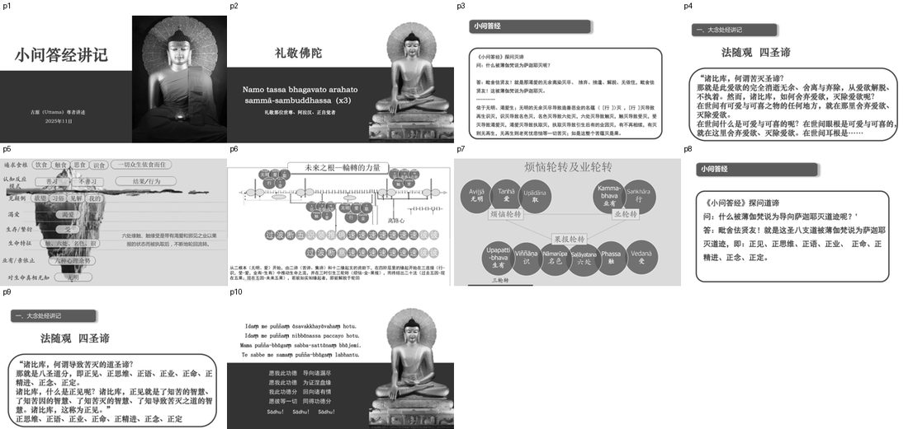
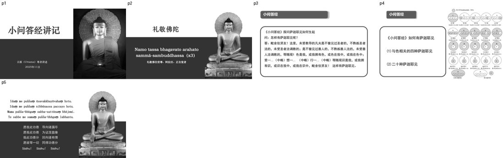
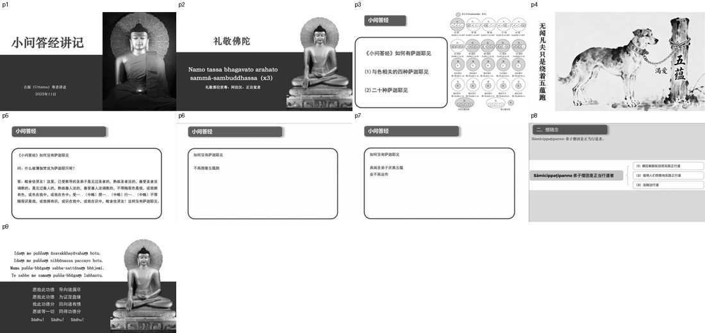
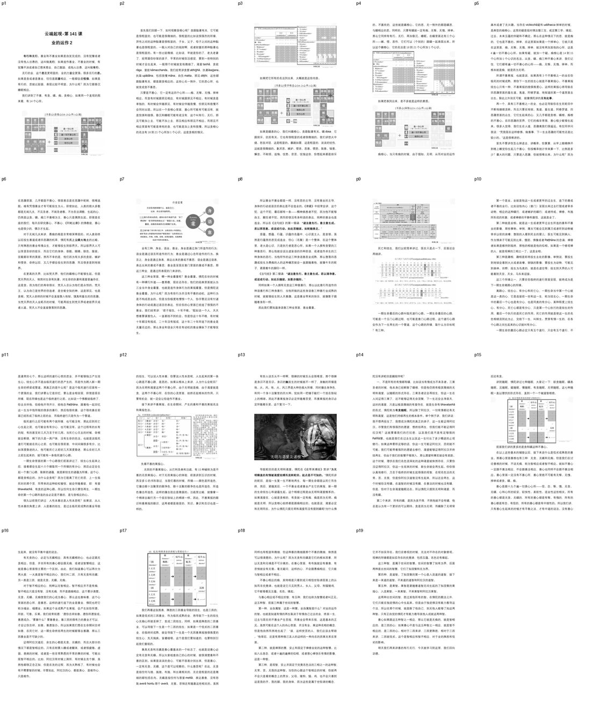
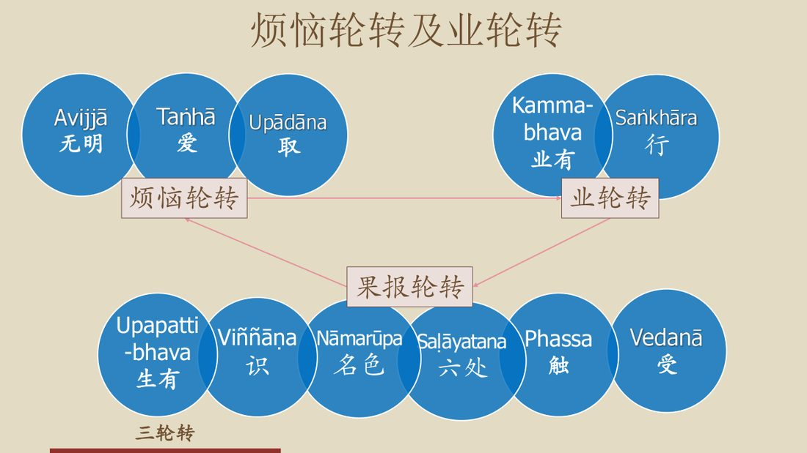
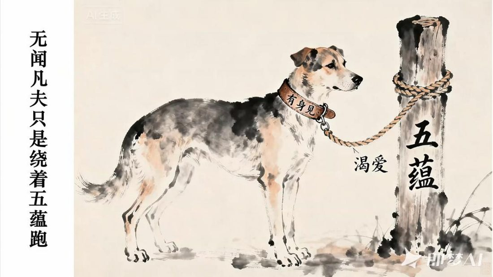
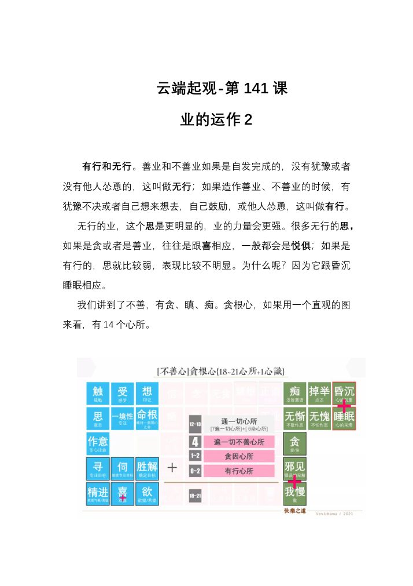

📅 最近更新：2026-09-23 01:52　|　第三版修订（4周版）：连续两周合并为9环节、单讲120分钟；共读原文一字未改；学员版去除主持人专属内容

# 第2周：萨迦耶灭与二十种身见（主持人版）

> ⭐ **本讲主持人速览**（新主持人必读，2分钟看完）
>
> 你不是老师，是"共学同行者"。你不需要提前懂内容，只需要按流程走。
> **本周由连续两周内容合并**而成，含两段共读、两轮分享与两轮讨论，单讲 120 分钟。
>
> | 环节 | 标准时长 | ⏱ 时间不够→ | ⏱ 时间富余→ |
> |:-----|:----:|:-----|:-----|
> | 🧘 静心开场 | 10 min | 缩至5 min | 加2分钟静坐 |
> | 📖 共读原文1 | 20 min | 只读★核心段（约15 min） | 加读◈扩展段 |
> | 💬 第一轮分享 | 10 min | 每人1句话 | 每人3分钟 |
> | 🎯 第一轮主题讨论 | 10 min | 只讨论问题① | 讨论全部问题+扩展 |
> | 🧘 禅修练习 | 15 min | 缩至8 min（只念引导词前半） | 延长至20 min |
> | 📖 共读原文2 | 20 min | 只读★核心段 | 加读◈扩展段 |
> | 💬 第二轮分享 | 10 min | 每人1句话 | 每人3分钟 |
> | 🎯 第二轮主题讨论 | 10 min | 只讨论问题① | 讨论全部问题+扩展 |
> | 🔚 收尾与回向 | 15 min | 缩至10 min | 保持 |
>
> **主持人10条守则（精简版）**：
> ① 不讲解、不提供答案——让原文自己说话；② 有人问"正确答案"→说"先听听大家的看法"；③ 冷场→主持人先分享自己的真实感受；④ 跑题→温和拉回："这个有意思，我们回到今天的原文"；⑤ 争论→"两种看法都很好，大家保留自己的理解"；⑥ 确保人人发言；⑦ 不评判任何人的分享；⑧ 时间到了就推进；⑨ 禅修练习照读引导词即可；⑩ 结束一起回向。

> **读书会23：小问答经讲记：萨迦耶见与圣八支道 · 第2周（4周版 · 连续两周合并）**
> 主持人：你不需要提前懂内容，按本手册推进即可。
> 本周主题：**萨迦耶灭＝渴爱的无余离染灭尽；它以十二缘起的"三轮转"（烦恼—业—果报）为机制显现，以圣八支道为到达之道。**；**凡夫对五蕴各有四种错误观待（色／受／想／行／识各四种＝二十种萨迦耶见），其中前五种（蕴即是我）属断见、后十五种（我拥有蕴、蕴在我中、我在蕴中）属常见；圣弟子以「不等随观」不执取五蕴，断我见。**。

## 📋 本周信息卡

| 项目 | 内容 |
|:----|:-----|
| 时长 | 120分钟（4周版 · 9环节） |
| 核心问题 | ； |
| 共读原文 | 共读原文1：　｜　共读原文2： |
| 本周作业 | ； |

## ⏱ 时间弹性指南（本讲通用）

| 情况 | 应对方法 |
|:-----|:---------|
| **时间不够**（共读太长／讨论超时） | ① 静心开场缩至5分钟；② 两段共读原文均只读标注 **★核心** 的段落；③ 两轮分享每人只说一句话；④ 两轮主题讨论只讨论各自的问题①；⑤ 禅修练习缩至8分钟（只念引导词前半段）；⑥ 收尾回向缩至10分钟 |
| **时间富余**（共读快／讨论提前结束） | ① 用"📚 扩展内容包"中的补充原文段落继续共读；② 增加扩展讨论问题；③ 延长禅修练习时间；④ 增加"每人分享一个生活实例"环节 |

> 💡 原则：**讨论比读完重要，体验比讲完重要。** 宁可跳过扩展原文，也要让每个人都有机会说话。

## 🧘 静心开场（10 min）

**主持人引导语**（照读即可）：

> 请大家找一个舒适的坐姿，脊背自然挺直，双肩放松。轻轻闭上眼，或者把目光垂落在前方一米处。
>
> 先把注意力放到呼吸上。吸气，知道自己在吸气；呼气，知道自己在呼气。不用去控制它，只是知道。（静默约 1 分钟）
>
> 今天我们要谈一个听上去很大的题目——"萨迦耶灭"。请先不要急着理解它。做几个自然的呼吸，把刚才一路走来的匆忙放下，把手机调成静音。（静默约 2 分钟）
>
> 现在，请你留意一下：此刻的心里，有没有哪一件事、哪一个人、哪一样东西，是你**非常希望它一直保持下去**的？不用分析，只是看着它，像看水面上的一个涟漪。（静默约 1 分钟）
>
> 好，慢慢把注意力带回身体，带回这个房间。可以睁开眼睛了。
>
> 我们带着这份"看见"进入今天的共读——因为萨迦耶灭，正是从如实看见这份"希望它一直在"的心开始的。
>
> 最后，让我们把这份安静扩展开：愿我此刻安稳，愿我远离苦恼；愿在座的每一位同修安稳，远离苦恼；愿一切众生安稳，远离苦恼。（静默约 30 秒）
>
> 好，请大家把身体坐正，我们一起进入今天的学习。如果需要，可以随时睁眼、喝水、调整坐姿——这个空间是安全的，你的节奏由你自己把握。

> 💬 **破冰｜3–5分钟**：说说看：你觉得「苦」，是从外面来的，还是从里面生出来的？

> 🛡️ **心理安全三约定**（每次开场在心里过一遍）：① **保密**——这里说的话不出这间屋子；② **不评判**——不评价任何人的分享，也不急着评价自己；③ **可随时暂停**——任何时候觉得不舒服，都可以停下来休息、喝水或离开，不需要解释。

## 📖 共读原文1（20 min）

（主持人：本周共读六份材料。材料①②③★核心，务必在 30 分钟内带读完；材料④⑤⑥为补充与扩展，时间不够可只读要点。以下"> ⚠️ 主持人操作"行与括注（ ）为整理提示，仅供主持，朗读原文时跳过。涉十二缘起、四圣谛细节，请只点到为止，指明"详见读书会11/12（缘起）／09（四谛）"。）

> **【本周朗读段 · 开始】**（本段约 3766 字，供中等稍慢朗读，约 22 分钟；其余为默读／选读／延伸内容）

**材料①** ★核心：《小问答经讲记》04-古源尊者-20251104（课件）
- 文件类型：pdf
- 知识库出处：古源尊者开示及上座部佛教资料
- media_id：`pdf_d0dd1c0cd17209afe241ece24bf6b7b4_07905b702a48fe394a2ff85dd82d54467439961422831605`
- 打开方式：ima知识库搜索「小问答经讲记 04 萨迦耶灭 十二缘起」
- 查重说明：本 media_id 为读书会23 主线 13 讲课件（2025-11-01~13，全新 FREE），经以完整 id `grep -F`《_禁用清单_读书会01-22已用media_id.txt》为 0 命中，与既有系列无段落重叠。

> ⚠️ 主持人操作：本讲课件为「经文问答」精简型，全文照读即可（约 2 分钟）。读时把握四条线：①《小问答经》探问**灭谛**的问答原文；②依无明、渴爱的十二缘起支顺逆灭尽；③《大念处经》法随观·四圣谛中的**苦灭圣谛**；④十二缘起「二根本—二谛—十二支—四阶层—三连接—三时三轮转—二十法」的总纲图说，及探问**道谛**的圣八支道问答。此三条线即本周三块核心。

#   小问答经讲记

古源(Uttama)尊者讲述

2025年11日

#   礼敬佛陀

Namo tassa bhagavato arahato
sammā-sambuddhassa (x3)

礼敬那位世尊、阿拉汉、正自觉者

#   小问答答经

#   《小问答经》探问灭谛

问：什么被薄伽梵说为萨迦耶灭呢？

答:毗舍佉贤友!就是那渴爱的无余离染灭尽、舍弃、舍遣、解脱、无依住,毗舍佉贤友!这被薄伽梵说为萨迦耶灭。

依于无明、渴爱生;无明的无余灭尽导致造善恶业的名蕴([行])灭,[行]灭导致再生识灭,识灭导致名色灭,名色灭导致六处灭,六处灭导致触灭,触灭导致受灭,受灭导致渴爱灭,渴爱灭导致执取灭,执取灭导致引生后有的业因灭,有不再相续,有灭则无再生,无再生则老死忧悲恼等一切苦灭;如是这整个苦蕴灭是果。

#   一、大念处经讲记

#   法随观 四圣谛

“诸比库，何谓苦灭圣谛？

那就是此爱欲的完全消逝无余、舍离与弃除，从爱欲解脱、不执着。然而，诸比库，如何舍弃爱欲，灭除爱欲呢？

在世间有可爱与可喜之物的任何地方，就在那里舍弃爱欲、灭除爱欲。

在世间什么是可爱与可喜的呢？在世间眼根是可爱与可喜的，
就在这里舍弃爱欲、灭除爱欲。在世间耳根是……

六处缘触、触缘受是带有渴望和邪见之业以果报的状态而被执取后，不断地轮回流转。

#   未来之根一轮转的力量

从二根本（无明、爱）开始，由二谛（苦谛、集谛）和十二缘起支的资助下，在四阶层里的缘起开始在三连结（行识，受-爱，业有-生有）中推动生命之流，并在三时引生三轮转（烦恼-业-果报），而终结出二十法（过去五因-现在五果；现在五因-未来五果），若能如实知缘起者，即能解脱于轮回

#   烦恼轮转及业轮转

#   小问答经

#   《小问答经》探问道谛

问：什么被薄伽梵说为导向萨迦耶灭道迹呢？“

答：毗舍佉贤友！就是这圣八支道被薄伽梵说为萨迦耶灭道迹，即：正见、正思维、正语、正业、正命、正精进、正念、正定。

#   一、大念处经讲记

#   法随观 四圣谛

“诸比库，何谓导致苦灭的道圣谛？

那就是八圣道分，即正见、正思维、正语、正业、正命、正精进、正念、正定。

诸比库，什么是正见呢？诸比库，正见就是了知苦的智慧、了知苦因的智慧、了知苦灭的智慧、了知导致苦灭之道的智慧。诸比库，这称为正见。”

正思维、正语、正业、正命、正精进、正念、正定

Idam me puñnam asavakkhayavaham hotu.

Idam me puñnam nibbānassa paccayo hotu.

Mama puñña-bhāgam sabba-sattānam bhājemi.

Te sabbe me sama pūña-bhāga m labhantu.

愿我此功德 导向诸漏尽

愿我此功德 为证涅盘缘

我此功德分 回向诸有情

愿彼等一切 同得功德分

Sādhu! Sādhu! Sādhu!

**材料②** ★核心：《小问答经讲记》05-古源尊者-20251105（课件）
- 文件类型：pdf
- 知识库出处：古源尊者开示及上座部佛教资料
- media_id：`pdf_d0dd1c0cd17209afe241ece24bf6b7b4_c8d19d851d8e1e2e25be2367a84058437439961422831605`
- 打开方式：ima知识库搜索「小问答经讲记 05 导向萨迦耶灭道迹」
- 查重说明：本 media_id 同为主线 13 讲课件（全新 FREE），`grep -F` 禁用清单 0 命中，与既有系列无段落重叠。

> ⚠️ 主持人操作：本讲课件仍为精简型，全文照读即可（约 2 分钟）。重点两条线：①《小问答经》探问**道谛**的问答原文（与材料①末段呼应，本周取"道迹＝圣八支道"的经文语言）；②《小问答经》**执取与五取蕴关系**的问答（"凡对于五取蕴有意欲爱染者，在那里就有执取"）——这是从"集"过渡到"灭"的关键纽带。

#   小问答经讲记

古源(Uttama)尊者讲述

2025年11日

#   礼敬佛陀

Namo tassa bhagavato arahato
sammā-sambuddhassa (x3)

礼敬那位世尊、阿拉汉、正自觉者

#   小问答经

#   《小问答经》探问道谛

问：什么被薄伽梵说为导向萨迦耶灭道迹呢？“

答：毗舍佉贤友！就是这圣八支道被薄伽梵说为萨迦耶灭道迹，即：正见、正思维、正语、正业、正命、正精进、正念、正定。

#   一、大念处经讲记

#   法随观 四圣谛

“诸比库，何谓导致苦灭的道圣谛？

那就是八圣道分，即正见、正思维、正语、正业、正命、正精进、正念、正定。

诸比库，什么是正见呢？诸比库，正见就是了知苦的智慧、了知苦因的智慧、了知苦灭的智慧、了知导致苦灭之道的智慧。诸比库，这称为正见。”

正思维、正语、正业、正命、正精进、正念、正定

#   小问答答经

#   《小问答经》有关执取和取蕴的问答

问：那执取就是彼等五取蕴呢？还是除了五取蕴外有执取呢？

答：毗舍伝贤友！那执取既非就是那些五取蕴，也非除了五取蕴外有执取，毗舍伝贤友！凡对于五取蕴有意欲爱染者，在那里就有执取。

Idam me puñnam asavakkhayavaham hotu.

Idam me puñnam nibbānassa paccayo hotu.

Mama puñña-bhāgam sabba-sattānam bhājemi.

Te sabbe me sama pūña-bhāga m labhantu.

愿我此功德 导向诸漏尽

愿我此功德 为证涅盘缘

我此功德分 回向诸有情

愿彼等一切 同得功德分

Sādhu! Sādhu! Sādhu!

**材料③** ★核心：《根本五十篇》Mūlapaṇṇāsapāḷi.pdf（中部·小双品·4.《小问答经》原文）
- 文件类型：pdf
- 知识库出处：古源尊者开示及上座部佛教资料
- media_id：`pdf_d0dd1c0cd17209afe241ece24bf6b7b4_0eb6563bc34719cc5220ef3bebf00bb77439961422831605`
- 打开方式：ima知识库搜索「根本五十篇 小问答经」或「Mūlapaṇṇāsapāḷi」
- 查重说明：本 media_id 见于《_禁用清单_读书会01-22已用media_id.txt》（清单遗留）。经核对，01–22 成品照录未使用本文件，段落不重叠；本系列 W1 亦引用本文件（取〈有身见／有身集〉问答段），**本讲取〈有身灭／导向有身灭尽之道／执取与五取蕴〉问答段**（首二问〈有身见／有身集〉归第1周、末二问〈如何产生／如何没有身见〉归第4周，本讲不取），与 W1／W4 段落不重叠。与读书会11/12（缘起类）无同段落重叠。

> ⚠️ 主持人操作：本经为巴利原典汉译，本周取「有身灭／导向身见灭尽之道」二问及其后的「执取与五取蕴」问答——即本周聚焦的**有身灭（＝萨迦耶灭）**、**导向身见灭尽之道（＝圣八支道）**与**执取＝对五取蕴的欲贪**。首二问〈有身见／有身集〉归第1周、末二问〈如何产生／如何没有身见〉归第4周，本讲不取，以免与他周重复。原文用"有身见／有身灭"语，与课件"萨迦耶见／萨迦耶灭"为同一词（kāya／sakkāya）之异译，读时提示即可。`[generated, not original text]` 为 PDF 智能解析标注，照录保留。

以下照录知识库《中部》原文中《小问答经》相关段落（保留原编号与文字，含原文中的异名用字）：

---

# 4.《小问答经》

“‘身灭、身灭’，尊者啊，世尊所说的身灭是指什么呢？”

“朋友毗舍佉，正是对那渴爱的彻底灭尽、舍离、弃绝、解脱、无执；朋友毗舍佉，这就是世尊所说的‘有身灭’。”

"'导向身见灭尽之道，尊师，被称为导向身见灭尽之道。那么，尊师，世尊所说的导向身见灭尽之道是什么呢？'"

"维萨卡贤友，世尊确实说过，这八支圣道是导向灭除身见的修行之道。即：正见、正思惟、正语、正业、正命、正精进、正念、正定。"

"那么，尊者啊，执取就是这五种执取蕴吗？或者执取是五种执取蕴之外的东西呢？""不是的，维沙卡贤友。执取并非就是这五种执取蕴，也不是五种执取蕴之外的东西。维沙卡贤友，对于五种执取蕴的贪欲与渴爱，那就是执取。"

---

说明：知识库原文中，本经标题为“4.《小问答经》”；本周取〈有身灭／导向身见灭尽之道／执取与五取蕴〉问答段（首二问〈有身见／有身集〉归第1周、末二问〈如何产生／如何没有身见〉归第4周，此处从略），均按原文照录。[generated, not original text]

**材料④** ★补充：第141讲 业的运作2（共修版）
- 文件类型：pdf（共修版讲义）
- 知识库出处：古源尊者开示及上座部佛教资料
- media_id：`pdf_d0dd1c0cd17209afe241ece24bf6b7b4_8379b44110c5fa48eaf0c308733c0e9a7439961422831605`
- 打开方式：ima知识库搜索「第141讲 业的运作2」
- 查重说明：本 media_id 见于《_禁用清单_读书会01-22已用media_id.txt》（清单遗留）。经核对，01–22 成品照录未使用本文件，段落不重叠；本讲按蓝图作为 free 素材引用，取〈无明与渴爱及诸根／业的自发性—有行无行／七随眠／五种智〉段，补足"十二缘起之无明、爱为轮回根本"的业运作说明。

> ⚠️ 主持人操作：本讲篇幅较大，本周**只精读两段**：①「无明与渴爱及诸根」（轮回根本＝无明与渴爱，及七种随眠）——这是十二缘起"二根本"的业理论说明；②「有行／无行」段（业的自发性与强弱）——连到"业轮转"。其余（贪根心／瞋根心／痴根心的名法、临终速行与结生心、善业三因低劣殊胜、五种智）可略读或留作扩展。文中大量 OCR 心所图表已按原样保留（字形残破处如实照录，朗读跳过），本照录从"业的自发性"与"无明渴爱"两处切入，避免与读书会14/15（阿毗达摩心法）段落重叠。

以下按主题从知识库全文逐字照录与「十二缘起之无明渴爱、业的运作」直接相关的原文段落，标题与结构按原文保留。

# 云端起观-第 141 课

# 业的运作 2

> 有行和无行。善业和不善业如果是自发完成的，没有犹豫或者没有他人怂恿的，这叫做无行；如果造作善业、不善业的时候，有犹豫不决或者自己想来想去，自己鼓励，或他人怂恿，这叫做有行。
>
> 无行的业，这个思是更明显的，业的力量会更强。很多无行的思，如果是贪或者是善业，往往是跟喜相应，一般都会是悦俱；如果是有行的，思就比较弱，表现比较不明显。为什么呢？因为它跟昏沉睡眠相应。

> 首先我们回顾一下，如何观察贪根心呢？贪跟黏著有关，它可能是很粗显的，也可能是很微细的。很粗显的比如说很强烈的所缘，异性之间的这种黏著是很粗显的，子女、父子、母子之间的这种黏著也是很粗显的。一般人对自己的钱财啊，或者财富的那种黏著也是很粗显的。有一些比较微细，比如说，早就是你的了，老夫老妻了，经常跟你吵架的孩子，平常的时候你没感觉，要到一些特别的时候才会生起来，一般那个时候就变地微细了。渴爱 taṇhā，贪欲 rāga，爱欲 kāmacchanda。我们经常讲贪婪 abhijjhā、执著āsajjana、执取 upādāna，包括我慢 māna、自负 matta、邪见 diṭṭhi，这些都跟黏著有关，都是跟贪相应的。这些心无一例外，它的思心所，也就变成贪不善思。

> **【本周朗读段 · 结束】**（以下为默读／选读／延伸内容，时间富余时再读）
>
> 只要是不善心，它一定有这四个心所——痴、无惭、无愧、掉举相应。而贪有时候跟邪见相应，有时候跟邪见不相应。有时候贪是单独的，有时候会伴随邪见，有时候会伴随我慢，但邪见和我慢不会同时出现。所以在一个贪根心里面，喜心所可能有可能没有，就是悦俱和舍俱。昏沉和睡眠可能有或没有，这个叫有行、无行。邪见可能加上去，可能不加上去，邪见相应和邪见不相应。而邪见不相应里面有可能是单纯的贪，也可能是加上贪和我慢。所以贪根心的名法有18到 21个心所加1个心识。这是贪根的情况。

> 如果是瞋恚的心，我们叫瞋根心。贪跟黏著有关。瞋 dosa 它跟排斥、抗拒有关。它也有很粗显的或者很微细的。我们讲怒火中烧、怒发冲冠，这是粗显的。暴跳如雷，这是粗显的；淡淡的忧伤，这就是很微细的。象厌恶、嫉妒、悭吝、恶意、愤怒、敌意、恼害、懈怠、不耐烦、追悔、忧愁、悲苦、忧恼这些，你想起来都是排斥的、不喜欢的，这些就是瞋根心。它的思，无一例外的都是瞋思，与瞋相应的思。同样的，只要有瞋就一定有痴、无惭、无愧、掉举。那么它同样有有行、无行，再加昏沉、睡眠。所以这个瞋根心，它的名法是18到21个心所加1个心识。

> 痴根心。当只有痴的时候，由于错知、无明，从而对业的运作麻木或者了无兴趣。当存在 vicikicchā疑和 uddhacca掉举的时候，是典型的痴根心。这里的疑是指对佛法僧三宝、戒定慧三学、缘起、过去、未来五蕴的怀疑和不确定。那么在这种情况下的思，就是痴的，它也是不善的。掉举，在这里面如果是一个掉举心，它就只是在这里面，痴、无惭、无愧、掉举，就没有再加其他的心所，这是 4 遍一切不善心心所。如果有疑，就加一个疑。痴根心是 14 到 15个心所加 1 个心识的名法。从贪、瞋、痴三种不善心来讲，我们记住，它们都有遍一切不善心的心所——痴、无惭、无愧、掉举。而根本就是痴，就是因为无明。

> 所谓不善果报，也就是说，如果具有 3 个不善根之一的业在你临死的时候成熟，那你下一生的结生心就是不善果报心。不善果报结生心只有一种，不善果报的舍俱推度心。这样的果报心将导致在四恶趣里面的畜生道、鬼道、阿修罗道、地狱道的某一个道里面去出生。除此之外别无可能，就像佛陀讲的无有此事。
>
> 再一个，具有三不善根之一的业，也必定导致你在生死轮回中不断地继续流转。而且只要在地狱、鬼道、畜生道、阿修罗道，四恶趣里面的众生，它们生起来的心，又几乎都是贪根、瞋根、痴根的不善心。在四恶趣的苦界，它们的痴非常强，善心极少能够生起来。很多人觉得，我们生在人道，恶趣离我们很遥远。有位同学问我说："凭我现在这样修佛、做善事，下一生去恶趣的可能性还是比较小的。"这是很难讲的。

## 无明与渴爱及诸根

> 导致轮回的是无明和渴爱。佛陀在《皮带束缚经》里讲："为无明障盖的有情被渴爱结缚而流转轮回，起点是不可知的。"佛陀所讲的轮回，是指一生复一生不断地再生，每一期生命都是以死亡而告终，然后，紧随其后，一个不善业或者善业产生它的果报，新一期的生命结生心和诸蕴生起。这个相续过程是由无明和渴爱维系的。如果渴爱在，心就是贪根的，有贪就一定有痴，痴是因为无明。痴就是无明，所以贪根心始终都是跟痴相应的。也就是说，渴爱必定和无明同在。为什么佛陀只提无明和渴爱而没有提到瞋呢？为什么佛陀没有讲轮回是瞋陪伴呢？
>
> 一，不是所有的有情都有瞋，比如说当有情成为不来圣者。三果圣者的时候，他本身已经断除了瞋根，但是他仍然有极其微细的无明和渴爱，以随眠的形式存在。三果圣者还会再结生，你这一生在人间证得三果了，还不能够证得无余涅槃，下一生还会去净居天，这时的渴爱，只是以极其微细的有爱存在，就是生命有 bhavataṇhā的形式，佛陀称为有贪随眠。所以除了阿拉汉，一切有情都还有无明和渴爱，这是他们持续再生的根本条件。举个例子讲，我们讲说：我不想再投生了，我想成为佛陀的真正的弟子，这一生能证得阿拉汉。尽管我们有很强烈的愿望，想终结再生，但我们能不能证得阿拉汉呢？这就要看我们的巴拉密，以及我们是不是有足够强的 Paññā慧。也就是我们在过去生以及这一生付出了多少精进的止观修行。如果这种累积足够的话，你这一生可能证阿拉汉，否则就不可能。我们可能带着强烈的愿望去修行，渴望能够证得阿拉汉并终结再生，但由于我们的智慧不够深入，那么愿望和事实就会有差距。
>
> 这个时候，潜伏在我们名色流深处的这种渴爱就依然存在，只要你没证得阿拉汉，你这一生结束的时候，新生命就会再生起。但你很认真地修行，乃至于临终的时候生起很强的观智，在观名色法的无常、苦、无我，但是你阿拉汉道智没有生起来，所以还会再生，这个时候你没有瞋。在道智的时候没有瞋，在善法的时候也没有瞋，但是，你对于生命渴爱随眠还在。所以佛陀只提到无明和渴爱，而没有瞋。
>
> 第二个来讲，所有的瞋，是因为贪不得，不然他就不会有瞋，他总是认为有一个更好的可以期待。贪是因为无明，而瞋除了无明背后还有贪。
>
> 讲到随眠，佛陀讲过七种随眠，大家记一下：欲贪随眠、瞋恚随眠、见随眠、疑随眠、慢随眠、有贪随眠、无明随眠。这七种随眠一直以潜伏的形式存在，直到一个一个被道智根绝。

## 1f:低劣/殊胜善业的善根与果报结生

> 无贪、无瞋、无痴使我们的心成为善心，那么这也意味着，这个心里面的思心所，是善思。这样的速行造下的业是善业，佛陀也把它称为福业、福德业。如果这个业成熟产生果报，会产生如你所愿、所欲、可意、乐果。我们经常祝愿："愿你吉祥如意、愿你所愿皆成、善愿成办。"要靠什么？要靠善业。靠三因的强有力的善业才可以，才会让你吉祥、如意、善愿皆办。所以如果我们想在生命期间吉祥如意，在死亡时，这一期生命终结再生的时候能够去善趣，那么三因善业是不可缺少的。

> 与善心相应或不相应的智，有五种，我们也称为智慧或者叫正见。
>
> 这五种智，前面三种属于世间的智慧。
>
> 第一种，业自属智，这是一种慧。业自属智是什么？对业的运作的智。也就是知道有情的再生取决于有情自己过去的业，终其一生，过去与现在的不善业产生苦报，而善业会带来乐报，这是基本的正见。
>
> 第二种，就是禅那的慧，安止和固定于禅修业处的这种智慧。
>
> 第三种，是观智，安止并固定于究竟名色法的三相之一的这种智，无常、苦、无我的这种智。当你的心跟这个智相应的时候，你就再不会只是看到概念上的男女、父母、猪狗、猫、鸡，也不会只看到这是我的手、我的脚、我的身体，因为这些是属于世俗谛的概念，它并不如实存在。我们在修观的时候，无法对不存在的对象修观。观禅的所缘都是如实存在的究竟谛，包括五蕴、名色还有缘起。
>
> 这三种智，是属于世间的智慧。世间的智慧了知有为界，后面两种是出世间的智慧，它们了知涅槃和无为界。
>
> 第四种，是道智。了知涅槃的第一个心是入流道的道智，接下来是一来道的道智、不来道的道智和阿拉汉的道智。
>
> 第五种，是果智。果智是紧随着道智无间生起的了知涅槃的果报心，入流果智、一来果智、不来果智和阿拉汉果智。

> 善心如果跟这五种智之一相应，那么它就是无痴的，就是智相应的，是三因的心；如果善心不是与这五种智之一相应，就是智不相应的，是二因的心。相对于二因来讲，三因更殊胜；相对于三因来讲，二因就低劣。这个是智相应和智不相应，对于业的殊胜和低劣的影响。

> 明天我们再来讲善的有行无行，今天就学习到这里，我们回向功德。

**材料⑤** ◈扩展：《2025五月包容寺短期出家修习营20-十二缘起与修行的关系-古源尊者-20250520》（音声）
- 文件类型：音声（依据录音转写整理，已校对明显同音错字）
- 知识库出处：古源尊者开示及上座部佛教资料
- media_id：`soundrecording_d0dd1c0cd17209afe241ece24bf6b7b4_e62539c0b6517737aed53d76307ef4e37439961422831605`
- 打开方式：ima知识库搜索「包容寺 十二缘起与修行的关系」
- 查重说明：本 media_id 经以完整 id `grep -F`《_禁用清单_读书会01-22已用media_id.txt》为 0 命中（全新 FREE）。本讲取〈三轮转与四色类二十法／无明爱取与果报〉段，与读书会11/12（缘起类）无同段落重叠，涉十二缘起细节处已在主持人版注明"详见读书会11/12"。

> 📌 **照录说明·补注**（依《录音转写存疑核对表》#1）：本讲照录段按**主题**重排（非录音时间顺序），时间码**非单调**——〔四〕段讫 `[00:41:05.560]` 后紧接〔五〕段 `[00:15:05.120]`（回退约 26 分钟），〔五〕段讫 `[00:17:05.480]` 后升回〔六〕段 `[00:44:22.480]`；系主题排布所致，各时间码本身与原始转写稿**逐一相符（Δ=0）**，非抄录错误。区间④终点按正文实际末码校正为 `[00:41:05.560]`。

> ⚠️ 主持人操作：本讲为音声转写，篇幅长且口语零碎，本周**只精读四段并保留时间码**：①〔十二缘起总说〕`[00:01:11.080]`；②〔过去因/现在果/现在因/未来果与四色类二十法〕`[00:02:20.730]–[00:05:52.320]`；③〔三轮转〕`[00:06:37.570]–[00:09:15.240]`；④〔无明爱取与果报、四取〕`[00:36:20.325]–[00:41:05.560]`。其余（触受速行心、八步梳理法案例等）可略读。转写同音字原样保留（"无名／无明""爱曲·爱H／爱取""时有／识""氢离子源／亲依止缘"），朗读时按语义理解即可。

**【一】十二缘起总说与十二支**

[00:01:11.080] 嗯。说缘起呢，呃，看起来就很简单，就这样啊。啊？十二缘起呢，无明缘行行缘识识缘名色名色缘六处，六处缘触触缘受受缘爱爱缘取取缘有有缘生老死愁悲苦忧恼生起。那这个是这个每天早上我们上早课缘起诵里面啊，这个第一个啊，缘起的这个念诵就是这样。

**【二】过去因/现在果/现在因/未来果与四色类二十法**

[00:02:20.730] 这个图里面呢。啊，无明行呢，被称为是过去生啊。啊，识名色六入触受爱取有是这一生。生老死愁悲苦忧恼是下一生啊。那。那么这个无明行里面呢，其实不仅仅是无明和形，而是有无明就包括了爱取啊。所以这里的无明呢是包含了爱取。这个行呢就还包括了业。所以无明跟行呢啊，就包含了无明爱取行业啊。

[00:04:34.800] 那么中间呢，我们看到无明和爱，就是说导致这个十二缘起的这个轮啊轮转啊三轮转啊，不断的轮转的根源呢是无明和渴爱。啊，我们称为叫根本无明啊，无明和渴爱。啊，那这个无明前面的这个这个我们说过去生的无明爱取行业呢，被称为叫过去因阶段啊。那这个这个识名色六入触受呢，又被称为叫现在果阶段好。

[00:05:14.440] 啊，那么这一生的爱取有呢，也就是无明爱取行业呢，就是现在因阶段。啊，那么下一生呢？识名色六入触受，也就是生老死愁悲苦忧恼生起呢，这是未来果阶段。那。这个。过去无明爱取行业呢，它是导致这一生识名色六入触受生起的因，所以被称为集谛。呃，这一生的识名色六入触受生起，这个是我们这一生的果报啊，果报是苦谛所摄啊。好，

[00:05:52.320] 那么接下来呢，我们又造作新的业啊，就是是爱取有啊，那这个就是新造的。啊因哈，就是下一生的集谛啊，下一生的果的集谛哦。所以那么这个这个它画成这样一个图呢啊，就是又被称为说啊四色类20法三轮转好。那这个三连结、二根本啊。那。这个。四色类二十法什么意思呢？就是过去五因，现在五果，现在五因，未来五果，就称为四色类，

**【三】三轮转（烦恼轮转、业轮转、果报轮转）**

[00:06:37.570] 就是四个内容啊，合起来就20种法了，对吧啊。对，那三轮转呢，就是烦恼轮转、果报轮转和业轮转。啊，这个。无明爱取呢，它是烦恼轮转。行和业呢是业轮转哦，识名色六入触受呢是果报轮转啊，就是叫那么这一生的这个爱取有呢，它又是这个新的这个烦恼轮转哦。未来的生老死愁悲苦忧恼生起呢，又是新的果报轮转哦。

[00:07:17.330] 所以我们把这个十二缘起支呢啊展开来，其实它就像这样哦，过去的无明爱取行业导致这一生的识名色六入触受生起。当这个受产生了以后呢，由于无明，你又对这个受产生了爱取，然后你就会造作新的业啊，新的无明爱取行业导致未来的识名色六入触受生起。好，那如果我们把它当成三生的角度上来讲呢，就跟这个无明取行业这个我们啊就十二缘起支呢啊就对起来，那其实上呢。

[00:09:15.240] 所以十二缘起之讲的就是这个内容，简单来讲就是这个内容。

**【四】无明爱取与果报的关系、四取**

[00:36:20.325] 我们就说。这个果报出现，明显看到无明爱取行业就出来了啊。啊，那么我们这个时候呢，就是讲我们讲说诶面对这个果报，你起这样的一个心，比如说取这样的嗔心。

[00:37:22.360] 欲取、戒禁取、见取、我语取吧，就四种取，叫四取啊，佛教里面经常如果有学习的人知道叫四取。欲取、戒禁取、见取、我语取好那。大部分的情况下，我们都是这个各种取啊。那这个这个戒禁取、见取、我语取都属于见啊，我们讲某某同学被见卡住了，就卡住在这三个上面，那这个见卡住呢。这个戒禁取是什么呢？

[00:38:40.300] 啊？对，我觉得这个入出息，我们就是要管他。这就是一种戒禁取，我不控制它，那怎么行呢？它就是一种戒禁取。而这个见取呢，就特别指那种断灭见的那个三种啊，虚无见、无作见和无因见啊。就否认否认这个因果啊，否认有过去生啊，否认有未来世啊啊，否认这个这个造的善业不善业没有果报啊，或者说这个产生的果报都是没有因啊啊，这种就叫断灭见、无因见、无作见和虚无见。

[00:41:05.560] 为什么会有见解？因为我这个有欲爱有爱无有爱，欲爱呢，就是纯粹是感官的这种爱。啊，那么有爱呢就是这个希望，他这个狭义上来讲，有爱是对什么？这个生命的执取啊啊这样有爱。那么在广义上来讲，我们日常就希望它一直存在，不要消失。啊，所以贪跟贪相应的都是有爱。啊，就是希望它长子一直存在，就是有爱，那无有爱呢，就是说希望它没有，希望它消失。或者消失了，肯定就消失了，不会再来了啊，这个就叫无有爱。

**【五】无明爱取与果报的关系：业缘、亲依止缘、随眠烦恼**

[00:15:05.120] 啊，无明爱取，这是烦恼对吧。这是烦恼。行和业呢，它是行结束了，留下一个业。啊，感果的时候，其实是这个业赶过来的，对吧？啊，这个业成熟了，导致识名色六入触受生起啊，那。好，那接下来呢，因为这个受起来呢，我们就对他要采取行动啊，对吧？那采取行动的时候呢，这个的无明爱取跟这个无明爱取它就会产生关联。啊？那这个业过去的业导致识名色六入处升起呢，我们称为叫业缘。哦。而过去的无明爱取。

[00:15:52.760] 对这个无明爱取产生作用呢，我们叫做亲依止缘。叫亲依止缘。那这个也就是说，用我们另外一个语言来讲，就是随眠烦恼啊。随眠啊，过去潜藏的这个烦恼呢，在现在现行。啊，那这也就是我们梳理的时候一直在讲的东西，就是说这个啊，这个你的响应标记啊对吧。啊，那。这个有些人呢，他是过去生就带来的一些习惯了啊。那么过去生带来一些习惯呢，这就很典型啊啊。那这个这一生没有碰到过，但是呢，他还是很习惯这样的一种状态，

[00:16:45.970] 我们叫心理余势啊，也称为叫心理余势啊。用现代语言来讲就心理余势。心理余势里面有六种啊，其中有一个就叫随眠烦恼啊。那么随眠烦恼对现在的烦恼，它起作用是以亲依止缘的原理援助它。

[00:17:05.480] 啊，在我们这个亲依止缘的其中一个。前前诸不善法对后后诸不善法以亲之愿为缘啊，或者前前诸无记法对后后诸无记法以亲依止缘为缘好，它就可能是这样的一种啊运行方式。那这个运行方式具体大家后面可以去学习了。

**【六】善不善心生起皆有无明爱取（以布施为例）**

[00:44:22.480] 啊？啊，那么。啊，那。所以每一个。这个，这个。呃，当下的不善心生起，造了业啊，或者善心生起，不善心生起，善不善都有无明爱取。啊？那。这个。不善心生起来的时候呢，它除了根本无明以外呢，还有一个啊明确的见解错误的见解在里面。而这个善的兴起来呢，他的无明呢，

[00:45:02.960] 他就举一个例子说啊，我觉得啊我今天去做了一个布施人，我很高兴。啊，升体了就做了一个布施啊，这是一个善业，那为什么要做个布施呢？啊，我对这个这个你肯定有认为是说啊，这样的一个啊，这个禅修营啊，很殊胜啊。啊，我做完布施呢，呃，回向给我早日断尽一切烦恼，证悟涅槃呢。好，那么他的无明是什么呢？认为有一个我。可以证我涅槃，有一个我存在就是无明呢。啊，渴爱。我断除烦恼的这样的一种啊，修行状态就是爱了啊。啊，执取，我要去修行，断除烦恼，这是取了。

[00:45:53.405] 然后以此的力量，你去做这个布施，这是行呢。那布施的业留下来就叫业有哦。

[00:46:01.660] 啊，那就是这样一个逻辑啊，那如果你这样的业在你临终的时候成熟呢？啊，很显然你的心里面呢，啊，你你是一个布施的心对吧。一个布施的心呢，它很明显就有无贪。对吧？他也无贪，然后他思维的业果他就有慧，他有那个慧心所啊，所以然后你欢喜地做布施就有业有啊。

以上为原文中直接涉及「十二缘起总说／四色类二十法／三轮转／无明爱取与果报」的核心段落照录。原文其余部分（触、受、速行心、八步梳理法案例等）虽与十二缘起整体相关，但未以上述概念为主题展开，故未逐字列入。[generated, not original text]

## 材料⑥ ◈扩展：《2024百花古寺禅修营31-《大念处经》讲记28》-古源尊者-20240305（音声）

**材料⑥** ◈扩展：《2024百花古寺禅修营31-《大念处经》讲记28》-古源尊者-20240305（音声）
- 文件类型：音声（依据录音转写整理，已校对明显同音错字）
- 知识库出处：古源尊者开示及上座部佛教资料
- media_id：`soundrecording_d0dd1c0cd17209afe241ece24bf6b7b4_94070c2d595c8ecfeba136baac04aa227439961422831605`
- 打开方式：ima知识库搜索「百花古寺 大念处经讲记28 苦灭圣谛」
- 查重说明：本 media_id 经以完整 id `grep -F`《_禁用清单_读书会01-22已用media_id.txt》为 0 命中（全新 FREE）。本讲取〈苦灭圣谛＝爱欲于十二处舍离灭除／十二处如稻田、爱欲如蔓生植物〉段，补足材料①《大念处经》苦灭圣谛的口语展开，与读书会09（四圣谛）、11/12（缘起类）无同段落重叠。

> ⚠️ 主持人操作：本讲为音声转写，本周**只精读三段并保留时间码**：①〔苦灭圣谛的定义＝爱欲于十二处舍离灭除〕`[00:03:13.080]`–`[00:04:58.400]`；②〔世间道与出世间道断烦恼的差别〕`[00:06:15.920]`；③〔十二处如稻田、爱欲如蔓生植物，连根拔起〕`[00:16:26.660]`–`[00:18:01.480]`。转写同音字原样保留（"杜比夫／诸比库""阿拉汉／阿罗汉""十二部／十二处""普及圣地／苦集圣谛""维维修倒／入流道"），朗读时按语义理解即可，时间码朗读时跳过。

**【一】苦灭圣谛的定义：爱欲于十二处舍离灭除**

[00:03:13.080] 好，那么。四圣谛呢？我们学习到苦圣谛、苦集圣谛，那苦灭圣谛，佛陀怎么说呢？啊，所以，诸比库，何谓苦灭圣谛？那就是此爱欲的完全消逝无余舍离与。清除啊，嗯，去除从爱欲解脱不执着。然而诸比库如何舍弃爱欲，灭除爱欲呢？在世间有可爱可喜之物的任何地方，就在那里舍弃爱欲，灭除爱欲。在世间，什么是可爱可喜的呢？在世间，眼根是可爱可喜的，就在那里舍弃爱欲，灭除爱。在世间，耳根是可爱可喜的，就在那里舍去爱欲，灭除爱欲啊，

[00:04:58.400] 那其实在这文当中谈到的就是内六处和外六处。这个十二处啊，那十二处呢，换一句话来讲，就是五蕴或者究竟名色法。那爱欲升起的时候呢，是取这个十二处为目标而升起来的啊，就是某种程度上就是对自己的可爱和对外在人气的可爱。嗯。那么由于爱欲生起的时候呢，是依着十二处来生起的，因此呢，在解释爱欲的灭除的时候呢，佛陀也是依十二处来解释的。啊，但是我们知道能够彻底的灭除爱欲的是阿拉汉道智。好，也就是佛陀讲的此爱欲的完全消失无余，舍离与弃去除去除啊，从爱欲解脱不执着。

**【二】世间道与出世间道断烦恼的差别**

[00:06:15.920] 那这个佛陀为什么用一十二处来解释呢？啊，那么我们前面讲到了，一开始就讲到。啊，大念处经佛陀所教导的诗啊，这个道的前行啊，也是他主要是讲世间道。那世间道呢？世间道我们要在世间道上面对这个啊，由十二处所生起的这个爱欲呢，要对这个在世间的层面上去消除它去舍离它去去除它，那就还是要按照世间的角度来啊。但是要终极的去除呢，就是只有一个就是当涅槃现前的入流道生起，取涅槃为目标的时候啊，才有可能完全的去除。

**【三】十二处如稻田、爱欲如蔓生植物，连根拔起**

[00:16:26.660] 所以呢，这个地术里面它有个比喻，就是稻田里面长出一种能生出苦味道葫芦的这种苦味葫芦的蔓生植物。那那这个可能它就影响到稻田的这个稻稻谷的这个生长。

[00:16:44.140] 啊那么一天呢，这个农夫农夫呢，就把那个那棵蔓生植物啊，他找到它的根啊，就连根把它拔掉。那么因此呢，这个蔓生植物呢，与它的果实啊，那就一起会干枯死亡。

[00:18:01.480] 同样的道理呢，就是十二处呢，就好比是稻田，爱欲呢，好比就是那个蔓生植物啊。当爱欲升起的时候呢，它是依靠十二处而生起的。当爱欲被如理作意或阿拉汉道灭除的时候呢，我们也可以说在十二处里的爱欲已经被灭除了。啊，所以因此呢，佛陀说在世间眼根是可爱可喜的，就在这里，舍弃爱欲，灭除爱欲。阿拉汉道就是彻底的灭除爱欲啊，那么，不只是在（内）六处的爱欲被灭除，在（外）六处的爱欲也同样被灭除啊。因此呢，

以上为原文中直接涉及「苦灭圣谛＝爱欲于十二处灭尽／十二处如稻田、爱欲如蔓生植物」的核心段落照录。原文其余部分（苦圣谛、苦集圣谛、道圣谛八支等的广说）虽与四圣谛整体相关，但未以上述概念为主题展开，故未逐字列入。[generated, not original text]

## 💬 第一轮分享（10 min）

（主持人：本轮以"接住感受、联结生活"为主，不追求讲透义理。请先读规则，再由浅入深抛出起手问题。）

**分享规则（主持人照读）**：

> 接下来是自由分享。三条小约定：一、分享完全自愿，想说话就举手，不想说也可以安静聆听；二、每人每次不超过 2 分钟，说完放下话筒，把时间留一点给别人；三、我们分享的是**自己的观察与体会**，不是评论或纠正别人——也请不要把别人的分享当成评判自己修行深浅的尺子。

**主持人暖场引导（照读，约 1 分钟）**：

> 在开始分享之前，我们先试一件事：请不要急着组织语言、想"我说得对不对"。只问自己一句——"此刻，我心里最真实的那点感受是什么？"可能是平静，可能是散乱，也可能是一点点沉重。三种都可以，都是真实。我们今晚不是来交一份漂亮的答案的，是来一起**如实看见**的。看见，就已经在修了。

**起手问题（由浅入深，2–3 个）**：

1. **"希望它一直在"的心，落在哪里？**
   请结合刚才静心时看到的那个念头谈谈：你最希望"一直保持下去"的，是什么？是某段关系、某种状态、某种被认可的感觉，还是一种安全、不被打扰的平静？
   > 主持人提示：不必上升到佛理。只要诚实说出"它是什么"就够。若有人说"想不出"，可引导他从"最怕失去什么"反推。留意：这是观察，不是自我批判。

2. **苦往往从哪里冒出来？**
   上周的古源尊者讲到"渴爱"——那份处处贪著的想要。请想一个最近让你不太舒服（烦躁、失落、焦虑）的小场景：那个不舒服的背后，是不是藏着一个"它本该更好／它不该这样"的期待？
   > 主持人提示：这一步是把"集"从抽象变成自己的经验。若有人把它说成"我就是命苦"，可温和提醒："我们只看看那个'期待'在不在，不下命的好坏的结论。"

3. **"灭"这个词给你的第一印象是什么？怕不怕？**
   当听到"萨迦耶灭""渴爱灭尽"，你心里第一反应是向往、是怀疑，还是一点点害怕——害怕"灭了，我还在吗"？
   > 主持人提示：这是本周最重要的心理安全点。"灭"不是让人消失，而是苦的止息。可提前预告："稍后讨论环节我们会专门讲清楚，先把你真实的第一反应说出来。"

4. **弹性加问：修行想"变好"，算不算一种渴爱？**
   如果时间富余，可抛出这一问，为后面的讨论埋钩子：当我说"我想断尽烦恼、想证悟涅槃"，这份"想"里，有没有藏着"有爱"——希望一个更好的自己一直存在？
   > 主持人提示：这一问容易让人陷入"那我连修行都不该想了？"的困惑。请温和收住："不是让你不许发愿，而是让我们**看见**这份想里有没有一个'我'在背后。看见，就已经在松动。细节我们讨论环节再谈。"（可参考材料⑤"以布施为例"一段：连善行背后也可能有"有一个我可以证涅槃"的无明。）

**分组提示（超过 8 人时用）**：若人数较多，可将第一轮分享改为 3–4 人一小组，每组 6 分钟，各组推 1 位代表回大组用 1 分钟复述"本组最有共鸣的一句话"，主持人接住即可，不必逐条回应。

---

## 🎯 第一轮主题讨论（10 min）

（主持人：本环节三问由义理到实修，逐层深入。每问先给 1–2 分钟静默思考，再邀请 2–3 位分享，最后由主持人收束要点。切记："八支是次第培育，非一步登天"，把落点始终拉回"当下可落实的正见正念"。）

**过渡语（主持人照读）**：

> 刚才共读的五份材料，其实都在讲同一件事的三个侧面：**什么是灭、苦怎样起又怎样灭、以及怎样走向灭。** 下面我们用三个问题，把它一层一层从"听懂"变成"会用"。请大家不必急着抢答，先让问题在心里沉一沉；谁想到什么，随时举手。今晚我们没有标准答案，只有各自的看见。

### 引导问题 1：萨迦耶灭，究竟"灭"掉的是什么？

**讨论指向**：请回到材料①的经文——"就是那渴爱的无余离染灭尽、舍弃、舍遣、解脱、无依住"，以及材料③原典——"正是对那渴爱的彻底灭尽、舍离、弃绝、解脱、无执"。

**主持人收束要点**：

- 经文把"萨迦耶灭"第一次就定义为**渴爱的灭尽**，而不是"我的消失""身体的消灭""想法的清空"。要反复强调：灭的宾语是"渴爱"，不是"你"。
- 那么"渴爱"是什么？上周已讲，它是使生命不断再生的那份想要——欲爱、有爱、无有爱。欲爱是贪求感官享受；有爱是"希望它一直在""希望我一直在"；无有爱是"希望它消失、希望不再来"。三者共同点：都在给"存在的延续或断绝"下命令。
- 于是"萨迦耶灭"与"我执的断除"是同一件事的两面：当渴爱在五取蕴上不再**意欲爱染**，也就没有了"我的"可执取之处——这正是材料②"执取与五取蕴"问答的落点：执取并非就是五取蕴，也不是离五取蕴另有执取，而是"凡对于五取蕴有意欲爱染者，在那里就有执取"。反过来，意欲爱染的止息处，就是萨迦耶灭。
- **特别澄清（针对第一个起手问题里的"害怕"）**：灭不是"把正在经验的你抹掉"。经文说的是"无余离染、舍弃、舍遣、解脱、无依住"——是**放下抓取**，不是**消灭生命**。一份不再抓取的清明觉知依然在作用，只是不再以"我"的方式去占有它。这也是为什么佛陀称之为"乐"、称之为"清凉"。
- 延伸一句即可，不展开：苦、集、灭三谛的完整脉络，**详见读书会09（四圣谛二·灭与道）**；本周只取《小问答经》经文问答的角度。

**常见追问与应答（问题一）**：

- 有人问："如果渴爱灭了，那我岂不是对亲人也无所谓了？"——**应答**：这是把"贪著"和"慈悲"混为一谈。渴爱是"我要占有、要它按我的意思一直在"；慈悲是"愿你安好"，它不要求占有。事实上，正因不再抓取，慈心才更纯粹、更不容易被"怕失去"污染。经文说灭是"舍弃、舍遣、解脱"，不是冷漠。
- 有人问："那我现在就该把这些喜欢的东西全戒掉吗？"——**应答**：本周不是"戒"，是"看"。要放下的是**抓取的动作**，不是先强行拿走所缘。强行压抑往往只是把贪压到地下，回头更猛。先如实看见"我想抓"，这一步已经对了。
- 主持人收束可加一句点题：**"灭"是一个动词，是"松开"，不是一个被消灭的"东西"。** 请把这句话写在白板上，全天备用。

**义理小注（主持人自用，视现场水平取舍）**：

- "无余离染灭尽"的"**无余**"（巴利 anavasesa），是指连随眠（潜伏的烦恼）都断尽、不留残余。相对地，暂时压伏烦恼（如得定）只是"有余"的止息，还会再起。所以"萨迦耶灭"在究竟义上，特指**道智彻底根绝**渴爱随眠的那一刻——这也是下周材料会把"圣弟子断我见"与凡夫"二十种萨迦耶见"对照来讲的伏笔。
- "舍弃、舍遣、解脱、无依住"这四个词，可以理解为**同一个放下的四个侧面**：舍弃（不再执取）、舍遣（不再把它当成"我的"）、解脱（从系缚中出离）、无依住（不再以它为立足点）。不必逐词训诂，只需让听众体会"松手"这一个动作的彻底性。
- 注意本周与**第1周**的呼应：第1周讲"萨迦耶集＝渴爱"，本周讲"萨迦耶灭＝渴爱的灭尽"。集与灭，是同一个渴爱的两副面孔——它起，则苦起；它灭，则苦灭。可以板书一对箭头："集→（渴爱起）→苦"；"灭→（渴爱尽）→苦尽"。

### 引导问题 2：十二缘起的三轮转，怎样说明苦的生起与止息？

**讨论指向**：请回到材料①的总纲——"从二根本（无明、爱）开始，由二谛（苦谛、集谛）和十二缘起支的资助下……在三时引生三轮转（烦恼-业-果报），而终结出二十法（过去五因-现在五果；现在五因-未来五果）"；再对照材料⑤三轮转实录："烦恼轮转、果报轮转和业轮转"。

**主持人收束要点**：

- 先用一幅"最小图"带大家看懂三轮转的几个环节（**只讲骨架，细节一律指向读书会11/12**）：
  - **烦恼轮转**：无明与爱（材料⑤："导致这个十二缘起轮转的根源是无明和爱"）。它推动。
  - **业轮转**：行与有（业有）。想要变成"去做"，于是留下业的力量。
  - **果报轮转**：识、名色、六入、触、受——一期生命的果报在眼前展开。
- 关键在**转动**：果报现前（比如一个不悦意的境界），由于无明，我们又对它生起爱取（新的烦恼轮转），于是再造新的业（新的业轮转），未来的果报随之而生（新的果报轮转）。它就是那个"轮"——一圈套一圈。材料⑤说得直白："过去的无明爱取行业，导致这一生的识名色六入触受生起。当受产生了以后呢，由于无明，你又对这个受产生了爱取，然后你就会造作新的业……"。
- 那么"止息"处在哪里？**不在果报，而在"受"与"爱"之间那一念**。果报（已成熟的业）无法撤销，但"受→爱→取→有"这一环是可以被观照、被截断的。这就是十二缘起的观门，也是它与修行最直接的接口。材料④"无明与渴爱及诸根"讲得透彻：除了阿拉汉，一切有情都还以"随眠"的形式潜藏着无明与渴爱——它平时不现形，遇缘即起。修行不是消灭已成熟的果报，而是让随眠不再现行、逐步被道智根绝。
- **连到词条**：本周反复出现的"依于无明、渴爱生……渴爱灭导致执取灭，执取灭导致引生后有的业因灭，有不再相续……如是这整个苦蕴灭是果"（材料①），正是十二缘起的**还灭门**。顺观是苦的生起，逆观是苦的止息，同一张缘起图，两种看法，通向两种结局。诸支的名相、二十四缘的细致关系、以及"过去五因—现在五果—现在五因—未来五果"的完整拆解，**详见读书会11／12（十二缘起／缘起深入与二十四缘）**。
- **落回生活**：请记住一句可带走的话——"日常遇到的色声香味触，都是果报；面对果报的那一念作意，才决定我们造的是善业还是不善业。"（材料⑤）这就是普通人当下就能用的缘起。

**常见追问与应答（问题二）**：

- 有人问："既然果报是过去业定的，那我努力还有用吗？"——**应答**：大有用。业果并非机械命定。果报（受）我们改变不了，但**面对果报时的作意与行动**是我们此刻能造的"现在因"。转一个念头，就换了一条未来的流向。材料⑤"只要不是胡思乱想，日常看到的都是果报；面对果报采取行动时，是善还是不善，取决于如理作意"正是这个意思。
- 有人问："三轮转听起来好复杂，是不是要背下来？"——**应答**：不必。今天只要记住"烦恼→业→果报"三个词的先后，以及"轮子在'受→爱'之间往前滚"这一点就够。名相细节留给读书会11／12。
- 主持人可补一个比喻（若时间够）：**缘起像河流，不像链条。** 链条是硬性的、一节一节互不相容；河流是相续的、彼此相依而流。看缘起，看的是"随着什么而有什么"的相续，而不是找一个"第一因"或"幕后操控者"。
- 收束时点明**顺观与逆观**：同一张图，顺着看是苦的生起（无明→行→……→老死），逆着看是苦的止息（无明灭则行灭……老死灭）。修行不是另起炉灶，而是在这张既有的图上，从"无明"与"爱"两头同时松动。**"无明灭"靠智慧，"爱灭"靠观照**——这正是"慧"与"定／念"两条腿走路。

**义理小注（主持人自用）**：

- 十二支不必死记，但**三处"接口"值得记住**：①"识→名色→六入→触→受"是**果报段**（已成，不可改）；②"受→爱→取→有"是**造业段**（此刻可改，是全图的关键）；③"有→生→老死"是**未来果报段**（将成，由②决定）。主持时把重心压在②上。
- 材料①那句"六处缘触、触缘受是带有渴望和邪见之业以果报的状态而被执取后，不断地轮回流转"，正说明：**果报本身不可怕，可怕的是我们对果报的"执取"**。同一句话，也可以读成一句修行口诀：**"果报现前，莫急于取。"**
- 若有人对"三时"概念发懵，可提醒：三时（过去／现在／未来）是**解释用的框架**，不是十二支被硬切成三段。现实中，三时可以在**一念之间**完成——这也正是为什么"当下"才是修行的战场。要与**读书会11／12**的完整讲授配合理解，此处点到为止。

### 引导问题 3：导向萨迦耶灭的圣八支道，今天可以怎么起步？

**讨论指向**：请回到材料①②③三个"道谛"问答——"就是这圣八支道被薄伽梵说为萨迦耶灭道迹，即：正见、正思维、正语、正业、正命、正精进、正念、正定"；原典作答"这八支圣道是导向灭除身见的修行之道"。

**主持人收束要点**：

- 先破一个常见误会：**八支不是八条平行的高难度任务，而是一条次第生长起来的路**。正见是眼，正思维是方向；正语、正业、正命是外在的轨范（戒）；正精进、正念、正定是内心的培育（定／三摩地）；而正见贯穿始终，越走越深，直到八支最终被戒·定·慧三蕴收摄（材料①《大念处经》的"正见＝了知苦、苦因、苦灭、导苦灭之道的智慧"已经点出这条路的智慧底色）。
- **强调"次第培育，非一步登天"**：不要把八支听成"从今天起我要样样做到"。它更像一棵树：先立正见（知道苦、知道苦因、知道有灭、知道有路），其余七支随正见一点点长出来。今天你能落地的，也许只是"正语"里的一句——少一句抱怨、多一句如实的话；或者"正念"里的五分钟——吃饭时知道在吃饭。
- **把"道"接回"灭"**：道不是手段之外的另一个东西。材料①道谛问答说"导向萨迦耶灭道迹"——这条路的每一步，本身都在削弱渴爱的抓取。走一步，就近一分灭。所以不必等"有一天我修成了"才开始，此刻的一支正念，已经在道上。
- **收束一句**：下周我们将把这条路拆开来看——**厌离五蕴**与圣八支道的具体构成（第5周）；再往后，八支如何被戒·三摩地·慧三蕴所包含（第6周）。八正道的**实践层面**的完整讲解，**详见读书会10（八正道实践）**；本周只取《小问答经》的经文问答角度。
- 主持人最后可以留 1 分钟给"每人一句"：轮一圈，每人用一句话说出"今天我准备在第几支上先迈一小步"。

**八支速记表（可板书，供"先迈一小步"用）**：

| 圣八支 | 一句话理解 | 今天可落实的一小步（示例） |
|---|---|---|
| 正见 | 如实知苦、苦因、苦灭、灭苦之道 | 遇烦恼时先问一句"苦在哪、因在哪" |
| 正思维 | 出离、无害、不恼害的思惟方向 | 生起怨念时，先转向"愿他安好" |
| 正语 | 如实、柔和、有益、合时的话 | 今天少说一句抱怨或带刺的话 |
| 正业 | 不伤害身行 | 一件小的护生、护他的举动 |
| 正命 | 正当的谋生与消费 | 检查一次"这笔消费背后是什么心" |
| 正精进 | 令未生善生、已生善增、未生恶不生、已生恶断 | 发现不善念时，及时转念而非随它 |
| 正念 | 于身受心法如实觉知 | 一次专注的吃饭或行走 |
| 正定 | 令心一境、安住不散 | 五分钟的呼吸安住 |

**常见追问与应答（问题三）**：

- 有人问："八支这么多，我从哪一支开始？"——**应答**：从**正见**入手，其余七支随正见走。具体到当下，哪一支最容易被你抓住，就从那一支落脚。目的不是"做完八支"，而是让正见长出手脚。
- 有人问："我平时没时间打坐，还算在修八支吗？"——**应答**：算。八支不是"打坐时的八件事"，而是从见解到言行到心的整套生活轨范。一次如实的对话、一次克制的消费，都在八支之内。
- 有人问："正见和正念，哪个先？"——**应答**：互相成就。有一点正见（知道方向），才能念得对；念得多了，正见才会从"听来的"变成"看见的"。所以不必纠结先后，**带着方向感去觉知当下**，两个就一起长。这也是为什么本讲的禅修练习选在"受与爱之间"——它同时用到了正念（觉知）与正见（知道该在哪看）。
- 主持人收束金句（可板书）：**"道不是终点前的跑道，而是每一步本身。"** 每走一步，渴爱就松一分，萨迦耶灭就近一分。

**义理小注（主持人自用，为第5、6周铺垫）**：

- 材料①《大念处经》把正见定义为"了知苦、了知苦因、了知苦灭、了知导苦灭之道的智慧"——注意，正见不是一条"观念"，而是**一路走到底、直到了知四谛的智慧**。由此可见八支是"活的结构"：起点是正见，终点也是正见（深化的智）。这也解释了为什么经文说"圣八支道**被薄伽梵说为**萨迦耶灭道迹"——道与灭不是两件事。
- 本周只取"圣八支道＝导向萨迦耶灭道迹"的**经文语言**；八支的**具体构成**（厌离五蕴、各支内涵）留给**第5周**；八支**被戒·三摩地·慧三蕴所包含**的关系留给**第6周**；**实践落点**（如何在生活中修八正道）**详见读书会10（八正道实践）**。请严格守好这条边界，不越界展开，以免与其他周次、其他系列重复。
- 一句话把"灭—道"扣在一起：**"灭"是果，"道"是因；道就在当下，灭就不在远方。**

> **分层追问**（可视时间取用，由浅入深）：
> - 【现象】萨迦耶灭、缘起、四圣谛，你听下来，是一件事，还是三件事？
> - 【影响】看不清「苦」的来处，会怎样？
> - 【应对】这周你愿意从哪一环入手，去看烦恼是怎么生起的？

---

## 🧘 禅修练习（15 min）

### 练习一

> ⚠️ **禅修禁忌提示**：若你正处在严重抑郁、焦虑、创伤后应激，或精神类疾病的发作／用药期，或正经历强烈的情绪危机，请先咨询医生或心理师，再决定是否练习；练习中若出现明显不适（如心悸、胸闷、情绪失控），请立即停止，睁开眼睛，把注意力放回呼吸与身体，必要时离场休息。

（主持人：本周练习围绕"受—爱"之间的一念。引导词照读即可，语速放慢。若有人情绪起伏明显，请他睁开眼、回到脚底与呼吸，必要时可暂离。）

**主题：在受与爱之间，留一个空隙**

> 请大家坐好，脊背自然挺直，双肩放松，双手轻放在腿上。可以闭眼，也可以垂目。
>
> 先让呼吸变得自然、绵长。吸气……呼气……（约 1 分钟）听一听周围的声音。有声音，就有耳根与声音的接触；这个接触，就是"触"。触之后，心里会升起一点感觉：舒服、不舒服，或者中性的——这就是"受"。先只是认识它：此刻我的受，是乐、是苦，还是不苦不乐？
>
> （静默约 2 分钟）
>
> 现在，请你留意**受的后面那一念**。当舒服的感觉升起，心里是不是马上有一个"再多一点、再久一点"的微细倾向？当不舒服的感觉升起，是不是马上有一个"快点走开"的倾向？不必压住它，也不必跟着它跑。你只是看着：哦，这里有一个"想要更多"、或者"想要它走开"。这一念，就是"爱"的雏形。今天我们不给它下判断，只是认得出它。
>
> （静默约 3 分钟）
>
> 认得出，就是功夫。就在"受"和"爱"之间，你为自己留出了一道**空隙**。这道空隙里没有抓取，只有知道。假如你发现心已经被抓走了——没关系，这本身就是看见；轻轻回到呼吸，重新站在这道空隙里。
>
> （静默约 3 分钟）
>
> 好，最后把注意力放回到呼吸，做三次深长的呼吸。吸气……呼气……感受双脚与地面、身体与坐垫的接触。慢慢睁开眼睛。
>
> 这就是"导向萨迦耶灭道迹"里最朴素的一支——正念：在果报现前的当下，如实知道，而不立刻造作。
>
> 最后，请你把这一分钟的安稳，轻轻带向身边的人：愿大家都在这条路上，走得安、走得稳；愿没有人被自己的渴爱压得喘不过气。我们在这份善意里，结束今天的练习。

**练习后的简短回访（约 2 分钟）**：请 1–2 位分享"刚才有没有认出'受后面的那一念'？认出之后，发生了什么？"——不作评价，只作见证。

**备选简版练习（时间不够或人多时，约 8 分钟）**：

> 只做一件事：把注意力放在呼吸上，吸气知道吸气，呼气知道呼气。在这之中，每当你发现心被某个"想要"牵走（想要安静、想要结束、想要更多），不评判，只在心里轻轻标记一句"想要"，然后回到呼吸。标记，就是正念；回到呼吸，就是正定。就这样，反复地把"想要"从暗处拿到明处。

**收束语（主持人照读）**：

> 今天我们没有做什么高深的事，只是练习了一件事——**在想要升起的当下，认出它**。这就是"受"与"爱"之间那道小小的空隙。不要小看它：渴爱之所以能牵着我们轮回，是因为我们从不认识它；一旦认识，它就开始失去力量。请把这份"认识"带回生活——在每一次心动、每一次不悦、每一次想抓住的瞬间，都用得上。

---

### 练习二

> ⚠️ **禅修禁忌提示**：若你正处在严重抑郁、焦虑、创伤后应激，或精神类疾病的发作／用药期，或正经历强烈的情绪危机，请先咨询医生或心理师，再决定是否练习；练习中若出现明显不适（如心悸、胸闷、情绪失控），请立即停止，睁开眼睛，把注意力放回呼吸与身体，必要时离场休息。

（本周练习引导词，照读即可）

各位贤友，我们来做一次「五蕴标记·非我」的练习。

先回到自然呼吸，三次深长呼吸后，让呼吸恢复平常。

现在，请你觉察身体：坐着的重量、接触的触感、呼吸的起伏。在心里轻轻标记一声：「色。」——这是色蕴，是身体，是物质的部分。它不是「我」，它是被观察的对象。

接着，觉察感受：此刻是舒服、不舒服，还是不苦不乐？轻轻标记：「受。」——这是受蕴。它不是「我」，它只是正在生灭的感受。

接着，觉察想：心里有没有在命名、在辨认、在回忆？轻轻标记：「想。」——这是想蕴。

接着，觉察行：有没有任何动机、意愿、冲动在推动？轻轻标记：「行。」——这是行蕴。

接着，觉察识：知道这一切正在发生的那个「知」，也轻轻标记：「识。」——这是识蕴。它同样依缘而生，同样不是我。

（停顿约 1 分钟）

再重复一轮，速度可以更慢：色……受……想……行……识……

（停顿约 2 分钟）

现在，把注意力放回呼吸，只守着鼻端这一点清凉。心里可以默念：
「这一切都不是我，不是我所有，不是我自己。」
但请注意——这句话不是用来消灭什么，只是让心松开一点、透明一点。念的时候轻轻的，像松开握紧的拳头，而不是像挥拳去打什么。

如果你感觉不安、飘、或者身体不适，随时回到呼吸的腹部起伏，或者睁开眼睛、动动手脚。宁可稳稳地坐在这里，也不要勉强进入任何特殊状态。

（停顿约 1 分钟）

好，慢慢把觉知带回整个身体，带回这个房间，带回身边的贤友们。

（备用练习·时间富余时）「四句自查」静坐：任选一句（「色是我」……「我在识中」），静坐 5 分钟，只是观察它在心里有没有出现、以什么形式出现，不删改、不对抗。起座前问自己：刚才那句「我」，是「看见」了它，还是「变成」了它？

（主持提示：练习中请反复强调「回到呼吸与身体」这条安全阀。若有人报告头晕、发麻、心慌，属常见生理反应，引导其睁眼、放松、慢慢呼吸即可，不必惊慌，也不必赋予特殊意义；若持续不适，允许其离场休息。）

## 📖 共读原文2（20 min）

（以下七块材料逐字照录自知识库原文；主持人按信息行与操作行提示切分念读，`[generated, not original text]` 标注保留。）

> **【本周朗读段 · 开始】**（本段约 3515 字，供中等稍慢朗读，约 20 分钟；其余为默读／选读／延伸内容）

## 材料① ★核心：《小问答经讲记》06-古源尊者-20251106（课件）.pdf

- 文件类型：pdf
- 知识库出处：古源尊者开示及上座部佛教资料
- media_id：`pdf_d0dd1c0cd17209afe241ece24bf6b7b4_a31c5493e7cbe22537391b1f2da504e37439961422831605`
- 打开方式：ima知识库搜索「小问答经讲记 06」

> ⚠️ 主持人操作：本课件为「经文问答」精简型，全文照读约 3 分钟，宜整段念读，重点落在「二十种萨迦耶见」与两张身见表。

以下为 fetch 知识库返回的原文逐字照录：

《小问答经讲记》06-古源尊者-20251106（课件）.pdf
《小问答经讲记》由古源尊者讲述，核心围绕萨迦耶见（即身见、我见）展开，说明未受教导的凡夫因不熟圣者法、善人法，对五蕴产生错误观待从而形成萨迦耶见。内容详细阐释了涉及色、受、想、行、识五蕴的二十种萨迦耶见的具体分类，同时包含礼敬佛陀的相关内容与功德回向偈颂。该讲记以佛典问答形式阐释教义，兼具宗教实践指引与教义讲解的属性。

#   小问答经讲记

古源(Uttama)尊者讲述

2025年11日

#   礼敬佛陀

Namo tassa bhagavato arahato
sammā-sambuddhassa (x3)

礼敬那位世尊、阿拉汉、正自觉者

#   小问答经

#   《小问答经》探问萨迦耶见如何生起

问：怎样有萨迦耶见呢？

答：毗舍佉贤友！这里，未受教导的凡夫是不曾见过圣者的，不熟练圣者法的，未受圣者法调教的；是不曾见过善人的，不熟练善人法的，未受善人法调教的，等随观1色是我，或我拥有色，或色在我中，或我在色中；受……（中略）想……（中略）行……（中略）等随观识是我，或我拥有识，或识在我中，或我在识中，毗舍佉贤友！这样有萨迦耶见。

#   小问答经

#   《小问答经》如何有萨迦耶见

(1) 与色相关的四种萨迦耶见

(2)二十种萨迦耶见

# 表示身见(sakkāyadiṭḥi, 我见)

|色|色|色|色|色|
|---|---|---|---|---|
|受想行识|受想行识|受想行识|受想行识|受想行识|
|色=我 受=我 想=我 行=我 识=我|色=我 受=我 想=我 行=我 识=我|色=我 受=我 想=我 行=我 识=我|色=我 受=我 想=我 行=我 识=我|色=我 受=我 想=我 行=我 识=我|
|受(或想行.识)=我所 色(或想行.识)=我所 色(或受.行.识)=我所 色(或受.想.识)=我所 色(或受想.行)=我所|||||

行.识)=我所 色(或想行.识)=我所 色(或受.行.识)=我所 色(或受.想.识)=我所 色(或受想.行)=我所|||||

|色|色|色|色|色|
|---|---|---|---|---|
|爱 想 行 识|爱 想 行 识|爱 想 行 识|爱 想 行 识|爱 想 行 识|
|色=我所 受(或想.行.识)=我|受=我所 色(或想.行.识)=我|想=我所 色(或受.行.识)=我|行=我所 色(或受.想.识)=我|识=我所 色(或受.想.行)=我|
|我 色|我 受|我 想|我 行|我 识|
|色在我中 我=受(或想.行.识)|受在我中 我=色(或.行.识)|想在我中 我=色(或.行.识)|行在我中 我=色(或.想.识)|识在我中 我=色(或.想.行)|
|色 我|受 我|想 我|行 我|识 我|
|我|我 在色中 我=受(或想.行.识)|我在受中 我=色(或.行.识)|我在行中 我=色(或.想.识)|我在识中 我=色(或.想.行)|
|色 受 想 行 识|受|色 受 想 行 识|我||

# 全部五蕴是我

# 离五蕴有我

Idam me puñnam asavakkhayavaham hotu.

Idam me puñnam nibbānassa paccayo hotu.

Mama puñña-bhāgam sabba-sattānam bhājemi.

Te sabbe me sama pūña-bhāga m labhantu.

愿我此功德 导向诸漏尽

愿我此功德 为证涅盘缘

我此功德分 回向诸有情

愿彼等一切 同得功德分

Sādhu! Sādhu! Sādhu!

---

## 材料② ★核心：《小问答经讲记》07-古源尊者-20251107（课件）.pdf

- 文件类型：pdf
- 知识库出处：古源尊者开示及上座部佛教资料
- media_id：`pdf_d0dd1c0cd17209afe241ece24bf6b7b4_3567ac6814c1462b8dbb0ec7c64f31677439961422831605`
- 打开方式：ima知识库搜索「小问答经讲记 07」

> ⚠️ 主持人操作：本课件含「如何没有萨迦耶见」问答与「僧随念」，全文照读约 3 分钟；重点读「不等随观」与「具闻圣弟子厌离五蕴，业不再运作」。

以下为 fetch 知识库返回的原文逐字照录：

《小问答经讲记》07-古源尊者-20251107（课件）.pdf
古源尊者2025年11月7日的《小问答经》讲记，先阐释围绕五蕴产生的二十种萨迦耶见（我见）的表现，再说明圣弟子通过不执取五蕴、厌离五蕴可断除我见，最后讲解了僧随念的内涵与功德回向内容。

#   小问答经讲记

古源(Uttama)尊者讲述

2025年11日

#   礼敬佛陀

Namo tassa bhagavato arahato
sammā-sambuddhassa (x3)

礼敬那位世尊、阿拉汉、正自觉者

#   小问答经

#   《小问答经》如何有萨迦耶见

(1) 与色相关的四种萨迦耶见

(2)二十种萨迦耶见

# 表示身见(sakkāyadiṭḥi, 我见)

|色|色|色|色|色|
|---|---|---|---|---|
|受想行识|受想行识|受想行识|受想行识|受想行识|
|色=我 受=我 想=我 行=我 识=我|色=我 受=我 想=我 行=我 识=我|色=我 受=我 想=我 行=我 识=我|色=我 受=我 想=我 行=我 识=我|色=我 受=我 想=我 行=我 识=我|
|受(或想行.识)=我所 色(或想行.识)=我所 色(或受.行.识)=我所 色(或受.想.识)=我所 色(或受想.行)=我所|||||

行.识)=我所 色(或想行.识)=我所 色(或受.行.识)=我所 色(或受.想.识)=我所 色(或受想.行)=我所|||||

|色|色|色|色|色|
|---|---|---|---|---|
|爱 想 行 识|爱 想 行 识|爱 想 行 识|爱 想 行 识|爱 想 行 识|
|色=我所 受(或想.行.识)=我|受=我所 色(或想.行.识)=我|想=我所 色(或受.行.识)=我|行=我所 色(或受.想.识)=我|识=我所 色(或受.想.行)=我|
|我 色|我 受|我 想|我 行|我 识|
|色在我中 我=受(或想.行.识)|受在我中 我=色(或.行.识)|想在我中 我=色(或.行.识)|行在我中 我=色(或.想.识)|识在我中 我=色(或.想.行)|
|色 我|受 我|想 我|行 我|识 我|
|我|我 在色中 我=受(或想.行.识)|我在受中 我=色(或.行.识)|我在行中 我=色(或.想.识)|我在识中 我=色(或.想.行)|
|色 受 想 行 识|受|色 受 想 行 识|我||

# 全部五蕴是我

# 离五蕴有我

无闻凡夫只是绕着五蕴跑

#   小问答答经

#   《小问答经》如何没有萨迦耶见

问：什么被薄伽梵说为萨迦耶灭呢？

答:毗舍佉贤友!这里,已受教导的圣弟子是见过圣者的,熟练圣者法的,善受圣者法调教的;是见过善人的,熟练善人法的,善受善人法调教的,不等随观色是我,或我拥有色,或色在我中,或我在色中;受....（中略）想....（中略）行....（中略）不等随观识是我,或我拥有识,或识在我中,或我在识中,毗舍佉贤友!这样没有萨迦耶见。

#   小问答答经

如何没有萨迦耶见

不再围着五蕴跑

#   小问答经

如何没有萨迦耶见

具闻圣弟子厌离五蕴

业不再运作

#   二、僧随念

Sāmīcippaṭipanno 弟子僧团是正当行道者。

#   Sāmīcippaṭipanno 弟子僧团是正当行道者

(1)顺应解脱轮回而实践正行道

(2)值得人们恭敬地实践正行道

(3)法随法行道

Idam me puñnam asavakkhayavaham hotu.

Idam me puñnam nibbānassa paccayo hotu.

Mama puñña-bhāgam sabba-sattānam bhājemi.

Te sabbe me sama pūña-bhāga m labhantu.

愿我此功德 导向诸漏尽

愿我此功德 为证涅盘缘

我此功德分 回向诸有情

愿彼等一切 同得功德分

Sādhu! Sādhu! Sādhu!

---

## 材料③ 补充：第035讲-邪见3-（共修版）.pdf

- 文件类型：pdf（配套音声）
- 知识库出处：古源尊者开示及上座部佛教资料
- media_id：`pdf_d0dd1c0cd17209afe241ece24bf6b7b4_29c183d851919bafe568627aa9f063747439961422831605`
- 打开方式：ima知识库搜索「035 邪见3 二十种有身见」

> ⚠️ 主持人操作：本讲为「二十种萨迦耶见＝常见／断见」的正面讲透，务必念读下列六段（离蕴我、相在、七魂六魄、四种模式比喻、断见与常见总判）。原文中的「？？」为原文占位标记，照录未改。

以下为 fetch 知识库返回的原文逐字照录（云端阿毗达摩第 35 讲，古源尊者，2020 年 9 月 11 日）：

**一、关于「我拥有色…我拥有识，是一种离蕴我的观点」**

> 各位贤友好，我们继续今天的课程。前两天我们讲到了邪见。邪见这个心所所引发出来的事比较多，因为有很大的课题。有些，我们是可以讲，有些也不好讲。今天我们继续把这二十种邪见的情况说完。我们昨天说到了，我拥有色、我拥有受、我拥有想、我拥有行，我拥有识，是一种离蕴我的观点，认为五蕴之外有一个我在拥有这个五蕴，才是在五蕴之外，那么说这个是大我、本体我，类似于婆罗门教的讲的那个？？ shan fan ？？。

**二、关于「色在我中…相在」**

> **【本周朗读段 · 结束】**（以下为默读／选读／延伸内容，时间富余时再读）

> 今天我们来看后面两个。这个色在我中、受在我中、想在我中、行在我中和识在我中。最后一个，是我在色中、我在受中、我在想中、我在行中、我在识中。好，那么有很多大德对这些的解释了，由于我们没有时间啊，因为这个展开的就太大了。大概是这样的，就是色在我中、五蕴在我中，它的一个特点是什么呢？他有一个“我”。有个“我”不同于色，我们很清楚了对吧？就色在我中。这个“我”，它是独立于色的，虽然它跟色在一起，但它是独立于色的。所以，我们如果用中国人的角度来讲，它就很像这个灵魂“我”，它有一个灵魂。那这个身体，跟这个灵魂，它在你这一生、这个灵魂在这一生出生的时候，我们以前北传把它翻译叫“相在”。就是以这种形式，你那个“我”是以这种形式存在的，就“相在”。那么就是色在我当中、受在我当中、想在我当中、行在我当中、识在我当中。那“我”跟这个受想行识，它是在一起的。那么色受想行识是“我”的一种表现形式，这个叫“相在”。

**三、关于「色在我中／受在我中」在注释书中的分法**

> 那往往在注释书里面，它对于这个色受想行识在“我”中，它是这样分，它怎么分呢？比如说认为色在我中，那个“我”是什么呢？就是受想行识是我所。色在我中的时候，这个色是我，这个受乃是识，所以我所。很多注释书是这样来分了。

> 如果你认为受在我中的时候，那么其他的受想行识就是我所。这些观念其实在古印度的时候，他并不是这个随便编出来的，那么它出很多的修定外道，他在修各种各样的定的时候而产生的这样的一种错觉和认知。

**四、关于「我在色中…」**

> 那么后面我们再来看就是我在色受想行识中，这个很像是什么呢？我们如要比个喻呢，比如说我们中国这个传统的说话就说，别说我们这个人有七魂六魄，你这个七魂六魄在哪里了？那你全身到处都是。就是“我”在这个色身里面，这个“我”是什么呢？七魂六魄，七魂六魄看得见吗？看不见。但是它是在的。

同一讲中，《无碍解道》对“我在色中”的比喻原文：

> 第三种，认为色在我中。色在我中呢，这个《无碍解道》的解释就如同花有芬芳。那么它认为芬芳是在花中，就这样的一种认知，芬芳是在花中，那这个就是色在我中。“我在色中”就如同宝珠在匣子里面，我就把一个宝珠放在一个盒子里面。那“我在色中”就等于说你把那个宝珠跟那个匣子是要整合在一起了。其实它宝珠是宝珠、匣子是匣子。或者这个我们从常规来看，宝珠是宝珠、匣子是匣子。但是不管你认为宝珠是宝珠、匣子是匣子，还是说宝珠跟匣子合在一起，你只要认为有一个“我”在里面，它就是错的。那么这个《无碍解道》是这样来解释。

**五、关于「我是色…我是识，这个是断见」**

> 除此之外，当时古印度还有很多不同的邪见，有人执着身体，认为身体是我，一旦没了心识就没有了。这是前面的，就以色受想行识即是“我”这样的一种方式。

《无碍解道》四种基本模式的第一种：

> 第一种模式是什么呢？就认为色是我、受是我、想是我、行是我，识是我 。这个类似于什么呢？就像你看到那个灯焰，这个灯点着那个火焰，那么那个火焰它是有那个红红的颜色，对不对？就把那个灯焰跟那个火焰的颜色是等同了。就是那个火焰就是那个红色，意思是讲，那个火焰就是那个红的颜色嘛，所以认为色是我，就这样来形容了。

**六、关于总判「前面这个是断见，后面这三种是常见」**

> 那么在这二十种见里面，后面这三种我们都看到它有一个不同的我，这个是常见。那么前面这个呢，就我是色、我是受、我是想、我是行，我是识，这个是断见。所以这么这个二十种，这个萨迦耶见总的分开来就是两种、两大类，一个是断见，一个是常见。那么最可怕的是这个断见，最可怕的是断见，我们后面会再讲，就是特别提出来有三种 ：无因见、无作见、虚无见，再来讲它的严重性。那么我们就简单的讲到就是这个二十种萨迦耶见的，粗粗的大家有个了解。

---

## 材料④ 补充：第036讲-邪见4-（共修版）.pdf

- 文件类型：pdf（配套音声）
- 知识库出处：古源尊者开示及上座部佛教资料
- media_id：`pdf_d0dd1c0cd17209afe241ece24bf6b7b4_21f72bfed4ff68ad8233a640ad4d26127439961422831605`
- 打开方式：ima知识库搜索「036 邪见4 无因见 无作见 无有见」

> ⚠️ 主持人操作：本讲承035讲，专讲由二十种萨迦耶见衍生出的三种最严重邪见（无因见／无作见／无有见＝虚无见）与邪见四相。念读「一、二、三」三段＋「四、常见」＋「六、邪见的特相、作用、现起、近因」；「定邪见与六种极重业」段为强警示，可择要读。

以下为 fetch 知识库返回的原文逐字照录（云端阿毗达摩第 36 讲，古源尊者，2020 年 9 月 12 日）：

**一、无因见（Ahetuka-diṭṭhi）**

> 我们先来看第一个，无因见，Ahetuka-diṭṭhi。帕奥西亚多的解释是：不承认业和业带来的果报，不承认业也就不承认有造业，也就是无因，也就是现在得到的果报是没有原因的，没有什么做了事情会留下业的说法，有人享福，有人受苦，有人当总统，有人当贫民，它是偶然的，没有原因的。
>
> 玛欣德尊者的解释是：不认为人的生活经历是由业产生，他们认为他们的生活是无条件的，偶然得到的，生命中偶然产生的，整个世界所有的物质现象、精神现象都是偶然的，纯粹是物质上的机械因果，机械性运作关系。
>
> 在这样的见解里面，不承认有过去的因，但是在某种程度上讲，扩展来讲，现在来说很多人认为造作留下什么业力，没有承认，但是它可能会对未来产生一些影响力，留在我们现有的，比如说被人家发现了，你这个人就是喜欢这样干，那么好，你就会在人群里面产生影响力，这就是机械因果论，会产生这样的影响力。你如果跑一个地方去，人家不认识你了，你在这边干了坏事，人家不认识你了，你躲开了法律惩罚了，那么就不存在有业会随身，到时候业成熟了你会得到惩罚，或者有另外的果报产生，跟相应的业报果报产生，他不这样认为。这样的人很多的，就承认说，我这一生就现在做有产生这样机械性的（结果），我今天播种然后秋天就有收获，这个一切靠现在的努力，它没有过去的因，那我干得好的也是这样形成的，干得不好的也是这样形成的，纯粹是有付出有回报，单纯这样一个因，也可以算是无因的一种表现。
>
> 这里的无因 Ahetuka 更强调的是，你造作以后会留下一个业力，这个业力在因缘成熟的时候，它会产生果报，这种果报其实扩展开来，上座部也讲，北传有一个认为，翻译成叫"士用果"，士用果就是你通过努力也能获得果报，就是春天播种、夏天耕耘、秋天收获这种果报，它是我们讲机械的因果论，在佛教里面，北传里面翻译成"士用果"，南传的是一个非常长的字眼，我没办法把它翻译出来。
>
> 这个（机械的因果论）是基本上共世间好像大家都认的，然而 Ahetuka 这个意思是说，除了这个之外你做的任何事情都会留下一种业缘力，异刹那的业缘力在未来会产生果报：善有善报，恶有恶报，Ahetuka 主要是从这个角度上来讲。
>
> 我们相似的有一种说法叫"命自我立"，其实很多佛教徒一直在宣扬这样的东西，"命自我立"如果你只是说人是精进果报道，以前给大家多次讲过，人是精进果报道，你这一生的成就至少是三个大的方面的原因，细节还有很多，大的原因就是过去的业；这一生的精进努力，也就是我们讲的士用果，精进努力会产生士用果；还有是你的智慧；至少有这三个方面的因素。我们后面会讲业的定则的时候还有好多因素，比如说趣成就，你出生是什么界的人，你出生是人道的人，地狱的那种果报一定不会产生，为什么呢？地狱的火，给你点一下就烧光了，你就没得活了，地狱的果报一定不会在人的身上发生。所依成就，你长得漂亮不漂亮，好看不好看；然后你的努力成就就属于这个层面的东西；还有（一个）时成就，你出生在什么样的时间，你现在在兵荒马乱的时节你碰到了，你过去的（善）业就没办法好的成熟，这些都是因素，总得来讲就是业、精进和智慧这三个主要的影响，那么对于这种 Ahetuka 的他就只承认这种努力，用点小聪明，这个我们很容易观察到。单纯说没有业的人，普遍的认为没有业，但是认为有一些机械的你只要努力就能获得的，这样的人是很普遍的，所以叫"命自我立"，纯粹只认所有的命都是靠我造作出来的，没有过去因，过去做福报的，这个就属于 Ahetuka-diṭṭhi，就是无因见。

**二、无作见（Akiriya-diṭṭhi）**

> 第二个是无作见，Akiriya-diṭṭhi。Akiriya 的意思就是不承认造业会导致果，前面（无因见）是认为业不会留下来力量，这个是说有造业但是不会有果报，其实它很类似，所以你造的行为是善的也好，是恶的也好，它不会产生果报，也没有任何生死轮回，所以没有因果法则，所以你布施、行善、持戒修行，（后面不会有什么好的结果）；或者你杀人偷盗吃喝嫖赌，你只要当下不被人抓到，后面不会有什么不好的结果。你布施可能就是你当下感觉会舒服舒服，未来会给你什么回报啊？佛陀说布施一个畜生可以获得 100 倍的果报，外道就认为没有的事情，你布施一个畜生会有什么样的果报？布施人也没有什么果报，布施就布施了嘛，大概就是这样的意思，这个就是无作用，就是业造了不会产生什么作用，这个是无作见。

**三、无有见 / 虚无见（Natthika-diṭṭhi）**

> 第三个是无有见，Natthika-diṭṭhi，也有人翻译成"虚无见"。Natthika 就是不承认业的影响和作用。三个听起来好像都差不多，它是差不多，它经常是互相影响。那不承认业的影响和作用，就是业没有影响和任何作用，这样的一种就是虚无。这个虚无论，玛欣德尊者介绍了，（即认为）人死一了百了，我们前面也讲过，（认为）人死如灯灭，人的出生是偶然，人的死亡也是偶然的，完全没有什么过去因、未来事、三世轮回这样的说法，这是断灭见。我们说纯粹的非常坚定的唯物主义者，乃至于有些人对意识都是不承认的，但在印度的虚无论他们还是承认意识的，我们现在有更严重的，认为意识就是简单的物质的一种电波，它没有本有的意识精神层面的存在。
>
> 由于这样的人否定业果法则，我们想象一个人对业果没有任何的认知然后他就无所畏惧，那么在这个世间存活，他纯粹是靠社会的法律去约束，是现在社会以它的公共力量来约束，如果碰触了他马上会被抓起来，被处罚，他只有畏惧这个，那畏惧这个他就（会想）怎样去钻法律的空子，他本身所有的道德是建立在我怎样不违背法律的基础上，而不是本身要建立自己的德行和道德，那道德本身在这种虚无论见解下是无处安立的，是没有办法去建立道德基石的。
>
> 那我们讲法律再怎么管，不管现在世界上主流的两套法律体系：海洋系还是大陆系，这个法律体系都是越修越多，但是我们看到这个世界问题越来越多，并不是人们犯罪违法的情况越来越少，而是越来越多、层出不穷。像海洋判例法，就是不断有新判例，你在海洋判例法国家里面，你如果不找律师就不知道怎样活，因为法律条款太多了，每一次每一个法庭判一个例都会成为一个法律。社会人性退堕、道德沦丧、世风日下跟这种邪见，这种断灭见有很大关系的。

**（附）与三种邪见相关、谈到"定邪见"与"六种极重的业"的原文**

> 那事实上是不是说你觉得就是没有呢，真的是虚无呢？经典上告诉我们，说一个人死的时候有六种极重的业是不容商量的，在你这一生里面只要有这样的罪，那么死亡的时候，不管你后面再造了多大的善行或者之前再造多大的善行，只要这样的事情发生，或者你坚持这样的观点，一定是堕入恶趣，而且是无间地狱。
>
> 哪六种呢？前面五种叫"五无间罪"大家都知道：杀母、杀父、杀阿拉汉、恶心出佛身血、破和合僧。还有一种就是定邪见，定邪见就是特指这三种：无因见，无作见，虚无见。不管是无因无作，最后都导致虚无见。他在临终的时候还依然是这样的，至死都不放弃，经典上讲就是到他临时的时候，临死前出现的相，我们叫趣相，比如说地狱的火、地狱里面众生的哀嚎、乃至于油锅，或者（将要）堕到鬼界里面看到饿鬼的相，他都不会放弃这种虚无邪见，那么持有这样一个顽固邪见，他一定是堕落到恶趣，从一个恶趣到另一个恶趣出不来的。佛陀在佛世的时候，有一位女士的父亲，这位女士是初果圣者，她的父亲是那个国家的将军，他持断灭见，就是无有见 Natthika。他死的时候没有放弃这种顽固的邪见，所以他死了以后堕入饿鬼道，非常地痛苦。他女儿是初果圣者，她知道父亲一定会堕落到恶趣，因此在父亲死亡不久，她就以父亲的名义供养以佛陀为首的僧团，然后再把功德回向给她的父亲，这个饿鬼父亲居然随喜了，喊出了三声：萨度！萨度！萨度！结果他分享到这个布施的功德，过了六个月像天人般快乐的生活。但他即使是这样 ，他都能喊出三声"萨度！"，但是他依然不放弃那种虚无的邪见，我们讲这个邪见建立起来的时候，他即使享受到果报的效果，你看他女儿为他布施，就马上产生效果，他已经享受了六个月了，但是他这种邪见的倾向依然不会放弃，结果他以前的一个定邪见的业成熟中断了他像天人一般生活的业，再有一个定邪见的业让他在地狱界结生，投生到无间地狱里面去。
>
> 这三种邪见，因为不承认业，不承认业的人也不承认业会带来果报，不承认业果，也不会承认造业，所以这三种邪见的人最后的结果都是不承认因果，不管是 Ahetuka，还是 Akiriya ，还是 Natthika，这三种（邪见）者都是从要么不承认业，要么不承认业带来的果，最后他呈现的就是没有业果。所以当接受了这些宗教领袖所宣扬的这些邪见，不管是一种还是全部的，无论到哪里都会忆持这样的邪见，所以他心里面就会妄想会牢记，布施没有什么好结果，不布施没有关系，不能说恶人有恶业，净化或者染污众生心灵的业因都不存在，心灵的净化和染污是自然的一件事情，所以看他们不可改变，认为众生的心没有必要净化和染污，也是很难去改变净化和染污，所以如果他一直这样地忆持这样地忆持，按照经典上讲，他都会出现邪定，就是他一直这样想一直这样想都会出现定力，在印度古时代的时候是这样记载的，出现邪定。所以经典讲说，如果这种邪见生起的不善速行，从第一速行到第六速行的过程中他的邪见是可以得到改正的，但是到了第七个速行，即使佛陀在世也没办法帮他，他一定会陷入不善。
>
> 所以不管这三种邪见中哪一种邪见，或者哪两种邪见，这些人都会持有拨无因果的见，那他一定不会往生天界，他也无法证得圣道圣果导向涅槃，他只会永远地受苦，死后陷入不善的境地，而且他的生命有这样的倾向，他每一次的轮回都是重复这样的邪见，他就几乎没有机会摆脱恶趣。所以中部的义注里讲：因此一个渴望繁荣的智者，就是渴望进步渴望成就的人，应该避免成为相信邪见的人，因为这样的人就像有毒的蝰蛇一样，所以这个是我们要特别避免的。
>
> 但一般对于佛教徒是不容易在见解上感觉是这样，但是在做的时候，是不是经常有这样的事情呢？当我们面对强大的利益或者强大的诱惑的时候，我们忍不住又去做了，在忍不住的那个时候，我们是什么见解呢？如果你真的相信有因有果，你肯定不敢干嘛，干了没意义嘛，今天可能你赚到了但是最后你是要加很多倍付出的嘛，所以好像这种无因见、无作见、无有见跟我们佛教徒没关系一样的，但是实际上在我们日常生活当中，我们经常都在这里。只要没人看到，我们干一下坏事，没关系呀，没看到嘛，（这是无因见）；然后这么强大的利益面前，这么多钱，这么美丽的人，我们不弄点手段把它(她)弄回来，那不是太亏了？造作，觉得没关系，反正只要人家不知道就可以了，但是你这是无作见；然后做完以后我们就选择性把它遗忘，当作它从来没有出现过，虚无，（这是无有见）；虽然说我们不会去犯这样，但其实内心一直有这样的东西。

**四、常见（宿命论、神创论、真我论）**

> 其他的见，常见，如果持常见还好一点，因为恒常就有未来，有未来就会考虑未来去一个好地方，就会考虑因果的问题，考虑不能做太坏，如果是无因无果断灭（见），那就会很麻烦，就会造作很多恶行。
>
> 另外三个常见就比较容易理解。
>
> 宿命论，其实我们也一样，作为佛教徒我们还是很宿命，对于业和因果和缘起，对于大部分佛教徒来讲都是不了解的，我们有多少佛教的宗教师，说"万般皆是命，半点不由人"，在各个寺院的上疏里面到处都还有这样的东西，有很多老师也是这样讲。不管出于什么样的目的，宣扬这样的观点都是错误的，这是宿命论，不是佛陀教导的。那我们多多少少都有一点这样，当我们碰到困难的时候，我们就会讲"哎呀，这都是业！"。因此命定论即使是对于佛教徒，还是依然深有影响力的，对中国人华人来讲是很普遍的，贫富贵贱都是按时辰来的，你的生辰八字算一算就能知道你到底能不能赚钱，然后会不会碰到什么不好的东西。
>
> 所以我们经常听说这样的话：算命越算越穷。算命能解决什么问题呢？千万不要相信这样的东西，这是宿命论，宿命论是错误的，是不符合佛陀教导的。
>
> 神创论，大家知道，认为有一个主、神、上帝创造，我们佛教徒不会认为上帝创造，但是其实如果我们认为有一个本初，大家有听说本初佛吗？说我们都是本初佛创造的。在后期的佛教都是跟神创论相靠拢的，乃至于说一切都是为某一个东西所现，那也是它创造出来的，只是用另外一种形式来表现，说这是众生共业的某一种东西聚合在一起产生的，那也是一种创造论，只是它不叫神而已，把它换成佛，都是跟这个类似的。
>
> 再一个我把它称为真我论，其实它是从婆罗门教吠檀多派的不二论，真梵、上梵、下梵所演变出来的，后期包括佛教很多的流派就是这样的真我论。真我论就是轮回的杂染的里面有一个真我，它是清净的，这个清净跟染污，有的说有别有的说无别，我们叫不二论。不二论就是染净无别，轮涅不二，烦恼即是菩提......不二论里面一定要有一个真的东西，它可能叫真我也可能不叫真我，也可能叫真如，反正有一个恒常的东西在里面，但是这个恒常的东西不可言诠，不能说，但是有，它出妙有；不管说是多么空，那个空不生不灭，空不是完空，是妙有，所以这个空不是真的空，是有一个东西在里面。
>
> 为什么我们要去安立这些东西呢？其实我们是非常地恐惧、非常地害怕无我，我们极其惧怕无我。昨天我讲厌离，第一位同学就说厌离非常的负面，持这样见解的人永远都没办法进入佛门的门。为什么他恐惧无我？不管怎么样，他都要创造一个微妙的我出来，不管用什么形式，但是，都是"我"。不管你用什么"我"，你只要是"我"，你就一定没有办法真正地解脱。
>
> 但是持这些很微细的常见的修行者，能不能有一些成就的？可以的，他有时候可以成很强的定成就。所以就常见论来讲，它没有断灭论那么恐怖。为什么大家会持有呢？因为它好像很好啊，他又很放心，因为有一个我在，他不会没有掉，然后他又可以持戒，可以修定，到时候说我还有慧，然后观察什么东西都没有，什么都没有，只有一个空，只有一个真我，完全清净的东西，然后我守在里面，然后我和它相融，就觉得成就了。这个成就，其实我们用阿毗达摩来看，你心的所缘是什么？你心的所缘就是那个清净，那个空，那个真，那种就成为你的唯一所缘，那你就一境性了，一境性就定成就了。这是蛮好的啦，但是，解脱就跟你没有关系了。

**五、萨迦耶见（本讲顺带提及）**

> 昨天我们把六种邪见，这六种分法简单的过了一下，六种分法更多的是从想蕴的角度来设立有我无我。
>
> 今天的作业还是围绕邪见，大家再去观察，前两天我们讲的更多是教理上面的二十种萨迦耶见，六种邪见。今天已经摆出来了，很多大家日常生活中都会碰到的各种各样的见解，即使是三种恶见，其实我们有时候也是会犯的。希望大家继续找有没有邪见，这个邪见出来以后，有些过去拥有的邪见已经产生结果，有些可能还没有出现结果，那么你觉得你现在已经改过来了吗？改过来不是简单地说我不做了，而是那个内心的倾向，它有时候是很强烈的，那个倾向你找到它，你觉得有没有这种倾向，如果仅仅是不做，你害怕就像害怕法律一样的，但是那种倾向会带到下一生去的，那很麻烦的。

**六、邪见的特相、作用、现起、近因**

> 那我们把邪见的类型都先过了一遍，但是我们对于邪见的特相、作用、现起、近因还没有仔细地来看，现在我们看完所有大家可能遇到的邪见，回来再看邪见的特相、作用、现起、近因就比较清楚了。
>
> 怎么来看呢？首先邪见的特相就是：错误地作意究竟法为常乐我净。什么叫错误地作意呢？我们先来看，你如果正确地作意，所有的名法色法都是不断刹那生灭的，它是无常的，苦迫的，不恒常的，没有灵魂的，他是不会很美好、很漂亮、很清净，但是你认为我们这个身体，这个精神的部分，物质的部分，它是可以依托的，会一直给我们带来真正快乐的，我可以主宰的，有恒常可以主宰的，有灵魂在里面的，是可以非常长久美丽的，你这样的认知，就是邪见，就是邪见的特相。如果我们就这样去作意精神和物质现象的属性，这样去作意的时候，这就是邪见，就是邪见的特相。
>
> 那么它的作用是什么呢？就是当你有这样的见解的时候，你就会错误地看待，错误地认为真的我这个五蕴，我这个身体，我这个精神的部分，它就是真的可以依靠的，它会带来快乐的，它是我可以主宰的，它是很美好的，他就会产生这样的想法，产生这样的想法，他就会在里面绕。
>
> 然后邪见的现起，邪见呈现在我们内心的样子，就是：错误地理解究竟法为常乐我净。我们讲究竟法是刹那生灭的，是苦迫的，是没有恒常的，是不可以主宰的，是没有终极实体的，这样的一些属性聚合起来的一种概念，这样的一种生存状态，它是不值得我们去渴爱，去执取的，我们应该以这样的生存方式，感到悚惧，看到过患，生起厌离，然后导向解脱。但是有人一听到这个话的时候，内心就非常难受："你这个讲的太负面了！"他就对这个理解完全不能接受，这就是邪见。一般人听起来，要么有些人无感，要么有些人说："啊，真的是这样！"要么有些人说："你这个太扯淡了吧！"这就是现起的概念。
>
> 邪见的近因是什么呢？这里写的是说：不想见圣者，比如说佛陀。我们怎么理解这个近因呢？就是：不乐见圣贤，远离智者。这个远离，当然现在佛陀不在了，谁是阿拉汉我们也不知道，那么什么远离呢？只要是佛陀讲的法，佛陀所讲的他的体验和观察，他感觉到他内心深处的见解被攻击了，被触犯了，就像昨天我们贤友说的："太消极了，这个厌离让我们听起来太消极，难受！"这个就是他不乐见圣贤，不为善法调教，他乐于继续执取这样的邪见，这是近因。你再怎么讲他听不进去了，他非常坚定："生活这么美好，为什么搞这个说要厌离？你有病没病啊？"那就是没有办法，完全没有办法可以交流，就是不在一个频道上讲话，对不对？我们只能祝福他，所以这种恶性的循环，比真正的贪着色声香味触还更可怕，他认为他是对的，他认为他非常正确，然后佛陀讲的法他就是觉得没有办法听下去，久而久之会远离正行道，对于正确的持戒、修定、修观，他修观一定修不起来，他无法面对这个东西，看不下去。那么这样的见解，就是非常坚固的生命的观念，我们讲生命的倾向，就是"我是对的，别人都是错的"。这样的见解就很可怕，所以他可以用各种方法，各种方式，对于圣言教，我们说佛陀的教法，提出各种各样的反驳意见，然后他更加地黏着，去执取他的邪见，所以佛陀再有智慧，对这样的人也是毫无办法的。

---

## 材料⑤ 补充（HIT·与读书会09同文件不同段落）：《无碍解道 Paṭisambhidāmaggapāḷi.pdf》（见论·我见解释／身见释）

- 文件类型：pdf（经论译本；原译文档自带声明「本书内容由 deepseek 翻译生成，未经校对，仅供参考」，如实保留）
- 知识库出处：古源尊者开示及上座部佛教资料
- media_id：`pdf_d0dd1c0cd17209afe241ece24bf6b7b4_5d7119d335744ae2bb2e498fe044be177439961422831605`
- 打开方式：ima知识库搜索「无碍解道 我见解释 身见释」
- 查重注明：**与读书会09第7周同文件不同段落**（本讲取〈2.见论·2.我见解释（第130–135段）与 4.身见释（第137段）：萨迦耶见四模式与四喻〉，彼讲取〈母论·七十三种智与四谛智二重解说〉）

> ⚠️ 主持人操作：本材料是本周的「经论纵深」——用两千多年前《无碍解道》对二十种萨迦耶见所配的四个比喻（灯焰与光明／树与树荫／花与香／宝珠与匣子）把抽象的分类落到具体意象。时间紧时只读「二、四种模式与四种比喻」的四个短段。

以下为 fetch 知识库返回的原文逐字照录（原译文档未经校对，个别处有重复或讹脱，均按原文照录，未作校改）：

**一、总说：二十种模式（第130段）**

> 130.
>
> 我见以哪二十相产生执着？此处无闻凡夫不见圣者，不熟悉圣法，未受圣法调伏；不见善士，不熟悉善士法，未受善士法调伏，将色视为我，或认为我有色，或色中有我；受...想...行...识视为我，或认为我有识，或识中有我。

**二、四种模式与四种比喻（第131段，以色蕴为例）**

【第一种】色是我——灯焰与光明喻

> 131.
>
> 如何将色视为我？譬如有人将地遍视为我——"地遍即是我，我即是地遍"，将地遍与我视为无二。犹如油灯燃烧时认为"火焰即光明，光明即火焰"，将火焰与光明视为无二。同样，有人将地遍视为我——"地遍即是我，我即是地遍"，将地遍与我视为无二。这是执着、偏执、邪见。邪见非所缘，所缘非邪见。邪见是一回事，所缘是另一回事。邪见与其所缘——这是第一种以色为所缘的我见。我见是邪见、见颠倒……我见是邪见。具邪见者唯有两种趣向……这些只是结缚而非邪见。

【第二种】我拥有色——树与树荫喻

> 如何观具有色相的自我？在此有人将受...想...行...识视为自我。他如是思惟："此即是我。而我这个自我具有此色相。"如是观具有色相的自我。譬如一棵树具有树荫。有人这样说："这是树，这是荫。树是一物，荫是另一物。而这棵树具有此荫。"如是观具有树荫的树。同样地，有人将受...想...行...识视为自我。他如是思惟："此即是我。而我这个自我具有此色相。"如是观具有色相的自我。这是执取的邪见。见非实相，实相非见。见是一回事，实相是另一回事。所见与实相——这是第二种以色为基的自我邪见。……如是观具有色相的自我。

【第三种】色在我中——花与芬芳喻

> 如何将色身视为自我？在此，有人将受...想...行...识视为自我。他这样想："这就是我的自我。而在这自我中，有这色身。"他将色身视为自我。犹如一朵芬芳的花，有人这样说："这是花，这是香；花是一物，香是另一物。而这香就在这花中。"他将香视为花的属性。同样地，有人将受...想...行...识视为自我。他这样想："这就是我的自我。而在这自我中，有这色身。"他将色身视为自我。……这是第三种以色，实物非见解。见解是一回事，实物是另一回事结缚，而非正见。如是，他将色身视为自我。

【第四种】我在色中——宝珠与匣子喻

> 如何将自我视为色身的属性？在此，有人将受...想...行...识视为自我。他这样想："这就是我的自我。而我这自我就在这色身中。"他将自我视为色身的属性。犹如放在盒中的宝石，有人这样说："这是宝石，这是盒子；宝石是一物，盒子是另一物。而这宝石就在这盒子中。"他将宝石视为盒中之物。同样地，有人将受...想...行...识视为自我。他这样想："这就是我的自我。而我这自我就在这色身中。"他将自我视为色身的属性。这是执取的见解。见解非实物，实物非见解。见解是一回事，实物是另一回事。见解与实物——这是第四种以色为基的自我见。自我见即是邪见，是见解的偏差...这些是结缚，而非正见。如是，他将自我视为色身的属性。

**三、受、想、行、识的平行四种模式（第132段摘录）**

> 132. 如何将受视为自我？……"意触所生受即是我，我即是意触所生受"，将意触所生受与自我视为无二无别。犹如油灯的火焰燃烧时，人们认为"火焰即是光明，光明即是火焰"……
>
> 如何将具有受者视为自我？……"这是我的自我。这个我的自我具有这些受"，将具有受者视为自我。犹如一棵树具有树荫，有人说："这是树，这是树荫。树是一回事，树荫是另一回事。这棵树具有这些树荫"，将具有树荫者视为树。
>
> 如何将感受视为自我？……"这就是我的自我。而在这自我中有这感受。"他将感受视为自我。譬如有一朵芬芳的花……"而这香是在这花中。"
>
> 如何将自我视为属于感受？……"这就是我的自我。而这我的自我是属于这感受的。"他将自我视为属于感受。譬如有一颗放在盒中的宝珠……
>
> （133.想、134.行、135.识 三处皆同此四句与四喻，文繁不具录，结构与上文受蕴段完全一致。）

**四、专名作「身见／萨迦耶见」的段落（第137段）**

> 137.
>
> 身见有二十种执着方式是什么？于此，无闻凡夫不见圣者，不谙圣法，未调伏于圣法；不见善士，不谙善士法，未调伏于善士法，以色为我，或认为我有色，或色在我中，或我在色中。受…想…行…识为我，或认为我有识，或识在我中，或我在识中。
>
> 如何将色视为自我？在此，有人将地遍...乃至白遍视为自我。"那白遍即是我，我即是那白遍"——他将白遍与自我视为无二。犹如油灯燃烧时...同样地，有人将白遍视为自我。这是执着、邪见...这是第一种以色为根基的萨迦耶见。萨迦耶见即是邪见...这些是结缚，而非正见。如是，将色视为自我...萨迦耶见以这二十种方式产生执着。

**五、四喻对应与文本性质说明**

> 四句定式：即"色是我／我拥有色（我有色）／色在我中／我在色中"，对受、想、行、识各四句，共二十种，故名"二十种身见"。四喻对应：灯焰与光明（是我）、树与树荫（我拥有）、花与香（在我中）、宝珠与匣子（我在中）。

---

## 材料⑥ 经文原典：根本五十篇 Mūlapaṇṇāsapāḷi.pdf（《中部·小双品·小问答经》二十种观待问答）

- 文件类型：pdf
- 知识库出处：古源尊者开示及上座部佛教资料
- media_id：`pdf_d0dd1c0cd17209afe241ece24bf6b7b4_0eb6563bc34719cc5220ef3bebf00bb77439961422831605`
- 打开方式：ima知识库搜索「根本五十篇 小问答经 有身见」
- 查重注明：与读书会W1/W3/W5/W6 引用同一文件（根本五十篇，清单遗留 free），本讲取《小问答经》第461段「有身见生起/没有身见」问答，各周分取不同问答段。

> ⚠️ 主持人操作：本段是二十种萨迦耶见的「经文原典」，字数不多但句句是根，宜放慢念读，与06/07讲课件对读。

以下为 fetch 知识库返回的原文逐字照录：

**461.**

"那么，尊者，如何产生有身见呢？""维沙卡贤友，于此，无闻的凡夫不见圣者，不熟悉圣法，未受圣法调伏；不见善士，不熟悉善士法，未受善士法调伏。他将色视为自我，或认为自我具有色，或认为色在自我中，或认为自我在色中。受...想...行...识也是如此，他将识视为自我，或认为自我具有识，或认为识在自我中，或认为自我在识中。维沙卡贤友，如是即产生有身见。"

"那么，尊者，如何才能没有身见呢？"

"维沙卡贤友啊，在此，多闻的圣弟子已见圣者，通达圣法，善学圣法；已见善人，通达善人法，善学善人法。他不视色为自我，不认为自我具有色，不认为色在自我中，不认为自我在色中。他不视受...想...行...识为自我，不认为自我具有识，不认为识在自我中，不认为自我在识中。维沙卡贤友啊，如是则无有身见。"[generated, not original text]

## 材料⑦ 补充：第034讲-邪见2-（共修版）.pdf

- 文件类型：pdf（共修版讲义）
- 知识库出处：古源尊者开示及上座部佛教资料
- media_id：`pdf_d0dd1c0cd17209afe241ece24bf6b7b4_cfdb6fb92fd9f546c5537e1900c088db7439961422831605`
- 打开方式：ima知识库搜索「034 邪见2 二十种有身见」
- 查重说明：本 media_id 经以完整 id `grep -F`《_禁用清单_读书会01-22已用media_id.txt》为 0 命中（全新 FREE）。本讲为 035/036 讲（材料③④）之前导，取〈邪见的定义（帕奥西亚多《去涅槃道》四种归纳）／二十种有身见＝对五取蕴的四种观待／「我」＝对色受想行识的执取而引生苦〉三段，与读书会14/15（阿毗达摩心所）、11（缘起）无同段落重叠。

> ⚠️ 主持人操作：本讲为 035/036 讲的前导，本周**只精读三段**：①〔邪见的定义：帕奥西亚多《去涅槃道》四种归纳〕——先把「什么是邪见」说清楚；②〔二十种有身见＝对五取蕴的四种观待，及「色／受／想／行／识是我」逐一〕——落在二十种表上；③〔「我」＝对色受想行识的执取，「有我就会有苦」〕——把抽象的我见拉到当下的苦。文中「？？」「（36：12）」等为原文占位标记，照录未改，朗读时跳过。

以下为 fetch 知识库返回的原文逐字照录（云端阿毗达摩第 34 讲，古源尊者，2020 年 9 月 10 日）：

**一、邪见的定义（帕奥西亚多《去涅槃道》的四种归纳）**

> 第一个，它是错误地去看待一件事情，或者一个事物。错误的，是以错误的角度，去观察、去看、去认知，那么这得出来的东西就会是邪见，就这样形成的观念会是邪见。
>
> 第二种，它本身就是错的，用这个错误的认知，用这个错误的认知去取所缘，用这个错误的认知去拿取这个所缘来，这样的一种态度，它也是一种邪见。
>
> 第三种，就是这种见解本身，我们昨天讲它是令人厌恶的，就是从智者的眼里来看它是错误的。什么是有智的人？就是知道缘起，知道一切事物是因缘所生法，它的本质是无常、苦、无我的，这样的是智者。从他的眼里来看，这个看法是错误的。
>
> 第四种，就是这个邪见本身，以及跟邪见一起生起来的其它心所。因为邪见是其中一个心所，同时生起来的，邪见有在一起的，一般基本上是跟贪相应。同一个心生起来的邪见相关，一定是跟贪在一起的。跟贪在一起的其它的一切通一切心的心所，和其它不善心所，就这样一个名具，这个心整体地去看待究竟法，被这个邪见所完全的染污，然后你就整个心看这个对象或者所缘，整个心都是错误的，这样是邪见。

**二、二十种有身见＝对五取蕴的四种观待**

> 我们昨天讲到有二十种邪见，分别是对于五取蕴的态度。第一种态度是认为五取蕴就是我，我就是五取蕴。我是色、我是受、我是想、我是行、我是识，这是一种。还有一种是，我拥有五取蕴，什么意思呢？就是有另外一个我在拥有五取蕴，这个五取蕴就是色受想行识，你这个身体，你的精神的部分和物质的部分，是由另外一个我在拥有的。大家听起来是不是有似曾相识的感觉。第三种，五取蕴色受想行识，在我当中，你有一个我，是当中有色受想行识的。第四个，这个我在受想行识中。这些见解是怎么来的呢？佛陀当时在讲《一切漏经》的时候，他就引了这样一个角度，就是对于过去现在未来三世的十六种怀疑，或者不理解而形成的。
>
> 同样，什么是受是我？就是你每天在感受，看到的有感受，眼识生受、耳识生受、鼻识生受、舌识生受、身触生受、意识生受，各种感受，那个能感受的那个是我，能感受的那个东西是我，那其它的就非我。
>
> 第三个，是想，想是我，那其它的色受行识就非我，就从属于想。笛卡尔的“我思故我在”就很像是这种方式，他认为会想、会思维、会回忆的是我，其它的就不是我。
>
> 行就是说我能做事，我有这个能力，我会做计算机编辑，我会画画，这样的能力的人是我，那其他的非我。识就是说我的认知，我能够看清楚事物，这样的一种特性是我，其他的为非我。
>
> 对于第一类的，持色受想行识，即是我的这种认知，是断灭见，是断灭。再接着下来，我们讲我拥有色受想行识，我们讲有一个离蕴的我，离蕴我。

**三、「我」＝对五取蕴的执取，有我执取即引生苦**

> 什么是我，就是你那种对于这个色身的执取的那种自我感，对于这种感受执取的自我感，对于你的那个标记那个想蕴，我们讲的那个所谓的，你的思想、观念、看法的那个自我感，对于你能够应付各方，你能力超强的这种自我感，这种自我感，如果你执取它，就是我。
>
> 那佛陀讲，非我是什么呢？这一堆都是你自我构建的，哪有啊，哪有真的在啊，这种自我格位的维持，是我。而这个自我格位是你构建出来，其实是非我。你要看到其实这些所谓的东西都是构建，是非我的，是无我的。
>
> 佛陀讲说这个没有，是你玩出来的，你只要有这个东西，接着下来苦就会出现。苦是什么呢？老病死啊，最简单的，老病死就会出来，为什么呢？因为你执取有一个我，你就会生起一个类似的生命，这个生命就会老病死。这是从轮回的角度上来讲。而在当下的角度上，大家就能体会到，你只要执取那个我，你当下就苦得不行。

以上为原文中直接涉及「邪见定义／二十种有身见／我＝执取而引生苦」的核心段落照录。原文其余部分（常见／断见的展开、离蕴我、我语取的举例等）虽与本主题相关，但未以上述概念为主题展开，故未逐字列入。[generated, not original text]

---

### 🧭 共读原文串讲导引（主持人用，不必照读）

以下为七块材料之间的逻辑连接与串讲要点，供主持人心中有一条「线」，避免七块材料读成七块碎片。

- **材料①（06讲课件）与材料②（07讲课件）是一对**：①给出「怎样有萨迦耶见」——凡夫「等随观」五蕴，生出二十种；②给出「如何没有萨迦耶见」——圣弟子「不等随观」，不执取五蕴。串讲时可说：「同一个五蕴，凡夫拿它编一个『我』，圣弟子拿它作观察的对象。差别不在五蕴，在『等不等同』。」两讲的表格完全相同，可只详读①的表格，②的表格示意即可。

- **材料⑥（经文461段）是根**：放在①之前或之后皆可。建议在读完①的定式后，回读⑥的「他将色视为自我……如是即产生有身见」，让成员听见「经文原声」，再对照课件的分类。

- **材料③（035讲）负责「总判」**：它把二十种一刀切开——前五种（蕴即是我）是断见，后十五种是常见。串讲时要慢：「断见不可怕在它说『没有』，可怕在它让人今朝有酒今朝醉；常见不可怕在它说『有』，可怕在它让人永远离不开一个『我』。」

- **材料⑤（《无碍解道》四喻）负责「现形」**：灯焰与光明（是我）、树与树荫（我拥有）、花与香（色在我中）、宝珠与匣子（我在色中）。把四个比喻念完，可问一句：「哪一个最像你？」让抽象的见落到具体意象。

- **材料④（036讲）负责「延伸」**：由我见生出无因见／无作见／无有见三种最重邪见。它长，时间紧时只读「一、二、三」三段。串讲落点：这三种见听起来「与我们无关」，其实在没人看见、利益当前、做后即忘时，人人心里都有它的影子。

**时间分配建议（约 30 min）**：材料①5 min → 材料⑥2 min → 材料②4 min → 材料③5 min → 材料⑤4 min → 材料④6 min。若只余 20 min：①＋⑥＋②，三块合读。

（主持提示：读每一块前，先用一句话告诉成员「这一段要解决什么问题」；读完后，用一句话收「所以，我们记住的是……」。这样七块材料就有了头尾。）

### 🧩 把「二十种表」讲活的三个小技巧（主持备用）

1. **用「手机」打比喻**：把五蕴想成五部手机（色＝机身、受＝电量感受、想＝屏幕显示、行＝后台程序、识＝信号识别），把「我」想成那只看不见的手——问一句：手在哪里？这一问能瞬间把抽象的我见变得具体。
2. **用「镜子」打比喻**：二十种我见就是二十种照镜子的方式——「镜子是我」（色是我）、「我有一面镜子」（我拥有色）、「镜子在我里面」（色在我中）、「我在镜子里」（我在色中）。问一句：哪一种最像你？
3. **用「换一个字」示范观照**：请成员把口头禅「我很烦」换成「有一个烦在生起」；把「我的身体疼」换成「身体这里有疼」。就换一个字，感受一下心里是紧还是松——这是「不等随观」最轻便的入手。

（提示：这三个技巧都服务于同一个目的——让成员当场「感觉到」我见，而不是只在概念上「知道」我见。感觉到的，才容易松。）

---

## 💬 第二轮分享（10 min）

（分享规则：自愿为限，每人 2–3 分钟；只讲自己的体会，不评判他人；主持人不点评对错，只复述并感谢。若有人一时不想说，可以说「今天先听」，完全尊重。）

起手问题（任选 2–3 个，鼓励用具体生活场景作答）：

1. 读「色是我／我拥有色／色在我中／我在色中」这四句，哪一句最像你日常的直觉？请举一个最近的小例子。
2. 当我们说「我的身体」「我的想法」「我的感受」时，那个「我的」背后，是不是藏着一个「我」？你是怎么发现它的？
3. 「无闻凡夫只是绕着五蕴跑」——回想过去一周，你在哪件小事上「绕着五蕴跑」了？当时身体和情绪是什么状态？
4. 你有没有过这样的时刻：身体不舒服（色），马上心里就冒出一句「我怎么这么倒霉」（受想行的连环）？请描述那两三秒里，五蕴是怎样「接力」的。
5. 当你听到「厌离五蕴」四个字，第一反应是「有道理」还是「太消极了」？这个反应本身，是不是也值得我们看一看？

（主持提示：第一轮重在「说出来」，不追求标准答案。若有人分享得很深，主持人可以追问一句「那时候你身体哪里有感觉？」把体验带回身体。若有人开始评判自己「我太糟糕了」，请温和接住：「看清是为了松开，不是为了让谁难过。」）

（口头示范一句把体验「标记化」：「刚才开会时我被否定，胸口一紧——色（胸口紧）、受（难受）、想（他看不起我）、行（想反驳）、识（全都知道）。」用这句话告诉成员：五蕴可以这样一格一格地看。）

（第一轮收束语，主持人用）：「谢谢大家的分享。我们会发现，每个人说的例子不同，但结构惊人地相似——先有一个身体的感受，接着一个判断，然后一个冲动，最后全部被登记成『我』。看清这个结构，就是今天的收获。」

## 🎯 第二轮主题讨论（10 min）

**第 1 问（由浅入深·人人可答）：二十种萨迦耶见为什么是「二十」？**
提示：五蕴（色受想行识）× 四种观待（是我／我拥有／在我中／我在中）＝二十。请成员用自己的话把「色」这一蕴的四种观待各造一个句子，再推到受想行识：
- 色是我：「这个身体就是我。」
- 我拥有色：「身体是我的，但还有一个我在拥有它。」
- 色在我中：「有一个我，身体在我里面。」
- 我在色中：「有一个我，住在身体里（像灵魂住在身体里）。」
要点落回：这二十种不是我发明的分类，而是佛陀在《中部·皮带束缚经》《小问答经》里对凡夫心的如实描述；其中「蕴即是我」五种是断见（人死如灯灭），「我拥有蕴／蕴在我中／我在蕴中」十五种是常见（总有一个不变的我）。引导讨论：为什么「常见」比「断见」看似「好一点」，却同样障碍解脱？——因为只要还有一个「我」，就有「我的」，就有求、有怕、有轮回的动力。

**第 2 问（指向实修·观照落点）：如何「不等随观」而不是「等随观」？**
提示：经文里，凡夫是「等随观色是我……」，圣弟子是「不等随观色是我……」。差别就在一个「等」字——把蕴与「我」等同起来，把「我的」当成「我」。请成员讨论：日常中怎样练习「不等同」？可以落在受念处：当一个强烈的感受生起，先不急着说「我很痛苦」，而说「有一个痛苦的感受正在生起」。要点：观照是「分开看」，是给「受」和「我」之间留一条缝，不是「消灭它」。提醒涉五取蕴观照的细节详见读书会07/18，本讲只取其「不认同」的落点。

（主持提示：若成员问「那到底有没有我」，可回应：「这个问题先放一放。今天我们练的是——在感受生起的当下，能不能不立刻说『这是我』。这是可操作的一步。」把形而上问题落回当下。）

**第 3 问（认知升级·见地翻转）：为什么《无碍解道》要用「灯焰与光明／树与树荫／花与香／宝珠与匣子」四个比喻？**
提示：
- 灯焰与光明——把「我」与「色」看成同一团火，火即光、光即火（是我）；
- 树与树荫——树「拥有」树荫，树是一物、荫是另一物（我拥有）；
- 花与香——香「在」花中，香是花的属性（色在我中）；
- 宝珠与匣子——宝珠「在」盒中，宝珠与盒子是两物（我在色中）。
请成员讨论：这四个比喻分别打中了我们哪种错觉？哪个比喻最让你「心里一动」？要点：比喻的价值在于让抽象的我见「现形」；看见即是松动的开始。（更深经论对照见材料⑤。）

**第 4 问（落地收束·从见地到行为）：看清我见，和「事大还是我大」有什么关系？**
提示：带着我见去做事，就是「我大」——凡不符合我的看法、我的习惯的，就 blocking；松开我见去做事，就是「事大」——从「怎样把这件事做好」出发。请成员讨论：在工作或家庭里，最近一次「我大」是什么情形？如果换成「事大」，会有什么不同？要点：断我见是长程的，但「从见取下手、把事摆在我前面」是此刻就能练的。（此点与读书会11第5周「我大／事大」同源，可作呼应。）

**第 5 问（观照心法·回到当下）：看见我见的那一刻，应该做什么？**
提示：什么都不用做，只是「看见」。经文说「具闻圣弟子厌离五蕴，业不再运作」——厌离不是咬牙切齿地讨厌，而是看清它「依缘而生、不经久、不可主宰」之后自然的不再紧抓。请成员讨论：你有没有过「看见一个冲动，然后它自己就松开了」的经验？那一刻心里是紧的，还是松的？要点：不要用「我见」去攻击「我见」——那只是换了一个「我」在打仗。看见即是第一次真正的松开。

（主持总提示：三到四个问题不必全走完，宁深勿广。每到一问的收束，用一句话把大家带回「看见即是松动」。切勿让讨论滑向「评比谁更无我」。）

> **分层追问**（可视时间取用，由浅入深）：
> - 【现象】二十种「我见」里，你最容易落在哪一类？
> - 【影响】各种我见反复换花样，说明什么？
> - 【应对】这周你愿意怎么对治最顽固的那一种——先看清它，还是先不跟它走？

## 📚 扩展内容包（时间富余时使用）

### 扩展一

当共读与讨论提前完成、时间富余时，可从以下两则中择一展开（各约 8–10 分钟）。

### 扩展话题一：用"三轮转→二十法"串起整张缘起图

以材料⑤的实录为线索，带大家在白板上画一个简图（**只画骨架，不抠细节**）：

- **过去五因**：无明、爱、取（烦恼）；行、有（业）——即"无明爱取行业"中的过去那一段。
- **现在五果**：识、名色、六入、触、受。
- **现在五因**：爱、取、有（新的烦恼与业）。
- **未来五果**：生、老死（忧悲苦恼）。

请成员注意到一件事：**这张图上有"两个无明爱取行业"**——过去的一组让我们来到今生的果报；今生面对果报时升起的一组，又把我们送向未来。于是同样的结构在时间上循环，这就是"轮"。主持时可点一句："所以十二缘起不是一串只在书上的名词，而是此刻正在发生的事：你的一个不悦意的受，加上一个不受控的想要，就已经在往轮子上添一圈。"
再点一句收尾："想深入诸支的名相与相互缘力，欢迎去读**读书会11／12（十二缘起／缘起深入与二十四缘）**，本讲不展开。"

若成员追问"为什么叫'轮'而不是'链'"，可这样回应：链条断开一节，整体就散；而轮子是**首尾相续、自己推动自己**的——果报一转，烦恼又起；烦恼一起，业又造；业一造，果报又转。你越抓着它，它转得越顺；你在"受→爱"之间松一次手，它才慢一分。名字里的"轮"，提醒我们：它不靠外力，靠的是**我们自己的抓取**在驱动。

### 扩展话题二："灭"不是消失——《大念处经》苦灭圣谛的补充

以材料①所引《大念处经》文为引："诸比库，何谓苦灭圣谛？那就是此爱欲的完全消逝无余、舍离与弃除，从爱欲解脱、不执着……在世间有可爱与可喜之物的任何地方，就在那里舍弃爱欲、灭除爱欲。"

请成员注意这句的落点极其实在：**"在世间可爱可喜之物的任何地方，就在那里灭除"**——不是逃到没有可爱之物的别处，而是在**正在贪著的那个点上**松开。可以顺势做一个 1 分钟的小练习：想起一件今天让你心动的东西，然后就地问一句——"我能不能在这里，只是知道它可爱，而不必立刻占有它？"

一句话收束：灭，不是世界变空，而是**心不再被同一件事反复牵走**。四圣谛的完整修学脉络，**详见读书会09（四圣谛二·灭与道）**。

可再补一句给常觉得"我做不到"的成员：经文说"在世间可爱与可喜之物的任何地方，就在那里舍弃爱欲、灭除爱欲"——它没有要求你先离开那个可爱之物，也没有要求你一次灭尽，只要求你**在正在贪著的那个点上，练习一次松开**。一次，再一次。灭不是一个终点事件，而是无数次松开的累积。

### 扩展话题三：四取小演练——"受"怎样变成"业"

以材料⑤"面对这个果报，你起这样的一个心……去看看背后的认知是什么"为引，做一次 5 分钟的小演练（**只作觉察练习，不评判对错**）：

- 请每人想一件最近让自己心里"卡住"的小事（一句没被回应的话、一个没达成的期待）。
- 按四步往下看（主持人领，出声或默想均可）：
  1. **受**：当时身体和心里，是什么感觉？（闷、紧、酸、热……）
  2. **爱**：那个感觉后面，有一个"我想要……"吗？（想被认可、想被道歉、想它别发生）
  3. **取**：这个"想要"背后，有没有一个"见解"？（"他应该……""有本事就该……""我这样的人不该被这样对待"）——这就接近"我语取／见取"。
  4. **有**：如果顺着这个见解行动，我大概会做什么？这动作会给未来埋下什么？
- 演练收束：主持人提示——**关键不在"我取了对不对"，而在"我看见自己在取"**。看见"我语取"（把五蕴当成我）的那一瞬，就已经在松动它。至于四取（欲取、见取、戒禁取、我语取）与二十种萨迦耶见的细致分类，**详见读书会23第4周（二十种萨迦耶见）**与**读书会11（缘起·爱取支）**。
- 安全提醒：若某位成员在演练中情绪明显升高，请立刻把话头拉回"此刻的呼吸和脚底"，或请他先旁听，不必勉强做完。

### 本讲板书关键词（供主持人备用）

若现场有白板，可全程只写六个词，随讲随点，帮助听众抓住主干：

> **渴爱 · 灭（松开） · 三轮转（烦恼—业—果报） · 受→爱 · 八支（次第） · 当下**

收尾时把这六个词串成一句话念给大众：**"渴爱的松开，就是萨迦耶灭；苦怎样起，看三轮转，接口在受与爱之间；能走的路，是次第培育的八支——而它们的起点与终点，都在当下。"** 这一句既是本讲的总纲，也可作为成员自修的提醒语，抄在本子上，随时取用。

### 延伸阅读（可现场推荐，供成员自修）

| 材料 | 出处 | media_id | 说明 |
|---|---|---|---|
| 《阿毗达摩讲要（下）》 | 古源尊者开示及上座部佛教资料 | `pdf_d0dd1c0cd17209afe241ece24bf6b7b4_1c3be451335fd73cfe2cb0a714e902157439961422831605` | 依四圣谛展开，详解十二支缘起、业的运作与离心路，可与本周材料④互补（自修用） |
| 第152课 业的运作·四种死亡·投生法则（共修版） | 古源尊者开示及上座部佛教资料 | `pdf_d0dd1c0cd17209afe241ece24bf6b7b4_caa63b30f3957185316ef0ee5f94324a7439961422831605` | 与材料④「业的运作2」同系列，讲死亡与投生法则，加深"业轮转—果报轮转"的理解（自修用） |

（主持人提示：以上为自修延伸，不在共读时间内朗读；打开方式均为 ima 知识库搜索标题。）

---

### 扩展二

**扩展话题一：由我见衍生的三种最严重邪见（结合材料④）**
二十种萨迦耶见被称为「一切邪见的基础」。由它衍生出无因见（不承认业与业果）、无作见（承认造业但否认果报）、无有见／虚无见（否定业的一切作用）。这三种见若在临终仍不放弃，即成「定邪见」。讨论落点：不必急着给别人贴「邪见」标签，先诚实检查——在没人看见时、在巨大利益前、在做完就选择性遗忘时，我心里潜藏的是哪一种倾向？这份自省，正是把我见「看见」的下手处。这三种见并非「坏人」专属，它们恰恰是「我见」在日常利益与恐惧中的具体投影，看清它，就多一分不作恶的自由。

**扩展话题二：断灭见与虚无见的差别（结合材料④）**
断灭见是「坚信自我会随死亡而断灭」；虚无见／虚无主义则是否定因果与道德秩序。两者常被混淆。讨论：分清它们，能帮我们既不对治错方向，也不把「看清无常」误当成「什么都无所谓」。练习：请成员各举一个「把无常用来逃避责任」和「把无常用来放下执取」的例子。

**扩展话题三：自制的「二十种我见自查表」（课堂演练用）**
把二十种整理成一张 5×4 表，请成员在静默 3 分钟内，凭直觉在「今天最像我的」格子里打一个小点（可多个），随后自愿分享一个格子。要点：这不是考核，只是「照镜子」；打点最多的地方，往往就是本周最值得观照的入口。

| 蕴 \ 观待 | 是我 | 我拥有 | 在我中 | 我在中 |
|---|---|---|---|---|
| 色 | □ | □ | □ | □ |
| 受 | □ | □ | □ | □ |
| 想 | □ | □ | □ | □ |
| 行 | □ | □ | □ | □ |
| 识 | □ | □ | □ | □ |

（表中前 5 格为断见，后 15 格为常见。）

**延伸阅读条目（时间富余或课后自读）**
- 《无碍解道》「见论·我见解释／身见释」——四模式与四喻（材料⑤）。
- 第035讲「邪见3」——二十种萨迦耶见的常见／断见总判（材料③）。
- 第036讲「邪见4」——无因／无作／无有见与邪见四相（材料④）。

### 🗣 主持人备答：本周常见提问（备课用，不必照读）

- **问：「无我」是不是就没有感情、没有责任了？** 答：不是。无我指的是五蕴中没有一常住、可主宰、不依缘的「我」，不是取消世俗人格。开车要遵守规则、做人要担责、对人有情，一样都不少；松动的只是「把这些都当成我」的那份紧抓。
- **问：怎么判定我有没有我见？** 答：不做判定。可以观察一个信号——当「我」被挑战时，心里是否立刻紧绷、反弹、想争。紧绷处，就是我见在动的地方，也是观照的入口。
- **问：断了二十种萨迦耶见是不是就证初果了？** 答：见结（含我见）确是初果所断，但断我见是「亲证」的果，不是「想通」的果。今天我们的练习只是「看清一点」，不预设果位；涉初果道果的判定，详见读书会20。
- **问：这些和阿毗达摩的心所（邪见心所）有什么关系？** 答：二十种萨迦耶见属于「邪见」心所所摄的见。心所体系的细节详见读书会14/15，本周只取「邪见＝错误地把五蕴当常乐我净」这一落点。
- **问：我平时没什么「我」的感觉，是不是已经无我了？** 答：没有明显感觉，往往是我见更微细、更自动化，而非已断。可回看材料④「邪见的近因＝不乐见圣贤、远离智者」，以及「日常修行与止观相辅相成」的提醒——继续如实观察即可。
- **问：厌离五蕴听起来很消极怎么办？** 答：厌离不是厌世，是先看清五蕴「依缘而生、不经久、不可主宰」，从而不再紧抓，因此反而更自在、更慈悲。若此刻仍觉得抗拒，允许这份抗拒存在，把它也当作受想来观察。

## 🔚 收尾与回向（15 min）

### 收尾一

**一、总结引导（约 5 分钟，主持人照读）**：

> 今天我们用一句话、一张图、一条路，把"萨迦耶灭"落到地上——
>
> 一句话：萨迦耶灭，是**渴爱的无余离染灭尽**，不是"你"的消失。
> 一张图：十二缘起的**三轮转**（烦恼—业—果报），顺观是苦的生起，逆观是苦的止息；止息的接口，就在**受与爱之间的那一念**。
> 一条路：**圣八支道**，从正见起步，次第培育，不必一步登天——今天的一支正念，就已经在道上。
>
> 请记住，我们不是在消灭一个叫"我"的东西，而是在**松开一双总想抓住的手**。松开一分，清凉一分。
>
> 还有一个很实际的提醒：今天讲的"三轮转"与"圣八支道"，听起来宏大，其实都落在一个很小的动作上——**认得那个"想要"**。你不需要今天就证得什么，只需要比昨天多认得一次。修行从来不是轰轰烈烈地"成"，而是安安静静地"松开"。

**二、下周预告（第4周：二十种萨迦耶见）**：

> 下周我们回到"见"上。这一生我们为什么总觉得有一个"我"？凡夫对五蕴会生起哪些错误的观待方式？《小问答经》把它们归为**二十种萨迦耶见**（身见／我见）——色是我、我拥有色、色在我中、我在色中，受想行识亦复如是。我们也会看圣弟子是如何断除我见的。请带着本周的作业来：**"我此刻最舍不得放下的那份'想让它一直在'的心，落在五蕴的哪一处？"**

（预习提示：下周会用到"四相观待"的框架，感兴趣的同修可先想一想——我们对一样东西生起"这是我"，通常有哪几种说法？是"它就是我"，还是"它是我的"，还是"我在它里面／它在我里面"？带着这个问题来，下周会更有共鸣。）

**三、回向（约 2 分钟，全体合掌，主持人领读）**：

> 愿以此共修的功德，
> 回向给一切有情——
> 愿一切众生，远离烦恼的缠缚，得清凉、得安乐；
> 愿我们依此圣八支道，次第而行，终证涅槃。
>
> （若依巴利文回向偈，可领读：）
> Idam me puññam āsavakkhayāvahaṃ hotu.
> Idam me puññam nibbānassa paccayo hotu.
> Mama puññabhāgaṃ sabbasattānaṃ bhājemi.
> Te sabbe me samaṃ puññabhāgaṃ labhantu.
>
> 愿我此功德，导向诸漏尽；愿我此功德，为证涅槃缘。
> 我此功德分，回向诸有情；愿彼等一切，同得功德分。
> Sādhu! Sādhu! Sādhu!

**四、散会前小提示（约 1 分钟，主持人照读）**：

> 今天回去，请带着一个小小的练习：**在任何一个"想要"升起的当下，认出它，给它起个名字——"想要"。** 不必改变它，只是认出。认出的次数多了，你会发现，那道"受与爱之间"的空隙，慢慢变宽了。这就是本周的作业与功课。下次见，愿大家吉祥。

---

### 收尾二

**成员一句话收获（约 8 min，自愿）：**
依次请每位成员用一句话说「今天最大的一个收获／一个还想继续看的问题」。不评价、不补充，只说「谢谢你的分享」。若有人沉默，说一句「收到」，直接跳过。（本周一句话心法：看清，就是松开。）

**总结引导（照读或用自己的话）：**
今天我们做了三件事：第一，看清了二十种萨迦耶见就是「五蕴×四种观待」；第二，认出前五种是断见、后十五种是常见，而它们都是「在五蕴上安立一个我」；第三，学了「不等随观」——把蕴与「我」分开看，看见即是松动。请记得：这不是一节课就能断除的，我见很微细，它可能一生都在。我们不追求「今天要证到无我」，只求「今天看清一点、松一点」。愿这一份「看清」，不只让我们松一点，也让我们对身边那个同样抓得很紧的人，多一分体谅。

**下周预告：**
下周进入第 5 周「导向萨迦耶灭的圣八支道构成」——看清了「我」是怎么安立的，下一步就来看「厌离五蕴」与圣八支道是怎样具体展开的。请带着本周的「二十种自查表」来，也把本周最想继续看的一个问题带过来。

**回向词（四句，齐诵）：**
愿我此功德，导向诸漏尽。
愿我此功德，为证涅槃缘。
我此功德分，回向诸有情。
愿彼等一切，同得功德分。
萨度！萨度！萨度！

**课后复盘提示（主持人群内跟进用）：**
建议在本周内于共修群发一条温和的提醒：「这一周，不必急着『断我见』，只需每天照一次镜子——今天最像我的我见是哪一格？看见了就好。」若有人在群里自我贬低，及时以「看清是为了松开，不是为了难过」回护。若有人报告强烈情绪或解离感，私下关怀，建议其回到呼吸与身体、放慢练习，必要时暂停并寻求专业支持。

## 📚 延伸阅读（课后自由选读，均为文字版）

| 材料 | 出处 | media_id | 说明 |
|---|---|---|---|
| 《小问答经讲记》04-古源尊者-20251104（课件） | 古源尊者开示及上座部佛教资料 | `pdf_d0dd1c0cd17209afe241ece24bf6b7b4_07905b702a48fe394a2ff85dd82d54467439961422831605` | 本讲核心素材：萨迦耶灭定义、十二缘起三轮转、灭谛/道谛问答 |
| 《小问答经讲记》05-古源尊者-20251105（课件） | 古源尊者开示及上座部佛教资料 | `pdf_d0dd1c0cd17209afe241ece24bf6b7b4_c8d19d851d8e1e2e25be2367a84058437439961422831605` | 本讲核心素材：导向萨迦耶灭道迹、执取与五取蕴问答 |
| 根本五十篇 Mūlapaṇṇāsapāḷi.pdf（《小问答经》原文） | 古源尊者开示及上座部佛教资料 | `pdf_d0dd1c0cd17209afe241ece24bf6b7b4_0eb6563bc34719cc5220ef3bebf00bb77439961422831605` | 《中部·小问答经》原典：有身灭、导向身见灭尽之道、执取与五取蕴 |
| 第141讲 业的运作2（共修版） | 古源尊者开示及上座部佛教资料 | `pdf_d0dd1c0cd17209afe241ece24bf6b7b4_8379b44110c5fa48eaf0c308733c0e9a7439961422831605` | 补充：无明与渴爱为轮回根本、七随眠、五种智 |
| 《2025五月包容寺短期出家修习营20-十二缘起与修行的关系》-古源尊者-20250520（音声） | 古源尊者开示及上座部佛教资料 | `soundrecording_d0dd1c0cd17209afe241ece24bf6b7b4_e62539c0b6517737aed53d76307ef4e37439961422831605` | 扩展：四色类二十法、三轮转、无明爱取与果报的口语展开（保留时间码） |
<!--/EXT_READ-->

<!--W_LEAD-->
各位同修，本周我们谈"萨迦耶灭、十二缘起与四圣谛"。请带着上一周"看见执取"的那点观照力进来——今天我们要看清：灭掉的是渴爱、不是自己；苦的生与灭在同一张缘起图上；而能走的路，此刻就有一支。欢迎回到共修。
<!--/W_LEAD-->

| 材料 | 出处 | media_id | 说明 |
|---|---|---|---|
| 《无碍解道》见论·我见解释／身见释 | 古源尊者开示及上座部佛教资料 | `pdf_d0dd1c0cd17209afe241ece24bf6b7b4_5d7119d335744ae2bb2e498fe044be177439961422831605` | 二十种萨迦耶见四模式与四喻（灯焰光明／树与树荫／花与香／宝珠与匣子）；与读书会09第7周同文件不同段落 |
| 根本五十篇 Mūlapaṇṇāsapāḷi.pdf（《小问答经》第461段） | 古源尊者开示及上座部佛教资料 | `pdf_d0dd1c0cd17209afe241ece24bf6b7b4_0eb6563bc34719cc5220ef3bebf00bb77439961422831605` | 有身见生起／没有身见的经文原典，宜课后对读 |

<!--/EXT_READ-->

<!--W_LEAD-->
今天这一讲，我们换一个视角看「我」——不是问「我有没有」，而是问「我是怎样在五蕴上安立一个我的」。二十种萨迦耶见听起来很多，其实只有四句话乘以五蕴。请放松地听、诚实地看，看清就是松动的开始。
<!--/W_LEAD-->

### 本讲主持人特别提醒

1. **"灭"的心理安全（本讲首要）**：本周多次触及"萨迦耶灭／渴爱灭尽"，容易触发"我要把自己消灭掉吗""灭了还有我吗"的隐秘恐惧。请在第 1 个主题讨论处**主动澄清**：灭的宾语是**渴爱**，不是生命、不是人格、不是觉知本身。若现场有人表达强烈不安，请温和接住，并把话头拉回"此刻身体与呼吸的安稳"，必要时允许其暂离。

2. **观照≠否定，体验≠自许**：凡涉观照五蕴、观"受—爱"间隔、看"想要"的升起，一律提醒——这是**如实观察**，不是自我攻击的理由；**不追求"无我体验"，不以"我已能看破"自许，也不与他人比较觉察的快慢深浅**。若出现异常情绪、身体紧绷或解离感，立即回到呼吸与身体，可暂停练习。

3. **"八支是次第培育，非一步登天"**：讨论圣八支道时，务必反复强调这一点，把落点放在**当下可落实的一支**（一句正语、五分钟正念），避免成员产生"我做不到八支就白学"的挫败。

4. **跨系列边界（口径统一）**：涉**十二缘起**各支名相、二十四缘，注明"**详见读书会11／12（缘起）**"；涉**四圣谛**的完整修学脉络，注明"**详见读书会09（四圣谛二·灭与道）**"；涉**八正道**的实践层面，注明"**详见读书会10（八正道实践）**"。本周只取《小问答经》**经文问答**的角度，不越界展开。

5. **只做主客，不做诊断**：分享以自愿为限；主持人不诊断、不给心理学标签；成员情绪波动时，提供呼吸放松或暂离选项。全程保持"陪伴而非评判"的场域。

6. **音声照录的朗读纪律**：材料⑤为口语转写，含时间码与（"无名／无明""爱曲／爱取""时有／识"）等原样保留的同音字；朗读时**跳过时间码与括注**，遇到明显同音字按语义顺读即可，不必现场纠字，以免打断气脉。若成员对某句转写有疑问，主持人可以一句话说明"这是口语转写，意思按上下文理解"，把注意力带回义理本身。

7. **本讲"边界感"总提醒**：本周是"枢纽周"——上承第1、2周的"萨迦耶＝五取蕴／执取机制"，下启第4周的"二十种萨迦耶见"、第5、6周的"圣八支道构成与三蕴"。请主持人**始终站在"《小问答经》经文问答"的位置上**，凡遇其他周次、其他系列的专属内容（缘起名相、四谛实修、八正道实践、阿毗达摩心法），一律指向相应读书会，点到即止。这样既守住本讲主题，也避免与既有资料重复。

---

<!--EXT_READ-->

1. **心理安全（本讲重点）**：本周主题是「我见」，请务必向成员说明——**观照无我 ≠ 否定世俗人格**。你依然有名有姓、有责任、有情感，修行不是把人修成石头。**不追求「无我体验」，不以「我已无我」自许**；若出现异常情绪、漂浮感或解离感，**立即回到呼吸与身体**（感受脚底、手掌的触感），**可以暂停**，可以睁眼、喝水、走动，主持人可陪同离开会场休息。

2. **不对治出自我攻击**：分享中若有人说「原来我一直都是错的、很糟」，请及时引导——五蕴是**如实观察的对象**，不是自我攻击的理由；看清我见是慈悲地松开，不是苛责地打压。若有人明显陷入自我贬低，可邀请他先做三次呼吸，再回到「此刻身体的感觉」。

3. **不做团体判定**：严禁在共修中判定谁「有我没有我」、谁「修得好修得差」。体验深浅不可比较；主持人不诊断、不给心理学标签，也不替任何人认定境界。

4. **术语落地**：萨迦耶见＝身见＝我见；「等随观」＝把蕴等同于我；「不等随观」＝不把蕴等同于我。每次出现先一句话解释，避免成员被名词困住。

5. **跨系列分工**：本周涉「五取蕴观照」详见读书会07/18；涉「十二缘起」详见读书会11/12；涉「邪见心所」详见读书会14/15；涉「八正道」实践详见读书会10。遇到相关提问，简报一句「这个主题另设专场，今天先专注我见」即可。

6. **分享有边界**：涉家庭、健康、创伤的话题，以自愿为限，不追问细节；主持人守住「陪伴」而非「治疗」的边界。若话题过于沉重，可引导回到本次主题或邀请稍后私下交流。

7. **氛围把控**：本周知识点较密（二十种、断常见、三种邪见、四喻），主持人切忌「讲满」。宁可留出静默与呼吸的空隙，让法义有机会落进心里。若时间紧，材料③④⑥以「课后自读」处理，保前五块。

8. **留白与节奏**：每一大段落之间，留 5–10 秒的静默再转场；语速放慢、音量放柔。共修不是知识竞赛，「慢下来」本身就是对我见的一种松解。收尾时不要催促，让最后一句回向自然落地。

---

<!--EXT_READ-->

---

## 🖼 课件原图（源 PDF 渲染·供投屏）

> 下列图片为正文标注「图形页／无法逐字提取／图版」处对应的**源课件整页渲染**（自知识库媒体导出后 pymupdf 渲染，供投屏或板书对照）；每页标注源材料与页码。《共读原文》文字一字未改。（**第三轮收敛：每册「拼版总图＋图形页」合计 ≤10 页**，同类择要，优先关系图／流程图／表格／思维导图。）

**拼版总图（整册缩略·目视定位用）**

- 《小问答经讲记》04-古源尊者-20251104（课件）：
- 《小问答经讲记》06-古源尊者-20251106（课件）：
- 《小问答经讲记》07-古源尊者-20251107（课件）：
- 《第141讲-业的运作2（共修版）》：

**图形页（目视定位所得）**

- 《小问答经讲记》04-古源尊者-20251104（课件）第6页（流程图·十二因缘轮转（未来之根））：
- 《小问答经讲记》04-古源尊者-20251104（课件）第7页（结构图·烦恼轮转·业轮转·果报轮转）：
- 《小问答经讲记》06-古源尊者-20251106（课件）第4页（结构图·二十种萨迦耶见（环形图））：
- 《小问答经讲记》07-古源尊者-20251107（课件）第3页（结构图·五蕴与萨迦耶见（环形图））：
- 《小问答经讲记》07-古源尊者-20251107（课件）第4页（插画·渴爱牵犬绕五蕴（水墨插画））：
- 《第141讲-业的运作2（共修版）》第1页（结构图·不善心分类）：
