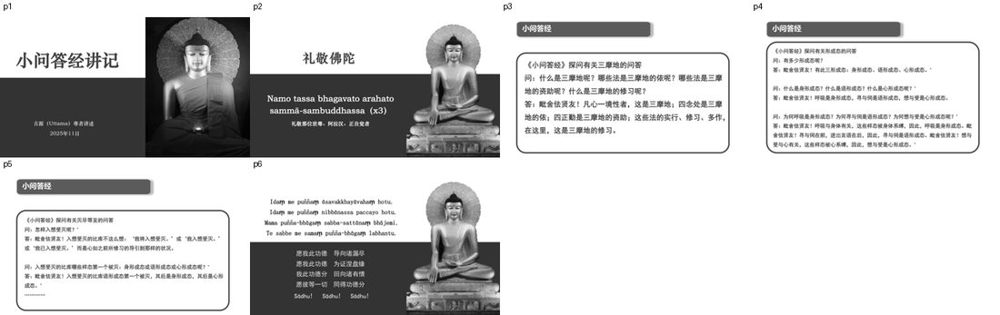
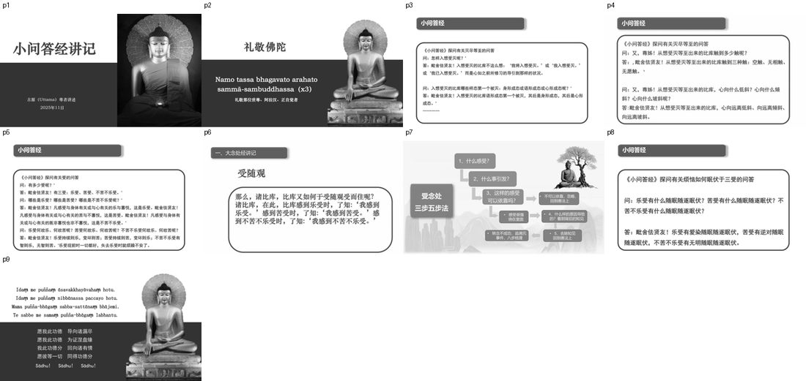
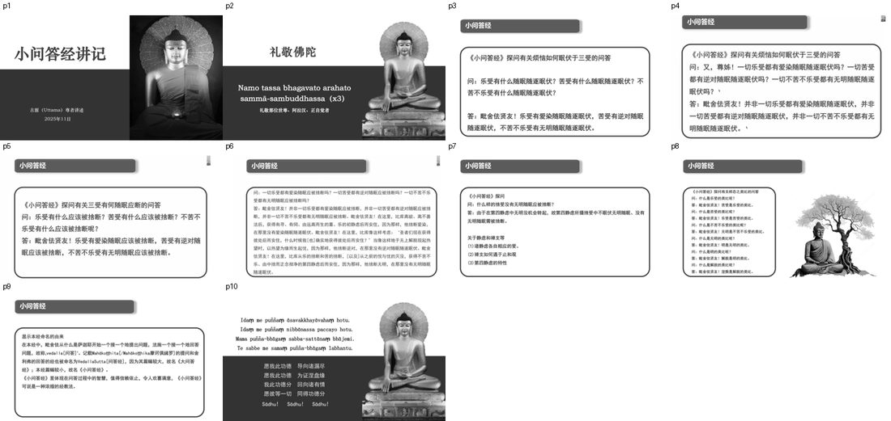
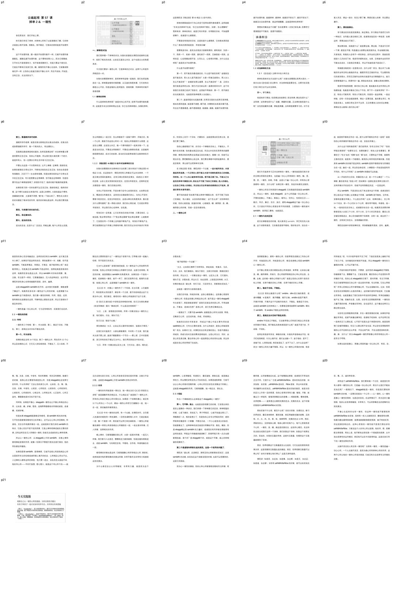
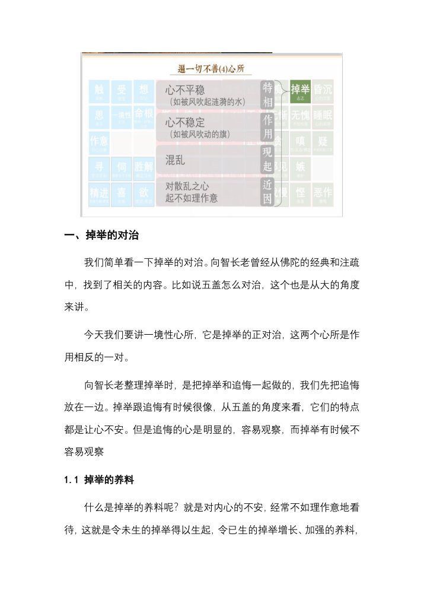
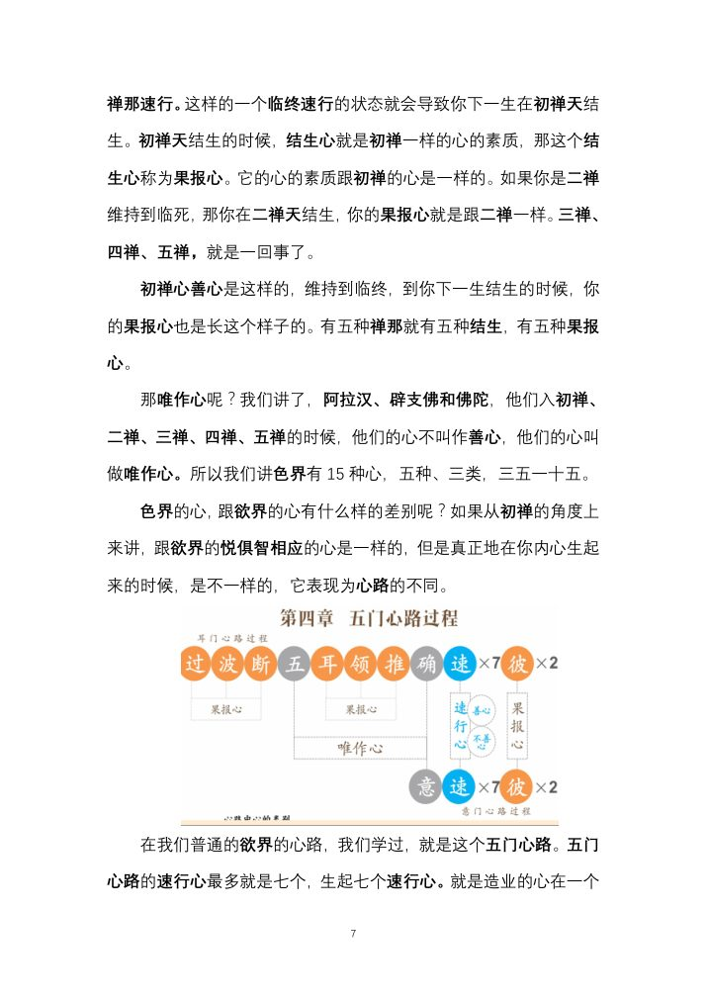
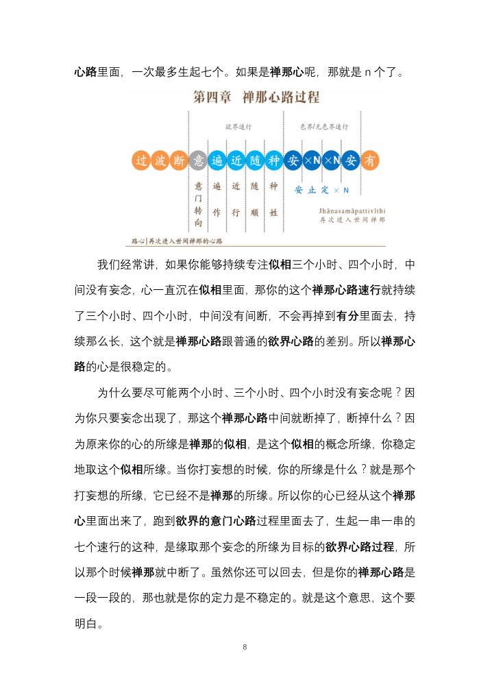
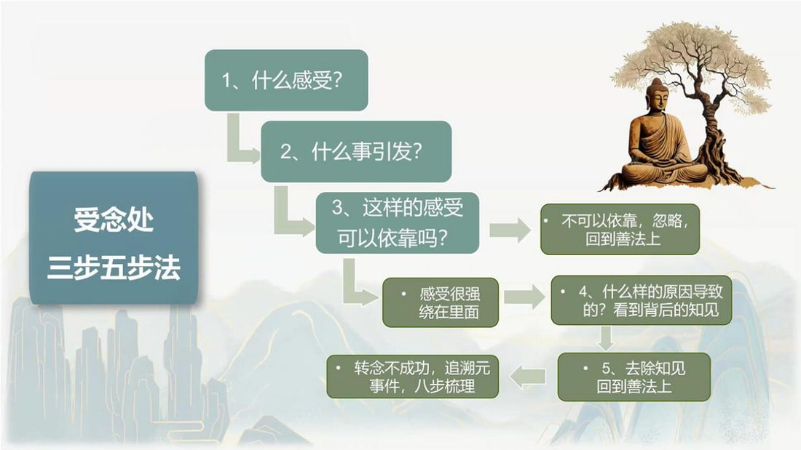
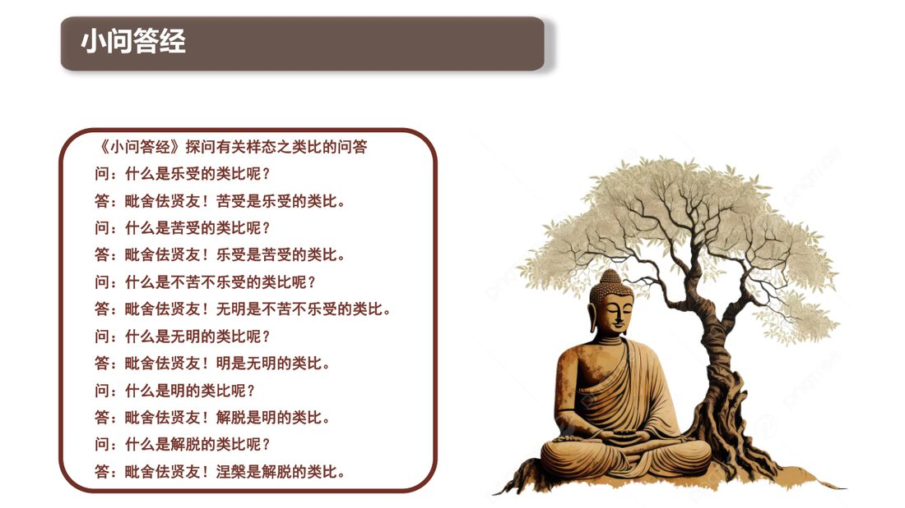
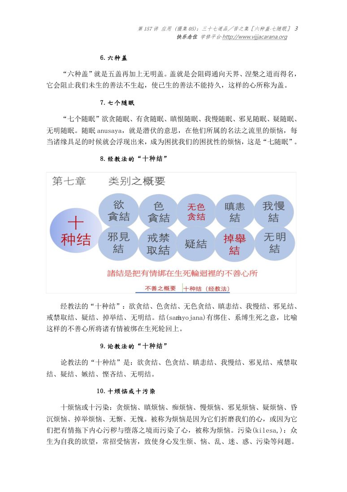

📅 最近更新：2026-09-23 01:52　|　第三版修订（4周版）：连续两周合并为9环节、单讲120分钟；共读原文一字未改；学员版去除主持人专属内容

# 第4周：三摩地修习与受随观（主持人版）

> ⭐ **本讲主持人速览**（新主持人必读，2分钟看完）
>
> 你不是老师，是"共学同行者"。你不需要提前懂内容，只需要按流程走。
> **本周由连续两周内容合并**而成，含两段共读、两轮分享与两轮讨论，单讲 120 分钟。
>
> | 环节 | 标准时长 | ⏱ 时间不够→ | ⏱ 时间富余→ |
> |:-----|:----:|:-----|:-----|
> | 🧘 静心开场 | 10 min | 缩至5 min | 加2分钟静坐 |
> | 📖 共读原文1 | 20 min | 只读★核心段（约15 min） | 加读◈扩展段 |
> | 💬 第一轮分享 | 10 min | 每人1句话 | 每人3分钟 |
> | 🎯 第一轮主题讨论 | 10 min | 只讨论问题① | 讨论全部问题+扩展 |
> | 🧘 禅修练习 | 15 min | 缩至8 min（只念引导词前半） | 延长至20 min |
> | 📖 共读原文2 | 20 min | 只读★核心段 | 加读◈扩展段 |
> | 💬 第二轮分享 | 10 min | 每人1句话 | 每人3分钟 |
> | 🎯 第二轮主题讨论 | 10 min | 只讨论问题① | 讨论全部问题+扩展 |
> | 🔚 收尾与回向 | 15 min | 缩至10 min | 保持 |
>
> **主持人10条守则（精简版）**：
> ① 不讲解、不提供答案——让原文自己说话；② 有人问"正确答案"→说"先听听大家的看法"；③ 冷场→主持人先分享自己的真实感受；④ 跑题→温和拉回："这个有意思，我们回到今天的原文"；⑤ 争论→"两种看法都很好，大家保留自己的理解"；⑥ 确保人人发言；⑦ 不评判任何人的分享；⑧ 时间到了就推进；⑨ 禅修练习照读引导词即可；⑩ 结束一起回向。

> **读书会23：小问答经讲记：萨迦耶见与圣八支道 · 第4周（4周版 · 连续两周合并）**
> 主持人：你不需要提前懂内容，按本手册推进即可。
> 本周主题：**三摩地＝心一境性；以四念处为依、四正勤为资助而修习；由三形成态（身行／语行／心行）说到入想受灭时样态灭除的次第。**；**三受（乐受／苦受／不苦不乐受）的分类与「乐受变坏则苦、不苦不乐受有智则乐」的特性；于受随观受而住；三受各对应何种随眠（爱染／逆对／无明）、随眠如何舍断。**。

## 📋 本周信息卡

| 项目 | 内容 |
|:----|:-----|
| 时长 | 120分钟（4周版 · 9环节） |
| 核心问题 | ； |
| 共读原文 | 共读原文1：　｜　共读原文2： |
| 本周作业 | ； |

## ⏱ 时间弹性指南（本讲通用）

| 情况 | 应对方法 |
|:-----|:---------|
| **时间不够**（共读太长／讨论超时） | ① 静心开场缩至5分钟；② 两段共读原文均只读标注 **★核心** 的段落；③ 两轮分享每人只说一句话；④ 两轮主题讨论只讨论各自的问题①；⑤ 禅修练习缩至8分钟（只念引导词前半段）；⑥ 收尾回向缩至10分钟 |
| **时间富余**（共读快／讨论提前结束） | ① 用"📚 扩展内容包"中的补充原文段落继续共读；② 增加扩展讨论问题；③ 延长禅修练习时间；④ 增加"每人分享一个生活实例"环节 |

> 💡 原则：**讨论比读完重要，体验比讲完重要。** 宁可跳过扩展原文，也要让每个人都有机会说话。

## 🧘 静心开场（10 min）

**主持人引导语**（照读即可）：

> 请大家找一个舒适的坐姿，脊背自然挺直，双肩放松。轻轻闭上眼，或者把目光垂落在前方一米处。
>
> 先把注意力放到呼吸上。吸气，知道自己在吸气；呼气，知道自己在呼气。不用去控制它，只是知道。（静默约 1 分钟）
>
> 今天我们要谈一个常常被讲得很“高”的字——“定”。请先把它放下。做几个自然的呼吸，把一路走来的匆忙放下，把手机调成静音。（静默约 2 分钟）
>
> 现在，请你留意一下：此刻的心，是安稳地停在呼吸上，还是已经跑去了别处？不用去抓它回来、不用责备它。只是像看天上飘过的一片云那样，知道“哦，心跑开了”。（静默约 1 分钟）
>
> 好，慢慢把注意力带回身体，带回这个房间。可以睁开眼睛了。
>
> 我们带着这份“如实知道”进入今天的共读——因为“定”（三摩地），说到底，就是心与它的所缘安稳地在一起的能力；它从“知道自己在做什么”开始，而不是从追求什么境界开始。
>
> 最后，让我们把这份安静扩展开：愿我此刻安稳，愿我远离苦恼；愿在座的每一位同修安稳，远离苦恼；愿一切众生安稳，远离苦恼。（静默约 30 秒）
>
> 好，请大家把身体坐正，我们一起进入今天的学习。如果需要，可以随时睁眼、喝水、调整坐姿——这个空间是安全的，你的节奏由你自己把握。

**开场补充（主持人，可视现场加说 20 秒）**：不必把“定”想得很远。此刻你能安安静静坐在这里，能听见自己的呼吸、能听见我的声音——这背后就有一份“心没有散掉”的力量。我们今天的任务，只是把它看清、把它认出来、并学着把它用在善的地方。请放松，不必证明什么；带着一份“来看一看”的好奇，我们一起读经。

> 💬 **破冰｜3–5分钟**：说说看：你的「定」，是靠什么撑住的——环境、方法，还是心本身？

> 🛡️ **心理安全三约定**（每次开场在心里过一遍）：① **保密**——这里说的话不出这间屋子；② **不评判**——不评价任何人的分享，也不急着评价自己；③ **可随时暂停**——任何时候觉得不舒服，都可以停下来休息、喝水或离开，不需要解释。

## 📖 共读原文1（20 min）

（主持人：本周共读四份材料。材料①②③★核心，务必在 30 分钟内带读完；材料④为实修补足，时间不够可只读要点。以下“> ⚠️ 主持人操作”行与括注（ ）为整理提示，仅供主持，朗读原文时跳过。涉定学细节，请只点到为止，指明“详见读书会19（戒定慧三学）／01（止观入门）”；涉阿毗达摩心所，指明“详见读书会14/15”。）

> **【本周朗读段 · 开始】**（本段约 3505 字，供中等稍慢朗读，约 20 分钟；其余为默读／选读／延伸内容）

**本周阅读提示（主持人带读前先说 1 分钟，帮大家带着问题读）**：

- 三组关键词，请大家边读边圈：**「心一境性」「四念处／四正勤」「身行·语行·心行」**。读完材料①，应能回答：定是什么？定的“依”和“资”分别是什么？入想受灭时哪一行先灭？
- 一个容易混淆处：《小问答经》与《根本五十篇》是**同一经的两种译笔**（前者为讲记所引、语近白话；后者为原典汉译、语近文雅）。二者对照着读，反而更容易看清经文原意，不必纠结字面差异。
- 一个“别急着下结论”的点：经文把“定”定义得极简（心一境性），但**修**起来有深浅次第。本周的目标不是“我今天定得多深”，而是“我能不能说清楚定是什么、从哪里起步”。请把这句提醒，在带读前后各说一次。

**主持人讲解（以下为讲者自己的话，非原典原文，可照自己的理解略说，勿混入原文）**：

- 什么叫“依”、什么叫“资助”？打个比方：把“定”想成一棵要长起来的树——**四念处是它的根／依托**（身、受、心、法四个可以“落脚”的觉知处），**四正勤是它的水肥**（断已生之恶、防未生之恶、生未生之善、长已生之善）。没有可依之处，心无从安放；没有正勤的浇灌，定长不壮。
- 为什么“心一境性”要说成一个人人本具的心所？因为若一境性只在入定时才有，那我们平常就与它毫无关系了。恰恰相反——你能读完这一句经文、能听见自己的呼吸，都有一境性在起作用。**修行不是去“获得”一个没有的东西，而是把已有的能力，导向善的方向、并且增强它。**
- 关于“入想受灭”，请这样对大家说：这是“更深一层”的定境课题，经文用它来展示“行的止息”有次第。**我们这一周只把它当作教理来了解，不当作目标去追。** 就像看地图上的一座高山，知道它在那里、知道路怎么走，不代表此刻就要登顶。
- 收束一句：定的起点，不在蒲团，而在**你愿不愿意在看手机的那一刻，先停三秒、知道自己在做什么**。这，就是“四正勤”在生活里的最小单位。

**本周词汇小卡（仅在主持人页，供随时取用，不必逐条讲）**：
- **三摩地（samādhi）**：定；本周所据经文特指“心一境性”。
- **心一境性（ekaggatā／cittekaggatā）**：遍一切心的定心所；力度强者名为 samādhi。
- **四念处**：身、受、心、法四种可作“觉知落脚处”的依，是“定的依”。
- **四正勤**：已生恶令断、未生恶令不生、未生善令生、已生善令增长，是“定的资助”。
- **三形成态（行）**：身行＝呼吸，语行＝寻伺，心行＝想与受。
- **想受灭定（灭尽等至）**：极深的定境；入时语行先灭、身行次之、心行最后。
- **五盖**：欲贪、瞋恚、昏沉睡眠、掉举追悔、疑——修定的“敌对法”。

**主持人带读节奏小抄（供主持把握，不必宣读）**：
1. 0–2 min：先读“材料①”，让经文自己说话；读完停 5 秒，问一句“听清了吗？”。
2. 2–4 min：带读“材料②”的〈定〉问答，指出“心一境性＝定、四念处为相、四正勤为资具”，并口头把这三个词写成一棵“定之树”（根＝念处、水肥＝正勤）。
3. 4–6 min：带读“材料②”的〈行〉与〈想受灭〉问答，只讲次第（语行先灭），**强调“只作教理了解”**。
4. 6–20 min：进入“材料③”一境性心所。此段较长，**不必逐字念给他听**——挑“定义”“特相之首”“洗澡粉”“平静寂止”四个点串讲，其余略读。
5. 20–28 min：读“材料④”三段（何为禅那·五盖／专注概念法／一境性制伏贪欲），把“烧毁敌对法”落到“日常削弱五盖”。
6. 28–30 min：收束一句——“定，就是心与所缘安稳在一起；从此刻这一口气开始。”
> 若时间紧：优先保 1–3 与 6，材料③④只读划线要点。若时间松：把材料③的“现起”一节细读，并请同修复述“samādhi 与 ekkaggatā 的不同”。

**材料①** ★核心：《小问答经讲记》11-古源尊者-20251111（课件）
- 文件类型：pdf
- 知识库出处：古源尊者开示及上座部佛教资料
- media_id：`pdf_d0dd1c0cd17209afe241ece24bf6b7b4_09c126db28b5f0bcb4378c9cb479e05f7439961422831605`
- 打开方式：ima知识库搜索「小问答经讲记 11 三摩地」
- 查重说明：本 media_id 为读书会23 主线 13 讲课件（2025-11-01~13，全新 FREE），经以完整 id `grep -F`《_禁用清单_读书会01-22已用media_id.txt》为 0 命中，与既有系列无段落重叠。

> ⚠️ 主持人操作：本讲课件为「经文问答」精简型，全文照读即可（约 3 分钟）。读时把握四条线：①《小问答经》探问**三摩地**的问答原文（定＝心一境性，四念处为依、四正勤为资助）；②《小问答经》探问**形成态（行）**的问答（身／语／心三行及其判定依据）；③《小问答经》探问**灭尽等至（想受灭）**的问答（如何入、哪些样态先灭）。此三条线即本周三块核心。涉及定学细节处，请只点到为止，指明「详见读书会19（戒定慧三学）／01（止观入门）」。

#   小问答经讲记

古源(Uttama)尊者讲述

2025年11日

#   礼敬佛陀

Namo tassa bhagavato arahato
sammā-sambuddhassa (x3)

礼敬那位世尊、阿拉汉、正自觉者

#   小问答经

#   《小问答经》探问有关三摩地的问答

问：什么是三摩地呢？哪些法是三摩地的依呢？哪些法是三摩地的资助呢？什么是三摩地的修习呢？

答：毗舍佉贤友！凡心一境性者，这是三摩地；四念处是三摩地的依；四正勤是三摩地的资助；这些法的实行、修习、多作，在这里，这是三摩地的修习。

#   小问答经

#   《小问答经》探问有关形成态的问答

问：有多少形成态呢？

答：毗舍佉贤友！有此三形成态：身形成态、语形成态、心形成态。

问：什么是身形成态？什么是语形成态？什么是心形成态呢？'

答：毗舍佉贤友！呼吸是身形成态，寻与伺是语形成态，想与受是心形成态。

问：为何呼吸是身形成态？为何寻与伺是语形成态？为何想与受是心形成态呢？'

答：毗舍佉贤友！呼吸与身体有关，这些样态被身体系缚，因此，呼吸是身形成态。毗舍佉贤友！寻与伺在前，迸出言语在后，因此，寻与伺是语形成态。毗舍佉贤友！想与受与心有关，这些样态被心系缚，因此，想与受是心形成态。'

#   小问答经

#   《小问答经》探问有关灭尽等至的问答

问：怎样入想受灭呢？'

答：毗舍佉贤友！入想受灭的比库不这么想：‘我将入想受灭。’或‘我入想受灭。’或‘我已入想受灭。’而是心如之前所修习的导引到那样的状况。

问：入想受灭的比库哪些样态第一个被灭：身形成态或语形成态或心形成态呢？‘

答：毗舍佉贤友！入想受灭的比库语形成态第一个被灭，其后是身形成态，其后是心形成态。‘

Idam me puñnam asavakkhayavaham hotu.

Idam me puñnam nibbānassa paccayo hotu.

Mama puñña-bhāgam sabba-sattānam bhājemi.

Te sabbe me sama pūña-bhāga m labhantu.

愿我此功德 导向诸漏尽

愿我此功德 为证涅盘缘

我此功德分 回向诸有情

愿彼等一切 同得功德分

Sādhu! Sādhu! Sādhu!

[generated, not original text]

**材料②** ★核心：《根本五十篇》Mūlapaṇṇāsapāḷi.pdf（中部·小双品·4.《小问答经》原文）
- 文件类型：pdf
- 知识库出处：古源尊者开示及上座部佛教资料
- media_id：`pdf_d0dd1c0cd17209afe241ece24bf6b7b4_0eb6563bc34719cc5220ef3bebf00bb77439961422831605`
- 打开方式：ima知识库搜索「根本五十篇 小问答经」或「Mūlapaṇṇāsapāḷi」
- 查重说明：本 media_id 见于《_禁用清单_读书会01-22已用media_id.txt》（清单遗留）。经核对，01–22 成品照录未使用本文件，段落不重叠；本系列 W1 取〈有身见／有身集〉问答段、W3 取〈有身灭／导向身见灭尽之道／执取与五取蕴〉问答段、W5／W6 取〈八支圣道构成／三蕴摄八支〉问答段，**本讲取〈定（心一境性）〉问答段与〈行（三形成态）／入想受灭定〉问答段**，与上述各周段落不重叠。

> ⚠️ 主持人操作：本经为巴利原典汉译。本讲**只取与「定／三形成态／想受灭定」直接相关的两处问答**：①〈定＝心一境性、四念处为定相、四正勤为定资具〉问答（其前置经文为 W6〈八支圣道被三蕴包含〉一段，本周只作衔接，不展开）；②〈行＝身行／语行／心行〉与〈入想受灭定、样态灭除次第〉问答。原文用「想受灭定／灭尽等至」语，与课件「入想受灭」为同一义（nirodha-samāpatti）之异译，读时提示即可。入想受灭属高难课题，本周**以了解教理为主，不作境界追求**。`[generated, not original text]` 为 PDF 智能解析标注，照录保留。

以下照录知识库《中部》原文中《小问答经》相关段落（保留原编号与文字，含原文中的异名用字）：

“那么，尊者，什么是定？哪些法是定的因相？哪些法是定的资具？什么是定的修习？”

“朋友毗舍佉，心一境性即是定；四念处为定相；四正勤为定资具。对于这些法的修习、培育、多作，即是此处的定修习。”

463. “尊者，有多少种行呢？”

“贤友毗舍佉，有三种行：身行、语行、心行。”

“那么，尊者，什么是身行、什么是语行、什么是心行呢？”

“维萨卡贤友啊，出息入息是身行，寻伺是语行，想与受是心行。”

“但尊者，为何出息入息是身行？为何寻伺是语行？为何想与受是心行？”

“维萨卡贤友啊，出息入息是身体性的法，与身体相关，所以出息入息是身行。贤友啊，先有寻伺，然后才发出言语，所以寻伺是语行。想与受是心理性的法，与心相关，所以想与受是心行。”

464. “尊者，如何证得想受灭定？”

“维萨卡贤友啊，比丘入想受灭定时不会这样想：‘我将入想受灭定’，或‘我正在入想受灭定’，或‘我已入想受灭定’。而是他先前已修习的心引导他达到这种境界。”

“尊者，比丘入想受灭定时，哪些法最先止息？是身行、语行还是心行？”

“维萨卡贤友啊，比丘入想受灭定时，最先止息的是语行，其次是身行，最后是心行。”

> **【本周朗读段 · 结束】**（以下为默读／选读／延伸内容，时间富余时再读）

“尊者，如何从想受灭定中出定？”

“维萨卡贤友啊，比丘从想受灭定出定时不会这样想：‘我将从想受灭定出定’，或‘我正在从想受灭定出定’，或‘我已从想受灭定出定’。而是他先前已修习的心引导他出定。”

“尊者，比丘从想受灭定出定时，哪些法最先生起？是身行、语行还是心行？”

“维萨卡贤友啊，比丘从想受灭定出定时，最先生起的是心行，其次是身行，最后是语行。”“尊者，比丘从想受灭定出定时，有几种触触及他？”“维沙卡道友，比丘从想受灭定出定时，有三种触触及他——空触、无相触、无愿触。”

“尊者，比丘从想受灭定出定时，心倾向于什么？导向什么？朝向什么？”“维沙卡贤友，比丘从想受灭定出定时，心倾向于远离，导向远离，朝向远离。”

（以上即《小问答经》中关于「定（心一境性）」之问答，及「行」之分类与「入想受灭定／灭尽等至」的问答原文。）[generated, not original text]

**材料③** ★补充：第57讲 掉举2&一境性1（共修版）
- 文件类型：pdf（共修版讲义）
- 知识库出处：古源尊者开示及上座部佛教资料
- media_id：`pdf_d0dd1c0cd17209afe241ece24bf6b7b4_531c5ac09aef3adb901e1ee81a3a1f077439961422831605`
- 打开方式：ima知识库搜索「第57讲 掉举2 一境性1」
- 查重说明：本 media_id 见于《_禁用清单_读书会01-22已用media_id.txt》（**HIT**）。经核对，**读书会10第7周〈正定——从近行定到安止定〉虽同引本文件，但彼讲仅将本文件列为「延伸阅读」、未照录正文**（其正文另取《160讲·七禅支》等）；故本讲取〈一境性心所：定义、特相、作用、现起〉章节照录，属本文件正文首次照录，与该系列无段落/内容重叠。

> ⚠️ 主持人操作：本讲篇幅较大，本周**只取「二、一境性心所」一节**——它把《小问答经》「定＝心一境性」的「心一境性」落到阿毗达摩心所的层面讲透：一境性（ekaggatā）是遍一切心的心所，其「高级阶段」即 samādhi 定；再以「特相／作用／现起／近因」四相说明。掉举部分（本讲另一主题）只作附件略读，用于点出「一境性是掉举的正对治」。文中原文的{{结构图注}}已按原样保留。涉阿毗达摩心所细节，请指明「详见读书会14/15（阿毗达摩基础）」，本周不作心法体系的展开。

以下按主题从知识库全文逐字照录与「一境性心所」直接相关的原文段落，标题与结构按原文保留。原文中一境性心所的**「近因」在本讲无正文段**，仅见于结构图注（标注为「（多数是）乐受」），缺口如实注明。

## 二、一境性心所

【结构图注（原文，图示文字照录）】
> A1[遍一切(7)心所] --> A2[特相]／A3[作用]／A4[现起]／A5[近因]
> A2 --> A6[①作为首领/②稳定于目标,不散乱 ③是相应法对目标不散乱之因]
> A3 --> A7[统一俱生法]
> A4 --> A8[①平静;寂止 ②智(果)生起之因]
> A5 --> A9[(多数是)乐受]
> A10[触] --> A11[接触]；A12[受] --> A13[感受]；A14[想] --> A15[印记]；A16[思] --> A17[意志]；A18[一境性专注] --> A19[Samādhi定]；A20[作意] --> A21[引心注意]；A22[寻] --> A23[专注目标]；A24[伺] --> A25[继续专注目标]；A26[胜] --> A27[确定目标]；A28[精进] --> A29[英气概/勇猛]；A30[喜] --> A31[欢喜]；A32[欲] --> A33[欲/有]；A34[掉举] --> A35[志恶]；A36[昏沉] --> A37[心的沉重]；A38[无愧] --> A39[不怕作恶]；A40[睡眠] --> A41[心的呆滞]；A42[嗔] --> A43[怒/反击/拂逆]；A44[疑] --> A45[不信因果/三宝]；A46[嫉] --> A47[嫉妒]；A48[悭] --> A49[吝啬]；A50[恶作] --> A51[懊悔]

### 一境性心所的定义与“遍一切心”的说明（原文）

我们今天就来学习正对治掉举的一境性。一境性就是我们刚才讲的五禅支里面的定禅支，也是遍一切心心所里面的一境性。触、受、想、思、一境性、命根、作意，这是七个遍一切心心所。所有的心里面都有一境性，为什么呢？如果没有一境性，你连目标都无法取到。

一境性心所在巴利里面叫 ekaggatā, 它的高级阶段就是 samādhi 定。所以心一境性，就是 ekaggatā, 这个心所是遍一切心的心所。不管你是善心、不善心、果报心、唯作心，任何心，包括双五识——眼识、耳识、鼻识、舌识、身识，都有 ekaggatā这个遍一切心的心所。它只是在不同的心里面会有不同的强度，力度强的一境性就叫 samādhi，音译是三摩地，也就是定。

### 2.1 一境性与定的区别（原文）

前天在禅修报告的时候，给大家讲过 samādhi，学巴利文的人知道，这个词很有意思，它的意思是很平稳地、很好地合作、结合在一起，就是很平稳地合作在一起。是什么很平稳地合作在一起呢？就是你的心和所缘很平稳地合作在一起，安放在所缘上。

为什么这个很有意思呢？我们经常讲，"你专注目标了吗？""你的呼吸在那里呀？""你要专注它，你要观察它"，有些人说"你要看它，要看住它"。"专注"也好，"观察"也好，"看"也好，只要有这个字眼，就都有主客的区别，就是有一个能看的、能观的心和所观的所缘对象。但是具有 samādhi的时候不是这样的，samādhi是很平稳很好地与所缘结合在一起、融在一起。所以你会体会到，入禅跟你一开始觉知是有所不同的。有什么不同呢？从 samādhi来看就可以知道。

从一开始你专注目标，到最后你入定，是一个什么概念？一个人禅修，最后老师说，"你投入吧"，但如果你一直都还是在那种主客分开，光和所缘分开的状态中，你就不会有很稳定的定，一定是这样。

所以 samādhi，不是说你头低下来去面对这个所缘，或者说我们把心放在这个位置上去观察这个所缘，samādhi是平衡地、合作地、安稳地放置在所缘上。什么是合作呢？比如，初禅的善心，至少有 34 个名法，即一个心识加 33 个心所，都非常平稳地、和谐地、统一地、一致地安住在目标上，或者跟目标合在一起。帕奥西亚多要求禅修者觉知入出息三个小时、四个小时、五个小时没有妄念，最后心完全被似相吸进去，身心完全融到那个似相里，合到一起，就达到了一境性，没有其它的念头，全部都融在里面。

佛陀在经典中讲到初禅时说，浑身都被喜所浸润、流布、遍满。

就是你的身心完全地融进去，这样的状态称为 samādhi，这才真正是叫入禅了。如果你不是这样的状态，那你就要对一对，抱歉，你不是 samādhi。可能是草莓定、苹果定、芒果定，能不能用得上呢？肯定能用得上。但是真正的 samādhi不是这样的，按照经典是前面讲的这样，帕奥西亚多也是这么讲。所以 samādhi对目标的观察、看、注意、专注是不一样的，它更像是融合、沉入的这种状态，这才符合佛陀所讲的身心全然地被喜所浸润、流布、遍满。

这是 ekaggatā和 samādhi的不同。这对我们很重要，禅修者要了解这个。帕奥西亚多在讲一境性这个心所的时候，也是侧重于从 samādhi这个角度来讲。我们看一境性的特相、作用、现起、近因，智和果的生起都放在这里，平静和寂止都放在这里，所以它是倾向于就定来讲的。

一境性是遍一切心的心所，它与定有相似性，后面我们也会讲。

### 2.2 一境性的四相

#### 2.2.1 特相（原文）

一境性有三个特相：第一，作为首领；第二，稳定于目标，不散乱；第三，是相应法对目标不散乱的因。

第一个，作为首领。

初禅的相应法有 34 个名法，除了一境性之外，再加另外 32 个心所以及初禅的心识，它们沉入到似相里面，不散乱了。沉入似相、不散乱的主要原因是什么？一境性这个首领干的。它带着大家一起融入似相，而不是其它的名法。

它为什么是首领？首领的意思就是，当一境性这个心所发挥作用的时候，包括心识和其它的相应心所都听它的话，这是它的特相。有定的时候，就是侧重从 samādhi的角度来讲。如果你是一个贪的一境性，或者嗔的一境性，就不一样了，我们后面再介绍。能够作为首领，统领心和心所，这是侧重于 samādhi的一境性。

《义注》中，对善心一境性作了一个形容。在古印度，人们建房子，特别是有尖顶的屋子，都会有一个主梁，屋子的结构是以这个主梁为中心的，我们修定、修观时的一境性心所就类似于这个主梁。

在《弥兰王请问经》中讲到定的特相的时候，弥兰王向那先尊者（即龙军尊者）提问："尊者龙军，什么是定的特相呀？"

"大王，上首，首领是定的特相。所有一切善法皆以一境性为上首，他们趋向、归去、倾向于定。"

弥兰王说，"请说个比喻。"

那先尊者说，"大王，比如尖顶之屋所有的椽木，皆趋向于脊顶。"

在我们农村盖房子，大家也都能看到，中间有一个主梁，我们盖木头房子要上梁。盖房子最重要的一个节日——要上梁，正中间是粗梁，其它所有的柱子都以它为中心。我们再回到经文中的对话。

"大王，所有一切善法皆以定为上首，它们归去、趋向、倾向定，亦复如是。"

"能不能再给一个比喻？"

"大王，比如国王携带了四种军队，奔赴战场，有象兵、马兵、车兵、步兵，他们都趋向、倾向于国王，为国王所统领，围绕在国王的四周。所以大王，一切善法皆以一境性、以定为上首，它们趋向、倾向于定，亦复如是。所以大王，如此首领、上首是定的特相。大王，世尊亦做此说：'诸比库，你们习定，习定则专注，则能够如实知见。'"

这就是一境性作为首领的意思。

当我们在布施，持戒的时候，这些心都是善心，这些善心里面有一境性心所，但是这些善心和相应的心所，就不是以一境性 ekaggatā作为首领了。那是谁做首领呢？是我们后面会讲的思心所。平常造善业、不善业，是谁在负责？是思心所，是它负责召集相应法。

一般情况下，只要不是 samādhi，就都是思心所作为首领，带领、召集其它心所，去完成布施、持戒、听闻佛法。

帕奥西亚多的书里面讲，持戒这个善心中起主要作用的是 saddhā信心所，它作为主要的首领。为什么持戒时，是信心所做首领呢？因为，如果对三宝、对佛陀的法没有足够的信心，你是不愿意去持戒的，持戒与你对五欲的需求是相违的。以信心所为主，同时，由思心所负责召集、整合所有心所一起按照信心所的导向去做，所以持戒是在信心所的带领下完成的。

虽然都是善心，都有一境性心所，但是带领完成善法工作的心所不同：布施是思心所，持戒是信心所，修定或者修止观是 samādhi心一境性心所。

在不善心里面大部分都是由思心所来组织，来带领，比如说心被贪、瞋、痴所绑架、所染污，思心所就带领相应的心和心所去贪、去瞋、去痴。这时候一境性心所做什么呢？就是让你的心在那个贪的目标上待着，在那个瞋的目标上待着，在那个痴的目标上待着。

第二，稳定于目标，不散乱。

《义注》里的比喻是什么呢？avisāra。sāra是主轴的意思，或者叫精髓，vi是离开，离开精髓，离开主轴。avisāra就是不离开，不离开所缘，不离开这个不该离开的地方；不散乱，能稳定于目标。

这就是 samādhi定的特相之一。你要修定修观就要有 samādhi，朝向于 samādhi，有 avisāra不散乱这样的特相。

第三，是相应法对目标不散乱的因。

avisāra不仅自己不散乱，它还能带领心识和其它相应心所在面对所缘时不散乱。那不散乱的具体表现是什么呢？就是不受干扰，不动摇，不混乱。

经常会有很多同学说，禅修的时候，外面的声音很响坐不住；蚊子盯咬很难受；今天心情不好，想打坐消除一下；孩子很吵，受不了，老被干扰，心里很动摇，然后就混乱了，坐不下去了。为什么会这样？因为一境性心所的力量不够强。所以，当一境性心所强的时候，很多同学就说，"哎，今天外面声音听不见了呢"，下座后发现身上被蚊子咬了好几个包，当时被咬的时候却不知道。所以 ekaggatā一境性的力量强的时候，心可以不被干扰。

一开始外面的声音很吵，不要紧，这时你的 ekaggatā还不够强，你继续修下去、慢慢修下去，它就会变强，最后你的心不会受到外界环境的干扰。你的心在 ekaggatā的引领下，面对所缘，专注于所缘，而且它能够带领其它的心所一起去面对所缘、专注所缘。它怎么带领呢？所有心的相应心所中都有触心所，可以去接触目标。比如，你现在安住在安那般那入出息的所缘上，这时候外面有声音进来，它会撞击耳净色，也就是撞击了我们世俗中所说的听觉神经。耳净色被撞击就产生了触，因触而生受、生想。当你专注安那般那所缘，一境性的力量不强的时候，声音撞击耳净色，会生起耳识，这个撞击会牵引心路过程生起来。

当你专注安那般那的所缘，并且一境性很强的时候，如果有声音撞击耳净色，或者气味撞击鼻净色，或者蚊子咬身体，也不会再引发一连串的五门心路生起，心不受干扰是从这个角度来讲的。就是虽然根门会被所缘撞击，但五门心路过程不会生起，所以安住安那般那所缘的心识不会转向去认声音，不会去闻气味，不会去感受身体的痒、痛、麻，为什么？因为 ekaggatā一境性带领着心和所有相应心所一起专注于呼吸。

如果生起的是善心，那善心里面有遍一切心的心所，有信、念、惭、愧、无贪、无嗔、中舍性，有的有慧根，有的没有慧根。做善行的时候，虽然心的主要领导者是思心所，但是 ekaggatā也会发挥它的作用。什么作用呢？它会让你的其它心所，比如信、念、惭、愧、无贪、无嗔、中舍性、心轻安、心所轻安、心轻快性、心所轻快性、心柔软性、心所柔软性、心练达性、心所练达性、心正直性、心所正直性、慧稳稳地面对目标不受干扰。

同样地，如果是不善心，ekaggatā一境性也让不善心和相应的心所，比如贪、瞋、妒嫉、悭吝、追悔等等稳稳地对所缘或者贪、或者瞋、或者妒嫉。

但是如果 ekaggatā是跟修定和修观，跟 samādhi相关的时候，它不仅仅是能够安稳地专注在所缘上，还可以让心和心所安稳地、和谐地、完全合作地跟所缘在一起。这就是刚才我们讲的 samādhi的特点，它是心完全不受干扰的因素，它是止禅和观禅成就的主要的因素。没有这样完全沉入所缘的一境性，你就无法成就你的止禅和观禅。

所以心一境性心所，从 ekaggatā上升到 samādhi，在修止禅和修观禅起首领的作用，就像一位国王不管是打胜仗还是打败仗，他的军队都会伴随他。

如果你获得 samādhi，获得禅那，它就不会给心和其他相应心所从现前所专注的似相或者所缘上离开的机会，心和相应心所出不去。

入过禅的人都有这样的体验，他只要一进去，杂乱的念头就起不来，他的寻心所——平时打妄想，想七想八，就是这个寻心所干的——就没办法转向其它目标，心和心所老老实实地在面对所缘，注意力不会分散。这就是 ekaggatā上升到 samādhi的特点和作用。

#### 2.2.2 作用（原文）

一境性的作用就是统一俱生法，统一俱生法在《义注》里面怎么讲呢？就是凝聚所有的相应法。什么相应法？就是除了一境性之外，所有的心和其它相应心所叫俱生法。如果是一个初禅的善心，就还有 32 个心所加上一个心识，都由一境性心所把它们凝聚在一起，统一在一起，然后融到所缘里面去。

《义注》中对一境性的说明，有一个比喻。在佛陀时代，古印度人洗澡的时候使用一种洗澡粉。一旦把洗澡粉倒入水中，它就会黏成一团，像一个面团一样，然后就可以用它来洗澡搓身。一境性心所就像洗澡粉一样把心和其他相应心所凝固在一起，一起去面对所缘、沉入所缘，发挥相关的作用。

修止禅时，它能够凝聚全部心所，大家一起面对所缘，一起沉入所缘。我们修习入出息念，慢慢地定力越来越高，你就会被似相吸进去，成就 samādhi，与似相完全地、平稳地、合作地、和谐地融合在一起。

修观禅的时候也是这样，它能够凝聚心和所有相应心所，很轻松、自然地面对他所要观察的究竟法所缘，非常平稳并且非常有力地透视这些究竟法。

为什么修定会让心非常敏锐，非常有力量，就是因为这个 samādhi。心变得敏锐，有透视力，最后道智、果智出起，就是靠这样的力。所以佛陀讲有定的人可如实知见。如果是道智果智，它就可以让心和心所面对涅槃所缘；心和心所完全安住在涅槃这个所缘上，这就是 ekaggatā的作用。它能够凝聚、统一相应法，俱生法。

#### 2.2.3 现起（原文）

作为一个禅修者怎么去体验这个 ekaggatā心一境性？

第一，它平静、寂止。也就是说你观察它的时候，它呈现出来的是安止寂静的一种状态。我们来看一下掉举跟它的区别，掉举粗猛的时候，心是飞着的，到处乱飞，两个呼吸后，心就不知道去那儿了。

再略微好一点，粗的妄想少了，但是你的心在专注呼吸的同时，感到呼吸背后像是有一片雾霾，不断在闪动，一不小心就变成大的妄念，你就跟着去了。这种掉举的状态就是非常躁动不安、散乱、糊涂。但是 ekaggatā达到 samādhi的力量时，或者现在有同学修安那般那有这样的报告，呼吸这个所缘越来越清晰了，即使呼吸只有一点点也都能够知道。谁干的？是 ekaggatā干的。就是这个平静、寂止的特相被你观察到了。

第二个是道智和果智生起的原因，这是一个效用的问题了。

佛陀讲，"诸比库，应该修定，拥有定的比库能够如实知见"。这是 samādhi的功能，如实知见这个效能呈现的时候，也是可以观察到的，这是它的现起。

因为心一境性的缘故，你的心和心所能够很安稳地专注所缘，观察所缘，从而智慧就会生起。这个智慧跟业果智，或者我们平常说的正见不同。它是什么？它是 yathābhūtañāṇa，是如实知见的智，如实知智，如实智；yathābhūta是如实，ñāṇa是智，所以叫如实智，有的翻译为如实知见。yathābhūtañāṇa是如实智的意思，就是当你的定力上升到一定的程度，你的心变得非常有力量，敏锐，不散，就像尖刀一样锐利，能够洞穿概念法的密集——相续密集、整体密集、功用密集——一直穿透过去看到究竟的色法、究竟的名法，这个时候的智就叫 yathābhūtañāṇa如实智。

那如实智干什么呢，看见什么呢？名色分别智，先看色法。修习四界差别，最后身体粉碎，看到色聚，然后再破除色聚的密集，见到地、水、火、风、色、香、味、食素等等，究竟的色法 18 种。然后，再取你的心，见到每条心路，每条心路中的每个心，每个心里面有若干心所，一境性、贪、瞋、痴这是究竟名法，这些所心看完。名法和色法组合成我们这样一个身体，我们执取这个身体，执取这个刹那生灭的、苦迫的、非我的五蕴合和体，这就叫五取蕴，你看到这个五取蕴就看到了苦谛。

然后，你再观察这个五取蕴是怎么生起的，它们生起的原因和因果关系，这是观察到五取蕴生起的缘起。然后，你再观察五取蕴可以停止吗？如何才能够让他们停止？这是灭谛和道谛。

佛陀讲，"如是苦，汝应知；如是集，汝应断；如是灭，汝应证；如是道，汝应修"。当你有 yathābhūtañāṇa的时候，就可以如实知见苦、集、灭、道四种圣谛。

讲到这个 yathābhūtañāṇa，我们要来做一个讨论，就是我们所有人都有一境性的心所，它是遍一切心的心所，那为什么我们不能如实知见呢？一般情况下，ekaggatā就是一境性，但是我们要培养 samādhi的时候，要在前面加一个心字——心一境性。心一境性是善心一境性的简称，也是定的别名。在这种情况下，因为定的力量很强，他的心会变得很敏锐，非常有力，可以洞穿概念法的密集而见到究竟法。

不善心生起来时也有一境性，但这种一境性就不能够培养 yathābhūtañāṇa如实智。虽然有一些人头脑很灵活，赚钱很有本事，他看问题也看得很清楚，股票涨跌都能够提前预测，脑子特别好用，但这是跟贪相应的。这种心里面的一境性就不是我们佛法讲的 yathābhūtañāṇa，只能说这个人的寻心所比较强。他的寻、想、胜解配合得很强，再加上贪，他不断地去研究某一个领域里的规律，从中找出规律性的运作模式，然后他可以在中间获得利益，这是在贪引导下的一境性发挥的作用。

头脑不灵光的人有没有一境性呢？当然有一境性，一境性是遍一切心心所。一个人头脑不灵活，是因为痴心所和掉举心所的作用，这两个心所让他的一境性心所变的很弱，它就没有办法发挥专注所缘的功能。

#### 2.2.4 近因

> **说明（整理注记，非原文）**：本讲提供的文档中，**没有**「2.2.4 近因」的正文段落。关于近因，仅见于本节开头结构图的标注：「A5[近因] --> A9[(多数是)乐受]」（即「（多数是）乐受」）。原文另有表述与之一致：「我们看一境性的特相、作用、现起、近因，智和果的生起都放在这里，平静和寂止都放在这里，所以它是倾向于就定来讲的。」

### 附：出自掉举部分、涉及一境性的段落（原文，属「一、掉举的对治／1.2.2」）

> 以下文字出自本讲掉举章节，其中提到定禅支、定根、定觉支均指一境性，故单列标注：

向智长老整理的对治掉举的方法的第二部分来自于《相应部》46相应 53 经。在这部经中，佛陀讲到有几种善法可以对治掉举，一个是五禅支里面的喜禅支，还有五禅支里面的定禅支，或者说 22 根中的定根，以及七觉支里面的轻安觉支、定觉支和舍觉支。定根和定觉支都是指一境性，我们后面会讲到。

当内心不安的时候，不适合修习会令心动荡的觉支，比如择法觉支、精进觉支和喜觉支，这些觉支会激励我们的心。当内心不安时，要修习轻安觉支、定觉支和舍觉支，这是从禅支的角度来讲。重点是为什么要有喜呢？我一再给大家讲，我们的心很忠诚，它总是在帮你寻找快乐，所以我们的心会掉举、会乱跑。

（该节其余文字为对治掉举的论述，未再提及一境性，此处不录。）

### 补齐说明（原文，属本讲开篇）

> 本讲开篇亦有一句以「正对治」点出一境性，属掉举章节，一并标注：

今天我们要讲一境性心所，它是掉举的正对治，这两个心所是作用相反的一对。[generated, not original text]

**材料④** ★补充：第104课-无色界心2（共修版）
- 文件类型：pdf（共修版讲义）
- 知识库出处：古源尊者开示及上座部佛教资料
- media_id：`pdf_d0dd1c0cd17209afe241ece24bf6b7b4_0da66df2a551730011b5fcccd8a218aa7439961422831605`
- 打开方式：ima知识库搜索「第104课 无色界心2」
- 查重说明：本 media_id 经以完整 id `grep -F`《_禁用清单_读书会01-22已用media_id.txt》核验为 **FREE**（0 命中），与既有系列无段落重叠。本讲属「摄心所」系列应用讲次，与读书会14/15（阿毗达摩基础）所用的「阿毗达摩应用讲次」非同一讲段，本讲取〈色界禅那的证得条件、五盖与定力培育、专注概念法〉段，作本周「三摩地修习」的实修补足。

> ⚠️ 主持人操作：本讲篇幅较大，本周**只精读与「三摩地修习」直接相关的三段**：①「何为禅那、五盖是敌对法」（定＝专注所缘＋烧毁敌对法）；②「色界禅那须专注概念法、入出息念何以能得定」（专注呼吸整体概念，非四界自性相/共相）；③「一境性制伏贪欲、五禅支的力量与安止速行」（从定力不稳定的日常，到持久安止）。其余（十遍、无色界四定、慈心禅等各别业处）可略读或留作扩展。涉阿毗达摩心法体系，请指明「详见读书会14/15」；涉止观入门，请指明「详见读书会01」。`[generated, not original text]` 为 PDF 智能解析标注，照录保留。

以下按主题从知识库全文逐字照录与「三摩地修习」直接相关的原文段落。

我们怎么样才能够证得色界禅那呢？在这里也简单地介绍一下。

我们讲色界禅那，为什么称为色界禅那，不叫欲界禅那呢？是因为这一类禅那必须通过专注，基于色法而形成的概念才能证得，所以就称为色界禅那。

欲界，我们讲"欲"是一种欲望。你专注欲望，那是一种心所，你是不可能证得禅那的。禪那，巴利语里面叫 Jhāna。什么是 Jhāna呢？《清净道论》里面这么解释，第一个，专注所缘故。第二个，烧毁敌对法故。专注所缘故，就是专注禅那的似相，单一的目标，一境性。

烧毁敌对法，是讲五盖。五盖是你证得禅那的敌人，它专门给你捣乱。

五盖是哪五盖呢？欲贪盖、瞋恚盖、昏沉睡眠盖、掉举追悔盖、还有怀疑盖。五盖只要有其中任何一个盖，我们的心就没有办法平静，不能专注目标。这个大家禅修时就很有体会，不用细讲。这些盖障碍我们培育定力，甚至让我们的心都没有办法平静，所以被称为盖，被盖住了。又因为这些是烦恼，它跟我们平静的心、专注的心相对立，所以被称为敌对法。所以烧毁、烧尽敌对法，故称为禅那 Jhāna。

专注所缘，烧尽敌对法。我个人认为，其实它是一个事。为什么这么讲呢？如果你不去除五盖，你根本无法持续专注所缘，对不对？无法专注所缘，当然不能证得禅那。

看起来它是两回事，比如说，"专注所缘故"，专注所缘故为禅那，这是获得，就是获得了专注所缘这样的条件，所以以这种来解释。另外一种，以排除法来解释，就是烧毁敌对法，就是排除了五盖。这两种来解释，但是我觉得这两种的要求缺一不可。

一个禅修者如果他的五盖经常现行，那么显然他无法持续专注所缘。

有一些禅修者由于他过去的禅那巴拉密很好，或者他上一生临死前的速行类似于近行定，比如上一生临死前，本来是想生到梵天去的，但是心力太弱，前面几天生病了，没有修好，色身生病了，提不起禅那来，禅那力量起不来，但是他还能够有一点维持在近行定的状态，就是他定力还是蛮好的。他这一生做人，或者有些他上一生就是梵天人，他从梵天投生到这里来的，他上一生在梵天很长一段时间都在修禅那，所以他的禅那巴拉密很好。这样一些人，他在这一生非常容易证得禅那。只要眼睛一闭，坐在那，光就笼罩着他。所以这些贤友或这些老师，他们很难理解说："你们怎么没有光呢？我以为眼睛闭上都是在光里面。"这样的人是福报很好的。

但是即使是这样的禅修者，如果他在日常生活中没有守护自己的心，而现行出很强的五盖——欲贪、瞋恚、昏沉睡眠、掉举追悔、怀疑，即使在某一个禅修营或者由于某一种状态下，他已经证得一、二、三、四禅，他的定力也是很难维持的。特别是疑盖一起来，直接就把他打回原形了。所以禅那不容易培养，也很容易被摧毁的，摧毁它的都是五盖。

如果我们在平常的时候，不注意自己五盖的状态，那些粗猛的五盖你不去消除，而只是想："我要证得禅那，我要证得禅那，我一定证得禅那……"即使被你证得，也很快会被你搞没有掉。所以销毁敌对法、削弱五盖，跟持续培养专注证得禅那，看起来是两个事，其实是一个事。这是我的观点。

色界禅那，只有专注基于色法所产生的概念才能证得。你若想通过专注心念或者其他究竟法，比如色界的地水火风的特相，是无法证得色界禅那的。举个例子，就像我们修入出息念，入出息念这种禅修业处是必须通过专注呼吸这个概念的本身，当呼吸，专注觉知以后形成很有力的 nimitta，就是禅那的征兆，我们称它为禅相。然后你的心被这样的禅相吸进去，而证得禅那。呼吸是概念法，专注呼吸而培养起来的禅那的征兆 nimitta也是概念法，它不是究竟法。

因此我们在专注呼吸的时候不应该以呼吸的进出流动相、气息的轻柔细滑相、气息的冷热相、皮肤的触觉这些作为所缘。大家一听就知道，这些都属于地水火风四界的十二种特相，它们是究竟法。我们在讲四界差别的时候介绍过。你只能注意呼吸的本身，呼吸的本身就是概念法。

入出息念属于四十二种身分里面的一种，它是风界最明显的部分，但是你不应该去注意这种风界的推动。你去注意这种风界推动，"进出、进出……"那种推动感，它就成了修四界分别，而不是修入出息念。同时也不要把心投入到呼吸里面去观察——觉得"这个呼吸是生灭的，都是无常的"，这种专注方式也是错的。

《清净道论》里一再强调，不应注意入出息的自性相和共相。

什么是入出息的自性相呢？就是包括了地界的硬、粗、重、软、滑、轻的特相；流动、黏结的水界特相；热、冷的火界特相；支持、推动的风界特相——这些是自性相。面对入出息的时候你不能专注这些特相。

共相就是无常、苦、无我。你不能去注意，"噢，呼吸是无常的"。

有些人讲："哎，我专注呼吸是无常或无我的时候，感觉比较舒服"。你是舒服啊，无我了，但是你不会证得禅那，抱歉。

所以应该把呼吸当成一个整体的概念，或是概念性的整体，如同你看待一个会动会走的人，或一只会跑会跳的猫一样来看待这个呼吸。

或像取风遍得遍相一样。只是专注于这样一个真实的意义概念，我们在后面会讲的概念法中的意义概念，不是名称概念。

很多贤友对于这个"什么叫整体的概念？什么叫整体呼吸的概念？"想了半天、琢磨了半天、对了半天也对不出来。其实这个东西也很难给你讲清楚，我也做了很多的比喻。什么是意义概念呢？比如那一头毛茸茸的狗，有两个耳朵，会摇尾巴也会伸舌头，这个可以称为"狗"。这个被称为"狗"、你看到这只狗、实实在在的狗存在于这个地方，它是概念。这只被叫为"狗"的动物，是一个意义的概念。那我们心里面想到这只狗的时候，你会想到这是一整条狗，有头有脚、四肢走路、摇尾巴、伸舌头。你想的时候，你不会想其中一部分，你不会只想到它的尾巴，你也不会只想到它的舌头，你能够想到"狗"完整的样子。

那么入出息念同样是这样的意思，就是什么叫做呼吸整体的概念？就是在你鼻头的附近，把那个进进出出，有时候粗、有时候细，有时候冷、有时候热，有时候微细、有时候比较粗，是这样的整体，把它当做一个整体，这是一组呼吸，有时候甚至感觉不到呼吸，那也是呼吸的概念，而不是选择其中的某一点。就像你不会选择狗的尾巴当成狗，你不会把只有"进"或者"出"当作呼吸，呼吸是一个整体。但是你可以知道它的状态，什么状态呢？现在正在进出的状态。就像你知道有条狗，你现在注意它是站起来还是坐下，你可以这样。但是前提是你要取到那个狗的意义概念的整体感。

自己去体会，初学者会有一点麻烦。有些人，特别是瞋性行者，要想清楚，要对照一个东西的时候比较麻烦。讲完以后也是越讲越麻烦，所以我还是少讲一点。

这个意思就是，呼吸，你要先取到它的概念做为入出息得相。在这个相的基础上，觉知气息的进出。当我们能够取到这个概念，那什么紧张、胸闷、感觉需要用眼睛看啊、或者嘴唇很僵硬啊，这些问题就不会出现，你会很自然、很轻松、很如实地知道那一团气息它有时候在进，有时候在出，我不跟着你进出，即使进出感没有了我也能知道那个位置上有一团被称为气息的东西。你这样专注于这个概念，你的心会越来越专注，呼吸也会变得越来越微细，定力也会逐渐地越来越提升，而且你的念力也会跟着提升。

这个时候有些人会看到光，然后光也会跟呼吸融合，光越来越明亮。老师说，"你不要管那个光，继续觉知那个呼吸，那个光是呼吸的颜色。"过去的时候讲遍作相、取相、似相，现在帕奥西亚多不讲这个了，帕奥西亚多说："不讲这个光，继续知道呼吸；光来了，在光里面知道呼吸。持续地觉知呼吸。"一直到你能够三个小时、四个小时觉知呼吸，没有妄念，而且你持续好长一段时间，一个礼拜都是这样，每一座都如此。

心总是要被那个 nimitta禅相吸进去。真正被吸进去的时候，它已经就进入入出息念ānāpānasati的安止。理论上你就已经开始进入禅那了。但是因为帕奥西亚多为了让弟子们的定力稳固，所以一般是建议你，要能够持续觉知呼吸三个小时、四个小时，没有妄念以后，再允许融入似相。

那这个好处在哪里呢？如果你一开始感觉这个光亮了，被它吸进去，你是可以在很短时间里面获得安止，但是你这个安止就很短暂。

虽然很短暂，但是你会很舒服。这样心就容易形成一个习惯，只要光在你的鼻头觉得跟呼吸融合了，你就会想去专注那个光，你可能可以融入一小段，可能几秒、几十秒、一两分钟，然后接着就开始打妄想。

打妄想的时候就是没有定力的，就是没有禅那的，没有安止的，但是有一点淡淡的定力。这样的定力，你要去培养起来是不容易的，要培养出更深的定力是不容易的。

我以前老讲："曾经沧海难为水，除却巫山不是云。"一专注呼吸，光一出来你就想投进去，一投进去，其实过一会儿就打妄想了，这个要明白。

你专注呼吸的时候，呼吸是概念；当呼吸变成禅相，禅相是概念。

禅相是由我们的 saññā（想蕴）而形成的。只有专注概念法才能证得禅那，修四界差别不能证得禅那。为什么呢？四界差别所取到的对象是自性相、究竟法，究竟法刹那刹那地生灭，所以它最多只能证得欲界的近行定。

其它的，我们后面再讲四十种业处的时候会细讲，比如我们可以通过修不净，尸体的不净，自己三十二身分的不净而证得初禅。三十二身分和尸体为什么可以证得禅那呢？因为身体、头发、皮毛、指甲、牙齿、皮肤，这个尸体、这个身体都是概念法，所以可以证得初禅。

我们也可以取一切众生为对象，向他们散播慈爱，"愿一切众生没有危难，没有内心的痛苦，没有身体的痛苦，拥有自己的快乐。"可以证得初、二、三禅的慈心禅，也可以证得悲心禅、也可以证得喜心禅，都是一、二、三禅。因为这些所缘也是概念法。在这个慈、悲、喜的基础上可以再修舍心，而证得舍心的第四禅。也是继续取概念法为目标。

如果我们是取究竟法为目标，包括取我们的心念，一时观照你的善心，一时观照不善心，或者一会儿观照地水火风这些究竟法，因为究竟法极其快速地生灭，专注极其快速的生灭，心不能持续地形成专注，因为所缘不断地变化的原因。有人说："不会啊，其实我在专注地水火风的特相的时候，觉得它挺稳定的。"那是你现在的感觉，其实你的心的能力是很强的，当你的心的定力越来越强的时候，你就能够体验到生灭的。最后你定力上来的时候，就直接体验它的生灭。你体验它的生灭，就不可能证得禅那。

除了这些以外，我们也可以通过修十种遍禅，来证得色界禅那。

是什么呢？一般我们在四十种业处里面是讲十种遍禅（十遍）。哪十遍呢？地遍、水遍、火遍、风遍、青遍、黄遍、红遍、白遍、光明遍、限定虚空遍。这十种遍禅可以证得初禅、二禅、三禅、四禅，乃至在初禅、二禅、三禅、四禅的基础上可以再转修无色界的禅那，而证得空无边处于、识无边处于、无所有处于、非想非非想处定。

这是色界禅的情况。怎么去证得？

色界禅有五种，它是通过专注特定的目标而生起来。在论教法里面有五种——初禅、二禅、三禅、四禅、五禅，但是在经教法里面，一般讲四禅。现在帕奥禅林里面教的禅那也是按照经教法来教的，就是初禅、二禅、三禅、四禅。

一境性会制伏贪欲。寻会制伏掉举，伺制伏怀疑，一境性制伏贪欲，作用是可以很紧密地专注目标，这个是真正有定力的特征。

普通欲界心的一境性是很弱的，它专注所缘最长只能 7 个心识刹那，甚至更短，但禅那心的一境性可以持续 3、4 个小时，甚至 1、2、3、4、5、6、7 天。佛陀一般讲说 7 天，你可以专注所缘 7 天，中间没有间断。这样的心被称为安止速行。

为什么能够形成这种安止速行呢？对初禅来讲，是因为寻、伺、喜、乐、一境性的作用，这个五禅支的力量。让你的心能够持续地安住在所缘上，就是长时间地、持续地、快乐地安住在所缘上，这是禅支的力量。即使是以后，二禅把寻去掉，三禅把伺去掉，四禅把喜去掉，五禅把乐去掉，只剩下舍受和一境性两个禅支，但是它反而更平静，乃至于可以维持更长的时间。就是为什么禅支都舍掉了，后面剩两个的时候也能够维持呢？因为前面有这个寻、伺的力量，以自然亲依止缘的缘力，初禅、二禅、三禅、四禅的禅心以自然亲依止缘的缘力，援助第五禅持续稳定的存在。

所以，培养定力、五个禅支的力量的训练和平衡是重要的。但是五个禅支的训练形成，它的前提是你持续的专注，而持续的专注需要烧毁敌对法。只要有敌对法在，我们就很难持续地专注。而敌对法，不是在禅那、在你专注的时候再来下手的，我们会发现那没有用，你坐在那妄念纷飞，你根本坐不住，一会背痛、一会腰痛、一会腿痛，对吗？因为在禅修的时候你得不到乐受，你很焦虑，你评价、分析、判断。

所以为什么我们在课程中一再要求大家，要在日常生活中训练正念正知，发现自己有粗猛的烦恼，要梳理，要把稻草人拿掉。现在我们又加上"要培养好心眼，不要带有色眼镜"。那这些都是干嘛呢？都是告诉你，要把粗猛的五盖削弱。粗猛的五盖削弱，既会让我们的生活变得更加快乐，没有那么多纠结、烦恼，同时也清除了我们培养定力、培养智慧的障碍。在日常生活中就烧毁敌对法，这样的修行的路径，它是两者都兼顾到的。希望大家明白这个道理。

我们经常讲，如果你能够持续专注似相三个小时、四个小时，中间没有妄念，心一直沉在似相里面，那你的这个禅那心路速行就持续了三个小时、四个小时，中间没有间断，不会再掉到有分里面去，持续那么长，这个就是禅那心路跟普通的欲界心路的差别。所以禅那心路的心是很稳定的。

为什么要尽可能两个小时、三个小时、四个小时没有妄念呢？因为你只要妄念出现了，那这个禅那心路中间就断掉了，断掉什么？因为原来你的心所缘是禅那的似相，是这个似相的概念所缘，你稳定地取这个似相所缘。当你打妄想的时候，你的所缘是什么？就是那个打妄想的所缘，它已经不是禅那的所缘。所以你的心已经从这个禅那心里面出来了，跑到欲界的意门心路过程里面去了，生起一串一串的七个速行的这种，是缘取那个妄念的所缘为目标的欲界心路过程，所以那个时候禅那就中断了。虽然你还可以回去，但是你的禅那心路是一段一段的，那也就是你的定力是不稳定的。就是这个意思，这个要明白。[generated, not original text]

## 💬 第一轮分享（10 min）

**分享规则**（主持人先读）：每人自愿发言，单次不超过 2 分钟；只谈自己的体会，不评判他人；不比较谁“定得深、坐得久”。主持人只做记录与串联，不下结论、不给评分。

**起手问题（择 2–3 个，看现场气氛）**：

1. 今天读到的两句话——“定就是心一境性”“四念处是定的依、四正勤是定的资助”——哪一句让你最意外？为什么？（提示：很多人以为“定”要闭眼入什么境界，其实经文先把定定义成“心与所缘安稳在一起”的能力。）
2. 回想最近一次你“心与一件事安稳地在一起”的经历——也许是做饭、写字、散步、听人说话——那时你的心是什么感觉？（提示：这就是一境性在起作用，只是它跟善不善无关；我们要做的是把它导向善所缘。）
3. 你有没有过“越想专心越烦躁”的经验？那时你的心被哪一“盖”盖住了——欲贪、瞋恚、昏沉睡眠、掉举追悔、还是怀疑？（提示：认识“盖”就是修定的第一步，详见读书会19。）
4. 材料③把一境性比作“屋子的主梁”和“把心所粘成一团的洗澡粉”。这两个比喻，哪一个更贴近你对“专注”的体会？你平时以为的“专注”，和经文说的“心与所缘安稳地合作”，差在哪里？

**带读提示（主持人）**：第一轮分享只做“接引”，不做“深挖”。若现场冷场，可先由主持人用 30 秒讲一个自己的小例子（例如“我写毛笔字时会忘记时间”），把门槛降低。若有人开始讨论“禅相、光、境界”，请温和地拉回：“这些我们先放着——今天经文只教我们看清定的定义和起步。”每一位发言结束，用一句“谢谢分享”收束，不追问、不点评。

## 🎯 第一轮主题讨论（10 min）

**引导问题一：定＝心一境性，这个“一境”到底“一”在哪里？**

> **主持人开场串联（1 分钟，把前六周接到本周）**：让我们先回望一下走过的路——第 1 周，看清萨迦耶＝五取蕴；第 2 周，看清执取是被“意欲爱染”缠住；第 3 周，看清萨迦耶灭＝渴爱的无余离染灭尽，而它有一个到达之道；第 4 周，看清二十种萨迦耶见如何把五蕴错认成“我”；第 5 周，看清导向灭苦的圣八支道的整体构成；第 6 周，看清八支被戒、定、慧三蕴所含摄，而“三摩地＝心一境性”。今天，我们就专门停下脚步，看这一支“正定”到底是什么、从哪里起。请记住：前面讲的都是“看清”（慧），今天讲的是“安住”（定）——**慧与定，是一辆车的两个轮子。**

- 提示一：经文说“凡心一境性者，这是三摩地”。一境性（ekaggatā）是**遍一切心**的心所——善心、不善心、果报心都有它。请讨论：既然人人都有，为什么我们多数时候却“定不下来”？
- 提示二：第57讲把一境性比作“屋子的主梁”“统一心所的洗澡粉”。请用一句自己的话说出：一境性“作为首领”是在做什么？它“统一俱生法”又是在做什么？
- 提示三：samādhi 是“心与所缘平稳地合作、融在一起”，而不是“我盯着它看”。这个区别，对你平时“用力去专注”的习惯有什么提醒？（涉定学细节详见读书会19／01。）
- 提示四：有人说“我专注呼吸是无常、是无我的时候，反而觉得舒服”——第104课明确回答：“你是舒服，但不会证得禅那。”请讨论：修定与修观，所取的所缘、所用的心力，有什么不同？（涉止观分际详见读书会01／02。）

**引导问题二：为什么“四念处为依、四正勤为资助”？——定的地基不在坐垫上。**

- 提示一：经文把“定的依”放在**四念处**（身、受、心、法），把“资助”放在**四正勤**（已生恶令断、未生恶令不生、未生善令生、已生善令增长）。请讨论：这跟“闭眼死坐”式的修定，方向有什么不同？
- 提示二：第104课说，禅那有两个条件——“专注所缘”和“烧毁敌对法（五盖）”，而这两件事其实是**一件事**。五盖从哪里削弱？为什么“日常生活中训练正念正知”就是修定的地基？（详见读书会01／19。）
- 提示三：结合本周作业——“我日常中最容易让心散乱的一件事”和“我可以用来把它接回来的善所缘”。请每人各说一句。
- 主持人收束：把“四念处为依、四正勤为资助”翻译成一句日常话——“定不是把自己关起来，而是在身、受、心、法的觉知里，一边断恶、一边增善，心自然就稳了。”（四正勤＝已生恶令断、未生恶令不生、未生善令生、已生善令增长；这是“资助”定的四条腿。）

**引导问题三：从“三形成态”到“入想受灭”——经文为什么把“语行先灭”放在第一位？**

- 提示一：经文说三种行：身行＝呼吸，语行＝寻伺，心行＝想与受。请讨论：这个分类里，“行”为什么被译成“形成态”？它在“造作”什么？
- 提示二：入想受灭时“语行先灭，其次身行，最后心行”。请只从**教理次第**上去理解：为什么“寻伺（语言性的作意）”会最先止息，而“想与受”最后止息？（**注意：入想受灭属高难课题，本周以了解教理为主，不作境界追求。**）
- 提示三：经中反复说“不这么想：我要入、我正在入、我已入”——这句话对“修行想有所得”的心，是什么样的提醒？（涉定学与灭尽定细节，详见读书会19。）

> **分层追问**（可视时间取用，由浅入深）：
> - 【现象】「三摩地」在你身上，什么条件下最容易出现？
> - 【影响】只依赖外部环境才有定，会带来什么？
> - 【应对】这周你愿意怎么练「换个地方也安得住」的定？

## 🧘 禅修练习（15 min）

### 练习一

> ⚠️ **禅修禁忌提示**：若你正处在严重抑郁、焦虑、创伤后应激，或精神类疾病的发作／用药期，或正经历强烈的情绪危机，请先咨询医生或心理师，再决定是否练习；练习中若出现明显不适（如心悸、胸闷、情绪失控），请立即停止，睁开眼睛，把注意力放回呼吸与身体，必要时离场休息。

**本周练习：随息＋“一境性”觉察**（主持人引导词，照读即可）

**坐前准备（主持人先说 30 秒）**：坐姿不必强求盘腿，椅子正坐即可；手机关静音，腰带放松。若有同修身体不适，可全程靠椅、睁眼安坐。“练习的目的不是追求什么感觉，而是练习‘知道’本身。”

> 请大家坐好，脊背自然挺直，双手轻放膝上。轻轻闭眼，或把目光垂落前方一米处。（约 20 秒）
>
> 第一步，随息。把注意力放到鼻头附近的气息上——不要跟着气息进出身体，只在气息扫过的那一点，觉知它。吸气，知道；呼气，知道。（静默约 2 分钟）
>
> 第二步，学“把呼吸当成一个整体”。不要盯住某一个点、某一种冷热粗细，而是像看一只完整的小狗那样，看“这一组呼吸”：有时粗、有时细、有时明显、有时微细——整体地知道它。它不明显时，就在最后感到它的地方安静地等。（静默约 3 分钟）
>
> 第三步，觉察“一境性”。心与呼吸安稳在一起的那一瞬间，你是不是会感到一种**平静、寂止**？不必刻意延长它，也不必为它跑掉了而懊恼——只是知道：“哦，心又跑开了。”每一次知道，就是一次一境性的培育。（静默约 3 分钟）
>
> 第四步，认出“盖”。如果此刻心里有躁动，轻轻问一句：是贪？是瞋？是昏沉？是掉举追悔？还是怀疑？认出它，就等于把它照在光里。不必对治，只是知道。（静默约 2 分钟）
>
> 最后，把注意力带回身体，带回这个房间。双手搓热，轻敷双眼。可以睁开眼睛了。
>
> 请记住：今天所修的，不是“入定”，而是“心与所缘安稳在一起”的能力——它从每一天的每一次“知道”里长出来。

**坐后回顾（主持人带 1 分钟，自愿分享）**：刚才的十来分钟，你的心大概跑开过很多次——这很正常，也很重要。请留意一件事：**你“知道”它跑开的那一下，就是正念在工作；你把心轻轻带回来，就是正精进在起作用。** 定，不是“从不散乱”，而是“散乱了、知道、再回来”的反复练习。这一分钟，请不要急着评判自己坐得好不好，只把它当作一次“看见心”的经验带回去。

### 练习二

> ⚠️ **禅修禁忌提示**：若你正处在严重抑郁、焦虑、创伤后应激，或精神类疾病的发作／用药期，或正经历强烈的情绪危机，请先咨询医生或心理师，再决定是否练习；练习中若出现明显不适（如心悸、胸闷、情绪失控），请立即停止，睁开眼睛，把注意力放回呼吸与身体，必要时离场休息。

**本周练习：受的觉察**（主持人引导词，照读即可）

**坐前准备（主持人先说 30 秒）**：坐姿不必强求盘腿，椅子正坐即可；手机关静音，腰带放松。若有同修身体不适，可全程靠椅、睁眼安坐。「练习的目的不是追求什么特殊感受，而是练习『知道』本身。有不舒服很正常，痛也不是失败——它正是我们的所缘。」

> 请大家坐好，脊背自然挺直，双手轻放膝上。轻轻闭眼，或把目光垂落前方一米处。（约 20 秒）
>
> 第一步，安住呼吸。把注意力放到鼻头附近的气息上，吸气知道、呼气知道。做几次自然的呼吸，让身体安定下来。（静默约 2 分钟）
>
> 第二步，认出身与心上的「受」。先留意身体：有没有哪里紧、哪里痛、哪里暖？再看心：此刻的心情，是舒服、是不舒服、还是说不上来？**不必去改变它**，只是在心里轻轻标一句：「这是乐受」「这是苦受」「这是不苦不乐受」。（静默约 4 分钟）
>
> 第三步，与受「照面」而不「打架」。如果生起的是苦受——痛、闷、烦躁——请不要分析它、不要去「消灭」它。只做一件事：**在这一处感受的旁边，安安静静地陪着**，像陪一位老朋友坐着。如果生起的是乐受——舒服、轻松——也不要急着「多留一会儿」，只是知道：「哦，乐受来了。」（静默约 4 分钟）
>
> 第四步，看见随眠。任一个受生起时，留意它底下有没有一个微细的动作：想多要一点、想推开一点、还是懒得理它？**只是看见，不必对治。** 看见，就已经是光照进去了。（静默约 2 分钟）
>
> 最后，把注意力带回身体，带回这个房间。双手搓热，轻敷双眼。可以睁开眼睛了。
>
> 请记住：今天所修的，不是「消灭感受」，而是「与感受如实照面」——它从每一天的每一次「知道」里长出来。**觉察，不是压抑；看清，不是消灭。**

**坐后回顾（主持人带 1 分钟，自愿分享）**：刚才的十来分钟，心大概跑开过很多次——这很正常，也很重要。请留意一件事：**你「知道」有一个受生起的那一下，就是正念在工作；你没有跟着它跑，就是正精进在起作用。** 受随观，不是「从此没有感受」，而是「受来了、知道、不与它纠缠」的反复练习。这一分钟，请不要急着评判自己坐得好不好，只把它当作一次「看见受」的经验带回去。如果有同修在练习中起了强烈的情绪或身体不适，请温和地提示：可以睁眼、喝水、把注意力放回脚掌和呼吸，随时可以暂停。

## 📖 共读原文2（20 min）

（主持人：本周共读五份材料。材料①②④★核心，务必在 30 分钟内带读完；材料③为随眠补足、材料⑤为原典补足，时间不够可只读要点。以下「> ⚠️ 主持人操作」行与括注（ ）为整理提示，仅供主持，朗读原文时跳过。涉受念处/四念处的细部观照，请只点到为止，指明「详见读书会07（四念处）／18（大念处经）」；涉阿毗达摩心所，指明「详见读书会14/15」；涉十二缘起，指明「详见读书会11/12」。）

> **【本周朗读段 · 开始】**（本段约 3504 字，供中等稍慢朗读，约 20 分钟；其余为默读／选读／延伸内容）

**本周阅读提示（主持人带读前先说 1 分钟，帮大家带着问题读）**：

- 三组关键词，请大家边读边圈：**「三受」「受随观」「随眠」**。读完材料①②，应能回答：受分哪三种？三受各有什么特性？三受各对应哪一种随眠？
- 一个容易混淆处：《小问答经》与《根本五十篇》是**同一经的两种译笔**（前者为讲记所引、语近白话；后者为原典汉译、语近文雅）。「爱染随眠／逆对随眠／无明随眠」与「贪欲随眠／嗔恚随眠／无明随眠」是同一组术语的异译，对照着读反而更清楚，不必纠结字面。
- 一个「别急着下结论」的点：经文说「乐受有爱染随眠随逐眠伏」，**并非**说「快乐本身是罪」。经文紧接着说「并非一切乐受都有爱染随眠」——关键在**有没有被贪爱染污**、**有没有执取**。请把这句提醒，在带读前后各说一次。
- 还有一个「反直觉」的点：经中把「逆对随眠」（瞋）的舍断，放在**对无上解脱生起热望、因渴望而生忧**的那一刻——原来「为法而忧」与「瞋」的止息是同一条路。这一点可留作讨论。

**本周经文全貌（主持人导读，1.5 分钟）**：这一周的材料，其实围着「受」转了三圈。

- **第一圈——「受是什么」**（材料①、材料④）：法施比库尼回答毗舍佉，受有三种：乐受、苦受、不苦不乐受。乐受「持续则乐，变坏则苦」，苦受「持续则苦，变坏则乐」，不苦不乐受「有智则乐，无智则苦」。
- **第二圈——「受底下有什么」**（材料①②③）：三受之下各睡着一种随眠——乐受有爱染、苦受有逆对、不苦不乐受有无明。而「随眠」anusaya 就是「潜伏」：它不是正在爆发的烦恼，而是心里存着的火种（材料③）。
- **第三圈——「怎么观、怎么断」**（材料①④⑤）：怎么观？「感到乐受时，了知：我感到乐受」——就这一步，是觉察不是压抑。怎么断？经文给出次第：初禅舍爱染、热望生忧处舍逆对、第四禅舍无明；而材料⑤更把三受放进「缘六处而生→观无常→厌离→离欲→解脱」的完整链条，并以〈受问经〉收束：**「圣八支道能完全了知三种受。」**

带读时，请把这三圈讲清楚即可，不必逐字纠缠。

**主持人讲解（以下为讲者自己的话，非原典原文，可照自己的理解略说，勿混入原文）**：

- 什么叫「随眠」？先给个朴素的比方：随眠 anusaya 就是**潜伏**——像地里埋着的草籽，平时看不见，但一场雨（因缘）下来就发芽。我们并不是「此刻正在发火」，而是**心里存着一点火种**，遇缘即燃。所以经文不说「受里有烦恼」，而说「受里有烦恼『随逐眠伏』」。
- 三受配三随眠，怎么记？可以用一句话串起来：**舒服时想多要（爱染／贪）；难受时想推开（逆对／瞋）；不苦不乐时糊里糊涂（无明／痴）**。贪、瞋、痴——正是不善的根，它们分别藏在乐受、苦受、舍受的底下。
- 「受随观」到底怎么观？本经给的是最朴素的一步：**知道**。感到乐受，了知「我感到乐受」；感到苦受，了知「我感到苦受」；感到不苦不乐受，了知「我感到不苦不乐受」。注意，是「了知」，不是「压住」，更不是「假装没有」。**受随观是觉察，不是压抑。**（更细的观照次第，详见读书会07（四念处）／18（大念处经），本周只取经文的这一步。）
- 「三受」不是三种不同的东西，而是同一支「受心所」随因缘呈现的三种样貌。乐受像糖、苦受像刺、不苦不乐受像白开水——它们本身都只是「受」，是被我们贴上「好／坏／无聊」的标签，才生出后面的爱与瞋。所以修受随观，第一步就是**把标签先放一放**。
- 经文里有一个极易被忽略的细节：三受各对应的随眠，是「随逐眠伏」而不是「恒常现行」。也就是说，烦恼并不是时时刻刻都在爆发，它多数时候只是「睡着了」。修行的可贵，正在于**趁它睡着时，看清它的脸**。
- 再谈「变坏则苦」：乐受的苦，不在乐受本身，而在它「必然变坏」——我们却总想「让它别变」。看清这一点，不是叫我们拒绝快乐，而是**在快乐里就不欺骗自己**。
- 关于随眠舍断的次第（初禅舍爱染、热望生忧处舍逆对、第四禅舍无明），请务必说明：这是**教理上的展示**，用来表明「贪、瞋、痴」各有其对治与止息之处，不是要大家去对号入座地给自己「定阶位」。**我们本周的目标不是「修到哪一层」，而是「看清受与随眠的关系」。**
- 收束一句：今天我们不是来「修出一个没有感受的人」，而是来学**在感受生起的那一刻，与它清清楚楚地照面**——照面了，底下那颗种子就少一分黑暗。

**共读原文（逐字照录知识库原文）**：

如下五块材料，逐字照录自 ima 知识库 fetch 返回的原文；`[generated, not original text]` 为 PDF 智能解析标注，照录保留。

## 材料① ★核心：《小问答经讲记》12-古源尊者-20251112（课件）

**材料①** ★核心：《小问答经讲记》12-古源尊者-20251112（课件）
- 文件类型：pdf
- 知识库出处：古源尊者开示及上座部佛教资料
- media_id：`pdf_d0dd1c0cd17209afe241ece24bf6b7b4_3682305fd1c8edc7cc5bb4ba70c679f27439961422831605`
- 打开方式：ima知识库搜索「小问答经讲记 12 三受 受随观」
- 查重说明：本 media_id 为读书会23 主线 13 讲课件（2025-11-01~13，全新 FREE），经以完整 id `grep -F`《_禁用清单_读书会01-22已用media_id.txt》为 **0 命中**，与既有系列无段落重叠。

> ⚠️ 主持人操作：本讲课件为「经文问答」精简型，全文照读即可（约 3 分钟）。读时把握四条线：①《小问答经》探问**受**的问答原文（三受＝乐受／苦受／不苦不乐受，及其「持续则乐、变坏则苦」的特性）；②《小问答经》探问**烦恼如何眠伏于三受**的问答（乐受有爱染随眠、苦受有逆对随眠、不苦不乐受有无明随眠）；③课件所引《大念处经》**受随观**一段（「感到乐受时，了知：我感到乐受」）。此三条线即本周核心。涉及受念处/四念处的细部观照，请只点到为止，指明「详见读书会07（四念处）／18（大念处经）」。

#   小问答经讲记

古源(Uttama)尊者讲述

2025年11日

#   礼敬佛陀

Namo tassa bhagavato arahato
sammā-sambuddhassa (x3)

礼敬那位世尊、阿拉汉、正自觉者

#   小问答经

> （整理注：本课件原含「入想受灭（灭尽等至）」两组问答——①如何入想受灭、入定时身行／语行／心行三形成态灭除之次第；②出定所触之三触（空触·无相触·无愿触）与出定后心向远离。依本系列「段落级去重·同一实质原文段只属一周」规则，此「想受灭」内容归读书会23 第7周（三摩地：定义、依止与修习），第8周不再照录。主持人读到此只念节题「《小问答经》·灭尽等至」，并一句话带过：「想受灭的问答第7周已读过，本周我们专看『受』。」）

#   《小问答经》探问有关受的问答

问：有多少受呢？

答：毗舍佉贤友！有三受：乐受、苦受、不苦不乐受。‘

问：哪些是乐受？哪些是苦受？哪些是不苦不乐受呢？‘

答：毗舍佉贤友！凡感受与身体有关或与心有关的乐与喜悦，这是乐受。毗舍佉贤友！凡感受与身体有关或与心有关的苦与不喜悦，这是苦受。毗舍佉贤友！凡感受与身体有关或与心有关的既非喜悦也非不喜悦，这是不苦不乐受。‘

问：乐受何故乐、何故苦呢？苦受何故乐、何故苦呢？不苦不乐受何故乐、何故苦呢？

答：毗舍佉贤友！乐受持续则乐，变坏则苦；苦受持续则苦，变坏则乐；不苦不乐受有智则乐，无智则苦。‘乐受现前时一切都好，失去乐受时就烦躁不安了。

#   一、大念处经讲记

#   受随观

那么，诸比库，比库又如何于受随观受而住呢？
诸比库，在此，比库感到乐受时，了知：‘我感到
乐受。’感到苦受时，了知：‘我感到苦受。’感
到不苦不乐受时，了知：‘我感到不苦不乐受。’

#   1、什么感受？

#   小问答答经

#   《小问答经》探问有关烦恼如何眠伏于三受的问答

问：乐受有什么随眠随逐眠伏？苦受有什么随眠随逐眠伏？不苦不乐受有什么随眠随逐眠伏？

答:毗舍佉贤友!乐受有爱染随眠随逐眠伏，苦受有逆对随眠随逐眠伏，不苦不乐受有无明随眠随逐眠伏。

Idam me puñnam asavakkhayavaham hotu.

Idam me puñnam nibbānassa paccayo hotu.

Mama puñña-bhāgam sabba-sattānam bhājemi.

Te sabbe me sama pūña-bhāga m labhantu.

愿我此功德 导向诸漏尽

愿我此功德 为证涅盘缘

我此功德分 回向诸有情

愿彼等一切 同得功德分

Sādhu! Sādhu! Sādhu!

[generated, not original text]

---

## 材料② ★核心：《小问答经讲记》13-古源尊者-20251113（课件）

**材料②** ★核心：《小问答经》讲记 13-古源尊者-20251113（课件）
- 文件类型：pdf
- 知识库出处：古源尊者开示及上座部佛教资料
- media_id：`pdf_d0dd1c0cd17209afe241ece24bf6b7b4_ed156d9876047d1b71106309fa686bea7439961422831605`
- 打开方式：ima知识库搜索「小问答经讲记 13 随眠 经名」
- 查重说明：本 media_id 为读书会23 主线 13 讲课件（2025-11-01~13，全新 FREE），经以完整 id `grep -F`《_禁用清单_读书会01-22已用media_id.txt》为 **0 命中**，与既有系列无段落重叠。

> ⚠️ 主持人操作：本讲为本周**收束讲**，可作全周压轴细读（约 4 分钟）。重点三条线：①「一切乐受都有爱染随眠吗？」——经文给出**否定的回答**，并说明**初静虑**舍爱染、**热望无上解脱而生忧**处舍逆对、**第四静虑**舍无明；②三受／无明／明／解脱／涅槃的**类比问答**（乐受类比苦受、不苦不乐受类比无明、无明类比明、明类比解脱、解脱类比涅槃）；③**经名由来**——《小问答经》为何名「小问答」（对《大问答经》而言），以及「本经是一种浓缩的经教法」。涉第六静虑/禅支等细节，指明「详见读书会19（戒定慧三学）」；涉十二缘起处，指明「详见读书会11/12」。

#   小问答经讲记

古源(Uttama)尊者讲述

2025年11日

#   礼敬佛陀

Namo tassa bhagavato arahato

> **【本周朗读段 · 结束】**（以下为默读／选读／延伸内容，时间富余时再读）
sammā-sambuddhassa (x3)

礼敬那位世尊、阿拉汉、正自觉者

#   小问答答经

#   《小问答经》探问有关烦恼如何眠伏于三受的问答

问：乐受有什么随眠随逐眠伏？苦受有什么随眠随逐眠伏？不苦不乐受有什么随眠随逐眠伏？

答:毗舍佉贤友!乐受有爱染随眠随逐眠伏，苦受有逆对随眠随逐眠伏，不苦不乐受有无明随眠随逐眠伏。

#   小问答经

《小问答经》探问有关烦恼如何眠伏于三受的问答问：又，尊姊！一切乐受都有爱染随眠随逐眠伏吗？一切苦受都有逆对随眠随逐眠伏吗？一切不苦不乐受都有无明随眠随逐眠伏吗？、

答：毗舍佉贤友！并非一切乐受都有爱染随眠随逐眠伏，并非一切苦受都有逆对随眠随逐眠伏，并非一切不苦不乐受都有无明随眠随逐眠伏。

#   小问答经

《小问答经》探问有关三受有何随眠应断的问答

问：乐受有什么应该被舍断？苦受有什么应该被舍断？不苦不乐受有什么应该被舍断呢？

答：毗舍佉贤友！乐受有爱染随眠应该被舍断，苦受有逆对随眠应该被舍断，不苦不乐受有无明随眠应该被舍断。

#   小问答经

问：一切乐受都有爱染随眠应被舍断吗？一切苦受都有逆对随眠应被舍断吗？一切不苦不乐受都有无明随眠应被舍断吗？

答：毗舍伎贤友！并非一切乐受都有爱染随眠应被舍断，并非一切苦受都有逆对随眠应被舍断，并非一切不苦不乐受都有无明随眠应被舍断。毗舍伎贤友！在这里，比库离欲、离不善法后，获得有寻、有伺、由远离而生的喜、乐的初静虑后而安住，因为那样，他舍断爱染，在那里没有爱染随眠随逐眠伏。毗舍伎贤友！在这里，比库像这样考虑：‘圣者们现在获得彼处后而安住，什么时候我[也]确实地获得彼处后而安住？’当像这样地于无上解脱现起热望时，以热望为缘而生起忧，因为那样，他舍断逆对，在那里没有逆对随眠随逐眠伏。毗舍伎贤友！在这里，比库从乐的舍断和苦的舍断，[以及]从之前的悦与忧的灭没，获得不苦不乐、由中舍而正念彻净的第四静虑后而安住，因为那样，他舍断无明，在那里没有无明随眠随逐眠伏。

#   小问答经

#   《小问答经》探问

问：什么样的舍受没有无明随眠应被舍断？

答：由于在第四静虑中无明没机会转起，故第四静虑所摄舍受中不眠伏无明随眠、没有无明随眠需被舍断。

#   关于静虑和禅支等

(1) 诸静虑各自相应的受。

(2) 禅支如何通于止和观

(3)第四静态的特性

#   小问答经

《小问答经》探问有关样态之类比的问答

问：什么是乐受的类比呢？

答：毗舍伝贤友！苦受是乐受的类比。

问：什么是苦受的类比呢？

答：吮舍伝贤友！乐受是苦受的类比。

问：什么是不苦不乐受的类比呢？

答：毗舍伝贤友！无明是不苦不乐受的类比。

问：什么是无明的类比呢？

答：毗舍伝贤友！明是无明的类比。

问：什么是明的类比呢？

答：毗舍伝贤友！解脱是明的类比。

问：什么是解脱的类比呢？

答：吪舍佉贤友！涅槃是解脱的类比。

#   小问答经

#   显示本经命名的由来

在本经中，毗舍佉从什么是萨迦耶开始一个接一个地提出问题，法施一个接一个地回答问题，故称,vedalla[问答]「。记载Mahākoṭḥita[/Mahākoṭḥika摩诃俱𫄨罗]的提问和舍利弗的回答的经也被命名为VedallaSutta[问答经]，因为其篇幅较大，故名《大问答经》；本经篇幅较小，故名《小问答经》。

《小问答经》里体现在问答过程中的智慧，值得信赖依止，令人欢喜满意，《小问答经》可说是一种浓缩的经教法。

Idam me puñnam asavakkhayavaham hotu.

Idam me puñnam nibbānassa paccayo hotu.

Mama puñña-bhāgam sabba-sattānam bhājemi.

Te sabbe me sama pūña-bhāga m labhantu.

愿我此功德 导向诸漏尽

愿我此功德 为证涅盘缘

我此功德分 回向诸有情

愿彼等一切 同得功德分

Sādhu! Sādhu! Sādhu!

[generated, not original text]

---

## 材料③ ★补充：第157讲 应用（摄集05）：三十七道品／苦之集［六种盖·七随眠］

**材料③** ★补充：第157讲 应用（摄集05）：三十七道品／苦之集［六种盖·七随眠］
- 文件类型：pdf（共修版讲义，含音声）
- 知识库出处：古源尊者开示及上座部佛教资料
- media_id：`pdf_d0dd1c0cd17209afe241ece24bf6b7b4_8812973f60003de251a0a6b836d4908b7439961422831605`
- 打开方式：ima知识库搜索「157讲 应用 三十七道品 苦之集 七随眠」
- 查重说明：以完整 id `grep -F` 禁用清单为 **0 命中**（蓝图第四/二节均列为「清单遗留 free」）。**本文件亦为读书会23 第6周所用**：第6周取〈善心生起即突破束缚／持戒巴拉密〉段落；**本讲改取〈复习不善的类别〉〈7. 七个随眠〉〈（三）六种心理余势〉〈2.七种不善的潜存力〉四段**，用于讲透「随眠＝潜伏的烦恼余势」，与第6周所取段落**不重叠**。
- 如实注明：该讲正文题为「苦之集」（四漏、四暴流、四轭、四系、四取、六盖、七随眠、十结、十烦恼），**未逐支展开三十七道品**。原页面题头/页脚含平台网址与页码（如「快乐念住 学修平台」「云端·快乐念住：阿毗达摩·二阶·中阶课程 古源尊者（V.Uttama）学修指导」），依规范**不放置任何链接、略去页眉页脚**，只照录正文段落。

> ⚠️ 主持人操作：本材料核心是「**随眠** anusaya＝潜伏」这一条。只读〈7. 七个随眠〉一段（七随眠的名目＝欲贪·有贪·瞋恨·我慢·邪见·疑·无明）＋〈2.七种不善的潜存力〉的一段（欲贪／有爱／瞋慢／邪见无明的余势如何在心流里潜伏）。约念 2 分钟。文中「六种心理余势」「二十八天」等说法为尊者现场开示，只作点题，不逐句展开；涉阿毗达摩心所细节，指明「详见读书会14/15」。

以下为 fetch 知识库返回的原文逐字照录：

第 157 讲 应用（摄集 05）：三十七道品╱苦之集［六种盖·七随眠］

【复习不善的类别（二）不善的类别】

> 这几堂课下来一直讲的不善的类别：四漏、四暴流、四种轭、四种系、四种取、六种盖、七种随眠、十种结、十种烦恼。这些都是我们在修行过程中需要逐一把它断除的。这些我们很熟悉，但感觉又离得很远的名相，必须在日常生活中能够发现它，能够对它正对治，从而削弱它，乃至最后我们生起道智，斩除它。

> 那认知它就显得很重要，如果我们不能够认知它，那谈何去削弱它和断除它呢？对吧！所以我们今天就用很快的时间，把这个“摄不善”的概要再复习一下。

【7. 七个随眠】

#   7. 七个随眠

> “七个随眠”欲贪随眠、有贪随眠、瞋恨随眠、我慢随眠、邪见随眠、疑随眠、无明随眠。随眠 anusaya，就是潜伏的意思，在他们所属的名法之流里的烦恼，每当诸缘具足的时候就会浮现出来，成为困扰我们的困扰性的烦恼，这是“七随眠”。

【（三）六种心理余势】

> 第二个就是我们刚才讲的七种随眠 anusaya，不善心所和贪、瞋等所遗留下来的心理余势，这些不善心所驱动我们过去生中所作的杀、盗、淫、妄的这种不善行。

【三、影响名色相续流的两股力量（二）上一生临死成熟业令今生结生过去五因】2.七种不善的潜存力

2.七种不善的潜存力

> 第二种心理余势，就是七种不善潜存的余势叫随眠：贪著的随眠、有随眠、瞋随眠、慢随眠、邪见随眠、疑随眠和无明随眠。这个欲贪的潜存力，当我们享受感官的快乐的时候，我们的享受和后续的动作刹那、刹那地生起灭去，但它们将其性质或潜存的力量传递给后继者，这就是欲贪的潜存力。

> 会导致贪的目标都是你觉得会带来快乐的，也就是会对你的生存和物种繁衍有利的；因为快乐，你就会想继续拥有下去，贪著它。每次的经验，想心所都会作标记。是欲贪的想，还是无贪的想？是一种记忆的形式存在，它也通过无间缘、等无间缘的形式传流下来。世俗来讲就是记忆啊！“美好的记忆啊”，“美好的童年啊”，“美好的初恋啊”，都是想蕴标记。当时受生存和物种繁衍这两种动力驱使下的一种错误的认知，把它标记为美好，然后每天去追求，在快乐的跑步机上不断地奔跑。

> 对生命的执著呢，即有爱、有随眠，就是五蕴生命为依止，以五蕴为皈依处，这样的随眠会让我们对这个身心、对这个五蕴之身产生执取、执著、珍爱，每天给它做各种各样的劳动服务，终其一生服务。然后我们会给它编造很多美好的字眼，“形象端庄，言行得体”，在里面做各种建构和情感的投射，建构一个“我”的形象出来，在里面纠缠，其实就是对五蕴的执著。

> 瞋恨和傲慢也会以余势的方式潜伏在心流里。比如有些人比较容易生气，有些人天生就比较自负，即使没有什么知识，他也会卑慢，这跟过去有关，过去生存留下来的东西。邪见、无明也是这样。当时佛陀证悟以后，省思完《阿毗达摩》，他发现佛法太深奥了，就准备入灭了。为什么？因为众生的无明太厚了，没法度。

> 每个人在这七种随眠上差别都很大，都是累世存留下来的。我在缅甸的时候，曾经跟一些修缘起的禅修者交流，基本上无一例外地告诉我，很多世以前就有现在的一些习气，很多生以前就是这个样子，有的过去二十生以前都是这个样子。其实看自己就知道，现在大家都在修行，有多少人愿意对著自己的烦恼下手？真干，刀锋向内，刮骨疗毒，有几个？今天光明智贤友找我怎么样解决这个问题。我们讨论的结果，就是说看、听、嗅、尝、触的每一个当下，能不能够先停下来？不要随著这六种心理余势直接就去了，能不能先把这个练习了？不要想著我哪一天生起道智。

> 如果这一步都停不下来，还能生起道智？这是美梦啊！正念、正知，每一个当下正念、正知能不能练起来？碰到问题的时候，能不能够不要跟著习惯就冲出去，而是能够停下？你第一步能够停下来，再说你用什么样的方法对治。光明智贤友问：“多长时间？”“二十八天。”干它二十八天看看，记一记，看、听、嗅、尝、触，你正念了多少回？那就是真干。

[generated, not original text]

---

## 材料④ ★核心（经文原典）：根本五十篇 Mūlapaṇṇāsapāḷi.pdf（《中部·小双品·4.小问答经》三受与随眠问答）

**材料④** ★核心（经文原典）：根本五十篇 Mūlapaṇṇāsapāḷi.pdf（《中部·小双品·4.小问答经》三受与随眠问答）
- 文件类型：pdf
- 知识库出处：古源尊者开示及上座部佛教资料
- media_id：`pdf_d0dd1c0cd17209afe241ece24bf6b7b4_0eb6563bc34719cc5220ef3bebf00bb77439961422831605`
- 打开方式：ima知识库搜索「根本五十篇 小问答经」或「Mūlapaṇṇāsapāḷi」
- 查重说明：以完整 id `grep -F`《_禁用清单_读书会01-22已用media_id.txt》为 **0 命中**（蓝图列为「清单遗留 free」）。经核对，01–22 成品照录未使用本文件。本系列 **W1** 取〈有身见／有身集〉段、**W3** 取〈有身灭／道迹〉段、**W5／W6** 取〈八支圣道构成／三蕴摄八支／定〉段、**W7** 取〈定＝心一境性／行／入想受灭定〉段；**本讲取〈三受（465）〉与〈三受与随眠、随眠舍断、三受之类比（465—466）〉问答段**，与上述各周段落不重叠。

> ⚠️ 主持人操作：本经为巴利原典汉译，本周**只取与「三受、随眠及其舍断」直接相关的问答**（编号 465—466）。原文用「贪欲随眠／嗔恚随眠／无明随眠」，课件普通话译文用「爱染随眠／逆对随眠／无明随眠」，二者为同一组术语（rāgānusaya／paṭighānusaya／avijjānusaya）之异译，读时提示即可。经文末段（466 末）的「涅槃的比喻」问答，其「问题已超越界限」一语，正是全经的收束——可稍作停顿，让大家体会。**受随观**作为独立观行门类见于《大念处经》，不在《小问答经》内；涉受念处细部观照，指明「详见读书会07（四念处）／18（大念处经）」。`[generated, not original text]` 为 PDF 智能解析标注，照录保留。

以下照录知识库《中部》原文中《小问答经》相关段落（保留原编号与文字）：

---

465. “尊者，有多少种感受呢？”

“朋友毗舍佉，有三种感受——乐受、苦受、不苦不乐受。”

“那么，尊者，什么是乐受，什么是苦受，什么是不苦不乐受呢？”

"维沙卡贤友啊，凡身体或心理所感受的快乐、愉悦，这就是乐受。维沙卡贤友啊，凡身体或心理所感受的痛苦、不愉悦，这就是苦受。维沙卡贤友啊，凡身体或心理所感受的既不愉悦也不痛苦，这就是不苦不乐受。"

"尊者，乐受是乐还是苦？苦受是乐还是苦？不苦不乐受是乐还是苦？"

"朋友毗舍佉，乐受是安稳的快乐，变易时则苦；苦受是安稳的苦，变易时则乐；不苦不乐受是有知的快乐，无知时则苦。"

"尊贵的女士，对于乐受，何种随眠潜伏其中？对于苦受，何种随眠潜伏其中？对于不苦不乐受，何种随眠潜伏其中？"

"朋友毗舍佉，对于乐受，贪欲随眠潜伏；对于苦受，嗔恚随眠潜伏；对于不苦不乐受，无明随眠潜伏。"

"尊者啊，是否对一切乐受有贪随眠潜伏？对一切苦受有嗔随眠潜伏？对一切不苦不乐受有无明随眠潜伏？"

"朋友毗舍佉，并非对一切乐受都有贪随眠潜伏，并非对一切苦受都有嗔随眠潜伏，并非对一切不苦不乐受都有痴随眠潜伏。"

"那么，尊者啊，对于乐受应当舍弃什么？对于苦受应当舍弃什么？对于不苦不乐受应当舍弃什么？"

"朋友毗舍佉啊，对于乐受应当舍弃贪欲随眠，对于苦受应当舍弃嗔恚随眠，对于不苦不乐受应当舍弃无明随眠。"

"尊者啊，是否所有乐受都要舍弃贪欲随眠，所有苦受都要舍弃嗔恚随眠，所有不苦不乐受都要舍弃无明随眠呢？"

"不，朋友毗舍佉啊，并非所有乐受都要舍弃贪欲随眠，并非所有苦受都要舍弃嗔恚随眠，并非所有不苦不乐受都要舍弃无明随眠。朋友毗舍佉啊，比丘远离诸欲，远离不善法，有寻有

伺，离生喜乐，成就初禅而住。他由此舍弃贪欲，那里没有贪欲随眠潜伏。朋友毗舍佉啊，比丘如此思惟：'我何时才能像圣者们现在这样安住于那个境界呢？'如此对无上解脱生起渴望时，因渴望而生起忧苦。他由此舍弃嗔恚，那里没有嗔恚随眠潜伏。朋友毗舍佉啊，比丘舍离苦乐，先已灭除喜忧，不苦不乐，舍念清净，成就第四禅而住。他由此舍弃无明，那里没有无明随眠潜伏。"

466. "尊者啊，乐受的对立是什么？"

"朋友毗舍佉啊，乐受的对立是苦受。"

"尊者啊，苦受的对立是什么？"

"朋友毗舍佉啊，苦受的对立是乐受。"

"尊者啊，不苦不乐受的对立是什么？"

"朋友毗舍佉啊，不苦不乐受的对立是无明。"

"尊者啊，无明的对立是什么？"

"朋友毗舍佉啊，无明的对立是明。"

"尊者啊，明的对立是什么？"

"朋友毗舍佉啊，明的对立是解脱。"

"尊者啊，解脱的对立是什么？"

"贤友毗舍佉，解脱的比喻就是涅槃。"

"那么，尊者啊，涅槃的比喻是什么呢？""贤友毗舍佉，你的问题已经超越了界限，无法把握问题的边际。因为，贤友毗舍佉，梵行是以涅槃为根基，以涅槃为目的，以涅槃为终极。贤友毗舍佉，你若愿意，可前往世尊处询问此义，并如世尊所解说般受持。"

---

（以上即《小问答经》中关于「三受」与「三受各对应何种随眠、随眠如何舍断、三受之类比」的问答原文。）[generated, not original text]

---

## 材料⑤ ★补充（经文原典）：六处品 Saḷāyatanavaggapāḷi.pdf（六处相应·受之生起与观照）

**材料⑤** ★补充（经文原典）：六处品 Saḷāyatanavaggapāḷi.pdf（六处相应·受之生起与观照）
- 文件类型：pdf
- 知识库出处：古源尊者开示及上座部佛教资料
- media_id：`pdf_d0dd1c0cd17209afe241ece24bf6b7b4_75a6e923a306cf8f7ad88f002a31d6ce7439961422831605`
- 打开方式：ima知识库搜索「六处品 Saḷāyatanavaggapāḷi」
- 查重说明：以完整 id `grep -F`《_禁用清单_读书会01-22已用media_id.txt》为 **0 命中**（FREE）；经全库检索，读书会01-22 成品**未引用本文件**，无段落重叠。本讲取〈六内处乐味过患出离（13）〉〈缘触所生受之无常观（43）〉〈缘触生受而于受厌离（60）〉〈二种受至一百零八种受之分类（270）〉〈受集受灭与圣八支道（271）〉〈无欲喜乐之次第（279）〉〈圣八支道能完全了知三种受·受问经（320）〉七段。

> ⚠️ 主持人操作：本材料为**原典补足**，用于把「三受」放进「缘六处而生 → 观其无常 → 厌离 → 离欲 → 解脱」的完整链条里。只读选段，每段用一句话点题即可（约 3 分钟）。特别注意〈阎浮车相应·受问经（320）〉一句——**「圣八支道能完全了知三种受」**，正好把本周与全系列主线的「圣八支道」接上。涉六处/十二处观照细节，指明「详见读书会07（四念处）／14（阿毗达摩基础）」。

以下照录知识库《六处品》原文中与「受」相关的段落（保留原编号与文字，原文本身以「......」「(中略)」省略处照原样保留）：

---

# 第一 六处相应

## 2. 双品

### 1. 初觉前经

13.

舍卫城因缘。

“诸比丘，在我正觉之前，还是菩萨时，我曾这样思惟：‘眼有何乐味？有何过患？有何出离？耳……鼻……舌……身……意有何乐味？有何过患？有何出离？’

诸比丘，我这样思惟：‘缘于眼而生起的快乐与喜悦，此是眼的乐味。眼是无常、苦、变易之法，此是眼的过患。对眼之欲贪的调伏与断除，此是眼的出离。

缘于耳......缘于鼻......缘于舌而生起的快乐与喜悦，此是舌的乐味。舌是无常、苦、变易之法，此是舌的过患。对舌之欲贪的调伏与断除，此是舌的出离。

缘于身......缘于意而生起的快乐与喜悦，此是意的乐味。意是无常、苦、变易之法，此是意的过患。对意之欲贪的调伏与断除，此是意的出离。

“诸比丘，当我尚未如实知见此六内处的乐味是乐味、过患是过患、出离是出离时，我于天、魔、梵三界中，于沙门、婆罗门、天、人众中，不能自称已证无上正等正觉。诸比丘，当我如实知见此六内处的乐味是乐味、过患是过患、出离是出离时，我于天、魔、梵三界中，于沙门、婆罗门、天、人众中，乃能自称已证无上正等正觉。我生起如是知见：‘我心解脱不动摇，此是最后一生，更无后有。’”

### 2. 第二 前正觉经

“诸比丘，我未成正觉为菩萨时，曾作是念：‘色之乐味为何？过患为何？出离为何？声之乐味为何？过患为何？出离为何？香之乐味为何？过患为何？出离为何？味之乐味为何？过患为何？出离为何？触之乐味为何？过患为何？出离为何？法之乐味为何？过患为何？出离为何？‘诸比丘，我如是思维：‘缘色而生喜乐，此是色之乐味。色是无常、苦、变易法，此是色之过患。于色调伏贪欲、断除贪欲，此是色之出离。缘声…缘香…缘味…缘触…缘法而生喜乐，此是法之乐味。法是无常、苦、变易法，此是法之过患。于法调伏贪欲、断除贪欲，此是法之出离。”

“诸比丘，只要我尚未如实了知这六种外处的乐味是乐味、过患是过患、出离是出离，我便不在天界、魔界、梵界、沙门婆罗门众及天人众生中宣称‘我已证得无上正等正觉’。诸比丘，当我如实了知这六种外处的乐味是乐味、过患是过患、出离是出离后，我就在天界、魔界、梵界、沙门婆罗门众及天人众生中宣称‘我已证得无上正等正觉’。我的智慧与见生起：‘我的解脱不可动摇，这是最后一生，不再有轮回转世。’”第二。

### 5. 初无味经

17.

“诸比丘，若眼无乐味，众生则不会贪着于眼。然而诸比丘，正因为眼有乐味，众生才贪着于眼。若眼无过患，众生则不会厌离于眼。然而诸比丘，正因为眼有过患，众生才厌离于眼。若眼无出离，众生则不能出离于眼。然而诸比丘，正因为眼有出离，众生才能出离于眼。若耳无乐味...若鼻无乐味...若舌无乐味，众生则不会贪着于舌。然而诸比丘，正因为舌有过患，众生才厌离于舌。若舌无过患，众生则不会厌离于舌。然而诸比丘，正因为舌有过患，众生才厌离于舌。若舌无乐味，众生则不能出离于舌。然而诸比丘，正因为舌有出离，众生才能出离于舌。若身无乐味...若意无乐味，众生则不会贪着于意。然而诸比丘，正因为意有乐味，众生才贪着于意。若意无过患，众生则不会厌离于意。然而诸比丘，正因为意有过患，众生才厌离于意。若意无出离，众生则不能出离于意。然而诸比丘，正因为意有出离，众生才能出离于意。

“诸比丘，只要众生未能如实知见这六种内处的乐味是乐味、过患是过患、出离是出离，那么，诸比丘，众生就尚未从天界、魔界、梵天界、沙门婆罗门众及天人世界中解脱出来，未能脱离、超脱、彻底解脱，以无边际之心而住。然而，诸比丘，当众生如实知见这六种内处的乐味是乐味、过患是过患、出离是出离时，那么，诸比丘，众生便从天界、魔界、梵天界、沙门婆罗门众及天人世界中解脱出来，得以脱离、超脱、彻底解脱，以无边际之心而住。”第五。

## 5. 无常品

### 1-9. 无常等九经

43.

如是我闻：一时，佛住舍卫国...(中略)... "诸比丘，一切无常。诸比丘，何谓一切无常？眼是无常，色是无常，眼识是无常，眼触是无常。凡缘眼触所生受，或乐或苦或不苦不乐，彼亦无常...(中略)...舌是无常，味是无常，舌识是无常，舌触是无常。凡缘舌触所生受，或乐或苦或不苦不乐，彼亦无常。身是无常...(中略)...意是无常，法是无常，意识是无常，意触是无常。凡缘意触所生受，或乐或苦或不苦不乐，彼亦无常。如是观时，诸比丘，多闻圣弟子于眼生厌离，于色生厌离，于眼识生厌离，于眼触生厌离。凡缘眼触所生受，或乐或苦或不苦不乐，于彼亦生厌离，于法生厌离，于意识生厌离，于意触生厌离。凡缘意触所生受，或乐或苦或不苦不乐，于彼亦生厌离。厌离故离欲，离欲故解脱，解脱知见生。如实知见：‘我生已尽，梵行已立，所作已办，不受后有’’。第一。

### 10. 被扰乱经

52.

“诸比丘，一切被扰乱。诸比丘，何谓一切被扰乱？眼被扰乱，色被扰乱，眼识被扰乱，眼触被扰乱。凡缘眼触所生受，或乐或苦或不苦不乐，彼亦被扰乱…舌被扰乱，味被扰乱，舌识被扰乱，舌触被扰乱。凡缘舌触所生受，或乐或苦或不苦不乐，彼亦被扰乱。身被扰乱…意被扰乱，法被扰乱，意识被扰乱，意触被扰乱。凡缘意触所生受，或乐或苦或不苦不乐，彼亦被扰乱。如是观时，诸比丘，多闻圣弟子于眼亦厌离，于色亦厌离，于眼识亦厌离，于眼触亦厌离。凡缘眼触所生受，或乐或苦或不苦不乐，于彼亦厌离…于意亦厌离，于法亦厌离，于意识亦厌离，于意触亦厌离。凡缘意触所生受，或乐或苦或不苦不乐，于彼亦厌离。厌离故离贪，离贪故解脱，解脱已生解脱智：『生已尽，梵行已立，所作已办，不受后有』如实知。”第十。

## 第六 无明品

### 8. 一切取遍知经

60.

“诸比丘，我将为你们宣说完全断除执取的法门。谛听。诸比丘，何谓完全断除执取的法门？缘眼与色，生起眼识。三者和合为触。缘触生受。如是观照，诸比丘，多闻圣弟子于眼亦厌离，于色亦厌离，于眼识亦厌离，于眼触亦厌离，于受亦厌离。厌离故离贪，离贪故解脱，解脱时即了知‘我已完全断除执取’。缘耳与声…缘鼻与香…缘舌与味…缘身与触…缘意与法，生起意识。三者和合为触。缘触生受。如是观照，诸比丘，多闻圣弟子于意亦厌离，于法亦厌离，于意识亦厌离，于意触亦厌离，于受亦厌离。厌离故离贪，离贪故解脱，解脱时即了知‘我已完全断除执取’。诸比丘，此即完全断除执取的法门。”第八。

### 9. 第一完全断除执取经

61.

“诸比丘，我将为你们宣说断除一切执取之法。谛听。诸比丘，何谓断除一切执取之法？缘眼与色，生起眼识。三者和合为触。缘触生受。如是观时，诸比丘，多闻圣弟子于眼亦厌离，于色亦厌离，于眼识亦厌离，于眼触亦厌离，于受亦厌离。厌离故离贪；离贪故解脱；解脱时即知‘我之执取已断尽’......乃至......缘舌与味，生起舌识......乃至......缘意与法，生起意识。三者和合为触。缘触生受。如是观时，诸比丘，多闻圣弟子于意亦厌离，于法亦厌离，于意识亦厌离，于意触亦厌离，于受亦厌离。厌离故离贪；离贪故解脱；解脱时即知‘我之执取已断尽’。诸比丘，此即断除一切执取之法。”第九。

### 10. 第二断除一切执取经

62.

“诸比丘，我将为你们宣说断除一切执取之法。谛听。诸比丘，何谓断除一切执取之法？”

“诸比丘，汝等以为眼是常耶？无常耶？”

“无常，世尊。”

“无常者是苦耶？乐耶？”

“苦，世尊。”

“无常、苦、变易法者，得作是念‘此是我所，此是我，此是我之我’耶？”

“不也，世尊。”

“色......乃至......眼识是常耶？无常耶？”

“无常，世尊。” ……乃至……

“眼触是常耶？无常耶？”

“无常，世尊。” ……乃至……

“缘眼触所生之受，或乐、或苦、或不苦不乐，彼亦是常耶？无常耶？”

“无常，世尊。” ……乃至……

“耳......鼻......舌......身......意......法......意识......意触......缘意触所生之受，或乐、或苦、或不苦不乐，彼亦是常耶？无常耶？”

“无常，世尊。”

“无常者是苦耶？乐耶？”

“尊者，苦啊。”

“那么，凡是无常的、苦的、具有变易法的事物，是否适合认为‘这是我的，这就是我，这是我的自我’呢？”

“确实不适合，尊者。”

“比丘们，如此观察时，多闻的圣弟子对眼也厌离，对色也厌离，对眼识也厌离，对眼触也厌离。凡因眼触为缘所生的感受，或乐或苦或不苦不乐，对那也厌离...对舌也厌离，对味也厌离，对舌识也厌离，对舌触也厌离。凡因舌触为缘所生的...对意也厌离，对法也厌离，对意识也厌离，对意触也厌离。凡因意触为缘所生的感受，或乐或苦或不苦不乐，对那也厌离。厌离故离染，离染故解脱，解脱时生起‘我已解脱’之智。他了知：‘生死已尽，梵行已立，所作已办，不受后有。‘比丘们，这就是断除一切执取的法门。”第十。

### 6. 第二无味经

18.

“诸比丘，若色无乐味者，众生不应贪着色法。诸比丘，正因为色有乐味，众生才贪着色法。若色无过患者，众生不应厌离色法。诸比丘，正因为色有过患，众生才厌离色法。若色无出离者，众生不应出离色法。诸比丘，正因为色有出离，众生才出离色法。若声无乐味者...若香无乐味者...若味无乐味者...若触无乐味者...若法无乐味者，众生不应贪着诸法。诸比丘，正因为法有乐味，众生才贪着诸法。若法无过患者，众生不应厌离诸法。诸比丘，正因为法有过患，众生才厌离诸法。若法无出离者，众生不应出离诸法。诸比丘，正因为法有出离，众生才出离诸法。”

“诸比丘，只要众生未能如实知见这六种外处的乐味是乐味、过患是过患、出离是出离，那么，诸比丘，这些众生就尚未从天界、魔界、梵天界、沙门婆罗门众及天人世界中解脱出来，未能脱离、超脱、彻底解脱，以无边际之心而住。然而，诸比丘，当众生如实知见这六种外处的乐味是乐味、过患是过患、出离是出离时，诸比丘，这些众生便从天界、魔界、梵天界、沙门婆罗门众及天人世界中解脱出来，脱离、超脱、彻底解脱，以无边际之心而住。”第六。

## 3. 八种百数品

### 2. 八因经

270.

“诸比丘，我将为你们开示八百法门。谛听。诸比丘，何为八百法门？我曾以二种受开示法义，以三种受开示法义，以五种受开示法义，以六种受开示法义，以十八种受开示法义，以三十六种受开示法义，以八百种受开示法义。诸比丘，何为二种受？身受与心受——诸比丘，此称为二种受。诸比丘，何为三种受？乐受、苦受、不苦不乐受——诸比丘，此称为三种受。诸比丘，何为五种受？乐根、苦根、喜根、忧根、舍根——诸比丘，此称为五种受。诸比丘，何为六种受？眼触所生受……意触所生受——诸比丘，此称为六种受。诸比丘，何为十八种受？六种喜寻思受、六种忧寻思受、六种舍寻思受——诸比丘，此称为十八种受。诸比丘，何为三十六种受？六种居家喜、六种出离喜、六种居家忧、六种出离忧、六种居家舍、六种出离舍——诸比丘，此称为三十六种受。诸比丘，何为八百种受？过去三十六受、未来三十六受、现在三十六受——诸比丘，此称为八百种受。诸比丘，此即名为八百法门。”第二品终。

### 3. 某比丘经

271.

尔时，有一比丘诣世尊处。至已顶礼世尊，退坐一面。坐于一面之比丘白世尊言：“大德，何为受？何为受集？何为趣受集之道？何为受灭？何为趣受灭之道？受之味为何？患为何？出离为何？”

"比丘啊，有三种感受：乐受、苦受、不苦不乐受。比丘，这些就称为感受。触生则感受生，爱欲是导向感受生起的途径；触灭则感受灭，这八正道就是导向感受灭尽的圣道，即正见...正定。缘于感受而生起的快乐喜悦，这是感受的乐味；感受是无常、苦、变易之法，这是感受的过患；对感受的欲贪调伏与舍弃，这是感受的出离。"第三。

### 6. 众多比丘经

274.

那时，众多比丘前往世尊所在之处。抵达后，他们向世尊顶礼，坐于一旁。坐定后，这些比丘对世尊说：“尊者，什么是受？什么是受的起源？什么是导向受生起之道？什么是受的灭尽？什么是导向受灭尽之道？什么是受的乐味？什么是受的过患？什么是受的出离？”世尊回答道：“比丘们，有三种受：乐受、苦受、不苦不乐受。比丘们，这些称为受。触的集起是受的集起。渴爱是导向受生起之道。触的灭尽……乃至……对受的贪欲调伏、贪欲断除——这就是受的出离。” （第六）

### 7. 第一沙门婆罗门经

275.

"诸比丘，有此三种受。何等为三？乐受、苦受、不苦不乐受。诸比丘，若有沙门或婆罗门，不能如实知此三种受之集、灭、味、患、离，诸比丘，彼沙门婆罗门，我不认为彼等是沙门中之沙门，或婆罗门中之婆罗门；又彼尊者等，不能于现法自证知、现证、具足沙门义或婆罗门义而住。诸比丘，若有沙门或婆罗门，能如实知此三种受之集、灭、味、患、离，诸比丘，彼沙门婆罗门，我认彼等是沙门中之沙门，婆罗门中之婆罗门；又彼尊者等，能于现法自证知、现证、具足沙门义与婆罗门义而住。"第七。

### 十、纯一诵

278.

“诸比丘，有此三受。何等为三？乐受、苦受、不苦不乐受。诸比丘，此即名为三受。”第十。

### 十一、无欲诵

279.

“诸比丘，有有欲之喜，有无欲之喜，有无欲更无欲之喜；有有欲之乐，有无欲之乐，有无欲更无欲之乐；有有欲之舍，有无欲之舍，有无欲更无欲之舍；有有欲之解脱，有无欲之解脱，有无欲更无欲之解脱。诸比丘，何等为有欲之喜？诸比丘，此五欲功德。何等为五？眼所识色，可爱、可意、可念、悦意、系着欲、能生染着……乃至……身所识触，可爱、可意、可念、悦意、系着欲、能生染着。诸比丘，此即名为五欲功德。诸比丘，缘此五欲功德所生之喜，是名有欲之喜。

“诸比丘，何等为无欲之喜？诸比丘，于此有比丘，离诸欲，离诸不善法，有寻有伺，离生喜乐，初禅具足住。寻伺止息，内净一心，无寻无伺，定生喜乐，第二禅具足住。是名无欲之喜。

“诸比丘，何等为无欲更无欲之喜？诸比丘，漏尽比丘，观察贪心已解脱，观察嗔心已解脱，观察痴心已解脱时所生之喜，是名无欲更无欲之喜。

“诸比丘，何为无食之乐？诸比丘，于此有比丘，离诸欲，离不善法，有寻有伺，由离生喜乐，初禅具足住。寻伺止息，内净一心，无寻无伺，由定生喜乐，第二禅具足住。离喜住舍，正念正知，身受乐，如诸圣者所宣说‘舍念乐住’，第三禅具足住。诸比丘，是名无食之乐。

“诸比丘，何为无食更无食之乐？诸比丘，漏尽比丘观察自心已离贪、已离嗔、已离痴时所生之乐与喜，是名无食更无食之乐。”第十一。

## 4. 阎浮车相应

### 7. 受问经

320.

"'受，受'，舍利弗贤友，人们这样说。贤友，什么是受呢？""贤友，受有三种。哪三种？乐受、苦受、不苦不乐受。贤友，这就是三种受。""贤友，是否有道有径能完全了知这三种受呢？""贤友，确实有道有径能完全了知这三种受。""那么贤友，什么是完全了知三种受的道与径呢？""贤友，正是这圣八支道能完全了知三种受，即：正见、正思惟、正语、正业、正命、正精进、正念、正定。贤友，这就是完全了知三种受的道与径。""贤友，这是善妙之道，善妙之径，能完全了知三种受。舍利弗贤友，这已足以精进不懈了。"第七。

---

（以上即《六处品/受相应》中与「受」依六内处、六外处而生起，及观照三受为无常、苦、无我，观其乐味、过患、出离而离贪解脱直接相关的经文段落。）[generated, not original text]

## 💬 第二轮分享（10 min）

**分享规则**（主持人先读）：每人自愿发言，单次不超过 2 分钟；只谈自己的体会，不评判他人；不比较谁「修得好、观得深」。主持人只做记录与串联，不下结论、不给评分。

**起手问题（择 2–3 个，看现场气氛）**：

1. 今天读到的三句话——「乐受有爱染随眠」「苦受有逆对随眠」「不苦不乐受有无明随眠」——哪一句让你最意外？为什么？（提示：很多人以为「不苦不乐」就是平静无事，经文却把它和无明连在一起。）
2. 回想最近一次你「舒服得想多留一会儿」的经历——也许是吃到好吃的、看到喜欢的人、被夸了一句。那份「想多要一点」的心，和经文说的「爱染」像不像？（提示：这里不评判，只是看见。）
3. 你有没有过「越想不难受越难受」的经验？那时的「想推开」，是不是正是经文说的「逆对」？（提示：认识它，就是受随观的第一步。）
4. 材料⑤〈受问经〉说「圣八支道能完全了知三种受」。你觉得「看清感受」和「走在道上」是一件事还是两件事？（提示：正见、正念都在八支里，看清受本身就是修行。）
5. 「不苦不乐受有无明随眠」——你有没有过一种「说不上好、也说不上不好」的平淡、发闷、无聊的时刻？那时的「无明」，在你身上表现成什么样子？（提示：常见的是「找点刺激」，比如无意识地刷手机。）
6. 八周走到这里，如果请你用一句话把「受」讲给一个从没学过佛法的人听，你会怎么说？（提示：允许朴素，越简单越好。）

**带读提示（主持人）**：第一轮分享只做「接引」，不做「深挖」。若现场冷场，可先由主持人用 30 秒讲一个自己的小例子（例如「我一烦躁就想刷手机」），把门槛降低。若有人开始讨论「禅相、光、境界」，请温和地拉回：「这些我们先放着——今天经文只教我们看清受是什么、随眠怎么睡在受里面。」每一位发言结束，用一句「谢谢分享」收束，不追问、不点评。

**常见提问与回应（主持人备用，现场问到再答）**

- 问：「我练受随观，越练越烦，是不是练错了？」答：不是错了，是你看清了一点以前没看清的东西。受随观不是让你变「没感觉」，而是让你「知道」。烦的时候，先别急着「观」，先把心带回呼吸三次，再说。
- 问：「舒服的时候也要『观』吗？会不会很扫兴？」答：不必刻意去「观」来扫兴。只是在舒服的时候，心里知道「这是乐受」就好——不占有它，也不怕它走。这就是「欣赏而不占有」。
- 问：「不苦不乐受那么难认，怎么办？」答：它确实最隐微。可以从「比较」入手：刚经历过一阵苦，苦过去了，那份「松了一口气」里就带着舍受；刚经历过一阵乐，乐退去了，那份「平静下来」也是。材料⑤〈无常等九经〉教我们从受的「生起与坏灭」两头去看它。
- 问：「随眠那么深，我这一生断得了吗？」答：多数学人这一生做的，是「削弱」而非「断尽」（断尽靠道智）。本周要练的，只是「在它发芽之前先看见它」（材料③）——看见一次，就薄一分。

## 🎯 第二轮主题讨论（10 min）

**引导问题一：三受配三随眠——为什么「舒服」底下睡的是贪，「难受」底下睡的是瞋？**

> **主持人开场串联（1 分钟，把前七周接到本周）**：让我们先回望一下走过的路——第 1 周，看清萨迦耶＝五取蕴；第 2 周，看清执取是被「意欲爱染」缠住；第 3 周，看清萨迦耶灭＝渴爱的无余离染灭尽，而它有一条到达之道；第 4 周，看清二十种萨迦耶见如何把五蕴错认成「我」；第 5 周，看清导向灭苦的圣八支道的整体构成；第 6 周，看清八支被戒、定、慧三蕴所含摄；第 7 周，看清「三摩地＝心一境性」。今天，我们来到这条链子的最后一环，也是最贴身的一环——**受**。请记住一句话：**「我」是在哪里被抓住的？常常就是在「受」这里——舒服时想占有，难受时想对抗。** 看清受，就是松开「我」的手。

- 提示一：经文说「乐受有爱染随眠，苦受有逆对随眠，不苦不乐受有无明随眠」。请讨论：为什么「贪」最容易藏在乐受里，「瞋」最容易藏在苦受里，「痴」最容易藏在舍受里？想想你自己的经验。
- 提示二：经文又说「乐受持续则乐，变坏则苦；苦受持续则苦，变坏则乐；不苦不乐受有智则乐，无智则苦」。请用一句自己的话说出：同样一种受，为什么「有智」和「无智」会带来完全不同的结果？
- 提示三：材料③把随眠比作「潜伏的余势」——像埋在地里的种子，遇缘即发。请讨论：既然它只是「潜伏」，那我们能不能在它「发芽」之前就看见它？（涉阿毗达摩心所细节，详见读书会14/15。）
- 提示四：材料②里，舍断「逆对」（瞋）的因缘是「于无上解脱现起热望、以热望为缘而生起忧」。请想一想：为什么「为法而忧」——一种听起来像「苦」的心——反而与瞋的止息有关？（提示：瞋是「对抗、排斥」，而热望是「朝向、向上一心」；方向一转，逆对就松动。）（涉禅支与静虑，详见读书会19。）

**引导问题二：「受随观」到底在观什么？——觉察，不是压抑。**

- 提示一：经文只说「感到乐受时，了知：我感到乐受」。请讨论：「了知」和「压住」有什么不同？「了知」和「沉进去、越陷越深」又有什么不同？
- 提示二：材料⑤的〈无常等九经〉说：「凡缘眼触所生受，或乐或苦或不苦不乐，彼亦无常……厌离故离欲，离欲故解脱。」请讨论：看清受的无常，为什么会自然带来「厌离」，而不需要硬把感受「消灭」？（涉四念处/受念处细部观照，详见读书会07／18。）
- 提示三：有同修可能问：「我打坐时很舒服，是不是也在『爱染』里？」请这样回应：**舒服本身不是问题，对舒服的「抓取」才是。** 经文说「并非一切乐受都有爱染随眠」——关键在心有没有「黏」上去。
- 主持人收束：把「受随观」翻译成一句日常话——**「不舒服来的时候，先不给它贴标签、先不急着赶它走，只是知道：哦，苦受来了。」** 这一步做到了，随眠就少一分养分。

**引导问题三：随眠如何「舍断」？——从「热望生忧」到「第四禅舍无明」。**

- 提示一：材料②说，舍断爱染的是「初静虑」，舍断逆对的是「于无上解脱现起热望、以热望为缘而生忧」的那一刻，舍断无明的是「第四静虑」（舍念清净，不苦不乐）。请只从**教理次第**上去理解：为什么「瞋」的止息，恰恰与「为法而忧」有关？
- 提示二：材料②的最后一问是「涅槃的比喻是什么？」，回答是「你的问题已经超越了界限」。请讨论：这里为什么不直接回答，而是把毗舍佉「劝」去向佛陀请教？（提示：法有它可说、可修的次第；有些问题，靠「走到」而不是靠「问到」。）
- 提示三：经末说「《小问答经》可说是一种浓缩的经教法」。请每人用一句话说说：**这八周里，哪一句《小问答经》的问答对你最有用？**（涉禅支与静虑细节，详见读书会19（戒定慧三学）。**注意：入想受灭、第四静虑属高难课题，本周以了解教理为主，不作境界追求。**）

**引导问题四（收官题）：八周之后，我带走什么？——把「受」接回生活。**

- 提示一：请回看本周作业（三次最强烈的感受：乐、苦、还是舍？底下有没有「要多一点／推开／懒得理」）。请每位带来的人说一句自己的记录。
- 提示二：从第 1 周「萨迦耶＝五取蕴」到本周「三受与随眠」，请你用一句话串起整条线：「我见藏在____，它的养料是____，看清它要从____下手。」（提示：可答「藏在五取蕴／受」「养料是渴爱与随眠」「从如实知道当下的受下手」。）
- 提示三：请主持人特别提醒：**这八周不是「学完了一套知识」，而是「得到了一张地图」。** 地图的价值，在你下次真的迷路时才会显现。请把「知道此刻是乐、是苦、是不苦不乐」这一句，当成可以随时取用的一件工具，而不是一个要交的作业。
- 主持人收束：受是烦恼的入口，也是解脱的入口。**在乐受里学会欣赏而不占有，在苦受里学会陪伴而不对抗，在舍受里学会清醒而不昏沉**——这三件事做到了，「随眠」就一天天薄下去。

> **分层追问**（可视时间取用，由浅入深）：
> - 【现象】受一升起，你的习惯反应是什么——迎、拒，还是不理？
> - 【影响】随眠烦恼，是怎样被一次次「受」喂养起来的？
> - 【应对】这周你愿意在受升起的当下，练习一次「只是看着它」？

## 📚 扩展内容包（时间富余时使用）

### 扩展一

**扩展话题一：由近行定到安止定——“定力强度”的层层差别**（详见读书会01／19）
- 可简介：三摩地并非“有或无”，而是有**层次**。以入出息为所缘，先是刹那定、近行定（仍有有分生起，但所缘已是似相），再到安止定（长期无间断完全安住于似相，听不到声音、心不转向他缘）。第四禅近行定呼吸极微细近乎停止，第四禅安止定则完全停止。
- 讨论落点：不必去比较自己“到哪一层”，而是理解“定是次第培育”，回到“当下可落实的正念”。（《亲知实见》等止观入门材料详见读书会01。）

**扩展话题二：五盖与善所缘——把“定”带到生活里**
- 可简介：第104课指出，摧毁禅那的都是五盖；而削弱五盖的地方，恰恰在日常生活。持戒、守护根门、培育善所缘，就是把“敌对法”在日常里烧掉。
- 讨论落点：请每人说出一个“我可以日常落实的善所缘”（如：行住坐卧正念正知、听法、随喜、慈心）。这既是定的资助，也是四正勤的“未生善令生”。

**扩展话题三：把“一境性”的三相记成一句口诀**
- 材料③讲一境性有“特相三、作用一、现起二”。可带大家做一个小练习：把特相三（①作为首领 ②稳定于目标、不散乱 ③是相应法不散乱之因）连成一句自己的话；再想一个“一境性很强”的日常例子和一个“一境性很弱”的日常例子。
- 一个小提醒：一境性本身**不分善恶**。追剧、刷屏时心“停不下来”，也是一境性在起作用（被不善所缘抓住了）。修定要做的，不是消灭一境性，而是“换一个所缘”——把它从迷人的所缘，引到善所缘上来。材料④“一境性会制伏贪欲”正说此事。（涉心所分析详见读书会14/15。）

**扩展话题四：主持人会前预答（FAQ，供灵活取用）**
- 问：“要盘腿才能修定吗？”答：不必。经文的“依”是四念处（在身、受、心、法上觉知），不是某个坐姿；椅坐、经行都可以。
- 问：“我一坐就妄念纷飞，是不是不适合修定？”答：恰恰相反。能“知道”妄念纷飞，说明正念已经在工作；定不是“没有妄念”，而是“妄念来了知道、再回来”。
- 问：“经文说‘入想受灭’，我是不是要去练？”答：不必，也不要贸然尝试。本周把它当教理了解即可；极深定境须具足戒定慧并有师长指导，详见读书会19。
- 问：“一境性人人都有，那为什么修定还这么难？”答：因为“有”不等于“强”、也不等于“善”。日常的一境性多半被不善所缘牵着走；修定就是把这份能力导向善所缘、并不断增强它。
- 问：“这周讲的‘定’和前面讲的‘四念处（读书会07/18）’会不会重复？”答：方向互补。07/18 从四念处专修角度讲；本周从《小问答经》“定＝心一境性、以四念处为依”的经文问答角度讲，只取经文义，不展开念处修法细目（涉念处详见读书会07/18）。

### 扩展二

**扩展话题一：从三受到九种受——受的「分类地图」**（详见读书会07／18）
- 可简介：受最少是三种（乐、苦、不苦不乐）；若按身/心再分，则有「悦受、忧受、舍受」；若再按「有物染/无物染」（有贪染的、离贪染的）乘三，即成九种受。材料⑤〈八因经〉更把受分成二种（身受、心受）、三种、五种（乐根、苦根、喜根、忧根、舍根）、六种（六触所生受）、十八种、三十六种，乃至一百零八种。
- 讨论落点：分类不是为了背名相，而是为了**认得出**——同一份「说不上来」，可能是「有智的舍受」，也可能是「无智的无明受」。请每人举一个自己的例子。

**扩展话题二：把「受随观」带到生活里**
- 可简介：受随观不必在坐垫上。吃饭时、被批评时、刷手机时，都可以问一句：「此刻这是乐、苦，还是不苦不乐？底下有没有『要多一点／要推开／懒得理』？」（更细的观照次第详见读书会07／18。）
- 讨论落点：请每人说出一个「我日常最容易踩进去的受」以及「我可以怎么在那一瞬间知道它」——这就是把「随眠」放到光里。

**扩展话题三：受——烦恼的入口，也是解脱的入口**
- 可简介：材料⑤〈受问经〉说：**「圣八支道能完全了知三种受。」** 受既是烦恼（爱染/逆对/无明）的入口，也是智慧的所缘。看清受，就等于在「我」被抓住的地方，把手指松开。
- 一个小提醒：**不追求境界、不以体验自许。** 有人修受随观后觉得很平静、很轻安，这很好；但也有人修完觉得更烦躁，这同样很好——因为能让心停下来「看见」，本身就是进步。体验是路标，不是勋章。（涉心所分析详见读书会14/15。）

**扩展话题四：受——「我」最容易被抓住的地方**（呼应全系列）
- 可简介：第 4 周我们看过「二十种萨迦耶见」如何把五蕴错认成「我」；本周则看到，这个「我」最常是在「受」这里被抓住的——舒服就抓，难受就抗，无聊就散。经文用「随眠」告诉我们：这些抓取不是偶尔的，而是「累世存留下来的余势」（材料③）。
- 讨论落点：请每人说一句「这一周，我在哪一个感受上，最常被『我』抓走？」不必给答案，说出来本身就是一次观照。
- 一个小提醒：**看见「我」被抓住，不等于「我」消失了。** 看清是松手的过程，不是一场必须赢的战役。若起「我怎么还这样」的自责，请回到呼吸，回到身体。

## 🔚 收尾与回向（15 min）

### 收尾一

**总结引导**（主持人）：
> 今天我们只做了三件事。第一，把“定”从云端请回地面——《小问答经》说得很朴素：**定就是心一境性**；以**四念处**为依，以**四正勤**为资助，如此实行、修习、多作，就是“定的修习”。第二，我们把“心一境性”看清为一个人人本具的心所（ekaggatā），它的“高级阶段”才是 samādhi；它可以是善的、不善的，关键在于我们把它导向什么所缘。第三，我们从“三形成态（身行／语行／心行）”走到“入想受灭时语行先灭”，明白“定”的深处还有更细的次第——而这条路的入口，永远是此刻这一口呼吸。
>
> 请大家带走一句话：**“定”不是把自己变成一个不动的人，而是让心学会安安稳稳地待在该待的地方。** 这句话，可以用在坐垫上，也可以用在洗碗、走路、听人说话的每一刻。
>
> 若今天有哪一句让你心动或不解，请把它记下来——不必现在就想通，法是需要“带着走”的。

**下周预告**：下周进入第 8 周——**三受、受随观与随眠**。我们将看三受（乐、苦、不苦不乐）如何分类、如何在受上作随观，以及烦恼如何“眠伏”于三受、又如何舍断。请把本周“觉察到的那一件事”记在心里，下周带来。

**八周进度回顾（主持人带 1 分钟，帮大家看见整条线）**：
> - 第 1–2 周：看清“我见”＝对五取蕴的错认，看清执取由渴爱而来；
> - 第 3 周：看清苦的止息＝渴爱的灭尽，看清有一条道；
> - 第 4–5 周：看清二十种我见的表现，看清圣八支道的整体构成；
> - 第 6–7 周：看清八支被戒·定·慧三蕴所含摄，本周专看“定”这一支；
> - 第 8 周（下周）：从“受”这一环，看烦恼如何随眠、如何舍断。
> 一条线看下来：**《小问答经》不是在讲玄理，而是在一步步拆解“我”与“苦”，直到把路指清楚。** 我们剩下的两周，就继续沿这条路走下去。

**收尾提醒（主持人，2 分钟）**：散场前请把节奏“收住”——不新增话题、不延长讨论。若还有同修意犹未尽，可邀请他们把问题记下来，下周第一轮分享时再谈。今天带给大家的，不是一套“修定技术”，而是一句可以带走的话：**心一境性不是要去外面求的，它是你本具的能力；要做的，只是把它导向善、并让它增长。** 这份“知道即可、不必强求”的态度，本身就是对定最好的养护。

**回向词（四句，齐读）**：
> 愿我此功德，导向诸漏尽；
> 愿我此功德，为证涅槃缘；
> 我此功德分，回向诸有情；
> 愿彼等一切，同得功德分。

### 收尾二

**总结引导**（主持人）：
> 今天我们只做了三件事。第一，我们把「受」看清为三种——乐受、苦受、不苦不乐受，并看清了它们的特性：**乐受持续则乐、变坏则苦；苦受持续则苦、变坏则乐；不苦不乐受有智则乐、无智则苦。** 第二，我们看清了三受底下各睡着什么：**乐受里是爱染、苦受里是逆对、不苦不乐受里是无明**——原来我们以为「只是感觉一下」的背后，躺着贪、瞋、痴三颗种子。第三，我们学了最朴素的一步修行：**受随观就是「感到乐受时了知我感到乐受」**，是觉察而非压抑，是照面而非消灭。
>
> 请大家带走一句话：**「不舒服来的时候，先不给它贴标签、先不急着赶它走，只是知道：哦，苦受来了。」** 这一步，可以用在坐垫上，也可以用在洗碗、走路、被人误解的每一刻。
>
> 若今天有哪一句让你心动或不解，请把它记下来——不必现在就想通，法是需要「带着走」的。

**下期预告**：本周是「《小问答经》讲记」八周共修的**收官周**。八周走下来，我们从萨迦耶＝五取蕴起步，经过执取、灭、二十种我见、圣八支道、三蕴、三摩地，最后来到三受与随眠。愿大家把这条线留在心里：**《小问答经》不是在讲玄理，而是在一步步拆解「我」与「苦」，直到把路指清楚。** 后续若开设延伸共修，将另行通知。

**八周共修圆满寄语（主持人 30 秒）**：这是《小问答经》八周共修的最后一课。从前七周的「我见、执取、灭、八支道、三蕴、定」，到今天的「受与随眠」，我们把一部经从头读到了尾。请记得：这不是结束，而是一张被折好的地图，放进了你的口袋。以后每当生命里起了一阵难熬的苦受、一阵贪恋的乐受、一阵说不清的无聊，请想起今天这一句：**「只是知道。」** 知道，就是修行开始的地方。

**八周进度回顾（主持人带 1 分钟，帮大家看见整条线）**：
> - 第 1–2 周：看清「我见」＝对五取蕴的错认，看清执取由渴爱而来；
> - 第 3 周：看清苦的止息＝渴爱的灭尽，看清有一条道；
> - 第 4–5 周：看清二十种我见的表现，看清圣八支道的整体构成；
> - 第 6 周：看清八支被戒·定·慧三蕴所含摄；
> - 第 7 周：专看「定」这一支——三摩地＝心一境性；
> - 第 8 周（本周）：从「受」这一环，看烦恼如何随眠、如何舍断。
> 一条线看下来：**《小问答经》把「我」与「苦」拆到最后，落在「受」上——而解脱，也正从这里开口。**

**本周金句（可写在白板上，随时取用）**：
> 一、受有三种：乐受、苦受、不苦不乐受。
> 二、乐受有爱染随眠，苦受有逆对随眠，不苦不乐受有无明随眠。
> 三、受随观的第一步，只是「了知」：感到乐受时，了知：我感到乐受。
> 四、觉察不是压抑，看清不是消灭。

**回向词（四句，齐读）**：
> 愿我此功德，导向诸漏尽；
> 愿我此功德，为证涅槃缘；
> 我此功德分，回向诸有情；
> 愿彼等一切，同得功德分。

## 📚 延伸阅读（课后自由选读，均为文字版）

| 材料 | 出处 | media_id | 说明 |
|---|---|---|---|
| 《小问答经讲记》11-古源尊者-20251111（课件） | 古源尊者开示及上座部佛教资料 | `pdf_d0dd1c0cd17209afe241ece24bf6b7b4_09c126db28b5f0bcb4378c9cb479e05f7439961422831605` | 本周★核心：三摩地、三形成态、灭尽等至三组问答原文；与本周共读同文件 |
| 《根本五十篇》Mūlapaṇṇāsapāḷi.pdf（小问答经） | 古源尊者开示及上座部佛教资料 | `pdf_d0dd1c0cd17209afe241ece24bf6b7b4_0eb6563bc34719cc5220ef3bebf00bb77439961422831605` | 原典经文：定＝心一境性、行＝身／语／心行、入想受灭定；与本周共读同文件、取不同段落 |
| 第57讲 掉举2&一境性1（共修版） | 古源尊者开示及上座部佛教资料 | `pdf_d0dd1c0cd17209afe241ece24bf6b7b4_531c5ac09aef3adb901e1ee81a3a1f077439961422831605` | 一境性心所的特相／作用／现起详讲；与读书会10第7周同文件、彼讲仅列延伸未照录，本讲取〈二、一境性心所〉章节 |
| 第104课-无色界心2（共修版） | 古源尊者开示及上座部佛教资料 | `pdf_d0dd1c0cd17209afe241ece24bf6b7b4_0da66df2a551730011b5fcccd8a218aa7439961422831605` | 禅那＝专注所缘＋烧毁五盖、专注概念法与定力培育；本周实修补足（FREE） |
<!--/EXT_READ-->

<!--W_LEAD-->
主持人注意：本周主题是“三摩地”，最容易被讲“高”、被讲“玄”。开场请先把定拉回地面——《小问答经》说得很朴素：“凡心一境性者，这是三摩地；四念处是三摩地的依；四正勤是三摩地的资助。”请引导大家带着“从此刻这一口呼吸起步”的心态进入共读，并**反复声明：不追求境界、不追求禅相，入想受灭以了解教理为主**。
<!--/W_LEAD-->

| 材料 | 出处 | media_id | 说明 |
|---|---|---|---|
| 《小问答经讲记》12-古源尊者-20251112（课件） | 古源尊者开示及上座部佛教资料 | `pdf_d0dd1c0cd17209afe241ece24bf6b7b4_3682305fd1c8edc7cc5bb4ba70c679f27439961422831605` | 本周★核心：三受问答、受随观、烦恼眠伏于三受；与本周共读同文件 |
| 《小问答经讲记》13-古源尊者-20251113（课件） | 古源尊者开示及上座部佛教资料 | `pdf_d0dd1c0cd17209afe241ece24bf6b7b4_ed156d9876047d1b71106309fa686bea7439961422831605` | 本周★核心：三受各随之随眠、随眠舍断、三受类比、经名由来；与本周共读同文件 |
| 第157讲 应用（摄集05）：三十七道品／苦之集［六种盖·七随眠］ | 古源尊者开示及上座部佛教资料 | `pdf_d0dd1c0cd17209afe241ece24bf6b7b4_8812973f60003de251a0a6b836d4908b7439961422831605` | 七随眠＝潜伏之详讲；与读书会23第6周同文件、彼讲取〈善心生起/持戒巴拉密〉段，本讲取〈七随眠定义/潜存力〉段 |
| 《根本五十篇》Mūlapaṇṇāsapāḷi.pdf（小问答经） | 古源尊者开示及上座部佛教资料 | `pdf_d0dd1c0cd17209afe241ece24bf6b7b4_0eb6563bc34719cc5220ef3bebf00bb77439961422831605` | 原典经文：三受与随眠问答、随眠舍断、三受类比（465—466）；与本周共读同文件、取不同段落 |
| 六处品 Saḷāyatanavaggapāḷi.pdf（六处相应／受相应选段） | 古源尊者开示及上座部佛教资料 | `pdf_d0dd1c0cd17209afe241ece24bf6b7b4_75a6e923a306cf8f7ad88f002a31d6ce7439961422831605` | 原典补足：缘六处所生受、观受无常→厌离→解脱、受之分类、圣八支道能完全了知三种受（FREE） |
<!--/EXT_READ-->

<!--W_LEAD-->
主持人注意：本讲是八周共修的收官周，主题是「受」。开场请先把「受随观」拉回地面——《小问答经》说得很朴素：「感到乐受时，了知：我感到乐受；感到苦受时，了知：我感到苦受。」请引导大家带着「知道此刻是乐、是苦、还是不苦不乐」的心态进入共读，并**反复声明：觉察不是压抑，看清不是消灭；不追求境界、不以体验自许**。若有人想深入受念处的完整观照次第，请指向「详见读书会07（四念处）／18（大念处经）」，本周不展开。
<!--/W_LEAD-->

### 本讲主持人特别提醒

1. **不追求境界、不追求禅相。** 本周讲“三摩地”“禅那”“似相”，是为了**理解教理**、是为了把定重新定义为“心与所缘安稳在一起”的能力；**不是**鼓励大家去追求光、追求境界、或追求“入定”。一旦把“定”当成表演项目或准入门槛，就已经偏离了经文的本意。
2. **入想受灭是极深的课题。** 本周只从**教理次第**上说明“语行先灭、身行次之、心行最后”；请提醒大家：**以了解教理为主，不作境界追求**，也不要以“我懂灭尽定”自许。涉定学与灭尽定的深入内容，详见读书会19（戒定慧三学）。
3. **定是次第培育，不是一步登天。** 凡夫与圣弟子的差别，不在“有没有一境性”（人人都有），而在**把它导向善所缘、并令其增长**。压力过大、苛求专注时，请回到呼吸与身体，可随时暂停、喝水、睁眼。
4. **觉察而非压抑。** 认出五盖，是“知道它、承认它”，不是“压住它、骂自己”。同样的态度，下周谈表示也适用。若心中升起“我怎么又没定住”的懊恼，请把它也当作一个可被看见的“盖”来对待。
5. **不比较、不评判。** 分享以自愿为限；主持人不诊断、不给心理学标签。有成员情绪波动或不适，请提供呼吸放松与暂离选项。
6. **打开方式统一。** 资料包内不附带任何外部临时链接；一切以 **ima 知识库检索标题** 为打开方式。
7. **本讲不布置“必须打坐多久”的任务。** 本周作业只写“一句话”（最易散乱的一件事＋可用的善所缘），目的在把教理接到生活，而不是增加负担。有人问“要不要回去修定”，可答：“想练，就从每天三分钟随息开始；不想练，也完全没关系——先理解法义，本身就是重要的修习。”

---

<!--EXT_READ-->

1. **觉察而非压抑（本周第一要点）。** 受随观的经文只有「了知」二字——「感到苦受时，了知：我感到苦受」。请反复提醒大家：**觉察≠压抑，看清≠消灭。** 不要把「受随观」误解为「把难受压下去、把舒服压下去、把自己练成一个没有感觉的人」。若有人练习中用力过猛、越观越紧绷，请提示：放松，只做「知道」，回到呼吸与身体。
2. **不追求境界、不以体验自许。** 本周讲三受、随眠与静虑（初禅、第四禅），是为了**理解教理**、是为了把「受」看清；**不是**鼓励大家去追求特殊感受、追求平静境界，更不是拿「我今天坐得很舒服」当作修行成绩。**第四静虑、入想受灭属高难课题，本周以了解教理为主，不作境界追求。** 涉定学与静虑细节，详见读书会19（戒定慧三学）。
3. **「舒服本身不是问题」。** 经文说「并非一切乐受都有爱染随眠」。请避免让大家走向「凡有快乐就是贪」的误区——那会导向自我攻击。关键在心有没有「黏」上去：**能欣赏而不占有，就是无爱染的乐受。**
4. **受随观是照见，不是「我」的新战场。** 看清受、看清随眠，是为了松开「我」，不是为了获得一个「我很会观受」的新身份。请不要以「我已能观受」自许；也不要在他人分享难受、烦躁时给评判或心理学标签。
5. **不追求、不评判、可暂停。** 分享以自愿为限；主持人不诊断、不给心理学标签。有成员情绪波动或身体不适，请提供呼吸放松、睁眼、暂离选项——**这个空间是安全的，节奏由每个人自己把握。**
6. **涉受念处/四念处细节，只点到为止。** 本周若有人想深入「受念处」的完整观照次第（四大、色聚、三相），请指明「详见读书会07（四念处）／18（大念处经）」，本周不展开。涉阿毗达摩心所，指明「详见读书会14/15」；涉十二缘起，指明「详见读书会11/12」。
7. **打开方式统一。** 资料包内不附带任何外部临时链接；一切以 **ima 知识库检索标题** 为打开方式。

---

<!--EXT_READ-->

## 🖼 课件原图（源 PDF 渲染·供投屏）

> 下列图片为正文标注「图形页／无法逐字提取／图版」处对应的**源课件整页渲染**（自知识库媒体导出后 pymupdf 渲染，供投屏或板书对照）；每页标注源材料与页码。《共读原文》文字一字未改。（**第三轮收敛：每册「拼版总图＋图形页」合计 ≤10 页**，同类择要，优先关系图／流程图／表格／思维导图。）

**拼版总图（整册缩略·目视定位用）**

- 《小问答经讲记》11-古源尊者-20251111（课件）：
- 《小问答经讲记》12-古源尊者-20251112（课件）：
- 《小问答经讲记》13-古源尊者-20251113（课件）：
- 《第57讲-掉举2&一境性1（共修版）》：

**图形页（目视定位所得）**

- 《第57讲-掉举2&一境性1（共修版）》第2页（结构图）：
- 《第104课-无色界心2（共修版）》第7页（流程图·五门心路过程）：
- 《第104课-无色界心2（共修版）》第8页（流程图·禅那心路过程）：
- 《小问答经讲记》12-古源尊者-20251112（课件）第7页（流程图·受念处三步五步法）：
- 《小问答经讲记》13-古源尊者-20251113（课件）第8页（插画·菩提树下的佛陀）：
- 《第157讲-应用（摄集05）·三十七道品／苦之集［六盖·七随眠］（共修版）》第3页（结构图）：
