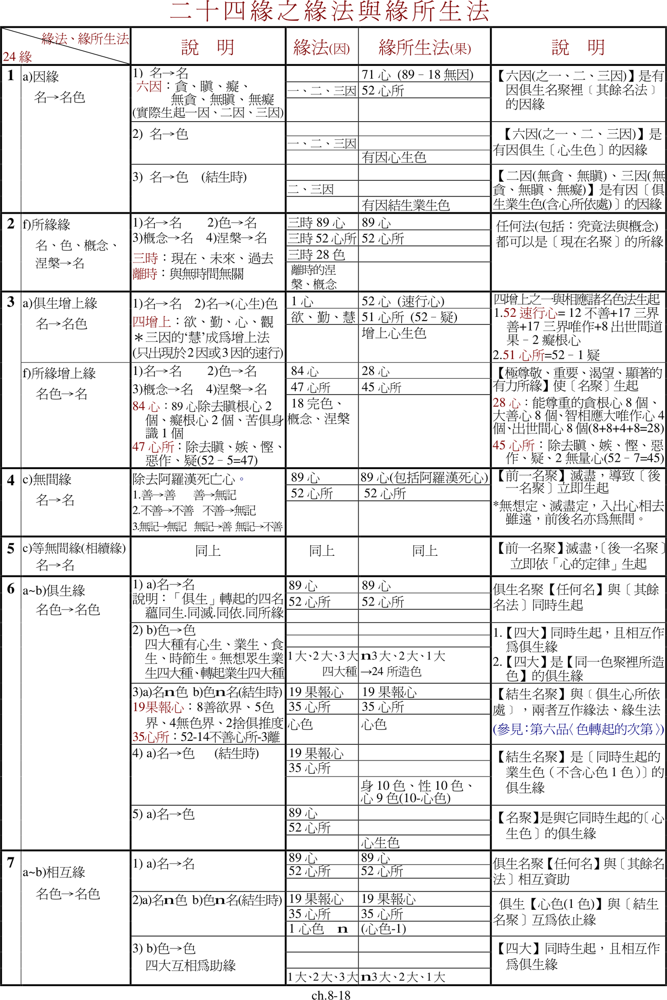

📅 最近更新：2026-09-22 17:18　|　学员版（第三版修订）

# 第8周：有缘、无有缘、离去缘、不离去缘＋整合实修（学员版）

>
> 欢迎各位。八周了。我们从二十四缘的总框架出发，一组一组看过来：因缘、所缘缘、增上缘；无间缘、等无间缘、俱生缘；相互缘、依止缘、亲依止缘；前生缘、后生缘、重复缘；业缘、异熟缘；相应缘、不相应缘、食缘、根缘、禅那缘、道缘……今天，我们走到**最后四缘**——**有缘、无有缘、离去缘、不离去缘**。
>
> 这四缘很特别：它们看起来**两两相反**（有／无有、离去／不离去），其实成对出现、缺一不可。佛陀把它们放在二十四缘的**最后**，不是随手一放，而是给整个缘力体系作一个**总结性的交代**——对「有」和「无」、「常」和「断」，给一个不堕两边的答案。
>
> 今天我们不追求读得多，只求**收得稳**。前半段，我们把最后四缘一个个看清；后半段，我们把八周所学**落回到四念处**——因为二十四缘若不落到当下这一念的观察上，就只是名词。看清这一条线，你会明白：所谓「缘观」，不是多背一套理论，而是**在身、受、心、法里，如实看到因缘和合**。
>

## 📋 本周信息卡

| 项目 | 内容 |
|---|---|
| 时长 | 120 分钟（静心 10 ＋ 共读 25 ＋ 分享 20 ＋ 讨论 35 ＋ 禅修 15 ＋ 收尾 15） |
| 核心问题 | 「有」与「无」、「常」与「断」，二十四缘最后四缘如何同时破除？八周所学，怎样落回四念处的当下观察？ |
| 共读原文提要 | ①第019讲「有缘/不离去缘·无有缘/离去缘·四缘破常见断见·中道总结」；②第60讲「诸缘分组方法·56缘」；③第20讲「缘力总表·帕奥九组总回顾」；④第81讲「十二缘起的杂论·引言」；⑤发趣论-4「结构·缘力」；⑥清净道论-2「四念处·把握名色之缘·整合」；⑦第58讲「有缘/不离去缘·色食色命根详释」（补） |
| 本周作业 | 做一周「缘观小记」：每天挑一个当下的片段（一次呼吸、一个情绪、一个念头），只写两行——「此刻发生了什么」「它依什么缘而起」；不评价、不求结论，写满七天即可 |

## 🧘 静心开场（10 min）

> 💬 **破冰｜3–5分钟**：最后一次。安静下来，感觉有东西正在来、也有东西正在走，而此刻你就在这里。说一句此刻的感受，说完就停。

> 🛡️ **心理安全三约定**（每次开场在心里过一遍）：① **保密**——这里说的话不出这间屋子；② **不评判**——不评价任何人的分享，也不急着评价自己；③ **可随时暂停**——任何时候觉得不舒服，都可以停下来休息、喝水或离开，不需要解释。

**（0–3 min）坐定、放松。** 请调整姿势，坐稳，肩放松，手放好。轻轻闭上眼睛，或半垂眼帘。做三次深长的呼吸：吸气——知道自己在吸气；呼气——知道自己在呼气。不必急着「入定」，只是让身体先坐下来。感受一下：身体与椅子接触的那几处，多一点重量，也多一点踏实。今天是我们八周的最后一次，坐下来的时候，也可以顺便在心里对八周来的自己说一声：辛苦了。

**（3–8 min）入出息念。** 把注意力放到鼻端、上唇一带，只是知道「吸气、呼气」。心跑了，不责怪，轻轻带回来。这 5 分钟不求什么成就，只是让身与心先安住下来。你会发现：当我们不去「制造」什么的时候，身心本身就是可以安静下来的——记住这个感觉，今天的「缘观」就从这里起步。

**（8–10 min）一句定调。** 在静默里，我们只记住一句话，今天从头到尾都会回到它：**「不堕二边，缘中安住。」** 请在心里默念三遍。念的时候，不要求它「灵验」，只是让它成为今天的一个方向标。

**（补充台词，可供照读）**：「接下来这两个多小时，我们只做一件事：把八周学过的二十四缘，收束成当下能用的四个字——安住、观察。你不需要相信任何结论，你只需要跟着读、跟着想、跟着感受。今天不考你，也不催你。」

**（可选·加长版，时间富余时用）**：如果现场安静、时间宽裕，可以把入出息延长到 8–10 分钟，再补一小段慈心，照读：「先愿自己安稳——愿我平安、愿我健康、愿我远离苦恼；再把这份愿，送给右手边的人、左手边的人、在场的每一位；最后送给八周来一直陪着你坐在这里的那个人——你自己。愿你也安稳。」慈心不必「有感」，只是发出去。

**开场氛围营造（可选）**
- 若场地允许，可在开场前于中央留一盏小灯或一朵花，不必解释，只让空间有一点「收束」的意味。
- 若成员陆续到场，不必催；人到齐七七八八即可开始，早到的人正好借此静一静。

**静心引导·加长照读稿（时间富余时逐句照读）**
「请找一个舒服的坐姿，背挺直，但不僵。手放在腿上，轻轻闭上眼睛。
现在，把注意力放在呼吸上。不用控制它，只是知道：吸气，呼气；吸气，呼气。
如果发现自己走神了，没关系，这不是错误，只是心在动。轻轻把它带回呼吸。
现在，让呼吸自然一些。你可以数息：吸—呼，一；吸—呼，二……数到十，再从一开始。
（约三分钟后）
现在，把注意力从呼吸，放到整个身体：从头到脚，轻轻扫一遍。哪里有紧绷，就在那里放松一下；肩膀、下巴、眉心，都松一松。
（约两分钟后）
最后，我们记住今天的一句话：**不堕二边，缘中安住**。在心里默念三遍。念完，慢慢睁开眼睛。」

**静心与共读的衔接台词（照读）**：我们刚才做的，其实就是「身念处」的起步——知道自己在呼吸，知道身体安住。接下来共读，我们会发现：连这个「知道」，也是依缘而起的。

**静心时段常见状况与应对**
- 有人频频睁眼、坐不住：不点破，只放慢引导语速；把「入出息」缩短，早一点进入定调。
- 有人情绪起伏（叹气、抹泪）：不特别关注，给予空间；结束后如需要，私下递一张纸巾。
- 全场很静、很沉：顺应它，不要急着开口，把留白延长 30 秒——静，本身就是很好的开场。
- 有人迟到进门：不打断，不引人注目，示意他安静入座即可；不要求补做前面的静心。

---

## 📖 共读原文（25 min）

> **【本周朗读段 · 开始】**（本段约 3632 字，供中等稍慢朗读，约 21 分钟；其余为默读／选读／延伸内容）

- 材料①：「『在』有它的缘力，『不在』也有它的缘力——这就是不堕二边。」
- 材料①：「前一个完全不存在，却恰恰以这个『不存在』，让下一个生起——相续，不是有一根线串着。」
- 材料②：「分组不是为了多背，是为了看清——原来这些缘，彼此是成套出现的。」
- 材料③：「二十四个缘，就是二十四面镜子，照的是同一个当下。」
- 材料④：「缘，不是孤立的零件，是一整台在转的机器。」
- 材料⑤：「二十四个缘不是谁发明的分类，是佛陀在《发趣论》里一条一条审察出来的。」
- 材料⑥：「观察身、受、心、法时，顺带知道『它依缘起』——这就是缘观。」

**共读控时建议（照骨架执行，30 分钟）**
- 材料①：8 分钟（核心，读全）｜材料②：4 分钟（挑读「分组总述」＋「56缘注」）｜材料③：5 分钟（总回顾，读缘力总表＋九组）
- 材料④：3 分钟（背景，点读引言）｜材料⑤：3 分钟（点读「数法」一句）｜材料⑥：7 分钟（整合，读关键三段）
- 合计约 30 分钟。**不够时先砍④⑤**（背景材料），保住①③⑥。

**读后衔接台词（照读）**：六段读下来，我们会发现——前面七周学过的每一个缘，今天都在这四缘里「收了一次口」。接下来，请大家用几分钟，分享这几段里最触动你的一句。

**材料①** ★核心：《古源尊者24缘释义第019讲-有缘、无有缘、离去缘、不离去缘》
- 文件类型：pdf
- 知识库出处：古源尊者开示及上座部佛教资料
-
- 打开方式：ima 知识库搜索「24缘释义 019 有缘 无有缘 离去缘 不离去缘」

> 照录原文（fetch 经整理返回，保留 `[generated, not original text]` 标注）：
>
> **一、有缘与不离去缘**
>
> **1. 定义与缘力作用**
>
> 有缘是指缘法以存在的缘力缘助缘所生法生起。缘法和缘所生法两者在时间上有重叠，即有同时存在的时刻。在这重叠的期间，缘法以有缘的缘力支助缘所生法生起、存在。古代的论师说：“由于高山的存在，树木才能在上面生长而形成茂盛翠绿的森林。同样地，缘法对缘所生法以五种有缘为支助力量。”因此，有缘是强调缘法对缘所生法以同时存在的方式来支助的一种缘力。
>
> 不离去缘是指缘法只要尚未灭去，就能够以不离去缘的缘力，对缘所生法起到支助的作用。古代论师比喻说：“犹如海洋里的水栖动物由于海洋的支助而愉悦。一旦被渔夫抓离海洋，它们就失去了海洋的支助。同样地，在一个心识刹那的生、住、灭三个阶段中，只要还没有灭去，缘法就能起支助的力量。”
>
> **2. 五种分类（概括）**
>
> 所以，概括在一起，有缘和不离去缘分为以下五种：
> 一. 俱生有缘/俱生不离去缘
> 二. 前生有缘/前生不离去缘（1. 所缘前生 2. 依处前生 3. 依处所缘前生）
> 三. 后生有缘/后生不离去缘
> 四. 色食有缘/色食不离去缘
> 五. 色命根有缘/色命根不离去缘
>
> **3. 各分类的缘法、缘所生法、缘力（三分法原文）**
>
> - 俱生有缘/俱生不离去缘（与俱生缘同内容，仅缘力异）：四种非色蕴互相以有缘/不离去缘为缘。……四大种互相以有缘/不离去缘为缘。……入胎刹那的名色互相以有缘/不离去缘为缘。……诸心、心所法对由心而生起的诸色以有缘/不离去缘为缘。……大种对诸所造色以有缘/不离去缘为缘。
> - 所缘前生有缘/不离去缘（色→名）：缘法为色处、声处、香处、味处、触处；缘所生法为眼识界、耳识界、鼻识界、舌识界、身识界及其相应诸法，以及意界及其相应诸法。
> - 依处前生有缘/不离去缘（色→名）：缘法为眼处、耳处、鼻处、舌处、身处及心处；缘所生法为眼识、耳识、鼻识、舌识、身识及属于意界和意识界的七十五种名聚。
> - 依处所缘前生有缘/不离去缘（色→名）：缘法为心处色；缘所生法为四十一种欲界的意门名聚、两种神通名聚。
> - 后生有缘/后生不离去缘（名→色）：缘法为在五蕴地的生命期间，之后生起的四种名蕴——八十五种心（不包括四种无色界果报心）及五十二种心所；缘所生法为在这个心识生起之前已生起并达到住时的色法，包括组成这个身体的所有色法。
> - 色食有缘/色食不离去缘（色→色）：缘法为由业、心、时节与食物四因所生的食素；缘所生法为由四因所生的色法，包括（1）同一个色聚里的色法但不包括食素，（2）不同色聚里的色法。
> - 色命根有缘/色命根不离去缘（色→色）：缘法为业生色聚里的命根色；缘所生法为同一业生色聚里的其余色法。
>
> **4. 有缘与不离去缘破除常见、断见（原文段落）**
>
> 由此可见，有缘代表生命不是像一般人所理解的“人死如灯灭”，死后一切都灭绝。有缘不仅破除断见，某种程度上它也破除常见。有缘发挥其缘力的条件是：当缘法和缘所生法两者重叠存在的时候，缘法以有缘的缘力，缘助缘所生法生起或存续。如果缘法与缘所生法没有重叠存在的时候，就不会存在有缘。所以，这从一个侧面反映了缘法与缘所生法并不是恒常存在的，它们生起，然后在存续的期间产生交叉，又灭去。因此说，有缘也破除常见。
>
> 不离去缘最主要是破除缘法和缘所生法的无关联性。缘法与缘所生法当中一个生起时，另一个尚未灭去，就能够以不离去缘的缘力，对缘所生法起到支助的作用。例如，眼睛看到、耳朵听到、鼻子闻到、舌头尝到，这是果报。所缘只要不离去，对后面的整条五门心路过程乃至随彼起的意门心路过程的支助就会持续存在。我们看，五门所缘的出现其实是过去业产生的果报。换言之，只要过去的业还存在，还能够继续产生果报，它就有不离去缘作用、有不离去的特点，我们就会不断地处在受报的状态中。这也是不离去的一种角度。
>
> **二、无有缘和离去缘**
>
> **1. 定义与缘力作用（原文浅释）**
>
> 我们先看无有缘。无有缘以完全不存在来支助新的缘所生法生起，而有缘是以存在来支助缘所生法生起；而且，有缘可以分属于俱生组、前生组、后生组等，无有缘则属于无间组。它们缘力的角度非常不同。
>
> 古代的论师比喻说：“犹如灯光熄灭之后，黑暗随即显现。同样地，当之前的心识刹那经过了生、住、灭三个阶段之后，它的不存在支助下一个心识刹那生起。”又或者说，如果一个人坐在椅子上，只要他没有离开，别人就没法来坐；当这人离开后，椅子空出来了，其他人就可以来坐。这就是无有缘的特点，前一个心识刹那以它的不存在自然地支持下一个心识刹那生起。
>
> 接下来我们看离去缘。离去缘是指缘法在即将灭去、即将离开的时候，支助缘所生法生起，而无有缘是缘法完全灭去才能缘助缘所生法生起。举例而言，离去缘的情形就如同一个人坐在凳子上，然后招呼另一个人，说：“来，过来坐在我这儿。我马上就走，我走了你就坐我的凳子。”亦即，他要离开了，把另一个人拉过来坐在他的凳子上。
>
> **2. 经文表解与三分法**
>
> | |22. 无有缘广释 (natthi paccaya) |23. 离去缘广释 (vigata paccaya) |
> |---|---|---|
> |经文|等无间灭去的诸心、心所法对现在的诸心、心所法以无有缘为缘。|等无间离去的诸心、心所法对现在的诸心、心所法以离去缘为缘。|
> |表解|前一名聚以不存在的缘力缘助后一名聚在它灭去后，立即生起。|前一名聚以离去的缘力缘助后一名聚在它灭去后，立即生起。|
>
> 无有缘、离去缘的缘法对缘所生法为“名聚→名聚”，三分法是：缘法为前一名聚，包括所有八十九种心（阿拉汉死心除外）以及五十二种心所；缘所生法为后一名聚，包括所有八十九种心（包括阿拉汉死心）以及五十二种心所；缘力为前一名聚以不存在的缘力、离去的缘力缘助后一名聚在它灭去后，立即生起。

> **【本周朗读段 · 结束】**（以下为默读／选读／延伸内容，时间富余时再读）
>
> **3. 无有缘与离去缘破除常见、断见（原文段落）**
>
> 如果有人认为有缘的“有”指的是常见，生死轮回中有一个恒常不变的“我”从一生“迁居”到下一生，那是错的。为什么？这从无有缘的描述中也能清晰看到。“无有”指的是前一个以它的不存在、以无有缘的缘力推动、支助后一个生起。诸行法中没有任何一种是常存不变的，它们都是“无有”的，是刹那刹那生灭的。对于离去缘，也可以用类似的方式来理解。
>
> 无有缘的缘力本身也是破除断见的。为什么？无有缘是指前一名聚以它完全不存在的缘力，支助后一名聚生起。通俗地说：“我完全不存在，但这生命并没有断绝，我以我的不存在来支助下一个生命生起。”这生命的相续流是刹那生灭的，却不是断绝、割裂的。以死心来说明这个过程就很好理解。一般人认为，人死如灯灭，一切都断灭。然而，当生命的最后一个心——死心灭去后，它会以它完全不存在的缘力缘助下一生的结生心生起。只要这不是阿拉汉的死心，它就必定具有这个缘力，能够支助下一生的结生心无间、等无间地生起。
>
> 离去缘则是指，前一名聚在生、住、灭快接近完成的时候，就会发出这样一种支助后一名聚生起的力量，也就是说，死心快灭去、要彻底离去时就有力量令下一期生命的结生心在它灭后无间、等无间地生起。
>
> 所以，无有缘与离去缘同样既破除常见，也破除断见。
>
> **三、四缘总摄与中道总结**
>
> 从另一个角度来看，有缘和不离去缘从字面上考量，容易让人觉得蕴含着“恒常”、“不灭”之义；而无有缘和离去缘则是“不存在”、“已离去”的直白呈现。因此某种程度上可以说，有缘、不离去缘、无有缘和离去缘，它们又代表佛陀观察所有的因缘所生法都不堕两边、践行中道，如实看到它们是缘起的，得到诸缘缘力的支助。……佛陀把有缘、无有缘、离去缘、不离去缘安立为二十四缘的最后四个缘，还有一个很深的含义——对于“有”和“无”、“常”和“断”作一个总结性的论述。

**材料②** ★核心：《第60讲-摄缘-十二缘起与二十四缘-路心的缘-诸缘的分组方法》
- 文件类型：pdf
- 知识库出处：古源尊者开示及上座部佛教资料
-
- 打开方式：ima 知识库搜索「第60讲 摄缘 路心的缘 诸缘的分组方法」
- ⚠️ 素材说明：任务原指定同讲版本 media_id `pdf_d0dd1c0cd17209afe241ece24bf6b7b4_680fc50f9dbcb54df9f50b0a78021d71743996142231605` 经 fetch 返回「Resource does not exist」，不可取证，故改用同讲另一版本（本 id，全新未用），主题与文字一致。

> 照录原文（fetch 经整理返回，保留 `[generated, not original text]` 标注）：
>
> **一、二十四缘的分组（总述）**
>
> 雷迪西亚多把它们分为六组五十四缘，阿耨楼陀尊者有他的六分法，帕奥西亚多则采用九组五十二缘的分法。对此，我们在这里简单作些说明。
>
> **雷迪西亚多对诸缘的分类法**
>
> 雷迪西亚多把诸缘分为五十四缘，其中的四十九种归纳为六组，余下五种未纳入分类。
> - 俱生组15缘：大俱生4缘（俱生缘、俱生依止缘、俱生有缘、俱生不离去缘）；中俱生4缘（相互缘、果报缘、相应缘、俱生不相应缘）；小俱生7缘（因缘、俱生增上缘、俱生业缘、俱生食缘、俱生根缘、禅那缘、道缘）。
> - 前生组17缘：依处前生6缘（依处前生缘、依处前生依止缘、依处前生根缘、依处前生不相应缘、依处前生有缘、依处前生不离去缘）；所缘前生6缘（所缘前生缘、(部分)所缘缘、(部分)所缘增上缘、(部分)所缘亲依止缘、所缘前生有缘、所缘前生不离去缘）；依处前生5缘（依处所缘前生缘、依处所缘前生依止缘、依处所缘前生不相应缘、依处所缘前生有缘、依处所缘前生不离去缘）。
> - 色食组3缘：色食缘、色食有缘、色食不离去缘。
> - 色命根组3缘：色命根缘、色命根有缘、色命根不离去缘。
> - 无间组7缘：无间缘、等无间缘、无间亲依止缘、重复缘、无间业缘、无有缘、离去缘。
> - 未纳入分类5缘：(其余的)所缘缘、(其余的)所缘增上缘、(其余的)所缘亲依止缘、(所有的)自然亲依止缘、(其余的)异刹那业缘。
>
> **阿耨楼陀尊者对诸缘的分类法**
>
> 《表解》中说，在《摄阿毗达摩义论》里，阿耨楼陀尊者并未依照《发趣论》原有的顺序，逐条解说每一缘，而是将缘法与缘所生法归纳成六组：(1)“名法”作为“名法”的缘，名→名；(2)“名法”作为“名色法”的缘，名→名色；(3)“名法”作为“色法”的缘，名→色；(4)“色法”作为“名法”的缘，色→名；(5)“名色法”作为“名法”的缘，名色→名；(6)“名色法”作为“名色法”的缘，名色→名色。
>
> **帕奥西亚多所采用的诸缘分类法——九组五十二缘**
>
> 帕奥西亚多采用的是玛索因西亚多(Masoyein Sayadaw)的诸缘分类法。帕奥西亚多在《辨识发趣诸缘》(Discerning Paṭṭhāna Conditions)中说：“玛索因西亚多所著的《发趣概要》(Brief Extract On Paṭṭhāna)将相似的诸缘分组归纳在一起来阐释发趣法。兹依照书中所述在下面列出。以下所列各组是根据组内的每种缘在缘法、缘所生法以及两者在时间关联上(俱生或异时)的共有特性而得出的。依照这些特性的相似性，诸缘可以分为如下九组。”
>
> - 俱生组15缘：大俱生4缘（俱生缘、依止缘、有缘、不离去缘）；中俱生4缘（相互缘、果报缘、相应缘、不相应缘）；小俱生7缘（因缘、增上缘、业缘、食缘、根缘、禅那缘、道缘）。
> - 所缘组11缘：所缘缘、所缘增上缘、所缘亲依止缘、依处所缘前生依止缘、依处所缘前生缘、依处所缘前生不相应缘、依处所缘前生有缘、依处所缘前生不离去缘、所缘前生缘、所缘前生有缘、所缘前生不离去缘。
> - 无间组7缘：无间缘、等无间缘、无间亲依止缘、无有缘、离去缘、重复缘、无间业缘。
> - 依处前生组6缘：依处前生依止缘、依处前生缘、依处前生不相应缘、依处前生有缘、依处前生不离去缘、依处前生根缘。
> - 后生组4缘：后生缘、后生不相应缘、后生有缘、后生不离去缘。
> - 异刹那业组6缘：异刹那业缘、无间(业)缘、等无间(业)缘、无有缘、离去缘、亲依止缘。
> - 色食组3缘：色食缘、色食有缘、色食不离去缘。
> - 色命根组3缘：色命根缘、色命根有缘、色命根不离去缘。
> - 自然亲依止组1缘：自然亲依止缘。
>
> **关于“五十六缘”的明确原文**
>
> 注：以上共列出九组五十六缘，但“异刹那业组”中的无间(业)缘、等无间(业)缘、无有缘和离去缘在“无间组”中已出现过，扣除了这出现两次的四种缘，实为九组五十二缘。

**材料③** ★核心：《古源尊者24缘释义第20讲-24缘总说》
- 文件类型：pdf
- 知识库出处：古源尊者开示及上座部佛教资料
-
- 打开方式：ima 知识库搜索「古源尊者24缘释义第20讲 24缘总说」
- ⚠️ 共用说明：本文件**与读书会12第1周同文件不同章节**——第1周取〈各家分类法（雷迪西亚多/阿耨楼陀/明法/帕奥）与〈结语〉〉；本讲取〈缘法·缘所生法·缘力三要素总表〉与〈帕奥九组分类总表〉，作为全系列收束处之「整体回顾」锚点。如被成员问及，照此说明即可。

> 照录原文（fetch 经整理返回，保留 `[generated, not original text]` 标注）：
>
> 我们的生命其实就是名法、色法、缘力这三个要素以二十四种方式有效地组合在一起。如下图所示（《表解》（ch.8-18））：

> 🖼 **课件原图**（《表解》ch.8-18「二十四缘之缘法与缘所生法」）：
>

>
> | — | — |
> |---|---|
> | 缘法 | 89心、52心所、28色、涅槃、概念 |
> | 缘所生法 | 89心、52心所、28色 |
> | 缘力 | 1. 因的缘力，2. 所缘的缘力，3. 增上的缘力，4. 无间的缘力，5. 等无间的缘力，6. 俱生的缘力，7. 相互的缘力，8. 依止的缘力，9. 亲依止的缘力，10. 前生的缘力，11. 后生的缘力，12. 重复的缘力，13. 业的缘力，14. 果报的缘力，15. 食的缘力，16. 根的缘力，17. 禅那的缘力，18. 道的缘力，19. 相应的缘力，20. 不相应的缘力，21. 有的缘力，22. 无有的缘力，23. 离去的缘力，24. 不离去的缘力。 |
>
> 帕奥西亚多九组分类（总回顾）：俱生组15缘、所缘组11缘、无间组7缘、依处组6缘、后生组4缘、异刹那6缘、色食组3缘、色命根组3缘、自然亲依止组1缘，共列九组五十六缘；扣除「异刹那业组」中重复出现的无间（业）缘、无有缘、离去缘三种，实为九组五十三缘（《第60讲》版本作「去重为五十二缘」，两讲略有出入，如实并录）。
>
> 结语（回顾）：我们知道，世间所有的人、事、物都是因缘和合的……通过有效地运用二十四缘的各种缘力，最后，我们将有能力消除所有的缘力，令所有的缘力不再发生作用——证悟无余涅槃。愿大家都能够依着二十四缘的修学，早日证悟涅槃！萨度！萨度！萨度！

**材料④** ◈扩展：《第81讲-摄缘-十二缘起与二十四缘-十二缘起的杂论》
- 文件类型：docx
- 知识库出处：古源尊者开示及上座部佛教资料
-
- 打开方式：ima 知识库搜索「第81讲 摄缘 十二缘起的杂论」
- ⚠️ 素材说明：本文件为读书会12系列自有素材；经 `grep -F -x` 比对，未被读书会01-10资料包实际照录。**本周不逐支详讲十二缘起，详支留予读书会11。**

> 照录原文（fetch 经整理返回，保留 `[generated, not original text]` 标注）：
>
> 好，接下来我们继续来学习《清净道论》的缘起品，就是缘起的部分。我们前面已经把十二个缘起支学习完，以及十二个缘起支之间的缘，二十四缘也学了一遍。接下来学习十二缘起的杂论。
>
> 根据《清净道论》，它说：“因为在这个缘起教说中，最后说愁、悲、苦、忧、恼。所以在彼有轮的开始如此说：‘无明为无明故，缘行。’无明因愁等而成就，此有轮不知始等。无有作者与受者，以十二空而空无。当如此了知有轮持续不断的转起。”
>
> 受生灭的逼迫，故从“乐性”上空，所以破乐相。在你如实看到你的每一天的行为，其实就是因为无明、爱、取在逼迫，推着你去做你在追求的感官上的娱乐——边际效应递减——在“乐”上它是空的，它没有乐，它都是苦。所以破乐相。依赖自己之缘而生起，故从“作为自我的我性”上空，所以无我，破我想。
>
> 那也就是说，从究竟意义上来讲，在三有的轮转中，没有所谓的造作者，也没有所谓的承受者的这样一种实体存在。……修缘起的同学，他们就深刻地体会到，其实生命就是这样十二缘起支。
>
> 《清净道论》回答说：这并不是“唯无明为始论”。事实上，这是宣说“无明为首要法”。……于这缘起教说中，应先如此了知：无明因愁等而成就，无明成就了又会引发新的有漏行。也就是再再一次地让我们明白，十二缘起支这个闭环的形成。

**材料⑤** ◈扩展：《发趣论-4》
- 文件类型：pdf
- 知识库出处：古源尊者开示及上座部佛教资料
-
- 打开方式：ima 知识库搜索「发趣论-4」

> 照录原文（fetch 经整理返回，保留 `[generated, not original text]` 标注）：
>
> 4. 因缘有九，所缘缘有九，增上缘有九，无间缘有九，等无间缘有九（一切处有九），异熟缘有一……乃至……不离缘有九。
>
> 因缘、所缘缘、增上缘、无间缘、等无间缘、俱生缘、相互缘、依止缘、亲依止缘、前生缘、后生缘、修习缘、业缘、异熟缘、食缘、根缘、禅缘、道缘、相应缘、不相应缘、存在缘、非有缘、离去缘、不离缘，合为二十四缘。
>
> （结构科判）十二·烦恼品 → 七十五.烦恼二法 → 缘起分 → 顺缘门 → 分别章 → 因缘（二.以非烦恼法为缘…三.以烦恼法与非烦恼法为缘…）→ 1.顺缘分 → 2.数法门（因缘有九…不离缘有九）→ 2.缘逆分（非因缘四…非离去缘三）→ …… → 法顺二法门缘起终。→ （最终）因集已毕，烦恼集终。
>
> （缘力·示例）19. 烦恼法以增上缘支持烦恼法。所缘增上——重视烦恼故生起烦恼……非烦恼法以增上缘支持非烦恼法——所缘增上，俱生增上。所缘增上——布施……持戒……斋戒时重视所缘，观察、欣悦、欢喜，因重视而生贪爱、生邪见；……俱生增上——非烦恼增上对相应蕴及心所生色以增上缘为缘。
>
> （缘观·示例）18. 非烦恼法是非烦恼法的所缘缘条件——布施……持戒……布萨业……往昔善行……从禅定出已，观察禅定、尝味禅定、欣悦禅定，缘此而生贪……见……疑……掉举……忧；圣道出已……果，作意时以所缘为条件。
> 314. 导向解脱的法以所缘缘支持不导向解脱的法——圣者出定后观察道，以他心智了知具导向解脱心者的心……涅槃以所缘缘支持道。332. 定法以增上缘为定法…圣者从道出已，珍重观察圣道。俱生增上——定增上对于心所生色以增上缘为缘。

**材料⑥** ◈扩展（整合实修）：《清净道论-2》
- 文件类型：pdf
- 知识库出处：古源尊者开示及上座部佛教资料
-
- 打开方式：ima 知识库搜索「清净道论-2」
- ⚠️ 定位：本周**整合实修**的主材料，把八周所学落回四念处与「缘观」。

> 照录原文（fetch 经整理返回，保留 `[generated, not original text]` 标注）：
>
> **1. 四念处的定义与修习方式（觉支章第819段）**
>
> 于诸所缘境中踊跃投入、精勤修习，从一处安住至另一处安住。唯念为安住，即念住。于身、受、心、法中，通过观察不净、苦、无常、无我之相，及断除净、乐、常、我之想的作用，故分为四种。因此称为四念住。
>
> **2. 世间观智前行中四念处的成就方式（觉支章第824段）**
>
> 如是这三十七菩提分法，在世间观智的前行阶段运作时：以十四种方式观察身体而成就身随观念处，以九种方式观察感受而成就受随观念处，以十六种方式观察心而成就心随观念处，以五种方式观察法而成就法随观念处。当于此身见他人已生而自己未生的不善法时，思惟“他人因如是行道故生此不善，我不应如是行道，则此不善法于我身不生”，为令不生而精进时，是初正勤。见自己已生不善法时，为断除而精进时，是第二正勤。于此身为生起未生之禅定或观智而精进时，是第三正勤。为使已生善法不退失而不断令其增长时，是第四正勤。以欲为动力生起善法时，是欲神足。离邪语时，是正语。如是种种心所可得。然此四智生起时，可于一心中得。除果刹那外，其余三十三法皆可得。
>
> **3. 观察缘起（把握名色之缘）以超越疑惑（度疑清净释第678–681段）**
>
> 通过把握此名色之缘，超越三世疑惑而住之智，名为度疑清净。欲成就此之比库，犹如良医见病而寻其起因；又如悲悯者见幼童仰卧路中，思惟“此是谁家子”，即忆念其父母。如是，彼亦寻求此名色之因缘。
>
> 彼最初即如是思惟：“此名色非无因，因一切时处皆具平等性故；亦非自在天等为因，因名色之上无自在天等故。……故必须寻求其因缘，此因缘为何？”
>
> 他如是观察名色之因缘后，首先如此把握色身之因缘：“……此身形成时，‘无明、爱、取、业’这四法作为生起因是为因，食物作为支持是为缘，如是五法构成因缘。其中无明等三者对此身而言，犹如幼童依赖母亲；业力则如父亲生子；食物则如乳母养育婴儿。”如是把握色身之缘起后，复以“缘眼与色而生眼识”等（相应部2.43）方式把握名色之缘起。他如是依缘观察名色相续，见如今生如此，过去世亦依缘相续，未来世亦将依缘相续。
>
> **4. 四念处与缘起观察在“道非道智见清净”中的整合（第736段）**
>
> 如此，当行者远离散乱，解开那三十三种烦恼的缠结，明白光明等法并非正道。而解脱于烦恼、行于正道的观智，才是真正的道。此智能分辨道与非道。如是，行者了知“此是道，此非道”，安住于这种智慧，即称为“道非道智见清净”。如此，他即已确立了三种真理。如何确立呢？首先，在见解清净中，通过确立名色，确立了苦谛。在疑惑破除清净中，通过把握因缘，确立了集谛。在此道非道知见清净中，通过确定正道，确立了道谛。如是，仅以世间智即已确立了三种真理。
>
> **5. 三十七菩提分与缘起观智的前行整合（觉支章第818段）**
>
> 此中“圆满觉支力，修习”指觉支的圆满成就。四念处、四正勤、四神足、五根、五力、七觉支、圣八支道——这三十七法，因能导向觉悟故称为菩提分，由于属于圣道支分故名为觉支。

---

**材料⑦** ◈扩展（整合实修·检索补齐）：《第58讲-摄缘-十二缘起与二十四缘-无有缘与离去缘》
- 文件类型：pdf
- 知识库出处：古源尊者开示及上座部佛教资料
-
- 打开方式：ima 知识库搜索「第58讲 摄缘 无有缘与离去缘」
- ⚠️ 素材说明：本周检索补齐材料（经 `grep -F -x` 比对禁用清单 0 命中），补材料①之未尽；时间不足时可整段跳读。

> 照录原文（fetch 经整理返回，保留 `[generated, not original text]` 标注）：
>
> 色食有缘/不离去缘类似于色食缘，只是缘力不同。……由上述过程可知，食素也以它的存在、不离去，即以有缘、不离去缘的缘力滋养和维持着这个身体，这就是色食有缘/色食不离去缘所指。……在此，有三种缘的力量完全一起产生作用，它们是食缘、有缘、不离去缘。
>
> 色命根缘即业生色聚里的命根色以色命根的缘力，维持同一业生色聚里的其余色法的生命而控制它。……这类似于只要我在、不离开，你就能活着。……换言之，我们之所以还活着，有赖于色命根缘、色命根有缘和色命根不离去缘的支助。
>
> 其中，在二十四个缘中，大部分都与有缘和不离去缘一起产生作用。它们是：属于俱生组的十五个缘……再加上前生组里的所缘前生缘……和后生组的后生缘。

---

## 💬 第一轮分享（20 min）

**起手问题（任选 1–2 个）：**

1. 八周读下来，如果说二十四缘你只记住一句话，会是哪一句？为什么是它？
2. 「有缘」讲缘法存在时的支助，「无有缘」讲缘法不存在时的支助。这两种「支助」，哪一种让你更意外？你在生活里有没有体会过「因为某样东西不在了，事情反而成了」？
3. 回看这八周，你自己有没有一点点变化？（哪怕只是「以前不耐烦，现在能停一下」这样的小变化）——**注意：分享小变化即好，不必说「大的体验」。**
4. 八周里哪一次共读、哪一句话，让你回去之后还会想起？它后来有没有在某个生活场景里，忽然「对上号」？
5. 如果只给八周前的自己说一句话，你会说什么？（这一题很松，答「好好坐、别急」也可以。）

**分享人数与计时换算（≈10 人，25 分钟）**

| 每人时长 | 一轮人数 | 合计 | 结论 |
|---|---|---|---|
| 2 分钟 | 10 人 | 20 分钟 | 留 5 分钟缓冲，可加一轮追问 |
| 2.5 分钟 | 9 人 | 22.5 分钟 | 稍紧，宜提醒 |
| 3 分钟 | 8 人 | 24 分钟 | 满档，不再追加 |
| 1.5 分钟 | 10 人 | 15 分钟 | 富余，转「每人一句带走」 |

---

## 🎯 主题讨论（35 min）

**引导问题一：有缘 vs 无有缘——「存在支助」与「不存在支助」，为什么同时破常见、也破断见？**
- 提示：把两个极端摆在桌上——「人死如灯灭」（断见）与「有一个恒常的我从这一生搬到下一生」（常见）。请成员分别看：**有缘**如何破断见（缘法在，生命就不是彻底灭绝）？又如何破常见（缘法不恒在，生起、交叉、又灭去）？**无有缘**又怎么以「完全不存在」支助「下一个生起」，从而既非「没了」、也非「有个东西搬过去」？可以提醒：这里的「存在／不存在」讲的都是**缘法**本身的状态，不是讲一个「我」。
- 落点：**「不堕二边」不是和稀泥，而是：刹那生灭（破常见）而相续不断（破断见）。**

**引导问题二：离去缘 / 不离去缘——「即将离去」与「尚未离去」，日常里在哪里看得到？**
- 提示：离去缘像「我马上走，你坐我的位子」；不离去缘像「只要我还在，座位就一直托着你」。请成员在**日常**里找一个例子：一个念头让位给下一个念头；一种情绪（如生气）还没散去时，它如何一直影响后面整串反应；或身体的姿势如何一直支撑着当下的感受。不必谈玄，谈今天发生的事最好。
- 落点：**相续，不是有一根线串着，而是「前一个腾出位置、后一个接上」。**

**引导问题三（核心·整合实修）：二十四缘怎样落回四念处？「缘观」是不是又一套要背的理论？**
- 提示：先破一个误解——「缘观」不是打坐时去数「这是因缘、那是所缘缘」。而是在观察**身、受、心、法**的当下，**顺带看到它们都是「依缘而起」**：这一口气依什么而来？这个不舒服依什么而来？这个念头依什么冒出来？看清「它依缘起」，就已经在「缘观」。
- 落点：**《清净道论》的话——「通过把握此名色之缘……确立三种真理」。二十四缘不是名词，是观察的视角。** 收在定调词：「不堕二边，缘中安住。」

**引导问题四（可选·收束）：既然一切都依缘，那「命」是不是注定的？**
- 提示：这是八周反复回到的问题。请成员一起看：过去所造的缘，决定的是「起点与倾向」；而**当下**的作意、选择、努力，是新的缘。所以「缘起非宿命论」——过去缘决定起点，当下缘力可转；命途非注定。用四缘收尾的话说：正因为诸法是刹那生灭（非常）、又相续不断（非断），当下才始终留有「转」的余地。
- 落点：**在因上努力，在果上随缘；看得到缘，就做得了主。** 收在定调词：「不堕二边，缘中安住。」

**开场定调（照读）**：「今天这四题，不用都谈完。我们能在一起，把『有／无、常／断』这件事说清楚一点点，就够了。谁先说，都可以；不说，也可以听。这里没有老师考学生，只有同修互相听。」

**第一题展开（有缘／无有缘与常见、断见）**
- 可先请成员读材料①里两句直白的感觉——「人死如灯灭」与「有一个恒常的我从这一生搬到下一生」，问：「这两句，如果非要选一句更接近你的直觉，你会选哪句？」（不评判，只是热身）
- 再对照原文：**有缘**以「存在」支助缘所生法，**无有缘**以「不存在」支助新的缘所生法。请一位成员用自己的话复述一遍，其他人补充。
- 追问题（由浅入深）：①如果缘法「在」才支助，那它会「一直在」吗？②原文说缘法与缘所生法「生起、然后在存续的期间产生交叉，又灭去」——这说明什么？③既然如此，为什么说**有缘既破断见、也破常见**？
- 白话落点（可照读）：「好比两个人并肩走路：并肩的那一段，彼此扶持（有缘、不离去缘）；但并肩这件事不会永远持续；走着走着，一个人先走了（离去缘、无有缘），另一个人自己接着走。生命就是这样一段一段接续——没有一根不变的线，也不是走完就彻底没了。」
- 若有人追问「那到底有没有『我』」：温和答——「今天我们只谈**缘力**：诸法是刹那生灭而又相续的。至于『我』的深究，是更大的专题，先不展开，以免跑题。」

**第二题展开（离去缘／不离去缘的日常）**
- 请成员举「今天发生的一件事」为例，越具体越好（例如：早上一个念头起来，整天都受影响；或一句不中听的话，让人半天缓不过来）。
- 对照原文：**不离去缘**——「只要前一个还在、尚未灭去，它就一直托着后面」；**离去缘**——「前一个要走了，它把位置让给下一个」。可回扣材料①的椅子比喻：「人没走，别人没法坐；人一走，位子空出来，下一个才能坐。」
- 追问题：①一种情绪还没散时，它如何影响你后面一连串的话与决定？②当那口气终于『走了』，你的心是不是就能『接上』别的状态？
- 白话落点：「生气时你说的话、做的决定，都是被那口『还没散的气』托着走的；等气走了，你才发现刚才怎么那么冲动。这就是不离去缘与离去缘在日常里的样子。」

**第三题展开（整合实修·缘观）**
- 先澄清一个误会：「缘观」不是多一套功课，而是给现有的四念处**加一个视角**——在身、受、心、法的观察里，轻轻知道「它依缘而起」。
- 现场演示（约 30 秒）：请大家先觉知一次呼吸，然后轻轻问一句「这口气依什么而来」。**不要求答案，只要求「知道它依缘而起」。** 做完问：「难不难？」多数人会发现并不难。
- 追问题：①观察「身」的时候，能不能看到「身依缘起」？②观察一个不舒服的感受时，能不能看到它「也依缘起、也会散」？③如果一切依缘，那我们还需要努力吗？
- 白话落点：「看清缘，不是叫人消极，而是叫人不再硬拗、不再自我责怪——事情成了，是缘具足；没成，是缘未足。知道这个，心就松一半。」

**第四题展开（可选·缘起非宿命）**
- 用「种子」的比喻：过去缘像**已经播下的种子**（决定方向与倾向），当下缘力像**此刻的阳光、水、除草**（决定它怎么长、能不能转）。种子定了，不等于长势定了。
- 追问题：①「命定」和「缘定」，差别在哪？②如果当下缘力可转，你打算在哪一个「因」上，多使一点力？
- 白话落点：「**因上努力，果上随缘**——这八个字，就是二十四缘给我们日常的用法。」

**讨论收束语（照读）**：「四题谈到这里，我们把八周收成一句：**不堕二边，缘中安住**。看清缘，是为了更好地活——不是让你更用力，是让你更清楚。」

---

> **分层追问**（可视时间取用，由浅入深）：
> - 【现象】今天有什么正在你身边悄悄「离开」，又有什么仍然「还在」？
> - 【影响】看着这些来来去去，你更想抓住，还是更想松开？心里感觉如何？
> - 【应对】这周每天用三分钟，只观察一件正在来去的事，不插手、不评判。

## 🧘 禅修练习（15 min）

**（0–2 min）坐定。** 请坐稳，肩放松，手放好。轻轻闭眼或半垂眼帘。做三次深长的呼吸。

**（2–7 min）身念处＋缘观。** 把注意力放在鼻端、上唇一带，只是知道「吸气、呼气」。现在，加一点点「缘观」：这一口气为什么会来？——因为有这个身体，因为有空气，因为心还在运作。**不分析，只是在呼吸的同时，轻轻知道：它是依缘而起的。** 吸，知道「依缘而起」；呼，知道「依缘而起」。心跑了，不责怪，轻轻带回来。

**（7–12 min）受念处＋心念处＋缘观。** 现在，把觉知放宽到全身的感受：哪里有紧绷、有热、有痒、有舒适？选一处，轻轻看着它。再问一句（心里问，不必回答）：这个感受依什么缘而起？——也许是姿势，也许是刚才的一句话，也许只是一个念头。接着，看看此刻的心：是静，是散？或贪、或厌？同样轻轻知道：它也是依缘而起的。**看清「依缘而起」，就已经是缘观。**

**（深化·时间富余时加做，2–3 min）法念处＋缘观。** 最后，把觉知放到「法」上：轻轻回想今天读到的四个缘——有缘、无有缘、离去缘、不离去缘。不必背，只是体会：此刻这个「知道自己在呼吸」的觉知，也是依缘而起的；它生起，也会灭去；它灭去，也会再生起。它是相续的，却不是恒常的。让自己安住在这个「看到缘」的觉知里，一分钟，什么都不用做。

**（12–15 min）一句定调＋慈心。** 在这份安静里，我们把八周收成一句：**「不堕二边，缘中安住。」** 心里默念三遍。最后，把这份安静散播出去：愿我自己安稳，愿在座每一位安稳，愿一切众生安稳。慢慢睁开眼睛。

> ⚠️ **禅修禁忌提示**：若你正处在严重抑郁、焦虑、创伤后应激，或精神类疾病的发作／用药期，或正经历强烈的情绪危机，请先咨询医生或心理师，再决定是否练习；练习中若出现明显不适（如心悸、胸闷、情绪失控），请立即停止，睁开眼睛，把注意力放回呼吸与身体，必要时离场休息。

---

## 📚 扩展内容包（时间富余时使用）

**扩展一：二十四缘为什么以「四缘」收尾？**
用一句话带过即可：佛陀把有缘、无有缘、离去缘、不离去缘安在最后，是对「有／无」「常／断」作一个**总结性交代**——凡是因缘所生法，都「不堕两边」。这一段正好呼应八周开头「缘起非宿命论」的定调：过去缘决定起点，当下缘力可转。可以让成员回味一下：八周前和八周后，你对「命」这个字的感觉，有没有一点不同？

**扩展二：把缘观带回家（延伸阅读条目）**
- 材料：《古源尊者24缘释义第20讲-24缘总说》（九组总回顾）｜出处：古源尊者开示及上座部佛教资料｜｜说明：与读书会12第1周同文件不同章节。
- 材料：《清净道论-2》（四念处·把握名色之缘）｜出处：古源尊者开示及上座部佛教资料｜｜说明：整合实修之本。

**扩展三：八周缘力体系全串讲（收束用，约 3 分钟）**
- **总框架**：二十四缘由名法、色法、缘力三要素构成，可分九组、可扩五十六缘。
- **因缘**：六因（贪嗔痴／无贪无嗔无痴）如树根，支助有因心与俱生色法。
- **所缘缘**：六门取六所缘，心识依所缘而生起。
- **增上缘**：欲、精进、心、观四增上，令法强而有力。
- **无间缘·等无间缘**：前心灭，后心立即生，心相续不断。
- **俱生缘**：名色同时生起，互相支助。
- **相互缘**：名蕴互依、四大互依、入胎名色互依。
- **依止缘**：后者依前者而住（含前生依止）。
- **亲依止缘**：强而有力的前法，成为后法的依靠（有自然亲依止等三种）。
- **前生缘**：先生起的色／所缘，支助后生的名法。
- **后生缘**：后生的名法，支助先已生起的色身。
- **重复缘**：善法反复串习，力量倍增。
- **业缘**：思即是业，思业力促成结生与果报。
- **异熟缘**：果报成熟后，令果报名法平静安稳、不活跃。
- **食缘**：四食维系名色相续。
- **根缘**：诸根于各自领域增上。
- **禅那缘**：禅支令心专注安止。
- **道缘**：八正道支导向出离。
- **相应缘·不相应缘**：名名相融，名色并存。
- **有缘·不离去缘**：缘法存在／尚未灭去时，以「在」支助。
- **无有缘·离去缘**：缘法不存在／将离去时，以「不在」支助。

一句话总收：**二十四缘，说的是「生命依什么而成立、又依什么而相续」；看清它，是为了在当下更好地安住与转起。**

**扩展四：把「缘观小记」示范给成员看（收束周作业说明）**
> 第一天：午饭后有点困。它依什么缘而起？——依「吃多了」「昨晚没睡好」「天气闷」这些缘。
> 第二天：看到消息时心里一紧。它依什么缘而起？——依「对结果的期待」「以前的经验」这些缘。

写成两行就好，不写第三行（不评价、不分析）。七天之后，你会发现：原来每天的心情，都是被一串缘推着走的——**看清它，就少了一分被它拖着走的无力。**

**扩展五：六份共读材料一句话索引（便于成员课后回看）**
- 材料①《第019讲》：有缘／不离去缘、无有缘／离去缘——四缘本体与破常见、断见。
- 材料②《第60讲》：诸缘的分组方法——雷迪西亚多六组54缘、阿耨楼陀尊者六分法、帕奥西亚多九组52缘（表面56缘去重后）。
- 材料③《第20讲》：缘力总表与帕奥九组总回顾（与读书会12第1周同文件不同章节）。
- 材料④《第81讲》：十二缘起的杂论·引言——二十四缘嵌在「有轮」里学。
- 材料⑤《发趣论-4》：《发趣论》的科判结构与「缘力」的经文式呈现。
- 材料⑥《清净道论-2》：四念处与「把握名色之缘」（度疑清净）、整合实修。

**扩展六：下阶段衔接（若成员问「接下来读什么」）**
照读：「八周的『缘起深入与二十四缘』到此完整收束。下阶段另设专题，届时通知。今天的四个字——**不堕二边，缘中安住**——可以先用起来。不必急着往前赶；先把已经拿到的，用起来一点点，比多读几本更重要。」

**扩展七：给「读得快、想更深」的成员（课后自选，不作共读要求）**
- 《摄阿毗达摩义论表解（新）》（缘的分组表解）｜知识库出处：古源尊者开示及上座部佛教资料｜
- 《摄缘.pdf》（缘起法与发趣法两种解释）｜知识库出处：古源尊者开示及上座部佛教资料｜
- 《二十四緣.pdf》（二十四缘名目与巴利音译）｜知识库出处：古源尊者开示及上座部佛教资料｜

**扩展八：八周回顾·二十四缘一句话卡片（可打印发给成员，随身对照）**

| 组 | 缘 | 一句话（白话） |
|---|---|---|
| 总框架 | 缘法·缘所生法·缘力 | 生命＝名法＋色法，靠二十四种缘力组合起来 |
| 因 | 因缘 | 贪嗔痴／无贪无嗔无痴，如树根，托起有因心 |
| 所缘 | 所缘缘 | 心识依所缘境而生起 |
| 增上 | 增上缘 | 欲、精进、心、观，令法强而有力 |
| 无间 | 无间缘·等无间缘 | 前心一灭，后心立生，心念相续不断 |
| 俱生 | 俱生缘 | 名色同时生，互相支撑 |
| 相互 | 相互缘 | 名蕴互依、四大互依、入胎名色互依 |
| 依止 | 依止缘 | 后者依前者而住 |
| 亲依止 | 亲依止缘 | 强而有力的前法，成为后法的依靠 |
| 前生 | 前生缘 | 先生起的色／所缘，托住后生的名法 |
| 后生 | 后生缘 | 后生的名法，托住先已生起的色身 |
| 重复 | 重复缘 | 善法反复串习，力量倍增 |
| 业 | 业缘 | 思即是业，思业力促成结生与果报 |
| 异熟 | 异熟缘 | 果报成熟后，令果报名法平静安稳 |
| 食 | 食缘 | 四食维系名色相续 |
| 根 | 根缘 | 诸根于各自领域增上 |
| 禅那 | 禅那缘 | 禅支令心专注安止 |
| 道 | 道缘 | 八正道支导向出离 |
| 相应 | 相应缘·不相应缘 | 名名相融，名色并存 |
| 有无 | 有缘·不离去缘 | 缘法「在」／未灭去时，以「在」支助 |
| 离去 | 无有缘·离去缘 | 缘法「不在」／将离去时，以「不在」支助 |

---

## 🔚 收尾与回向（15 min）

**（12–17 min）下周/下阶段预告。** 照读：「八周的『缘起深入与二十四缘』到这里就完整收束了。下个阶段我们会换一个专题继续共修，届时再通知。但无论读什么，今天这一句都可以一直用下去——**不堕二边，缘中安住**。也别忘了把这周的小作业（缘观小记）写满七天：每天两行，一行写『发生了什么』，一行写『它依什么缘而起』，写完就放下，不必回头分析。」

**（17–20 min）回向词（四句）。** 请合掌，我们一起念：

> 愿以此功德，普及于一切；
> 我等与众生，皆共成佛道。
>
> 愿一切众生，安稳快乐，远离一切苦恼；
> 愿正法久住，缘起之灯，灯灯相续。

散会。谢谢大家这八周的相伴。

愿这八个星期里，每一个「知道自己在呼吸」的瞬间，都成为你们今后长路上的善缘。缘起之灯，灯灯相续——本讲到此圆满。

**（可选·道别前的十秒）** 若时间允许，可在道别前请大家一起安静十秒，把这八周的缘分在心里「收好」，再各自离场。不急、不催，让最后这一分钟，也慢下来。这十秒里，什么都不必做，只是知道：我们曾经同行过。

**（0–5 min 总结引导·加长版照读稿，时间富余时用）**
「八周前，我们问了一句：什么是缘？今天，我们可以自己回答一小部分了。
第一周，我们知道生命＝名法＋色法＋缘力，二十四缘分成九组，还可以扩到五十六缘。
第二、三周，我们看了因缘、所缘缘、增上缘，看心如何『依什么』而生起；又看了无间缘、等无间缘、俱生缘，看心念如何一个接一个、含着彼此地传下去。
第四周，相互缘、依止缘、亲依止缘——一切法互相依住、互相成为对方的依靠。
第五周，前生缘、后生缘、重复缘——先来的托住后来的，后来的也托住先已生起的；善法越串越有力。
第六周，业缘与异熟缘——业是缘力，不是判词；因上努力，果上随缘。
第七周，相应缘、不相应缘，加上食缘、根缘、禅那缘、道缘——心与心相融，心与色并存，四食续命，诸根增上，禅支安止，八道导向出离。
第八周，也就是今天——有缘、无有缘、离去缘、不离去缘。它们说：缘法『在』，以存在支助；缘法『不在』，以不存在支助。合起来，不堕二边。
八周，我们其实只走了一条路：从『这一切是怎么来的』，走到『这一切是怎么相续的』，最后落到『我此刻，怎样安住、怎样观察』。」

**（可选·自由收尾环节，富余时用 3–5 分钟）** 若时间与气氛允许，可加一段「一句话道别」：请每位成员用三五个字，送给右手边的同修（如「愿你安稳」「下次再见」「谢谢陪伴」）。不评价、不回应，只一句一句接过去。这样一个简单的动作，往往比任何教理更能把八周的缘分收好。

**（可选·作业再强调）** 再次提醒「缘观小记」：七天，每天两行，写完就放下。下一次相遇时，可自愿分享其中一两天，但不强制。

**附：本讲时间轴速查（便于临场控时）**

| 时刻 | 环节 | 要点 |
|---|---|---|
| 0:00–0:10 | 静心开场 | 坐定→入出息→一句定调 |
| 0:10–0:40 | 共读原文 | 材料①→③→⑥为主，②④⑤视情况 |
| 0:40–1:05 | 第一轮分享 | 起手问题 1–3，每人 2–3 分钟 |
| 1:05–1:40 | 主题讨论 | 问题一→二→三（→四），由浅入深 |
| 1:40–1:55 | 禅修练习 | 四念处·缘观 |
| 1:55–2:15 | 收尾与回向 | 总结→一句话→回向词 |
| 2:15–2:20 | 缓冲 | 道别、清理 |

| 心态 | 表现 | 应对（照读或自用） |
|---|---|---|
| 不舍 | 「结束了有点失落」 | 「失落也是缘，说明这段路对你是有意义的。缘会转，同行的感觉可以带走。」 |
| 挫败 | 「我好像什么都没学会」 | 「八周坐下来，就已经在种因。修行看长期，不看一次。」 |
| 攀比 | 「别人都懂，只有我不懂」 | 「每个人拿到的不同。你不必成为别人，只需用你自己那一点点。」 |
| 急着往前 | 「下个专题什么时候开始」 | 「先别急。把今天这四个字用一周，比多读一本更实在。」 |
| 想聊玄的 | 谈神通、前世、境界 | 「我们先回到这一口气、这一个情绪——它依什么缘起？」 |

---

## 📖 延伸阅读

| 材料 | 出处 | media_id | 说明 |
|---|---|---|---|
| 《古源尊者24缘释义第019讲-有缘、无有缘、离去缘、不离去缘》 | 古源尊者开示及上座部佛教资料 | `pdf_d0dd1c0cd17209afe241ece24bf6b7b4_5d869a759731647e62eb38477b6753d87439961422831605` | 本周核心·四缘本体与破常见断见（全新） |
| 《第60讲-摄缘-十二缘起与二十四缘-路心的缘-诸缘的分组方法》 | 古源尊者开示及上座部佛教资料 | `pdf_d0dd1c0cd17209afe241ece24bf6b7b4_82fcb0d32832d7b3d7d8045f0d05b0627439961422831605` | 诸缘分组方法与56缘（替换原死链版本；全新） |
| 《古源尊者24缘释义第20讲-24缘总说》 | 古源尊者开示及上座部佛教资料 | `pdf_d0dd1c0cd17209afe241ece24bf6b7b4_f490a09764d9ff10f4260c8a2ca059f47439961422831605` | 与读书会12第1周同文件不同章节（本讲取九组总回顾/缘力总表） |
| 《第81讲-摄缘-十二缘起与二十四缘-十二缘起的杂论》 | 古源尊者开示及上座部佛教资料 | `word_d0dd1c0cd17209afe241ece24bf6b7b4_76a81259305d0220abe6938e678d4a0f7439961422831605` | 12系列自有；十二缘起杂论背景（不逐支详讲） |
| 《清净道论-2》 | 古源尊者开示及上座部佛教资料 | `pdf_d0dd1c0cd17209afe241ece24bf6b7b4_7f3ba6b44e7279db6e4790b86c4057277439961422831605` | 四念处·把握名色之缘·整合实修 |
| 《发趣论-4》 | 古源尊者开示及上座部佛教资料 | `pdf_d0dd1c0cd17209afe241ece24bf6b7b4_b94a8b0d584d0baee211e0e10b831b8c7439961422831605` | 《发趣论》科判结构与缘力经文 |
<!--/EXT_READ-->

<!--W_LEAD-->
各位同修，欢迎来到「缘起深入与二十四缘」的第八周，也是我们八周共修的收束之周。今天我们把二十四缘的最后四缘——有缘、无有缘、离去缘、不离去缘——一个一个看清，再把八周所学落回四念处的当下观察。请放轻松，今天不考你，也不催你，只跟着读、跟着想、跟着感受：不堕二边，缘中安住。
<!--/W_LEAD-->
