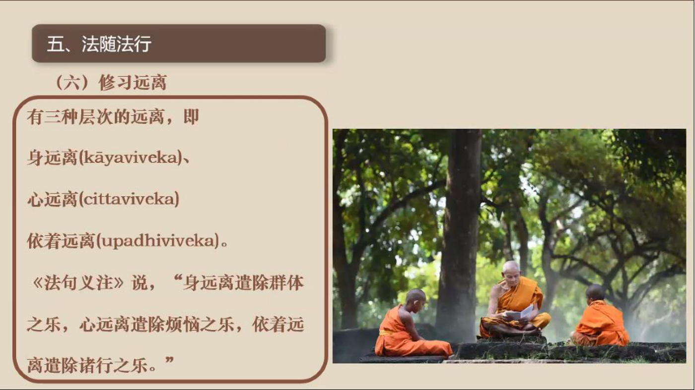

📅 最近更新：2026-09-28 16:15　|　第5版精修（朗读优化版）

# 第4周：经行日常正念与修学规划（主持人版）
> ⭐ **本讲主持人速览**（新主持人必读，2分钟看完）
>
> 你不是老师，是"共学同行者"。你不需要懂禅修，只需要按流程走。本周由**连续两周内容合并**而成，含两段共读、两轮分享与两轮讨论。
>
> | 环节 | 标准时长 | ⏱ 时间不够→ | ⏱ 时间富余→ |
> |:-----|:----:|:-----|:-----|
> | 🧘 静心开场 | 10 min | 缩至5 min | 加2分钟静坐 |
> | 📖 共读原文1 | 20 min | 只读★核心段（约15 min） | 加读◈扩展段 |
> | 💬 第一轮分享 | 10 min | 每人1句话 | 每人3分钟 |
> | 🎯 第一轮主题讨论 | 10 min | 只讨论问题① | 讨论全部问题+扩展 |
> | 🧘 禅修练习 | 15 min | 缩至8 min（只念引导词前半） | 延长至20 min |
> | 📖 共读原文2 | 20 min | 只读★核心段 | 加读◈扩展段 |
> | 💬 第二轮分享 | 10 min | 每人1句话 | 每人3分钟 |
> | 🎯 第二轮主题讨论 | 10 min | 只讨论问题① | 讨论全部问题+扩展 |
> | 🔚 收尾与回向 | 15 min | 缩至10 min | 保持 |
>
> **主持人10条守则（精简版）**：
> > ① 不讲解、不提供答案——让原文自己说话；② 有人问"正确答案"→说"先听听大家的看法"；③ 冷场→主持人先分享自己的真实感受；④ 跑题→温和拉回："这个有意思，我们回到今天的原文"；⑤ 争论→"两种看法都很好，大家保留自己的理解"；⑥ 确保人人发言；⑦ 不评判任何人的分享；⑧ 时间到了就推进；⑨ 禅修练习照读引导词即可；⑩ 结束一起回向。

> **读书会01：禅修入门与基础 · 第4周（4周版 · 连续两周合并）**
> 主持人：你不需要提前懂禅修，按本手册推进即可。
> 本周主题：经行日常正念与修学规划。不打坐的大部分时间怎么保持正念——习惯机制、经行方法、四威仪日常练习；以及这四周我们学了什么、之后怎么走（修学规划）。
---
## 📋 本周信息卡

| 项目 | 内容 |
|:----|:-----|
| 时长 | 约120分钟（设计=2小时，按新流程弹性调控） |
| 核心问题 | 不打坐的绝大部分时间，正念怎么不断线？；这8周我们学了什么？两个月之后怎么走？ |
| 共读原文 | 共读原文1：《云台寺安居禅修04-拆解习惯和经行-古源尊者》　｜　共读原文2：《如来禅修学体系17-禅修次第1-时代特点与确立目标-古源尊者-20250119（课件）》；《如来禅修学体系32-禅修次第15-法随法行3-古源尊者-20250203（课件）》；《云台寺安居禅修13-大念处经略说-古源尊者》 |
| 本周作业 | 每天经行10分钟（读书会自拟作业量；慢走、觉知"抬—移—放—触"）；设置2个日常觉知锚点（无单独作业，可沿用本项） |

---
## 🧘 静心开场（10 min）

> **开场破冰 · 暖场**（约 3 分钟）：这四周里，哪一次「只是知道」的瞬间让你印象最深？用一句话说说。
> （说完不必解释，为今天的收尾与展望铺垫。）

> **本期共同约定（心理安全）**：① **保密**——今天在这里说的话，留在今天；② **不评判**——不评价任何人的分享；③ **可随时暂停**——坐不住、心里不舒服，随时可以调整姿势、起身或暂停，不需要向任何人解释。

**主持人引导语**（照读即可）：

> 我们先静坐一分钟。闭上眼睛，回到鼻头、人中附近的触点。这是四周的最后一聚：不打坐的大部分时间，怎么让正念不断线——习惯、经行、四威仪；然后我们一起回看这四周学了什么、之后怎么走。只是知道呼吸在进出，安心坐下。（停顿60秒）
---
## 📖 共读原文1（20 min）

> ⚠️ 主持人操作：以下为完整原文文字，可直接照读或让大家轮流朗读，无需再去查知识库。出处信息见各材料下方。

### 原文材料①：习惯如何形成——跳蚤、乌龟与觉知锚点

- **文件**：《云台寺安居禅修04-拆解习惯和经行-古源尊者》

**★核心段落**（必读）

**一、习惯的形成机制（一）：跳蚤实验**

> 一个科学家做试验，他们抓了只很强壮的跳蚤，把它罩在桌子上的玻璃罩里面，玻璃罩的罩子很高。然后每次猛烈的拍桌子，每拍一次桌子，跳蚤就使劲地跳，一般它都能够跳到超过身高 100 倍以上的高度，可以说是世界上最厉害的跳高高手。
> 接着，实验者开始慢慢地降低玻璃罩的高度，让跳蚤每次跳起来就能碰到罩子。连续几次以后，跳蚤改变了起跳高度以适应环境，每次跳跃总保持在罩顶一样的高度。随后实验者逐渐降低玻璃罩的高度，跳蚤又都在碰壁后主动降低跳跃高度，最后玻璃罩降低到接近桌面，跳蚤没法跳，后来跳蚤就不跳了，再拍桌子也不跳了。最后科学家把玻璃罩拿掉，再拍桌子，跳蚤也不再跳，所以跳蚤就变成爬蚤。
> 跳蚤为什么就变成爬蚤了呢？大家觉得是什么原因造成的？习惯？玻璃罩？还是科学家折腾呢？所以习惯，是在不知不觉中养成的，因为有情就是靠习惯活着。让跳蚤成为爬蚤到底是科学家还是玻璃罩还是科学家加玻璃罩，还是说是跳蚤的习惯呢？
> 其实，不能说爬蚤、科学家、玻璃罩彼此之间没有关联，都有关系，但核心是习惯，最主要是跳蚤没有觉察。跳蚤对被不断降低高度没有觉察，它不知道有人把高度降低。所以，当我们修行或学习遇到困难，也会有这样的习惯出现。

**习惯在修行中的显现**

> 比如说"我不行"，"我一定学不好"，"我一定克服不了，妄念就是这么多"，"我觉得跟以前比退步很多"...反正无论觉得是什么原因，就是搞不定了。
> 事实上并不是你学不好，只是习惯于学不好而已。觉得我就是不行，觉得我就是这个样子，养成了习惯。也有些同学说，我必须优秀，我必须很酷，我害怕看到人拉长着脸，我希望别人都快乐等等，也是习惯。跳蚤之所以这样，是因为它无法看到习惯形成的机制。
> 其实，从习惯的角度讲，我们并没有比跳蚤聪明多少。……但是，对于聪明的我们来说，同样被环境塑造而不自知。跳蚤是这样，人类也是这样。这种被环境塑造而不自知，就是无明和邪见这对元凶造成的。或者根源，我们总是看不到，其实是有人在整，玻璃罩不断地降低了，为什么看不到呢？因为没有念知，不能觉察。

**二、习惯的形成机制（二）：乌龟跑步机比喻**

> 有一个很流行的鸡汤，曾经在佛教圈里面也发过，我看到很多大 Bhante也在发，看了很无语，是什么呢？
> 把一只乌龟放在跑步机上，慢慢的加快速度，最后发现乌龟可以跑的飞快。他们以此说明乌龟的潜能尚且如此之大，何况人乎？乌龟都可以跑的快，你为什么不发挥你的潜能呢？这个观点，这个鸡汤，我就坚决不喝，如果我是那只乌龟，我下来一定给你一个耳光，你有没有一点龟性呢？你明知道我就是那点速度，你给我放到跑步机上，你不是摧残本龟吗？
> 不要拿龟玩命的速度跟兔子散步的速度比，玩命啊，兔子散步都比我快。最后害我这只老龟，一辈子看到跑步机都会发抖。我们要激励自己、超越自己，对要量力而行！
> 如果想要有兔子的速度，就要发愿成为兔子，成为兔子就可以跑。
> 兔子正常跑不要玩命，乌龟玩命还是赶不上它的。
> 说这个是什么意思呢？就是说：一、习惯的形成是无意识的，不知不觉就形成了。但很多人，想改习惯的时候，会设一个很高的目标。乌龟都可以跑那么快，你那么没用啊。不可以这样。
> 改毛病，首先要知道毛病是怎么形成的。我们所有的习惯，大部分都是无意识形成的，用佛法的语言来讲：其实就是没有念知的状态，你被一次次带走的。你就是这样习惯了。乃至于认为：我就是要靠这个习惯才能够有效地工作，有效率，才能够跟人沟通。成了一种无意识状态了。

**三、改变习惯的方法：把习惯变成有意识、设置觉知锚点**

> 所以要怎么办呢？
> 首先，要把不良习惯变成有意识，对那个习惯有念知。最近经常提到微习惯，微习惯要设置锚点。看到习惯以后要设置锚点。什么锚点（或者觉知点，好听点叫觉知点。）？就是你一碰到这样的所缘，或者这种环境，或者这种场景，或者心的这种状态，那个习惯会起来的，就要把所缘、环境、状态，设置为觉知点，一出现，马上觉知说：这可能会引发习惯，让习惯成为有意识的状态，有念知的状态，才有可能去改变它。
> 要有意识的慢慢训练让好的状态成为习惯，让好习惯也成为有念知、有意识的状态。一些行为因为不断地重复（重复缘的缘力），才能够成为好习惯，这个过程需要有意识地培养。培养到最后，良好习惯成为唯作，所有习惯成为唯作的状态。
> 这些能力无关学佛不学佛，世间的人要改变习惯,也要有念知，要训练，要一直不断地觉察，不然不可能被培养出来。

**◈扩展段落**（可选）

**四、培养好习惯的前提：喜欢与清晰的愿景**

> 怎样才能有个好习惯呢？要愿意有好习惯，喜欢这个习惯,有兴趣。
> 贤友问："Bhante,怎样才能够让修行上道呢？"
> 我问他："你喜欢修行吗？"他说不出来。
> 说不出来，又不喜欢修行，怎么可能修行会上道呢？你不想培养良善的习惯，不觉得良善习惯是非常想要获得的东西，怎么可能有良好的习惯呢？
> 要培养好习惯，首先要把好习惯描述出来，也就是愿景要清晰。
> 你觉得这个好习惯到底有多好，对你有什么样的影响，有多么重要，会给你带来什么样的利益？或者什么样的快乐？要清楚的描述。每天只要一想到这个，要干。……任何好习惯的形成，前提要喜欢这个习惯。对于能朝向善行的好习惯，往往都必须是心养成的习惯，都是非舒适区，都在挑战区。……这个过程还是要靠念知，所以说所有这些能力都要在觉察和禅修中获得，而且还要有办法。

### 原文材料②：经行方法——慢走、抬移放触与不批判的觉察

- **文件**：《云台寺安居禅修04-拆解习惯和经行-古源尊者》

**★核心段落**（必读）

**五、禅修与经行要交替进行**

> 这两天大家因为环境的问题，经行比较少。我们要求长坐、短坐和经行要交替进行。长坐的人不要一股脑就是死坐，要坐 8个小时、9小时，然后连续坐一个月，最后就发现心突然间没力量了。这有太多的例子，我没有见到每天坐 9 个小时，然后连续坐半年这样坐下来的人。可能是我孤陋寡闻，没有看到过，他一定要出状况，突然间就没力量了。然后跟老师报告：没力量了。
> 其实，这样就是太作践心了，把乌龟当兔子看，不能这样。所以就要交替。不要讲说：哎呀，今天状态特别好，是不是要多坐一点，见好就收。长短坐和经行一定要交替进行。
> 对于初学来讲，如果没有安排长坐或者没有要求突破 3 个小时 4个小时，正常就一个小时到一个半小时，就要起来，然后去经行，觉察念知。……
> 为什么有些人说修禅的人总是呆呆的感觉，这是因为没有跟日常的念知结合，看起来有点木木的，所以就要求禅修与经行交替着进行。
> 这有助于调和内心的平静、寂静、轻安和精进力的平衡，有助于克服心的沉滞，或者心过度的兴奋。

**六、经行的基本方法：慢走、如实觉察**

> 现在环境还没完全好，可以在走廊、房间里练习，一定要练习。
> 对于初学者来讲，建议走得慢一点，慢才能觉察。
> 当然有些人慢，会起烦躁心。这得靠自己调整，但是至少要做到自然，简单、自然的经行，经行的时候专注脚和腿的动作。

**七、经行的步骤觉察：抬脚—推出—放下（抬移放触）**

> 以前讲经行要分成 5个步骤：如果觉得右脚要迈起，重心会向左移，然后右脚跟会提起来，然后抬起、推出去，然后会放下，踩到地上，然后重心会移到右脚，可以分成 5步这样来回。
> 如果觉得不方便，也可以只知道抬起、推出、放下 3步。实在不行至少知道在左边抬起，右边抬起，左边抬起，右边抬起，在移动，要这样觉察。这样觉察的要点在哪里？就是心不跑掉。
> 经行跟入出息一样，可以快数，可以慢数，可以数入息，也可以数出息，用各种方式来回换，目的就是让心不跑掉。
> 经行也是这样的，你觉得是要分多少个步骤来，少一点还是多一点，就在于能不能够如实自然轻松的觉察，同时又不会跑掉，以这个为原则。没有哪个标准是最好的，自己掌握，只要轻松，如实，自然，没有妄念，不跑掉，就是最好的。

**八、经行中的眼睛与转身觉察**

> 经行的时候，眼睛一般往前看三步、五步的地方，如果眼睛往外飘，马上要觉察：在飘，回来继续注意脚的动作。即使不是在经行练习，例如在服务，在走路，也应该这样，只要心开始飘：哦！国庆花开的好鲜艳啊！想去采，注意：想要，采的时候，知道采，采回来的时候内心升起来什么心？看到什么心？要及时去观察它。
> 经行的时候，走到尽头，准备要转身的时候，要观察，在快到头的时候，前两三步就会觉察到，想要转身，以前转身是无意识的转，现在转身就可以观察要向左转还是向右转。
> 为什么向左转向右转？一般来讲，如果是大众的经行道，老师会教：如果边上有上座，不能够在转身的时候把屁股朝向他，或者说边上有佛像，转身的时候不能把屁股朝向佛像，这是恭敬。你在觉察的时候要把这个带进去。如果没有这些所缘，但是会习惯性向左转或者向右转？就看说这个习惯性向右转向左转是谁在指挥？或者我想向右转，我想向左转，只是这样去觉察。

**九、如实觉察：不批判、不标记、不增加内容**

> 今天也有人问，在觉察的时候要不要去提到这是一个习惯，这是一个行动，这是一个什么感受？如实觉察当下的状态，知道就行，不要在上面增加任何内容。"这是一个不好的行为"，不要加这个内容，只是知道是一个行为，知道这个行为，心就已经知道，是好是不好，已经很清楚，不需要在脑子里面再加工。
> 很多人提到，比如修马哈希禅法的人说要有标记，其实马哈希西亚多早期的开示（当然我看不懂缅文）里面，我相信马哈希亚多没有要求标记，他说你不一定去用什么样的语言。当然，我们不是用马哈希的这种方法，但是念知都是一样的，念知并不是马哈希西亚多创造的。有些人说修过马哈希，用标记，建议你别用标记。
> 因为标记，标着标着就用脑子，就到脑子上去了。你只是去知道它……知道它就可以。甚至于脑子不要涌现出、浮现出那个字眼，或者那个声音都不需要，就是知道，心里是知道的。

**◈扩展段落**（可选）

**十、对妄念与影像的处理：不跟、不压、不批判**

> 如果在禅修，或者，在经行的时候，心里面会冒出来很多影像或者声音或者一些特别的图像，不需要去管它，心朝向那个目标，就知道朝向目标。在经行的时候，知道朝向那个目标就可以了。

## 💬 第一轮分享（10 min）

> 每人轮流分享：「最触动我的一句话／一个观点是什么？」（不评论他人）
> 时间紧时每人一句话即可；冷场时主持人先分享自己的真实感受。
---
## 🎯 第一轮主题讨论（10 min）

**主持人引导**：朗读下面3个问题，让大家自由讨论。**你不提供答案**，只引导。

**讨论问题（按优先级）**：
- **问题①（★必答，时间不够时只讨论这个）**：跳蚤实验照见了你的哪个"习惯性天花板"？（比如"我不行""我一定学不好""妄念就是这么多"……那只看不见的"玻璃罩"，在你的生活或修行里是什么？）
- **问题②（◈选答）**：经行的"抬—推—放"三步里，哪一步最容易丢？丢的时候，你的心一般跑去哪里？
- **问题③（◈选答，时间富余或大家感兴趣时讨论）**：给自己设计2个"觉知锚点"（如每次开门先觉知一次脚触地）——当场说出来，大家一起帮你看看可不可行、够不够小、容不容易忘。

---
> **分层追问**（可视时间取用，由浅入深）：
> - 【现象】除了打坐，你一天里走路、吃饭、洗碗的时候，有多少时候是知道自己在做什么的？
> - 【影响】你有没有过走着走着，回过神才发现，刚才那几分钟完全不知道经历了些什么？
> - 【应对】这周挑一段路或一顿饭，只做这一件事，感受脚落地或咀嚼时那十秒真实的触感。
---
## 🧘 禅修练习（15 min）

> 💡 本周由连续两周合并，含两段原周次的禅修练习引导词；时间紧可读其一，或各取前半段（合计约15分钟）。

### 练习一

> **练习提示（禁忌与安全）**：如有严重身心疾病（重度抑郁／焦虑发作期、精神障碍等）、近期手术或严重心血管疾病、孕期或有医嘱限制者，请先咨询医生、量力而行；练习中若出现强烈不适，可随时睁眼、停止、调整，或改为静坐观察。

> ⚠️ **禅修禁忌提示**：若你正处在严重抑郁、焦虑、创伤后应激，或精神类疾病的发作／用药期，或正经历强烈的情绪危机，请先咨询医生或心理师，再决定是否练习；练习中若出现明显不适（如心悸、胸闷、情绪失控），请立即停止，睁开眼睛，把注意力放回呼吸与身体，必要时离场休息。

> ⚠️ 主持人操作：照读完整引导词即可；本周练习为经行，请提前安排一段能来回走动的空间。

> 本周的练习不是坐禅，是**经行（在行走中觉察）**——不需要任何基础，找一段能来回走的直线（会议室、走廊都行）。成员中途想坐下休息、随时打断都可以——本周的功课本来就是"少坐多走"。

**引导词**（照读版）：

> 本周的练习不是坐禅，而是经行——走动不便也没关系，坐着觉察脚触地，同样有效。（停顿）
>
> 请大家起立（或原地坐好），找一段能来回走五到八步的直线。我们慢慢来，这几分钟只属于你的脚。（停顿）
>
> 先在起点站定，两脚分开与肩同宽，眼睛垂下或轻轻闭上，感觉全身站在地上：脚掌与地面接触的感觉，身体的重心，大概有一点点晃动，都知道。（停顿）
>
> 现在慢慢睁开眼睛，目光放在前面大约三到五步的地面，不看远处，不东张西望。
>
> 我们用最简单的三步来走：右脚准备抬起来的时候，知道"抬"；脚往前移动的时候，知道"移"；脚放下去、踩到地上的时候，知道"放"，感觉脚底接触地面。然后换左脚，同样：抬，知道；移，知道；放，知道。（停顿）
>
> 走得越慢越好，慢才能觉察。不用数数，也不用在心里念很多字，心里知道就够了。平衡不好就走得自然一点，我们不是走给别人看的。（停顿1-2分钟，让大家走几个来回）
>
> 走到尽头，准备转身的时候，前两三步就会觉察到"想转身了"——向左转，就慢慢地知道向左转；向右转，就慢慢地知道向右转；转过来，站一下，继续走。（停顿）
>
> 走的过程中心跑了——去想工作、想晚饭了——不用责备自己，知道"跑了"，轻轻把心带回脚上的动作。回来一次，就是一次正念。（停顿）
>
> （约10-12分钟后）好，现在停在哪一步都可以，站定，感觉两脚踩在地面上。今天回去的作业，就是每天这样走10分钟。本周也可以少坐一点、多走一点——坐禅和经行交替，心才会有力量。

---
### 练习二

> **练习提示（禁忌与安全）**：如有严重身心疾病（重度抑郁／焦虑发作期、精神障碍等）、近期手术或严重心血管疾病、孕期或有医嘱限制者，请先咨询医生、量力而行；练习中若出现强烈不适，可随时睁眼、停止、调整，或改为静坐观察。

> ⚠️ **禅修禁忌提示**：若你正处在严重抑郁、焦虑、创伤后应激，或精神类疾病的发作／用药期，或正经历强烈的情绪危机，请先咨询医生或心理师，再决定是否练习；练习中若出现明显不适（如心悸、胸闷、情绪失控），请立即停止，睁开眼睛，把注意力放回呼吸与身体，必要时离场休息。

> ⚠️ 主持人操作：照读完整引导词（整合8周所学：坐姿三要领、感恩身体、触点与呼吸、细相不追不赶、以回向心结束；改编自《禅坐引导文》与各周原文，**非逐字照读**）。

**引导词**：

> 请大家自然地坐好——骨盆坐稳、身体中正，散盘、单盘或坐在椅子上都可以。头轻轻往上顶，像氢气球往上飘；肩膀松下来，胸自然打开。（停顿）
>
> 先花一点时间，感恩身体：这8周里，是它支撑着你每一次行走、站立、坐卧、禅修。从头顶到脚底，哪里还紧，就请它再松一点。（停顿）
>
> 现在，把心轻轻放到鼻头、人中附近——气息进出时碰到皮肤的那个触点。气息进来，知道进来；气息出去，知道出去。长的时候知道长，短的时候知道短；只是知道，不控制，不评判。（停顿2-3分钟）
>
> 如果心静下来，眼前或心里出现一些细的光、细的感受——不用兴奋地追上去，也不用害怕地赶它走；轻轻地回到呼吸上就好。相只是路上的风景，我们只管走自己的路。（停顿）
>
> 如果妄念来了，知道"妄念来了"——这本身就已经是正念。轻轻回来，不用责备自己。（停顿1-2分钟）
>
> 最后，我们一起在心中默念回向：愿我此功德，导向诸漏尽；愿我此功德，为证涅槃缘；我此功德分，回向诸有情；愿彼等一切，同得功德分。（停顿）
>
> 好，慢慢动动手指、脚趾，搓搓手掌，把温热的手掌敷在眼睛上，轻轻睁开眼睛。这8周的每一次呼吸、每一步抬移放触，都会留在心里。

---
## 📖 共读原文2（20 min）

> ⚠️ 主持人操作：本周采用"回顾式共读"。以下已嵌入完整原文文字，**可直接照读或邀请成员各选一段读**，无需再去查知识库。回顾材料①为资料包整理的汇总表，供快速回顾。

### 回顾材料（含完整原文，可直接共读）

**回顾材料①：8周回顾汇总表（资料包整理）**

> 📌 **本清单为资料包整理的回顾索引，原文见各周文档。** 时间不够时，可以只请每位成员从清单中挑一条，说说"这一条我练过什么"。

1. **坐姿三要领**——骨盆中立位、松肩坠肘开胸、头部中立（头如氢气球上飘、耳垂对肩、脊柱沟出来且两边腰肌松软）；出处：第2周·《18_入出息念》＋第7周·《觉察姿势与动作》（录音转写）。
2. **触点与三法**——呼吸的“相”在鼻头／人中触点；相·入息·出息三法；触点是工具，不是盯住不放的地方；出处：第3周·《入出息念浅析6·修习2》（PDF课件）。
3. **安般十六步框架**——十六事总表：从觉知呼吸到观照无常苦无我的完整次第——先知道整条路，再一步一步走；出处：第3周·《入出息念业处十六事》（PDF课件）。
4. **四阶段与数息**——入出息→长短息→全息→微息四阶段；慢数快数、收功；妄念来了不压不批判；出处：第4周·《入出息念浅析6·修习2》（PDF课件）＋《14_入出息念·数息》（录音转写）。
5. **禅相与安止善巧**——心细之后的禅相：遍作相／取相／似相；五禅支；十种安止善巧；见细相不追不赶；出处：第5周·《入出息念浅析7·修习3》（PDF课件）＋《入出息念》（帕奥西亚多，PDF）。
6. **五盖与对治**——五盖（欲贪／瞋恚／昏沉睡眠／掉举追悔／疑）的定义、成因、义注五喻与逐一对治；出处：第6周·《止观前行实修营8·舍离五盖1》（PDF＋共修版）＋《止观前行实修营12·舍离五盖5》（录音转写）等。
7. **经行与四威仪**——经行“抬—移—放—触”；眼睛与转身觉察；不批判不标记；觉知锚点让习惯变成有念知；行住坐卧皆觉知；出处：第7周·《云台寺安居禅修04·拆解习惯和经行》＋《177讲·四威仪1》。
8. **修学次第**——禅修次第五步：时代特点与确立目标→亲近善士→听闻正法→如理作意→法随法行；出处：第1／8周·《如来禅修学体系17》＋《如来禅修学体系32》。

**回顾材料②：修学路径——三类菩提与发愿路径（体系17）**

- **文件**：《如来禅修学体系17-禅修次第1-时代特点与确立目标-古源尊者-20250119（课件）》

**★核心段落**（必读）

**一、三类菩提的差异说明（承接第1周"总说"）**

> 在上座部佛教中,有三种菩提,即正自觉菩提(sammā-sambodhi)、独觉菩提(pacceka-bodhi)、弟子菩提(sāvaka-bodhi)。在这三种菩提中,成就正自觉菩提者又被称为正自觉者(sammā-sambuddha),也即佛陀。成就独觉菩提者被称为独觉佛(pacceka-buddha)。成就弟子菩提者被称为圣弟子(ariya-sāvaka)。
>
> 这三类圣者在证悟阿拉汉果时,皆已彻见四圣谛,断除一切烦恼,完全清凉与寂静,他们在解脱上并无差异。不过,由于其往昔所发之愿、为满愿而积累的巴拉密(pāramī,波罗蜜)及累积巴拉密的时间不同,因此在最后一生解脱后,神通、智慧、福德等有很大差异。

> 《增支部·一集》中说:
> "诸比库,有一人出现于世间时,是稀有之人的出现。哪一人呢?如来、阿拉汉、正自觉者。诸比库,乃此一人出现于世间时,是稀有之人的出现。"
> "诸比库,绝无此理,无有条件,若一个世界中有两位阿拉汉、正自觉者不先不后地出现,绝无此理!诸比库,确有此理,若一个世界中只有一位阿拉汉、正自觉者出现,确有此理。"

**二、发愿成佛：已授记与未授记两条路径**

> 假如发愿成佛,又可分为两种情况:已被授记与未被授记。已被授记的菩萨自己清楚如何累积巴拉密,他的未来是确定的,当巴拉密圆满时,就将成就无上正觉。
>
> 假如尚未被授记,就应致力于完整地学习佛陀的教法,并修习八定与五神通,培育观智至行舍智,累积足够的资粮以等待下一位佛陀或其他佛陀的授记。

**三、具备被授记的八项条件（菩萨八法）**

> (1) 生为人
> (2) 生为男性
> (3) 遇到一位活着的佛陀
> (4) 是一位相信业报的修行者
> (5) 具有四禅八定与五神通
> (6) 具足悟阿罗汉果的条件
> (7) 愿为佛陀奉献自己的性命
> (8) 有极强想要成佛的善欲

**四、三种菩萨与巴拉密累积时长（发愿所需的时间代价）**

> 一、慧者菩萨:慧者菩萨慧强信弱;
> 二、信者菩萨:信者菩萨慧中信强;
> 三、精进者菩萨:精进者菩萨信与慧皆弱,但精进强。
>
> 1. 智慧型:四阿僧祇十万大劫
> 2. 信心型:八阿僧祇十万大劫
> 3. 精进型:十六阿僧祇十万大劫

**五、发愿成为普通弟子：四类修行资质**

> 若禅修者发愿成为普通弟子,致力于尽快解脱,则应了解《增支部·四集》中所说的四类人:
> 1) 敏锐知者(ugghāṭitaññū)
> 2) 详说知者(vipañcitaññū)
> 3) 可引导者(neyya)
> 4) 文句为最者(padaparama)

**六、未获授记者的修习建议（发愿确立后的行动指引）**

> 假如尚未被授记,就应致力于完整地学习佛陀的教法,并修习八定与五神通,培育观智至行舍智,累积足够的资粮以等待下一位佛陀或其他佛陀的授记。

（说明：本课件末尾附有《Mettābhāvanā ca Patthanā ca》散播慈爱与发愿全文本——巴利原文、注音转写与中文对照，与第2周《禅坐引导文》中的发愿文本相同，此处不重复收录；发愿·回向见本周"收尾与展望"的大回向。）

**回顾材料③：日常践行——四种正知与三种远离（体系32）**

- **文件**：《如来禅修学体系32-禅修次第15-法随法行3-古源尊者-20250203（课件）》

> （三种远离见下图，投屏给大家看一眼，看图即可，不必逐行读。）

**★核心段落**（必读）

**具念正知：《算术师摩嘎蓝经》的践行场景**

> 《算术师摩嘎蓝经》中又说:
> 当比库实行警寤以后,接着如来进一步调教:"来,比库,你应具足念与正知!在前进、返回时保持正知,向前看、向旁看时保持正知,屈、伸(手足)时保持正知,持桑喀帝、钵与衣时保持正知,食、饮、嚼、尝时保持正知,大、小便时保持正知,行走、站立、坐着、睡眠、觉醒、说话、沉默时保持正知。"

**四种正知的定义**

> 四种正知:
> 1) 有益正知(sātthaka sampajañña,有益明觉):了知所作之事是否有善法的利益;
> 2) 适宜正知(sappāya sampajañña,适宜明觉):对有益之事,了知是否是行动的时机;
> 3) 行处正知(gocara sampajañña,行处明觉):专注于三十八种止禅业处;
> 4) 无痴正知(asammoha sampajañña,无痴明觉):行动时不起"人、我、众生、有情"之想,而只是进行界作意(身体因四界的作用而移动)。

**具念正知（践行场景清单）**

> 具念正知:
> (1) 在前进返回时保持正知
> (2) 向前看、向旁看时保持正知
> (3) 行走、站立、坐着、睡眠、觉醒时保持正知
> (4) 说话时保持正知
>
> 佛陀说话有两个原则:
> 一、只说真实、如实、有利益之语,即说正确的话;
> 二、无论那话语对于听众是否可喜、是否合意,佛陀知道说话的合适时机,即正确地说话。

**◈扩展段落**（可选）

**修习远离：三种层次的远离**

> 《算术师摩嘎蓝经》中接着教导:
> "来,比库,你要亲近偏远的坐卧处——林野、树下、山丘、幽谷、山洞、坟场、树林、露地、草堆。"

> 有三种层次的远离,即:
> 身远离(kāyaviveka)、
> 心远离(cittaviveka)、
> 依着远离(upadhiviveka)。
> 《法句义注》说:"身远离遣除群体之乐,心远离遣除烦恼之乐,依着远离遣除诸行之乐。"

> 《中部·大空经》(Mahāsuññatasuttaṃ, M.3.3.2)中指出:"阿难,乐于集会、喜好集会、致力乐于集会、乐于群聚、喜好群聚、喜爱群聚的比库无法辉耀。阿难,若乐于集会、喜好集会、致力乐于集会、乐于群聚、喜好群聚、喜爱群聚的比库确实将对出离乐、独处乐、寂静乐、正觉乐的那种乐随欲而得、不难而得、易于获得,无有此理。阿难,若那比库独自远离群聚而住,这可被预期:该比库将对出离乐、独处乐、寂静乐、正觉乐的那种乐随欲而得、不难而得、易于获得,乃有此理。"

> 《大空经》中又教导:
> "阿难,你怎么想:'见到何种利益时,弟子在被驱逐时仍值得追随导师呢?'阿难,弟子确实不值得以经、应颂、记说之因追随导师,那是什么原因呢?因为你已长久听闻、忆持、背诵、以心随观察、以见善通达法。然而,阿难,凡这(关于)削减、有益于心离盖、导向完全厌离、离染、灭、寂静、证智、正觉、涅槃的言论,即少欲论、知足论、远离论、独处论、发勤精进论、戒论、定论、慧论、解脱论、解脱智见论——由于像这样的言论之因,阿难,弟子即使被驱逐,仍值得追随导师。"

**回顾材料④：把目标调整为可行（云台寺13）**

- **文件**：《云台寺安居禅修13-大念处经略说-古源尊者》

**★核心段落**（必读）

**一、把"追求禅那"调整为"每天保持若干小时念知"的可行目标**

> 很欣喜地看到,已经有一些同学在一天的生活中,念知慢慢绵密起来,他因此感觉充实,感觉法喜,这就是修行。修行不是说现在禅修成就有多高,或者定力有多强——有定力当然是好的,但它真的不是最重要的。最重要的是在日常生活中,能不能始终活在法上。
>
> "法"是什么呢?法就是念住。佛陀讲:"四念住是唯一之道"。所以你在四念住上,你就在法上;你在法上就能体会法味,这是最重要的。
>
> 所以如果你到这里来是想"什么时候证得禅那?"你最好调整为"什么时候能够一天有两个小时保持念知,或者一天有十个小时保持念知。"
>
> 想要证禅那不容易,有些人混了几十年都没搞到。但是如果你下一个目标是"一天保持两个小时的念知",只要你愿意,只要用心,就一定能做到(特别在禅林这个地方)。当你保持念住两小时的时候,体会真的不一样,禅那可能就不远了。
>
> 所以我希望大家转个角度,虽然可能不容易,但希望大家有机会转转试试。

---
## 💬 第二轮分享（10 min）

> 每人轮流分享：「最触动我的一句话／一个观点是什么？」（不评论他人）
> 时间紧时每人一句话即可；冷场时主持人先分享自己的真实感受。
---
## 🎯 第二轮主题讨论（10 min）

**主持人引导**：朗读问题，让大家自由讨论。**你不提供答案**，只引导。

**讨论问题（按优先级）**：
- **问题①（★必答，时间不够时只讨论这个）**：8周里对你改变最大的一个认知／一个方法是什么？（比如"修行不是控制呼吸，而是知道呼吸""妄念不用赶，知道就已经是正念""目标可以调成'一天两小时念知'"……）
- **问题②（◈选答）**：对照回顾材料②的"发愿路径"与四类修行资质，你现在对自己修学的定位是什么？（如实就好，不比较、不高推——"可引导者""文句为最者"精勤修习，同样能走到终点。）
- **问题③（◈选答，时间富余或大家感兴趣时讨论）**：未来3个月你的禅修计划是什么？请具体到**频次／时长／检查方式**（比如"每天早上坐15分钟＋经行10分钟；每周日晚上用3句话检查这一周的念知"）。

---
> **分层追问**（可视时间取用，由浅入深）：
> - 【现象】回头看这四周，哪一次静坐是你觉得最踏实、最想再回去待一会儿的时刻？
> - 【影响】这段时间里，你有没有发现，自己对烦躁或昏沉的反应，和从前有些不一样了？
> - 【应对】这周给自己定一个下周还做得到的小练习，简单到再忙也不容易把它放下。
---
## 🔚 收尾与回向（15 min）

### 收尾一

1. **每人一句话**：今天最大的收获是什么？
2. **下周预告**：下周是本读书会的最后一周——"8周之后怎么走？"我们会一起回顾这8周学过的方法，并为自己做一份未来3个月的修学规划。请大家在周内先想一想：这8周里，对你改变最大的一个认知、一个方法是什么？
3. **本周作业**：
   - 每天经行10分钟（读书会自拟作业量）：慢走，觉知"抬—移—放—触"（自然轻松就好，不必拘泥分几步）；
   - 设置2个日常觉知锚点（如：每次开门前，先觉知一次脚触地；每次拿起手机前，先觉知一次呼吸）——本周只是留意它们，不要求做到完美。
4. **回向**（一起念）：

> **愿我此功德，导向诸漏尽！**
> **愿我此功德，为证涅槃缘！**
> **我此功德分，回向诸有情！**
> **愿彼等一切，同得功德分！**

---
### 收尾二

1. **每人一句话**："8周后的我 vs 8周前的我"——说一个你最明显的变化（哪怕很小：睡得好了、走路慢了、发火前多了半秒钟……）。
2. **展望：后续读书会系列**（照读即可）：
   - **读书会02 · 慈心禅修习**：把心变软、变暖，对治瞋恚；
   - **读书会03 · 四护卫禅**：禅修路上的四道护卫——为修行保驾护航；
   - **四念处方向读书会**：身受心法——第7周四威仪的观禅部分将在那里深入。
   - 不进下一个读书会也很好：按"三个月计划卡"每天自己练，这就是这条路的走法。
   - 不确定选哪个？散会后翻一翻各周文档开头的"核心问题"，哪个问题还让你心里一动，就从哪里继续。
3. **互道祝福**：每人向右边的伙伴说一句祝愿（自由发挥，比如"愿你每天都有一点念知""愿你的禅修路上不孤单"）。
4. **大回向**（一起念，作为8周的圆满收尾）：

> **愿我此功德，导向诸漏尽！**
> **愿我此功德，为证涅槃缘！**
> **我此功德分，回向诸有情！**
> **愿彼等一切，同得功德分！**

---

## 📌 本讲主持人特别提醒

- **场地与身体**：经行只需要一小段能来回走的直线（会议室、走廊均可），提醒成员穿舒服的鞋；走动不便的成员可以坐着觉察脚触地，主持人主动说明，避免有人尴尬。
- **安静时段预告**：经行练习会有一段不讲话的行走时间，提前说明"这几分钟我们安静地走"，主持人自己也要跟着走，不要站在旁边看。
- **不给标准答案**：若有人问"我该分5步还是3步""走快一点行不行"——回到原文：原文说"没有哪个标准是最好的，自己掌握，只要轻松，如实，自然，没有妄念，不跑掉，就是最好的"。
- **下周预告**：下周是收官周（总结与修学规划），请提前告诉大家带着"8周回顾"的心情来，并想一想"改变最大的一个认知、一个方法"。

---

> 📚 **下一份文档**：`第1周_禅修入门与正确坐姿_主持人版.md`

<!--EXT_READ-->
## 📖 延伸阅读（课后自由选读）

- 《云台寺安居禅修04-拆解习惯和经行-古源尊者》——习惯如何形成（跳蚤、乌龟与觉知锚点）与经行方法（慢走、抬移放触）。
- 《如来禅修学体系17-禅修次第1-时代特点与确立目标-古源尊者-20250119（课件）》——三类菩提与发愿路径。
- 《如来禅修学体系32-禅修次第15-法随法行3-古源尊者-20250203（课件）》——四种正知与三种远离。
- 《云台寺安居禅修13-大念处经略说-古源尊者》——把目标调整为“每天保持若干小时念知”。
- 《177讲-摄集-摄菩提分-身念处-四威仪1-古源尊者-20211022（共修版）》——四威仪日常练习：行住坐卧皆觉知（本周未共读，课后选读）。
- 《觉察姿势与动作-古源尊者-20230703》——身体姿势与动作的觉察（本周未共读，课后选读）。
<!--/EXT_READ-->
