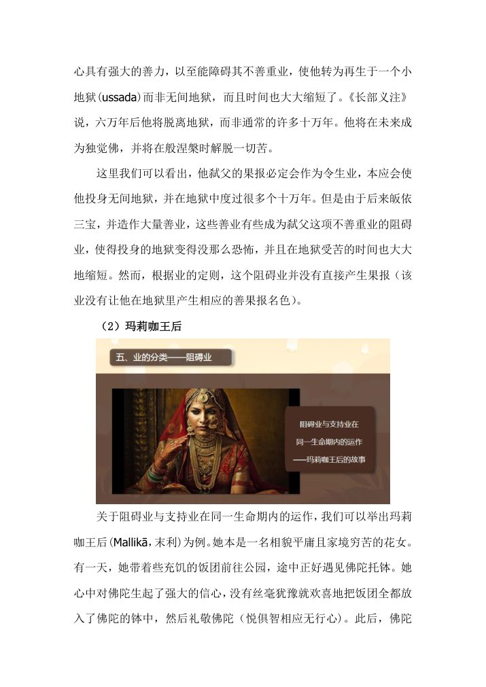

📅 最近更新：2026-09-29 00:00　|　第5版精修（朗读优化版）

# 第1周：业的总说与四类分类（主持人版）

> ⭐ **本讲主持人速览**（新主持人必读，2分钟看完）
>
> 你不是老师，是"共学同行者"。你不需要提前懂内容，只需要按流程走。
> **本周由连续两周内容合并**而成，含两段共读、两轮分享与两轮讨论，单讲 120 分钟。
>
> | 环节 | 标准时长 | ⏱ 时间不够→ | ⏱ 时间富余→ |
> |:-----|:----:|:-----|:-----|
> | 🧘 静心开场 | 10 min | 缩至5 min | 加2分钟静坐 |
> | 📖 共读原文1 | 20 min | 只读★核心段（约15 min） | 加读◈扩展段 |
> | 💬 第一轮分享 | 10 min | 每人1句话 | 每人3分钟 |
> | 🎯 第一轮主题讨论 | 10 min | 只讨论问题① | 讨论全部问题+扩展 |
> | 🧘 禅修练习 | 15 min | 缩至8 min（只念引导词前半） | 延长至20 min |
> | 📖 共读原文2 | 20 min | 只读★核心段 | 加读◈扩展段 |
> | 💬 第二轮分享 | 10 min | 每人1句话 | 每人3分钟 |
> | 🎯 第二轮主题讨论 | 10 min | 只讨论问题① | 讨论全部问题+扩展 |
> | 🔚 收尾与回向 | 15 min | 缩至10 min | 保持 |
>
> **主持人10条守则（精简版）**：
> ① 不讲解、不提供答案——让原文自己说话；② 有人问"正确答案"→说"先听听大家的看法"；③ 冷场→主持人先分享自己的真实感受；④ 跑题→温和拉回："这个有意思，我们回到今天的原文"；⑤ 争论→"两种看法都很好，大家保留自己的理解"；⑥ 确保人人发言；⑦ 不评判任何人的分享；⑧ 时间到了就推进；⑨ 禅修练习照读引导词即可；⑩ 结束一起回向。

> 本周主题：**业是"思"，是心的意志与行为；身、语、意三门皆能造业，而造业的思心所把潜力留在心相续流中，遇缘感果——所以业不是注定，起点由过去决定，方向由当下决定；业依作用分四种（令生／支持／阻碍／毁坏），依成熟次序分四种（重／惯行／临死／已作），临终时按"重→惯行→临死→已作"的次序排队成熟。**

---

## 📋 本周信息卡

| 项目 | 内容 |
|:----|:-----|
| 时长 | 120分钟（4周版 · 9环节） |
| 核心问题 | 什么是"业"？为什么说"思即是业"？身、语、意三业是怎样运作的？既然有业果，为什么说业不是宿命论、当下仍能转业改命？；业在生命里"干什么活"——令生业、支持业、阻碍业、毁坏业各是什么？临终时那么多业，谁先成熟——重业、惯行业、临死业、已作业的排队规律是什么？既然有"重业"这种几乎无法阻挡的业，我们当下还能做什么？（锚点：**令生业**） |
| 共读原文 | 共读原文1：材料①《第40讲-摄缘-十二缘起与二十四缘-释二十四缘-业缘2-古源尊者-20230521》（音声，依据录音转写整理）。　｜　共读原文2：材料①《第42讲-摄缘-十二缘起与二十四缘-释二十四缘-业缘4-古源尊者-20230611（共修版）》。 |
| 本周作业 | ①什么是"业"？为什么说"思即是业"？②身、语、意三业各指什么，举出自己生活中的一个例子。③用一段话说明"业不是宿命论"；并选一个本周发生在自己身上的念头，写出它的"思"是什么、后来造作了身／语／意哪一门。；①用自己的话说说令生业、支持业、阻碍业、毁坏业各"干什么活"；②临终时"重→惯行→临死→已作"的排队次序，为什么"惯行业"对我们最重要？③写下你本周想做的一件"小善行"，并说明你为什么愿意让它变成"惯行业"。 |

## 🧘 静心开场（10 min）

> 💬 **破冰｜3–5分钟**：回想今天，有没有一个小动作——递东西、回一句话、起身让座——是你「决定要做的」？一句话说说那个瞬间，说完就放下。

> 🛡️ **心理安全三约定**（每次开场在心里过一遍）：① **保密**——这里说的话不出这间屋子；② **不评判**——不评价任何人的分享，也不急着评价自己；③ **可随时暂停**——任何时候觉得不舒服，都可以停下来休息、喝水或离开，不需要解释。

> **主持人（照读）**：请大家把身体安顿好，脊背自然挺直，肩膀放松，双手轻放。眼睛可以半闭，或微微下垂。
>
> 现在，把注意力带到呼吸上——吸气，知道在吸气；呼气，知道在呼气。不用刻意深呼吸，只是知道。
>
> ……（静默约 1 分钟）……
>
> 现在，轻轻地把注意力从呼吸移到"心"上：刚才这一分钟里，心有没有跑开？跑去了哪里？有没有一点欢喜、一点烦躁、一点昏沉？不用评判，只是看着它。这就是我们今天的主题——"心"与"心的意志"。
>
> 在心里轻轻发一个愿：愿这两个小时，我放下评判，如实看见；愿我学到的，不只是一组名词，而是能用在今天、明天、这一生的智慧。
>
> 好，慢慢睁开眼睛。欢迎来到读书会13的第一周。

> 主持人（课前一句）：今天只有一个任务，就是把一件事装进心里——**"业，就是思；思，就是我们此刻的心。"**其余名相（令生业、次生受业……）我们后面七周慢慢认。学得慢一点没关系，学得踏实最重要。

## 📖 共读原文1（20 min）

> ⚠️ **主持人操作**：共读原文只读不解释。本环节是本周的"地基"。请主持人先立下**一句话**——"业＝思＝心的意志与行为"，再带大家看**身语意三业**，最后落到**非宿命论**：过去业只决定起点，当下仍在造业。原文照录，不擅自增删。

### 原文材料①：★核心·业缘2（业的总说）

- **文件**：《第40讲-摄缘-十二缘起与二十四缘-释二十四缘-业缘2-古源尊者-20230521》

> ⚠️ 主持人操作：本材料为录音转写，**重点读** [00:03:08]–[00:09:05]（业＝意志与行为、意即意业、无名聚中的思心所留存潜力、"果报如此，诸行可变"）。其余十四种业的经文讲述、罗萨卡帝沙尊者的长故事可**跳读或留作课后**。朗读时括注内整理注记跳过。

[00:00:00.300] 好，那在听法之前呢，我们还是……要跟我们的老师……分享功德与互相原谅，以此营造一个最好的听法的心态。好，大家请合掌，我们一起来礼敬……尊者，各位贤友，晚上吉祥。好，今天呢，我们继续来学习业缘的部分。

[00:02:33.460] 那今天呢，我们引用一下《中部·小业分别经》，来讲讲这个业果，它的这种运作的情况。那如果说呢，我们上一节课是从比较理论的层面来讨论业缘，那我们接下来呢，就从通俗一点的角度来看看我们日常所讲的这个业。

[00:03:08.920] 业，巴利语呢，是 kamma……词典中解释呢，是被造作的，就是业。那从字面的意义上来讲呢，有人说业是指意志，有人说是指行为或行动。那其实这两种说法都是正确的，因为"意"就相当于意业，而"行为"呢，就相当于语业和身业。然而，值得注意的是：没有意志呢，就不会有行为。

[00:03:48.240] 那这一点呢，我们可以从戒律本体的角度来看。那本体指的就是对善与恶的与意（作意）的关系。那在戒律当中呢，

[00:04:03.330] 有几种本体，叫心本体、语本体和身本体。也有分为有心犯的戒，比如说它必须是故意的；无心犯的，有无意的行为。有心戒呢，也叫世间罪，因为这些不善行在世间也是会被讥嫌的、违反道德的。那比如说虚妄语，虚妄语就属于心语本体。那当然，没有正念的时候呢，就不算了。邪淫呢，是属于心和身的分歧。杀人偷盗呢，是属于心与身本体。那无心戒呢，一般是身本体或语本体，也叫制定罪。那比如说过午不食，它属于身本体，这是佛陀制定的，但是在世间呢，就不会说是认为不好的。

[00:05:05.240] 那么单纯的思等起呢，是不会构成犯戒的。

[00:05:12.260] 那如果说业是行为，那行为背后这个心的思心所呢，就擅于……跟我们讲，就像车辆的驾驶员一样。通常认为，开车时驾驶员要对所有相关的事宜负全部的责任，而不是那辆车要负什么责任。所以，如果是单纯的身等起或语等起而没有心的配合呢，这种情况虽然在某些无心戒中算是犯戒，但并没有不恭敬法的那种善业。布施、持戒、禅修、信心、恭敬、服务等所有的善行，或者说十种行，那它们背后一定有善的思心所，以及在这个善的思心所集合下的无贪、无嗔、无痴等其他的美心所。

[00:06:06.060] 换言之呢，如果一项行为包含了无贪、无嗔、慧根这些美心所，也就是我们常常讲的无私、慈爱、智慧，那包含了与之相应的善心所，我们就可以判定它是善心、善的行为、健康的行为，未来可以带来善果报的行为，是智者所赞叹的行为。相反的，如果所造的行为总是跟自私、愤怒、吝啬、嫉妒、愚痴这些不善心所相应，包含这些不善心所相应的痴，或者说是由这些思心所以及由它集合相的不善心所参与，我们就可以判定它是不善心、不善行。

[00:06:52.360] 那例如包括三种身恶行、四种语恶行、三种意恶行的十不善业，或者说杀盗淫妄酒等等，这些行为是不健康的、伤害自他的，在未来会带来不善果报的，是会为智者所呵斥谴责的。那不管是善还是不善，所有这些心和心所造作后呢，它就灭去了。但造业的思心所却已在心相续流中留下了业的潜力。

[00:07:25.140] 那么这种力量呢，潜伏在心流里面，通过无间缘和等无间缘的缘力不断地传递下来。在因缘成熟的时候，它就会引申善或不善的果报。所以《法句》双品前面两首偈诵是这么说："诸法意先行，意主意生成，若以邪恶意，或语或行动，如此苦随彼，如轮随兽足。诸法意先行，意主意生成，若以清净意，或语或行动，如此乐随彼，如影随于形。"

[00:08:04.600] 佛陀将所造业大致归纳为十善业和十不善业。所谓十不善业，就是杀、盗、淫三种身业，虚妄语、粗恶语、离间语、绮语四种语业，贪、嗔、邪见三种意业。那与十不善业相反呢，就是离十不善业而造作的善行，就是十善业。

[00:08:30.520] 那关于十不善业，我们在学习因缘的时候，已经就……业的运作中相关的内容做了讲解。那么在这里呢，我们侧重于探讨十不善业和十善业在未来成熟时，将会产生什么样的果报，果报和业有什么样的联系和规律，以及如何适当地规避不善果报的成熟，并尽可能让善果报成熟，从而推动我们的生活修行更加安稳顺利地进展。

[00:09:05.040] 那我们当下的生命呢，就是过去业成熟所产生的果报，以及我们对果报的态度和行动的这样一个集合体。过去的业已经造下，我们无法去改变它，重要的是现在如何去把握，即如何营造适合的条件，从而尽量让善业成熟，并避免不善业成熟；以及现在如何造作能够导向涅槃、导向灭苦的业，从而在未来尽早解脱一切苦。也就是我们一再说的：果报如此，诸行可变。面对果报，我们应该是一个什么样的态度，以及如何让它尽快地导向解脱。

[00:09:54.440] 在此呢，我们就援引帕奥西亚多在《业的运作》中讲解的《中部·小业分别经》的部分来解说。

[00:10:04.260] 在经中讲到有一位年轻人名为苏巴多提亚子，他向世尊请教，他很傲慢地问说：朋友，乔达摩，是什么因什么缘，虽然都是人类，却发现人们有劣和胜？……能发现人有短命、有长寿，有多病、有健康，有丑陋、有美丽，有无威势、有大威势，有贫穷、有富有，有出身下贱、有出身高贵，有愚蠢、有聪慧？是什么因什么缘，虽然都是人类，但却发现人们有劣与胜？

[00:10:50.880] 那根据这部经的义注，这个苏巴已故的父亲呢，是个婆罗门，他也叫……是多特拉国王的祭司。那么在他生前呢，很多钱，但是呢，极端的吝啬。死后呢，因为贪图家里的财富，而在自己家的母狗的胎中结生，即他投生为一只狗。

[00:11:15.680] 有一天呢，佛陀托钵经过苏巴的家门口。那么这一只上一世……的狗呢，见到佛陀就一边吠叫着一边跑过来。佛陀就对他说：你以前作为人的时候也是轻视地称呼我，称呼我朋友，现在投身为狗，还是一样。那只狗呢，听了佛陀的话以后呢，心想说：这个沙门果德玛已经知道我了。他就垂头丧气地跑到火炉之间，就躺在那个灰烬里面。结果他的儿子小苏巴回来以后呢，听到这件事他就非常生气，他就想说：我的父亲……婆罗门已经投生到梵天了，这个沙门乔达摩说他投身为狗，信口胡言。

[00:12:01.770] 他来到了寺院，就想去责难佛陀，就问这个佛陀事情的经过是否如他家人所说的那样。佛陀回答说：就是那样。佛陀然后接着问了苏巴，说：你是否知道你的父亲暗地里还藏着一些财宝，没有告诉你藏在哪里吗？苏巴说：是的，有价值十万的金花环，价值十万的金鞋，价值十万的金碗，以及十万枚金币。佛陀说：你回去以后用乳粥喂那只狗，然后把它抱到床上睡，在他有点睡意的时候呢，就问他

[00:12:39.000] 埋藏财宝的事情。这个苏巴听了佛陀的话之后，心想：如果沙门乔达摩说的是事实，那么我将能得到一笔财富；如果沙门乔达摩所说的不是事实，那么我就可以指责他说话。这两种结果都会令他很满意。于是呢，他回家以后呢，就依佛陀所言去做。那只狗呢，

## 💬 第一轮分享（10 min）

> **分享规则（照读）**：我们做一个"不评判、不打断、不诊断"的分享。每人**1～2 分钟**，只讲自己的体会或困惑，不讲别人的故事；一次只请一位发言；不想说不说，完全自愿。主持人只做收束，不点评对错。

起手问题（由浅入深，任选 2～3 个）：

1. 听到"业就是思、就是心的意志"，你第一反应是什么？它和你以前理解的"业"有什么不一样？
2. 回想今天出门到坐下这一路，有没有哪一件事，是"先有意念、再有行为"的？（比如一句鼓励的话、一次忍住没发的脾气）
3. 在"身、语、意"三业里，你觉得自己**最难觉察**的是哪一门？为什么？

> 主持人提示：问题 2 是关键——把抽象的"思"落回今天的具体一刻。若有人讲得动情，先安顿、再回到主题；若现场安静，主持人可先讲一个自己的小例子暖场。

## 🎯 第一轮主题讨论（10 min）

> 讨论三问，由浅入深，指向实修。每问先给 1 分钟静默，再开放。

1. **"思即是业"意味着什么？**
   提示：业不是一种外在的"记账系统"，而是我们心里那个"思心所"在造作。讨论：如果我此刻只是"想"要骂人、但没有骂出口，这算不算业？身业与意业的差别在哪里？
2. **业为什么不是宿命论？**
   提示：原文说"过去的业已经造下，我们无法去改变它，重要的是现在如何去把握……果报如此，诸行可变"；也说"心转，业转，命运就会转"。讨论：如果一切都已注定，为什么佛陀还要教我们造善业？"转业改命"改的到底是"果"还是"因"？
3. **"一件事＝无量无边的业"，这对我意味着什么？**
   提示：造一次业里有无数个心识刹那，每个速行心都有思在造业。讨论：既然一念之间就造了无量业，那我们该如何看待自己"偶尔做了一件坏事"或"偶尔做了一件好事"？这对"当下可造新业"是安慰，还是压力？

> 主持人提示：第 2 问是本讲的**心理安全底线**，务必谈透——不把业讲成"命定"，也不把"转业"讲成"求什么得什么"。落回落点：我们只求"心是不是真的转了、业是不是真的转了"，命运转不转是果，不是能去追求的。

> **分层追问**（可视时间取用，由浅入深）：
> - 【现象】今天从早到晚，你有多少次是有意识地「决定」再去做一件事，又有多少次是顺手就做了？
> - 【影响】如果这些顺手而为的小事也在心里留下痕迹，你对「随手」这两个字的感觉，会有什么不同？
> - 【应对】这一周，挑一件最平常的小事——比如喝第一口水——做之前停一秒，看看那一秒里有什么。

## 🧘 禅修练习（15 min）

### 练习一

> ⚠️ **禅修禁忌提示**：若你正处在严重抑郁、焦虑、创伤后应激，或精神类疾病的发作／用药期，或正经历强烈的情绪危机，请先咨询医生或心理师，再决定是否练习；练习中若出现明显不适（如心悸、胸闷、情绪失控），请立即停止，睁开眼睛，把注意力放回呼吸与身体，必要时离场休息。

> **练习引导词（照读，慢）**：请坐好，闭上眼睛。先做三次自然的深呼吸……然后回到平常的呼吸。
>
> 现在，我们来做一次"观思"的小练习。在心里轻轻生起一个善念：愿坐在我身边的这个人平安、快乐。（停 10 秒）
>
> 觉察一下：刚才这个"愿……"的念头生起时，心是什么状态？是柔软的、还是勉强的？这个"想要对方好"的意志，就是"思"；这个思，就是正在造的业。（停 20 秒）
>
> 再想起今天让你有一点不耐烦的一件事，不追究细节，只是看着那个"不耐烦"。它也是一种思，也在造业——不过是需要被我们看见、被温柔对待的业。（停 20 秒）
>
> 现在回到呼吸，知道：我可以选择让心安放在善的意向上。每一次呼吸、每一个念头，都是一次新的造业机会——这就是"业非宿命"的意义。（静默约 2 分钟）
>
> 好，慢慢回到当下，睁开眼睛。

### 练习二

> ⚠️ **禅修禁忌提示**：若你正处在严重抑郁、焦虑、创伤后应激，或精神类疾病的发作／用药期，或正经历强烈的情绪危机，请先咨询医生或心理师，再决定是否练习；练习中若出现明显不适（如心悸、胸闷、情绪失控），请立即停止，睁开眼睛，把注意力放回呼吸与身体，必要时离场休息。

> **主持人引导语**（照读即可）：
>
> 请大家坐好，脊背自然挺直，双手轻放，眼睛半闭。
>
> 吸气，知道在吸气；呼气，知道在呼气。让身体先松下来。（静默约 1 分钟）
>
> 现在，我们把今天学到的，变成一次简单的观照。请在心中浮起一件"你平时最习惯做的善行"——也许是每天给家人一句问候，也许是每天出门前的一个善念，也许是每天的一点点耐心。**这就是你的"惯行业"。** 看着它，不用夸大，只是如实承认："我正在造这样的业。"（停 20 秒）
>
> 再浮起一件"你常常夹在善行中间的杂念"——不耐烦、抱怨、走神、求回报。**这就是让善业被削弱的"阻碍"。** 看着它，不责备，只是知道："原来它也在。"（停 20 秒）
>
> 再感受一下：此刻能在这里安静几分钟，本身就是很多"支持业"在托着你——健康的身体、能听闻佛法的因缘、愿意陪你的同修。**对这一切，轻轻说一声"谢谢"。**（停 20 秒）
>
> 现在，把这些都放下，回到呼吸。对自己说一句：**从今天起，我愿意让那件小小的善行，多重复一次、再干净一点。** 这一念，就是在"因上努力"。（静默约 2 分钟）
>
> 好，慢慢回到当下，睁开眼睛。

> 主持人（简化版，10 分钟时用）：若时间紧，可只做两步——① 一分钟呼吸安顿；② 只浮起"一件平常的善行"，对它说一句"我正在造这样的业"，其余观照省略。练习结束后**不必请人分享感受**，一句"把这份安静带回家"即可。

## 📖 共读原文2（20 min）

> ⚠️ **主持人操作**：共读原文只读不解释。请主持人先立下一句话——**业是有分工、有次序的：依作用分"令生／支持／阻碍／毁坏"，依成熟次序分"重／惯行／临死／已作"**，再带大家看四业怎么互相运作，最后落到"临终谁先上台"。开头四业定义**必读**（令生业定义是本周锚点）；重业一段中的"六种不善重业""定邪见三见"可**逐条点到即止**，不展开恐怖细节；涉及"世界间隙地狱""轮围世界毁灭"等长段，朗读时语气平和、语速宜慢，**可一句带过并说明"这是经典原文，我们取其'因上努力'的启示即可"**。

### 原文材料①：★核心·业缘4（令生·支持·阻碍·毁坏业与成熟次序）

- **文件**：《第42讲-摄缘-十二缘起与二十四缘-释二十四缘-业缘4-古源尊者-20230611（共修版）》

**【五、业的分类（一）依产生的作用】**

“令生业”是善与不善并于结生及转起令生色与非色的异熟蕴业。

“支持业”是不能生异熟，但支持、持续由于其他的业给与结生之时而生的异熟中所生起的苦乐。

“妨害业（阻碍业）”是妨害障碍及不予持续由于其他的业给与结生之时而生的异熟中所生起的苦乐。

“破坏业（毁坏业）”自己虽亦是善或不善，但破坏其他力弱的业及排斥它的异熟，而作为自己的异熟生起的机会。

也就是说，令生业分结生时的和生命期间能转起异熟色蕴非色蕴的业，而支持业和阻碍业只是针对结生令生业而言，破坏业则是任何时候能破坏其他力弱业，并可能产生自己的果报的业，或允许其他业产生果报的业。

**【1. 令生业】**

关于令生业，需要再明确一下，应该是说除了导致结生的业称为令生业以外，在生命期间，所有能令果报名色生起的业都叫“令生业”，我们再复习一下，《清净道论》中说的：

“令生业”是善与不善并于结生及转起令生色与非色的异熟蕴业。

也就是说，令生业分结生时的和生命期间能转起异熟色蕴非色蕴的业，而支持业和阻碍业只是针对结生令生业而言，破坏业则是任何时候能破坏其他力弱业，并可能产生自己的果报的业，或允许其他业产生果报的业。

上一生造下的次生受业以及过去所有的后受业都可能在生命期间成熟为令生业，而非临死速行或者临死速行前后的不善思或善思才行。

**【2. 支持业】**

“支持业”是不能生异熟，但支持、持续由于其他的业给与结生之时而生的异熟中所生起的苦乐。

支持业则与阻碍业相反。例如，一个善的令生业成熟令我们投生为人，邻近它的一个善业成熟为支持业，就可能令我们得以投生到更好的家庭，或者使我们在发育过程中诸根得到更好的滋养，身体更加健康强壮，先天的禀赋更好。与该令生业具同一性的善业也将作为我们生命期间的令生业或支持业持续产生作用，维持我们的寿命与健康。

**【3. 阻碍业】**

“妨害业（阻碍业）”是妨害障碍及不予持续由于其他的业给与结生之时而生的异熟中所生起的苦乐。

阻碍业的作用是阻挠与障碍。它阻碍其他业的果报，但并不产生自己的果报。它也可以是不善的或善的，不善业阻碍善的令生业，善业阻碍不善的令生业。

举例而言，当一个善业作为令生业产生人的结生时，不善阻碍业可以使他生来就有病，让他不能享受善令生业本应带来的乐报。因此，即便是强大令生业的果报，也可能会被跟它直接对抗的业所障碍。

不善业可以阻碍原本带来更高生存界结生的善业，以致有情再生于较低的生存界；善业可以障碍原本带来大地狱结生的不善业，有情得以转而再生于小地狱或是鬼界。

此外，不善业也可以阻碍产生长寿的善业，有情因而短命（短命死亡是毁坏业，阻碍业可令导致死亡的毁坏业提前到来）；不善业亦可以障碍产生美貌的善业，导致有情外表丑陋或相貌平庸；不善业还可以阻碍令生于高贵之家的善业，有情转而再生于卑贱之家，等等。

**【4. 毁坏业】**

“破坏业（毁坏业）”自己虽亦是善或不善，但破坏其他力弱的业及排斥它的异熟，而作为自己的异熟生起的机会。

《业的运作》中说，毁坏业有三种运作方式：

(1) 它中止较弱的业，且既不带来自己的果报，也阻止其他业带来果报；

(2) 它中止较弱的业，虽然不带来自己的果报，但却允许其他业带来果报；

(3) 它中止较弱的业，并引生自己的果报。

毁坏业也有善与不善两者，它就像能够截停飞箭并令其坠落之力。

在此，帕奥西亚多特别举了天人的例子。善的令生业带来天人的结生，但某个不善业突然成熟为毁坏业从而导致天人死亡，并再生为畜生、鬼或地狱有情。例如，当天子、天女们过度沉迷于享乐时，某个不善业会成熟为毁坏业而直接导致他们燃烧，如此死去并投生到恶趣。另外，当天人看到另一个天人更美丽，或者别人的天宫更漂亮时，若他生起强大的妒忌心，某个不善业也会成熟为毁坏业而导致他死亡并投生到恶趣。这就是不善业成熟为毁坏业，中止较弱令生业的果报，并同时产生自己的果报。

阻碍业与毁坏业的区别：阻碍业自己不产生果报，而是阻碍结生令生业的果报。毁坏业则有可能产生自己的果报。

有时毁坏业会像阻碍业一样运作：它只在一期生命内中断一个较弱业的果报。而这个较弱的业仍能在其后的某生命期间产生果报。

毁坏业与令生业的区别：毁坏业侧重于阻断较弱的业的令生力量，而给自己或其他的业的成熟提供机会。毁坏业不一定会产生果报，但令生业则一定会产生果报。

**【五、业的分类（三）依成熟的顺序】**

业依成熟的顺序可分为四种：

1. 重业(garuka-kamma)；
2. 惯行业(āciṇṇa-kamma)；
3. 临死业(āsanna-kamma)；
4. 已作业(katattā-kamma)。

对此，也有些老师把临死业放在第二，帕奥西亚多和很多西亚多则把惯行业放在第二位，临死业放在第三位。

**【1. 重业】**

善的重业只有一种，即一直维持到临终的禅那，其他所有欲界的善业都是不定业，不管这善业有多强，都不一定能在临终的时候成熟。

不善的重业有六种，即：弑母、弑父、弑阿拉汉、以邪恶心出佛身血、分裂僧团以及持有定邪见。持有定邪见指的是命终时持有否定业运作的邪见。

若在一期生命当中，一个人只是造下了上述六种不善的重业之一，该业必然成为次生受业，其果报是一定会投生到地狱——它不可能被任何其他业所阻碍、中断。因此，这些业也被称为无间业。对于前五种，一旦故意造下该恶行，当下即成为重业；但对于第六种定邪见，一个人只有在临终的时候——死亡心生起之前的最后一个心路——依然固持邪见，它才会成为重业，而令此人投生到地狱。

定邪见特指完全否定业运作的邪见。它表现在三个方面：

(1) 无作见：否定善恶业的运作。即否定有善恶业，认为无论造下了善行或不善行，都不会留下善业或恶业的力量。

(2) 无因见：否定果报有因有缘。即认为所有事情的发生，要么是命运使然，要么是偶然遇到，要么是自然界本来就会如此发生，它否定事情的发生、果报的产生一定有过去的因，以及现在的缘。

(3) 虚无见：认为任何因都不会有果报。即认为只有物质才是真实存在的，否定行为有任何的果报，因此它也否定再生和其他的生存地。"人死如灯灭"就属于虚无见。

在这六种不善重业中，命终时执持上述邪见的业最重，其结果是会在地狱中长久受苦乃至持续数劫。只要该业的业力还在，即使是在轮围世界毁灭，大部分的有情都已经逃离地狱时，这些持有定邪见的有情仍会在存在于轮围世界之间空隙处的世界间隙地狱受苦。

如果一个人造下了前面五种不善重业，那么他这一生再不可能证得任何上人法，即不可能再证得禅那，更不用说出世间的道、果。

## 💬 第二轮分享（10 min）

> **分享规则（照读）**：每人约 2 分钟，讲完就交棒，不打断、不点评、不辩论；不想讲的书友可以只做听众，完全自愿。我们不是在比谁懂得多，而是让"书里的字"碰上"自己的日子"。

**起手问题（由浅入深，任选 2–3 个）**：

1. 今天知道了业有四种"分工"——令生、支持、阻碍、毁坏。请举一件你生命里"像支持业一样"帮过你的事，或"像阻碍业一样"挡过你、后来却让你成长的事。
2. "惯行业"就是平时做得最多的事。回看你最近一个月，你"习惯性地"做得最多的是哪一种心念或行为？它若在临终先成熟，你希望它是什么？
3. 造善业时中间夹杂不善，会"很亏"——不抵消，但会被削弱。你有没有过"做一件好事，却一边做一边不耐烦／抱怨"的经历？当时心是什么状态？

> 追问提示（视时间酌情）：若某位书友谈到重病、亲人过世或"是不是我造了什么业"，请把话头柔和带回——"我们不解释任何人的遭遇，只谈自己当下能种的因"，并把麦克风交给下一位自愿者。分享的价值在"说出来那一念的诚实"，不在故事本身。

## 🎯 第二轮主题讨论（10 min）

> **讨论规则**：三问由浅入深，可全谈，也可只深谈第 1、3 问。讨论的目的是"照见自己"，不是"得出结论"。

**第 1 问：令生业、支持业、阻碍业、毁坏业——请各用一句"接地气"的话说说它们干什么活？四者里，哪一个最像"一票否决"？**

> 提示：引导书友把名词换成画面——令生＝"让我出生、并让果报名色生起"；支持＝"让好的持续"；阻碍＝"让好的打折、把苦提前"；毁坏＝"截断别的业、一票否决"。再追问：毁坏业和阻碍业最大的区别是什么？（阻碍业自己不结果报，毁坏业可能引生自己的果报。）再往下带一层：本周材料里有"善的毁坏业"，它可以截断较弱的不善令生业——这说明什么？（善的力量真实、可修可积。）落到生活：一句重话、一个决定，有时就是"毁坏"级的业；反过来，一份持续的善意，也可以成为"支持业"。

**第 2 问：临终时四种业都想来成熟，次序是"重→惯行→临死→已作"。为什么说"惯行业"对我们当下最重要？**

> 提示：点出三种业里，重业（禅那、六种无间业）多数人够不着，临死业又太被动，**唯有"惯行业"是几十年可以自己经营的**——每天做一点，就在攒"临终会先现前的那一块"。可引玛莉咖王后的例子（虽然堕地狱，但惯行善业成为毁坏业，七天后即生天界）——**惯行的善业连不善的定业也能"缓一缓"**。追问：如果要为临终"攒一趟惯行业"，你打算从今天起每天做的一件小事是什么？注意：这里不是教大家"算计临终"，而是借"临终会先想起什么"来照见"平时在心上下的是什么功夫"。

**第 3 问：重业几乎无法被阻挡——那么"造过重业／担忧自己过往的人"该怎样理解这件事？业真的是宿命吗？**

> 提示：这是本周的心理安全重点。先明确：教理说重业的果报难被别的业阻挡，但**这不等于宿命、也不用来判定任何人**。落回三点——①过去已成的事实，我们能做的是"当下不再造新的、并让善业成为惯行业"；②经典也示现了"毁坏业可被善业中止"（玛莉咖王后七天出地狱），可见善业的力量真实；③**因上努力，果上随缘**：不评判他人过往，不给自己贴"完了"的标签。

> 主持人：若讨论滑向"某人是不是造了重业"的猜测，温和收束——"我们不做任何人的判官，只回看自己的心"。若有人因"定邪见"一段而困惑（"我是不是也算无因见"），只作一句澄清：**"经典讲的是命终时固持到不肯回头的那一念；此刻愿意来学法、愿意反省，就已经走在另一条路上了。"**

> **分层追问**（可视时间取用，由浅入深）：
> - 【现象】同一件事，有时你做得毫不犹豫，有时却要人推一把才动，这两种时候你留意到的差别是什么？
> - 【影响】那些你反复做、几乎不用想的习惯，正悄悄替你的未来排队——想到这一点，你心里浮起的是什么？
> - 【应对】这一周，每天睡前想一件「今天反复做过的小习惯」，只记下它，不加评判。

## 🔚 收尾与回向（15 min）

### 收尾一

> **总结引导（照读）**：今天我们一起认识了三个词——**思、业、心**。业不是命定的判决书，而是我们此刻心念与行为的记录与潜能。身、语、意三门都能造业，而造业的那一念"思"，把潜力留在心相续流中，遇缘感果。**过去的业决定了今天的起点，但当下每一次起心动念，都是在造新的业、转新的向。** 这就是"业非宿命论"。

> **下周预告**：第2周我们进入"业的成熟与善不善业"，看业依成熟时间分四种（现法受业／次生受业／后后受业／无效业）、依成熟之地分四种，并看十善／十不善与三福行事。请带着今天的问题来：既然业不是注定，那"什么时候成熟、在哪里成熟"又是谁在安排？

> **回向词（四句，合掌齐诵）**：
>
> 愿以此功德，普及于一切；
> 我等与众生，皆共成佛道。
> 愿消三障诸烦恼，愿得智慧真明了；
> 普愿罪障悉消除，世世常行菩萨道。

### 收尾二

> **总结引导（照读）**：今天我们一起给业"排了两次队"。**依作用**，业分四种——令生业让我们出生、并让果报名色生起；支持业让好的持续；阻碍业让好的打折、把苦提前；毁坏业一票否决。**依成熟次序**，临终时按"重业→惯行业→临死业→已作业"排队成熟。名字不必全记住，请记住一件事：**在四种次序里，唯一能由我们几十年慢慢经营的，是"惯行业"。** 今天做一点，明天做一点，功不唐捐。

> **一句话带回家**：**因上努力，果上随缘**——不渲染恐怖，不评判他人过往，只回看自己当下能种的因。

> 给主持人的最后一句（不必照读）：今天的课如果只留下一句话，就留这句——**"因上努力，果上随缘。"** 重业、临死业这些名词，我们要讲得清楚，但不必讲得吓人；真正要交到书友手里的，是"**从今天起，那件小小的善行，我愿意多做一次、做干净一点**"这个可把握的因。

> **回向词（四句，合掌齐诵）**：
>
> 愿以此功德，普及于一切；
> 我等与众生，皆共成佛道。
> 愿消三障诸烦恼，愿得智慧真明了；
> 普愿罪障悉消除，世世常行菩萨道。

## 📌 本讲主持人特别提醒

1. **心理安全底线——业非宿命论**：本讲涉及"命运是否注定"，务必明确传达：**业非宿命论——过去业决定起点，当下可造新业、转业改命。** 绝不把"业"讲成"命里注定、无力改变"，也不把"转业"讲成"求什么得什么"。
2. **不评判、不诊断**：讨论到"过去生、业报"时，主持人不追问、不贴标签、不替人下结论。若书友因分享过往而情绪起伏，优先安顿人：提供呼吸放松或暂离选项，再说内容。
3. **柔和用词、不渲染恐怖**：毁坏业案例（天人死亡、被烧死、地狱等）语气平和讲述，不渲染恐怖、不恐吓；"世界间隙地狱""被烧煮一万年"等经典描述，**一句带过**，可加"这些是经典里的教说，我们取其'因上努力'的启示即可"。
4. **临终关怀的边界（必读）**：原文明确提醒——**鼓励或安排父母安乐死、或在临终时劝其"放下已破败的生命"，若对方因此而死，可能构成弑父弑母的重业**。共读至此段时，**照读原文即可，不作个案指导、不给具体建议**；若现场有人正面临亲人临终，柔和回应"这属于很专业的临终关怀领域，我们把它记下来，建议向善知识或专业人士请教"。
5. **照录纪律**：共读原文一律照读，不擅自增删改；音声转写中明显同音错字已校对（如"知识业"＝支持业、"接生"＝结生、"中指"＝中止、"亚卡"＝夜叉、"树形／塑行"＝速行），朗读时括注内整理注记跳过。
6. **分享自愿**：任何人有权保持沉默；不点名、不逼问、不要求每人必须发言。**请勿用"重业"二字指向任何在场者或任何人。**
7. **落到实修**：提醒大家，本周作业不是考试，而是练习"观自己的思"——把"思即是业"用在今天的下一次起心动念里，把那件小小的善行多做一次、做干净一点。**能把握的因，永远在当下。**

<!--EXT_READ-->
## 📖 延伸阅读（课后自由选读）
- 《古源尊者24缘释义第12讲-业缘（第二节）》——本周材料②：业的分类总览（从"一种业是思"到四组四）。
- 《第145课-业的运作_业的定则1（共修版）》——本周材料③：业的定则；课后可自读五门心路／意门心路的名法表。
- 《第148课-业的运作_毁坏业_成熟之地（共修版）》——材料③的文字版，文字完整、便于朗读。
- 《24缘教学36-20190920-Bhante Ven.Uttama》（音声）——依作用分类与三方面定律。
- 《第42讲-摄缘-12缘起与24缘-业缘4（共修版）》——本讲材料①：令生／支持／阻碍／毁坏业＋重／惯行／临死／已作业。
<!--/EXT_READ-->
