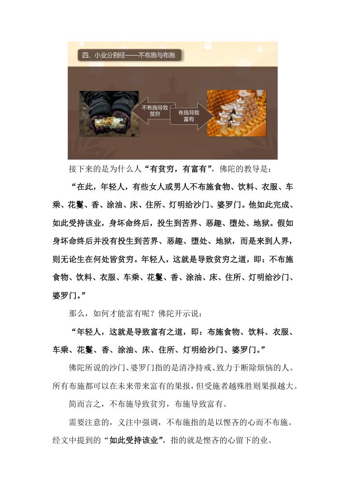

📅 最近更新：2026-09-29 00:00　|　第5版精修（朗读优化版）

# 第2周：业的成熟与善不善业（主持人版）

> ⭐ **本讲主持人速览**（新主持人必读，2分钟看完）
>
> 你不是老师，是"共学同行者"。你不需要提前懂内容，只需要按流程走。
> **本周由连续两周内容合并**而成，含两段共读、两轮分享与两轮讨论，单讲 120 分钟。
>
> | 环节 | 标准时长 | ⏱ 时间不够→ | ⏱ 时间富余→ |
> |:-----|:----:|:-----|:-----|
> | 🧘 静心开场 | 10 min | 缩至5 min | 加2分钟静坐 |
> | 📖 共读原文1 | 20 min | 只读★核心段（约15 min） | 加读◈扩展段 |
> | 💬 第一轮分享 | 10 min | 每人1句话 | 每人3分钟 |
> | 🎯 第一轮主题讨论 | 10 min | 只讨论问题① | 讨论全部问题+扩展 |
> | 🧘 禅修练习 | 15 min | 缩至8 min（只念引导词前半） | 延长至20 min |
> | 📖 共读原文2 | 20 min | 只读★核心段 | 加读◈扩展段 |
> | 💬 第二轮分享 | 10 min | 每人1句话 | 每人3分钟 |
> | 🎯 第二轮主题讨论 | 10 min | 只讨论问题① | 讨论全部问题+扩展 |
> | 🔚 收尾与回向 | 15 min | 缩至10 min | 保持 |
>
> **主持人10条守则（精简版）**：
> ① 不讲解、不提供答案——让原文自己说话；② 有人问"正确答案"→说"先听听大家的看法"；③ 冷场→主持人先分享自己的真实感受；④ 跑题→温和拉回："这个有意思，我们回到今天的原文"；⑤ 争论→"两种看法都很好，大家保留自己的理解"；⑥ 确保人人发言；⑦ 不评判任何人的分享；⑧ 时间到了就推进；⑨ 禅修练习照读引导词即可；⑩ 结束一起回向。

> 本周主题：**业依成熟时间分四种（现法受业／次生受业／后后受业／无效业），依成熟之地分四种（不善业／欲界善业／色界善业／无色界善业）；成熟要"因＋条件"配合，条件里有当下可造的新业。以及十善／十不善是善与不善的分界、《小业分别经》的十四种业、三福行事（布施、持戒、禅修）。**

---

## 📋 本周信息卡

| 项目 | 内容 |
|:----|:-----|
| 时长 | 120分钟（4周版 · 9环节） |
| 核心问题 | 业"什么时候熟"——现法受业、次生受业、后后受业、无效业各是什么？业"在哪里熟"——不善业、欲界善业、色界善业、无色界善业各自导致什么样的结生？既然成熟要靠"因＋条件"，那么"条件"里有哪些是我们当下就能动的？（锚点：**后后受业**）；善业与不善业的分界在哪里？十不善业（身三语四意三）与十善业各是什么？《小业分别经》用"十四种业（七对）"说明了什么？什么是"三福行事"，我们当下可以从哪一件"小善"做起？（锚点：**小业分别经**） |
| 共读原文 | 共读原文1：材料①《第43讲-摄缘-十二缘起与二十四缘-释二十四缘-业缘5-古源尊者-20230618（共修版）》。　｜　共读原文2：材料①《第41讲-摄缘-十二缘起与二十四缘-释二十四缘-业缘3-古源尊者-20230528（共修版）》。 |
| 本周作业 | ①用自己的话说说现法受业、次生受业、后后受业、无效业各"什么时候熟"；②为什么"后后受业"数量最多、影响最长？③"成熟要靠因＋条件"这句话，对你看待自己生活里的一段困境有什么启发？④写下你本周愿意做的一件"新业"，并说明你想为哪一件"未来的成熟"种下条件。；①用自己的话列出十不善业（身三、语四、意三）与十善业，并各举一个你生活里"最常犯"或"最容易做"的例子；②《小业分别经》的"不布施与布施"这一对，说明了什么道理？③写下你本周愿意做的**一件最小的善**，并说明它属于哪一福行事。④"诸恶莫作、众善奉行"这句话，如果只从"当下一念"做起，你打算从哪里开始？ |

## 🧘 静心开场（10 min）

> 💬 **破冰｜3–5分钟**：想一件你很久以前做过、却到今天才看到结果的事——一句话说说它，说完就放下。

> 🛡️ **心理安全三约定**（每次开场在心里过一遍）：① **保密**——这里说的话不出这间屋子；② **不评判**——不评价任何人的分享，也不急着评价自己；③ **可随时暂停**——任何时候觉得不舒服，都可以停下来休息、喝水或离开，不需要解释。

> **主持人引导语**（照读即可）：
>
> 请大家把身体安顿好，脊背自然挺直，肩膀放松，双手轻放。眼睛可以半闭，或微微下垂。
>
> 现在，把注意力带到呼吸上——吸气，知道在吸气；呼气，知道在呼气。不用刻意深呼吸，只是知道。
>
> ……（静默约 1 分钟）……
>
> 今天我们会遇到一组听起来很"宿命"的词：现法受业、次生受业、后后受业、无效业；不善业、欲界善业、色界善业、无色界善业。听到"业什么时候熟、在哪里熟"，心里也许会说："那不就是命里注定了吗？"**请先放下这个念头。** 轻轻对自己说一句：**"我今天不是来认命的，我是来看清楚的——看清楚业怎么熟，才知道该在哪儿下功夫。"**
>
> 再想起一件很具体的小事——今天早上你做过的一个小小的选择：也许是对谁笑了一下，也许是耐住了一句顶嘴，也许是顺手帮了一个人。**这就是"业"，它已经造下了；它什么时候熟、在哪里熟，需要条件；而你此刻愿意在这里安静下来、愿意种一个清净的因，本身也是一个新的业。**
>
> 在心里轻轻发一个愿：愿这两个小时，我放下评判，如实看见；愿我学到的，不只是一组名词，而是能用在今天、明天、这一生的智慧。

## 📖 共读原文1（20 min）

> ⚠️ **主持人操作**：共读原文只读不解释。请主持人先立下一句话——**业依成熟时间分四种（现法／次生／后后／无效），依成熟之地分四种（不善／欲界善／色界善／无色界善）**，再带大家看"什么时候熟、在哪里熟"，最后落到"成熟要靠因＋条件"。**"后后受业"与"条件可以创造"两处，一定要读慢、读完。** 本周名相多，读的时候不要"怕漏"；漏一个名词不算大事，把意思讲成"命定"才是大事。全书最关键的一句，请先贴在心上：**"只有条件具足才会成熟，而我们可以去创造、改变条件。"**

### 原文材料①：★核心·业缘5（依成熟的时间与依成熟之地）

- **文件**：《第43讲-摄缘-十二缘起与二十四缘-释二十四缘-业缘5-古源尊者-20230618（共修版）》

> ⚠️ 主持人操作：本材料为共修版课件文字，**重点读**〈（四）依成熟的时间〉与〈（五）依成熟之地〉两大段。开头"今天学习"四条**必读**；四业定义中**现法受业与后后受业两段必读**（"后后受业"是本周锚点）；无效业一段含初果／二果／三果圣者"业失能力"的说明，**可读其三种情况，圣者部分一句带过**；课件中的关系图以代码导出、OCR 失真，**不照读**，以成段说明为准。

**【五、业的分类】**

前面已经学习了：

- 依产生的作用而有四：令生业、支持业、阻碍业、毁坏业。
- 依成熟的顺序而有四：重业、惯行业、临死业、已作业。

今天学习：

- 依成熟的时间而有四：现法受业、次生受业、后后生业、无效业。
- 依成熟之地而有四：不善业(只在欲界/色界成熟)、欲界善业(只在欲界/色界成熟)、色界善业、无色界善业。另外，按令生业成熟之地，则有欲界不善趣(四恶趣)、欲界善趣(人和六种欲界天)、色界、无色界四种结生。
- 四种成就和四种失坏，即：趣成就和趣失坏、所依成就和所依失坏、时成就和时失坏、方式/努力/加行成就和方式/努力/加行失坏。

**【（四）依成熟的时间】**

业依成熟的时间可分为四种：

1. 现法受业 (diṭṭhadhamma-vedanīya kamma)；
2. 次生受业 (upapajja-vedanīya kamma)；
3. 后后受业 (aparāpariya-vedanīya kamma)；
4. 无效业 (ahosi kamma)。

**【1. 现法受业】**

现法受业是指一条造业的速行当中，第一个速行心造下的业。因为它在速行当中第一个生起，没有得到重复缘的支持，所以它造业的思心所力量最弱，它造下的业只能在当生成熟，如果当生不能成熟，就会成为无效业。

**【2. 次生受业】**

次生受业是指一条造业的速行当中，第七个速行心造下的业。在善或不善的七个速行心当中，第一个速行心并没有得到重复缘的加强，同时，思心所刚刚第一次组织对该所缘采取行动，各心所之间配合还不熟练，所以它的思心所造下的业最弱；第二个速行心会在第一个速行的基础上增强，第三、四、五、六个速行也同样地由于得到重复而愈来愈熟练、有力；在讲重复缘时提到过，对于第七个速行的强弱有两种说法：一种说它最强，一种说它只比第一个速行更强。关于第一种说法，马哈甘达勇西亚多说，第七个速行最强，因为它受到熏习的时间最长；而第二种说法的理由是，第七个速行是最后一个，即将落入有分流，所以它是第二弱的速行。帕奥西亚多给出的教导是后者，从一些禅修者观察，由于第七个速行思和被组织的相应心所已经配合很熟练，心不需要太用力就能很容易地达成目标，所以第二弱。

其实，这里两位西亚多的说法是从不同角度去描述的。马哈甘达勇西亚多说，第七个速行最强，是就熟练程度而言。帕奥西亚多所说的，第七速行是第二弱的速行，是就努力程度而言。

**【3. 后后受业】**

后后受业指的是第一与第七之间的中间五个速行心造下的业。它们从次生之后的下一生开始成熟，一直到尽未来十万劫或更久，只要它没有成熟，都还有力量在遇到因缘的时候成熟。

**【4. 无效业】**

无效业包括三种情况：

1. 第一个速行心造下的业，若当生没有成熟，在这一期生命结束时将成为无效业；
2. 第七个速行心造下的业，将在造业之后的下一生成熟，若下一生没有成熟则成为无效业；
3. 包括佛陀、独觉佛在内的阿拉汉圣者，在无余涅槃的时候，他们过去所有的善业、不善业都将成为无效业。

另外，在一位初果圣者证得入流道的当下，所有不善业都将丧失在恶趣结生、带来果报的能力，所有业最多七次在善趣证得阿拉汉之后就都会成为无效业。

在一位不来圣者不来道智生起的当下，所有善与不善的次生受业与后后受业都将丧失带来欲界结生及属于欲界生命的果报的能力。

为什么初果、二果、三果圣者的道智会有这样的能力？因为业的成熟总是和烦恼配对的，在开始学习十二缘起的时候，我们就知道，邪见是恶趣的根，无明和渴爱是轮回的根，所以只要断除了邪见就断了恶趣的根（初果圣者已断除邪见，所有导向恶趣的业的能力皆丧失）。

## 💬 第一轮分享（10 min）

> **分享规则**（照读）：①一次一位，不打断；②每人 60–90 秒，主持人用手势给信号；③可以说"我还没想好"，一句"我先听听"也可以；④分享的是自己的体会，不做别人的老师、不给别人下判断；⑤涉及过去生、业报、家中不幸等话题，只讲"我看到什么"，不替人解释因果。

**起手问题（由浅入深，任选 2–3 个）：**

1. **"现世报"你信吗？** 请说一件你亲历或亲见的小事——做了一件小的善事，很快就有一种"心里亮了一下"的回报；或者说了句重话，当天就不舒服。（这对应"现法受业"）
2. **"还没报"的事**：有没有一件事，你当时觉得自己吃了大亏、受了委屈，过了很多年才发现它其实帮了你？
3. **你最近"在哪里熟"？** 用大白话说说：最近你的心，更多时候是"人天的心"（清明、柔软、能付出），还是"恶趣的心"（恼、贪、怨）？
4. **一句话分享**：本周材料里，哪一句最打动你？把它读出来，说说为什么。

> 主持人提示：若有人用"现法受业"去解释别人的病痛或遭际（"他这样是报应"），**立刻温和拦下**："我们今天学的是地图，不是判决书；用业去判别人，本身就是一种不善心。我们只回看自己。"分享环节不必每人都讲；若某个起手问题冷了场，**换一个更好答的**："这周你做过最小的一件好事，是什么？"也允许"今天我只想听"，把沉默当作参与。

## 🎯 第一轮主题讨论（10 min）

**引导问题 1｜业"什么时候熟"——为什么"后后受业"最多、最长，也最容易被我们忽视？**

- **提示**：一条速行心路有七个速行心：第 1 个造的是现法受业（当生熟，不熟即废），第 7 个造的是次生受业（下一生熟，不熟即废），**中间 5 个造的是后后受业**——"从次生之后的下一生开始成熟，一直到尽未来十万劫或更久，只要它没有成熟，都还有力量在遇到因缘的时候成熟"；而且**中间五个"每一个都可以分别带来果报"**。所以，我们一生所造的后后受业**数量最多、影响最长**。
- **落点**：**"每一次呼吸、每一个念头都在造业"——这不是压力，而是机会：既然我们无时无刻不在造业，那我们也就无时无刻不在"为未来种因"。**

**引导问题 2｜"在哪里熟"——不善业、欲界善业、色界善业、无色界善业，为什么心念更重要？**

- **提示**：**不善业只在欲界或色界成熟**，**欲界善业也只在欲界或色界成熟**，而**色界善业只在色界成熟、无色界善业只在无色界成熟**；色界／无色界善业"只是意业，指通过修习而证得的安止定"。也就是说，**越高的"熟地"，越靠"心"下功夫**——不是靠做事多、花钱多，而是靠定、靠心的净化。
- **落点**：本周不求"证禅那"，只求**"把心的熟地往上挪一点点"**——比如，一天里给自己留五分钟，让心从"忙、乱、怨"里出来。

**引导问题 3｜"成熟要靠因＋条件"——那么，我能动的是什么？**

- **提示**：**"并非有因就一定有果报，但有果报一定有因"**；业要成熟，靠"因（过去的业）"与"条件（四种成就／四种失坏）"配合。**"成就，使恶业无法成熟并令善业得以成熟；失坏，则使善业无法成熟并令恶业得以成熟。"** 更要紧的是最后一句：**"只有条件具足才会成熟，而我们可以去创造、改变条件。"**
- **落点（本周最重要的一问）**：把"业"从"判决书"变回"工作清单"——**我这一周能改的一个"条件"是什么？**（可能是"早点睡"，也可能是"见人先说一句好话"。）**注意：这仍是因上努力，果上随缘，不承诺任何"必须发生的果"。**

> 主持人（讨论收束语，照读）：今天我们谈了业"什么时候熟、在哪里熟"，最容易听成"命里注定"。请把它反过来听：**成熟要靠因＋条件，条件里有当下能造的新业。** 这不是心灵鸡汤，是阿毗达摩的结论——**"只有条件具足才会成熟，而我们可以去创造、改变条件。"**

> **分层追问**（可视时间取用，由浅入深）：
> - 【现象】有的行为当场就有回响，有的却隔了很久才显现——你留意过自己生活里这两种节奏吗？
> - 【影响】当你发现有些「因」要很晚才熟，你对自己今天随手做的事，会不会多一分在意？
> - 【应对】这一周，给自己留一句话的位置：每天写下「我希望它在未来成熟的一件小事」。

## 🧘 禅修练习（15 min）

### 练习一

> ⚠️ **禅修禁忌提示**：若你正处在严重抑郁、焦虑、创伤后应激，或精神类疾病的发作／用药期，或正经历强烈的情绪危机，请先咨询医生或心理师，再决定是否练习；练习中若出现明显不适（如心悸、胸闷、情绪失控），请立即停止，睁开眼睛，把注意力放回呼吸与身体，必要时离场休息。

> **主持人引导语**（照读即可）：
>
> 请大家坐好，脊背自然挺直，双手轻放，眼睛半闭。
>
> 吸气，知道在吸气；呼气，知道在呼气。让身体先松下来。（静默约 1 分钟）
>
> 现在，我们把今天学到的，变成一次很简单的观照。先想起**今天早上到此刻，你做过的一件小小的善事或一句温和的话**。**这就是"业"，它已经造下了；它什么时候熟，需要因缘；但你造它的那一念，是真的。** 看着它，不用夸大，只是承认："我造过这样的业。"（停 20 秒）
>
> 再想起**一件让自己心里发紧的小事**——也许是没说好的一句话，也许是压着的一口气。**这就是一个"还未成熟的因"。** 不责备，只是知道："原来它也在。"（停 20 秒）
>
> 现在，把两件事都放下，回到呼吸。然后，在心里种下一颗新的种子，说一句：**"从今天起，我愿意为一件好事，多造一个条件。"** ——不必很大，只是"多一句好话""早睡半小时""今天不把气带回家"。（静默约 2 分钟）
>
> 好，慢慢回到当下，睁开眼睛。

> 主持人提示：**本练习不承诺任何结果、不承诺任何"报应会转"，只是练习"看见因、种下因"。** 若有人情绪波动（尤其想起过往、或家中有人病苦），轻声提示"可以先把注意力放回呼吸，或起身喝口水"。

### 练习二

> ⚠️ **禅修禁忌提示**：若你正处在严重抑郁、焦虑、创伤后应激，或精神类疾病的发作／用药期，或正经历强烈的情绪危机，请先咨询医生或心理师，再决定是否练习；练习中若出现明显不适（如心悸、胸闷、情绪失控），请立即停止，睁开眼睛，把注意力放回呼吸与身体，必要时离场休息。

> **本周练习：以"慈心＋一句善愿"安住当下一念**（主持人引导词，照读即可；建议在共读"三福行事"之后进行。）
>
> 请大家坐好，脊背自然挺直，肩膀放松，双手轻放，眼睛半闭或微微下垂。
>
> 先做三次自然的深呼吸——吸气，知道在吸气；呼气，知道在呼气。……（静默约 30 秒）
>
> 现在，把心轻轻地放在"这一念"上。**我们不必去管过去造了什么，也不去担心未来会怎样，只看这一念——此刻，我的心是松的，还是紧的？是善的，还是不善的？** 只是知道，不评价。
>
> ……（静默约 1 分钟）……
>
> 好，现在在心里，选**一件最小的善**。它可以小到——对某个人说一句温和的话，为某个人做一件小小的帮忙，今天少说一句伤人的话。**先在心里，把它做完一遍。**
>
> ……（静默约 1 分钟）……
>
> 现在，把慈悲送出去——**愿我平安、愿我健康、愿我离苦、愿我有智慧；愿我的家人平安、健康、离苦、有智慧；愿在座的每一位书友平安、健康、离苦、有智慧；愿一切众生，平安、健康、离苦、有智慧。**
>
> ……（静默约 1 分半）……
>
> 最后，轻轻对自己说一句：**"诸恶莫作，众善奉行——从这一件小事做起。"** 然后，慢慢睁开眼睛。

> 主持人（练习后一句）：**善业不需要大场面。今天你为一个人多存的一份善意、多忍的一句气话，就是布施，就是持戒。**

## 📖 共读原文2（20 min）

> ⚠️ **主持人操作**：共读原文只读不解释。请主持人先立下一句话——**善与不善，就在身、语、意三门；十善是十不善的反面；三福行事是人人都能上手的善业之路**，最后落到"从当下一念做起"。本周名相里含"杀生、邪淫、妄语、邪见"等字眼，**读的时候先立边界**：一句"这是我们照见自己的镜子，不评判任何人"，先把场护住。**"不布施与布施"一段，一定要读慢、读完。**

### 原文材料①：★核心·业缘3（《小业分别经》十四种业）

- **文件**：《第41讲-摄缘-十二缘起与二十四缘-释二十四缘-业缘3-古源尊者-20230528（共修版）》

> ⚠️ 主持人操作：本材料为共修版课件文字，**重点读**〈四、小业分别经·（二）十四种方式〉三对业——**"5. 不布施与布施"整段必读**（"不布施导致贫穷，布施导致富有"，是本对核心）；"6. 傲慢与不傲慢"读其"简而言之"一句即可；"7. 不好问与好问"含"十种不善业"名称，**建议读"不应作意之法……十种不善业"一句与末尾"众善奉行"一句**；前四对业（杀生／害生／忿怒／嫉妒）知识库可提取片段未含，**如实说明缺口，不照读、不虚构**。

**【四、小业分别经·（二）十四种方式】**

**5. 不布施与布施（不布施→贫穷；布施→富有）**

接下来的是为什么人"有贫穷，有富有"，佛陀的教导是：

"在此，年轻人，有些女人或男人不布施食物、饮料、衣服、车乘、花鬘、香、涂油、床、住所、灯明给沙门、婆罗门。他如此完成、如此受持该业，身坏命终后，投生到苦界、恶趣、堕处、地狱。假如身坏命终后并没有投生到苦界、恶趣、堕处、地狱，而是来到人界，则无论生在何处皆贫穷。年轻人，这就是导致贫穷之道，即：不布施食物、饮料、衣服、车乘、花鬘、香、涂油、床、住所、灯明给沙门、婆罗门。"

那么，如何才能富有呢？佛陀开示说：

"年轻人，这就是导致富有之道，即：布施食物、饮料、衣服、车乘、花、香、涂油、床、住所、灯明给沙门、婆罗门。"

佛陀所说的沙门、婆罗门指的是清净持戒、致力于断除烦恼的人。所有布施都可以在未来带来富有的果报，但受施者越殊胜则果报越大。

简而言之，不布施导致贫穷，布施导致富有。

需要注意的，义注中强调，不布施指的是以悭吝的心而不布施。经文中提到的"如此受持该业"，指的就是悭吝的心留下的业。

**6. 傲慢与不傲慢（傲慢→出身下贱；不傲慢→出身高贵）**

接下来的是为什么人"有出身下贱，有出身高贵"。佛陀开示说：

"在此，年轻人，有些女人或男人傲慢、过慢，不礼敬应礼敬者，不起迎应起迎者，不让座给应让座者，不让路给应让路者，不恭敬应恭敬者，不尊重应尊重者，不尊敬应尊敬者，不敬奉应敬奉者。他如此完成、如此受持该业，身坏命终后，投生到苦界、恶趣、堕处、地狱。假如身坏命终后并没有投生到苦界、恶趣、堕处、地狱，而是来到人界，则无论生在何处皆出身下贱。年轻人，这就是导致出身下贱之道，即：傲慢、过慢，不礼敬应礼敬者，不起迎应起迎者，不让座给应让座者，不让路给应让路者，不恭敬应恭敬者，不尊重应尊重者，不尊敬应尊敬者，不敬奉应敬奉者。"

那么，如何才能出身高贵呢？佛陀示说：

"这就是导致出身高贵之道，即：不傲慢、不过慢，礼敬应礼敬者，起迎应起迎者，让座给应让座者，让路给应让路者，恭敬应恭敬者，尊重应尊重者，尊敬应尊敬者，敬奉应敬奉者。"

简而言之，傲慢导致出身低贱，不傲慢导致出身高贵。

**7. 不好问与好问（不好问→愚蠢；好问→聪慧）**

最后两种是为什么人"有愚蠢，有聪慧"。佛陀开示说：

"在此，年轻人，有些女人或男人亲近沙门或婆罗门后，不好问：'尊者，什么是善？什么是不善？什么是有罪？什么是无罪？什么应亲近？什么不应亲近？做了什么使我有长久的不利、痛苦？又做了什么使我有长久的利益、快乐？'他如此完成、如此受持该业，身坏命终后，投生到苦界、恶趣、堕处、地狱。假如身坏命终后并没有投生到苦界、恶趣、堕处、地狱，而是来到人界，则无论生在何处皆愚蠢。年轻人，这就是导致愚蠢之道，即：亲近沙门或婆罗门后，不好问：'尊者，什么是善？什么是不善？什么是有罪？什么是无罪？什么应亲近？什么不应亲近？做了什么使我有长久的不利、痛苦？又做了什么使我有长久的利益、快乐？'"

义注中解释到，人们并不是因为不好问而投生地狱等恶趣，不好问者不知道这应当做，这不应当做，由于他不知道什么应当、什么不应当做，因此应当做的他们不做，而不应当做的他们反而去做，从而因为造下恶行而投生恶趣。

有罪(sāvajjaṃ)与无罪(anavajjaṃ)：在《中部·斗篷经》中，阿难尊者将有罪的行为解释为：为智者所呵责、不善、伤害自他或两者、增长不善法及减损善法、有苦报的身语意的行为。无罪的行为则相反。

## 💬 第二轮分享（10 min）

> **分享规则**：①**自愿**——想说就说，不想说可以听；②**一次一位**，不打断、不评判、不给建议；③分享的是"我"，不是"他"——**只说自己的经历与体会**；④涉及"十不善业"时，**只说自己的**，绝不影射在座的任何人或其家人；⑤有人情绪起伏时，主持人为其喊停、温和照护。

**起手问题（由浅入深，任选 2–3 个）**：

1. 在这周读的"十不善业"里，哪一条**离你最近**（最容易犯）？在这条里，你愿意从哪一个小处开始调整？（提醒：只说自己的。）
2. 读《小业分别经》"不布施与布施"这一对——"不布施导致贫穷，布施导致富有"。想想生活里，你见过哪些"越分享越富有、越吝啬越匮乏"的小例子？（可以是物质，也可以是时间、关心、知识。）
3. "妄语、离间语、粗恶语、杂秽语"这四条都是"话"上的业。这一周，你说过的一句话，如果重来，你会改吗？会怎么改？
4. 三福行事是布施、持戒、禅修。**你今天愿意做的一件最小的善，属于哪一福行事？** 不用承诺结果，只说做什么。

> 主持人提示：若有人开始评价别人（"我家人就是爱说闲话"），温和拉回：**"我们说回自己——在这件事上，我可以怎么选？"**

## 🎯 第二轮主题讨论（10 min）

> 本轮由浅入深，指向实修。主持人依现场节奏，任选 3 问引导；每问给一点"提示"即可，不替书友下结论。

**第 1 问：善与不善的分界，到底在哪里？**

> 提示：十不善业都出自**贪、嗔、痴**，十善业则出自**无贪、无嗔、无痴**。可见善与不善的分界，不在"事情大不大"，而在**心里那个动机**。同一件事，动机不同，善不善会不会不同？我们平时是不是常常"做了好事，却带着一点贪"？（如为了名声、为了回报。）**这里的关键不是"做好事还不够"，而是"看清自己的心，把心也调正"。**

**第 2 问：《小业分别经》的"十四种业"，给你什么启发？**

> 提示：佛陀用"不布施与布施""傲慢与不傲慢""不好问与好问"这些**日常小事**，回答"人为什么命运千差万别"。它不是在说"命定"，恰恰相反——它在说：**命运是被"行为"一笔一笔画出来的，而行为，是我们可以选的。** 请书友选其中一对，说说它对你生活的提醒。**锚点：小业分别经。**

**第 3 问：三福行事（布施、持戒、禅修），哪一项最适合你"当下入手"？**

> 提示：三种福行事"必定具有无贪与无嗔两个美因"。它们不只是"外在做的事"，更是"在心里种无贪无嗔的因"。请大家各选一项，说自己打算从哪**一个最小的地方**开始。**"诸恶莫作、众善奉行"不必一步登天——从当下一念做起，就是最好的开始。**

> 主持人提示：讨论要"停在体悟上"，不追求"结论统一"。若现场陷入"评判谁做得好/不好"，及时收束：**"我们只照自己，不比高低。"**

> **分层追问**（可视时间取用，由浅入深）：
> - 【现象】十不善里，身、语、意各占几样——回想今天，你最容易在哪一门上「踩到」？
> - 【影响】布施、持戒、照顾念头这些不起眼的小事，若长期做下去，会让你对自己的看法有什么不同？
> - 【应对】这一周，挑一件小到不会失败的事——比如见面说一句真心的好话——每天做一次。

## 🔚 收尾与回向（15 min）

### 收尾一

> **总结引导（照读）**：今天我们一起看了业的两个新角度。**依成熟的时间**——现法受业（当生熟）、次生受业（下一生熟）、**后后受业（下一生之后、尽未来无量生都可能熟，也是数量最多的一种）**、无效业（因缘不具、不再结果）；**依成熟之地**——不善业与欲界善业只在欲界或色界成熟，色界善业只在色界成熟，无色界善业只在无色界成熟；合到结生上，就是恶趣、欲界善趣、色界、无色界四种结生。名字不必全记住，请记住一件事：**成熟要靠"因＋条件"；条件里，永远有当下能造的新业。** 这就是"因上努力，果上随缘"。

> **一句话带回家**：**因上努力，果上随缘——不是"业已定"，而是"因缘可造"。**

> 给主持人的最后一句（不必照读）：今天的课如果只留下一句话，就留这句——**"只有条件具足才会成熟，而我们可以去创造、改变条件。"** 真正要交到书友手里的，是"**从今天起，为一件好事，多造一个条件**"这个可把握的动作。

> **回向词（四句，合掌齐诵）**：
>
> 愿以此功德，普及于一切；
> 我等与众生，皆共成佛道。
> 愿消三障诸烦恼，愿得智慧真明了；
> 普愿罪障悉消除，世世常行菩萨道。

> 主持人（收尾关照，不必照读）：若有人今天显得沉、显得不安（本讲有"地狱""结生""长久相随"等词），不要当众追问，可在散场后轻声问一句"今天还好吗"，或只说一句"慢慢来，能来听、愿意种因，本身就是好因"。收尾时请把"地图"这个词再说一次：**今天我们拿到的是两张地图（成熟的时间与成熟的地），不是两张判决书。**

### 收尾二

> **总结引导（照读）**：今天我们读了三段材料。**材料①**是《小业分别经》——佛陀用"十四种业"回答"人为什么命运不同"：不布施导致贫穷、布施导致富有；傲慢导致下贱、不傲慢导致高贵；不好问导致愚蠢、好问导致聪慧……**一种行为，一种果报。** **十不善业**是杀生、不与取、欲邪行（身三）、妄语、离间语、粗恶语、杂秽语（语四）、贪婪、嗔怒、邪见（意三）；**十善业**就是它们的反面；而贯穿一生的，是**三福行事——布施、持戒、禅修**。名字不必全记住，请记住一件事：**善与不善，就在身、语、意三门；而"诸恶莫作、众善奉行"，从当下一念做起，就是最好的开始。**

> **一句话带回家**：**诸恶莫作，众善奉行——从此刻这一念做起。**

> 给主持人的最后一句（不必照读）：今天的课如果只留下一句话，就留这句——**"学十善十不善，不是为了评判别人，而是为了照见自己；善业不必大，从一件小事做起即可。"**

> **回向词（四句，合掌齐诵）**：
>
> 愿以此功德，普及于一切；
> 我等与众生，皆共成佛道。
> 愿消三障诸烦恼，愿得智慧真明了；
> 普愿罪障悉消除，世世常行菩萨道。

> 主持人（收尾关照，不必照读）：收尾时请把"镜子"这个词再说一次：**今天我们拿到的是一面镜子，不是一张判决书。** 最后，若时间允许，可请大家一起把本讲三句"护心话"轻声念一遍：①**"诸恶莫作，众善奉行。"** ②**"十善十不善，只照自己，不照别人。"** ③**"善业不必大，从当下一念做起。"**

## 📌 本讲主持人特别提醒

1. **心理安全底线——涉"成熟时间／成熟之地"，绝不宿命化（本讲第一要务）**：主持人须反复立稳一句：**"成熟要靠因＋条件；条件里有当下可造的新业。"** 具体守三条：①**不说"这是你的业、你只能受"**——绝不用现法／次生／后后受业去解释任何人当下的病痛、贫穷、不幸福、家庭变故；②**不预言、不承诺**；③**把焦点从"过去已定"移到"当下可造"**——照读原文那句结论：**"只有条件具足才会成熟，而我们可以去创造、改变条件。"**
2. **十善十不善只用于照见自己，绝不用于评判他人**：本讲名相里含"杀生、邪淫、妄语、离间、邪见"等字眼，**最容易被人误用来评判、指责、对号入座**。请反复立稳一句：**"这十条是给我们照自己的镜子，不是照别人的探照灯。"** 落脚在"我能做的"——把焦点从"谁是恶人"移到"我此刻可以选善"。
3. **强调"从当下一念做起"，不做宏大要求**：落点收到"小"——**"诸恶莫作、众善奉行，不是要你立刻变成圣人，而是此刻这一念、这一个动作，我可以选善的。"**
4. **柔和用词、不渲染恐惧**：材料中的"投生到苦界、恶趣、堕处、地狱""无间业"等语，语气平和讲述，**不渲染恐怖**；凡涉及死亡与不善果报处，语速放慢，允许沉默。**不做任何人的判官。**
5. **不诊断、不贴标签**："出身下贱／高贵""愚蠢／聪慧""先天"等语，是经典对"行为—果报"的说明，**不是用来评判任何人的**，尤其不可影射在场者或其家人。
6. **本讲"锚点"提示**：**"后后受业"**（共读1）与**"小业分别经"**（共读2）是本周锚点，读材料时**务必读到含此二名的整段**。
7. **讨论中的"边界句"**：若出现"某人是不是遭了报应""我家里这样是不是我的业"这类话，用边界句温和收束——**"我们不解释别人的因果；能做的，是看清自己能种的因。"**
8. **"不承诺、不恐吓"的统一口径**：既不承诺"你这样做就会好"，也不恐吓"你那样会堕恶趣"；若必须回应，只说材料里的原话："成熟要靠因缘条件。"
9. **照顾现场的新书友**：本讲"结生、恶趣、无间业"等词汇量偏大，建议开场先说明"这些名词听不懂很正常，抓住'因上努力、果上随缘'一句就够了"，读最沉重的段落前先给一句"这段只是经典原文，我们取其启示即可"。
10. **落到实修**：提醒大家，本周作业不是考试，而是练习"看清因、种下因"——从今天起，为一件好事多造一个条件。**能把握的因，永远在当下。**

<!--EXT_READ-->
## 📖 延伸阅读（课后自由选读）
- 《第43讲-摄缘-12缘起与24缘-业缘5（共修版）》——本讲共读1：依成熟的时间／依成熟之地与〈成就与失坏〉起首段。
- 《24缘教学37-20190921》（音声）——[00:20:10] 起〈成熟时间四业〉、[00:24:40] 起〈成熟之地四种结生〉，课后可复听。
- 《145讲-摄离路7-业的运作_业的定则》（音声）——[00:32:41] 起〈后后受业〉整段最值得复听。
- 《第41讲-摄缘-12缘起与24缘-业缘3（共修版）》——本讲共读2：《小业分别经》十四种方式三对业与〈背景：多迭亚婆罗门〉。
- 《149讲-摄离路11-业的运作_十不善业_十善业》（音声）——[00:08:45] 生命期间果报、[00:22:12] 十善业道、[00:36:36] 三福行事／十福业事。
- 《第11讲-摄缘-12缘起与24缘-因缘2（共修版）》——三善因与十善业、三善因与三种福行事、三善因与明行。
<!--/EXT_READ-->
