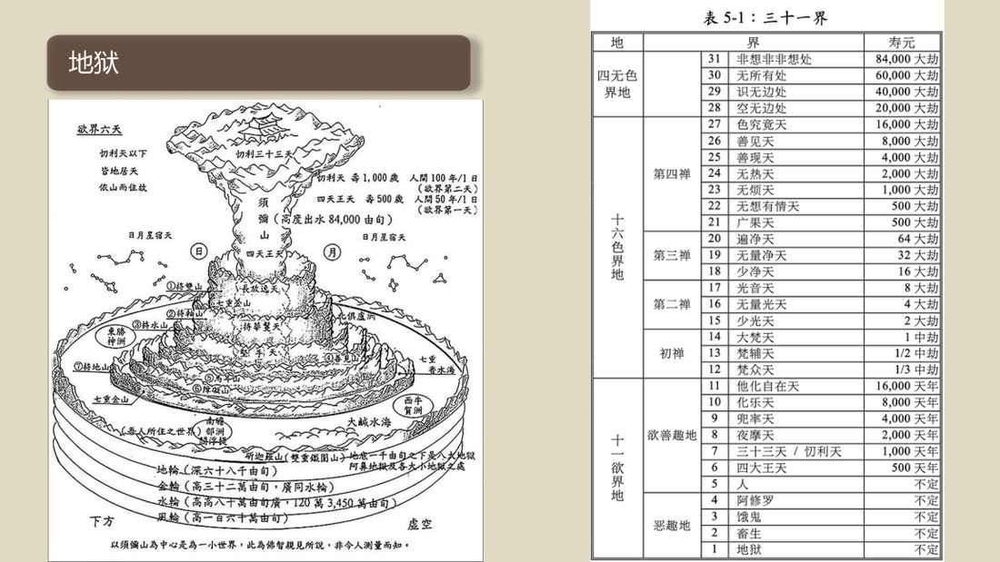

📅 最近更新：2026-09-29 00:00　|　第5版精修（朗读优化版）

# 第4周：轮回机制与生活启示（主持人版）

> ⭐ **本讲主持人速览**（新主持人必读，2分钟看完）
>
> 你不是老师，是"共学同行者"。你不需要提前懂内容，只需要按流程走。
> **本周由连续两周内容合并**而成，含两段共读、两轮分享与两轮讨论，单讲 120 分钟。
>
> | 环节 | 标准时长 | ⏱ 时间不够→ | ⏱ 时间富余→ |
> |:-----|:----:|:-----|:-----|
> | 🧘 静心开场 | 10 min | 缩至5 min | 加2分钟静坐 |
> | 📖 共读原文1 | 20 min | 只读★核心段（约15 min） | 加读◈扩展段 |
> | 💬 第一轮分享 | 10 min | 每人1句话 | 每人3分钟 |
> | 🎯 第一轮主题讨论 | 10 min | 只讨论问题① | 讨论全部问题+扩展 |
> | 🧘 禅修练习 | 15 min | 缩至8 min（只念引导词前半） | 延长至20 min |
> | 📖 共读原文2 | 20 min | 只读★核心段 | 加读◈扩展段 |
> | 💬 第二轮分享 | 10 min | 每人1句话 | 每人3分钟 |
> | 🎯 第二轮主题讨论 | 10 min | 只讨论问题① | 讨论全部问题+扩展 |
> | 🔚 收尾与回向 | 15 min | 缩至10 min | 保持 |
>
> **主持人10条守则（精简版）**：
> ① 不讲解、不提供答案——让原文自己说话；② 有人问"正确答案"→说"先听听大家的看法"；③ 冷场→主持人先分享自己的真实感受；④ 跑题→温和拉回："这个有意思，我们回到今天的原文"；⑤ 争论→"两种看法都很好，大家保留自己的理解"；⑥ 确保人人发言；⑦ 不评判任何人的分享；⑧ 时间到了就推进；⑨ 禅修练习照读引导词即可；⑩ 结束一起回向。

> 本周主题：**轮回不是只有人间，而是六道相续、三十一界层层展开——由四生存地（恶趣4界、欲界善趣7界、色界16界、无色界4界）合成三十一界，各界寿量悬殊；而"盲龟浮木"之喻更示：得人身、闻正法，难得如此。故当知地图、明层次、惜此身——落回"珍惜人身、当下可修"。以及：业的道理最终要落到生活里——过去业决定起点，当下可造新业、以善法转业（心转业转）；助人为乐、以慈心祝福，是"为善最乐"的入口。**

---

## 📋 本周信息卡

| 项目 | 内容 |
|:----|:-----|
| 时长 | 120分钟（4周版 · 9环节） |
| 核心问题 | **六道**是哪六道？**三十一界**由哪**四生存地**合成、各界**寿量**如何？"**盲龟浮木**"在比喻什么？——既然**人生难得**，那**这一界、这一刻、这一颗心，该怎么用**？（锚点：**三十一界**）；既然"**善有善报、恶有恶报**"，那"**业**"是不是"命中注定"、只能认命？——不。**过去业决定起点，当下可造新业**：什么是"**转业**"？怎样"**心转业转**"？"**慈心**"为什么是造善业最柔软的入口？（锚点：**转业**） |
| 共读原文 | 共读原文1：材料①《2024大佛寺康复营01-佛教的世界观、人生观、价值观-古源尊者-20240411》（音声，依据录音转写整理）。　｜　共读原文2：材料①《生命的意义(袖珍本)》。 |
| 本周作业 | ①用**自己的话**说出**六道**是哪六道，并说出**四生存地**如何合成**三十一界**（各多少界）？②找出〈表 5-1：三十一界〉里的三个数字（例如地狱的寿元、色究竟天的寿元、非想非非想处天的寿元），各是多少？③用**你自己的话**复述"**盲龟浮木**"这个比喻。④（落地题）既然**人生难得**，这一周你愿意在**哪一件小事**上"珍惜这份人身"？；①用**自己的话**说出"**业果框架**"：善业、不善业各会带来什么？②什么是"**转业**"？请用**自己的一句话**解释"**心转业转**"？③"**慈心**"为什么被称为"为善最乐"？④（落地题，**本讲最重要**）请写下**一件"当下可做的因"**——这一周，你愿意在**哪一件小事**上"调自己的心、造一个善业"？⑤（收尾题）**八周回顾**：哪一句、哪一个比喻、哪一次练习，对你影响最大？ |

## 🧘 静心开场（10 min）

> 💬 **破冰｜3–5分钟**：如果此刻换一种生命、换一副身体，你最舍不得的，会是什么？一句话说说，说完就放下。

> 🛡️ **心理安全三约定**（每次开场在心里过一遍）：① **保密**——这里说的话不出这间屋子；② **不评判**——不评价任何人的分享，也不急着评价自己；③ **可随时暂停**——任何时候觉得不舒服，都可以停下来休息、喝水或离开，不需要解释。

> **主持人引导语**（照读即可；语气平和、比平时稍缓）：
>
> 请大家把身体安顿好，脊背自然挺直，肩膀放松，双手轻放。眼睛可以半闭，或微微下垂。
>
> 现在，把注意力带到呼吸上——吸气，知道在吸气；呼气，知道在呼气。可以的话，让呼气稍微长一点、柔一点。……（静默约 1 分钟）……
>
> 今天我们要读到的，是一个很大的题目——**轮回的版图与三十一界**。听起来很远，其实它离我们很近：**我们此刻能坐在这里读书，能听得懂、能问得出来，本身就是"生在人间"才有的机会。** 今天我们会看到一张很大的地图：地狱、饿鬼、畜生、阿修罗、人、天——六道；再上一层一层，到三十一界；我们会读到一只**百年才浮上海面一次的瞎眼海龟**，和一块漂来漂去的木头。它想告诉我们一句很朴素、却很重要的话——**这一趟人身，来得太不容易。**
>
> 也请记得：今天这节课**只为看清"结构"，绝不为制造恐惧**。**地图是用来看方向、看难得的，不是用来判决谁的。** 请把心放平——**知难得，所以珍惜；知层次，所以当下可修。**
>
> 在心里轻轻发一个愿：愿这两个小时，我心平气和地听、不慌不怕；愿我学到的，不是给自己添焦虑，而是**看清这一身难得，因而把它用在善处。**……（静默约 1 分钟）……好，我们慢慢睁开眼睛。

## 📖 共读原文1（20 min）

> ⚠️ **主持人操作**：共读原文只读不解释。本材料是本周"**看地图**"的入口。**必读** ①"人界呢，属于六道里面的善趣"（**六道开列，本周锚点句，务必放慢**）；②"不善趣呢，有四层……那么人在往上呢，有六层的欲界天"（**四恶趣＋欲界天，最好写在白板上**）；③"最高的无色界生命呢，叫非想非非想诸天……寿命八万四千大劫"（**三十一界的顶端**）；④"生命是轮回的……这是有规律的……就是这个因果律"（**轮回机制一句**）。转写稿口语（"啊""这个这个"）**照读**；括注内整理注记**一律跳过**。**读到地狱、饿鬼、天人堕落处，语气平稳、不渲染。**

### 原文材料①：★核心·佛教的世界观（六道与三十一界·轮回机制）

- **文件**：《2024大佛寺康复营01-佛教的世界观、人生观、价值观-古源尊者-20240411》（音声，依据录音转写整理）

**【一、三十一界】**

[00:04:02.640] 在我们生存的这个一个小世界里面呢，就有三十一界的生命。

[00:04:55.920] 那我们人呢，称为叫人界。人界呢，属于六道里面的善趣。大家知道六道吗？六道轮回，知道这个人道，然后还有什么道，还有天道，还有什么？

好，那么再往上呢，就是人界，人呢就是在上去的生命里面，刚刚从恶趣里面出来。所以人不要太嘚瑟，你一不小心就下去了，但努力一下我们也可以。

[00:06:07.240] 然后那人呢，这个属于欲界，欲界的生命，欲界的上去的生命，它是属于上去的。

[00:06:18.480] 不善趣呢，有四层，就是畜生，恶鬼，地狱，阿修罗，那么人在往上呢，有六层的欲界天，欲界天天人离我们最近的呢，就四天王天。

[00:06:37.380] 我们进寺院看到四大天王对？……那四大天王他主要任务呢，就是守护世界。

[00:07:35.260] 来四大天王天，它的寿命就这个九百天年……再往上呢，就叫三十三天……兜率天……夜摩天……化乐天……最高的欲界天，叫他化自在天。

[00:10:00.440] 再上去呢就不一样，我们叫色界，色界呢也称为叫梵天。

[00:10:09.800] 我们讲梵天神对？梵天跟这个欲界天有什么区别呢？

[00:10:14.750] 梵天神呢，他跟他就只有这个有眼睛，有耳朵。他长得是人的形象，但没有男女之分。他的身体呢，就像一个透明的罐子……就是一个光明体，非常的高大。……欲界天呢，就跟我们是一样的，它又长了五官四肢，然后他吃东西的，那色界天就不吃东西了。

[00:11:07.380] 那欲界天呢，还有男女之别，那一个天子有很多天女的。

[00:16:28.980] 这个色呢？色的意思呢，其实就是有不知的层面……在佛教里面这个色叫色法（rūpa）……会坏掉，很容易坏掉就叫rūpa，这就称为色了。

[00:17:54.050] 那么，无色界呢，就是没有这个东西，但你还活着，对？你活在精神上，所以在无色界的生命里面就有个精神体，只有一个精神体，没有物质，没有物质就不会生病。

[00:18:24.160] 那么最高的无色界生命呢，叫非想非非想诸天，非想非非想诸天的天人的寿命八万四千大劫。

[00:19:39.940] OK，那这个就是佛教的世界观，那么也就是我们生存的这个世界呢，我们能看到的其实只有人和畜生，其他都看不到。……那我们有不少的禅修者，他证得神通以后呢，我们就要求他看。……一层一层的看。

[00:27:27.920] 即呢，就是当我们心有这个能力的时候，你可以看到三十一界的生命，看到轮回，看到很多的轮回，没有问题，这是佛教的世界观。

**【二、六道轮回】**

[00:05:15.695] 地狱，恶鬼畜生，地狱，地狱最低的是最糟糕的是地狱。好，然后是恶鬼，然后是畜生，然后是阿修罗。阿修罗分两种，一种是鬼阿修罗，一种是天阿修罗。天阿修罗呢，就属于天人状的。那鬼阿修罗其实鬼状的，但是他都长得很难看。

[00:06:07.240] 然后那人呢，这个属于欲界，欲界的生命，欲界的上去的生命，它是属于上去的。

[00:06:18.480] 不善趣呢，有四层，就是畜生，恶鬼，地狱，阿修罗，那么人在往上呢，有六层的欲界天。

[00:28:12.150] 那佛教的人生观是什么呢？一个佛教讲，人生人是轮回的，生命是轮回的。刚才讲在六道里面轮回，六道轮回是自己要看到的好，那轮回的他为什么这样轮呢？它要轮成什么样呢？这是有规律的，什么规律呢？就是这个因果律。

**【三、欲界、色界、无色界】**

[00:06:18.480] 不善趣呢，有四层，就是畜生，恶鬼，地狱，阿修罗，那么人在往上呢，有六层的欲界天，欲界天天人离我们最近的呢，就四天王天。

[00:07:35.260] 来四大天王天，它的寿命就这个九百天年……再往上呢，就叫三十三天……兜率天……夜摩天……化乐天……最高的欲界天，叫他化自在天。

[00:10:00.440] 再上去呢就不一样，我们叫色界，色界呢也称为叫梵天。

[00:10:14.750] 梵天神呢……他长得是人的形象，但没有男女之分。他的身体呢，就像一个透明的罐子……就是一个光明体，非常的高大。……欲界天呢，就跟我们是一样的……那色界天就不吃东西了。

[00:16:28.980] 这个色呢？……在佛教里面这个色叫色法（rūpa）……会坏掉，很容易坏掉就叫rūpa，这就称为色了。

[00:17:54.050] 那么，无色界呢，就是没有这个东西，但你还活着……只有一个精神体，没有物质，没有物质就不会生病。

[00:18:24.160] 那么最高的无色界生命呢，叫非想非非想诸天，非想非非想诸天的天人的寿命八万四千大劫。

**【四、三恶道】**

[00:05:15.695] 地狱，恶鬼畜生，地狱，地狱最低的是最糟糕的是地狱。好，然后是恶鬼，然后是畜生，然后是阿修罗。阿修罗分两种，一种是鬼阿修罗，一种是天阿修罗。那鬼阿修罗其实鬼状的，但是他都长得很难看。

[00:14:05.040] （天人临死多堕地狱因由）然后呢，他的座位呢，他就会坐不住。……那大部分的天人都会投生到地狱，知道吗？……他几千万年都在贪心的这个促使下呢，寻欢作乐，所以那么这样造了几千万年上亿年的这种这个贪的不善业，到他死的时候就死有去地狱了。

[00:31:14.055] 我一直想说，你如果嗔心的时候会堕入地狱呢？因为嗔心呢，它就是一个要么伤害自己，要么伤害别人。……你在临终的时候不气死了？好，去地狱，你在地狱出生。

[00:31:55.885] 好，去地狱，你在地狱出生。……你很贪婪……做恶鬼就可以一直都很饿……就饿鬼了。

**【五、天界（欲界天、色界天、无色界天）】**

[00:06:37.380] 我们进寺院看到四大天王对？……四大天王天，它的寿命就这个九百天年。

## 💬 第一轮分享（10 min）

> **分享规则**：①**自愿**——想说就说，不想说可以听；②**一次一位**，不打断、不评判、不给建议；③分享的是"**我**"，不是"**他**"——**只说自己的经历与体会**；④**绝不拿今天的道理去判断任何人的去处或恐惧任何人**（尤其"六道轮回"：不说"你这样会堕落"）；⑤**若有人因"地狱、饿鬼、轮回"而生不安**，主持人为其喊停、温和照护，并轻声说"**这只是一个地图，不是给你的判决**"。

**起手问题（由浅入深，任选 2–3 个）**：

1. 今天读到"**轮回有六个去处（六道），我们生在'人间'这一格**"。听到"能坐在这里读书，本身就是生在人间才有的机会"，你心里浮现了什么？
2. 从地狱的"不定"，到非想非非想处天的"八万四千大劫"，**层次很悬殊**。这份"悬殊"给你的直观感受是什么？
3. "**盲龟浮木**"——百年一露头的瞎眼海龟，恰把脖子穿过漂荡木轭的孔，竟比恶趣众生再得人生还容易。这个比喻，你第一次听到时是什么感觉？
4. 材料说"**只有在苦乐参半的人间……才会思考生命的意义**"。为什么"苦乐参半"反倒是**机会**？

> 主持人提示：若有人开始说"我这样将来会不会下地狱"，请温和拉回：**"我们今天看的是地图，不是判决；能把握的，是把今天这颗心摆正。"** 若现场安静，可先由主持人自己说一件"我最近因为忙碌而没好好吃饭"的小事作示范——**主持人先示弱，全场才敢真实。** 时间紧时，**第一轮可缩为"一人一句"**："听到'人生难得'，我第一想到的是……"

## 🎯 第一轮主题讨论（10 min）

> 本轮由浅入深，指向实修。主持人依现场节奏，任选 3 问引导；每问给一点"提示"即可，不替书友下结论。

**第 1 问：六道是哪六道？三十一界由哪四生存地合成？为什么要记住这张"地图"？**

> 提示：**"人界呢，属于六道里面的善趣"**——六道是**地狱、饿鬼、畜生、阿修罗、人、天**。三十一界由**四生存地**合成：**"恶趣 4界、欲界善趣7界、色界16界、无色界4界，总计31界。"** 可以请书友在白板上画**四段色块**，再问一句：**"我们现在站在哪一格？"**（答案：**人间**。）**落点**："**记住地图，不是为算命，而是为看清——'人间'这一格，正对着'能闻法、能修行'的机会。**" **锚点：三十一界。**

**第 2 问：〈表 5-1：三十一界〉里三行数字——地狱"不定"、色究竟天"16,000 大劫"、非想非非想处"84,000 大劫"——它们说明了什么？**

> 提示：**请只挑三行读**：地狱——**"不定"**；色究竟天——**"16,000 大劫"**；非想非非想处——**"84,000 大劫"**。然后请书友说：**这份"悬殊"给了你什么感受？** 落点应落在——**"层次不同、寿量不同，唯一相同的是：都不离'苦'——天寿虽长，终有堕落；故寿长寿短都不是要害，要害是'能不能闻法、能不能修行'。"** **切勿用"地狱寿长"渲染恐惧。**

**第 3 问："盲龟浮木"在比喻什么？既然人生难得，这一周我可以做什么？**

> 提示：**"假设有人把一个中间有洞的轭丢进大海里……大海中生活着一只瞎眼海龟，每隔一百年浮上海面一次。要想让这只瞎眼海龟正好把它的头穿过那个轭的洞，甚至比堕落恶趣的愚者想要获得人生还来得容易。"** 请书友分角色复述——**海龟**（我们）、**木轭**（人身的稀少机会）、**百年一露头**（难得）各在说什么？落回结句：**"所以，获得人生是多么难得，拥有人的生命是多么珍贵啊！"**

> 主持人（本问的"一句落地"，请务必执行）：请把"人生难得"收在**一个可操作的动作**上，写在白板上——"**本周，我只守一件小事：把这一身、这一天，用在善处。**"然后对全场说："**地图今天记不住没关系；这个动作，请大家带回家。因为它就是'珍惜人身'的起点。**"

> 主持人提示：若现场滑向"谁会去哪一道、谁该得什么报"，及时收束：**"我们不解释别人的因果——能把握的，是今天这颗心。"** 若有人因"恶趣""难得"而生恐惧或自弃，温和拉回：**"材料刚讲完的正是'机会'：正因为难得，能修行、能闻法才这么可贵；从今天这件小事做起，就不晚。"**

> **分层追问**（可视时间取用，由浅入深）：
> - 【现象】六道、三十一界层层铺开，你印象最深的是哪一层、哪一句？
> - 【影响】「盲龟浮木」说的这份人身难得，落到你今天的时间里，最想动的是什么？
> - 【应对】这一周，每天挑一刻安静，只做一件事：感受一次呼吸，然后说一句「今天没有白过」。

## 🧘 禅修练习（15 min）

### 练习一

> ⚠️ **禅修禁忌提示**：若你正处在严重抑郁、焦虑、创伤后应激，或精神类疾病的发作／用药期，或正经历强烈的情绪危机，请先咨询医生或心理师，再决定是否练习；练习中若出现明显不适（如心悸、胸闷、情绪失控），请立即停止，睁开眼睛，把注意力放回呼吸与身体，必要时离场休息。

> **本周练习：把这一身、这一刻，轻轻收进呼吸**（主持人引导词，照读即可）
>
> 请大家坐好，脊背自然挺直，双手轻放，眼睛半闭或微微下垂。
>
> 先做三次自然的深呼吸——吸气，知道在吸气；呼气，知道在呼气。呼气的时候，可以稍微长一点、柔一点。……（静默约 30 秒）
>
> 今天我们要练习的，是一件很小、也很大的事：**珍惜这一身。** 现在，请把注意力轻轻放到自己的身体上——**感觉一下：这双手，此刻正安放在腿上；这一口气，正一进一出。** 这一身，就是"盲龟浮木"里说的那个难得的人身。**它不需要完美，它只需要被珍惜。**（静默约 40 秒）
>
> 接着，请想起"**百年一露头**"的海龟——它在深深的海里，很久、很久才浮上来一次。请在心里轻轻说一句：**"这么难得，我此刻却正握着——好在，我还握着。"**（静默约 40 秒）
>
> 现在，把这份"珍惜"，落到一个具体的地方：**想起一件你每天都会做的小事**——吃饭、走路、看一个人。请在心里说：**"从今天起，这件小事，我愿意认真一点地做。"**（静默约 1 分钟）
>
> 如果刚才心里浮起了不安，**请不必害怕**——**看到了，就轻轻放回到呼吸上。** 我们今天看的是地图，不是判决。……（静默约 30 秒）
>
> 最后，把善意送出去——**愿我平安、愿我健康、愿我无恼害；愿我的家人平安；愿在座的每一位书友平安；愿一切众生，都能得人身、闻正法、离苦得乐。** 然后，慢慢睁开眼睛。

> 主持人（练习后一句）：**"人生难得"，不是让我们害怕失去，而是让我们舍得认真。**

### 练习二

> ⚠️ **禅修禁忌提示**：若你正处在严重抑郁、焦虑、创伤后应激，或精神类疾病的发作／用药期，或正经历强烈的情绪危机，请先咨询医生或心理师，再决定是否练习；练习中若出现明显不适（如心悸、胸闷、情绪失控），请立即停止，睁开眼睛，把注意力放回呼吸与身体，必要时离场休息。

> **本周练习：把这一颗心，轻轻转一转——慈心与自己、慈心与他人**（主持人引导词，照读即可）
>
> 请大家坐好，脊背自然挺直，双手轻放，眼睛半闭或微微下垂。
>
> 先做三次自然的深呼吸——吸气，知道在吸气；呼气，知道在呼气。……（静默约 30 秒）
>
> 今天我们要练习的，是一件很小、也很大的事：**转业，从转心开始。** 现在，请把注意力轻轻放到自己的心口——**感觉一下：这一颗心，此刻是紧的，还是松的？是急的，还是安的？** 不用去改变它，只是知道它。……（静默约 40 秒）
>
> 接着，请想起材料里的一句话——"**心转业转**"。请在心里轻轻说：**"我不必另做一件大事；我只要，在眼前这一件事上，换一颗心。"** 现在，想起**一件你每天都会做的小事**——说话、吃饭、走路、看一个人。请在心里对它说：**"从今天起，这件事，我换一颗心去做：少一点计较，多一点善意。"**（静默约 1 分钟）
>
> 现在，把这份"善意"，送给一个人——**一个你关心的人，或者一个今天让你有点不舒服的人。** 请在心里轻轻地、慢慢地送出去：**"愿你平安，愿你健康，愿你快乐，愿你远离烦恼。"** 送不动就先对自己送：**"愿我平安，愿我健康，愿我快乐，愿我善待自己。"**（静默约 1 分钟）
>
> 最后，把这份善意扩大到一切——**愿我平安；愿我的家人平安；愿在座的每一位书友平安；愿一切众生，平安、健康、快乐，远离痛苦。**……（静默约 30 秒）……好，请慢慢把注意力带回身体，带回呼吸，再轻轻睁开眼睛。

## 📖 共读原文2（20 min）

> ⚠️ **主持人操作**：共读原文只读不解释。请主持人先记住一条主线——**先立框架（业果法则：善有善报、恶有恶报，但"改变从心做起"），再点"业的真实"（业力紧追不舍，业是我们真正的根源）**。**必读** ①〈业果法则〉末段（**"想要改变未来……即从当下的如理作意做起！"——本周锚点句，务必放慢**）；②结语诗（**"命运不靠他人，全由自己作主；苦乐皆由业生，改变从心做起"——请写在白板上，本讲反复回读**）；③〈生命意义〉的判断标准（"若人活百岁，无戒无定力，不如活一日，持戒有禅定"——**点到即可**）。**读到"我比别人笨""我命不如人"处，请柔和地把它读成"所以，请不要抱怨"的安慰，而非责备。**

### 原文材料①：★核心·业果法则·生命的意义（《生命的意义》）

- **文件**：《生命的意义(袖珍本)》

**【一、序言·精神财富（定义）】**

什么是精神财富呢？信仰是精神财富，道德是精神财富，奉献是精神财富，定力是精神财富，智慧是精神财富。

恭敬、谦卑、知足、感恩、孝顺、慈爱、悲悯、包容、宽恕、柔和、正直、忠诚、诚信、踏实、忍耐、耐心等都是精神财富。总之，一个人所拥有的道德品质和正面心理素质都属于精神财富。

物质财富是外在的，精神财富是内在的；物质财富会带来担忧、恐惧等过患，而精神财富却能带给人们充实和快乐。拥有物质财富但缺乏精神财富的人内心一定不快乐，而拥有精神财富的人，无论他是否拥有物质财富，内心都一定很快乐。

佛教也是一种精神财富。

**【二、第二章 · 第一节 业果法则（全）】**

讨论了佛教的生命观和人生观，我们不禁想问：生命苦乐的原因是什么？生命的升沉是否有规律可循？有可能改变现实、超越生命吗？它的原理是什么？

佛教对这些问题都可以给出肯定的答案。下面，就让我们来探讨一下有关生命流转以及生命超越的重要规律——业果法则。

根据佛教，只要含有动机的、有意识的行为，包括身体的行动，所说的话语，乃至心里所想，都称为"业"(kamma)。这些行为一旦被造作，即会留下一种行为影响力，称为"业力"(kammasatti)。动机纯正，在道德上、良心上不会受谴责的行为称为"善业"；动机不纯，在道德上、良心上会遭受谴责的行为称为"不善业"或"恶业"。无论是善业还是恶业，一旦造下之后，在因缘成熟时就会带来相应的结果，称为"果报"(vipàka)。

善业能带来好的果报，不善业能带来不好的果报，也就是俗话说的"善有善报，恶有恶报"。哪些是善报呢？例如：长命百岁、身体健康、容颜俊俏、出身高贵、拥有财富、具影响力、富有智慧等，即平时所说的"福报"、"好命"。那恶报呢？例如短命、残疾、多病、丑陋、贫穷、低贱、愚蠢、倒霉等等。

正如佛陀在《增支部》第十集谈到"业的定律" (kammaniyàma)时这么说：

"诸比库，有情都是业的所有者，业的继承者，以业为起源，以业为亲属，以业为皈依处。无论所造的是善或恶之业，都是它的承受者。"(增支部 10.216)

所以，请不要抱怨"我命不如人，我倒霉，我长得丑陋"，或者"我比别人笨"。不管今生的命运怎样，现在的境遇如何，我们都要学会承受，学习承担，因为世间上没有任何事情是没有因缘的，现在的境遇只是自己过去所造作的恶业带来的结果。 当然，相信因果，掌握业果法则，我们不仅要懂得接受现实，而且还要学会积极地改变现实、改善未来。依靠什么来改变现实、改善未来？依靠业。业又是依靠什么？依靠调好自己的心。

业，按照表现的形式可以分为三种，即：身业、语业和意业。身业是通过身体造作的行为，语业是通过语言造作的行为，意业是通过心念造作的行为。在这三业当中，意业是最主要的。意业的好或不好，决定了身业和语业的性质。心念不好，才会身作恶行和口出恶言；心念纯正，才有好的身业和语业。

正如佛陀在《法句》第 1-2颂中说：

"诸法意先行，意主意生成； 若以邪恶意，或说或行动，如此苦随彼，如轮随兽足。 诸法意先行，意主意生成； 若以清净意，或说或行动，如此乐随彼，如影随于形。"

因此，无论造善业还是恶业，我们是可以做主的，其中的关键就是"如理作意"(yoniso manasikàra)。所谓"如理作意"，就是往好的、善的、正确的、正当的方向想，凡事要作正面的思惟。通过如理作意，我们的心就会朝正确的方向发展。有了如理作意，就能生起善心；有了善心，造的就是善业；善业成熟，就能带来好的果报。所以，想要改变未来，让未来越来越好，就要从造善业开始；造善业要培养善心，心念要纯正；而培养善心，即从当下的如理作意做起！ 掌握了命运（果报）和造业、造业和心念之间的关系后，我们可以得出这样的结论：

命运不靠他人，

全由自己作主；

苦乐皆由业生，

改变从心做起。

**【三、第二章 · 第二节 生命意义（全）】**

大致了解了业果法则和改变现实、超越生命的原理之后，接着再来谈谈如何实现生命的意义。

无论是追求温饱还是追求物质财富，本来都无可厚非，因为每个国家、社会和人民总是希望摆脱贫穷、脱离落后。追求物质财富不但没有错，而且还值得鼓励。只有通过创造和积累物质财富，才能使人们丰衣足食、安居乐业，使社会进步和时代发展，使国家富强和兴盛。然而，如果为了满足一己之私而损人利己，这就有问题，因为这只是在膨胀自己的私欲，只是在满足自己的贪婪而已。因此，当物质生活达到一定条件之后，应当追求精神财富，开始关注生命，寻求超越生命的方法。

可以说，佛教的整个修行体系，都是在追求生命的超越，以及实现生命的意义。对于生命的意义，佛陀在《法句• 千品》里指出其判断的标准：

"若人活百岁，无戒无定力， 不如活一日，持戒有禅定。 若人活百岁，无慧无定力， 不如活一日，有慧有禅定。 若人活百岁，懈怠不精进， 不如活一日，发勤励精进。 若人活百岁，不见生灭法， 不如活一日，得见生灭法。 若人活百岁，不见不死境， 不如活一日，得见不死境。 若人活百岁，不见最上法， 不如活一日，得见最上法。"

(法句 110-115)

> 主持人（读后一句）：本材料读到这里，收一句——"**'改变从心做起'——这六个字，是八周教理最后要交给各位的钥匙。**"

## 💬 第二轮分享（10 min）

> **分享规则**：①**自愿**——想说就说，不想说可以听；②**一次一位**，不打断、不评判、不给建议；③分享的是"**我**"，不是"**他**"；④**绝不拿今天的道理去评判任何人的过往**；⑤**若有人因回忆而情绪起伏**，主持人为其喊停、温和照护。

**起手问题（由浅入深，任选 2–3 个）**：

1. 八周读下来，如果说"业"你只记住一句话，会是哪一句？为什么是它？
2. 读到"**善有善报，恶有恶报**"，但更要说"**命运不靠他人，全由自己作主**"。这两句合在一起，给你的感受是什么？
3. "**业由心造，心转则业转**"——同一件事，换一颗心去做，性质就变了。你生活里有没有试过"换一颗心去做同一件事"？
4. **八周回顾**：哪一次共读、哪一句话、哪一次练习，对你影响最大？它后来有没有在某个生活场景里"对上号"？

> 主持人提示：收束周气氛比内容重要。若有人因"我好像没什么进步"而沮丧，温和回应：**"八周能坐下来八次，本身就是一件了不起的缘。"**

## 🎯 第二轮主题讨论（10 min）

> 讨论规则：由浅入深，**指向实修**。主持人最后把落点收在"**不宿命，只做因；不诊断，只调心**"。

**引导问题一：业果框架——"善有善报，恶有恶报"是不是"命中注定"？**

- 提示：把两句话摆在桌上——**"善有善报、恶有恶报"** 与 **"命运不靠他人，全由自己作主；苦乐皆由业生，改变从心做起"**。请成员看：**业果法则讲的是"规律"，不是"宿命"**——过去决定起点，当下可造新业。可以问：如果一切都已注定，为什么还有"如理作意"这四个字？
- 落点：**相信因果，不是低头认命，而是"接受现实＋积极改变现实"。**

**引导问题二：什么是"转业"？"心转业转"为什么成立？**

- 提示：**"业由心造，心转则业转——做同一件事，换一颗心，原来不善的可以变成善的。"** 请成员举一个例子：同样洗碗、同样回一句话，带着怨去做与带着善意去做，心里与结果有什么不同？
- 落点：**改命，不用去看命；每天把自己的身语意摆正，就是在改命。**

**引导问题三（收束·八周整合）：八周所学，怎样落回"当下可做的因"与"一颗慈心"？**

- 提示：**"不宿命，只做因；不诊断，只调心。"** 业不是拿来解释命运的，是拿来**改变**命运的；不是拿来**评判别人**的，是拿来**照自己**的。**助人为乐、以慈心祝福，是"为善最乐"的入口。**
- 落点：**八周不是终点，而是起点——把这一颗心守好，把这一天用在善处。**

> 主持人提示：本讲最容易滑向"宿命自弃"与"评判他人"。一旦出现，立刻用边界句收束：**"过去定的是起点，不是终点；我们不解释别人的因果，能做的，是今天这颗心。"**

> **分层追问**（可视时间取用，由浅入深）：
> - 【现象】这八周里，你对自己"造业"这件事，看法有没有变一点点？
> - 【影响】如果换一颗心去做同一件事，你的日子会有什么不一样？
> - 【应对】这一周，挑一件熟悉的小事，换一颗心去做，看看会发生什么。

## 🔚 收尾与回向（15 min）

### 收尾一

> **总结引导（主持人照读，约 3 分钟）**：今天我们把"业"放下，抬头看了一张很大的地图。三句话，请你带走——
>
> 第一句，**六道**："**轮回有六个去处——地狱、饿鬼、畜生、阿修罗、人、天。**"我们此刻，站在"人间"这一格。
>
> 第二句，**三十一界**："**四个生存地合成三十一界——恶趣4、欲界善趣7、色界16、无色界4。**"各界寿量悬殊，从"不定"，到八万四千大劫。
>
> 第三句，**盲龟浮木**："**百年一露头的瞎眼海龟，恰穿木轭孔，比恶趣得人身还容易——故人生难得。**"
>
> 还有一句最要紧的：**"知难得，所以珍惜；知层次，所以当下可修。"** 这张地图不是为了让我们害怕，而是让我们看清——**此刻这一身、这一段能听闻正法的时光，是多么稀有、多么值得认真对待。** 过去决定起点，**今天，仍能转身、仍能修行**。

> 下周预告（照读）：本系列到这里就完整收束了。我们把"业"收进生活：怎样**转业**？怎样用**慈心**？"业果框架"怎样落到日常？请把想珍惜的那件小事写下来。

> 主持人（收尾关照，**本讲务必执行**）：回向之前，请留意——**本讲谈"六道、恶趣、轮回"，容易引出对自己或家人的联想与不安**，请给一句柔和的话："**今天这一课，也许让你想到了很多。请放心：我们看的是地图，不是判决。它想说的，只有一句——'珍惜此刻，当下可修'。谁心里有点沉，可以留下来坐一会儿；需要先走，也没有关系。**"若有人因"地狱、饿鬼、人生难得"等语而生恐惧或自弃，请温和收束：**"我们不替任何人的去向下结论；今天能来听、能起一念善心，就已经是在珍惜这份人身了。"**

> **回向词（四句，合掌齐诵）**：
>
> 愿以此功德，普及于一切；
> 我等与众生，皆共成佛道。
> 愿消三障诸烦恼，愿得智慧真明了；
> 普愿罪障悉消除，世世常行菩萨道。

### 收尾二

> **总结引导（主持人照读，约 3 分钟）**：八周了。今天我们不往高处走，只是把一路学到的东西，收成**三句话**，请你带走——
>
> 第一句，**业果框架**："**善有善报，恶有恶报——但更要说：命运不靠他人，全由自己作主；苦乐皆由业生，改变从心做起。**"
>
> 第二句，**转业**："**业由心造，心转则业转——做同一件事，换一颗心，原来不善的可以变成善的。**"
>
> 第三句，**慈心与当下可做的因**："**助人为乐、以慈心祝福，是'为善最乐'；而改变，从当下的一件小事、一颗慈心开始。**"
>
> 还有一句最要紧的：**"不宿命，只做因；不诊断，只调心。"** 业不是拿来解释命运的，是拿来**改变**命运的；不是拿来**评判别人**的，是拿来**照自己**的。**过去决定起点，今天仍能转身、仍能修行。** 八周不是终点，而是**起点**。

> **八周回顾（主持人照读，约 3 分钟，本讲特别环节）**：这八周，我们一起走过：从"**思即是业**"（业从心起），到业的分类、善与不善、临终与结生，再到业的定则、轮回的版图，最后回到"**生活启示与总结**"。**这八周，不是要把你们变成"业的专家"，而是希望你们多了一面镜子——一个没有正见的人，会怪别人、怪运气、怪命；一个懂得业果的人，会回头看看自己的心。** 请大家在心里，也允许自己说一句：**"这八周，我认真走过。"**

> 主持人（收尾的最后一句，请务必说出）：在诵读回向词之前，请对全场说出这样一段话——**"八周，我们从'业是什么'走到'业怎么用'。请记住：这一系列不是要你成为'业的专家'，而是要你多了一只'回头的眼睛'——遇到不顺，先看看自己的心；遇到顺境，也不忘这是善因的结果。今天之后，你不必记住所有名相，只要记得一句话就够了：不宿命，只做因；不诊断，只调心。从今天起，把这一颗心，往善的方向，挪一小步——这，就是'转业'的全部秘密。"** 说完，请大家合掌，一同诵回向词。

> 主持人（收尾后的一个小动作）：回向结束后，请留 1 分钟安静，然后请愿意的书友，把便签纸**自己收进钱包或笔记本**——**不必交给任何人，也不必给谁看**。请说一句：**"这张便签，是八周留下的一个记号。哪天心里乱了，拿出来念一遍，就够了。"**

> **回向词（四句，合掌齐诵）**：
>
> 愿以此功德，普及于一切；
> 我等与众生，皆共成佛道。
> 愿消三障诸烦恼，愿得智慧真明了；
> 普愿罪障悉消除，世世常行菩萨道。

## 📌 本讲主持人特别提醒

1. **涉"六道轮回"绝不制造恐惧、不诊断、不评判——这是本讲第一要务（心理安全）**：本讲两个最大的风险，都来自"误用地图"。**风险一：恐吓**——有人会因"地狱、饿鬼、寿长劫远"而生恐惧，或拿"你会去哪一道"去吓自己、吓别人。请开场即立：**"我们只看结构、只看规律，不吓人、不评人——地图是用来看方向的，不是用来判决谁的。"** 凡讨论到恶趣、天人堕落、地狱寿长，**一律以"看结构"带过**，并主动把话头落回——"**正因为层次如此、寿量如此，此刻'人间'这一格能闻法、能修行，才这么珍贵。**"**风险二：自卑或绝望**——有人一听"人生难得"就滑向"那我岂不是没希望"。请正面回应：**"恰恰相反：说'难得'，是说它'珍贵'，不是说你'不配'。你已经得到它了——现在要做的，只是好好用它。"** 本周护心句：**"看地图，不看判决；知难得，不生恐惧——把这一界、这一刻、这一颗心守好，就已足够。"**
2. **不宿命化、不评判他人**：谈"业果、命运"时，最容易**宿命化**（"反正都是过去定的，我做什么也没用"）或**拿去衡量别人**（"他过得不好，一定是……"）。开场即立两个边界：**第一，不宿命——过去定起点，当下做因；第二，不评判——只照自己这面镜子，不照别人的命。**
3. **触发生死/无常话题时**：讲到"地狱、饿鬼、天人堕落"，语气须**平和、不渲染恐怖、不恐吓**；若有人因至亲离世或过往而情绪波动，先共情、再停顿、后导回"当下能安住的是什么"，并提供呼吸放松/暂离选项。
4. **收束周不施压**：这是本系列的最后一次，气氛比内容重要。**绝不**用"你该有体验了""你还没明白"之类的话评价任何人；分享小变化即好。
5. **分享以自愿为限**：主持人不诊断、不给心理学标签；不点名叫人发言，不用眼神施压。
6. **时间宽容**：收束周宁早勿晚。若某环节明显超时，果断跳过非核心材料，把时间留给禅修与回向。
7. **落到实修**：作业不是考试，而是练习"珍惜这一身、善用这一天""调心造善业"——**从今天起，选一件小事，换一颗心去做。能把握的因，永远在当下。**

<!--EXT_READ-->
## 📖 延伸阅读（课后自由选读）
- 《2024大佛寺康复营01-佛教的世界观、人生观、价值观》——本讲共读1：六道与三十一界的层次、轮回机制（因果律、临死心念决定去向）。
- 《如来禅修学体系84-摄离路分别1（课件）》——三十一界总说、四生存地、〈表 5-1：三十一界〉各界寿量。
- 《生命的意义(袖珍本)》——本讲共读2：〈业果法则〉〈生命的意义〉〈精神财富〉〈调心〉；"改变从心做起"最值得复读。
- 《阿毗达摩轻松谈》——含"业与再生"通俗章节，可与本讲"六道／三十一界"对读。
- 《阿毗达摩》7-摄离路139~152讲讲义——补充"轮回机制"：《皮带束缚经》"轮回是无始的……"。
- 《24缘教学39-20190927》（音声）——"转业"锚点核心出处：[01:18:13]"心转业转。命运就会转。"
<!--/EXT_READ-->
