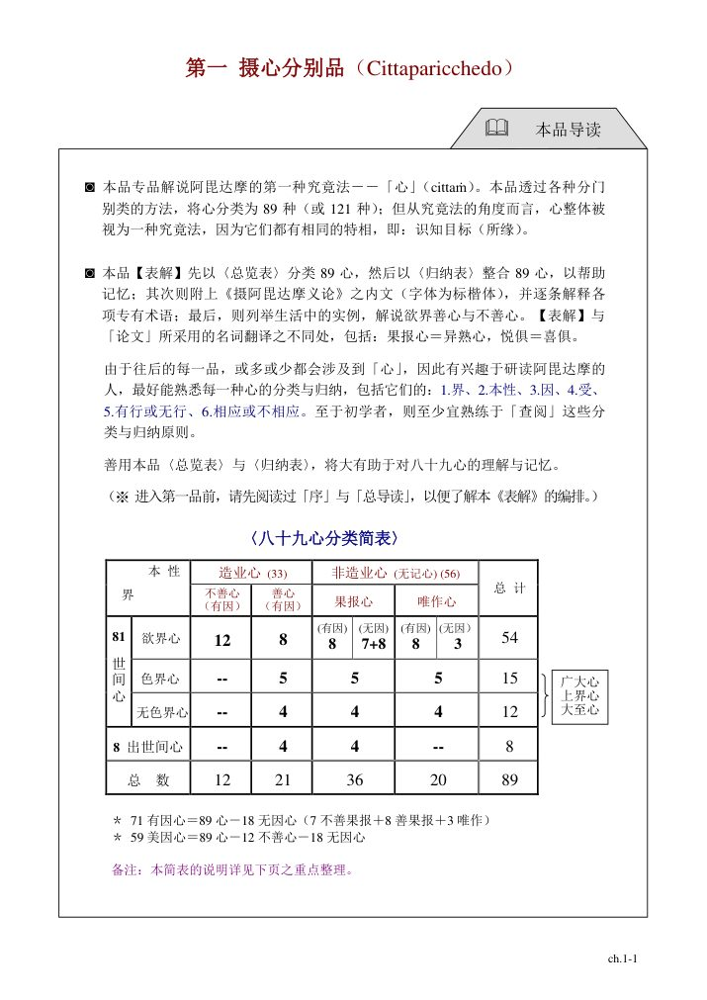
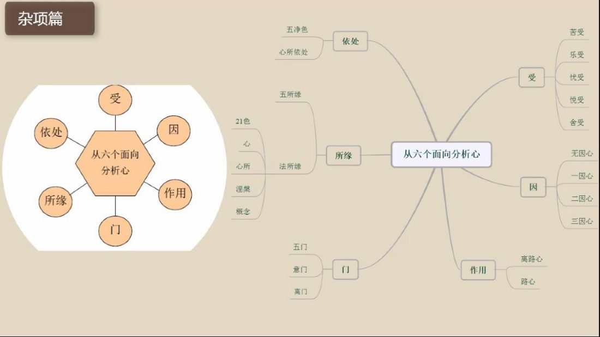
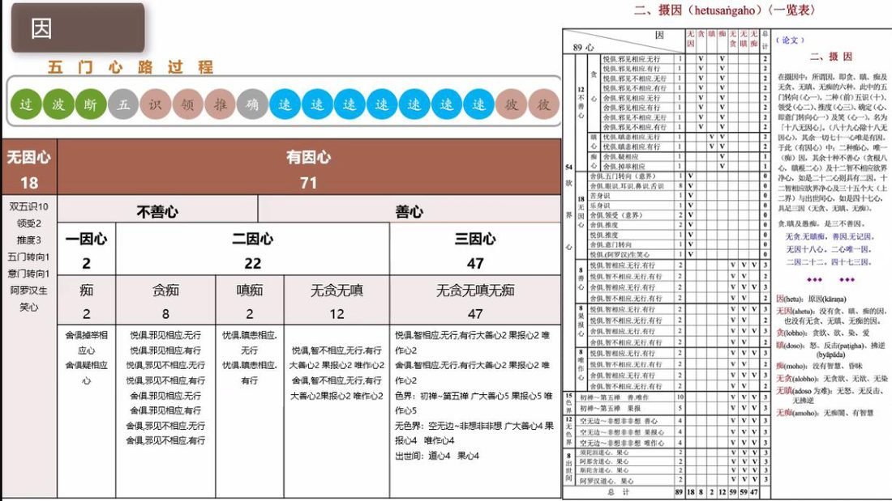
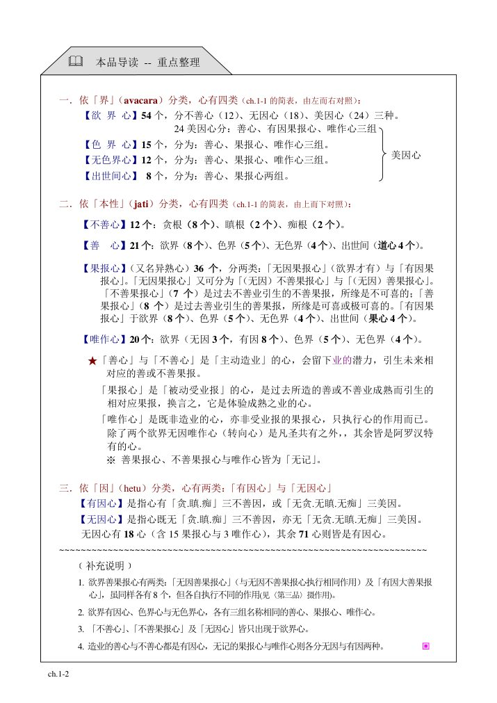

📅 最近更新：2026-09-28 16:30　|　第5版精修（朗读优化版）

# 第1周：阿毗达摩总说与心法（主持人版）

> ⭐ **本讲主持人速览**（新主持人必读，2分钟看完）
>
> 你不是老师，是"共学同行者"。你不需要提前懂内容，只需要按流程走。
> **本周由连续两周内容合并**而成，含两段共读、两轮分享与两轮讨论，单讲 120 分钟。
>
> | 环节 | 标准时长 | ⏱ 时间不够→ | ⏱ 时间富余→ |
> |:-----|:----:|:-----|:-----|
> | 🧘 静心开场 | 10 min | 缩至5 min | 加2分钟静坐 |
> | 📖 共读原文1 | 20 min | 只读★核心段（约15 min） | 加读◈扩展段 |
> | 💬 第一轮分享 | 10 min | 每人1句话 | 每人3分钟 |
> | 🎯 第一轮主题讨论 | 10 min | 只讨论问题① | 讨论全部问题+扩展 |
> | 🧘 禅修练习 | 15 min | 缩至8 min（只念引导词前半） | 延长至20 min |
> | 📖 共读原文2 | 20 min | 只读★核心段 | 加读◈扩展段 |
> | 💬 第二轮分享 | 10 min | 每人1句话 | 每人3分钟 |
> | 🎯 第二轮主题讨论 | 10 min | 只讨论问题① | 讨论全部问题+扩展 |
> | 🔚 收尾与回向 | 15 min | 缩至10 min | 保持 |
>
> **主持人10条守则（精简版）**：
> ① 不讲解、不提供答案——让原文自己说话；② 有人问"正确答案"→说"先听听大家的看法"；③ 冷场→主持人先分享自己的真实感受；④ 跑题→温和拉回："这个有意思，我们回到今天的原文"；⑤ 争论→"两种看法都很好，大家保留自己的理解"；⑥ 确保人人发言；⑦ 不评判任何人的分享；⑧ 时间到了就推进；⑨ 禅修练习照读引导词即可；⑩ 结束一起回向。

> 本周主题：**阿毗达摩总说（四种究竟法）与心法（89 心分类）**。

---

## 📋 本周信息卡

| 项目 | 内容 |
|:----|:-----|
| 时长 | 120分钟（4周版 · 9环节） |
| 核心问题 | 阿毗达摩是什么、为什么被称为"殊胜的法"？四种究竟法（心、心所、色、涅槃）到底在说什么？学习阿毗达摩对我们的生活修行有什么真实意义？；什么是"心"？为什么把它分成 89 心（开为 121 心）？善／不善／无记与四界（欲界／色界／无色界／出世间）两张分类网，如何帮我们认识自己的心？ |
| 共读原文 | 共读原文1：材料①《如来禅修学体系34-阿毗达摩概要总说1》。　｜　共读原文2：材料①《如来禅修学体系41-摄心分别3》、材料②《如来禅修学体系48-摄杂分别4&摄心所分别1》。 |
| 本周作业 | ①简答题：请用你自己的话，说出"四种究竟法"分别是哪四种，各举一个生活中的例子。②实践题：本周任选一个烦恼（如对某人挥之不去的反感），试着观察它是"落在哪个所缘上"，并按材料①的提示"把它打个包、扔出去"，记录当下心有没有松一点。；①简答题：用一句话说说"心"和"四界心"的关系；②实践题：一天中留三次"观心"，记下此刻的心偏向善、不善还是无记，不必评判对错，只作诚实记录。 |

## 🧘 静心开场（10 min）

> 💬 **破冰｜3–5分钟**：今天有没有哪一刻，你忽然发现「自己其实没在听」——眼睛在，心不在？一句话说说那个瞬间，说完就放下。

> 🛡️ **心理安全三约定**（每次开场在心里过一遍）：① **保密**——这里说的话不出这间屋子；② **不评判**——不评价任何人的分享，也不急着评价自己；③ **可随时暂停**——任何时候觉得不舒服，都可以停下来休息、喝水或离开，不需要解释。

**（主持人引导语，语速放缓，每句之间留白）**

> 各位法友，请找一个让自己舒适的坐姿，可以盘腿，也可以坐在椅子上。轻轻闭上眼睛，或者让视线柔柔地落在前方地面。先做三次深长的呼吸——吸气，慢慢地；呼气，也慢慢地。
>
> 现在，把注意力带到身体。感觉一下此刻的坐姿，感觉身体与坐垫接触的地方，感觉双手放着的温度。不需要改变什么，只是知道。
>
> 接着，把注意力放到呼吸上。知道吸气，知道呼气。不去控制呼吸，只是陪伴它。吸气进来，呼气出去……如果心跑开了，不要责备它，轻轻地把它带回来，再回到呼吸。
>
> 现在，我们来练习一会儿慈心。先想到自己，在心里轻轻地对自己说：愿我健康，愿我快乐，愿我平安，愿我远离痛苦。把这份善意，送给坐在你左右的每一位法友——愿他们健康，愿他们快乐，愿他们平安。
>
> 再把它扩大一些，送给我们今天要学习的法——愿我们听得明白，愿法义入心，愿所学能真正用在生活里。也送给那些一想到"阿毗达摩很难"就有点紧张的心——愿它放松，愿它知道，听不懂也没关系，我们一次听一点就好。
>
> 好，保持这份开放与柔和，我们慢慢睁开眼睛，回到当下。带着这份宁静，我们一起进入今天的共读。

**（主持人操作）** 开场控制在 10 分钟内。若学员入场慢，可先让早到者安静就坐，准点再开始引导。静心不作"必须静下来"的高压要求，语气始终作邀请。本周特别在慈心段加入"对怕难的心也送一份善意"，为全课定下调子。

## 📖 共读原文1（20 min）

> ⚠️ **主持人操作**：共读原文只读不解释。本节由一位熟悉阿毗达摩的法友朗读。读到生僻术语，主持人用一句话白话点明（例如"究竟法＝真实到不能再分的法""胜义谛＝直接讲心与色，不讲人我"），不展开。时间不够时，只读"（一）阿毗达摩之名与定义""（二）三藏定位"两段，其余作课后阅读。

### 原文材料①：★核心·阿毗达摩概要总说1（如来禅修学体系34）

- **文件**：《如来禅修学体系34-阿毗达摩概要总说1-古源尊者-20250205》

> ⚠️ 主持人操作：音声材料，保留时间码供选读定位。建议（一）～（四）四节全文照读。正文括注（ ）内为整理注记，朗读时跳过。

#### （一）阿毗达摩之名与定义（[00:15:41]–[00:16:42]）

[00:15:41.210] 它是阿毗达摩藏。什么是？巴利叫阿毗达摩。阿比、阿比的意思，是超越、是殊胜的意思。他妈，我们过去翻译成达摩了。那么、那么就是法。那么阿毗达摩里面的这个达妈，在这里主要是指究竟真实的法，特别指佛陀所教导的法。那么达曼在巴利语词源学的里面，它的涵括很广了，就一切的事物现象，都可以被称为法。

[00:16:26.105] 我们经常讲世间万法。那么但是阿毗达摩的这个里面的法，它主要是指佛陀教导的究竟法层面上的内容；那阿毗达摩，也是三藏里面的论藏，或者称为阿毗达摩藏。

#### （二）三藏定位：律藏、经藏、论藏与七部论（[00:16:42]–[00:18:12]）

[00:16:42.080] 那论藏，是对佛陀的教法给予精确的、系统的分类和诠释。总共有七部论。那我们前面就给大家讲过，

[00:16:53.960] 律藏，是世尊给佛陀制定的戒律、教诫和生活规则，它其实是一种生活指导手册。

[00:17:08.280] 那么经藏，它是佛陀和圣弟子的言行录，就佛陀讲法，四十五年他的言行录。那么论藏，是对佛陀的教法给予精确系统的分类和诠释，包括法集论等，它有七部论——法集论、分别论、界论、人施设论，论事论、双论和发趣论。那如果说律藏是佛弟子的行为规范，那么论藏，就是我们佛弟子的修行指导手册。那虽然，就是在整理的时候，它有很多这个排列性的这种组合，但是实际修的时候，这些所有的内容都是要去修它的。在直观的方面，我们都要去修它的。

#### （三）经教法与论教法（[00:18:12]–[00:22:20]）

[00:18:12.300] 好，那么，在佛陀的教法里面，分成两大类：一类称为经教法，一类称为论教法。那么经教法，是佛陀在证悟以后教化众多弟子的言行集。

[00:18:29.840] 那佛陀在说法度众的四十五年时间里面，有时候在精舍说话，有时候在托钵的时候说话，有时候是在游行中说话；有些，有时候是基于大悲心观察到有一天，当中有某些众生的根性成熟了，他可以得到法的利益，他就会用各种形式，不管是以游行的方式还是神通的方式去度化它。那么根据不同听众的不同根基，在不同的场合下，随机缘而这个。

[00:19:03.900] 教导的法，所以我们往往经常会看到，经典都是说，一如是我闻。一时，佛陀在什么样的地方？当时是一群什么样的人？然后这个就是讲他的因缘。那么标准来这个来讲，那我们讲经说法呢，

[00:19:25.335] 就从经题开始，一路从如是我闻、一时世尊在，这个舍卫城祇树给孤独园于其处，这个谁谁谁如何。那么这样的过程，它就是这样的一种形容，就是讲这个佛陀随众生的根器，在不同的场合、不同因缘的一个教导。那往往，我们在经典里面看到都是佛陀讲完一部经，然后最后那一部分就会讲，那个时候多少多少众生，就证得了法眼净；多少多少众生就灭苦了；多少多少众生真的出过二果三果四果了。每一次讲法都有很多众生得到世间的利益，尤其是很多天众。

[00:20:11.980] 那这些，这个一般我们称为佛陀讲法之后的当机众。

[00:20:17.600] 那举个例子，比如说佛陀证悟以后讲的第一部经转法轮经，那就是那个时候的当机众，只有五个比库，就是五比丘。以衮丹雅阿若憍陈如为首的五比丘。那么转法轮经讲完以后，只有这个衮丹雅尊者证的初果。但是根据注释书里面，说听法的天众，有无量无边的天人，证得初果二果三果四果。

[00:20:52.640] 所以佛陀在这里讲的法，那其实听众，包括人和天在内。讲的法，针对性很强，他并不是系统的、完整的去把佛陀所证悟的话都阐释出来。他不是讲说以我跟奉证了多少法，我现在来跟你讲一遍，在经典里面佛陀不是这样讲的，它是针对性很明确的。那说完，就要让听众解决他们的问题。那么这种说法方式，就是经教法，他们被收集起来，被整理出来，形成这样的一个言行录，那类似于佛陀的语录，我们称为经藏。那经教法，又被称为叫方便的法说，或者说受到装饰的教法。

[00:21:43.600] 佛陀在讲法的过程中，他使用很多的比喻，为了大家明白，他并不是直接从究竟法——大部分时间，不是从究竟法的角度来讲，而是通过世俗方面的举例比喻，来让大家更好地明白和理解。那这个，就被称为方便说法。那受到装饰的教法，是说佛陀特别能讲故事，特别能够比喻。我们看经典，佛陀有很多这样的比喻，就让人一看就能明白的意思。那。

[00:22:20.340] 而论教法，它是不一样，它指的是佛陀在证悟后的第七个雨安居，他来到三十三天，给他这个，当时他出生，这个没几天就去世了，然后在三十三天这个结生为男性天子的母亲，这个以他作为当机众。但是同时，有十万个轮回世界的天人，一起来听吧。

#### （四）论教法探讨胜义谛与三种密集（[00:22:51]–[00:37:10]）

[00:22:51.800] 那佛陀，在天界讲了三个月，系统完整的把他证悟的这个法，跟天人说了一遍。那论教法探讨的是胜义谛了，胜义谛，是直接对世俗谛的概念进行解构，破除人我众生的这个概念密集。我们经常讲说人我众生，它是概念化的世俗谛；而我们讲的密集，简单来说就是这个概念法的不同方式、不同角度的组合。那从现代医学的角度上来讲，这个我们人体是有很多细胞组成。从医学角度上来看，这个细胞的寿命是很短的。那细胞也快速地生成代谢，没有一个细胞是从我们出生到死亡一直存在的。

[00:23:40.410] 从这个角度上来讲，其实现代医学认为，生命里面的物质是一直在生、一直在灭掉的，并没有一个不变的细胞，从死亡到结生，这是变化的。但是，我们并不能看见细胞的情况，为什么看不见呢？那是因为我们的肉眼的能力无法达到，要借助显微镜才能看到。那单凭肉眼，是没有办法看到分子、甚至于原子的运行状态和生命的过程。

[00:24:10.830] 对此，佛教里面有一个专门的名词，就称为密集，称为密集。那么，看不清楚生命的物质现象和精神现象的根本组成和运转状态，我们把它称为密集。那从设法的角度来讲，它有三种密集，就相续密集、功用密集和组合密集。

[00:24:43.280] 那么相续密集，很容易理解，就像说放电影。现在放电影的速度，每秒钟是二十五帧，我们去看它的时候就感觉看真实世界一样。然而，我们设法或者色聚的生灭速度，要远快于放电影，一秒钟，大家都想说是亿万次的生命，这是一个大致的数字，因为没有办法去计算。但因为这样的一个快速生灭的状态，所以看过去好像根本我们就去看一个人，

[00:25:17.570] 对吧，看一个人现在，然后从开始禅修到现在结束，你都还是那个样子，你就不觉得他有什么变化。也就是我们看一个人的这一刻跟下一刻好像没有变化一样，今天和明天，你也看不到什么变化。这个月跟下个月没什么变化，

[00:25:35.970] 但是如果你隔了十年再看，你就觉得，哦，还是有点变化，你要足够时间长才能看出来。

[00:25:42.795] 那么这样的一种看不到这种密集效用，我们称为叫做相续密集。你这个相续过程的生命，我们看不见，好像是一个不变的东西，你的相续密集。

[00:25:55.700] 另外一个密集，叫做功用密集。功用密集，是讲功能不同。那么，眼睛为什么可以看东西呢？那这个属于公用密集。从色法角度上来讲，地水火风是基础。那么，地大有地大的功用，水大有水大的功用，火大有火大的功用。

## 💬 第一轮分享（10 min）

**分享规则**

- 以自愿为限，先邀请、不点名；每人约 2 分钟，主持人以"90 秒牌"轻控时。
- 只听不评判：不打分、不比较、不纠错，别人说到与你理解不同处，也先放一放。
- 若无人开口，主持人可用一句话自曝："我第一次听到'四种究竟法'时，也完全摸不着头脑"，先破冰。

**起手问题（任选 2–3 个，结合本周主题与生活经验）**

1. 用一句话说：在你听到这门课名字之前，你心里觉得"阿毗达摩"是什么？现在听完共读，它变成了什么？
2. 材料①里说"阿毗达摩是修行实践手册，不是要背的哲学"。你在生活里，有没有哪一件事，是"用一句法真的把心转过来"了的？说说那一次。
3. "万法"这个词你一定听过。听完"四种究竟法"，你更愿意把日常挂在嘴边的哪些词（如"我""他""气氛""关系"）看成"概念法"？这对你面对情绪有什么帮助？

## 🎯 第一轮主题讨论（10 min）

> **分层追问**（可视时间取用，由浅入深）：
> - 【现象】心、心所、色、涅槃这四种究竟法里，哪一个是你第一次听到、却觉得最贴近自己的？
> - 【影响】如果「心」只是清清楚楚地知道眼前的东西，那今天你真正「知道」的时刻，多还是滑过去的多？
> - 【应对】这一周，每天找三次「回到当下」的机会——一次呼吸、一口水、一步路，看看那一刻心里有什么。

> ⚠️ 主持人操作：三题由浅入深，先让学员用生活语言回答，再回扣原文。每题先 3 分钟小组/邻座互说，再全体发言。不追求结论，允许"带疑问继续学"。

**问题一：为什么阿毗达摩被称为"殊胜的法"？这个"殊胜"殊胜在哪里？**

- 提示：请学员回到两个关键词——"阿毗＝超越、殊胜""究竟法"。引导从三处找答案：（1）法义层面，它从"直接的方式"讲究竟法，不讲人我众生（材料②"经典与阿毘达摩对法义论述方式的异同"）；（2）作用层面，它把散在经藏中的教法"系统完整地整理出来"（材料①系统了解教法）；（3）态度层面，"殊胜"不是"更高级"，而是"处理方式不同、更精准"（材料③戒喜："不是说阿毗达摩的教法比经藏更好，而是说就处理方法而言")。提示学员：不要把"殊胜"理解成"我学了就比别人高"。

**问题二：四种究竟法（心、心所、色、涅槃）与我们每天的生活有什么关系？**

- 提示：先请学员各举一个"生活里的四种究竟法"的例子——比如"我知道我在生气"里的"知道"是心、"生气"本身是心所、"生气时胸口发紧"是色法、"气消了的那份清凉"接近涅槃（在此只作近似比喻，不作玄谈）。再引材料③戒喜"四圣谛包含在四种究竟法里"的归纳：苦谛＝部分心、心所、色；集谛＝贪心所；灭谛＝涅槃；道谛＝八个心所。让学员看到：原来"苦集灭道"不是抽象口号，而是"我当下这颗心"的结构。**提示**：此问涉"无我、涅槃"深义，学员困惑时不强行解释，强调"带疑问继续学习"。

**问题三：材料①说"学了阿毗达摩，生活修行就有抓手"。请具体说说，你打算从哪里"下手"？**

- 提示：引材料①尊者最实用的几句——"我教的阿毗达摩从来不要求人家背，每堂听完能用上一句就好""你就发现生活修行就有抓手""解脱就可以在每个当下发生"。请学员就本周作业里的那一个具体烦恼（挥之不去的反感、反复冒出的焦虑）说一步：我是先"如实看见它落在哪个所缘上"，还是先"把它打个包、扔出去、重新起一条路"？引导把"道理"变成"本周做得到的一件小事"。

## 🧘 禅修练习（15 min）

### 练习一

> ⚠️ **禅修禁忌提示**：若你正处在严重抑郁、焦虑、创伤后应激，或精神类疾病的发作／用药期，或正经历强烈的情绪危机，请先咨询医生或心理师，再决定是否练习；练习中若出现明显不适（如心悸、胸闷、情绪失控），请立即停止，睁开眼睛，把注意力放回呼吸与身体，必要时离场休息。

**（本周练习：入出息念＋对所缘的"如实观察"，主持人引导词，照读即可）**

> 各位法友，请坐好，身体放松，肩膀自然下沉。轻轻闭上眼睛，把注意力放到呼吸上——只是知道呼吸本来的样子，不去调整它。
>
> 吸气，知道；呼气，知道。当心跑开时，不要责备自己，只是轻轻地带回来。你会发现，心总是会跑——跑了，带回，跑了，带回。这本身就是最真实的"心的运作"，阿毗达摩讲的就是它。
>
> 现在，如果在呼吸之外，有个念头、有个情绪一直往上冒——也许是今天没放下的一件小事——不要赶它走。只是看着它：它是一个"所缘"，心落在这件事上了。材料里尊者说，所缘有个隐秘的本事，会把你"迷"在里面、粘在上面；我们不跟它转，也不跟它斗，只是看着它。
>
> 如果它还在，就在心里轻轻说一句："我看见你了。"然后，像把一件旧衣服叠好、放下一样，把注意力重新带回呼吸这一条新的路。你会感觉到，绕在上面的那个循环，被轻轻地打断了。
>
> 好，我们在呼吸里安静地坐一会儿……（留白 2–3 分钟）
>
> 慢慢把觉知带回身体，回到坐垫、回到呼吸、回到此刻。慢慢睁开眼睛。

**（主持人操作）** 15 分钟：引导约 5 分钟＋静坐 7 分钟＋收束 3 分钟。若时间富余，可加 5 分钟"四界差别观"引子——只作概念性引导（"感受身内的坚、湿、暖、动"），**并明确提示：四界差别观须有定力基础，量力而行，身体不适以放松为先**。若有人练习中情绪起伏，请其先做三次深呼吸，必要时可暂离、喝水。

### 练习二

> ⚠️ **禅修禁忌提示**：若你正处在严重抑郁、焦虑、创伤后应激，或精神类疾病的发作／用药期，或正经历强烈的情绪危机，请先咨询医生或心理师，再决定是否练习；练习中若出现明显不适（如心悸、胸闷、情绪失控），请立即停止，睁开眼睛，把注意力放回呼吸与身体，必要时离场休息。

**（本周练习引导词：观心三态，照读即可）**

> 接下来的十五分钟，我们先让身体安定，再让心安定，然后——只是"看"。

> 好，请大家再次调整坐姿，轻轻闭上眼睛，做三次自然的呼吸。
>
> 现在，我们把今天学的，用来做一件很简单的事——**观心**。
>
> 不是观察呼吸，也不是观察身体，只是轻轻地"知道"：此刻的心，是什么状态？
>
> 如果此刻心里有一点贪——想要、想抓、想再听一句、想再刷一下——轻轻地知道："哦，这是贪。"
>
> 如果此刻心里有一点嗔——不满、烦躁、讨厌、不耐烦——轻轻地知道："哦，这是嗔。"
>
> 如果此刻心里既不贪也不嗔，只是平平淡淡的、习惯性的——轻轻地知道："哦，这是无记。"
>
> 不去改变它，不去批判它，不与它对抗。只是知道，然后放它走。心会再变，你就再知道。
>
> 再进一步，试着感受：在这"知道"的背后，有一个永恒不变、可以称之为"我"的东西吗？还是——知道的，也一直在变？
>
> 不需要回答。只是看看。
>
> 好，慢慢把注意力带回身体，带回呼吸，睁开眼睛，回到当下。

**（第二段·可选，时间富余时做：四界心的层次感受）**

> 让我们再试一个很轻的练习。先把注意力放到"刚刚那一念"——你刚才想起了什么？也许是一个计划、一个人、一句话。轻轻地问自己：这一念，是"粗"的，还是"细"的？
>
> 如果它是散乱的、到处跑的、跟着欲望追的——它偏"欲界"。如果它是专注的、安静的、只是清清楚楚地知道一个对象——它偏"色界"的方向。如果它连对象都淡了，只剩一片清明的安静——那是"无色界"的方向。如果这一念转为"看清无常、不再执取"——那是"出世间"的种子。
>
> 不需要读懂，也不需要评价高下。只是体会：原来心的"层次"，就在这一念之间起落。

**（主持人操作）** 练习中语气极缓，留白要足。结束时提醒：观心不是"控制心变好"，而是"如实知道此刻的心"。若有人练习中情绪波动，引导其先回到呼吸、放松身体，不勉强深入；第二段"层次感受"为可选项，若学员已显疲累则省略，直接收束。

## 📖 共读原文2（20 min）

> ⚠️ **主持人操作**：共读原文只读不解释。建议分工朗读：材料①由一位熟悉阿毗达摩的法友读，材料②由另一位读。读到生僻术语，主持人用一句话白话点明（例如"无因心＝没有贪嗔痴也没有无贪无嗔无痴的心"），不展开。时间不够时，材料①只读"礼敬佛陀"与图，材料②只读"心的六面向"，其余作课后阅读。

> 主持人：若时间极紧，可只读材料②"心的六面向"与 89 心分类的三条线索（界／本性／因），其余全部转为课后阅读；宁可留足分享与讨论的时间，也不要把课堂变成一场朗读会。读得少、想得多，往往比读得多、想得少更受益。

### 原文材料①：★核心·心的定义与特相／89心与121心明细表

- **文件**：《如来禅修学体系41-摄心分别3-古源尊者-20250212（课件）》

> ⚠️ 主持人操作：本节为"心"的家族总图。原课件此处"心的定义与特相"为图形页，文字层仅有"礼敬佛陀"与"八十九心(与121心)明细表"；明细表 OCR 无法逐格辨认，改以图代文（见下）。朗读时以"礼敬佛陀"与图为主，读不作解释。

礼敬佛陀

Namo tassa bhagavato arahato
sammā-sambuddhassa (x3)

礼敬那位世尊、阿拉汉、正自觉者

心

> 主持人：这张明细表原为课件图形页，文字层带有 PDF 转换的噪音（页眉页脚、图形文字混排），无法逐格读出；今天的重点不是逐格读懂，而是"看到 89 心其实是一张分类地图"。

（原表为课件图形页，见《原文全集》）

### 原文材料②：89心分类总览／欲界色界无色界出世间四界心

- **文件**：《如来禅修学体系48-摄杂分别4&摄心所分别1-古源尊者-20250223（课件）》

> ⚠️ 主持人操作：本节提供"心的六面向"与"89心分类"总览，信息量大。原课件为表格图形页，文字层 OCR 多乱码（如"喷头"应为"嗔心"、"无食醋液"应为"无贪无嗔无痴"），故表格改以条目与图呈现；朗读时只念条目与结构，表格式记忆留作课后。

#### 一、心的六面向

从六个面向来分析心：

- **依处**：五净色、心所依处
- **所缘**：五所缘、法所缘（法所缘含 21 色、心、心所、涅槃、概念）
- **受**：苦受、乐受、忧受、悦受、舍受
- **因**：无因心、一因心、二因心、三因心
- **作用**：离路心、路心
- **门**：五门、意门、离门

> 主持人：这六面向就是"看心的六副眼镜"——依处、所缘、受、因、作用、门。今天记住这六副眼镜，比记住 89 个数字更有用。

#### 二、89心分类总览（摄杂〈总览表〉）

> 主持人：这张〈总览表〉逐格列出每一种心的受、因、作用、门、所缘、依处，原为课件图形页，文字层 OCR 严重乱码，无法逐格还原。此处改以图取代。

（原表为课件图形页，见《原文全集》）

#### 三、八十九心（与121心）分类

**欲界心 54**

- 十二不善心：
  - 贪根 8：悦俱·邪见相应·无行、悦俱·邪见相应·有行、悦俱·邪见不相应·无行、悦俱·邪见不相应·有行、舍俱·邪见相应·无行、舍俱·邪见相应·有行、舍俱·邪见不相应·无行、舍俱·邪见不相应·有行
  - 嗔根 2：忧俱·嗔恚相应·无行、忧俱·嗔恚相应·有行
  - 痴根 2：舍俱·疑相应、舍俱·掉举相应
- 十八无因心：
  - 不善果报 7：舍俱眼识、舍俱耳识、舍俱鼻识、舍俱舌识、苦俱身识、舍俱领受（意界）、舍俱推度（意识界）
  - 善果报 8：舍俱眼识、舍俱耳识、舍俱鼻识、舍俱舌识、乐俱身识、舍俱领受（意界）、舍俱推度（意识界）、悦俱推度（意识界）
  - 无因唯作 3：舍俱五门转向（意界）、舍俱意门转向（意识界）、悦俱阿罗汉生笑心（意识界）
- 二十四美心：
  - 欲界善心 8：悦俱·智相应·无行、悦俱·智相应·有行、悦俱·智不相应·无行、悦俱·智不相应·有行、舍俱·智相应·无行、舍俱·智相应·有行、舍俱·智不相应·无行、舍俱·智不相应·有行
  - 欲界果报心 8：同八种（悦俱／舍俱 × 智相应／不相应 × 无行／有行）
  - 欲界唯作心 8：同八种（悦俱／舍俱 × 智相应／不相应 × 无行／有行）

**色界心 15**

- 初禅、第二禅、第三禅、第四禅、第五禅，各具善心、果报心、唯作心，共 15。

**无色界心 12**

- 空无边处、识无边处、无所有处、非想非非想处，各具善心、果报心、唯作心，共 12。

**出世间心 8**

- 四道心：须陀洹（入流）道心、斯陀含（一来）道心、阿那含（不来）道心、阿罗汉道心
- 四果心：须陀洹果心、斯陀含果心、阿那含果心、阿罗汉果心

合计 54＋15＋12＋8＝89；出世间 8 心于五禅处开为 40，即 121 心。

#### 四、欲界、色界、无色界、出世间四界心明细

> 主持人：本节的"四界心明细"原为课件图形页，文字层 OCR 全为乱码（如"余俱柳岸相应""初神一第四神善"等），无法还原。四界心的分类线索（界／本性／因）改见图与上文条目。

（原表为课件图形页，见《原文全集》）

## 💬 第二轮分享（10 min）

**分享规则：** 自愿为限，每人 90 秒左右，主持人控时。先请一位法友起头，其余依次；允许沉默，不点名强制。分享只讲"我自己的体会"，不评判他人。

**起手问题（任选 2—3 个）：**

1. 听到"八十九种心"时，你的第一反应是什么？（头大？好奇？还是"跟我有什么关系"？）现在再看这张地图，感受有没有变化？
2. 回看今天：你有没有闪过一个"不善心"（贪、嗔、痴、掉举）？又有没有一个"善心"（想帮人、想学习、想安静）？不需要说出具体内容，只说"我认出它了"。
3. 用最朴素的话说：你觉得"心"是什么？它像一样什么东西？（像河水？像天空的云？像开关？）——把你的比喻说一说。
4. 今天听到的哪一句，是你最想带回家的？是"心只是识知所缘"，还是"89心不必全记"，还是"心一直在变"？——只挑一句即可。

> 主持人提示：第一轮是"破冰＋暖场"。若有人说"完全看不懂表"，请温和回应："今天不需要看懂表，你只要说出你的感受，就已经在'观心'了。"避免让名相把分享压成"考试"。若分享冷场，主持人可先讲一段自己"第一次看到 89 心时完全懵"的经历，通常能立刻融化僵局，让学员感到"原来大家一样"。

## 🎯 第二轮主题讨论（10 min）

**引导问题（由浅入深，指向实修）：**

**问题 1｜"心只是识知所缘"，这句话对你意味着什么？**
提示：心不是"我"，它只是"知道对象"的活动——看到红色，是眼识在知道；听到声音，是耳识在知道。可以请大家举一个刚刚发生的例子："刚才你'知道'了什么？"再问：那个"知道"一直在吗？还是刹那生灭？——引出"心是变化、无常的"。

**问题 2｜善心、不善心、无记心——一天当中，你的"无记心"占多少？**
提示：无记心＝既非善也非不善的心（果报心、唯作心，如习惯性动作、发呆、走路）。可请大家估算比例，再问：这与"正念"有什么关系？（正念不是把无记变善，而是**如实知道**当下是哪一种心。）由此引到"观心"的实修价值。可再补一问："你走路时、洗碗时、排队时，心多半在哪里？如果此刻能'知道'它，这个知道本身就是正念。"

**问题 3｜从"欲界心"到"出世间心"，你体会得到层次的差别吗？**
提示：不必谈禅那。用日常类比即可——散乱刷手机是"欲界"的粗状态，专注做事是"色界"的专注、微细状态，安住不动、对境不动的清明是"无色界"的方向，而"看清无常、朝向解脱"的一念是"出世间"的种子。问：哪一种状态你最近体验过？你希望更多地安住在哪一种？——引到"修行即是在心的层次上升进"。

**问题 4（弹性题）｜"记不住 89 心"这件事，你怎么看？**
提示：把"记不住"当作一个观察对象——它背后是焦急、是自责、还是放下？可问：如果 89 心真的不必全记，那我们今天"学会了什么"？（答案是：学会了"看心"的视角，而不是背下了分类。）由此收束到本讲的主旨：这张地图是用来"看"的，不是用来"背"的。此题适合时间富余或气氛较松时使用。

> 主持人提示：四题不必全开，时间不够时取前两题。讨论中若有人陷入"我是不是很坏"（把不善心当成道德判决），务必拉回："观察不是审判，认得出就是正念在运作。"若有人对"无我"发慌，不强行解释，说"这是好问题，带着它继续走。"若要控场，可在每题结束时用一句话小结，再引入下一题，避免讨论散漫。

**（可选）术语白话小抄（主持人随时可用）：**
- **心（citta）**：识知所缘——只是"知道"。不是灵魂、不是"我"。
- **89 心 / 121 心**：把心按"界＋本性＋因"分类的数目。121 = 89 中出世间 8 心因五禅开为 40（89＋32）。
- **善心／不善心**：会造业的心（留业力）；**无记心**：果报心与唯作心，不造业。
- **果报心（异熟心）**：被动受报的心；**唯作心**：只起作用、不造业不受报（除转向心外多为阿罗汉特有）。
- **有因心／无因心**：有贪嗔痴或无贪无嗔无痴（有因），或两者皆无（无因）。无因心 18，有因心 71。
- **四界**：欲界（54）、色界（15）、无色界（12）、出世间（8）。

> **分层追问**（可视时间取用，由浅入深）：
> - 【现象】一天里，你的心有多少是「善」、多少是「不善」、又有多少是「说不上好坏」的？
> - 【影响】若心里常有大量「说不上好坏」的空白，你觉得这是休息，还是被习惯牵着走？
> - 【应对】这一周，挑一个固定时刻——比如午饭前——停十秒，问自己一句：此刻这颗心在想什么？

## 🔚 收尾与回向（15 min）

### 收尾一

**总结引导（主持人可照说）**

> 我们今天只做了一件事：把"阿毗达摩"这四个字，从"最难的一门"变回了"修行的一本手册"。它讲四种究竟法——心、心所、色、涅槃；它用"超越、殊胜"的方式，把佛陀四十五年的教法，系统地整理在你面前。我们不必今天就懂全部，甚至不必记住任何一个名词。今天只要带走一句就好：**"每次听完，能把某一句话拿来用一用"**，这就是在学习阿毗达摩。

**下周预告**：第 2 周《心法——89/121 心的分类体系》。我们将进入"四种究竟法"里的第一种——心，看它如何被分成 89 种（伸展为 121 种），以及善心、不善心、无记心的大框架。请课后完成本周作业，也欢迎带着今天的疑问来。

**回向词（四句，全体合诵）**

> 愿以此功德，导向诸漏尽；
> 愿以此功德，为证涅槃缘；
> 我此功德分，回向诸有情；
> 愿彼等一切，同得功德分。
>
> 萨度！萨度！萨度！

### 收尾二

**总结引导（主持人）：**

> 今天我们认识了"心"。它不是什么神秘的东西——**心，就是识知所缘，而且刹那生灭、变化不停**。佛把它分成 89 心（在道果处开为 121 心），不是为了为难我们，而是像一张地图，让我们看清：原来此刻的心，落在哪一界、属于哪一种。
>
> 请记住三句话：**第一，89 心不必全记**，认识"心在变化"就够了；**第二，分类不是给你贴标签**，是帮你看清；**第三，"无我"不是要你现在就证得**，是让你带着疑问，继续走。
>
> 请把今天的作业带回去：一天中留三次"观心"，诚实记下——不必评判对错。
>
> 最后想补充一句：今天这张 89 心（121 心）的图，你不需要带走全部，只要带走一个"视角"——每当心里起波澜时，能轻轻问一句："此刻的心，是哪一种？"这一问，就是修行的开始。愿我们把这份"看得见"的清明，带进接下来的一周。

**下周预告：** 读书会14第3周——**不善心与善心详解**。我们将细看十二不善心（贪 8、嗔 2、痴 2）与八欲界善心，学会在生活里"认得出来"。若有余裕，可留 2—3 分钟自由提问，重点回应"89 心记不住""'无我'到底是什么"这类困惑，但只回应、不深辩。

**回向词（全体合诵，主持人领）：**

> 愿以此功德，普及于一切；
> 我等与众生，皆共成佛道。

## 📌 本讲主持人特别提醒

1. **心理安全是本周第一要务**。阿毗达摩常被称为佛教教法里"最难"的一门，很多学员是带着"我肯定学不会"的紧张来的。请在第一分钟就把话说清楚：**本系列不考试、不抽查、不排名、不要求背诵名相**——听不懂也完全可以继续坐在这里。尊者在开示里亲口说"我教的阿毗达摩从来不要求人家背"，这句话请一定转达给学员，它比任何进度都更能让人留下来。
2. **"听不懂"不是失败，是正常的起点**。共读原文保留了尊者转写中的口语与同音字，个别字词朗读时读起来会有点绕，主持人不必纠正、不必考究，照读即可；学员问"是不是我理解错了"，可回答"这一节我们下周、下下周还会反复遇到，今天就先混个耳熟"。
3. **遇到"无我、涅槃、四圣谛"等深义，不强行解释、不作玄谈**。第 1 周只在"总说"层面让大家建立地图，学员若在讨论中困惑，强调"带疑问继续学习"，不恐吓、不下断语、不给心理学标签。
4. **讨论与分享守住"自愿、不评判"**。本周会触及"我有什么烦恼"这类私人话题，主持人不追问、不诊断、不比较；成员情绪波动时，提供"三次深呼吸／喝水／暂离"的选项。
5. **共读原文只读不解释，解释留到分享与讨论**。这是本系列全套一致的操作纪律，也是保证学员版与主持人版共读原文逐字一致的前提。
6. **时间纪律**：120 分钟时长（10/25/20/35/15/15）不得随意改动；宁可少读一段材料，也要保住共读与回向两个环节——前者立"法"，后者结"愿"。

<!--EXT_READ-->
## 📖 延伸阅读（课后自由选读）
- 《如来禅修学体系34-阿毗达摩概要总说1》——本讲★核心材料：阿毗达摩定义／三藏定位／四究竟法／学习意义。
- 《如来禅修学体系41-摄心分别3》——89心与121心明细表；本周核心。
- 《如来禅修学体系48-摄杂分别4&摄心所分别1》——89心分类总览（心的六面向／摄杂总览表）、欲界色界无色界出世间四界心。
- 《摄阿毗达摩义论表解-简体-完整版201802》——全书九品结构＋四究竟法图表＋89心分类表。
- 《阿毗达摩轻松谈》——四种究竟法的通俗说明。
<!--/EXT_READ-->
