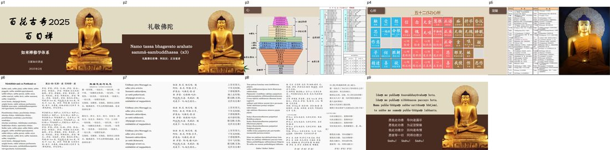

📅 最近更新：2026-09-28 16:30　|　第5版精修（朗读优化版）

# 第2周：善不善心与心所总说（主持人版）

> ⭐ **本讲主持人速览**（新主持人必读，2分钟看完）
>
> 你不是老师，是"共学同行者"。你不需要提前懂内容，只需要按流程走。
> **本周由连续两周内容合并**而成，含两段共读、两轮分享与两轮讨论，单讲 120 分钟。
>
> | 环节 | 标准时长 | ⏱ 时间不够→ | ⏱ 时间富余→ |
> |:-----|:----:|:-----|:-----|
> | 🧘 静心开场 | 10 min | 缩至5 min | 加2分钟静坐 |
> | 📖 共读原文1 | 20 min | 只读★核心段（约15 min） | 加读◈扩展段 |
> | 💬 第一轮分享 | 10 min | 每人1句话 | 每人3分钟 |
> | 🎯 第一轮主题讨论 | 10 min | 只讨论问题① | 讨论全部问题+扩展 |
> | 🧘 禅修练习 | 15 min | 缩至8 min（只念引导词前半） | 延长至20 min |
> | 📖 共读原文2 | 20 min | 只读★核心段 | 加读◈扩展段 |
> | 💬 第二轮分享 | 10 min | 每人1句话 | 每人3分钟 |
> | 🎯 第二轮主题讨论 | 10 min | 只讨论问题① | 讨论全部问题+扩展 |
> | 🔚 收尾与回向 | 15 min | 缩至10 min | 保持 |
>
> **主持人10条守则（精简版）**：
> ① 不讲解、不提供答案——让原文自己说话；② 有人问"正确答案"→说"先听听大家的看法"；③ 冷场→主持人先分享自己的真实感受；④ 跑题→温和拉回："这个有意思，我们回到今天的原文"；⑤ 争论→"两种看法都很好，大家保留自己的理解"；⑥ 确保人人发言；⑦ 不评判任何人的分享；⑧ 时间到了就推进；⑨ 禅修练习照读引导词即可；⑩ 结束一起回向。

> 本周主题：**十二不善心与八欲界善心（善不善心的鉴别），及五十二心所总说**。

## 📋 本周信息卡

| 项目 | 内容 |
|:----|:-----|
| 时长 | 120分钟（4周版 · 9环节） |
| 核心问题 | 十二不善心与八欲界善心的差别到底在哪里？我如何在当下认出正在生起的心，而不落入自我审判？；心与心所是什么关系？为什么"心"本身不决定善不善，而是由伴随的心所决定？五十二心所的四大组框架如何帮助我们观察当下的心？ |
| 共读原文 | 共读原文1：材料①《如来禅修学体系40-摄心分别2》、材料②《阿毗达摩讲要(中)-第11讲 欲界心》　｜　共读原文2：材料①《如来禅修学体系41-摄心分别3》、材料②《阿毗达摩轻松谈》 |
| 本周作业 | ①简答题：十二不善心的"贪根八心"依哪三个条件分成八种？②实践题：今天选一个生活片段（如看到食物、遇到不喜欢的人），记录当时生起的是"贪根／瞋根／痴根"或"善心"，只描述、不评判。；①简答题：心与心所"四同一"指哪四个？为什么说"心本身不决定善不善"？②实践题：今天选一个片段（吃饭、说话、走路），记录当时伴随的心所属于哪一组（通一切／不善／美），只描述、不评判。 |

## 🧘 静心开场（10 min）

> 💬 **破冰｜3–5分钟**：今天有没有哪一刻，你心里冒出一个不太想承认的念头——贪、恼、还是糊涂？一句话说说，说完就放下。

> 🛡️ **心理安全三约定**（每次开场在心里过一遍）：① **保密**——这里说的话不出这间屋子；② **不评判**——不评价任何人的分享，也不急着评价自己；③ **可随时暂停**——任何时候觉得不舒服，都可以停下来休息、喝水或离开，不需要解释。

**（主持人引导语，语速放缓，每句之间留白）**

> 各位法友，请找一个让自己舒适的坐姿，可以盘腿，也可以坐在椅子上。轻轻闭上眼睛，或者让视线柔柔地落在前方地面。先做三次深长的呼吸——吸气，慢慢地；呼气，也慢慢地。
>
> 现在，把注意力带到身体。感觉一下此刻的坐姿，感觉身体与坐垫接触的地方，感觉双手放着的温度。不需要改变什么，只是知道。
>
> 接着，把注意力放到呼吸上。知道吸气，知道呼气。不去控制呼吸，只是陪伴它。吸气进来，呼气出去……如果心跑开了，不要责备它，轻轻地把它带回来，再回到呼吸。心跑开，是它的习惯；把它带回来，是我们的练习。
>
> 今天我们要谈"不善心"。先在心里给自己一个承诺：接下来的两个小时，我们只是观察，不评判、不给自己定罪。心会生起贪、生起瞋、生起痴，这很正常；能看见它，就已经是正念在工作。
>
> 现在，我们来练习一会儿慈心。先想到自己，在心里轻轻地对自己说：愿我健康，愿我快乐，愿我平安，愿我远离痛苦。
>
> 把这份善意，送给坐在你左右的每一位法友——愿他们健康，愿他们快乐，愿他们平安。
>
> 再把它扩大一些，送给今天要学习的法——愿我们听得明白，愿法义入心，愿所学能真正用在生活里。
>
> 好，保持这份开放与柔和，我们慢慢睁开眼睛，回到当下。带着这份不评判的心，我们一起进入今天的共读。

**（主持人操作）** 开场控制在 10 分钟内。若学员入场慢，可先让早到者安静就坐，准点再开始。本周特别要在开场就埋下"观察而非批判"的种子，后面分享／讨论会容易得多。静心不是高压的"必须静下来"，语气始终作邀请。

## 📖 共读原文1（20 min）

> ⚠️ **主持人操作**：共读原文只读不解释。建议分工朗读：材料①由一位熟悉阿毗达摩的法友读，材料②③由另一位读。读到生僻名相（邪见相应／智相应、有行／无行）主持人用一句话白话点明：**"智相应＝带着如实的了解；有行＝需要别人或自己劝一下才生起，无行＝自然就生起。"** 时间不够时，只精读材料③【十二不善心】表与"这是八种『欲界善心』"段，其余作课后阅读。**务必提醒：读到的每一句都是"描述心的种类"，不是"给你贴标签"。**

> 朗读节奏建议：材料③【十二不善心】表逐行慢读，读完停三秒，让大家自己在心里对照；"八种欲界善心"这段照读原文，不加工。若有人读错名相，不必当众纠正，事后轻声提示即可。

> 共读目标（3 句）：① 十二不善心＝"心被贪／瞋／痴所染污"的十二种样子（贪根八、瞋根二、痴根二）；② 八欲界善心＝"心在无贪、无瞋、无痴位"的八种样子；③ 判断一颗心的性质，看三把尺子——"悦俱／舍俱""智相应／不相应""有行／无行"。读完能用自己的话复述这三句，本周就达标了。

> 本周易混点（读前先打个预防针）：① "乐受≠善心"——贪也能伴随乐受，所以"开心"不一定是善；② "不放逸≠压抑"——认出贪瞋痴不是要把它掐灭，而是先看见它；③ "有行≠更坏"——有行只是"需要别人或自己推一把"，无行是"自发"，二者都是不善心，不必比较谁更坏。

> ⚠️ 主持人操作：时间分配（约30 min）：材料①约 8 分钟（教理骨架：心＝识知所缘、心的特相）；材料②约 12 分钟（主菜：十二不善心／八欲界善心论文与实例）；材料③约 10 分钟（【十二不善心】表与"八欲界善心"段对读）。

> 主持人自护：本讲内容贴身心，学员容易"检讨自己"。请把口头禅备好——"我们不评价人，只看心的样子""看见，就已经很好了"。若现场气压变沉，就停一停，做三次深呼吸再继续。

> 读前提示（给学员的一句话）：今天读的不是"你是个什么样的人"，而是"心此刻是什么样子"。"贪根八心"听上去吓人，其实不过是"看到芒果想拿、看到新车喜欢、看到新衣高兴"这些再平常不过的瞬间——认出它们，就已经在路上了。

> ⚠️ 主持人操作：心理安全（共读前务必先立）：谈"贪、瞋、痴"极易被听成"道德审判"。请在共读、分享每个环节反复申明：不善心不是"坏"，而是"染污的"；不审判自己、不产生罪恶感。能观察到，就是正念在运作，讨论的落点是"观察而非批判"。

> 收束提示：共读结束时，请把这一句留在大家心里——"看见贪、看见瞋、看见痴，也看见那一念想要给予的善；看见，就足够。"

### 原文材料①：★核心·如来禅修学体系40-摄心分别2-古源尊者-20250211（课件）

- **文件**：《如来禅修学体系40-摄心分别2-古源尊者-20250211（课件）》

> ⚠️ 主持人操作：本材料照录课件文字层可得部分；读到"五种法则""心的定义"时用一句话白话点明即可。课件中"十二不善心／八欲界善心"为图形页，文字层无对应文字，遇学员问及可翻材料③表解对照。

> 读前提示：先读这一段，是为了立住"心是什么"的底子——心是"识知所缘"的活动，没有一个造作者、没有一个"我"。**先把这句话读进去，后面谈贪心、瞋心才不会变成谈"坏人"。**

#### 一、五种法则

Kamma niyāma　业

Dhamna niyama　法

Citta niyāma　心

Bija niyāma　种子

Utu niyāma　时节

#### 二、阿毗达摩 · 阿毘达摩七部

阿毗达摩，即论藏，是对佛陀教法给予精确、系统分类与诠释的七部论，依次为：

- 法集论
- 分别论
- 界论
- 人施设论
- 论事论
- 双论
- 发趣论

#### 三、心的定义

心：能识知所缘，故名为「心」。

依于心而生起，故名为「心所」。

以冷、热等不同温度而能迁变，故名为「色」。

解脱于贪爱，故名为「涅盘」。离于贪欲 Vāna——涅盘 Nibbāna。

巴利文 citta 是源自动词词根 citi（认知；识知）。诸论师以三方面诠释 citta（心）：造作者、工具、活动。作为造作者，心是识知目标者 (āramma7a cintetī ti citta)。作为工具，与心相应的心所通过心而得以识知目标 (etenacintentī ti citta)。作为活动，心纯粹只是识知的过程 (cintanamatta citta)。

「纯粹活动」这项定义是三者之中最贴切的诠释，即心纯粹只是认知或识知目标的过程。除了识知的活动之外，它并没有一个属于造作者或工具的实际个体。提出「造作者」与「工具」的定义是为了对治某些人所执取的「我见」：认为有个识知目标的造作者或工具的「恒常不变的我」之邪见。佛教学者指出，这些定义显示了并没有一个「自我」在实行识知的活动，而只有心在识知。此心即是识知活动而无他，而且此活动必定是生灭的无常法。

#### 四、Citta niyāma 心（特相·作用·现起·近因）

特相：识知目标(所缘)'拥有'目标

作用：引领相应心所识知目标

现起：与后生心连接，令名相续流不断

近因：名色(无色界只有名)

#### 五、功德回向偈（课件末，供收尾回向参考）

愿我此功德，导向诸漏尽！

愿我此功德，为证涅槃缘!

我此功德分，回向诸有情，

愿彼等一切，同得功德分!

萨度!萨度!萨度!

> ⚠️ 主持人操作：读后小结（主持人一句话）：这一段告诉我们"心纯粹只是识知的过程，没有我"。记住这一点，接下来无论读到哪种不善心，都只是在读"过程"，不是在读"人"。

### 原文材料②：★核心·阿毗达摩讲要(中)-第11讲 欲界心（十二不善心·八大欲界善心）

- **文件**：《阿毗达摩讲要(中)-第11讲 欲界心（十二不善心·八大欲界善心）》

> ⚠️ 主持人操作：本材料译文平实，宜"逐段照读＋举例"。读到"三种区别方法"处停一下，让学员对着前面【十二不善心】表自己找规律；读到八个贪根心的生活实例（新车、新衣、谈恋爱、听歌、买衣）时，正是学员最容易"对号入座"处，提醒：这是照见心的组合，不是给自己贴标签。八善心部分照读"布施、持戒、听闻佛法"的实例；"猎人昼夜受报"的故事可作课后阅读。

> 读前提示：这张“心地图”很长，别急着背。先读“三种区别方法”，再对着八个贪根心的生活实例（新车、新衣、谈恋爱、听歌、买衣）找规律——它们全都是每天会碰到的场景。读到“对号入座”处提醒大家：这是照见“心的组合”，不是给自己贴标签。

#### 二、十二不善心

这一类心在精神上是不健全的，在道德上是应受谴责的，它们会带来苦的、不善的果报，称为不善心(akusalacitta)。

不善心可以依照“根”来分类。“根”(måla)是指能使与它相应的名法稳固地住立的心所，又称为“因”(hetu)。

这里所说的因并非原因的因，而是指决定心的品德的六种心所：无贪(alobha)、无瞋(adosa)、无痴(amoha)，贪(lobha)、瞋(dosa)、痴(moha)。其中，无贪、无瞋和无痴三种为美因，无贪、无瞋是通一切美心的心所，无痴又称慧根、智或慧，这三种是美因的心所。贪、瞋、痴三种为不善根，只要某一类心有其中的任何一种，这类心就是不善心。我们先讲心所，再讲心，就是因为心所是区分心的主要原则，掌握了心所之后，再来了解心就容易得多了。

我们也可以将不善心理解为恶心、不好的心。依其根（因）可以分为三类：贪根心、瞋根心和痴根心。不善心一共有十二种：八种贪根心；两种瞋根心；两种痴根心。

一、八贪根心

含有“贪”(lobha)心所的心称为“贪根心”(lobhamålacittàni)。在这一类心中，贪心所是主要之根。只要某种心拥有贪心所，整个心的性质就变成不善。为什么呢？因为贪心所在这组名法中能起最显著的作用，就像一杯水中只要滴一滴墨水下去，这杯水就会变黑。同样地，在一类名法中，无论它有多少心所——例如有些贪根名法有二十个心所，许多心所并没有好坏之分——但只要有贪心所的存在，整个名法就变成贪根名法，变成不善心。

贪根心有八种，分别是：

1) 悦俱邪见相应无行一心；

2) 悦俱邪见相应有行一心；

3) 悦俱邪见不相应无行一心；

4) 悦俱邪见不相应有行一心；

5) 舍俱邪见相应无行一心；

6) 舍俱邪见相应有行一心；

7) 舍俱邪见不相应无行一心；

8) 舍俱邪见不相应有行一心。

是不是感觉有点复杂呢？不要紧，现在来讲如何区别这些心。这些心不外乎有三种区别方法，一旦掌握它们的区别方法就很好理解。三种区别方法是：

一、“无行”或“有行”。例如：“1）悦俱邪见相应无行心”和“2）悦俱邪见相应有行心”；

二、“邪见相应”或“邪见不相应”。例如：“1）悦俱邪见相应无行心”和“3）悦俱邪见不相应无行心”；

三、“悦俱”或“舍俱”。例如前面四种和后面四种只是换了第一个字。

贪根心由此组合为八种。

注：“”= 同上

贪根心的三项分别：

一、悦俱或舍俱——欢喜地做还是中舍地做。悦俱是 somanassasahagata，舍俱是 upekkhàsahagata。这里的“悦”跟“舍”是指受心所。如果是乐受，这种心就称为悦俱；如果是舍受，这种心就称为舍俱。

这里的“俱”(sahagata)直译为“一起去”、“俱行”，意思是“伴随”。也即是说，心伴随着快乐的感受，还是伴随着中舍的感受。一个人欢喜地生起贪，还是中舍地生起贪，这就是它们的区别。欢喜地生起贪，此时受是乐受，称为悦俱。如果感受平平地生起贪，此时受是舍受，称为舍俱。

有些人可能会问：只有喜欢才会贪啊，为什么感受平平也会贪呢？举个例子：如果你刚买了一辆新车，你会不会很喜欢这辆新车呢？此时你对这辆新车的贪爱和执著就伴随着乐受。但如果你每天都开着这辆车，还会不会执著这辆车呢？会！但是已经不再像刚买的时候那样每天都欢喜地开着吧！

## 💬 第一轮分享（10 min）

**分享规则**

- 自愿为先，先邀请再开始；沉默也是完全被允许的。
- 每人约 90 秒，主持人可举牌控时，不打断、不点评对错。
- 只描述"发生了什么"，不给自己的心定性（不说"我就是贪"），只说"当时心里生起了一个想抓取的心"。
- 听的人只负责聆听与陪伴，不比较、不评判他人修行进境。
- 若有法友分享到私人创伤或极端情绪，主持人只需陪伴与承接，不追问细节、不分析原因。

**起手问题（选 2—3 个）**

1. 回看今天：有没有一个时刻，你"想要更多"（贪）、或"不想要某个东西／某个人"（瞋）、或"糊里糊涂、无所谓"（痴）？请只用一句话描述那个片段，不加评判。
2. 在刚才的共读里，哪一句话、哪一个名相最触动你？为什么？
3. 当你发现自己生起了不善心，你通常的第一反应是自责，还是观察？这个"第一反应"本身就值得看一看。

**（主持人提示与回应话术）**

- 若有人开口就说"我贪心太重、我很糟糕"，请温柔地接住：**"你能看见它，就是正念在运作。我们今天不是来审判自己的，是来认识心的。"** 把讨论从"道德评价"拉回到"现象观察"。
- 若有人说"我什么都不贪，好像没什么可分享的"，可以回应："能觉察到'暂时没有'，也是一种觉察。或者说说今天有没有一件小小的事，让你心里动了一下？"
- 若有人借机批判别人（"我看某某就是嗔心重"），温和地把焦点带回："我们先不评价别人，只看看自己这一念。"
- 若有人开始长篇叙事，用"90 秒"牌轻轻提醒；重点不是讲得完整，而是讲得真实。
- 分享结束时，可用一句收束："我们刚才分享的，都是心的样子，不是人的好坏。谢谢每一位愿意说出来的人。"

## 🎯 第一轮主题讨论（10 min）

**引导问题一：十二不善心为什么要分"贪根八、瞋根二、痴根二"？**

> 提示：带大家回到原文——贪根八心，是拿三个条件交叉出来的：受（悦俱／舍俱）× 见（邪见相应／邪见不相应）× 行（无行／有行），二乘二乘二等于八。瞋根只有二种（忧俱．瞋恚相应，无行／有行），因为瞋一定伴随忧受、一定与瞋恚相应。痴根二种是"疑相应"与"掉举相应"。请学员想想：这种"拆解"的方式，是不是让我们看到"心不是铁板一块，而是若干条件组合出来的"？这对我观察自己的心有什么帮助？不必背下八种，重要的是体会"组合"的思维方式。

> 预设回答与应对：
> - 学员说"这八种我根本分不清"→ 回应："完全不必分。你只要知道'贪心也有差别、也受条件影响'就够了。要分的是当下的心是贪、是瞋，还是痴。"
> - 学员说"这么分析是不是太机械"→ 回应："分析是地图，不是走路。地图越清楚，走路越不容易迷路。"
> - 学员问"邪见相应到底指什么"→ 用白话："就是带着'这快乐是真实的、可以长久的'这种错见去贪。比如以为'拥有他，我就永远幸福'。"

**引导问题二：八欲界善心与贪根八心，都用"悦俱／舍俱、无行／有行"，差别到底在哪？**

> 提示：关键在"智相应／智不相应"与"因"。善心是"无贪、无瞋（、无痴）"为根，贪心是"贪（、痴）"为根。原文里贪根八心配的是"邪见相应／不相应"，善心配的是"智相应／智不相应"。也就是说：同样是"带着喜悦去做一件事"，背后可能是贪（我想得到），也可能是善（我想利益）。请学员不要靠"感觉得舒服／不舒服"来判断善恶——舒服不等于善，这是本周最容易混淆的一点。可以举个中性例子：请客吃饭，可能是贪（想被称赞），也可能是善（真心照顾人），行为相同，心不同。

> 预设回答与应对：
> - 学员困惑"那乐受到底好不好"→ 回应："乐受是中性的，好坏看它和什么因在一起。和贪在一起，是贪的乐；和无贪在一起，是离系的乐。"
> - 学员追问"善心欢喜，是不是也有贪"→ 回应："如果欢喜里没有'我要、我抓'，而是'我愿'，那就是善的乐。判断要看有没有'抓紧'的味道。"
> - 学员说"太细了，生活里哪有空分"→ 回应："确实没空分。所以我们练习的是'事后回看'，不是'当下贴标签'。"

**引导问题三："有行／无行"——需要被劝一下才生起的心，与自然生起的心，给修行什么启发？**

> 提示：原文中"有行"＝有怂恿、被鼓励（自己或他人）后才生起；"无行"＝不待劝、自然就生起。可以问：你行善时，更多是"被提醒才做"还是"自然就做"？这提示我们：修行的方向，是让善心越来越"无行"、让不善心越来越"有行"（不容易起）。但要小心，别把它变成新的自我评价标准——它只是一个观察的坐标。同时提醒：无论有行无行，都是因缘法，都不是"我"。

> 预设回答与应对：
> - 学员说"我做什么都要人劝，是不是很差"→ 回应："被劝才做，也是善心，也值得随喜。别把'无行'当成新的考核指标。"
> - 学员说"那我以后是不是该主动一点"→ 回应："是，但用'培育'的心态，不是用'补作业'的心态。慢慢来。"
> - 学员担心"这是不是又在给自己打分"→ 回应："我们只是看清'起心'的因缘，看清了，它自然会变。不需要额外给自己打分。"

**（主持人收束）** 讨论三题后，用一句话收拢：**"这三题指向同一件事——观察心的因、相应与行，而不是给自己打分。"** 若时间富余，可请一位学员用"请客吃饭"的例子在现场演一遍三把尺子（受／相应／有行）。

> **分层追问**（可视时间取用，由浅入深）：
> - 【现象】贪、瞋、痴生起时，你的身体和心各有什么反应？先说说你认得出的那一种。
> - 【影响】这些心大多不用人劝就来了，而善意却常要人推一把才起来——这个差别让你想到什么？
> - 【应对】这一周，每当察觉到一个不友善的念头，先不急着评判，只在心里轻轻说一句「我看见你了」。

## 🧘 禅修练习（15 min）

### 练习一

> ⚠️ **禅修禁忌提示**：若你正处在严重抑郁、焦虑、创伤后应激，或精神类疾病的发作／用药期，或正经历强烈的情绪危机，请先咨询医生或心理师，再决定是否练习；练习中若出现明显不适（如心悸、胸闷、情绪失控），请立即停止，睁开眼睛，把注意力放回呼吸与身体，必要时离场休息。

**（本周练习：观心三标签 · 主持人引导词，语速放缓）**

> 请坐好，轻轻闭眼，先做三次深呼吸。吸气……呼气……让身体松下来。
>
> 现在，我们做一个很简单的练习，叫做"贴标签"。它不是判断好坏，只是给当下生起的心，轻轻贴上一个名字。
>
> 先把注意力放到呼吸上，陪伴呼吸一会儿。当有一个念头、一种情绪、一个画面生起时，我们不追它，只轻轻地看它一眼，然后选一个标签：
>
> 如果是"想要、想抓、想多一点"的味道——在心里轻轻说：**"贪。"**
>
> 如果是"不想要、排斥、烦躁、想推开"的味道——轻轻说：**"瞋。"**
>
> 如果是"糊里糊涂、不清楚、无所谓、发呆"的味道——轻轻说：**"痴。"**
>
> 如果是"想给予、想照顾、清楚明白地做一件对的事"的味道——轻轻说：**"善。"**
>
> 说完，就放下这个标签，回到呼吸。它只是一个标签，不是给你定罪。标签贴完就丢。
>
> 再来一次……无论生起什么，都只是知道，只是轻轻地命名，不推开也不抓住。
>
> 好，我们慢慢回到身体，回到呼吸，再回到这个房间。睁开眼睛。

**（主持人操作）** 练习 8—10 分钟即可，留几秒安静。强调："贴标签是为了看见，不是为了评判；如果一整个练习都在打妄想，也没关系——能知道'我在打妄想'，本身就是练习。"若时间富余，加 5 分钟慈心散播（可用材料①"散播慈爱"的句子）。

**（常见问题与处理）**

- "我分不清贪和善"→ 提示："看有没有一个'我要、我抓'的紧张感。想给出去、想让人好，通常松；想得到、想留住，通常紧。"
- "我越观察越焦虑"→ 提示："如果越观察越紧，就先停下标签，只回到呼吸，把'必须看清'也放下。观察不等于盯着自己审问。"
- "我几乎全是痴（发呆）"→ 提示："能发现'原来多数时候是糊里糊涂'，这是很真实的发现，值得欢喜，因为它意味着开始清醒了。"
- **练习后的分享**：邀请 2—3 位法友用一句话说"我标签到了什么、身体有什么感觉"，只描述、不评判。主持人最后补一句："今天你贴的每一个标签，都只是一片云的名字。"

### 练习二

> ⚠️ **禅修禁忌提示**：若你正处在严重抑郁、焦虑、创伤后应激，或精神类疾病的发作／用药期，或正经历强烈的情绪危机，请先咨询医生或心理师，再决定是否练习；练习中若出现明显不适（如心悸、胸闷、情绪失控），请立即停止，睁开眼睛，把注意力放回呼吸与身体，必要时离场休息。

**（本周练习：观"触·受·想·思"四心所 · 主持人引导词，语速放缓）**

> 请坐好，轻轻闭眼，先做三次深呼吸。吸气……呼气……让身体松下来。
>
> 今天我们不观别的，只观四个最普通的"心的零件"——触、受、想、思。它们每一刻都在，只是平时我们没留意。
>
> 先把注意力放到呼吸上。当空气触到鼻孔或腹部时，轻轻知道：**这是"触"——接触。**
>
> 接着，留意这一刻的感觉是舒服、不舒服，还是不苦不乐，轻轻知道：**这是"受"——感受。**
>
> 如果心里浮现出"这是呼吸""这是冷风"这样的辨认，轻轻知道：**这是"想"——标记、认知。**
>
> 如果心里有一个小小的"我要继续"或"我想停下来"的动向，轻轻知道：**这是"思"——意志、动机。**
>
> 不必分析，不必命名得准确。只是知道：触来了，受来了，想来了，思来了……它们像几个同伴，一起出现、一起灭去。你不是它们，你只是看着它们来去的那个知道。
>
> 再一次：吸气，知道触；知道受；知道想；知道那个想去留的动向。就这样，陪它一会儿。
>
> 好，我们慢慢回到身体，回到呼吸，再回到这个房间。睁开眼睛。

**（主持人操作）** 练习 8—10 分钟即可，留几秒安静。强调："这不是考试，认不认得出'触受想思'都没关系；能知道'心里有东西在动'，就已经在练习了。"若时间富余，加 5 分钟慈心散播。

**（常见问题与处理）**

- "我分不清想和思"→ 提示："'想'是认出来'这是什么'；'思'是想去做点什么。一个偏认识，一个偏动机。分不清没关系，先知道有这两个在动就好。"
- "我越观察越紧张"→ 提示："如果越观察越紧，就先放下观察，只回到呼吸。观察不等于审问自己。"
- "我几乎什么都没观到"→ 提示："能发现'好像什么都没有'，也是一种观察。慢慢来，不着急。"
- **练习后的分享**：邀请 2—3 位法友用一句话说"我留意到了哪个心所在动、身体有什么感觉"，只描述、不评判。主持人最后补一句："今天我们只是第一次认了几位'心的同伴'，以后慢慢会越来越熟。"

## 📖 共读原文2（20 min）

> ⚠️ **主持人操作**：共读原文只读不解释。建议分工朗读：材料①③由一位熟悉阿毗达摩的法友读（材料③表解多，可投影／板书），材料②由另一位读。读到生僻名相（遍一切心／杂心所／遍一切不善／遍一切美）主持人用一句话白话点明即可。时间不够时，只精读材料③【五十二心所】表与材料②"七遍一切心心所"段，其余作课后阅读。**务必提醒：心所是心的"零件"，不是"你"；读到的都是心的样子，不是给你贴标签。**

> 朗读节奏建议：材料③【五十二心所】表逐行慢读，读完停三秒；材料②"心所决定心"这段照读原文，不加工。若有人读错巴利文（如 saññā、jīvitindriya），不必当众纠正，事后轻声提示即可。

### 原文材料①：★核心·如来禅修学体系41-摄心分别3-古源尊者-20250212（课件）

- **文件**：《如来禅修学体系41-摄心分别3-古源尊者-20250212（课件）》

⚠️ 主持人操作：本材料"五十二心所"以 flowchart（课件图形页）呈现，照读时不必念源码，改为"报心所名＋括注"：如"触——接触""受——感受"……读到分组处点一句白话即可。**心所多达五十二个，不必全记，用分组记忆（13通一切／14不善／25美）。** 完整分类表见材料③。

#### 心所

心所

#### 五十二(52)心所

五十二(52)心所

（原表为课件图形页，见《原文全集》）

---

### 原文材料②：◈核心·阿毗达摩轻松谈

- **文件**：《阿毗达摩轻松谈》

⚠️ 主持人操作：本材料以白话故事讲心所，最适合"选读"。时间紧时只读"心所决定心"＋"七遍一切心心所"两节；其余（痴／无惭／无愧／掉贪诸释义）作课后阅读。读到"我""灵魂"等字眼时，提醒学员：这些都是为了对治"我见"，不是在说真有"我"。

#### 第二章 心所和不善心所

心所决定心

Cetasikas, 心所或伴随生起的心所。在心(Citta)的那一章中, 已经解释过善与不善心的概念。但是, 由于心的唯一功能是识知目标, 心本身不具善或不善。由于心是与不同的心所俱生, 心会变成善或不善, 端视伴随的心所是善或不善而定。也就是说:「伴随心识生起的心所, 可以引起心识成为善或不善。」

就像水本身没有颜色，如果分别地加入红的、黄的、蓝的或黑色的染料之后，水就变成红的、黄的、蓝的或黑色的水。同样地，与心识俱生的心所就像染料一样，可以改变心的善或不善。因此，紧接著你应学习诸心所法，从而了解善或不善心。

箴言：心只能识知目标；心本身无法决定善或不善。心识变成善或不善，是基于不同的心所。

#### 影响心的十四不善心所

不善心所

1. Moha = 痴

2. Ahirika = 无惭

3. Anottappa = 无愧

4. Uddhacca = 掉举, 不安

5. Lobha = 贪

6. Ditthi = 邪见

7. Māna = 慢, 自负

8. Dosa = 瞋, 生气

9. Issā = 嫉妒

10. Macchariya = 悭, 吝畜、自私

11. Kukkucca = 恶作

12. Thina = 昏沉

13. Middha = 睡眠

14. Vicikicchā = 疑, 不确定

(a + kusala = 相反 + 善 = 不善)

#### 一、痴

两种痴

无明(delusion)就是痴。痴有两种,随眠的痴(anusaya - moha)与缠缚【烦恼】的痴(pariyuṭṭhāna-moha)。随眠(Anusaya)意为固有的倾向(inherent tendency)或潜伏著(lying latent)。缠缚【烦恼】(Pariyuṭṭhāna)意为生起。所以,潜伏在众生心中的无知称为随眠痴(anusaya - moha)。偶尔与心识一起生起的无知称为缠缚或生起的痴(pariyuṭṭhāna moha)。

随眠的痴 (Anusaya Moha)

就像有毒的树会结有毒的果实，在众生的心相续流中也一样，有一种元素(dhātu)，会覆盖住应被了解的佛法(Dhamma)。这种元素称为随眠的痴(anusaya moha)。由于随眠痴的覆蔽作用，凡夫(puthujjanas)无法彻知无常(anicca)、苦(dukkha)和无我(anatta)三法印【的本质】；他们既无法以全面性地方式理解四圣谛(Four Noble Truths)也无法了解缘起法(Paticcasamuppāda)。

凡夫有限的知识无法识别潜在的痴。现今，纵使人们透过书本学习，声称知道无常、苦、无我等等，这样的认识仍然是表面的，不是清楚、透彻的完全认知。甚至当一个人成为须陀洹(Sotāpanna)、斯陀含(Sakadāgāmi)、阿那含(Anāgāmi)的时候，随眠的痴也只是变的越来越弱而已。只有当一个人成为阿罗汉(Arahantship)时，随眠的痴元素(anusaya moha dhātu)才会完全地去除。所以，在成为阿罗汉之前，即使是在做好事或行善的当下，随眠的痴还是存在的，它只是安静地潜藏著。

缠缚的痴

当痴与心一起生起时，就是不善心现起了。由于缠缚痴的覆蔽作用，一个人无法了解恶行将招致未来可能遭受的恶果。因此，即使是有学问与有德的人也无法警觉到痴的邪恶，而且当痴生起时也会为恶。在所有的恶中，这种痴是最邪恶的。在这世上，所有的邪恶和愚蠢都源于痴，痴是所有恶的主根。

粗劣和微细的痴

无法辨别什么是不善或道德败坏的行为，与什么是善或美德的痴，是相当粗劣的痴。使你无法认知名色的无常、苦和无我的本质、四圣谛和缘起法的痴，则是相当微细的痴。那与痴俱生的心称为「迷惑的心，愚痴的心」，一个被无明驱使的人有著不同的称谓，如「傻瓜、愚人、哑巴、迟钝、野蛮、愚蠢、没有用」。

「这个世界是一片黑暗的。在这世上，只有少数人能超凡地认知到。就像只有少数鸟可脱逃罗网，鲜有人死后而升天。」（《法句经》v.174）

## 💬 第二轮分享（10 min）

**分享规则**

- 自愿为先，先邀请再开始；沉默也是完全被允许的。
- 每人约 90 秒，主持人可举牌控时，不打断、不点评对错。
- 只描述"发生了什么"，不给自己的心定性（不说"我就是贪心重"），只说"当时心里生起了一个想抓取的心"。
- 听的人只负责聆听与陪伴，不比较、不评判他人修行进境。
- 若有法友分享到私人创伤或极端情绪，主持人只需陪伴与承接，不追问细节、不分析原因。

**起手问题（选 2—3 个）**

1. 回看今天：有没有一个时刻，你能隐约感到"心里不只是一个人在说话"——像是有一个想抓的、一个想推的、一个在旁边看的？请只用一句话描述那个片段，不加评判。
2. 在刚才的共读里，哪一句最触动你？是"心与心所如同国王与大臣"，还是"心所像染料，把心染成善或不善"？
3. 当你听到"52 个心所"时，心里第一反应是什么？（头大？好奇？觉得离自己很远？）这个第一反应本身，也值得看一看。

**（主持人提示与回应话术）**

- 若有人开口就说"这么多名相，我肯定学不会"，请温柔地接住：**"学不会很正常，我们本来就不是来背的。记住 13、14、25 三块框架，就已经过关了。"** 把焦点从"记忆"拉回"理解"。
- 若有人说"我心里乱七八糟，是不是心所太多"，可以回应："心所多，不等于乱。就像一支乐队，乐器多，才能奏出乐曲。重要的是看看今天是谁在带队。"
- 若有人借机批判自己（"我贪心太重"),温和地把焦点带回："我们先不评价，只看看当时有哪些心所在动。"
- 若有人开始长篇叙事，用"90 秒"牌轻轻提醒；重点不是讲得完整，而是讲得真实。
- 分享结束时，可用一句收束："我们刚才分享的，都是心的样子，不是人的好坏。谢谢每一位愿意说出来的人。"

## 🎯 第二轮主题讨论（10 min）

**引导问题一：心与心所，到底是什么关系？为什么说"心不孤单"？**

> 提示：带大家回到原文——材料③说"心与心所的关系，如同国王与大臣，国王出现必定有大臣伴随"；每个心识刹那都有一组"心与心所"生起，这一组必定"同时生、同时灭、同一所缘、同一依处"，合起来叫"名聚"。可以问学员：这个"四同一"里，哪一条最让你意外？是不是"同一所缘"？也就是心和所有心所，看的是同一个目标。请学员想想：这样的"成组生起"的画面，对理解"心不是铁板一块"有什么帮助？不必背名相，重要的是体会"心是一队人"的意象。

> 预设回答与应对：
> - 学员说"那我平时说的'我的心'，到底是哪一个？"→ 回应："'我的心'其实是一组一组的'心＋心所'在生灭。我们说的'我'，是把这些快速生灭的组合抓成了一个整体。"
> - 学员说"同生同灭太快了，我根本看不到"→ 回应："确实看不到，这是极快的法。看不到没关系，理论上先建立正确的图景。"
> - 学员问"名聚是不是就是'我'？"→ 回应："不是。名聚是因缘和合、刹那生灭的一组，不是恒常的'我'。这也正是阿毗达摩要拆解的。"

**引导问题二：既然"心本身不决定善不善，是心所决定心"，那这对我们观察自己的心有什么用？**

> 提示：回到材料②最关键的一段："心只能识知目标；心本身无法决定善或不善。心识变成善或不善，是基于不同的心所。"比喻是：水本身没有颜色，加入红黄蓝黑的染料，水就变成那个颜色；与心俱生的心所就像染料。也就是说：同样一颗"识知目标的心"，配上贪瞋痴就是不善心，配上无贪无瞋无痴就是美心。可以问学员：这像不像"同样的行为，背后的动机不同，性质就不同"？请把落点放在"看动机、看心所"，而不是"看行为表面"。

> 预设回答与应对：
> - 学员问"那我做同一件事，有时是善、有时是不善？"→ 回应："对。行为相同，配的心所不同，性质就不同。所以我们练的是看'配了哪些心所'。"
> - 学员说"这样是不是太苛刻，做个好事还要检查动机"→ 回应："不是苛刻，是清醒。看清动机是为了让善更纯，不是为了挑自己的刺。"
> - 学员困惑"那我的心到底善不善"→ 回应："心本身是中性的识知活动；善不善看它这一刻配了什么心所。所以不用急着给'我'定性。"

**引导问题三：材料②说"我宣称思是业"——为什么思心所承担了业的责任？**

> 提示：回到材料②"四、思"：思是"引领心和其他心所与它一起生起"的组织力，像公司里的秘书、像战场上的指挥官，驱使心与心所"都好像是贯穿了目标"。所以行为真正负责的心所落在思上，佛陀因此说"Cetanāham bhikkhave kammān vadāmi"（比丘们，我宣称思是业）。可以问：这提示我们，修行要看的"第一现场"是哪里？是行为的外表，还是那个"意愿／动机"？但要小心：别把它变成新的自我审判标准——它只是提示我们"意业为先"。

> 预设回答与应对：
> - 学员问"那是不是只要动机好，行为随便都行？"→ 回应："不是'随便'，而是说动机是根。动机真、行为也当正，才是一致。"
> - 学员担心"那我以前无心的过失，算不算业"→ 回应："思有强有弱，业也有强有弱。原文说'当思强有力时，业是强的；当思薄弱时，业是弱的'。所以不必一概而论、更不必自责。"
> - 学员说"这和'无我'矛盾吗"→ 回应："不矛盾。思也是因缘所生、刹那生灭的，正因为它缘起，才谈得上'可以培育'。"

**（主持人收束）** 讨论三题后，用一句话收拢：**"这三题指向同一件事——心不孤单，它带着一队心所，善不善就看这队心所里有没有贪瞋痴。看清配对，而不是审判自己。"** 若时间富余，可请一位学员用"请客吃饭"的例子现场演一遍：同样是请客，配无贪无瞋是善，配贪（想被称赞）就是不善。

> **分层追问**（可视时间取用，由浅入深）：
> - 【现象】「心」和「心所」总是结伴而行，回想一次你的起心动念，当时陪着它一起来的还有什么？
> - 【影响】如果决定善不善的不是心本身、而是陪着它的心所，那你对「我本性如何」的看法会松动吗？
> - 【应对】这一周，每天记一次「当时心里跟着的是什么」——只记下名字，比如急、软、紧、松。

## 🔚 收尾与回向（15 min）

### 收尾一

**总结引导（主持人可照读）**

> 今天我们认识了十二不善心与八欲界善心。请记住三个要点：第一，心不是"我"，是条件组合出来的一刹那一刹那——贪根八心，就是受、见、行三个条件交叉出来的。第二，判断善恶不看"舒不舒服"，而看"因"——是以贪瞋痴为根，还是以无贪无瞋为根。第三，认识不善心，是为了观察与转化，不是为了给自己定罪。能看见，就已经在修行了。

> 再补一句：今天读到的十四不善心所，不是十四顶帽子扣在谁头上；它们只是心的若干种"天气"。天气会变，心也会变。我们要做的，是学会看天，而不是骂天。

**下周预告**

> 下周（第4周）我们进入"心所总说——52心所分类"：遍一切心 7、杂 6、不善 14、美 25。今天已经提前见到了不善心所，下周我们把这些"心的成份"完整地铺开，看看一颗心了不起的作用背后，是多少心所在协同工作。

**回向词（四句，大家一起念）**

愿以此功德，普及于一切，
我等与众生，皆共成佛道。
愿我此功德，导向诸漏尽；
愿我此功德，为证涅槃缘。

（如时间允许，可加念材料①的"萨度!萨度!萨度!"。）

### 收尾二

**总结引导（主持人可照读）**

> 今天我们认识了五十二心所。请记住三个要点：第一，心不孤单——每颗心都带着一队心所一起生、一起灭、看同一个目标、依同一个依处，这叫做"名聚"。第二，心本身不决定善不善，是心所决定心——就像水被染料染成不同颜色；所以修行要看"配了哪些心所"。第三，52 个心所不必全记，记住 13／14／25 三大组框架就好。认识心所，是为了理解"心为何有善恶"，不是为了记忆，更不是为了给自己贴标签。
>
> 再补一句：今天读到的"贪、瞋、痴"等不善心所，不是几顶帽子扣在谁头上；它们只是心的若干种"颜色"。颜色会变，心也会变。我们要做的，是学会认出颜色，而不是责怪那杯水。

**下周预告**

> 下周（第5周）我们进入"不善心所与善／美心所"：今天我们已经把五十二心所的框架立起来了，下周我们专门拉开其中的"十四不善心所"与"二十五美心所"，一个一个看清楚——哪些心所让心染污，哪些心所让心清净，以及如何在当下认出它们、培育它们。

**回向词（四句，大家一起念）**

愿以此功德，普及于一切，
我等与众生，皆共成佛道。
愿我此功德，导向诸漏尽；
愿我此功德，为证涅槃缘。

（如时间允许，可加念"萨度!萨度!萨度!"。）

## 📌 本讲主持人特别提醒

1. **心理安全（本周重点）**：本讲涉"贪、瞋、痴"，极易被学员当成"道德审判"。请在开场、共读、分享、收尾每个环节反复申明：**不善心所不是"坏"，而是"染污的"——不审判自己、不产生罪恶感；能观察到，即正念在运作。** 讨论的落点是"观察而非批判"，绝不把分享会变成"审判自己的心"。
2. **不把讨论变成"审判自己的心"**：当有人自我批判时，主持人的任务不是安慰"你其实很好"，而是把视角从"评价人格"转到"观察现象"——"我们看看当时发生了什么，而不是你是个什么样的人。"
3. 分享以自愿为限；主持人不诊断、不给心理学标签。有人情绪波动时，提供呼吸放松或暂时离场的选项，不追问隐私、不分析成因。
4. 名相只做一句话白话，不做学术展开；学员记不住八种贪心完全正常，重在体会"组合"与"因"的思路。
5. "乐受不等于善心"是本讲最易混点，讨论中若出现争执，回到原文即可，不必强求统一结论。
6. 严控时间，宁可少读一段也不拖堂；回向不可省略，把功德导向一切众生。

> 一句话收束：本讲我们看的不是"你是个什么样的人"，而是"心此刻是什么样子"。愿大家带着这份不评判的觉察离场，把这份清明带回生活——看到贪，看到瞋，看到痴，也看到那一念想要给予的善；看见，就已经走在路上了。

---

<!--EXT_READ-->
## 📖 延伸阅读（课后自由选读）

- 《阿毗达摩轻松谈》——心所决定心（如水与染料）、十三通一切心所的通俗讲解。
- 《如来禅修学体系41-摄心分别3》——八十九心明细表中欲界心"受·相应·行"条件的对照。
- 《摄阿毗达摩义论表解-简体-完整版201802》——十二不善心表、二十四欲界美心表、五十二心所图表。
<!--/EXT_READ-->
