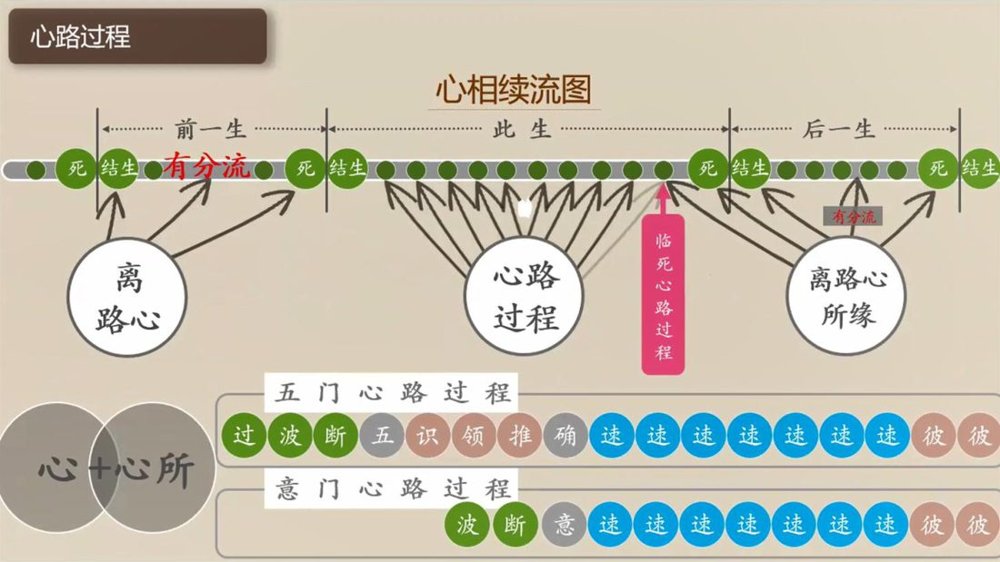
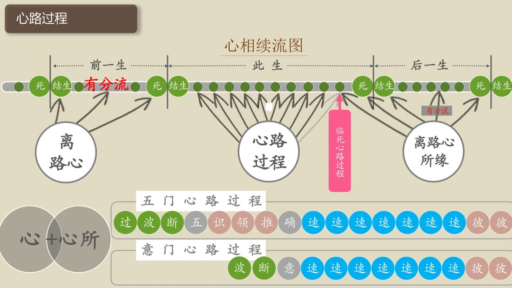
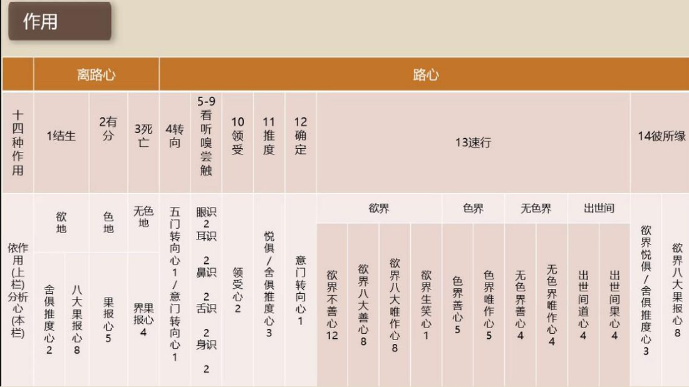

📅 最近更新：2026-09-28 16:30　|　第5版精修（朗读优化版）

# 第3周：离路心与十四种心识作用（主持人版）

> ⭐ **本讲主持人速览**（新主持人必读，2分钟看完）
>
> 你不是老师，是"共学同行者"。你不需要提前懂内容，只需要按流程走。
> **本周由连续两周内容合并**而成，含两段共读、两轮分享与两轮讨论，单讲 120 分钟。
>
> | 环节 | 标准时长 | ⏱ 时间不够→ | ⏱ 时间富余→ |
> |:-----|:----:|:-----|:-----|
> | 🧘 静心开场 | 10 min | 缩至5 min | 加2分钟静坐 |
> | 📖 共读原文1 | 20 min | 只读★核心段（约15 min） | 加读◈扩展段 |
> | 💬 第一轮分享 | 10 min | 每人1句话 | 每人3分钟 |
> | 🎯 第一轮主题讨论 | 10 min | 只讨论问题① | 讨论全部问题+扩展 |
> | 🧘 禅修练习 | 15 min | 缩至8 min（只念引导词前半） | 延长至20 min |
> | 📖 共读原文2 | 20 min | 只读★核心段 | 加读◈扩展段 |
> | 💬 第二轮分享 | 10 min | 每人1句话 | 每人3分钟 |
> | 🎯 第二轮主题讨论 | 10 min | 只讨论问题① | 讨论全部问题+扩展 |
> | 🔚 收尾与回向 | 15 min | 缩至10 min | 保持 |
>
> **主持人10条守则（精简版）**：
> ① 不讲解、不提供答案——让原文自己说话；② 有人问"正确答案"→说"先听听大家的看法"；③ 冷场→主持人先分享自己的真实感受；④ 跑题→温和拉回："这个有意思，我们回到今天的原文"；⑤ 争论→"两种看法都很好，大家保留自己的理解"；⑥ 确保人人发言；⑦ 不评判任何人的分享；⑧ 时间到了就推进；⑨ 禅修练习照读引导词即可；⑩ 结束一起回向。

> 本周主题：**离路心（结生·有分·死）与十四种心识作用**。

## 📋 本周信息卡

| 项目 | 内容 |
|:----|:-----|
| 时长 | 120分钟（4周版 · 9环节） |
| 核心问题 | 什么是「离路心」？结生、有分、死这三种作用，分别在哪里发生、由多少种心执行？为什么说结生心与死心「同性质而不同作用」？离路心与心路过程如何交替，构成生命的相续？；十四种作用到底是哪十四种、分成哪十个阶段？这十四种作用又分别由 89 心中的哪几种心来执行？所缘的强弱，如何决定一条心路走多远、有没有彼所缘？ |
| 共读原文 | 共读原文1：材料①《如来禅修学体系45-摄杂分别1》　｜　共读原文2：材料①《第111讲 摄杂品2-共修版》 |
| 本周作业 | ①简答题：离路心有哪三种作用？执行这三种作用的是哪一类心、共多少种？为什么说结生心与死心是「同性质而不同作用」？②实践题：今晚上床入睡前，安静一分钟，观察一下「从清醒到睡着」的那一小段过渡——你能不能在失去意识之前，捕捉到「心还在，只是没有在忙」的那一点安静？只体会、不评判，也不必强求。；①简答题：请写出十四种作用，并说明「结生、有分、死亡」为什么是同一种心；「速行」为什么是重复七个刹那？②实践题：今天挑一次「看到一个你喜欢的东西（或听到一句不顺耳的话）」，观察自己——从「看见／听见」到「心里已经起反应」，中间大约经过了几步？只记录、不评判。 |

## 🧘 静心开场（10 min）

> 💬 **破冰｜3–5分钟**：今天你有没有过一段「什么都没在想」的空白？比如发呆、走神刚回神的一刻，说说那是什么样的。

> 🛡️ **心理安全三约定**（每次开场在心里过一遍）：① **保密**——这里说的话不出这间屋子；② **不评判**——不评价任何人的分享，也不急着评价自己；③ **可随时暂停**——任何时候觉得不舒服，都可以停下来休息、喝水或离开，不需要解释。

**（主持人引导语，语速放缓，每句之间留白）**

> 各位法友，请找一个让自己舒适的坐姿，可以盘腿，也可以坐在椅子上。轻轻闭上眼睛，或者让视线柔柔地落在前方地面。先做三次深长的呼吸——吸气，慢慢地；呼气，也慢慢地。
>
> 现在，把注意力带到身体。感觉一下此刻的坐姿，感觉身体与坐垫接触的地方，感觉双手放着的温度。不需要改变什么，只是知道。
>
> 接着，把注意力放到呼吸上。知道吸气，知道呼气。不去控制呼吸，只是陪伴它。吸气进来，呼气出去……如果心跑开了，不要责备它，轻轻地把它带回来，再回到呼吸。
>
> 今天我们要谈「离路心」——结生、有分、死。这听起来是关于生命开始与结束的题目，但它其实是一份关于**生命的相续**的说明。请先给自己一个承诺：接下来的两个小时，我们只是来认识心、观察心，不是来吓自己，也不是来给自己或谁定罪。**谈这些，心里有波动是很自然的；任何时候，你都可以回到呼吸，也可以安静地暂离一下。**
>
> 现在，我们来练习一会儿慈心。先想到自己，在心里轻轻地对自己说：愿我健康，愿我快乐，愿我平安，愿我远离痛苦。
>
> 把这份善意，送给坐在你左右的每一位法友——愿他们健康，愿他们快乐，愿他们平安。
>
> 也把这份善意，送给所有正在经历病苦、正在走向生命尽头的众生——愿他们无所恐惧，愿他们被温柔以待，愿他们遇善缘、得善念。
>
> 再把它扩大一些，送给今天要学的法——愿我们听得明白，愿法义入心，愿所学能真正用在生活里。
>
> 好，保持这份开放与柔和，我们慢慢睁开眼睛，回到当下。带着这份不恐惧、不着急的心，我们一起进入今天的共读。

**（主持人操作）** 开场控制在 10 分钟内。若学员入场慢，可先让早到者安静就坐，准点再开始。本周特别要在开场就埋下三颗种子：一是「这是关于生命相续的说明，不是恐怖故事」，二是「谈死亡有情绪波动是自然的，可回呼吸、可暂离」，三是「我们只到『结生到何处、依什么业』为止」。语气始终作邀请。

## 📖 共读原文1（20 min）

> ⚠️ **主持人操作**：本周共读三份材料。**材料①是主体（★核心）**，只读「三作用定义（结生／有分／死亡三条）＋摄作用论（十九心那句）＋心之作用广释＋依作用分析心一览表＋摄门离路心」；**材料②读「心路过程」页的离路心结构图**，用于立起「心路与离路交替」这条相续之环；**材料③读〈第八章 临死之前的心路过程〉的「四种死亡之因」「最后一刻的重要性」「三种征象」与结论**。共读时只念不解释；名相点到即止，解释留到分享与讨论。材料①的「依作用分析心表」「摄作用一览表」与材料③的长事例，可**投影对照或摘读首尾**，不逐字念完。以下照录均为逐字原文，供法友轮流照读。

> 朗读节奏建议：材料①「结生／有分／死亡」三条与「十九心」那句，请慢念、慢念、再慢念，让大家记住数；材料②的图节点（离路心→死／结生／有分流）可先念一遍、再在板上画成环；材料③「最后一刻的重要性」一段最重要，可请不同法友各念一遍。读错的巴利文（如 bhavaṅga、paṭisandhi、cuti）不必当众纠正，事后轻声提示即可。**读到「死亡」「临死」段时，语速放慢、语气放柔，注意场上情绪。**

### 原文材料①：★核心·如来禅修学体系45-摄杂分别1-古源尊者-20250220（课件）

- **文件**：《如来禅修学体系45-摄杂分别1-古源尊者-20250220（课件）》

**照录（逐字·十四种作用之「结生／有分／死亡」三条定义）：**

**照录（逐字·摄作用（kiccasaṅgaho）论文段——「十九心」之根）：**

**照录（逐字·「心之作用」广释——《阿毘达摩义广释》(Vibhv.p.96; CS:p.125)）：**

> 1. 「从(前一生的)'生命'(有)，成为(此生)生命的结生，为'结生作用'。」Bhavato bhavassa patisandhānam patisandhikiccaht.
>
>
> 3.转向作用(avajanakiccain): 由有分心取前一生临终速行的目标，转向现前的目标(所缘)，为 $ \cdot $ 转向作用。(编者补充)
>
> 6. 「从已生的状态，进入不存在，为'死心作用'。」 Nibbattabhavato parigalhanam cutikiccath.

**照录（逐字·依作用分析心（一览表））：**

- 十四种作用：依作用(上栏)分析心(本栏)　1结生：欲地　1结生：欲地　2有分：色地　3死亡：无色地　4转向：五门转向心1/意门转向心1　5-9看听嗅尝触：眼识2耳识2鼻识2舌识2身识2　10领受：领受心2　11推度：悦俱/含俱推度心3　12确定：意门转向心1　13速行：欲界　13速行：欲界　13速行：欲界　13速行：色界　13速行：色界　13速行：无色界　13速行：无色界　13速行：出世间　13速行：出世间　14彼所缘：欲界悦俱/含俱推度心3　14彼所缘：欲界八大果报心8

- 十四种作用：依作用(上栏)分析心(本栏)　1结生：舍俱推度心2　1结生：八大果报心8　2有分：果报心5　3死亡：界果报心4　4转向：五门转向心1/意门转向心1　5-9看听嗅尝触：眼识2耳识2鼻识2舌识2身识2　10领受：领受心2　11推度：悦俱/含俱推度心3　12确定：意门转向心1　13速行：欲界不善心12　13速行：欲界八大善心8　13速行：欲界八大唯作心8　13速行：色界善心5　13速行：色界唯作心5　13速行：无色界善心4　13速行：无色界唯作心4　13速行：出世间道心4　13速行：出世间果心4　14彼所缘：欲界悦俱/含俱推度心3　14彼所缘：欲界八大果报心8

**照录（逐字·摄门中的离路心（三作用所摄之心数））：**

> $\blacktriangleright$ 眼门(46)等 = 若以「作用」来分析眼门作用，其内容为：转向(1)+看(2)+颌受(2)+推度(3)+确定(1)+速行(12+1+8+8)+彼所缘(11)=49，再减去重复的推度心(3)，结果是[46]个，其余四门类推。
>
>
> $\blacktriangleright$ 离门(19)=舍俱推度心(2) + 欲界八大果报心(8) + 色界果报心(5) + 无色界果报心(4)。

**照录（逐字·摄门（dvārasangaho）论文段）：**

（原表为课件图形页，见《原文全集》）

**照录（逐字·摄作用〈一览表〉可辨识行；原表跨页、抽取错位）：**

（原表为课件图形页，见《原文全集》）

（原表为课件图形页，见《原文全集》）

## 💬 第一轮分享（10 min）

**分享规则**：自愿分享，每人 90 秒～2 分钟；先邀请、不点名；主持人控时，用「90 秒」提示牌。分享只讲自己的体会，不评判他人，不做名相测验。**本周涉敏感话题：鼓励分享「体会与疑问」，不勉强任何人讲私人经历（尤其丧亲、病痛）；沉默也完全被允许。**

**起手问题（任选 1–2 个，由浅入深）**：

1. **现场体会**：刚才静心的几分钟里，你能察觉「心安静下来、没有在忙」的那一点吗？那一点，就是心往「有分」沉下去的样子。说说你的体会就好，不必用名相。
2. **切身比喻**：材料③说，「死亡并不意味著生命的最终终点」，就像油灯熄灭、燃料换了另一种方式继续。你以前听到「生命相续」，心里是平静、还是发怵、还是好奇？只描述，不评判对错。
3. **认出「相续」**：材料②把「死→结生→有分→心路→临死心路→死」画成一个环。看完这个环，你对「今天的自己」有没有一点新的看法？（例如：今天起的这一个念，也在这条流里。）

**主持人提示**：分享环节最容易滑向「玄谈来世」。请把话头拉回「当下这一念与这条相续的关系」；若有人卡在术语，用白话卡点一句就够。若有人谈起亲人离世而情绪波动，先接住：「谢谢你愿意说这些。我们慢慢来，你可以先回到呼吸，也可以先休息一下。」**切忌追问细节，也切忌给心理标签。**
**带节奏的三句话**：①「先说说刚才静心里的体会，不必用名相。」②「听到『生命相续』，你心里第一个反应是什么？」③「说感受，不比信仰、不比进境。」
**倾听约定**：别人分享时，其余人只听、不点评、不抢话；不把别人的体会当成论题来辩论，也不当众纠正他人的信仰表述。主持人用一句「谢谢你的分享」收尾，不用「但是」。
**时间提醒**：25 分钟若人多，改成「每人 90 秒＋一轮自由补充」；主持人手里始终握计时，宁可截断，也不拖到讨论时间。

## 🎯 第一轮主题讨论（10 min）

**讨论总纲**：本周三个引导问题，分别对应「三作用」「同性质不同作用」「交替相续」三条线。每题先静默 1 分钟再开口；主持人只引导、不评判、不代答。**本周尤须护持情绪：谈「临终」「死亡」时保持开放温和，遇波动给呼吸放松／暂离选项。**

**问题一（三作用）：离路心是哪三种作用？由多少种心执行？**

- 提示：请一位法友照材料①念出三条定义——**①结生：出现于此生的第一个心，开始一期生命；②有分：生命的成分，令生命不中断；③死亡：从已生的状态进入不存在，结束一期生命。** 再问：执行这三作用的，是哪三组心？（答案：二舍俱推度心＋八大异熟心＋九上二界异熟心＝**共十九心**。）
- 深化：材料①广释把三作用说成一句话——「从生命成为生命的结生，为结生作用」「令生命之因转起而不中断的生命的成分，为有分作用」「从已生的状态进入不存在，为死心作用」。请用自己的话说说：**「有分」为什么叫「生命的成分」？**（提示：它令生命「不中断」。）
- 再深化：**「有分」在我们身上哪里能体会到？**（提示：发呆、走神、深睡无梦，心没有消失，只是沉在潜流里；打坐「还没进入」的那段过渡，也贴着有分。）
- 备用追问：有分心既然是「潜流」，为什么说它是「转向心之前的心」？（提示：材料①摄门论文段「意门是说（转向）之前的（有分）」——心要起心路，先得从有分「转向」。）
- 指向实修：认识有分，不是为了背名词，而是理解——**心为什么会「跑掉」，又为什么能「回来」**：跑掉是沉入有分、被新所缘拉走，回来就是重新觉知。

**问题二（同性质不同作用）：结生心与死心，是「两个心」还是「同一个心的两种作用」？**

- 提示：材料①列出执行三作用的**同一组 19 心**，并说「共十九心，名为结生、有分及死的作用」。请大家谈谈：结生心与死心，差在「性质」还是差在「作用」？（提示：**同性质（都是果报心）、不同作用**——一处执行「开始」，一处执行「结束」，中间执行「有分」。）
- 深化：用一个比喻说说看——同一个人，早上开门、晚上关门、白天值守。这个比喻能不能帮助你理解「死」不是「换了一整套新东西」，而是**同一条流换了一站**？
- 再深化：这样看来，「死心生起」的下一步是什么？（提示：材料①说「无论怎样，你的生命相续流、名法相续流，从来没有断过。死心生起接着下一个心识刹那，无间地结生心就生起来」——**无间相接，中间不留空档**。）
- 落点：**理解「同性质、不同作用」，就能平视「死」**——它不是「我」被抹掉，而是这条「相续」换了一个站，继续走。

**问题三（交替相续）：离路心与心路过程，是怎样交替、构成生命相续的？**

- 提示：请一位法友照材料②，把这条环念一遍——**离路心 → 死／结生／有分；死 → 前一生；结生 → 此生；有分 → 后一生；此生 → 心路过程；心路过程 → 临死心路过程 → 死。** 再问：这一环里，「心路」和「离路」是怎样交替的？（提示：有缘就起心路，无缘就沉有分；一期终了走临死心路，死心一生，结生心无间接上。）
- 深化：既然「生命相续流从未断过」，那「临终最后一刻」为什么还那么重要？（提示：材料③说临死速行决定去向——「若善思惟占优势直到最后一口气，投生善趣；反之恶趣」。）
- 再深化：材料③给了答案的另一半——「**如果那个人提前准备好自己的未来生，而不是等到最后一刻才来做，那会是更好且更有益**」。这对我们「今天怎么过」有什么提醒？（提示：把功课放到当下，而不是攒到最后。）
- 落点：**本周真正要带回家的，是「我和我的未来，本来就是一条连续的流」这个认识**——正因为相续，修行才有位置、有意义；也正因为相续，我们要善待当下的每一个念。

**讨论收束句（主持人）**：今天我们看清了两件事——**结构上，离路心＝结生／有分／死，由 19 心执行，串起「前一生→此生→后一生」；意义上，生命是一条无间断的相续之流，所以「当下」重过「终局」。** 能记住这两句，比记住名词条文更有用。

> **分层追问**（可视时间取用，由浅入深）：
> - 【现象】结生、有分、死，这三种作用，你分得清它们分别发生在哪里吗？
> - 【影响】如果说结生心与死心是「同一性质、不同作用」，这让你怎么看这一生的开头与结尾？
> - 【应对】这周留意一次从睡到醒、或从走神到回神的过渡，只观察那一刻的空白。

## 🧘 禅修练习（15 min）

### 练习一

> ⚠️ **禅修禁忌提示**：若你正处在严重抑郁、焦虑、创伤后应激，或精神类疾病的发作／用药期，或正经历强烈的情绪危机，请先咨询医生或心理师，再决定是否练习；练习中若出现明显不适（如心悸、胸闷、情绪失控），请立即停止，睁开眼睛，把注意力放回呼吸与身体，必要时离场休息。

**本周练习：以慈心收摄 + 回向（照读引导词）**

> 请坐好，闭上眼睛，先做三次深呼吸，让身体放松下来。
>
> 这一次，我们不分析名相，只练习一件事——**把善意送出去**。因为在「生命相续」这条长河里，我们和一切众生，本来就是彼此相连的。
>
> 先想到自己，轻轻地对自己说：愿我健康，愿我快乐，愿我平安，愿我远离恐惧与痛苦。如果此刻心里浮起任何感受——平静也好、伤感也好——都只是知道它，不必赶走它。
>
> 现在，把这份善意送给坐在你左右的法友：愿他们健康，愿他们快乐，愿他们平安。
>
> 再把这份善意，送给你心里正在挂念的人——活着的，愿他们安好；已经离世的，愿他们遇善缘、得善念、随其所愿而得安乐。**你不必知道他们去了哪里，只需要把祝福送出去。**
>
> 再把它扩大到一切众生：一切活着的、正在病苦的、正在走向生命尽头的、以及已经不在这世上的——愿他们无怨敌、无瞋害、无恼乱，保持自己的快乐，脱离诸苦。
>
> 最后，把注意力放回呼吸，感觉此刻坐着的身体。慢慢睁开眼睛。
>
> 请在心里轻轻说一句：**「愿我所修的这点善，回向给一切众生。」**

**（主持人操作）** 引导语照读即可，语速放慢、留白。**本周练习侧重「温柔收摄」而非「观察对象」**；若有学员在送慈心给亡者时落泪，不必惊慌，可轻声说「让眼泪流一流，也是好的」。时间富余时，加 5 分钟「为临终者送慈心」；时间紧时，只做「三次呼吸＋为自己与他人各送一句慈心」，8 分钟即可。

- **收束句**：「愿这份善意，像一条不停的河——今天就把它带回去。」

### 练习二

> ⚠️ **禅修禁忌提示**：若你正处在严重抑郁、焦虑、创伤后应激，或精神类疾病的发作／用药期，或正经历强烈的情绪危机，请先咨询医生或心理师，再决定是否练习；练习中若出现明显不适（如心悸、胸闷、情绪失控），请立即停止，睁开眼睛，把注意力放回呼吸与身体，必要时离场休息。

**本周练习：观「所缘」与「我心对它的反应」（照读引导词）**

> 请坐好，闭上眼睛，先做三次深呼吸，让身体放松下来。
>
> 这一次，我们不急着观呼吸，而是来**认识一次「作用的接力」**。请把注意力先放到耳朵上，听一听现在有什么声音——不必去找，声音自己会来。
>
> 当有一个声音来时，请你**轻轻地知道**：这是「听到」——只是一次「听」。
>
> 然后，**看看接下来的两步**：心里是不是冒出了一句「这是什么」，然后是不是马上有了喜欢或不喜欢？把这三步慢动作地看见：**听到 → 判断 → 反应。** 这就像材料里说的：看、听、嗅、尝、触之后，是领受、推度、确定，然后是速行。
>
> 不必去改变反应，也不必压住它。只是**看见它走了几步**：有时候走完了三步，你反应都出来了；有时候只走到「听到」，后面还没动，就过去了。
>
> 请再记住一句话：**所缘有多强，心路就走多远；很多声音、很多念头，本来就只是一闪而过。** 没看清，不是你的错——**能看见「有一个反应起来了」，就已经是正念在运作。**
>
> 如果心跑远了、钻进故事里了，不要责备自己。发现自己跑远了，那一刻就已经是觉知在运作。轻轻地，把注意力带回来，再听、再看。
>
> 最后三十秒，把注意力放回身体，感觉坐姿、感觉双手。然后慢慢睁开眼睛。
>
> 请给自己一个友善的念头：**「能看见反应，已经很好了。不审判自己。」**

**（主持人操作）** 引导语照读即可，语速放慢、留白。若学员表示「反应太快了、根本来不及看」，重申心理安全语句：**不审判自己、速行造业是心的自然运作**。时间富余时，加 5 分钟慈心散播收摄；时间紧时，只保持「听到 → 判断 → 反应」三步这一句，8 分钟即可。

- **收束句**：「不用把反应赶走，也不必追着它跑；今天练习的只是——**看见它走了几步**。」

## 📖 共读原文2（20 min）

> 朗读节奏建议：「结生、有分、转向、见、闻、嗅、尝、触、领受、推度、确定、速行、彼所缘还有死心十四种」这一句，可先慢念一遍，再对照白话卡读；数字句（19／2／55／11）放慢、重复一遍更清楚。读错的巴利文不必当众纠正，事后轻声提示即可。

### 原文材料①：★核心·第111讲 摄杂品2-共修版

- **文件**：《第111讲 摄杂品2-共修版》

⚠️ 主持人操作：本讲直接、成段地讲「十四种作用↔89 心」。**建议照读**「十四种作用列举与 89 心对应总说」「《义广释》各作用释义」「依归纳表讲解：14 种作用与心的对应」「离路心」；文中表格为图形页乱码，**跳过**。

**照录（逐字·摄作用总说与学习次第）：**

> 心的作用是非常重要的一部分，我们会花两个时间段来学习。
>
> 对于心的作用，在下一章节讲心路开始的时候，我们还会把心的作用再细讲一遍。真的把心路展开了，这个心到底怎么起作用？为什么这样起作用？我们后面还会再细讲。
>
> 摄作用这一部分，在这个阶段我们就先按照表解过一下。……要了解的是什么呢？就是在89种心里面，这些心分别执行什么作用，这些作用大概又有多少种心，后面在学24缘的时候它会不断地出现。如果你不熟悉的话，你就不知所云，不知道它为什么这么说。比如执行速行的有多少种心？执行彼所缘的有多少种心？这个要能明白。你不会背，但是你要会算。昨天我们已经粗讲了，今天我们按照表解再整体地说一下。

**照录（逐字·十四种作用列举与 89 心对应总说）：**

> 所谓摄作用就是14种，这个很容易记。结生、有分、转向、见、闻、嗅、尝、触、领受、推度、确定、速行、彼所缘还有死心十四种；其次应知由结生、有分、转向、五识处等的区别，则彼等八十九心的差别处但成十种，就是十个阶段。结生（一个心识刹）、有分、死亡这三个离路心，然后转向，表解把见、闻、嗅、尝、触，结成叫五识处，领受、推度、确定、速行、彼所缘合起来叫十个阶段，十个段落。
>
> 有多少种心可以作为结生呢？……8 大异熟心(8 大果报心)和 9种色界、无色界的果报心，总共有19种心，可以执行结生、有分和死亡的作用。有 2 种心是执行转向的作用，就是无因唯作心里面的五门转向和意门转向。同样的，前五识的各两种心、各二心，就是善果报、不善果报，加上两种领受心就是善果报、不善果报，它们执行的是看、听、嗅、尝、触、领受的作用。
>
> 无因果报心有三种，善果报悦俱推度心、善果报舍俱推度心、不善果报舍俱推度心，这三个心可以执行推度的作用。
>
> 意门转向心在五门里面，执行确定心的作用；确定心和意门转向心是同一种心。在五门里面执行确定心的作用，在意门里面执行意门转向心的作用。
>
> 以上所有这些除了世间果报（世间异熟）及两种转向唯作心之外，执行速行的有善心有 21个……速行心加在一起总共有55个——善心 21个，不善心12个，就 33个。然后，出世间果心呢？它也是在速行里面的，它有 4 个，加上唯作心18个，合起来是55个。有多少心执行速行的作用？55个。
>
> 那么执行彼所缘的呢？有八大果报心（异熟心）……加上 3 个推度心，总共有 11种心可以执行彼所缘的作用。3 个推度心是善果报的悦俱推度心、舍俱推度心，加上不善果报的舍俱推度心，加上 8 大异熟，就是 11 个心。次于彼等 89 心中，二舍俱推度心 (善果报和不善果报的舍俱推度心)，依结生、有分、死亡、彼所缘及推度的差别，有五种作用。
>
> 欲界的八大果报心，有哪一些作用呢？它可以执行结生、有分、死亡、彼所缘的作用，有四种。上二界，就是色界、无色界加在一起 9 个果报心，可以执行结生、有分、死亡的三种作用。那么它跟欲界的区别就是彼所缘的区别；在色界、无色界的心路里面不会有彼所缘出现。
>
> 同样的，确定心或意门转向心——执行五门的确定和意门的转向，有两种作用。其余一切 55速行心，3 种意界心、及二种前五识(10心)，总共 68 种心，依次发生成为一作用。什么意思呢？就是这些心只执行一种作用，55 速行只执行速行的作用。3 种意界心（两个领受、一个五门转向），只执行这个作用。五识就是看、听、嗅、尝、触的作用。

**照录（逐字·《阿毗达摩义广释》中对各作用的说明）：**

> 结生的作用：就是从前一生的生命，也称为“有”，成为这一生生命的结生，这个叫做结生的作用。
>
> 有分的作用：是令生命有(bhava)的因转起而不中断的生命成分，称为有分的作用，就是生命之因。当我们心不活跃的时候，没有心路生起来，就是有分心在持续生起。
>
> 第三个是转向作用：由有分心取前一生临死速行的目标……然后转向现前的所缘，称为转向作用。
>
> 速行的作用：就是在所缘具有这个那个影响作用，许多次或一次，像跑的转起，为速行作用。这个和那个的影响，就是对所缘执行善、不善或唯作相应的影响的作用，而且它同时会生起来好多个。
>
> 禅那速行可以无数个，欲界的速行最多七个，临终速行是五个，我们在讲心路的时候会再讲。
>
> 彼所缘作用：以抓取这个那个速行的所缘为所缘，就是速行心持什么为所缘，这个彼所缘就取速行的所缘为所缘。
>
> 死亡心：就是从已生的状态进入不存在，就是这个生命不存在，这个生命的名法终结了，业生色也终结了，执行的是死亡的作用。

**照录（逐字·依归纳表讲解：14 种作用与心的对应）：**

> 14 种作用，我们再重复就看得很清楚了。结生、有分、死亡、转向、看、听、嗅、尝、触、领受、推度、确定、速行、彼所缘。
>
> 速行就是造业的阶段，当然如果是阿拉汉的唯作心，它是不造业的。
>
> 第二栏，依作用来分析心，作用就是上一栏。心——结生、有分、死亡，我们知道这三种心是同一类型的心。就是任何一种有情，他结生的时候结生心是什么样，他的有分心和死亡心就是什么样，它的心所的组成、心所的素质都是一样的。
>
> 总合起来，89种心里面可以执行结生、有分、死亡的有 19 种心。这 19 种心怎么算出来的？欲界的八大果报心 8个，加上 1个善果报舍俱推度心、1个四恶趣的不善果报舍俱推度心，合起来就是 10个；色地、无色地果报心9个，加起来就是19个。
>
> 接下来，转向心。转向心有五门转向心、意门转向心两种，那就两类了。看、听、嗅、尝、触——眼识、耳识、鼻识、舌识、身识，善果报、不善果报，合起来 10 个，我们经常讲的叫“双五识”。
>
> 领受心——善果报、不善果报 2 个。推度心——善果报、不善果报 3 个。
>
> 第十二作用是确定。确定心，就是意门转向心，确定心是用在五门（心路中）转向的；意门转向是用在意门（心路中）转向的。
>
> 接下来最多的就是速行。什么样的心会执行速行的作用呢？善心、不善心、唯作心。欲界有多少不善心呢？12 个。有多少善心呢？8个。有多少唯作心呢？8个。还特别的具足 1个，有 1 个阿拉汉生笑心。色界五禅，善、唯作 10个；无色界四禅（四种定），善、唯作合起来就是 8 个。出世间道心、出世间果心 8 个，这里加一下就是55个。
>
> 彼所缘，欲界的8大果报心加上3个推度心可以执行彼所缘的作用，总共11个。色界、无色界没有彼所缘。

**照录（逐字·离路心：结生心、有分心、死心）：**

> 离路心(非路心)有三种:结生心、有分心与死心,它们都是同一种心,缘取同一个所缘,只是名称与作用不同而已。结生心是每一世生起的第一个心,它紧接着前一世的死心之后生起……结生心灭去后,紧接着有分心生起,执行维持生命的作用,它于一期生命里,介于「心路过程」与「心路过程」之间发生,一直持续流动着,直至死心生起止,然后结束一期生命。
>
> 一期生命里，结生心与死心只各出现一个心识别那，分别执行结生与死亡作用后，即灭去；而有分心则与心路过程交互地生起。只要没有心路过程生起，有分心即持续生灭。

**照录（逐字·摄门与摄所缘中与「作用」相关的文字）：**

> 此中依五门转向心，一个眼识、两个领受心、两个推度心、三个确定心，也就是意门转向心，欲界速行心有29个，总共速行心有 55个。这边出来一个欲界速行心29个，欲界速行心——8个善心、12 个不善心，再加上 8 个唯作心，再加上 1 个（阿拉汉生）笑心。在欲界里面有 12 个不善心、8 大善心、8 大唯作心、加 1 个阿拉汉生笑心，29 个欲界速行。彼所缘，这里面写彼所缘 8 个，其实彼所缘是有11个，这前面执行彼所缘的心,这 3个在前面已经写上去了，所以在这边的彼所缘写 8个。这里合起来总共有 46个心可以在眼门生起。

## 💬 第二轮分享（10 min）

**分享规则**：每人 90 秒，自愿发言，主持人控时；先邀请、不点名。分享内容不与他人的修行进境作比较，也不要求「答对」。

**起手问题（由浅入深，任选 2—3 个）：**

1. **「今天这一课，哪一个『作用』的名字，让你突然想到自己生活里的一个瞬间？」**
   （提示：例如「确定」——你一看到就下判断的那一刹那；「速行」——判断完就顺着行动，一连好几个念头。让大家用自己的话讲，不必用术语。）
2. **「你有没有发现，自己大部分时间，是待在哪个『作用』里的？」**
   （提示：材料①说「我们大部分时间是在（12 不善心）里面」，但这不是定罪，是「如实知道」。引导：能知道自己在哪，就是开始有得选。）
3. **「你有没有过『只看了一眼，就回味了半天』的经验？」**
   （提示：这就是「彼所缘」——速行之后的回味，只有欲界、只有所缘够强才有。可用一件小事（一条消息、一句话）来体会。）

**（主持人操作）** 第一轮只求「说得出、听得进」，不求「说得好、说得对」。若有人把「不善速行」讲成「我很糟糕」，立刻用心理安全句接住：**「观察心路是了解心的自然运作，不是审判自己。」** 分享冷场时，主持人可先示范 90 秒。

## 🎯 第二轮主题讨论（10 min）

**引导问题一（总览）：十四种作用到底是哪十四种、分成哪十个阶段？89 颗心又是怎么「各就各位」的？**

- 提示：引导学员一起把十四个名字排出来——**结生、有分、转向、看、听、嗅、尝、触、领受、推度、确定、速行、彼所缘、死亡**；再把它们并成十个阶段：离路三（结生／有分／死）＋路心七（转向、五识、领受、推度、确定、速行、彼所缘）。强调材料①的一句话：「你不会背，但是你要会算。」
- 深化：请学员把「作用」理解成「工作」——**哪些心只做一件工作？哪些心身兼数职？**（提示：55 速行只做「速行」；而两个舍俱推度心身兼「结生、有分、死亡、推度、彼所缘」五种作用，八大果报心身兼四种。）
- 落点：十四种作用不是要背的名词，而是**一张让心「各就各位」的分工表**；认得这张表，就知道「谁在造业」。

**引导问题二（重点）：为什么说「结生、有分、死亡」是同一种心？为什么「速行」要重复七个刹那才有力量？**

- 提示①（同一种心、不同作用）：引材料①原文——「他结生的时候结生心是什么样，他的有分心和死亡心就是什么样，它的心所的组成、心所的素质都是一样的。」请学员用「同一个人换岗位」来打比方。
- 提示②（速行×7 重复力量）：引材料①②——速行「同时会生起来好多个」「欲界的速行最多七个，临终速行是五个」。**一个速行不足以成势，重复七个才成力量。**
- 深化：既然造业的力量来自「重复」，那我们平日的「习惯」是怎样一点点被喂大的？（提示：不是一次爆发的重磅，而是每天一个「7」，日积月累。）这一问要格外温和——**只谈机制，不谈道德。**
- 落点：**看清「重复」这一层，修行就从「压下某一次的冲动」，变成「在日常里改变那一串重复」。**

**引导问题三（应用）：所缘的强弱，怎样决定一条心路走多远？「没看清一个念头」为什么很正常？**

- 提示：引材料③——「极大所缘撞击眼净色，生起一个完整的五门心路过程，一定有彼所缘」「只要是极大所缘，它都可以生起彼所缘」；而在意门，所缘越清晰、心路越长（可到彼所缘），越模糊越短。
- 深化：**「所缘强弱 → 心路长短 → 有没有彼所缘」** 这条链，正是本周的「应用落点」。可请学员回想：看手机、听人说话时，是「极大所缘」（完整心路＋回味）多，还是「极小所缘」（一闪而过）多？
- 再深化：既然「没看清一个念头」往往是因为**所缘本来就弱、心路本来就短**，那么「我连念头都没看清」的自责，是不是可以放下了？
- 落点：**训练「所缘的清晰度」，就是训练心路的长度与品质；看见就好，不审判自己。**

**讨论收束句（主持人）**：今天我们看清了三件事——**一、十四种作用是一张分工表（十四个名字、十个阶段）；二、结生／有分／死心是同一种心，速行靠「重复七个」成力量；三、所缘越强，心路越长、越有彼所缘——「没看清一个念头」很正常。** 能记住这三句，比背下整张表更有用。

> **分层追问**（可视时间取用，由浅入深）：
> - 【现象】十四种心识作用里，「结生、有分、死亡」为什么被说是同一种心？
> - 【影响】如果所缘的强弱决定心路走多远，这怎样解释你有时记得清楚、有时一片模糊？
> - 【应对】本周挑一件小事，刻意多看一眼、多听一下，观察心路是不是走得更长。

## 🔚 收尾与回向（15 min）

### 收尾一

**总结引导（主持人照读）**：

> 各位法友，这一周我们走出了心路，认识了「离路心」。请把今天的收获收成三句话——
>
> 第一句：**离路心有哪三种作用**——结生（此生第一个心）、有分（生命的成分，令生命不中断）、死（此生最后一个心）；三者由**同一组 19 心**执行。
>
> 第二句：**它们是同一种果报心的三种作用**——结生心与死心「同性质、不同作用」；「死」不是「我」被抹掉，而是这条相续之流换了一站。
>
> 第三句：**生命是一条无间断的相续之流**——「死 → 结生 → 有分 → 心路 → 临死心路 → 死……」从未断过；所以「最后一刻」重要，但更好的是**提前准备**，把功夫放到当下。
>
> 请带着一个问题回家：**当我今天起的这一个念头，也被「接着走」时，我愿意让它是什么样的一念？**

**答疑预留（5 分钟，可并入收尾）**：若时间允许，留 5 分钟给 1–2 个提问。常见问题可直接用前文「学员常见提问与回应」表应对；遇到答不了的，坦承「这个我记不确，下次查了再说」，不必硬撑。答疑时始终守着两条：**不诊断、不玄谈**。

**下周预告**：下一周（第6周）我们会回到「**十四种心识作用**」，并看**所缘的强弱**怎样决定心路的长短——看看这十四种作用，是怎样在一瞬间里排好队、依次工作的。

**回向（照读）**：

> 愿我此功德，导向诸漏尽！
>
> 愿我此功德，为证涅槃缘！
>
> 我此功德分，回向诸有情，
>
> 愿彼等一切，同得功德分！
>
> 萨度！萨度！萨度！

### 收尾二

**总结引导（主持人照读）**：

> 各位法友，这一周我们换了一把尺子量心——从「路」换成了「作用」。请把今天的收获收成三句话——
>
> 第一句：**十四种作用，是一张分工表。** 结生、有分、转向、看、听、嗅、尝、触、领受、推度、确定、速行、彼所缘、死亡——并成十个阶段，89 颗心各就各位。
>
> 第二句：**谁在造业？** 结生、有分、死心是同一种心的三种作用；**真正造业的是速行，而且要重复七个刹那才成力量**；彼所缘是欲界才有的「回味」。
>
> 第三句：**所缘有多强，心路就走多远。** 极大所缘才有完整的心路与彼所缘；很多念头本来就只是一闪而过——**没看清，很正常，不审判自己。**
>
> 请带着一个问题回家：**今天，我对自己的心，是「更认识了」，还是「更审判了」？** 如果是前者，这一周就成功了。

**答疑预留（5 分钟，可并入收尾）**：若时间允许，留 5 分钟给 1–2 个提问。常见问题可直接用前文「易发状况速查」应对；遇到答不了的，坦承「这个我记不确，下次查了再说」，不必硬撑。答疑时始终守着两条：**不诊断、不比较**。

**下周预告**：下一周（第7周）我们会看**「速行心与业力，以及安止心路／道果心路」**——把本周提到的「速行×7」讲到透：速行怎样造业、禅那的心路有多长、道心果心为什么只生起一个刹那。

**回向（照读）**：

> 愿我此功德，导向诸漏尽！
>
> 愿我此功德，为证涅槃缘！
>
> 我此功德分，回向诸有情，
>
> 愿彼等一切，同得功德分！
>
> 萨度！萨度！萨度！

## 📌 本讲主持人特别提醒

1. **心理安全（本周重点）**：本讲涉「死亡、生命相续」，是全系列**最需要护持情绪**的一周。讨论「深睡眠谁在睡」「临终」「亲人离世」等话题时，请做到「**不恐惧、不玄谈、不回避**」，保持**开放温和**的氛围；成员情绪波动时，提供呼吸放松或**暂离**的选项，不追问隐私、不给心理学标签、不作「保证往生」的承诺。谈死亡时语速放慢、语气放柔。
2. **把「恐惧」摊在明处、用知识安顿它**：学员听到「死心、临终」会不安，是很自然的。主持人不要回避，但要**把不确定的部分说成「不确定」**——我们讲的是「生命相续不断」的原理，不是预言谁去哪。主题句可用：「**死后不是终点，是一条流换了一站**。」
3. **守住「三十一界」的边界**：四生存地、三十一界的详细展开，属于**读书会13第7周（业与轮回）**。本周只借它说明「结生到何处、依什么业」，点到即止，不展开龙天、寿量、天界名相，既避免与 13 线重复，也避免把心识课讲成「宇宙地图课」。
4. **不玄谈「往生、超度、天眼、前生」**：材料③提到三种征象与投生去向，点到即止——本周重心是「离路心三作用与生命相续」，不要把话题引向神秘体验、神通或具体的宗教操作。
5. **名相只点一句白话**：离路心、结生、有分、死心、临死速行、业相／趣相——用白话卡点明即可，不展开学术，不考试。特别澄清「有分心≠灵魂、≠真我」。
6. **照读与解释分开**：共读原文只读不解释；解释留到分享与讨论。材料①的「依作用分析表」「摄作用一览表」，以及材料③的长事例（非时死的事例等）可摘读，**宁可少读，也要留出讨论与情绪安顿的时间**。
7. **时间与回向**：严守 120 分钟流程（10／25／20／35／15／15）；无论怎么压缩，静心与回向都不可省，回向务必导向一切众生——本周尤其适合以回向收摄全场。
8. **本周的「一句话兜底」**：若全场某处卡住、或时间不够，用这一句把主线拉回来——**「离路心＝结生／有分／死，19 心执行；生命是一条无间断的相续之流。」** 说完全场就能重新聚焦。
9. **本周不做什么**：不诊断、不比较信仰与进境、不玄谈来世与神通；**不把「死亡」渲染成恐怖细节**；不要求学员「当场不怕」——**认识是过程，安心是结果。**
10. **主持人自我关怀**：死亡与相续是最贴近「存在感」的题目，带完这一场，你自己也可能被牵动。会后给自己三分钟静一静、做一次回向，也是护持场域的一部分。

---

<!--EXT_READ-->
## 📖 延伸阅读（课后自由选读）

- 《如来禅修学体系84-摄离路分别1》——"心路过程"页的离路心结构（临死心路→死→结生→有分）。
- 《阿毗达摩轻松谈》——〈第八章 临死之前的心路过程〉与〈第十一章 从梵天到猪〉。
- 《第111讲 摄杂品2-共修版》——十四种作用的列举与 89 心对应。
- 《阿毗达摩5-摄杂品110~113讲》——所缘强弱与彼所缘规则、速行心数目。
<!--/EXT_READ-->
