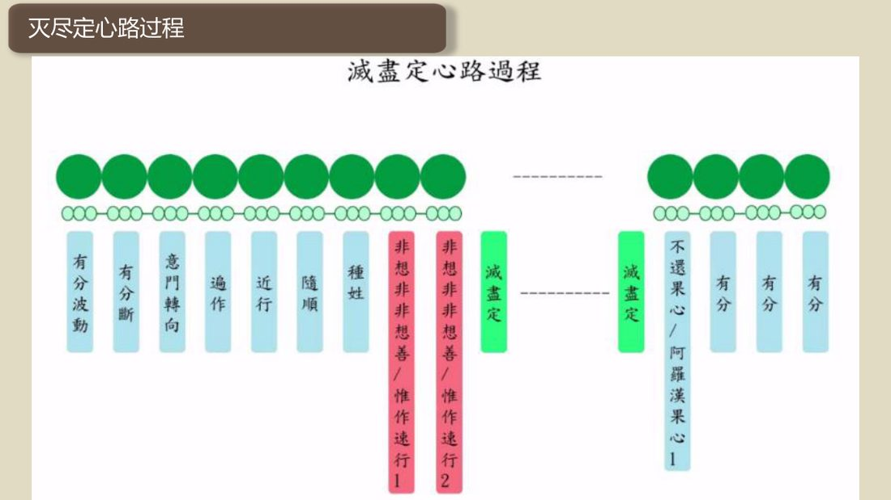
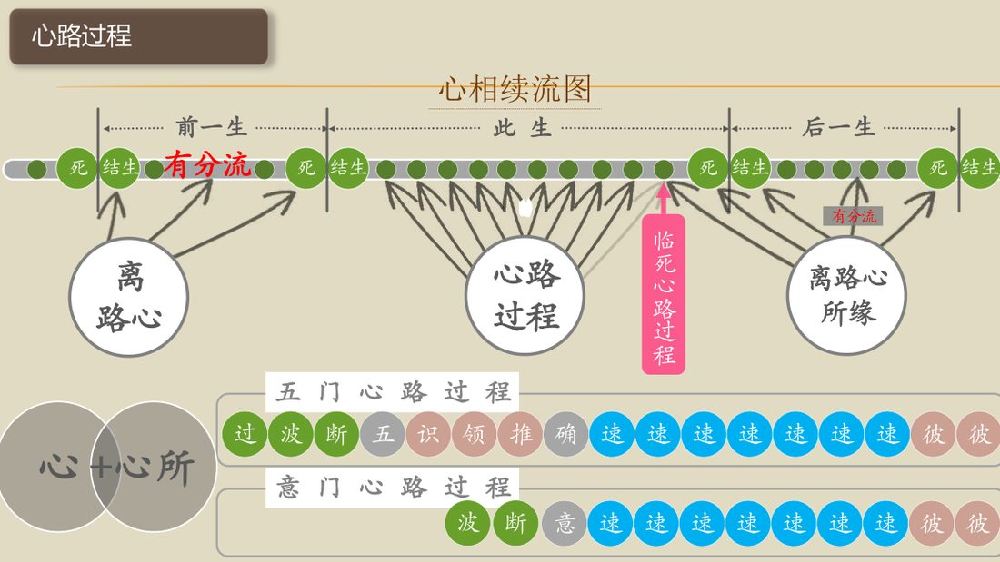
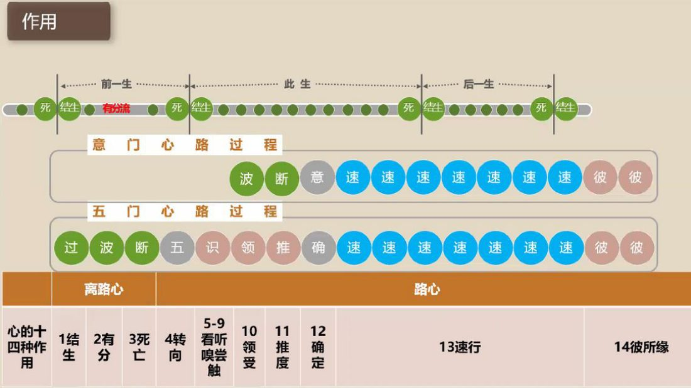

📅 最近更新：2026-09-28 16:30　|　第5版精修（朗读优化版）

# 第4周：速行安止心路与修行应用（主持人版）

> ⭐ **本讲主持人速览**（新主持人必读，2分钟看完）
>
> 你不是老师，是"共学同行者"。你不需要提前懂内容，只需要按流程走。
> **本周由连续两周内容合并**而成，含两段共读、两轮分享与两轮讨论，单讲 120 分钟。
>
> | 环节 | 标准时长 | ⏱ 时间不够→ | ⏱ 时间富余→ |
> |:-----|:----:|:-----|:-----|
> | 🧘 静心开场 | 10 min | 缩至5 min | 加2分钟静坐 |
> | 📖 共读原文1 | 20 min | 只读★核心段（约15 min） | 加读◈扩展段 |
> | 💬 第一轮分享 | 10 min | 每人1句话 | 每人3分钟 |
> | 🎯 第一轮主题讨论 | 10 min | 只讨论问题① | 讨论全部问题+扩展 |
> | 🧘 禅修练习 | 15 min | 缩至8 min（只念引导词前半） | 延长至20 min |
> | 📖 共读原文2 | 20 min | 只读★核心段 | 加读◈扩展段 |
> | 💬 第二轮分享 | 10 min | 每人1句话 | 每人3分钟 |
> | 🎯 第二轮主题讨论 | 10 min | 只讨论问题① | 讨论全部问题+扩展 |
> | 🔚 收尾与回向 | 15 min | 缩至10 min | 保持 |
>
> **主持人10条守则（精简版）**：
> ① 不讲解、不提供答案——让原文自己说话；② 有人问"正确答案"→说"先听听大家的看法"；③ 冷场→主持人先分享自己的真实感受；④ 跑题→温和拉回："这个有意思，我们回到今天的原文"；⑤ 争论→"两种看法都很好，大家保留自己的理解"；⑥ 确保人人发言；⑦ 不评判任何人的分享；⑧ 时间到了就推进；⑨ 禅修练习照读引导词即可；⑩ 结束一起回向。

> 本周主题：**速行、安止与殊胜心路，及心路的修行应用**。

## 📋 本周信息卡

| 项目 | 内容 |
|:----|:-----|
| 时长 | 120分钟（4周版 · 9环节） |
| 核心问题 | 心路里哪一拍才是真正「造业」的？速行×7「前弱后强」意味着什么？道心路、果心路、神通心路、灭尽定心路又是怎样的殊胜心路？我们如何在反应已生起之后介入、重塑自己的速行习惯？；八周学的心路过程，怎么真正落到修行里？「守护根门」到底守什么？「如理作意」在心路的哪一拍起作用？「知道却做不到」的深层原因是什么、我们又该怎么办？日常可以怎样练习观察心路？ |
| 共读原文 | 共读原文1：材料①《如来禅修学体系83-摄路分别2》　｜　共读原文2：材料①《如来禅修学体系39-摄心分别1（课件）》、材料②《如来禅修学体系45-摄杂分别1（课件）》、材料③《第012讲-前行-五种规律_大脑与心的关系（共修版）》 |
| 本周作业 | ①简答题：心路里哪几拍是「果报／唯作、不造业」？哪一拍才是「造业」的？为什么说一串速行「前弱后强」，末段速行对业力的去向尤其关键？②实践题：今天挑一次「反应已经生起」的经验（例如已经被惹恼、已经说出一句话），练习在它**已经生起之后**「知道它、松一松、回来」——记录你「回来」的那一刻，只记「回来了」，不评判「为什么没早看见」。；①简答题：写出「五种自然律」的名称；并说明「心的定律」讲了哪几条（一个心识刹那只有一个心生起、刹那刹那生灭、无间相续、所缘清晰度决定心路长短）。②实践题：本周挑一个「入出息念」或「日常一境」的片刻（如坐下观呼吸五分钟），练习「守护根门＋如理作意」——当念头或声音撞进来时，**先对它作意**（不迎不拒），再轻轻回到呼吸；记下你「回来」的时刻，**只记「回来了」，不评判「为什么又跑了」**。 |

## 🧘 静心开场（10 min）

> 💬 **破冰｜3–5分钟**：今天是否有过「话已经出口、脾气已经上来」才回过神的一刻？说出那个场景，说完就放。

> 🛡️ **心理安全三约定**（每次开场在心里过一遍）：① **保密**——这里说的话不出这间屋子；② **不评判**——不评价任何人的分享，也不急着评价自己；③ **可随时暂停**——任何时候觉得不舒服，都可以停下来休息、喝水或离开，不需要解释。

**（主持人引导语，语速放缓，每句之间留白）**

> 各位法友，请找一个让自己舒适的坐姿，可以盘腿，也可以坐在椅子上。轻轻闭上眼睛，或者让视线柔柔地落在前方地面。先做三次深长的呼吸——吸气，慢慢地；呼气，也慢慢地。
>
> 现在，把注意力带到身体。感觉一下此刻的坐姿，感觉身体与坐垫接触的地方，感觉双手放着的温度。不需要改变什么，只是知道。
>
> 接着，把注意力放到呼吸上。知道吸气，知道呼气。不去控制呼吸，只是陪伴它。吸气进来，呼气出去……如果心跑开了，不要责备它，轻轻地把它带回来，再回到呼吸。心跑开，是它的习惯；把它带回来，是我们的练习。
>
> 今天我们要谈「速行心与业力」。请先给自己一个承诺：接下来的两个小时，我们只是来认识心、观察心，不是来给自己定罪，更不是来算命。速行，就是心真正「动」起来的那一拍；**看见它，就已经很好了**。请记住一句话：**速行虽然快，但修行可以在反应已经生起之后介入——你永远都有「回来」的机会。**
>
> 现在，我们来练习一会儿慈心。先想到自己，在心里轻轻地对自己说：愿我健康，愿我快乐，愿我平安，愿我远离痛苦。
>
> 把这份善意，送给坐在你左右的每一位法友——愿他们健康，愿他们快乐，愿他们平安。
>
> 再把它扩大一些，送给今天要学的法——愿我们听得明白，愿法义入心，愿所学能真正用在生活里。
>
> 好，保持这份开放与柔和，我们慢慢睁开眼睛，回到当下。带着这份不评判、不着急的心，我们一起进入今天的共读。

**（主持人操作）** 开场控制在 10 分钟内。若学员入场慢，可先让早到者安静就坐，准点再开始。本周特别要在开场就埋下两颗种子：一是「**造业在速行、速行可被重塑**」，二是「**修行可以在反应已开始后介入，不必害怕错过**」，后面学员才不会把这一周变成自我审判或宿命论。语气始终作邀请。

## 📖 共读原文1（20 min）

> ⚠️ **主持人操作**：本周共读三份材料（＋一份延伸）。**材料①只读「道心路／果心路／神通／灭尽定／安止速行」相关表格与流程**（道心·果心四个表、神通速行心路三段、灭尽定心路串、「欲界速行后之安止速行」表、所缘强度），这些多为**表格与流程串**，可**投屏/板书**对照读，不逐格念完；**材料②是「速行造业」的内容主体**（速行心与业力九段），建议**重点照读**「能知之外能带出业力」「没有主宰」「生产车间」「越来越强」四处；**材料③读「道心·果心与有因果报心同构、色无色界禅那心与唯作心、有行心」**；材料④作延伸，选读「速行定义」「彼所缘定律」。共读时只念不解释；名相点到即止。以下照录均为逐字原文，供法友轮流照读。

> 朗读节奏建议：材料①的道心路串「过波断意近随种道 果 果」可先慢念一遍、再对照道心20个／果心20个的表；材料②的转写保留时间码，读错的同音字（如「塑形」＝速行、「树形」＝速行、「伪作」＝唯作）不必当众纠正，事后轻声提示即可；材料③的同音字（「树形／火星」＝速行、「无作」＝唯作）同理。

> 读前一句白话（供主持人开场带一句）：「这周我们读的表看着多，其实只有一句要抓——**真正造业的是速行×7；道、果、神通、灭尽定，都从意门出、由速行执行。**」

### 原文材料①：★核心·如来禅修学体系83-摄路分别2-古源尊者-20250330（课件）

- **文件**：《如来禅修学体系83-摄路分别2-古源尊者-20250330（课件）》

**照录（逐字·道心路过程／果定心路过程）：**

> 过波断意近随种道 果 果 有大慧者
>
> 过波断意遍近随种道果果有中慧者
>
> 意门转向  作
>
> Maggavithi出世间禅那圣道心路
>
> 路心|出世间禅那的心路
>
> 过波断意随随果果...果有大慧者
>
> 过波断意随随随果...果有中慧者
>
> 意门转向  顺 随 随 随 果 果 随 顺 顺 顺 中心
>
> Maggavīthi出世间禅那果定心路

**照录（逐字·出世间心广有(40)个）：**

**照录（逐字·道心(20)个／道心20个）：**

- 预流道心：一来道心　5个：5个

- 预流道心：不还道心　5个：5个

- 预流道心：阿罗汉道心　5个：5个

- 预流道心：总计道心　5个：20个

- 寻、伺、喜、乐、一境性等俱有五种禅支的初禅预流道心：伺、喜、乐、一境性等俱有四种禅支的二禅预流道心　1个：1个

- 寻、伺、喜、乐、一境性等俱有五种禅支的初禅预流道心：喜、乐、一境性等俱有三种禅支的三禅预流道心　1个：1个

- 寻、伺、喜、乐、一境性等俱有五种禅支的初禅预流道心：乐、一境性等俱有两种禅支的四禅预流道心　1个：1个

- 寻、伺、喜、乐、一境性等俱有五种禅支的初禅预流道心：舍、一境性等俱有两种禅支的五禅预流道心　1个：1个

- 寻、伺、喜、乐、一境性等俱有五种禅支的初禅预流道心：总计预流道心　1个：5个

- ※余之「一来道心」、「不还道心」、「阿罗汉道心」亦复如是。

**照录（逐字·果心(20)个／果心20个）：**

- 果心：预流果心　数量：5个

- 果心：一来果心　数量：5个

- 果心：不还果心　数量：5个

- 果心：阿罗汉果心　数量：5个

- 果心：总计果心　数量：20个

> 寻、伺、喜、乐、一境性等俱有五种禅支的初禅预流果心 1个
> 伺、喜、乐、一境性等俱有四种禅支的二禅预流果心 1个
> 喜、乐、一境性等俱有三种禅支的三禅预流果心 1个
> 乐、一境性等俱有两种禅支的四禅预流果心 1个
> 舍、一境性等俱有两种禅支的五禅预流果心 1个
> 总计预流果心 5个
> ※余之「一来果心」、「不还果心」、「阿罗汉果心」亦复如是。

**照录（逐字·神通速行心路）：**

> 过波断意遍近随种神分
>
> 【一】入第五禅安止定
>

（原表为课件图形页，见《原文全集》）

>
> 【二】出定，作意生起的神通之想（如：远视，或远听等）
>

（原表为课件图形页，见《原文全集》）

>
> 【三】进入(第五禅)神通
>

（原表为课件图形页，见《原文全集》）

**照录（逐字·灭尽定心路过程）：**

> 非想非非想善维作速行非想非非想善、推作速行2不还果心阿罪汉果心意门转向有分波动有分断种姓减盖定减尽定有分有分有分过作近行顺

**照录（逐字·心路过程 ——「欲界速行」后所生起的「安止速行」表）：**

- 对象：对象　近行定速行：过　近行定速行：近　近行定速行：随　近行定速行：种　安止速行：种　安止速行：种　安止速行：种　总计：总计

- 对象：对象　近行定速行：大善、大惟作智相应速行心8个　近行定速行：大善、大惟作智相应速行心8个　近行定速行：大善、大惟作智相应速行心8个　近行定速行：大善、大惟作智相应速行心8个　安止速行：广大速行18　安止速行：道速行20　安止速行：果速行20　总计：58

- 对象：三因凡夫与下分果者　近行定速行：大善智相应速行心4个　近行定速行：大善智相应速行心4个　近行定速行：大善智相应速行心4个　近行定速行：大善智相应速行心4个　安止速行：广大善速行9　安止速行：道速行20　安止速行：下分果速行15　总计：44*

- 对象：三因凡夫与下分果者　近行定速行：大善悦俱智相应速行心2个　近行定速行：大善悦俱智相应速行心2个　近行定速行：大善悦俱智相应速行心2个　近行定速行：大善悦俱智相应速行心2个　安止速行：广大善悦俱速行4　安止速行：道悦俱速行16　安止速行：下分果悦俱速行12　总计：32

- 对象：三因凡夫与下分果者　近行定速行：大善舍俱智相应速行心2个　近行定速行：大善舍俱智相应速行心2个　近行定速行：大善舍俱智相应速行心2个　近行定速行：大善舍俱智相应速行心2个　安止速行：广大善舍俱速行5　安止速行：道舍俱速行4　安止速行：下分果舍俱速行3　总计：12

- 对象：无学者　近行定速行：大惟作智相应速行心4个　近行定速行：大惟作智相应速行心4个　近行定速行：大惟作智相应速行心4个　近行定速行：大惟作智相应速行心4个　安止速行：广大惟作速行9　安止速行：阿罗汉果速行5　总计：14*

- 对象：无学者　近行定速行：大惟作悦俱智相应速行心2个　近行定速行：大惟作悦俱智相应速行心2个　近行定速行：大惟作悦俱智相应速行心2个　近行定速行：大惟作悦俱智相应速行心2个　安止速行：广大惟作悦俱速行4　安止速行：阿罗汉果悦俱速行4　总计：8

- 对象：无学者　近行定速行：大惟作舍俱智相应速行心2个　近行定速行：大惟作舍俱智相应速行心2个　近行定速行：大惟作舍俱智相应速行心2个　近行定速行：大惟作舍俱智相应速行心2个　安止速行：广大惟作舍俱速行5　安止速行：阿罗汉果舍俱速行1　总计：6

**照录（逐字·心路过程 ——（广大善、惟作心／果／道 总计））：**

- 对象：三因凡夫　广大善、惟作心：广大善速行心9　道：预流道速行5　总计：14

- 对象：预流果者　广大善、惟作心：广大善速行心9　果：预流果速行5　道：一来道速行5　总计：19

- 对象：一来果者　广大善、惟作心：广大善速行心9　果：一来果速行5　道：不还道速行5　总计：19

- 对象：不还果者　广大善、惟作心：广大善速行心9　果：不还果速行5　道：阿罗汉道速行5　总计：19

- 对象：阿罗汉果者　广大善、惟作心：广大惟作速行心9　果：阿罗汉果速行5　总计：14

## 💬 第一轮分享（10 min）

**分享规则**：自愿分享，每人 90 秒～2 分钟；先邀请、不点名；主持人控时，用「90 秒」提示牌。分享只讲自己的体会，不评判他人，不做名相测验。

**起手问题（任选 1–2 个，由浅入深）**：

1. **现场体会**：刚才静心的几分钟里，你有没有察觉「心里某个反应已经动起来了」——比如一丝不耐烦、一点着急、一句想说的话？材料说那「动」的一拍就是速行。**你当时有没有在它已经动起来之后，把注意力带回来过？**
2. **切身比喻**：材料②把速行比作「进入生产车间开始生产」，产品「照单全收、不能退」。用你自己的一个日常例子说说——你有没有「已经生产出来、只能照单全收」的一次反应？你事后是怎么面对它的？
3. **认出「后段的力」**：材料说一串速行「前弱后强」。今天有没有某一刻，你事后发现「前面只是微微一动，到后面却越来越强、收不住了」？只描述，不评判。

**主持人提示**：分享环节最容易滑向两处——一是「算命」（谈来世），二是「自我审判」（谈我又造业了）。请把话头拉回「当下这一念」；若有人卡在「我反应太快、根本来不及」，接住并回：**「修行可以在反应已经生起之后介入。能看见、能回来，就是正念在运作；这不是失败，是进步的起点。」** 别让分享变成自我审判或宿命论。
**带节奏的三句话**：①「先说说刚才静心里的体会，不必用名相。」②「有没有哪个反应，是它已经动起来了，你才注意到的？」③「说感受，不比进境，也不算来世。」
**倾听约定**：别人分享时，其余人只听、不点评、不抢话；不把别人的体会当成论题来辩论。主持人用一句「谢谢你的分享」收尾，不用「但是」。
**时间提醒**：25 分钟若人多，改成「每人 90 秒＋一轮自由补充」；主持人手里始终握计时，宁可截断，也不拖到讨论时间。

## 🎯 第一轮主题讨论（10 min）

**讨论总纲**：本周三个引导问题，分别对应「造业点」「速行×7 的前弱后强」「如何保持正念／如何重塑速行习惯」三条线。每题先静默 1 分钟再开口；主持人只引导、不评判、不代答。别急着给答案，让大家先把「速行」在纸上画一遍。

**问题一（造业点）：心路里哪一拍才是真正「造业」的？**

- 提示：请一位法友照着材料②念一遍——「**除了这个能知能源呢，它（善不善的速行心）还加一个功能……能够带出业力**」，而「五识、果报心、唯作心、彼所缘心」都「不会带来业力」。再问：那么前几周学的转向、五识、领受、推度、确定，是「造业」还是「准备」？（答案：它们是准备，真正造业在**速行×7**。）
- 深化：材料②说速行「**快速的、对欲界都是快速的，对所缘造业**」。请问：为什么偏偏是速行造业？（提示：在「能知」之外，善／不善速行多一个「能带出业力」的功能。）
- 再深化：材料②特别交代——造业「**没有一个主宰**」，是「自然法则（心的定则·等无间缘）」。这告诉我们两件什么？（提示：①不是「我」在造业所以不必背「我执的罪」；②既是自然法则，就可以被训练、被重塑。）
- 备用追问：五识只「看／听」，它会造业吗？（提示：不会。它只是果报心，是承受过去的业。）
- 指向实修：所以我们要用功的地方，不在「看见」本身，而在**看见之后那一拍的转向**——**速行在哪里，修行就在哪里。**

**问题二（前弱后强）：速行×7「前弱后强」意味着什么？末段速行为何关键？**

- 提示：材料②说速行造业的力量「**会持续的、越来越强**」；材料④说「一般速行生起六次或七次；意门迟钝与死亡时五次」。串起来看：一串速行**前面弱、后面强**。
- 深化：论教常从**后段（尤其第七）速行**来论这一串业力的**去向与成熟顺序**。这对修行是坏消息还是好消息？（提示：是**好消息**——因为我们不要在第一念就做到，**把后面几念转过来，力量就在后面**。）
- 再深化：材料②把速行比作「**生产车间**」，产品「照单全收、不能退」。那么「**修行即重塑速行习惯**」这句话，具体指什么？（提示：不是不造业，而是**让这条生产线、让这一串速行越来越善**——一次次把后段的速行转成善速行。）
- 备用追问：临终那一串速行，为什么特别被重视？（提示：因为后段速行的力量最强，常被用来论结生／业力的去向；**本周点到为止，不作来世猜想。**）
- 指向实修：落点是一句——**「不怕第一念，练的是后几念。」**

**问题三（正念与重塑）：速行那么快，我们如何保持正念、如何重塑速行习惯？**

- 提示：材料②形容有分心「按雷迪西亚多来讲就是**蠢蠢欲动**」，所缘一撞击，「过波断五（识）……推度、确定……一确定以后，接下来速行就去扮演速行的功能」。这条链几乎自动发生。那么正念还能插得进去吗？
- 深化：答案就在本周的核心句——**修行可以在反应已开始后介入。** 你可以在贪心已经起来时「知道」，在已经说出那句话之后「看见」它。请问：这种「事后觉察」，算不算正念？（提示：算。**能观察到即正念在运作**；「回来的那一刻」，本身就是善速行。）
- 再深化：材料②说善速行的关键是「**如理作意**」，不善速行是「不如理作意」。所谓「重塑速行习惯」，就是把「不如理作意」慢慢练成「如理作意」——**不是压住反应，而是改变「看待所缘」的方式**。
- 备用追问：那我们每天练的，到底是「不失手」，还是别的什么？（提示：练的是**「回来的能力」**——知道—松一松—回来；不是「永不出错」。）
- 落点：**这一周真正要带回家的，是「我开始在反应之后介入、开始重塑自己那一串速行」这个转向。修行就是——从「被速行带着跑」，走向「开始认识速行、引导速行」。**

**讨论收束句（主持人）**：今天我们看清了三件事——**造业在速行×7；一串速行前弱后强、末段尤关键；而修行可以在反应已开始后介入，把后段的速行一次次转成善速行。** 记住这三句，比记住那几张表更有用。

> **分层追问**（可视时间取用，由浅入深）：
> - 【现象】心路里哪一拍才是真正「造业」的？你能指出那一步的名字吗？
> - 【影响】「速行刹那前弱后强」，这对你理解「第一次反应」和「越想越气」的关系有何提示？
> - 【应对】这一周，试着在反应刚起时慢半拍，比如先呼吸一次再说，看看会怎样。

## 🧘 禅修练习（15 min）

### 练习一

> ⚠️ **禅修禁忌提示**：若你正处在严重抑郁、焦虑、创伤后应激，或精神类疾病的发作／用药期，或正经历强烈的情绪危机，请先咨询医生或心理师，再决定是否练习；练习中若出现明显不适（如心悸、胸闷、情绪失控），请立即停止，睁开眼睛，把注意力放回呼吸与身体，必要时离场休息。

**本周练习：观「反应」的速行，练「知道—松手—回来」（照读引导词）**

> 请坐好，闭上眼睛，先做三次深呼吸，让身体放松下来。
>
> 这一次，我们不特别关注呼吸，而是练习一件事：**当心动起来的时候，我们能在它「已经动起来之后」知道它。**
>
> 先让自己安静一会儿，什么都不用做。感觉一下此刻心里是平静的、还是有东西在动。
>
> 如果你想起一件让你有点不痛快的事，注意：**一个反应，可能已经自己动起来了**——也许是一丝不舒服，也许是一句想说的话。不用把它推开，也不必跟着它跑。只是轻轻地**看见它**：「哦，它动了。」这一「动」，就是材料里说的速行。
>
> 你可能会发现，自己**来不及**在它动起来之前就拦住它。请记住：**这很正常。修行可以在反应已经生起之后介入。** 你能做的，是在它已经动起来之后，**知道它、松一松、再回来**。能回来，就已经在练习了。
>
> 现在试一次：如果心里有一个反应，先「知道」它；然后，轻轻地，**不对它做任何事**——不抓、不推，只是让它过去；再把注意力带回身体，回到呼吸。**回来的这一刻，就是一串新的、善的速行。**
>
> 如果心跑远了、钻进故事里了，不要责备自己。**发现自己跑远了，那一刻就已经是觉知在运作了。** 轻轻地，把它带回来，再继续练。
>
> 最后三十秒，把注意力放回身体，感觉坐姿、感觉双手。然后慢慢睁开眼睛。
>
> 请给自己一个友善的念头：**「能看见、能回来，已经很好了。」**

**（主持人操作）** 引导语照读即可，语速放慢、留白。若学员表示「反应太快、根本拦不住」，重申心理安全句：**修行可以在反应已开始后介入、不制造「错过即失败」的焦虑**。时间富余时，加 5 分钟慈心散播收摄；时间紧时，只保持「知道一个反应、带回来」这一句，8 分钟即可。

- **收束句**：「不用把反应压掉，也不必追着它跑；今天练习的只是——**知道它、松一松、回来**。」

### 练习二

> ⚠️ **禅修禁忌提示**：若你正处在严重抑郁、焦虑、创伤后应激，或精神类疾病的发作／用药期，或正经历强烈的情绪危机，请先咨询医生或心理师，再决定是否练习；练习中若出现明显不适（如心悸、胸闷、情绪失控），请立即停止，睁开眼睛，把注意力放回呼吸与身体，必要时离场休息。

**本周练习：守护根门·如理作意——在入出息里练「知道—作意—回来」（照读引导词）**

> 请坐好，闭上眼睛，先做三次深呼吸，让身体放松下来。
>
> 这一次，我们练习两件事：**守护根门**，与**如理作意**。
>
> 先把注意力放到呼吸上。知道吸气，知道呼气。以呼吸为所缘，就像把心轻轻安放在水上的一片叶子。
>
> 现在，让所缘自己来。也许是一个声音、一丝痒、一个念头，从某一门撞进来。**请先「知道」它进来了**——就像守门人，先知道「有人来了」。这就是**守护根门**的开始：不是把门关上，是**知道门开了**。
>
> 接着，**不急着推开它，也不急着跟它走**。在心里，轻轻换一副眼光看它：**它是无常的，它会过去；我不必被它带走。** 这就是**如理作意**——换一副看待所缘的眼光。
>
> 然后，把注意力**轻轻带回呼吸**。回来的这一刻，就是一串新的、清明的意门心路。
>
> 你可能会发现，自己常常「跑掉之后」才回得来。请记住：**这很正常，也很好。修行不是永不失手，而是越来越早地看见、越来越快地回来。能事后觉察，也是进步。**
>
> 如果心跑远了、钻进故事里了，不要责备自己。**发现自己跑远了，那一刻就已经是觉知在运作了。** 轻轻地，把它带回来，再继续练。
>
> 最后三十秒，把注意力放回身体，感觉坐姿、感觉双手。然后慢慢睁开眼睛。
>
> 请给自己一个友善的念头：**「能看见、能作意、能回来，已经很好了。」**

**（主持人操作）** 引导语照读即可，语速放慢、留白。若学员表示「反应太快、根本拦不住」，重申心理安全句：**不苛责，肯定事后觉察也是进步**。时间富余时，加 5 分钟慈心散播收摄；时间紧时，只保持「知道一个所缘、作意、带回来」这一句，8 分钟即可。

- **收束句**：「不用把反应压掉，也不必追着它跑；今天练习的只是——**知道它在，换一副眼光，再回来**。」

**（主持人机动补充·原创）** 若学员坐得安稳、气氛沉静，可在收束句之后再加一句收摄引导：「现在，请把刚才练习的这个能力，轻轻收进心里——**你不需要记住一串心路的名字，只需要记住刚才那种『知道、换眼光、再回来』的感觉。**明天醒来，第一个声音撞进来时，试着也这样做一次。」说完停顿十秒，再请大家慢慢睁眼。此句用于把练习经验「存盘」，让禅修不止停在垫上，而是跟着法友走回生活。若当场有学员眼眶泛红、情绪升起，不必急着问原因，只用一句「很好，慢慢呼吸」护住，让其自然平复。

## 📖 共读原文2（20 min）

> ⚠️ **主持人操作**：本周共读三份材料（＋两份延伸阅读）。**材料③是「心的定律」的内容主体**（世间五种定律／心的定律／业的定律），建议**重点照读**〈心的定律〉一节——「一个心识刹那，只有一个心生起」「刹那刹那生灭」「无间相续」「所缘清晰度定心路长短」四处；**材料①只读「心路过程总说页」之〈心之四相〉与〈五种法则〉**（很短，作为「心的定律」的引子）；**材料②读〈心相续流图〉与〈杂项篇·从六个面向分析心〉**两块（图形以代码文字返回，可投屏/板书对照读，不逐格念）；**材料④〈如理作意〉〈弥兰达王守护根门〉为延伸，时间富余时选读**。共读时只念不解释；名相点到即止。以下照录均为逐字原文，供法友轮流照读。

> 朗读节奏建议：材料③的「五种定律」代码块可先念图内文字（时节／种子／业／心／法），再念正文；材料②的两块 graph 代码块由主持人投屏、念节点标签即可。读错的同音字不必当众纠正，事后轻声提示即可。

> 读前一句白话（供主持人开场带一句）：「这周我们读这三份材料，其实只有一句要抓——**心是刹那刹那生灭、无间相续的；所缘一撞进六门，心路必然生起。所以修行不在「挡住所缘」，而在「守护根门、如理作意」。**」

### 原文材料①：★核心·如来禅修学体系39-摄心分别1-古源尊者-20250210（课件）

- **文件**：《如来禅修学体系39-摄心分别1-古源尊者-20250210（课件）》

⚠️ 主持人操作：本课件为幻灯片，可提取文字仅「心路过程」总说一页。「五种法则」以五行列出（原文无展开说明），本讲取此条目以引出「心的定律」（详见材料③）。课件其余页为巴利文慈心散播发愿文及功德回向文，与本章节无关，未照录；结构性图形页无法逐字提取，不臆造。

**照录（逐字·「心路过程」总说页）：**

> **心路过程**
>
>
> 引自《阿毗达摩概要精解》
>
> **特相**： 识知目标(所缘)
>
> **作用**：作为诸心所的前导，引领相应心所识知目标
>
> **现起**：与后生心连接，令名相续流不断
>
> **近因**：名色(无色界只有名)
>
> **五种法则**
>

### 原文材料②：◈·如来禅修学体系45-摄杂分别1-古源尊者-20250220（课件）

- **文件**：《如来禅修学体系45-摄杂分别1-古源尊者-20250220（课件）》

⚠️ 主持人操作：「心相续流图」「从六个面向分析心」为图形页，见下图。文中「金门」（即意门）、「每郎」（即鼻门）等为课件 OCR 讹字，按原文照录、未作改动。

**照录（逐字·心相续流图）：**

（原表为课件图形页，见《原文全集》）

**照录（逐字·杂项篇——从六个面向分析心）：**

（原表为课件图形页，见《原文全集》）

**照录（逐字·四、摄门 dvārasaṅgaho 论文说明）：**

> 在摄门中: 所谓门, 即眼门、耳门、鼻门、舌门、身门及金门、六种、此如、眼眼门、同样的耳、每郎耳门等, 但意门是说(转向) 之前的(有分)。

### 原文材料③：第012讲-前行-五种规律_大脑与心的关系-（共修版）

- **文件**：《第012讲-前行-五种规律_大脑与心的关系-（共修版）》

⚠️ 主持人操作：本件为课堂讲义／录音转写稿，本周照读**〈心的定律〉一节为主体**，〈业的定律〉〈大脑与心的关系〉作辅助；文中 OCR 讹字按原文照录、未作改动。

**照录（逐字·世间五种定律总纲）：**

> # 云端阿毗达摩第十二讲（一）
>
> 昨天我们讲到生命的要素，不能不提到世间的五种定律。在《法聚论》义注和《殊胜义注》里面都提到了世间的五种定律，也称为五种自然律。

（原表为课件图形页，见《原文全集》）

**照录（逐字·1. 时节的定律(utuniyàma)）：**

> # 1. 时节的定律(utuniyàma)
>
> 时节就是 utu， 是火界的意思。菩提尊者把它翻译成热的元素。Niyàma 是定律。时节定律规范了什么东西？ 就是一切没有生命现象的物质。比如宇宙、地球、星云等等。从阿毗达摩的语境来讲， 它都是由时节产生的。任何一种无生命的物质只有一种色聚， 就是时节生色聚。时节生色聚就是指所有这些物质都是由火界产生的。或者说是火（热的元素）制造了世界。从阿毗达摩的角度来讲， 所有的物质世界客观的形成， 它的成因都是火界， 它的组成也是火界。火界也代表温度、能量。

## 💬 第二轮分享（10 min）

**分享规则**：自愿分享，每人 90 秒～2 分钟；先邀请、不点名；主持人控时，用「90 秒」提示牌。分享只讲自己的体会，不评判他人，不做名相测验。

**起手问题（任选 1–2 个，由浅入深）**：

1. **八周回顾**：八周里，哪一「周」的名相／画面，最后变成了你生活里真能用上的一句话？（比如「速行」「有分」「如理作意」……）说说它是怎么从「书上」走到「今天」的。
2. **切身体会**：材料③说「在一个心识刹那，只有一个心生起，心是刹那刹那生灭的」。你有没有一个时刻，**真实地感到「心一个接一个地变」，你按不住它**？那时你是怎么面对的？
3. **「知道却做不到」**：这八周你有没有过「道理都懂了，可我还是老样子」的感觉？**那一刻，你是责备自己，还是允许自己慢慢来？** 只分享，不比较。

**主持人提示**：分享环节最容易滑向两处——一是「自我审判」（「八周了还这样，我没用」），二是「名相测验」（互相考定义）。请把话头拉回「当下这一念、这一个人」。若有人卡在「我做不到」，接住并回：**「能事后觉察，也是进步；修行不是永不失手，是越来越早地看见、越来越快地回来。」** 别让分享变成评判。
**带节奏的三句话**：①「先说体会，不必用名相。」②「有没有哪一句，是你生活里真用上了的？」③「说感受，不比进境，也不考试。」
**倾听约定**：别人分享时，其余人只听、不点评、不抢话；不把别人的体会当成论题来辩论。主持人用一句「谢谢你的分享」收尾，不用「但是」。
**时间提醒**：25 分钟若人多，改成「每人 90 秒＋一轮自由补充」；主持人手里始终握计时，宁可截断，也不拖到讨论时间。

## 🎯 第二轮主题讨论（10 min）

**讨论总纲**：本周三个引导问题，分别对应「八周框架回顾＋以入出息念为例分析心路」「『知道却做不到』分析与守护根门·如理作意」「心路观察的日常练习计划」三条线。每题先静默 1 分钟再开口；主持人只引导、不评判、不代答。别急着给答案，让大家先把「心路」在自己的经验里走一遍。

**问题一（八周框架回顾 + 以入出息念为例分析心路）：这八周我们学了什么？修的时候，这一串心路是怎么走的？**

- 提示：请先在黑板上把八周的骨架写出来——**W1 总说（过波断五识领推确速速速速速速速彼彼）→ W2/W3 五门 → W4 意门 → W5 离路心 → W6 十四作用与所缘强弱 → W7 速行与业力／道果心路 → W8 应用**。再问：**这八周，哪一周是「地图」，哪一周是「路」？**（提示：W1—W6 是地图，W7—W8 是「路」——心真正走起来、造业、修行的那条路。）
- 以「入出息念」为例（讨论重点）：让一位法友描述「坐下观呼吸、心跑掉、再回来」的过程，然后由主持人用论教「复盘」——**呼吸（触所缘）撞进身门→有分波动→有分断→……→领受→推度→确定→速行×7→彼所缘→有分**；或若落在「意门」（安般念以意门为主）——**波→断→意（意门转向）→速速速速速速速→彼彼**（材料②「心相续流图」、材料⑤「欲界纯意门心路过程」）。**问：当你说「心跑掉了」，这一串心路里，你「看见」的是哪一拍？**
- 深化：材料③说「当所缘很明显、很清楚的时候，这个心路一定是这样的……只有一个有分波动一下」。**问：为什么有时你「完全没感觉到念头起来」，它就过去了？**（提示：所缘不够清晰时，心路短到只剩「有分波动一下」——这正是「看不见」的正常原因。）
- 指向实修：落点是一句——**「这一串心路，不是你『想』出来的，是它自己『流』出来的；修行，就是在这条流上，加进『知道』这一拍。」**

**问题二（「知道却做不到」分析 + 守护根门与如理作意）：为什么会「知道却做不到」？我们能做什么？**

- 提示（先把「不苛责」立起来）：**先承认——「知道却做不到」是所有凡夫心的常态，不是你一个人的问题。** 再请法友一起找出原因。
- 第一层（速度差）：材料④说「在弹指之间，超过一兆个心识生起和消失」。「知道」是很慢的一层，「反应动起来」是极快的一层。**问：这说明了什么？**（提示：慢的「知」追不上快的「动」，是物理性的，不是道德问题——所以别苛责自己。）
- 第二层（所缘铺天盖地）：材料③说五门必然生起完整心路，意门亦复如是。**问：环境不配合，是不是常态？**
- 第三层（习气靠重复养）：材料④讲「经由重复练习来约束自己的心，会使不善思维渐渐减少」。**问：反过来，习气是不是也被「重复」喂大的？**（提示：既然是重复喂大的，就靠重复来改，不靠一次性决心。）
- 落到两把钥匙（本问题核心）：
  - **守护根门**（材料④）：弥兰达王训练心七日，立八条，第 7 条——「**当看到、听到和经验到感官目标时，我会遏制我的感官冲动，即眼、耳等等，以避免有害的思维。**」**问：「守护根门」是「不看、不听」，还是「看得清楚而不被牵走」？**（提示：是后者。所缘必然撞进门、心路必然生起——这是心的定律；我们能做的是不让它一路滑到不善的速行。）
  - **如理作意**（材料④＋W7）：《阿毗达摩轻松谈》开篇即讲「**由于正确的态度，不善的心就不会出现，而只有善心会生起**」；W7 材料②说善速行的关键是「如理作意」。**问：把「守护根门」和「如理作意」接起来看，它们是什么关系？**（提示：守护根门是「在门口不轻易放行」，如理作意是「放行时换一副眼光」——同一件事的前后两拍。）
- 指向实修：落点是三句——**「不苛责，肯定事后觉察也是进步」；「不是压住反应，而是改变看待所缘的方式」；「修行不是永不失手，是越来越早地看见、越来越快地回来」。**

**问题三（心路观察的日常练习计划）：这一周，我们可以怎样把「观察心路」落到日常？**

- 提示：请法友一起，为「接下来一周」订一份**具体、可执行**的小计划。核心两个动作：
  - **动作一｜入出息念（安般念）**：每天固定一小段（如 5—10 分钟），以呼吸为所缘，体会「**知道呼吸—跑掉—回来**」这一串的重复（论教上即「意门心路」的反复）。**记法**：只记「回来了」的次数，不记「跑掉」的次数据以自责。
  - **动作二｜日常一境（守护根门）**：一天挑 2—3 次「一个明显的所缘」，如「听到一个刺耳的声音」「看到一条让人心动的讯息」。练习三步：**① 知道所缘（耳门／眼门心路生起，正常）；② 知道心里的反应（如理／不如理作意）；③ 选择不跟着走（不让它滑到不善速行）。**
- 深化：材料④「心可被驯服」说——「如果连缓慢变异的身体都可以改善，那么为什么不能驯服那快速改变与容易改善的心呢？」**问：这句话给了你什么力量？**
- 再深化：材料②「从六个面向分析心」给出六把「分析的刀」（**依处／所缘／受／因／作用／门**）。**问：我们日常观察心路，从这六个面向里的哪一个入手最方便？**（提示：多数人从「门」与「受」入手最可感——「从哪一门进来的？当下是什么受？」）
- 落点：**「不求多，求『一天两三次真的看见』。八周学的这张网，从今天开始，一天撒两三次。」**

**讨论收束句（主持人）**：今天我们收了三件事——**八周的地图铺开了，心路就是此刻正在流的那条河；「知道却做不到」是有原因的，不苛责；而练的，就是「守护根门＋如理作意」，一天两三次，把『看见』这一拍，慢慢加进心路里。** 记住这三句，比记住那几张表更有用。

**主持人机动补充（原创，时间富余时加开）**：若三题提前讨论完、尚有富余，可加开一道「收束题」——**「八周之后，我打算把哪一件小事，固定成每天的动作？」** 引导时务必把它做小：不是「我要精进修行」，而是「我每天晚饭后坐五分钟，只听呼吸」「我每天开车等红灯时，把心带回呼吸三次」。请两三位法友各说一件，主持人不点评、只板书关键词，最后收一句：**计划越小越能长久；修行靠的是重复，不靠决心。** 若有人说「我怕又坚持不下来」，接住并回：**「做不到也不用自责，明天再回来就好——这本身就是本周练的那件事。」**

> **分层追问**（可视时间取用，由浅入深）：
> - 【现象】「守护根门」和「如理作意」，你分得清它们各自守在、作用在心路的哪一拍吗？
> - 【影响】「知道却做不到」，在你自己的经验里，最常卡在哪一个环节？
> - 【应对】这一周，选一件日常小事（如吃饭、走路），试着观察一遍它背后的心路。

## 🔚 收尾与回向（15 min）

### 收尾一

**总结引导（主持人照读）**：

> 各位法友，这一周我们走进了「速行」——心真正「动」起来、造业的那一拍。请把今天的收获收成三句话——
>
> 第一句：**造业在速行×7**——转向、五识、领受、推度、确定都只是「准备」；果报心与唯作心都不造业，只有善／不善的速行「能带出业力」。
>
> 第二句：**一串速行，前弱后强**——越到后段越有力，因此常从后段（尤其第七）速行论业力的去向；**修行就是让后段的速行越来越善。**
>
> 第三句：**殊胜的心路，走的是同一套机制**——道心路、果心路、神通心路、灭尽定心路，都从意门出、由速行执行。
>
> 请带着一个问题回家：**今天我遇到一次反应时，是在「被速行带着跑」，还是「知道它、松一松、回来」过？** 记住那句话——**修行可以在反应已开始后介入；能回来，就已经在重塑你的速行习惯了。**

**答疑预留（5 分钟，可并入收尾）**：若时间允许，留 5 分钟给 1–2 个提问。常见问题可直接用前文「学员常见提问与回应」表应对；遇到答不了的，坦承「这个我记不确，下次查了再说」，不必硬撑。答疑时始终守着两条：**不诊断、不玄谈来世**。

**下周预告**：下一周（第8周）是系列的收束——**「心路过程在修行中的应用」，讲守护根门与如理作意**，看看我们学了七周的心路过程，怎样真正落到「每一天、每一门、每一念」的修行里。

**回向（照读）**：

> 愿我此功德，导向诸漏尽！
>
> 愿我此功德，为证涅槃缘！
>
> 我此功德分，回向诸有情，
>
> 愿彼等一切，同得功德分！
>
> 萨度！萨度！萨度！

### 收尾二

**总结引导（主持人照读）**：

> 各位法友，八周走到今天，我们第一次把这七周学的东西，真正「合起来」用了一次。请把今天的收获收成三句话——
>
> 第一句：**心路过程不是一张表，是你此刻正在发生的事**——所缘撞进六门，心路必然生起，一串一串刹那生灭；这，就是「心的定律」。
>
> 第二句：**修行只有两把钥匙——守护根门与如理作意**——守护根门，是「知道门开了、不轻易放行」；如理作意，是「放行的时候，换一副眼光」。心路可以塑，靠的就是这两把钥匙的重复。
>
> 第三句：**「知道却做不到」不苛责**——「知道」追不上「反应」，是自然的；练的是「越来越早地看见、越来越快地回来」。**能看见，就已经在参与；事后觉察，也是进步。**
>
> 请带着一个问题回家：**这一周，我能不能一天挑两三次，练习「知道所缘—知道反应—换一副眼光—回来」？** 记住这句话——**修行不是在书里，是在你此刻这一串心路里。**

**答疑预留（5 分钟，可并入收尾）**：若时间允许，留 5 分钟给 1–2 个提问。常见问题可直接用前文「易发状况速查」应对；遇到答不了的，坦承「这个我记不确，下次查了再说」，不必硬撑。答疑时始终守着两条：**不苛责、不玄谈**。

**八周共学圆满（末次小结，照读）**：

> 各位法友，今天是读书会15《心路过程与心识作用》八周共学的圆满。八周以来，我们从「心路过程总说」出发，走过眼门的十七心识刹那、耳鼻舌身与共同模式、意门与意门转向、离路心的生命相续、十四种作用与所缘强弱、速行与业力、安止与道果心路，到今天终于落到实处——**守护根门与如理作意**。感谢每一位法友的相伴与认真：你们把这段「心的地图」，一寸一寸地走成了「自己的路」。
>
> 学法是因缘和合，能一起走完八周，是我们彼此难得的善缘。愿我们把这八周所学的法、所生的善，都回向给一切众生；也愿我们各自回到生活里，把那两把钥匙，用在自己的每一天、每一门、每一念。

**回向（照读）**：

> 愿我此功德，导向诸漏尽！
>
> 愿我此功德，为证涅槃缘！
>
> 我此功德分，回向诸有情，
>
> 愿彼等一切，同得功德分！
>
> 萨度！萨度！萨度！

## 📌 本讲主持人特别提醒

1. **心理安全（本周重点）**：本周涉「速行造业、业力」，最容易引发两种情绪——**自我审判**（「我又造不善业了、没救了」）与**宿命感**（「业力既定，我改不了」）。请在开场、练习与讨论中反复埋两句：**「修行可以在反应已开始后介入」**、**「不制造『错过即失败』的焦虑」**。同时提醒：**观察速行造业是了解心的自然运作，不是审判自己；能观察到即正念在运作。** 不要诊断、不要给心理学标签；成员情绪波动时，提供呼吸放松或暂离的选项。
2. **不把「业力」讲成算命**：本周材料谈「前弱后强、末段速行」，学员很容易追问「那我下辈子会怎样」。请明确：**本周的重心是「可介入、可重塑」，不是「预测来世」。** 遇此类追问，温和收线、拉回当下。
3. **不玄谈「神通、灭尽定、前生」**：材料①有神通心路、灭尽定心路，点到即止——本周重心是「殊胜心路也走同一套机制」，不要把话题引向神秘体验或进境比较。
4. **名相只点一句白话**：速行、业力、道心/果心、神通/灭尽定、安止速行——用白话卡点明即可，不展开学术，不考试。特别澄清「速行≠速度快」。
5. **照读与解释分开**：共读原文只读不解释；解释留到分享与讨论。表格（道心20个、果心20个、安止速行表）可投屏对照，不逐格念完；宁可少读，也要留出讨论时间。
6. **时间与回向**：严守 120 分钟流程（10／25／20／35／15／15）；无论怎么压缩，静心与回向都不可省，回向务必导向一切众生。
7. **本周的「一句话兜底」**：若全场某处卡住、或时间不够，用这一句把主线拉回来——**「造业在速行；后段速行最强；修行可以在反应已开始后介入。」** 说完全场就能重新聚焦。
8. **本周不做什么**：不诊断、不比较进境、不玄谈神通与来世；**不把「造不善业」讲成道德指责**；不要求学员「当场就拦住反应」——**「回来的能力」是结果，练习是过程。**
9. **主持人自我关怀**：速行与业力是最贴近「自我评价」的题目，带完这一场，你自己也可能被牵动。会后给自己三分钟静一静、回向一下，也是护持场域的一部分。

---

<!--EXT_READ-->
## 📖 延伸阅读（课后自由选读）

- 《136讲-摄路23-心的修行_速行_彼所缘（音声）》——速行心与业力、如理作意与不如理作意。
- 《第012讲-前行-五种规律_大脑与心的关系（共修版）》——五种世间定律，尤以心的定律、业的定律为主体。
- 《阿毗达摩轻松谈》——〈正确的态度【如理作意】〉〈弥兰达王如何训练他的心〉〈心可被驯服〉。
- 《摄阿毗达摩义论表解-简体-完整版201802》——速行定义、彼所缘定律、速行／安止心路表。
<!--/EXT_READ-->
