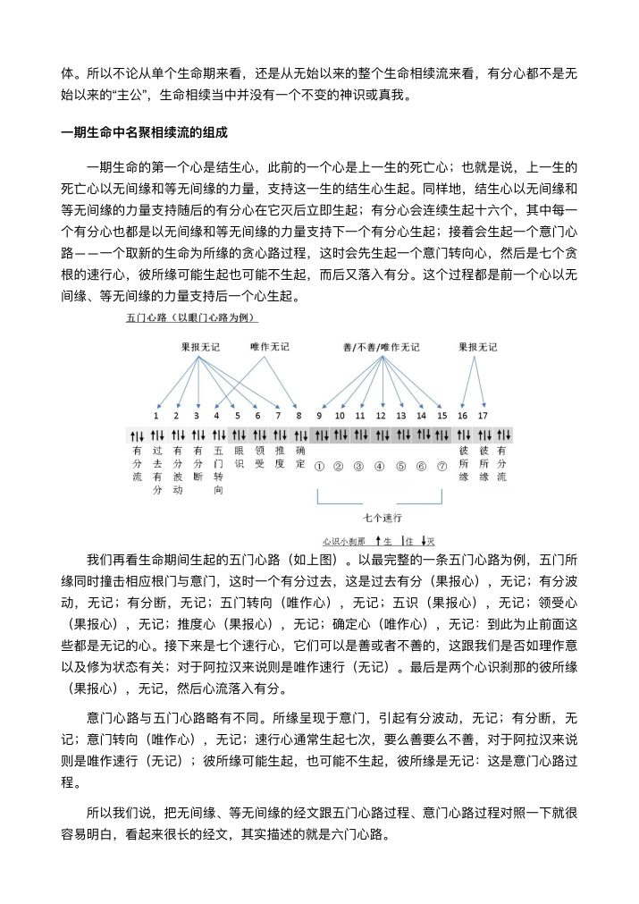

📅 最近更新：2026-09-29 12:00　|　第5版精修（朗读优化版）

# 第1周：两大束缚与心理机制（主持人版）

> ⭐ **本讲主持人速览**（新主持人必读，2分钟看完）
>
> 你不是老师，是"共学同行者"。你不需要提前懂内容，只需要按流程走。
> **本周由连续两周内容合并**而成，含两段共读、两轮分享与两轮讨论，单讲 120 分钟。
>
> | 环节 | 标准时长 | ⏱ 时间不够→ | ⏱ 时间富余→ |
> |:-----|:----:|:-----|:-----|
> | 🧘 静心开场 | 10 min | 缩至5 min | 加2分钟静坐 |
> | 📖 共读原文1 | 20 min | 只读★核心段（约15 min） | 加读◈扩展段 |
> | 💬 第一轮分享 | 10 min | 每人1句话 | 每人3分钟 |
> | 🎯 第一轮主题讨论 | 10 min | 只讨论问题① | 讨论全部问题+扩展 |
> | 🧘 禅修练习 | 15 min | 缩至8 min（只念引导词前半） | 延长至20 min |
> | 📖 共读原文2 | 20 min | 只读★核心段 | 加读◈扩展段 |
> | 💬 第二轮分享 | 10 min | 每人1句话 | 每人3分钟 |
> | 🎯 第二轮主题讨论 | 10 min | 只讨论问题① | 讨论全部问题+扩展 |
> | 🔚 收尾与回向 | 15 min | 缩至10 min | 保持 |
>
> **主持人10条守则（精简版）**：
> ① 不讲解、不提供答案——让原文自己说话；② 有人问"正确答案"→说"先听听大家的看法"；③ 冷场→主持人先分享自己的真实感受；④ 跑题→温和拉回："这个有意思，我们回到今天的原文"；⑤ 争论→"两种看法都很好，大家保留自己的理解"；⑥ 确保人人发言；⑦ 不评判任何人的分享；⑧ 时间到了就推进；⑨ 禅修练习照读引导词即可；⑩ 结束一起回向。

> 本周主题：**生命被两股力量（无始心理习性与物种基因／模因）紧紧束缚；认识六种心理余势（业／随眠／巴拉密／意乐／习性／性行）与两大生命机制（奖励／保护机制）**。

## 📋 本周信息卡

| 项目 | 内容 |
|:----|:-----|
| 时长 | 120分钟（4周版 · 9环节） |
| 核心问题 | 我们每天以为自己在做决定，真的是「我」在决定吗？生命被哪两股力量裹挟？；为什么「我」管不住自己？那些冒出来的贪、嗔、习惯与偏好，到底从哪里来、又存放在哪里？ |
| 共读原文 | 共读原文1：材料①《突破生命的束缚1-一切诸佛亘古的努力-古源尊者-20240913》　｜　共读原文2：材料①《古源尊者24缘释义第4讲-无间缘与等无间缘.pdf》 |
| 本周作业 | 本周每天留 3 分钟，记下「一次我以为是我在做决定、其实是被惯性带走的瞬间」（只记录、不评判，下周带来分享）。；任选一天，记录三次「情绪或习惯自动冒出来」的当下（时间、情境、身体感受、念头），只观察、不评判，下次分享带来。 |

## 🧘 静心开场（10 min）

> 💬 **破冰｜3–5分钟**：今天有没有一次「本想做A，最后却做了B」的时刻？说出那件小事，说完就放下。

> 🛡️ **心理安全三约定**（每次开场在心里过一遍）：① **保密**——这里说的话不出这间屋子；② **不评判**——不评价任何人的分享，也不急着评价自己；③ **可随时暂停**——任何时候觉得不舒服，都可以停下来休息、喝水或离开，不需要解释。

（引导语，请主持人照读，语速放慢，中间留白）

「请大家找一个让自己舒服的坐姿……可以盘腿，也可以坐在椅子上，双脚平放地面。后背自然挺直，但不要僵硬，肩膀放松，双手轻轻放在腿上。

（停顿 5 秒）

轻轻闭上眼睛，或者把视线柔和地落在前方地面上。现在，把注意力带回到呼吸上——不要刻意去控制它，只是知道：气进来了，气出去了。呼吸长一点，知道它长；呼吸短一点，知道它短。

（停顿 10 秒）

如果发现自己走神了，很好，这说明你觉察到了。不用责怪自己，只是温柔地把心再带回呼吸，一次，再一次。

（停顿 10 秒）

今天我们要一起去看一个很深、也很温柔的问题：我们的生命，被什么东西悄悄绑住了。看的时候，请记得——看清束缚，是了解心的自然运作，不是审判自己。现在你有能力安静坐下来观察，这本身就是正念在运作。

（停顿 5 秒）

好，我们慢慢睁开眼睛，带着这份安静，开始今天的共读。」

（主持人提示：若成员多为新人，可在开场后补一句「今天没有标准答案，你听到什么、想到什么，都可以分享」；若有人身体不适，提醒可随时改变坐姿或靠椅背。

开场三件事值得留意：一是让身体先安顿下来——姿势舒服，比盘腿漂亮重要得多，直背而不僵硬即可；二是给心一个「现在开始」的信号，一句「我们开始今天的共读」就已足够；三是主持人自己先把气息放慢半拍，因为静心的质量，往往取决于带领者自己的安稳，而非话术。

若现场嘈杂、或有成员迟到，不妨先带一次三分钟的呼吸，等大家安顿后再正式开场。若想加深，可在开场收尾时补一句安住语：「此刻，我们能安静坐在这里观察自己的心，这本身就是一件值得感恩的事。」

今天就讨论「生命被什么束缚」，若成员一开始就带着想「解决问题」的急切，也请不必阻止——只需温和提醒：先看清，再谈解开。座位尽量围成一圈，让每个人都能看到彼此，减少「上课」的压迫感；灯光柔和一些，手机调静音或统一保管，都是帮助大家回到当下的细微安排。总之，开场十分钟不追求精彩，只追求安稳——大家坐得住、心肯来，就是最好的开场。）

## 📖 共读原文1（20 min）

### 原文材料①：★核心·突破生命的束缚1-一切诸佛亘古的努力-古源尊者-20240913（依据录音转写整理，已校对明显同音错字）

- **文件**：《突破生命的束缚1-一切诸佛亘古的努力-古源尊者-20240913》

> ⚠️ 主持人操作：本讲为两大束缚「总说」。先读[00:03:25]–[00:05:13]两股力量总纲（必读），再读[00:05:30]–[00:08:25]物种基因与模因举例，再读[00:08:29]–[00:18:23]六种心理余势，最后读[00:18:32]–[00:22:14]鼓励机制/防护机制；时间紧可只读「业」「随眠」与鼓励机制段。

[00:03:25.780] 为什么要突破生命的束缚？无始以来，我们在六道里面。轮回生成。那为什么会？轮回生成，不得解脱？

[00:03:44.100] 我们总结出来有两条有两股。非常主要的力量在束缚着我们。一条是我们无始以来，存留在我们这个生命相续流里面的。六种心理余势。包括像业，烦恼，意乐这些方面。

[00:04:08.780] 第二一个，就是我们每一次轮回，都会投身为六道的其中一道的某一个物种。

[00:04:18.280] 这种。这个物种，它也是从他的祖先，一代一代的，传承下来。这个物种为了生存。在他的这个。传承的过程中，为了生存和繁衍它的生命，它会培养出很多的习习惯性的这种反应模式。而这种模式，它是会以基因的方式在我们身体存在。同时，我们会受到外在环境的限制。包括包括我们出生的家庭。社会。文化。外在的这种气候。整个的社会的安定情况。有没有战争等等。

[00:05:13.705] 这个两大。力量，会把我们的生命紧紧的束缚住。这些束缚，使得生命在生死轮回中。苦苦的挣扎。无法获得。真正的自由。

[00:05:30.500] 我一直想把这张图画好，就是。画了四年了，也没画出来。又想表达我们被两股力量所束缚。那。大家可以体会一下，本来，他这两张图是要汇集到我们这一生这个人身上。那会不了，我就两张图来说明。这个左边这张图，就代表我们在无始的轮回当中，在六道里面轮回。六道里面轮回的这种心理余势，会。在我们的这个身心上存留下来。右边这张图，就是我们作为人，这一生作为人。人这个物种，它所这个表现出来的这种。生存方式。它就会影响着我们这一生，

[00:06:29.630] 举个例子说，我们是一个人，我们就不会像狗一样的生活。如果人就像狗一样的生活，我们就认为他是一个变态，或者是一个畸形的，或者是有病的人。我们只能像人一样的生活。如果你是一个女人，这就是女人的特征，生儿育女的主要责任就会落在女人的身上。为了生儿育女，你们的身体器官都会有特定的这个设置。那男人是男人的特征，他有长胡子，嘴巴还有喉结等等，包括也这种这个骨骼，它异就不一样。那这个是物种的基因，这个导致这个人类的这样一种传承。那我们如果想一下，

[00:07:23.950] 在母系社会？可能这个女性的虽然除了传宗接代的生儿育女的功能没有变化，其他在这个形体上可能会有很多不同。那同样的，比如说我们这个时代。很多人。这个倡导小鲜肉对。这个人，就长得越来越秀气，越来越白。对，就是这个时代的这种。审美观之间，那男人女人，越来越强悍，越来越在社会上起很重要的作用。

[00:08:02.480] 那如果是这样的一种模式在传承几百年，那可能我们。这个人、这个物种的基因就会发生很大的变化。那你只要是在这样的基因的这种影响下，你的行为模式，就会按照这个方式来，你很难改变。

[00:08:25.240] 这个就是我们两股力量，会紧紧的把我们束缚。

[00:08:29.760] 那六种心理余势哪六种？简单来讲，第一个就是业好。我们讲经常讲这个业。那。这个业，很多人会不了解的人会问说，你们佛教徒讲业业业业存在哪里。越不需要存的，就在每个当下的我们的身心里面，它作为一种潜在的影响力，就存在那个地方。

[00:08:55.800] 就像说我们说，诶那个苹果会长苹果，苹果树会长苹果。那每年？一棵树都长几百斤苹果。那如果人问你说，那你这个苹果是存在哪里了，那不需要存呐。苹果树在春天的时候就开花，它的花期就两三天，对？它就开始长种子。再过个三四个月，它就成熟了，就可以吃了。好，那苹果吃完以后，它第二年继续长，那它不需要有苹果存在。哪里有是这个苹果有那个长苹果的基因，它就会，到春天就会开花，到夏天的时候就会结果。秋天的时候就会结果对？

[00:09:39.510] 业也是这样的，就是你照做了，就在我们的名色流里面，会留下这样的一种潜在的心理余势。在因缘成熟的时候，它就会成为果报。

[00:10:06.460] 第二一个？我们就讲烦恼随眠了。比如说我们的贪，我们的嗔留下来的这种心理余势，生命流动，这个由于过去我们的不善心，驱动去杀生，偷盗，邪淫等等。那这些习惯，他会这些行为，如果在他当时感觉有好处。他就会觉得我贪我嗔我吃是获得利益的一种手段。这样的一种行为，就会存留下来。过去我们有，这个古大德，把它翻译成叫等流果。就是像水流一样的相等的流下来。这样的一种行为就是催眠。

[00:11:00.820] 所以我们看一个人生下来小孩子的时候，就会发现，就这个孩子，脾气比较不好。不好带这个孩子生下来很乖，那普遍来讲，大部分情况下来讲即这个男孩子比较不好带。脾气比较大，女孩子，比较好带，又愿意吃饭，愿意睡觉，不吵闹。那这个，也是跟他的这种睡眠有关，也跟他的性情有关。

[00:11:32.200] 第三种，叫菠萝蜜，叫以巴利，叫巴拉蜜。如果说那个业。是，善业不善业，留下来的影响力。巴拉蜜？它也是一种业。那这是什么业？但是我们布施，持戒，禅修，服务，恭敬，回向功德，随喜功德，听闻佛法，弘扬佛法，端正自己的见解。把这些善业是导向解脱的这种清净的业，这种业成熟的时候会成为我们导向解脱的资粮。这种业，就称为叫波罗蜜或叫巴拉蜜。这是第三种第四种。

[00:12:19.060] 我们叫阿加沙亚，阿加沙亚就是有人把它翻译成意向。那简单来讲，就是你天生的那些喜好。或者厌恶，比如说有些人生下来就不喜欢吃某一样东西，有些人生下来就会这个喜欢某一类东西，那这个是过去带来的，这个叫意向性或者是好恶。那阿加沙亚。第五一个，叫瓦达，那就是习气。习惯了。这个习惯，跟上面的这个喜好有什么区别？喜好它会表现为对某一类目标，某一类这个人事物的这种喜好。习惯，它是一些行为层面上的东西。

[00:13:08.280] 那在经典里面讲过，说佛陀有个弟子，他来出家，他就是要铺红地毯。这个给他住很好的地方。他心才能够平静，才能够禅修正果。

[00:13:26.600] 那也有一位佛陀的弟子，他已经证了阿拉汉。他还会经常骂人，骂人说你这个贱种。你这个低等人，有很多人就跑去佛陀那去投诉说这个人怎么骂人？能说他阿拉汉还会骂人吗？佛陀说，他不是这个故意骂人的。他就是五百字都是高贵的婆罗门，所以每一生，只要不是高贵的婆罗门，他就会说，你这个贱种，你这个低等的，这是习惯了。跟他的内心，就是有没有这种，排斥心，或者是这种不善，他也没有关系，就是习惯而已。

[00:15:26.015] 那第六一种，就叫carita。carita，就是行。我们假了，就是行，很多人说就自善行，什么，快乐行这个假了。carita就行，我们经常讲说贪性行者，嗔性行者，痴性行者。这个对。这个就性情，就就就叫carita。我们说这个人这个。生来就是这个脾气不好。甚有些人，生来就是慈眉善目。你像这个。这个心胸很开阔，不会计较。这个是性情。这种六种性情，我们自己对照一下，那我们。且不说，我们能不能够摆脱它的控制。我们甚至于，我们对于这个六种心理余势，我们连观察都不会。那观察都不会的人，也就一定完全被这个习惯带着走。

## 💬 第一轮分享（10 min）

**分享规则**：每人 2–3 分钟；只讲自己的体会与例子，不评判他人；可说「我暂时没想到」；主持人计时但不打断情绪；不追问他人隐私，不逼问细节。

**起手问题**：
1. 今天读到的五段里，哪一句最像在说你？可以先念出那句话，再说说为什么。
2. 回顾这一周，有没有一个瞬间，你事后发现「那不是我决定的，是惯性在替我决定」？
3. 「身份认同」「模因」这些词，让你想到自己身上哪些被家庭、社会装上去的标签？

（每问后留 5 秒静默再请人回应；若冷场，主持人先示范一个自己的小例子，例如「我遇到批评第一反应就是辩解，可能来自从小被要求完美」。分享中若有人开始指责他人或自责过度，主持人可温和地把话题拉回「我自己的观察」。）

## 🎯 第一轮主题讨论（10 min）

**第1问：两股力量里，哪一股对你影响更大——是内心无始的习性，还是外在的基因与模因？**
提示：尊者用「左边一张图＝六道轮回的心理余势，右边一张图＝这一生物种+环境」来讲。可以引导成员分两组：一组举「天生的性情（贪性/嗔性/痴性行者）」，一组举「家庭/文化装进来的模因」。强调两股力量常常纠缠在一起，很难切分，看清纠缠本身就是收获。

**第2问：如果我们的选择「是在过去六种心理余势里来回横跳」，那「修行」到底在改变什么？**
提示：回到[00:16:30]那段——连觉知呼吸都管不了，何况人生大事。引导聚焦「觉察」本身即改变的开始，不是要立刻消灭习性。可引用鼓励机制段：多巴胺式的短暂快乐让人一直往外抓，修行是学会在抓取发生的当下「知道」。

**第3问：看清「生命被捆死」之后，会不会很无力？我们要不要给自己一点慈悲？**
提示：此处必须接入心理安全语——「看清束缚是了解心的自然运作，不是审判自己；能观察到，即正念在运作」。让成员彼此分担「看清」带来的情绪。若有人提到原生家庭伤痛，主持人只需倾听与共情，不做心理分析，必要时建议寻求专业帮助。

（时间安排建议：第1问 12 min、第2问 12 min、第3问 11 min；如时间紧，第3问改为全场静默一分钟＋每人一句感受。）

**深化追问（视时间选用，主持人挑 2–3 个即可）**

1. （对第1问）你说「这是我天生的」，那么回想一下，你最早注意到自己这个反应是在什么时候？它是不是也出现在家里某个人身上？——这一问轻轻指向「模因」的来源，但不要逼出隐私，成员可以不答。
2. （对第1问）如果把你从小放在一个完全不同的家庭和文化里长大，你身上哪些部分可能还是一样？哪些会不一样？——帮助成员区分「物种基因带来的底色」与「环境模因写进去的东西」。
3. （对第2问）如果连选择都「是在习气里来回横跳」，那么「有一次你多停了一秒、看清了惯性」，算不算一种突破？——让成员把「突破」从「终极大解脱」放宽到「当下的一次觉察」。
4. （对第2问）尊者用「苹果树结果」来比喻业与习气存在在哪里，这对你理解「我过去的所作所为到底去了哪里」有什么启发？——引导体会「不必有个仓库，它就活在当下身心」。
5. （对第3问）如果说「看清本身也是一种进步」，那么今天你多看清了一点点什么？请用一句话送给自己，说不说出口都可以，也可以只在心里对自己说。——给情绪一个温柔的落点。
6. （对第3问）看清之后，我们可以做的「最小的一步小事」是什么？——把可能的无力感转化为一个可执行的小行动，例如「下周对家人少顶一句」「每天觉察呼吸三分钟」「惯性发作时先深呼吸一次」。
7. （贯穿）五份材料里反复出现「两种力量」，你觉得它们在你身上是「打架」的，还是「合谋」的？——引导成员看见习性会借用基因/模因来强化自己。
8. （贯穿）听完今天，你对「自由」的理解有没有一点变化？——收束到本周主题「突破生命的束缚」的日常含义。

**分组方案（若人数≥8人）**：分成「内在组」（无始习性）与「外在组」（基因与模因），各自用 8 分钟列出自己身上来自这一股力量的具体例子，再回到大组交换。主持人负责在收束时指出：两组其实是交织的，很难截然分开——看清这份交织，本身就是收获。

**可能出现的反应与应对**

- **有人陷入自责**（「原来我这么糟，都是我的习气」）→ 立刻重申「看清不是审判」，请对方把手轻轻放在胸口，做三次深呼吸，对自己说一句「我看见你了，谢谢你告诉我」。这不是安慰话术，而是把觉察带回身体。
- **有人把它当玄谈**（「反正是过去生的事，反正改不了」）→ 温和拉回「当下这一刻可以做什么」，聚焦可观察、可行动的部分，避免讨论滑向不可验证的宿命论。
- **有人回避、沉默** → 不逼问、不点名，允许旁听。可以补一句「不分享也完全可以，你的在场本身就很好」，让安静的人也有安全感。
- **有人争论科学与佛法**（如进化论、基因决定论）→ 主持人不必站队，只需说明「尊者是从心的运作与道德向度来谈，可以与科学视角并存」，然后把话题拉回个人体会。

**若时间只剩 10 分钟的最小方案**：跳过深化追问，只做一题——「今天哪一句最像在说你？用一句话说说」；每人不超过 1 分钟，走完一圈即可，务必留出收尾时间。

**主持人小结（讨论收束语，照读）**：「今天我们看的这些束缚，不是用来给自己判罪的。它们只是条件——是过去生留下的习惯，是这一生家庭与环境的印记。条件可以被看见，也可以被慢慢转化。愿我们记住：能看见，就是自由的开始。」

> **分层追问**（可视时间取用，由浅入深）：
> - 【现象】你觉得自己每天的「决定」，有多少是当下选的，多少像被推着走？
> - 【影响】如果说有两股力量一直在裹着你，你最近哪件事上感觉最明显？
> - 【应对】这周挑一个反复出现的小习惯，只记录它出现的时刻，先不急着改。

## 🧘 禅修练习（15 min）

### 练习一

> ⚠️ **禅修禁忌提示**：若你正处在严重抑郁、焦虑、创伤后应激，或精神类疾病的发作／用药期，或正经历强烈的情绪危机，请先咨询医生或心理师，再决定是否练习；练习中若出现明显不适（如心悸、胸闷、情绪失控），请立即停止，睁开眼睛，把注意力放回呼吸与身体，必要时离场休息。

**本周练习：觉察一个惯性（引导词，照读）**

「请大家坐好，闭上眼睛，先做三次深长呼吸，把身体安顿下来。（停顿）

现在，不要去改变任何东西，只是观察：此刻心里有没有一点想要动、想要抓、想要抗拒的倾向？也许是一个念头，也许是一点身体的不舒服，也许是一点想要快点结束的感觉。都不要紧，只是看着它，像看一片飘过的云。

（停顿 20 秒）

你可能会发现，心总是很忙——它要么在想过去，要么在计划未来，就是不太愿意留在此刻。这不奇怪，这正是「心被习性带着走」的样子。能看到它忙，就已经很好了。

（停顿 20 秒）

现在，把这个倾向轻轻放下，回到呼吸。吸气，知道自己在吸气；呼气，知道自己在呼气。如果又跑掉了，没关系，再回来，一次、一次。

（停顿 1 分钟）

如果这段练习里，你看见了自己的一个惯性——哪怕只是「我总是想控制」这样一个念头——那就已经够了。看清它，就是正念在运作。不用急着改，先认识它、善待它。

（停顿 1 分钟）

好，现在带着这份清明与温柔，慢慢睁开眼睛。」

**练习要点（主持人掌握）**
- 时长分配：安顿呼吸 3 min → 观察习性 5 min → 回到呼吸 5 min → 收束 2 min；人多时可略减观察段。
- 不追求「没有念头」；念头来了，知道它来了，就是练习成功了一次。修行的对手不是念头，而是「不知道自己在起念头」。
- 若有人盘腿疼痛，请其换成椅子坐、或伸直腿；身体舒服是前提，禅修从来不是比谁更能忍痛。
- 若有人情绪上涌，引导其睁眼、做三次深呼吸、喝口水，必要时暂离片刻——这不是失败，而是照顾自己。
- 结束时不必急着讲话，先留 30 秒静默，再进入收尾环节。

**常见疑问与应答**
- 「我一坐下就昏沉怎么办？」→ 微微睁眼、挺直后背、把注意力放在腹部起伏，或改做经行。
- 「我观察不到自己的惯性？」→ 观察不到也是一种观察；能意识到「我不知道」，已经是觉察在运作。
- 「练习时想到过去的事很难受怎么办？」→ 不追、不压，把注意力带回呼吸；若难受持续，睁眼休息，不必勉强。
- 「我总想快点结束，是不是很失败？」→ 那正是「想抓取」的惯性在现形，看见它，本身就是练习的收获。

**收束练习（1 分钟，照读）**：「请对自己说一句：今天我愿意看见自己一点点，这就很好。愿这份清明，陪伴我这一周的生活。」

### 练习二

> ⚠️ **禅修禁忌提示**：若你正处在严重抑郁、焦虑、创伤后应激，或精神类疾病的发作／用药期，或正经历强烈的情绪危机，请先咨询医生或心理师，再决定是否练习；练习中若出现明显不适（如心悸、胸闷、情绪失控），请立即停止，睁开眼睛，把注意力放回呼吸与身体，必要时离场休息。

**本周练习：「标记—停顿—再选择」（观照余势的自动反应）**

**主持人引导语**（照读即可）：

> 我们做一个很简单的练习，来亲自看看「余势」是怎么运作的。
> 请大家闭上眼睛，放松身体，先做三次深长的呼吸。
> 现在，回想一个**小小的不快**：一句让你不太舒服的话，或者一件日常里的小摩擦。不用选最严重的，选一件轻轻的就好。
> 当那个画面出现时，注意三个动作：
> 第一，**标记**：在心里轻轻地说一句——「哦，它来了。」不要分析，只要认出它。
> 第二，**停顿**：在「想回怼／想躲开／想评判」的冲动升起来的时候，不急着跟着它走，先给自己三个呼吸的时间。看看这个冲动，是身体的哪里先有感觉？胸口？肩膀？喉咙？
> 第三，**再选择**：现在，带着这份觉察，你可以选择——是照旧反应，还是换一种更轻的方式回应？没有标准答案，只是**看见「其实可以选」**这件事。
> 好，慢慢把注意力带回呼吸，再带回这个房间。睁开眼睛。
>
> 记住：今天不是要你「变得不生气」，而是让你**看见那个自动反应**——能看见，就已经在松动了。

## 📖 共读原文2（20 min）

### 原文材料①：★核心·古源尊者24缘释义第4讲-无间缘与等无间缘.pdf

- **文件**：《古源尊者24缘释义第4讲-无间缘与等无间缘.pdf》

> ⚠️ 主持人操作：本材料是本周的教理主干，篇幅最长。建议**朗读小节标题（1. 业／2. 随眠／3. 巴拉蜜／4. 意乐／5. 习性／6. 性行）建立框架**，正文由成员轮流分段；「十巴拉蜜的特相·作用·现起·近因」与两则本生故事可快带或跳读，把时间留给「心潜力的传递」。PDF 中的心路示意图为图形页，提取为乱码，已注明缺口，朗读时跳过。

#### 五、六种心的潜力

那么，既然心都是刹那刹那生灭、中间没有间断的，没有我，没有灵魂，那究竟谁在解脱？谁在成佛？我们造的业存放在什么地方？我们又是以怎样一种方式在累积巴拉蜜？随后的内容将能回答这些问题。

人们常常有一种误解，认为业力存放在某个地方。事实上，并不存在这么一个地方，业力只是顺着我们的名色相续流传递下来的。那么，从我们的过去通过无间缘的力量传递下来的都有什么呢？这大致可以分成六大类，称为六种心的潜力或者余力。心刹那刹那地生灭，当前一个心灭去后，后一个心紧接着马上生起，心的生灭是串行而不是并行的，以这样的方式，过去心的潜力、心的余力得以辗转传递下来。这六种心的潜力是：

#### 1. 业

业(kamma)：即过去造业的思心所遗留下来的心理余势、潜力，借由无间缘、等无间缘的力量，一个一个心识刹那等流下来。

#### 2. 随眠

随眠(anusaya)：这是指烦恼随眠，诸如贪、嗔等不善心所遗留下来的心理余势。举例而言，以前我们一看到蚂蚁就想踩死它，一看到蚊子就想打死它，这就是我们过去在不善心所驱动下所做的杀等不善行留下的余力。

有七种随眠：欲贪随眠、有贪随眠、嗔随眠、慢随眠、邪见随眠、疑随眠与无明随眠。它们会一直以潜伏的形式存在，如影随形地陪伴着我们，直到被道智所根绝。《清净道论·说智见清净品》（VsM.xxii. /PP.xxii.60）解释：“因为它们根深蒂固，屡屡为欲贪等的生起之因眠伏(anusenti)，故为随眠(anusaya)。“如何眠伏呢？帕奥西亚多在《业的运作》中举例说：“禅修者可借由修习禅那而镇伏诸盖，并投生到梵天界，在那里停留很长的一段时间，但最终他还是会再次投生到欲界。虽然诸盖在他的名色相续流中消失了相当长一段时间，但当条件具备时，它们又重新出现。”

#### 3. 巴拉蜜

巴拉蜜(pāramī, 波罗蜜): 明昆西亚多在《大佛史》中说:“巴拉蜜是那些以大悲心和行善之方法善巧智为基础的圣洁素质,例如布施、持戒等。而且这些素质必须不受渴爱、我慢与邪见所污染。”所以巴拉蜜是圣洁的素质,是美德,也就是说,这是美心所和一些通一切心心所的素质、特征,是这些心所遗留下来的力量。它会让我们的心生起时跟无贪、无嗔、无痴相应,例如一看到他人受苦就生起悲心,一看到如何对他人有利益就想帮助、提升对方:这种无贪、无嗔、无痴的素质、美德,就是巴拉蜜。它也是随着我们过去的造作而不断地增长或者减损,并依无间、等无间缘的力量传承至今。

回应我们前面提出的那个问题，到底谁在成佛呢？没有一个人、我、众生在成佛，而是在一生复一生的生命相续流当中，由于心流被要成佛的欲增上所牵引，在每次累积十巴拉蜜时，跟十巴拉蜜相关的心所都会得到强化，如此不断得到强化直至圆满，并且不善心所断尽时，那时的生命会成为佛陀。

那么，十种巴拉蜜都对应哪些心所的素质呢？帕奥西亚多的《菩提资粮》一书中有详尽的阐释，相关内容摘录如下。

#### 十巴拉蜜的特相、作用、现起与近因

(1) 布施是愿意舍弃自身和所拥有的身外物给他人的舍思。布施的特相是舍弃；作用是消灭对可供布施之物的执著；现起是不执著，或是获得财富与投生善界；近因是可供布施之物。

(2) 持戒是善的身业与口业。根据《论藏》，持戒是“离心所”与实行当行之善的“思心所”。持戒的特相是不让身口为恶而保持它们行善，它的另一个特相是作为一切善业的基础；持戒的作用是防止道德的沦落，也有帮助获得无瑕疵、无可批评的完美道德之作用；持戒的现起是身业、语业的清净；近因是羞于为恶（惭）与害怕为恶（愧）。

(3)出离是在明了欲乐与生命的不圆满之后所生起的舍弃之心。出离的特相是舍弃欲乐与生命；作用是看透欲乐与生命的不圆满；现起是远离欲乐与生命；近因是悚惧智。

(4) 智慧是透视诸法之共相与特相的心所。智慧的特相是透视诸法之实相，或是毫无错误地观照目标的共相与特相；智慧的作用是有如灯般照明其目标；现起是不混乱，有如森林中的善导者；近因是定力或四圣谛。

(5) 精进是为众生福利或修行所付出的身与心之努力。精进的特相是努力奋斗；作用是支持；现起是不松弛；近因是九精进事或悚惧智。

(6) 忍辱是忍受他人对己所犯之错的忍耐力。根据《论藏》，则是在忍耐的时候，以无嗔为主所生起的心与心所。忍辱的特相是耐心地忍受；作用是克服喜欢与厌恶的事物；现起是忍受或不对抗；近因是如实知见诸法。

(7) 真实是只说实话且言而有信，亦可分析为离心所、思心所。真实的特相是诚实不欺的言语；作用是指明事实；现起是圣洁、美妙；近因是诚实。

(8) 决意是对行善毫不动摇的决心，或是如此下决心时所生起的心。决意的特相是决意修行善业；作用是对治与善行对立之法；现起是坚贞不移地修习善业；近因是善行。

(9) 慈是为众生福利所做的奉献或愿众生快乐，或者是无嗔心所。慈的特相是希望众生富有与快乐；作用是为众生的福利而努力，或消除嗔恨；现起是友善；近因是视众生为可接受的一面。

(10) 舍是对所有喜与恶之法，采取平衡与不分别的态度，即舍弃爱与恨。舍的特相是对爱与恨采取中立的态度；作用是平等地看待事物；现起是减轻爱与恨；近因是自业智，即明白众生是自己所造的业的主人。

由此，我们便可清楚了解十种巴拉蜜所对应的心与心所。

#### 对巴拉蜜的不同定义

另外，西亚多们对巴拉蜜的定义也各有不同。有些西亚多和明昆西亚多一样把它描述为菩萨的高尚品德和心的素质；有些西亚多称巴拉蜜是能够导向涅槃或者佛果、没有被污染的业；有些西亚多称之为崇高人士所做的崇高的行为。

这三种解释的落点并不太一样。正如我们前面已详述的，明昆西亚多把巴拉蜜定义为心的素质，这落在心所上。然而，对于菩萨而言，他的每一次大布施、大持戒、大出离都特别与众不同，非常人能力所及，这跟他的欲、精进、心和智慧相关，也就是跟增上缘有关。

若称“巴拉蜜是能够导向涅槃或者佛果、没有被污染的业”，那么它未来成熟时将以业缘的方式呈现。

如果说它是“崇高人士所做的崇高的行为”，行为本身是一种“行”，除了造下的业之外，它还具有“行”的特质。以布施为例，布施是一种业，但是布施的习惯是一种动机。布施的动机体现在思心所上，布施的惯性以潜力的形式存留在思心所上。也就是说，喜欢布施的思在碰到布施的因缘时，思心所就会推动布施的行为。这跟思心所相关，而思心所要起推动布施的作用又跟想的标记有关系；由于要作出相应的判断，所以跟胜解心所也有关系。

#### 4. 意乐

意乐 (ajjhāsaya)：与过去生经验相关的喜好与厌恶。例如我们天生就喜欢或不喜欢某些人事物。这种喜恶是过去生养成的，它们依着无间缘和等无间缘在生命相续流中传承、流转下来。

#### 金匠的故事

在《本生义注》中有这样一个故事。一名金匠出家后跟随沙利子尊者(Sāriputta, 舍利弗)修行。尊者教他修习不净，然而四个月过去了，他却连门都没摸着。尊者想：“看来，只有佛陀才能度化他。”于是便带他去见佛陀。

佛陀具有与诸弟子不共的有情意乐随眠智，能了知一切众生的意乐与随眠。他知道这名比库曾连续五百世都是金匠，面对殊妙纯金这么长久之后，不净业处并不符合他的意乐、偏好。于是，佛陀变现出一处莲池，里面莲花簇簇，其中有一朵硕大的莲花异常美丽。他让比库坐在池畔，并说：“凝神注视这朵莲花。”当这位比库注视着莲花时，佛陀以神通力令其渐次凋零，直到只剩空空的花萼。看着面前这一幕，比库自忖道：“刚刚仍美丽迷人的莲花如今已香消玉殒。衰败就这样降临到它的头上，衰败也将如此降临于我的身体。一切有为法真是无常啊！”他当下即生起了透视无常、苦、无我三相的观智。佛陀了知比库的进展，于是以神通现身于前，说道：“拔除自爱恋，如手摘秋莲；培育寂静道，善至说涅槃。”闻此偈颂，比库即证得阿拉汉果。

这位比库对美丽事物的偏好就属于意乐。当沙利子尊者教导他不净业处时，由于他长久以来面对的只是美妙纯金，不净完全不能引发他的兴趣，所以他的禅修毫无进展。佛陀了知什么样的业处能吸引他的心，开启他的智慧，因而以莲花殒落做导引，让他看到有为法的无常变易而生起洞察实相的智慧，并进而以一首偈颂指引他拔除了深藏的贪爱，踏上了寂静的涅槃道。

## 💬 第二轮分享（10 min）

**分享规则**（主持人先说明，再开始）：
- 自愿发言，不点将；想说就说，想只听也可以。
- 每人 1.5—3 分钟，一次说清「哪一句／哪一点最触动我」，不必展开长篇故事。
- 说自己的感受与观察，不给别人建议、不评判他人的分享。
- 听到触动或难受，都可以先做三次深呼吸，随时可以暂停或暂离。

**起手问题**（任选 2—3 个）：
1. 今天读到「六种心理余势」——业、随眠、巴拉密、意乐、习性、性行，哪一两种让你觉得「这说的好像就是我」？
2. 材料③说快乐是「让物种活着和繁衍的诱饵」，吃东西第一口最快乐、之后递减。这个描述和你自己的经验对得上吗？
3. 「看清束缚不是审判自己」——听到这句话，你心里是松了一口气，还是反而有点不自在？
4. 材料①说「性行」分贪性行、嗔性行、痴性行——若请你猜一猜，自己偏向哪一种？先不用急着下结论，说说看就好。
5. 材料③说「快乐是物种自我保护和延续的诱饵」——这句话让你对过去一直追求的某样东西，有了什么新的看法？

> 主持提示：第一轮重在「说出来」，不追求深度；每位发言控制在 2 分钟内，主持人用一句话回应（「谢谢你，我听到了」）即可，把深挖留给主题讨论。若无人先开口，主持人可先做半分钟示范：只讲感受，不讲道理。

## 🎯 第二轮主题讨论（10 min）

**引导问题一：这些「余势」是「我」吗？——从「谁在生气」说起。**
提示：材料①说，贪、嗔等不善心所的余力会透过无间缘、等无间缘在生命相续流中传递，一旦类似所缘出现，嗔心就自然再度生起（乃至「起床气」）。可以问：回忆一次你「莫名其妙就冒火」的时刻——那个火，是「我」决定的，还是它自己冒出来的？如果它不是「我」，那它是什么？（引导落点：它是过去反复造作留下的**心理余势**，其中并没有一个恒常实体在主宰。看清这一点，是在了解心的自然运作，**不是审判自己**。）

**引导问题二：奖励机制与保护机制，正在怎样安排你的今天？**
提示：材料③把「有情生存的根本机制」分成**奖励（鼓励）机制**与**保护（防御）机制**：前者让「对生存／繁衍有益的目标」带来快乐并**强化行为**，但快乐**边际效应递减**，于是我们不断累积、想要更多更好；后者让「可能带来伤害的所缘」带来痛苦，且**痛苦持续不退**，于是记仇、防范、放大警觉。可以请成员做个小实验：回想今天吃到的第一口食物、刷到的第一条短视频、一次被冒犯的不快——分别对应哪套机制？它让你后来做了什么？（引导落点：机制本身无善恶，它「保护你存在」；问题在于没有修行时，它会**无限扩大**，所以要知道「有个度」。）

**引导问题三：既然「造业要有动机」，那我能不能换一个动机？**
提示：材料②讲「无明—爱取—造业」，材料③讲「一散播慈爱，慈悲心只会更大，不与人竞争」。可以问：如果嗔的余势靠反复生气而变强，那善的素质（巴拉密、慈心）是不是也靠反复培育而变强？本周我可以**具体做一件什么小事**，去「喂」我想要的那一种余势？（引导落点：这就是「重新塑造并改善生命」——不是消灭什么，而是选择滋养什么。）

> 主持人提示：本周讨论容易滑向「自我批判」。一旦发现成员自责，及时接住：「能看到，就是进步；我们今天练的是**observation（观察）**，不是**judgement（审判）**。」

**备选追问（视时间与气氛灵活取用）**：
- 问一追问：「那个冒出来的火，如果它不是你，那它是谁的？」「如果它是过去反复生气留下的余势，那么今天继续生气，是在喂它，还是在削弱它？」
- 问二追问：「奖励机制让你『想要更多更好』——回想最近一次『买了还想要、刷了还想刷』，此刻再看它，感觉有什么不同？」
- 问二追问：「防御机制让你『记仇』——你记着的那件事，如今还在保护你，还是已经在消耗你？」
- 问三追问：「如果善的素质也是靠反复『喂』而变强，本周你愿意先喂哪一口：一次慈心的念头？一次忍住不回怼？一次真诚的帮忙？」

**收束语（照读）**：
> 今天我们看见——余势不是「我」，机制不是「罪」。看清，是为了自由；能看见，就已经开始在松绑。下一步，是把「看见」变成「选择」：选择去滋养哪一种余势。愿我们都从小处开始，不急不躁。

**带领者小抄（不朗读）**：
- 场面冷：主持人先自曝一句「我身上最明显的是『意乐』——一碰到某类话题，我本能就想回避」，再请成员接话，气氛会自然松开。
- 场面热：用「我用一句话帮你接住」的方式，帮长篇的成员收束，再顺势转给下一位，避免一人独占。
- 有人难受：立即暂停讨论，邀请「我们一起做三次深呼吸」，并给出暂离选项，**不追问细节**。
- 有人跑题：温和拉回——「这个很有意思，我们先记下，回到今天的三个问题之一上来。」
- 有人较真教理：承其精进，同时收边界——「你想得很细，这部分的完整教理在**读书会11/12**，今天我们只取总纲。」

**正面引导范例**（主持人可示范一句，再交给成员）：
> 「我发现我自己一被否定，胸口就先一紧，然后立刻想反驳——我以前以为这就是『我脾气不好』。今天读到『随眠』，我才知道那可能是过去反复生气留下的余势，一到类似所缘就自动冒出来。看清它是被条件触发的，而不是『我本性如此』，心里反而松了一点。」

> **分层追问**（可视时间取用，由浅入深）：
> - 【现象】那些突然冒出来的贪、嗔、偏好，你注意到它们通常藏在什么时候出现吗？
> - 【影响】既然有奖励机制和保护机制在暗中安排，你怎么看自己「管不住自己」这件事？
> - 【应对】这一周，留意一次「做得好想被夸」或「被冒犯想反击」的瞬间，只看见它。

## 🔚 收尾与回向（15 min）

### 收尾一

**总结（主持人）**：今天我们用一小时，只做了一件事——看清生命被什么绑住。

第一股力量，来自无始轮回里留下的六种心理余势：业、随眠（烦恼）、巴拉密、意乐性、习气、性行。它们并不在别处的某个「仓库」里，就在当下这一念中潜藏着，像苹果树储存着开花结果的潜能——条件一到，它就显现。

第二股力量，来自这一生物种的基因与生存环境的模因：生存与繁衍的本能、身体的构造、性情底色，以及家庭、社会、文化悄悄写进我们心里的反应模式。尊者用「同一个受精卵长成性格迥异的双胞胎」来提醒我们：同样的父母、同样的环境，也长不出同样的人，因为还有一股「过去」在起作用。

这两股力量常常合谋：习性会借用基因和模因来强化自己，让我们以为「是自己在决定」，其实多半是被惯性带着走。尊者甚至说，我们每天以为在做的那些重大决策，「也是在六种心理余势里来回横跳而已」。

看清，不是为了自责，而是为了不再被它自动牵着走。修行不是消灭自己，而是拿回那一点点觉察的空间：惯性发动时，你能多一秒钟的「知道」。这一秒钟，就是自由的起点，也正是本周作业要你去留意的东西——不是要你立刻改变，而是先学会认识它、善待它。

最后，请把今天的一句话记在心里：**能看见，就是自由的开始。**

**（若还有余裕）现场小结练习**：请每人用一句话完成「今天我看见了自己的 ______ 一次」。主持人先示范，例如「今天我看见了自己在想要掌控时的那一下紧张」。不必点评、不追问，听完即散，让每一份「看见」被温和地承认。

**下周预告**：第2周《六种心理余势与心理机制》——我们将逐一深入业、随眠、巴拉密、意乐、习性、性行，并看看鼓励机制与防御机制如何在心理层面运作。请带着本周作业里记录的那个「被惯性带走的瞬间」来。

**回向前的一句提醒**：回向不是走过场的仪式，而是把今天这份清明与善意，扩展给一切众生。请放慢语速，跟随念诵。

**回向词（照读）**：

「愿以此功德，回向给一切有情、一切众生，无怨敌、无嗔害、无恼乱，保持自己的快乐，脱离诸苦，不失去所得的成就。

愿正法久住，愿一切有情得安乐。

以此法随法行，我敬奉佛；以此法随法行，我敬奉法；以此法随法行，我敬奉僧。

萨度，萨度，萨度。」

### 收尾二

**主持人总结（照读，约 3 分钟）**：

> 今天我们认识了六种心理余势——**业、随眠、巴拉密、意乐、习性、性行**：它们是过去生造作留下的心理余力，靠着心「一刹那接一刹那、无间地」传递下来，所以在生命里代代相续。我们也看见两套根本机制：**奖励（鼓励）机制**让我们追逐并强化快乐，**保护（防御）机制**让我们记取并放大痛苦。
> 它们不是「我」，也不是「罪」；它们是心的自然运作。看清它们，是为了**能重新选择**：选择去滋养哪一些——是不善的贪嗔痴，还是善的巴拉密与慈心。
> 今天不需要变得完美，只需要**看见**。看见，正念就在运作。

**下周预告**：
> 下一周，我们进入**第3周：三颠倒与错误认知**——看看错误认知是怎么一步步变成「想颠倒、心颠倒、见颠倒」，以及「无明」如何在其中起作用。

**散会前的现场答疑（约 3 分钟，视情况）**：
- 问：「六种余势哪一种是『最重要』的？」答：「不必挑一个。看清它们的**共同点**——都是过去造作留下的余力、都靠无间缘等无间缘流转、其中都没有一个『我』——比分辨轻重更要紧。」
- 问：「我怎么知道自己正在『喂』哪一种余势？」答：「看它出现后，你的身心是更松还是更紧、更亮还是更暗。善法增上，会越来越轻安开阔；不善的余势，则让人越陷越窄。」
- 问：「随眠、习气这么深，真的能改变吗？」答：「能。材料①说余势『或越练越强，或渐被削弱』——改变不是一次搞定，而是每一次『看见』都在悄悄削弱它。」
- 问：「下周要准备什么？」答：「带上你这周记录的『三次自动反应』，下周我们来谈错误认知是怎么一步步变成三颠倒与无明的。」

**回向词（照读，四句）**：

> 愿以此闻法、分享与禅修的一切功德，
> 回向一切有情，愿他们离苦得乐、平安自在；
> 愿我们在这条看清束缚、走向自由的路上，
> 不退转、不放逸，早日抵达究竟的寂静与清凉。

## 📌 本讲主持人特别提醒

1. **心理安全第一**：本周涉「无明、习气、束缚」，请务必在开场与讨论第3问处重申——「**看清束缚是了解心的自然运作，不是审判自己；能观察到即正念在运作**」。不要把「看清习性」变成成员的自责工具。
2. **不诊断、不贴标签**：谈到「原生家庭、模因、家族习气」时，主持人不做心理诊断、不评判成员的家庭。成员情绪波动时，提供深呼吸放松或暂离现场的选择。
3. **时间纪律**：120 分钟流程不得随意改动；如时间不足，优先保共读（材料①③）与第1问讨论，扩展内容可整体略去。
4. **跳读提示**：材料①的「铺红地毯/骂人证果」等公案较长，可只读要点；材料③的家族实例冲击较强，读后立即接心理安全提醒；材料②的「进化其实是退化」段易引发争论，主持人只需说明「这是尊者从道德下滑角度的解读」，不必站队。
5. **术语一致性**：本系列术语「心理余势／随眠／巴拉密／意乐性／模因」以知识库原文为准，讲解时可用白话对照（如「模因≈环境的潜移默化」），但不改原文表述。
6. **下周衔接**：本周只讲「束缚是什么」，涉及缘起细支、业报分类处，注明「详见读书会11/12、13/14」，不在本周展开；涉巴拉密处注明「详见读书会17」。
7. **收尾从容**：无论时间多紧，回向词务必读完，给成员一个安住的收束。

---

<!--EXT_READ-->
## 📖 延伸阅读（课后自由选读）

- 《突破生命的束缚2-古源尊者-20250421》——第2周六种心理余势与心理机制主材料，可请成员预读。
- 《突破生命的束缚5-古源尊者-20250424》——四圣谛与八正道主材料，为「突破路径」预读。
- 《突破生命的束缚·哈佛演讲-20241108》——四圣谛八正道段（[01:13:56]起）留第5周、快乐分层段留第6周取用。
<!--/EXT_READ-->
