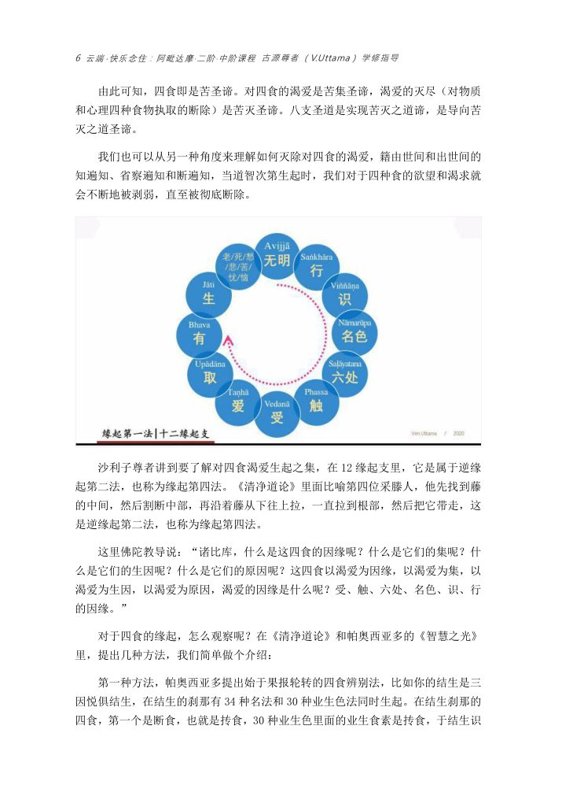

📅 最近更新：2026-09-29 12:00　|　第5版精修（朗读优化版）

# 第2周：三颠倒与束缚的运作机制（主持人版）

> ⭐ **本讲主持人速览**（新主持人必读，2分钟看完）
>
> 你不是老师，是"共学同行者"。你不需要提前懂内容，只需要按流程走。
> **本周由连续两周内容合并**而成，含两段共读、两轮分享与两轮讨论，单讲 120 分钟。
>
> | 环节 | 标准时长 | ⏱ 时间不够→ | ⏱ 时间富余→ |
> |:-----|:----:|:-----|:-----|
> | 🧘 静心开场 | 10 min | 缩至5 min | 加2分钟静坐 |
> | 📖 共读原文1 | 20 min | 只读★核心段（约15 min） | 加读◈扩展段 |
> | 💬 第一轮分享 | 10 min | 每人1句话 | 每人3分钟 |
> | 🎯 第一轮主题讨论 | 10 min | 只讨论问题① | 讨论全部问题+扩展 |
> | 🧘 禅修练习 | 15 min | 缩至8 min（只念引导词前半） | 延长至20 min |
> | 📖 共读原文2 | 20 min | 只读★核心段 | 加读◈扩展段 |
> | 💬 第二轮分享 | 10 min | 每人1句话 | 每人3分钟 |
> | 🎯 第二轮主题讨论 | 10 min | 只讨论问题① | 讨论全部问题+扩展 |
> | 🔚 收尾与回向 | 15 min | 缩至10 min | 保持 |
>
> **主持人10条守则（精简版）**：
> ① 不讲解、不提供答案——让原文自己说话；② 有人问"正确答案"→说"先听听大家的看法"；③ 冷场→主持人先分享自己的真实感受；④ 跑题→温和拉回："这个有意思，我们回到今天的原文"；⑤ 争论→"两种看法都很好，大家保留自己的理解"；⑥ 确保人人发言；⑦ 不评判任何人的分享；⑧ 时间到了就推进；⑨ 禅修练习照读引导词即可；⑩ 结束一起回向。

> 本周主题：**想颠倒、心颠倒、见颠倒三层错误认知如何一层比一层深，无明在其中扮演什么角色；束缚如何自己转起来——十二缘起、四取与四食**。

## 📋 本周信息卡

| 项目 | 内容 |
|:----|:-----|
| 时长 | 120分钟（4周版 · 9环节） |
| 核心问题 | 我们每天"看到"的世界，有多少其实是自己贴上去的旧标签？想颠倒、心颠倒、见颠倒这三层怎么一层比一层深？无明在其中扮演什么角色？从"知道有这个稻草人"到"把它拆掉"，中间要走哪几步？；束缚为什么能"自己转起来"？十二缘起这支循环里，哪一环是我们最容易下手的？四取（欲取／见取／戒禁取／我语取）和"爱"是什么关系？生命靠哪四种食存续，我一直在喂自己什么？为什么"受"是循环上最容易被打断的一环？ |
| 本周作业 | ①**简答题**：请用你自己的话，说出**想颠倒、心颠倒、见颠倒**三者的区别，并各举一个自己身上的例子（不要求举得准，要求举得真）。②**实践题**：本周任选一次"反应特别强"的日常情境（被一句话刺到、被某个场面触怒、突然很焦虑），事后回看：**我当时的标记是什么？这个标记是从哪一次经验来的？** 只记录、只观察，**不审判自己、不急着改**。；①**简答题**：请用你自己的话，说出**四取（欲取／见取／戒禁取／我语取）**分别指什么，并各举一个自己身上的例子（不要求举得准，要求举得真）。②**实践题**：本周任选一天，记录**三顿饭之外你还"喂"了自己什么**——刷了什么、追了什么、反复想了什么；各写一句：**我图的是哪种感受？** 只记录、只观察，不审判自己。 |

## 🧘 静心开场（10 min）

> 💬 **破冰｜3–5分钟**：今天你对某个人或某件事的判断，有没有可能只是贴上去的旧标签？说一个，随即放下。

> 🛡️ **心理安全三约定**（每次开场在心里过一遍）：① **保密**——这里说的话不出这间屋子；② **不评判**——不评价任何人的分享，也不急着评价自己；③ **可随时暂停**——任何时候觉得不舒服，都可以停下来休息、喝水或离开，不需要解释。

**（一）就座与放松（0–2 min，照读）**

请找一个让自己坐得安稳的姿势，背部自然挺直，双手轻放，肩膀放松。轻轻闭上眼睛，或者微微垂视前方。做三次深长的呼吸：吸气——知道自己在吸气；呼气——知道自己在呼气。第三次呼气的时候，把今天所有的事情，暂时放在门外。这十分钟，你不需要完成任何事，只需要**回来**。

**（二）入出息念（2–7 min，照读）**

把注意力带到鼻端、带到人中这个位置，知道气息进，知道气息出。不需要控制它，不需要让它变长变细。它怎样，你就知道它怎样。如果心跑掉了，轻轻带回来，不责备。跑掉一百次，就带回来一百次——**带回来的那一下，就是修行在发生**。

（静默 2 分钟）

**（三）慈心引导（7–9 min，照读）**

现在，把这份觉知扩展到心里。对自己轻轻地默念三句：

> 愿我平安，愿我健康，愿我远离身心的痛苦。
> 愿我像了解自己一样，了解我的心。
> 愿我对自己温柔——**看清自己的心，不是审判自己**。

再把这份心意送给在场每一位法友，送给今天可能让你心烦的那个人。愿他们平安，愿他们也被自己的心温柔以待。

**（四）收摄与提示（9–10 min，照读）**

慢慢把注意力带回身体，带回坐垫，带回这个房间。睁开眼睛之前，先在心里放下一个念头：**今天我们要看的东西，不在外面，就在这里——在每一次"我知道""我早就知道"的那个标记里。** 我们现在开始，请带着这份安静，进入今天的共读。

---

## 📖 共读原文1（20 min）

**主持人开场一句（照读）**：今天的三件材料，其实只讲一件事——**心怎么给自己贴标签，又怎么被自己的标签绑住**。请大家先只用耳朵听，把"名相"放在一边；听完之后我们再一起慢慢拆。

**阅读节奏建议**：材料①与②合计约 22 min（含读两遍的"麻雀与稻草人"），材料③约 4 min，小结 3 min，留 1 min 缓冲。

### 原文材料①：★核心·如来禅修学体系03-三颠倒&四种快乐-古源尊者-20250105（依据录音转写整理，已校对明显同音错字）

- **文件**：《如来禅修学体系03-三颠倒&四种快乐-古源尊者-20250105》

⚠️ 主持人操作：本材料只读下列**连续一段**（[00:05:29.300]–[00:24:11.950]，约 8 min）——想的特相·作用·现起·近因（标记／盲人摸象／稻草人）→ 麻雀与稻草人（标记错误→不会认→见颠倒）→ 权威与入出息的例子 → "不要对果报直接采取非理性的行动"→ 三颠倒的简单理解。其中 **[00:10:08.100]–[00:14:55.000]（麻雀与稻草人）请读两遍**。[00:48:09.700] 以后段落**跳读**（第 6 周用）。开头礼敬与回向段不朗读。

[00:05:29.300] 好，那我们来看这个想，它的特相是什么？它的标记所缘，譬如你认得褐色、金色等，好，那是通过标记而认的，就是简单来讲，它是标记所有。它的作用，是根据以前的标记而认得这个说明。

[00:05:52.430] 第二一个，是再一次做标记。比如说，你看到一个人热闹，想起来了，你是某某某，但是你最近好像气色不错，对？那就对他过去的这个标记，要做一个调整。过去可能气色不大好，现在气色比较好，就是你又长胖了，你最近这个如何如何，他就再做一次标记，那以便下次再认得，再见到的时候还可以认他。

[00:06:24.455] 这个就是这个，就像木匠给木头做标记一样。它的现起，这个要很注意好吗？就是这个现起就是呈现在你心里当下的那个状态。好，那它这个现起是什么？就是心抓住的标记。根据该标记或特征，取注意所缘。如盲人摸象摸到象鼻就认为大象像蛇。

[00:06:53.500] 第二一个，它不深入不长久的取所缘，如闪电须臾即逝。那大家可以体会一下。就是我们看到一个目标，或者遇到一件事情，我们会。很习惯的下意识的就拿出一个看法出来。这个东西就是这样，而且你会非常坚持的认为这个是对的，为什么？我过去做了标记。我标记他就是这样，对？好，但是，它是客观的吗。它是跟事实相符吗？就很难讲，对？

[00:07:41.110] 所以那么为什么会出现盲人摸象？他就是因为你这个想。做了标记，不可观不完整的。而且，我们会很习惯是不深入不长久去做人，就一看见说，知道知道，不要跟我讲话，我早就清楚了，我想这个人怎么那么主观？这个人怎么那么固执？就是这个想在起作用。他就是这个他不愿意深入的去观察，这是这个我们新的一个自然的习惯，所以我们说一个人，他是。这个不够主观，不够客观。不够客观是一个很正常的现象，

[00:08:28.570] 因为我们的心就是这样。我们不习惯客观的看问题，我们习惯用过去的标准看问题，用过去的记忆看问题。我们只要我们认为这个是对的，我们就不愿意再深入的观察，就就就就就是这样的，有什么好讲的对，这是我们很习惯的一种表现。那这个就佛陀，就跟我们都讲的很清楚。他的近因，就已出现的所缘就像六路对草人所产生的人，想我们讲以前经常讲都是稻草人对不。那。稻草人即。这个。你看到了那个。

[00:09:18.480] 草人，你以为是人？好，那，那就是为什么会有这样的标记？就是过去标记错了。所以。这个一个人的心，他如果没有经过训练，我们就很习惯的主观看问题。

[00:09:37.780] 那为什么要主观抗问题？以前标记过了，它的标记干嘛用？为它的生存和物种繁衍负责的对，所以，我们在想过去怎么标记，我们现在就怎么反应。

[00:09:52.660] 所以我以前讲过，说你所认知的世界，是你的想蕴构建出来的，所以你是完全被你的三颠倒，被你的思想捆绑住。然而，就是。

[00:10:08.100] 为什么会这个想这个？这个在经典里面把它给比喻成稻草人的，稻草人可能有些在农村里面长大的人就知道了。在中国，是没有鹿了，鹿都被我们杀完了，除了是养起来了，在国外有很多野鹿。那我们很多稻田里面有麻雀，当然现在麻雀也很少，都被农药毒死了。

[00:10:38.660] 那我们小的时候，就是田里面有很多麻雀。那这个麻雀？怎么这个露天？你怎么防它？农民，就会像这样在田里面插很多稻草人。用稻草扎的，穿上破衣服，戴上斗笠，吓得麻雀又不敢（来）。好，

[00:11:02.230] 那为什么不敢来？它显然有麻雀。在来吃稻谷的时候被这个带着。斗笠，穿着破衣服的人赶过，甚至被打过，有些麻雀被打死了。这个，所以他觉得这个，这些戴斗笠穿蓑衣的这些人是会伤害他。这个，麻雀的雀身，如果遇到这样的人，我们就要离开，要躲起来。好那这个，就是叫做。这个标记错误那。就是本来，他是人，这个农民会打麻雀，但这里把它标记成凡是戴着斗笠、穿着破衣服的人。入围大权好。这是标注。

[00:12:12.740] 讲的说，一朝被蛇咬，十年怕井绳，他就是把草绳当成了蛇，看成了蛇，就是把那个弯弯绕绕一条条的都把它标记成是蛇。那这个是标记错误。好。那你标记错误习惯了，如果说你这个雀妈妈。他被打过。这个雀儿子，这个没有被打过，但是这个雀妈妈给他讲，你不要去，凡是这样的，你的不要碰。那这个却小子？他就不会认了，他就凡是那个的都是。那说实在话，如果雀妈妈那个雀爸爸胆子大一点，就这看长时间都不动，

[00:13:03.235] 这是真的吗？我们过去看看，再近一点，再近一点，再近一点，可以发现说，原来是不会动的假人，我就把它吃饱了再回来，对？所以，它是可以破除那个想蕴标记的这个标记错误，它是可以改变的。但是那个雀孩子，如果被爸爸妈妈教成的，说阿哥是会打死我们的，你坚决不能去，这个雀小子，就变成他就不会认了。就是连碰都不敢碰了，好就我们近一点去尝试都不敢了那这种状态，

[00:13:43.175] 就是我们会完全把这一类东西都把它标记成，把它想这个确认成是会伤害我们的，就是你的心本身就没有这个识别的功能。

[00:13:55.160] 前面那个雀妈妈，但是标记错了。那这个这你这个雀孩子，就是不会标记，他就他就不会认的。就是这样。就前面那个我们就叫心颠倒，就叫想颠倒不要比如说我叫想颠倒不会认真就叫心颠倒，就是你的心已经失去这个识别的功能了，就像心电脑。

[00:14:19.300] 这个当这个一大群的这个麻雀在开会的时候，那这个雀孩子长大了，他说我要发言。我妈给我说，凡是那样的，就一定是会打我们的，一定是人，这个是绝对的，这是肯定的。你们想都不要再想了。这个东西不能去冒险，它已经变成这个雀孩子的一个见解，非常坚固的见解，不可改变的见解，那个就叫见颠倒。

[00:14:55.000] 这我们叫三点倒好，那我们日常，我们得看我们在日常生活当中，对待这些人事物，他就是这样的一种情况，对。

## 💬 第一轮分享（10 min）

**分享规则（主持人先念，再开始）**

1. 每人 **90 秒**，用计时器或手机秒表，到点"叮"一声；说话的人不被打断，时间到了就停。
2. **不评论、不补充、不给建议**。听完只说"谢谢"或"我听懂了"。
3. 想说"我讲得不好"的，请把这句话省下来——**这里没有讲得好不好，只有讲得真不真**。
4. 不想说的人，可以举手示意"这一轮我旁听"，完全尊重。
5. 主持人**最后发言**，且只做示范，不做总结。

**起手问题（任选 2–3 个，请学员挑一个回答）**

1. 本周材料里"稻草人"这个词，让你想到了自己生活里的哪一件事？请只讲**情境**，不必讲道理。（提示：那个人／那个场面／那句话，为什么每次都让我反应这么大？）
2. "一朝被蛇咬，十年怕井绳"——你身上有没有一条"井绳"？现在的你，还会把它当成蛇吗？（提示：不要求已经不怕了，只讲"我发现了它"。）
3. 材料①说："你所认知的世界，是你的想蕴构建出来的。"你对这句话的第一反应是什么？是认同、怀疑，还是有点不服气？（提示：说"不服气"也很好，那正是值得看的地方。）

**主持人示范（30 秒，照读）**：我先来。我最容易起反应的是"被人纠正"。只要有人用某一种语气说"你这个不对吧"，我心里立刻就紧了，接着就想解释、想证明。今天我回头看，我贴的标签不是"他指出了一个问题"，而是"他在说我这个人不行"。这就是我的一个稻草人。我说出来，不是要大家同情我，而是让大家知道——**说出来，就是把它从暗处搬到亮处。**

**倾听提醒（主持人自用）**：本周分享极易变成"比惨"或"追责父母"。若出现这两种走向，主持人用一句轻收："我们只讲**自己心里的那个标记**，不用讲谁对谁错。"再请下一位。

---

## 🎯 第一轮主题讨论（10 min）

**问题一（约12 min）：三种颠倒，在我身上长什么样？**

**引导语（照读）**：想颠倒是"见到的是真的，标签贴错了"——比如把一段绳子认成蛇；心颠倒是"连识别都不对了"——把土块真的看成金块；见颠倒是"把错的说成绝对真理"——凡戴斗笠的一定会打我们，讲都不用讲。

**讨论提示**：
- 先请大家各自想一个例子：**我什么时候是"绳子看成蛇"？什么时候是"土块看成金块"？什么时候"想都不用想就下了结论"？**
- 提醒：三层不是三个不同的人，而是**同一件事的三个深度**（材料② 2.3：标记被不断重复，就从想颠倒升到心颠倒，最后见颠倒，"基本动不了它了"）。
- 若学员卡在"分不清"，主持人给一个简化的抓手：**"还能被说服的，是想颠倒；怎么说都不听的，是见颠倒。"**

**问题二（约12 min）：无明不是"我不知道"，而是"我把错的看成对的"（瞎眼与睁眼瞎）**

**引导语（照读）**：材料⑤ 用两个词形容无明：一个是**瞎眼**（看不到真相），一个是**睁眼瞎**（明明是错的，一定看成对的）。尊者又用月亮作比喻：月黑日看不见月亮，不是因为地球把月亮"变没了"，而是**我们的无慧**——月亮一直在那里。

**讨论提示**：
- 请大家想一想：**最近有哪一件事，我"很有把握"，后来发现是我自己看错了方向？**
- 关键一句（主持人可在白板写）：**无明不是"知道得少"，而是"把常乐我净贴上去"。**（材料② 3.2、材料⑤ 4.1）
- 心理安全提醒（务必说）：**无明是无始以来的运作，不是某个人特别糟；看清它，是了解心的自然运作，不是审判自己。** 能观察到，就是正念在运作。
- 边界注明：无明在十二缘起中的位置（无明缘行……）**本周不展开，详见读书会 11／12**。

**问题三（10 min，可砍）：从"看见稻草人"到"拆稻草人"，第一步做什么？**

**引导语（照读）**：材料① 说："修行的第一步，就是你能觉察到这个反应又出来了……跟我这个反应后面是不是有稻草人呢？" 材料② 的实践题更简单："继续去观察自己的稻草人，看能不能找出来；找出来以后，能不能把稻草人还原一下？"

**讨论提示**：
- 三步落地（主持人写在白板）：
  1. **认出来**：反应起来的时候，心里说一句"哦，稻草人来了"；
  2. **找来源**：这个标签是哪一次经验留下的？（"过去标记错了"——材料① [00:09:18]）
  3. **先不动手**：不急着改、不急着压，只是看清楚"它不是眼前这个人，是过去的那个影子"。
- 强调（材料① [00:16:58]）：**不去看到这个认知，说"我不要紧张、我不想控制"，是没有用的。**
- 收束一句：**"不在果报上直接采取非理性的行动"**（材料① [00:18:13]）——这句可以作为本周的家庭作业口令。

**主持人收束（照读）**：今天讨论里若有人发现自己的稻草人又深又顽固，请记得：**能看见它，就已经在改变。** 我们不需要在这一次读书会里拆掉任何一个稻草人；我们只需要认得它的样子。

---

> **分层追问**（可视时间取用，由浅入深）：
> - 【现象】想颠倒、心颠倒、见颠倒，这三层你觉得哪一层在你身上最常出现？
> - 【影响】如果无明不是「不知道」，而是「把错的当成对的」，你想到了哪一件事？
> - 【应对】这周找一处你最确信的判断，试着先问一句「这是真的吗」，不急下结论。

## 🧘 禅修练习（15 min）

### 练习一

> ⚠️ **禅修禁忌提示**：若你正处在严重抑郁、焦虑、创伤后应激，或精神类疾病的发作／用药期，或正经历强烈的情绪危机，请先咨询医生或心理师，再决定是否练习；练习中若出现明显不适（如心悸、胸闷、情绪失控），请立即停止，睁开眼睛，把注意力放回呼吸与身体，必要时离场休息。

**本周练习：入出息念＋"看标记"（引导词，照读，语速放缓）**

**（一）入座与安顿（0–2 min）**

请把身体坐正，双手轻放。做三次深长的呼吸。让肩膀松开、让眉头松开、让牙关松开。你不需要"表现"，只需要**在这里**。

**（二）入出息念（2–8 min）**

把注意力放在鼻端、人中这个位置。知道气息进，知道气息出。**不控制它。** 它长就长，短就短，粗就粗，细就细——你只负责知道。

（静默 3 分钟）

如果心跑掉了，你会发现：心跑掉的时候，往往是**已经贴好标签**的时候——"这声音好烦""这腿好痛""我怎么又跑神了"。请在这一刻做一个动作：**轻轻认出那个标签，然后回到呼吸。** 不用骂自己一句。认出就够了。

（静默 2 分钟）

**（三）"看标记"练习（8–12 min）**

现在，让我们把这个能力用在今天讲的主题上。请让呼吸当背景，然后做一个简单的观察：

回想**这一周里，有一次你反应特别强**的情境——也许是一句话、一个眼神、一条消息。不要重现那个场景的细节，**只去看当时心里冒出来的那句话**。

它可能是：**"他又在针对我。"**、**"我永远做不好。"**、**"这下完了。"**

请在心里，把这句话**轻轻地念一遍**，然后问自己一句：

> **"这句话……是真的，还是我贴上去的标签？"**

不需要回答。只需要让这个问题在心里放一会儿。你会发现，标签和事实之间，**有一条很细很细的缝**。今天我们不拆标签，我们只是**看见那条缝**。

（静默 3 分钟）

**（四）收摄（12–15 min）**

现在，把注意力带回呼吸，带回身体，带回这个房间。请在心里对自己说一句：

> **我看见了我的稻草人。这不是我的罪，这是我过去的功课留下的痕迹。**
> **能看见，就已经在改变。**

慢慢睁开眼睛。带着这份清明，回到今天。

---

### 练习二

**主持人引导语**（照读即可）：

> 好，我们来做今天的练习。这个练习只有两步：**觉知呼吸，觉知感受。**
>
> 先把身体坐正、放松。让呼吸回到自然。只是知道：正在吸气，正在呼气。不用控制，不用加深，呼吸有多长就多长。
>
> 现在，我们加一点点观察。每一次呼吸，留意一下心口、肩膀或鼻子附近的**感受**：这一口气是舒服的，还是有点紧？是放松的，还是有点闷？或者不明显的、中性的？**不用改变它**，只是像看天边的云一样，看着这个感受。
>
> 如果心里冒出"我怎么又紧张了""这样不对"，很好——你已经看见了。**看见了，就不用跟着它走。** 轻轻回到呼吸，回到此刻的感受：**它来了，它也会走。**
>
> 我们就这样安静地坐一会儿……（静默 8 分钟）……
>
> 最后，我们做三个深呼吸：吸气……呼出…… 吸气……呼出…… 吸气……慢慢呼出。搓搓手，轻轻把眼睛睁开。
>
> 记住这个感觉：**每一次看清自己的感受，就是在循环上松了一次手。**

> ⚠️ **禅修禁忌提示**：若你正处在严重抑郁、焦虑、创伤后应激，或精神类疾病的发作／用药期，或正经历强烈的情绪危机，请先咨询医生或心理师，再决定是否练习；练习中若出现明显不适（如心悸、胸闷、情绪失控），请立即停止，睁开眼睛，把注意力放回呼吸与身体，必要时离场休息。

> ⚠️ 主持人操作：引导语速放缓，留白足够；静默时长用手机计时；身体不适以放松为先，允许靠背或换姿势；不必强求"坐得住"，走神拉回来就是练习本身。

## 📖 共读原文2（20 min）

**主持人开场一句（照读）**：今天的三件材料，其实只讲一件事——**束缚怎么自己转起来，我们又一直在拿什么喂它**。请大家先只用耳朵听，把"名相"放在一边；听完之后我们再一起慢慢拆。

**阅读节奏建议**：材料①约 14 min（含读两遍"四取四种"），材料②约 12 min，材料③约 2 min，小结 2 min，留 1 min 缓冲。

---

### 原文材料①：★核心·突破生命的束缚4-古源尊者-20250423（依据录音转写整理，已校对明显同音错字）

- **文件**：《突破生命的束缚4-古源尊者-20250423》

> ⚠️ 主持人操作：本材料只读下列**连续一段**（[00:05:25.600]–[00:14:43.130]，约 9 min）——行（福行／非福行／不动行）→ 无明导致行、爱、取 → 爱从受来 → 食物与受 → 三种爱 → 爱的加强版＝四取 → 戒禁取（学狗戒牛戒）→ 我论取（萨迦耶见）→ 四取分两类；再加读结尾两句 [00:55:27.540]–[00:55:55.460]（十二缘起与二十四缘结合修、三轮转）。其中 **[00:11:34.585]–[00:14:43.130]（四取四种）请读两遍**。开头 [00:00:50]–[00:05:25] 与 [00:15:19] 以后段落**跳读**（读书会11第2周已取）。时间码跳过不念，（）内整理注记同样跳过。

[00:05:25.600] 行吗？行是什么？行就是身与意的行。身与意的行，那这个身与意的行出来的行有三种，一种是福行，一种是非福行，一种是不动行。行，就是这样的行为会导致好的结果。良好的果报就叫福行。非福行，就是以贪嗔痴造业。会留下不好的影响力，未来会产生恢复的果报，那就是恢复性。

[00:06:04.680] 还有一种，称为叫不动性。不。不动情，它就是特指是无色别的这个禅那空无边度定。一识无边处定，无所有处定，非想非非想处定，因为无色界的这个禅，那，它这个如果。成熟的时候，它是会在无色界的生命界学生那因为无色界的生命界只有名法，没有色法，所以它不会受这种冷热寒冷这种什么，外在的所有这种气候，或者是变化影响。所以它是不动，它是稳定，这样相对稳定的这样的生命，除了它最后的生命终结以外，它就是稳定的，那这个就叫不动性好好，

[00:07:06.150] 这个无明导致行，它其实还有两个没有列出来，就是无明。有爱取。就因为无明？因为我们不能够正确的看待这个事物，或者我们根本就不愿意去正确的看，所以我们对那个事物，会有欲取戒禁取见取我语取。

[00:07:40.860] 或者说，从无明下来，我们首先是爱好，因为它有欲爱有爱无有爱。

[00:07:54.710] 爱又怎么来？因为有感受。那为什么都要有感受？因为我们就是靠这个手活着的。这个人事物是不是对我好，或者对我不好？那无法分辨的时候，我们可能就会影响到我们的生存和物种的繁衍。所以，只要你是众生，因为他追求这样的对生命有可爱，要维持这个生命，并且把物种繁衍下去，

[00:08:30.900] 他都要去为了这个生存的物种繁衍去造作种种的这个行为，就是要给它喂养食物。要让我们能够持续的生存下去，就有食物。那食物？食物靠什么来去评判这个食物是好的食物是不好的食物要靠这个感受。所以它的逻辑，就是很清楚了，那因为有无明，所以，我们透由这个身体的这种器官，去面对这些。外在的人事物，那这个外在的人事物，是为了要喂养我们的食粮，为了生存和物种繁衍。

[00:09:19.800] 怎么去判断这个食物是好的食物不好食物？我们靠感受。好，那这个任何感受出来，我们都会有一种爱。这个爱，就是欲爱，有爱无有爱。欲爱，就纯粹是感官的。这个可爱有爱，是对这个两种一种。一种，是对于生生命的贪着，就是希望你这个生命一直存在，还有这个有爱，就是禅，基于禅的爱。就是好的东西，我们希望它一直都有有一直都在那么这样的一种爱，也称为不爱。好，无有爱？无有爱，就是希望这个无有爱，就是希望不好的东西不要出现。

[00:10:17.960] 我们渴望没有杂音。我们渴望这个禅谈的空气都非常清新，我们渴望每天的饮食都非常美好，我们渴望每天一躺下去就着第二天早上就醒过来。中国好像就没感觉一样，就睡觉睡眠很好，那这个就是一种对那个状态的爱，这种友爱。只要晚上又没能睡着，我就很恼火，就对于不能够好好睡觉的这个事实。我们这个希望它不存在，但这个就是对于失眠的无有爱，对于这个杂音的。无有爱，对于这个，这个空气清新，空气污染的无有爱，那这就是无有。

[00:11:12.945] 所以，这个不管好坏，他都是在这三种爱里面。好，当我们这个爱认为有理的时候，我们经常去抓取它的时候，这个去确认它的时候，我们就会变成一种强有力的秩序，这个爱的加强版。好，那这个爱的加强版，

[00:11:34.585] 就会变成欲取戒禁取见取我语取。这个戒禁取见取我语取，都是见。只是，戒禁取是什么，狭义上的戒禁取，

[00:11:49.445] 就是我们说古代，这个佛陀时代的一些外道，

[00:11:53.620] 他们学。学狗界，牛界什么意思？他们认为学狗可以解剖，学学狗的生活方式可以解脱，学牛的生活方式可以解脱，或者其他的苦行可以解脱。那这个主于戒禁取，简单来讲就是以不正确的。方式来修行，这就是戒禁取，那。广义上来讲，就是我们在修行过程中，错误的执取某一类方式，能够解决我的烦恼，那这个就是戒禁取。

[00:12:40.660] 举一个例子讲说很常见的，大家觉得说要通过控制，才能够把这个露出习练修成，这就是戒禁取。或者认为这个消业障，才可以这个解脱，这也是一种戒禁取，这是一种错见那么。见取在这里的见取，是特别的指这种，虚无见，这个，无因见和无作见，这种三种很极端的。拔无因果，认为没有因果，没有过去，没有未来，那造作的这个，这个也不会有果报，造下的做的任何事情也不会留下影响力，像这一类的见，我们把它称为见取。

[00:13:39.460] 而我论群，就是跟我相关的，就是认为佛陀在皮带树读经里面讲到了二十种见，过去我们，古人把它翻译成二十种，萨迦耶见。

[00:13:54.900] 萨亚萨提亚，这个萨迦耶见，就是我语取的意思。这个萨迦耶见指的是什么？就认为我们不是色受想行识五蕴吗？那色受想行识五蕴有。四种角度来看就认为色是我，色在我中，我在色中，那像这个对，五蕴的四种不同方式的，这个执取，就是我语取。那。对于欲爱有爱无有爱，上升到这种执取的时候，

[00:14:43.130] 会有这个四种那么简单的分成两类。我们从一个就是见取，就见解上面的一个就纯粹是，这个欲取上面的欲取上面就是感官层面，就是我就是想要，我就是希望，那他不会对见解强又那么强调。所以昨天我们提到了什么叫四大和我大。就是你从，就事论事，还是一定要坚持你的观点，就是这个差别了。

[00:55:27.540] 接下来在缘起的时候，就是修缘起的时候，我们就一直追溯到。一直追溯到。形成我们这些不良心路的过去的那些因，那这个所以在我的教导。里面十二缘起跟二十四元是结合着修，所以我们专门讲二十四元。

[00:55:55.460] 十二缘起，主要是从这个三轮转的角度来看。二十四元就会更广阔。

---

### 原文材料②：★核心·第 170 讲 应用 (摄集 18)：三十七道品╱苦之集［生命的四食(四)］

- **文件**：《第 170 讲 应用 (摄集 18)：三十七道品╱苦之集［生命的四食(四)］》

## 💬 第二轮分享（10 min）

**分享规则（主持人先讲，照读）**：

> 接下来是第一轮分享。规则很简单：**每人自愿，90 秒到 2 分钟；不想说可以安静地听。** 我们不做评判、不比较谁懂得深，也不当场给建议。今天只请你说一件**属于你自己的小事**——不用引经典，不用讲道理，只要真实。

**起手问题（任选 1–2 个，先由主持人示范一句）**：

1. 今天哪一句话最让你"心里一动"？它触动的是你生活里的哪一件小事？
2. 回看这周，有没有哪一次，你**先有了不舒服的感受，然后马上就想做点什么**（想吃、想买、想刷、想找人评理）？那份感受是什么？
3. 你最近一次"**死抓一个看法不放**"（哪怕对方已经说得有道理），是为了什么？
4. 这周有没有哪一刻，你其实已经**很累、很饿、很闷**，却还在不停地刷、不停地想？那一刻，你到底在喂自己什么？

**主持人如何守场（自用）**：本轮的目的不是"讲对"，而是**让每个人都在自己的经验里说一句话**。请留意三件事——① 有人抢话时，温和地"我们先把时间留给还没说的法友"；② 有人越说越沉重时，不深挖，一句"谢谢你愿意说出来"后转给下一位；③ 有人说"我没什么感觉"也很好，**没有感觉本身就是一种可报告的状态**。若全场沉默，主持人可先读一遍材料里自己最有感觉的一句，然后说"我先说一句我的"，用示范破冰。

> ⚠️ 主持人操作：先由主持人示范一句自己的分享（简短、真实），再依次邀请；不点名、不逼问，照顾沉默者；有人讲到一半停住，就静静等着，或说"慢慢来"；若有人说"我是不是业障重、轮回出不去"，请温和回应"看清循环，本身就是转机；能观察到即正念在运作"。

## 🎯 第二轮主题讨论（10 min）

**引导问题 1（循环·12 min）**：材料①把束缚讲成一条会自己转的圈：**无明→行→……→受→爱→取→有**。回看你自己的一天，你觉得**哪一环最容易"卡住"你**？是"看错"（无明）、"忍不住去做"（行）、"感受一起来就跟着跑"（受），还是"死抓不放"（取）？

> 提示：可引材料① [00:07:06]–[00:11:12]——"因为有无明，我们对那个事物会有欲取戒禁取见取我论取""从无明下来，我们首先有爱……那么爱又怎么来呢？因为有感受"。**落脚：不必一样一样修，先找到自己最常卡住的那一环。**
> 追问：为什么说"受"（感受）是循环上最容易下手的一环？（可引材料② 五、"触缘受，受缘爱……当执取愉悦快乐的感受时，就会想要得到更多"）

**引导问题 2（四取·12 min）**：材料①说"四取就是爱的加强版"（[00:11:12.945]），并列出**欲取、见取、戒禁取、我语取**。请结合你自己的经验，说说这四种里，哪一种你最有感觉？"坚持我的看法"（见取）和"学错了方法还以为能解脱"（戒禁取），在你身上有影子吗？

> 提示：可引材料① [00:11:34]–[00:14:43]——欲取是感官层面"我就是想要"；见取特指虚无见／无因见／无作见；戒禁取指以不正确的方式修行（学狗戒牛戒，或"通过控制、消业障才能解脱"）；我论取即萨迦耶见（执五蕴为我）。
> 追问：**"就事论事"和"要坚持我的观点"，差别在哪里？**（材料① [00:14:43]）

**引导问题 3（四食与受·11 min）**：材料②讲生命靠四种食存续，而"符不符合感受"正是判别"食好不好"的尺子。请回想：**除了吃饭，你还在喂自己什么"食"？** 你图的是哪种感受？

> 提示：可引材料② 五、——刷手机（触食＋识食）、追剧／规划／攒钱（思食）、反复想一件事（识食）；也可引材料② 四、——"现代人的触食瞄准的还是那些物质化的东西……这样的触食所滋养的识食，几乎不可避免的只会增长贪瞋痴"。
> 追问：如果"我喂的是'被看见的感觉'"，那**哪一种食才是真正对生命有益的**？（可引材料② 四、"我们要懂得分辨哪些是正确的……哪些是有毒的食物"）
> 再追问（收束用）：**"四食都断了，会是什么样子？"**——材料② 四、说："在阿拉汉无余涅槃的时候，所有的食都被无余灭除……彻底从四食的追逐中解脱出来……进入寂静永恒的涅槃之乐。" 此处**只点一句**，不展开涅槃（留待读书会 19）。

> **分层追问**（可视时间取用，由浅入深）：
> - 【现象】无明→行→爱→取……这条循环里，你觉得哪一环自己最容易踩进去？
> - 【影响】「受」是最容易被打断的一环，这对你处理情绪的方式有什么提示？
> - 【应对】这一周，在「感觉来了」和「跟着它走」之间，试着停三秒，看看能不能断开。

> ⚠️ 主持人操作：每题先给 2 分钟静默思考，再开放分享；不空谈名相，**一律回到"我这周具体的一件事"**；涉"轮回／苦／渴爱"时保持开放温和，不恐惧、不玄谈；遇情绪波动，提供呼吸放松／暂离选项；第 3 题若时间不够，可改为作业。

若第 1 题讨论得较充分，可顺势加一个小演练，帮学员把"循环"从概念变成体验：

1. **请一位志愿者说出"最近一次忍不住要去做的小事"**（如"又熬夜刷手机到两点"）。
2. 主持人带着大家一起把它拆成链条（写在白板上）：**触发**（晚上躺下，手机就在手边／触）→**受**（一刷就放松、一停下来就空）→**爱**（想再多刷一会儿）→**取**（明明知道不好，还是"就看五分钟"、一遍遍给自己找理由）→**行/有**（第二天更累，循环重来）。
3. 最后停在**"受"**上问一句：**"如果那一刻你能早半秒看见'我其实是想要那个放松的感受'，事情会有一点点不同吗？"**
4. 主持人收束：**不必真改，先看清；看清那半秒，就是练习的全部。**

> ⚠️ 主持人操作：演练只用志愿者自愿提供的一件"小事"，**不要追问隐私细节、不评判选择**；若无人愿做，主持人就用自己的一件小事示范，效果一样。

**主题讨论·常见跑偏与拉回（主持人自用速查）**

| 跑偏 | 拉回 |
|---|---|
| 变成"阿毗达摩名相讲解会" | "我们今天不学定义，只回到'我这周的一件事'" |
| 变成"人生苦短"的感慨会 | "苦不是用来说的，是拿来'看清就松手'的；我们看具体的那一环" |
| 变成"比谁烦恼少" | "在这里没有排行榜，**看得见就是好事**" |
| 变成"原生家庭／社会害的" | "本周只讲**自己心里**的那台机器，不追责任何人、任何环境" |
| 有人越说越钻牛角尖 | 温和打断："我们让这句话先在这里停一停，回到呼吸三次" |

## 🔚 收尾与回向（15 min）

### 收尾一

**（一）本周回顾（3 min，照读）**

今天我们走了三站：

1. **标记**——想的特相就是"标记"；我们认出的世界，是想蕴标记出来的世界。
2. **三层颠倒**——想颠倒（标签贴错）→ 心颠倒（失去识别，认假为真）→ 见颠倒（固化成不可动摇的见解）。
3. **因与下手处**——根是**无明（痴）**：错知目标为常乐我净；下手处是**正念正知**：不在果报上直接采取非理性的行动，看清稻草人，再拆稻草人。

**（二）下周预告（2 min，照读）**

下周我们进入第 4 周：**束缚的运作机制——十二缘起循环·四取·四食与受**。今天我们认识了"标记"这颗种子；下周我们看这颗种子**怎么长成一条链条**，把一生接一生地串起来。届时我们会用到今天学的"无明"，但**缘支的细节会在那里正式展开**（想深入的同伴，可参照读书会 11／12 的缘起专题）。

**（三）作业提醒（1 min，照读）**

①**简答题**：用自己的话说出想颠倒、心颠倒、见颠倒的区别，各举一个自己身上的例子。
②**实践题**：本周任选一次"反应特别强"的情境，事后回看：我当时的标记是什么？它从哪一次经验来？**只记录、只观察，不审判自己、不急着改。**

**（四）邀请带走一件"小事"（2 min，照读）**

本周不要求大家记住任何名相。只请带走一件小事——这周里，任意一次"我反应好大"的时刻，在心里轻轻标一句：**"哦，稻草人来了。"** 然后什么都不做，继续过日子。标一周，你就会发现：原来**"起反应"和"我想骂回去"之间，真的是两件事**。这就是三颠倒这一课送给生活的礼物。它也提醒我们：**看清束缚，是了解心的自然运作，不是审判自己。**

**（五）回向（2 min，全体合掌，主持人领诵）**

> 愿以此功德，导向诸漏尽；
> 愿以此功德，为证涅槃缘；
> 我此功德分，回向诸有情；
> 愿彼等一切，同得功德分。
>
> 萨度！萨度！萨度！

1. 想的特相＝**标记**；世界是"想蕴构建的世界"。
2. 三层颠倒：**想颠倒（贴错）→ 心颠倒（认假为真）→ 见颠倒（固化不容讨论）**。
3. 因：**无明（痴）＝瞎眼＋睁眼瞎＝错知目标为常乐我净**；足处＝**非理作意**。
4. 两个机制：**保护机制**（宁可错一万次，不可疏漏一次）＋**鼓励机制**——标记被反复强化，就升到见颠倒。
5. 一句口诀：**不在果报上直接采取非理性的行动；回到当下，看标记、拆稻草人。**
6. 心理安全一句：**看清束缚是了解心的自然运作，不是审判自己；能观察到，即正念在运作。**

### 收尾二

**（一）本周小结（5 min，照读或略讲）**

> 今天我们看清了一台会自己转的机器：**看错（无明）→ 造作（行）→ 感受（受）→ 追（爱）→ 死抓（取）→ 又造新的一轮。** 它靠**四食**（抟食／触食／思食／识食）供燃料，而"符不符合感受"正是我们判别"食好不好"的尺子。最要紧的是那一道缝：**触缘受，受缘爱**——在感受生起处看清它，就有机会松手。请记住：**看清循环，不是给谁定罪，而是给一条出路。**
>
> 有一点要特别点出：这台机器**不是我们要去"打倒"的敌人**。它是无始以来缘条件而起的自然运作，几乎人人如此、时时如此。我们今天的任务，只是**第一次把它看清楚**——看清"我此刻是在哪个环节上"。就像看一台自己家里的旧机器：先看懂它怎么转，才谈得上哪天把它停下来。**看得懂，才有得选。** 这，就是本周的全部功课。

**（一·补）三个"最小可用"的口诀（主持人可板书，照读）**

1. **"看错—去做—有感受—就想要—死抓"**：这就是一圈循环，念一遍就记住了。
2. **"四取＝爱的加强版"**：想要是爱，非它不可、不容讨论，就是取。
3. **"触缘受，受缘爱"**：想松手，先在"受"上练——**感受来了，先不跟它走。**

**（一·补二）留给生活的三句话（照读）**

- **"我最近在喂自己什么食？"**——一句就能把自己从自动模式里叫醒。
- **"我图的是哪种感受？"**——把"想要东西"还原成"想要感受"，欲望就轻了一半。
- **"这是爱，还是取？"**——能这样问，就说明你已经在观察，而不是被带着走了。

**（二）下周预告（2 min，照读）**

> 下周我们进入第 5 周：**突破的路径——四圣谛与八正道**。今天我们看清了苦和它的运作，下周我们就看佛陀给出的那条**可以走的路**，把"看清"变成"走下去"。届时四圣谛与八支圣道会正式展开。

**（三）作业提醒（1 min，照读）**

①**简答题**：用自己的话说出四取（欲取／见取／戒禁取／我语取）分别指什么，各举一个自己身上的例子。
②**实践题**：本周任选一天，记录三顿饭之外你还"喂"了自己什么（刷了什么、追了什么、反复想了什么），各写一句：**我图的是哪种感受？** 只记录、只观察，不审判自己。

**（四）邀请带走一件"小事"（2 min，照读）**

本周不要求大家记住任何名相。只请带走一件小事——这周里，任意一次"**不舒服的感受突然冒出来**"的时刻，在心里轻轻标一句：**"受来了。"** 然后**什么都不做**，只是多呼吸三次，看看它会不会自己走。标一周，你就会发现：原来**"感受"和"跟着感受跑"之间，真的是两件事**。这就是这一课送给生活的礼物。它也提醒我们：**看清束缚，是了解心的自然运作，不是审判自己。**

**（五）回向（2 min，全体合掌，主持人领诵）**

> 愿以此功德，导向诸漏尽；
> 愿以此功德，为证涅槃缘；
> 我此功德分，回向诸有情；
> 愿彼等一切，同得功德分。
>
> 萨度！萨度！萨度！

1. 循环：**无明→行→识→名色→六处→触→受→爱→取→有→生→老死**，一圈接一圈。
2. 四取＝爱的加强版：**欲取（想要）·见取（把邪见当真理）·戒禁取（错修行以为解脱）·我语取（执五蕴为我）**。
3. 四食：**抟食·触食·思食·识食**；判别"食好不好"的尺子＝**感受**。
4. 下手处：**触缘受，受缘爱**——在"受"上先看清，就有机会松手。
5. 三遍知：**知→审察→断**（看清→看它无常苦无我→松手）；我们当下从"知"开始。
6. 心理安全一句：**看清束缚是了解心的自然运作，不是审判自己；能观察到，即正念在运作。**

## 📌 本讲主持人特别提醒

1. **心理安全（本周重点，必读）**：本周主题是"我们一直看错了",极易滑向自责："我怎么这么愚痴""我这么多稻草人"。**请务必反复提醒：看清束缚是了解心的自然运作，不是审判自己；能观察到，即正念在运作。** 发现学员陷入自责、羞愧时，主持人先接住情绪（"谢谢你愿意说出来"），强调"**看见就已经在改变**"，并提供呼吸放松或暂离选项；分享以自愿为限，主持人不诊断、不给心理学标签。
2. **不追责他人**：本周讨论极易变成"追责父母／伴侣／环境"。请守住口径：**我们只讲自己心里的标记，不评判任何人、不下对错的判词**。若学员执着于追责，一句轻收："我们今天只做一件事——把标签从暗处搬到亮处。"
3. **名相点到为止**：想心所、现起、近因、非理作意、随眠／缠／违害——一律一句话白话带过，不要求学员当场记住，更不考试。
4. **边界注明**：①十二缘起与二十四缘的细节**不展开**，注明"**详见读书会 11／12**"；②阿毗达摩心所分类不展开，注明"**详见读书会 13／14**"；③本周**不展开**"快乐的分层与四种快乐"（材料①后段已在照录中标注留待第 6 周）。
5. **回向不可省**：无论时间多紧，收尾必做回向，把功德导向一切众生。
6. **"先不改，先看清"**：本周最容易被学员当成"改变课"，急着回家改造自己或家人。请把节奏压住：**本周只训练"认出稻草人"**；拆稻草人的功夫，要在稳定觉察之后，一点一点来（材料② 实践题）。

**一句话收束（主持人自用，建议在讨论或收尾时至少说一遍）**：本周涉及"无明""颠倒""愚痴"这些词，最容易被误读成"我在被定罪"。请把下面这句话刻在手边：**"看清束缚，是了解心的自然运作，不是审判自己；能观察到，即正念在运作。"** 我们谈无明、谈颠倒，不是为了证明谁看得错，而是为了看见那条**可以被换掉的标签**——看见，就已经在改变。

---

<!--EXT_READ-->
## 📖 延伸阅读（课后自由选读）

- 《042讲-摄心所21-想心所3》——想心所＝记录／标记＝记忆；想颠倒与心颠倒之别、见颠倒的断除次第。
- 《第47讲-痴心所2-共修版》——痴（无明）的特相·作用·现起·足处（非理作意）与随眠／缠／违害三层。
- 《如来禅修学体系03-三颠倒&四种快乐》——想蕴标记的三颠倒口语全讲（麻雀与稻草人）；后段「四种快乐」留第6周。
<!--/EXT_READ-->
