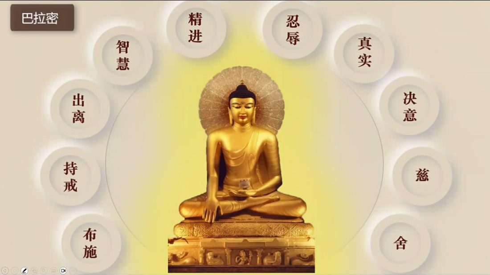

📅 最近更新：2026-09-29 12:00　|　第5版精修（朗读优化版）

# 第2周：菩萨授记与巴拉密次序（主持人版）

> ⭐ **本讲主持人速览**（新主持人必读，2分钟看完）
>
> 你不是老师，是"共学同行者"。你不需要提前懂内容，只需要按流程走。
> **本周由连续两周内容合并**而成，含两段共读、两轮分享与两轮讨论，单讲 120 分钟。
>
> | 环节 | 标准时长 | ⏱ 时间不够→ | ⏱ 时间富余→ |
> |:-----|:----:|:-----|:-----|
> | 🧘 静心开场 | 10 min | 缩至5 min | 加2分钟静坐 |
> | 📖 共读原文1 | 20 min | 只读★核心段（约15 min） | 加读◈扩展段 |
> | 💬 第一轮分享 | 10 min | 每人1句话 | 每人3分钟 |
> | 🎯 第一轮主题讨论 | 10 min | 只讨论问题① | 讨论全部问题+扩展 |
> | 🧘 禅修练习 | 15 min | 缩至8 min（只念引导词前半） | 延长至20 min |
> | 📖 共读原文2 | 20 min | 只读★核心段 | 加读◈扩展段 |
> | 💬 第二轮分享 | 10 min | 每人1句话 | 每人3分钟 |
> | 🎯 第二轮主题讨论 | 10 min | 只讨论问题① | 讨论全部问题+扩展 |
> | 🔚 收尾与回向 | 15 min | 缩至10 min | 保持 |
>
> **主持人10条守则（精简版）**：
> ① 不讲解、不提供答案——让原文自己说话；② 有人问"正确答案"→说"先听听大家的看法"；③ 冷场→主持人先分享自己的真实感受；④ 跑题→温和拉回："这个有意思，我们回到今天的原文"；⑤ 争论→"两种看法都很好，大家保留自己的理解"；⑥ 确保人人发言；⑦ 不评判任何人的分享；⑧ 时间到了就推进；⑨ 禅修练习照读引导词即可；⑩ 结束一起回向。

> 本周主题：**菩萨授记——须弥陀（善慧）于燃灯佛前发至上愿、以身作桥，当众受记；受记后省察十巴拉密并排定其次序**。

## 📋 本周信息卡

| 项目 | 内容 |
|:----|:-----|
| 时长 | 120分钟（4周版 · 9环节） |
| 核心问题 | ；菩萨受记之后做了什么？「省察巴拉密」省察的是什么？十巴拉密为什么按布施→持戒→出离→智慧→精进→忍辱→真实→决意→慈→舍这个次序排列？ |
| 共读原文 | 共读原文1：材料①《巴利三藏中的菩萨道思想04-菩萨授记-古源尊者-20250624》　｜　共读原文2：材料①《巴利三藏中的菩萨道思想05-省察巴拉密、布施巴拉密1-古源尊者-20250625（音声）》 |
| 本周作业 | ；①简答题：十巴拉密的先后次序是怎样的？请用自己的话说出「布施先于持戒」「忍辱先于真实」的次序理由各一条。②实践题：本周挑一次自己做过的布施（供养、帮忙、捐物、让座都算），事后安静回想它的「前思、中思、后思」——布施前的起心、布施中的心、布施后的随喜，只记录、不评判。③省察题：从十条巴拉密里选出你自己**最亲近**的一条，写下它对你个人意味着什么。 |

## 🧘 静心开场（10 min）

> 💬 **破冰｜3–5分钟**：先让呼吸落下来。这周有没有一个瞬间，你为别人多做了一点点、对方却未必知道？一句话说说那个瞬间，说完就放下。

> 🛡️ **心理安全三约定**（每次开场在心里过一遍）：① **保密**——这里说的话不出这间屋子；② **不评判**——不评价任何人的分享，也不急着评价自己；③ **可随时暂停**——任何时候觉得不舒服，都可以停下来休息、喝水或离开，不需要解释。

**主持人引导语**（照读即可）：

> 我们先静坐一分钟。闭上眼睛，感受自己的呼吸，让心慢慢安静下来。（停顿60秒）
> 今天是《菩萨道思想（一）》读书会的第三周。前两周我们认识了"三种菩提、三种菩萨"，也把"十种巴拉密"的框架搭了起来。这一周，我们把镜头拉回到最初——回到四个阿僧祇劫又十万大劫之前，回到一位名叫须弥陀的婆罗门面前。他还不是菩萨，他只是一个看透了生老病死、想找一条出路的人。
> 他后来做了一件事：当他看到燃灯佛走来时，他解开自己的头发，铺在泥坑上，趴下来，让佛陀和四十万阿罗汉从自己的背上走过去。那一刻，他发了一个愿——不是"我要解脱"，而是"我要成佛，好把一切众生从轮回的苦海里救出来"。这，就是菩萨道的起点。
> 今天我们不急着感动，也不急着评判。我们先把这段故事**完整地读一遍**：他为什么出家？他凭什么被授记？被授记之后又发生了什么？然后我们慢慢聊——不是聊"我够不够格"，而是聊"这份无我的利他心，究竟是怎样一种心"。
> 先约定一件事：故事里有"舍身"的情节，我们**尊重它、体会它，但不模仿它、不追求它**；今天只要有一句愿文让你心里动了一下，就不虚此行。

---

## 📖 共读原文1（20 min）

> ⚠️ 主持人操作：以下为完整原文文字，可直接照读或让大家轮流朗读，无需查知识库。出处信息见各材料下方；音声转写段落前的时间码（如[00:01:52]）是出处标记，朗读时跳过不念；（ ）内为整理注记，同样跳过不念。★核心必读；◈扩展时间富余时读。

### 原文材料①：★核心·巴利三藏中的菩萨道思想04-菩萨授记-古源尊者-20250624（依据录音转写整理，已校对明显同音错字）

- **文件**：《巴利三藏中的菩萨道思想04-菩萨授记-古源尊者-20250624》

> ⚠️ 主持人操作：本材料为★核心，30分钟共读的主体。时间紧张时**只读★核心段落**（第一、二、三、六、八、九节）；[00:29:25]–[00:33:05]「如何判断自己是否已被授记／弥勒佛时节」为延伸讨论段，可略读；十波罗蜜**逐条省察**留待第4周。音声转写口语化，照读即可。

- **文件**：巴利三藏中的菩萨道思想04-菩萨授记-古源尊者-20250624（音声·★核心）

[00:01:52.480] 昨天我们学习了标。成就十种巴拉密的十六种素质。今天，我们来看看。我们释迦牟尼佛。他成为菩萨的这个故事。释迦牟尼博士在。燃灯伯的座下受记的。那么从燃灯佛到我们现在，是过了四个阿僧祇，又十万个大劫。也就是在四个阿桑奇加十万个大劫之前？菩萨出身。所以那个时候，是一个有一个叫很繁荣的城市，叫不死城，叫阿玛拉瓦达，阿玛拉瓦蒂，或者这是一个在很多方面都很好的城市，好，它很美丽，这个人们，感到生活很幸福。那么在这个不死城里面，

[00:03:10.465] 有一个叫苏梅达，我们过去翻译成须弥陀或者妙智的婆罗门。这个婆罗门，很多人认为婆罗门可能以前就是印度教，它只是婆罗门被印度教这个这么称谓而已，这个婆罗门，它就是不拉。布拉曼？阿曼？它就是梵天的意思。对，所以他在梵语里面就波拉曼，波拉曼就是婆罗门，这波拉曼呢就是梵天。所以那么梵天就是那种这个什么意思？即那么他们在日日常的时候修行，想投奔到梵天去的那些人，早期的是这叫波拉曼，叫婆罗门。后面，演变成婆罗门只是祭祀，只是诵经，它都已经异变了。

[00:04:06.830] 所以那么这个婆罗门，有一天，他正在这个房子的，他这个大房子楼上，在打坐，他就想，就是这个生是很苦的。这个生命最终要毁坏，也是很苦的，那么会受到老的折磨，以及？死的时候稀里糊涂的好像愚痴的死去，他也是很苦的。这个苦，这个我们讲过，这叫杜康，在梵语或者巴利都是叫杜卡。杜卡，那就是不圆满，受逼迫会怀灭，这个不恒常的这样一种生存状态，称为杜抗。那么。这个苏弥陀，须弥陀，他认为这些都是逃不过去的。所以只要有生，就有老病死。

[00:05:03.670] 怎么样去寻找能够熄灭老病死的，以及这种恐惧的涅槃？

[00:05:03.670] 怎么样去寻找能够熄灭老病死的，以及这种恐惧的涅槃？

[00:05:11.020] 如果我能够毫不执着的舍去这个充满尿，粪脓，血，胆汁，痰，唾液这些很污秽的身体，那不是很美妙吗？所以一般人来讲，我们都觉得这个身体很重要，很美妙，那么菩萨的角度来看，就是充满了脓血，这个肚子里都是粪便呐，都是痰，都是唾液，这没有任何可美妙的。那须须弥陀，他就认为说，肯定有一个能够去向这个寂静的，不受生命束缚的这样一个道路，不可能没有。我一定要去寻求，这个涅槃之道，以便突破生命的束缚。

[00:05:55.880] 那譬如这个世界，有苦也有乐，同样的，一定有导致苦的生死轮回，也一定有导致灭苦的涅槃。那再一个？有热必定有冷，同样的，有贪嗔痴之火，必定有熄灭这三种火的涅槃。再者，有恶业也有善业，同样的，有生不一定有子息再生的涅槃。

[00:06:20.720] 过后，他在深入的思维，譬如有一个人掉入粪坑，而沾满粪的人看到远处有一座五种莲花点缀的清澈的水池。如果他见到这个水池之后，仍然不肯去找出通向它的道路，这个不是水池的错误，错误而是他自己的错误，就是他浑身都是粪呐。看到有一个清澈的湖水，他不想去洗，它不是湖水的错，而是自己的错。那么，这个世界上有不死的涅槃池，可以供我们清洗心中的烦恼。但是人们如果不去寻找这个涅槃池，就不是涅槃的错。

[00:07:02.480] 那么再者？如果一个人被敌人所困，但看到有路可逃，但是他却不逃。那这个不是那条路的错，同样的，如果人为烦恼之敌所困了，见到通往安全的涅槃京城的大道依然不愿逃跑？这也不是那条大道的错。

[00:07:26.060] 如果一个人患上重病，遇到名医却不求医，那不是医生的错。

[00:07:32.010] 同样的，一个人受到烦恼之病的折磨，有名师而不求教，这不是导师的错。他这样省察以后，再观察如何舍弃自己的身体。他就想说，如果一个人肩上有一个动物死尸之负累，他将舍弃这污秽的尸体，自由自在的与快乐的任意漫游。同样的，我将舍弃这个实际上只是充满各种虫类和不净的实体，而去向涅槃城。那如果一个人在厕所里面，这个排便就他排完以后会毫不犹豫的离开。

[00:08:12.550] 同样的，我将舍弃充满各种种类不尽的身体，而走向没有生命困扰的涅槃。如同一位船主拥有一艘陈旧损坏、腐烂和破漏的船，他厌恶的舍弃它，同样的，对于这个有九个孔洞不断的流出污秽身体的身躯，我将舍弃他而走向涅槃。

[00:08:40.020] 如果有个身体，有一个人，身怀巨宝，他不幸和强盗同途，而见到强盗对聚宝觊觎的危险，他将舍弃宝贝逃至安全之地。同样的，由于上业被盗之危险，很时常令我感到恐惧，我将舍弃有如首要强盗的身体，就这个身体，就这个强盗。而寻求一条道路与通往，肯定会带来安全快乐的涅槃。那么这个菩萨通过这样的种种的这种角度，或者比喻的方式来省察了这个身体的不堪以后，他身体出理。

**二、舍财出家与大布施（觐见国王·鸣鼓遍告·平等大施）**

[00:09:30.580] 所以这个须弥陀，大家就去想，累积了很多财富之后，

[00:09:34.830] 我的祖父，父亲，乃至上至七代的祖先在去世的时候连一个钱币都带不走。然而，

[00:09:44.230] 我将找出一个方法，以带他到涅槃之后，他就去觐见国王。他说，陛下，由于我心中充满了对生老病死引起之苦的恐惧。我要出家为隐士，成为修行人，我有好几千万的财富，请您收下。那国王说，我不想要你的财富，你可以用任何方式去处理它。那须弥陀说，好好的陛下，这个然后他在不死城的各地击鼓宣布，谁要钱财都来把它拿走。他以平等心不分等级的，分发财产以实行大布施。然后我们后面再讲布施波罗蜜的时候会再细讲这个。那么做完这个大布施以后，我们的须弥陀，他就出家了，自己离开了。

**三、前往喜马拉雅山·证八定五神通（依《佛种姓经》）**

[00:10:36.950] 那么根据佛种姓经里面描述须弥陀菩萨的故事？他是在这个大布施之后。那这个去修行，然后在这个喜马拉雅山，他到喜马拉雅山区，然后去修行证得五神通，那么这个。

[00:11:00.540] 这个故事，这个过程，就是我们一开始的时候讲，就是佛陀在他的家乡迦毗罗卫城示现双神变。那么舍利弗尊者，这个感受到了，他就以神通跑到佛陀的面前，

[00:11:17.890] 请佛陀讲，佛陀是如何成佛，就这么了不起的佛陀。

[00:11:25.365] 那佛陀，就跟舍利弗讲说，舍利弗当时须弥陀菩萨就是我如此省察以后，我决定出家，把数千万的财产平等的布施给贫者或者富者，之后向喜马拉雅山前进。

[00:11:41.760] 那离喜马拉雅山不远处，有一座山名为如法。因为古代的圣人修习正法的地方，所以很多人就把那个地方称为儒法山。那么在儒法山区，我建了一所优美的禅园和一间精致的草屋。那在鲁法山区，我建我造了一条没有五种缺陷的新型小道，我造了一所能够令人获得隐士的八种舒适的禅园。成为出家隐士之后，我开始修习止禅和观禅，以证得八定和五神通。我舍弃有九种缺陷的服装，披上了有十二种美德的袈裟，我舍弃了有八种缺陷的草屋，而走向有十种美德的塑像。

[00:12:33.380] 我完全不吃耕种得来的谷物食物，只吃从树上掉下来的水果。我不躺下，身体以坐立和行三种姿势，我精进的禅修在七天之内，我证得了五种神通。首先，他是布施，然后出家，然后去到喜马拉，喜马拉雅山开始，他只建了一个禅园，一个心行小道，很优美。后面他觉得说，那我是来修行，不是去找一个山野，找一个我们说森林小屋，所以他把小屋也舍掉了。然后最后他只是在树下住，最后这七天之内，他就证得了五种神通。

**四、燃灯佛出世·须弥陀错过瑞相**

[00:13:13.720] 那么，在须弥陀隐士成就了圣洁的修行和证得八定五神通之后？在那个时候，那个世间，就出现了三界至尊的燃灯佛。

[00:13:27.060] 那比邦嘎拉这个。巴利叫迪班达拉，那么这个燃灯佛出世的时候，三十二种瑞象，包括有一万个世界震动。那么在燃灯佛出现的四个阶段？也包括入胎。

[00:13:48.360] 出生证悟佛果和初转法轮，那每一尊佛陀都会有经历这样入胎出生证悟佛果和初转法轮。那么这四个阶段，须弥陀呢都没有觉察到这个瑞相，因为他自己完全沉浸在八种禅定里面。这个燃灯佛他成佛之后，这个在这个妙乐居叫这个苏南叫苏南达拉，这苏南达拉，这个叫妙乐居的地方，像有一万亿的天神和人的出转法轮。我们释迦牟尼佛出掌法轮，人间，就是五个比窟，五个比丘，天上也是有很多人的，那燃灯佛的出场，法轮有一万亿的天神。

## 💬 第一轮分享（10 min）

**主持人引导**：

> 请大家轮流分享：读完这几段文字，最触动你的一句话是哪一个？为什么触动你？
> （主持人先分享自己的，然后按顺序轮流。这一轮只说不评论。）

---

**起手问题**（任选1个，避免每人答同一题）：
- 材料①里，须弥陀一开始只是"看到生老病死，想找一条出路"的人——你最初接触"修行""解脱"这类词，是什么契机？
- 故事里，须弥陀"有能力用神通一秒修好路，却选择用自己的身体一筐一筐地搬泥"——你生活中有没有过"明明有捷径，却选择老老实实做"的时刻？
- 如果你是须弥陀，站在燃灯佛面前、眼看四十万阿罗汉要走过来——你会怎么做、怎么想？

---

## 🎯 第一轮主题讨论（10 min）

**主持人引导**：朗读下面3个问题，让大家自由讨论。**你不提供答案**，只引导。

**讨论问题（按优先级）**：
- **问题①（★必答，时间不够时只讨论这个）**：材料①说须弥陀"若我愿意，今天即可成为一个漏尽的阿罗汉"，但他选择"付出至善的精进力，以证得正等正觉……再去解救一切众生"。用你自己的话说：同样一条"解脱"的路，为什么有人选择先走、有人选择陪着大家一起走？这两种选择，你更理解哪一种？（提示：没有标准答案，也不评判高下。）
- **问题②（◈选答）**：授记需要具足八个条件——其中包括"遇到一尊活着的佛陀""有无量的大悲心与至善愿"等。材料①提醒我们"重点要放在如何成为真正的菩萨"，而不是急着"如何成佛"。这句话对你有什么触动？在你的日常里，"成为真正想利他的人"具体可以是什么样子？
- **问题③（◈选答，时间富余或大家感兴趣时讨论）**：须弥陀以身作桥、须弥多献出五朵莲花——两个人都把"自己最珍贵的东西"交了出去。你觉得"布施"里最难的，是舍掉东西，还是舍掉"我舍不得"的那个念头？（对照材料④："布施外物为普通、布施身体为中等、布施生命为究竟"。）

**每问提示**：①先读原文一句，再谈感受；②当有人往"我够不够格"方向去时，温和拉回："今天的原文讲的是'一条道路'，不是'一场考试'。"③若有人被"舍身"情节带动起情绪，先做两次深呼吸，再继续。

---

> **分层追问**（可视时间取用，由浅入深）：
> - 【现象】须弥陀在燃灯佛前做了什么？他发下的愿是什么？授记要具足哪几个条件？
> - 【影响】如果把心力先投给一件很久以后才成的事，你现在有没有这样的对象？
> - 【应对】这周为一件大概看不到回报的事，悄悄做一件小的，做完就放下。

## 🧘 禅修练习（15 min）

### 练习一

> ⚠️ **禅修禁忌提示**：若你正处在严重抑郁、焦虑、创伤后应激，或精神类疾病的发作／用药期，或正经历强烈的情绪危机，请先咨询医生或心理师，再决定是否练习；练习中若出现明显不适（如心悸、胸闷、情绪失控），请立即停止，睁开眼睛，把注意力放回呼吸与身体，必要时离场休息。

> 本引导词为照读版（依本周材料①"以身作桥、发至善愿"与材料④"发愿"整理而成；括号内为操作提示与停顿，不念出来）。照读约3分钟，静坐约8分钟。

**主持人引导语**（照读即可）：

> 请大家自然地坐好，坐舒服就好——散盘、单盘或坐在椅子上都可以。让身体像一棵树，稳稳地扎在大地上；双耳与肩膀大致在一条线上，沉肩坠肘。（停顿5秒）
> 轻轻闭上眼睛，先做三次深长的呼吸，让身体松下来。（停顿10秒）
> 现在，在心里想起一盏灯——一尊古老的佛，燃灯佛，正一步一步地走近。他的周围，是四十万位清净的圣者。你不需要看清任何形象，只需要知道："有一盏灯，正在走向我。"（停顿15秒）
> 想象你就是须弥陀——不是要你趴下去，也不是要你舍掉什么，只是请你体会他当时的那一念心：他想的不是"我会不会痛"，而是"但愿这些圣者能安稳地走过去，但愿一切众生都能走出苦海"。把这一念心，轻轻地、安安静静地捧在心口。（停顿30秒）
> 接着，把这一念心转向你生命中的人——先是你自己，再是你爱的一个人，然后是一个你不太喜欢的人。在心里对他们各说一句："愿你平安，愿你离苦；愿我得道时，能真的帮到你。"（停顿30秒）
> 如果你心里升起"我做不到"的声音，没有关系——看着它，不必赶它走。真正的愿，不是从"我足够好"开始的，而是从"我愿意"开始的。（静默约2分钟，主持人不再说话；腿麻了、想动了，可以很慢地调整姿势，再回到这一念心。）
> 好，现在把注意力放回身体——感觉坐垫、脚、呼吸。轻轻动动手指和脚趾，正念地搓搓手、搓搓脸，慢慢睁开眼睛。（停顿10秒）
> 记住此刻心里那一念"愿意利益他人"的柔软——它不需要很强大，它只需要还在。

---

### 练习二

> ⚠️ **禅修禁忌提示**：若你正处在严重抑郁、焦虑、创伤后应激，或精神类疾病的发作／用药期，或正经历强烈的情绪危机，请先咨询医生或心理师，再决定是否练习；练习中若出现明显不适（如心悸、胸闷、情绪失控），请立即停止，睁开眼睛，把注意力放回呼吸与身体，必要时离场休息。

**（主持人引导语，照读即可；本周练习为「布施随念」——回想与随喜自己曾给出的善意，以体会「思心所」与「后思欢喜」）**

> 各位法友，请调整到舒适的坐姿，轻轻闭眼，做三次深长的呼吸，让身体沉下来、松下来。
>
> 现在，把注意力带到心里。我们来做一个练习，叫「布施随念」——不是盘算我布施了多少，而是**去感受一颗「想给的心」是什么样子**。这颗心，材料①叫它思心所。
>
> 请在心里，慢慢想起一件你做过的、给出去的事——可以很小：给晚归的家人留了一盏灯，给陌生人让了一次座，给基金会捐了一笔钱，或者只是耐心听一个朋友诉苦。挑一件能让你心里**微微发热**的，就好。
>
> 想起它的时候，请留意三件事：
>
> **第一，想起「布施之前」的那颗心**——你当时是怎么起的念头？是犹豫了一下，还是自然就给了？只要知道它，不必评价。
>
> **第二，想起「布施当时」的那颗心**——你把东西递出去、把话说出口的那一刻，心里是清楚的、清凉的，还是有点紧张的？知道就好。
>
> **第三，也是最容易忽略的——想起「布施之后」的那颗心**。材料①说，布施之后要「随喜」——想到「我今天完成了一件给出去的事」，心里升起一点暖意、一点欢喜。请就让这份欢喜在心里多停一会儿，并且对自己说：**「这一份心，是我今天练到的。」**
>
> 如果想起某一次「给完却后悔」，也没关系——那只是说明，我们还在练习。让它在心里待一会儿，然后轻轻地，把注意力带回呼吸，带回身体，回到当下。
>
> 最后，我们把这个练习里的这份善意，轻轻送给一切众生：愿一切众生，都有能力给出去，也都有机会被善意接住。好，慢慢睁开眼睛。

**（主持人操作）** 本周练习意在「体会发心」而非「盘点成绩」，全程语调温柔、不加评判。若时间紧（约8 min），只做「想起一件小事→感受前思中思后思→随喜」三步。**参考变体**：录音后段的原课实修是「白骨观」（材料①[01:07:40.440] 起），若本场学员已修过业处、且想接续原录音，可改用白骨观引导（从后脑勺白骨起、逐一扫描、默念「白骨·可厌」）；但本周主题是省察与布施，**建议仍用「布施随念」**，白骨观留作个人自修参考。

## 📖 共读原文2（20 min）

> ⚠️ 主持人操作：本周共读两份材料。**材料①是口述版**（善慧菩萨受记后逐一省察十条巴拉密的素质，以及布施巴拉密之思心所、二十二类与三层次），段①「十巴拉密逐一省察」是**必读核心**，段②「布施巴拉密」**选读**（二十二类可只读前六类与『智相应施／如法施』两类）；**材料②是幻灯片文字版**，其中〈在布施之后即举出持戒〉至〈在慈之后即举出舍〉是**「次序理由」的纲要**，务必读到，逐一省察与布施分类可摘读。共读时只念不解释；名相点到即止，解释留到分享与讨论。材料①中〈下蛊〉〈出家签〉〈出家人六百八十万〉等个人见闻可**摘读**或跳过，不逐字念完。以下照录均为逐字原文，供法友轮流照读。

> 朗读节奏建议：材料②〈逐对次序〉一长串，可请一位法友慢慢念「布施→持戒……」，另一人同时把次序写到白板，念完对照一遍；材料①「什么是布施呢」这段照读原文、不加工。读到的巴利名相（思心所、pāramī、upekkhā）不必当众纠正，事后轻声提示即可。

### 原文材料①：★核心·巴利三藏中的菩萨道思想05-省察巴拉密、布施巴拉密1-古源尊者-20250625（音声）（依据录音转写整理，已校对明显同音错字）

- **文件**：《巴利三藏中的菩萨道思想05-省察巴拉密、布施巴拉密1-古源尊者-20250625（音声）》

> ⚠️ 主持人操作：只照读下面两段——①「十巴拉密逐一省察」（[00:00:18.200]–[00:27:29.200]，必读）；②「布施巴拉密」（[00:27:29.200]–[01:07:40.440]，选读，二十二类可摘读）。录音后段（[01:07:40.440] 起）为随堂实修「白骨观」，与本周主题无直接关系，**本讲不照读**经录音转写，原文中「波罗蜜／波罗密」「思／私／诗／师」等混用连同音错字一仍其旧，未作改写；括注（）内为整理注记，朗读时跳过。

[00:00:18.200] 这个展我们一起来，历经佛陀。南无大巴，嘎瓦多，阿多萨萨，蒙嘎萨，南无卡瓦多，阿多萨萨萨。南无卡瓦多，阿拉多萨萨。礼敬那位世尊，阿拉汉正自觉者，尊敬的各位法师，各位居士，大德晚上吉祥，昨天我们讲到。

[00:01:09.200] 我们的菩萨须弥陀。善慧菩萨，他在被燃灯佛授记之后。那他思维省察。到底如何修菩萨道？如何成佛？他醒思了。如果要成佛，需要。

[00:01:34.460] 完整的修习十种波罗蜜，分别是布施、持戒、出离、智慧、精进、忍辱、真实、决一词和舍。也就是，在布施之后，来举出这个持戒，在持戒之后，举出出离。那在出离之后，举出智慧，在智慧之后举出精进，在精进之后举出忍辱，在忍辱之后举出真实上降，在真实之后举出决议，或者决心。在决议之后取出词，在词之后取出舍。

[00:02:21.240] 那昨天，我们也学习到了，这个他这样为这个找到这样的修学次第，然后呢就深入了思维了什么是。On.布施波罗蜜好那深入的省察，什么是布布施波罗蜜那。他。菩萨，也深入的省察。什么是持戒波罗蜜？根据著书讲，就戒律是甘露法雨，能够洗净，连恒河之水也洗不净的内心烦恼。建力是良药，能够医治连同檀这个樟檀香木也治不好的贪婪之火。他是智者的庄严，不于凡人的服饰，就像。项链，皇冠，耳环这个一样，它是一种天然的香，香味广播四方，我们叫戒香，

[00:03:33.330] 而且它适合于任何情况。它是一个具有吸引力的卓越的咒语，能够获得顽石及婆罗门的贵族天神和梵天的尊敬和顶礼。

[00:03:47.750] 一个持戒的人，会被天神梵天所护持尊重。它是正修，禅那和神通的方便也是通往涅槃。大道涅槃城的大道。也是三种觉悟，我们讲的正等正觉，辟支佛和弟子觉悟的根基，由于他实现持戒者所有的愿望，因此，它比愿望宝石和宝树更优越。所以菩萨这样的省察持戒的素质。

[00:04:22.860] 在著书里面，有介绍了一个叫火运辟E菌，或者叫燃烧辟E菌。Now.这个是佛陀在后来讲法的时候讲到的，就是不持戒的害处。

[00:04:38.720] 那当时，佛陀跟比丘众，在狗萨叫乔萨罗国在游行。他当时看到一堆火，那佛陀，就这个离开到那个那条道路，坐在一棵树下，那坐在阿难尊者给他铺的这个座位。那然后他就问这个大家说做比丘那是哪一种比较好？是坐着抱着一团烈火好，还是坐着抱着一位身体柔软，触觉美妙的少女更好？那很多比丘讲说，那当然抱着少女会比较好。佛陀说，就是对不持戒的人来说，抱着烈火是比较好的，因为只会让他痛苦一生。然而，抱着少女，将导致他投生恶道。

[00:05:33.060] 过后，佛陀就问，大家说是给一个强壮的人折磨鞭打，双脚至皮肉骨头都破裂粉碎比较好，还是享受信徒的顶礼比较好？是给一个强壮的人以尖利的矛刺穿胸膛比较好，还是接受信徒的顶礼比较好？是给一个强壮的人以一块烧得火红的铁片，这个紧捆全身比较好，还是穿用信徒布设的袈裟比较好？是给一只烧得火红的器具拉开嘴巴，再投入一粒烧得火红的铁球，以烧掉从口唇、口腔、舌头、喉、胃肠道、肛门的全部内脏比较好？

[00:06:19.530] 还是食用信徒而布施的食物比较好？是给一个强壮的人抓紧头肩，再强压下去，坐或躺在一个烧得火红的铁床比较好？还是用性这个，受用信徒布施的床比较好？是头上，脚下给一个强壮的人抓着抛进一个大铁锅，这个烧的火滚的这个铁织女比较好？还是这个没有惭愧的住在信徒布施的寺院比较好？

[00:06:56.160] 那么对于。后面这个的六个问题，有很多的出家人呢都给出了前面那种无知的问答，就是像说抱着一个柔软的少女比较好。那佛陀给的解释都是第一题了，即对于不持戒的人，这个双脚更加撕裂，打碎，这个他只是受苦一生。反之，如果无惭无愧，我们没有持戒的，或者不省思的受用信徒的顶礼，受用信徒的顶礼，将会导致投生恶趣，在漫长的日子里遭受极端的痛苦。所以佛陀，逐一的讲完以后，

[00:07:38.110] 说，为了带给布施的信徒最大的利益和使自己在僧团里的生活有益，比丘必须致力于商学，希望带给自己他人福利的比丘。必须时时刻刻保持正念与精进，开始结束以后，

[00:07:55.415] 据说，有六十位不持戒的比丘当场吐血，有六十位犯了轻戒的比丘马上还俗，还有六十位持戒清净的比丘，证得阿拉汉果。所以，那么我们必须这个省察持戒的性质，就是持戒清净的人欢喜的想，我做了一件毫无错误的善业，他保护我得以不受伤害。他不会受到自责或者自责谴责的这个烦恼，对他来说，惩罚与投身恶道是不可能的事情。所以智者，会称赞说，这是一个有德行的人，他跟没有道德的人是不一样的，因此，他不会后悔。

[00:08:39.190] 持戒是安全的基础，因为它是正面的根本原因，而且带来众多的利益。那譬如如果他持戒，可以避免失去法财，那么对于在家人来讲，持戒也可以避免失去财富，它能去除不善业，因此，它是我们幸福和快乐的主要的来源。

[00:09:05.260] 所以很多在家人问说，这个没有功德怎么办？持戒就够了。对，转个念，全心全意为众生服务就够了。那即使是一个出身低微的人，当他具有道德的时候，也会受到出身高贵的王族婆罗门的尊敬。

[00:09:23.850] 在沙门果经里面，这个当时的卫生愿王，就问佛陀说，你们出家人，这个有什么样的好处，

[00:09:33.525] 佛陀第一个就讲说持戒，因为持戒有戒的功德。持戒的成就，高于高贵的出身，就是一个高贵的出身，他是过去的善业的成熟，但高贵的出身并不代表他未来生还能高贵。如果他不造作善业的话，但是一个贫穷的持戒的人，他一定在未来生，会高于这个高贵出生的人。道德的财富，超越外在的财富，因为他不会受到这个水果王贼这些无敌的威胁。他会跟随我们去来世，带来极大的利益，也是修习定和慧的基础。

[00:10:23.560] 昨天我们讲到说大明居士问佛陀说我下辈子也想好怎么办？佛陀说，第一个信佛，第一个持戒，对。所以这个即使所谓的世界统治者也控制不了自己的心，而只有持好戒律的人，可以控制自己的心。因此，持戒优于国王的权利。

[00:10:47.520] 这个我在缅甸的时候听到有一个长老讲。说当时，这个缅甸国王就在一个山上，见到一位修行的苦行人，就非常的尊重他，然后把他请到皇宫来，然后这个为他专门建立了一个教派，在缅甸叫水晶派。那这个他当时感叹即这个你们出家人真是很了不起，

[00:11:20.950] 就有两点我做不到第一天，第一个，就是这个一天只吃一餐饭，我做不到，那个，就是一辈子不找女人，我做不到，那这个所以你们比我了不起，这个就是戒德。即一个，自在山上苦修的人，他没有任何外在的财富，但是过往遇到他会顶礼他，会尊重他。所以有道德的人甚至可以受到敌人的敬仰，也由于他不会受到老病厄运的征服，因此他的德行超越了外表的美丽。

[00:12:00.480] 那一个人，就想说男人女人，男人想长得更加的这个令人，这个惊讶。女人想看，看起来更加美丽，但是要内心有这样的美德，她就会美丽。由于它是天界和涅槃之乐的基础，因此它远比世界上最好的楼阁和皇宫都更可贵，也远比最高阶级的国王、王子和大将军更高贵。持戒也比关怀你的幸福的亲戚朋友来得更好，因为它真正带给你福利和利益，而且是紧随着你去到来世。

## 💬 第二轮分享（10 min）

**（分享规则，照读即可）**

> 我们先用二十来分钟，把刚才读到的法，接回自己的生活。规则很简单：**每人一到两分钟，说说这段话让你想到什么**；不评判、不纠正、不互相建议，只听。分享是邀请，不是点名；你不想说，静静听着也很好。今天的话题很容易变成「我做不到」，请记得——我们是在认识一条道路，不是在给自己打分。

**起手问题（择二三个，或自由分享）：**

1. 读到「十巴拉密」这个次序（布施→持戒→出离→……→舍），你的第一反应是什么？哪一条让你觉得最亲切，哪一条让你觉得最遥远？
2. 材料①说布施真正在动的地方是「想给的心」（思心所），还分前思、中思、后思。回想你最近一次给出去（捐物、帮忙、让座、供养），你的「前思、中思、后思」分别是什么样子？
3. 「省察」这个词，让你想到什么？你生活里有没有一件事，是你「先想透了才做得下去的」？菩萨修巴拉密之前先省察，对你有何启发？
4. 材料①里说，布施要「前思中思后思都好」才圆满。你是否有过「给的时候舍不得、给完却很高兴」或「给的时候慷慨、给完却后悔」的经验？

**（主持人提示）** 分享环节最容易跑成「经验比较大会」——谁捐得多、谁持戒严。一旦出现比较味，立刻温和地把话题拉回「那颗心当时是什么状态」。对沉默的学员，一个微笑、一次眼神邀请就够，不必催促。

## 🎯 第二轮主题讨论（10 min）

> 三个问题由浅入深，请按学员状态取用；每题先给大家静默 1 分钟，再开放讨论。

**问题一（由浅：先看懂「次序」）**：十条巴拉密为什么按「布施→持戒→出离→智慧→精进→忍辱→真实→决意→慈→舍」这个顺序排？请结合材料②的「逐对次序理由」，挑出你最能理解的一对（例如「布施先于持戒」），说说它「先后的道理」在哪。
- 提示：引导大家看到——**次序不是排名，是接力**。布施「利益他人」，持戒「不伤害他人」；先会给人，才更愿意守不伤人。让学员自己说出「前一条喂出后一条」的感觉。

**问题二（中等：省察与实修）**：材料①说布施的「施」是思心所——「有想给的心，才是布施」。那么，一次「随手清理仓库式」的施舍，和一次「把最喜爱的东西送出去」的布施，差别在哪里？这对我们平时判断「自己有没有在修布施」有什么提醒？
- 提示：指向「看发心不看数量」；可说：材料①特别提醒，「日行一善」与「一次供养五十万」不能只比数字——**每天练布施的心，才是被训练的东西**。落点落到「我今天有没有动过一颗想给的心」。

**问题三（深入：次序与自心）**：材料②指出，烦恼有「违犯性（戒止）→困扰性（止禅镇伏）→潜伏性（智慧根除）」三个层次，「出离」与「智慧」的次序正是照这个层次来的。请想一想：在你自己的经验里，**「身语上先做到」和「心里真的平静下来」之间，是怎样一个先后关系**？有没有哪一次，是你先「外面守住了」，后来「里面才慢慢跟上」？
- 提示：这是本周最贴近实修的一题。引导学员体会「戒→定→慧」在个人生命里的实际顺序；也提示：反过来也有——若心里太乱，先靠持戒「外护」让身语稳住，往往是可行的第一步。**不评判任何人「修到哪个层次」**。

**（心理安全提示，念给学员听或自己把握）**：今天谈十巴拉密、谈布施持戒，很容易让人开始盘算「我修到第几条了」。请记住两句话：**第一，布施看心态不看数量；第二，忍辱不是压抑，次序不是排名。** 我们这一周，只是来认识一条道路长什么样；你走在哪一段、走多快，都是你自己的因缘，值得被尊重。

> **分层追问**（可视时间取用，由浅入深）：
> - 【现象】十条巴拉密按什么次序排列？布施为什么排在持戒、出离之前？
> - 【影响】回想你做成的一件事，是先想清楚每一步，还是边走边理清的？
> - 【应对】这周挑一件要做的难事，先只写下它的先后次序，别急着动手。

## 🔚 收尾与回向（15 min）

### 收尾一

1. **每人一句话**：今天最大的收获是什么？
2. **下周预告**：下周我们进入"省察巴拉密与十巴拉密的次序"——须弥陀被授记之后，是怎样一条一条地省察十种波罗蜜的？为什么布施排第一、舍排最后？十种波罗蜜的顺序里，藏着怎样的修行逻辑？主题是"省察巴拉密与十巴拉密的次序"。
3. **本周作业**：
   - 用一个比喻，把"我想利益众生"这份心，写成三句话（不必带"成佛"二字），下周带来分享。
   - 小提示：不必求"高大上"，柴米油盐里的一念善意也算；写不出来也不必勉强，留意到"我想写"的那一念，就已经在路上了。
   - 进阶（可选）：每天用一句话记下当天"为别人着想的那一念心"，几周后回看一遍。
4. **回向**（一起念）：

> **愿我此功德，导向诸漏尽！**
> **愿我此功德，为证涅槃缘！**
> **我此功德分，回向诸有情！**
> **愿彼等一切，同得功德分！**

---

### 收尾二

**（总结引导，主持人说）**

> 我们今天读了两件事：**一是「省察」，二是「次序」。**
>
> 「省察」告诉我们：菩萨不是拿到清单就做，他是先把十条道路一条条在心里想透——布施到底在舍什么，持戒到底在护什么……想透了，做起来才不慌、不动摇。这对我们的启发是：**修行不必急着「做到」，先允许自己「想明白」。**
>
> 「次序」告诉我们：这十条不是十个并排的格子，是一条接力——布施喂出持戒，持戒托起出离，出离点亮智慧……一路到「舍」。次序不是排名，是「谁在扶谁」。今天你最亲近的那一条，无论它在顺序里排第几，都已经是你道路的一部分。
>
> 有一句话，请带回家：**布施看心态不看数量，忍辱不是压抑，次序不是排名。** 我们都是在这条路上走的人，走得快、走得慢，都被尊重。
>
> 下周，我们进入第 5 周——**布施、持戒、出离波罗密**，按今天排好的次序，把前三条道路一条条走进去。带着今天这份「认识道路」的心，下回见。

**（回向词·四句，请全体合念）**

> 愿我此功德，导向诸漏尽；
>
> 愿我此功德，为证涅槃缘；
>
> 我此功德分，回向诸有情；
>
> 愿彼等一切，同得功德分。
>
> 萨度！萨度！萨度！

**（主持人操作）** 收尾控制在 15 分钟内。总结务必点回「省察＋次序」两条主线，并落到「发心优先」的心理安全基调；下周预告一句话即可。回向不可省——这是把全场功德导向一切众生的护栏。

## 📌 本讲主持人特别提醒

- **⚠️ 心理安全第一（本讲重点）**：本周含"以身作桥、舍身求法"等强烈情节——请务必守住：**舍身故事不煽情、不鼓励模仿极端行为，体会无我利他精神**。若有人把"舍身"理解成现实中伤害自己或家人，请及时、清楚地说明：这是表达"为法不惜身"的**心志比喻**，不是行为指令；日常生活中，护好自己的身心、照顾好家人，本身就是修行。
- **不焦虑、不比较、不发愿压力**：本周涉及"授记八法""成佛需四阿僧祇劫又十万大劫"等长远尺度。请特别提醒：**了解菩萨道是认识一条道路，不是衡量自己够不够格；发心与否皆被尊重，长短劫不制造紧迫或自卑。** 若有人问"我是不是菩萨／我被授记了吗"，统一回答："这是经典里的故事，不是用来给你我贴标签的——我们今天只是认识这条路。"
- **共读原文的操作**：材料①为录音转写整理，口语化，照读即可；时间码与（ ）内的整理注记是出处标记，朗读时跳过不念；"……"或（整理注）处为转写不清、据文意省略或补足，顺势带过即可。
- **材料②为PDF课件**：图形页 OCR 有两处乱码字符（已如实保留），"明行具足者"页文字被换行切碎、顺序错乱——若有人问，说明"这是课件结构图提取，文字顺序以图为准，我们取其大意即可"。
- **材料③为义注且中段有缺口**：中段约5100字符知识库提取未完整返回，已在照录与信息行注明；材料④为同一因缘的另一种译笔，可对照读。材料③④整体为◈扩展，时间紧张时整段跳过。

---

<!--EXT_READ-->
## 📖 延伸阅读（课后自由选读）

- 《巴利三藏中的菩萨道思想04-菩萨授记-古源尊者-20250624》——须弥陀与燃灯佛授记因缘、授记八条件。
- 《巴利三藏中的菩萨道思想05-省察巴拉密、布施巴拉密1》——受记后省察十巴拉密与其次序。
- 《譬喻义注 Apadāna-Aṭṭhakathā》——苏美陀出家、燃灯佛与善慧发愿因缘。
- 《本生义注-1 Jātaka-Aṭṭhakathā-1》——苏美陀舍财出家、须弥陀仙人发愿。
<!--/EXT_READ-->
