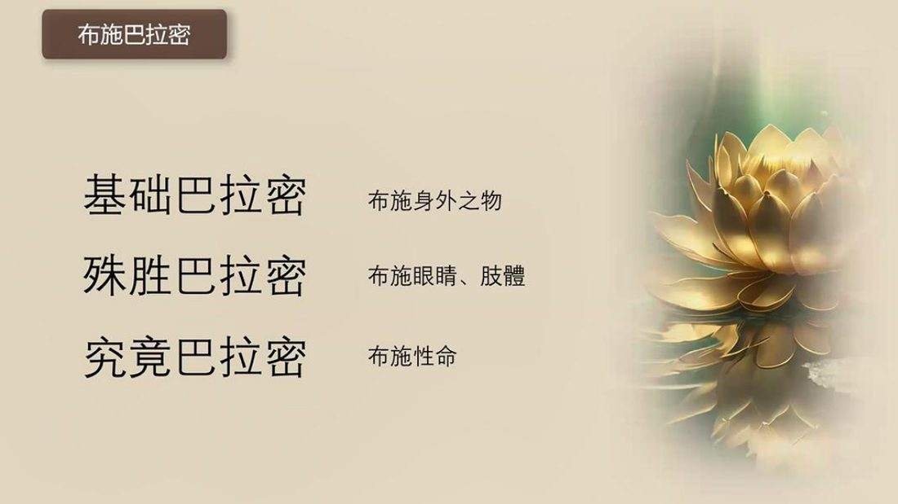

📅 最近更新：2026-09-29 12:00　|　第5版精修（朗读优化版）

# 第3周：布施持戒出离·智慧精进波罗密（主持人版）

> ⭐ **本讲主持人速览**（新主持人必读，2分钟看完）
>
> 你不是老师，是"共学同行者"。你不需要提前懂内容，只需要按流程走。
> **本周由连续两周内容合并**而成，含两段共读、两轮分享与两轮讨论，单讲 120 分钟。
>
> | 环节 | 标准时长 | ⏱ 时间不够→ | ⏱ 时间富余→ |
> |:-----|:----:|:-----|:-----|
> | 🧘 静心开场 | 10 min | 缩至5 min | 加2分钟静坐 |
> | 📖 共读原文1 | 20 min | 只读★核心段（约15 min） | 加读◈扩展段 |
> | 💬 第一轮分享 | 10 min | 每人1句话 | 每人3分钟 |
> | 🎯 第一轮主题讨论 | 10 min | 只讨论问题① | 讨论全部问题+扩展 |
> | 🧘 禅修练习 | 15 min | 缩至8 min（只念引导词前半） | 延长至20 min |
> | 📖 共读原文2 | 20 min | 只读★核心段 | 加读◈扩展段 |
> | 💬 第二轮分享 | 10 min | 每人1句话 | 每人3分钟 |
> | 🎯 第二轮主题讨论 | 10 min | 只讨论问题① | 讨论全部问题+扩展 |
> | 🔚 收尾与回向 | 15 min | 缩至10 min | 保持 |
>
> **主持人10条守则（精简版）**：
> ① 不讲解、不提供答案——让原文自己说话；② 有人问"正确答案"→说"先听听大家的看法"；③ 冷场→主持人先分享自己的真实感受；④ 跑题→温和拉回："这个有意思，我们回到今天的原文"；⑤ 争论→"两种看法都很好，大家保留自己的理解"；⑥ 确保人人发言；⑦ 不评判任何人的分享；⑧ 时间到了就推进；⑨ 禅修练习照读引导词即可；⑩ 结束一起回向。

> 本周主题：**十巴拉密的前五条——布施、持戒、出离、智慧、精进；布施在舍、持戒在护、出离在离贪欲，慧与勤互为眼与腿**。

## 📋 本周信息卡

| 项目 | 内容 |
|:----|:-----|
| 时长 | 120分钟（4周版 · 9环节） |
| 核心问题 | 布施、持戒、出离三种巴拉密各自是什么？它们为什么都用「基础／殊胜／究竟」三层次来讲？为什么「出离」排在布施、持戒之后的第三位？；智慧（慧）与精进（勤）各自是什么？为什么说「慧必须要有精进的协助才更有益」、而「只有精进没有智慧就是徒劳」？菩萨说成功要「善业＋精进＋智慧」三要素，这三者是什么关系？ |
| 共读原文 | 共读原文1：材料①《巴利三藏中的菩萨道思想06-布施巴拉密2、持戒巴拉密1-古源尊者-20250626（音声）》　｜　共读原文2：材料①《巴利三藏中的菩萨道思想08-出离巴拉密、智慧巴拉密1-古源尊者-20250628（课件）.pdf》、材料②《巴利三藏中的菩萨道思想09-智慧巴拉密2、精进巴拉密1-古源尊者-20250630（音声）》 |
| 本周作业 | ①简答题：布施、持戒、出离各自的「基础／殊胜／究竟」三层次分别是什么？请各写一句话。②实践题：本周挑一次自己做过的小布施（让座、帮人、捐物、供养都算），事后回想它属于哪一层「深度」，并留意自己那颗「想给的心」。③省察题：「出离」对你意味着什么？在你会被贪欲牵住的一个具体场景里（如刷手机、买东西、较劲），试着「从里面出离」一次，只记录感受、不评判。；①简答题：三慧分别是哪三种？增长智慧的七个条件请写出来（可只写关键词）。②实践题：本周选一个「不满你意」的具体场景（如与家人的一次摩擦），试着用材料②的「四圣谛四步」在心里走一遍——这是什么苦？为什么会有？它能不能灭？用什么方法灭（八正道）？只记录过程，不求结果。③省察题：回看你最近做成的一件事，它背后「善业、精进、智慧」哪一项最明显、哪一项最缺？各写一句。 |

## 🧘 静心开场（10 min）

> 💬 **破冰｜3–5分钟**：呼吸一次，回到身体。这周你有没有本想留着、最后还是给出去的东西——不一定是钱？说说那一件，说完放下。

> 🛡️ **心理安全三约定**（每次开场在心里过一遍）：① **保密**——这里说的话不出这间屋子；② **不评判**——不评价任何人的分享，也不急着评价自己；③ **可随时暂停**——任何时候觉得不舒服，都可以停下来休息、喝水或离开，不需要解释。

**（主持人引导语，语速放缓，每句之间留白）**

> 各位法友，请找一个让自己舒适的坐姿，可以盘腿，也可以坐在椅子上。轻轻闭上眼睛，或者让视线柔柔地落在前方地面。先做三次深长的呼吸——吸气，慢慢地；呼气，也慢慢地。
>
> 现在，把注意力带到身体。感觉一下此刻的坐姿，感觉身体与坐垫接触的地方，感觉双手放着的温度。不需要改变什么，只是知道。
>
> 接着，把注意力放到呼吸上。知道吸气，知道呼气。不去控制呼吸，只是陪伴它。吸气进来，呼气出去……如果心跑开了，不要责备它，轻轻地把它带回来，再回到呼吸。心跑开，是它的习惯；把它带回来，是我们的练习。
>
> 今天我们要谈「布施、持戒、出离」这三条道路。请先给自己一个承诺：接下来的两个小时，我们只是来认识这三条道路，不是来给自己打分。**布施多少、戒严不严、出不出家，都不是今天要评的；今天要看的，是这三条道路长什么样、我的心愿不愿意往那边挪一步。**
>
> 现在，我们来练习一会儿慈心。先想到自己，在心里轻轻地对自己说：愿我健康，愿我快乐，愿我平安，愿我远离痛苦。
>
> 把这份善意，送给坐在你左右的每一位法友——愿他们健康，愿他们快乐，愿他们平安。
>
> 再把它扩大一些，送给今天要学的法——愿我们听得明白，愿法义入心，愿所学能真正用在生活里。
>
> 好，保持这份开放与柔和，我们慢慢睁开眼睛，回到当下。带着这份不比较、不评判的心，我们一起进入今天的共读。

**（主持人操作）** 开场控制在 10 分钟内。若学员入场慢，可先让早到者安静就坐，准点再开始。本周特别要在开场就埋下三颗种子：一是「这是认识一条道路，不是考试」，二是「布施看心态不看数量」，三是「出离是心的方向，不等于必须离家」。语气始终作邀请。

## 📖 共读原文1（20 min）

> ⚠️ 主持人操作：本周共读五份材料（06音声／06课件／07音声／07课件／08音声出离段）。**材料①是布施口述版**（三层次总说＋三则本生），段①「布施三层次总说」是**必读核心**，段②「三则本生」**选读**（故事长，可摘读或只读《智者兔子本生经》结尾的「究竟布施」）；**材料②是06课件**，读〈布施三层次对照表〉〈天平比喻〉〈什么是戒·三种离心所〉〈戒的四要素〉〈戒的涅槃利益〉，〈入出息念〉段跳过；**材料③是持戒口述版**，段①「戒有四种与持戒层次」段②「止持戒与作持戒」**必读**，段③「持戒三层次与戒随念」选读；**材料④是07课件**，读〈戒有四种〉〈持戒层次〉〈止持/作持〉〈在家人与出家人差异〉〈持戒三层次表〉，〈戒随念〉细项摘读；**材料⑤是出离口述版**，读「为什么出离排第三」「家如牢笼」「两种贪欲」「五种出离」「出离三层次」段，**四则独觉佛因缘可摘读或跳过**，智慧巴拉密部分属第6周、**本讲不读**。共读时只念不解释；名相点到即止，解释留到分享与讨论。以下照录均为逐字原文，供法友轮流照读。

> 朗读节奏建议：材料②〈什么是戒·三种离心所〉与材料④〈止持/作持〉是「骨架页」，可请一位法友缓慢念出条目、另一人把它写到白板；材料①③⑤三则音声转写照读原文、不加工。读到的巴利名相（pāramī、sīla、nekkhamma）不必当众纠正，事后轻声提示即可。材料③④同讲（07讲）、材料①与材料②同讲（06讲），互为「音声＋幻灯片」的对照，不必重复念同一内容。

### 原文材料①：★核心·巴利三藏中的菩萨道思想06-布施巴拉密2、持戒巴拉密1-古源尊者-20250626（音声）（依据录音转写整理，已校对明显同音错字）

- **文件**：《巴利三藏中的菩萨道思想06-布施巴拉密2、持戒巴拉密1-古源尊者-20250626（音声）》

> ⚠️ 主持人操作：本讲照录分两段——**①「布施三层次总说」段（[00:02:11.300]–[00:08:25.760]，必读）**，讲基础/殊胜/究竟波罗密之定义与《毗罗摩长者本生经》（布施身外之物）；**②「殊胜·究竟展开」段（[00:08:39.280]–[00:21:41.900]，选读）**，《湿毗王本生经》（布施眼睛）与《智者兔子本生经》（布施生命）。共读时只念不解释；本生故事较长，可选读或摘读，不必逐字念完。06音声后段为〈持戒巴拉密1〉，与材料②重叠，本讲不重复照录。

[00:02:11.300] 经典里面讲到了。这个布施波罗蜜，有分三个类型，一个叫基础波罗蜜，一个叫殊胜波罗蜜，一个叫究竟波罗蜜。那所谓的基础波罗蜜，就是布施身外之物。殊胜，波罗蜜呢就是布施眼睛肢体。究竟波罗蜜，是布施生命。那菩萨过去所做过的一切布施的物品，比三十一届的众生站在一起的重量还要重好。

[00:02:51.000] 布施身外之物？对于这个菩萨来讲，它是就是除了身体之外的所有一切，都称为叫身外之物。身外之物，我们又称为叫根本布施波罗蜜。有时候，菩萨会把自己的王位，也禅让给别人。或者把他拥有的所有财产都布施给别人，他会不惜一切的，不问亲疏善恶的好。

[00:03:28.020]

[00:03:29.480] 有一本身里面有一部经，叫尸毗王本生经。这个视频王本身经里面讲到了这个毗罗摩长者。在毗罗摩长者，这个，这个就是我们过去的菩萨。那这部经。那毗罗摩经，是，佛陀给几孤独长者讲的，皮罗摩经，它是在这个有时候它也出现在针织部，四子喉品里面。那在经文里面有一段内容，

[00:04:12.245] 佛陀给这个起孤独长者说，长者在过去的时候，我曾经成为毗罗摩长者，当时做过大型的布施。说在过去久远的时候，这个世界上，有一个国家叫嘎斯国，在这嘎斯国里面，也有一个，这个波罗奈城。这个，巴利叫瓦拉拉西，那么这个长者，是出现在这个宰相的家里。

[00:04:46.800] 博罗斯通，我慢慢长大的时候，我的父亲，就把我送到叫达卡西拉过去翻翻译成当察斯罗国，送我去学习技术，然后跟着王子太子一起，前往这个达西嘎拉，就是，达嘎西拉，这个国家。但。

[00:05:10.760] 佛陀说，我当时非常有智慧，到达这个国家以后，那里的老师看到我的杰出，让我当教授师的助理。当时，阎浮提洲，那边来了很多的王子太子，都由他来教。那么他在这个国家学成之后，都返回自己的国家。菩萨，也回到这个巴那拉奇，那些他曾经教授过的王子太子，后来都成为这个很多，这个完成的国王。那么他的朋友？作为国王？他就理所当然的就作为他们的宰相，所以那个时候他就成为皮罗摩国的宰相。那么各个国的国王，都会听从这位毗罗摩国的宰相。

[00:05:59.280] 所以毗罗皮罗摩长者，对所有的国王说，你们要好好治理国家，让自己的国民持守五戒，保持良好的品德品行道德。结果，这些小国家，都听从这个治国之道，各国的国王，都非常崇敬这个毗罗摩长者。纷纷的给他送各种各样的礼物。那有一天，我们的菩萨毗罗摩长者心里想，我已经拥有了七代祖先遗留下来给我的很多的财富。而我这一次，透过自己的经济努力又赚到了很多财富。

[00:06:36.280] 我想要分享给需要的对象，不管是贫穷者、富有者或者中等的家境者。他把这种想法跟国王说了，做了商议，然后开始，

[00:06:48.300] 适合做大型布置，寻找适合做大型布施的地方。

[00:06:53.150] 这个皮罗摩长者，寻找到一个，在恒河附近，一个很大的地方，然后给这些路人，贫穷人，这个供养食物。所以他在河边，布施的这个设了一个布施的凉亭，把所有的食物都罗列在凉亭当中，安排了很多人员。那么根据经典记载，这位毗罗摩长者，这个无论前来者需要什么，他都布施，就无分别的布施。布施的物品，非常多，各种各样。这个布施，持续了七年又七个月。那么七年当中，他从来没有间断过布施。所以，

[00:07:35.080] 菩萨的布施，就像恒河的河流一样，源源不绝。那这个皮罗摩长者，布施食物之后，内心还是觉得不够满意。他就不布施了，用这个金的盆子装了很多的这个金银财宝，那就直接布施这个金钱呐，或者是珠宝了。那么，很多邻近国家的都是他的学生在当国王，所以，邻近国家的国人，也到这个毗罗摩长者面前接受他的布施。

[00:08:11.390] 菩萨就当婆罗毗罗摩长者的时候，布施的都是身外之物，就像上位菩萨开始思维的一样，就在把水瓮里的水都倒出来，一滴都不留，就是他一生的所有财富全部布施掉了。

[00:08:25.760] 就是给几布路长者讲，几布路长者，也有类似的这样的一种行为。好，那么在刚才讲的就是身外之物，就是属于根本布施，

[00:08:39.280] 那么殊胜布施，这个巴利里面叫悟巴巴拉蜜，好就净布施波罗蜜，或者叫殊胜布施波罗蜜。那。他是从性的角度来讲，就越来越靠近影响他的生命的布施，那么从高尚的高的角度就是悟法，就是善高，那么就是。更殊胜的波罗这个布施，所以在这个阶段，菩萨会布施自己的眼睛给别人，或者自己的耳朵，或者给自，割绝自己的身体，布施给别人。那么这个称为殊胜的波罗蜜或者净波罗蜜。那菩萨？这个布施，这个殊胜的波罗蜜，是非常的多。

[00:09:30.160] 那这部经，就是讲这个书上的布施，叫皮斯王本生经。

[00:09:40.660] 那佛陀说，过去久远的时候，我曾经作为毗斯国的太子，父王，派我到其他国家学习技术，技能学了成之后，回到这个的国家，就担任这个毗斯王的毗斯国的国王。那菩萨当这个国王的时候，就有国王的德行。他对自己的子民，就像自己的心头肉一样，手心也是肉，手背也是肉，不偏不袒，以公平公正的方式统治自己国家的子民。每一天在自己国家的六个地方做布施。

[00:10:12.380] 这个国家的北门东门西门南门，国家的中央和防城的皇城的门口，到这个月满日或者月亏日，就是十五或者是三十的时候，这个皮斯国王就坐着大象去巡看六处故事的地方，有一天，这个国王就笑了。叫终其一生我都只做布施，没有什么不能布施的物品，因为我不曾布施过眼睛。

[00:10:40.290] 如果今天有人来讨取我的眼睛，我将给予自己的眼睛和肢体。结果在这个十五的当天，菩萨有了这种思想，那菩萨这种思想，就撼动了这个三十三天的这个帝释天王。所以，帝释天王从这个天界，一般我们这个帝释天王他是怎么撼动？帝释天王坐在无忧石上，然后这个人间，如果有什么人的功德会超过他的功德的时候，他这个椅座就会发热，就会坐不住。他一坐不住就赶紧要看这个，谁可以超过我。他一看，原来菩萨又要布施眼睛，那菩萨要布施眼睛，到底是真的是假？我去考验一下，所以这个帝释天，

## 💬 第一轮分享（10 min）

**（分享规则，照读即可）**

> 我们先用二十来分钟，把刚才读到的法，接回自己的生活。规则很简单：**每人一到两分钟，说说这段话让你想到什么**；不评判、不纠正、不互相建议，只听。分享是邀请，不是点名；你不想说，静静听着也很好。今天的话题很容易变成「我做不到」，请记得——我们是在认识三条道路，不是在给自己打分。

**起手问题（择二三个，或自由分享）：**

1. 读到「布施、持戒、出离」这三条道路，你的第一反应是什么？哪一条让你觉得最亲切，哪一条让你觉得最遥远？
2. 材料①说，基础布施是「布施身外之物」——一顿饭、一件旧衣、一次让座、一笔小小的捐助，都算。回想你最近一次给出去的东西，那一刻你心里是什么状态？
3. 材料③说，持戒有两个方向：「止持」是不做不该做的，「作持」是去做该做的（比如孝养父母、待人恭敬）。你生活里有没有「只是不做坏事、却忘了去做该做的好事」的时候？
4. 材料⑤说，「出离」不一定是出家，来听法、少刷一次视频、从一场较劲里抽身，都是出离。你最近一次「从某个习惯里抽身出来」，是什么情形？

**（主持人提示）** 分享环节最容易跑成「经验比较大会」——谁捐得多、谁守得严。一旦出现比较味，立刻温和地把话题拉回「那颗心当时是什么状态」。对沉默的学员，一个微笑、一次眼神邀请就够，不必催促。

## 🎯 第一轮主题讨论（10 min）

> 三个问题由浅入深，请按学员状态取用；每题先给大家静默 1 分钟，再开放讨论。

**问题一（由浅：先看懂「三层次」）**：材料①③⑤说，布施、持戒、出离都分「基础／殊胜／究竟」三个深度——基础布施舍身外之物、殊胜布施舍眼睛肢体、究竟布施舍性命。请挑其中一条道路，用你自己的话说说这三个层次「深」在哪里。
- 提示：引导大家看到——**三层次是深度，不是门槛**。基础层（舍身外之物）已经足够真实；不要拿「究竟」（舍性命）去压人，也不要拿它自责。让学员自己说出「从能给的，到最疼的，一层比一层难」的感觉。

**问题二（中等：止持与作持）**：材料③④说，戒不只是「不做坏事」（止持），还包括「去做该做的好事」（作持）——孝养父母、恭敬师长、遵守社区规约，都是作持戒。请想一想：在你自己的生活里，**「不去伤害」和「主动去照顾」，哪一样对你更难、更少做**？
- 提示：指向「戒不只是负面的禁止，还是正面的承担」。可说：材料④把作持戒的范围讲得很广——对父母、对师长、对社区、对国家，都有「该做的」。落点落到「今天有没有主动做一件『该做的好事』」。

**问题三（深入：出离与自心）**：材料⑤说，家像牢笼、像枷锁，因为「有太多我和我的」；人间的普遍状态是「淡淡的忧愁、总不满意」。请想一想：如果把「出离」理解为「从某个贪欲里松一口气」，那么**在你的生活里，哪一样东西最容易把你「捆住」**——是手机、是购物、是某段关系、还是某个必须赢的较量？试着说说是怎样被捆住的。
- 提示：这是本周最贴近实修的一题。引导学员体会「出离是心的方向，不等于必须离家」；也提示：**能看清「什么在捆住我」，本身就已经是出离的开始**。**不评判任何人选择在家或出家，也不追问隐私。**

**（心理安全提示，念给学员听或自己把握）**：今天谈布施、持戒、出离，很容易让人开始盘算「我做到哪一层了」。请记住三句话：**第一，布施关注心态不是数量；第二，持戒是护心，不是道德优越感，也不去评判别人；第三，出离是心的方向，不等于必须离家。** 我们这一周，只是来认识三条道路长什么样；你走到哪一层、放得下多少，都是你自己的因缘，值得被尊重。

> **分层追问**（可视时间取用，由浅入深）：
> - 【现象】布施、持戒、出离各自的核心是什么？它们为什么都分基础、殊胜、究竟？
> - 【影响】这三条里，哪一条最贴近你最近真实遇到的处境，为什么？
> - 【应对】这周做一次给出去的小事：让出一样东西、一点时间或一次让步。

## 🧘 禅修练习（15 min）

### 练习一

> ⚠️ **禅修禁忌提示**：若你正处在严重抑郁、焦虑、创伤后应激，或精神类疾病的发作／用药期，或正经历强烈的情绪危机，请先咨询医生或心理师，再决定是否练习；练习中若出现明显不适（如心悸、胸闷、情绪失控），请立即停止，睁开眼睛，把注意力放回呼吸与身体，必要时离场休息。

**（主持人引导语，照读即可；本周练习为「慈心＋随喜」——以慈心软化「给出去」的僵硬，以随喜体会「后思欢喜」）**

> 各位法友，请调整到舒适的坐姿，轻轻闭眼，做三次深长的呼吸，让身体沉下来、松下来。
>
> 现在，把注意力带到心里。我们先修一会儿慈心——**慈心是布施的根**：只有当心里有善意，「给出去」才不费力。
>
> 先想到自己，在心里轻轻地说：愿我健康，愿我快乐，愿我平安，愿我远离痛苦。如果一开始对自己说这句话有点难，没关系，先感受一下「被祝福」的感觉就好。
>
> 接着，想起一位你关心的人——家人、朋友、或今天在场的一位法友。把这份善意送给他：愿他健康，愿他快乐，愿他平安。
>
> 然后，我们来做一个「随喜」的小练习。请在心里慢慢想起一件你做过的、给出去的小事——可以很小：给晚归的家人留了一盏灯，给陌生人让了一次座，给基金会捐了一笔钱，或者只是耐心听一个朋友诉苦。挑一件能让你心里**微微发热**的，就好。
>
> 想起它的时候，请留意「布施之后」的那颗心——材料①说，布施之后要随喜：想到「我今天完成了一件给出去的事」，心里升起一点暖意、一点欢喜。请就让这份欢喜在心里多停一会儿，并且对自己说：**「这一份心，是我今天练到的。」**
>
> 如果想起某一次「给完却后悔」，也没关系——那只是说明，我们还在练习。让它在心里待一会儿，然后轻轻地，把注意力带回呼吸，带回身体，回到当下。
>
> 最后，把这份善意，轻轻送给一切众生：愿一切众生，都有能力给出去，也都有机会被善意接住。好，慢慢睁开眼睛。

**（主持人操作）** 本周练习意在「体会发心」而非「盘点成绩」，全程语调温柔、不加评判。若时间紧（约8 min），只做「慈心一句→想起一件小事→随喜」三步。**参考变体**：材料③后段的原课实修是「戒随念」（[01:05:36.060] 起，意念自己持戒的功德：无毁、无穿、无杂、无秽、自在、智者所赞、不怀错误省思、促使定），若本场学员已持戒、且想接续原录音，可改用戒随念引导；但本周主题是布施·持戒·出离的「三层次」，**建议仍用「慈心＋随喜」**，戒随念留作个人自修参考。

### 练习二

> ⚠️ **禅修禁忌提示**：若你正处在严重抑郁、焦虑、创伤后应激，或精神类疾病的发作／用药期，或正经历强烈的情绪危机，请先咨询医生或心理师，再决定是否练习；练习中若出现明显不适（如心悸、胸闷、情绪失控），请立即停止，睁开眼睛，把注意力放回呼吸与身体，必要时离场休息。

**（主持人引导语，照读即可；本周练习为「入出息＋择法觉察」——以入出息养「定」为慧之近因，再以觉察练习「看清当下心里的状态」）**

> 各位法友，请调整到舒适的坐姿，轻轻闭眼，做三次深长的呼吸，让身体沉下来、松下来。
>
> 我们先把心交给呼吸。注意力放在鼻端，知道吸气、知道呼气。不需要控制呼吸的长短，只是跟着它。如果心跑掉了，看见了，就牵回来——像牵一头温顺的牛。
>
> （静默约 3 分钟）
>
> 材料里说，**慧的近因是「定」**。所以我们现在做的这件很朴素的事——把心安住在呼吸上——正是让智慧能够生起的土壤。心定下来，才看得清；这是为什么每次读书会，我们都先坐一会儿。
>
> （静默约 2 分钟）
>
> 现在，我们在这个平稳的「定」上，做一点「择法」的练习——也就是材料②说的「看清当下心里是什么状态」。
>
> 请先回到呼吸，让心安稳两三息。然后，轻轻地问自己一句：**此刻，我的心是什么状态？**
>
> 是平静的，还是有点烦躁？是明亮的，还是有点昏沉？是满足的，还是有点不甘？**不要急着改它，也不要评判它好或不好——只是看清它，像看清眼前的一杯水是清是浊。**
>
> （静默约 2 分钟）
>
> 如果你能看清它，请留意：**这就是智慧的开始。** 材料②说，能清晰地知道当下心的状态，叫「彻知自性相」。不必急着让它变好，先做到「看清」。
>
> 接着，再往深一层看。这个状态是恒常的吗？它会不会变？——它会变。它会生起，也会灭去。**看清这一点，就是看清「共相」：无常、苦、无我。**
>
> （静默约 2 分钟）
>
> 好，现在把这份「看清」放下，回到呼吸，让心重新安住在鼻端，安稳、松坦。最后，把这份清明，轻轻送给一切众生：**愿一切众生，都有能力看清自己的心，也都有力量往光明处走一步。**
>
> 好，慢慢睁开眼睛。

**（主持人操作）** 本周练习意在「看清」而非「改造」，全程语调平静、不加评判。若时间紧（约8 min），只做「入出息 3 分钟→问一句『此刻我的心是什么状态』→回到呼吸」三步。**参考变体**：若本场学员已熟悉慈心修法，可在末尾 3 分钟改用材料②04段录音所附的原课「慈心」引导（佛陀光明倾注、逐部位感恩道歉、四句祝福），但本周主题是「慧与勤」，**建议仍用「入出息＋择法觉察」**。

## 📖 共读原文2（20 min）

> 读法说明：以下四份材料由法友轮流照读，**只念不解释**。主持人先读每份材料的开头两行，之后请法友接着读。生僻名相当场用一句话白话点明即可，其余留到分享与讨论。★核心必读，◈扩展视时间取用。

### 原文材料①：★核心·巴利三藏中的菩萨道思想08-出离巴拉密、智慧巴拉密1-古源尊者-20250628（课件）.pdf

- **文件**：《巴利三藏中的菩萨道思想08-出离巴拉密、智慧巴拉密1-古源尊者-20250628（课件）.pdf》

> ⚠️ 主持人操作：本材料为幻灯片条目，**无连续段落**，按页逐条念出即可，不逐条解释；「四种智者」只列名相，含义留到主题讨论时用一句话点明（思智者＝依思惟而得；闻智者＝依听闻而得；注释智者＝依注释书而得；应辩智者＝善应机辩论）。「增长智慧七条件」请念慢一点，这是本周最实用的一页。同页重复出现的条目只念一次。

**《佛种姓经》**

此时，当我思索之际，观察到过去诸佛所数次依止之第四个智慧巴拉密。

**《论藏·分别论》的「智分别」提及三种智慧：**

一、思所成慧 (cintamaya-paññā) ;

二、闻所成慧（sutamaya-paññā）；

三、修所成慧（bhāvanāmaya-paññā）。

当善慧菩萨思维到：

汝应请教一切智者，

而充满智慧巴拉密。

**四种智者：**

思智者；

闻智者；

注释智者；

应辩智者。

1.三十九个世间智相应心里的慧心所。（世间智相应心的慧心所是为慧根。）

2.与须陀洹道心相应的慧心所，名为未知当知根。

3.与阿罗汉果心相应的慧心所，名为具最终知根。

4.与须陀洹道心和阿罗汉果心之间的六个出世间心相应的慧心所，名为最终知根。

增长智慧一共有七个条件，

第一，向智者数次请益

第二，身内外保持清洁:

第三，诸根平衡：

第四，远离无智者：

第五，亲近有智者：

第六，思维深奥的道理：

第七，意欲增长智慧的强大意愿：

Idaṃ me puñãṃ āsavakkhayāvaham hotu.

Idaṃ me puñãṃ nibbānassa paccayo hotu.

Mama puñña-bhāgam sabba-sattānam bhājemi.

te sabbe me samaṃ puñña-bhāgaṃ labhantu.

愿我此功德 导向诸漏尽

愿我此功德 为证涅槃缘

我此功德分 回向诸有情

愿彼等一切 同得功德分

Sādhu! Sādhu! Sādhu!

### 原文材料②：★核心·巴利三藏中的菩萨道思想09-智慧巴拉密2、精进巴拉密1-古源尊者-20250630（音声）（依据录音转写整理，已校对明显同音错字）

- **文件**：《巴利三藏中的菩萨道思想09-智慧巴拉密2、精进巴拉密1-古源尊者-20250630（音声）》

> ⚠️ 主持人操作：本材料分四段——**①「智慧的特相·作用·现起·近因与四圣谛」（[00:01:12.320]–[00:19:32.450]，必读）**；**②「慧与相似烦恼之辨」（[00:37:26.880]–[00:44:54.060]，选读）**；**③「智慧功德·三十二相」（[01:04:00.900]–[01:08:22.360]，选读）**；**④「精进巴拉密1」（[01:08:22.360]–[01:12:28.060]，必读）**。只念不解释；②段心理解剖较细，可摘读。录音中「四智者」段缺失（以材料①③课件为准），中间若干段因提取限制未逐字取得，已注明缺口。

[00:01:12.320] 前三堂课，我们学习了智慧波罗蜜。讲到了。这个增长智智慧的七个条件。要经常向智者请益，要保持内外整洁，诸根平衡，远离无志的人，亲近有志者。经常思维深奥的道理，意欲增长智慧的这种强大的意愿。好，那今天我们来学习一下是什么是智慧的特相作用，现起近因，那么在论藏里面？

[00:01:57.020] 对于所有的究竟法，不管是明法还是舍法？佛陀都是给出从四个角度来理解这个。

[00:02:07.680] 打擂。那四个角度，一个是特相。这是它的基本的相状第二个是它的作用，那第三个是它的现起，现起呢就是当下两种，一种呢就是你，我们一般的能够体会到你当下呈现在你心里面的那种状态。那么最准确的是一个修观智的禅修者，他以观智去去观察这个色法或者名法，它呈现在他智慧的心里面的那种状态，就称为要现起。近因，我们过去也翻译成逐处，就是它这个法类，因为所有的除了灭槃，其他的一切法都是因缘所生法。那因缘所生法，就有它生起的因。

[00:03:05.710] 那么最因，一般一个法的生起，都是多因多果，但是它其中有一个最主要的因或者最接近的因，我们称为叫近因或者称为叫足处。那。后排，后排。

[00:03:27.360] 那智慧的这个特相。它是测知究竟法的志向和共相，这是第一个，第二个是无误的撤知究竟法，

[00:03:40.915] 就像很善巧的弓箭手，每箭必中。它的作用，是像灯光一样照亮它的现起，是和迷惑相反，相反就是跟稀里糊涂搞不明白，相反就像你在森林里面的向导。那会，在巴利里面称为叫班量。班量就是我们过去把它翻译成般若。般若，其实如果用古中原的语言来讲，就是般般般若，其实，我们称为叫般若。其实那个般其实它那个发音反而不对，用现在的那个方法，那是对的。般若，就是邦亚般，般尼，就是会。

[00:04:28.150] 我们现在翻译过去，翻译成包。那他是所谓的榜样，就是能够清晰的了知四种圣谛，比如说这是苦圣谛，这是集圣谛，这是道圣谛等等。

[00:04:42.510] 那么在清正清净道论大书抄里面，把它这个说之所以称为慧，是因为一个修行的人，能够确知对象。它是无常苦无我的。就是所有的因缘所生，把它的特点特特点，就是无常的无常就是它会变化，跟我们现在哲学讲的说这个变化是绝对的，静止是相对的，就是一个意思。这个苦，以前讲过，那苦呢杜卡，杜卡的意思就是不圆满不满足，会怀念，那这样的，我们古人把它翻译成苦，

[00:05:24.390] 不是非常贴切，但是，也能够表达。无我，不是说你没有这个人，而是说没有一个主宰，没有一个恒常不变的我，在或者没有一个灵魂是指这个意思。所以因为无明遮蔽的是圣谛而使之不为所知。所以这个智慧，就充当首领来抑制这个无名。

[00:05:50.940] 那因为有这样的一种能力，就称为叫慧根。

[00:05:57.120] 再一者，他是自己领导相应法去了，知是圣谛，去见其的特相，因此称为根，这叫恶根，这叫慧根。好，

[00:06:07.740] 那么我们来细来看，这个所谓的这个。各项。各项，刚才讲撤就经济法的志向和共向要撤之需要什么样的这个能力？在经典里面讲说你要有光明，所以我们经常说，佛陀智慧的光明。那么这个光明，这个一个是指他的升官，升观，是一个外在的。那么最主要我们讲佛陀的光明，是讲他这个智慧的光明。所以，

[00:06:41.050] 光明它有什么特点？光明有照耀的特相，它就是什么遍照十方的就照耀的特相。那比如说在晚上，这样它的作用由灯光照亮。那如果在晚上有一间，四面墙的这个都没有灯光的房间，它就是黑暗。那如果你在房间内点燃一盏灯，我们就能够驱除这个黑暗。那么房间里面看不见的所有的这个物品，我们就能看到，我们称为叫光明出现。同样的，这个会，它有照耀的特相，因为它给我们的内心带来光明。内心带来光明，会使我们清晰的了知，就是你眼前的这些东西。

[00:07:30.500] 他是怎么回事儿，它这个它的本质是什么我本质来讲这就是因果。呈现在我面前全是果报，那这个就是智慧。好，那这个果报它有过去的因，有现在的缘，你又能把它看清楚，那这也是智慧，这是吉利，

[00:07:48.865] 就是我们说四圣谛，不是说你去体证的时候才叫四圣谛。你每一个当下能够这样去观察，能够这样去理解，就是四神品存在品在你面前，所有人事物都是不圆满。都不可能让你很满足的，那这个就是苦谛。那这个为什么会呈现这种不圆满和这种不满足？它一定有原因，

[00:08:14.660] 那对于一个人来讲，即，我家孩子怎么就这么不听话，苦地。那不听话是有原因的。那为什么不听话？就是你没有教导过他怎么听话。简单来讲，那么你为什么不会教导他来听话？因为你自己也不懂怎么听话等等对？所以那么如果我们能够这样一路你观察下去，你就清楚，

## 💬 第二轮分享（10 min）

**（分享规则，照读即可）**

> 我们先用二十来分钟，把刚才读到的法，接回自己的生活。规则很简单：**每人一到两分钟，说说这段话让你想到什么**；不评判、不纠正、不互相建议，只听。分享是邀请，不是点名；你不想说，静静听着也很好。今天的话题很容易变成「我不够聪明／我不够用功」，请记得——我们是在认识两条道路，不是在给自己打分。

**起手问题（择二三个，或自由分享）：**

1. 读到「智慧是眼睛、精进是腿」这个比喻，你的第一反应是什么？你觉得自己平时更像「看得清但走不动」，还是「走得动但看不清」？
2. 材料②说，四圣谛不是打坐体证时才有，而是「每个当下都能用」——用四圣谛的角度看问题、用八正道的方式解决问题。回想最近一次让你不满意的日常摩擦，你当时是怎么处理的？如果重来一次，会多问一句「这背后是什么原因」吗？
3. 材料④说，三种精进里，第一层「发勤精进」只是「决定要开始努力」。你最近有没有一件「决定要开始、但一直没开始」的小事？它卡在哪里？
4. 材料①说，增长智慧的第一条是「向智者数次请益」。你生活里有没有一位「可以请教的人」？你上一次向人请教，是什么时候？

**（主持人提示）** 分享环节最容易跑成「我笨／我懒」的自我检讨大会。一旦出现这种味道，立刻温和地拉回「那一刻你的心是什么状态」，并把话题带到「下一步可以做什么」。对沉默的学员，一个微笑、一次眼神邀请就够，不必催促。

## 🎯 第二轮主题讨论（10 min）

> 三个问题由浅入深，请按学员状态取用；每题先给大家静默 1 分钟，再开放讨论。

**问题一（由浅：先看懂「慧是什么」）**：材料①③说，慧的特相是「彻知究竟法的自相和共相」，作用「如灯光照亮」，现起「与迷惑相反」，近因是「定」；材料②又说，智慧就是「清晰地知道当下心里是什么状态」。请用你自己的话说说：**在你看来，「有智慧」到底是一种什么样的状态？** 它和「聪明」是一回事吗？
- 提示：引导大家看到——**智慧不是聪明，是看清**。看清两件事：一是「当下我心里是什么」（自性相，如贪／嗔／痴／善）；二是「一切法是无常、苦、无我的」（共相）。「近因是定」这句要重点点出：心乱的时候看不清，这解释了为什么「静心」不是开场仪式，而是慧的地基。

**问题二（中等：慧与勤的关系）**：材料②④反复说两句话——「慧必须要有精进的协助才更有益」、「只有精进没有智慧，所做的一切就是徒劳」。材料④又用一个比喻：一条鱼认命、一条鱼乱蹦、一条鱼静静等机会一跃而起。请想一想：**在你自己的生活里，哪一件事是因为「只想不做」而落空，哪一件事是因为「只做不想」而白费力气？**
- 提示：指向「眼与腿要配套」。可用材料④的「善业／精进／智慧」三要素收束——**福报是土壤，精进是耕作，智慧是知道什么时候下种、什么时候收**。落点落到「今天有没有一件小事，我可以既想清楚、又真的动手」。

**问题三（深入：精进的方向与力度）**：材料④说，精进在阿毗达摩中属「杂心所」，是**中性**的——在善法里出现是正精进，在不善法里出现（如打游戏没日没夜）是邪精进；材料②里狮子抓兔子与抓大象都用全力。请想一想：**你身上有没有「力气用错地方」或「该用全力时却懒洋洋」的经验？** 如果把「精进」重新定义为「肯走」，你下周最想「肯走」的一步是什么？
- 提示：这是本周最贴近实修的一题。要点有三：①**精进先看方向**（正／邪），再看力度；②**狮子喻说的是「如理的全然」，不是「硬撑」**——用力要和事情相称；③**三层次是深度不是门槛**，从「基础精进」（不惜影响自己一点小利益，比如少刷半小时手机来听课）起步就很好。**不评判任何人做多做少，也不追问隐私。**

**（心理安全提示，念给学员听或自己把握）**：今天谈智慧与精进，很容易让人开始盘算「我悟性够不够、我够不够勤」。请记住三句话：**第一，智慧不是聪明，是可以后天增长的——七个条件人人可做；第二，精进不是拼命，是肯走——从「决定开始」的那一步就算；第三，不比较、不评判、不给自己和他人打分。** 我们这一周，只是来认识「看清」与「肯走」这两条路长什么样；你走到哪里，都是你自己的因缘，值得被尊重。

> **分层追问**（可视时间取用，由浅入深）：
> - 【现象】智慧与精进各自的特相是什么？为什么说它们是眼睛和腿的关系？
> - 【影响】你最近是想得多、动得少，还是做得多、看得少？
> - 【应对】这周做一件事时，先停三秒想清方向再动手，做完记一句话。

## 🔚 收尾与回向（15 min）

### 收尾一

**（总结引导，主持人说）**

> 我们今天走了十巴拉密的**前三步：布施、持戒、出离。**
>
> 「布施」教我们**给出去**——哪怕只是身外之物的一点点，只要那颗想给的心是真的，就已经在修。布施关注心态，不是数量。
>
> 「持戒」教我们**守得住**——止持是「不去伤害」，作持是「主动照顾」；它护的是我们自己的心，带来的是清凉、自信与无畏，从来不是道德优越感。
>
> 「出离」教我们**放得下**——从贪欲里松一口气，轻装上路。它不等于必须离家：来听法、少刷一次视频、从一场较劲里抽身，都是出离。
>
> 而贯穿这三条道路的，是同一个提醒：**三层次（基础／殊胜／究竟）是深度，不是门槛。** 基础层已经足够真实、足够宝贵。今天你走在哪一层，无论快慢，都是你自己的因缘，都值得被尊重。
>
> 有一句话，请带回家：**布施看心态不看数量，持戒是护心不是比高低，出离是心的方向不是逼自己离家。** 我们都是在这条路上走的人，走得快、走得慢，都被尊重。
>
> 下周，我们进入第 6 周——**智慧波罗密与精进波罗密**，把三慧、四智者、增长智慧的七条件，以及精进波罗密的层次，一并读进去。带着今天这份「给出去、守得住、放得下」的心，下回见。

**（回向词·四句，请全体合念）**

> 愿我此功德，导向诸漏尽；
>
> 愿我此功德，为证涅槃缘；
>
> 我此功德分，回向诸有情；
>
> 愿彼等一切，同得功德分。
>
> 萨度！萨度！萨度！

**（主持人操作）** 收尾控制在 15 分钟内。总结务必点回「布施／持戒／出离＋三层次」两条主线，并落到「发心优先、不比较不评判」的心理安全基调；下周预告一句话即可。回向不可省——这是把全场功德导向一切众生的护栏。

### 收尾二

**（总结引导，主持人说）**

> 我们今天读了十巴拉密的**第四条与第五条：智慧、精进。**
>
> 「智慧」教我们**看清**——看清当下心里是什么，也看清一切法是无常、苦、无我。它不是聪明，是看得见。它的近因是定，所以安静下来，是禅修的地基。增长智慧有七个条件，全是可做的动作：向智者请益、保持内外清洁、诸根平衡、远离无智者、亲近有智者、思维深奥的道理、有增长智慧的强意愿。
>
> 「精进」教我们**肯走**——热忱地努力，能够忍耐身心的苦；它的现起是「不退缩、不气馁」。它从中性的「发勤」开始，走向「出离」，再走向「勇猛」。它也有三层次：基础是不惜影响自己的利益，殊胜是不惜健康，究竟是不惜生命——**而基础层已经足够真实。**
>
> 而贯穿这两条的，是菩萨在《大舍那居本生经》里流出的那句话：**一个人要成功有三个要素——善业、精进、智慧。** 福报是土壤，精进是耕作，智慧是知道何时下种、何时收割。缺一样，都难成事。
>
> 有一句话，请带回家：**智慧不是聪明，是看清；精进不是拼命，是肯走。** 你今天能看清多少、肯走多远，都是你自己的因缘，都值得被尊重。
>
> 下周，我们进入第 7 周——**忍辱、真实、决意、慈、舍波罗密**，把十巴拉密里剩下的五条一并读进去。带着今天这份「看清、肯走」的心，下回见。

**（回向词·四句，请全体合念）**

> 愿我此功德，导向诸漏尽；
>
> 愿我此功德，为证涅槃缘；
>
> 我此功德分，回向诸有情；
>
> 愿彼等一切，同得功德分。
>
> 萨度！萨度！萨度！

**（主持人操作）** 收尾控制在 15 分钟内。总结务必点回「慧是眼睛、勤是腿＋善业·精进·智慧三要素」两条主线，并落到「不比较、不评判、不给自己打分」的心理安全基调；下周预告一句话即可。回向不可省——这是把全场功德导向一切众生的护栏。

## 📌 本讲主持人特别提醒

1. **心理安全是本周第一位的**：布施、持戒、出离天然自带「比较／评判」的引力——布施多少、戒严戒松、出不出家。请全程、明确地传达：**了解菩萨道是认识一条道路，不是衡量自己够不够格；发心与否皆被尊重。** 一旦嗅到「自我打分」或「评判他人」的气味，立刻把话题带回「这颗心当时是什么状态」。
2. **布施关注心态非数量**：材料①以三则本生讲布施的深度，但**不要把这些故事变成「你还差得远」的压力**。请明确：布施真正在动的是那颗「想给的心」（思心所）；「日行一善」与「一次大额供养」不能只比数字。有人若因「我布施得少」而自卑，请用这条接住。
3. **持戒不是道德优越感，也不比较不评判**：材料③ [00:09:24.165] 明确说「戒是来约束自己的行为的，不是来批判别人的」。若有人说「我戒守得不好」而自责，回到材料④「持戒有四个层次，从『犯或不犯』起步，人人可做」；若有人说「别人破戒」，提醒「戒是护自己的心，不是量别人的尺」。
4. **出离是心的方向，不等于必须离家**：材料⑤ [00:15:52.785] 明确说「从家里来听法也是一种出离」。**绝不把「出家」当作评价标准**，不劝人出家、也不贬低在家；对个人在家／出家的选择，只作尊重，不评判、不追问。
5. **关于「长远时间尺度」的提醒**（承 W1–W3）：本系列多处涉及「成佛需四至十六阿僧祇劫」等长远时间尺度。请提醒大家：**了解菩萨道是认识一条道路，不是衡量自己够不够格；发心与否皆被尊重，长短劫不制造紧迫或自卑。**
6. **不诊断、不给心理学标签**：若有人分享中涉及个人困扰（家庭、健康、经济、出离的挣扎），主持人只做倾听与「回到呼吸」的邀请，不分析、不贴标签、不追问他人的隐私。
7. **时间纪律**：共读材料多（两讲音声＋两讲课件），极易超时。请紧盯 30 分钟，材料①三则本生、材料⑤独觉佛因缘可摘读或跳过；**若时间不够，宁可少读一段，也不拖堂**。

---

<!--EXT_READ-->
## 📖 延伸阅读（课后自由选读）

- 《巴利三藏中的菩萨道思想06-布施巴拉密2、持戒巴拉密1》——布施三层次（基础／殊胜／究竟）与持戒巴拉密1。
- 《巴利三藏中的菩萨道思想07-持戒巴拉密2》——戒有四种、止持／作持、持戒三层次与戒随念。
- 《巴利三藏中的菩萨道思想08-出离巴拉密》——在家束缚、两种贪欲、五种出离与出离三层次。
- 《巴利三藏中的菩萨道思想09-智慧巴拉密2、精进巴拉密1》——智慧四角度与四圣谛日常运用、精进巴拉密1。
<!--/EXT_READ-->
