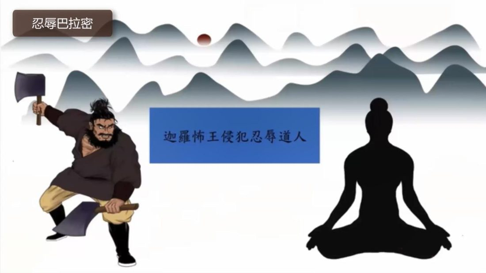

📅 最近更新：2026-09-29 12:00　|　第5版精修（朗读优化版）

# 第4周：忍辱等五波罗密与在家修菩萨道（主持人版）

> ⭐ **本讲主持人速览**（新主持人必读，2分钟看完）
>
> 你不是老师，是"共学同行者"。你不需要提前懂内容，只需要按流程走。
> **本周由连续两周内容合并**而成，含两段共读、两轮分享与两轮讨论，单讲 120 分钟。
>
> | 环节 | 标准时长 | ⏱ 时间不够→ | ⏱ 时间富余→ |
> |:-----|:----:|:-----|:-----|
> | 🧘 静心开场 | 10 min | 缩至5 min | 加2分钟静坐 |
> | 📖 共读原文1 | 20 min | 只读★核心段（约15 min） | 加读◈扩展段 |
> | 💬 第一轮分享 | 10 min | 每人1句话 | 每人3分钟 |
> | 🎯 第一轮主题讨论 | 10 min | 只讨论问题① | 讨论全部问题+扩展 |
> | 🧘 禅修练习 | 15 min | 缩至8 min（只念引导词前半） | 延长至20 min |
> | 📖 共读原文2 | 20 min | 只读★核心段 | 加读◈扩展段 |
> | 💬 第二轮分享 | 10 min | 每人1句话 | 每人3分钟 |
> | 🎯 第二轮主题讨论 | 10 min | 只讨论问题① | 讨论全部问题+扩展 |
> | 🔚 收尾与回向 | 15 min | 缩至10 min | 保持 |
>
> **主持人10条守则（精简版）**：
> ① 不讲解、不提供答案——让原文自己说话；② 有人问"正确答案"→说"先听听大家的看法"；③ 冷场→主持人先分享自己的真实感受；④ 跑题→温和拉回："这个有意思，我们回到今天的原文"；⑤ 争论→"两种看法都很好，大家保留自己的理解"；⑥ 确保人人发言；⑦ 不评判任何人的分享；⑧ 时间到了就推进；⑨ 禅修练习照读引导词即可；⑩ 结束一起回向。

> 本周主题：**忍辱、真实、决意、慈、舍五个巴拉密与在家修菩萨道；菩萨亦会造不善业、成佛后仍受报，但仍只在圆满巴拉密**。

## 📋 本周信息卡

| 项目 | 内容 |
|:----|:-----|
| 时长 | 120分钟（4周版 · 9环节） |
| 核心问题 | 忍辱是不是"压抑"？真实巴拉密为什么"以离妄真实语为主"？决意的"磐石山"是什么意思？慈与贪爱、舍与冷漠，界线在哪里？这五个波罗密，怎样落到我今天的生活里？；菩萨为什么会造不善业、又会受什么果报？成佛之后为什么还会受报？这对"修行有没有用"意味着什么？在家众能不能走这条路？八周下来，这条"菩萨道"对我们今天的生活到底意味着什么？ |
| 共读原文 | 共读原文1：材料①《巴利三藏中的菩萨道思想10-精进巴拉密2、忍辱巴拉密》、材料②《巴利三藏中的菩萨道思想11-真实巴拉密1》、材料③《巴利三藏中的菩萨道思想11-真实巴拉密1》　｜　共读原文2：材料①《巴利三藏中的菩萨道思想14-古源尊者-20250705》 |
| 本周作业 | ①（简答）用一句话分别说清"忍辱"与"压抑"、"舍"与"冷漠"的区别；②（实践）本周找一次让你"想憋住"的场合，先做三次呼吸，试着不压抑也不爆发，事后记录"那一刻心里发生了什么"（只记录、不评判）。；①简答题：请用你自己的话，说出"菩萨亦受恶报"这句话的意思——它说明修行"没用"还是"有用"？（不必判断对错，只要说出你的理解。）②实践题：本周任选一次"当一件事让你觉得'这是我过去造的业、我活该'的时刻"，试着换一个念头——"这件事已成因缘，此刻我仍可以选择种下新的善"；只作观察、记录，不作评判、不下结论。 |

## 🧘 静心开场（10 min）

> 💬 **破冰｜3–5分钟**：让呼吸慢下来。这周有没有一次你忍住了没发火，事后心里其实还堵着？一句话说说那一刻，说完就放下。

**主持人引导语**（照读即可）：

> 我们先静坐一分钟，把外面的脚步放慢下来。找好坐姿，可以盘腿，也可以坐在椅子上；轻轻闭上眼睛，或者让视线柔柔地落在前方地面。先做三次深长的呼吸——吸气，慢慢地；呼气，也慢慢地。

> 现在，把注意力带到身体。感觉一下此刻的坐姿，感觉身体与坐垫接触的地方，感觉双手放着的温度。不需要改变什么，只是知道。

> 接着，把注意力放到呼吸上。知道吸气，知道呼气。不去控制呼吸，只是陪伴它。如果心跑开了，不要责备它，轻轻地把它带回来，再回到呼吸。跑了，带回；跑了，带回——这本身，就是在练习"安住"。

> 现在，我们来练习一会儿慈心。先想到自己，在心里轻轻地对自己说：愿我健康，愿我快乐，愿我平安，愿我远离痛苦。然后，把这份善意送给坐在你左右的每一位法友——愿他们健康，愿他们快乐，愿他们平安。

> 今天我们要谈五个词：忍辱、真实、决意、慈、舍。这几个词，可能有的会让你心里一紧——"忍辱"听起来像要憋着，"舍"听起来像要放弃。所以，在这几分钟里，我们也特别把善意，送给那个一听到"忍"就绷紧的心：愿它知道，忍辱不是把委屈硬塞进怀里，而是让胸怀变大一点；也把善意送给那个怕"舍"会让自己变得冷漠的心：愿它知道，真正的舍，是清醒而温柔的。愿这份平和，陪着我们进入今天的共读。

> 现在，让注意力轻轻地扫过全身一遍：从头顶，到额头、到脸颊、到肩膀，看看那里有没有一点紧；如果有，就在呼气时让它松下来。再到胸口、到腹部、到双手、到双腿，一路松下去。我们不需要做到"完全没有紧张"，只是知道它在哪儿就好——知道，就是照顾。

> 好，保持这份开放与柔和，我们慢慢睁开眼睛，回到当下。

**（主持人操作）** 开场控制在 10 分钟内。若学员入场慢，可先让早到者安静就坐，准点再开始引导。静心不作"必须静下来"的高压要求，语气始终作邀请。**本周静心的一个隐藏任务**：先把"忍辱≠憋着""舍≠冷漠"这两颗种子，在开场就种下去。所以引导语里"送一份善意给那个绷紧的心"这句，请不要省——它是本周全部心理安全的起手式。若时间允许，可在静心后请学员用一个词记下"此刻心里最紧的一个地方"，课上不必分享，只为后面共读时对照。

## 📖 共读原文1（20 min）

> ⚠️ **主持人操作**：共读原文只读不解释。建议分工朗读：材料①（忍辱课件）由一位法友读，材料②（音声）由另一位读，材料④（音声）由第三位读，材料⑥（音声）由第四位读，材料③⑤⑦（课件）视时间选读。读到生僻术语，主持人用一句话白话点明（例如"无瞋＝不生气、不瞋恨""中舍性＝心保持平衡、不偏"），不展开。**时间不够时**：材料①只读"特相作用现起近因＋三层次"，材料④只读"决意·磐石山"，材料⑥只读"舍·三层次"，其余作课后阅读。**特别注意**：材料②④⑥为录音转写，保留时间码与口语，个别同音字（如"生实波罗蜜"即真实波罗蜜、"无称"即无瞋、"美坦／美的"即慈／mettā、"放住舍／半注舍"即梵住舍、"罗马罕萨"即罗摩汉沙本生）朗读时读起来会有点绕，主持人不必纠正、不必考究，照读即可。**一个提醒**：本周读到"忍辱"时，主持人可先轻轻带一句"这两个字很容易被听成'憋着'，我们一会儿会看到经典怎么说"，把气压下来，再继续——这句话花不了三秒，却能护住整堂课对"忍辱"的理解方向。

### 原文材料①：★核心·巴利三藏中的菩萨道思想10-精进巴拉密2、忍辱巴拉密

- **文件**：《巴利三藏中的菩萨道思想10-精进巴拉密2、忍辱巴拉密-古源尊者-20250701（课件）.pdf》

> ⚠️ 主持人操作：本文件取〈忍辱巴拉密：分类与三层次〉段；**与第6周同文件不同章节**（第6周取〈精进巴拉密2三层次〉，本讲取〈忍辱巴拉密〉，段落不重叠）。课件前半"精进巴拉密"各页属第6周，本周不朗读。

**忍辱巴拉密**

忍辱好比大地。大地能堪忍对其所丢弃一切干净之物和肮脏之物，不会因此而有爱与恨。

忍辱好比大地一般，在人间当中无论遇到顺境还是逆境，都不起贪和嗔，也不起爱和恨。

**佛陀尚未对僧团制定律之前，最初的比丘生活公约**

Khantī paramam tapo titikkhā, nibbānam paramam vadanti buddhā. Na hi pabbajito parūpaghātī, na samaņo hoti param viheṭhayanto.

忍耐是最高苦行，诸佛说涅槃最上；恼他实非出家人，害他者不是沙门。

不谤不恼害，护巴帝摩卡；于食知节量，居边远住处；致力增上心，此是诸佛教。

**忍辱巴拉密**

《行藏注疏》在「杂集」一章中提到：「以大悲心及方法善巧智为根基，在忍受他人的折磨时，以无瞋心所为主的心与心所组合是为忍辱波罗蜜。」

何谓忍辱巴拉密呢?具备大悲心与善巧精通智，加以安忍众生罪过，由无嗔前导的善心及其心所，乃名为忍辱巴拉密。

**忍辱巴拉密**

特相：宽容

作用：面对可喜、不可喜所缘，心保持堪受

现起：可喜、不可喜所缘的接受和宽容

近因：如实观察

**忍辱巴拉密**（三层次）

不惜身外之物的失去的堪忍是根本忍辱巴拉密；

不惜身内的眼睛、肢体、健康的影响，而加以堪忍是殊胜忍辱巴拉密；

不惜生命的失去，而加以完成的忍辱叫做究竟忍辱巴拉密。

**忍辱巴拉密**

学习射箭的利弊

菩萨的思惟：

· 射箭技术之初，目的是夺取他人性命。

● 射箭技术之末，沉溺五欲而堕入地狱。

**忍辱巴拉密**

富楼那尊者的忍耐力

**忍辱巴拉密**

「我们可以毫不后悔地杀死瞋恨；舍弃无感恩心以获得智者的称赞；无论对方是比我们高级、低级或与我们同等，我们都耐心地忍受每个人的辱骂，有德者称这为最高级的忍辱。」

「在各种提升之中，自我提升是最好的。在各种自我提升的修行之中，忍辱是最好的。身为强者而能忍受弱者，智者称这为最优等的忍辱。」

**忍辱巴拉密**

《增支部·八集·居士品·经七》那八种力量是：

1. 哭是小孩的力量；2. 生气是女人的力量；3. 武器是强盗的力量；4. 统治大国是国王的力量；5. 吹毛求疵是愚者的力量；6. 探索真理是智者的力量；7. 重复思考是博学者的力量；8. **忍受他人恶待是沙门与婆罗门的力量。**

> 💡 主持人注意：请注意最后那一句——"**忍受他人恶待是沙门与婆罗门的力量**"。忍辱在经典里被列为一种"**力量**"，不是软弱，更不是压抑。这一点，请在第一轮分享和主题讨论前，先替学员点明。

### 原文材料②：★核心·巴利三藏中的菩萨道思想11-真实巴拉密1（依据录音转写整理，已校对明显同音错字）

- **文件**：《巴利三藏中的菩萨道思想11-真实巴拉密1-古源尊者-20250702（音声）》

> ⚠️ 主持人操作：本文件取〈真实波罗蜜的本质、真谛二种与本生真实语故事〉；中段（约 `[00:21:24]`–`[01:06:39]`）三种真实语之本生故事从略。正文括注（ ）内为整理注记，朗读时跳过。

[00:00:53.300] 那。今天呢，我们开始学啊，真实波罗蜜。那。菩萨，善慧菩萨在思维啊。在累积忍辱波罗蜜之后呢啊。他思考到，不仅呢，能够容忍侵犯的人呢，甚至可以饶役侵犯的人。所以对于利益众生的方面呢，真实不虚啊。

[00:01:49.680] 波罗蜜啊。那在佛种姓经里面啊，对真实波罗蜜呢有一个形容啊。他说，人天适中，犹如天平指针一般的太白金星，无论在雨季、寒季、夏季运行的过程中啊，不出其轨道，就像太白金星不出其轨道一样。

[00:02:18.935] 波罗蜜呢，就是菩萨。从他被授记之后开始一直到成佛啊，任何一尊菩萨都一样。在漫长的累积波罗蜜的过程中呢，它有一个数字是一定不会改变的，就是这个真实……菩萨自从被授记一直到成佛，都不会改变过。啊所以说像太白金星一样啊不会改变。

[00:02:58.420] 那么真实波罗蜜它的。本质是什么呢？……它不像精进心所啊啊精进波罗蜜啊，智慧波罗蜜啊，它有特定的心理素质，那么对真实不虚的啊，或者称为真谛或者真实呢。啊它是有时候是三离心所啊，就是离虚妄语啊，对吧，啊有时候是思心所，有时候是以智慧为导主导的慧心所。那么根据不同的情况呢，会有呈现不同的这个本质啊。

[00:03:40.440] 啊，在这个经典里面啊，把它分成这个两种啊，就是真谛呢，有两种，一种呢就是世俗谛，一种就叫胜义谛……

[00:04:17.365] 真实的这样一些名称的设定啊啊比如说我们是根据形状啊，或者颜色啊，或者性别来命名……那如果。把人称为人呢，那么它就属于世俗谛，因为在世俗上这个称呼是对的。那如果有人说啊，这个人就是牛啊，那么他就不是世俗地啊，就是世俗上他这个称呼就是错的。

[00:05:28.460] 那么究竟地呢，是指在究竟意义上存在的真实法，就称为究竟谛啊，或者称为叫胜义谛，

[00:05:36.560] 那譬如呢，我们学习佛法的人呢会说。我们失之各种事物的是我们的心，那么认知之法本身呢，就是胜义谛啊，因为它在究竟意义上，它是有那么刹那存在的。

[00:15:33.400] 只有以想来认知事物的时候，世俗谛才会出现。当我们以智慧来省察的时候，世俗谛就会消失。同样的，只有以智慧来省察的时候，究竟地呢，它就会呈现出来啊，心啊，心所啊，名法等等。

[00:21:10.140] 那么，虽然佛陀的最终目的呢，是教导究竟法的本质，但他并没有排除世俗惯用的名称，反而呢，他在世俗和究竟法的名称上，它是互相配合使用。

[01:15:21.440] 那么他是怎么恢复呢？当时这个尸毗王，他已经全瞎了嘛……他就退休啊，就在皇家花园的边上啊……所以这个帝释天呢，又来了啊，他就问他说你是谁呀，他说我是帝释天王啊，你可以向我要求任何东西。

[01:16:12.065] 国王，我不能够令你从看得见，但你可以用自己真实的力量得以重新看见啊，你可以说一句真实语。

[01:16:21.680] 卡国王听完就说呢，我敬爱那些向我这个讨取礼物的人，我也敬爱那些真正来向我讨取必需品的人。以这个真实意愿，我得以重见光明。当他这么说呢，他第一粒眼睛就长出来了。……现在果真呢，他第二只眼又出现了啊。那么这两只眼呢，并不是以它与生俱来的那两只，它也不是天眼。事实上呢，就是因为它这个真实波罗蜜而自己长出来的啊。

[01:21:13.040] 那么真实呢，在古代是很普遍的啊，说谎呢，即刻就会带来恶报，而真实语呢，也很快会带来善报啊……

[01:23:36.020] 那么在斯里兰卡也流传这样的一个故事，就是一位叫做大牛的啊达米达的一个长老……这长老讲，我不懂得医药啊，我将告诉你一个治病的方法，就自从我出家以后，我不曾以贪欲的眼光看过任何女人，以此真实与愿我母亲得以复原。……但他这么做，他的母亲的那个乳癌呢，就像泡沫一般消失啊。

### 原文材料③：◈扩展·巴利三藏中的菩萨道思想11-真实巴拉密1

- **文件**：《巴利三藏中的菩萨道思想11-真实巴拉密1-古源尊者-20250702（课件）.pdf》

> ⚠️ 主持人操作：本课件为幻灯片，结构页（图示、本生经题名页）无法逐字提取，不臆造；只取〈真实巴拉密〉文字页。时间不够时只读"三种真实语"与"特相作用现起近因"两页。

**真实巴拉密**

涅盘可分三种，(一) 涅盘的第一个素质是没有执受(无我)，所以它被称为空涅盘。(二) 涅盘的第二个素质是没有因缘和合的(有为法)心、心所和色法；称为无相涅盘。(三) 涅盘的第三个素质是没有渴爱。称为无愿涅盘。

**真实巴拉密**

真实语有三种：1. 取信真实语；2. 许愿真实语；3. 离妄真实语。

**真实巴拉密**

特相：不变异为“真实”，作用：示现真实不虚为“真实”。现起：妙哉、真妙的意识出现在行者的智慧里。近因：身业、口业、意业的清净

## 💬 第一轮分享（10 min）

**分享规则**：每人 2 分钟（人多则 90 秒），轮流说，不打断、不点评、不"纠正"。可以只说自己的一点体会，也可以说"我还没抓到，先听听大家"。分享不是汇报成绩，是把自己此刻的心声摆到桌上。

**起手问题（任选，先邀请、不点名）**

1. 今天第一次听到"忍辱的本质是**无瞋**、是心**堪受**，**不是压抑**"——这个说法，和你过去理解的"忍"有什么不同？说说你自己的那个理解就好，不用讲道理。
2. 材料②里尊者说："真实的人才取信于人，一个取信的人，你的生意才会做下去。"你在生活里，有没有一次"说实话反而赢得了信任"的经历？
3. 听到"决意就像磐石山"，你的第一念是什么？（是"我没有这种坚定"？还是"我也有过咬着牙做成的一件小事"？）只说那一刻的感受，不作评判。
4. （备用）材料④把"慈"和"情爱、亲情之爱"分得很清楚——"慈爱是没有依依不舍的"。你有没有过"以为自己在关心，其实放不下"的经验？——此题**只谈个人体会，不评判对错**。
5. （备用·轻柔）材料⑦说"对事物漠视与不关心则破坏了舍心"。你怎么理解"舍"和"冷漠"的不同？——此题只谈体会，不比较谁更"舍"。

**（主持人操作）** 分享环节以"接住"为主，不追问、不诊断。若有人在分享里带出自我否定（"我这脾气，忍辱肯定做不到""我这人就是放不下，慈悲不了"），温和回应："**忍辱非压抑、不道德绑架**——做不到不是失败，看见它就已经很不容易了；而且'受不了的时候先走开'，也是如实看见，不是退步。"并把话头轻轻交给下一位。人多时可设"发言牌"，每人 90 秒；无人开口时，主持人可先做一次 30 秒的示范分享（分享自己第一次听到"忍辱＝无瞋"时的惊讶）。**若全场都不愿谈"我的脾气"，请尊重这份沉默**——沉默也是一种表达，主持人不逼、不劝，把话题轻轻放回"今天哪一句让你印象最深"即可。

## 🎯 第一轮主题讨论（10 min）

> **分层追问**（可视时间取用，由浅入深）：
> - 【现象】忍辱和压抑憋着的差别是什么？慈与贪爱、舍与冷漠的界线在哪里？
> - 【影响】这五条里，哪一条最戳中你最近的一段经历，为什么？
> - 【应对】这周找一次想发火或想忍住的场合，先只观察身体紧不紧。

> ⚠️ 主持人操作：四题由浅入深，先让学员用生活语言回答，再回扣原文。每题先 3 分钟小组／邻座互说，再全体发言。不追求结论，允许"带疑问继续学"。第 1 题务必先做，它把本周"**忍辱≠压抑**"的澄清立住；第 2 题守住"**舍≠冷漠**"。凡触及"我做不到"之类自我评价，主持人第一时间用特别提醒接住。

**问题一：忍辱的本质是"无瞋、堪受"，不是"压抑、憋着"——这两者的差别，你在生活里体会过吗？**

- 提示：请学员回到材料①的原句——"特相：宽容""作用：面对可喜、不可喜所缘，心保持堪受""由无嗔前导的善心及其心所，乃名为忍辱巴拉密"；再引《增支部》那句"**忍受他人恶待是沙门与婆罗门的力量**"。引导方向：把"压抑"和"堪忍"分开说——**压抑**是把情绪硬塞回怀里、越塞越沉，久了会生病；**堪忍**是把胸怀撑大，情绪还在，但你不被它压垮、也不被它牵走。追问一句帮助落地："如果你此刻想起某件还在忍的事，它更像'塞着'，还是'容着'？"
- **提示**：本题是本周心理安全的核心之一。若学员说"我一直在忍，很累"，主持人先共情，再明确："**忍辱非压抑**——受不了可以说不、可以先离开、可以找人倾诉，这些都是如法的；本课绝不道德绑架，不说'你都学佛了怎么还生气'。"若讨论滑向"谁更能忍"，温和拉回"这不是比赛"。**允许**学员说"我暂时做不到"，并回应："被尊重。"

**问题二："舍"是"无爱无恨、平等中立"，不是"冷漠、不管事"——你怎么看这两者的界线？**

- 提示：引材料⑦两句原话——"**对事物漠视与不关心则破坏了舍心**""属于舍波罗蜜的中舍性心所以众生为目标而省思：'众生的苦乐是缘于他们自己的业，是无人能够更改的。'"；再引材料⑥"在苦乐方面，有随众无随众方面，犹如天平一样……我有平等之心，这是我之舍波罗蜜"。引导方向：**舍不是无感，而是清醒**——它不是"我不在乎了"，而是"我看见每个人都在自己的业里，我不再急着替天行道，也不再让爱恨把我拉走"。可请学员各举一个"我放下了，但依然关心"的例子（对孩子的、对同事的、对旧事的）。
- **提示**：请特别区分"舍"与"逃避／绝望"。若学员把"我都无所谓了"当成舍，主持人温和提示："那是心的关闭，不是舍；真正的舍，心里是**平的、也是暖的**。"本题不作定论，重在体会"平等"与"温度"可以并存。

**问题三："慈"与"贪爱／黏着"的界线在哪里？**

- 提示：引材料④"慈爱是没有依依不舍的……而亲情的爱或情爱，如果那个人不在、你没有那种感受，心就落空，那就叫贪爱"；再引材料④"慈爱的本质意义呢，是无嗔心，所它就像忍辱一样，它是无嗔的"——即**慈也是无瞋心所**，与忍辱同宗。引导方向：慈是"**希望对方好，但不占有**"；贪爱是"**希望对方在，好让我不空**"。可请学员回想一个"我以为我在关心，其实我在抓取"的场景，只描述"那时候我心里怕的是什么"。
- **提示**：本题容易触动亲情、感情话题，主持人**不追问细节、不诊断**；若有人情绪起伏，先给三次深呼吸的选项，必要时可暂离。落点是一句平实的话："慈是放手的祝福，爱是抓着的不舍——我们可以练习前者。"

**问题四（备用，时间富余或讨论冷场时用，约 8 min）：五个波罗密里，哪一个最戳中你？为什么？**

- 提示：请学员从"忍辱、真实、决意、慈、舍"里挑一个"读到时心里最有反应"的词，只说"它让我想起了什么"，不解释、不评判。可借材料②"决意就像磐石山"、材料①"忍辱好比大地"的画面收束。引导到一句可带走的话：**"这五个词，其实就是把一颗心——容得下、说得真、定得住、盼人好、放得平。"** 此题不作定论，重在让学员把五波罗密从"名词"读成"心的五个面向"。

## 🧘 禅修练习（15 min）

### 练习一

> ⚠️ **禅修禁忌提示**：若你正处在严重抑郁、焦虑、创伤后应激，或精神类疾病的发作／用药期，或正经历强烈的情绪危机，请先咨询医生或心理师，再决定是否练习；练习中若出现明显不适（如心悸、胸闷、情绪失控），请立即停止，睁开眼睛，把注意力放回呼吸与身体，必要时离场休息。

**（本周练习：入出息念＋慈心念＋舍心念，主持人引导词，照读即可）**

> 各位法友，请坐好，身体放松，肩膀自然下沉。轻轻闭上眼睛，先把注意力放到呼吸上——只是知道呼吸本来的样子，不去调整它。

> 吸气，知道；呼气，知道。当心跑开时，不要责备自己，只是轻轻地带回来。跑了，带回；跑了，带回。

> 现在，我们练习一会儿慈心。先想到自己，在心里轻轻地说：愿我健康，愿我快乐，愿我平安，愿我远离痛苦。……现在，想到一位你今天见过或想到的人，把这份善意送给他：愿他健康，愿他快乐，愿他平安。留意一下：这份善意，是"希望他好"，还是"希望他别离开我"？找到那个"希望他好"的心，就把它稳住。

> 接着，我们练习一会儿舍。想到刚才那个人，心里轻轻地说：你的苦与乐，来自你自己的业；我的苦与乐，也来自我自己的业。我不能替你承担，也不需要替你承担；但我依然盼你好。……让这份"不抓取、也不关闭"的心，安静地待一会儿。

> 今天我们也把这份柔和，送给"忍辱"这两个字本身。如果此刻心里有一件还在忍的事，不要逼自己"忍下去"，也不要急着爆发；只是温柔地看着它，像看一位扛着重物、还在慢慢走的朋友：愿它也被善待，愿它知道——容得下，比憋得住，更长久。

> 好，我们在这份平和里安静地坐一会儿……（留白 2–3 分钟）

> 慢慢把觉知带回身体，回到坐垫、回到呼吸、回到此刻。慢慢睁开眼睛。

**（主持人操作）** 15 分钟：引导约 5 分钟＋静坐 7 分钟＋收束 3 分钟。本周练习**不以"生起慈心／舍心"为止标**——只要学员愿意试一次，就已经达到目的。**特别提示**：练习"舍"时，务必把"我不能替你承担，也不需要替你承担；但我依然盼你好"这句说足，防止学员把"舍"误练成"关闭、麻木"；若有学员练习中情绪起伏（尤其想到还在"忍"的事），请其先做三次深呼吸，必要时可暂离、喝水，**不追问**。练习结束前，可请学员在心里回顾一句：刚才那一刻，"忍辱"两个字在我心里，是紧的，还是松的？

**（练习引导的三段节奏，主持人自用）**：①**安定（约 3 min）**——呼吸，把身体坐稳，让心从"听了很多概念"的高处落回身体；②**柔软（约 6 min）**——慈心三句（给自己、给一位法友），再转入舍心（"你的苦乐来自你的业，我依然盼你好"）；③**收束（约 2 min）**——不问结果，只请学员体会"心里那根弦有没有松一点点"。若有人全程走神，也不必自责——"会跑，就是它本来的样子。"本周不设"忍辱合格线"，不评比、不考核。

### 练习二

> ⚠️ **禅修禁忌提示**：若你正处在严重抑郁、焦虑、创伤后应激，或精神类疾病的发作／用药期，或正经历强烈的情绪危机，请先咨询医生或心理师，再决定是否练习；练习中若出现明显不适（如心悸、胸闷、情绪失控），请立即停止，睁开眼睛，把注意力放回呼吸与身体，必要时离场休息。

**（本周练习：入出息念＋慈心念，主持人引导词，照读即可）**

> 各位法友，请坐好，身体放松，肩膀自然下沉。轻轻闭上眼睛，先把注意力放到呼吸上——只是知道呼吸本来的样子，不去调整它。

> 吸气，知道；呼气，知道。当心跑开时，不要责备自己，只是轻轻地带回来。跑了，带回；跑了，带回。

> 现在，我们练习一会儿慈心。先想到自己，在心里轻轻地说：愿我健康，愿我快乐，愿我平安，愿我远离痛苦。……现在，想到一位你今天见过或想到的人，把这份善意送给他：愿他健康，愿他快乐，愿他平安。

> 今天我们也把这份善意，送给"过去的自己"。如果心里浮现出某件让你后悔、让你觉得"我造过业"的事，不要赶它走，也不要跟着它跑，只是温柔地看着它，像看一位走得跌跌撞撞、却还愿意往前走的旧友：愿你不必自责，愿你被原谅，愿你从这一刻起，还能种下新的善。……如果你愿意，也把这份善意，送给一位曾经被你伤害过的人：愿你安好，愿我们都能轻松一点。

> 好，我们在这份平和的善意里安静地坐一会儿……（留白 2–3 分钟）

> 慢慢把觉知带回身体，回到坐垫、回到呼吸、回到此刻。慢慢睁开眼睛。

**（主持人操作）** 15 分钟：引导约 5 分钟＋静坐 7 分钟＋收束 3 分钟。若时间富余，可加 5 分钟"把善意送给曾被我伤害的人"练习——**并明确提示：这只是练习心的柔软，不是要你做到"一定生起慈心"，做不到也完全没关系；若牵动较重的情绪，可以随时睁眼、喝水、暂离。** 若有人练习中情绪起伏（尤其涉"自责"），请其先做三次深呼吸，必要时可暂离、喝水，**不追问、不诊断**。练习结束前，可请学员在心里回顾一句：刚才送出那份善意时，我的胸口，是紧的还是松的？

**（练习引导的三段节奏，主持人自用）**：①**安定（约 3 min）**——呼吸，把身体坐稳，让心从"听了很多故事"的高处落到身体上；②**柔软（约 5 min）**——慈心三句，先给自己，再给一位法友，最后给"过去的自己"与"曾被我伤害的人"；③**收束（约 2 min）**——不问结果，只请学员体会"心里那根弦有没有松一点点"。本周练习**不以"生起慈心"为止标**，只要学员愿意试一次，就已经达到了目的；若有人全程走神或情绪波动较大，也不必自责——"会跑、会难过，就是它本来的样子。"

## 📖 共读原文2（20 min）

> ⚠️ **主持人操作**：共读原文只读不解释。建议分工朗读：材料①（音声转写）由一位法友读，材料②（论文）由另一位法友读，材料③（论文）由第三位读。读到生僻术语，主持人用一句话白话点明（例如"无间地狱＝受苦无间断的极重地狱""正性决定＝证果后必导向涅槃、不再改道的法则"），不展开。时间不够时，材料①只读"三类不善业＋成佛后仍受报"两段（恶报故事可选读马麦、旃遮女、提婆达多三则，六年苦行与背痛段可略），材料②只读〈六、菩萨的行持不同〉最后两段（南传"业因成熟必定要受果报""菩萨只是在圆满巴拉密，并不曾救度任何人"），材料③只读"三种觉者无差别"与"正性决定"两段，其余作课后阅读。**特别注意**：材料①为录音转写，保留时间码与口语，个别同音字（如"本身经"即《本生经》、"把脉自动／马麦"即"食马麦"、"土司佛"即"底沙佛"、"金家／新家"即"旃遮女／孙陀利"、"骨定／果定"即"果定"、"观音菩三道"即"菩萨道"）朗读时读起来会有点绕，主持人不必纠正、不必考究，照读即可。**一个极其重要的提醒**：本周读到"菩萨造业、堕恶趣、成佛仍受报"时，**主持人必须主动把语气放平**，读到苦难处先轻轻带一句"我们先安静听完，等会儿一起说说心里升起了什么"，把气压下来，再继续往下读；读完后务必回到材料①那句"只要不是无间地狱，那菩萨在任何的生命界，他都会继续累积波罗蜜"——**这一句是本周的"安心句"，一定要读出来**。共读全程约 30 分钟，宜"材料①前半（艰辛）稳、材料①后半（在家修）暖、材料②③（差异与法则）清"。

### 原文材料①：★核心·巴利三藏中的菩萨道思想14-古源尊者-20250705（依据录音转写整理，已校对明显同音错字）

- **文件**：《巴利三藏中的菩萨道思想14-古源尊者-20250705（音声）》

> ⚠️ 主持人操作：本文件取〈三类不善业、成佛后仍受报、巴拉密果报、在家修〉段。正文括注（ ）内为整理注记，朗读时跳过；成佛后佛果功德（三十二相、十力、四无畏、六不共智、十八不共法）段落极长，课堂只选读"十八不共法"小结与"佛果功德"一句，其余作课后阅读。

**（一）三类不善业**

[00:05:43.300] 建议干嘛？基本上呢，由于菩萨啊这个这个。会生起烦恼。它有几种类型？啊那么这个这个然后呢，由于这些烦恼啊，形成这个不善业产生果报啊，那么这个这个有几种类型，一种呢就是菩萨在修行过程中你会发菩萨不是。还有呢，因为菩萨在修行累积智慧的过程中呢，他由于由于宝慢而会产生不善业。那么因为菩萨的烦恼仅仅正常行事啊，就是不是因为菩萨的烦恼他正常的行事啊。因于果报呃，这个是这个，但是结怨啊，别人仇恨而受苦，那基本上是这个三个类型。那这个三个类型呢，

[00:06:33.300] 这个这个在本身经里面，我们有五百二十几部经啊，这里面就讲到了很多啊，菩萨啊，有时候会堕落恶趣，他还在布施啊，他还在持戒啊，他还在维积四种波罗蜜，也就是菩萨，即使他造作不善业，堕落到恶趣，只要不是无间地狱。无间地狱就没有办法行善啊，那只是，只要不是无间地狱，那菩萨在任何的生命界，他都会继续这个累积波罗蜜啊。

**（二）成佛后仍受报——往昔恶业因缘**

[00:07:08.060] 那第一类，比如说这菩萨修行过程中呢，啊种下一些啊不善业，然后这个啊，即使到成佛的时候，他还会受啊三个月的马麦之报啊。那这个这这个是这个他是什么原因的呢？

[00:07:27.080] 就是当时啊这个我们的佛陀啊，这个吃了三个月马麦。他是据说是在九十二大劫之前呢，那时候菩萨投身在一个家庭里面，那么那个时候因为他自己出生啊的缘故啊，那么他很哦。所以那个时候有这个，

[00:07:48.850] 这个佛陀出世，叫土司佛啊，菩萨菩萨不长这个的弟子呢，他们正在吃啊食物啊，然后呢，他看到完以后，他就心生厌恶，说这个你们这些骨头上。但我你怎么也配得上吃这么精美的米饭食物呢？你应该吃马麦呀，哎，那么由于这样的一种吉祥呢，所以菩萨在很多千年啊，做到摄取的，即使在最后一生，菩萨正为佛陀啊，

[00:08:21.010] 然后呢，也吃了三个月了嘛。那么这三个月的马麦的时候呢，这个其实呢，他是啊魔王啊魔王来干嘛，他当时呢刚好。佛陀游行到一个叫围栏干的地方啊去游行，然后这围栏干那个村的村长啊，婆罗门啊，就邀请佛陀说，你这三个月在我们这里过安居了……

[00:09:02.440] 那结果呢，圆安节约第二天开始啊，这个我们这个魔王摩罗啊，他就施展魔法，就让这个维栏干这个村的所有村民都琢磨，所以佛佛陀带着僧团去托钵呢啊就。哪怕一汤匙的饭菜都看不到媒体，结果当天就控制住了。

[00:09:22.420] 所以那个时候呢，有从这个白路来的马车刚好来到这个围栏。这个围栏干这个村的旅居啊，他们在马圈里面呢，这个给每一匹马分粮食啊。然后看到这个佛陀的比库们没有的吃嘛，偷不拖不回来，所以他就给每个比库呢。每一个人分一个榜单……

[00:10:08.045] 三个月以后，这个摩罗的干扰才才消失，然后村长才想起来啊，然后这个非常不好意思。那么这个是这个马麦啊，那么佛陀呢，还曾经被这个金家（女），我们一般翻成金家啊，这个诬陷。那么诬陷他说这个，呃，这个佛陀跟他有关系。那么这个因缘呢，就是菩萨在过去生呢，投身为一个这个圣陀罗啊，就是一个畏惧这个这个种姓很低微的啊，一个无名无份的……

[00:13:03.280] 就当时呢，有一个这个外道女弟子，这个就叫金家啊，就长得很漂亮。然后呢，这个他有一天来到这个外道的寺院。垂头丧气还是他做为什么？他们说我们这个自从沙门国德玛出现以后，搞得我们的信众越来越少，大家都不理睬。然后这个金家说那我可以做些什么呢……

[00:14:03.790] 第二天呢，他又装作好像在从杰德林出来一样。呃，这个，这个这个人家就问他说，你在哪里过夜啊？他说，你干嘛想在道我在哪里过夜吗？我在杰德林跟沙门过岛一起过夜啊。那么，这个过了三四个月，他每天这么讲……

[00:15:12.120] 啊，说说这个，这个，贤妹，你所说的这些是真是假，只有我和你才知道。那这个时候呢，这个我们这个第四天的天地的底座就热起来了……于是呢，他决定澄清此事，他就命令两个天子呢，叫其中一个天子化身为小老鼠，跑到这个新家的这个衣服里面，咬断他木盆的绳子。另外一个天子呢，就吹起一阵风，把他的皮子掀开，这个木盆放下……所以就真相真相大白。

[00:16:00.220] ……在佛陀这个。这个成佛以后呢，我们还遭遇十二种困惑。

[00:16:47.840] 那包括呢，像这个……这个孙德利摩萨看啊，就是外道呢，也可以知道啊，其实这个佛陀萨。好，然后呢，这个被提婆达多啊，推石头啊，脚尖啊，啊，这个这个碎石碰到了，脚出血了啊，以邪恶邪恶心出佛出血啊。那。然后呢，被这个这个这个拉拉基啊拉拉基利这个大象这个对象攻击。啊，然后呢，这个释迦族被灭国啊，

[00:17:27.295] 佛陀头痛。那这个佛陀的晚年呢，啊，在入八涅盘之前呢，三个月呢，背痛。背痛难忍呢，

[00:18:44.175] 会遭受这个后背的疼痛。啊，那么后背的疼痛呢，但是在佛陀，他是这个在经典来讲，他这个疼痛呢，是属于叫至死方休的苦受。他要一直忍受到入般涅槃才会结束，

[00:19:02.230] 那佛陀怎么忍受这种苦呢？那虽然有这样苦，但是其实佛陀呢，他通过修七色法和七非色法。那么，这种观制，然后再进入阿拉汉果定。然后每天早上他醒过来的时候，他决议就六果定的决议啊……那么这个每天都会痛，但每天骨头都会进入骨定来制服这个剧痛，那么背痛就会消失。那这个就是背痛的像这样的果包……

[00:19:56.000] 那包括我们佛陀，他六年苦行，那。过去二十八佛里面呢，佛陀苦行的时间最长。那么为什么会有这么长的苦刑呢？……但是在在心情经里面讲到就是菩萨以前所未有的苦行啊，来折磨自己。那佛陀讲说，未曾有不可思议啊……这个过去二十八佛里面呢，这个我们当时最长的就是果德玛佛陀，我们乔达摩佛陀六年的苦行。其他的就是几个月啊，甚至有的只有几天。啊，

[00:22:13.130] 那么这个为什么会有这些差别呢，就跟他菩萨菩萨的阶段啊，过去呢，这个这个的这个一些不偿行为可能有关。所以，那么也就是菩萨在行菩萨道的过程中呢，他一直充满了艰辛。

[00:22:31.710] 那还有一类呢，我们说他并不是菩萨的这个福报，他就是因为过去啊，正常形式被人结怨。仇恨啊，带来的苦啊，就是提婆达多啊……

[00:34:03.040] 那这个也是这个跟佛陀呢，他的这个烦恼并没有关系啊。他是离过去结怨啊，这个出佛上学。那这个呢，是我们这个菩萨啊，在这个每生的这个修行波罗蜜的过程中，累积的无量的资量，然而呢，他也会。这个在即使在成佛的时候呢，他也会有。

[00:34:29.880] 有果报啊，那么佛陀呢？成佛以后呢？啊，我们看看佛陀有什么样的功德……

**（三）巴拉密果报——圆满十波罗蜜即成佛、佛果功德**

[00:37:05.840] 那么我们回忆就是说，首先呢，要成为佛陀，首先要成为一个真正的菩萨。要想成为一个真正的菩萨呢，必须先累及众多的商业慈悲，具备被授记的八个条件，再被已经获着的佛头授记，他将在何时成佛？那个时候他才成为真正的菩萨。

[00:37:25.680] 那被授记之后，菩萨至少必须累积啊，四个大乘七劫加十万大劫等啊，三个层次的十种波罗蜜啊，那么这个十辰圆满巴拉密圆满时，他就能够成佛。那么这个是巴利里面的观音菩三道的这个这个传统啊……

[00:38:00.740] 怎么修行啊，所以那么佛陀他成佛的时候呢，是连同阿拉汉道果以及一切知智一起升起，所以那一刹那。他断除了贪嗔痴的烦恼……那也就是说，就是这个解脱呢，他都是按照出过阿菩萨摩提过这个次第来，只是呢，佛陀的这个解脱呢，它是连同着他的这个一切资质一起生起来。

## 💬 第二轮分享（10 min）

**分享规则**：每人 2 分钟（人多则 90 秒），轮流说，不打断、不点评、不"纠正"。可以只说自己的一点体会，也可以说"我还没抓到，先听听大家"。分享不是汇报成绩，是把自己此刻的心声摆到桌上。

**起手问题（任选，先邀请、不点名）**

1. 今天第一次听到"菩萨也会造不善业、成佛之后还要受报"，你心里的第一个反应是什么？（是惊讶？是"原来如此"？还是"那我修行还有用吗"？）说说那个反应就好，不用讲道理。
2. 材料①里有一句"只要不是无间地狱，那菩萨在任何的生命界，他都会继续累积波罗蜜"——这句话让你心里松了一点，还是紧了一点？说说那一刻的感受，不作评判、不下结论。
3. 材料①说菩萨过去生"有时候会出家啊，有时候呢，就是以居士的身份呢，去修行了"。作为一个在家的普通人，你听到这句是什么感觉？（是安慰？是"那我也算数"？还是别的？）
4. （备用）这八周下来，有没有哪一周的哪一句话，是你到现在还记得、甚至用上了的？说给大家听听。
5. （备用·轻柔）如果此刻你心里有一个"我是不是不配学这个"的声音——不必说出来，只在心里对它说一句"发心利他本身，就是在种新的善业"，然后说说你此刻的呼吸有没有松一点。

**（主持人操作）** 分享环节以"接住"为主，不追问、不诊断。若有人在分享里带出自我否定（"我造过那么多业，我这种人不配"），温和回应："菩萨亦受恶报，避免宿命论与自责，发心利他本身即在积累巴拉密。你现在能这样诚实地看自己，本身就是一颗善心在动。"并把话头轻轻交给下一位。人多时可设"发言牌"，每人 90 秒，确保人人有机会；无人开口时，主持人可先做一次 30 秒的示范分享（分享自己第一次听到"菩萨也受报"时的惊讶与释然），降低门槛。**若全场都不愿谈"业报"这个话题，请尊重这份沉默**——沉默也是一种表达，主持人不逼、不劝，把话题轻轻放回"这八周里哪一句让你印象最深"即可。

**（本周分享的一个特别提醒）** 本周的话题容易牵动"自责"与"宿命"，所以分享环节请特别留意两件事：其一，**任何人不主动谈"我造过什么业"，主持人不接、不问、不放大**——学员愿意谈就接住，不愿意谈就跳过；其二，若有人把话题引向"我是不是命中注定"，请温和地把话锋转到"**此刻我能做的下一步是什么**"上。分享的目的不是"清算过去"，而是"看见当下还有可为"。主持人可固定用一句口令收束每一位的分享："**说完了就好，我们把它轻轻放下。**"

## 🎯 第二轮主题讨论（10 min）

> **分层追问**（可视时间取用，由浅入深）：
> - 【现象】菩萨也会造不善业、成佛后仍要受报，材料是怎么解释这层道理的？
> - 【影响】听到菩萨也会受报，你心里第一反应更靠近哪一种？
> - 【应对】这周做一件再小不过的善事，做完留意心里有没有变化。

> ⚠️ 主持人操作：四题由浅入深，先让学员用生活语言回答，再回扣原文。每题先 3 分钟小组/邻座互说，再全体发言。不追求结论，允许"带疑问继续学"。第 1 题务必先做，它把本周的"安心线"立住；后两题视时间取舍。讨论中凡触及"我配不配／我是不是活该"之类自我评价，主持人第一时间用第 1、2 条特别提醒接住。

**问题一：菩萨也会造不善业、成佛之后仍要受报——这到底说明"修行没用"，还是"修行有用"？为什么？**

- 提示：请学员回到材料①的原句——"只要不是无间地狱，那菩萨在任何的生命界，他都会继续这个累积波罗蜜"；再引材料②"业因成熟必定要受果报，这是不变的法则"。引导方向：把两句话放在一起看——**受报说明业果真实，继续修说明业果可转**。业果真实，恰恰是"我现在造善业，将来也会得善果"的保证；如果造业不受报、造善也不受报，那修行才真的"没用"。追问一句帮助落地："如果'造善一定有善果'这条规则不存在，你今天还会想做好事吗？"引导到"**正因为规则是真的，我们的努力才有落点**"。
- **补充（供主持人掌握，视时间取舍）**：可顺带点出——菩萨"即使造作不善业，堕落到恶趣，只要不是无间地狱……都会继续累积波罗蜜"，说明**跌倒了还能爬起来继续走**；但**不必渲染苦难**，一句"这正说明这条路是给凡人走的"即可。引导的落点始终是：业果真实，所以来得及。

**问题二：这个"菩萨也受报"的道理，和"宿命论"有什么不一样？我们怎么避免把它听成"一切都是命"？**

- 提示：引材料②——"具足巴拉密的菩萨有时也会选择'决意死'……为了不浪费时间，所以有时会选择'决意死'，投生到人间继续修积巴拉密"。白话落地：**宿命论说"你只能等"，业果法则说"你还可以选"**——菩萨连"什么时候死、投生到哪里"都在依愿选择，可见当下仍有可为。**提示**：可用一句口令收束——"**规则是真的，但牌还在我手里**。"若学员滑向"反正都注定了"，主持人温和拉回"业果真实 ≠ 命定，此刻的选择也算数"。
- **追问（帮助落地，约 3 min）**：请学员想一想一件"最近让你觉得'这是命、没办法'的小事"，然后试着找出"在这件事里，我还有哪一步是我自己可以选的"。不必说出来，写在心里即可。此题不作定论，重在把"宿命"还原成"选择"。

**问题三：菩萨在过去生中"有时候出家，有时候以居士身份修行"——这对"在家众"意味着什么？（结合你自己的处境）**

- 提示：引材料①原话——"这二十五尊佛呢，也都分别他在那些佛陀在世的时候呢，去修习呀啊这个有时候会出家啊，有时候呢，就是以居士的身份呢，去啊这个这个修行了"；再引材料③"在证悟道果之前，修行者可以选择解脱道或菩萨道"。引导方向：**这条路不分身份**——在家众一样可以修，一样可以累积巴拉密。请学员说出"作为一个在家人，我最能做的一件小事是什么"（比如每天一句善意、一次不嗔、一次分享）。**提示**：本题是本周的"撑腰题"，**只作鼓励、不作比较**；若有人因"我在家、还要带娃上班"而自卑，主持人回应："**菩萨当年也做过在家人**——路看不看得到，比走得快不快更重要。"

**问题四（备用，时间富余或讨论冷场时用，约 8 min）：八周走下来，这条"菩萨道"对你的生活，留下了什么？**

- 提示：用"八周回顾卡"（认路—架构—授记—次序—十个巴拉密—本周的艰辛与果报）作引子。引导方向：**不做学术总结，只谈"这一句话我怎么用"**。请学员挑一句这八周里最想带走的话（"巴利三藏里也有菩萨道"／"路有长短，终点一样"／"业果真实，所以来得及"／"发心利他本身即在积累巴拉密"），写在纸上，收进口袋。**提示**：此题不作定论，重在让学员带着一句"能带走的话"离开；若无人愿答，主持人不强推，把它留作课后自问。讨论收束时，主持人回到本周核心句——"道路看清了，剩下的，是安心地走"。

## 🔚 收尾与回向（15 min）

### 收尾一

**总结引导（主持人可照说）**

> 今天我们把十巴拉密里的最后五个——忍辱、真实、决意、慈、舍——走了一遍。我们最大的收获，也许不是记住了多少名相，而是**澄清了两个字**：**忍辱**，本质是"无瞋"，是心"堪受"，**不是压抑**——它是《增支部》里说的"沙门与婆罗门的力量"；**舍**，本质是"中舍性心所"，以"众生之苦乐乃由业之使然"为落点，**不是冷漠**——"对事物漠视与不关心，反而破坏了舍心"。再加上"真实"的"不变异（以离妄真实语为主）"、决意的"如磐石山"、慈的"无瞋（无依依不舍）"，这五个词合起来，其实就是把一颗心练成五个面向：**容得下、说得真、定得住、盼人好、放得平**。今天我们不必记住任何一个数字，只要带走一句就好：**"忍辱非压抑、舍非冷漠；不比较、不评判、不道德绑架——看见自己的心，就已经在路上了。"**

**下周预告**：第 8 周《菩萨道的艰辛、果报与在家修菩萨道》。这一周是八周的收官——我们要从"十巴拉密怎么修"，转到"修这条路的菩萨，会经历什么"：菩萨道的艰辛（三类不善业、成佛后仍受报）、巴拉密的果报（三十二相、八十种好等），以及**在家如何修菩萨道**。请课后完成本周作业，也欢迎带着今天的疑问来。

**逐步收束建议（主持人自用，约 20 分钟怎么用）**

- **0–6 min｜总结引导**：照读上面的总结，把"两个澄清"（忍辱≠压抑、舍≠冷漠）再走一遍；语速放慢。
- **6–11 min｜本周作业**：念一遍作业（简答题＋实践题），特别强调实践题"只观察、不评判、不下结论"；提醒"受不了要走开，也是作业的一部分"。
- **11–15 min｜下周预告**：预告第8周"艰辛、果报与在家修"，先给一句心理安顿："下周会讲到菩萨也会受苦报，但那是**关于一条路的知识**，不是给谁判分。"
- **15–20 min｜答疑与回向**：答疑从简（细节留课后），最后做回向。

**回向词（主持人领，全体随念）**

> Idaṃ me puññaṃ āsavakkhayaṃ hotu. 愿我此功德，导向诸漏尽。
> Idaṃ me puññaṃ nibbānassa paccayo hotu. 愿我此功德，为证涅槃缘。
> Mama puñña-bhāgaṃ sabba-sattānaṃ bhājemi. 我此功德分，回向诸有情。
> Te sabbe me samaṃ puñña-bhāgaṃ labhantu. 愿彼等一切，同得功德分。
> Sādhu! Sādhu! Sādhu!

### 收尾二

**总结引导（主持人可照说）**

> 今天，我们走完了八周的最后一段，也把前面七周走过的路，重新看了一遍。这八周，我们其实只做了三件事：**认路**——巴利三藏里也有菩萨道，觉悟有三种，菩萨有三种；**看清**——十巴拉密的架构、授记的故事、次第的理由，以及布施、持戒、出离、智慧、精进、忍辱、真实、决意、慈、舍这十件事；**然后，坦然地上路**——今天这一课，讲的就是上路之后会遇见什么。我们说清楚了：这条路**辛苦**——菩萨也会造业、也会受报，成佛之后仍有余报；这条路**不白费**——只要不是无间地狱，菩萨在任何生命界都继续累积波罗蜜，圆满十波罗蜜就能成佛；这条路**不看身份**——在家、出家，都可以走。今天我们不必记住任何一个业报故事。只要带走一句就好：**"菩萨亦受恶报，避免宿命论与自责，发心利他本身即在积累巴拉密。"** 业果是真的，所以来得及；牌还在你手里，所以走得下去。

**八周收束（主持人自用，约 3 分钟，可选）**：把"八周回顾卡"再走一遍，每念一周停两秒——W1 认路、W2 架构、W3 授记、W4 次序、W5 布施/持戒/出离、W6 智慧/精进、W7 忍辱/真实/决意/慈/舍、W8 艰辛/果报/在家修。最后一句："路，我们已经一起看清了。"（如时间允许，可请三两位学员各用一句话说出"这一句我怎么用"，每人不超过 20 秒；主持人最后补一句："路看清了，剩下的，是安心地走——不必急，也不必与谁比。"）

**下周预告**：**下一部共修，是《大念处经精读》（读书会18）。** 这八周，我们看的是一条很长、很大的路——菩萨道；下一部，我们回到最小、最近的地方：**当下的身、受、心、法**。《大念处经》讲的是四念处——观身、观受、观心、观法，是佛陀亲说的"唯一之道"。今天把这条大路的远眺看完了，下一部就沉到脚下这一步来。请课后完成本周作业，也欢迎带着八周的疑问，一起走进《大念处经》。

**逐步收束建议（主持人自用，约 20 分钟怎么用）**

- **0–6 min｜总结引导**：照读上面的总结，把"认路—看清—上路"三层再走一遍；语速放慢，每层之间停两秒。
- **6–9 min｜八周回顾**：把"八周回顾卡"快速过一遍，让学员在心里把八周串成一条线。
- **9–12 min｜本周作业**：念一遍作业（简答题＋实践题），特别强调实践题"只观察、不评判、不下结论"。
- **12–15 min｜下周预告**：预告读书会18《大念处经精读》；告诉学员"从'大路'回到'脚下这一步'"。
- **15–17 min｜自由答疑**：只答与本周相关的、简短的问题；名相细节类的记在便签上，课后统一回复。
- **17–20 min｜回向**：全体合诵回向词四句，收束全场。**回向不可省**——它是把八周所学"结愿"的一步，也是让学员带着一份"这门课有头有尾"的踏实离开。

**回向词（四句，全体合诵）**

> 愿以此功德，导向诸漏尽；
> 愿以此功德，为证涅槃缘；
> 我此功德分，回向诸有情；
> 愿彼等一切，同得功德分。
>
> 萨度！萨度！萨度！

## 📌 本讲主持人特别提醒

1. **心理安全是本周第一要务（本系列 W4–W7 通用指引）。** 十巴拉密涉"布施多少、持戒严松、忍辱压抑"，极易被学员听成"我不够好"。请把这句话说足、说清：**"忍辱非压抑、不道德绑架——不比较、不评判；忍不住的时候走开一下，也是如实的看见，不是修行失败。"** 本周最该被守住的，不是讲清了多少名相，而是没有让任何一个人因为"忍"而把委屈再压深一层。请在开场与收尾**各说一次**这句话。
2. **"忍辱"绝不等同于"任人欺负、压抑自己"。** 材料①明确：忍辱的特相是"宽容"，作用是"心保持堪受"，本质是**无瞋心所**；《增支部》更把它列为一种"**力量**"。若学员说"我忍着，但我很痛苦"，请先共情，再明确：**忍辱非压抑**——说"不"、暂时离开、寻求帮助，都如法；本课**不道德绑架**，绝不说"你都学佛了怎么还生气"。
3. **"舍"绝不等同于"冷漠、不管事"。** 材料⑦原话："**对事物漠视与不关心则破坏了舍心。**" 舍的落点是"众生之苦乐乃由业之使然"，是**清醒的平等**，不是**无感的放弃**。练习"舍"时，务必把"我不能替你承担，也不需要替你承担；但我依然盼你好"这句说足。
4. **"慈"要和无瞋切开，不能与贪爱混淆。** 材料④："慈爱是没有依依不舍的……而亲情的爱或情爱，如果那个人不在、你没有那种感受，心就落空，那就叫贪爱。" 若学员把"慈"讲成"我离不开他"，请当场温和地帮他把两者分开。
5. **"真实"讲成"长远的信任"，不道德说教。** 借材料②尊者原话："你真实的人呢，才会取信于人。一个取信的人呢，你的生意才会做下去。要有长远的眼光的。" 不要把"真实"讲成"你需要老实"，而是"诚实让你被信任"。
6. **不比较、不评判、不道德绑架。** 本周会触及"我的脾气／我的贪着／我放不下"这类私人话题，主持人不追问、不诊断、不给心理学标签、不比较谁更能忍、谁更慈悲、谁更放得下；成员情绪波动时，提供"三次深呼吸／喝水／暂离"的选项。
7. **共读保留口语与同音字，不纠不考。** 材料②④⑥为录音转写，同音字（"生实波罗蜜""无称""美的""放住舍""罗马罕萨"等）朗读时有些绕，主持人不必纠正、不必考究，照读即可；学员问"是不是我理解错了"，可回答"这一节我们后面还会反复遇到，今天就先混个耳熟"。
8. **主题边界：不展开缘起与业力机制。** 本周"舍"里点到"众生皆业的所有者"即可，缘支与业力机制**详见读书会11/12/13**；慈、舍的"分类与三层次"是本讲正题，慈心禅的实修方法**详见读书会02**。
9. **跨周／跨系列共用，须段落级注明。** 材料①与**第6周**同文件不同章节（第6周取〈精进巴拉密2〉，本讲取〈忍辱巴拉密〉）；材料⑤ `98fbad78` 与**读书会02第8周**同文件不同段落（彼讲取〈慈巴拉密〉，本讲取〈真实巴拉密2、决意巴拉密〉），两处均已核对、段落不重叠，请照此口径回复学员。
10. **时间纪律**：120 分钟时长（10/25/20/35/15/15）不得随意改动；宁可少读一段材料，也要保住共读与回向两个环节——前者立"法"，后者结"愿"。

**本讲常见追问应答参考（主持人自用，照此口径回答即可）**

- 问：忍辱是不是就是忍着不吭声、打不还手？→ 答：不是。材料①说忍辱的特相是"宽容"、作用是"心保持堪受"，本质是**无瞋**；《增支部》还把它列为"沙门与婆罗门的力量"。**忍辱非压抑**——它是心量变大，不是把委屈硬塞进怀里。
- 问：我脾气大，忍辱肯定做不到，怎么办？→ 答：**不比较、不评判、不道德绑架**。做不到不是失败，"看见了"就已经很不容易；**忍辱非压抑**，受不了时先走开、先照顾自己，也是如实的看见。
- 问：真实就是"有话说清楚、有话直说"吗？→ 答：不完全是。真实巴拉密**以"离妄真实语"为主**（菩萨主修的是这一种），是"不变异"的诚实；取信真实语、许愿真实语只在需要时才说。尊者说，真实的人"才会取信于人"。
- 问：决意是不是就是"自我加压、拼命"？→ 答：不是。决意是"实践善法坚固不动摇"，像"磐石山"——但它建立在大悲心与方法善巧智上，是**定得住**，不是**硬撑**。而且累积巴拉密的是"殊行（任务）决意"，不是一时冲动的决定。
- 问：慈和爱、喜欢、放不下，怎么分？→ 答：慈是"无瞋心所"，是"**希望他好**"；爱、贪着是"**希望他在好让我不空**"。材料④说得很清楚："慈爱是没有依依不舍的。" 放不下的，是贪爱，不是慈。
- 问：舍是不是就是"看开了、无所谓了"？→ 答：不是。材料⑦："**对事物漠视与不关心则破坏了舍心。**" 舍是"无爱无恨、平等中立"，心里是**平的，也是暖的**；"无所谓"是心的关闭。
- 问："528个慈爱""132舍心"要不要背？→ 答：不必。那些是"分类的完整度"，说的是心量能覆盖"一切众生、一切方位"；本周只要知道"慈与舍各有分类与三层次"就够，**数字是尺子，不是门槛**。
- 问：这个跟读书会04（持戒）、02（慈心禅）、11/12（缘起）什么关系？→ 答：十巴拉密里的"持戒巴拉密"见第5周（已与04对照注明）；"慈巴拉密、舍巴拉密"本周从**菩萨道视角**讲分类与三层次，慈心禅的实修见读书会02；"众生皆业的所有者"此处只点到，缘起机制见读书会11/12。

**主持人逐段串讲参考（气氛冷场、或共读结束后做小结时使用，照读即可；以下为主持人的话，非原文）**

今天这五份材料，其实说的是同一件事的五个面：**一颗心，怎么变宽、变真、变定、变暖、变平。**

先说"忍辱"。材料①给的定义很关键：特相是"宽容"，作用是"心保持堪受"——也就是说，**忍辱不是把气憋回去，而是让心装得下**。尊者用"大地"打比方：干净的东西、肮脏的东西丢给大地，大地都不起爱与恨。所以忍辱是**无瞋**，是一种**力量**，不是软弱。

再说"真实"。材料②③④⑤一路讲下来，最要紧的一句是：真实巴拉密**没有单独的心所**，它的本质是"不变异"，而且**以"离妄真实语"为主**——菩萨生生世世"只说真话"。所以真实不是"话多话少"，而是"**说的话靠得住**"。

然后是"决意"。材料④⑤把它讲成"**磐石山**"：不管受多大的强风，它也不动。请你注意，这个"定"不是硬撑出来的，它铺在"大悲心、善巧精通智慧"之上；累积巴拉密的，是那个"说到就做到"的**殊行决意**。

最后是"慈"和"舍"，这对最容易被人误解。材料④说得很清楚：慈是"**无瞋**"——"慈爱是没有依依不舍的"；而放不下的那种，叫"贪爱"，不是慈。材料⑥⑦又补上舍："**舍是"无爱无恨、平等中立**"，它的落点是"众生的苦乐，来自众生自己的业"。而且材料⑦明明白白写着："**对事物漠视与不关心则破坏了舍心。**" 所以舍**不是冷漠**，是**清醒而温柔的平等**。

所以，本周的功课不是学会"忍"和"舍"，而是**把"忍辱"从"压抑"里、把"舍"从"冷漠"里解放出来**。回家认出一次：当"忍"让我心里发紧的时候，我能不能对自己说一句——"容得下，比憋得住，更长久。"

**主持人备课后记：本周容易忽略的三件事（主持人自用）**

**其一，"忍辱"两个字，最容易把人逼成"假忍"。** 学员里可能有人一辈子都在"忍"，把委屈压成了身体的病。所以本周主持人要主动替他们松绑：**忍辱非压抑**——说"不"、走开、求助，都如法。宁可这节课少讲一个"殊胜忍辱"的定义，也要让那个"忍了很久的人"知道：**你不需要用压抑来证明自己在修行。**

**其二，"舍"的练习，最容易练成"关闭"。** 十五分钟的练习里，"舍"如果只说"你的苦乐是你的业、与我无关"，学员很容易练成冷漠。所以请务必补上后半句："**但我依然盼你好。**" 舍的圆心是"平等"，不是"无感"。

**其三，"不比较"要说在明处。** 本周五个波罗密，个个都容易变成"打分标准"："我肯定没有他那么能忍""我这人慈悲不起来"。主持人要把"不比较、不评判、不道德绑架"**先说出口**，学员才敢讲真话。反复回到那句核心提醒：**忍辱非压抑、不道德绑架；不比较、不评判——看见自己的心，就已经在路上了。**

---

<!--EXT_READ-->
## 📖 延伸阅读（课后自由选读）

- 《巴利三藏中的菩萨道思想10-精进巴拉密2、忍辱巴拉密》——忍辱巴拉密定义、特相作用现起近因与三层次。
- 《巴利三藏中的菩萨道思想11-真实巴拉密1》——真实波罗蜜本质、世俗／胜义二谛与真实语故事。
- 《巴利三藏中的菩萨道思想12-真实巴拉密2、决意巴拉密、慈巴拉密1》——决意·磐石山、慈与贪爱之辨。
- 《巴利三藏中的菩萨道思想13-慈巴拉密2、舍巴拉密》——慈巴拉密528类、舍巴拉密十种舍与三层次。
- 《南傳菩薩道.pdf》——〈五、对三乘的解释不同〉（在家／出家行持、正性决定）。
<!--/EXT_READ-->
