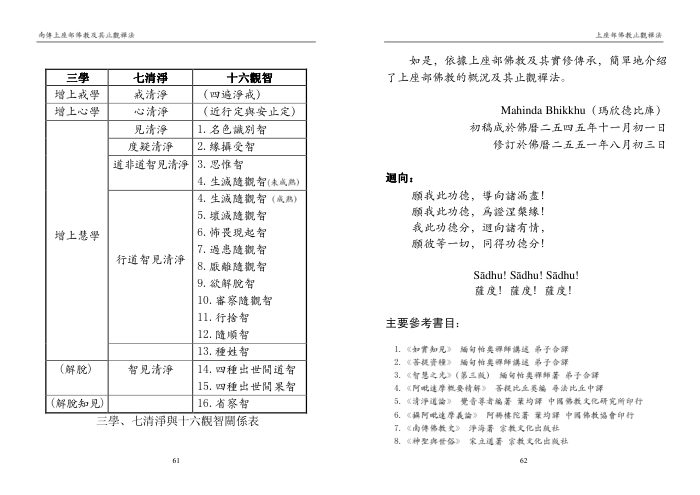

📅 最近更新：2026-09-29 13:00　|　第5版精修（朗读优化版）

# 第1周：四圣者总说与预流果（学员版）

## 📋 本周信息卡

| 项目 | 内容 |
|:----|:-----|
| 时长 | 120分钟（4周版 · 9环节） |
| 核心问题 | 四圣者是「四种不同的人」，还是同一条路上的四个里程点？十结怎样被四道智层层断掉？为什么初入圣流就再也不会退回去？ |
| 共读原文 | 共读原文1：材料①《斷煩惱與證道果---玛欣德尊者》、材料②《4 佛法问答 - 禅修 确认稿》。　｜　共读原文2：材料①《斷煩惱與證道果---玛欣德尊者》、材料②《佛陀與佛法》。 |
| 本周作业 | ①简答题：用一句话说出「十结」，并说明它们在四种圣道中分别被断多少。②实践题：写下本周想松开的一个「我见」小执著，连续七天记录「抓得紧时／松开时，我的心怎样」。 |

## 🧘 静心开场（10 min）

> **主持人开场白（照读即可）**
>
> 「今天是我们这一系列的第一讲。我们不急着做很多事，先给大家十分钟，把外面的忙、路上的累，轻轻地放下。你不需要表现给谁看，也不需要证明什么——就只是坐在这里，和自己待一会儿。」

> **静心引导语（照读即可）**
>
> 各位法友，请找一个让身体放松又能保持清醒的姿势坐好。可以闭上眼睛，也可以半睁着，把目光落在前方一两尺的地面上。
>
> 先把注意力带到呼吸。吸气，知道我正吸气；呼气，知道我正呼气。……不用刻意改变呼吸，只是**如实地知道**它。
>
> （停 30 秒）
>
> 再来一次深一点的吸气……然后缓缓地呼出，感觉肩膀在这里松下来，胸腹在这里松下来，眉心在这里松下来。
>
> （停 30 秒）
>
> 好，现在让我们把心，从外面的忙碌里轻轻收回来。今天我们要一起看一张地图——从凡夫到圣者，这条路长什么样子。请你带着两个问题坐在这里：**我原本以为的「圣者」是什么？这条路上，我此刻站在哪里？**
>
> 我们不评比谁走得远，也不着急得到答案。就只是安静地坐一会儿，让心先沉下来。
>
> （静默 60 秒，敲一下引磬，进入共读）

> 💬 **破冰｜3–5分钟**：说说看：你觉得从「凡夫」到「圣者」，中间那一步，更像「学会了什么」，还是「放下了什么」？

> 🛡️ **心理安全三约定**（每次开场在心里过一遍）：① **保密**——这里说的话不出这间屋子；② **不评判**——不评价任何人的分享，也不急着评价自己；③ **可随时暂停**——任何时候觉得不舒服，都可以停下来休息、喝水或离开，不需要解释。

## 📖 共读原文1（20 min）

### 原文材料①：★核心·斷煩惱與證道果---玛欣德尊者（txt，四圣者与十结总说）

- **文件**：《斷煩惱與證道果---玛欣德尊者》

**一、烦恼根本与十结总说**

> 烦恼的根本有三种，即：贪、瞋、痴。若再细分，又可分为「十结」(dasa sayojanāni)，即：欲贪结、色贪结、无色贪结、瞋恚结、慢结、见结、戒禁取结、疑结、掉举结、无明结。此「十结」将分别在四种出世间圣道中被断除，而阿拉汉圣道则能断除一切烦恼。
>
> 道智又可分为四个层次，由低至高依次为：入流道智、一来道智、不来道智与阿拉汉道智。

**二、四圣者层次总览（四道智各别所断·从凡夫到圣者）**

> 1 、入流道智
>
> 当禅修者观照一切诸行无常、苦、无我的世间观智成熟时，即生起一刹那缘取涅槃为目标的更改种姓心(gotrabhū citta)，超越凡夫种姓，而达到圣者种姓。此后即刻生起一刹那的入流道心。
>
> 入流道心(sotāpatti maggacitta)又称入流道智、初道智。该道智执行与四圣谛有关的四种作用，即：遍知苦、断除烦恼（苦之因）、证悟涅槃（苦之灭）及开展八支圣道。
>
> 入流道智能断除最粗的三种结。
>
> 入流，巴利语sotāpanna(1)，又作至流，即已进入圣道之流，必定流向般涅槃。
>
> 「灭尽三结，成为入流者，不退堕法，必定趣向正觉。」

> 2 、一来道智
>
> 一来道智并不能断除任何「结」，但却能减弱较粗的欲贪（对欲乐之贪求）与瞋恚。
>
> 一来，巴利语sakadāgāmin(3),  意为再回来此世间结生一次。

> 3 、不来道智
>
> 不来道智能断除欲贪与瞋恚二结。
>
> 不来，巴利语 anāgāmin(4), 意为不再返回欲界受生。
>
> 「灭尽五下分结(5)，成为化生者，在那里般涅槃(6)，不再从那世间回来。」

> 4 、阿拉汉道智
>
> 不来圣者虽然已经断尽了「五下分结」，不再投生于欲界，但却还是被残余的五种极为微细的「上分结」系缚于生死轮回之中。阿拉汉道智能彻底地铲除此「五上分结」(pa?canna uddhambhāgiyāna sayojanāna)，即：色贪（对色界生命之贪）、无色贪（对无色界生命之贪）、我慢、掉举与无明。
>
> 阿拉汉，巴利语arahant的音译。意为应当的，值得的，有资格者。

**三、四圣者共同点·无学总摄**

> 圣典中经常如此描述证悟阿拉汉道果的圣者：
>
> “‘Khīā jāti, vusita brahmacariya, kata karaīya, nāpara itthattāyā’ti pajānāti.”
>
> 「他了知:『生已尽，梵行已立，应作已作，再无后有。』」
>
> 阿拉汉圣者已经圆满地培育了戒定慧三学、完全地开展了八支圣道，所应作者皆已成办，所应学者皆已圆满，故阿拉汉又被称为「无学」(asekha)。他们已经竭尽了一切作为生死之因的烦恼，究竟正尽苦边，在身坏命终之后，将不会再有生死轮回。

### 原文材料②：4 佛法问答 - 禅修 确认稿（pdf，从凡夫证初果·依师依传承）

- **文件**：《4 佛法问答 - 禅修 确认稿》

**一、问1：从凡夫修行直到证初果，必须受持哪些戒律？应通晓哪些佛法知识和实修理论？**

**问1：从一个凡夫修行直到证初果，必须受持哪些戒律？应该通晓哪些佛法知识和实修理论呢？**

> 答：想要修行直到证得初果，对在家人来说，至少应当守持五戒，若有条件还要受持八戒。对出家人来说，北传是比丘、比丘尼、式叉摩那、沙弥、沙弥尼这出家五众，他们应当持守好各自的戒律。对南传比库来说，他必须完整地受持227条学处，以及佛陀在《律藏》里制定的所有篇章，包括《大品》和《小品》。比库对所有的学处和义务都要身体力行，才能做到戒清净，因为戒清净才谈得上修行。在家人也是，要持守好戒律，因为戒清净是修行的基础。
>
> 至于通晓佛法知识与实修理论，有两种方式：
>
> 第一种方式是在一位有经验的导师指导之下有次第地修行，不懂就去问，依教修行，这是最直接的方法。即使你对于佛法知识不是很了解，但只要你对导师有信心，这仍不失为一种很好的方法。但是现在会比较困难，毕竟精通三藏又具实修经验的导师寥若晨星。
>
> 第二种是先学习一些基本的佛法知识，树立正见。有了正确的见解，对佛陀的教法、对三藏有一定的认识，才去判断一位老师教的方法对不对？是不是正法？是否具有正见？次第是否明确？现在有些法师只懂得教你如何开始修行，但继续修下去就糊里糊涂，连他自己也不清不楚了！这些法门虽然起点很简单，目标也默认得很高，但是中间过程却不明不白。还有一些禅师所教的禅法渗进了许多自己的东西，因此我们需要了解一些基本的佛学知识。特别是现在这个时代，龙蛇混杂、鱼目混珠，邪师度众多如恒沙，有很多似是而非的法，甚至连外道都喜欢打着佛法的招牌，但所教的却偏离佛陀的教导。为什么有那么多的邪教呢？为什么有那么多的新兴宗教呢？在美国、日本、新加坡、中国大陆、台湾等都不少。如果我们拥有一定的佛学基础，就不会盲目追随邪师。所以，我们对佛法僧三宝要有坚定的信心，对律经论三藏要有一定的了解。同时，我们也应当检验导师教导的修行方法是不是戒定慧？是不是八圣道？如果一个出家众连持成都成问题，你跟着他就会有危险。如果只讲定，没有慧也不行，甚至说他一禅坐就可以坐两个月也是没用，只修定并不能解脱。而有些人则只教所谓的慧，教修观，却忽略定，这些禅法也有问题。
>
> 建议大家应该去看巴利三藏和 Visuddhimagga (《清净之道》)。按照南传上座部佛教的传统，要判断一种禅法是否正确，应该阅读作为禅修指南的《清净道论》。因此，要修行直到证悟初果，就要依师、依传承。然而，想知道某位禅师的教法是不是符合佛陀的教导，判断的标准是巴利三藏和 Visuddhimagga (《清净之道》)。如果他们的教法与佛陀的教导相符，那么你就可以放心地一步一个脚印修行了。

**二、问2：在家人初学禅修，按怎样的次第去修？**

**问 2: 请问尊者，在家人初学禅修，按怎样的次第去修？有什么指导禅修的书？每天修多长时间合适？**

> 答：在家人要学习禅修，还是首先要持戒清净，持好五戒。五戒这个是基础，对于在家人来说，五戒很重要。五戒持好了之后，在平时多点抽时间，如果你修的是“入出息念”，那么你就每天都抽半个小时、一个小时、乃至一个半小时，尽你自己的可能。如果你自己的时间许可的话，你就把禅坐的时间规定为好像吃饭、睡觉那么重要。每天到了那个点儿你就禅修。
>
> 在这方面的指导书有很多，例如：《清净道论》《智慧之光》《如实知见》《上座部佛教修学入门》等等这些书籍，里面对修“入出息念”来说都有很好的指导。如果你修其他业处也好，在《清净道论》里面，几乎你现在所修的止观业处，《清净道论》里面都有。

**三、问5：凡夫在正法时期不能证悟涅槃怎么办？如何证得初果？（巴拉密）**

**问5: 如果凡夫在正法时期不能证悟涅槃,在未来的无数次生死轮回中又不能遇到佛法,岂不是很危险?请问禅师:凡夫应该怎么办?**

> 答：根据上座部佛教，我们是佛陀的弟子，现在还能遇到正法，就应该依照佛陀的教法禅修。我们最起码要在今年生证得初果，这样才能够拿到生死轮回的保险。为什么呢？初果，巴利语sotāpanna。sota意为流，āpanna为已经进入。所以，证初果者已经属于圣者，他决定只会升进，只会一生比一生投生到更殊胜的生命，最终完全断尽烦恼，这就是佛陀在经典中说的“决定趣向正觉”。因为初果圣者已经证入圣者之流，绝不会再堕落恶趣，所以叫做“不退堕法”，即决定不再堕入四恶道，不会再投生为饿鬼、畜生，或投生到地狱。也就是说，遇到正法最好是在今生证得初果，所以要依照佛陀的教法来修行，依照戒、定、慧来修行！
>
> 不过，退而求其次，还有后路。我们不要认为现在不能修行，或者不能在今生精进修行而自暴自弃。佛教有一句话说：“只要目标正确，修行方法正确，没有任何的精进会白费！”因为我们知道现在走的这条路通向哪里，只要朝着那个方向走，走多少算多少，可以肯定的是越走越近。所以，我们依照佛陀教导的戒、定、慧来禅修，每天禅修，并发愿早日断尽烦恼、证悟涅槃，这个就是巴拉密。
>
> 巴拉密是什么意思呢？巴拉密是巴利语pāramī的音译。它就好像我们所说的资本，佛教叫“资粮”，特指解脱的资粮、菩提的资粮。什么是菩提呢？就是觉悟。巴拉密是导向证悟涅槃、导向究竟解脱的资本、本钱。我们布施、持戒、禅修、听闻佛法、学习佛法、修行止观，并发愿将所做的这些善业成为证悟涅槃的助缘，就是巴拉密。
>
> 如果做善事的目的只是为了投生天界，或者下一世再做人，或者愿我布施能带来大财富，这样的善业夹杂着贪，夹杂着烦恼，不是巴拉密。如果我们发愿：“愿我布施、持戒、听闻佛法、禅修的功德，成为证悟涅槃的助缘！”涅槃是舍离贪、瞋、痴，不夹杂任何的贪、瞋、痴。所做的善行不和无明、渴爱相应，不被烦恼污染，这就叫巴拉密，这就是修行的道粮。这些修行的本钱可以一点一滴积累，只要是朝向解脱，我们所做的这些善业都不会白费。最怕的是我们知难而退，或者跌倒了自己不肯爬起来。所以不用担心，只要朝着正确的目标一点一滴地积累巴拉密，能做多少就做多少。有了明确的方向，有了正确的方法，剩下的就是我们的精进了！

## 💬 第一轮分享（10 min）

**分享规则（主持人先说一遍）**：

- 每人 **1.5–2 分钟**，一次只答一个问题，说自己的经验，不讲别人的对错；
- 说「我跳过」完全没问题；听到别人的经验，只回应「谢谢」，不做评判、不给建议；
- 主持人负责计时与串场，不点评内容的「高下」；**不追问「你证到哪一果」**。

**起手问题（三选一，先举手的先说）**：

1. **「圣者」这两个字，在你过去的印象里是什么？** 是传说中的高人？某种遥不可及的境界？还是别的什么？（请用一两句话说你**原本**的理解。）
2. **听到「十结」——欲贪、瞋恚、慢、见、疑……你最先在自己身上认出的，是哪一「结」？** 只说你自己的，不评价任何人。
3. **这一次系列，你最想弄清四圣者里的哪一处？** 是「初果到底断了什么」，是「从凡夫到圣者那一步怎么发生」，还是「我这一生有没有可能」？说说你此刻的疑问。

> 主持人提示：第一轮是「破冰＋摸底」，**不追求深度**。特别注意：若有人急着说「我怀疑某某证果了」或「我已经证了初果」，请温和地把话题带回「你此刻的心怎样」，并重申——**我们不评比进度，也不轻断他人证量。**

## 🎯 第一轮主题讨论（10 min）

**引导问题一（由浅入深·第1层）：四圣者，是「四种不同的人」还是「同一条路上的四个里程点」？**

> 提示：先请大家谈谈最初的印象（四种等级／四种光环），再一起读材料①的「四道智层次总览」，把「入流断三结／一来减弱贪瞋／不来断欲贪瞋恚／阿拉汉断五上分结」摆出来。请讨论：如果差别只在「断掉了多少烦恼」，那么「果位」这个说法，给你的是方向感，还是压力？
>
> 落点：让大家看见——**四圣者是同一条路上断结深浅不同，不是四种互不相干的身份**。

**引导问题二（第2层）：十结是怎样被「层层断掉」的？为什么阿拉汉道能断尽一切？**

> 提示：带大家回到材料①的十结——欲贪、色贪、无色贪、瞋恚、慢、见、戒禁取、疑、掉举、无明。请讨论：为什么最粗的三结（有身见、戒禁取、疑）在**入流道**先断？为什么「色贪、无色贪、我慢、掉举、无明」这五上分结最细、要留到**阿拉汉道**才彻底铲除？用「剪绳子」的比喻大家各自会怎么补充？
>
> 落点：**断结有次第，是因为烦恼有粗细**；次第的背后，是对治不同深浅烦恼的需要，不是规定，而是道理。

**引导问题三（第3层·指向实修）：「从凡夫到圣者」的那一步，我在当下能做什么？**

> 提示：材料①说，那一刻叫「更改种姓心」——超越凡夫种姓、达到圣者种姓。请先各自读一遍材料②问5「巴拉密」与问7「在家人也能证前三果」，再讨论：既然「只要目标正确、方法正确，没有任何精进会白费」，那么**今天的我**可以在哪些具体的小事上，朝着那个方向走一步？（守一条戒、每天挤半小时禅修、依师依传承、发愿将善业回向涅槃……）
>
> 落点：**方向清楚，脚步就可以从当下开始**。守住一个小戒、回来一次呼吸、发一个朝向涅槃的愿——都是在为自己攒路费。
>
> 主持人收束一句（照读即可）：请带着材料③那句「犹如大海唯有一味，即咸味……此法、律唯有一味，即解脱味」离场——**这条路只有一味，就是解脱；而我们每个人，都在路上。**

**引导问题四（第4层·自由讨论·时间富余时用）：「初果是保险」这句话，让你安心，还是让你焦虑？**

> 提示：请每个人说一句真心话——听到「最低限度必须在今生证初果」，你的第一反应是「太好了，有方向」，还是「我大概做不到」？两种反应都很正常。主持人不评判，只请大家把这份感受说出来，然后一起回到那句话——**了解圣者，是认识一条路，不是给自己打分**。
>
> 落点：让「目标」带来方向感，而不是负担；若不放心，可把问题四作为课后作业的引子。

> **分层追问**（可视时间取用，由浅入深）：
> - 【现象】四圣者差在哪里、又共同在哪里——你心里的第一个答案是什么？
> - 【影响】如果以为圣者是一步登天，这样的想法会对日常用功带来什么影响？
> - 【应对】这周你愿意先从哪一条「结」上，观察自己身上有没有它的影子？

## 🧘 禅修练习（15 min）

### 练习一

> ⚠️ **禅修禁忌提示**：若你正处在严重抑郁、焦虑、创伤后应激，或精神类疾病的发作／用药期，或正经历强烈的情绪危机，请先咨询医生或心理师，再决定是否练习；练习中若出现明显不适（如心悸、胸闷、情绪失控），请立即停止，睁开眼睛，把注意力放回呼吸与身体，必要时离场休息。

> **主持人引导词（照读即可）——「十结随观·四下呼吸」**
>
> 请把身体坐正，手轻轻放在膝盖上，眼睛可以闭上或半睁。我们做一段很简单的练习：**用四个呼吸，走一遍「烦恼被一层层看清」的过程。** 不必去对治，只是轻轻地看见。
>
> **第一口气——最粗的「结」。** 深深地吸气……缓缓地呼气。请在心里问自己一句：**「此刻，我身上最明显的一股拉扯，是什么？」** 是想要什么？是恼了谁？还是舍不得什么？……只是看见，不批评自己。
>
> （停 20 秒）
>
> **第二口气——看见它「会变」。** 再来一次吸气……呼气。把注意力轻轻放在那股拉扯上，看它是不是也在动、也在变、也在松。**它并不是「我」，它只是一阵会生会灭的风。** 能这样看见，就是慧的开始。
>
> （停 30 秒）
>
> **第三口气——方向。** 吸气……呼气。请在心里立一句：**「愿我朝解脱的方向，走一步。」** 不必是很大的一步——今天少说一句伤人的话、多坐十分钟、发一个善愿回向涅槃，都算。
>
> （停 30 秒）
>
> **第四口气——共同的终点。** 吸气……呼气。请想一下：**入流、一来、不来、阿拉汉，走的都是同一条路，终点都是涅槃。** 此刻坐在这里的我们，也在这条路上。愿你我都走得安稳。**方向已定，一步一步；不比较，不评判，只问当下。**
>
> （静默约 2 分钟）
>
> ……请慢慢把注意力带回身体，感受双脚、双手、坐垫的接触。睁开眼时，带着这份清楚，回到当下。愿这一段时间的用功，成为这条长路上的一步。

**练习 B：看只是一看（约 5 min，时间富余时用）**

> 请把注意力放到眼前最明显的一个感受上——声音也好，触觉也好。当它生起，只是**知道**；当它变化，只是**知道**。不把它认作「我的」。看，只是看；听，只是听。……就这样，安住在「知道」本身。这一份「知道」，就是从凡夫走向圣者的起点。

### 练习二

> ⚠️ **禅修禁忌提示**：若你正处在严重抑郁、焦虑、创伤后应激，或精神类疾病的发作／用药期，或正经历强烈的情绪危机，请先咨询医生或心理师，再决定是否练习；练习中若出现明显不适（如心悸、胸闷、情绪失控），请立即停止，睁开眼睛，把注意力放回呼吸与身体，必要时离场休息。

**练习 A：三结省察·四句随念（约 8–10 min，照读）**

> 请坐好，轻轻闭上眼睛，做三次深长的呼吸。
>
> 现在，我们把注意力轻轻放到「身见」上。回想今天某一个瞬间——有人不同意你的看法，你心里是不是立刻紧了一下，觉得「他否定的是我」？……那一下紧，就是身见在动。我们不批评它，只是看见它：**这是「我」吗？还是只是一堆感受在流动？**
>
> 接着，把注意力放到「戒禁取」。有没有某些时候，你以为「只要照着某个形式做，就安心了」？……看见这份依赖，轻轻放下：**形式是船，不是岸。**
>
> 再看「疑」。心里对这条路有没有留着一些「真的可以吗」？……不急着驱赶它，只对它说：**愿我看清，而非硬信。**
>
> 最后，带着一句随念结束：**方向已定，一步一步走；不比较，不评判，只问当下。** 慢慢睁开眼睛。

**练习 B：看只是看（约 5 min，时间富余时用）**

> 请把注意力放到眼前最明显的一个感受上——声音也好，触觉也好。当它生起，只是**知道**；当它变化，只是**知道**。不把它认作「我的」。看，只是看；听，只是听。……就这样，安住在「知道」本身。

## 📖 共读原文2（20 min）

### 原文材料①：★核心·斷煩惱與證道果---玛欣德尊者（预流分）

- **文件**：《斷煩惱與證道果---玛欣德尊者》

#### 一、入流道智——断三结、不退堕法、必定趣向正觉

> 1 、入流道智
>
> 当禅修者观照一切诸行无常、苦、无我的世间观智成熟时，即生起一刹那缘取涅槃为目标的更改种姓心(gotrabhū citta)，超越凡夫种姓，而达到圣者种姓。此后即刻生起一刹那的入流道心。
>
> 入流道心(sotāpatti maggacitta)又称入流道智、初道智。该道智执行与四圣谛有关的四种作用，即：遍知苦、断除烦恼（苦之因）、证悟涅槃（苦之灭）及开展八支圣道。
>
> 在圣典中常如此描述入流圣者：
>
> "tia sayojanāna parikkhayā sotāpanno hoti avinipātadhammo niyato sambodhiparāyao'ti."
>
> 「灭尽三结，成为入流者，不退堕法，必定趣向正觉。」
>
> 入流道智能断除最粗的三种结：
>
> ①、执著实有我、我所、灵魂、大我、至上我存在的「有身见」(sakkāya di hi又作萨迦耶见，身见，我见，邪见）；
>
> ②、执著相信修持苦行、祭祀、仪式等能够导向解脱的「戒禁取」(sīlabbattaparāmāsa)；
>
> ③、对佛法僧、戒定慧、三世因果及缘起的「疑」(vichikicchā)。
>
> 同时，入流道智也能断除一切强得足以导致投生至四种恶趣（地狱、畜生、饿鬼、阿苏罗）的贪瞋痴，以及所有尚未产生四种恶趣果报的恶业。因此，初果入流圣者不可能再堕入四恶趣。
>
> 入流道智生起之后，即证悟入流圣果。入流，巴利语sotāpanna(1)，又作至流，即已进入圣道之流，必定流向般涅槃。对于漫长的生死旅途来说，入流圣者已经走近了轮回的终点，他们的未来世将只投生于人界与天界两种善趣当中，而且次数最多不会超过七次。也即是说：入流圣者将于不超过七次的生命期间，必定能得究竟苦边，趣无余依般涅槃，绝不会再有第八次受生。
>
> 入流圣者已经断除了邪见，他们不可能在任何情况下故意造作诸如杀生、偷盗、邪淫、妄语之类的恶行，即使是在梦中，他们也不会再造作此类的恶业，因为他们已经根除了造作这些恶业的潜伏性烦恼。守持五戒是证悟入流圣果以上的声闻圣弟子们的行为素质。同时，他们对佛陀、正法与僧伽具有坚定不移的清净信心，戒行圣洁（四种不坏净），深信缘起，深信因果，并如实知见四圣谛，亲证涅槃，成为出世间圣者。

#### 二、三种预流者——最多七次者、家家者、一种子者

> 入流圣者根据投生的次数又可分为三种，即：最多七次者(sattakkhattuparama)、家家者(kola*kola)和一种子(ekabījī)者。在《人施设论》中说：
>
> 「哪一种人为最多七次者？有一种人灭尽三结，成为入流者，不退堕法，必定趣向正觉。他流转轮回于天[界]和人[界]七次后，作苦之终结。这种人称为『最多七次者』。
>
> 哪一种人为家家者？有一种人灭尽三结，成为入流者，不退堕法，必定趣向正觉。他流转轮回两或三家(2)后作苦之终结。这种人称为『家家者』。
>
> 哪一种人为一种子者？有一种人灭尽三结，成为入流者，不退堕法，必定趣向正觉。他只投生为人一次后即作苦之终结。这种人称为『一种子者』。」(Pp.31-33)

#### 三、原注（照录，术语补充）

> (1) 入流：巴利语sotāpanna。sota, 意为流，河流；āpanna, 意为已进入，已到达。《增支部·第十集》之义注中说:「入流者，为已进入圣道之流。」(sotāpannā'ti ariyamaggasota āpannā.) (A.A.10.64)
>
> 汉传佛教依梵语srota-āpanna音译作须陀洹、窣路多阿半那等。
>
> 以上是就圣果位而言的。若就圣道位而言，巴利语则为sotāpatti。sota (流) + āpatti (进入，到达)，中文也译作入流。在圣典中也常作sotāpattiphala- sacchikiriyāya paipanna，直译作「为现证入流果的已行道者」或「正进入证悟入流果者」。
>
> (2)从证悟入流果之后就不可能投生在低贱的家庭，只会投生于大富贵家。「两或三家」即投生在天界或人界两或三次。

### 原文材料②：佛陀與佛法（涅槃／因果业报／初果不退堕）

- **文件**：《佛陀與佛法》

#### 一、涅槃组 · 第三十三章 涅槃（定义）

> 涅槃是佛法的圆满成就。
>
> 人们也许能清晰地以描述的方式，对如此深广的教理进行一番高谈阔论，也许能用华丽美妙的措词，写一本面面俱到的典籍，以想来讲解涅槃的安稳和博大精深。但是，涅槃是只有通过内在的智慧而证得的出世圣果。
>
> 纯理性的理解涅槃是不可能的，因为，逻辑推理无法涉及于它。虽然佛陀言教的逻辑完美无缺，但是，涅槃－佛教的最终目的，超出了逻辑范畴。不过，通过对生命正反两个方面的反省，就会产生这样一个逻辑结论－在有为法存在的相待面，一定有苦尽生灭的无为之法。
>
> 在本生故事的注解中，记叙了释迦牟尼佛的前生，当他为善慧仙人时，曾作如此禅想：
>
> "此世虽苦难，亦有乐可寻；虽存在实有，亦应觅非有；此生虽热熟，亦有清凉池；虽三界如火，亦有涅槃得；此生难恶浊，亦有至善境；虽实有生者，亦有无生地。"
>
> 涅槃的定义：
>
> 巴利语，涅槃(nibbana，梵语：Nirvava)是有两个单词 NI 和 VANA 组成。NI是一壮定分词；VANA 是波浪或贪欲意，此贪是联络今生与后世的钮带。
>
> "涅槃，即远离(NI)所谓的贪欲和欲望。"
>
> 众生只要被贪欲和执著所缚，就要造作新业，此业定会在无穷无尽的生死轮回中现行。当所有形式的的贪欲被消除之后，具有再生能力的业力停止了运作，此人即从生死轮回中解脱，而证涅槃。佛教的解脱是从不息的生死之中获得自在，而不仅仅是摆脱罪恶和地狱。
>
> 涅槃也被解释为贪、瞋、痴三火的熄灭。
>
> "三界如火坑。"佛陀说道，"是什么火点燃了此火坑？是由贪、瞋、痴；是由生、老、死、悲伤、忧恼、痛苦、哀愁、绝望等所点燃。"
>
> 一方面，涅槃可以被解释为这些毒火的熄灭。但是，切不可把此涅槃认为仅仅是此毒火的熄灭，熄灭不是没有的意思，在这里，毒火的熄灭本身就是涅槃的获证。

#### 二、涅槃组 · 第三十三章 涅槃（涅槃是虚无？／有余涅槃和无余涅槃）

> 说涅槃是虚无仅仅是因为人们还不能以五根来构思它，这同瞎子看不见，就说灯不存在一样不符逻辑。在一个很流行的寓言故事中，一条终生生活在水中的鱼同一只乌龟进行了辨论，并得意洋洋地作出结论：陆地不存在，因为牠得到的回答都是否定。
>
> 很久很久以前，有一条鱼，只因一生以水为生，除水以外，其它一无所知。一天，牠游到一天到晚嬉耍的池塘里。在这里，牠遇到其好友，一只刚从陆地上郊游回来的乌龟。
>
> "你好，乌龟先生，"鱼说道，"好久不见了，你到哪里去了？"
>
> "噢，我刚从陆地旅游回来。"乌龟说道。
>
> "陆地！"鱼大声叫了起来，"你是说陆地，什么叫陆地？没有陆地，我根本没有见过。所公陆地是不存在的。"
>
> "好呀！如果你愿意的话，你完全可以这么认为，没有人想阻拦你。但不管你怎么说，我去了那儿。"乌龟心平气和地说道。
>
> "哎呀！说话要有理智，告诉我，你所说的陆地像什么样子，都很潮湿？"
>
> "不，不潮湿。"乌龟说道。
>
> "那里很美观、清洁、凉爽吗？"鱼问道。
>
> "不，那里不美观，不清洁，不凉爽？"鱼问道。
>
> "那里是透明的吗？灯光可以穿过？"
>
> "不，不透明，灯光不可以任意穿过。"
>
> "那里很柔软，形状易变，我可以划动我的双翅，迎头穿过？"
>
> "不，那里并不柔软和易变，你不能在裡面游水。"
>
> "那里像溪水一样泄淌吗？"
>
> "不，那里并不条溪水一样流淌。"
>
> "那里会掀起白沫色的波浪？"鱼又问道，它已经不耐烦了这一连串的不。
>
> "不，"乌龟回答道，"我从来没有见过那里有波浪掀起。"
>
> "你看，"鱼似胜利者的姿态得意地说道，"我早就说过，你所说的陆地是不存在的。我刚才已问了，你也作了回答，那里什么都不是，不湿不凉，不明不软，不像溪流也没有波浪，既然不是其中的任何一个，那其它还会什么？你不要再说了。"
>
> "好，好，"乌龟说道，"你如果顽固坚持陆地非有，我也只好让你这么想了。但是，无论谁，只要牠即知道陆地又知道水，都会把你当成一条愚蠢的鱼，因为你以为你不明白的事就不存在。"说着，乌龟转过身去，把鱼抛在身后的小水池里，爬向陆地，又开始了新的一次旅游。
>
> 从这一富有哲学的故事中，我们可以明明白白地看出，熟识水陆二地的乌龟无法说出陆地的特性，鱼也不可能想像出陆地，因为它只在水中生活。同样的，自由来往于世间出世间的阿罗汉，无法用世间语言准确地向世出世之法，世俗之人也不可能依存世间之智觉悟出世之法。

## 💬 第二轮分享（10 min）

**分享规则**：一轮；每人 1.5–2 min；可说「我跳过」；不评判、不比较、不给建议。主持人先示范一句，再按顺序邀请。

**起手问题（任选，由浅入深）**：

1. 「初入圣流」「不退堕」这几个词，你**第一次听到**时，心里生起的是向往、怀疑，还是别的什么？
2. 生活里有没有一件小事，让你觉得「方向一旦对了，就再也不想回头」？它和本讲的「不退堕」有什么相通之处？
3. 「发现自己错了，然后改方向」——最近一次这样的经历，带给你的感受是什么？

## 🎯 第二轮主题讨论（10 min）

**问题一（由浅入深）**：本讲讲「断三结」，请你用**自己的话**说说——有身见、戒禁取、疑，这三样如果住在家居生活里，会分别长成什么样子？
**提示**：身见→把「我的立场／我的身份」当成「我」，被否定就受伤；戒禁取→相信某种「照做就行」的仪式或形式能带来解脱；疑→对法与师始终留一手。引导成员举具体生活场景。

**问题二**：「初果不堕恶趣、最多七次人天往返」——这句话给你的**是安心还是压力**？为什么？
**提示**：这是一次心理安全的引导。重点不在讨论「谁到不到得了」，而在于——「方向已定」这种确定感，对当下的修行是助力还是负担？

**问题三（指向实修）**：如果把「初入圣流」理解成「方向第一次不可逆地转向」，那么**今天、本周**，我可以做一件什么小事，让自己的方向更清楚一点？
**提示**：落到具体的一念、一句话、一个习惯。请每位成员说出一件可执行的小事，主持人记录关键词（不必点评）。

## 🔚 收尾与回向（15 min）

### 收尾一

（总结引导＋下周预告＋回向词，照读即可）

> 各位法友，今天我们一起迈出了这一系列的第一步——「四圣者层次总说」。请记住几句最朴素的话：
>
> **第一**，四圣者不是四种天赋，而是同一条路上**烦恼层层被断**的四个里程点：入流断三结，一来减弱贪瞋，不来断欲贪瞋恚，阿拉汉断尽一切。
>
> **第二**，从凡夫到圣者的那一步，叫做「更改种姓心」——超越凡夫种姓，达到圣者种姓；从此方向不可逆转。
>
> **第三**，四圣者共同的地方，是**皆断相应之结、皆证圣果、皆趣向涅槃**，直到阿拉汉被称为「无学」——所应作皆已成办。
>
> 下周，我们接着往前走——**预流果（须陀洹）：初入圣流**。初果到底断了哪三结？「最多七次人天往返」是什么意思？**三种预流者**又分别是谁？请你把今天的一个小发现带回去，也把它带回来。
>
> 现在，我们一起回向：
>
> **愿以此功德，普及于一切；**
> **我等与众生，皆共成佛道。**
> **愿一切众生，远离诸苦恼；**
> **愿正法久住，众生得安乐。**

### 收尾二

（总结引导＋下周预告＋回向词，照读即可）

> 各位法友，今天我们一起走进了「初入圣流」。请记住几句最朴素的话：
>
> **第一**，预流果不是天上掉下来的光环，而是一个人第一次亲自看见真相，从此方向不可逆转。
> **第二**，断三结——身见、戒禁取、疑——不是「考试扣分」，而是把层层蒙在心上的灰擦掉。
> **第三**，不堕恶趣、最多七次人天往返，说的是一件安心的事：路已经定了，剩下的只是走。
>
> 下周，我们接着往前走——**一来果与不还果**：断三结之后，还要减弱什么、断尽什么？「再来一次」「不再回来」又是什么意思？请你把今天的一个小发现带回去，也把它带回来。
>
> 现在，我们一起回向：
>
> **愿以此功德，普及于一切；**
> **我等与众生，皆共成佛道。**
> **愿一切众生，远离诸苦恼；**
> **愿正法久住，众生得安乐。**

---

## 📖 延伸阅读（课后自由选读）

《斷煩惱與證道果---玛欣德尊者》——本周核心：十结总说、四道智层次与四圣者共同点。
《4 佛法问答 - 禅修 确认稿》——从凡夫证初果、依师依传承、判断禅法正误的标准。
《佛陀與佛法》——涅槃（有余／无余）、因果业报与初果不退堕。
《上座部佛教與止觀》——以现证圣果为目标、以戒定慧为禅修次第。
