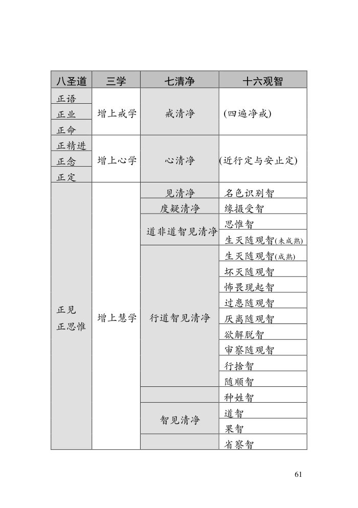

📅 最近更新：2026-09-29 13:00　|　第5版精修（朗读优化版）

# 第3周：十六观智次第（上·下）（学员版）

## 📋 本周信息卡

| 项目 | 内容 |
|:----|:-----|
| 时长 | 120分钟（4周版 · 9环节） |
| 核心问题 | 第一个观智「名色分别智」怎样把「我、有情」拆成名法与色法？「缘摄受智」「思惟智」「生灭随观智」「坏灭随观智」各看到什么？这五个观智怎样对应「七清净」与「三种遍知」？为什么说观智不能跳级？ |
| 共读原文 | 共读原文1：材料①《亲知实见.pdf》、材料②《如来禅修学体系90-摄业处分别2（课件）》。　｜　共读原文2：材料①《亲知实见》、材料②《突破止观-帕奥西亚多》。 |
| 本周作业 | ①简答题：按次第写出十六观智的前五个，各用一句话说明它看到什么。②实践题：本周任选一次情绪起伏，试着分辨「名法（能知的心）／色法（所缘的身体感受）」各是什么。 |

## 🧘 静心开场（10 min）

**（主持人引导语，语速放缓，每句之间留白）**

> 各位法友，请找一个让自己舒适的坐姿，可以盘腿，也可以坐在椅子上。轻轻闭上眼睛，或者让视线柔柔地落在前方地面。先做三次深长的呼吸——吸气，慢慢地；呼气，也慢慢地。
>
> 现在，把注意力带到身体。感觉一下此刻的坐姿，感觉身体与坐垫接触的地方，感觉双手放着的温度。不需要改变什么，只是知道。
>
> 接着，把注意力放到呼吸上。知道吸气，知道呼气。不去控制呼吸，只是陪伴它。吸气进来，呼气出去……如果心跑开了，不要责备它，轻轻地把它带回来，再回到呼吸。心跑开，是它的习惯；把它带回来，是我们的练习。**这份「知道、又带回来」，就是今天要走的路最朴素的第一步。**
>
> 今天我们要谈「十六观智的前五步」。请先给自己一个承诺：接下来的两个小时，我们只是来认识这条台阶怎么走，不是来给自己数台阶。**你修到第几个观智、有没有见到光、坐得久不久，都不是今天要评的；今天要看的，是这条路长什么样、我的心愿不愿意往那边走一步。**
>
> 现在，我们来练习一会儿慈心。先想到自己，在心里轻轻地对自己说：愿我健康，愿我快乐，愿我平安，愿我远离痛苦。
>
> 把这份善意，送给坐在你左右的每一位法友——愿他们健康，愿他们快乐，愿他们平安。
>
> 再把它扩大一些，送给今天要学的法——愿我们听得明白，愿法义入心，愿所学能真正用在生活里。
>
> 现在，也把这份清明与柔和，送到我们自己的心上——愿我面对「观智」「名色」「光明」这些名字时，心里没有攀比、没有自卑，只有一份愿意认识、愿意一步步走的平常心。
>
> 好，最后做三次深呼吸，把身心安放好——吸气，知道；呼气，放下。保持这份开放与柔和，我们慢慢睁开眼睛，回到当下。带着这份不比较、不评判的心，我们一起进入今天的共读。

- **变体一（时间紧）**：只做三次深呼吸＋观身体三处（坐姿、双手、面部）＋一句慈心愿，3—5 分钟。
- **变体二（学员情绪不稳）**：把重点放在「呼吸为锚」，并说明：「今天如果心里冒出很多念头、甚至有点难受，随时可以只是回到呼吸，不必跟着讨论走。」
- **变体三（时间富余）**：在慈心前加 2 分钟「专注练习」——让学员把注意力放在「鼻端的一团气息」上三十秒，再睁眼分享「刚才心有没有跑、跑了几次」，自然引出「观智＝先要把心看得清」。
- **变体四（有学员迟到／中途进出）**：不必停机等候，让迟到者安静入座、跟上呼吸即可；一句「来，我们一起回到呼吸」，比任何解释都稳。
- **衔接句**：静心结束到共读，用一句过渡：「现在，我们把这份安静带到文字里——接下来这几段，写的就是这条台阶，从『拆开一个我』一直到『把重心放在灭上』。」
- **变体五（有学员第一次来、紧张）**：多说一句「今天没有考试、没有人会评你，坐着听就好」，把节奏再放慢一点，引导语多留白。
- **变体六（有学员分享欲强、想谈境界）**：静心结束前立一句「今天的分享，我们说『心』，不说『境界』」，为后面的分享定好调。

> 💬 **破冰｜3–5分钟**：说说看：你有没有过「看着一样东西，忽然觉得它一直在变」的一瞬间？

> 🛡️ **心理安全三约定**（每次开场在心里过一遍）：① **保密**——这里说的话不出这间屋子；② **不评判**——不评价任何人的分享，也不急着评价自己；③ **可随时暂停**——任何时候觉得不舒服，都可以停下来休息、喝水或离开，不需要解释。

## 📖 共读原文1（20 min）

### 原文材料①：★核心·亲知实见.pdf

- **文件**：《亲知实见.pdf》

**照录（逐字·绪论第三节〈通达究竟色法（四界差别）〉）：**

> 如果你是一名止乘者，拥有强有力的禅定且能善加保护，我们会教导你修习四界差别(catudhātuvavatthāna)$^{47}$来如实知见色法。但如果你并不倾向于修止，而希望只培育到近行定，则可直接从四界差别入手。
>
> 我们首先教导辨识色法有几个原因。一个原因是辨识色法是非常精微和深奥的，尽管色法的生灭次数每秒钟数以十亿计，但它的生灭速度仍然不及名法那么快。这意味着只有你完成了深奥的对色法的辨识，比这更为深奥的对名法的辨识才会变得容易。另一个原因是，名法依色法而生起，除非禅修者能见到心识赖以生存的具体色法，否则他根本无法见到名法。要见到名法，禅修者需要见到它的生起。$^{48}$
>
> 修四界差别意即辨识物质现象中的四界，并且从你自己身体的色法开始，即从佛陀所说的内(ajjhatta)色开始。佛陀在《大念处经》(Mahāsatipaṭṭhāna sutta)$^{49}$中教导四界差别：
>
> “再者，诸比库，比库如其住立，如其所处，以界(dhātu)观察此身：“于此身中，有
> [1] 地界 (pathavīdhātu)、
> [2] 水界 (āpodhātu)、
> [3] 火界 (tejodhātu)、
> [4] 风界 (vāyodhātu)。
>
> 佛陀教导四界差别的目的是使我们有能力知见究竟色法。首先，你把自己的身体视为一个色法的密集体块，并在这体块中培育知见四界不同特相的能力。随着熟练度以及定力的加深，你最终将能见到色聚。接着，藉助已经培育的禅定之光，你将有能力破除密集的错觉$^{51}$，通达究竟色法，了知、观照、识别和分析不同类型的色聚中的各别色法。

**照录（逐字·绪论第三节〈通达究竟名法·节录〉与〈三种清净〉）：**

> 真正知见不同种类的究竟色法之后，你可进一步了知和照见究竟名法，即修习名业处(Nāma-kammaṭṭhāna)。
>
> 我们可通过六依处或六根门来辨识名法。$^{52}$ 但是，由于你已通过根门辨识过色法，因此《清净之道》说也应以同样的方法来辨识名法：“他如此通过门摄受色，则非色变得明显。”(Vm.664) 复注进一步说通过门辨识名法就“不会混乱”。$^{53}$
>
> 前面已经提过六根门及其所缘，即：
>
> 1) 眼门，取颜色为所缘。
> 2) 耳门，取声为所缘。
> 3) 鼻门，取香（气味）为所缘。
> 4) 舌门，取味为所缘。
> 5) 身门，取触为所缘。
> 6) 意门(有分), 取前面五种色法根门的五所缘, 以及法所缘$^{54}$为所缘。
>
> 依照心的定律(cittaniyāma),当六所缘的其中一种撞击相应的根门时,会生起一系列的心识(citta),而每一心识皆伴随着若干的相应心所(cetasika)共同生起。这一系列的心识及相应心所即称为“心路”(cittavīthi)。共有六种心路。
>
> 以此，佛陀把名法分为十六种心，意即你应通过六根门如实知见每一对心，例如伴随着贪的心和离贪之心，并进行内观、外观和内外观。如此，你将通达并如实知见究竟名法。

**照录（逐字·绪论第三节〈三种清净〉）：**

> 已如实知见名色法之后，你便成就了三种清净$^{62}$。《清净之道》$^{63}$解释$^{64}$：
>
> [1] 戒清净(sīlavisuddhi)名为善清净的巴帝摩卡防护等四种戒。
> [2] 心清净(cittavisuddhi)名为包括近行定的八定。$^{65}$
> [3] 如实见到名色法名为见清净(diṭthivisuddhi)。

**照录（逐字·绪论第四节〈知见第二圣谛与知见缘起〉）：**

> 然而，为了证悟涅槃，我们还需要知见苦集圣谛。佛陀在《转法轮经》(Dhammacakkappavattana sutta)中这样解释：
>
> “诸比库，此是苦集圣谛——此爱(taṇhā)导致再有，与喜、贪俱，于处处而喜乐，此即：
> [1] 欲爱(kāmataṇhā)、
> [2] 有爱(bhavataṇhā)、
> [3] 无有爱(vibhavataṇhā)。”(S.5.1081)
>
> 佛陀也把苦集圣谛详细解释为缘起 (paṭicca-samuppāda): $^{66}$
>
> “诸比库，什么是苦集圣谛(Dukkhasamudayam-ariyasaccam)呢？
> [1] 无明(avijā)缘行(saṅkhārā),
> [2] 行缘识(vīñ̄ñ̄ṇa),
> [3] 识缘名色(nāmarūpa),
> [4] 名色缘六处(saļāyatana),
> [5] 六处缘触(phassa),
> [6] 触缘受(vedanā),
> [7] 受缘爱(taṇhā),
> [8] 爱缘取(upādāna),
> [9] 取缘有(bhava),
> [10] 有缘生(jāti),
> [11] 生缘
> [12] 老、死(jarā-maraṇa)、愁(soka)、悲(parideva)、苦(dukkha)、忧(domanassa)、恼(upāyāsā)。
> 如此，整个苦蕴生起。
> 诸比库，这称为苦集圣谛 (Idam vuccati, bhikkhave, dukkhasamudayam ariyasaccam)。”(A.3.62)
>
> 这同样需要如实知见，知见某一生中的五种因（无明、行、爱、取和有67）如何带来再生，即五种果（识、名色、六处、触和受）。你需要见到这一过程如何生生相续，轮转不息。

**照录（逐字·第七讲〈如何辨识外在名法〉末段，完成〈名色限定智〉）：**

> 最后，你应以智慧确定所有这些名法和色法：遍及无边的宇宙，都不见有众生、男人或女人，只是名与色而已。对名法的辨识(Nàma-kammaññhàna)至此结束。
>
> 禅修到此阶段，你已经培育了定力，并已运用它辨识遍及无边宇宙的所有二十八种色法283，以及所有五十三种名法284。至此，你已经完成了第一种观智——名色限定智(Nàmaråpapariccheda-¤àõa)。
>
> 在下次开示中，我们将探讨观智的下一个阶段——辨识缘起(pañiccasamuppàda)。

**照录（逐字·第六讲〈如何透视缘起的连结〉：三轮转与完成〈缘摄受智〉）：**

> 缘起(pañiccasamuppàda)包括十二支307。它们可分为三轮转(vañña)，两个因轮转（五因）和一个果轮转（五果）308：
>
> 1) 烦恼轮转(kilesavañña)：
> i) 无明(avijjà)
> ii) 爱(taõhà)
> iii) 取(upàdàna)
>
> 2) 业轮转(kammavañña)：
> i) 行(saïkhàrà)
> ii) 业有(kammabhava)
>
> 3) 果报轮转(vipàkavañña)：
> i) 识(vi¤¤àõa)
> ii) 名色(nàmaråpa)
> iii) 六处(salàyatana)
> iv) 触(phassa)
> v) 受(vedanà)
>
> 烦恼轮转是业轮转之因，业轮转又是果报轮转——生、老和死（第十一和十二支）——之因。辨识缘起涉及透视这三轮转的因果关系，并从辨识过去开始。
>
> 在今生，这名禅修者是缅甸大城市里受教育的女人。她能（以正见）直接辨识过去生供养水果的业力如何引生今生的果报五蕴。以这种方法辨识因果的能力称为缘摄受智(Paccayapariggaha-¤àõa)。

### 原文材料②：★核心·如来禅修学体系90-摄业处分别2（课件）

- **文件**：《如来禅修学体系90-摄业处分别2（课件）》

## 💬 第一轮分享（10 min）

> **分享规则**：先说明「分享是邀请不是点名，沉默也完全允许」；每人 1.5–2 分钟，主持人守时；只讲自己的体会，不评价他人。

**起手问题（任选 2–3 个）**：

1. 今天之前，一听到「十六观智」「名色分别」，你脑子里浮现的是什么？读完材料后，这个画面有没有一点点变化？
2. 材料①说「遍及无边的宇宙，都不见有众生、男人或女人，只是名与色而已」——你觉得把「一个人」看成「一堆名法与色法」，是一种什么眼光？生活里有没有相近的一刻（比如看着人群，忽然觉得只是一堆移动的身与心）？
3. 「名色分别智」看「是什么」、「缘摄受智」看「从哪来」——这两个角度看自己的一天（比如看到一杯水、听到一句话），你会怎么拆？
4. 材料④说「光明等[九种]是随烦恼的对象故，才说为随烦恼，[它们本身]并非不善」——这句话让你对「修行中的好体验」有什么新的理解？

**（主持人提示）** 第一轮的目标是「把大家从『观智＝高不可攀』拉到『观智＝换一种眼光看世界』」。若有人一开口就谈境界、谈自己见到什么，礼貌而温和地把话头转向「那一刻你的心是什么感觉、你怎么看这个现象」，不鼓励攀比。

> **（追问示例）** 当有人分享完，可用这几句轻轻深入：「你说的那个『看成一堆现象』，当时心是紧的还是松的？」「那一刻背后有没有一点『想抓住它』的念头？」「如果那一刻过去了，你心里是什么反应？」——**目的是让分享落在「心的如实观察」上，而不是落在「我到了第几个观智」上。** 遇到有人因「做不到」而低落，一句「你今天愿意来、愿意试，就已经在路上了」就够，不必多说理。

## 🎯 第一轮主题讨论（10 min）

**第 1 题：名色分别智和缘摄受智，到底各看什么？为什么先看名色、再看缘起？**

> 提示：用「查一件东西」的比喻（名色分别＝拆开看它由什么构成；缘摄受＝往前追它从哪来、因是什么）。引材料③「这种观智也叫做『名色限定智』」与「这种观智也叫做『缘摄受智』」；引材料①「遍及无边的宇宙，都不见有众生、男人或女人，只是名与色而已」。引导发现：①名色分别智拆掉「我、有情、男女」的错觉（成就**见清净**）；②缘摄受智追到名色的因，即**缘起**（成就**度疑清净**）。落点：**「先看清『是什么』，才能看清『从哪来』——顺序不能颠倒。」** 心理安全：不要说「我连名色都分不清」，把重点放在「认识这两个角度」。

> **（延伸追问｜时间富余）** ①「你有没有在生活里，把一件让你生气的事『拆开』看——其实只是一堆声音、一个念头、一点身体的紧绷？拆开之后，气还在吗？」——引导发现，**拆名色本身就是消解执著**。②「如果名色是果、缘起是因，那你能不能在自己的一天里找到一对因果（比如一句抱怨和它背后的贪）？」——把缘起从书本拉回日常。（提示：不要往「找感觉」走，只做「认识」。）

**第 2 题：思惟智、生灭随观智、坏灭随观智——这三个观智怎样一级级往上升？**

> 提示：请学员先各自把材料③「前面的十三种观智」里第⑶⑷⑸念一遍，再用「看一条瀑布」的比喻——**思惟智**是「知道瀑布是水、在流动」（思惟三相）；**生灭随观智**是「真正看到水滴在不停生灭」（看到生灭）；**坏灭随观智**是「眼里只剩下『灭』」（重心放在灭时）。引材料③「这种观智叫做『生灭随观智』」「⑸ 坏灭随观智：特别观照五蕴的坏灭」。落点：**「由思惟到看见，由看见到偏向灭——台阶一级一级上，不能跳。」** 提示：这是「认识的框架」，不要求谁去对号入座。

> **（延伸追问｜时间富余）** ①「材料③说生灭随观智初期会『体验到之前从未体验过的光明』，还『可能认为已证悟道果』——如果你遇到这种体验，你会怎么做？」——接住任何猜测，说明**这正是需要善知识的原因，不是自己下判断的理由**。②「材料④说『光明等[九种]并非不善，但「欲」既是随烦恼，又是随烦恼的对象』——你觉得那个『想抓它』的念头，难不难放下？」——把心理安全落到「不执著」上，本周不展开细节。

**第 3 题：为什么说「观智是由定慧自然成熟、不能跳跃追求」？光相和神通为什么不是目标？**

> 提示：回到材料③「在这个修习观业处的初期阶段……你可能会……认为这些体验意味着已证悟道果了，于是开始执著它们，并滋长邪见和我慢」；再引材料④「真正能断除烦恼的是道智，而不是光明」「充其量只能说是一种隐喻而已」。引导讨论：观智是「让心清明、能看清真相」的次第，**不是抢来的成绩、不是用来炫耀的、也不是求神通的手段**。落点：**「实修不是为了显得高，是为了看得清、断烦恼。」** 收束到下一周（十六观智二：从怖畏到种姓）。

**（主持人收束）** 三题之后用一句话串起来：**名色分别看「是什么」，缘摄受看「从哪来」，思惟看「三相」，生灭看「生灭」，坏灭把重心放在「灭」——这就是观智的头五步。但它们由定慧自然长出来，不能跳级；路上出现的光、喜、乐是风景，不是终点，更不是神通。真正的目标是『如实知见、断除烦恼』。**

> **分层追问**（可视时间取用，由浅入深）：
> - 【现象】从名色识别到坏灭随观，哪一步你听着最陌生？
> - 【影响】想步步跳过、直奔「开悟」，通常会怎样？
> - 【应对】这周你愿意先老老实实地观察哪一件「一直在变」的日常小事？

## 🧘 禅修练习（15 min）

### 练习一

> ⚠️ **禅修禁忌提示**：若你正处在严重抑郁、焦虑、创伤后应激，或精神类疾病的发作／用药期，或正经历强烈的情绪危机，请先咨询医生或心理师，再决定是否练习；练习中若出现明显不适（如心悸、胸闷、情绪失控），请立即停止，睁开眼睛，把注意力放回呼吸与身体，必要时离场休息。

**（本周练习：入出息念＋数息＋「看生灭」的一点体验。主持人引导词，照读即可）**

> 各位法友，我们把刚才读到的，亲手试一点点——**只试一点点，不追求任何结果，更不追求观智。**
>
> 先找一个舒适的坐姿，背自然挺直，肩放松。可以闭眼，也可以微睁。做三次深呼吸，然后让呼吸回到它自然的节奏。
>
> 现在，把注意力放在鼻端——不是放在「皮肤上的触觉」，而是放在**这一带进出的那团气息上**。知道气息进来，知道气息出去。就这样，**知道，就好；不控制它。**
>
> 如果心跑开了——去想工作、去想待办的事——**不要责备它**。这很正常。发现它跑了，就轻轻地、欢喜地把它带回来，再回到呼吸。**你每一次「发现跑掉、又带回来」，都是在练定。**
>
> 今天，我们在呼吸上再轻轻多加一点——**留意每一次呼吸的「生」和「灭」**：气息进来，是一次的生；气息出去，是一次的灭；一次呼吸结束，下一次又开始。**就这样，看着一次呼吸的生、住、灭，来了又走、走了又来。** 不必分析，不必用力，只是知道。
>
> 如果念头太多、静不下来，我们用「数息」帮一把手：气息进来、出去，算「一」；再一进一出，算「二」……一直数到「八」，再从头来。数到「八」之后，停一下，给自己一个鼓励——「做得好」——再重新开始。**发现自己数乱了，就是正念回来了。** 带回来，重新从一开始。
>
> 好，我们就这样安安静静地，坐五分钟。……（静默）
>
> 现在，慢慢把注意力从呼吸上移开，感觉一下整个身体。带着这份「知道、又带回来」的温柔，慢慢睁开眼睛。

**（坐前一句定心）** 开始前可先说一句：「今天**没有人需要修出观智**，也没有人会因为『看不到名色』而被看低。我们只是坐下来，陪自己的呼吸几分钟——这已经是这条路的第一步。」说完再进入引导。

**（练习变体）**
- **变体一（时间紧，8 分钟）**：只做「三次深呼吸→知道气息进出→数息到八」一轮，不做「看生灭」的部分；结束时一句「带回来，就是练习」。
- **变体二（学员紧张／怕「做错」）**：把重点放在「不控制、不评价」，多说几次「它长就长、短就短，你只是知道」；提醒「走神不是失败，发现走神才是正念回来了」。
- **变体三（学员说「我看到光了／我好静」）**：接住并轻轻引导——「那一刻很棒；材料④说，这可能是定力或观智路上的风景（观之随烦恼），让它自然来去就好，不必去追它。」不追问细节、不评判高低。
- **变体四（有人身体不适）**：允许睁眼、换坐姿、靠背、甚至只是安静旁听；「身体舒服比姿势标准重要。」
- **收束语**：「把这份『知道、又带回来』带回家——每天五到十分钟，回到呼吸，看着它的生灭。不必求结果，也不必和谁比。」

### 练习二

> ⚠️ **禅修禁忌提示**：若你正处在严重抑郁、焦虑、创伤后应激，或精神类疾病的发作／用药期，或正经历强烈的情绪危机，请先咨询医生或心理师，再决定是否练习；练习中若出现明显不适（如心悸、胸闷、情绪失控），请立即停止，睁开眼睛，把注意力放回呼吸与身体，必要时离场休息。

**（练习引导词，照读即可；本周练习：「观呼吸的生灭·中舍一分钟」）**

> 各位法友，请找一个舒适的坐姿，闭上眼睛或让视线柔和地落在前方。先做三次深呼吸，让身体松下来。
>
> 现在，把注意力放在呼吸上。不是控制它，而是**看着它**。吸气，知道吸气；呼气，知道呼气。
>
> 接着，我们做一点不同的：**留意每次呼吸的「生起」与「消失」**——吸气从无到有，呼气从有到无。就像材料说的，**每次呼吸都在「坏灭」，都在「离去」**。不要用力去看，只是轻轻地知道：「哦，它来了，它又走了。」
>
> 如果心里生起一点「什么都留不住」的感觉，没关系，**不要怕它，也不要抓住它**；就像莲叶上的水珠，让它自己滑开。**这就是「行舍」的一点点味道——不拉扯、不紧抓。**
>
> 现在，试着做「中舍一分钟」：找一个你既不喜欢也不讨厌的对象——呼吸也好，脚下的触感也好——**只是中舍地看着它生灭，不催促、不评判、不追赶**。做不到也没关系，知道「做不到」，也是一种知道。
>
> 好，我们就这样安安静静地坐五分钟。……（静默）
>
> 现在，慢慢把注意力带回来，感觉一下整个身体。带着这份「不拉扯」的温柔，慢慢睁开眼睛。

## 📖 共读原文2（20 min）

### 原文材料①：亲知实见（★核心；与读书会19第7周同文件不同段落）

- **文件**：《亲知实见》

**照录（逐字·十六观智全表）：**

十六观智是：

1) 名色限定智(Nàmaråpapariccheda-¤àõa)

2) 缘摄受智(Paccayapariggaha-¤àõa)

3) 思惟智(Sammasana-¤àõa)

4) 生灭智(Udayabbaya-¤àõa)

5) 坏灭智(Bhaïga-¤àõa)

6) 怖畏智(Bhaya-¤àõa)

7) 过患智(âdãnava-¤àõa)

8) 厌离智(Nibbidà-¤àõa)

9) 欲解脱智(Mu¤citukamyatà-¤àõa)

10) 审察智(Pañisaïkhà-¤àõa)

11) 行舍智(Saïkhàrupekkhà-¤àõa)

12) 随顺智(Anuloma-¤àõa)

13) 种姓智(Gotrabhu-¤àõa)

14) 道智(Magga-¤àõa)

15) 果智(Phala-¤àõa)

16) 省察智(Paccavekkhaõa-¤àõa)

现在你知道这些观智的名称，你能体验到它们吗？不能。所以只是拥有闻思理论是不够的，你也必须非常精进地实修以领悟它们。

**照录（逐字·问答（四）问4-3·小入流）：**

3) 至于普通弟子，如果他们透彻修习止观达到缘摄受智(Paccayapariggaha-¤àõa)，或生灭智(Udayabbaya-¤àõa)，或行舍智(Saïkhàrupekkhà-¤àõa)，即使今生尚未证悟任何道果，他们死后也不会投生到四恶趣(apàya)的任何一种。对此，《清净之道》解释：

ßIminà pana ¤àõena samannàgato vipassako buddhasàsane laddhassàso laddhapatiññho niyatagatiko cåëasotàpanno nàma hoti.û

"具足此智的修观者，在佛陀的教法中得安息、得依处、决定至而名为小入流(cåëasotàpanna)。231"(Vm.691)

### 原文材料②：突破止观-帕奥西亚多（★核心·本周主力照读，free）

- **文件**：《突破止观-帕奥西亚多》

**照录（逐字·坏灭随观→怖畏智）：**

# 坏灭随观

当他如此重复地观照、检验及分析名色与因果，以知见它们是无常、苦、无我、不净时，其前后的观智互相连接，因此其观智变得非常强大、非常敏锐与清净。

他不再注意它们的生起，只是注意它们的坏灭。

'Khaya vaya bheda nirodheyeva satisantiṭṭhati.'——「在前生观智的强大支助下，与后生观智相应的念善左于诸行的毁坏、坏灭与灭尽。」

(1)「灭尽而无常」(aniccaṁ khayaṭṭthena)：以智亲自知见诸行离去、毁坏、坏灭与消失的本质，他重复地观照「无常、无常」。

(2)「怖畏而苦」(dukkhaṁ bhayaṭṭthena)：以智亲自知见诸行离去、毁坏、坏灭与消失的恐怖本质，他重复地观照「苦、苦」。

(3)「无实质而无我」(anattā asārakaṭṭthena)：以智亲自知见诸行无实质、无自我、无灵魂的本质，他重复地观照「无我、无我」。

(4) 他也观照诸行的不净本质。

由于在修行名色分别智以培育见清净时，他已经破除了名聚与色聚的密集而知见究竟法，所以现在色聚不再显现。由于其观智非常敏锐与精确，诸行究竟法非常迅速与明显地呈现于其智。由于它们非常迅速地生灭，他不再见到它们的生起与住立，只是见到它们的坏灭。

这是「坏灭智」(bhangañāṇa)。

# 生起怖畏智 (bhayañāṇa)

如此重复地培育坏灭智时，组成一切有、生、趣、界或有情住处的诸行显现得非常恐怖。不断地遭受诸行坏灭的折磨变得非常明显，显现为大苦大怖畏。

当他知见过去诸行已经坏灭、现在诸行正在坏灭、未来会生起的诸行将会同样地坏灭的时候，在他心中生起了怖畏智。

**照录（逐字·过患智→厌离智→欲解脱智）：**

# 生起过患智 (ādīnavañāṇa)

重复地培育怖畏智时，他在一切有、生、趣、界或住处里都找不到避难所、庇护所、可去之处、归依处。三有显现得好像是充满炽烈火碳的火碳坑，四界就像是毒蛇，五蕴就像是高举武器的杀手，六内处就像是空村，六外处就像是打劫村庄的马贼，七识界与有情的九种住处就像是遭受十一种火燃烧、焚烧、烧到发亮。诸行显现得好像一大堆的危难与过患，毫无满足与实质，就像疮、病、箭、恶、疾。

如是，透过坏灭随观 (bhaṅānupassana) 的力量，诸行显现为恐怖的危难，禅修者心中生起了知见其过患的观智。

# 生起厌离智 (nibbidāñāṇa)

知见诸行为充满过患的危难时，他厌离、厌倦、不满意、不乐于一切有、生、趣、界或住处里的种种行法。因此厌离诸行的观智也变得明显。

# 生起欲解脱智 (muñcitukamyatāñāṇa)

当他对不断地坏灭的诸行感到厌倦与厌离时，他不满意、不乐于、不再执著一切有、生、趣、界或住处里的任何行法。他想要解脱一切行法。

正如网中鱼、蛇口中的蛙、笼中山鸡、堕入陷阱的鹿、受众敌包围的人想要解脱逃离这些(危难),同样地,禅修者想要解脱一切行法。他心中生起了欲解脱智。

**照录（逐字·审察智）：**

# 生起审察智 (paṭisaṅkhāñāṇa)

想要解脱三十一界三时诸行的禅修者再次以观智观照诸行的三相。他知见诸行无常，因为它们是(1)无法超越坏灭、(2)短暂地存在、(3)受到生灭限制、(4)毁、(5)波动、(6)坏、(7)不恒、(8)变易法、(9)不实、(10)死法。

他知见诸行苦，因为它们是(1)不断地遭受折磨、(2)难以忍受、(3)苦因、(4)病、(5)疮、(6)箭、(7)恶、(8)疾、(9)难、(10)祸、(11)怖畏、(12)非保护所、(13)非避难所、(14)非归依处、(15)过患、(16)恶之根、(17)杀戮者、(18)有漏、(19)魔食、(20)生法、(21)老法、(22)病法、(23)愁法、(24)悲法、(25)恼法、(26)杂染法等等。

他知见诸行无我，因为它们是(1)敌、(2)无灵魂、(3)虚、(4)空、(5)无主、(6)无法控制、(7)依欲望而变易等等。

他知见诸行不净，因为它们是（1）应受抗拒、（2）恶臭、（3）可厌、（4）不净、（5）无法伪装、（6）丑恶、（7）厌恶等等。

如此精进修行时，他心中生起了审察智。

**照录（逐字·行舍智）：**

# 生起行舍智 (saṅkhārupekkhāñāṇa)

他重复地、轮流地观照三十一界诸行与因果的无常、苦、无我、不净本质，一时观内，一时观外。此时诸行的坏灭呈现得非常清晰且迅速。他继续轮流地观照诸行坏灭的三相。

其禅修之心逐渐地去除了对诸行的怖畏与喜乐，而变得中舍。它宁静地观照诸行的坏灭。

如果禅修之心保持宁静地观照内在诸行，他便继续轮流观照内在的色法与名法。如果禅修之心保持宁静地观照外在诸行，他便继续轮流观照外在的色法与名法。对于三相，他著重于观照能够观得最好的相。

在这个阶段，特别需要以念来平衡信与慧、精进与定。所有五根必须达到平衡，以便能够觉悟。

禅修之心宁静地观照诸行的坏灭时，禅修者不会听到外在的声音。如果禅修之心宁静地、固定地、不动摇地观照诸行的坏灭，其观禅已变得特别的强大。禅修者能够持续地观照他能够观得最好的行法，著重于观照能够观得最好的相。如果他只观到名法的坏灭，而没有观到色法的坏灭，他就应只是专注于观照名法的坏灭。

'Bhayañca nandiñca vippahāya sabbasañkhāresu udāsino hoti mijjhatto.'——「清楚地知见诸行的过患、极欲解脱一切行法的禅修者观照诸行坏灭时，他找不到任何可视为『我的、我、我的自我』之法。」

舍弃了对诸行的「怖畏」与「喜乐」这两个极端，他中舍地对待它们。他不执取它们为「我」或「我的」或「我的自我」，他就像已经休掉不忠的妻子的男人。使他达到如此中舍之境的智慧是行舍智。

在行舍智的阶段，如果心见到宁静的涅槃——寂静之境——它便舍弃诸行，投入涅槃。如果没有见到宁静的涅槃，行舍智便一而再地缘取诸行为目标，就像水手的乌鸦在见不到陆地时会一而再地飞回船上。

若此智还未成熟，禅修者继续（1）观现在行法一段时间，（2）观过去行法一段时间，（3）观未来行法一段时间，（4）观内在行法一段时间，（5）观外在行法一段时间，（6）观色法一段时间，（7）观名法一段时间，（8）观因一段时间，（9）观果一段时间，（10）观无常一段时间，（11）观苦一段时间，（12）观无我一段时间，以令其智成熟。

**照录（逐字·随顺智、种姓智、道智、果智、省察智）：**

# 随顺智、种姓智、道智、果智、省察智

重复地修行与培育行舍智时，其信变得更加坚定，其精进更加强大，其念更稳固地建立，其心更加专注，其对诸行的中舍更加微细。

## 💬 第二轮分享（10 min）

**（分享规则）** 自愿分享，不点名、不强求；每人 1—2 分钟，主持人控时。可按「**我看到／我触动／我疑问**」三选一起头。

**（起手问题）**

1. **我看到**：今天读到的八智一链（坏灭→怖畏→过患→厌离→欲解脱→审察→行舍→随顺→种姓）中，**哪一个词最让你有感觉？为什么？**
2. **我触动**：材料④说诸行「犹如莲叶上的水珠」——你对「退开、不粘著」这句话有什么体会？生活中有没有类似的时刻？
3. **我疑问**：有没有哪个地方你听不太懂、或有点不安（比如「怖畏」「空村」「毒蛇」这些比喻）？请提出来，我们一起看。

## 🎯 第二轮主题讨论（10 min）

> 三题由浅入深，指向实修；每题 10—12 分钟。

**引导问题一（认识层）**：材料②说，坏灭智之后，心「不再注意它们的生起，只是注意它们的坏灭」，于是「诸行显现得非常恐怖」。**为什么「只看见坏灭」会带来「怖畏」？** 这份「怖畏」和我们平时说的「害怕」有什么不同？

- **提示**：坏灭智只看到「散」，看不到「生」——就像一直看着东西在碎。**怖畏智是「如实知见诸行坏灭」的智慧**，不是情绪发作。可引导学员发现：**我们平时拼命抓的东西，本质上是抓不住的——这正是「怖畏」要提醒的。**
- **落点**：不是叫人恐惧，而是叫人**看清「抓不住」而认真起来**。

**引导问题二（转折层）**：从「过患」「厌离」「欲解脱」，到「行舍」——**「行舍智」为什么被称为枢纽？** 材料②说它「去除了对诸行的怖畏与喜乐」，材料④说心如「莲叶上的水珠」。请谈谈你的理解。

- **提示**：「行舍」不是无情、不是麻木。**它退开的是「怖畏」与「贪著」两个极端**，剩下的是一种清明而中舍的观照。可引导：**生活里我们常被两股力量拉着——怕失去、想抓住；行舍就是那根「松开的绳」。**
- **落点**：中舍不是没有感觉，而是**不被感觉牵着走**。

**引导问题三（实修层）**：材料④说：「若行舍智以无常观照诸行而现起，则成就无相解脱；若以苦观照而现起，则成就无愿解脱；若无我观照而现起，则成就空性解脱。」——**「三解脱门」是怎样从「观」里出来的？** 这对我们现在的日常练习有什么启发？

- **提示**：三解脱门不是三个要去追的目标，而是**同一次观照的三张面孔**——观无常、观苦、观无我，自然对应无相、无愿、空性。可引导：**今天练一次「观呼吸的无常」：一次呼吸生起、消失，这就是「无相」的雏形。**
- **落点**：解脱是**观出来的**，不是求来的；把「观」落在当下这一口呼吸上。

**（讨论纪律）** 主持人在每题开始前，先请「愿意说的」发言；**不比较谁修得好、不评判、不诊断**。若有人因「我观不到」而沮丧，接住：「观智是自然成熟的，因缘不同；今天认识了，就是在种因。」若有人因「怖畏」而紧张，接住：「这些是智慧的语言，不是情绪；今天只是认识。」

### 🧭 每题可能的偏题与拉回（主持人预案）

| 偏题方向 | 表现 | 拉回话术 |
|---|---|---|
| 变成「心理惊悚讨论」 | 一直在谈「毒蛇／空村／火坑」多可怕 | 「这些是**比喻**，形容诸行的过患；重点不是可怕，是让我们看清『抓不住』。」 |
| 变成「果位自评」 | 「我上次打坐好像有怖畏，是不是第 6 智了？」 | 「我们不给自己或别人定级。观智是自然成熟的，**认识道路 ≠ 衡量等级**。」 |
| 变成「境界炫耀」 | 有人细述自己的体验，他人羡慕 | 「谢谢分享。请把注意力放回**自己的心**，别人的路不是你的尺。」 |
| 变成「流派之争」 | 争论帕奥／其他传承 | 「各有侧重，选路靠善知识；**今天只认识次第本身**。」 |
| 变成「理论名相战」 | 纠结巴利拼写、术语异译 | 「名称各异、义理为一（材料④《解脱道论》语）；**方向懂了就好**。」 |

### 🧩 讨论收束小结（主持人口述，约 1 分钟）

> 「今天三题小结一下：**第一**，只看见坏灭，就会生出怖畏——这不是害怕，是看清；**第二**，从怖畏到行舍，是心从两个极端里退出来，变得中舍，如莲叶上的水珠；**第三**，三解脱门不是三个门，是同一次观照的三张面孔——观无常得无相、观苦得无愿、观无我得空性。**落点只有一句：解脱是『观』出来的，不是『求』来的。**」

> **分层追问**（可视时间取用，由浅入深）：
> - 【现象】「怖畏」到「种姓」这一段，你最难想象的是哪一步？
> - 【影响】把「怖畏」理解成害怕，会带来什么误会？
> - 【应对】这周你愿意在哪件事上，练习一次「看清过患、但不恐慌」？

## 🔚 收尾与回向（15 min）

### 收尾一

**（总结引导）**

> 各位法友，今天我们把「从凡夫到圣者的内在进程」，看清楚了它的头五级台阶：**名色分别看『是什么』，缘摄受看『从哪来』，思惟看『三相』，生灭看『生灭』，坏灭把重心放在『灭』。** 我们真正要记住的一句，是材料③里那句话：**「观智依其由浅入深的进展过程分为十六种……是禅修者培育观智、由凡至圣必须经过的十六个阶段。」** 它是「由浅入深的次第」，不是「抢来的成绩」。还有材料④那句：**「真正能断除烦恼的是道智，而不是光明。」** 路上的光、喜、乐，是风景，不是终点。
>
> 这一周，请大家只在生活里做一件小事：每天五到十分钟，知道自己的呼吸，看着它来了又走。走神了，带回来；不追求结果，也不必羡慕任何人的境界。

**（一句话总结·可写在白板）** **名色分别（看是什么）→ 缘摄受（看从哪来）→ 思惟（思惟三相）→ 生灭（看到生灭）→ 坏灭（重心放在灭）→ 由定慧自然成熟，不跳级、不以光相神通为目标。**

**（邀请分享·自愿）** 各位法友，在我们回向之前，我想邀请几位——**愿意的话**，用一句话说说：今天读完，你对「观智」的印象，和来时相比，有没有一点点不同？也许你想说的是「原来它不是高不可攀」，也许是「原来它要一级级来」，也许是「原来『光』不是目标」。**愿意说就说，不说也完全可以**；说完这一句，我们就把今天的法收进心里，带回家。

**（下周预告）** 下一周，第 6 周「十六观智次第（二）——从怖畏到种姓」：我们将接着往下走——**怖畏→过患→厌离→欲解脱→审察→行舍→随顺→种姓**，以及「三解脱门」。本周先把「前五步」收好，下周我们继续上台阶。

**（回向词·四句）**

> 愿以此功德，回向于一切；
> 愿一切众生，离苦得安乐。
> 愿正法久住，愿法轮常转；
> 愿我等所修，皆向于解脱。

### 收尾二

**（总结引导）**

> 各位法友，今天我们把十六观智的后半段走了一遍：**坏灭智之后，心依次生起怖畏、过患、厌离、欲解脱、审察，然后安住于行舍——对诸行中舍、不怖不畏、不贪不著；最后随顺、种姓而生，一脚跨进圣道。** 我们真正要带走的一句，是材料②里的话：**「舍弃了对诸行的『怖畏』与『喜乐』这两个极端，他中舍地对待它们」**——修行不是变得冷漠，而是不再被拉扯。
>
> 材料④还提醒我们：**「犹如莲叶上的水珠」**——心对一切退避、回转、不舒展。这份「退开」，不是逃避，是清凉。
>
> 这一周，请大家只在生活里做一件小事：**选一件你很在意的小事（一条评论、一笔钱、一句话），在它让你烦的时候，试着看看它「必定坏灭、无实质」的一面，体会一次「退开」的感觉。** 这一看，就是把「闻思」往「修」推。
>
> 最后再叮咛一句：这一整段，是一张**地图**，不是一张**成绩单**。**不比较境界，不追求境界，不以证果为目标**——只管在当下的戒定慧上用心。

**（下周预告）** 下一周，第 7 周「道智与果智、省察智——证悟的瞬间」：本周我们停在「种姓智」这道门槛前，下周我们走进门里——**四道四果八心、道心的四种作用、省察智的五类回看**，看凡夫如何在那一瞬间成为圣者。本周先把「八智一链＋行舍是枢纽」收好，下周我们跨过这道门。

**（回向词·四句）**

> 愿以此功德，回向于一切；
> 愿一切众生，离苦得安乐。
> 愿正法久住，愿法轮常转；
> 愿我等所修，皆向于解脱。

### 🕯 本周金句（可写板书／供学员带走）

> 1. **「他不再注意它们的生起，只是注意它们的坏灭。」**（材料②·坏灭随观——本周的起点）
> 2. **「舍弃了对诸行的『怖畏』与『喜乐』这两个极端，他中舍地对待它们。」**（材料②·行舍智——本周的枢纽）
> 3. **「犹如莲叶上的水珠。」**（材料④·行舍智——退开而清凉）
> 4. **「把禅修者的种姓从凡夫转换成圣者。」**（材料②·种姓智——凡圣的分界）
> 5. **「这是一张地图，不是一张成绩单。」**（主持人护身语——不比较、不追求、不以证果为目标）

---

## 📖 延伸阅读（课后自由选读）

《亲知实见》——修观辨识名色、缘摄受智与十六观智次第表。
《如来禅修学体系90-摄业处分别2（课件）》——十六观智与七清净对应表。
《突破止观-帕奥西亚多》——坏灭随观到行舍智的完整次第（本周主力照读）。
《证悟涅槃的唯一之道（帕奥·玛欣德译）》——十六观智总说与三种遍知。
《止观法要》——八圣道·三学·七清净·十六观智对照。
