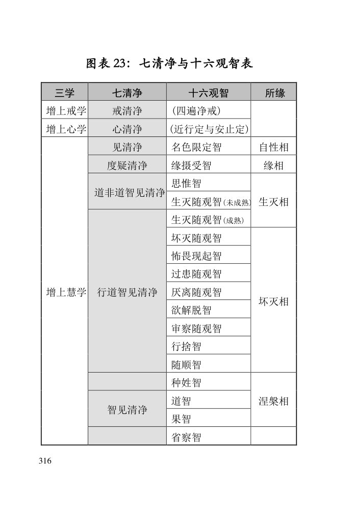

📅 最近更新：2026-09-29 13:00　|　第5版精修（朗读优化版）

# 第4周：道果智省察智与修行全景总结（主持人版）

> ⭐ **本讲主持人速览**（新主持人必读，2分钟看完）
>
> 你不是老师，是"共学同行者"。你不需要提前懂内容，只需要按流程走。
> **本周由连续两周内容合并**而成，含两段共读、两轮分享与两轮讨论，单讲 120 分钟。
>
> | 环节 | 标准时长 | ⏱ 时间不够→ | ⏱ 时间富余→ |
> |:-----|:----:|:-----|:-----|
> | 🧘 静心开场 | 10 min | 缩至5 min | 加2分钟静坐 |
> | 📖 共读原文1 | 20 min | 只读★核心段（约15 min） | 加读◈扩展段 |
> | 💬 第一轮分享 | 10 min | 每人1句话 | 每人3分钟 |
> | 🎯 第一轮主题讨论 | 10 min | 只讨论问题① | 讨论全部问题+扩展 |
> | 🧘 禅修练习 | 15 min | 缩至8 min（只念引导词前半） | 延长至20 min |
> | 📖 共读原文2 | 20 min | 只读★核心段 | 加读◈扩展段 |
> | 💬 第二轮分享 | 10 min | 每人1句话 | 每人3分钟 |
> | 🎯 第二轮主题讨论 | 10 min | 只讨论问题① | 讨论全部问题+扩展 |
> | 🔚 收尾与回向 | 15 min | 缩至10 min | 保持 |
>
> **主持人10条守则（精简版）**：
> ① 不讲解、不提供答案——让原文自己说话；② 有人问"正确答案"→说"先听听大家的看法"；③ 冷场→主持人先分享自己的真实感受；④ 跑题→温和拉回："这个有意思，我们回到今天的原文"；⑤ 争论→"两种看法都很好，大家保留自己的理解"；⑥ 确保人人发言；⑦ 不评判任何人的分享；⑧ 时间到了就推进；⑨ 禅修练习照读引导词即可；⑩ 结束一起回向。

> 本周主题：**四道四果对应八种出世间心；道智斩断烦恼、果智无间体验解脱——而在证悟之后，还有省察智回头检验「道、果、涅槃、已断、未断」五种；圣者尚且要靠经论与多年时间去验证，凡夫更当谦慎。**；**修行不是一段段割裂的知识，而是一条完整的路——以八圣道归摄戒定慧三学为总纲，以七清净为次第，以十六观智为实修，以道果涅槃为终点；而看清这条路的目的，不是给自己加压，而是让自己在漫漫轮回里不迷路、不退转——发心与当下戒定慧的实践本身，就已经在道上。**。

---

## 📋 本周信息卡

| 项目 | 内容 |
|:----|:-----|
| 时长 | 120分钟（4周版 · 9环节） |
| 核心问题 | 「戒定慧三学」与「七清净」是什么关系？八圣道如何归摄入三学？十六观智在整个体系里处在什么位置？从「世间观智」到「出世间四种道智」，再到「涅槃」，这条路是怎样走通的？ |
| 共读原文 | 共读原文1：材料①《第107讲-出世间心-共修版.pdf》、材料②《第108讲-出世间心2-共修版.pdf》。　｜　共读原文2：材料①《上座部佛教與止觀》。 |
| 本周作业 | ①简答题：用一张图（或一段话）把「三学—七清净—十六观智—四道果—涅槃」串起来。②实践题：把这条路看完整之后，写下「我打算怎么继续走」的三件小事。 |

## 🧘 静心开场（10 min）

**（主持人照读即可）**

诸位法友，下午好。请把身体安顿好，坐得端正而放松，双手轻轻交叠放在腿上，眼睛可以微闭，或者垂视前方一点。先做三次深长的呼吸——吸气，慢慢吸满；呼气，慢慢吐尽。再来一次……再来一次。好，现在让呼吸回到自然，不刻意控制它，只是知道：**我正在呼吸。**

（静默约 30 秒，可敲一下引磬。）

我们把心，轻轻放在这一刻。今天我们要谈一个很有趣、也很深的话题——**「证悟的瞬间」**。听起来好像很遥远，但我们不谈「谁证了没证」，我们只借古源尊者开示的文字，去看清楚：**在那一瞬间，一颗心到底经历了什么翻转。**

在开始之前，请先在心里放一句话：**「我不是来认领果位的，我是来认识一条路、也认识自己的心的。」** 认识自己，就已经是最好的开始了。

（静默约 60 秒，可再敲一下引磬。）

好，让我们带着这份放松与诚实，进入今天的共读。

> 💬 **破冰｜3–5分钟**：说说看：如果有一瞬间能彻底看清自己，你希望那一刻看见什么？

> 🛡️ **心理安全三约定**（每次开场在心里过一遍）：① **保密**——这里说的话不出这间屋子；② **不评判**——不评价任何人的分享，也不急着评价自己；③ **可随时暂停**——任何时候觉得不舒服，都可以停下来休息、喝水或离开，不需要解释。

## 📖 共读原文1（20 min）

> ⚠️ 主持人操作：以下材料按「相貌（八心）→ 自检（五种省察）→ 警钟（大龙长老）」的顺序读。**材料②的「大龙长老」节请放慢、放稳，读到「阿拉汉还会有恐惧吗？」时停一拍，让全场感受那一惊。** 时间不够时，优先保材料①「道心果心八心」与材料②「省察智五类」「大龙长老」。

### 原文材料①：★核心·第107讲-出世间心-共修版.pdf

- **文件**：《第107讲-出世间心-共修版.pdf》

> ⚠️ 主持人操作：本材料是**八心结构定盘**，精读「道心与果心的定义·八种出世间心的由来」「八个出世间心·烦恼次第断除」；「akāliko 无时」「果定」各读一段。课件开篇图片式心法表 OCR 为乱码，**跳过不读**。

**〔出世间心＝心的超越（导读：不是跑去宇宙之外，是心超越诸行法）〕**

> 各位贤友好，我们今天开始学习八十九心的最后八个心，出世间的心。"啊！从世间出来"（笑）。我们前面讲的，不管是欲界、色界、无色界讲的都是世间心。到底是什么出世间心呢？我们很多人以前会理解为"出世间好像从我们这个世界里面跑出去了。出世间是不是在宇宙之外？"好多人都这样理解，认为出世间是在宇宙之外。
>
> 所以请大家记住，在我们佛法里面讲的出世间，是超越诸行法，超越五取蕴的这种世间。从根本上来讲，其实是心的超越，请大家记住。我们讲出世间，出世间是你的心超越了行法的世间，不会将诸行法看成常、乐、我、净的世间认知里面。因为诸行法是有为法，是无常、苦、无我的。出世间，也叫涅槃，是无为法。

**〔一、道心与果心的定义·八种出世间心的由来（导读：八心＝四道四果）〕**

> 因为有四道、四果：须陀洹道、斯陀含道、阿那含道和阿拉汉道，对应有四个果，所以总共就是八种出世间心（后面会讲为什么会有 40 种出世间心）。道心——是断除或者减弱烦恼的那个善心。这个善心生起来，它的作用就是断除和减弱烦恼。那跟我们世间的善心和不善心有什么区别呢？世间善心生起来的时候，是造善业、积功累德。不善心生起来了干嘛呢？它是造恶业，给未来留下苦的这种可能，给自己不断地制造苦，这是不善心的作用。而道心的作用，是断除烦恼或削弱烦恼。果心就是道心这个善心的果报。果报来得最快的就是这个果心。道心生起，下一个心识刹那，无间生起的就是果心。果心是体验由于道心斩除烦恼或削弱烦恼所带来的心的解脱的体验，那种感受。果心属于果报心。
>
> 大家学佛、修行干什么？是为了生起出世间心——道心、果心。道心、果心的直接作用是断除烦恼，不是中大奖，也不是神通无边。道心、果心的受用，是你相应的烦恼被断除了或者被削弱了。

**〔二、八个出世间心·烦恼次第断除（导读：入流→一来→不来→阿拉汉）〕**

> 那我们接下来看看八个出世间心。八个出世间心就是：入流道心，入流果心；一来道心，一来果心；不来道心，不来果心；阿拉汉道心，阿拉汉果心。
>
> 从入流道开始，烦恼开始被部分断除。到二果的时候，所有的烦恼被进一步削弱。到三果的时候，又断除了欲贪和瞋恚。到阿拉汉道的时候，所有的烦恼全部被断除。从一个凡夫到断除所有的烦恼，至少要经历这四次的证悟。那有人会问说："你看佛陀时代有很多圣弟子啊，都是从凡夫，一个非常烦恼的凡夫，见到佛陀，听佛陀说一个四句偈，然后就证阿拉汉果了。" 他是一下子就证阿拉汉果吗？不是的。他也是在听那一个四句偈的时候，在很短的时间里面，他从初果、二果、三果、四果，道心也是这样次第生起来的。只是他的时间很短而已。因为他过去累积了无数的巴拉密，就是等到听佛陀讲这句四句偈，把最后这一层窗户纸破掉。他也是按照这四个阶段来的。

**〔三、akāliko 无时·道果无间（导读：证悟的「速度」）〕**

> 那么我们回过头来再讲道智和果智。我们在修习法随念的时候，法随念就是 Svākkhāto bhagavatā dhammo, sandiṭṭhiko, akāliko, ehi-passiko, opanayiko, paccattaṃ veditabbo viññūhi'ti. 就是法是世尊所善说的，是自见的、无时的、来见的、导向涅槃的、是智者们可以各自证知的。佛陀所善说，前善、中善、后善，所有的教法都是这样的，不会自相矛盾的。是自见的，是你自己可以亲见的。无时的 akāliko，这个无时的，讲的就是你的巴拉密成熟的时候，道心生起，无间地，果智就生起。道心的下一个心识刹那就是果心，不用等，无需等待。无时，没有时间间隔。出世间的因果，跟我世间的因果差别就在这里面。
>
> 世间因果，我们讲造一个善业，要等待各种因缘。叫异熟果报，异熟，就是要其他的时间才可能成熟。当然，道心和果心也是异熟，但是它的异熟是无间的，下一个心识刹那。那在世间的善恶，它是要等待很长时间才会产生果报。也正是因为这样，我们讲："善有善报，恶有恶报。" 但很多人也都觉得造恶没有恶报，行善没有善报。为什么呢？因为它不是马上能成熟的，恶报、善报都不是立竿见影。所以我们讲："不见圣者，不闻圣法。" 不听圣者教的愚痴人啊，无闻凡夫啊，他为什么喜欢造恶呢？因为他看不见造恶立即带来结果。如果造恶立即带来结果，他一定不会干。但是出世间心，只要出世间善心——道心一生起，akāliko，出世间果心就无间地生起。道心和果心缘取的对象都是涅槃。证悟涅槃，一个人证悟涅槃，就是由这个道心和果心来执行的。

> ⚠️ 主持人操作：「akāliko」请让大家跟读一遍（阿-咖-利-勾），并点明——「无时」不是「没有时间」，而是「不用等」。

**〔四、果定：证果后是否一直住于果心（导读：果心唯入果定时生起）〕**

> 那证果了，是不是他就一直都在果心里面呢？不是这样的。只有入果定的时候，才能够生起果心。就像一个禅修者， 修完五自在，他也要决意入定，才可以投入禅相，然后入定。圣者也是这样，他只有修观智决意取涅槃为目标，再次把心投入涅槃的时候，才会投入果定。

**〔五、三解脱门（导读：道心从哪一道「门」进涅槃·略读）〕**

> 南北传都讲三解脱门，三解脱门指的是什么？就是无常门、苦门、无我门。无常门也称为无相门。为什么无相呢？因为无常嘛，它那个相状总是不能够稳定。无常的就叫无相门，通过无相门进到涅槃的大门，就是观诸行法的无常，从无相门进入。苦，称为无愿门。为什么无愿呢？那么苦，你怎么会有愿待在那呢？你就不想在那待着。……无我，是空门。 既然无我，没有主宰，是空。无相门、无愿门、空门，三解脱门。
>
> 三解脱门，是通过观察诸行法的无常相、苦相、无我相到达的。如果，你是在观察无常相的时候道心转起了，那你是从无相门进入出世间的；如果，你是观察诸行法的苦相而道心转起，你是从无愿门进入的；如果，你是在观察诸行法的无我相而道心出起的，是通过空门进入出世间，进入涅槃界的。

> ⚠️ 主持人操作：本节**略读即可**，只点明「道心从哪一道门进涅槃，取决于你当时观的是无常相、苦相还是无我相」，不必展开。

### 原文材料②：★核心·第108讲-出世间心2-共修版.pdf

- **文件**：《第108讲-出世间心2-共修版.pdf》

> ⚠️ 主持人操作：精读「一、省察智五类」与「三、大龙长老案例」；「二、三年检验」读两段；「四、如何检验是否证果」读「果定」「涅槃所缘」两段。`graph TD` 图示代码**跳过不读**。

**〔一、省察智·五种省察（导读：证悟后的「回头查一查」）〕**

> 昨天我们讲到了帕奥西亚多指导的怎样认识，你是不是证得道果了。根据佛陀的教导，智者可各自证知法。智者可各自证知，智者可以省察道心、果心、涅槃，这三个，以及已断除和没有断除的烦恼，五种省察的心路过程。也就是十六观智里面的道智、果智后面的那个省察智，最后第十六个省察智，就省察这五种。
>
> 帕奥西亚多讲到，省察道、果和涅槃的心路过程，每一位圣者都是可以生起来的。但是对于未断烦恼和已断烦恼的心路过程，那就必须通达经教、论藏，也就是对这些心所要了解。哪一些是不善心所，怎么去认识它，它有什么特相、作用、现起、近因，这些十结怎么来去观察，要有这样的教理基础。
>
> 观察，不是那么简单地说："有一个地方摆着，有一个仓库放着 52 心所，我进去算一算。"它不是这样的检查。我们知道，心的随眠烦恼是在心流里面，不是存在某个地方的。所以禅修者应该透由什么情况去省察呢？就是去缘取各种所缘。以前我们讲，十二种不善心缘取各种所缘和对象来生起不善速行。比如初果圣者断除有身见、戒禁取和怀疑，还有论教法讲的嫉妒和悭吝。那这些不善心，前面怀疑是属于痴根的心，戒禁取和有身见属于贪根心，嫉妒和悭吝属于瞋根心路。
>
> 什么样的所缘容易生起这样的心，你要懂。然后去找相应的所缘，观察那个所缘，你的心面对它的时候，相应的这些心所还会不会生起来？ 你以前所有的各种贪，初果圣者还能生起，但你观察所有的这些贪后面还有没有邪见。会不会认为这些男人、女人、财物、金银财宝，有无常、苦、无我的这种特质。看到别人成就，特别是修行的人，看到人家禅那比你高，人家已经二果、三果、四果了，你会不会生起嫉妒的心。要把你最喜爱的，不管是住所、资具、财物、最喜爱的妻子儿女（对在家人来说），还有你的学识布施出去，会不会觉得舍不得。

**〔二、三年检验（导读：雷迪西亚多建议至少观察三年）〕**

> 对这些数数的去观察，看这些不善法还会不会生起？是不是真的被断除了。即使你一两次这样检查是不够的，雷迪西亚多建议至少观察三年。
>
> 为什么要至少观察三年？至少观察三年是要找各种机会去检查。
>
> 所以雷迪西亚多讲："就是对于这样的事，由于能够准确的知道、判断弟子是否已经证得圣道、圣果的佛陀已经入般涅槃了，现代真正的圣者又很少，禅修者需要通过多年的检验，才知道自己是不是圣者了。"有些人可能会说，他们证入果定，他们说所有的名色都消灭了，完全不知道是什么。帕奥西亚多讲："有些人可能是真的，但不一定有的人都是。因此有必要依据经论来检验他是不是真的证入果定。"

**〔三、大龙长老（大龙长老误判）案例（导读：本讲的心理安全锚点）〕**

## 💬 第一轮分享（10 min）

**分享规则（先讲一遍）**：①自愿为限，不想说可以**随时说「我跳过」**；②每人 **1.5 分钟**，主持人计时；③**不评判、不比较、不给建议、不给标签**，只说自己的体会；④**只分享「我自己的感受与疑问」，不评论任何人的修行高下**。

**起手问题（任选 1–2 个，轮流答）**：

1. 材料①说「道心果心的直接作用是断除烦恼，不是中大奖，也不是神通无边」。**这句话给你的第一感觉是什么？** 是安心，是失落，还是别的？请用一句话说。
2. 八个出世间心的名字（入流/一来/不来/阿拉汉 的道心、果心）里，**哪一个词让你最有触动、最想弄明白？为什么？**
3. 材料里说，省察智要回头省察「已断的烦恼」和「未断的烦恼」。**如果让你此刻回头「省察」一下自己，你最想看清的是哪一种烦恼？**（可以只说「我还不想说」，也可以只说一个词。）
4. （若时间富余）听「大龙长老」这个故事，**你心里冒出的第一个念头是什么？**（提醒：不评判自己，也不评判他人。）

## 🎯 第一轮主题讨论（10 min）

**第 1 问（由浅入深·认识一瞬）：道智与果智，同一条心路上「紧接着的两个刹那」，你可以用生活里的什么比喻来理解「无时的 akāliko——不用等，无需等待」？**

> 引导提示：可以把「道智」比作**闪电**（刹那照亮、斩断），把「果智」比作**紧跟着的雷声或回音**——它们之间没有等待。请体会：为什么尊者要说「证悟不是努力去『等到』果，而是因缘成熟时『无间』生起」。讨论里可回指：世间善业要等很久才结果（异熟），而道果是「无间」的异熟——这正是出世间因果的特别之处。可进一步：**「无间」这个词，对你「不要着急、只须备好因缘」有什么启发？** **（主持人注意：这一问只谈「原理的体会」，不谈「谁证了没证」。）**

**第 2 问（深入·认识自检）：省察智要省察「道、果、涅槃、已断烦恼、未断烦恼」五种。为什么尊者说——前三种『每位圣者都能现起』，而『已断/未断烦恼』必须通达经论？这对我们平常人有什么启发？**

> 引导提示：省察不是「进仓库数五十二心所」，而是**去面对各种所缘，看相应烦恼还生不生**。例如：看到别人修行比自己好，**会不会生起嫉妒**？要布施最喜爱的财物、学识，**会不会舍不得**？请讨论：**「知道自己断了什么」，为什么需要「认识自己的心」作为基础**？ 由此可自然过渡到——**我们平常人最该做的，是把这份「自检精神」用在日常：我今天的贪、瞋、慢，面对不同所缘时，是强了还是弱了？** 讨论中可请法友举一个「最近一次看见自己烦恼」的小例子（自愿）。

**第 3 问（升华·心理安全与谦慎）：大龙长老教出两万阿拉汉、六十年不失正念（连梦都不做），却把自己误判了六十年。雷迪西亚多因此建议「至少观察三年」。这个故事，让你对「证果」这件事，多了一份什么？**

> 引导提示：请把讨论引向**谦慎**，而不是**怀疑**。三个可点的方向：① **「我是不是证果了」这个念头本身，就值得警惕**——它可能正是微细慢心的影子；② **检验证果，靠的是经论与时间，而不是自我感觉或他人认证**；③ 对**他人**：**我们连自己都看不清，更没有资格去断言别人证没证果。** 主持人在此重申心理安全：**不自我标榜证果、不与他人比较证量、不轻断他人证量。**（若有人因此焦虑，提示：可以把重点放回「当下的戒定慧实践」，回到呼吸三次。）

> **分层追问**（可视时间取用，由浅入深）：
> - 【现象】道智、果智、省察智，你听下来最想弄懂哪一个？
> - 【影响】把「证悟的瞬间」当成可以炫耀的成果，会有什么风险？
> - 【应对】这周你愿意怎么用「经论与多年时间检验」这一句，来安自己的心？

## 🧘 禅修练习（15 min）

### 练习一

> ⚠️ **禅修禁忌提示**：若你正处在严重抑郁、焦虑、创伤后应激，或精神类疾病的发作／用药期，或正经历强烈的情绪危机，请先咨询医生或心理师，再决定是否练习；练习中若出现明显不适（如心悸、胸闷、情绪失控），请立即停止，睁开眼睛，把注意力放回呼吸与身体，必要时离场休息。

**「一念斩断·生灭随观」引导词（主持人照读即可）**

请把身体坐端正，眼睛微闭，先做三次深呼吸。吸气……呼气……让身心松下来。

现在，我们借古源尊者讲的「道智如闪电」这个意象，来看一看自己的心。**我们不去追求证悟，我们只是练习「如实地看」。**

先觉知一个当下生起的念头——可以是一个声音、一个身体的感受，或一个飘来的想法。**轻轻地知道它生起，再轻轻地知道它灭去。** 生起……灭去……生起……灭去。不要抓住它，也不要推开它，只是看着它「来了又走」。

如果在看的时候，心里冒出一点特别的感受——比如平静、喜悦、光明、或者「我今天状态真好」——**请不要停留，也不要去认同它**。尊者说得很清楚：**连十种观的杂染都要「看它也是无常、苦、无我」**。**只要还能被观察到的，都让它过去。**

现在，请在心里轻轻地问自己三个问题，每问一个，停一次呼吸：
- 第一个：**此刻，我心里有没有一丝「我修行不错」的得意？** 看到它，就放下它。
- 第二个：**此刻，我最放不下的那一点「我」，是什么？** 看到它，就放下它。
- 第三个：**此刻，我愿不愿意继续用功，而不管自己「到了哪一级」？** 看到这份愿，就把它轻轻收在心里。

好，把注意力带回呼吸。三次自然的呼吸……慢慢睁开眼睛。

**（主持人小结）**：道智如闪电，果智如回音。我们能做的，不是去「制造」那一瞬，而是**把当下的每一念，看得清清楚楚**——因缘成熟时，它自己会来。

### 练习二

> ⚠️ **禅修禁忌提示**：若你正处在严重抑郁、焦虑、创伤后应激，或精神类疾病的发作／用药期，或正经历强烈的情绪危机，请先咨询医生或心理师，再决定是否练习；练习中若出现明显不适（如心悸、胸闷、情绪失控），请立即停止，睁开眼睛，把注意力放回呼吸与身体，必要时离场休息。

> 各位法友，我们做今天的练习。这一步不走远——就做「**入出息念**」，再轻轻加一个「**发愿**」的作意。
>
> 请把身体安顿好，端正坐姿，肩膀放松。眼睛轻闭或半垂。先做三次深一点的呼吸，让身体松下来。
>
> 第一步，觉知呼吸。知道气在进来，知道气在出去。不控制它、不修饰它，只是陪着自己的呼吸。心里可以默数：入、出；入、出……数到十再从头开始。如果数乱了，没关系，从头来。这只是为了让心有个落脚的地方——**这就是「定」这一格的练习**。
>
> 第二步，当心比较安定了，我们加一点「发愿」的作意。每呼出一口气的时候，在心里轻轻地说一句：**「愿我走在戒定慧的路上」**。吸气时不说话，呼气时说这一句。不指定要做到什么程度，就让这一句，像风吹过水面一样，轻轻带过——**这就是「发心」**。
>
> 第三步，如果你觉察到心里有一个特别执着的东西——一句话、一个人、一个念头、一种「我做得不够好」或「我已经不错了」的自我评断——不用推开它，也不用抓住它，只是看着它，然后，随着下一次呼气，轻轻地、温和地放下。**放不下也没关系；看见了，就等于放了一半。** 这正是对治「自卑」与「我慢」的日常练习：不是把它们骂走，而是看清它们、松开它们。
>
> 现在我们安住三分钟，只是呼吸，只是这一句「愿我走在戒定慧的路上」。若中途有杂念，不评判，只是回来。
>
> ……
>
> 好，慢慢把注意力回到全身，回到接触座位的感觉，回到这个房间。可以轻轻地动一动手指、转一转脖子。深吸一口气，缓缓呼出。今晚的练习就到这里。请把刚才这几分钟的平静，带回你接下来的生活里——今晚临睡前，也可以再陪自己呼吸十次，说十次「愿我走在戒定慧的路上」。

> **主持人操作提醒**：本轮练习重在「体验」不重在「成就」。若学员报告「我一坐下就杂念纷飞」，请回应：「杂念多，正说明你开始看得见它了；以前是看不见的。这本身就是进步。」切勿以「坐得久、静得好」作标准去评价任何人。

## 📖 共读原文2（20 min）

> **主持人操作总则**：本讲共读原文分三段（材料①／②／③），由法友轮流照读，每段读完停一下、不解释。生僻名相当场用一句话白话点明即可，深入的解释留到分享与讨论。请特别留意：材料①以「八圣道／止观次第／现证圣果」为取舍边界，**只读〈一、八圣道与止观〉〈二、止业处〉〈四、断烦恼与证道果〉与文末〈回向〉**；材料②只读〈一、涅槃〉〈二、涅槃的分类〉〈三、证悟涅槃之道〉〈五、七清净与三学〉（含图表20）与〈六、戒〉之序说；材料③只读〈第九品 业处品〉的总说、止禅业处、观业处（七清净与十六观智）、解脱的分别、人的分别、三昧差别与〈第六品 涅槃之别〉。凡读到上标脚注（如 ²¹ ²²）、巴利语转写与「（依据……整理）」类括注时，一律跳过或按括注读，只读中文正文。每读完一段，可停留十来秒，让法义沉一沉，再进入下一段。

### 原文材料①：★核心·上座部佛教與止觀

- **文件**：《上座部佛教與止觀》

> ⚠️ 主持人操作：PDF 无时间码，保留原文标题与序号。只照读下列四组，读到脚注上标（²¹ ²² ²³ ²⁴）跳过。（原文个别 OCR 面貌如「入圣道」＝「八圣道」「奋门」等，照录未改。）

**照录（逐字·〈一、八圣道与止观〉）：**

> 一、八圣道与止观
>
> 佛教修行的目标是为了解脱生死。为什么要解脱生死？因为生死本身就是苦，而且伴随著生死还有诸如衰老、疾病、愁、悲、苦、忧、恼等无量之苦。只要还没有解脱生死，就会一再地轮转于三界六趣之间，不断地生而又死、死而再生，犹如车轮，回转不停，周而复始，了无出期。为什么会生死轮回呢？因为有情从无始生死以来，造作了各种或善或不善之业，以这些业为缘，推动有情不断地流转于生死之中，承受著由其业而招引来的果报。导致有情造业之因是烦恼。烦恼有多种，归纳有三，即：贪、瞋、痴。只要有烦恼，就必定有生死，必定不能出离苦海。
>
> 烦恼与业导致世间之轮转，这是世间之因果。要出离世间，证悟涅槃，就必须断除苦之因，亦即断除烦恼。应如何断除烦恼？佛陀教导我们要修持入圣道，修持戒定慧。
>
> 在《大般涅槃经》中，世尊明确地对游方僧苏跋达说：
>
> 「苏跋达，凡是在法、律中没有八圣道者，那里就没有沙门，没有第二沙门，没有第三沙门，没有第四沙门$^{21}$。苏跋达，凡是在法、律之中有八圣道者，那里就有沙门，第二沙门、第三沙门、第四沙门。苏跋达，在此法、律中有八圣道。苏跋达，只有这里才有沙门，第二、第三、第四沙门；其他外道则无沙门。
>
> 苏跋达，于此，只要比库们正确地安住，则世间将不空缺阿拉汉！」
>
> 应当值得注意的是，世尊于此经中对苏跋达尊者的教诲明确地表示：八圣道只有在世尊的正法、律之中才完全具备；同时，也只有通过修习八圣道，才能证悟出世间圣道果，才能趣向究竟之寂灭；如果一个教派或一种修行体系偏离了八圣道，则不可能证悟属于出世间的第一入流果、第二一来果、第三不来果、第四阿拉汉果。
>
> 世尊在《法句经·道品》中又如是说道：
>
> 「诸道八支胜，诸谛四句胜；
> 诸法离欲胜，两足具眼胜。$^{22}$
>
> 唯此道无他，令知见清净。
> 汝等依此行，魔为此迷惑。
>
> ……
>
> 汝等依此行，将尽苦边际。
> 我实宣说道，证知拔箭刺。
> 汝等应努力！如来唯说者；
> 行道禅修者，解脱魔系缚。」(Dp.273-6)
>
> 八圣道又可归纳为戒定慧三学。戒定慧包摄了八支圣道，是全部佛法的止要，也是一切修学世尊正法、律者所必修之学。
>
> 在《中部・有明小经》中，法施比库尼对维沙卡居士说：
>
> 「贤友维沙卡，并非八支圣道包摄三聚；贤友维沙卡，乃是三聚包摄八支圣道。贤友维沙卡，正语、正业、正命，这些法包摄于戒聚中；正精进、正念、正定，这些法包摄于定聚中；正见、正思惟，这些法包摄于慧聚中。」
>
> 其中，正语、正业与正命三支圣道属于增上戒学，正精进、正念与正定三支圣道属于增上心学，正见与正思惟二支圣道属于增上慧学。
>
> 增上戒学包括四种遍净律仪，即：别解脱律仪、根律仪、活命遍净律仪与资具依止律仪，于此不作详论。
>
> 增上心学与增上慧学又可称为止观的修习。其中，修习止业处$^{23}$属于增上心学，修习观业处属于增上慧学。
>
> 止，巴利语 samatha，意为平静。为心处于平静、专一、无烦恼、安宁的状态，亦即禅定的修行法门。古音译作奢摩他。
>
> 诸经论的义注中说：「令诸敌对法止息为止。」(paccanikadhamme sametī'ti samatho.)(Ds.A.132; Ps.A.83)
>
> 观，巴利语vipassanā，又音译为维巴沙那。为直观觉照一切名色法（身心现象）的无常、苦、无我本质，亦即培育智慧的修行法门。古音译作毗婆舍那、毗钵舍那。
>
> 诸经论的义注中说：「以无常等不同的行相观照为观。」(aniccādivasena vividhena īkārena passatī'ti vipassanā.) (同上)

**照录（逐字·〈二、止业处〉）：**

> 二、止业处
>
> 在《相应部・定经》中，佛陀教导：
>
> “Samādhiṃ bhikkhave bhāvetha, samāhito, bhikkhave, bhikkhu yathābhūtaṃ pajānāti.”
>
> 「诸比库，应修习定。诸比库，有定力的比库能够如实了知。」
>
> 在《清净道论》中也提到智慧的近因是定。佛教不同于一般宗教与世间学说的殊胜之处就在于智慧。唯有通过智慧，才能证悟至乐的涅槃，才能断除一切烦恼。而要培育如实知见诸法的智慧，必须先培育定力。在强而有力的禅定力之支助下修习观业处，透彻地观照诸行法的无常、苦、无我，才能如实知见诸法，解脱生死、究竟出离。
>
> 1、入出息念
>
> 南传上座部佛教把修习止的方法归纳为四十种业处。禅修者可以选择其中一种适合自己的禅修业处来作为入门的方便。然而，在四十种止业处当中，最为禅修导师们推崇与教导的应该是入出息念$^{24}$。
>
> 在这阶段，禅修者将达到近行定(upacāra)或安止定(appānā)。近行定是进入禅那之前非常接近禅那的定；安止定就是禅那(jhāna心的完全专一状态)。
>
> 这两种定都以似相为对象，二者的差别在于：近行定的诸禅支尚未开展到强而有力。由于这缘故，在近行定时「有分心」(bhavaṅa生命相续流)还能生起，而禅修者可能会落入有分心。经验到这现象的禅修者会说一切都停止了，甚至会以为这就是「涅槃」。事实上心还未停止，只是禅修者没有足够的能力察觉它而已，因为有分心非常微细。
>
> 当五根得到充分培育时，定力将超越近行定而达到安止定。达到禅那时，心将持续不断地觉知似相，并可能维持数小时，甚至整夜或一整天。
>
> 禅修者的定力将随著修行四种禅那而增强，呼吸逐渐变得愈来愈平静。在进入第四禅时，呼吸完全停止。
>
> 禅修者修行入出息念达到第四禅，并修成五自在之后，当禅定产生的光晃耀、明亮、光芒四射时，他可以随自己的意愿继续修行三十二身分、十遍、四无色定、四无量心、四护卫业处等其他止业处，也可以转修观业处。

**照录（逐字·〈四、断烦恼与证道果〉）：**

> 四、断烦恼与证道果
>
> 所谓「勤修戒定慧，息灭贪瞋痴。」
>
> 导致生死诸苦之因是烦恼，有烦恼就必定有生死诸苦，这是世间之因果。要出离生死就必须断除烦恼，通过修习戒定慧，在证悟圣道时则可以断除烦恼，这是出世间之因果。世间之因果属于苦圣谛与集圣谛，出世间之因果属于灭圣谛与道圣谛。
>
> 修行戒定慧，或者说修行止观可以断除烦恼。然而，烦恼是在哪个阶段被断除的呢？断除哪些烦恼呢？又是如何地断除呢？为什么能断除呢？下面将依据上座部佛法对此进行解释。
>
> 烦恼的根本有三种，即：贪、瞋、痴。若再细分，又可分为「十结」(dasa samyojanāni)，即：欲贪结、色贪结、无色贪结、瞋恚结、慢结、见结、戒禁取结、疑结、掉举结、无明结。此「十结」将分别在四种出世间圣道中被断除，而阿拉汉圣道则能断除一切烦恼。
>
> 在修行观业处时，依据修习世间慧乃至出世间慧而次第成就的观智可分为十六种，即：名色识别智、缘摄受智、思惟智、生灭随观智、坏灭随观智、怖畏现起智、过患随观智、厌离随观智、欲解脱智、审察随观智、行舍智、随顺智、种姓智、道智、果智、省察智。其中能够断除烦恼的是道智。
>
> 道智又可分为四个层次，由低至高依次为：入流道智、一来道智、不来道智与阿拉汉道智。
>
> 1、入流道智
>
> 当禅修者观照一切诸行无常、苦、无我的世间观智成熟时，即生起一刹那缘取涅槃为目标的更改种姓心(gotrabhū citta)，超越凡夫种姓，而达到圣者种姓。此后即刻生起一刹那的入流道心。
>
> 入流道心(sotāpatti maggacitta)又称为入流道智、初道智。该道智执行与四圣谛有关的四种作用，即：遍知苦、断除烦恼（苦之因）、证悟涅槃（苦之灭）及开展八支圣道。
>
> 入流道智能断除最粗的三种结：①执著实有我、我所、灵魂、大我、至上我存在的「有身见」；②执著相信修持苦行、祭祀、仪式等能够导向解脱的「戒禁取」；③对佛法僧、戒定慧、三世因果及缘起的「疑」。
>
> 入流道智生起之后，即证悟入流圣果。入流，巴利语 sotāpanna，又作至流，即已进入圣道之流，必定流向般涅槃。入流圣者将于不超过七次的生命期间，必定能得究竟苦边，趣无余依般涅槃，绝不会再有第八次受生。

## 💬 第二轮分享（10 min）

> **分享规则**：每人 90 秒，自愿为先，不点名强制；沉默也是允许的。主持人负责控时（可举「90 秒」牌）与护持场域——有人分享时，其他人只聆听、不打断、不评论、不给建议。分享只谈「我自己的体会」，不评判他人、不轻断他人证量。

**起手问题**（主持人可先自答一两句，暖场）：

1. 八周下来，**哪一讲、哪一句话**最触动你？它怎样改变（或印证）了你对「修行」的看法？
2. **哪一句**你现在回头看，觉得当初没听懂、如今有点明白了？（比如「七清净环环相扣」「先有戒定之根，才有解脱之果」「涅槃是火被熄灭」……）
3. 如果给「未来的自己」写一句修行上的提醒，你会写什么？

> **主持人示范围（可照用）**：我先说一句我的体会。今天读到「慧地、慧根、慧体」那个种树譬喻，我心里一亮——原来我们平时读经、听法（慧地），要配上持戒、禅定这两条「根」，才长得住；只读不修，就像「墙上芦苇，风一吹就倒」。所以我给自己定了一句：**先把根养起来，再谈开花结果。** ——好，哪位法友愿意接着说？

> **主持人提示**：本轮是**暖场与回顾**，不是讨论，别急着讲规划。让每个人先「说出自己的八周」，把情绪与认同先建立起来，后面的规划讨论才落得下去。若冷场，主持人可先分享自己的「那一句」抛砖。若有人因「八周收获最小」而情绪低落，请接住一句：「**收获不是用分数衡量的；你今天愿意坐在这里，本身就是『亲近善知识』的一步。**」

> **分享环节的守时提醒**：25 分钟按「人数×90 秒」预留，10 人约 15 分钟，留 10 分钟给主持人回温。若场上气氛热烈、想多说，请把「多说」的份额让给还没开口的法友；若全场偏静，主持人可以用「我先说一句」的方式带着走，不冷场也不催逼。

## 🎯 第二轮主题讨论（10 min）

> **讨论规则**：分组或围圈皆可，主持人把握「由浅入深、指向实修」；每个问题给足时间，允许「没有答案」。讨论中一旦出现「给自己打分」「给他人判证量」「羡慕/自卑」的苗头，请立刻用一句话把话题带回——**认识一条道路，不是衡量到哪一级；「成圣」是方向，不是压力。**

**问题一（理解层·把地图拼完整）：八圣道 → 戒定慧 → 七清净 → 十六观智 → 道果涅槃，这几样东西到底是「串起来的一条线」，还是「并列的几件事」？**
- 引导提示：请对照材料（①〈八圣道与止观〉、②〈七清净与三学〉、③〈第九品 业处品〉）——**八圣道归摄为戒定慧（总纲）；三学展开为七清净（次第）；七清净中「慧学」细分出十六观智（实修）；十六观智走到尽头汇成「四种道智」，证得涅槃（果）。** 可请法友用自己的话说一遍这条线，越简单越好（例如「地基→梁柱→屋顶→住进去」）。
- 落到实修：这条线里，**你现在最愿意先补的是哪一段**——戒（地基）、定（梁柱），还是慧（屋顶）？为什么？
- **主持人备用答**：可以说给学员听的一句总结——「这条线不是要你一次走完，而是要你知道**自己站在哪儿、下一步往哪儿迈**。你可以今天先补『戒』这一格，明天练『定』这一格——**只要方向对，慢一点没关系。**」

**问题二（平衡与落地·核心）：材料说七清净要「环环相扣」，慧地要配「慧根」（戒定）才能结果。那么，对在家的我们，「教理学习、禅修、家庭工作、利他服务」这四件事，你打算怎么在一天、一周里排开？有没有一个「够得着、走得下去」的最小版本？**
- 引导提示：引导出「最小可执行功课」——哪怕每天 20 分钟静坐，胜过一次冲动后的三天打鱼；**规划要能长期、要留喘息**，不要排到「一失败就想放弃」。呼应本周作业「修行一句话约定」。
- 落到实修：请每人写出一个「**最小三件**」：①每天（如 20 分钟静坐）②每周（如一次共修/闻法）③每月（如一次利他行动）。写完可与邻座交换看一眼，彼此不评价。
- **主持人备用答**：「材料②说『活命遍净』其实包含『你选择什么样的生活目标、每一个日子怎么安排、每一天的作息怎么规划』——**所以规划作息本身就是修行，不是修行的对立面。** 每天 20 分钟，一年就是 7300 分钟；**钥匙不在『坐多久』，在『坐下去』。**」

**问题三（心态与长远·心理安全）：材料②说涅槃是「火被熄灭」，材料③说「止观双运」；可修行往往「看不到进度」，甚至「一辈子都未必见果」。那么——当你觉得「离圣者好远」、或「小有体会」时，你靠什么让自己不慌、不飘、继续走下去？**
- 引导提示：这是**心理安全的开关**。请大家写下/说出：面对「慢」与「快」，怎样保持平常心；把「**发心与当下戒定慧的实践本身即在道上**」这句话，翻译成自己的生活语言。
- 落到实修：请每人分享「一句话」——**这是我明天可以马上做的一件小事。**（不评比、不点评，只轮流说出。）
- **主持人备用答**：「材料（W4 已讲）说『过去世所积的巴拉密不会消失』——**你今天种下的种子，不会白费。** 成圣是终身的，甚至是多生的；我们不必用『这一周有没有效果』来给自己判分。你只管浇水，成熟是时节的事。」

**（若时间富余）第 4 问**：**「看清了整条路，对你来说最大的意义是什么？」** 有人说「看清了反而不急了」，有人说「看清了更知道从哪儿下手」。你怎么看？
> 提示：把服务理解为**修行的一部分**，不是分心；把「看清地图」理解为**让自己不退转的定心丸**，而不是新的压力源。

> **主持人小结（口头）**：三个问题其实是一件事——**路是完整的（三学→七清净→十六观智→道果涅槃），也是可走的；而它真正的入口，不在未来，就在此刻这一步。** 我们不必急着「成圣」，只要诚实地看清、踏实地走，就已经在路上了。若今天有一句话让你心里动了一下，不必急着消化它，让它像种子一样，慢慢在生活里发芽。

> **分层追问**（可视时间取用，由浅入深）：
> - 【现象】八周里，哪一讲最触动你？
> - 【影响】把这些知见攒在心里、却不落到生活里，会怎样？
> - 【应对】往后你打算怎么走？给自己定一个最小、能坚持的一步。

## 🔚 收尾与回向（15 min）

### 收尾一

**总结引导（主持人照读即可）**

今天我们走了很近、也很深的一段路——「证悟的瞬间」。我们把三句话带回家：

**第一句**：**道智与果智，是同一条心路上紧接着的两个刹那。** 道智像闪电，斩断（或削弱）相应的烦恼；果智无间生起，尝到解脱之味。这就是 akāliko——「不用等，无需等待」。

**第二句**：**证悟之后，还有省察智。** 它省察五种——道、果、涅槃、已断的烦恼、未断的烦恼。它提醒我们：**证没证到，不是靠感觉，是要靠经论与时间去检验。**

**第三句**：**大龙长老教出两万阿拉汉，却把自己误判了六十年。** 所以，**检验证果的第一件事，是谦慎，不是自信。** 我们今天认识八心，不是为了给自己或别人打分，而是为了**把这条路上每一念看得更清楚、用功得更踏实**。

**下周预告**：下一周是这八周的最后一课——**《修行全景总结》**。我们会把这一路拉成一条线：**戒定慧 → 七清净 → 十六观智 → 道果涅槃**。请带着今天这份「谦慎而清楚」的心，一起走到终点。

**回向词（四句，主持人领，全场随）**：

> 愿以此功德，导向诸漏尽；
> 愿以此功德，为证涅槃缘；
> 我此功德分，回向诸有情；
> 愿彼等一切，同得功德分。

**萨度！萨度！萨度！**（最后留 2 分钟自由交流，带着轻松离场。）

> ⚠️ 主持人操作：收尾不要再引入新概念；若现场仍热烈讨论「谁证果」，温和收束——「证果的话题，我们用功去谈，不用身份去谈。」

## 📌 本讲主持人特别提醒

1. **本讲第一原则——心理安全**：**不自我标榜证果、不与他人比较证量、不评判他人证量、不轻断他人证量**。凡涉到道果证悟、果位层次的内容，一律以「认识一条路」来谈，**绝不让任何人（包括自己）把「证果」当成身份或勋章**。
2. **以「大龙长老误判」为谦慎之锚**：本讲第二份材料的大龙长老案例，是**全讲的警示核心**。**连教出两万阿拉汉、六十年不失正念的长老都会误判，我们更当谦慎。** 讲此例时不要制造恐慌，而是传递一句安心的话——**「慢慢来，继续修，把检验交给经论与时间。」**
3. **主持人不认证、不诊断、不给心理学标签**：若有人分享「我好像证到了什么」，主持人**既不肯定也不否定**，只是像帕奥西亚多那样说——**「很好，继续检查，继续修你的止观，从生灭随观智开始。」** 并把话题带回「当下的戒定慧实践」。
4. **分享自愿、情绪优先**：分享以自愿为限，可随时说「我跳过」。若有人因「证果」话题情绪波动（焦虑、自卑、或过度兴奋），立即提供**三次呼吸或暂离**的选项，事后可私下关怀；主持人不做心理诊断、不给标签。
5. **术语与边界**：八心、五类省察一次只记三五个；涉四谛义理**详见读书会09**，涉心所/心路机制**详见读书会14/15**，涉缘起/业力机制**详见读书会11/12/13**，涉七清净十六观智**总纲详见读书会19第7周**。**本周不重复三学次第总说、不深讲缘起与业力机制。**
6. **一切以「用功」收尾**：无论讨论多么深入，最后都要把大家带回——**「今天的重点，不是『我到了哪一级』，而是『我愿不愿意继续这样诚实地看自己的心』。」**

---

<!--EXT_READ-->
## 📖 延伸阅读（课后自由选读）

《第107讲-出世间心-共修版》——出世间心与出世间心路过程。
《第108讲-出世间心2-共修版》——道心·果心的心所与省察智。
《上座部佛教與止觀》——八圣道与止观、断烦恼与证道果。
《阿毗达摩讲要(下)》——第28讲 涅槃与戒定慧（含七清净与三学对照表）。
《缠缚起始论 Abhidhammatthasaṅgaho》——第九品 业处品：七清净与十六观智、三解脱门。
<!--/EXT_READ-->
