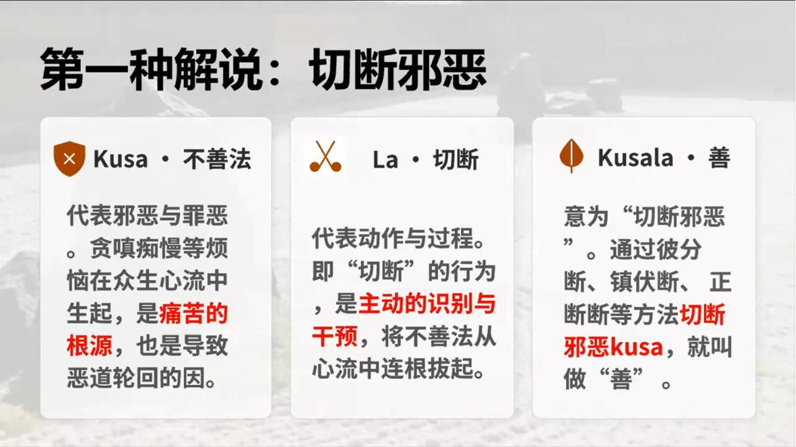

📅 最近更新：2026-09-29 13:00　|　第5版精修（朗读优化版）

# 第1周：自欺总论与贪之伪装（主持人版）

> ⭐ **本讲主持人速览**（新主持人必读，2分钟看完）
>
> 你不是老师，是"共学同行者"。你不需要提前懂内容，只需要按流程走。
> **本周由连续两周内容合并**而成，含两段共读、两轮分享与两轮讨论，单讲 120 分钟。
>
> | 环节 | 标准时长 | ⏱ 时间不够→ | ⏱ 时间富余→ |
> |:-----|:----:|:-----|:-----|
> | 🧘 静心开场 | 10 min | 缩至5 min | 加2分钟静坐 |
> | 📖 共读原文1 | 20 min | 只读★核心段（约15 min） | 加读◈扩展段 |
> | 💬 第一轮分享 | 10 min | 每人1句话 | 每人3分钟 |
> | 🎯 第一轮主题讨论 | 10 min | 只讨论问题① | 讨论全部问题+扩展 |
> | 🧘 禅修练习 | 15 min | 缩至8 min（只念引导词前半） | 延长至20 min |
> | 📖 共读原文2 | 20 min | 只读★核心段 | 加读◈扩展段 |
> | 💬 第二轮分享 | 10 min | 每人1句话 | 每人3分钟 |
> | 🎯 第二轮主题讨论 | 10 min | 只讨论问题① | 讨论全部问题+扩展 |
> | 🔚 收尾与回向 | 15 min | 缩至10 min | 保持 |
>
> **主持人10条守则（精简版）**：
> ① 不讲解、不提供答案——让原文自己说话；② 有人问"正确答案"→说"先听听大家的看法"；③ 冷场→主持人先分享自己的真实感受；④ 跑题→温和拉回："这个有意思，我们回到今天的原文"；⑤ 争论→"两种看法都很好，大家保留自己的理解"；⑥ 确保人人发言；⑦ 不评判任何人的分享；⑧ 时间到了就推进；⑨ 禅修练习照读引导词即可；⑩ 结束一起回向。

> 本周主题：**三十八种自欺源自贪嗔痴；善（kusala）的三义与四素质；不善根如何腐蚀戒定慧。**；**欲贪不说「我要贪」，它说「我不厌恶」「这是修行方便」——贪以「不厌恶想／禅悦／资具／情感／成就感」为借口欺瞒；而识破的第一步，是分清「厌离（nibbidā，看透了、冷静出离）」与「厌恶（paṭikkūla，可厌相）」，并看清贪根不善心所的构成。**。

---

## 📋 本周信息卡

| 项目 | 内容 |
|:----|:-----|
| 时长 | 120分钟（4周版 · 9环节） |
| 核心问题 | 什么是「修道上的自欺」？为什么它总是披着「善法」的外衣出现？贪（lobha）有哪些常见伪装——「广结善缘」与「同流合污」怎样一眼分开？ |
| 共读原文 | 共读原文1：材料①《02_破妄显真-破除三十八种修道上的自欺1-古源尊者-20260211》。　｜　共读原文2：材料①《04_破妄显真-破除三十八种修道上的自欺3-古源尊者-20260217》。 |
| 本周作业 | ①简答题：用一句话说清「自欺」与「明知故犯」的区别。②实践题：本周留意一次「以善法之名」行贪之实的时刻，只作诚实记录，不评判对错。 |

## 🧘 静心开场（10 min）

**主持人引导语**（照读即可）：

大家好，欢迎来到「破妄显真」的第一周。在我们开始读今天这份材料之前，先给自己十分钟，把身体安顿下来。

请找一个让自己舒服、又不容易睡着的坐姿。坐好之后，先把注意力放到脚底和坐垫的接触上，感受身体被大地托着的感觉。然后，把注意力移到腹部，跟随呼吸的起伏——吸气，知道自己在吸气；呼气，知道自己在呼气。不需要控制呼吸，只是陪它走。

（静默约 3 分钟）

现在，请在心里轻轻地对自己说三句：

第一句：「我来到这里，不是为了证明自己修得好。」

第二句：「今天读到的任何一句话，都不是用来评判别人的。」

第三句：「如实看见自己，是慈悲，不是自我否定。」

（静默约 1 分钟）

好，我们一起来礼敬佛陀。请跟着我念：

*Namo tassa bhagavato arahato sammā-sambuddhassa*（三遍）

礼敬那位世尊、阿拉汉、正自觉者。

各位尊者，各位法师，各位贤友，晚上吉祥。

**（主持人口头补充，不必照读）** 今天这一讲，主题是「自欺」。听到这个词，很多人的第一反应是羞耻——「我是不是在自欺？」请大家先把「羞耻」放一放。尊者今天要讲的，是**一种人人都有的认知机制**，就像人人都有影子。看清机制，才谈得上转化；先自责，只会把真相埋得更深。

> 💬 **破冰｜3–5分钟**：说说看：你觉得自己在「修善」的时候，凭的更多是行为本身，还是背后那颗心？

> 🛡️ **心理安全三约定**（每次开场在心里过一遍）：① **保密**——这里说的话不出这间屋子；② **不评判**——不评价任何人的分享，也不急着评价自己；③ **可随时暂停**——任何时候觉得不舒服，都可以停下来休息、喝水或离开，不需要解释。

## 📖 共读原文1（20 min）

**本段为录音转写**（本讲正文主体），保留口语原貌与时间码，仅校正明显同音错字。共读时按下面的分段轮读：

- **第一段（约 8 min）**：[00:00:00]–[00:14:32]——什么是 vañcanā（自欺）？它为什么是「隐形的引擎」？三十八种自欺如何腐蚀戒定慧。
- **第二段（约 7 min）**：[00:14:32]–[00:34:00]——善（kusala）的词源三义与「善巧收割」的隐喻。
- **第三段（约 7 min）**：[00:34:00]–[01:06:48]——善的四素质、世间善与出世间善、不善（akusala）与三不善根。

**（主持人口头补充）** 时间不够时，保第一段与第三段，其余快速带过。

### 原文材料①：★核心·02_破妄显真-破除三十八种修道上的自欺1-古源尊者-20260211（依据录音转写整理，已校对明显同音错字）

- **文件**：《02_破妄显真-破除三十八种修道上的自欺1-古源尊者-20260211》

> ⚠️ 主持人操作：本讲为「自欺总论」上半场，转写近一万九千字，全场照录。共读时按三个中枢分三段轮读——①[00:00:00]–[00:14:32]「什么是 vañcanā（自欺）／三十八种自欺源自贪嗔痴／它如何腐蚀戒定慧」；②[00:14:32]–[00:46:00]「善 kusala 的词源三义（切断邪恶／生起智慧／如草割烦恼）」；③[00:46:00]–[01:06:48]「善的四素质、世间善与出世间善、不善 akusala 与三不善根」。时间不足时，第一段与第三段必读，第二段仅读 [00:16:03]–[00:20:35] 的词源核心。

##### 讲法正文（依据录音转写整理，已校对明显同音错字）

[00:00:00.000] 我们一起来礼敬佛陀。Namo tassa bhagavato arahato sammā-sambuddhassa。礼敬那位世尊、阿拉汉、正自觉者。各位尊者，各位法师，各位贤友，晚上吉祥。好，我们上一堂课给大家讲到了会接下来会讲跟大家一起学习。

[00:00:56.820] 在小部导论译注里面讲到的，三十八种，欺骗。vañcanā？vañcanā。他，从李如长。巴利词典？他是说欺瞒，虚伪。这个这样的解释吗？那。在我们佛教的语境里面，他就有点，我们讲自欺欺人，佛教徒的自欺人自欺欺人，或者我们在修道过程中的自欺欺人了。这个vañcanā。它本身，是指就是遮蔽实相本质的一种微妙的心理。欺骗。自我欺骗，自我误导，那有些是迷惑，他自己也搞不清楚。有些是虚伪，或者虚妄的这种自欺的一种模式。

[00:02:10.000] 从词源学的角度上来讲？这个vañcanā，它的词根是vañc。它本身有这种欺骗误导的意思。在这里，它是特指那些根深蒂固的，会维系生死轮回的。认知的扭曲。所以这些欺骗性的心理倾向，它是很隐蔽而且很顽固的。他经常潜伏在我们的觉察之下，就是你看不到自己，我们讲有时候我们就认不得自己，是咋回事儿。它跟这个我们讲杀盗淫妄这种粗重的这种恶行它不同。这些欺骗，它表现为合理化解释，一些偏执的态这个态度。或者一些微细的执取，或者是一些扭曲的认知。那。

[00:03:14.620] 他的过患是什么？他们的过患，就是会遮蔽我们道德的清明，用世俗的话来讲，就是遮蔽我们道德的清明，阻碍对苦的洞察。扭曲无常苦无我的这种有为法的共相。因为无常苦无我，它是这个一切因缘所生法的根本特点。那当我们继续合理化，遮蔽这些特点的时候，它的背后，它就有自欺或者是无明的倾向。

[00:03:53.670] 所以在导论译注里面，列举了有三十八种很具体的这种自欺的形式。

[00:04:01.900] 每一种都可以作为很微细的，它都是一种很微细的心所杂染。那这些心所的杂染，它是源于我们三个最主要的不善根。就贪（lobha）、嗔（dosa）和愚痴（moha）。我们去研究这个vañcanā，那这个字眼它有什么意义？

[00:04:33.650] 如果我们没有根除这些潜在的杂染。这个潜在的杂染，在巴利叫anusaya。这些潜在的杂染，它有时候，是自己都看不见的。所以你看不见自己的烦恼，他这种烦恼的这个处理就会很难我们有一种说法叫如油入面。那个油，被揉到面里面去，你想把它再整出来，这是很困难的，好。所以，我这个潜在的anusaya，没有处理，我们解脱，就无从谈起。

[00:05:12.530] 那这些，这种。自欺，它是这个。就像这个不善业的隐形的引擎，就它不是很很明显的。它就是隐藏着的，但是，它时不时就会成为你粗重的不善行的这种发动机，引擎，会滋养我们的这个。我见，我们叫萨迦耶见（sakkāya-diṭṭhi）。会认令我们的这种这种迷惑蔓延持续。所以，因此。我们去探究这种自欺的模式，是很重要的，对于修学来讲是很至关重要的。

[00:06:05.660] 它涉及什么？涉及有四个方面，一个就是。跟培育正见相关。为什么会有自欺？是跟我们的正见不足有关。那自欺的模式若不去除？我们对发展观智，彻见诸法的本质，它就会有阻碍的。它会阻碍我们践行八正道，它阻碍证悟涅槃，有苦不能止息。

[00:06:34.740] 那为什么会这么严重。只要有自欺，自欺的背后，它就有moha，就有那个愚痴。只要有愚痴，你就没有办法以正见为先导。不能以正见为先导，八正道就无法展开好，这是一个根本的要素。

[00:06:59.440] 我经常讲，修观的人。你只要。心一想。这个法它应该是怎样的时候，那个究竟法就变成概念法了。当下就变成概念法，你就已经不是修观了，你是在跟概念法玩了，所以这这很微细的东西。那这些微细的东西，在于你的心要变得很清明。而心要变得清明，就是你不需你不能够有那么多自欺欺人的行为。这自欺欺人，

[00:07:35.290] 他就就是甚至于比如说我们最近跟很多同学在讲说，

[00:07:39.315] 我说你这个禅修的，甚至你在修禅那的过程中，甚至你在修十四种御心法的过程中，甚至你在修四界差别的过程中，我说你这个计算太多对？你这个要要把某一个东西这个要做一个这个确认，这个是多余的。这个为什么会有这个多余？就是在日常生活习惯当中，我们很善于去做这些分别判断。那为什么会有很多分别判断？在vañcanā三十八种自欺里面，即把这种掉举，这种无谓的拣择当做是智慧。当中我是一种聪明的人，那你这个就很难看到了。没有人看到觉得就是对，对？

[00:08:30.625] 所以你禅修的时候就把这些都带上去，带上去就给自己制造障碍。这是很微细的。东西。所以。

[00:08:41.660] 佛法？这个佛陀的正法，他是为切实的这个心清净之道。在修行的道路上，就最艰巨的挑战之一。正是这种自欺，就是心灵通过无意识的执取合理化，以扭曲认知，实现自我欺骗的这种能力。这个在我们的这个解脱的道上，他就会很麻烦。

[00:09:13.780] 就像我们第一次开始上课讲到这个。你如果还没有抉择佛法，你学习卡拉玛经。如果你已经抉择佛法，不知道怎么做。这个哪些是佛法四大教示？那四大教示我们就是只是针对。这个巴利三藏来讲的好。那这个好，你走上佛法直观修学的这个解脱之道的时候。那你确定你的生命目标是解脱的时候？那你要不断的解决的，

[00:09:51.000] 最主要的就是一些隐性的这种自欺的这种。习习惯。这三十八种这种。自欺，它会腐蚀我们修学的三大支柱，就是我们讲的戒（sīla）定（samādhi），慧（paññā）。他们，会经常伪装成宁静。很有修行。或者很慈悲，这种很良善的特质。实际上他是暗中，他是阻碍修行。延续苦迫，所以因此。破除这些欺骗，是获得我们内心的澄明，真实，我天天给大家讲如实自然，好。一些觉觉察的这种必要前提。它是解脱或者这个不可或缺的基础。那。

[00:11:01.340] 导论译注，对这个三十八种欺骗的这这个句式，它是这样的好，就是「[Y]通过[X]之门被欺骗」，这样的一种状况是经常有的，他说是合理的好。即如果在巴利句式里面，它是表现为这个[X]mukhena[Y]vañcetīti yujjati。那这个结构？就解释不善根如何模仿善法的外相，patirūpaka。他以这个patirūpaka就是外在的一种表现，而进行自我隐蔽或者自我批评欺骗。

## 💬 第一轮分享（10 min）

**分享规则（开始前请照读）**

1. 每人 1.5–2 分钟，用一个「计时器」放在中间，到点轻响一声，不催不打断。
2. 只讲**自己的经验与感受**，不点评他人、不给别人建议、不替别人下结论。
3. 可以用「跳过」代替发言，直接说「我跳过」，同样被尊重。
4. 听的人只做一件事：听见。不插话、不被引导反驳、不急着认同。

**起手问题（三选一，也可自选）**

1. 今天读到的这么多内容里，哪一句最让你「心里一沉」或「心里一松」？就那一句，说说它碰到了你生活中的哪个具体场景（洗碗、通勤、带孩子、被人提意见……都可以）。
2. 回看最近一周，有没有一次「我以为自己在做好事，但心里其实有点黏着、有点不情愿、或者有点想被看见」？只说事实经过，不解释、不评价自己。
3. 材料①里有一句「我经常讲，修观的人，你只要心一想『这个法它应该是怎样的时候』，那个究竟法就变成概念法了」。你在生活里有没有类似的「我早就知道应该是这样」的瞬间？那一刻你的心在做什么？

**（主持人提醒自己）** 本轮只做「听见」，把「为什么」「你不妨」都收住。若有人开始自责，温和地重复一次：「我们看的是机制，不是罪。」若全场沉默，可先由主持人分享 1 分钟自己的例子，把气氛打开，再请大家接。

## 🎯 第一轮主题讨论（10 min）

**引导问题一：自欺和「撒谎」有什么不同？它为什么比粗重的恶行更难被看见？**

**提示**：材料①说得很直接——vañcanā「与杀盗淫妄等粗重的恶行不同，这些欺骗表现为合理化解释、偏执态度、微细执取或扭曲认知」；它「经常潜伏在我们的觉察之下」，「就像这个不善业的隐形的引擎」。请轻轻带出三层：①它不需要你说假话，只需要你**相信自己编的理由**；②它常常穿着善的外衣（「要精进」「要慈悲」「要护持道场」）；③它不以「坏」的形式出现，而以「合理」的形式出现——所以最难的敌人是「看起来没有问题的自己」。请勿把讨论引向「谁在自欺」，只谈「机制长什么样」。

**引导问题二：尊者说「只要有自欺，自欺的背后就有 moha（痴）」，又说「认识善不善，是认识自欺的前提」。这两句话怎么连起来？**

**提示**：把材料①的逻辑摆出来：自欺→背后是 moha→moha 使人「不能以正见为先导」→「八正道就无法展开」。再看材料③对三不善根的界定：贪是「对所缘的黏着」，嗔是「对所缘的排斥」，痴是「不解四圣谛、把无常苦无我执为常乐我净」。于是结论是：**善不善的判定，不在行为的形状，而在背后的心**（材料①：「决定其伦理本质的，非行为本身，而是背后的动机、清明与智慧」）。本周不展开心所体系，一句话注明「心所分类详见读书会14」；涉戒定慧框架时注明「框架详见读书会19」。这一问偏教理，学员基础弱可只做前半段。

**引导问题三：如果把「不善＝人生每个当下的失败」这个视角拿来用，你会怎样重新看待自己最近的一次「做了很多却心里堵着」的修行或生活经历？**

**提示**：材料③给了两个很具体的抓手：一是「人生是每个刹那、每个刹那构建串起来的」「你每个当下只要是在善心，那你就是有收获的」，二是「你把邪精进包装成精进，把嗔心包装成精进，那你的心就会出现对抗」——同学「一坐上去心就罢工」的例子。请引导大家注意这个区分：**不是「我做得不够多」，而是「我那一刻的心是什么」**。同时给出心理安全提示：这不是让人回头数落自己，而是把「失败／成功」从外在成绩单，换到当下的心上；看见即是转化开始。收尾请让每人用一句话说出「下一次我想怎么开始」——把讨论落到可做的一小步。

> **分层追问**（可视时间取用，由浅入深）：
> - 【现象】同一件事，出于真心和出于「想让人看见」，你觉得结果会差在哪？
> - 【影响】如果长期只在行为上做样子，心会慢慢变成什么？
> - 【应对】这周你愿意挑一件平常的善行，只问自己一句「我为什么做它」？

## 🧘 禅修练习（15 min）

### 练习一

> ⚠️ **禅修禁忌提示**：若你正处在严重抑郁、焦虑、创伤后应激，或精神类疾病的发作／用药期，或正经历强烈的情绪危机，请先咨询医生或心理师，再决定是否练习；练习中若出现明显不适（如心悸、胸闷、情绪失控），请立即停止，睁开眼睛，把注意力放回呼吸与身体，必要时离场休息。

**主持人引导语**（照读即可）：

这个练习叫「无贪、无嗔地知道」。它来自材料③的一句提示：*如果是善心在觉知，一定无贪无嗔；如果只要有贪有嗔，一定不是在善心里面觉知。*

请端身正坐，轻轻闭上眼睛。

第一步（约 3 min）——先建立所缘。把注意力放到鼻端的呼吸上，只感受入息、出息。不需要数数，不需要标名，只是知道。

第二步（约 5 min）——开始「照见心的味道」。每一次觉知呼吸的同时，轻轻问自己一句：此刻这个「知道」里，有没有一点想抓住什么？有没有一点想推开什么？如果有，不必把它赶走，只对它说一句：「我看到你了。」如果此刻是平稳、没有黏着也没有排斥的，也只要知道：「此刻是无贪无嗔的。」

第三步（约 3 min）——把它带到今天的关系里。想起今天有一个人、一件事让你心里起了「不平」，只回忆场景，不进入剧情。然后在这个场景里，练习一次「不黏着、不排斥地知道」：知道有感受，知道有想法，但不跟着走。

第四步（约 2 min）——把这份觉知转向善意。愿自己如实看见而不自责；愿身边的人也都被如实看见；愿今天读到的法，成为心的清净而不是新的负担。

（缓慢睁眼，动一动肩膀，做三次深长的呼吸，回到当下）

**（主持人补充）** 练习中若有人情绪被牵动，允许睁眼、允许喝水、允许先出去走一走再回来。不讲、不追问、不要求汇报。

### 练习二

> 主持人照读（引导词）：

「我们做今天的练习——**不厌恶想·三问觉察**。请坐好，闭上眼睛，让呼吸自然。

（停 30 秒）

现在，请想一件**你今天觉得「还不错、不讨厌」的东西**——一杯茶、一段音乐、一个人的一句话，都可以。让它轻轻地出现在你心里，不用赶它走。

（停 20 秒）

第一问：**它让我舒服，是真的吗？**——是的话，就承认它。舒服是真的。

（停 20 秒）

第二问：**在这份舒服里，我有没有一点「想要更多」？**——如果有，不用赶走它，只是知道：哦，这里有一点想要。

（停 20 秒）

第三问：**如果它明天就没有了呢？**——我心的状态怎么样？是清凉的，还是紧了一下？

（停 30 秒）

好。三问之后，不管答案是什么，都请把注意力放回呼吸。

（停 30 秒）

请记得：这个练习的目的不是让你「不再喜欢任何东西」，而是像看蜂蜜旁边的刀刃一样，**看得见**。看见了，选择就在你手里。

（停 20 秒）

现在，把这份觉察带回到全身，带回到双手、双腿。慢慢地，睁开眼睛。」

> ⚠️ 主持人操作：练习中不要催促、不要纠错；学员若有人落泪或情绪起伏，轻声给「三次呼吸／可以暂离」的选项，并在结束后不点名、不追问。

> ⚠️ **禅修禁忌提示**：若你正处在严重抑郁、焦虑、创伤后应激，或精神类疾病的发作／用药期，或正经历强烈的情绪危机，请先咨询医生或心理师，再决定是否练习；练习中若出现明显不适（如心悸、胸闷、情绪失控），请立即停止，睁开眼睛，把注意力放回呼吸与身体，必要时离场休息。

## 📖 共读原文2（20 min）

> 主持人：本段为录音转写（共读正文主体），按「依据录音转写整理，已校对明显同音错字」处理，保留时间码；括号内为整理注记，朗读时跳过。30 分钟读不完全部，请按材料的「主持人操作」行**取舍跳读**，宁可少读，不可赶场。

### 原文材料①：★核心·04_破妄显真-破除三十八种修道上的自欺3-古源尊者-20260217（音声·依据录音转写整理，已校对明显同音错字）

- **文件**：《04_破妄显真-破除三十八种修道上的自欺3-古源尊者-20260217》

> ⚠️ 主持人操作：本材料是全周**定调段**。共读时按「一→五」顺序读加粗小标题下首段与加粗句；「四、修道者的诊断图谱」中的比喻段（飞机跑道挖坑）可略读。**唯一不可跳的是第五节「三十八种欺骗（一）」**——本周主题句（欲贪能以不厌恶想为借口）与「厌离（nibbida）／厌恶（paṭikkūla）」之辨就在这里，务必读全；读到 [00:58:25.040] 处请放慢语速。

**一、开场·用阿毗达摩揭穿自欺**

> [00:00:00.360] 好，大家请坐下，我们一起来礼敬佛陀。Namo tassa bhagavato arahato sammā-sambuddhassa.（三遍）礼敬那位世尊、阿拉汉、正自觉者。
>
> [00:00:49.260] 好，今天是大年初一。就是一年中好像第一天。这个很殊胜的日子，我们一起来学习佛法，来去除我们内心中的不善。
>
> [00:01:13.020] 上堂课，我们讲了佛教中不善的它的一些特点，以及它这个一切不善的根基，在于三个根本烦恼，就是贪嗔痴。不善的特质，以及我们在阿毗达摩里面，怎么去观察：这个什么是善，什么是不善。
>
> [00:01:31.905] 它是通过特相、作用、现起、近因来去看。善心，在阿毗达摩里面有21种，相应的心所有38个；不善心，有12种不善心，相应的心所有27个。总的来我们来观察，那就要通过五十二个心所。
>
> [00:02:11.260] 所以很多人认为阿毗达摩很复杂，是因为一看这个数量多。但是，如果你能掌握它的根本的规律和原则，它其实就是让我们认识自己的心。我们每天我们的心都在这些心理素质里面打转，那当我们认得的时候，这些就变得很简单。所以我们是需要去学习的，所以阿毗达摩，我们说是解脱的导航。
>
> [00:02:48.760] 平常的时候，我们就是要练习——用阿毗达摩来去揭穿我们的自欺。
>
> [00:03:03.420] 在这个世界里面，就不单单是中国，这个各种仿制品就很多，对。只要有一样东西好销售，一个礼拜以后在义乌就满地都是了，而且很快一个月之内全世界都是了。仿制品、假冒商品都是我们人搞的，对不对？那我们人搞的，就是这个人他就是这个样子，他就愿意做一些虚假的不实的东西，他能够立即获得利益和好处。那落到我们日常交往的时候，那个虚假的感情，你欺骗我的感情，诸如此类的，他也是这个类型。

**二、自欺不是故意说谎，而是认知错觉**

> [00:15:54.220] 所以阿毗达摩里面，自欺不仅是指以言语或者行为上的一种欺骗，它更是一种认知错觉。这认知错觉，就是不善法伪装成善法，愚痴被认为是觉察，或者聪明。那这种欺骗，它非但是故意说谎，而是往往根植于在你的潜意识里面，或者我们经常讲叫做心理余势（心理惯性）里面，深藏在你的认知结构，就是心识（citta）以及心所（cetasika）之间。
>
> [00:16:18.960] 这个真实跟这个虚假，它是会混淆的。就像说我们没有经过专业的训练，很难辨别真金还有镀金的区别。贪嗔痴它也会模拟善心的这种特质。比如我们的禅修者，他自认为会这个心里面很有慈悲，实际上，他就是一看到什么事，他就哭，他又晚上睡不着觉。
>
> [00:17:07.940] 那这个，就是他被忧悲所驱使，他的所谓的悲心，是被这个忧，这个担忧，所控制了。
>
> [00:17:22.040] 那我们很多人就觉得说，有些觉得说我就是在修习智慧。这个你有没有学过阿毗达摩？你知道想蕴梳理吗？你要回去好好地做想蕴梳理。那这个，它就是强化——用阿毗达摩来强化自己的傲慢和偏见。这已经很危险了。

**三、感知的自然扭曲与心的病态反应倾向**

> [00:19:51.195] 所以这种心理误认，它正是这种欺骗的本质特征。它不是单纯的虚妄，而是它的价值判断出现错乱，或者是在法理上的运用上出现错乱。它呈现出来，就是一种感知的自然扭曲：像这个表现就是——有害的这个东西，他反觉得愉悦；而有益的东西，他会感到不适、不舒服。对我们很多有意义的事情，他就是感觉不舒服。
>
> [00:20:05.740] 好，就是你总得让我发作一下，对？我发作出来我觉得很舒服。对，你要发作不伤害别人情况下，你发作没问题，你找个稻草人去揍他一顿，你发作一下。但是，同时我们要知道说，这是我现在的问题，我需要发作，但我要学习什么样才是正确的、我不需要发作的一种方式。
>
> [00:20:56.770] 所以，我们在这种情况下，我们对什么是善法什么是不善法，我们已经缺乏深度观察的这种能力，就是真实和这个善和不善、真实和虚假，它的界限已经被隐没了，或者隐而不显了。
>
> [00:21:21.880] 所以那这个，即心往往对不善法它有些病态的反应倾向。在巴利里面就是 pāpa（帕帕），被经常翻译成恶或者有罪。但是其实，我们前面的课程讲到，那个有罪并不是说在法院里面判你有罪，那个是法律层面上的有罪。而这个有罪和恶，在阿毗达摩来讲就是你在当下会造作不善——造作不善的时候就是损害自他的利益，留下不良的影响力，在未来会感不好的果报、会感苦果，那这个，称为恶或者罪。
>
> [00:22:11.730] 那我们说心对不善法的病态的反应倾向是什么？就是我们的心对他造作不善法的时候，会产生愉悦的感受。这个就是贪婪的快感，它取代了无贪的平静。那个贪婪的快感你能感到很有快感，但是无贪的平静你可能没体验过，或者你根本不屑于体验。所以在这个时候，你的禅修的时候就会变得很无聊，就是都没有乐受。

**四、修道者的诊断图谱与「三法围绕」**

> [00:50:19.920] 所以我们要在内心里面，在修道者的内心里面，你要建立一个你的修道的图谱，这个图谱是要靠阿毗达摩来建立的。你如果是什么东西都是无分别，你什么东西都是，不要计较，那你就是一个愚痴的状态。当然，如果你有一个很高的水平，佛陀讲一个四句偈你就证了，那现在你别在这听了，你讲我听就可以了。
>
> [00:50:48.040] 好，即善恶之别，它不仅仅关乎伦理，它更是我们去区别善恶分野的基础和标准。所以离苦解脱，它取决于你是不是看破无明，是不是去除邪见。所以不仅要认知到什么是正，更要识破那些貌似正确、但是根植于不善的这些现象。那唯有揭露这些隐藏的扭曲，我们才可能全然地投入这个真正的清净之道。
>
> [00:51:30.840] 我们2025年讲述底层重构，这个底层重构，它简单来讲，你先要觉醒。什么叫觉醒？用现代的话来讲叫觉醒，按佛教来讲就是觉悟——就是你要看到你底层有问题，那这个就叫觉醒。
>
> [00:51:53.300] 那你发现我们总是以苦为乐，甚至我们很多人，尤其我们中国人总是视苦为道，就是辛苦一点没有关系，努力练练有什么错？我们受点苦有什么关系？但是我们往往是——很多人是以苦为道，以害为进。
>
> [00:52:39.080] 所以要挣脱这个不善法的陷阱。这个是有一个愉悦陷阱，这个愉悦陷阱很多都是自我建构的愉悦。我们讲那个快乐就是果报，乐它是果报；但是我们很多内心的愉悦，它是很多是造作出来的、构建出来的，这个愉悦陷阱也是不善法引发的这种陷阱。所以在这种情况下，你仅仅靠意志力是不够的，这必须建构系统性的破除机制。
>
> [00:53:11.435] 所以佛陀在《大四十经》（大四十经）里面提到，说从舍断邪见开始，就是正见、正思维、正语、正业、正命、正精进、正念、正定，对应的都有邪见、邪思维、邪语、邪业、邪命、邪精进、邪念、邪定，对？要逐个去破除。在佛陀每讲到一个要破除，都是这么讲，说都要正见、正念、正精进三法围绕。
>
> [00:53:37.780] 比如说他舍断邪见的，他还讲说：他为舍断邪见、具足正见而精进，这是他的正精进；他专念舍断邪见，专念具足正见而住，这是他的正念。如此，此三法围绕跟随着正见，即正见、正精进和正念。所以你要觉醒，你要完成你的底层重构——我们必须有这三个基础。
>
> [00:54:04.580] 第一就是正见，正见是奠基。那正见怎么来奠基？就是要学阿毗达摩。你要先通过经教的研习，建立起辨别什么是真善、什么是伪善的这种标尺。第二个，就是这个正见建立起来完以后，你每天要保持省察觉察，就是正念的觉察，就训练我们的觉知力，能够捕捉到这个欺骗运作的这种微细的情绪信号，这个马上能看到它。正精进——正精进是一种攻坚的力量，他要弃恶修善、护心断恶不善根，方能击破自欺。
>
> [00:55:05.470] 那这个，我们在原来平台讲过，是要用微习惯，对。断除一个坏习惯，培养一个好习惯，都不是那么简单的，他都是要一点一点来。所以我为什么以前讲说，回去怎么禅修？回去每天持戒一餐饭，正念吃饭一段路，正念走路，每天打两坐，每坐不少于5分钟。
>
> [00:55:31.980] 已经讲了6年了，今年下来第6年了。我想即这个有什么意思？我说你坚持10年你就成大德。坚持10年下来，你就可以坐在这边给大家分享：我这10年是怎么做到的，他有什么样的收获。如果你这个都做不到……

## 💬 第二轮分享（10 min）

> 主持人：这一轮**不讨论、不点评、不追问**，只让大家把话说出来。规则三条——① 每人 2 分钟以内，时间到主持人轻轻合掌示意；② 只说自己，不说别人；③ 任何一题都可以说「我跳过」，跳过不需要理由。

**起手问题（任选，通常按顺序）**：

1. 上周到今天，你有没有说过一句类似「我不厌恶这个」「这只是为了修行方便」「我这也是为了他好」的话？当时那件小事是什么？
2. 说到「贪」，你心里第一反应是什么？（是「我没什么贪」，还是别的？）——只说你的第一反应。
3. 在你身上，最常出现的「合法理由」是哪一句？（例如：为了更好的修行、我需要一点放松、我离不开这个人、这个只有我做得了）

> ⚠️ 主持人操作：把大家说的「合法理由」原句**逐条写在白板上一栏**（写句子、不写人名），后面 35 分钟的讨论会直接用这一栏。有人说出很诚实的观察时，只回一句「谢谢你说出来」，不夸奖、不深挖。

## 🎯 第二轮主题讨论（10 min）

> 主持人：三问由浅入深，第 1 问对准「机制」，第 2 问对准「我」，第 3 问对准「怎么下手」。

**问题一：同一件「不厌恶」，为什么可以是善巧，也可以是自欺？界线在哪里？**
> 提示：请学员回到材料①第五节与材料③第四节。关键句是——不厌恶想本是**对治排斥**的工具；当它「缺乏正念与如理作意」时，被贪打开缺口，就变成「既然不厌恶，那我就应该得到」。（引导语：界线不在「做不做」，而在**有没有正念、有没有把「可厌」如实看成「可厌」**。）

**问题二：「刀刃上的蜂蜜」——请你举一个属于你自己的、甜的陷阱。**
> 提示：先区分「乐受（果报）」与「造作出来的愉悦」。可行的做法：请三位学员各举一例，然后**用四要素自问**——执着吗？黏着吗？放不下吗？是否认为它会给我快乐？（若某例四问皆「是」，就是贪。）主持人注意：**不做道德评判，不给心理学诊断**，只做识别练习。

**问题三：「厌离（nibbidā）」与「厌恶（paṭikkūla）」如何区分？这对我们在家人有什么用？**
> 提示：请一人复述材料⑤第三、四节的两句对照——**厌离是冷静的、出离的；伪装的厌恶是热闹的、有攻击性的、让心腐败的**。落到生活：当我们「越学越看不惯身边的人」「越修脾气越坏」，那不是厌离，是躲闪与嗔恨；当我们「看透了、不玩了、心反而清凉了」，那才是厌离的方向。收束一句：**识别借口的技术，最后就是识别自己心热不热、松不松。**

> ⚠️ 主持人操作：讨论第 2 问时，若有学员开始自我攻击（「我就是个烂人」），立刻按守则第 8 条纠偏，并把话题拉回「机制—标尺—微习惯」三段式。第 3 问务必留 3 分钟收束，不要被讨论拖走。

> **分层追问**（可视时间取用，由浅入深）：
> - 【现象】贪，是怎样给自己找到「合法借口」的？举一个你自己的例子。
> - 【影响】每次都能「说服自己」的贪，时间久了会造成什么？
> - 【应对】这周你愿意在哪件小事上，先把「理由」放一放，只看着那个「想要」？

## 🔚 收尾与回向（15 min）

### 收尾一

**总结引导（主持人照读）**

今天这一周，我们只做了一件事：把尺子摆出来。

第一，自欺（vañcanā）不是「说谎」，而是心把不善伪装成善、还让自己相信的机制；它源自贪、嗔、痴三个不善根，潜伏在觉察之下，腐蚀戒、定、慧三支柱。

第二，善（kusala）有三个词源面向——切断邪恶、生起智慧、如草割烦恼；它有四种素质——无病、无罪、乐果报、善巧。它的判定，不在行为的形状，而在背后的心。

第三，不善（akusala）不是道德污点，而是「对实相的拙劣应对」；它在每个当下呈现为贪（黏着）、嗔（排斥）、痴（不见真相）。

第四，最重要的一句：**这不是用来给人定罪的，是用来给自己照镜子的。** 看见机制，是修行的开始；自责，不是。

**下周预告**

第 2 周进入第一个具体自欺：**以「贪」为借口的伪装**——欲贪以「厌恶想」（appaṭṭikkūlasaññā）为借口、以禅悦为借口欺瞒我们；我们会看清贪根不善心所的构成。（心所分类详见读书会14，本周不展开。）

**微习惯承诺（可选，5 min）**

请每位贤友在心里（或纸上）写下一句可执行的小承诺，格式：「本周____（情境）时，我会停下来一次，先看自己的心是黏着还是排斥。」不公开、不评比，只自己知道。

**回向词（请全体合念）**

Idaṃ me puññaṃ āsavakkhayāvahaṃ hotu.

Idam me puññam nibbānassa paccayo hotu.

Mama puñña-bhāgaṃ sabba-sattānaṃ bhājemi.

Te sabbe me samaṃ puñña-bhāgaṃ labhantu.

愿我此功德，导向诸漏尽；

愿我此功德，为证涅槃缘；

我此功德分，回向诸有情；

愿彼等一切，同得功德分。

Sādhu! Sādhu! Sādhu!

### 收尾二

> 主持人照读（总结引导）：

「今天这一讲，我们认得了一件事：**贪从来不直接说「我要贪」。** 它说的是「我不厌恶这个」「这只是为了修行方便」「我离不开他」「追求卓越是美德」「这是我的信众」。这些话不是坏话，问题在于——**它们常常是真的理由，也是骗过我们的那层糖衣。**

今天我们做了三件小事：第一，把「不厌恶想」这个善巧工具和「贪的借口」分开；第二，看清了贪的构成——**执着、黏着、放不下、认为它会给我快乐**；第三，画出了一条界线：**厌离是冷静的、出离的；伪装出来的厌恶是热闹的、有攻击性的。**

这一周，请你只做一件事：**写下一条你常用的「合法理由」，并如实记下它护着的那件事**。不是要你立刻改掉它，而是——先让自己看得见。

看得见，就已经开始自由了。」

> ⚠️ 主持人操作：总结控制在 3 分钟内，逐句照读即可。

**下周预告**：第3周「以『嗔／抗拒』为伪装的自我欺骗」——我们会看**嗔恚如何以厌恶想为伪装**（本周材料⑤只是一瞥）、**掉举如何借「精进」的相似外相欺骗我们**，以及**定力·精进·正念这个「平衡铁三角」**如何维持。

> 主持人照读（回向词）：

「愿以此功德，回向我们无始以来所累积的一切善业功德，以及我们今天读书、听闻、分享、随喜的功德，至诚回向：愿我们修习佛法的顺缘具足、违缘消除，早日证得一切道果。

也以此功德，与一切诸天分享、与一切鬼神分享、与过往生的亲戚们分享、与一切众生分享，愿他们随喜我们的功德，一切善愿都能成就。

Idaṃ me puññaṃ āsavakkhayāvahaṃ hotu.
Idam me puññaṃ nibbānassa paccayo hotu.
Mama puñña-bhāgaṃ sabba-sattānaṃ bhājemi.
Te sabbe me samaṃ puñña-bhāgaṃ labhantu.

愿我此功德，导向诸漏尽；
愿我此功德，为证涅槃缘；
我此功德分，回向诸有情；
愿彼等一切，同得功德分。

Sādhu! Sādhu! Sādhu!」

## 📌 本讲主持人特别提醒

1. **如实觉察 ≠ 自我否定。** 本周主题是「修道中的自欺」，涉及深度自我省察，最容易滑向自责。请在开场、讨论与收尾各强调一次：**自欺是凡夫共通的认知机制，不是道德污点**；看清它，是慈悲，不是判罪。若有人开始说「我完了／我不是好人」，请立即接住：「我们看的是机制，不是人。」
2. **不做道德裁决，不贴心理学标签。** 不给任何成员下结论、不诊断、不比较「谁修得好」。别人分享时，只听见，不评价、不劝告、不传播到会外。
3. **不自卑，也不自满。** 觉察到自己的自欺，不必自卑；今天状态清明，也不必自满——材料③讲得很清楚：*「你每个当下只要是在善心，那你就是有收获的。」* 只在当下算账，不做人格上的总结。
4. **分享以自愿为限。** 允许「跳过」、允许沉默、允许只听不说；主持人不点名、不追问、不要求汇报禅修体验。
5. **情绪安全。** 若有人被牵动情绪，提供两个出口：三次深呼吸，或暂时离场喝水走动，随时可回来；必要时陪到门边，不追问内容。
6. **教理不展开，边界要清楚。** 涉心所分类（五十二心所、十二不善心等）注明「详见读书会14」；涉戒定慧支柱框架注明「框架详见读书会19」；涉烦恼与业注明「详见读书会13」。本周只讲「自欺如何腐蚀」，不铺开心所体系，避免学员掉进名相。

---

<!--EXT_READ-->
## 📖 延伸阅读（课后自由选读）

《02_破妄显真-破除三十八种修道上的自欺1-古源尊者-20260211》——自欺总论：vañcanā 的体性与过患、善的三义与四素质。
《03_破妄显真-破除三十八种修道上的自欺2-古源尊者-20260213》——自欺总论续：相·味·现起·足处鉴别善不善，二十一类善心与十二不善心。
《01_四大教示-古源尊者-20260206》——系列前导：以经律为准绳检验真伪。
<!--/EXT_READ-->
