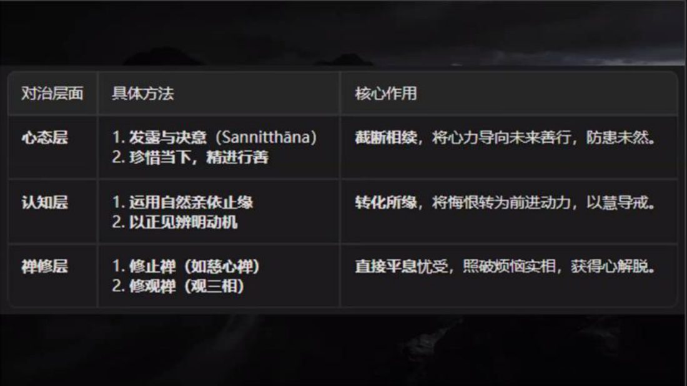

📅 最近更新：2026-09-29 13:00　|　第5版精修（朗读优化版）

# 第2周：嗔与痴之伪装（学员版）

## 📋 本周信息卡

| 项目 | 内容 |
|:----|:-----|
| 时长 | 120分钟（4周版 · 9环节） |
| 核心问题 | 「真舍（upekkhā／舍觉支）」与「假舍（无知舍）」的分野在哪一句？「昏沉」和「入定」在体验上怎样分？「狂热」为什么会被错当成「正信」？「疑」为什么也属于痴根、它伪装成什么？ |
| 共读原文 | 共读原文1：材料①《07_破妄显真-破除三十八种修道上的自欺6-古源尊者-20260227》。　｜　共读原文2：材料①《10_破妄显真-破除三十八种修道上的自欺9-古源尊者-20260311》。 |
| 本周作业 | ①简答题：分别用一句话区分「真舍／假舍」「昏沉／入定」「正信／狂热」。②实践题：本周观察一次「冷漠被误当天舍」或「狂热被误当正信」的时刻，记录当下心真实的质地。 |

## 🧘 静心开场（10 min）

请找到一个让自己稳定的坐姿。背自然挺直，但不僵硬。双手放在腿上，或者叠放在腹前。

轻轻闭上眼睛，或者把目光垂落在身前约一米处。

好，我们把注意力带到呼吸上。不需要改变呼吸，只是知道它。

（停一拍）

吸气——知道自己在吸气。呼气——知道自己在呼气。

（停两拍）

现在，请在心里对自己说一句话：

**此刻，我愿意如实地看自己，不是为了责备自己，而是为了更自由。**

（停两拍）

再对自己说一句：

**今晚听到的每一个"自欺"，都是凡夫共有的，不是我的罪状。**

（停两拍）

好，慢慢睁开眼睛。我们把这份不责备的心，带到今晚的共读里。

---

> 💬 **破冰｜3–5分钟**：说说看：这一周里，你哪一次「想把它做好」，底下其实带着一点不满或着急？

> 🛡️ **心理安全三约定**（每次开场在心里过一遍）：① **保密**——这里说的话不出这间屋子；② **不评判**——不评价任何人的分享，也不急着评价自己；③ **可随时暂停**——任何时候觉得不舒服，都可以停下来休息、喝水或离开，不需要解释。

## 📖 共读原文1（20 min）

### 原文材料①：★核心·07_破妄显真-破除三十八种修道上的自欺6-古源尊者-20260227（录音转写）

- **文件**：《07_破妄显真-破除三十八种修道上的自欺6-古源尊者-20260227》

（依据录音转写整理，已校对明显同音错字）

[00:00:04.260] 好，大家请合掌，我们一起来礼敬佛陀。？Namo tassa bhagavato arahato sammā-sambuddhassa。礼敬那位世尊、阿拉汉、正自觉者。各位尊者，各位法师，各位贤友，晚上吉祥。

[00:00:56.700] 好，

[00:00:56.700] 我们上堂课，讲到了，第二种欺骗，嗔恚以厌恶相的伪装来欺骗，那我们就讲完了这个。

[00:01:10.580] 贪和嗔。那贪和嗔，经常是会结合在一起的。他会在禅修的过程中，导致这个贪和嗔的追逐和抗拒的这种循环。就是贪和嗔是两个根本烦恼。它经常在我们很不单是禅修，就是我们日常的生活中，它总是交织地运作，形成一个很难挣脱的循环。那。在这个。我们讲一切的不善心，它都根植于贪嗔痴三毒。那这些烦恼，在我们日常生活中，它就是如果你没有你的心没有被训练过，它基本上是我们都在贪嗔痴当中对。

[00:02:20.320] 但是现在我们是禅修营。那禅修营？看起来，我们。我们都是持戒，禅修，服务，每天都在照着善行。但是贪嗔痴，它会更加隐蔽，而且。对禅修的角度，我们的每天的持戒禅修服务当中来。那所以，

[00:02:48.525] 我们说一个修行人，他很悲催的是，这个修行者，他是为了克服贪嗔痴来修行的。但却常常这个以伪装和内化的形式，把贪嗔痴带到修行当中里面来。

[00:03:08.250] 那在我们的现代语境里面，这个我讲就是。这个现代管理文化殖民对。就是在这个以绩效导向的文化这个语境里面。贪和嗔，就深刻地影响着我们的日常生活。那在这样的一种社会。这个浸染的过程中，那我们就会把它把这个习惯带到我们禅修的里面来。也就是贪和嗔，以这个它深刻地影响着我们的这个，对业处的这个觉察和感知方式里面来。那我们会很努力地去引用贪和嗔，来诠释我们的禅禅修体验。

[00:04:12.060] 似乎，我们这个禅修如果没有贪和嗔，我就不知道怎么禅修。这是一个很普遍的一种情况，所以如果我们不能够省察，这一类的这种我们日常生活中的心理模式或者心智模式，它就会。引发我们禅修的这种内在冲突。它阻碍觉察，扭曲我们的修行的这种动机，或者是我们修行的这种目标，使禅修者偏离真实的进化之道。

[00:04:54.500] 那我们一再讲说，禅修的目的是为了心的平静。而心的平静，它一定是，善法的平静，最好是悦俱智相应的心。但是，当我们带上期待。的时候，它就已经被染污过了。当我们对当下的业主不满意的时候，我们已经又被征服过了。好，那。在贪和嗔的交织影响下，禅修是不会进步的。

[00:05:26.700] 禅修当中，这个贪，它并不是以物质欲望的方式来呈现，而是经常表现为对进步成就，或者这些特殊的这个禅修的体验，比如说快乐，光很亮，身体浮起来。这个身体被顶起来了等等的，或者很深的禅定，乃至于说，开始修观的人，对这个证悟的渴求，那这些这个贪。他是。一般情况下，都是由比较来催生的。那这个比较就两个方面，

[00:06:22.810] 一个是对照过往的经验，我们很多同学就是上午来报告说，报告尊者，我今天上午状态很不错，我一般都这样，这样好，不要期待，我要马上加一句，不然他下午就一定不行。为什么？他拿上下午的时候一定拿上午的那个禅修体验来去比照。那如果没有做到，他就开始觉得不行，去控制要去抓好。这是比照过往的经验，或者对标他人所述的成就，别人一长就报告，还要讲说，我什么时候也可以这样。下午就开始抓取控制。

[00:07:03.820] 还有一种，就参照禅修手册的这个理想次第，这个书当然要看。但是书看完不能教条，我经常讲，我每次写完以后就想把它撕掉。原因就是书总是不能禁言。

[00:07:22.955] 

[00:07:23.580] 以前也讲过这个帕奥西亚多在马来西亚这个的时候，有一位禅修者就跟他讲说，禅师，你已经写了很多书了，我是不是看着你的书我就自己修就可以了。这个帕奥西亚多就跟他讲说，大部分的人是不行。好，那如果看着书就可以修的话，老师就不需要了。好，你自己不用看帕奥西亚多的书，对着三藏就修了。所以我们很多人即我读这三藏就可以修了。

[00:07:54.220] 我们现在很多流派也是这样的，就觉得是说老师这个东西不准呐，老师说的话都是他自己的想法，我要直接看佛陀亲口说的经典。那天我们尊者讲说，只要变成文字上的经典，他就已经是苦圣谛了。为什么？苦圣谛？因为他没有办法完整地记载，完整地表示佛陀的本怀。好，那这个东西要靠心法嘞，那就心法传承了。

[00:08:24.640] 所以你不是简单地看着禅修手册，所以很多同学看了这个禅修手册，那个禅修册，各种各样的看看完以后你再跟他怎么讲说禅修的目的是为了心的平静，光是呼吸的颜色，对。他每次还在跟你讲说，当定我的光对。刚才有个同学讲说那个像不需要像棉花一样吗？我就说我什么时候就是即一定要棉花一样的，但是我觉得总是要像棉花一样，对？不是书上也讲像多罗棉。

[00:09:01.290] 所以一个禅修者如果他揣着期待入座，抓取下一阶段的目标，心里面暗暗的期许，每次呼吸都能够导向内心的蜕变和进化那。他必然对因为对结果的执取而引发身心的紧绷以及内心的躁动，障碍定力生发所需的这种我们说如实自然轻松快乐这种松弛感。所以导致他的觉知就沦为就是未来导向，而不是安住当下。

[00:09:43.960] 所以禅修就变成一场自我确认的这种剧场，它就是这个追逐这个平静，追求精进，或者总是渴望着哪一天成为证悟之人，所以他这个禅修就变成了一场赛跑。对，这个定。

[00:10:11.740] 同时，它也会扭曲我们这个修行的这个群体，

[00:10:17.190] 我们禅修营大家的这种人际关系。那在强调这个就是大家比如我就讲说在我们禅修会里面不强调观。不是我这么说，这个在帕奥西亚多的开示里，里头给他讲说我的光，我现在就专注光，他会直接拿起旁边的东西砸过去，把你臭骂一顿。就是。这个大家都追逐玩，追逐这个，比如说我讲3个小时没有外面也成为很多人的梦魇，对，因为他就是控制，这怎没有露出，因为你看你还有点画点，我也要去控制它，那是一个结果。对，我不设定一个结果，我们为什么设定这个结果？

[00:11:12.990] 以前很多的引导，就是关系融合，我们以前经常听到一句话叫关系融合稳定后半个小时就专注观。这个在我们这个群体很多这样的教导。那这样的教导的问题，就是我们是深受其害的，我是曾经被这么教导过的，那就是因为你半个小时是关系融合，

[00:11:40.410] 你的定力，有没有定力？有一点定力，我它称为叫草莓禅，对不对？那草莓禅就是你的这个定力不够稳固，不够稳固就很容易就掉。那你要一坐的时间一长，就是坐在光里面打妄想一下，还很舒服。对，那你真的要去观察，明色的时候，它就糊糊的，看都看不清楚。所以我才会讲说要3个小时每晚练，那3个小时每晚练也是泡脚都要去说，但是他要求4个小时5个小时，我觉得这难度太大，对？我就把它刚开始是4个小时，后面我就觉得这搞不定，3个小时是可以的，大部分人是可以做得到的，所以我就定3个小时对。

[00:12:19.570] 好，如果这个大家都在追逐这个禅修成就，光有多亮，做了多久，好，那这个禅修者就会感到压力好。这个甚至，我们在长期报告的时候，他就会这个不敢报告，或者这个对他的进展，就是不真实不真实报告他的进展，或者说拒绝报告他的进展，他即我今天做了几个小时好。那这个，就会损害我们内心成长所必要的坦诚。

[00:13:03.060] 一个禅修者，当然很重要的是他内心的坦诚。好，会导致他实际的报告的体验跟他的认知是割裂的，或者他根本不敢报告。

[00:13:13.700] 就是很多同学说这段时间没有进步，我所以我都不敢来报告。那那就是有问题才要报告，没有没有问题的时候，你看他们没有问题，我基本上就很快，

## 💬 第一轮分享（10 min）

**分享规则（请照读）**

- 每人1–2分钟，先讲"我观察到了什么"，不必给结论、不必下判断。
- 只讲自己的经验；不评价别人修得好不好，不给人贴标签。
- 不想讲就可以直接说"我跳过"——跳过也是参与。
- 别人讲的时候，只听，不接话、不建议、不补充。

**起手问题（任选2–3个，逐个问，问完静默10秒）**

1. 这一周，你有没有一次"我很不满/我很不认同"，事后发现那种不满其实已经变成了**抗拒**？（对同修的做法、对家人的习惯、对手机的依赖，都可以。）
2. 你有没有一次"我这是为你好 / 我这是守规矩"，其实心里是"你需要按我说的来"？当时身上哪一处是紧的——肩、喉、胃、还是下颌？
3. 当你"想精进"的时候，它是补上了你，还是耗掉了你？请举一个具体的小例子，对照材料③"掉举能以勤勉精进为借口来欺骗"。
4. 最近一次"追悔"，是想改过，还是把自己关在懊恼里出不来？对照材料④的四个层面（心态／认知／禅修）看看差在哪里。

## 🎯 第一轮主题讨论（10 min）

### 第一问（浅）：嗔为什么要穿"善法"的外衣？

- 引导：材料①说"贪和嗔，它经常伪装为精进、品德、理想和抱负，也就很难以辨认——难道我不要努力吗？我难道不要精进吗？"请说说，你身上"嗔"最常穿的三件外衣是哪三件？
- 提示：外衣通常长这样——"我在持戒""我在护法""我在负责""我这是不随顺烦恼""我这是要求严格"。请把它翻译成一句更朴素的话：**"我现在很想让某件事不要是这样。"**
- 落点：外衣不是坏事，坏的是**外衣下面没有正见和正念**。看清外衣，不是撕掉它，而是让它在正见里被照亮。
- 提醒（照读）：如实觉察 ≠ 自我否定。看见"我这里有嗔"，是修行开始的信号，不是罪名成立的判决。

### 第二问（中）：掉举和正精进，外相像在哪里、本质差在哪里？

- 引导：材料③说"掉举能以勤勉精进为借口来欺骗"，并引《增支部3集103经／相经》："如果专修增上心的比丘只一向地作意努力相，那存在可能性：转起心掉举。"请自由举例：外相上，你的"精进"和"躁动"像在哪里？
- 提示：两者都表现为"心在动、不肯停"。差别在三点——
  1. **有无所缘**：正精进是**在业处上更有力**；掉举是**从业处跳走**。
  2. **乐受／苦受**：正精进多与"如实自然轻松快乐"相伴，掉举常伴随紧绷、急躁、想抓到结果。
  3. **可被省察**：正精进经得起"你为什么这么做"这一问；掉举经不起，因为它的动机是"我怕拿不到"。
- 落点：材料③给出对治的方向是"**适时抑制心、适时策励心**"——精进不是一味加油门，而是会给油门松一松。
- 对照：材料①的"草莓禅"说法可以借用——"定力不够稳固，就容易掉；一坐时间长，打一下妄想还很舒服，真要观察明色的时候，它就糊糊的，看都看不清楚。"（请以照录原文为准）

### 第三问（深）：怎样才算"定力·精进·正念"的铁三角在心里真的立起来了？

- 引导：材料③明确要"建立'定力——精进——正念平衡'的铁三角"；材料①也讲"禅修一定是五根平衡、七觉支平衡的"，"佛陀讲说五根平衡里面念根是越大越好，越强越好，但信根跟定根要平衡，精进根跟定根要平衡"。
- 提示：请三人一组，各举一个"我自己的铁三角失衡"的样子——
  1. **精进过强、定力过弱**：越修越急、越抓越紧，睡不好、坐不住。
  2. **定力过强、精进过弱**：舒服、沉静、昏昧，容易掉进材料①说的"把掉进黑洞当成入定"。
  3. **正念缺位**：上面两种都察不出来，因为正念是那个"看见"的能力。
- 落点：本周不要求"立起铁三角"，只要求一件事——**每次上座前问一句："我今天是以贪在修，还是以正念在修？"** 这一问，就是正念开始工作的地方。
- 收束（照读）：定是锋利的刀，用来精确地切割烦恼；修行是要把心修得像明镜一样，而不是练成水泥地。

> **分层追问**（可视时间取用，由浅入深）：
> - 【现象】那个「想变好」的心，你觉得几分是善法欲，几分是抗拒？
> - 【影响】用嗔和抗拒去推动修行，久了会把自己带向哪里？
> - 【应对】这周你愿意怎么把「较劲」换成「照顾」——对自己，也对身边的人？

## 🧘 禅修练习（15 min）

### 练习一

> ⚠️ **禅修禁忌提示**：若你正处在严重抑郁、焦虑、创伤后应激，或精神类疾病的发作／用药期，或正经历强烈的情绪危机，请先咨询医生或心理师，再决定是否练习；练习中若出现明显不适（如心悸、胸闷、情绪失控），请立即停止，睁开眼睛，把注意力放回呼吸与身体，必要时离场休息。

（请坐好，脊柱自然挺立，双手放在腿上。）

好，我们把注意力带到呼吸。不改变它，只是知道它。

（停30秒，让大家自己静一下）

现在，请在心里**唤起一件最近让你不满的小事**——不要选最大的，选一件小的、具体的。比如某人对你说的一句话，或者你自己没做到的一件小事。

（停10秒）

好，请留意：当这件事出现的时候，你的身体发生了什么？

下颌有没有微微咬紧？肩膀有没有抬起来？胸口有没有一点闷？

（停10秒）

好，我们不评价这件事，也不评价自己。我们只做三句标记，在心里各说一遍：

第一句：**我看见，我在拒绝什么。**
（停10秒）

第二句：**这个拒绝背后，我想保护的是什么？**
（停10秒）

第三句：**我现在能不能先不评价，只把呼吸看清楚？**
（停10秒）

好，把注意力放回呼吸。吸气，知道；呼气，知道。

如果身体有紧的地方，随着呼气，松开一点点——下颌松开，肩膀沉下，腹部柔软。

（停30秒）

再睁开眼之前，请对自己确认一句：

**我今天没有修好，也没有变坏。我只是看见了。**

好，慢慢睁开眼睛。

> 收尾提示：若有人在这个练习里情绪明显上来，请允许他先做三次深呼吸，或视情况暂离片刻。练习结束不追问"你刚才看到了什么"。

### 练习二

> ⚠️ **禅修禁忌提示**：若你正处在严重抑郁、焦虑、创伤后应激，或精神类疾病的发作／用药期，或正经历强烈的情绪危机，请先咨询医生或心理师，再决定是否练习；练习中若出现明显不适（如心悸、胸闷、情绪失控），请立即停止，睁开眼睛，把注意力放回呼吸与身体，必要时离场休息。

> 请坐好，身体端正而放松，眼睛轻轻闭上。先做三次深呼吸，然后让呼吸回到自然。
>
> 把注意力放在鼻端或腹部的呼吸触感上，只是知道：入……出……
>
> **现在，加一道本周的功课。** 在陪着呼吸的同时，请留意三个讯号：
>
> **第一，清晰度。** 呼吸的触感还清楚吗？如果它开始变淡、变模糊、像隔了一层布——**不要用力抓**，只在心里轻轻标记一句：「**模糊了**。」然后回到呼吸。标记本身就是清明在起作用。
>
> **第二，重量感。** 有没有一种往下沉、往下坠、头变重的感觉？如果有，标记一句：「**昏沉**。」然后**把眼睛稍微张开一点、把身体挺直一点、把呼吸稍稍提亮一点**——不是紧张，是提亮。
>
> **第三，有没有在「抓」。** 有没有想要「做得更好」「把状态搞出来」的冲动？如果有，标记一句：「**在抓**。」然后松开，让呼吸自己走。**如实、自然、轻松、快乐——但不是放掉正念。**
>
> 就这样练习大约十分钟：知道呼吸，知道模糊，知道昏沉，知道在抓。**你不需要「修得很好」，你只需要「看得很清楚」。**
>
> 最后两分钟，把这份清明扩展开来：愿我此刻能看清自己的心，也愿一切众生都能看清自己的心；愿我们不因看见而责备自己，愿我们因看见而更柔软。
>
> 慢慢把注意力带回身体，感觉一下坐姿、双手、脚掌的接触，然后轻轻睁开眼睛。

## 📖 共读原文2（20 min）

>
> **照读纪律**：录音转写保留了口语原貌与时间码，读起来会有些「绕」，请法友**照字念、不跳读、也不顺手美化**；时间码可念也可略过。
>
> **本讲与既有系列的分工**：心所体系详见**读书会14**；心路机制详见**读书会15**；业与轮回详见**读书会13**；戒定慧框架详见**读书会19**。本讲只讲「自欺如何腐蚀」，不重建这些框架。
>
> **段间串场词（材料②→材料③之间，主持人可照用）**：材料①讲的是「疑」——疑也是痴根心所，它借着「我要理性考察」把自己藏起来。那么，痴在日常修行里最常见的脸是什么样？请听材料③——它安静得多：**它以「我很平静」的样子，把麻木冒充成舍。**

### 原文材料①：★核心·10_破妄显真-破除三十八种修道上的自欺9-古源尊者-20260311（依据录音转写整理，已校对明显同音错字）

- **文件**：《10_破妄显真-破除三十八种修道上的自欺9-古源尊者-20260311》

**照录（逐字·`[00:00:00.940]`–`[00:23:52.440]` 全段，朗读时按上述三段择要）：**

> `[00:00:00.940]` 好，大家请合掌，我们一起来礼敬佛，Namo tassa bhagavato arahato sammā-sambuddhassa。各位尊者，各位法师，各位贤友，晚上吉祥。
>
> `[00:01:36.920]` 上堂课，我们开始讲。三十八种自欺的第六种。
>
> `[00:01:44.860]` 怀疑，能以调查双方为借口来欺骗。我们讲到了疑。它的各项作用现起近因。这个疑，主要是针对八事的疑。有没有佛陀？佛陀讲的法？有没有实践佛陀法的僧团？也对，针对三宝的怀疑，对戒定慧的怀疑，对因果、过去生、未来世、过去未来因果关系缘起的怀疑。那我们大部分的人，认为我信佛。我怎么可能不信？
>
> `[00:02:30.565]` 但是你认真对照一下，发现我们其实对于这个八事，
>
> `[00:02:36.540]` 还是有很多的困惑。这个困惑，就要修信。那修信怎么修？修信依然是对八事的持续的练习，尤其是对戒定慧三学的练习。所以，我们讲，探究跟这个怀疑，他是，不一样的了。那，对，在阿毗达摩里面，怀疑是特指这个八事的怀疑，简单来讲，是对佛法僧三宝、对修行道路的怀疑。这种怀疑，我们讲叫 vicikicchā 对，它是无药可治，即没有办法用法药来治疗他的烦恼，以及对治烦恼或者解脱烦恼。所以它并不是真正的求知或者理性的考察，而是一种。障碍，阻碍直接体悟真理的一种停滞，
>
> `[00:03:54.130]` 包括我们昨天那上一堂课讲到有个同学对，他说，我对这个造善业也不是很积极。因为我对这些有疑惑，他就是对，造善业真的有果报吗？造善业真的会有波罗蜜吗？我修学做梳理，做这个烦恼的对治，真的能够去除烦恼吗？他就怀疑，他就怀疑了，他就不会投入，不会投入他的
>
> `[00:04:23.650]` 理性的成长，我们讲心灵的成长，精神的成长它就停滞了，对。那这种情况下，你用佛法是治疗不了他的烦恼的，所以我们称为叫无药可治。
>
> `[00:04:39.100]` 相较之下，如理作意是通过。当下如实的观照，和基于根源的洞察来支持探究，我们讲如理作意，叫 yoniso manasikāra。有你说，就是根源。根源是什么？一切因缘所生法都是无常无我不净的，要能够真的看到这一点。这个是从根源上来看，你没有看到这一点，那你通过学习，你相信佛陀讲的法好，也相信我们。
>
> `[00:05:13.020]` 这个禅军营这么多人，他有不少人已经修到名色了，一些人修到缘起了，甚至止观都已经过完了课程，乃至于在这个个人体证上有很好的这种体验，那那显然他不是骗人的对。
>
> `[00:05:33.995]` 基于这样的一种相信，我们也可以从根源上来去作意而不要去想说，
>
> `[00:05:42.220]` 我今天又跟谁起烦恼了？我今天跟谁起烦恼，就是把对方的行为当成缠论我心。才会起烦恼，不然他不会起烦恼。那这个起烦恼，就显然他不是从根源上来看这个人。那这个人为什么会起烦恼？就是他的某些行为让你无法接受。那无法接受就是它的根源，是你希望别人应该以你喜欢的那种方式表现，那这是常见，这是我见，那就是不从根源上作意，只要不从根源上作意，你就喜欢上了。那你。你只要这样思维，你发现你的烦恼就可以转过来。那你对法可以对此烦恼就会相信，对？
>
> `[00:06:31.460]` 而这个所谓的双向调查？看起来它是我们合理判断的需要。但是，它如果沦为这种循环无解的这种臆测。因为他缺乏。信心，或者内在明晰的判断，
>
> `[00:06:50.435]` 比如说同样是那位。那位贤友，对，说到底有没有天人？到底有没有因果？那这个到底有没有因果对他来讲？你既不能够帮他证真，也不能帮他证伪。所以他即那你如果有因果你表现给我看对，你这个拉出来给我看看，如果过去生拿出来给我看看，有未来生拿出来给我看看，那这种，它就是这种无解的这种一种诡辩。说我这个是以免迷信，那这个时候，它就成为这种，这个以改变成这种双向。双向调查的这种臆测的这种欺骗资源。
>
> `[00:07:45.040]` 那其实，在我们禅修的时候就经常会有这样的问题，
>
> `[00:07:50.090]` 比如对业处所缘，或者觉知方式，那我们来回观察好。
>
> `[00:07:58.220]` 这个从今天我还在说一个同学，他跟讲说我对你的项目录取出去三法我算理解了。对，我说这个你自己看看你写的团队报告对，好，
>
> `[00:08:08.920]` 就是我们还是很容易把那个光。把那个吸，把那个下，把那个入出息，它就分开。分开，就是我们说你有先入为主的概念，就过去可能由于某些书或者某些人，或者哪个禅修者分享，你就把它记住了，这个时候你就会一直拿那个响应标记来去对。现在其他人的引导，你很难从那里面走出来。那你走不出来的时候就怀疑，
>
> `[00:08:44.365]` 一整座就是对吗？不对吗？真的是这样的吗？那泡泡像说真的讲的光是呼吸的颜色吗？在哪本书上讲的？是翻译错了吗？我要不要亲自找他问一下对？那这个时候，你就会在里面绕对。
>
> `[00:09:03.020]` 那我们在这个禅修的时候，我们说这个，我一般都是找圣者做教导的，不是圣者怎么能教我？对，那也有一位禅修者，说听说帕奥西亚多是菩萨道行者。帕奥西亚多是菩萨道行者，怎么能教解脱道的人？对，所以他就直接放弃了对，那那这个就是属于这种疑的双向调查。
>
> `[00:09:33.400]` 我跟大家讲说。经典记载，大龙长老他自己还是个凡夫，对，但是他教了6万个阿拉汉。所以说他的阿拉汉弟子观察一下他发现他还是个凡夫对。
>
> `[00:09:47.300]` 好，这个很多的禅师就拿这个做比喻，好。教我们一个人的这种这个修学，他是依佛陀的教导来。那一个老师，原则上教导你，他也是依着教理来教导你的，他不能依着他自己的想象来教导。如果是一个老师依着他自己想象来教导你，这是很麻烦，对不对？他一定是依着经典来教导你。那他只要对经典有了解，对经典有透彻的理解，而且他是一个有耻的，有有惭有愧的，
>
> `[00:10:27.635]` 对教育通达的，在我们讲四预流支里面，清净上士里面，它是排在那个。没有通达经典的阿拉汉之前的。好，那有些阿拉汉他不一定通教理嘞。他是甚至都不知道阿毗达摩，但是他就正了，对？但是，你要让他教你，他就有点困难了。
>
> `[00:10:51.380]` 在佛陀时代有很多这样的对，比如说这个佛陀的第一个大弟子。不是三德，那第一个大弟子是憍陈如尊者。

## 💬 第二轮分享（10 min）

**分享规则**：每人 2 分钟以内（人多则 90 秒），主持人控时；**分享自愿**，沉默完全被允许；只讲「自己的经验」，不谈「别人的修行」。请先说明：**本轮的题目没有标准答案，也没有「正确答案的人」。**

**起手问题（择 2–3 个轮流）**：

1. **你有没有一次「以为自己在定里，其实只是沉下去／睡着了」的经验？** 后来是怎么发现的？当时身体和心是什么感觉？
2. 录音里说，痴最擅长的伪装是「冷漠、无反应」。**回想最近一周，你在哪一件事上，其实不是「放下」，而是「不想管」？** 只要说出那件事，不必说出结论。
3. 你有没有过「以为自己很平静，其实是麻木」的时刻——比如对一件本该关心的事毫无感觉？说出那个场景就好。

> 主持人提示：这一轮**不要急着做「诊断」**。学员说出难堪的经验时，你的第一句话应该是「这很常见」，而不是「那你要怎么改」。分享结束后可以点一句：「**我们今天不是来清算过去的修行，是来学一种分辨力。**」

## 🎯 第二轮主题讨论（10 min）

（3 个引导问题＋每问提示，由浅入深，指向实修）

**第 1 问（分辨）**：真舍和假舍，外表都是「不动」。请用你自己的话，说出**三个可以分辨它们的检查点**。你打算用哪一个来检查自己？

> 提示：可从这几条引路——「知道还是不知道？」「善不善、正邪分不分得清？」「能不能不迎不拒，还是只是没反应？」「动了之后是清明还是混乱？」收束可引录音：「**假舍是『不知道所以不动』，真舍是『知道得很清楚所以不动』。**」

**第 2 问（昏沉与禅定）**：材料④说「我刚才是不是入定了？——不，你只是断片了」。请描述你自己的「断片」与「宁静的觉知」在体验上的差别；如果你分不出来，也可以说说**你打算怎么练这份分辨**。

> 提示：昏沉属五盖（thīna／middha），它的对治不是「更用力」，而是「如理作意＋适当的精进平衡」。可引录音「你要做一个有正念的二流子」——**心在业处上，但对好坏对错没有期待、没有要求、也不控制。** 千万别把这句话讲成「放松就好」；它同时要求「正念」与「不控制」。

**第 3 问（狂热与正信／不只是「笨」的问题）**：录音里说痴「并不总是表现为很笨，它最擅长的伪装是冷漠」。那么反过来说，「狂热、自负、我比你懂」这一类热腾腾的状态，为什么也可能属于「痴」的伪装？请举一个日常例子（工作、家庭、学佛都行），并说出**你打算用什么标尺检验自己**。

> 提示：可用材料⑤⑥的「慢 vs 惭」与材料①的卡拉玛经口径——**检验的标尺是结果：贪嗔痴在减弱，还是无贪无嗔无痴在增长？** 修行上的狂热，往往外表是「我在正信」，内里是「我在高举自己」。这里的落点是**不评判他人**：我们只能检验自己。

> **分层追问**（可视时间取用，由浅入深）：
> - 【现象】「禅定」和「发懵」、「中舍」和「无所谓」，你觉得该怎么分？
> - 【影响】把昏沉当成功夫、把冷漠当成平等，会走多远？
> - 【应对】这周你愿意怎么给自己加一盏灯——多问一句「我现在是清明的吗」？

## 🔚 收尾与回向（15 min）

### 收尾一

**总结引导（主持人照读）**

今晚我们看了三件事。

第一，**嗔喜欢穿善法的衣服**——它说"我在持戒""我在护法""我在负责"。看清这件衣服，不是为了撕掉它，而是为了不让它替我们做决定。

第二，**掉举穿着精进的衣服**。它看起来很勤奋，其实是怕拿不到。所以我们要的不是更用力，而是"适时抑制心、适时策励心"。

第三，**追悔穿着求学的衣服，疑穿着调查的衣服**。它们都源于同一个东西：正念不足。所以对治不在"更努力地想"，而在"更清楚地看"。

最后请记住本周的一句话：

**觉察到自欺，不等于否定自己；觉察本身，就是修行。**

**下周预告**

下周我们进入第4周：**以「痴/禅定/中舍」为伪装的暗坑**——昏沉被误认为禅定、狂热被错当正信、中舍伪装愚痴。请带着本周的"三句标记"继续练习。

**回向词（四句，请合掌同诵）**

愿我此功德　导向诸漏尽

愿我此功德　为证涅槃缘

我此功德分　回向诸有情

愿彼等一切　同得功德分

Sādhu! Sādhu! Sādhu!

### 收尾二

**一、总结引导（主持人照读即可）**

> 各位法友，我们用一个下午，走了一条很少有人愿意走的窄路——去看「痴」。
>
> 今天我们认识了它最不显眼的一张脸：**不是笨，而是冷漠；不是闹，而是静。** 它让我们把「什么都不知道」当成入定，把「麻木」当成舍，把「混日子」当成知足，把「懒得管」当成行舍。
>
> 我们也拿到了分辨它的那把尺：**清明。** 假舍是「不知道所以不动」，真舍是「知道得很清楚所以不动」。
>
> 最后请把这句话带走一遍：**如实觉察 ≠ 自我否定。** 我们今天认出的每一条「当成」，都不是罪状，而是路标。看见它，就是修行本身在起作用。
>
> 也请记得：这份分辨，**只用在自己身上**。别人的心我们看不全，我们只能照亮自己这一盏灯。

**二、下周预告**

> 下周（第 5 周）我们进入以「**邪见/思察**」为伪装的摄取——看「思察」如何以看似严谨的推究，替「相似因」开一扇门；以及资具与活命的清净，如何被冒充。请带来的作业不变：继续做「每天五分钟、认出一次昏沉」的练习。

**三、回向词（四句）**

> 愿以此功德，回向诸有情；
>
> 愿一切众生，远离一切苦；
>
> 愿我们以清明照见自心，不以觉察责备自己；
>
> 愿一切众生，同得功德分，共证涅槃乐。

（如时间允许，可加念一遍巴利回向偈：`Idaṃ me puññaṃ āsavakkhayāvahaṃ hotu.` / `Idam me puñnam nibbānassa paccayo hotu.`）

---

## 📖 延伸阅读（课后自由选读）

《07_破妄显真-破除三十八种修道上的自欺6-古源尊者-20260227》——昏沉睡眠以定为借口；贪嗔追逐—抗拒循环与对治。
《08_破妄显真-破除三十八种修道上的自欺7-古源尊者-20260303（课件）》——掉举以勤勉精进为借口；定力—精进—正念平衡。
《09_破妄显真-破除三十八种修道上的自欺8-古源尊者-20260306》——追悔、疑以「调查双方」为借口；对治三层。
《10_破妄显真-破除三十八种修道上的自欺9-古源尊者-20260311》——疑盖针对八事、瘫痪性怀疑与如理作意之别。
《11_破妄显真-破除三十八种修道上的自欺10-古源尊者-20260314》——愚痴以「中立看待可喜不可喜」为伪装；真舍与假舍之别。
《12_破妄显真-破除三十八种修道上的自欺11-古源尊者-20260317》——我慢以「不轻视自己的自知」为伪装；胜／等／卑三慢。
