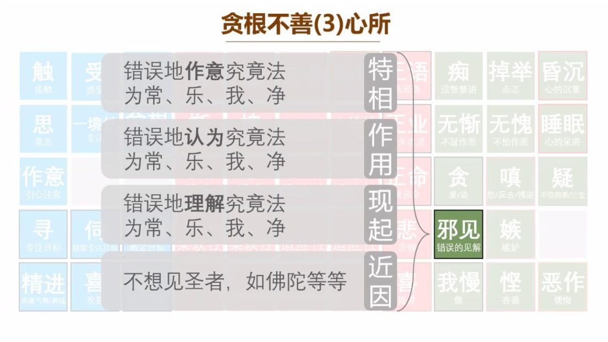

📅 最近更新：2026-09-29 13:00　|　第5版精修（朗读优化版）

# 第3周：邪见与我慢之伪装（学员版）

## 📋 本周信息卡

| 项目 | 内容 |
|:----|:-----|
| 时长 | 120分钟（4周版 · 9环节） |
| 核心问题 | 「思察（vīmaṃsā）」本身是善法，为什么能成为邪见的门？「相似因（patirūpaka）」相似在哪里、为什么相似就够用了？我慢（māna）为什么最擅长以「修行姿态」出现？ |
| 共读原文 | 共读原文1：材料①《13_破妄显真-破除三十八种修道上的自欺12-古源尊者-20260322（课件）》、材料②《14_破妄显真-破除三十八种修道上的自欺13-古源尊者-20260324》。　｜　共读原文2：材料①《15_破妄显真-破除三十八种修道上的自欺14-古源尊者-20260327》。 |
| 本周作业 | ①简答题：写出「脱离正见的五种欺骗机制」的名称。②实践题：本周留意一次「以修行资历／见地／苦行为我慢装点」的念头，只记录它怎样骗过自己。 |

## 🧘 静心开场（10 min）

（主持人引导语，照读即可）

> 各位法友，我们开始前，先给自己三分钟，把身体安顿下来。
>
> 请坐到一个舒服而端正的位置，可以坐椅子，也可以盘腿。双手轻轻放在腿上，肩膀放松，下巴微收。眼睛轻轻闭上，或半垂着眼帘。先做三次比较深的呼吸——吸气，缓缓地；呼气，缓缓地。让胸口、肩膀、腹部一点一点松下来。
>
> 现在把注意力放到自然的呼吸上——不控制它，只是知道：此刻，气正在进来；此刻，气正在出去。可以在心里轻轻陪着它：入……出……入……出。
>
> 如果发现心跑掉了，没关系。这不是失败，这是很自然的事。轻轻把它带回来，回到这一口呼吸。走神一百次，就带回来一百次；每一次带回来，都是一次小小的「放下」。
>
> **接下来这一分钟，我们做本周特别的一道练习。** 请留意：**你的心里有没有正在「讲道理」？** 也许你正在想「今天这个主题是什么意思」「我是不是也有这个问题」「刚才那句话说得对不对」。没关系，不用赶走它——只要在心里**认出它**：「哦，我在推想。」然后**不评判地**回到呼吸。**认出，就已经回到当下了。** 这就是本周我们要练的那一分「思察配正见」。
>
> 接着，我们一起在心里轻轻念诵，为这一场共读安立一个清净的缘起：
>
> 让我与在场的每一位法友，都带着一份温和而诚实的心，来认识「相似」的伪装；
>
> 愿我们不拿这一周的题目去评判别人，也不拿它来否定自己；
>
> 愿我们今天所读的每一句法语，都成为看清一点、松一点、清明一点的因缘；
>
> 愿我们思察时，有正见为眼目；愿我们看见时，对自己不生嗔心。

> 💬 **破冰｜3–5分钟**：说说看：你有没有过「越想越有道理，其实越想越偏」的经历？

> 🛡️ **心理安全三约定**（每次开场在心里过一遍）：① **保密**——这里说的话不出这间屋子；② **不评判**——不评价任何人的分享，也不急着评价自己；③ **可随时暂停**——任何时候觉得不舒服，都可以停下来休息、喝水或离开，不需要解释。

## 📖 共读原文1（20 min）

### 原文材料①：★核心·13_破妄显真-破除三十八种修道上的自欺12-古源尊者-20260322（课件）（板书要点·整篇照录）

- **文件**：《13_破妄显真-破除三十八种修道上的自欺12-古源尊者-20260322（课件）》

**照录（逐字·整篇）：**

> #   破妄显真
>
> 破除三十八种修道上的自欺
>
> 古源如应讲述
>
> #   礼敬佛陀
>
> Namo tassa bhagavato arahato
> sammā-sambuddhassa (x3)
>
> 礼敬那位世尊、阿拉汉、正自觉者
>
> #   三十八种欺骗(九)
>
> 9. Vīmamsāmukhena hetupatirūpakapariggahena micchāditthi vañcetīti yujjati.
>
> 「邪见能以思察为借口，通过摄取相似因来欺骗」[此说]是合理的。
>
> #   贪根不善(3)心所
>
> 触
> 接触
>
> 错误地作意究竟法
> 为常、乐、我、净
>
> 思
> 意志
>
> 作意
> 引心注意
>
> 错误地认为究竟法为常、乐、我、净
>
> 错误地理解究竟法为常、乐、我、净
>
> 寻
> 专注目标
>
> 精进
> 夹缝气暖力防弦
>
> 信息
> 专用
>
> 言欢禧
>
> 不想见圣者，如佛陀等等
>
> 特相
>
> 二语
> 邪语
> 三业
> 杀盗涅
> 三命
> 邪命
> 悲
> 特响
> 喜
>
> 知
> 没智慧语
>
> 掉举
> 志恋
>
> 昏沉
> 心的沉重
>
> 无惭
> 不耻作恶
>
> 无愧
> 不怕作恶
>
> 睡眠
> 心的呆滞
>
> 贪
> 爱/染
>
> 嗔
> 终/反击/怫逆
>
> 疑
>
> 邪见
> 错误的见解
>
> 嫉
> 嫉妒
>
> 我慢
> 做
>
> 悭
> 吝啬
>
> 恶作
> 懊悔
>
> #   欺骗机制：脱离正见的考察
>
> (1) 探究深奥义理
>
> (2) 因智慧不足而错认因果
>
> (3) 执取违背佛法的结语
>
> (4) 固守邪见如真理
>
> (5) 考察异化为颠倒认知
>
> 相应部48相应40经/非惯常顺序的经(庄春江译)
>
> 比丘们！这里，比丘从喜的褪去、住于平静、有念正知、以身体感受乐，进入后住于圣者们告知凡那个『平静的、具念的、安乐住的』第三禅，在那里，已生起的乐根无残余地被灭。比丘们！这被称为比丘知道乐根的灭，他为了那个目的集中心。
>
> 沙门果经
>
> 230.再者，大王，比库离喜并住于舍，念与正知，以身受乐，正如圣者们所说的：‘舍、具念、乐住。’成就第三禅而住。他此身乃被离喜之乐所浸润、流遍、充满、遍布，其身没有任何一处不被离喜之乐所遍满
>
> #   1. 出家生活：把“逻辑推理”当成“亲证真理”——“因为我想不到，所以它不存在。”
>
> 逻辑推理
>
> #   2. 在家生活：把“幸存者偏差”当成“成功学”
>
> ——“我也要那样做，就一定能发财。”
>
> #   3.人际关系：把“贴标签”当成“看人准”
>
> ——“他这么做，肯定是因为针对我。”
>
> 4. 做事与工作：把“投机取巧”当成“灵活变通”——“老实人吃亏，走捷径才是聪明。
>
> #   5. 触动与反思：盲人摸象与火轮
>
> ——“你眼中的圆圈，只是快速移动的火点。”
>
> Idaṃ me puññaṃ āsavakkhayāvahaṃ hotu.
>
> Idam me puñnam nibbānassa paccayo hotu.
>
> Mama puñña-bhāgam sabba-sattānam bhājemi.
>
> te sabbe me samaṃ puñña-bhāgaṃ labhantu.
>
> 愿我此功德 导向诸漏尽
>
> 愿我此功德 为证涅槃缘
>
> 我此功德分 回向诸有情
>
> 愿彼等一切 同得功德分
>
> Sādhu! Sādhu! Sādhu!

---
### 原文材料②：★核心·14_破妄显真-破除三十八种修道上的自欺13-古源尊者-20260324（依据录音转写整理，已校对明显同音错字）

- **文件**：《14_破妄显真-破除三十八种修道上的自欺13-古源尊者-20260324》

**照录（逐字·`[00:00:05.260]`–`[00:49:54.800]`）：**

> `[00:00:05.260]` 好，大家请合掌，我们一起来礼敬佛，Namo tassa bhagavato arahato sammā-sambuddhassa。
>
> `[00:00:11.860]` 礼敬那位世尊、阿拉汉、正自觉者。各位尊者，各位法师、各位贤友，晚上吉祥。

## 💬 第一轮分享（10 min）

**分享规则（先念一遍）**

1. 分享**以自愿为限**，不点名、不追问；沉默完全允许，坐着听也是参与。
2. 每人 **90 秒**（主持人举牌控时）；规则是**只讲自己的经验**，不点评、不分析别人。
3. 若有人的分享让你想起自己，先在心里记下，等第二、三轮再说——**不给回应压力**。
4. **不贴标签**：不说「你这就是邪见」「你这是偏执」；我们只报告自己。
5. 今天所有分享的内容，**只留在这一间屋子里**。

**起手问题（选 2–3 个，先邀请、不点人）**

1. **本周我们读到一个很特别的说法：「因为我想不到，所以它不存在。」** 请回想一件小事——一次你「想不通」就下了结论的经历（不一定是修行上的，生活里的都算）。当时你**省掉了哪一步**？
2. **「相似因」就是「很像正因的理由」。** 请分享一个你自己的「相似因」：当时你用什么理由说服了自己？那个理由**本身成立吗**？它是在帮你看事实，还是在帮你的结论站住？
3. **今天还有一个支线：把「冷漠」当成「离染」。** 你有没有过这样的时刻——嘴上说「我不执着了、随缘吧」，心里其实是「不想管、懒得碰、心里有怨」？（**可以只说「有，但我不展开」**——这也是完整的一次分享。）
4. **自由分享**：本周的材料里，哪一句最像在说你？读的时候心里是什么感觉？

## 🎯 第一轮主题讨论（10 min）

**引导问题一：思察（`vīmaṃsā`）本身没有问题，问题在哪一步？（约 12 min）**

- 先请一位学员照读材料①的五条机制：**①探究深奥义理；②因智慧不足而错认因果；③执取违背佛法的结语；④固守邪见如真理；⑤考察异化为颠倒认知。**
- 提示（主持人可照读）：**请注意这五步的次序——它们不是五个错误，而是一条「越走越像修行」的路。** 第一步「探究深奥义理」听上去完全是好事；可一旦探究的结果被当成「我懂了」，第二步就会在智慧不足处**错认因果**；第三步再把自己的**结语执取**下来（比如「我看透了」「这都是业」）；第四步把那个结语**固守成真理**；到最后第五步，**考察本身已经异化为颠倒认知**——我们以为自己在思察，其实是在为已有的结论找证据。
- 追问：这五步里，**你最容易在哪一步滑掉**？在哪一步停下，成本最低？
- 落点（材料④）：所以问题不在「想不想」，而在**「有没有正见为眼目」**——「只要有自欺，自欺的背后就有痴（`moha`）；只要有痴，你就没有办法以正见为先导。不能以正见为先导，八正道就无法展开。」

**引导问题二：「相似因」为什么相似就够用了？（约 12 min）**

- 请学员照读材料①的第五类错认：**「盲人摸象与火轮——你眼中的圆圈，只是快速移动的火点。」**
- 提示：**火轮是真实可见的心理影像，但它的对象不是「圆圈」。** 我们的「相似因」正是如此：它常常**是真实存在的道理**（「那是他的业」「世间都是无常」「我是为了不攀缘」），但当我们把它**从它该在的位置挪出来**，去护送一个未经如实观察的结论时，它就成了相似因。
- 追问三个「换位检验」：
  1. **换位**：如果同样的理由用在**别人**身上，我会觉得它成立吗？
  2. **换果**：我用这个理由**接下来会做什么**？会让自他的苦减少，还是让我的逃避更舒服？
  3. **换源头**：这个理由是**观察来的**，还是**我想要来的**？
- 落点：材料①第②条「因智慧不足而错认因果」在这里最容易被看见——**错认因果，往往不是把 A 看成 B，而是把「我要的」看成了「事实」。**

**引导问题三：同一条「相似」机制，如何让冷漠冒充离染？——从见地走到慈悲（约 11 min）**

- 请学员照读材料②的**四条检查项**（`[00:19:26]`–`[00:20:42]`）：①外相是否呈现「舍离人事物」的离染相？②内心有没有排斥、厌恶、自私、逃避？③行为的结果有没有影响到别人的福祉？④有没有把冷漠美化为修行的倾向？
- 提示：**这四条其实就是「相似因」在慈悲上的应用**——假离染之所以能骗过我们，正因为「残酷冷漠」与「解脱离染」在外相上**相似**：「都不受对方情绪的牵动，似乎他如如不动。」
- 请两位学员分别照读材料②中「出家生活」的错认（「那是他的业，我不管才是修行，管了是攀缘」，`[00:23:54]`–`[00:26:38]`）与「人际关系」的错认（「我说话难听，是因为我不虚伪」，`[00:35:12]`–`[00:36:16]`）。
- 追问：**「那是他的业」这句话本身错吗？**（不错，它符合业果法则。）**那错在哪？**（错在它被用来护送「我不想管」——**话是对的，位置不对**。）
- 落点（材料②原话，可板书）：**「离染是把心从黏着中拔出来，而不是把心从关怀中把它关掉。」** 再补一句材料②的防护三条：**①根植于悲心而非嗔心；②具足正见与正思维而非邪见邪思维；③以四圣谛的角度看问题、以八正道的方式解决问题。**

> **分层追问**（可视时间取用，由浅入深）：
> - 【现象】你身上有没有一种「用想代替修」的习惯？
> - 【影响】光想不做、或者想偏了方向，会带来什么？
> - 【应对】这周你愿意在哪一个反复盘旋的念头上，先停下来，回到身体与呼吸？

## 🧘 禅修练习（15 min）

### 练习一

> ⚠️ **禅修禁忌提示**：若你正处在严重抑郁、焦虑、创伤后应激，或精神类疾病的发作／用药期，或正经历强烈的情绪危机，请先咨询医生或心理师，再决定是否练习；练习中若出现明显不适（如心悸、胸闷、情绪失控），请立即停止，睁开眼睛，把注意力放回呼吸与身体，必要时离场休息。

> 请坐好，身体端正而放松，眼睛轻轻闭上。先做三次深呼吸，然后让呼吸回到自然。
>
> 把注意力放在鼻端或腹部的呼吸触感上，只是知道：入……出……
>
> **现在，加一道本周的功课。** 在陪着呼吸的同时，请留意三件事：
>
> **第一，有没有「讲道理」。** 心里是不是正在解释、判断、给自己找一个说法？如果有，只在心里轻轻标记一句：「**在推想。**」然后回到呼吸。**标记不是打压，它只是让「我知道我在推想」亮起来。**
>
> **第二，这个道理在为谁服务。** 当那个说法出现时，轻轻问自己一句：「**我是在看事实，还是在为我已经想要的结论找理由？**」不用回答得很清楚——**问出来，就已经是正见在照。**
>
> **第三，心里有没有一点「不想碰」。** 有没有一种对某人、某事的回避、排斥、懒得理？如果有，标记一句：「**不想碰。**」然后**不急着改变它**，只是**把它看清**。看清之后，再回到呼吸。
>
> 就这样练习大约十分钟：知道呼吸，知道在推想，知道在为谁服务，知道不想碰。**你不需要「想得很对」，你只需要「看得很清楚」。**
>
> 最后两分钟，把这份清明扩展开来，并把慈心带上：
>
> 愿我此刻能看清自己的心，而不责备自己的心；
>
> 愿我在看清之后，仍然愿意伸手，不去做一个冷漠的旁观者；
>
> 愿我不把「不执着」当成关上心门的理由，愿我的心在看清中变得更柔软。
>
> 慢慢把注意力带回身体，感觉一下坐姿、双手、脚掌的接触，然后轻轻睁开眼睛。

### 练习二

> ⚠️ **禅修禁忌提示**：若你正处在严重抑郁、焦虑、创伤后应激，或精神类疾病的发作／用药期，或正经历强烈的情绪危机，请先咨询医生或心理师，再决定是否练习；练习中若出现明显不适（如心悸、胸闷、情绪失控），请立即停止，睁开眼睛，把注意力放回呼吸与身体，必要时离场休息。

> 请坐好，身体端正而放松，眼睛轻轻闭上。先做三次深呼吸，然后让呼吸回到自然。
>
> 把注意力放在鼻端或腹部的呼吸触感上，只是知道：入……出……
>
> **现在，加一道本周的功课。** 在陪着呼吸的同时，请留意三个讯号：
>
> **第一，姿态。** 有没有一种「我正在好好修行」的感觉？如果有，**不赶它走**，只在心里轻轻标记一句：「**姿态**。」然后回到呼吸。看见它，就已经松了一层。
>
> **第二，紧缩还是柔软。** 此刻的心，是缩着、绷着、有点排斥，还是柔软的、开阔的？如果是紧缩的，只标记一句：「**紧缩**。」不追求把它变柔软——**只要如实看到，它自己会松**。
>
> **第三，有没有想被看见。** 有没有一丝「希望别人知道我在用功」的念头？如果有，标记一句：「**想被看见**。」然后温柔地放掉，回到呼吸。
>
> 就这样练习大约十分钟：知道呼吸，知道姿态，知道紧缩，知道想被看见。**你不需要「修得很好」，你只需要「看得很真」。**
>
> 最后两分钟，把这份温和扩展开来：愿我此刻能看清自己的心，也愿一切众生都能看清自己的心；愿我们不因看见而责备自己，愿我们因看见而更柔软——**愿我身可独处，心常柔软；需要时，随手就能伸手。**
>
> 慢慢把注意力带回身体，感觉一下坐姿、双手、脚掌的接触，然后轻轻睁开眼睛。

## 📖 共读原文2（20 min）

>
> **照读纪律**：录音转写保留了口语原貌与时间码，读起来会有些「绕」，请法友**照字念、不跳读、也不顺手美化**；时间码可念也可略过。
>
> **本讲与既有系列的分工**：心所体系详见**读书会14**；心路机制详见**读书会15**；业与轮回详见**读书会13**；戒定慧框架详见**读书会19**；「三慢（胜／等／卑）与惭／愧辨析」详见本系列**第4周**（自欺11）。本讲只讲「自欺如何腐蚀」，不重建这些框架。
>
> **段间串场词（材料①→材料③之间，主持人可照用）**：材料①讲的是我慢的第一件衣服——**资历**：「我有地位、我学完课程、我禅修不错，所以我值得受用」。那么，如果一个人干脆不享受、还很简朴呢？请听材料③——**我慢的第二件衣服，叫「少欲知足」**：悭吝穿上「活命清净」，戒律就成了烦恼的防弹衣。
>

### 原文材料①：★核心·15_破妄显真-破除三十八种修道上的自欺14-古源尊者-20260327（依据录音转写整理，已校对明显同音错字）

- **文件**：《15_破妄显真-破除三十八种修道上的自欺14-古源尊者-20260327》

**照录（逐字·全段，朗读时按上述三段择要）：**

> `[00:00:14.720]` Namo tassa bhagavato arahato sammā-sambuddhassa（×3）。各位尊者，各位法师，各位贤友，晚上吉祥。
>
> `[00:00:55.360]` 今天，我们来学习。第。十一种。
>
> `[00:01:05.450]` 第十一种欺骗。从事娱乐，享受能与受用佛陀许可之物的伪装来欺骗。那。
>
> `[00:01:22.120]` 这个自欺，它是解释什么？我们把。戒律，允许或者生活必须的正当受用。比如我们出家人讲衣食住药四种资具。那把它异化成为对感官舒适，奢华享乐这种很隐秘的贪求。它的欺骗性在于哪里？即它是以如法必须、有利于修行来作为伪装。实际上他行的是，滋养自己的贪欲，强化我执的这样的这个实际上的一种内在的贪执。所以那这里。我们要观察的是它是一种这种。从需要向刚好的这种丝滑的这种转移，好。那什么叫？佛陀这个受用。
>
> `[00:02:35.250]` 受许的使用，或者受用许可？它是指在戒律允许或者维持基本生活所需要的物品使用，比如说我们的袈裟、生衣，食物。住所医药。那如果我们假借这个四资具的必须或者合理之名，而去过度地索取。或者你内心里面这么去朝向他就很容易沦为纵欲的享乐，就耽着于感官的舒适和。享乐。
>
> `[00:03:19.840]` 那举个例子说。我们。袈裟，或者我们生衣。我们这个在广州，大家说我们要用丝绸的。比较。因为热。对，
>
> `[00:03:42.780]` 在我们在缅甸的时候，我们像以前讲过最高级的这个袈裟是用莲花的，莲花的杆和莲花。这个织出来的线，反着加上，据说穿着很舒服，没穿过，对它成为一种……很实，就是你要供养一个大师……你要花很多钱去处理一套那样的袈裟。但是，这个很多人内心也会很倾向于说，就是这样穿着长袖很好，对？或者说，这样才是。一个这个我们说人靠衣装，出家人要靠袈裟，对，所以他就觉得要选最好的。
>
> `[00:04:35.900]` 舍弃普通的供养，追求这种好吃的东西，那这个对于居住的地方，我们有很多的期待。对，我们在云台，这个大家都愿意住那个虽然云台的条件确实很差了，对，
>
> `[00:04:55.645]` 但是，住集装箱总比住土楼强。对，那那就。那我们内心里面其实是对不好的住所的一种排斥，对好的住所的一种贪求，内心里面倾向一般我们报告说这样我比较适合禅修，这个心比较能够专注。或者，这个信众，这个大致诚心供养。
>
> `[00:05:30.580]` 就跟我们讲暗示对，听说苹果已经出iphone18了，据说有AI对我们备课比较好用。对，就叫暗示。这是戒律许可的，对？我没有要求他供养，我只是听说那个很好。对，那你如果懂，你就要，你就要去做对？
>
> `[00:05:58.525]` 对以前，这个有这个，有个笑话说这个如果一个比库，贪着于美味，他可以把寺院养的鸡，建议把它杀了吃了他还不犯戒。就看到鸡，就跟他的亲人讲说嘎比亚嘎罗黑。亲人就知道把鸡杀了给他吃，对，这个就叫做，这个变黑的意思就是。给他做净，给那一只鸡做净。他们就不给他做净，那这个就是一种，他是想吃鸡肉了，但是，戒律是许可的。我们已经嘎比嘎到黑了。对，以他这个言语上看是合理了，但是他的心，他是从基本需求滑向这种贪图享乐。
>
> `[00:06:54.620]` 正是，他以这个佛陀受许允许，这个作为伪装，来，这个纵容自己，对这个物欲的这种贪求了。好。从。
>
> `[00:07:12.500]` 教理的角度上来讲，什么叫做佛陀许可之物？我们在教戒律上，它是有资具依止戒。在戒律里面是有资具依止戒，就是佛陀允许出家人受用衣食住药四种生活之具。我们这个叫资具依止，那这是佛陀许可之物。但是，我们要知道我们在受用这些许可之物的时候，那你看我们晚上都有省思，
>
> `[00:07:43.170]` 四种省思对？你的饮食的省思，当然我们现在五观堂，五观堂的时候，你要思存五观，当然是没有念诵。没有念诵，至少在念到说这个。这个愿这个供养的人，他能够得到安乐，这也算喽。对以正常来讲，饮食的形式是不为嬉戏，不为骄慢，不为装饰，不为庄严，只是为了此生助力存续，为了停止伤害，为了资助梵行。如是我将消除之说，并使禽兽不生，我将维持生命过且安住。
>
> `[00:08:22.710]` 那包括1我们要将受用受这个省思。这个住处也要这样，这个省思，药也要这样省思。如果忘了省思，我们是养成一个习惯。出家人一般我们养成一个习惯，就临相之前。省思一下，一醒过来，这个我们一般都建议出家人一醒过来，第一个想法就先省思一下，从昨天临相开始到现在为止，
>
> `[00:08:55.255]` 所有的受用的衣食住药四资具都去省思一下，这就比较安全了，不然就变成欠债受用。所以我们一旦受用，它偏离了维持生命资助梵行的这种初心，而转而去追求口感安逸舒适美貌。即使吃下去的杯中合法的食物，我就穿着信众供养的袈裟，它其实。实质上已经变成了对五欲功德的，这种五欲的这种感受的贪求。
>
> `[00:09:33.980]` 那在经典里面，我们这个佛陀对于四种受用，就是分成四类，对？盗受用就是盗受用破戒者，受用信众的供养就叫盗受用。所以我们经常讲，说这个地狱门前僧道多。为什么？就是因为破戒者他还穿着那个袈裟，在接受信众的供养，那这个大概率都在地狱里了。债受用，就是持戒的凡夫如果不省察，每天不去省思四种资具，四资具的受用，它就变成欠债受用或者叫债受用。
>
> `[00:10:15.650]` 当禅修者，或者出家人？借着这是佛陀允许为由不加省察的，这种享受，这大快朵颐，这个不仅是欲乐的伪装，在业果上他还欠下了信众的债务。好，即以正当化掩饰的这种自欺欺人，使自己的对贪求披上合法的外衣。

## 💬 第二轮分享（10 min）

**分享规则**：每人 2 分钟以内（人多则 90 秒），主持人控时；**分享自愿**，沉默完全被允许；只讲「自己的经验」，不谈「别人的修行」。请先说明：**本轮的题目没有标准答案，也没有「正确答案的人」。**

**起手问题（择 2–3 个轮流）**：

1. **你有没有一次，是因为「我是学佛的／我修了这么久／我懂得比较多」而说话特别有底气？** 当时说了什么、心里是什么感觉？只讲那件事，不必下结论。
2. 录音里说，我慢最舒服的椅子是「我是一个严格持戒者，他们都是世俗攀缘的人」。**回想最近一个月，你在哪件事上，心里曾轻轻把某个人放在自己下面？** 说出那个场景就好。
3. 你有没有过「我不想管」而说出「我在修行／我要独处／随缘吧」的时刻？**当时你是真的在放下，还是不想承担？** 只要说出那件事。

> 主持人提示：这一轮**不要急着做「诊断」**。学员说出难堪的经验时，你的第一句话应该是「这很常见」，而不是「那你要怎么改」。分享结束后可以点一句：「**我们今天不是来清算自己的修行，是来学一种分辨力。**」

## 🎯 第二轮主题讨论（10 min）

（3 个引导问题＋每问提示，由浅入深，指向实修）

**第 1 问（分辨）**：真修行与修行姿态，外表都可能是「很用功、很清净」。请用你自己的话，说出**三个可以分辨它们的检查点**。你打算用哪一个来检查自己？

> 提示：可从这几条引路——「心是柔软开阔，还是紧缩排斥？」「有没有急着用戒律、教理来武装自己？」「需不需要别人知道我在修行？」「需要我帮忙的时候，我是伸手还是退缩？」收束可引录音：「**真正的清净是内心无贪的舍**」（材料③）；以及「**我们不怕纯粹的自利，就怕你在自利的时候，觉得自己还是一个守戒的清净的圣人**」（材料⑤）。

**第 2 问（道德优越感与惭愧）**：材料①说，悭吝者「甚至他还会升起一种道德优越感：我是一个严格持戒者，他们都是世俗攀缘的人」。请举一个**自己心里曾升起类似念头**的例子，然后回答：**如果换成「惭（hiri）」的眼光，同一件事会怎么看？**

> 提示：可引「惭＝尊重自己而羞耻造恶，愧＝尊重他人而害怕造恶」——**惭是把自己看真，慢是把自己举高**。此处务必点出心理安全边界：**如实觉察 ≠ 自我否定**；说出这个念头本身不是罪状，是修行在起作用。（三慢与惭愧的完整辨析详见第4周自欺11。）

**第 3 问（他证路线与自证路线）**：材料⑤说，有人「自我价值是靠他证——别人认同我，我才有价值」。请检视：**你目前最在意的一个「别人的看法」是什么？** 如果改成「自证路线」（依法自知：有没有烦恼，我自己清楚），你的做法会有什么不同？

> 提示：这是本周落到实修的一问。可引录音「**法是无遮的、可来见的；智者们可以各自证知**」与「**如人饮水，冷暖自知**」。也提醒：他证不是罪，只是把方向盘交给了别人；**先把「善业工作者」这个身份定义清楚**，别人的评价就只是参考。

> **分层追问**（可视时间取用，由浅入深）：
> - 【现象】修行里的「我慢」，你最容易在什么地方冒出来——比较用功、比较境界，还是比较见闻？
> - 【影响】带着我慢修，是越修越细，还是越修越粗？
> - 【应对】这周你愿意在哪一件小事上，练习一次「只跟昨天的自己比」？

## 🔚 收尾与回向（15 min）

### 收尾一

**一、总结引导（主持人照读即可）**

> 各位法友，我们用一个下午，看了自欺里最会「讲道理」的一位——邪见。
>
> 今天我们看清了它的手法：**它不反对我们思察，它正是要我们思察；它只把「与正见相似的理由」放在我们手里，让我们以为已经想清楚了。** 所以本周的分辨标尺不是「想得通」，而是**「有没有正见为眼目」**。
>
> 我们也把这条「相似」的尺，量到了慈悲上：**同样一句「我不攀缘」、同样一句「我不执着结果」，动机与结果一照，真伪就分开了。** 「离染是把心从黏着中拔出来，不是把心从关怀中关掉。」
>
> 最后请把这句话带走一遍：**如实觉察 ≠ 自我否定。** 今天我们认出的每一个「相似因」，都不是罪状，而是路标；**能看见它，正是正见在起作用——觉察本身，就是正见之路。**
>
> 也请记得：这份分辨，**只用在自己身上**。别人的心我们看不全，我们只能照亮自己这一盏灯。

**二、下周预告**

> 下周（第 6 周）我们进入以「**自尊/我慢**」为伪装的修行姿态——看「我慢」如何借着「我尊重自己」「我很精进」「我吃得苦」的样子，替修行的资历、见地与苦行装点门面，以及道德优越感如何悄悄长出来。请带来的作业不变：继续做「每天一件事、先问一句『我是在看事实，还是在为结论找理由』」的练习。

**三、回向词（四句）**

> 愿以此功德，回向诸有情；
>
> 愿一切众生，远离一切苦；
>
> 愿我们以正见照见自心，不以觉察责备自己；
>
> 愿一切众生，同得功德分，共证涅槃乐。

（如时间允许，可加念一遍巴利回向偈：`Idaṃ me puññaṃ āsavakkhayāvahaṃ hotu.` / `Idam me puñnam nibbānassa paccayo hotu.`）

### 收尾二

**一、总结引导（主持人照读即可）**

> 各位法友，我们用一个下午，看了八周里最像「修行」的那一位——我慢。
>
> 它不吵不闹，因为它穿的是我们最珍惜的那件衣服：**「我在修行」**。于是我慢可以借资历、借见地、借苦行、借少欲、借离群、借热心，来给自己搭台；它甚至能说出最漂亮的一句话——「**我是一个严格持戒者，他们都是世俗攀缘的人**」。
>
> 我们也拿到了分辨它的那把尺：**惭愧与柔软**。真修行以惭愧（hiri／ottappa）为体，把自己看真；修行姿态以我慢（māna）为体，把自己举高。录音里说得更直白：「**戒律成了我们自己烦恼的防弹衣**」、「**不怕纯粹的小气，就怕披着清净活命外衣的悭吝**」。
>
> 最后请把这句话带走一遍：**如实觉察 ≠ 自我否定。** 今天认出的每一件「外衣」，都不是罪状，而是路标。**觉察我慢本身，就是修行。**
>
> 也请记得：这份分辨，**只用在自己身上**。别人的心我们看不全，我们只能照亮自己这一盏灯。

**二、下周预告**

> 下周（第 7 周）我们进入以「**悭吝/慈悲**」为伪装的占有——看俗家悭吝、住所悭吝如何以「关爱／护持道场」为伪装，以及「慈悲」如何被借来当借口。请带来的作业不变：继续做「每天一次、回看自己那句话是为谁」的练习。

**三、回向词（四句）**

> 愿以此功德，回向诸有情；
>
> 愿一切众生，远离一切苦；
>
> 愿我们以惭愧照见自心，不以觉察责备自己；
>
> 愿一切众生，同得功德分，共证涅槃乐。

（如时间允许，可加念一遍巴利回向偈：`Idaṃ me puññaṃ āsavakkhayāvahaṃ hotu.` / `Idam me puñnam nibbānassa paccayo hotu.`）

---

## 📖 延伸阅读（课后自由选读）

《13_破妄显真-破除三十八种修道上的自欺12-古源尊者-20260322（课件）》——第九种：邪见以思察为借口、摄取相似因；「脱离正见的五种欺骗机制」。
《14_破妄显真-破除三十八种修道上的自欺13-古源尊者-20260324》——第十种：对有情无慈愍以离染为伪装；离染与冷漠之别。
《15_破妄显真-破除三十八种修道上的自欺14-古源尊者-20260327》——第十一种：以受用佛陀许可之物为伪装从事欲乐享受。
《16_破妄显真-破除三十八种修道上的自欺15-古源尊者-20260331》——第十二／十三种：以活命清净为伪装行不分享、邪命以习惯分享为伪装。
《17_破妄显真-破除三十八种修道上的自欺16-古源尊者-20260403》——第十四／十五种：不扶助以不结交而住为伪装、不如法结交以习惯帮扶为伪装。
