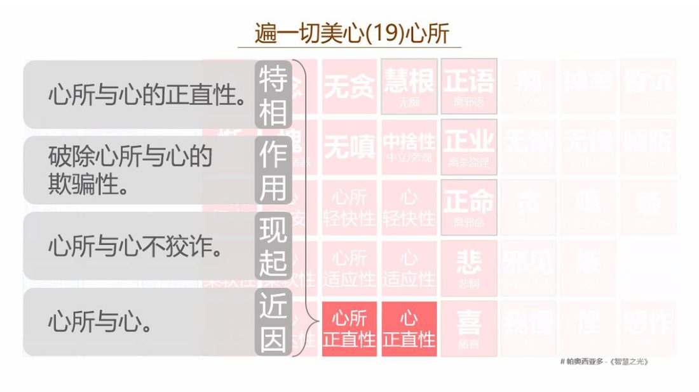

📅 最近更新：2026-09-29 13:00　|　第5版精修（朗读优化版）

# 第4周：悭吝之伪装与总摄对治（主持人版）

> ⭐ **本讲主持人速览**（新主持人必读，2分钟看完）
>
> 你不是老师，是"共学同行者"。你不需要提前懂内容，只需要按流程走。
> **本周由连续两周内容合并**而成，含两段共读、两轮分享与两轮讨论，单讲 120 分钟。
>
> | 环节 | 标准时长 | ⏱ 时间不够→ | ⏱ 时间富余→ |
> |:-----|:----:|:-----|:-----|
> | 🧘 静心开场 | 10 min | 缩至5 min | 加2分钟静坐 |
> | 📖 共读原文1 | 20 min | 只读★核心段（约15 min） | 加读◈扩展段 |
> | 💬 第一轮分享 | 10 min | 每人1句话 | 每人3分钟 |
> | 🎯 第一轮主题讨论 | 10 min | 只讨论问题① | 讨论全部问题+扩展 |
> | 🧘 禅修练习 | 15 min | 缩至8 min（只念引导词前半） | 延长至20 min |
> | 📖 共读原文2 | 20 min | 只读★核心段 | 加读◈扩展段 |
> | 💬 第二轮分享 | 10 min | 每人1句话 | 每人3分钟 |
> | 🎯 第二轮主题讨论 | 10 min | 只讨论问题① | 讨论全部问题+扩展 |
> | 🔚 收尾与回向 | 15 min | 缩至10 min | 保持 |
>
> **主持人10条守则（精简版）**：
> ① 不讲解、不提供答案——让原文自己说话；② 有人问"正确答案"→说"先听听大家的看法"；③ 冷场→主持人先分享自己的真实感受；④ 跑题→温和拉回："这个有意思，我们回到今天的原文"；⑤ 争论→"两种看法都很好，大家保留自己的理解"；⑥ 确保人人发言；⑦ 不评判任何人的分享；⑧ 时间到了就推进；⑨ 禅修练习照读引导词即可；⑩ 结束一起回向。

> 本周主题：**以「悭吝/慈悲」为伪装的占有——悭吝（macchariya）与占有欲借「慈悲、帮扶、和合、真实语、爱语、慎语、言辞友善」等善法外衣，行同流合污、离间挑拨、见死不救、谄媚求利、冷漠疏离、欺诳谄曲之实；表层显现为正语·慈心·谨慎，底层常是贪根心、嗔根心与我慢。**；**总摄对治：正见·正念·正精进铁三角——以「俗家悭（`kulamacchariya`）以慈愍照顾俗家为门」「住所悭（`āvāsamacchariya`）以希望住所久存为门」「粗恶语以惯于呵责为门」「惯看他人过失以斥恶为门」四句为收束，回扣第1周「善恶辨析」，串联贪→嗔→痴→邪见→我慢→悭吝六类自欺，以系统性省察与微习惯落地，以功德回向收摄，回归本然清净。**。

---

## 📋 本周信息卡

| 项目 | 内容 |
|:----|:-----|
| 时长 | 120分钟（4周版 · 9环节） |
| 核心问题 | 悭吝（macchariya）与「占有」为什么不直接出现，而要借善法的外衣？说真话为什么也能构成离间语？「爱语」与「谄媚」在体验上怎样分？「圣默然／慎语」与「冷漠疏离」的分界是什么？ |
| 共读原文 | 共读原文1：材料①《18_破妄显真-破除三十八种修道上的自欺17-古源尊者-20260407》。　｜　共读原文2：材料①《22_破妄显真-破除三十八种修道上的自欺21-古源尊者-20260420》。 |
| 本周作业 | ①简答题：分别用一句话区分「爱语／谄媚」「慎语／冷漠」。②实践题：本周回顾一次「悭吝／虚伪」伪装成善法的时刻，写下辨识它的那一条线索。 |

## 🧘 静心开场（10 min）

> 主持人引导语（照读即可，语速放慢，每句之间留 3–5 秒静默）：
>
> 请大家合掌，我们一起来礼敬佛陀。
> `Namo tassa bhagavato arahato sammā-sambuddhassa`（三遍）
>
> 请把身体安顿好，坐得端正而放松。闭上眼睛，或者把目光轻轻垂在前方。
>
> （约 2 分钟：只觉知呼吸）把注意力放在鼻端，觉知入息，觉知出息。不需要改变呼吸，只是知道它在。吸气……知道；呼气……知道。
>
> （约 2 分钟：放松）把注意力从头部扫到脚趾：放松额头、放松肩膀、放松胸口、放松腹部、放松双手、放松双腿。让身体像一件挂好的衣服，静静地挂着。
>
> （约 2 分钟：慈心）现在，想起一位你真心希望他平安快乐的人，在心里对他说：愿你平安，愿你健康，愿你快乐，愿你被善意包围。再把这句话送给自己：愿我平安，愿我健康，愿我快乐，愿不被烦恼所苦。
>
> （约 2 分钟：本周主题的安立）本周我们要谈「悭吝与慈悲」——谈我们怎样在善法的话语里，藏着一点想抓住什么的心。请先在心里安立一个基调：**今天我来看自己的心，不是来审判自己，也不是来审判任何人。** 看见，就已经在修行的路上。
>
> （约 1 分钟：决意）今天这两个小时，我愿意对自己诚实一点，也愿意对同伴温柔一点。我们一起开始。

> 💬 **破冰｜3–5分钟**：说说看：你有没有过「明明是出于善意，却想把它攥在手里」的时候？

> 🛡️ **心理安全三约定**（每次开场在心里过一遍）：① **保密**——这里说的话不出这间屋子；② **不评判**——不评价任何人的分享，也不急着评价自己；③ **可随时暂停**——任何时候觉得不舒服，都可以停下来休息、喝水或离开，不需要解释。

## 📖 共读原文1（20 min）

> 本环节由法友轮流照读。**材料完整信息行、校注与操作提示见下**；★为核心材料（材料③⑤为本周主题正位）。主持人请按「静心—共读—分享」的顺序控时：共读 30 分钟，宁少读一段，不拖堂。每读完一组，留 30 秒静默。

### 原文材料①：18_破妄显真-破除三十八种修道上的自欺17-古源尊者-20260407（依据录音转写整理，已校对明显同音错字）

- **文件**：《18_破妄显真-破除三十八种修道上的自欺17-古源尊者-20260407》

> ⚠️ 主持人操作：本讲共 64 分钟。照录按「悭吝/帮扶之名→传统文化批判→案例→防护→第十六种（离间语）→如法告知之别→防护与回向」顺序**分 6 组段**照读，每组读完留 30 秒静默。时间紧张时，**先读第 ④⑤ 组（离间语与如法告知之别，本周主题正位）**，第 ①②③ 组（传统文化批判）可略读；`[00:14:17]`–`[00:17:10]`（出家人荒废修行与在家包庇纵容的展开）、`[00:18:44]`–`[00:20:24]`（职场包庇）、`[00:37:32]`–`[00:41:25]`（诚实离间术的重复举例）、`[00:46:05]`–`[00:52:30]`（庄子支离其德）为可跳读段，已在下方以「（中略）」标出，不必全部照读。

**照录（逐字·选段）：**

> `[00:00:00.000]` Namo tassa bhagavato arahato sammā-sambuddhassa。礼敬那位世尊、阿拉汉、正自觉者。各位尊者，各位法师，各位贤友，晚上吉祥。
>
> `[00:00:42.320]` 我们上一堂课是学到。第15种欺骗不如法的结交，能以习惯性帮扶的伪装来欺骗。就是我们说老好人，热心肠，对。他是很容易，以为悲悯来这个掩盖他的这个乐于杂居。他的外向，是展现出来和和友善，包容，但是他的内在，是安名求利，是走的是他正的路线。这个希望得到别人的认可，或者他有自己的，这个甚至有一些不可告人的想法。所以我们要去看到他这个贪和悲悯的区别。
>
> `[00:02:02.600]` 当然有一些人，他并不是因为贪，他就是。分不清楚什么叫做真正的悲悯，什么叫做情绪的过度卷入，我们叫悲心的释坏。这个一看到别人有点苦，自己就哭得稀里哗啦的，你也不知道应该怎么正确地去帮助别人，就跟着人家一起苦一起哭。他这个也是一种错误了。
>
> `[00:02:32.740]` 所以我们要知道它之间有什么样的差别，以及容易混淆的地方，我们要有慈悲心，要帮助弱者，但是。这个我们要清楚，界限是什么好，要搞清楚，你当时是出于悲心。这个可以，这个帮到别人去苦，还是你有很多期待？要分清楚或者说。我们这样做，会导致我们的戒律有缺损，会造成误加，那就不恰当了。
>
> `[00:03:15.740]` 那昨天，上一堂课，我们这个还没有讲，就是中国传统文化上。它也是有这个。这个很明确的这样的一个教导，就表面上的这个仁爱和亲和，如果动机不纯，这个孔夫子说这叫「德之贼」。
>
> `[00:03:46.300]` 中国的这个传统文化里面。就有一个词叫乡愿，对，大家知道叫乡愿对。下面什么意思。写不出来。商愿？就是有点伪善了对。就是。
>
> `[00:04:23.020]` 儒家，他强调仁和义，它是要统一的。所以真正的仁爱，必有原则上的这个义。他不是没有原则的这个滥交和讨好。这个在论语·阳货里面这个。这个孔夫子说，乡愿，德之贼也。这个在这里面，就是孔夫子，他痛斥这种。一种，有一种一乡人，都称许为的这个老好人。
>
> `[00:05:02.140]` 就乡愿，它的意思，就是表面上这个言行很中性，举止举止很廉洁。但处处讨好迎合，让所有的人都觉得他是好人呐，在佛法里面就像和合之行，他总是跟人家很和睦。但是，它可能的本质。就是同流合污，这个阉然媚于世，就没有真正的道德准则，没有道德原则，他只是为了博取世俗的赞誉而活着，大家觉得我好就可以。所以孔夫子说这是德之贼，因为他混淆了真正的这个善，也就是仁和虚伪的迎合，他破坏了道德的标准。那这个我们在这个前面讲的这个自欺这个以和合之名，以帮扶帮助人之名，伪装这个不恰当的结交或者说我们出家人，就是这个贪着居家它其实是一样的，就是用表面的和合。好人缘掩盖内在的没原则，结交不当和功利求名，都是属于这种乡愿的一种。例子的一种表现。
>
> `[00:06:38.760]` 道家也一样的，道家它强调自然，无为，真朴，他反对一切这个人为的黏着，或者文过饰非，对虚伪的社交，他是很明确的，这个给予批评和揭露。这个道德经里里面有讲，叫大道废有仁义。大道废，有仁义智慧出，有大伪，伪装的伪。六亲不和有孝慈，国家昏乱有忠臣。这个什么意思。就老子，他洞察到。当自然无为的大道失落的时候，人们就开始标榜仁义，孝慈这些道德概念。而这些概念一旦成为被追逐的名相，就会催生这种虚伪大伪，我们说满口仁义道德，一肚子男盗女娼。它就是这个意思了，那在我们这个欺骗里面即以帮扶之名或者以和合之名，伪装不当的社交，它也是这种伪的一种表现。就当真正的自然的亲和，就是一个人，比如说我们说佛陀或者阿拉汉，他是跟人的这种亲和，他是自然而然的。他是用道家来讲，就是你活在道上，对？那阿拉汉或者佛陀，他都是围坐，他只是正确的坐。那这个当道缺失的时候，人们就会刻意地去表演，成为一个有能力的人，和合，帮扶，以人为这个为这个，这个去帮助人。
>
> `[00:08:40.780]` 这种表演，它往往包裹着自私的算计。也是不当的结交。那实际上，它是一种伪装，就跟道家的返璞归真，这这个形式，它是相违的，这就是欺骗的扇形。
>
> `[00:09:04.080]` 这个庄子在列寇篇里面，列御寇里面讲到说，贼莫大乎德有心，而心有睫。最大的祸害，莫过于。这个有心为德。就是带着刻意的心去行持有道德的行为。这种心，他就说，就像戴着眼睫毛，眼睫毛就是我们讲现在的话来讲就戴有色眼镜，就各种分别计较，就是我要看什么样的人我才帮不帮你。那你如果是这个可以从他上上面得到好处的人，我们就会很谄媚等等的。他就是。庄子讲的就是这个有心为德，这是最大的祸害。
>
> `[00:10:04.020]` 就一旦我们行善的时候，心存我要去做好事，我做好事要让别人看到我做的好事，就要让别人觉得我很好，并且聚焦，相应的对象，回报，这种德就变成贼害征信的东西。被欺骗的一种行为，就是得有心的一种典型，就是怀着贪求名利，惧怕孤立的这样一种有心去进行有选择的。帮扶或者和合型，就是戴上有色眼镜。这个老庄子讲心有结，就心，已经戴上了睫毛。那只结交能给自己带来好处的人，就完全背离了道家这个「上德不德，是以有德」，最高的德行是不刻意表现为德才算有德。
>
> `[00:11:01.380]` 所以中国的传统文化，对这个不管是伦理原则，还是道家的自然真性，它跟佛法的这个强调的这个不要欺骗也是一样的。就真正的善行和合，必然是根植于纯净的动机。在佛教里面就是善，在善心不善心，在道家里面，儒儒家里就是人心，道心。它跟我们这个智慧的选择是种认知，它是一一体的了，是可以相互关联的。
>
> `[00:11:45.420]` 所以危险的欺骗？它往往是披着光鲜的外衣。乡愿之害？他说在儒家来讲，（乡愿之害）大于真小人；（伪善之）险胜于真恶。这个解释说，这个就中国传统文化里面，对攀援谄媚结交恶友都是给予批判的批评的。所以君子和得道者的社交，是以义之与比和光同尘就他有原则不滥交，但是他又很亲和，不孤傲。它看起来像无为，实际上它随缘应物，利益众生没有丝毫的贪着。所以在这个这条的教理，

## 💬 第一轮分享（10 min）

> 分享规则（主持人先读一次，语气温和）：
>
> 1. 每人 90 秒，先邀请、不点名；说「我今天只听」也完全可以，沉默是被允许的。
> 2. 只讲自己的经验，不讲别人的过失；不点评在座任何人的分享内容。
> 3. 分享的是「看见」，不是「检讨」——只说「我发现自己常常这样」，不必说「我很差」。
> 4. 主持人控时，时间到轻轻提醒；有情绪起伏时，随时可以只要一杯水、做几次深呼吸。

**起手问题（任选 1–2 个，先由主持人自答一段「我的例子」来破冰）**

1. **我身上那件最常穿的外衣是哪一件？** 请回想本周（或最近）一次「我以为我在帮忙／在关心／在说实话／在保持沉默」的场景，只描述事实与心情，不用下结论：当时我在意的是什么？对方的反应是什么？事后我有没有一点点「怪怪的」感觉？
2. **「这是我的」这句话，我最近对什么说过？** 可以是对一个人的在意（要独占这份关系）、对一个位置的在意（这是我的责任／我的资历）、对一处道场或一群法友的在意（「我们这一群人」）、对名声与赞美的在意。请只讲一件，讲清「我怕失去什么」。
3. **沉默的那一次：** 有没有一次，我明明可以提醒、可以说一句话，却选择了「不要惹事、不说是非、我保持中立」？当时身体的感受是什么（紧、闷、想走开）？现在回头看，那一刻我心里在怕什么，或在不希望什么？

> 主持人收束（30 秒）：感谢大家的诚实。请记住：我们刚刚说出来的每一句，都是**看见**，不是罪状。**如实觉察 ≠ 自我否定。** 接下来我们把这三种经验放进法义里，看佛陀与论师们怎么描述它、怎么对治它。

## 🎯 第一轮主题讨论（10 min）

**第一问：悭吝（macchariya）与「占有」为什么要借善法的外衣？外衣与心的关系是什么？（约 12 min）**

> 引导提示：先请学员从材料①里找出两处「好事之名」，再从材料⑤里找出两处「善行之名」：①「广结善缘」②「慈悲度众」（材料①）；③「我在持慎语、我在远离独处」④「我要随顺众生、我对人友善」（材料⑤）。请对照讲者的结论：「危害的媒介并不是他说的话，而是他蓄意想讲的话，或者蓄意不想说的话」。
>
> 追问三条：**一、外衣为什么必须是善法？** 因为不善心最怕被看见；若要「理直气壮」地占有，必须先骗过自己的惭愧心（hiri-ottappa）。**二、悭吝与慈悲的心所差别在哪？** 悭吝属贪根（不肯舍、要独占），慈悲属无嗔／无贪相应；两者在**行动上可能几乎一样**（都去帮人、都对人好），差别只在动机（思）。**三、怎么自检？** 用材料③的硬核指标自问：「我这么做，是希望他好，还是希望他觉得我好？」
>
> 主持人要点（写在白板上）：**同一件外衣，两种心所；判断标准 = 动机。** 并顺势带出「占有」的具体形态：占人（排他小圈子）、占名（利养称赞）、占德（道德高地）——本讲不展开心所体系，**心所分类详见读书会14，戒定慧框架详见读书会19**。

**第二问：说真话怎么会变成离间语？「不说离间语」又怎么会变成见死不救？（约 12 min）**

> 引导提示：请两位学员分别朗读材料①的关键段落与本讲「五事省察」（真实·有益·对方欢喜／和合·适时·慈心），另一位朗读材料③的「如法告知」标准：「非为博取喜爱，亦非意图离间……纯粹为了保护他人免受恶法伤害，是为了呵责恶行，那这个就没有违反离间语了。」
>
> 三组对照请学员自己说：**① 内容真 ≠ 正语**（真话 + 讨好／分裂的动机 = 离间语；手术刀的比喻）。**② 沉默 ≠ 持戒**（不说离间语的止戒，被用来遮掩「不希望他好」的损人之心 anatthakāmatā，属嗔根心）。**③ 结果分裂 ≠ 离间语**（若动机是护他，即便引起暂时不快，亦属应说之时；只是「时机与方法」才是智慧问题）。
>
> 追问：**为什么讲者说「即使你没错，也只是时机与方法的智慧问题」？** —— 因为标准是动机（思），不是结果；但这不等于可以口无遮拦。主持人务必点一句：**「分辨」不是给我们发牌，而是给我们照镜。** 同时也留出「界线感」：世间的冲突、家庭中的对错、道场的意见分歧，都不是我们在此评判的对象；我们只问「我的心在哪一边」。

**第三问：爱语（piyavācā）与谄媚（cāṭukamyatā）、慎语（mitabhāṇitā）与冷漠，如何在体验上分辨？我该如何把「外衣」转回「善法」？（约 11 min）**

> 引导提示：请学员用材料⑤的关键句互相对照：「爱语的底色是慈心……是无条件的希望对方好，它是纯粹的给予。而谄媚的底色呢，就是我要通过这个跟对方换取对方的好感」；「圣默然的背后，是我讨厌死你了，那就不叫圣默然」。
>
> 三个可操作的分辨点（请写在白板上）：
> ① **给予还是索取**：我说这句话／不说话，是「我希望你好」，还是「我希望你觉得我好」？
> ② **有无表演性与选择性**：我的友善／我的沉默是**一贯的**，还是只对「有用的人」友善、只对「不喜欢的人」沉默？
> ③ **身体信号**：柔软、温暖、坦荡（六对美心所之柔软·正直）还是紧、硬、绷（嗔与慢的僵硬）？
>
> 收束一句（讲者原话的精神）：「巧诈不如拙诚」；「言语不仅需要悦耳，它更需要睿智」；「我们的慎语始终要有智慧和慈悲，它是智慧和慈悲的工具，而不是我慢和冷漠的主人」。

> **分层追问**（可视时间取用，由浅入深）：
> - 【现象】慈悲和占有，你觉得分界在哪里？
> - 【影响】把「我为你好」放在别人头上，会给彼此带来什么？
> - 【应对】这周你愿意怎么练习一次「给了就松开」的善意？

## 🧘 禅修练习（15 min）

### 练习一

> ⚠️ **禅修禁忌提示**：若你正处在严重抑郁、焦虑、创伤后应激，或精神类疾病的发作／用药期，或正经历强烈的情绪危机，请先咨询医生或心理师，再决定是否练习；练习中若出现明显不适（如心悸、胸闷、情绪失控），请立即停止，睁开眼睛，把注意力放回呼吸与身体，必要时离场休息。

> 本周练习：慈心（mettā）＋觉察沉默与言语的动机（主持人引导语，照读即可）
>
> （1–2 min）请坐好，放松身体，回到呼吸三分钟，让心安住下来。
>
> （3–5 min）慈心散播（本周正对治——对治悭吝与占有的最直接药）：先对自己：愿我平安，愿我快乐，愿我不被烦恼所苦。想起一位亲爱的人：愿你平安、快乐、安稳。想起一位普通认识的人：愿你也平安、快乐。如果此刻能想起一位「我最近不太喜欢、或看不惯」的人（若太难，就换成一位陌生路人）：愿你也平安，愿我也能放下对你的评判。
>
> （6–11 min）觉察练习（本周的主题作观）：把刚才这段时间里出现过的、真实的场景调出来一次——一次我说了「好话」，一次我什么也没说。
>
> - 看**说好话**的那一次：当时心里想的是什么？是「希望他好」，还是「希望他觉得我好／以后能帮我／不要生我的气」？只标记：「这是慈，这是贪／求。」
> - 看**沉默**的那一次：当时心里想的是什么？是「此刻不必说，说了无益」，还是「我不想麻烦／我不想跟他打交道／我不希望他好」？只标记：「这是慎语，这是排斥／冷漠。」
> 不需要评判，只是标记，然后回到呼吸。
>
> （12–14 min）转心练习：想一个「我一直想占住」的对象——一个人、一个位置、一句赞美、一个「我很不错」的形象。在心里轻轻说：**「愿他（它）平安，愿我不必靠抓住来安心。」** 然后呼气，把这份紧松开一点。
>
> （约 15 min）回向：愿此练习的功德，回向给一切众生；愿我们都能在善法中相见。
>
> 收束提示：若情绪起伏明显，请睁开眼、喝一口水、做几次深呼吸；本练习以自愿为限，随时可以停下来只做呼吸。

### 练习二

> ⚠️ **禅修禁忌提示**：若你正处在严重抑郁、焦虑、创伤后应激，或精神类疾病的发作／用药期，或正经历强烈的情绪危机，请先咨询医生或心理师，再决定是否练习；练习中若出现明显不适（如心悸、胸闷、情绪失控），请立即停止，睁开眼睛，把注意力放回呼吸与身体，必要时离场休息。

> 上周我们练了「标记推论」；**本周练“慈心扩界＋舍心随念”**——这是材料①明确的防护对治第一位：「最主要是训练无量心」。请主持人照读引导词，语速慢，每段留空白。

**引导词（照读即可）**

「请把身体坐正，闭上眼睛，先做三次深呼吸……把今天的四个材料、三场讨论，轻轻放下。现在，我们只做一件事：**把心量一层层打开**。

**第一层——突破自他的界限。** 先对自己散播慈爱。在心里轻轻地说：

> **愿我快乐，愿我没有内心的痛苦，愿我健康，愿我平安。**

（约 1 分钟静默，让这句话真的落地。）

**第二层——突破亲疏的界限。** 现在想到你最亲近、最尊敬的人——家人、师长、常在一起的法友。把刚才那句话送给他：

> **愿你快乐，愿你远离内心的痛苦，愿你健康，愿你平安。**

（约 1 分钟。）然后想到一位**普通的、你不特别熟的人**。同样送出去。（约 30 秒。）现在，想到一位**你不太喜欢、或者让你有点不舒服的人**。不要勉强，能做多少做多少——把同一句话，试着送给他。（约 1 分钟。）

**第三层——突破众生的界限。** 现在把范围扩到一切众生：天人、人、堕恶趣的、一切圣者与非圣者、一切多苦处的众生……东方、西方、南方、北方、四方四维上下——**无量的、平等的、一样的**：

> **愿一切众生快乐，愿一切众生远离内心的痛苦，愿一切众生健康，愿一切众生平安。**

（约 1 分半钟静默。）

**第四层——舍心随念。** 现在把心放平，轻轻地说：

> **一切众生，都是自己业的所有者、业的继承者，以业为起源，以业为亲属，以业为归处。**

（约 1 分钟。）停在这里，**不抓，也不推**。就这样坐着。

**收束。** 现在，请你回看这一座——刚刚那几分钟的敞开、柔软，不要浪费。如果我们本周只做一件事，就做这个：**在照顾某个人、护持某个地方的时候，把这份敞开带进去一分钟**。一小分钟就好。

好，请轻轻睁眼。你今天愿意把心打开到这里，这本身，就是在道上的证据。」

> **主持人备注**：练习中的情绪波动完全正常（第三层与第四层最容易触动）。请提前说明：「若某一段让你不舒服，可以回到呼吸，也可以睁眼静坐，或者暂离一会儿——**两样都好**。」课后不追问、不点评任何人。

---

## 📖 共读原文2（20 min）

> **主持人操作总则**：本周共 4 个材料，请**四位法友轮流照读**，每人一个材料（材料①篇幅最长，可拆给两人）。**照读规则**：只读不解释；遇生僻名相，由主持人用一句话白话点明后继续。材料①中的时间码请**一并读出来**（`[00:00:21.680]` 之类），不要省略——这是本周「如实」的具体练习。读材料③前，请先如实说明录音缺口。

### 原文材料①：★核心·22_破妄显真-破除三十八种修道上的自欺21-古源尊者-20260420（依据录音转写整理，已校对明显同音错字）

- **文件**：《22_破妄显真-破除三十八种修道上的自欺21-古源尊者-20260420》

> ⚠️ 主持人操作：本讲共约 59 分钟，分**三组段**照读——第 ① 组（俗家悭：机制与譬喻，`[00:00:21]`–`[00:08:13]`）、第 ② 组（阿毗达摩·误区·案例·禅修影响，`[00:08:13]`–`[00:37:33]`）、第 ③ 组（住所悭与防护对治·回向，`[00:37:33]`–`[00:59:41]`）。时间紧张时，**必读第 ③ 组中「防护与对治四条反思＋无量心扩界」与回向段**（本周对治正位），第 ② 组案例段（`[00:33:34]`–`[00:37:33]` 出家道场／企业／人际关系三例）可略读。全系列收官周，回向段务必读到最后。

**照录（逐字·全讲）：**

> `[00:00:21.680]` 好，大家请合掌，我们一起来礼敬佛陀。Namo tassa bhagavato arahato sammā-sambuddhassa。礼敬那位世尊、阿拉汉、正自觉者。各位尊者，各位法师，各位贤友，晚上吉祥。我们今天学习。
>
> `[00:01:23.640]` 第38种欺骗。二十三层欺骗。第23个，是俗家悭。就是对俗家的悭吝。能以慈悯照顾俗家的伪装来欺骗。就是护持家族就是对家人，或者说我们信众的这种护持关爱。这个本来他是应该的。但是，他内心反而是一种强烈好，那俗家，这个俗家的这种慈悯照顾在这。kulānuddhayatā 的这个是护持家族或者照顾这个在家人。那如果变成悭吝？就是 macchariya，macchariya 就 kulamacchariya。那这是一种对俗家的执取，即行为上看起来是对亲友这个信众的慈心和悲悯。
>
> `[00:02:49.780]` 但是内在，它演变成占有。嫉妒，或者对俗家你的信众跟别人互动的一种排斥。那这个时候，它是。变成一种悭吝，就是于根植于贪和嗔的一种染污的执取。那这个情况，在我们这个朋友之间，我们这个出家人对信众，这个我们圈子里面的这种人的这种关系他是很明显的，经常都会出现。那我们对家族或者说对信众的慈心，悲悯，他是有真挚的善意在里面的。但是这个关怀如果变成排他，引发嫉妒或者不乐于别人有福乐的时候，他就变成贪和嗔的不善法。
>
> `[00:04:09.520]` 那这样的一种悭吝，会限制我们的舍心，限制我们的布施的心，它会强化我执，会制造分裂，所以他这种情况看起来外面很像。但实际上，就像真金跟镀金的差别，这个它内在就是完全的不同。
>
> `[00:04:36.150]` 那怎样才能够观察到？它需要我们很有正念和能够分析得清楚我们心的状态，这种智慧我们才能看得出来。
>
> `[00:04:47.980]` 那比如说我们一个出家人，他对他的近人，对他的信众，这个非常好。很有慈心，经常祝福他们，也关心他们的，修行，或者他的生活状态，好，那这个是我们叫生熟和合，好。那这个但是，当你的近人跟其他的出家人表现友好的时候，他就很不爽，心生不悦，就感觉你你到底要跟谁学。你眼里面有没有这个老师？对你到底里你这个这你这个叛徒对？就质疑他的忠诚度好，这个甚至暗中劝阻，这个暗戳戳地这样说，那个人有毛病，那个出家人你要小心。
>
> `[00:05:44.900]` 那这个时候，前面的这种关怀，他已经异化为占有，就是这个信众是他自己，是他所有的是我的信众。这个了拉班来讲叫内部弟子，就是内部弟子是我的内部弟子，但因为分享，他不能够分享。那我看到其他的出家人拥有很多信众，
>
> `[00:06:06.475]` 或者你的信众去跟他也做护持的时候，他就会很嫉妒。那这个是很，这个我们在我们这个佛教的圈子里面是很普遍的。即这个欺骗，它这个解释，在我们这个团体朋友圈家庭生团这种亲密关系当中，它是一种以关爱为名的，但是内心深处是占有和排斥的这样的一种一种欺骗。
>
> `[00:06:48.100]` 那尤其在我们的这个佛法里面，我们这个对在家人亲属，或者我们护持三宝的这个在家众信众，这个要有慈心，要有悲悯，那适当的关怀引导和帮助，这是我们四摄法的基础了。它本质是无条件的祝愿和利他，希望对方获得安乐和解脱。
>
> `[00:07:18.660]` 我们说经常你要像太阳或者月亮一样，太阳和月亮跟地球人的关系，它这个光明变照，大家均分，但是不能就是觉得说我都给你照着太阳了。对，你要对我如何如何，那这个就出问题。
>
> `[00:07:37.685]` 那悭吝，我们在阿毗达摩里面学过对，悭吝它有这个5种悭吝，对。好，那这个对信众的悭吝，是其中一种。五种悭：住所悭、家族悭、利得悭、容貌悭、法悭等等的。那这个是这个对眷属，眷属眷属就包括你的家人，你的朋友、你的信众这些的悭吝。
>
> `[00:08:13.690]` 它这个特相，这个悭吝，我们巴利叫 macchariya，那这个悭吝，是在不善这个嗔的不善心所里面被单独拿出来的，就像嗔嗔嫉妒，嗔追悔嗔悭吝好单独拿出来的。那嗔的形态那么多，为什么佛陀把这个悭吝嫉妒追悔单独拿出来？
>
> `[00:08:43.000]` 好，那。这个首先。这个我们在经典里面知道。
>
> `[00:08:50.160]` 沙格天帝去问佛陀说。这个人天，就是欲界天的天神，跟这个人，都在追求幸福，福祉，但为什么他们天天。就斗个没完，就天天都在争斗。那佛陀说，因为嫉妒和悭吝。的嫉妒悭吝是所有争斗的根源。那，那我们必须认得他。
>
> `[00:09:17.220]` 第二一个，出国的时候会把嫉妒和悭吝干掉。所以你都不认得他，你又不知道怎么对付他，你怎么证得初果对？证得初果也是瞎猫碰到死老鼠。但是如果是说你认得邪见、认得嫉妒、认得悭吝，那你在日常的时候就去对付它，那你是不是出果就这样来得快一点对。那这个是佛陀把嫉妒悭吝当中拿出来追悔，
>
> `[00:09:44.370]` 追悔就很普遍，因为追悔佛陀讲说所有不善法里面最没有用的不善法就是追悔。对，就你这个，他一点意义都没有。你贪，还有点动力，你排斥，人家还怕你对？那个谁一会对着自己天天说，这个就就不应该这样，就一点用都没有。他除了自己折磨自己以外，他一点用都没有。所以他有一个很重要的心说，所以这个我们要认得了这种悭吝。
>
> `[00:10:10.720]` 那这个这里的悭吝，是指对眷属的悭吝，就是对我们的，
>
> `[00:10:17.370]` 经常在一起的，我这个朋友也好，家人也好，信众也好，同事也好，你的客户也好，它都属于这个范畴。那就是他的这个特相，就是不愿意分享自己曾经拥有的那些人事物，作用，它就是这个对治布施就不愿意分享，它的作用就是把你愿意分享的那个心直接就干掉了。它的现起，是呈现出来的状态就是占有、吝啬、排斥。好，这个俗家悭，我们叫有时候叫俗家悭，再即对家族亲属团体信众，这个客户等等好，他表现为不愿意把自己拥有的这个。

## 💬 第二轮分享（10 min）

> **分享规则（主持人先念一遍）**：
> ① 本轮只回答一个问题；② **每人 2 分钟以内**，主持人控时，铃响即止，可以说完也可以停在半句；③ **只说自己，不评价别人**；④ **分享以自愿为限**——只说「我此刻想说的」或者「我选择沉默」，两者同样好；⑤ 本轮的基调是**感恩与如实**，不是忏悔比赛，也不是检讨大会。

**起手问题（任选其一，或按顺序轮一遍）**

1. **「八周读下来，哪一句话最像我自己？」**——请只说那一句 + 一个具体情境（10 秒的现场还原就好，不必写完整故事）。
   （提示：如果你一时想不起，可以从这七句里挑一句：①「我这是如理思察」；②「我这是精进」；③「我很平静了」；④「我离染、我不攀缘」；⑤「我修了这么多年」；⑥「我这都是为你好」；⑦「**我都对你那么好了，你怎么可以对别人好呢**」。）
2. **「这一周（或这一场）我注意到自己一次『想让他更依赖我』的念头，是什么时候？」**——只讲那个当下，不讲对方的错。
   （提示：常见场景——对晚辈／同事给建议后对方没照做；对亲近的法友分享了好东西，对方却去跟别人学；护持一处地方，心里希望「这里只能是我们这一群」。）
3. **「如果只给自己留一个微习惯，我会选什么？」**——请说出这个动作，并说清它小到什么程度（例如：「我要说一句责备的话之前，停三秒」）。
   （提示：判断标准只有一个——**小到不会失败**。做不到的愿，会变成下一轮自欺的燃料。）

> **主持人回应示范（备用话术）**
>
> - 若有人说「我全是自欺，我真糟糕」→「谢谢你这么诚实。**如实觉察不等于自我否定**——自欺是凡夫共通的认知机制，不是道德污点。能看见它，就是正见在起用；你还愿意坐在这里把这一座坐完，就是正精进。**你此刻的发心与戒定慧实践，本身就在道上。**」
> - 若有人说「我没什么可分享的」→「完全没问题，沉默也是分享。你可以只说一句『我听着，谢谢』。」
> - 若分享变成批评某人 →「我们只照自己这一面镜子，不替别人贴标签。请把话头收回到『我当时心里想的是什么』。」
> - 若有人开始自责、呼吸变急 →「先停一下，跟我一起做三次呼吸……你可以选择继续，也可以暂离一会儿，两样都好。」

---

## 🎯 第二轮主题讨论（10 min）

> **讨论规则**：三题由浅入深，每问 10–12 分钟。**每题结束时，主持人用一句话收口**（下方已给参考收口语）。请提醒学员：讨论的对象第一顺位永远是**自己**，不是别人。**本讲为全系列收官**——第 3 题务必回扣第 1 周的「善恶辨析」，并把贪・嗔・痴・邪见・我慢・悭吝六类自欺串成一条线。

### 第 1 问：悭吝为什么是「最像爱的自欺」？（约 10 min）

**引导问法**：「材料①说，俗家悭的外相和爱心几乎一样——都想让对方好、都愿意付出。那么**分界线在哪里**？请用材料①的线索回答：分界不在行为，而在哪三件事上？」

**提示**：
- 请学员先在纸上写「分界线」三字，然后从材料①里找证据：
  - **特相**：不愿分享「曾拥有的人事物」给圈子以外的人（材料①：`[00:10:17.370]`）；
  - **作用**：把「愿意分享的那个心」直接干掉（`[00:10:17.370]`）；
  - **现起**：占有・吝啬・排斥（同上）；
  - **后果**：心念发出的是「排斥与占有的频率」，「你越是想控制你的信众，最后就分崩离析」（`[00:22:55.540]`–`[00:23:34.505]`）。
- 拿三个情境对照（学员自己举）：①对家人：愿意付出，但对方跟外人亲近时「心里酸」；②对团体：愿意护持，但新来者会「影响我们」；③对法友：愿意分享，但分享时有「门槛」。
- 追问一句：「**当对方因为别人而变得更好时，你是由衷地高兴，还有一丝被冷落的酸？**」（材料① `[00:41:46.040]` 的四条反思之一）

**参考收口语**：「分界线只有一句：**这个照顾，是要让他更自由，还是要让他更离不开我？** 更自由——是慈心；更依赖——是悭吝。外相一样，方向相反。」

### 第 2 问：悭吝怎样从「责任」变成「领地」？（约 12 min）

**引导问法**：「材料①讲了两个『异化过程』——俗家悭是「从自然情感到排他性认同的固化」，住所悭是「从责任担当到领地固化的异化」。请把它拆成一条**可自查的链条**：关爱→？→？→？→合理化。」

**提示**：
- 请学员一起补链条（材料①原文）：**自然的亲近与责任感 →（贪爱悄然升起）→「你是我的」的执取 →（安全感・价值感・身份认同系于此）→ 恐惧（怕失去・怕被冷落・怕被超越）→ 排他行为（不鼓励接触他人／不愿分享资源）→ 合理化（我是为了保护他／维护传统／细水长流）**。
- 再谈住所悭的版本：**责任投入（时间・精力・财力）→ 从「我修行的地方」变成「我建的地方、我管理的地方、我的地方」→ 恐惧（秩序被破坏・权威被挑战・影响力被稀释）→ 排他（限制活动范围・垄断好位置・差别分配）→ 合理化（环境紧张・留给修行更好的人・十方僧物要小心用）**。
- 请学员指出自己所在环境里那句最常见的「合理化台词」。
- 材料①的镜子：「**我太大**——你的我跟禅堂一样大、跟宿舍一样大、跟寺院一样大」（`[00:57:25.360]`）。

**参考收口语**：「异化只有一步：**从『我在守护它』到『它是我的』**。守住这一步，就在守正念。」

### 第 3 问（收官总摄）：铁三角怎么落地？——回扣第1周「善恶辨析」，串联六类自欺（约 13 min）

**引导问法**：「现在我们把八周合起来看。**第一周我们立的标准是：善不善不取决于行为本身，而取决于背后的心念素质**（材料④）。请用这个标准，把七周读过的六类自欺排一遍——**贪、嗔、痴、邪见、我慢、悭吝**，各举它最常用的那句伪装台词。然后回答：**正见、正念、正精进，各自负责拦住哪一段？**」

**提示**：
- 白板上画三列，请学员一起填（**不评判、不针对人**）：

| 类 | 最常用的伪装台词 | 相似外相是什么 |
|---|---|---|
| 贪 | 「我是为了你好才想要的」「这是禅悦」 | 慈悯、善法欲、喜 |
| 嗔 | 「我这是精进」「我这是离染」 | 精进、厌离、正直 |
| 痴 | 「我这样很平静了」 | 禅定、中舍 |
| 邪见 | 「我这是如理思察」 | 正见、批判性思维 |
| 我慢 | 「我修了这么多年／我这见地」 | 自信、自重、惭愧 |
| 悭吝 | 「我这都是为你好」「我要护持道场」 | 慈心、责任、远见 |

- 然后拆铁三角的分工（请学员自己说，主持人补充）：
  - **正见**——管「认出相似」：看清 `[X]mukhena [Y] vañceti` 那个「相似外相」（材料④：不能以正见为先导，八正道无法展开）；
  - **正念**——管「当场照见」：当「这是我的」那一念刚起，就看见它（材料①的核心操作：观察需「很有正念和能分析清楚心状态的智慧」）；
  - **正精进**——管「一点点改」：不是「从此彻底不悭吝」，而是「这一次，愿意分享一点点」（材料③五条：净化动机、守护心念；学习佛陀的语戒与善巧；照见自欺与业果；实践忏悔与修复；培育定力与观智）。
- 最后引导**微习惯**：请每人当场说出一个「小到不会失败」的动作，并承诺 7 天。
- 追问（回扣第1周）：**「发心」和「行为」哪个更根本？**——答：行为是外相，心念素质是本体；所以对治的入口永远在动机上（材料④：净化动机即根本对治）。

**参考收口语**：「八周读下来，我们其实只学了一件事：**看清相似，回到如实**。这就是铁三角：正见看得清、正念抓得住、正精进走得动。而让它走动的，不是大愿，是微习惯——**一天一个「一点点」，以年计功，不自卑，也不自满。**」

> **分层追问**（可视时间取用，由浅入深）：
> - 【现象】正见、正念、正精进这三样，你觉得自己最缺哪一样？
> - 【影响】少了其中一样，自欺会从哪里钻回来？
> - 【应对】往后你打算用哪一个小习惯，把这三样串起来？

---

## 🔚 收尾与回向（15 min）

### 收尾一

**总结引导（主持人照读，约 5 min）**

> 今天我们拆了六件外衣：以「广结善缘／慈悲帮扶」之名行同流合污（乡愿）；以「我只是说实话」之名行离间（无德之真）；以「我不说离间语」之名行见死不救（损人之心）；以「爱语、慈悲柔软」之名行谄媚（豆汤语）；以「慎语、圣默然、远离独处」之名行冷漠（无友善习惯）；以「随顺众生、言辞友善」之名行欺诳谄曲（口蜜腹剑）。
>
> 六件外衣，一个底色：**悭吝与占有，不肯直说。** 六个分辨，一条标准：**动机里有没有贪、嗔、慢。**
>
> 请不要带着「我是不是很虚伪」回家，请带三句话回去：**第一，悭吝是凡夫共通的心理底色，不是道德污点；第二，惭愧是善心所，它的功能是长善，不是定罪；第三，看见一件外衣，就少穿一次外衣——这就是破除三十八种自欺的实际进度。**
>
> 如果今天有哪一句话在你心里留下了不舒服，那不是被指责，那是「看见」的余温。带着它，继续走。

**分享与答疑（约 7 min）**：请 2–3 位学员用一句话说「今天我带走的一个词／一句话」。

**下周预告（约 3 min）**

> 下周进入本系列第 8 周：**总摄对治——正见·正念·正精进铁三角**。前面七周我们把三十八种自欺的伪装一件件摊开来看：贪、嗔、痴、慢、见、以及本周的「言语与社交中的占有」。下周我们不再拆外衣，而是**装工具**：以正见破妄、以正念照见、以正精进微习惯相续，把整部系列收摄成一套可以天天用的省察与回向——以功德回向作收，回归本然的清净。
>
> 下周请携带：本周作业一件（第一次「五事省察」记录）＋ 一件「我这一周认出的外衣」。

**回向词（约 5 min，一起念，念完静默 1 分钟）**

> `Idaṃ me puññaṃ āsavakkhayāvahaṃ hotu.`
> 愿我此功德，导向诸漏尽。
> `Idam me puññam nibbānassa paccayo hotu.`
> 愿我此功德，为证涅槃缘。
> `Mama puñña-bhāgaṃ sabba-sattānaṃ bhājemi.`
> 我此功德分，回向诸有情。
> `Te sabbe me samaṃ puñña-bhāgaṃ labhantu.`
> 愿彼等一切，同得功德分。
>
> `Sādhu! Sādhu! Sādhu!`

### 收尾二

#### 一、收官总结（主持人照读，约 6 min）

「各位法友，八周到这里，我们做一个小小的收束。

**第一，我们把『善恶辨析』这条主线走完了。** 第一周我们立的尺是：**善不善不取决于行为本身，而取决于背后的心念素质**；只要有自欺，背后就有痴；不能以正见为先导，八正道就无法展开。现在我们回看，这把尺一次都没有换过——它只是越来越细。

**第二，我们把六类自欺串成了一条线。** 贪，把想要说成「为你好」；嗔，把抗拒说成「精进、离染」；痴，把昏沉麻木说成「平静」；邪见，把自圆其说说成「如理思察」；我慢，把资历见地说成「自重」；悭吝，把占有说成「慈悲与责任」。**它们的句式完全一样：以 X 为门，Y 来欺骗。** 这就是为什么本周的对治是共通的——不是一个个去打赢，而是**给门装上眼目**。

**第三，我们的工具箱只有三件东西，加一个装置。** 三件是：**正见为眼**（看清相似外相）、**正念为手**（当场照见那一念「这是我的」）、**正精进为脚**（一次只走一小步）。那个装置是——**微习惯**：小到不会失败，天天重复，**以年计功，不以日计成**。

**第四，我们用回向来收摄。** 为什么收官要以回向结束？因为八周读下来，最容易长出的两样东西是**自卑**和**自满**。回向同时解掉这两个：**不自卑**——因为发心与当下的戒定慧实践本身即在道上；**不自满**——因为功德不为我得，回向之后，心回归的是**本然清净**。

最后一句，我想用材料①的原话送给大家：**「把爱从占有排他的绳索，转变为自由普及的阳光或者月光；把这个关系，成为慈悲喜舍的道场，而不是巩固我和我所的堡垒。」**

也请记得：**如实觉察，不等于自我否定。** 看清了一点，不代表你是坏人；看不到的部分，也不代表你没修行。**能坐下来把这一座坐完，就已经是在道上了。**」

#### 二、八周回望与后续建议（约 5 min）

- **回望**：请每位法友在心里挑**一个**这八周里最受用的句子（不必说出口）。选不出也没关系。
- **不结账**：请提醒大家，本系列不是「结业考试」。三十八种自欺的清单，**我们只是在门口看了一眼**；真正的工作在未来每一日的日用里。
- **三条后续路径（主持人可视时间简要预告）**：
  1. **把八周资料包变成自己的省察手册**：建议每周固定一天，重读本系列一周的「共读原文」，只读一页，配一个微习惯。
  2. **回到戒定慧的框架**：本周的对治若想有根，可接续共修**读书会19（戒定慧三学）**——把「定力·精进·正念平衡」这一层补扎实，本系列只讲了「自欺如何腐蚀」，支柱的建立请到读书会19。
  3. **心所与心路的细部**：想进一步看清「悭吝・嫉妒・追悔」等心所的构成与运作，请到**读书会14（阿毗达摩基础）／读书会15（心路过程）**，本系列不展开。
  4. **团体层面的建议**：本周材料①留下两句极重要的提醒——「**铁打的道场流水的僧**」与「**维护正法纯洁为名去封闭排外，往往是慢心与恐惧；结果是团体僵化萎缩**」。请把这句话带回各自的团体，**做成一条共同约定**：有序而开放。
- **下阶段预告**：本系列到此圆满。如需新系列，请以主线程的最终通知为准；**本周不预告未确认的新主题**。

#### 三、回向（照读，约 4 min）

> 主持人：「请大家合掌，我们一起来把这一座的功德、八周的功德，全部回向出去。」

**（巴利·汉译，可齐诵）**

> `Idaṃ me puññaṃ āsavakkhayāvahaṃ hotu.`
> `Idam me puññam nibbānassa paccayo hotu.`
> `Mama puñña-bhāgaṃ sabba-sattānaṃ bhājemi.`
> `Te sabbe me samaṃ puñña-bhāgaṃ labhantu.`
>
> **愿我此功德　导向诸漏尽**
> **愿我此功德　为证涅槃缘**
> **我此功德分　回向诸有情**
> **愿彼等一切　同得功德分**
>
> `Sādhu! Sādhu! Sādhu!`

**（四句回向词·主持人领读）**

> **愿以此功德，回向于一切；**
> **愿一切众生，离苦得安乐；**
> **愿心量广大，无悭无嫉无悔；**
> **愿回归本然，如实而清净。**

> 主持人：「好，我们留一分钟静默。……一分钟到了。**感谢各位法友这八周的同行。**愿我们都不必急着『修好』，只要每天记得那一句问话——**我这样做，是想让他更自由，还是想让他更离不开我？**——就已经走在这条路上了。**Sādhu!**」

---

## 📌 本讲主持人特别提醒

1. **基调先立：这一周谈的是「我的心」，不是「谁在装」。** 本周所有材料都涉及社交中的伪善，最容易发生的走偏是：听完之后开始观察别人——「那个人就是谄媚」「那个道场就是同流合污」。请在开场与每轮讨论开始时各说一次：「**不评判他人、不替人贴标签；动机唯自知。**」
2. **心理安全第一句：如实觉察 ≠ 自我否定。** 本周主题里有一句最容易被听成控告：「你的护持心是否夹杂了占有？」请务必提前说明：**悭吝、占有、求认可，是凡夫共通的心理机制，不是道德污点；惭愧（hiri-ottappa）是善心所，它的功能是长养善法，不是给自己定罪。** 若有人显出挫败或惭愧，先接住：「这非常常见，看见它本身就是修行。」——**不自卑，也不自满。**
3. **涉及道场、信众、法物、师长的执取话题，一律以慈心与不评判为基调。** 若讨论滑向「某个寺院／某位法师／某位居士如何占有资源、拉拢信众」的评断，请立刻把话头拉回两处：**① 我自己的动机（思）；② 对治法（慈心、五事省察、正直）。** 本周不做任何具体的道德裁决，不猜测任何人的证量与用心。
4. **关于「举罪」与「如法告知」要谨慎交代。** 材料③提到僧团举罪的礼节（下座先请师友处理、征得同意再私下说）。请在引用后补一句**边界提示**：「这是出家人团体内的戒律程序，在家法友不必模仿其形式；我们本周学的是**动机标准**——非为博取喜爱、亦非意图离间，而是为护他。日常生活中如何执行，仍以慈心、适时、善巧为先，不确定时先请教可靠的长者或师长。」
5. **分享以自愿为限，沉默是被尊重的选择。** 本周问题涉及「我是否在用慈悲做交易」，比前几周更私人；不点名、不追问隐私。遇到沉默的学员，可以给一句：「不说也没关系，本周的练习本来就有『觉察自己的沉默』这一项。」——以身示范「慎语」的正用。
6. **不做心理学诊断、不给标签。** 不把「讨好型人格」「社交恐惧」等说法当作定论加在人身上（材料⑤中讲者对「性格内向／社交焦虑」的判断属其语境下的开示，主持人只需引导学员**回到当下的一念动机**，不延伸评价任何人的人格）。若有人情绪波动，提供呼吸放松或暂离的选项。
7. **收尾务必回向，并预告下周「总摄对治」。** 本周拆了六件外衣，学员可能带着「我问题很多」的印象离开；请在回向前后各补一句：**「拆外衣不是判决，是为了把工具装上——下周我们装工具。」**

---

<!--EXT_READ-->
## 📖 延伸阅读（课后自由选读）

《18_破妄显真-破除三十八种修道上的自欺17-古源尊者-20260407》——悭吝之伪装（录音转写）。
《19_破妄显真-破除三十八种修道上的自欺18-古源尊者-20260410》——悭吝与占有借善法外衣。
《20_破妄显真-破除三十八种修道上的自欺19-古源尊者-20260414》——爱语与谄媚、真分享与伪分享。
《21_破妄显真-破除三十八种修道上的自欺20-古源尊者-20260417（课件）》——板书要点。
《22_破妄显真-破除三十八种修道上的自欺21-古源尊者-20260420》——总摄对治：无量心扩界、四摄法、破除我与我所、回向发愿。
《02_破妄显真-破除三十八种修道上的自欺1-古源尊者-20260211（课件）》——善恶辨析板书要点（收官回扣）。
<!--/EXT_READ-->
