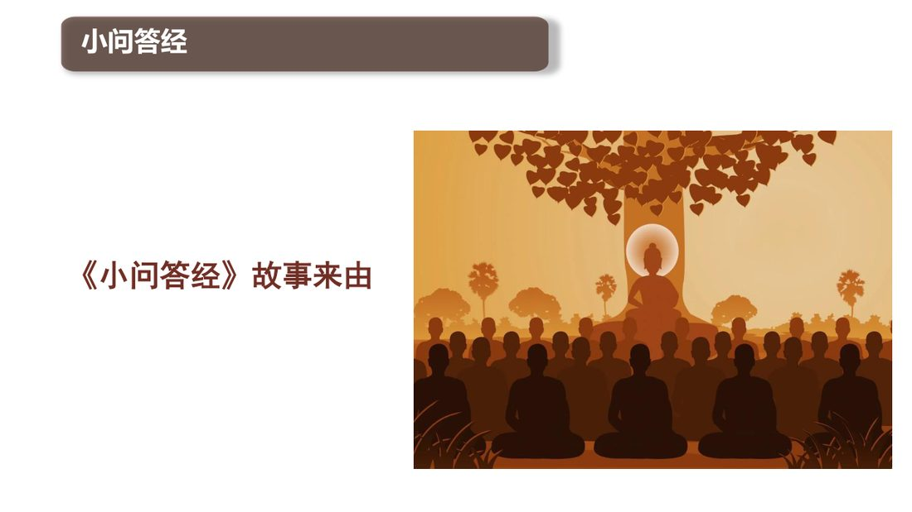
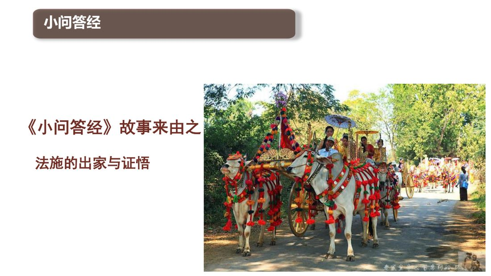
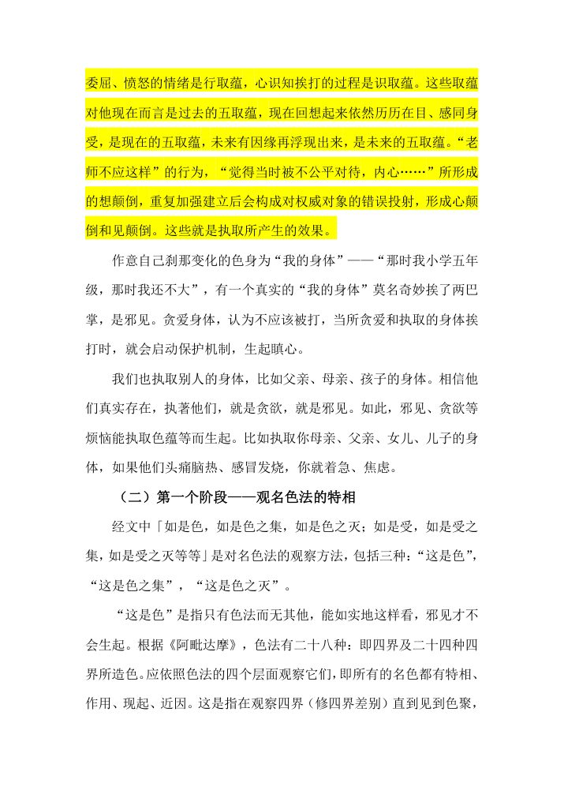
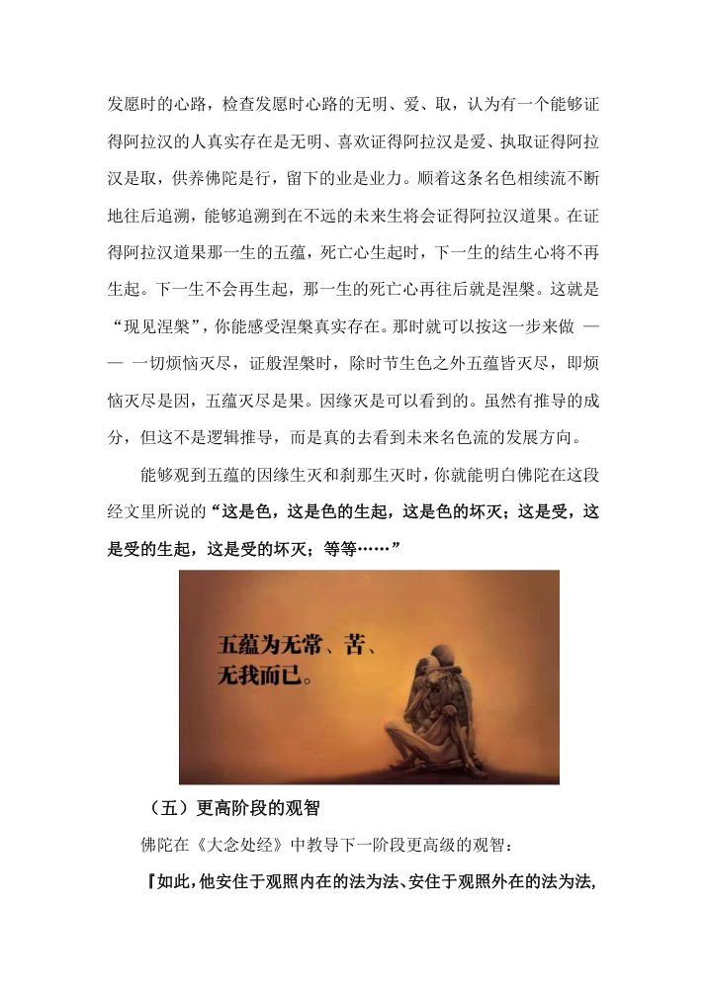

📅 最近更新：2026-09-29 13:20　|　第5版精修（朗读优化版）

# 第1周：经之缘起与萨迦耶执取（主持人版）

> ⭐ **本讲主持人速览**（新主持人必读，2分钟看完）
>
> 你不是老师，是"共学同行者"。你不需要提前懂内容，只需要按流程走。
> **本周由连续两周内容合并**而成，含两段共读、两轮分享与两轮讨论，单讲 120 分钟。
>
> | 环节 | 标准时长 | ⏱ 时间不够→ | ⏱ 时间富余→ |
> |:-----|:----:|:-----|:-----|
> | 🧘 静心开场 | 10 min | 缩至5 min | 加2分钟静坐 |
> | 📖 共读原文1 | 20 min | 只读★核心段（约15 min） | 加读◈扩展段 |
> | 💬 第一轮分享 | 10 min | 每人1句话 | 每人3分钟 |
> | 🎯 第一轮主题讨论 | 10 min | 只讨论问题① | 讨论全部问题+扩展 |
> | 🧘 禅修练习 | 15 min | 缩至8 min（只念引导词前半） | 延长至20 min |
> | 📖 共读原文2 | 20 min | 只读★核心段 | 加读◈扩展段 |
> | 💬 第二轮分享 | 10 min | 每人1句话 | 每人3分钟 |
> | 🎯 第二轮主题讨论 | 10 min | 只讨论问题① | 讨论全部问题+扩展 |
> | 🔚 收尾与回向 | 15 min | 缩至10 min | 保持 |
>
> **主持人10条守则（精简版）**：
> ① 不讲解、不提供答案——让原文自己说话；② 有人问"正确答案"→说"先听听大家的看法"；③ 冷场→主持人先分享自己的真实感受；④ 跑题→温和拉回："这个有意思，我们回到今天的原文"；⑤ 争论→"两种看法都很好，大家保留自己的理解"；⑥ 确保人人发言；⑦ 不评判任何人的分享；⑧ 时间到了就推进；⑨ 禅修练习照读引导词即可；⑩ 结束一起回向。

> **读书会23：小问答经讲记：萨迦耶见与圣八支道 · 第1周（4周版 · 连续两周合并）**
> 主持人：你不需要提前懂内容，按本手册推进即可。
> 本周主题：**认识《小问答经》的缘起与骨架——萨迦耶（有身／我见）即五取蕴（色、受、想、行、识），萨迦耶集即渴爱（欲爱、有爱、无有爱）。**；**看清执取的两股力量（业果流转的余势＋众生生存繁衍的本性），并以观照五取蕴为无常、苦、无我来松开执取。**。

---

## 📋 本周信息卡

| 项目 | 内容 |
|:----|:-----|
| 时长 | 120分钟（4周版 · 9环节） |
| 核心问题 | **佛陀为什么把「萨迦耶」直接等同于「五取蕴」？「取蕴」与「蕴」差在哪里、这个「取」是「谁」在取？让五蕴不断再生的「萨迦耶集」，为什么说是「渴爱」而不是别的？**；**执取是「谁」在取？它靠什么力量维持？毗钵舍那凭什么能松开它？** |
| 共读原文 | 共读原文1：材料①《小问答经讲记》01、材料②《小问答经讲记》02。　｜　共读原文2：材料①《小问答经讲记》03、材料②《190讲-摄集·摄菩提分·法念处·五取蕴&十二处1（共修版）》。 |
| 本周作业 | ①实践题：一周内做三次「五蕴点名」——每次只记一条：当下这一刻最强烈地被哪一蕴占住（色／受／想／行／识）？它背后是不是有一份「想要它继续／想要它消失」的渴爱？②实践题：一周内做三次「取蕴观察笔记」——每次只记一条：当时被取住的是哪一蕴，它靠什么维持（余势／生存本能／渴爱）。 |

## 🧘 静心开场（10 min）

主持人照读即可，句间留一个呼吸的空白（约 3 秒）。

> 请大家把身体安顿好，坐得让腰背自然挺起，双手轻轻放在腿上，可以微微闭上眼睛，也可以垂视前方一臂之处。先做三次深长的呼吸：吸——慢慢吸，感觉胸腔打开；呼——慢慢呼，感觉肩膀落下来。再一次。再一次。
>
> 现在，把注意力放到身体与坐垫、与地面接触的地方。感觉一下「坐着」这件事：臀部被托住的感觉，膝盖、小腿接触布料的感觉，手与手相接的温度。不用改变它，只要知道它在这里。这就是身体在当下给你的第一个消息。
>
> 接着，让注意力像一束手电筒的光，从头顶往下慢慢扫过：额头、眼睛周围、下颌、颈项、肩膀——肩膀如果绷着，就让它落下来一点点。胸口、腹部、背部、腰、髋、大腿、膝盖、小腿、脚。扫过的地方，只需要知道「这里有什么感觉」，不需要它变成什么样子。
>
> 我们来玩一个小游戏，为今晚的共读热身：在心里，把这具坐着的身体，分成五样。第一样，是**身体本身**——坐着的形状、温度、接触。第二样，是**感觉**——舒服或不舒服、腿麻或轻松。第三样，是**认知与标记**——心里在给这些感觉贴标签：「麻」、「重」、「暖」。第四样，是**念头与意图**——「想动一下」、「想快点结束」、「今天过得怎么样」。第五样，是**知道这一切的那个觉察**。请不要去找「我在哪里」，只要轻轻点一下这五样，各点一次，就够了。
>
> 现在，允许心里翻腾的那些事情都先放在门口：今天做过的事、还没做的事、明天要面对的人。不是压住它们，而是对它们说一句：「我知道你们在，我先安静十分钟。」如果有一件事特别急，记在心里，等共读结束后再处理它。
>
> 最后，我们做一段简短的慈心：愿我平安、愿我安住、愿我如实看见、愿我不被自己的念头所伤；愿在座每一位贤友平安、愿他们安住、愿他们如实看见、愿他们今晚都有所得；愿一切众生平安、安住、如实看见、不受自己执取的苦。
>
> 

**给自己的一句（主持人可在开场前默念，不必出声）**：今晚不要求任何人有任何体验，只求一件事——**我们比两小时前更认得「萨迦耶」这两个字指的是什么**。也请记得：这场读书会的安全边界由主持人守着；哪一位组员的心开始沉重，就请他先回到呼吸。

**主持人的语速与留白（本讲要点）**：今晚的主题是「五取蕴」，很容易滑向「我又执着了」的自我检查。因此开场这一节的节奏本身就是教学内容：语速放慢到平时的七成，每句话之间留一个呼吸的空隙；不要用「我们今天要学习…」这种赶路的语气，而用「我们今晚就坐着，看看这五样东西会怎么出现」。若场地嘈杂，可先把窗户或门轻轻带上，再开始。若有人迟到，不必停下重来，只在下一个段落开始前轻声补一句「刚到的贤友，跟着呼吸就好」。

**（时间富余时）**：加 3 分钟「触觉落脚」——请组员把注意力放在双手接触处，心里默念「触…触…」，每次察觉到心跑掉，就轻轻回来，五次为一轮。

**开场常见三种情况的处置（主持人备用）**：① **有人静不下来**（明显躁动、反复看手机）——不点名，只在身体扫描时轻轻说一句：「如果坐不住，可以把注意力放到脚底，感觉一下地板的支撑。」② **有人一坐下就红了眼眶**——不必询问，只在慈心段把「愿我平安」多念一遍，并在散会后私下问一句：「需要一起坐一会儿吗？」③ **有人在开场就急着问「萨迦耶到底是什么」**——回答一句：「好问题，你先带着它，二十分钟后我们读经文，你会有自己的答案。」把悬念留住，不提前泄题。三种处置的共同原则是：**不打断场、不聚焦个人、不给人贴标签**。

> 💬 **破冰｜3–5分钟**：说说看：如果有人问你「你」到底指什么，你会怎么答？

> 🛡️ **心理安全三约定**（每次开场在心里过一遍）：① **保密**——这里说的话不出这间屋子；② **不评判**——不评价任何人的分享，也不急着评价自己；③ **可随时暂停**——任何时候觉得不舒服，都可以停下来休息、喝水或离开，不需要解释。

## 📖 共读原文1（20 min）

**朗读总原则**：① 先读信息行，再读照录正文；② 遇到 `（整理注：…）` 一律跳过（那是给主持人看的）；③ 标「◈跳读」的段落时间不够时整段略过，不必有「没读完」的压力；④ 读到实修细目与后续周次内容（圣八支道、三蕴、想受灭定、三受、随眠）时不要停下来解释，只把它当作「地图上的一条路」，说一句「这些我们后面几周会细讲」；⑤ 全部读完后再回到「本周主线」一句话，让组员带着它进分享。

**30 分钟分配建议**：材料③约 5 分钟（前二问约 2 min＋经尾第467节约 1 min＋跳读说明约 1 min）；材料⑥约 4 分钟（《正见经》苦集＝渴爱、《蛇喻经》「此非我所」、《一切漏经》三结断三处）；材料④约 6 分钟（边经／有身经／须陀洹经／断欲经略读约 3 min，满月经接龙约 3 min）；材料⑤约 9 分钟（缘起故事约 6 min，四相注释约 3 min）；材料①②各约 3 分钟。若时间紧，「泡沫聚喻经、集经、第二集谛经」与《蚁垣经》《大象迹喻经》可只念经题与一句偈。

**📖 本周共读导读（主持人了解即可，不用念）**：今晚六段材料是「同一件事的六个侧面」。**材料①（讲01课件）是经题与第一问答**——「萨迦耶」就是五取蕴，「萨迦耶集」就是渴爱；**材料②（讲02课件）**把巴利语 `sakkāya`（萨迦耶／有身）与苦谛挂钩：五取蕴即苦，故「探问萨迦耶」就是探问苦。**材料③（《小问答经》经文原文）是正本**——本周只取它的**前二问**：有身见＝五取蕴、有身集＝渴爱，以及**经尾第467节**（世尊印证法施比库尼「智慧深远」）。中段（有身灭、道迹、执取与五取蕴、有身见如何生起／不生起、圣八支道·三蕴·定·三行·想受灭定·三受·随眠）已按「主题归属·段落级去重」整段移除——那些段落分别是第3–8周的正文，本周只在读到时念一句「这些我们后面几周会细讲」。**材料④（《蕴品》选经）是经证**——佛陀在《边品》里把「有身见边、有身集边、有身灭边、有身灭道边」与「苦、苦集、苦灭、苦灭道」并置，又在《满月经》里以问答把「五取蕴以欲求为根本」「取著非五取蕴亦不离五取蕴」逐句钉死；《泡沫聚喻经》则用五个比喻（色如沫、受如水泡、想如阳焰、行如芭蕉、识如幻）把五蕴的「无实」讲活。**材料⑥（同文件其它经文）是补足**——以《大念处经》《大象迹喻经》「简言之，五取蕴是苦」、《蚁垣经》五取蕴的异名「龟」、《正见经》「苦集＝渴爱／四食以渴爱为集／六种渴爱身」、《蛇喻经》「此非我所、此非我」、《一切漏经》「三结断——身见、疑、戒禁取」，把材料③被移除的那半部经用**同一本书的其它经**补回来，本周的照录量因此仍足。**材料⑤（《根本五十篇义注》）是人物与注脚**——它补全了材料①②标题页缺字的缘起故事：毗舍佉原是法施的丈夫，证阿那含后行为大变；法施请求出家、乘金轿剃度、卖发供佛发愿、终证阿罗汉；注释还给出「有身见如何生起」的四相（色即是我／我具有色／色在我中／我在色中），正是 W4「二十种萨迦耶见」的雏形。**这一段的语气要放轻**：故事是今晚最柔软的部分，别读成考据。

**朗读分工建议**：材料①、②由一人读（篇幅短、密度高）；材料③只读「有身见」一问答、「有身集」一问答与经尾第467节（中间跳读处按文内〔◈主题归属·段落级去重〕一句带过）；材料⑥请另一人接读《正见经》「苦集＝渴爱」与《蛇喻经》「此非我所、此非我」两段，让经文在几个人口中接力；材料④的《满月经》也请接龙（问题一句、回答一句），让问答的节奏出来；材料⑤由主持人自己读（便于随时跳过 462–466 节的后续周次内容）。读经不是考试——读到译名混用（毗舍佉／维萨卡；比丘尼／比库尼）时不必纠正，重要的是那两句话能落到今晚每个人心里。

**共读节奏的三个提醒**：① **别把「名相」读成负担**——萨迦耶、五取蕴、渴爱，今晚只要各有一个具体画面即可，不必背定义；组员若抄笔记抄到跟不上朗读，请告诉他「笔记可以散会后抄信息行，经文听过去就好」。② **别在经文里找「我」**——读到「无闻凡夫将色视为自我」时，提醒自己这是**描述**，不是**指责**；每个人都在这句话里，包括主持人。千万不要读成「你看，凡夫才这样」。③ **留一处「不懂」**——《满月经》里「取著既非五取蕴本身，亦非五取蕴之外」这一句，允许自己今晚不懂，把它带回家，下周我们会回来。共读不是逐字通关，是让这两句话在心里留下一个**能被反复摸到的形状**。

**本周共读的三个层次（主持人自用，帮自己把住节奏）**：第**一**层是**正名**——萨迦耶＝五取蕴、萨迦耶集＝渴爱，只此两句，材料①②③反复说同一个意思，不要嫌重复，重复正是让名词落地的方式。第**二**层是**关系**——取与取蕴「非一非异」（材料③第五问、材料④《满月经》），这是本周的思维难点，读到即可、不强求当下贯通。第**三**层是**人物**——毗舍佉与法施这对在家／出家的旧日夫妻（材料⑤），让抽象的名相落回活人身上，也让「女性证果」「在家证果」这两点自然浮现、不必说教。三层里，第二层允许「不懂」，第三层尽量「读全」，第一层务必「读清」。

**材料之间的转折语（主持人可照读，帮助组员跟得上）**：读完材料①后说「这两个词先站在这里——五取蕴、渴爱」；读完材料②后说「`sakkāya` 字面就是『有身』，探问萨迦耶，就是探问苦」；读完材料③后说「取，是一个动作，而动作可以被看见」；读完材料④后说「佛陀用『边』『苦』『取』『满月问答』说了同一件事」；读完材料⑤后说「这场问答，是两个人真实活过的，不是纸上的字」。每一句都短，只做「过桥」，不解释。

### 原文材料①：★核心·《小问答经讲记》01-古源尊者-20251101（课件）

- **文件**：《小问答经讲记》01-古源尊者-20251101（课件）

> ⚠️ 主持人操作：本件为「经文问答」精简型课件（约 900 字符，含大量重复标题页），30 分钟只精读两处问答（**萨迦耶＝五取蕴／萨迦耶集＝渴爱**）。「故事来由」「毗舍佉成就不还后的特异行为」等标题页在原课件中为图版、正文无字，本周只念标题并一句话带过（其故事由材料⑤补足）。读到巴利回向偈时，可只念汉译四句；读完停三秒，说一句：「请大家记住两个词：**五取蕴、渴爱**。今晚后面的材料都在解释它们。」

小问答经讲记

古源(Uttama)尊者讲述

2025年11日

礼敬佛陀

Namo tassa bhagavato arahato
sammā-sambuddhassa (x3)

礼敬那位世尊、阿拉汉、正自觉者

小问答经

问：毗舍佉近事男对法施比库尼这么 说：，尊姊！所谓'萨迦耶，萨迦耶'，尊姊！什么被薄伽梵说为萨迦耶呢？'

答：毗舍佉贤友！这些五取蕴被薄伽梵说是萨迦耶，即：色取蕴、受取蕴、想取蕴、行取蕴、识取蕴，这些五取蕴被薄伽梵说为萨迦耶。'

问：什么被薄伽梵说为萨迦耶集呢？'

答：毗舍佉贤友！这导致再生、伴随喜欣与爱染、彼彼超异喜欣的渴爱，即：对欲的渴爱、对存在的渴爱、对无存在的渴爱，毗舍佉贤友！这被薄伽梵说为萨迦耶集……

小问答经

《小问答经》

《中部·根本五十篇》

提问的是大富长者毗舍佉，

回答者是阿拉罕比库尼法施。

小问答经

《小问答经》故事来由

小问答答经

《小问答经》故事来由之

《中部·根本五十篇》

提问的是大富长者毗舍佉，

回答者是阿拉罕比库尼法施。

小问答经

《小问答经》故事来由

小问答答经

《小问答经》故事来由之

毗舍佉成就不还后的特异行为

Idam me puñnam asavakkhayavaham hotu.

Idam me puñnam nibbānassa paccayo hotu.

Mama puñña-bhāgam sabba-sattānam bhājemi.

Te sabbe me sama pūña-bhāga m labhantu.

愿我此功德 导向诸漏尽

愿我此功德 为证涅盘缘

我此功德分 回向诸有情

愿彼等一切 同得功德分

Sādhu! Sādhu! Sādhu!

> ⚠️ 主持人操作（续）：读完材料①后停三秒，说一句：「所谓萨迦耶，不是『我的身体』这么简单，而是**被执取染污的五蕴**本身。」再进入材料②。

### 原文材料②：★核心·《小问答经讲记》02-古源尊者-20251102（课件）

- **文件**：《小问答经讲记》02-古源尊者-20251102（课件）

> ⚠️ 主持人操作：本件为「经文问答」精简型课件（约 700 字符，含重复回向偈）。「法施的出家与证悟」标题页正文为图版、无字，其故事由材料⑤补足；本周只精读「探问称为萨迦耶的苦谛」一问，并点出巴利语 `sakkāya`（萨迦耶／有身）。回向偈可只念汉译四句。

小问答经讲记

古源(Uttama)尊者讲述

2025年11日

礼敬佛陀

Namo tassa bhagavato arahato
sammā-sambuddhassa (x3)

礼敬那位世尊、阿拉汉、正自觉者

小问答经

《小问答经》故事来由之

法施的出家与证悟

小问答经----探问称为萨迦耶的苦谛

巴利语 sakkāya

探问称为萨迦耶的苦谛

问：什么被薄伽梵说为萨迦耶呢？

答：毗舍佉贤友！这些五取蕴被薄伽梵说是萨迦耶，即：色取蕴、受取蕴、想取蕴、行取蕴、识取蕴，这些五取蕴被薄伽梵说为萨迦耶。

## 💬 第一轮分享（10 min）

**分享规则**：① 自愿，不点名；② 每人一次、一次 60–75 秒，只用「我」开头，不评论他人；③ 第一轮**只被听见，不被点评**——主持人只做「接住」（点头、复述关键词），不回应、不追问、不给建议；④ 手机可留下便签，把想到的一句写下来；⑤ 有人不想说，可以说「我今晚只听」，这完全允许。

**起手问题（任选其一，每人挑一个）**：
1. 今晚第一次听清的一个词是什么？它在你心里变成一个什么画面？（比如「五取蕴」＝「被抓住的五样东西」）
2. 你有没有过「知道一个道理很多年，今晚忽然懂了一点点」的时刻？今晚有没有哪个句子让你有这种感觉？
3. 材料⑤那个故事里（丈夫回家变了样、妻子问「这法女子能不能得」），哪一幕让你心里动了一下？

**（时间富余时加一轮）**：每人补一句「今晚有一处我还没读懂——是……」，把疑问留到主题讨论。

**主持人在第一轮的姿态（重要）**：第一轮的功课是「听」，不是「教」。组员讲完，你可以做的只有三件事——点头、把他话里的关键词轻轻重复一次（「你说到『松不下来』」）、然后看向下一位。**不要**接话评论、不要接经文、不要纠正措辞、不要顺手把他的话变成一句法义总结。若有人一开口就讲了很久，可在 90 秒左右温和地插一句：「谢谢你，我们先听听下一位，你这条线我们留在讨论里。」若有人说了很私密的家庭细节，第一轮不追问，只在结尾轻带一句「谢谢你的信任，我们守住这间屋子里的安全感」。第一轮结束后，可以一句话收束：「谢谢大家，我听到三个关键词——……，我们在讨论里回来碰它们。」**为什么第一轮要这么克制**：因为今晚第一次谈「取」，很多人会带着一点自我检查的心来；一个被接住、不被点评的分享，本身就是「不对『我』再抓一把」的示范。

---

## 🎯 第一轮主题讨论（10 min）

**讨论规则**：每问先静默 30 秒再开口；发言不超过 2 分钟；三问由浅入深，指向实修，不指向辩论。主持人只在需要时用「提示」把话拉回经文。

### 问题①：佛陀把「萨迦耶（有身）」直接等同于「五取蕴」。如果萨迦耶不是「我的身体」这么简单的一团肉，而是**被执取染污的色、受、想、行、识**——那么，请指出一件**今晚此刻**正发生在你身上的「有身」：是哪一蕴被你喜欢着、或厌着、或抓着？那一刻，它长什么样？

**提示**：不要去找抽象的「我」；去找一个具体的瞬间。比如：肩膀的酸痛是「色取蕴」，心里那句「今天累坏了」是「想取蕴」，想让别人认可你的那个冲动是「行取蕴」。重点是让大家看到——「有身」不是一句哲学，而是一刻一刻在发生的五样东西。

### 问题②：材料③明说：「执取并非就是五种执取蕴，也不是五取蕴之外的东西；对五取蕴的贪欲与渴爱，那就是执取。」请判断：**「取」和「取蕴」，究竟差在哪里？** 你说「这是我的身体」时，那个「取」的动作，是发生在身体的哪个地方？

**提示**：这一问最易跑向名言戏论，请随时拉回。可用一个比喻：《满月经》说「取著非五取蕴亦不离五取蕴」——就像「握」这个动作：手不是「握」，但离开手也没有「握」；「握」在手里发生，却又不等于手。取也一样：取不在五取蕴之外，却也不等于五取蕴本身，它是对五取蕴的一份「要它留住／要它消失」。今晚不必解决这层，只需让每个人承认：「取」是一个**动作**，而动作是可以被看见的。

### 问题③：材料②把萨迦耶与苦谛接上：五取蕴即苦。而收集起这五取蕴、让它继续再生的，材料①③说是**渴爱**（欲爱／有爱／无有爱）——不是「身体」本身。请谈谈：如果「集」不是「我有个身体」而是「我一直在要」——**你这一周里，最常出现的「要」，是哪一种（要更多、要一直是、要什么都没有）？** 看见它，和压抑它，有什么不同？

**提示**：三爱可以这样落地——「欲爱」是想要更多更好的感官体验；「有爱」是希望某一种状态、某一种「我」一直持续（含常见）；「无有爱」是想让不舒服的一切消失、或想让某些东西干脆不存在（含断见）。请务必区分「看见渴爱」与「压抑渴爱」：看见是**知道它在这里**，压抑是把感受推开、变成另一种紧。主持人可用一句收束：「我们今晚不是在消灭『要』，而是第一次看清楚它在要什么。」

**讨论收束（约 3 分钟，主持人照读）**：今晚三问，其实是一问的三层——**有身是五取蕴，取是对五取蕴的贪渴，集是让五取蕴再生的渴爱。** 如果要带走一句话，就带这一句：**「不是先有一个『我』在抓五蕴，而是『抓』这个动作，本身就在制造『我』。」** 这一层，今晚不必全懂；下周我们会看它怎么生起、怎么松开。若要加一句安慰，就说：「**你们今晚已经做到最难的一步——把『我』这个词，轻轻放下了一会儿。**」

**若讨论跑偏的三种常见情形与话术（主持人备用）**：① 跑向**三世因果／神通**时——「这些当然重要，但今晚我们只站在『这一刻的五样东西』上；因果我们下周第3周会碰到。」② 跑向**评判他人**（「某某就是执着」）时——「我们把镜头转回自己这边：**你看到他那样时，你心里起了什么？**」③ 跑向**自贬**（「我完了，我全是取蕴」）时——「五取蕴不是罪名，是**观察的对象**；能把它看成『五样』而不是『我』，已经是今晚最大的收获。」三种都以「回到今晚这一念」收束，不展开、不辩论。

> **分层追问**（可视时间取用，由浅入深）：
> - 【现象】「我」到底是什么——身体、感受、想法，还是它们的组合？
> - 【影响】把五取蕴当成「我」，会带来哪些麻烦？
> - 【应对】这周你愿意先认出，被自己当成「我」的，是哪一部分？

---

## 🧘 禅修练习（15 min）

### 练习一

> ⚠️ **禅修禁忌提示**：若你正处在严重抑郁、焦虑、创伤后应激，或精神类疾病的发作／用药期，或正经历强烈的情绪危机，请先咨询医生或心理师，再决定是否练习；练习中若出现明显不适（如心悸、胸闷、情绪失控），请立即停止，睁开眼睛，把注意力放回呼吸与身体，必要时离场休息。

主持人照读即可，语速放慢，句间留白。

> 请大家坐好，轻轻闭上眼睛，回到呼吸。做三次自然的深呼吸。不需要特别的方式，只要知道「吸进来了」「呼出去了」。现在，我们来做今晚的练习：**五蕴点名**。
>
> 第一步，**色**。把注意力放到身体：坐着的形状、温度、接触、呼吸的起伏。心里轻轻说一句：「这是色。」知道这是身体，就够了。
>
> 第二步，**受**。现在，身体里、心里，有一种「感觉基调」——舒服、不舒服、或者中性的。不评判它，只是知道它。轻轻说一句：「这是受。」
>
> 第三步，**想**。注意心里正在给这些感觉贴的标签：「麻」、「重」、「暖」、「安静」。知道「这是想——这是认知与标记」。
>
> 第四步，**行**。注意有没有一点点冲动：想动一下、想再深一点、想看时间、想评价自己「做得对不对」。轻轻说一句：「这是行——这是意志与造作。」
>
> 第五步，**识**。最后，注意那个「知道这一切」的觉察本身。它像一面镜子，五样东西来了又去，它只是知道。轻轻说一句：「这是识。」
>
> 现在，不点任何一样，只是让这五样东西**自己出现、自己消失**，你在旁边看着。如果心跟着某一蕴跑了——比如跟着一个念头走远了——不责备，只轻轻回来，回到呼吸，再点一次名：「色、受、想、行、识。」如此，反复几次。
>
> 五分钟到了。请大家慢慢动一动手，睁开眼，回到这个房间。
>
> 

**练习后的三句话（主持人照读）**：①「刚才那五样，你有哪一样特别难分开？」②「刚才你发现自己的『取』，是想要它留住，还是想要它消失？」③「这不是一次『成功』或『失败』的练习——**看见，就已经在修毗钵舍那**。」

**（时间富余时）**：加 5 分钟「呼吸与五蕴」随观——每一次呼吸，同时点一次「色（身体）—受（感觉）—识（知道）」，再静默 2 分钟。

**练习中主持人的姿态（重要）**：练习时你自己的声音也要慢下来，不要抢在组员前面把「色、受、想、行、识」五样报完；给每一蕴留一个呼吸的留白，让组员自己数出来。若听到有人呼吸变重、或明显不安，不必点名，只在练习结束时补一句：「如果在某一步觉得紧了，随时可以把眼睛睁开、回到呼吸。」**练习的目标是「看见」，不是「入定」**——有人睡着了、有人什么都没感觉到、有人一直在想事情，都属正常，不点评、不比较、不追问「你看到了什么」。散会前若有人问「我今晚什么都没观到，是不是白坐了」，请回答：「**能如实知道『我什么都没观到』，这份如实，就是今晚的功课。**」

---

### 练习二

> ⚠️ **禅修禁忌提示**：若你正处在严重抑郁、焦虑、创伤后应激，或精神类疾病的发作／用药期，或正经历强烈的情绪危机，请先咨询医生或心理师，再决定是否练习；练习中若出现明显不适（如心悸、胸闷、情绪失控），请立即停止，睁开眼睛，把注意力放回呼吸与身体，必要时离场休息。

主持人照读。语速放慢，句间停 3–5 秒。全程不提「证得」「境界」「体验」，只提「知道」。

> 请大家坐好，闭上眼睛或垂视前方。先做三次自然呼吸。现在，我们做今晚的三个步骤，一步一步来，哪一步做不到就停在那一步，没有关系。
>
> **第一步：名色（只是这样）**。把注意力放在呼吸上，感觉气息进出鼻孔、胸部起伏。现在，请在心里轻轻地标记两次：第一次「这是身体在呼吸」——只知道这是身体在呼吸，不把它认作「我在呼吸」；第二次「这是知道在知道」——只知道有一个「知道」在发生。如果「我」字又冒出来，不需要赶走它，只轻轻回到「身体…知道…」。
>
> **第二步：受（只是感觉）**。把注意力从呼吸移到身体上比较明显的感觉——酸、紧、热、痒、或者舒服的轻松感。请在心里说：「这是一个感觉。」再说一次：「它正在变化。」如果这个感觉不太舒服，请留意心的下一个动作：有没有一丝「它不该这样」？如果有，就说「这是取」。不去推开它，也不去追它，只标记，然后回到呼吸。
>
> **第三步：标记与放下**。现在，让心安静下来，只做一件事：每次有一个念头、一段回忆、一个人影出现，就在心里给它一个字——「想」「回忆」「担心」「计划」，或者干脆一句「来了」。标记完，不用跟着它走；也不必压它，让它自己散。如果它不散，就说一句：「知道了，先这样。」然后回到呼吸。请这样坐三分钟（静默约 3 分钟）。
>
> 最后，我们把这份「知道」带回身体：感觉坐垫、感觉手掌、感觉呼吸。在心里说三句话——**「取蕴是如实观察的对象，不是自我攻击的理由。」「我只要知道，不必马上改变。」「这份练习我带走，它不属于今晚的坐垫。」** 
> （静默 30 秒）请大家慢慢睁开眼睛。现在看一下自己的心：它是不是比刚开始时松一点？如果没松，也没关系——**练习是在种因，不是在考结果**。今天只要有一次「知道了」，就已经是这次练习的成就。

**（时间不够时）**：只做第一步与第三步，各 3 分钟。**（时间富余时）**：加「无常的呼吸」随观 5 分钟——每次呼气末尾，心里说一句「这次呼吸过去了」，共二十次，再静默 2 分钟。
**练习结束后的 2 分钟（不要省）**：请全体保持静默两分钟，不急着说话、不急着交换心得。主持人可以在这两分钟里自己观察三件事：① 会场是否比练习前安静；② 有没有人还在闭眼不愿睁眼（通常说明他还有情绪在流动，散会后可轻声问候一句）；③ 自己心里是松的还是紧的。两分钟到，用一句「我们慢慢回到这里」收束，再进入下一环节。这一步看似空，其实是让练习「落地」的关键：**体验若不经沉淀，很容易变成分享时的表演**。

## 📖 共读原文2（20 min）

**朗读总原则**：① 先读信息行，再读照录正文；② 遇到 `（整理注：…）` 一律跳过（那是给主持人看的）；③ 标「◈跳读」的段落时间不够时整段略过，不必有「没读完」的压力；④ 读到实修细目（色聚、名法数量、心路次第）时不要停下来解释，只把它当作「地图上的一条小路」；⑤ 全部读完后再回到「本周主线」一句话，让组员带着它进分享。

**30 分钟分配建议**：材料①约 5 分钟（只读前四节，余段已按去重整段移除）；材料②约 4 分钟（只接读彼讲未用段落）；材料③约 7 分钟（接龙）；材料④约 4 分钟（选读三处）；**材料⑤约 5 分钟**（《大月圆经》问答段＋生命的根＋贪增长）；**材料⑥约 4 分钟**（四取、四取因缘、渴爱生起则执取生起）；
**📖 本周共读导读（主持人了解即可，不用念）**：今晚六段材料是「同一件事的六个层次」。**材料⑤（027讲无贪2）与材料⑥（根本五十篇·四取）是 v2.0 段落级去重后的补足**——材料⑤把「两股力量」讲到底层（五取蕴扎根于爱着、生命的根是无明爱取行业、贪以二十四缘从粗相到细相增长、味患离），材料⑥给出「四取」及其因缘的经文原证（欲取、见取、戒禁取、我语取；此四取以渴爱为因，行以无明为因）。**材料①（讲03课件）是总纲**——把「萨迦耶＝五取蕴」「执取如何生起（渴望和邪见俱行）」「两股力量推动执取（业果流转的余势／生存与繁衍的本性）」「毗钵舍那如何去除执取（观照五取蕴无常苦无我）」这几句钉在心里，全晚的骨架就在这几句里。**材料②（190讲）是修法地图**——把「观照五取蕴」摊开成四步：先看见「这是色」（特相、作用、现起、近因），再看见它的生起（无明、爱、取、行、业五个过去因如何执取并引生果报，这就是本周所说的「取」的机制），再看见它的灭去（因缘灭与刹那灭），最后进入观智成熟（生灭随观→坏灭随观→行舍智）。**这一段的语气要放轻**：它描绘的是禅修者长期要走的路，不是今晚的任务清单。**材料③（执取流转经）是经证**——佛陀自述「未如实遍知此五取蕴四转之前，不得证无上正等正觉」，并把「色由食集、受想行由触集、识由名色集」逐蕴说清，终点是「厌离、离欲、灭尽、不取著而解脱」。读它时让经文自己说话，读慢一点。**材料④（复注）是注脚**——补上四取（欲取、见取、戒禁取、我语取）怎样「前前执取后后」而坚固、取蕴「通过所缘等条件而被执取」、以及「此苦即指五取蕴苦圣谛」与「无常、苦、无我」三相如何安立。它文字最艰涩，宁可少读，不要读成考据。

**朗读分工建议**：材料①由一人完整读（篇幅短、密度高）；材料②的（二）（三）两节由一人读，（四）（五）两节换人读（换气、换角度）；材料③请全组**接龙**——「色」段一人读，「受、想、行、识」各一人，让经文在几个人口中接力；材料④由主持人自己读（便于随时跳过）。读到任何一段实修细目（色聚、名法数目、心路次第）时，不要停下来问「懂不懂」，只把它当作地图上的一条小路，说一句「这条路以后有人带你走」。轮读时若有人读错、读漏，笑着说「重来」即可——**读经不是考试**，重要的是那句「不取著而解脱」能落到今晚每个人心里。

### 原文材料①：★核心·《小问答经讲记》03-古源尊者-20251103（课件）

- **文件**：《小问答经讲记》03-古源尊者-20251103（课件）

> ⚠️ 主持人操作（v2.0）：本件只精读前四节（**萨迦耶＝五取蕴／执取如何生起与两股力量／毗钵舍那如何去除执取／法随观五取蕴**）。原件的「法随观·六种内外处」段（与读书会01第6周重合）、「探问灭谛·萨迦耶灭＋十二支逆观」段与「法随观·苦灭圣谛」段（归第3周）已按段落级去重整段移除，文内以整理注标明；主持人读到整理注处跳过，只念节题并说一句「这部分第3周会细讲」。读到巴利回向偈时，可只念汉译四句。

小问答经讲记

古源(Uttama)尊者讲述

2025年11日

礼敬佛陀

Namo tassa bhagavato arahato
sammā-sambuddhassa (x3)

礼敬那位世尊、阿拉汉、正自觉者

小问答经---世尊所说之萨迦耶

《相应部·蕴篇·第二十二蕴相应·边品·有身经》中，世尊教导：复次，比库们！什么是萨迦耶？应该回答：'五取蕴。'哪五个呢？即：色取蕴、受取蕴、想取蕴、行取蕴、识取蕴，比库们！这被称为萨迦耶。

小问答经---执取如何生起，渴望和邪见俱行

两股力量推动执取：

1、《清净道论》：六处缘触、触缘受是带有渴望和邪见之业以果报的状态而被执取后，不断地轮回流转。六种心理余势。

2、众生的本性是生存和物种繁衍，以此为目的，以感受体验世界，以想蕴标识认知世界，以意志（带有渴望和邪见之业）采取行动。

小问答经——毗钵舍那如何去除执取

观照五取蕴为无常苦无我：

1、日常的觉照——概念层面的四念处

2、观智——名色分别智；从触知智对11种究竟名色法直至道果的随观

大念处经

法随观 五取蕴

再者，诸比库，比库对五取蕴而于法随观法而住。诸比库，比库又如何对五取蕴而于法随观法而住呢？诸比库，在此，比库[了知]：'如是色，如是色之集，如是色之灭；如是受，如是受之集，如是受之灭；如是想，如是想之集，如是想之灭；如是行，如是行之集，如是行之灭；如是识，如是识之集，如是识之灭。'

> （整理注：《大念处经》「法随观·六种内外处」一段与读书会01第6周共读段落重复，依本系列段落级去重规则，第2周不再照录；主持人读到此只念节题「大念处经·法随观十二处」并一句话带过。）

小问答经——探问集谛

《小问答经》探问集谛

问：什么被薄伽梵说为萨迦耶集呢？

答：毗舍佉贤友！这导致再生、伴随喜欢与爱染、彼彼超异喜欢的渴爱，即：对欲的渴爱、对存在的渴爱、对无存在的渴爱，毗舍佉贤友！这被薄伽梵说为萨迦耶集。

渴爱有三种：

1. kāmataṇhā [欲爱]对感官欲乐的渴爱；

2. bhavataṇhā [有爱] 伴随着常见而对存在的渴爱；

3. vibhavataṇhā [无有爱]伴随着断见而对无存在的渴爱。

一、大念处经讲记

法随观四圣谛

"诸比库，何谓苦集圣谛？

造成投生的是爱欲，它伴随着喜与贪同时生起，四处追求爱乐，也就是：欲爱、有爱、非有爱。""诸比库，爱欲在哪里生起，在哪里建立呢？

在世间有可爱与可喜之物的任何地方，爱欲就在那里生起，在那里建立。

> （整理注：「探问灭谛·萨迦耶灭」与「依于无明、渴爱生」十二支逆观一段归第3周主题，依本系列段落级去重规则，第2周不再照录；主持人只念节题并说一句「这部分第3周会细讲」。）

> （整理注：《大念处经》「法随观·苦灭圣谛」一段与读书会01第6周及本系列第3周共读段落重复，依本系列段落级去重规则，第2周不再照录。）

Idam me puñnam asavakkhayavaham hotu.

Idam me puñnam nibbānassa paccayo hotu.

Mama puñña-bhāgam sabba-sattānam bhājemi.

Te sabbe me sama pūña-bhāga m labhantu.

愿我此功德 导向诸漏尽

愿我此功德 为证涅盘缘

我此功德分 回向诸有情

愿彼等一切 同得功德分

Sādhu! Sādhu! Sādhu!

> ⚠️ 主持人操作：读完材料①后停三秒，说一句「请大家记住两个词：**渴望、邪见**。今晚后面的材料都在解释它们怎么运作。」再进入材料②。

### 原文材料②：★五取蕴观照机制·190讲-摄集-摄菩提分-法念处-五取蕴&十二处1-古源尊者-20220120（共修版）

- **文件**：《190讲-摄集-摄菩提分-法念处-五取蕴&十二处1-古源尊者-20220120（共修版）》

（二）第一个阶段——观名色法的特相〉〈（三）第二个阶段——因缘生及刹那生〉〈（四）第三个阶段——因缘灭及刹那灭〉〈（五）更高阶段的观智〉，彼讲取〈（一）何谓五取蕴〉与〈二、十二处〉为主干；本讲所取四节彼讲列为◈扩展选读，未入其核心共读）**。

> ⚠️ 主持人操作（v2.0）：本件与读书会07第7周重合之段落已**整段移除**（共 24 段），只留彼讲未用段落；本周主干改由材料①③⑤⑥承担。若时间富余，可接读保留段（如〈（二）观名色法的特相〉「色法四个层面：特相、作用、现起、近因」一段）。第（一）节「何谓五取蕴」与〈二、十二处〉是彼讲共读正文，本周只作背景、不读。朗读时遇整理注即跳过。读完说一句：「这条路的尽头不是『什么都没有』，而是**清楚地看到五蕴无常、苦、无我**。」

（二）第一个阶段——观名色法的特相

"这是色"是指只有色法而无其他，能如实地这样看，邪见才不会生起。根据《阿毗达摩》，色法有二十八种：即四界及二十四种四界所造色。应依照色法的四个层面观察它们，即所有的名色都有特相、作用、现起、近因。这是指在观察四界（修四界差别）直到见到色聚，

对于每一个色聚还应进一步分析色聚里的色法。如何分析呢？举地界为例，它的特相是硬，根据《法集论》，除了硬之外，地界还有其他特相，即粗、重、软、滑、轻；它的作用是作为同一粒色聚其他色法的立足处。在一个很微小的刹那生灭的色聚里，可以观察它的硬或者软，观察到硬就是硬的特相，不会同时观察到软的特相。

这是色的生起，是受的生起。

（三）第二个阶段——因缘生及刹那生

佛陀说：「这是色的生起，这是受的生起，这是想的生起，这是行的生起，这是识的生起。」，这是第二个阶段。你应先认得什么是色、受、想、行、识；然后观察是如何生起的。"生起"分为两类：一类因缘生，一类刹那生。根据《无碍解道》，导致色法生起的因有五个，即无明、爱、业、段食及成相。成相（nibattilakkhana），就是刹那生。无明、爱、业及段食是色法因缘生之因。

## 💬 第二轮分享（10 min）

**分享规则（开场先念一遍，约 1 分钟）**：① 每人一次，时间约 1 分半，先说的不客气，后说的不着急；② 只讲自己的经验与疑问，**不评论、不纠正、不比较**别人的发言；③ 不想说的人可以只听到最后一句「我跟」，沉默也是参与；④ 主持人不点评内容，只在每人说完后回应一句「谢谢，我听到了」。

**起手问题（任选，或按顺序三个都问；每人只答其中一题即可）**

1. **「今晚的材料里，哪一句让你停了一下？」**——请说出那句原话，再说说为什么停在那里。（这是最安全的入口：不要求谈自己，只要求指认文字。）
2. **「两股力量——业果流转的余势、生存繁衍的本性——你身上哪一股最明显？」**——可以从一件小事说起：一次莫名的紧绷、一次非买不可、一次必须被认可、一次忍不住想解释自己。请只描述**发生了什么**，不必分析为什么会这样。
3. **「你有没有过这样的时刻：明明知道不该执着，手却已经先伸出去了？」**——留意那句话里的顺序：先有行动，后有知道。这就是今晚要看的「取」——它常常比「我」先到。

**主持人提示（自己看，不必念）**

- 第一轮**不要变成讨论**。有人把话题抛向他人时，用手势或一句「这个我们放到主题讨论」接住。
- 若场面沉默，主持人可以先示范一句短的：「我先说一句，材料①里『六处缘触、触缘受…不断地轮回流转』这句让我想到自己每天无意识的刷手机。」示范要短、要平，不要变成主讲。
- 若有人情绪上来（哽咽、激动），先请他慢慢呼吸，问一句「要不要先停一下，喝口水？」不追问细节、不解读。
- 若有人用「我已经放下了」来结束发言，可以轻轻追问一句：「那件事再被提起时，身体有什么反应？」——不是要拆穿他，而是把「放下」从结论拉回到可观察的现象。这也是本周的功课：**用可观察的句子代替结论式的句子**。

## 🎯 第二轮主题讨论（10 min）

**讨论氛围三句提醒（主持人自己记住）**：① 讨论不是比赛谁更懂——**谁说得更像自己的日子，谁就更接近今晚的主题**；② 若有人开始用「你不妨……」回应他人，请温柔拦下：「我们只谈自己看到的那一格。」；③ 若全场都在谈别人的执取（家人、同事、社会），说明心在往外跑，请把问题拉回「那你自己的那一念是什么？」。今晚讨论成功的标准不是得出正确答案，而是散会时每个人心里有一句可用的、属于自己的话。

### 问题①：材料①说执取由「渴望和邪见俱行」推动。请从今晚的两股力量（业果流转的余势／生存与繁衍的本性）里，指出一件**在你自己身上正在发生**的小事——那个「取」的动作，长什么样？

**提示（主持人可抛给组员）**：

- 古源尊者的两个比喻很好用：**「六处缘触、触缘受…以果报的状态而被执取」**——这是过去的习惯留下的余势，像水管的旧水渍，水一过就显出来；**「以感受体验世界，以想蕴标识认知世界，以意志采取行动」**——这是生存本能，也就是我们为什么天然地想「要一点什么」。
- 请特别区分两件事：**感受**（舒服／不舒服／中性的感觉）与**取**（对它的抓握）：不舒服的感觉生起，这是受蕴的事；紧跟一句「它不该这样」，这是取在动作。多数人误以为自己在对付感受，其实是在和取搏斗。
- **经文对照（可念给组员）**：材料①说「六处缘触、触缘受是带有渴望和邪见之业以果报的状态而被执取后，不断地轮回流转」，材料④〈取的章节注释〉说「贪爱坚固即为欲取」「前贪爱为缘，后贪爱转坚固」。两句合起来说明一件事：**取的力量来自「重复」**，不是来自某一次特别的贪。因此问题①的真正答案往往很朴素——那个反复出现的形相，就是取的位置。

- **备用追问（冷场或过热时用）**：①「那个『取』如果不出现，你会省下多少力气？」②「它通常在一天中的什么时候最强——疲惫时？被否定时？独处时？」③「你已经试过哪些办法？哪一些有效了一点点？」追问的目的是让「取」从一个概念变成可观察的**时间点、地点、身体反应**，而不是让人越说越自责。
- **主持人收束示例**：「谢谢。今晚我们先把『取』看清楚，不必急着消灭它。它出现的时候你认得出它，这已经是毗钵舍那的第一步——如实知道。」

### 问题②：材料②把观照分成四步——观特相、观因缘生与刹那生、观因缘灭与刹那灭、更高阶段的观智。请判断：**你目前实际上停在哪一步？** 为什么？

**提示（主持人可抛给组员）**：

- 尊者给的第一阶段已经不容易：**「这是色」是指只有色法而无其他，能如实地这样看，邪见才不会生起。** 请组员诚实地看：我们平时看身体，多半直接跳到「我的身体」——中间那一步「只是色法」被跳过了。第二阶段更进一步，要看到**「无明、爱、取、行、业这五个是导致果报生起的过去因」**，也就是今天的自己是被过去的取所塑形的。第三阶段的两种灭（因缘灭、刹那灭）已经属于观智的范围；第四阶段更是观智成熟，从生灭随观到行舍智。第三、四阶段不要求我们今晚做到，**只需要知道路在那里**。
- 换句话说，问题②要的不是「我修到几级」，而是让每个人找到**下一步可以走的那一小格**：如果连「这是色」都还不熟，那本周的练习就是「身体只是身体」；如果已能看见取的动作，那本周的练习就是「知道了，停一下」。
- **经文对照（可念给组员）**：材料②说「由于无明生起，所以业生色生起……由于爱生起，所以业生色生起」，五个过去因（无明、爱、取、行、业）就是「取」的机制；材料③则给出终点「于色厌离、离欲、灭尽，不取著而解脱」；材料④〈蕴生起品〉把中间那一格补上——「取蕴是指可被执取的五蕴，通过所缘等条件而被执取」。三句连起来读，就是一条完整的路：**因执取而受生 → 旧因与新缘互相支持 → 通过所缘条件看清楚 → 不取著而解脱**。因此问题②的「停在哪一步」不是自我评价，而是**在一条完整的路上找到自己的位置**。

- **备用追问**：①「材料②说『没有亲见苦、集、灭、道的集谛，四圣谛就变成三圣谛』——这句话对你意味着什么？」②「如果把本周练习只定为『看见一次取』，你打算在哪个场景里试（吃饭／通勤／被批评／看手机）？」③「你上次以为自己进步了，是什么让你这样判断？」（此问要看得住，别让它变成炫耀或自贬。）
- **主持人收束示例**：「尊者把观照分成四步，是给我们一张地图，不是给我们一张成绩单。今晚只要找到自己站的那一格，就已经足够。」

### 问题③：材料③《执取流转经》说，佛陀未如实遍知五取蕴四转之前不证正觉；而修行的终点是「于色厌离、离欲、灭尽，**不取著而解脱**」。请谈谈：**「不取著」与「不在乎」有什么不同？** 本周你可以怎么在生活里练一次「不取著」？

**提示（主持人可抛给组员）**：

- 这是本周最重要的分辨。**不取著 ≠ 冷漠、逃避、压抑、断绝关系**。经里的次第是「厌离→离欲→灭尽→不取著而解脱」，前面还有「善修行、善解脱」——也就是说，**不取著的人仍然做事、仍然负责、仍然关爱**，只是不再把「我」押在结果上。
- 材料①的「毗钵舍那如何去除执取」给出两条路：**日常的觉照（概念层面的四念处）**与**观智（名色分别智直到道果的随观）**。多数组员的现实位置在第一路：在动作发生的那一秒，知道「这是取」。
- **经文对照（可念给组员）**：材料③《执取流转经》的次第是「为色厌离、离欲、灭尽而修行者，彼为善修行」→「于色厌离、离欲、灭尽，不取著而解脱者，彼为善解脱」→「善解脱者，即是究竟」。请注意经文用的是**「修行者」与「解脱者」两个词**：先说修行，再说解脱。也就是说，**「不取著」不是入门时的前提，而是修行成熟后的结果**——今天我们能做的，只是那前半句：厌离、离欲、灭尽，一点一点地来。

- **备用追问**：①「你身边有没有一个你佩服的人——他很认真、却也不太执著？他是怎么做到的？」②「如果明天那件你在意的事结果不如意，你还能照顾好自己的哪一部分？」③「『不在乎』有时是一种自我保护——你曾经用『不在乎』遮住过什么？」（此问涉及较深，若组内气氛不适合，可跳过。）
- **主持人收束示例**：「经上把次第说得很清楚：厌离、离欲、灭尽、不取著而解脱。它是一条**越走越松**的路，不是一条越走越硬的路。」

> **分层追问**（可视时间取用，由浅入深）：
> - 【现象】那个「把某样东西当成我」的动作，你在什么时候能察觉到？
> - 【影响】执取一旦形成，想放，放得下吗？
> - 【应对】这周你愿意在哪一个触境上，练习一次「只是知道」？

## 🔚 收尾与回向（15 min）

### 收尾一

**总结引导（主持人照读，约 3 分钟）**：今晚我们做的事很简单——认识了两个人，听懂了两句话。两个人：提问的毗舍佉、回答的法施比库尼。两句话：**「萨迦耶，就是五取蕴」**；**「萨迦耶集，就是渴爱」**。我们还多懂了一点：所谓「取」，不是五取蕴本身，也不在五取蕴之外，而是**对五取蕴的那一份贪欲与渴爱**——它是一个动作，而动作是可以被看见的。今晚不需要再懂更多；只要把这两句话，带回自己的这一周。

**下周预告（照读）**：下周（第2周）我们往下一问走：「执取是怎么生起的？」《小问答经》只答了七个字——**「渴望和邪见俱行」**。我们还会看毗钵舍那如何把「取」松开。**（涉十二缘起／四谛实践详见读书会11／12、09／10；涉五取蕴观照细节详见读书会07／18。）**

**给主持人的一段自省（不必念，收尾前自查）**：今晚你有没有把「萨迦耶」讲成了一件可怕的东西？如果组员听完心里只剩「我浑身都是取蕴，我很糟」，那就讲偏了。请记得补回一句：「**看见五取蕴，不是为了证明自己有问题，而是为了第一次弄清楚——被叫做『我』的那个东西，到底是怎么被拼起来的。**」另外，请自查两件小事：① 有没有至少一次把「取蕴是如实观察的对象，不是自我攻击的理由」说出口；② 有没有人在分享之后带着更重的自责离开。若有，就在回向前补一句：「我们只是来看清楚的，不是为了更好而责怪自己。」

**回向词（全体合念，约 1 分钟）**

> 愿我此功德 导向诸漏尽
> 愿我此功德 为证涅槃缘
> 我此功德分 回向诸有情
> 愿彼等一切 同得功德分
>
> Sādhu! Sādhu! Sādhu!

**散会前的三句落地提醒（主持人照读，约 1 分钟）**：①「今晚听懂的会忘记，记下来的那一条不会——请把作业的第一条现在就写下。」②「本周若只做到一次『五蕴点名』，就已经在修毗钵舍那，不必贪多。」③「任何观照若让你感到更紧、更怕、更自责，请先停下来做呼吸，回到身体；也可以找主持人或在群里说一声。」随后带领大家合掌，念回向偈。

### 收尾二

**总结引导（主持人照读，约 4 分钟）**

> 今晚我们看了三件事。第一件：**「萨迦耶」就是五取蕴**，执取不是别人加给我们的，是我们自己以「渴望和邪见俱行」的方式在取。第二件：推动这个取的有**两股力量**——过去业果流转留下的心理余势，以及众生生存与繁衍的本性；前者像旧水渍，后者像活水。第三件：松开它的方法不是「不取」的命令，而是**毗钵舍那**——观照五取蕴为无常、苦、无我；由「这是色」开始，到看见它的生起、它的灭去，直到清楚地看到五蕴无常苦无我。
>
> 
还有一件本周特别想请大家留意的事：材料①说执取由两股力量推动——**业果流转的余势**与**众生生存与繁衍的本性**。前者说明我们的反应里有许多不属于「此刻」的东西（童年被打两耳光、过去生造下的行与业），后者说明我们天生就会向外索取（要安全、要被爱、要延续）。这两件事都不是道德缺点，而是**如实观察的对象**。今晚如果只带走一句话，那就带走这句：**看见，就已经开始松开**；至于多快松开，不在今晚的议题里。

**下周预告（约 2 分钟）**

> 下周（第3周）我们继续往下问：「萨迦耶灭」到底是什么？《小问答经》答：渴爱的无余离染灭尽、舍弃、舍遣、解脱、无依住。下周还会把**十二缘起的三轮转**与**导向萨迦耶灭的圣八支道**放在一起看。
**主持人自评两句（不必念，散会前自查）**：① 今晚有没有一次把「取蕴是如实观察的对象，不是自我攻击的理由」说出口？② 有没有人在分享之后带着更重的自责离开？若有，收尾前补一句：「我们只是来看清楚的，不是为了更好而责怪自己。」

**回向词（全体合念，约 1 分钟）**

> 愿我此功德 导向诸漏尽
> 愿我此功德 为证涅槃缘
> 我此功德分 回向诸有情
> 愿彼等一切 同得功德分
>
> Sādhu! Sādhu! Sādhu!

**散会前的三句落地提醒（主持人照读，约 1 分钟）**：① 「今晚听懂的会忘记，记下来的那一条不会——请把作业的第一条现在就写下。」② 「本周若只做到一次『看见取』，就已经在修毗钵舍那，不必贪多。」③ 「任何观照若让你感到更紧、更怕、更自责，请先停下来做呼吸，回到身体；也可以找主持人或在群里说一声。」随后带领大家合掌，念回向偈。

## 📌 本讲主持人特别提醒

### 本讲主持人特别提醒（一）

1. **心理安全（本周重点·必读）**：本周涉「五取蕴、我见」的观察。请开场与收尾各说一次：**「取蕴是如实观察的对象，非自我攻击的理由；不与他人比较体验深浅。」** 组员若出现自责（「我太执着了」「我修得不好」），请以「如实知道就已经在修」回应，不诊断、不给心理学标签。
2. **不追求境界、不以体验自许、不评判他人**：本周的材料只是「正名」——认识萨迦耶是什么、集是什么。**不是今晚的任务清单**。若有人声称有特殊体验或质疑他人修得如何，回到一句：「我们只谈今晚看清楚了什么。」
3. **方法安全边界**：深观（色聚、名色分别、缘起追查过去未来生）**须在贤明老师指导下进行**。本周练习刻意只落「五蕴点名」这一层；若有人想独自推进深观，建议先与老师沟通。「涉五取蕴观照的细节，详见读书会07／18（四念处、大念处经）。」
4. **跨系列边界（避免重复与混淆）**：① 八正道细节详见读书会10、四圣谛实践详见读书会09；② 十二缘起／二十四缘详见读书会11／12（下周预告可点名）；③ 心所与邪见的阿毗达摩体系详见读书会14／15；④ 《蕴品》与读书会08**同一文件不同经**，本讲所取已在信息行注明，讨论时不必展开彼讲内容。
5. **材料⑤的如实说明义务**：本件为知识库所收义注汉译文本（deepseek 翻译生成、未经校对），只作参考，文义以材料③经文与材料①②师父原讲为准。若组员追问，请直说：「这段是参考材料，故事很好，文义以经文为准。」
6. **组员情绪波动的处置**：提供呼吸放松或暂离选项；不劝「继续观」、不追问他人的经历细节；必要时把练习改为「3 分钟身体扫描」，并允许他只听不参与分享。主持人不做心理疏导，只做陪伴与场地安全。
7. **本周练习的「最小可执行版」**：若组员觉得「五蕴点名」太难，给他一个最小版本——**一天一次，事后回看：今天哪一刻我最被某一样东西占住？是身体、感觉、念头，还是想去做什么？** 用笔记或语音自记一句话即可。不要鼓励「时时观照」的口号；宁少而真实，不多而空泛。
8. **主持人的自我照顾**：本讲的主题（五取蕴、我见）也容易让主持人自己进入自我检视的状态。请在开场前与散会后各给自己三分钟：开场前只做呼吸、不预演台词；散会后不反复回放「我哪里讲错了」。若发现自己在场上开始紧张、语速变快，就借一次「请大家静默 30 秒」把场交给全体——先看见，再决定要不要动。
9. **主题讨论中的边界提示**：本周论及「取」，组内极易出现两种偏差——一是**评判他人**（「他那么执着，怎么还来学佛」），二是**自我贬抑**（「我太差了，连这都放不下」）。两者都要在当场轻轻拦下，用一句通用话术：「我们今晚只做一件事——**在自己的身上认出那个动作**。」若有人把话题引向他人隐私、家庭矛盾的具体细节，请把注意力收回到方法上：「那件事我们以后私下再谈，回到今晚这一问。」
10. **译名与经名的统一口径（避免临场混乱）**：本周经文出现「毗舍佉／维萨卡、比丘尼／比库尼、达摩提那／法施／法乐、小问答经／小问经」等混用，均为知识库原文，照录未改。**主持人口头统一用「毗舍佉、法施比库尼」**，组员念到别译名时不纠正、不停顿；若有人问，回答一句：「同一人／同一经的异译，不影响文义。」

### 本讲主持人特别提醒（二）

1. **心理安全（本周重点·必读）**：本周涉「五取蕴、执取、我见」的观察。请开场与收尾各说一次：**「取蕴是如实观察的对象，非自我攻击的理由；不与他人比较体验深浅。」** 组员若出现自责（「我太执着了」「我修得不好」），请以「如实知道就已经在修」回应，不诊断、不给心理学标签。
2. **不追求境界、不以体验自许、不评判他人**：材料②是实修地图（观特相、因缘生灭、更高阶段观智），**不是今晚的任务清单**。若有人声称有特殊体验或质疑他人修得如何，回到一句：「我们只谈今晚看清楚了什么。」
3. **方法安全边界**：深观（色聚、名色分别、缘起追查过去未来生）**须在贤明老师指导下进行**（材料②两处明说）。本周练习刻意只落「日常觉照」一层；若有人想独自推进深观，建议先与老师沟通。「涉五取蕴观照的细节，详见读书会07／18（四念处、大念处经）」。
4. **跨系列边界（避免重复与混淆）**：① 八正道细节详见读书会10、四圣谛实践详见读书会09；② 十二缘起／二十四缘详见读书会11／12（下周预告可点名）；③ 心所与邪见的阿毗达摩体系详见读书会14／15；④ 《蕴品》与读书会08、190讲与读书会07第7周**同一文件不同段落／不同经**，本讲所取已在信息行注明，讨论时不必展开彼讲内容。
5. **材料④的如实说明义务**：本件为知识库所收复注汉译文本（未经校对），只作参考，且**未见《小问答经》独立注释段落**——此缺口已在共读时如实告知。若组员追问，请直说：「这段是参考材料，文义以材料①②③和师父原讲为准。」
6. **组员情绪波动的处置**：提供呼吸放松或暂离选项；不劝「继续观」、不追问他人的经历细节；必要时把练习改为「3 分钟身体扫描」，并允许他只听不参与分享。主持人不做心理疏导，只做陪伴与场地安全。
8. **本周练习的「最小可执行版」**：若组员觉得观照太难，给他一个最小版本——**一天一次，事后回看：今天哪一个动作是「取」？当时我在抓什么？** 用笔记或语音自记一句话即可。不要鼓励「时时观照」的口号；宁少而真实，不多而空泛。9. **主持人的自我照顾**：本讲的主题（执取、五取蕴、我见）也容易让主持人自己进入自我检视的状态。请在开场前与散会后各给自己三分钟：开场前只做呼吸、不预演台词；散会后不反复回放「我哪里讲错了」。主持人若发现自己在场上开始紧张、语速变快，就借一次「请大家静默 30 秒」把场交给全体——这也是本讲的材料②所教的：**先看见，再决定要不要动**。
10. **主题讨论中的边界提示**：本周论及「执取」，组内极易出现两种偏差——一是**评判他人**（「他那么执着，怎么还来学佛」），二是**自我贬抑**（「我太差了，连这都放不下」）。两者都要在当场轻轻拦下。可用一句通用话术：「我们今晚只做一件事——**在自己的身上认出那个动作**。」此外，若有人把话题引向他人隐私、家庭矛盾的具体细节，请把注意力收回到方法上：「那件事我们以后私下再谈，回到今晚这一念。」

<!--EXT_READ-->
## 📖 延伸阅读（课后自由选读）

- 《小问答经讲记》03-古源尊者-20251103（课件）——第2周主材料：执取的两股力量、毗钵舍那观照五取蕴（备用先行细读）
- 《蕴品 Khandhavaggapāḷi.pdf》——与读书会08同文件不同段落（本讲取边品103/105/109/111/112、咀嚼品82/74/75、花品95；彼讲取蕴品经48、重担经22、随观经47等）
- 《根本五十篇义注 Mūlapaṇṇāsa-Aṭṭhakathā.pdf》——本讲缘起故事与有身见四相注释的正本来源（FREE，第462–466节义注留待后续周次）
- 《小问答经讲记》04-05（课件）——第3周主材料：萨迦耶灭定义、十二缘起三轮转（备用先行细读）
- 《190讲-摄集-摄菩提分-法念处-五取蕴&十二处1（共修版）》——与读书会07第7周同文件不同段落（彼讲取〈（一）何谓五取蕴〉〈二、十二处〉；本讲取〈（二）—（五）〉四阶段）
<!--/EXT_READ-->
