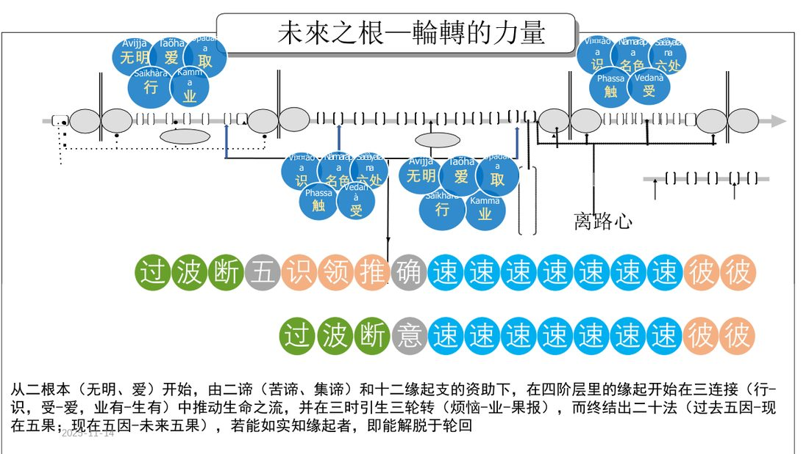
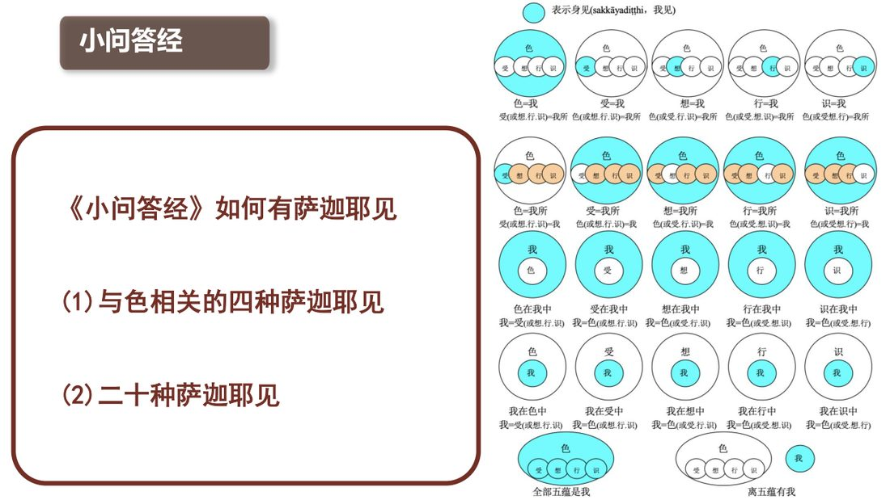

📅 最近更新：2026-09-29 13:20　|　第5版精修（朗读优化版）

# 第2周：萨迦耶灭与二十种身见（主持人版）

> ⭐ **本讲主持人速览**（新主持人必读，2分钟看完）
>
> 你不是老师，是"共学同行者"。你不需要提前懂内容，只需要按流程走。
> **本周由连续两周内容合并**而成，含两段共读、两轮分享与两轮讨论，单讲 120 分钟。
>
> | 环节 | 标准时长 | ⏱ 时间不够→ | ⏱ 时间富余→ |
> |:-----|:----:|:-----|:-----|
> | 🧘 静心开场 | 10 min | 缩至5 min | 加2分钟静坐 |
> | 📖 共读原文1 | 20 min | 只读★核心段（约15 min） | 加读◈扩展段 |
> | 💬 第一轮分享 | 10 min | 每人1句话 | 每人3分钟 |
> | 🎯 第一轮主题讨论 | 10 min | 只讨论问题① | 讨论全部问题+扩展 |
> | 🧘 禅修练习 | 15 min | 缩至8 min（只念引导词前半） | 延长至20 min |
> | 📖 共读原文2 | 20 min | 只读★核心段 | 加读◈扩展段 |
> | 💬 第二轮分享 | 10 min | 每人1句话 | 每人3分钟 |
> | 🎯 第二轮主题讨论 | 10 min | 只讨论问题① | 讨论全部问题+扩展 |
> | 🔚 收尾与回向 | 15 min | 缩至10 min | 保持 |
>
> **主持人10条守则（精简版）**：
> ① 不讲解、不提供答案——让原文自己说话；② 有人问"正确答案"→说"先听听大家的看法"；③ 冷场→主持人先分享自己的真实感受；④ 跑题→温和拉回："这个有意思，我们回到今天的原文"；⑤ 争论→"两种看法都很好，大家保留自己的理解"；⑥ 确保人人发言；⑦ 不评判任何人的分享；⑧ 时间到了就推进；⑨ 禅修练习照读引导词即可；⑩ 结束一起回向。

> **读书会23：小问答经讲记：萨迦耶见与圣八支道 · 第2周（4周版 · 连续两周合并）**
> 主持人：你不需要提前懂内容，按本手册推进即可。
> 本周主题：**萨迦耶灭＝渴爱的无余离染灭尽；它以十二缘起的"三轮转"（烦恼—业—果报）为机制显现，以圣八支道为到达之道。**；**凡夫对五蕴各有四种错误观待（色／受／想／行／识各四种＝二十种萨迦耶见），其中前五种（蕴即是我）属断见、后十五种（我拥有蕴、蕴在我中、我在蕴中）属常见；圣弟子以「不等随观」不执取五蕴，断我见。**。

---

## 📋 本周信息卡

| 项目 | 内容 |
|:----|:-----|
| 时长 | 120分钟（4周版 · 9环节） |
| 核心问题 | **什么是「萨迦耶灭」？它和「我」的消失是一回事吗？十二缘起的三轮转如何说明苦的生与灭、又把我们引向哪一条路？**；**我是怎样在五蕴上安立一个「我」的？这二十种我见里，我最常落在哪几种？** |
| 共读原文 | 共读原文1：材料①《小问答经讲记》04、材料②《小问答经讲记》05、材料③《根本五十篇·小问答经》原文。　｜　共读原文2：材料①《小问答经讲记》06、材料②《小问答经讲记》07。 |
| 本周作业 | ①用一句话写下「我此刻最舍不得放下的那份『想让它一直在』的心，落在五蕴的哪一处」，下周带来分享。②每日一次，用「二十种自查表」标记当日最明显的一两种我见，只记录、不评判。 |

## 🧘 静心开场（10 min）

**主持人引导语**（照读即可）：

> 请大家找一个舒适的坐姿，脊背自然挺直，双肩放松。轻轻闭上眼，或者把目光垂落在前方一米处。
>
> 先把注意力放到呼吸上。吸气，知道自己在吸气；呼气，知道自己在呼气。不用去控制它，只是知道。（静默约 1 分钟）
>
> 今天我们要谈一个听上去很大的题目——"萨迦耶灭"。请先不要急着理解它。做几个自然的呼吸，把刚才一路走来的匆忙放下，把手机调成静音。（静默约 2 分钟）
>
> 现在，请你留意一下：此刻的心里，有没有哪一件事、哪一个人、哪一样东西，是你**非常希望它一直保持下去**的？不用分析，只是看着它，像看水面上的一个涟漪。（静默约 1 分钟）
>
> 好，慢慢把注意力带回身体，带回这个房间。可以睁开眼睛了。
>
> 我们带着这份"看见"进入今天的共读——因为萨迦耶灭，正是从如实看见这份"希望它一直在"的心开始的。
>
> 最后，让我们把这份安静扩展开：愿我此刻安稳，愿我远离苦恼；愿在座的每一位同修安稳，远离苦恼；愿一切众生安稳，远离苦恼。（静默约 30 秒）
>
> 好，请大家把身体坐正，我们一起进入今天的学习。如果需要，可以随时睁眼、喝水、调整坐姿——这个空间是安全的，你的节奏由你自己把握。

> 💬 **破冰｜3–5分钟**：说说看：你觉得「苦」，是从外面来的，还是从里面生出来的？

> 🛡️ **心理安全三约定**（每次开场在心里过一遍）：① **保密**——这里说的话不出这间屋子；② **不评判**——不评价任何人的分享，也不急着评价自己；③ **可随时暂停**——任何时候觉得不舒服，都可以停下来休息、喝水或离开，不需要解释。

## 📖 共读原文1（20 min）

（主持人：本周共读六份材料。材料①②③★核心，务必在 30 分钟内带读完；材料④⑤⑥为补充与扩展，时间不够可只读要点。以下"> ⚠️ 主持人操作"行与括注（ ）为整理提示，仅供主持，朗读原文时跳过。涉十二缘起、四圣谛细节，请只点到为止，指明"详见读书会11/12（缘起）／09（四谛）"。）

### 原文材料①：★核心·《小问答经讲记》04-古源尊者-20251104（课件）

- **文件**：《小问答经讲记》04-古源尊者-20251104（课件）

> ⚠️ 主持人操作：本讲课件为「经文问答」精简型，全文照读即可（约 2 分钟）。读时把握四条线：①《小问答经》探问**灭谛**的问答原文；②依无明、渴爱的十二缘起支顺逆灭尽；③《大念处经》法随观·四圣谛中的**苦灭圣谛**；④十二缘起「二根本—二谛—十二支—四阶层—三连接—三时三轮转—二十法」的总纲图说，及探问**道谛**的圣八支道问答。此三条线即本周三块核心。

小问答经讲记

古源(Uttama)尊者讲述

2025年11日

礼敬佛陀

Namo tassa bhagavato arahato
sammā-sambuddhassa (x3)

礼敬那位世尊、阿拉汉、正自觉者

小问答答经

《小问答经》探问灭谛

问：什么被薄伽梵说为萨迦耶灭呢？

答:毗舍佉贤友!就是那渴爱的无余离染灭尽、舍弃、舍遣、解脱、无依住,毗舍佉贤友!这被薄伽梵说为萨迦耶灭。

依于无明、渴爱生;无明的无余灭尽导致造善恶业的名蕴([行])灭,[行]灭导致再生识灭,识灭导致名色灭,名色灭导致六处灭,六处灭导致触灭,触灭导致受灭,受灭导致渴爱灭,渴爱灭导致执取灭,执取灭导致引生后有的业因灭,有不再相续,有灭则无再生,无再生则老死忧悲恼等一切苦灭;如是这整个苦蕴灭是果。

一、大念处经讲记

法随观 四圣谛

“诸比库，何谓苦灭圣谛？

那就是此爱欲的完全消逝无余、舍离与弃除，从爱欲解脱、不执着。然而，诸比库，如何舍弃爱欲，灭除爱欲呢？

在世间有可爱与可喜之物的任何地方，就在那里舍弃爱欲、灭除爱欲。

在世间什么是可爱与可喜的呢？在世间眼根是可爱与可喜的，
就在这里舍弃爱欲、灭除爱欲。在世间耳根是……

六处缘触、触缘受是带有渴望和邪见之业以果报的状态而被执取后，不断地轮回流转。

未来之根一轮转的力量

从二根本（无明、爱）开始，由二谛（苦谛、集谛）和十二缘起支的资助下，在四阶层里的缘起开始在三连结（行识，受-爱，业有-生有）中推动生命之流，并在三时引生三轮转（烦恼-业-果报），而终结出二十法（过去五因-现在五果；现在五因-未来五果），若能如实知缘起者，即能解脱于轮回

烦恼轮转及业轮转

小问答经

《小问答经》探问道谛

问：什么被薄伽梵说为导向萨迦耶灭道迹呢？“

答：毗舍佉贤友！就是这圣八支道被薄伽梵说为萨迦耶灭道迹，即：正见、正思维、正语、正业、正命、正精进、正念、正定。

一、大念处经讲记

法随观 四圣谛

“诸比库，何谓导致苦灭的道圣谛？

那就是八圣道分，即正见、正思维、正语、正业、正命、正精进、正念、正定。

诸比库，什么是正见呢？诸比库，正见就是了知苦的智慧、了知苦因的智慧、了知苦灭的智慧、了知导致苦灭之道的智慧。诸比库，这称为正见。”

正思维、正语、正业、正命、正精进、正念、正定

Idam me puñnam asavakkhayavaham hotu.

Idam me puñnam nibbānassa paccayo hotu.

Mama puñña-bhāgam sabba-sattānam bhājemi.

Te sabbe me sama pūña-bhāga m labhantu.

愿我此功德 导向诸漏尽

愿我此功德 为证涅盘缘

我此功德分 回向诸有情

愿彼等一切 同得功德分

Sādhu! Sādhu! Sādhu!

### 原文材料②：★核心·《小问答经讲记》05-古源尊者-20251105（课件）

- **文件**：《小问答经讲记》05-古源尊者-20251105（课件）

> ⚠️ 主持人操作：本讲课件仍为精简型，全文照读即可（约 2 分钟）。重点两条线：①《小问答经》探问**道谛**的问答原文（与材料①末段呼应，本周取"道迹＝圣八支道"的经文语言）；②《小问答经》**执取与五取蕴关系**的问答（"凡对于五取蕴有意欲爱染者，在那里就有执取"）——这是从"集"过渡到"灭"的关键纽带。

小问答经讲记

古源(Uttama)尊者讲述

2025年11日

礼敬佛陀

Namo tassa bhagavato arahato
sammā-sambuddhassa (x3)

礼敬那位世尊、阿拉汉、正自觉者

小问答经

《小问答经》探问道谛

问：什么被薄伽梵说为导向萨迦耶灭道迹呢？“

答：毗舍佉贤友！就是这圣八支道被薄伽梵说为萨迦耶灭道迹，即：正见、正思维、正语、正业、正命、正精进、正念、正定。

一、大念处经讲记

法随观 四圣谛

“诸比库，何谓导致苦灭的道圣谛？

那就是八圣道分，即正见、正思维、正语、正业、正命、正精进、正念、正定。

诸比库，什么是正见呢？诸比库，正见就是了知苦的智慧、了知苦因的智慧、了知苦灭的智慧、了知导致苦灭之道的智慧。诸比库，这称为正见。”

正思维、正语、正业、正命、正精进、正念、正定

小问答答经

《小问答经》有关执取和取蕴的问答

问：那执取就是彼等五取蕴呢？还是除了五取蕴外有执取呢？

答：毗舍伝贤友！那执取既非就是那些五取蕴，也非除了五取蕴外有执取，毗舍伝贤友！凡对于五取蕴有意欲爱染者，在那里就有执取。

Idam me puñnam asavakkhayavaham hotu.

Idam me puñnam nibbānassa paccayo hotu.

Mama puñña-bhāgam sabba-sattānam bhājemi.

Te sabbe me sama pūña-bhāga m labhantu.

愿我此功德 导向诸漏尽

愿我此功德 为证涅盘缘

我此功德分 回向诸有情

愿彼等一切 同得功德分

Sādhu! Sādhu! Sādhu!

### 原文材料③：★核心·《根本五十篇》Mūlapaṇṇāsapāḷi（中部·小双品·4.《小问答经》原文）

- **文件**：《根本五十篇》Mūlapaṇṇāsapāḷi（中部·小双品·4.《小问答经》原文）

> ⚠️ 主持人操作：本经为巴利原典汉译，本周取「有身灭／导向身见灭尽之道」二问及其后的「执取与五取蕴」问答——即本周聚焦的**有身灭（＝萨迦耶灭）**、**导向身见灭尽之道（＝圣八支道）**与**执取＝对五取蕴的欲贪**。首二问〈有身见／有身集〉归第1周、末二问〈如何产生／如何没有身见〉归第4周，本讲不取，以免与他周重复。原文用"有身见／有身灭"语，与课件"萨迦耶见／萨迦耶灭"为同一词（kāya／sakkāya）之异译，读时提示即可。

以下照录知识库《中部》原文中《小问答经》相关段落（保留原编号与文字，含原文中的异名用字）：

---

4.《小问答经》

“‘身灭、身灭’，尊者啊，世尊所说的身灭是指什么呢？”

“朋友毗舍佉，正是对那渴爱的彻底灭尽、舍离、弃绝、解脱、无执；朋友毗舍佉，这就是世尊所说的‘有身灭’。”

"'导向身见灭尽之道，尊师，被称为导向身见灭尽之道。那么，尊师，世尊所说的导向身见灭尽之道是什么呢？'"

"维萨卡贤友，世尊确实说过，这八支圣道是导向灭除身见的修行之道。即：正见、正思惟、正语、正业、正命、正精进、正念、正定。"

"那么，尊者啊，执取就是这五种执取蕴吗？或者执取是五种执取蕴之外的东西呢？""不是的，维沙卡贤友。执取并非就是这五种执取蕴，也不是五种执取蕴之外的东西。维沙卡贤友，对于五种执取蕴的贪欲与渴爱，那就是执取。"

---

说明：知识库原文中，本经标题为“4.《小问答经》”；本周取〈有身灭／导向身见灭尽之道／执取与五取蕴〉问答段（首二问〈有身见／有身集〉归第1周、末二问〈如何产生／如何没有身见〉归第4周，此处从略），均按原文照录。

### 原文材料④：★补充·第141讲 业的运作2（共修版）

- **文件**：《第141讲 业的运作2（共修版）》

> ⚠️ 主持人操作：本讲篇幅较大，本周**只精读两段**：①「无明与渴爱及诸根」（轮回根本＝无明与渴爱，及七种随眠）——这是十二缘起"二根本"的业理论说明；②「有行／无行」段（业的自发性与强弱）——连到"业轮转"。其余（贪根心／瞋根心／痴根心的名法、临终速行与结生心、善业三因低劣殊胜、五种智）可略读或留作扩展。文中大量 OCR 心所图表已按原样保留（字形残破处如实照录，朗读跳过），本照录从"业的自发性"与"无明渴爱"两处切入，避免与读书会14/15（阿毗达摩心法）段落重叠。

以下按主题从知识库全文逐字照录与「十二缘起之无明渴爱、业的运作」直接相关的原文段落，标题与结构按原文保留。

云端起观-第 141 课

业的运作 2

> 有行和无行。善业和不善业如果是自发完成的，没有犹豫或者没有他人怂恿的，这叫做无行；如果造作善业、不善业的时候，有犹豫不决或者自己想来想去，自己鼓励，或他人怂恿，这叫做有行。
>
> 无行的业，这个思是更明显的，业的力量会更强。很多无行的思，如果是贪或者是善业，往往是跟喜相应，一般都会是悦俱；如果是有行的，思就比较弱，表现比较不明显。为什么呢？因为它跟昏沉睡眠相应。

> 首先我们回顾一下，如何观察贪根心呢？贪跟黏著有关，它可能是很粗显的，也可能是很微细的。很粗显的比如说很强烈的所缘，异性之间的这种黏著是很粗显的，子女、父子、母子之间的这种黏著也是很粗显的。一般人对自己的钱财啊，或者财富的那种黏著也是很粗显的。有一些比较微细，比如说，早就是你的了，老夫老妻了，经常跟你吵架的孩子，平常的时候你没感觉，要到一些特别的时候才会生起来，一般那个时候就变地微细了。渴爱 taṇhā，贪欲 rāga，爱欲 kāmacchanda。我们经常讲贪婪 abhijjhā、执著āsajjana、执取 upādāna，包括我慢 māna、自负 matta、邪见 diṭṭhi，这些都跟黏著有关，都是跟贪相应的。这些心无一例外，它的思心所，也就变成贪不善思。

## 💬 第一轮分享（10 min）

（主持人：本轮以"接住感受、联结生活"为主，不追求讲透义理。请先读规则，再由浅入深抛出起手问题。）

**分享规则（主持人照读）**：

> 接下来是自由分享。三条小约定：一、分享完全自愿，想说话就举手，不想说也可以安静聆听；二、每人每次不超过 2 分钟，说完放下话筒，把时间留一点给别人；三、我们分享的是**自己的观察与体会**，不是评论或纠正别人——也请不要把别人的分享当成评判自己修行深浅的尺子。

**主持人暖场引导（照读，约 1 分钟）**：

> 在开始分享之前，我们先试一件事：请不要急着组织语言、想"我说得对不对"。只问自己一句——"此刻，我心里最真实的那点感受是什么？"可能是平静，可能是散乱，也可能是一点点沉重。三种都可以，都是真实。我们今晚不是来交一份漂亮的答案的，是来一起**如实看见**的。看见，就已经在修了。

**起手问题（由浅入深，2–3 个）**：

1. **"希望它一直在"的心，落在哪里？**
   请结合刚才静心时看到的那个念头谈谈：你最希望"一直保持下去"的，是什么？是某段关系、某种状态、某种被认可的感觉，还是一种安全、不被打扰的平静？
   > 主持人提示：不必上升到佛理。只要诚实说出"它是什么"就够。若有人说"想不出"，可引导他从"最怕失去什么"反推。留意：这是观察，不是自我批判。

2. **苦往往从哪里冒出来？**
   上周的古源尊者讲到"渴爱"——那份处处贪著的想要。请想一个最近让你不太舒服（烦躁、失落、焦虑）的小场景：那个不舒服的背后，是不是藏着一个"它本该更好／它不该这样"的期待？
   > 主持人提示：这一步是把"集"从抽象变成自己的经验。若有人把它说成"我就是命苦"，可温和提醒："我们只看看那个'期待'在不在，不下命的好坏的结论。"

3. **"灭"这个词给你的第一印象是什么？怕不怕？**
   当听到"萨迦耶灭""渴爱灭尽"，你心里第一反应是向往、是怀疑，还是一点点害怕——害怕"灭了，我还在吗"？
   > 主持人提示：这是本周最重要的心理安全点。"灭"不是让人消失，而是苦的止息。可提前预告："稍后讨论环节我们会专门讲清楚，先把你真实的第一反应说出来。"

4. **弹性加问：修行想"变好"，算不算一种渴爱？**
   如果时间富余，可抛出这一问，为后面的讨论埋钩子：当我说"我想断尽烦恼、想证悟涅槃"，这份"想"里，有没有藏着"有爱"——希望一个更好的自己一直存在？
   > 主持人提示：这一问容易让人陷入"那我连修行都不该想了？"的困惑。请温和收住："不是让你不许发愿，而是让我们**看见**这份想里有没有一个'我'在背后。看见，就已经在松动。细节我们讨论环节再谈。"（可参考材料⑤"以布施为例"一段：连善行背后也可能有"有一个我可以证涅槃"的无明。）

**分组提示（超过 8 人时用）**：若人数较多，可将第一轮分享改为 3–4 人一小组，每组 6 分钟，各组推 1 位代表回大组用 1 分钟复述"本组最有共鸣的一句话"，主持人接住即可，不必逐条回应。

---

## 🎯 第一轮主题讨论（10 min）

（主持人：本环节三问由义理到实修，逐层深入。每问先给 1–2 分钟静默思考，再邀请 2–3 位分享，最后由主持人收束要点。切记："八支是次第培育，非一步登天"，把落点始终拉回"当下可落实的正见正念"。）

**过渡语（主持人照读）**：

> 刚才共读的五份材料，其实都在讲同一件事的三个侧面：**什么是灭、苦怎样起又怎样灭、以及怎样走向灭。** 下面我们用三个问题，把它一层一层从"听懂"变成"会用"。请大家不必急着抢答，先让问题在心里沉一沉；谁想到什么，随时举手。今晚我们没有标准答案，只有各自的看见。

### 引导问题 1：萨迦耶灭，究竟"灭"掉的是什么？

**讨论指向**：请回到材料①的经文——"就是那渴爱的无余离染灭尽、舍弃、舍遣、解脱、无依住"，以及材料③原典——"正是对那渴爱的彻底灭尽、舍离、弃绝、解脱、无执"。

**主持人收束要点**：

- 经文把"萨迦耶灭"第一次就定义为**渴爱的灭尽**，而不是"我的消失""身体的消灭""想法的清空"。要反复强调：灭的宾语是"渴爱"，不是"你"。
- 那么"渴爱"是什么？上周已讲，它是使生命不断再生的那份想要——欲爱、有爱、无有爱。欲爱是贪求感官享受；有爱是"希望它一直在""希望我一直在"；无有爱是"希望它消失、希望不再来"。三者共同点：都在给"存在的延续或断绝"下命令。
- 于是"萨迦耶灭"与"我执的断除"是同一件事的两面：当渴爱在五取蕴上不再**意欲爱染**，也就没有了"我的"可执取之处——这正是材料②"执取与五取蕴"问答的落点：执取并非就是五取蕴，也不是离五取蕴另有执取，而是"凡对于五取蕴有意欲爱染者，在那里就有执取"。反过来，意欲爱染的止息处，就是萨迦耶灭。
- **特别澄清（针对第一个起手问题里的"害怕"）**：灭不是"把正在经验的你抹掉"。经文说的是"无余离染、舍弃、舍遣、解脱、无依住"——是**放下抓取**，不是**消灭生命**。一份不再抓取的清明觉知依然在作用，只是不再以"我"的方式去占有它。这也是为什么佛陀称之为"乐"、称之为"清凉"。
- 延伸一句即可，不展开：苦、集、灭三谛的完整脉络，**详见读书会09（四圣谛二·灭与道）**；本周只取《小问答经》经文问答的角度。

**常见追问与应答（问题一）**：

- 有人问："如果渴爱灭了，那我岂不是对亲人也无所谓了？"——**应答**：这是把"贪著"和"慈悲"混为一谈。渴爱是"我要占有、要它按我的意思一直在"；慈悲是"愿你安好"，它不要求占有。事实上，正因不再抓取，慈心才更纯粹、更不容易被"怕失去"污染。经文说灭是"舍弃、舍遣、解脱"，不是冷漠。
- 有人问："那我现在就该把这些喜欢的东西全戒掉吗？"——**应答**：本周不是"戒"，是"看"。要放下的是**抓取的动作**，不是先强行拿走所缘。强行压抑往往只是把贪压到地下，回头更猛。先如实看见"我想抓"，这一步已经对了。
- 主持人收束可加一句点题：**"灭"是一个动词，是"松开"，不是一个被消灭的"东西"。** 请把这句话写在白板上，全天备用。

**义理小注（主持人自用，视现场水平取舍）**：

- "无余离染灭尽"的"**无余**"（巴利 anavasesa），是指连随眠（潜伏的烦恼）都断尽、不留残余。相对地，暂时压伏烦恼（如得定）只是"有余"的止息，还会再起。所以"萨迦耶灭"在究竟义上，特指**道智彻底根绝**渴爱随眠的那一刻——这也是下周材料会把"圣弟子断我见"与凡夫"二十种萨迦耶见"对照来讲的伏笔。
- "舍弃、舍遣、解脱、无依住"这四个词，可以理解为**同一个放下的四个侧面**：舍弃（不再执取）、舍遣（不再把它当成"我的"）、解脱（从系缚中出离）、无依住（不再以它为立足点）。不必逐词训诂，只需让听众体会"松手"这一个动作的彻底性。
- 注意本周与**第1周**的呼应：第1周讲"萨迦耶集＝渴爱"，本周讲"萨迦耶灭＝渴爱的灭尽"。集与灭，是同一个渴爱的两副面孔——它起，则苦起；它灭，则苦灭。可以板书一对箭头："集→（渴爱起）→苦"；"灭→（渴爱尽）→苦尽"。

### 引导问题 2：十二缘起的三轮转，怎样说明苦的生起与止息？

**讨论指向**：请回到材料①的总纲——"从二根本（无明、爱）开始，由二谛（苦谛、集谛）和十二缘起支的资助下……在三时引生三轮转（烦恼-业-果报），而终结出二十法（过去五因-现在五果；现在五因-未来五果）"；再对照材料⑤三轮转实录："烦恼轮转、果报轮转和业轮转"。

**主持人收束要点**：

- 先用一幅"最小图"带大家看懂三轮转的几个环节（**只讲骨架，细节一律指向读书会11/12**）：
  - **烦恼轮转**：无明与爱（材料⑤："导致这个十二缘起轮转的根源是无明和爱"）。它推动。
  - **业轮转**：行与有（业有）。想要变成"去做"，于是留下业的力量。
  - **果报轮转**：识、名色、六入、触、受——一期生命的果报在眼前展开。
- 关键在**转动**：果报现前（比如一个不悦意的境界），由于无明，我们又对它生起爱取（新的烦恼轮转），于是再造新的业（新的业轮转），未来的果报随之而生（新的果报轮转）。它就是那个"轮"——一圈套一圈。材料⑤说得直白："过去的无明爱取行业，导致这一生的识名色六入触受生起。当受产生了以后呢，由于无明，你又对这个受产生了爱取，然后你就会造作新的业……"。
- 那么"止息"处在哪里？**不在果报，而在"受"与"爱"之间那一念**。果报（已成熟的业）无法撤销，但"受→爱→取→有"这一环是可以被观照、被截断的。这就是十二缘起的观门，也是它与修行最直接的接口。材料④"无明与渴爱及诸根"讲得透彻：除了阿拉汉，一切有情都还以"随眠"的形式潜藏着无明与渴爱——它平时不现形，遇缘即起。修行不是消灭已成熟的果报，而是让随眠不再现行、逐步被道智根绝。
- **连到词条**：本周反复出现的"依于无明、渴爱生……渴爱灭导致执取灭，执取灭导致引生后有的业因灭，有不再相续……如是这整个苦蕴灭是果"（材料①），正是十二缘起的**还灭门**。顺观是苦的生起，逆观是苦的止息，同一张缘起图，两种看法，通向两种结局。诸支的名相、二十四缘的细致关系、以及"过去五因—现在五果—现在五因—未来五果"的完整拆解，**详见读书会11／12（十二缘起／缘起深入与二十四缘）**。
- **落回生活**：请记住一句可带走的话——"日常遇到的色声香味触，都是果报；面对果报的那一念作意，才决定我们造的是善业还是不善业。"（材料⑤）这就是普通人当下就能用的缘起。

**常见追问与应答（问题二）**：

- 有人问："既然果报是过去业定的，那我努力还有用吗？"——**应答**：大有用。业果并非机械命定。果报（受）我们改变不了，但**面对果报时的作意与行动**是我们此刻能造的"现在因"。转一个念头，就换了一条未来的流向。材料⑤"只要不是胡思乱想，日常看到的都是果报；面对果报采取行动时，是善还是不善，取决于如理作意"正是这个意思。
- 有人问："三轮转听起来好复杂，是不是要背下来？"——**应答**：不必。今天只要记住"烦恼→业→果报"三个词的先后，以及"轮子在'受→爱'之间往前滚"这一点就够。名相细节留给读书会11／12。
- 主持人可补一个比喻（若时间够）：**缘起像河流，不像链条。** 链条是硬性的、一节一节互不相容；河流是相续的、彼此相依而流。看缘起，看的是"随着什么而有什么"的相续，而不是找一个"第一因"或"幕后操控者"。
- 收束时点明**顺观与逆观**：同一张图，顺着看是苦的生起（无明→行→……→老死），逆着看是苦的止息（无明灭则行灭……老死灭）。修行不是另起炉灶，而是在这张既有的图上，从"无明"与"爱"两头同时松动。**"无明灭"靠智慧，"爱灭"靠观照**——这正是"慧"与"定／念"两条腿走路。

**义理小注（主持人自用）**：

- 十二支不必死记，但**三处"接口"值得记住**：①"识→名色→六入→触→受"是**果报段**（已成，不可改）；②"受→爱→取→有"是**造业段**（此刻可改，是全图的关键）；③"有→生→老死"是**未来果报段**（将成，由②决定）。主持时把重心压在②上。
- 材料①那句"六处缘触、触缘受是带有渴望和邪见之业以果报的状态而被执取后，不断地轮回流转"，正说明：**果报本身不可怕，可怕的是我们对果报的"执取"**。同一句话，也可以读成一句修行口诀：**"果报现前，莫急于取。"**
- 若有人对"三时"概念发懵，可提醒：三时（过去／现在／未来）是**解释用的框架**，不是十二支被硬切成三段。现实中，三时可以在**一念之间**完成——这也正是为什么"当下"才是修行的战场。要与**读书会11／12**的完整讲授配合理解，此处点到为止。

### 引导问题 3：导向萨迦耶灭的圣八支道，今天可以怎么起步？

**讨论指向**：请回到材料①②③三个"道谛"问答——"就是这圣八支道被薄伽梵说为萨迦耶灭道迹，即：正见、正思维、正语、正业、正命、正精进、正念、正定"；原典作答"这八支圣道是导向灭除身见的修行之道"。

**主持人收束要点**：

- 先破一个常见误会：**八支不是八条平行的高难度任务，而是一条次第生长起来的路**。正见是眼，正思维是方向；正语、正业、正命是外在的轨范（戒）；正精进、正念、正定是内心的培育（定／三摩地）；而正见贯穿始终，越走越深，直到八支最终被戒·定·慧三蕴收摄（材料①《大念处经》的"正见＝了知苦、苦因、苦灭、导苦灭之道的智慧"已经点出这条路的智慧底色）。
- **强调"次第培育，非一步登天"**：不要把八支听成"从今天起我要样样做到"。它更像一棵树：先立正见（知道苦、知道苦因、知道有灭、知道有路），其余七支随正见一点点长出来。今天你能落地的，也许只是"正语"里的一句——少一句抱怨、多一句如实的话；或者"正念"里的五分钟——吃饭时知道在吃饭。
- **把"道"接回"灭"**：道不是手段之外的另一个东西。材料①道谛问答说"导向萨迦耶灭道迹"——这条路的每一步，本身都在削弱渴爱的抓取。走一步，就近一分灭。所以不必等"有一天我修成了"才开始，此刻的一支正念，已经在道上。
- **收束一句**：下周我们将把这条路拆开来看——**厌离五蕴**与圣八支道的具体构成（第5周）；再往后，八支如何被戒·三摩地·慧三蕴所包含（第6周）。八正道的**实践层面**的完整讲解，**详见读书会10（八正道实践）**；本周只取《小问答经》的经文问答角度。
- 主持人最后可以留 1 分钟给"每人一句"：轮一圈，每人用一句话说出"今天我准备在第几支上先迈一小步"。

**八支速记表（可板书，供「先迈一小步」用）**

- **正见**：如实知苦、苦因、苦灭、灭苦之道——遇烦恼时先问一句「苦在哪、因在哪」。
- **正思维**：出离、无害、不恼害的思惟方向——生起怨念时，先转向「愿他安好」。
- **正语**：如实、柔和、有益、合时的话——今天少说一句抱怨或带刺的话。
- **正业**：不伤害身行——一件小的护生、护他的举动。
- **正命**：正当的谋生与消费——检查一次「这笔消费背后是什么心」。
- **正精进**：令未生善生、已生善增、未生恶不生、已生恶断——发现不善念时，及时转念而非随它。
- **正念**：于身受心法如实觉知——一次专注的吃饭或行走。
- **正定**：令心一境、安住不散——五分钟的呼吸安住。

**常见追问与应答（问题三）**：

- 有人问："八支这么多，我从哪一支开始？"——**应答**：从**正见**入手，其余七支随正见走。具体到当下，哪一支最容易被你抓住，就从那一支落脚。目的不是"做完八支"，而是让正见长出手脚。
- 有人问："我平时没时间打坐，还算在修八支吗？"——**应答**：算。八支不是"打坐时的八件事"，而是从见解到言行到心的整套生活轨范。一次如实的对话、一次克制的消费，都在八支之内。
- 有人问："正见和正念，哪个先？"——**应答**：互相成就。有一点正见（知道方向），才能念得对；念得多了，正见才会从"听来的"变成"看见的"。所以不必纠结先后，**带着方向感去觉知当下**，两个就一起长。这也是为什么本讲的禅修练习选在"受与爱之间"——它同时用到了正念（觉知）与正见（知道该在哪看）。
- 主持人收束金句（可板书）：**"道不是终点前的跑道，而是每一步本身。"** 每走一步，渴爱就松一分，萨迦耶灭就近一分。

**义理小注（主持人自用，为第5、6周铺垫）**：

- 材料①《大念处经》把正见定义为"了知苦、了知苦因、了知苦灭、了知导苦灭之道的智慧"——注意，正见不是一条"观念"，而是**一路走到底、直到了知四谛的智慧**。由此可见八支是"活的结构"：起点是正见，终点也是正见（深化的智）。这也解释了为什么经文说"圣八支道**被薄伽梵说为**萨迦耶灭道迹"——道与灭不是两件事。
- 本周只取"圣八支道＝导向萨迦耶灭道迹"的**经文语言**；八支的**具体构成**（厌离五蕴、各支内涵）留给**第5周**；八支**被戒·三摩地·慧三蕴所包含**的关系留给**第6周**；**实践落点**（如何在生活中修八正道）**详见读书会10（八正道实践）**。请严格守好这条边界，不越界展开，以免与其他周次、其他系列重复。
- 一句话把"灭—道"扣在一起：**"灭"是果，"道"是因；道就在当下，灭就不在远方。**

> **分层追问**（可视时间取用，由浅入深）：
> - 【现象】萨迦耶灭、缘起、四圣谛，你听下来，是一件事，还是三件事？
> - 【影响】看不清「苦」的来处，会怎样？
> - 【应对】这周你愿意从哪一环入手，去看烦恼是怎么生起的？

---

## 🧘 禅修练习（15 min）

### 练习一

> ⚠️ **禅修禁忌提示**：若你正处在严重抑郁、焦虑、创伤后应激，或精神类疾病的发作／用药期，或正经历强烈的情绪危机，请先咨询医生或心理师，再决定是否练习；练习中若出现明显不适（如心悸、胸闷、情绪失控），请立即停止，睁开眼睛，把注意力放回呼吸与身体，必要时离场休息。

（主持人：本周练习围绕"受—爱"之间的一念。引导词照读即可，语速放慢。若有人情绪起伏明显，请他睁开眼、回到脚底与呼吸，必要时可暂离。）

**主题：在受与爱之间，留一个空隙**

> 请大家坐好，脊背自然挺直，双肩放松，双手轻放在腿上。可以闭眼，也可以垂目。
>
> 先让呼吸变得自然、绵长。吸气……呼气……（约 1 分钟）听一听周围的声音。有声音，就有耳根与声音的接触；这个接触，就是"触"。触之后，心里会升起一点感觉：舒服、不舒服，或者中性的——这就是"受"。先只是认识它：此刻我的受，是乐、是苦，还是不苦不乐？
>
> （静默约 2 分钟）
>
> 现在，请你留意**受的后面那一念**。当舒服的感觉升起，心里是不是马上有一个"再多一点、再久一点"的微细倾向？当不舒服的感觉升起，是不是马上有一个"快点走开"的倾向？不必压住它，也不必跟着它跑。你只是看着：哦，这里有一个"想要更多"、或者"想要它走开"。这一念，就是"爱"的雏形。今天我们不给它下判断，只是认得出它。
>
> （静默约 3 分钟）
>
> 认得出，就是功夫。就在"受"和"爱"之间，你为自己留出了一道**空隙**。这道空隙里没有抓取，只有知道。假如你发现心已经被抓走了——没关系，这本身就是看见；轻轻回到呼吸，重新站在这道空隙里。
>
> （静默约 3 分钟）
>
> 好，最后把注意力放回到呼吸，做三次深长的呼吸。吸气……呼气……感受双脚与地面、身体与坐垫的接触。慢慢睁开眼睛。
>
> 这就是"导向萨迦耶灭道迹"里最朴素的一支——正念：在果报现前的当下，如实知道，而不立刻造作。
>
> 最后，请你把这一分钟的安稳，轻轻带向身边的人：愿大家都在这条路上，走得安、走得稳；愿没有人被自己的渴爱压得喘不过气。我们在这份善意里，结束今天的练习。

**练习后的简短回访（约 2 分钟）**：请 1–2 位分享"刚才有没有认出'受后面的那一念'？认出之后，发生了什么？"——不作评价，只作见证。

**备选简版练习（时间不够或人多时，约 8 分钟）**：

> 只做一件事：把注意力放在呼吸上，吸气知道吸气，呼气知道呼气。在这之中，每当你发现心被某个"想要"牵走（想要安静、想要结束、想要更多），不评判，只在心里轻轻标记一句"想要"，然后回到呼吸。标记，就是正念；回到呼吸，就是正定。就这样，反复地把"想要"从暗处拿到明处。

**收束语（主持人照读）**：

> 今天我们没有做什么高深的事，只是练习了一件事——**在想要升起的当下，认出它**。这就是"受"与"爱"之间那道小小的空隙。不要小看它：渴爱之所以能牵着我们轮回，是因为我们从不认识它；一旦认识，它就开始失去力量。请把这份"认识"带回生活——在每一次心动、每一次不悦、每一次想抓住的瞬间，都用得上。

---

### 练习二

> ⚠️ **禅修禁忌提示**：若你正处在严重抑郁、焦虑、创伤后应激，或精神类疾病的发作／用药期，或正经历强烈的情绪危机，请先咨询医生或心理师，再决定是否练习；练习中若出现明显不适（如心悸、胸闷、情绪失控），请立即停止，睁开眼睛，把注意力放回呼吸与身体，必要时离场休息。

（本周练习引导词，照读即可）

各位贤友，我们来做一次「五蕴标记·非我」的练习。

先回到自然呼吸，三次深长呼吸后，让呼吸恢复平常。

现在，请你觉察身体：坐着的重量、接触的触感、呼吸的起伏。在心里轻轻标记一声：「色。」——这是色蕴，是身体，是物质的部分。它不是「我」，它是被观察的对象。

接着，觉察感受：此刻是舒服、不舒服，还是不苦不乐？轻轻标记：「受。」——这是受蕴。它不是「我」，它只是正在生灭的感受。

接着，觉察想：心里有没有在命名、在辨认、在回忆？轻轻标记：「想。」——这是想蕴。

接着，觉察行：有没有任何动机、意愿、冲动在推动？轻轻标记：「行。」——这是行蕴。

接着，觉察识：知道这一切正在发生的那个「知」，也轻轻标记：「识。」——这是识蕴。它同样依缘而生，同样不是我。

（停顿约 1 分钟）

再重复一轮，速度可以更慢：色……受……想……行……识……

（停顿约 2 分钟）

现在，把注意力放回呼吸，只守着鼻端这一点清凉。心里可以默念：
「这一切都不是我，不是我所有，不是我自己。」
但请注意——这句话不是用来消灭什么，只是让心松开一点、透明一点。念的时候轻轻的，像松开握紧的拳头，而不是像挥拳去打什么。

如果你感觉不安、飘、或者身体不适，随时回到呼吸的腹部起伏，或者睁开眼睛、动动手脚。宁可稳稳地坐在这里，也不要勉强进入任何特殊状态。

（停顿约 1 分钟）

好，慢慢把觉知带回整个身体，带回这个房间，带回身边的贤友们。

（备用练习·时间富余时）「四句自查」静坐：任选一句（「色是我」……「我在识中」），静坐 5 分钟，只是观察它在心里有没有出现、以什么形式出现，不删改、不对抗。起座前问自己：刚才那句「我」，是「看见」了它，还是「变成」了它？

（主持提示：练习中请反复强调「回到呼吸与身体」这条安全阀。若有人报告头晕、发麻、心慌，属常见生理反应，引导其睁眼、放松、慢慢呼吸即可，不必惊慌，也不必赋予特殊意义；若持续不适，允许其离场休息。）

## 📖 共读原文2（20 min）

（以下七块材料逐字照录自知识库原文；主持人按信息行与操作行提示切分念读，）

### 原文材料①：★核心·《小问答经讲记》06-古源尊者-20251106（课件）

- **文件**：《小问答经讲记》06-古源尊者-20251106（课件）

> ⚠️ 主持人操作：本课件为「经文问答」精简型，全文照读约 3 分钟，宜整段念读，重点落在「二十种萨迦耶见」与两张身见表。

以下为原文逐字照录：

《小问答经讲记》06-古源尊者-20251106（课件）.pdf
《小问答经讲记》由古源尊者讲述，核心围绕萨迦耶见（即身见、我见）展开，说明未受教导的凡夫因不熟圣者法、善人法，对五蕴产生错误观待从而形成萨迦耶见。内容详细阐释了涉及色、受、想、行、识五蕴的二十种萨迦耶见的具体分类，同时包含礼敬佛陀的相关内容与功德回向偈颂。该讲记以佛典问答形式阐释教义，兼具宗教实践指引与教义讲解的属性。

小问答经讲记

古源(Uttama)尊者讲述

2025年11日

礼敬佛陀

Namo tassa bhagavato arahato
sammā-sambuddhassa (x3)

礼敬那位世尊、阿拉汉、正自觉者

小问答经

《小问答经》探问萨迦耶见如何生起

问：怎样有萨迦耶见呢？

答：毗舍佉贤友！这里，未受教导的凡夫是不曾见过圣者的，不熟练圣者法的，未受圣者法调教的；是不曾见过善人的，不熟练善人法的，未受善人法调教的，等随观1色是我，或我拥有色，或色在我中，或我在色中；受……（中略）想……（中略）行……（中略）等随观识是我，或我拥有识，或识在我中，或我在识中，毗舍佉贤友！这样有萨迦耶见。

小问答经

《小问答经》如何有萨迦耶见

(1) 与色相关的四种萨迦耶见

(2)二十种萨迦耶见

表示身见(sakkāyadiṭḥi, 我见)

**四种观待 × 五蕴 ＝ 二十种萨迦耶见**：对每一蕴（色、受、想、行、识）各有四种观待——

1. **色即是我**、**受即是我**、**想即是我**、**行即是我**、**识即是我**（「蕴即是我」）。
2. **我拥有色**、**我拥有受**、**我拥有想**、**我拥有行**、**我拥有识**（「蕴是我所」）。
3. **色在我中**、**受在我中**、**想在我中**、**行在我中**、**识在我中**。
4. **我在色中**、**我在受中**、**我在想中**、**我在行中**、**我在识中**。

其中第 1 类（蕴即是我）属断见，第 2—4 类（我拥有蕴、蕴在我中、我在蕴中）属常见。

全部五蕴是我

离五蕴有我

Idam me puñnam asavakkhayavaham hotu.

Idam me puñnam nibbānassa paccayo hotu.

Mama puñña-bhāgam sabba-sattānam bhājemi.

Te sabbe me sama pūña-bhāga m labhantu.

愿我此功德 导向诸漏尽

愿我此功德 为证涅盘缘

我此功德分 回向诸有情

愿彼等一切 同得功德分

Sādhu! Sādhu! Sādhu!

---

### 原文材料②：★核心·《小问答经讲记》07-古源尊者-20251107（课件）

- **文件**：《小问答经讲记》07-古源尊者-20251107（课件）

> ⚠️ 主持人操作：本课件含「如何没有萨迦耶见」问答与「僧随念」，全文照读约 3 分钟；重点读「不等随观」与「具闻圣弟子厌离五蕴，业不再运作」。

以下为原文逐字照录：

《小问答经讲记》07-古源尊者-20251107（课件）.pdf
古源尊者2025年11月7日的《小问答经》讲记，先阐释围绕五蕴产生的二十种萨迦耶见（我见）的表现，再说明圣弟子通过不执取五蕴、厌离五蕴可断除我见，最后讲解了僧随念的内涵与功德回向内容。

小问答经讲记

古源(Uttama)尊者讲述

2025年11日

礼敬佛陀

Namo tassa bhagavato arahato
sammā-sambuddhassa (x3)

礼敬那位世尊、阿拉汉、正自觉者

小问答经

《小问答经》如何有萨迦耶见

(1) 与色相关的四种萨迦耶见

(2)二十种萨迦耶见

表示身见(sakkāyadiṭḥi, 我见)

**四种观待 × 五蕴 ＝ 二十种萨迦耶见**：对每一蕴（色、受、想、行、识）各有四种观待——

1. **色即是我**、**受即是我**、**想即是我**、**行即是我**、**识即是我**（「蕴即是我」）。
2. **我拥有色**、**我拥有受**、**我拥有想**、**我拥有行**、**我拥有识**（「蕴是我所」）。
3. **色在我中**、**受在我中**、**想在我中**、**行在我中**、**识在我中**。
4. **我在色中**、**我在受中**、**我在想中**、**我在行中**、**我在识中**。

其中第 1 类（蕴即是我）属断见，第 2—4 类（我拥有蕴、蕴在我中、我在蕴中）属常见。

全部五蕴是我

离五蕴有我

无闻凡夫只是绕着五蕴跑

小问答答经

《小问答经》如何没有萨迦耶见

问：什么被薄伽梵说为萨迦耶灭呢？

答:毗舍佉贤友!这里,已受教导的圣弟子是见过圣者的,熟练圣者法的,善受圣者法调教的;是见过善人的,熟练善人法的,善受善人法调教的,不等随观色是我,或我拥有色,或色在我中,或我在色中;受....（中略）想....（中略）行....（中略）不等随观识是我,或我拥有识,或识在我中,或我在识中,毗舍佉贤友!这样没有萨迦耶见。

小问答答经

如何没有萨迦耶见

不再围着五蕴跑

小问答经

如何没有萨迦耶见

具闻圣弟子厌离五蕴

业不再运作

二、僧随念

Sāmīcippaṭipanno 弟子僧团是正当行道者。

Sāmīcippaṭipanno 弟子僧团是正当行道者

(1)顺应解脱轮回而实践正行道

(2)值得人们恭敬地实践正行道

(3)法随法行道

Idam me puñnam asavakkhayavaham hotu.

Idam me puñnam nibbānassa paccayo hotu.

Mama puñña-bhāgam sabba-sattānam bhājemi.

Te sabbe me sama pūña-bhāga m labhantu.

愿我此功德 导向诸漏尽

愿我此功德 为证涅盘缘

我此功德分 回向诸有情

愿彼等一切 同得功德分

Sādhu! Sādhu! Sādhu!

---

### 原文材料③：补充：第035讲-邪见3-（共修版）

- **文件**：《第035讲-邪见3（共修版）》

> ⚠️ 主持人操作：本讲为「二十种萨迦耶见＝常见／断见」的正面讲透，务必念读下列六段（离蕴我、相在、七魂六魄、四种模式比喻、断见与常见总判）。原文中的「？？」为原文占位标记，照录未改。

以下为原文逐字照录（云端阿毗达摩第 35 讲，古源尊者，2020 年 9 月 11 日）：

**一、关于「我拥有色…我拥有识，是一种离蕴我的观点」**

> 各位贤友好，我们继续今天的课程。前两天我们讲到了邪见。邪见这个心所所引发出来的事比较多，因为有很大的课题。有些，我们是可以讲，有些也不好讲。今天我们继续把这二十种邪见的情况说完。我们昨天说到了，我拥有色、我拥有受、我拥有想、我拥有行，我拥有识，是一种离蕴我的观点，认为五蕴之外有一个我在拥有这个五蕴，才是在五蕴之外，那么说这个是大我、本体我，类似于婆罗门教的讲的那个？？ shan fan ？？。

**二、关于「色在我中…相在」**

## 💬 第二轮分享（10 min）

（分享规则：自愿为限，每人 2–3 分钟；只讲自己的体会，不评判他人；主持人不点评对错，只复述并感谢。若有人一时不想说，可以说「今天先听」，完全尊重。）

起手问题（任选 2–3 个，鼓励用具体生活场景作答）：

1. 读「色是我／我拥有色／色在我中／我在色中」这四句，哪一句最像你日常的直觉？请举一个最近的小例子。
2. 当我们说「我的身体」「我的想法」「我的感受」时，那个「我的」背后，是不是藏着一个「我」？你是怎么发现它的？
3. 「无闻凡夫只是绕着五蕴跑」——回想过去一周，你在哪件小事上「绕着五蕴跑」了？当时身体和情绪是什么状态？
4. 你有没有过这样的时刻：身体不舒服（色），马上心里就冒出一句「我怎么这么倒霉」（受想行的连环）？请描述那两三秒里，五蕴是怎样「接力」的。
5. 当你听到「厌离五蕴」四个字，第一反应是「有道理」还是「太消极了」？这个反应本身，是不是也值得我们看一看？

（主持提示：第一轮重在「说出来」，不追求标准答案。若有人分享得很深，主持人可以追问一句「那时候你身体哪里有感觉？」把体验带回身体。若有人开始评判自己「我太糟糕了」，请温和接住：「看清是为了松开，不是为了让谁难过。」）

（口头示范一句把体验「标记化」：「刚才开会时我被否定，胸口一紧——色（胸口紧）、受（难受）、想（他看不起我）、行（想反驳）、识（全都知道）。」用这句话告诉成员：五蕴可以这样一格一格地看。）

（第一轮收束语，主持人用）：「谢谢大家的分享。我们会发现，每个人说的例子不同，但结构惊人地相似——先有一个身体的感受，接着一个判断，然后一个冲动，最后全部被登记成『我』。看清这个结构，就是今天的收获。」

## 🎯 第二轮主题讨论（10 min）

**第 1 问（由浅入深·人人可答）：二十种萨迦耶见为什么是「二十」？**
提示：五蕴（色受想行识）× 四种观待（是我／我拥有／在我中／我在中）＝二十。请成员用自己的话把「色」这一蕴的四种观待各造一个句子，再推到受想行识：
- 色是我：「这个身体就是我。」
- 我拥有色：「身体是我的，但还有一个我在拥有它。」
- 色在我中：「有一个我，身体在我里面。」
- 我在色中：「有一个我，住在身体里（像灵魂住在身体里）。」
要点落回：这二十种不是我发明的分类，而是佛陀在《中部·皮带束缚经》《小问答经》里对凡夫心的如实描述；其中「蕴即是我」五种是断见（人死如灯灭），「我拥有蕴／蕴在我中／我在蕴中」十五种是常见（总有一个不变的我）。引导讨论：为什么「常见」比「断见」看似「好一点」，却同样障碍解脱？——因为只要还有一个「我」，就有「我的」，就有求、有怕、有轮回的动力。

**第 2 问（指向实修·观照落点）：如何「不等随观」而不是「等随观」？**
提示：经文里，凡夫是「等随观色是我……」，圣弟子是「不等随观色是我……」。差别就在一个「等」字——把蕴与「我」等同起来，把「我的」当成「我」。请成员讨论：日常中怎样练习「不等同」？可以落在受念处：当一个强烈的感受生起，先不急着说「我很痛苦」，而说「有一个痛苦的感受正在生起」。要点：观照是「分开看」，是给「受」和「我」之间留一条缝，不是「消灭它」。提醒涉五取蕴观照的细节详见读书会07/18，本讲只取其「不认同」的落点。

（主持提示：若成员问「那到底有没有我」，可回应：「这个问题先放一放。今天我们练的是——在感受生起的当下，能不能不立刻说『这是我』。这是可操作的一步。」把形而上问题落回当下。）

**第 3 问（认知升级·见地翻转）：为什么《无碍解道》要用「灯焰与光明／树与树荫／花与香／宝珠与匣子」四个比喻？**
提示：
- 灯焰与光明——把「我」与「色」看成同一团火，火即光、光即火（是我）；
- 树与树荫——树「拥有」树荫，树是一物、荫是另一物（我拥有）；
- 花与香——香「在」花中，香是花的属性（色在我中）；
- 宝珠与匣子——宝珠「在」盒中，宝珠与盒子是两物（我在色中）。
请成员讨论：这四个比喻分别打中了我们哪种错觉？哪个比喻最让你「心里一动」？要点：比喻的价值在于让抽象的我见「现形」；看见即是松动的开始。（更深经论对照见材料⑤。）

**第 4 问（落地收束·从见地到行为）：看清我见，和「事大还是我大」有什么关系？**
提示：带着我见去做事，就是「我大」——凡不符合我的看法、我的习惯的，就 blocking；松开我见去做事，就是「事大」——从「怎样把这件事做好」出发。请成员讨论：在工作或家庭里，最近一次「我大」是什么情形？如果换成「事大」，会有什么不同？要点：断我见是长程的，但「从见取下手、把事摆在我前面」是此刻就能练的。（此点与读书会11第5周「我大／事大」同源，可作呼应。）

**第 5 问（观照心法·回到当下）：看见我见的那一刻，应该做什么？**
提示：什么都不用做，只是「看见」。经文说「具闻圣弟子厌离五蕴，业不再运作」——厌离不是咬牙切齿地讨厌，而是看清它「依缘而生、不经久、不可主宰」之后自然的不再紧抓。请成员讨论：你有没有过「看见一个冲动，然后它自己就松开了」的经验？那一刻心里是紧的，还是松的？要点：不要用「我见」去攻击「我见」——那只是换了一个「我」在打仗。看见即是第一次真正的松开。

（主持总提示：三到四个问题不必全走完，宁深勿广。每到一问的收束，用一句话把大家带回「看见即是松动」。切勿让讨论滑向「评比谁更无我」。）

> **分层追问**（可视时间取用，由浅入深）：
> - 【现象】二十种「我见」里，你最容易落在哪一类？
> - 【影响】各种我见反复换花样，说明什么？
> - 【应对】这周你愿意怎么对治最顽固的那一种——先看清它，还是先不跟它走？

## 🔚 收尾与回向（15 min）

### 收尾一

**一、总结引导（约 5 分钟，主持人照读）**：

> 今天我们用一句话、一张图、一条路，把"萨迦耶灭"落到地上——
>
> 一句话：萨迦耶灭，是**渴爱的无余离染灭尽**，不是"你"的消失。
> 一张图：十二缘起的**三轮转**（烦恼—业—果报），顺观是苦的生起，逆观是苦的止息；止息的接口，就在**受与爱之间的那一念**。
> 一条路：**圣八支道**，从正见起步，次第培育，不必一步登天——今天的一支正念，就已经在道上。
>
> 请记住，我们不是在消灭一个叫"我"的东西，而是在**松开一双总想抓住的手**。松开一分，清凉一分。
>
> 还有一个很实际的提醒：今天讲的"三轮转"与"圣八支道"，听起来宏大，其实都落在一个很小的动作上——**认得那个"想要"**。你不需要今天就证得什么，只需要比昨天多认得一次。修行从来不是轰轰烈烈地"成"，而是安安静静地"松开"。

**二、下周预告（第4周：二十种萨迦耶见）**：

> 下周我们回到"见"上。这一生我们为什么总觉得有一个"我"？凡夫对五蕴会生起哪些错误的观待方式？《小问答经》把它们归为**二十种萨迦耶见**（身见／我见）——色是我、我拥有色、色在我中、我在色中，受想行识亦复如是。我们也会看圣弟子是如何断除我见的。请带着本周的作业来：**"我此刻最舍不得放下的那份'想让它一直在'的心，落在五蕴的哪一处？"**

（预习提示：下周会用到"四相观待"的框架，感兴趣的同修可先想一想——我们对一样东西生起"这是我"，通常有哪几种说法？是"它就是我"，还是"它是我的"，还是"我在它里面／它在我里面"？带着这个问题来，下周会更有共鸣。）

**三、回向（约 2 分钟，全体合掌，主持人领读）**：

> 愿以此共修的功德，
> 回向给一切有情——
> 愿一切众生，远离烦恼的缠缚，得清凉、得安乐；
> 愿我们依此圣八支道，次第而行，终证涅槃。
>
> （若依巴利文回向偈，可领读：）
> Idam me puññam āsavakkhayāvahaṃ hotu.
> Idam me puññam nibbānassa paccayo hotu.
> Mama puññabhāgaṃ sabbasattānaṃ bhājemi.
> Te sabbe me samaṃ puññabhāgaṃ labhantu.
>
> 愿我此功德，导向诸漏尽；愿我此功德，为证涅槃缘。
> 我此功德分，回向诸有情；愿彼等一切，同得功德分。
> Sādhu! Sādhu! Sādhu!

**四、散会前小提示（约 1 分钟，主持人照读）**：

> 今天回去，请带着一个小小的练习：**在任何一个"想要"升起的当下，认出它，给它起个名字——"想要"。** 不必改变它，只是认出。认出的次数多了，你会发现，那道"受与爱之间"的空隙，慢慢变宽了。这就是本周的作业与功课。下次见，愿大家吉祥。

---

### 收尾二

**成员一句话收获（约 8 min，自愿）：**
依次请每位成员用一句话说「今天最大的一个收获／一个还想继续看的问题」。不评价、不补充，只说「谢谢你的分享」。若有人沉默，说一句「收到」，直接跳过。（本周一句话心法：看清，就是松开。）

**总结引导（照读或用自己的话）：**
今天我们做了三件事：第一，看清了二十种萨迦耶见就是「五蕴×四种观待」；第二，认出前五种是断见、后十五种是常见，而它们都是「在五蕴上安立一个我」；第三，学了「不等随观」——把蕴与「我」分开看，看见即是松动。请记得：这不是一节课就能断除的，我见很微细，它可能一生都在。我们不追求「今天要证到无我」，只求「今天看清一点、松一点」。愿这一份「看清」，不只让我们松一点，也让我们对身边那个同样抓得很紧的人，多一分体谅。

**下周预告：**
下周进入第 5 周「导向萨迦耶灭的圣八支道构成」——看清了「我」是怎么安立的，下一步就来看「厌离五蕴」与圣八支道是怎样具体展开的。请带着本周的「二十种自查表」来，也把本周最想继续看的一个问题带过来。

**回向词（四句，齐诵）：**
愿我此功德，导向诸漏尽。
愿我此功德，为证涅槃缘。
我此功德分，回向诸有情。
愿彼等一切，同得功德分。
萨度！萨度！萨度！

**课后复盘提示（主持人群内跟进用）：**
建议在本周内于共修群发一条温和的提醒：「这一周，不必急着『断我见』，只需每天照一次镜子——今天最像我的我见是哪一格？看见了就好。」若有人在群里自我贬低，及时以「看清是为了松开，不是为了难过」回护。若有人报告强烈情绪或解离感，私下关怀，建议其回到呼吸与身体、放慢练习，必要时暂停并寻求专业支持。

## 📌 本讲主持人特别提醒

### 本讲主持人特别提醒（一）

1. **"灭"的心理安全（本讲首要）**：本周多次触及"萨迦耶灭／渴爱灭尽"，容易触发"我要把自己消灭掉吗""灭了还有我吗"的隐秘恐惧。请在第 1 个主题讨论处**主动澄清**：灭的宾语是**渴爱**，不是生命、不是人格、不是觉知本身。若现场有人表达强烈不安，请温和接住，并把话头拉回"此刻身体与呼吸的安稳"，必要时允许其暂离。

2. **观照≠否定，体验≠自许**：凡涉观照五蕴、观"受—爱"间隔、看"想要"的升起，一律提醒——这是**如实观察**，不是自我攻击的理由；**不追求"无我体验"，不以"我已能看破"自许，也不与他人比较觉察的快慢深浅**。若出现异常情绪、身体紧绷或解离感，立即回到呼吸与身体，可暂停练习。

3. **"八支是次第培育，非一步登天"**：讨论圣八支道时，务必反复强调这一点，把落点放在**当下可落实的一支**（一句正语、五分钟正念），避免成员产生"我做不到八支就白学"的挫败。

4. **跨系列边界（口径统一）**：涉**十二缘起**各支名相、二十四缘，注明"**详见读书会11／12（缘起）**"；涉**四圣谛**的完整修学脉络，注明"**详见读书会09（四圣谛二·灭与道）**"；涉**八正道**的实践层面，注明"**详见读书会10（八正道实践）**"。本周只取《小问答经》**经文问答**的角度，不越界展开。

5. **只做主客，不做诊断**：分享以自愿为限；主持人不诊断、不给心理学标签；成员情绪波动时，提供呼吸放松或暂离选项。全程保持"陪伴而非评判"的场域。

6. **音声照录的朗读纪律**：材料⑤为口语转写，含时间码与（"无名／无明""爱曲／爱取""时有／识"）等原样保留的同音字；朗读时**跳过时间码与括注**，遇到明显同音字按语义顺读即可，不必现场纠字，以免打断气脉。若成员对某句转写有疑问，主持人可以一句话说明"这是口语转写，意思按上下文理解"，把注意力带回义理本身。

7. **本讲"边界感"总提醒**：本周是"枢纽周"——上承第1、2周的"萨迦耶＝五取蕴／执取机制"，下启第4周的"二十种萨迦耶见"、第5、6周的"圣八支道构成与三蕴"。请主持人**始终站在"《小问答经》经文问答"的位置上**，凡遇其他周次、其他系列的专属内容（缘起名相、四谛实修、八正道实践、阿毗达摩心法），一律指向相应读书会，点到即止。这样既守住本讲主题，也避免与既有资料重复。

### 本讲主持人特别提醒（二）

1. **心理安全（本讲重点）**：本周主题是「我见」，请务必向成员说明——**观照无我 ≠ 否定世俗人格**。你依然有名有姓、有责任、有情感，修行不是把人修成石头。**不追求「无我体验」，不以「我已无我」自许**；若出现异常情绪、漂浮感或解离感，**立即回到呼吸与身体**（感受脚底、手掌的触感），**可以暂停**，可以睁眼、喝水、走动，主持人可陪同离开会场休息。

2. **不对治出自我攻击**：分享中若有人说「原来我一直都是错的、很糟」，请及时引导——五蕴是**如实观察的对象**，不是自我攻击的理由；看清我见是慈悲地松开，不是苛责地打压。若有人明显陷入自我贬低，可邀请他先做三次呼吸，再回到「此刻身体的感觉」。

3. **不做团体判定**：严禁在共修中判定谁「有我没有我」、谁「修得好修得差」。体验深浅不可比较；主持人不诊断、不给心理学标签，也不替任何人认定境界。

4. **术语落地**：萨迦耶见＝身见＝我见；「等随观」＝把蕴等同于我；「不等随观」＝不把蕴等同于我。每次出现先一句话解释，避免成员被名词困住。

5. **跨系列分工**：本周涉「五取蕴观照」详见读书会07/18；涉「十二缘起」详见读书会11/12；涉「邪见心所」详见读书会14/15；涉「八正道」实践详见读书会10。遇到相关提问，简报一句「这个主题另设专场，今天先专注我见」即可。

6. **分享有边界**：涉家庭、健康、创伤的话题，以自愿为限，不追问细节；主持人守住「陪伴」而非「治疗」的边界。若话题过于沉重，可引导回到本次主题或邀请稍后私下交流。

7. **氛围把控**：本周知识点较密（二十种、断常见、三种邪见、四喻），主持人切忌「讲满」。宁可留出静默与呼吸的空隙，让法义有机会落进心里。若时间紧，材料③④⑥以「课后自读」处理，保前五块。

8. **留白与节奏**：每一大段落之间，留 5–10 秒的静默再转场；语速放慢、音量放柔。共修不是知识竞赛，「慢下来」本身就是对我见的一种松解。收尾时不要催促，让最后一句回向自然落地。

<!--EXT_READ-->
## 📖 延伸阅读（课后自由选读）

- 《小问答经讲记》04-古源尊者-20251104（课件）——本讲核心素材：萨迦耶灭定义、十二缘起三轮转、灭谛/道谛问答
- 《小问答经讲记》05-古源尊者-20251105（课件）——本讲核心素材：导向萨迦耶灭道迹、执取与五取蕴问答
- 《根本五十篇 Mūlapaṇṇāsapāḷi（〈小问答经〉原文）》——《中部·小问答经》原典：有身灭、导向身见灭尽之道、执取与五取蕴
- 《第141讲 业的运作2（共修版）》——补充：无明与渴爱为轮回根本、七随眠、五种智
- 《2025五月包容寺短期出家修习营20-十二缘起与修行的关系》-古源尊者-20250520（音声）——扩展：四色类二十法、三轮转、无明爱取与果报的口语展开（保留时间码）
- 《无碍解道》见论·我见解释／身见释——二十种萨迦耶见四模式与四喻（灯焰光明／树与树荫／花与香／宝珠与匣子）；与读书会09第7周同文件不同段落
<!--/EXT_READ-->
