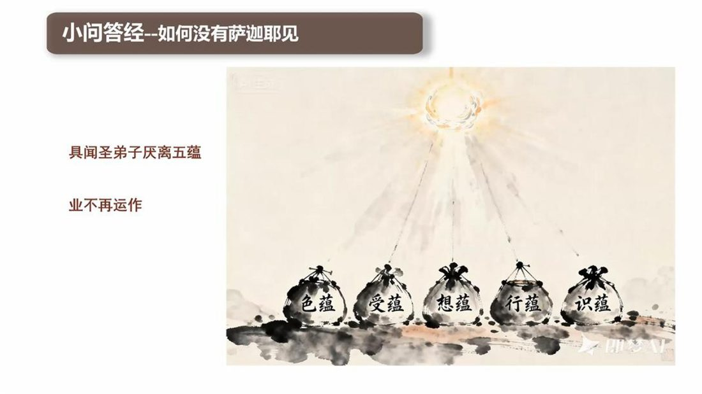
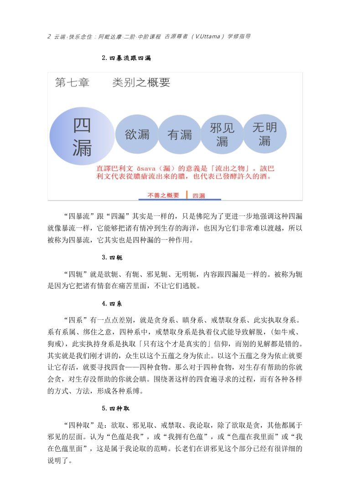

📅 最近更新：2026-09-29 13:20　|　第5版精修（朗读优化版）

# 第3周：圣八支道构成与戒定慧三蕴（主持人版）

> ⭐ **本讲主持人速览**（新主持人必读，2分钟看完）
>
> 你不是老师，是"共学同行者"。你不需要提前懂内容，只需要按流程走。
> **本周由连续两周内容合并**而成，含两段共读、两轮分享与两轮讨论，单讲 120 分钟。
>
> | 环节 | 标准时长 | ⏱ 时间不够→ | ⏱ 时间富余→ |
> |:-----|:----:|:-----|:-----|
> | 🧘 静心开场 | 10 min | 缩至5 min | 加2分钟静坐 |
> | 📖 共读原文1 | 20 min | 只读★核心段（约15 min） | 加读◈扩展段 |
> | 💬 第一轮分享 | 10 min | 每人1句话 | 每人3分钟 |
> | 🎯 第一轮主题讨论 | 10 min | 只讨论问题① | 讨论全部问题+扩展 |
> | 🧘 禅修练习 | 15 min | 缩至8 min（只念引导词前半） | 延长至20 min |
> | 📖 共读原文2 | 20 min | 只读★核心段 | 加读◈扩展段 |
> | 💬 第二轮分享 | 10 min | 每人1句话 | 每人3分钟 |
> | 🎯 第二轮主题讨论 | 10 min | 只讨论问题① | 讨论全部问题+扩展 |
> | 🔚 收尾与回向 | 15 min | 缩至10 min | 保持 |
>
> **主持人10条守则（精简版）**：
> ① 不讲解、不提供答案——让原文自己说话；② 有人问"正确答案"→说"先听听大家的看法"；③ 冷场→主持人先分享自己的真实感受；④ 跑题→温和拉回："这个有意思，我们回到今天的原文"；⑤ 争论→"两种看法都很好，大家保留自己的理解"；⑥ 确保人人发言；⑦ 不评判任何人的分享；⑧ 时间到了就推进；⑨ 禅修练习照读引导词即可；⑩ 结束一起回向。

> **读书会23：小问答经讲记：萨迦耶见与圣八支道 · 第3周（4周版 · 连续两周合并）**
> 主持人：你不需要提前懂内容，按本手册推进即可。
> 本周主题：**导向萨迦耶灭的圣八支道＝正见、正思惟、正语、正业、正命、正精进、正念、正定；它是有为法，被戒·定·慧三蕴所包含；它的起点，是圣弟子对五取蕴的厌离。**；**圣八支道被戒·三摩地·慧三蕴所含摄——正语正业正命属戒蕴，正精进正念正定属三摩地蕴，正见正思维属慧蕴；三摩地＝心一境性，以四念处为依、四正勤为资助。**。

---

## 📋 本周信息卡

| 项目 | 内容 |
|:----|:-----|
| 时长 | 120分钟（4周版 · 9环节） |
| 核心问题 | **「导向萨迦耶灭的圣八支道」到底由哪八支构成？这八支是「一次到位」还是「次第培育」？**；**八支圣道和三蕴，是谁包含谁？为什么「心一境性」就是三摩地——那我们平常说的「专注」算不算？** |
| 共读原文 | 共读原文1：材料①《小问答经讲记》08、材料②《根本五十篇·小问答经》圣八支道问答＋《正见经》《蛇喻经》《一切漏经》。　｜　共读原文2：材料①《小问答经讲记》09、材料②《小问答经讲记》10。 |
| 本周作业 | ①用一句话写下「这一周我愿意从八支里先选哪一支落实到日常（一句正语、五分钟正念、一次如理作意）」，下周带来分享。②从八支里选一支，在七天里每天记录一次「我做到了／我没做到」的实例，下周带来分享（建议从正语或正念起步）。 |

## 🧘 静心开场（10 min）

**主持人引导语**（照读即可）：

> 请大家找一个舒适的坐姿，脊背自然挺直，双肩放松。轻轻闭上眼，或者把目光垂落在前方一米处。

> 先把注意力放到呼吸上。吸气，知道自己在吸气；呼气，知道自己在呼气。不用去控制它，只是知道。（静默约 1 分钟）

> 今天我们谈一条「路」——导向萨迦耶灭的圣八支道。请先不要急着理解它，也不要急着问「我够不够格走」。做几个自然的呼吸，把刚才一路走来的匆忙放下，把手机调成静音。（静默约 2 分钟）

> 现在，请你留意一下：此刻的心里，有没有哪一件小事，是你**本来可以做、却总是一拖再拖**的？比如一句想说的感谢、一次想放下的计较、一分钟愿意留给自己的安静。不用分析，只是看着它，像看路上的一块小石头。（静默约 1 分钟）

> 好，慢慢把注意力带回身体，带回这个房间。可以睁开眼睛了。

> 我们带着这份「看见」进入今天的共读——因为八支道不是远处的宏大工程，它常常就落在「拖了很久的那一步」上。今天的一支，可能就先从这里起步。

> 再做一个深呼吸。此刻心里大概已经浮起一点「我想要什么」的轮廓了。请把这个轮廓轻轻放下——它只是我们今天观察的材料，不是要去解决的问题。（静默约 30 秒）

> 最后，让我们把这份安静扩展开：愿我此刻安稳，愿我远离苦恼；愿在座的每一位同修安稳，远离苦恼；愿一切众生安稳，远离苦恼。（静默约 30 秒）

> 好，请大家把身体坐正，我们一起进入今天的学习。如果需要，可以随时睁眼、喝水、调整坐姿——这个空间是安全的，你的节奏由你自己把握。

> （主持人提示：静心环节不追求「入定」，也不追求「什么都不想」，只求把心从散乱里收回来一点点。如果你此刻还在想刚才路上的事、还在惦记手机里的消息，那很正常——**看见它，然后回来，就够了**。静心的「成」，不在一坐不动，而在一回一回来；哪怕一天回来一百次，也是一百次的修行。若现场有人迟到、有人走动，也不必重来，就着当下的状况继续——**当下，就是最好的开始**。另提醒自己：静心是为后面三十分钟的共读「铺地」，不是表演给谁看的功夫；带着这份松，我们再进课堂。）

> 💬 **破冰｜3–5分钟**：说说看：八支道里，你觉得哪一支最自然、哪一支最别扭？

> 🛡️ **心理安全三约定**（每次开场在心里过一遍）：① **保密**——这里说的话不出这间屋子；② **不评判**——不评价任何人的分享，也不急着评价自己；③ **可随时暂停**——任何时候觉得不舒服，都可以停下来休息、喝水或离开，不需要解释。

## 📖 共读原文1（20 min）

（主持人：本周共读四份材料。材料①②★核心，务必在 30 分钟内带读完；材料③④为补充与扩展，时间不够可只读要点。以下「> ⚠️ 主持人操作」行与括注（ ）为整理提示，仅供主持，朗读原文时跳过。涉八正道细节，请只点到为止，指明「详见读书会10（八正道）」；涉四圣谛实践，指明「详见读书会09（四谛）」。）

**读前背景（主持人参考，约 1 分钟，不必逐字念）**：本周四份材料，围着一个核心词——「道迹」（magga）。在《小问答经》里，毗舍佉（维沙卡）问到最后：「什么是圣八支道」「它是有为法还是无为法」——经文把「灭」与「道」紧紧绑在一起：**导向萨迦耶灭的道，就是圣八支道**。所以本周不讨论「如何立刻证果」，只老老实实看清：这条路由哪八支构成、它的性质是什么、又从「厌离」起步。（「有身见／有身集」问答归读书会23 第1 周，「有身灭／道迹」问答归第3 周，本讲不重复照录。）读原文时，请让听众自己也听出那种「一口气报出八支」的利落——路就这么直，字就这么朴。

### 原文材料①：★核心·《小问答经讲记》08-古源尊者-20251108（课件）

- **文件**：《小问答经讲记》08-古源尊者-20251108（课件）

> ⚠️ 主持人操作：本课件为「经文问答」精简型，全文照读约 1 分钟。读时把握三条线：①「如何没有萨迦耶见＝具闻圣弟子厌离五蕴、业不再运作」；②《小问答经》**探问圣道**的问答原文（圣八支道八支列举）；③礼敬佛陀与功德回向偈（照读即可）。（提示：课件末尾的回向偈，正好可作为本讲共读与收尾回向彼此呼应的伏笔；读到这里，不妨让大家留意一下，散会时我们还会再念一次。）

《小问答经讲记》08-古源尊者-20251108（课件）.pdf
《小问答经讲记》由古源尊者讲述，核心围绕《小问答经》展开，阐释了消除萨迦耶见需具闻圣弟子厌离五蕴、使业不再运作的修持方向，同时明确了圣八支道的具体构成。内容还包含礼敬佛陀的偈颂与功德回向的相关表述，传递了将修持功德回向一切有情的理念。该讲记整体围绕佛教经典义理展开讲解，为相关修持者提供经典内容的解读参考。

小问答经讲记

古源(Uttama)尊者讲述

2025年11日

礼敬佛陀

Namo tassa bhagavato arahato
sammā-sambuddhassa (x3)

礼敬那位世尊、阿拉汉、正自觉者

小问答答经

如何没有萨迦耶见

不再围着五蕴跑

小问答经--如何没有萨迦耶见

具闻圣弟子厌离五蕴

业不再运作

小问答答经

《小问答经》探问圣道

问：哪些是圣八支道呢？

答:毗舍伝贤友!这是圣八支道,即:正见、正思维、正语、正业、正命、正精进、正念、正定。

Idam me puñnam asavakkhayavaham hotu.

Idam me puñnam nibbānassa paccayo hotu.

Mama puñña-bhāgam sabba-sattānam bhājemi.

Te sabbe me sama pūña-bhāga m labhantu.

愿我此功德 导向诸漏尽

愿我此功德 为证涅盘缘

我此功德分 回向诸有情

愿彼等一切 同得功德分

Sādhu! Sādhu! Sādhu!

> **主持人串讲（材料①，约 2 分钟）**：这份课件把本周的两条主线一次点出。第一句「如何没有萨迦耶见——具闻圣弟子厌离五蕴，业不再运作」，其实是对前四周的收束：萨迦耶见的消解，不靠「努力不想」，而靠**圣弟子的如实观察**——因为看清了五蕴的实相，厌离自然生起，业（有「我」的造作）也就随之不再运作。第二句是《小问答经》探问圣道的问答：毗舍佉问「哪些是圣八支道」，答曰八支。请注意，这里是**经文语言**——它把「导向萨迦耶灭的道」直接等同为「圣八支道」。所以本周的关键词是「构成」：这八支究竟是哪八支、又是什么性质。带着这两个问题，我们进入材料②的经文原典。

### 原文材料②：★核心·《小问答经》圣八支道问答＋《正见经》《蛇喻经》《一切漏经》

- **文件**：《小问答经》圣八支道问答＋《正见经》《蛇喻经》《一切漏经》

> ⚠️ 主持人操作：本文件为《中部·根本五十篇》原典汉译（deepseek 生成、未经校对，仅供参照）。本周取四处**不同经**：①《小问答经·小双品第四》圣八支道之列举与「有为／无为」问答（★核心）；②《正见经第九》正见之定义；③《蛇喻经第二十二》筏喻不执取与五蕴厌离解脱；④《一切漏经第二》由见断漏。时间不足时，只精读《小问答经》问答与《正见经》首段；其余作补充朗读。涉四谛细节，只点到为止，指明「详见读书会09（四谛）」。（朗读建议：四处经文若全读超时，可只读每处的首段；但《小问答经》「此即是圣八支道……是有为法」一段务必读全，它是本周的枢纽。）

### （一）《小问答经》（小双品第四）圣八支道之列举与「有为／无为」问答

「那么，尊者，什么是圣八支道呢？」

「贤友毗舍佉，此即是圣八支道，即：正见、正思惟、正语、正业、正命、正精进、正念、正定。」「尊者，圣八支道是有为法还是无为法？」

「朋友毗舍佉，圣道确实是八支的，是有为法。」

（段落说明：本经「有身见＝五取蕴」与「有身集」问答归读书会23 第1 周；「有身灭」与「导向有身灭之道」问答归第3 周；「执取与五取蕴」问答归第2 周；「圣八支道被三蕴包含」问答归第6 周；「三摩地」问答归第7 周。本讲只取「圣八支道之列举」与「其性质是有为法」一段，其余不重复照录。）

### （二）《正见经》（中部第九）正见之定义与四圣谛

「正见、正见」，诸贤友，如是称说。然则，诸贤友，圣弟子如何成就正见，具足正直见解，于法得不动信，入此正法耶？」

「诸贤友，当圣弟子如实知不善、不善根，如实知善、善根——如是，诸贤友，圣弟子即成就正见，具足正直见解，于法得不动信，入此正法。……何谓不善根？贪是不善根，嗔是不善根，痴是不善根——此等，诸贤友，称为不善根。」

「贤友，何谓善？离杀生是善，离偷盗是善，离邪淫是善，离妄语是善，离两舌是善，离恶口是善，离绮语是善，无贪是善，无嗔是善，正见是善——贤友，此称为善。贤友，何谓善根？无贪是善根，无嗔是善根，无痴是善根——贤友，此称为善根。」

「贤友，当圣弟子如是了知不善，如是了知不善根，如是了知善，如是了知善根，他完全舍弃贪随眠，断除嗔随眠，拔除『我见』慢随眠，断无明而生明，于现法中自作苦边——贤友，圣弟子如是具足正见，其见正直，于法得净信，来入此正法。」

（四圣谛门）「道友，当圣弟子如实了知苦、苦集、苦灭、灭苦之道时——到此程度，道友，圣弟子即具正见，其见端正，具足对法的不动摇信心，已入此正法。道友，何谓苦？……生是苦，老是苦，死是苦，忧悲愁叹苦恼是苦，怨憎会是苦，爱别离是苦，求不得是苦，简言之五取蕴是苦——道友，此称为苦。道友，何谓苦集？即导致再生、伴随贪喜、处处贪着的渴爱，所谓欲爱、有爱、无有爱——道友，此称为苦集。道友，何谓苦灭？即对此渴爱无余离贪、灭尽、舍离、解脱、无执——道友，此称为苦灭。道友，何谓灭苦之道？即此八支圣道：正见...乃至...正定——道友，此称为灭苦之道。」

（漏门）「朋友，有三种烦恼：欲漏、有漏、无明漏。无明的生起是烦恼的起源，无明的灭尽是烦恼的灭尽，这八支圣道就是导向烦恼灭尽之道，即：正见...正定。」

（缘起门·老死）「朋友，当圣弟子如实了知老死、老死之集、老死之灭、以及导向老死灭尽之道时——朋友，圣弟子即具足正见，其见正直，对法具足不坏净信，已来到此正法之中。朋友，所谓老，是指各类众生在其各自群体中的衰老现象：齿摇发白，皮肤皱褶，寿命减损，诸根衰退——朋友，这称为老。朋友，什么是死？是指各类众生从其各自群体中的逝去：命终、死亡、解体、消失、命尽、寿终、诸蕴分离、抛弃躯体、命根断绝——朋友，这称为死。如是此老与此死——朋友，这合称为老死。生起故老死集起，生灭故老死灭尽。此八支圣道即是导向老死灭尽之道，即：正见...正定。」

（缘起门·生）「贤友！何谓生？何谓生之集？何谓生之灭？何谓趣向生灭之道？诸有情于各类有情众中，受生、投胎、入胎、转生，诸蕴显现，诸处获得——贤友！此名为生。由有集而生集，由有灭而生灭，此八支圣道即是趣向生灭之道，所谓：正见......正定。」

（缘起门·有）「贤友！有此三有：欲有、色有、无色有。由取集而有集，由取灭而有灭，此八支圣道即是趣向有灭之道，所谓：正见......正定。」

（缘起门·执取）「贤友啊，有四种执取：欲取、见取、戒禁取、我语取。渴爱生起则执取生起，渴爱灭尽则执取灭尽，这八支圣道就是导向执取灭尽的道迹，即：正见...正定。」

（缘起门·渴爱）「贤友啊，有六种渴爱身——色爱、声爱、香爱、味爱、触爱、法爱。受集为渴爱之集，受灭为渴爱之灭，此八支圣道即是导向渴爱灭尽之道，即：正见...正定。」

（缘起门·受）「贤友啊，有六种受身——眼触所生受、耳触所生受、鼻触所生受、舌触所生受、身触所生受、意触所生受。触集为受之集，触灭为受之灭，此八支圣道即是导向受灭尽之道，即：正见......正定。」

（缘起门·六处）「贤友，有此六处：眼处、耳处、鼻处、舌处、身处、意处。名色集故六处集，名色灭故六处灭，此八支圣道即是六处灭道迹，即：正见...正定。」

（缘起门·名色）「受、想、思、触、作意——道友，此称为名；四大及四大所造色——道友，此称为色。如是此名与此色——道友，此称为名色。识集故名色集，识灭故名色灭，此八支圣道即是导向名色灭尽之道，即：正见......正定。」

（缘起门·识）「道友，有此六识身——眼识、耳识、鼻识、舌识、身识、意识。行集故识集，行灭故识灭，此八支圣道即是导向识灭尽之道，即：正见......正定。」

（缘起门·行）「贤友啊，有三种行：身行、语行、心行。无明集起故行集起，无明灭尽故行灭尽，此八支圣道即是行灭尽之道，即：正见...正定。」

## 💬 第一轮分享（10 min）

**分享规则**（主持人开场先说明，约 1 分钟）：

> 接下来的分享，只谈**本周这一课**在我们心里、生活里激起的东西。三个原则：
> 1. **自愿为限**——愿意说的请举手，点名与比较都不是我们的方式；
> 2. **不评判深度**——没有「修得更好」这回事，只有「如实看见」这回事；
> 3. **控制在 2 分钟内**——说不完的，留到茶歇。
>
> 请记得：我们谈的是「一条路」，不是「一场考试」。你说出的是此刻真实的经验，就已经很好。

**分享时段的氛围提示（主持人自我提醒）**：分享的价值，常常不在「说得多好」，而在「有没有被好好听见」。请主持人把注意力放在**倾听**上——点头、目光、一句「谢谢你」，比任何评点都更有力量。遇到冷场，不必急着填满，允许三秒的安静；安静本身，也是这个空间的一部分。若有人替别人回答，请温和地把它交还给本人。

**起手问题**（每人任选其一，或简短回应即可）：

1. **「厌离」在你听来是什么滋味？** 本周经文说，圣弟子是「对色厌离、对受厌离……对识厌离」而踏上八支道。请说说：你生活里有没有一件事，让你第一次生出「够了，我想换一种方式」的念头？那一刻，是厌恶、是疲惫，还是一种清醒的转身？（提示：厌离不是厌世，是如实看见后才有的「不再执着」。）

2. **八支里，哪一支离你最近？** 正见、正思惟、正语、正业、正命、正精进、正念、正定——不要挑「最难」或「最高」的那一支，只挑**此刻你最容易上手**的那一支，说说它在你的一天里长什么样。（提示：也许只是「今天少说一句抱怨的话」，那就是正语的起点。）

3. **「我够不够格走这条路？」** 《一切漏经》说，正见生起时，断的是「身见、疑、戒禁取」三结。请说说：你有没有因为「我这样的凡夫能解脱吗」这个疑，而迟迟不肯起步？现在你怎么看？（提示：经文从不要求我们先成为圣人再上路；它说的是，知者见者能灭诸漏。）

**延伸追问（时间富余时，任选其一对每人加一句）**：

- 追问 A：「你刚才说的那一支，如果要你做**一周**，你预计最大的障碍会是什么？你打算怎么照顾这个障碍？」
- 追问 B：「如果下周你回来，说你做到了那一支，你希望自己那时的状态是什么样？（不必是『开悟』，越具体越好。）」
- 追问 C：「这件事，你愿意让在座哪位同修做个见证吗？」（提示：见证只是陪伴，不是监督；若对方不愿意，不勉强，这也是「不评判」的一部分。）

（主持人提示：分享环节重点是**让人说出来、被听见**，不是纠错。若某位成员说得较长，可在 2 分钟处温和提醒「谢谢你，我们把时间留给下一位」。若有人情绪浮现，先接住情绪再回主题，必要时请其深呼吸或暂离。）

**主持人可能遇到的几种回应与接续**（备用，挑用得上的即可）：

- 若有人说「我不知道什么是厌离」：可以回应——「那你有没有过『这件事我实在不想再这样下去了』的念头？那可能就是厌离的雏形。它不需要很猛烈。」把抽象的术语落到他真实的一句话上。
- 若有人说「八支我一条都做不到」：请温柔地把它拆小——「那今天只挑一句正语，明天只挑五分钟正念，够不够？」让成员从「全或无」的挫败里出来。
- 若有人把「厌离」说成「对一切都提不起劲、想放弃」：请及时分层——「经文说的厌离，是对**执取**的厌离，不是对生活的厌离；如果你感到的是灰心、无力，那是另一个题目，我们下来单独聊，也请留意自己的休息与情绪。」（必要时提供呼吸放松或暂离选项。）
- 若有人急着「请教怎么证果」：把话头拉回本周——「证果不是本周的题目，本周只问：这条路是什么、今天先走哪一支。」并指向「详见读书会20（从凡夫到圣者）」。
- 若现场安静、无人开口：主持人可以先自曝一个「很小的、真实的一支」，让空气松下来，再邀请。

## 🎯 第一轮主题讨论（10 min）

（主持人提示：三问由浅入深。第 1 问诉诸「经文原义」，第 2 问进入「次第与落差」，第 3 问指向「当下可落实」。每问先让 2—3 人回应，再由主持人作 2 分钟小结。涉八正道细节，只点到「详见读书会10（八正道）」；涉四谛实践，指向「详见读书会09（四谛）」。）

（讨论前的一句话定调，主持人先说）：「今天我们不是在给八支道做学问，也不是在检讨自己修得如何。我们只是**把这条路看清楚**——看清了，才知道脚下该往哪儿放。请把这次讨论，当成一次『一起认路』。」

**第 1 问：八支道到底「是什么」？——从经文，看它的构成与属性**

> 引导：《小问答经》里，毗舍佉问「什么是圣八支道」，法施比库尼答：正见、正思惟、正语、正业、正命、正精进、正念、正定。紧接着又一个问：「圣八支道是有为法还是无为法？」答：「是对（被）合成样态、是有为法。」再问：「八支圣道是否包含三蕴？还是三蕴包含八支圣道？」答：「不是八支包含三蕴，而是**三蕴包含八支**」——正语、正业、正命属于戒蕴；正精进、正念、正定属于定蕴；正见、正思惟属于慧蕴。

> 讨论要点：为什么经文要先说「它是有为法」，再说「它被三蕴包含」？这对我们理解「修道」有什么影响？（提示：有为法＝因缘和合、可被培育、会生起也会变化——所以八支不是「天生就在那儿」的抽象真理，而是**可以被练习、被培育**的。三蕴包含八支，则说明八支不是零散的八个动作，而可以归成「戒—定—慧」三组功夫。此处的三蕴含摄，下周（读书会23 第6周）会详讲；八支的实践展开，可参考「读书会10（八正道）」。）

> 小结参考：八支是「**一条可培育的路**」，不是「**一套要去相信的教条**」。它被归纳为戒定慧三学——这意味着，无论你从哪一支入手，其实都在同时滋养另外两组。

> **经文出处小注（主持人参考）**：本问所依据的三个问答，出自《中部·小双品·小问答经》（汉译知识库题作《小问答经》），问答双方是毗舍佉近事男与法施比库尼。经文把「圣八支道被三蕴包含」讲得斩钉截铁；这一点在第6周（读书会23）会专门展开。至于「八正道」作为独立修学主题的完整讲说，请参「读书会10（八正道实践）」；四谛的实践脉络，请参「读书会09（四谛二·灭与道）」。

**第 2 问：「厌离」是修行的起点还是终点？——谈次第，谈落差**

> 引导：《小问答经讲记08》把「如何没有萨迦耶见」概括成一句：「具闻圣弟子厌离五蕴，业不再运作。」《根本五十篇》诸经也一再出现「于色厌离、离欲、灭尽，不取著而解脱」的句式。可问题来了：一个还会生气、还会贪恋的凡夫，「厌离」到底从哪里来？难道要先「看破」才能上路吗？

> 讨论要点：请成员各说一个「其实我做不到厌离」的真实时刻。然后回到经文：《蛇喻经》说的厌离，是「如此观照时……因厌离而离欲，因离欲而得解脱」——厌离是**观照的果**，不是登车的门票。也就是说，次序是「如实观察 → 厌离 → 离欲 → 解脱」，而不是「先厌离、再观察」。（提示：这一步很重要，能卸下很多成员的「我不够格」的负担。）

> 小结参考：厌离不是情绪上的讨厌，而是**看清无常苦无我之后，那份自动的「不想再抓」**。我们不必表演厌离，只需老老实实地观察。观察的次数多了，厌离会自己来。

> **常见误解澄清（主持人务必主动说）**：有人会把「厌离」与「不关心」「麻木」「冷漠」混同。请明确：厌离的对立面不是「热情」，而是「抓取」；一个人可以对世界依然温柔、依然尽责，却不再死死抓住它。真正的厌离里，有清凉，没有冷漠。若成员表现出的是「对什么都提不起劲」，那更接近灰心与倦怠，不是经文说的厌离，请予关怀与区分。

**第 3 问：如果把「圣八支道」缩到「今天的一支」，你选哪一支？——谈当下可落实**

> 引导：本周作业是「先选一支落实到日常」。《正见经》说，正见是「如实知不善、不善根，如实知善、善根」；《一切漏经》说，「依见断漏」时断的是身见、疑、戒禁取三结。可见正见不是玄谈，是**看清什么该做、什么不该做**。（补充一层：正见之所以能断「身见、疑、戒禁取」这三结，是因为它把「有一个实我」的错觉、把「到底有没有法、有没有果」的犹疑、把「靠某种仪式或苦行就能清净」的迷信，一并照亮了。三结一断，就是入流的方向。此处只作提示，不展开。）

> 讨论要点：请每位成员说出一支「今天就能做」的具体动作，越具体越好。例如：
> - 正见：今天遇到一件让我起烦恼的事，先问一句「这里真正让我不安的，是哪一份『想要它如我所愿』？」
> - 正语：今天有意识地收回一句抱怨或一次传播是非。
> - 正念：今天留出五分钟，只是知道呼吸在进出。
> - 正命：今天省察一次「我的谋生方式有没有踩到不应踩的那条线」。

> 小结参考：八支是**次第培育**，不是一步登天。我们今天能做的一支，就已经在路上；重要的是「做」，不是「够不够」。若此刻你只做得动「一句正语」，很好——那就从正语开始。

> **给内向成员的提醒（主持人留意）**：若有人觉得「公开承诺做哪一支」有压力，请他只需**在心里选定**即可，不必当众宣布。承诺的形式，不该成为新的负担。把「说出来」与「做出来」分开，本身就是一种温柔的正语。

（主持人总收束，约 2 分钟）：「今天三个问题，其实是同一条心路——先看清这条路是什么（有为可修、三蕴所摄），再放下『我先厌离才能上路』的错觉（厌离是观照的果），最后把整条大路缩成今天能做的一支。经典从不催我们一步到位，它只是轻声说：知者见者能灭诸漏。愿你今天，就先成一个『知者见者』。」

**三问的常见回应与应对（备用）**：

- 第 1 问常见回应：「有为法是不是说它会坏掉，那人怎么靠它？」——可回应：有为法正因为因缘和合、会生会灭，才**可以被培育**；我们要的不是一个永远不坏的道具，而是一段**持续修习的过程**。八支不是要我们「拥有」它，而是要我们「相续地走」。
- 第 1 问另一常见回应：「到底正念算慧还是算定？」——可回应：在《小问答经》这一处，正精进、正念、正定归**定蕴**；正念既与定相应，也是观照的基础，所以放在定蕴里。这个「为什么」下周会专门展开，可作为预习。八支细节见「读书会10（八正道）」。
- 第 2 问常见回应：「既然厌离是果，那我什么都不用做，等它自己来？」——可回应：不。果不会凭空来，因为它**依赖那个因**——如实观察。所以次序不是「等厌离」，而是「去观察」；观察是我们要做的，厌离是它自己会长出来的。
- 第 3 问常见回应：「我想选正定，但我一坐就妄念纷飞。」——可回应：那就先不选正定，选「正念五分钟」或「一句正语」。八支是次第培育，**从能上手的开始，不算作弊**。定力的生起，本来就要靠戒与念垫底。
- 若讨论滑向「评判谁修得好」：立即纠场——「我们不比较；今天我们只谈自己那一支。」把焦点收回「如实」。

> **分层追问**（可视时间取用，由浅入深）：
> - 【现象】圣八支道为什么能导向「我见」的止息？
> - 【影响】只修几支、缺了别的，会怎样？
> - 【应对】这周你愿意补上哪一支，好让整条路走得动？

## 🧘 禅修练习（15 min）

### 练习一

> ⚠️ **禅修禁忌提示**：若你正处在严重抑郁、焦虑、创伤后应激，或精神类疾病的发作／用药期，或正经历强烈的情绪危机，请先咨询医生或心理师，再决定是否练习；练习中若出现明显不适（如心悸、胸闷、情绪失控），请立即停止，睁开眼睛，把注意力放回呼吸与身体，必要时离场休息。

（主持人引导词，照读即可；节奏放慢，每段间留 1—2 个自然呼吸的静默。）

（练习前准备，可选，约 1 分钟）：「请大家调好坐姿，若需要，可以垫高臀部、放松腰带。今天不需要盘腿打坐的功夫，怎么舒服就怎么坐。若你腰背不适，靠在椅背上也可以——**安住的是心，不是姿势**。请把注意力从『我要坐得好』，回到『我只是来观察』。」

> 请坐好，脊背自然挺直，双手轻放膝上。闭上眼，或把目光垂落在前方一米处。

> **第一步：安住于呼吸（约 3 分钟）**
> 把注意力放到鼻端。吸气，知道自己在吸气；呼气，知道自己在呼气。不去数，也不去改，只是知道。呼吸长，知道它长；呼吸短，知道它短。
> （静默约 1 分钟）

> **第二步：认出一份「想要」（约 4 分钟）**
> 现在，让呼吸自己继续。请你像看水面一样，看自己的心。此刻，心里有没有一点「想要」？想要这件事顺利，想要那个人别这样，想要自己更好一点……不用挑，也不去赶，只是看着它，认出它，轻轻在心里说：「这是一份想要。」
> 如果一时找不到，也没关系——「找不到」也是一种当下如实的经验，就静静陪着呼吸。
> （静默约 2 分钟）

> **第三步：如实观察，而非厌离（约 4 分钟）**
> 这一步，我们只是**观察**，不要求自己「厌离」。看看这份「想要」——它是恒常的吗？它是不是会来，也会走？它让我安稳，还是让我更紧？
> 不必回答，只是看。看它生起，看它变化，看它退去。
> （静默约 2 分钟）

> **第四步：松开的动作（约 2 分钟）**
> 如果此刻，那份「想要」不知不觉松了一点点——请留意那个松。不要贪求它一直松，也不要责怪它又紧了。就像《蛇喻经》说的，一切法，连法都要放下，何况非法。你只是在练习，练习看见，练习松开。
> （静默约 1 分钟）

> **收束（约 2 分钟）**
> 慢慢把注意力带回呼吸，带回身体，感觉一下坐着的重量，感觉双手。可以轻轻动一动手指。
> 在心里给自己一句话：「今天我走了这条路的一小步。」
> 好，可以睁开眼睛了。

（主持人提示：若有人在此过程中出现不适、急促、或情绪涌上——立即提醒回到呼吸与身体，允许睁眼、喝水、暂离。练习是**觉察**，不是压抑，也不需要「做出」任何状态。）

**练习后的小结（约 1 分钟，主持人照读，可选）**：

> 刚才这十几分钟，我们没有做任何「特别」的事。我们只是呼吸、认出「想要」、如实看着它、然后容许它松开一点点。这就是八支里「正念」与「正定」最朴素的样子。
> 如果过程中你什么都没「看到」，也很好——「什么都没看到」本身也是一种如实。修行不要求每次都有效果，它只要求我们**坐得住、看得下去**。
> 请记住：我们今天不是来「消灭」那份想要的，而是来**看清**它。看清了，它自然会松开；没松开，也不着急。这就是《蛇喻经》说的——连法都要放下，何况非法。

### 练习二

> ⚠️ **禅修禁忌提示**：若你正处在严重抑郁、焦虑、创伤后应激，或精神类疾病的发作／用药期，或正经历强烈的情绪危机，请先咨询医生或心理师，再决定是否练习；练习中若出现明显不适（如心悸、胸闷、情绪失控），请立即停止，睁开眼睛，把注意力放回呼吸与身体，必要时离场休息。

**本周练习：随息＋"心一境性"随观**（主持人引导词，照读即可；全程约 13 分钟，留 2 分钟静默）

> 请大家坐正，脊背自然挺直，双手轻放膝上。眼睛可以轻闭，也可以微开下垂。
>
> **第一步：安住身体（约 1 分钟）**
> 从头到肩，从肩到背，从背到腿，轻轻扫一遍，把紧的地方松开一点。不需要一次放松完，只要知道哪里还紧着。
>
> **第二步：随息（约 4 分钟）**
> 把觉知放到鼻端或上唇这一小块地方，知道气息进来、气息出去。不数、不念、不控制。气息长，知道长；气息短，知道短。走神了，不责备自己，知道刚才走了，回来，就好。这一次回来，就是一次正念的生起。
>
> **第三步：看见"心一境性"（约 4 分钟）**
> 现在，请留意：当你的心真的落在这口气上的那几秒钟，心是什么样的？是不是不散、不追、不慌？哪怕只有三五秒，也就是它了——**心与心所平等地待在一个所缘上**，经典里把这个叫做"心一境性"，也就是三摩地。不必把它想得多么高远，认出它，然后就守住它一小会儿。它跑了，再回来。
>
> **第四步：把慈心带进来（约 2 分钟）**
> 带着这份安定的心，默念：愿我安稳，远离苦恼；愿我的家人安稳，远离苦恼；愿在座的每一位同修安稳，远离苦恼；愿一切众生安稳，远离苦恼。
>
> **第五步：回向与收尾（约 1 分钟）**
> 愿这份由戒定慧而来的清明，成为我们今日身语意的依处。
>
> （静默约 2 分钟，让成员安静地坐一会儿，不必急着睁眼。）
>
> **练习后的口头提示（主持人照读）**：
> 刚才这几分钟里，如果你有时觉得心很静、很亮，很好；如果觉得心很乱、很烦，也很好——因为这两种你都看见了。**看见**，就是今天的功课。今天回去，请在三次不同的情境里（比如等红灯、洗碗、与家人说话前），像刚才一样，只做一次"知道我的心现在落在哪里"。这就是本周的"心一境性"练习。

**练习中常见状况与应对（主持人备用，不必逐条念）**：

1. **昏沉**：把眼睛微微睁开一点，或把注意力移到鼻端气息最清楚的触点，也可以挺一挺背；不必自责"我怎么这么困"。
2. **散乱／念头纷飞**：不赶、不压，只做一件事——温和地知道"走了"，然后回来。回来的那一刻，正是正念生起的一刻。
3. **身体紧绷、头部发紧**：把注意力从头部移到腹部或双手，放松下颌与眉心；若仍不适，睁开眼睛，回到"知道身体坐着"就可以了。
4. **忽然涌起情绪（委屈、懊恼、想哭）**：先不分析它，把注意力放到脚步或手掌的触感上，做三次缓慢的深呼吸；若情绪强烈，可以睁眼、离座、喝水，主持人不要追问原因。
5. **觉得"什么都没有发生"**：很好，这也是如实。三摩地不是求"有感觉"，而是求"心不散"。
6. **想比较**（"旁边那位坐得好稳，我怎么这么乱"）：提醒自己一句"这是我的心，不是别人的课题"，把注意力带回自己的呼吸。

## 📖 共读原文2（20 min）

（主持人：本周共读九份材料。材料①②③★核心，务必在 30 分钟内带读完；材料④⑤⑥为「三学·道品」补足，材料⑦⑧为图示与名相补足，材料⑨为义注补足，时间不够可只读要点或口头概述。以下"> ⚠️ 主持人操作"行与括注（ ）为整理提示，仅供主持，朗读原文时跳过。涉三学与八正道细节，请只点到为止，指明"详见读书会19（戒定慧三学）／10（八正道实践）"；涉心所名相，指明"详见读书会14／15（阿毗达摩）"。）

### 原文材料①：★核心·《小问答经讲记》09-古源尊者-20251109（课件）

- **文件**：《小问答经讲记》09-古源尊者-20251109（课件）

> ⚠️ 主持人操作：本讲课件为「经文问答」精简型，核心一线：**三蕴含摄圣八支道**（正语正业正命属戒蕴、正精进正念正定属三摩地蕴、正见正思维属慧蕴）。课件中「探问圣道」（八支列举）、「被合成／非被合成」（圣八支道是有为法）、「三摩地」诸问答，分别归读书会23 第5 周／第7 周，本讲不再重复照录。

以下为原文逐字照录：

《小问答经讲记》09-古源尊者-20251109（课件）.pdf

小问答经讲记

古源(Uttama)尊者讲述

2025年11日

礼敬佛陀

Namo tassa bhagavato arahato
sammā-sambuddhassa (x3)

礼敬那位世尊、阿拉汉、正自觉者

小问答答经

小问答答经

《小问答经》探问云何三蕴含摄圣八支道

问：三蕴被圣八支道包含，或者圣八支道被三蕴包含呢？

答：毗舍佉贤友！非三蕴被圣八支道包含，而是圣八支道被三蕴包含。毗舍佉贤友！正语、正业、正命这些样态被戒蕴包含；正精进、正念、正三摩地这些样态被三摩地蕴包含；正见、正思维这些样态被慧蕴包含。

此中，圣道是出世问道，而戒、三摩地、慧三蕴是世间的，所以圣道的范畴较窄而三蕴的范畴较宽。较窄范畴不可能含摄较宽范畴，所以只能是三蕴含摄八圣道。

Idam me puñnam asavakkhayavaham hotu.

Idam me puñnam nibbānassa paccayo hotu.

Mama puñña-bhāgam sabba-sattānam bhājemi.

Te sabbe me sama pūña-bhāga m labhantu.

愿我此功德 导向诸漏尽

愿我此功德 为证涅盘缘

我此功德分 回向诸有情

愿彼等一切 同得功德分

Sādhu! Sādhu! Sādhu!

---

### 原文材料②：★核心·《小问答经讲记》10-古源尊者-20251110（课件）

- **文件**：《小问答经讲记》10-古源尊者-20251110（课件）

> ⚠️ 主持人操作：讲 10 与讲 09 的后半重叠（三蕴含摄问答），现场**只读其一**即可，避免重复；若时间富余，可将讲 10 作为「再听一遍、加深印象」的复讲。读时提示：重点在「非三蕴被圣八支道包含，而是圣八支道被三蕴包含」这一句的**方向性**——八支是「被」包含者，三蕴是「能」包含者。（讲 10 所附「三摩地」问答归读书会23 第7 周，本讲不重复照录。）

以下为原文逐字照录：

《小问答经讲记》10-古源尊者-20251110（课件）.pdf

小问答经讲记

古源(Uttama)尊者讲述

2025年11日

礼敬佛陀

Namo tassa bhagavato arahato
sammā-sambuddhassa (x3)

礼敬那位世尊、阿拉汉、正自觉者

小问答答经

《小问答经》探问云何三蕴含摄圣八支道

问：三蕴被圣八支道包含，或者圣八支道被三蕴包含呢？

答：毗舍佉贤友！非三蕴被圣八支道包含，而是圣八支道被三蕴包含。毗舍佉贤友！正语、正业、正命这些样态被戒蕴包含；正精进、正念、正三摩地这些样态被三摩地蕴包含；正见、正思维这些样态被慧蕴包含。

此中，圣道是出世问道，而戒、三摩地、慧三蕴是世间的，所以圣道的范畴较窄而三蕴的范畴较宽。较窄范畴不可能含摄较宽范畴，所以只能是三蕴含摄八圣道。

Idam me puñnam asavakkhayavaham hotu.

Idam me puñnam nibbānassa paccayo hotu.

Mama puñña-bhāgam sabba-sattānam bhājemi.

Te sabbe me sama pūña-bhāga m labhantu.

愿我此功德 导向诸漏尽

愿我此功德 为证涅盘缘

我此功德分 回向诸有情

愿彼等一切 同得功德分

Sādhu! Sādhu! Sādhu!

---

### 原文材料③：★核心·《中部·小双品·小问答经》三蕴含摄问答

- **文件**：《中部·小双品·小问答经》三蕴含摄问答

> ⚠️ 主持人操作：本段是本周的「经文原典」，字数不多但句句是根，宜放慢念读，与课件 09／10 对读。留意译本用「定」而非音译「三摩地」（定蕴＝三摩地蕴），朗读时不必纠字，义理上等同。

以下为原文逐字照录：

“尊者啊，八支圣道是否包含三蕴？还是三蕴包含八支圣道？”

“朋友毗舍佉，八正道并非包含三蕴；而是三蕴包含八正道。朋友毗舍佉，正语、正业与正命，这些法属于戒蕴。正精进、正念与正定，这些法属于定蕴。正见与正思维，这些法属于慧蕴。”

**补充说明**：知识库所收为 DeepSeek 译本，本段问答中“定蕴”对应巴利原文 samādhi-kkhandha（即“三摩地蕴”），本段未出现“三摩地”这一音译词，而是以“定”译出。

---

### 原文材料④：第157讲 应用（摄集05）：三十七道品／苦之集［六种盖·七随眠］

- **文件**：《第157讲 应用（摄集05）：三十七道品／苦之集［六种盖·七随眠］》

> ⚠️ 主持人操作：本材料只作「一剂强心针」——用来说明「八支不是遥不可及的口号，善心生起的一刻就在道品里」。三段各约念 1 分钟，不必逐句讲。

以下为原文逐字照录：

第 157 讲 应用 (摄集 05)：三十七道品╱苦之集［六种盖·七随眠］

> 一个心识刹那只有一个心生起，当你善心生起来的时候，不善心就不在。如果你不被捆住的时候，修行就很简单。你只要每一刻让善心生起，只要你有正念的时候就有善心，只要你的心回到你的身、心的时候（四念处）就是善心。不需要说我天天都要供养，我天天一定要如何才有善心。正念就是善心，觉知呼吸就是善心。长老们都讲："专注呼吸。"只要是善心就是导向善，就能够突破所有的束缚。佛陀讲："如何渡过暴流？我不停留，我不挣扎，渡过暴流！"

> 第三种是巴拉密 pāramī，导向解脱的善心所遗留下来的心理余势。这些善心所关系著我们过去生中所做的布施、持戒、禅修等种种善行，有十种巴拉密。

> 那具体表现为布施、持戒、出离、智慧、精进、忍辱、真实、决意力、慈为、舍十种。

> 那持戒呢，同样持戒，有些人持戒就很清净，而且很欢喜、清净地持戒。帕奥总部有一个大西亚多，他持"不倒单"，常坐不卧，在他的孤邸，床上没有东西的，周边也没有任何杂物，就一个钵。我们认识他时，他已经快 70 岁了，你看他很欢喜、充满笑容，他不会纠结，也不会去跟人家炫耀"我常坐不卧几十年了"。人家请求说："哎，西亚多，能不能教我？"他一听就很欢喜："你要学，我教你！但是要慢慢来。"悟贡西亚多，长时间持三衣，走到哪里都很自在的这种持戒。但我们持戒常想怎么钻空子啊，"这个算不算？这个不算吗？不算我就可以自在一点。"所以每个人持戒的巴拉密就不同咯，对不对？我们对戒的态度会是怎样，这些都会直接影响到我们的心行，心的素质和烦恼，直接影响到我们未来解脱和道智的出起，都是关联的。

> 佛陀用四漏、四暴流、四轭、四系、六盖、七随眠、十种结、十烦恼，来说明人都被捆死在里面。我们现在就是这样被捆死住，那怎么办？善法生起，不善法自然就不在了，很简单。每一个看、听、嗅、尝、触的当下，不要跟它走，要转向善。

> 我们今天讲到了这六种余势，还有我们上一生临死前成熟的那个业、过去五因对我们这一生的名色相续流传留下来的影响，这是一股非常强有力的力量。

---

### 原文材料⑤：《盐块经》讲义-玛欣德尊者（修身·修戒·修心·修慧＝三学）

- **文件**：《盐块经》讲义-玛欣德尊者

> ⚠️ 主持人操作：本材料是本周「三蕴＝三学」的最佳印证——佛陀在《盐块经》里说的「修身、修戒、修心、修慧」，正是戒、定、慧三学。建议只读「一、经文段」＋「二、释义段」＋「七、解结偈段」，中间修戒／修心／修慧三段由主持人**口头概述**（详处指向读书会19）。

以下为原文逐字照录（节选）：

> 佛陀接着说："诸比库，什么样的人即使只做了少量的恶业也由此导向地狱呢？诸比库，于此，有些人不修身、不修戒、不修心、不修慧，卑微、身贱，少恶而住于苦。诸比库，像这样的人即使只做了少量的恶业，也由此导向地狱。"

> 经文里佛陀继续说："诸比库，什么样的人同样地作了少量的恶业，却能在现法受报，即使是极少的果报在来生也不见，何况更多！诸比库，于此，有些人已修身、已修戒、已修心、已修慧，不卑微、伟大、住于无量。诸比库，像这样的人同样地作了少量的恶业，却能在现法受报，即使是极少的果报在来生也不见，何况更多！"

> 佛陀说的"诸比库，于此，有些人已修身、已修戒、已修心、已修慧"，那么，什么是修身、修戒、修心、修慧呢？
>
> 修戒(bhāvitasīlo)：已修戒，就是已经修习了戒，这是指增上戒学；

## 💬 第二轮分享（10 min）

**分享规则**（主持人开场先说明）：

1. 每人约 2 分钟，自愿发言，不点名、不轮逼；不想说可以只听。
2. 只说自己的体会与疑问，不评判他人、不互相纠正、不比较体验深浅。
3. 主持人只做接住与串线，不做点评式总结，不诊断、不贴标签。
4. 若有人说到情绪波动处，可温和地把话头带回"此刻的呼吸与身体"，并允许其暂离。

**起手问题（由浅入深，任选 2-3 个）**：

- **起手问题一（贴生活）**：这一周里，有没有哪一刻你"明明知道，却没有做到"？比如知道这句话不该说、知道这件事不必急、知道该放下却放不下。当时你心里其实知道的那份"知道"，是什么？
  （主持人提示：这个问题是往"正见—正语"之间搭桥。成员说的"其实我知道"，往往就是正见在起作用；没做到的那一步，往往缺的是念与精进。不必替他们总结，只在最后轻轻点一句：知道，是慧的开始；做到，要靠定与戒跟上。）

- **起手问题二（贴身体）**：你平常"专注做事"的时候多不多？洗碗、开车、打字、听人说话……那时候的心是什么样子的？和刚才静心时"知道自己在呼吸"的心，是同一颗心吗？
  （主持人提示：这里会自然引出"专注≠正念、专注≠三摩地"的辨析。今天不必给结论，先把大家的例子收着，留到主题讨论第一问。）

- **起手问题三（贴修行）**：八支圣道里，正见、正思维、正语、正业、正命、正精进、正念、正定——如果只能选**一支**来重点练习，你会选哪一支？为什么是它？
  （主持人提示：这个问题是本周作业的前置。有人会选正语（最容易看见），有人会选正念（最好上手），有人会选正见（认为根本）。三种选择都对，都记录下来；可以顺势说一句"今天我们要看的是，这三支原来分属三个不同的'格子'"。）

**主持人串场话术（时间不够时用）**：

> 我们刚才听到几种不同的开始方式，都很好。这一周我们要看的，其实不是"哪一支更重要"，而是"这些支各自住在哪里"——它们并不是一盘散沙的八件事，而是有格子、有次第的一整条路。带着这个好奇，我们进入主题讨论。

**若有人问"我先修哪一支最保险"（主持人参考答案）**：

> 依经典的次第，正见是第一支，也是最基本的一支——先知道什么是善、什么是不善，什么带来苦、什么带来苦的止息。但正见不是靠"想出来"的，它靠听闻与如理作意。所以对大多数在家同修来说，最稳妥的起步组合是：**以正语为下手处（容易看见、当天可验），以正念为枢纽（随时可练），以正见为方向（每周读一点经文、听一次开示）**。三支分别落在三个格子里，正好是把三蕴都动起来。

## 🎯 第二轮主题讨论（10 min）

> 主持人：本讲三问，由"看清名相"到"回到当下"。每问先给成员 3-5 分钟独立思考或两人小组交流，再全体分享；主持人只提提示语与追问，不抢结论。

### 引导问题 1：八支圣道与三蕴，到底是"谁包含谁"？为什么经文要专门问这一句？

**经文对照**（现场可指给成员看）：

《小问答经》里，毗舍佉这样问：「尊者啊，八支圣道是否包含三蕴？还是三蕴包含八支圣道？」法施比库尼的回答很果断：「八正道并非包含三蕴；而是三蕴包含八正道。正语、正业与正命，这些法属于戒蕴。正精进、正念与正定，这些法属于定蕴。正见与正思维，这些法属于慧蕴。」

**提示（主持人可照说）**：

- 先请大家把八支填进三格：**戒蕴＝正语＋正业＋正命**；**三摩地蕴（定蕴）＝正精进＋正念＋正定**；**慧蕴＝正见＋正思维**。请一位同修上来在黑板上填，或主持人边念边写。
- 再问：为什么是"八支被三蕴包含"，而不是反过来？课件里的解释是：**圣道是出世间的（出世问道），而戒、定、慧三蕴是世间的**，所以圣道的范畴较窄、三蕴的范畴较宽；窄的装不下宽的，只能是宽的含摄窄的。
- 第三层追问：这一句对我们有什么实际意义？可提示：①三蕴是**可以随时培育**的——持一条戒、安住一次呼吸、看清一次因果，都是在三蕴里下功夫；②八支不是八条平行的跑道，而是**分属三个格子的协同工作**，缺格就偏；③修行不是"等到整条八支都圆满才开始"，而是**从任何一个格子的一小步开始**。
- 跨系列边界：三学（戒定慧）整体次第的展开，**详见读书会19（戒定慧三学）**；八正道在生活中的落地，**详见读书会10（八正道实践）**。本周只取《小问答经》"经文问答"角度，不越界展开名相。

### 引导问题 2：什么是三摩地？"心一境性"和我们平常说的"专注"一样吗？

**经文对照**：

问：「什么是三摩地呢？哪些法是三摩地的依呢？哪些法是三摩地的资助呢？什么是三摩地的修习呢？」答：「凡心一境性者，这是三摩地；四念处是三摩地的依；四正勤是三摩地的资助；这些法的实行、修习、多作，在这里，这是三摩地的修习。」

**提示（主持人可照说）**：

- 先把"三摩地"这个名相拆开：它音译自 samādhi，古译"等持"——《清净道论》说"以等持之义为定"，即**心与心所平等而完全地安置在一个所缘上**。一句话：心稳稳地待在一个善的所缘上，不散、不乱、不跑。
- 再问核心：我们平常"很专注地"洗碗、开车、刷手机、追剧，那是三摩地吗？（主持人提示：关键不在"专不专"，而在"所缘善不善、方向朝不朝解脱"。第77讲里有个很清楚的对照——阿毗达摩里的"念"是善法、是三十七道品的善法；只是"做什么事就专注什么事"，不一定是正念，因为所缘不一定是善法。此处的辨析，心所细相**详见读书会14／15（阿毗达摩）**。）
- 第三层：三摩地不是"什么都不想"，它有**依**、有**资助**、有**修习**。依是**四念处**（身、受、心、法），资助是**四正勤**（已生恶令断、未生恶令不生、未生善令生、已生善令增），修习是**这些法的实行、修习、多作**。也就是说，三摩地是被"练"出来的，不是被"求"出来的。四念处的修习方法，**详见读书会07／18（四念处／大念处经）**。
- 追问：那"心一境性"和我们静心时"知道在呼吸"有没有相通处？（提示：相通，且有次第。静心时是一支香的短程，长期练就是念根→念力→定根→定力的路。可点一句"定是慧的足处"，留到扩展包。）
- **补充追问（时间富余时用）**：经典说三摩地的**依**是四念处，**资助**是四正勤。请问——"依"和"资助"有什么不一样？
  （参考答案：依（定相）是它立足的地方，像桌子的脚；资助是推着它往前的东西，像推车的手。心要安定，得先有一个清楚、可以安住的所缘（四念处）；但要真正定得住，还得有精进不断把心拉回来（四正勤）。所以定不是"什么都不做"，恰恰是**持续地做**——四正勤的四个动作：已生恶令断、未生恶令不生、未生善令生、已生善令增。）
- **再追问**："这些法的实行、修习、多作"——多作是什么意思？
  （参考：就是"反复地做、做成习惯"。定的培养不是靠一次殊胜的体验，而是靠次数。这也是为什么我们说"回来一次就是一次正念"。）
- **心理安全提醒（本处必须说）**：三摩地是**次第培育**，不是一步登天；**不追求禅相、不追求境界、不以"我坐得很好／我入定了"自许**；出现头晕、胸闷、情绪异常或解离感，立即睁眼、回到呼吸与身体，可暂停。与他人不比深浅。

### 引导问题 3：既然八支被三蕴含着，那我"今天"可以怎么起步？

**提示（主持人可照说）**：

- 请成员从三格里各选一件**最小可行**的事，写在纸上：
  - 戒蕴（正语／正业／正命）：今天少说一句伤人的话；今天不占一次小便宜；今天用正当方式挣这一份钱。
  - 三摩地蕴（正精进／正念／正定）：今天有三次"知道自己在呼吸"；今天发现失念就温和地回来一次；今天把一件拖延该做的事做完。
  - 慧蕴（正见／正思维）：今天看一件不顺心的事，试着说一句"这是因缘法，不是冲我来的"；今天把一个念头分清"这是贪、是瞋，还是只是需要处理的事"。
- 追问一：为什么从"最小"开始？（提示：材料④里那句"善心生起的一刻就在道品里"——**正念就是善心，觉知呼吸就是善心**。道品不是成绩单，是当下这一步。）
- 追问二：起步之后最容易在哪里断掉？（提示：常见是"戒能持、念难续"。可顺势指出：戒是基础，定是枢纽，慧是方向；三者互为增上。若要点入三学次第，**详见读书会19**。）
- 主持人收束语（可照读）：
  > 这一问其实没有标准答案。经典把八支放进三个格子，不是为了考我们记性，是为了让我们知道：不管你从哪一格伸手，伸进去的都是同一条路。今天能做的事，都不大；但一件一件做，格子就会满起来。

> **分层追问**（可视时间取用，由浅入深）：
> - 【现象】八支分摄三蕴，你觉得这个归纳帮你看清了什么？
> - 【影响】偏废一蕴，修行会跛脚在哪里？
> - 【应对】这周你愿意怎么给最薄的那一蕴，多分一点时间？

## 🔚 收尾与回向（15 min）

### 收尾一

**一、总结引导（约 5 分钟，主持人照读）**：

> 今天我们沿着《小问答经》的问答，把「导向萨迦耶灭的圣八支道」看得更清楚了——
> 一句话：这条路，是**八支**，是**有为法**，被**戒定慧三蕴**包含。
> 一个转弯：圣弟子「厌离五蕴」才踏上这条路，而厌离不是门票，是**观照的果**。
> 一个落点：整条大路，今天就能缩成**一支**——一句正语、五分钟正念、一次如理作意。

> 请记住，我们不是在「攒资粮」换取一个遥远的资格，而是在**今天的一步里就已经在走**。八支是次第培育，不是一步登天。你今天能做的一支，就是这条路此刻的模样。

> 还有一个很实际的提醒：修行从来不是轰烈地「成」，而是安静地「做」。你不需要今天就厌离一切，你只需要比昨天多看一次、多松一分。看清一分，路就明一分。

> 最后再补一句或许最实用的：**这条路不挑起点。** 经文里，法施比库尼回答的都是一些「看起来很简单」的问句——什么是八支、它是不是有为法、谁包含谁。没有一句玄谈。可见，圣道的入口，往往不是一次大彻大悟，而是一次次**朴素的、看得清楚的认识**。你今天把「八支是什么」弄清楚了，就已经在正见的门里站定了。

**一·补：逐支回顾小清单（约 2 分钟，主持人可照读或印成小卡）**：

> 让我们把八支一支一支再点名一次，并在心里为每支放一句「今天能做的小事」——
> **正见**：今天遇事，先问「我在这里，是不是又想要它如我所愿？」
> **正思惟**：今天动念时，试着把「抱怨」换成「出离」，把「嗔恨」换成「无害」。
> **正语**：今天收回一句抱怨，或一句传是非。
> **正业**：今天不伤害——不伤害别人，也不伤害自己。
> **正命**：今天省察一次，我的谋生方式有没有踩到不该踩的线。
> **正精进**：今天为一件善事，多走半步。
> **正念**：今天留五分钟，只是知道呼吸在进出。
> **正定**：今天在五分钟里，让心只做一件事。
>
> 八支不必都做，先做一支；做一支，就是今天整条路的模样。

**二、下周预告（第6周：圣八支道与戒·三摩地·慧三蕴）**：

> 下周我们接着往下走。本周我们说到「三蕴包含八支」，下周就专门把这三蕴打开来看：八支究竟怎样被戒、三摩地、慧一一摄尽？三摩地（定）到底是什么——为什么说它「心一境性」？它靠什么而住、靠什么资助、又怎么修习？请带着本周作业来：**「我愿意先选哪一支落实到日常？」** 下周我们会把这一支，放回戒定慧的整体里去看它的位置。

（预习提示：下周会用到「三蕴含摄」的框架，感兴趣的同修可先想一想——正见、正思惟归慧，正语正业正命归戒，正精进正念正定归定；那么，为什么「正念」归定而不归慧？带着这个问题来，下周会更有共鸣。）

（补充说明：本周我们把「八支的构成」立起来了，下周再把「三蕴」这条线索接上去。两周合看，你才会真正明白古源尊者为什么说「八支是次第培育」——因为戒定慧本是相互资助的，谁也离不开谁。若要提前预习戒定慧三学的整体框架，可参考「读书会19（戒定慧三学）」。）

**三、回向（约 2 分钟，全体合掌，主持人领读）**：

> 愿以此共修的功德，
> 回向给一切有情——
> 愿一切众生，远离烦恼的缠缚，得清凉、得安乐；
> 愿我们依此圣八支道，次第而行，终证涅槃。
>
> （若依巴利文回向偈，可领读：）
> Idam me puññam āsavakkhayāvahaṃ hotu.
> Idam me puññam nibbānassa paccayo hotu.
> Mama puññabhāgaṃ sabbasattānaṃ bhājemi.
> Te sabbe me samaṃ puññabhāgaṃ labhantu.
>
> 愿我此功德，导向诸漏尽；愿我此功德，为证涅槃缘。
> 我此功德分，回向诸有情；愿彼等一切，同得功德分。
> Sādhu! Sādhu! Sādhu!

（回向时，可邀请大家把今天的那一支小小善行，也一并回向——一句正语也好、五分钟正念也好，都是这一分功德的组成部分。修行之所以能回向，正因为它不在远处，就在今天这一念、这一支里。这样，回向便不只是课末的仪式，而是与本周作业的自然连接。）

**四、散会前小提示（约 1 分钟，主持人照读）**：

> 今天回去，请带着一个小小的练习：**在八支里挑一支，今天做一次，明天再做一次。** 不必贪多，不必求快。做的次数多了，你会发现，那条路不是画在远方，而是正踩在你的脚下。下次见，愿大家吉祥。

**五、散场前的一分钟（可选，主持人照读）**：

> 请大家一起站起来，合掌，安安静静地站一分钟。什么都不用想，只是感受一下此刻站着的身体、此刻在座的彼此。
> 愿今天共修的功德，回向给在座的每一位，以及他们的家人；愿我们都能在这条八支圣道上，一步一脚印，缓缓而行。
> 好，散会。若有余兴，我们留五分钟茶歇，随意聊聊，不做安排。

---

### 收尾二

**一、总结引导（约 6 分钟，主持人可照读）**：

> 今天这一讲的收获，如果只留一句话，我建议留这一句：**八支被三蕴包含。**
>
> 它带来的第一个转变是"归位"——正语、正业、正命，从此不再只是"道德要求"，它们是戒蕴，是修行的地基；正精进、正念、正定，是我们每天都可以练的心的工作；正见、正思维，是我们看世界的那副眼镜。八支各自归位，我们才知道自己今天缺的是哪一格。
>
> 第二个转变是"起步"——三蕴比八支宽，也就是说，**三蕴的门口比我们想的低**。持一条戒、安住一口气、看清一次因果，都是在往三蕴里放东西。修行从来不是等到"八支都圆满"才开始，而是从"今天这一支"开始。
>
> 第三个转变是"方向"——三摩地不是目的，是"慧的足处"；慧不是炫技，是为了断烦恼；而这一切的终点，经文说得很清楚：有令烦恼没机会生的作用，那寂静与安稳，名为涅槃。我们这一条路，就是朝那边走。

**二、下周预告（第7周：三摩地：定义、依止与修习）**：

> 下周我们专门把今天提到的"心一境性"讲深一层：三摩地的定义、依止与资助条件；以及一个很特别的问题——入想受灭时，各种"样态"是按什么顺序灭除的。请带着本周的作业来：**从八支里选一支，每天记录一次"做到了／没做到"的实例。** 下周我们会先请几位同修分享这一周的真实记录。

（预习提示：下周会用到"心一境性"这个词，感兴趣的同修可以先想一想——你今天有哪三次"心是稳的"的时刻？它们分别是在做什么、所缘是什么？带着这个问题来，下周会更有共鸣。）

**三、回向（约 2 分钟，全体合掌，主持人领读）**：

> 愿以此共修的功德，
> 回向给一切有情——
> 愿一切众生，远离烦恼的缠缚，得清凉、得安乐；
> 愿我们依此戒定慧三学、八支圣道，次第而行，终证涅槃。
>
> （若依巴利文回向偈，可领读：）
> Idam me puññam āsavakkhayāvahaṃ hotu.
> Idam me puññam nibbānassa paccayo hotu.
> Mama puññabhāgaṃ sabbasattānaṃ bhājemi.
> Te sabbe me samaṃ puññabhāgaṃ labhantu.
>
> 愿我此功德，导向诸漏尽；愿我此功德，为证涅槃缘。
> 我此功德分，回向诸有情；愿彼等一切，同得功德分。
> Sādhu! Sādhu! Sādhu!

**四、散会前小提示（约 1 分钟，主持人照读）**：

> 今天回去，请带着一个小小的练习：**在任何一次"心跑掉了"的当下，认出它，然后回来。** 不必责怪自己，回来一次，就是一次正念。次数多了，你会发现，"心一境性"并不神秘，它只是一次又一次地回来。下次见，愿大家吉祥。

**五、作业布置与追踪建议（主持人内部参考，约 2 分钟口头说明）**：

> 布置话术（可照读）：本周作业只有一件——**从八支里选一支，未来七天每天记录一次"我做到了／我没做到"的实例**。建议从正语或正念起步。不用写得漂亮，一句话就行，例如："今天开会时想打断别人，停了一下，没打断";"今天开车被加塞，心里骂了一句，过了两秒才发现"。
>
> 追踪建议（主持人内部）：①下周开场先请 3-5 位同修分享一条记录，**只讲事实、不对记录作评价**；②主持人留意两类情况——若有人连续七天都是"没做到"而明显挫败，请在私下或小范围里提醒"记录本身已是正念在起作用"；若有人把记录写成"修行成绩单"，请温和提醒"这不是评分"。③把大家记录中的高频情境（如开车、家庭对话、手机使用）收集起来，可用于第7、8周的情境讨论。

---

## 📌 本讲主持人特别提醒

### 本讲主持人特别提醒（一）

1. **「观照无我 ≠ 否定世俗人格」（本讲首要心理安全）**：本周多次触及「厌离五蕴」「不执取」「无我随观」。请在第 2 个主题讨论处**主动澄清**：厌离的宾语是**执取**，不是生命、不是人格、不是觉知本身；观照五蕴无我，是**如实观察**，不是「把自我也否定掉」。若现场有人表达强烈不安、解离感或「我是不是要把自己消灭掉」的恐惧，请温和接住，把话头拉回「此刻身体与呼吸的安稳」，必要时允许其暂离。**不追求「无我体验」，不以「我已能看破」自许，也不与他人比较觉察的快慢深浅。** 观照无我，丝毫不妨碍你继续做一个有担当、有温度、有责任感的世俗之人——恰恰相反，少一分「我执」，往往就多一分清明与慈悲。

2. **「八支是次第培育，非一步登天」**：讨论圣八支道时，务必反复强调这一点，把落点放在**当下可落实的一支**（一句正语、五分钟正念、一次如理作意），避免成员产生「我做不到八支就白学」的挫败。**重在当下可落实的正见正念。** 若有人反问「那证悟岂不是很遥远」，可以回应：遥远不遥远，不归我们判断；我们只负责「今天这一支」。次第，本来就是一步一步走出来的，不是一次跳过去的。

3. **「厌离不是厌世」**：本周核心动词是「厌离」，容易被误听成消极、逃避、厌世。请明确区分：经文的厌离，是**看清无常苦无我之后自动生起的「不想再抓」**，前提是如实的观察，不是情绪的厌恶或对生活的否定。若成员把厌离与「躺平/自我否定」混同，请及时分层说明。

4. **跨系列边界（口径统一）**：涉**八正道**的实践层面，注明「**详见读书会10（八正道实践）**」；涉**四圣谛**的完整修学脉络，注明「**详见读书会09（四圣谛二·灭与道）**」；涉**十二缘起**各支名相，注明「**详见读书会11／12（缘起）**」；涉**五取蕴观照／受念处**，注明「**详见读书会07／18（四念处）**」；涉**心所／阿毗达摩心法**，注明「**详见读书会14／15**」。本周只取《小问答经》**经文问答**的角度，不越界展开。

5. **素材段落纪律**：本周四份材料（①讲08课件、②根本五十篇、③后五十篇义注、④根本五十经复注）均为全新素材（FREE），与读书会01–22 无段落重叠。《小问答经》「有身见／有身集」「有身灭／道迹」「执取与五取蕴」「圣八支道被三蕴包含」「三摩地」诸问答，已依段落归属分别移交读书会23 第1／2／3／6／7 周，本讲不再重复照录——同一实质原文段只属一周。

6. **原典朗读纪律**：材料②③为机器翻译原典（deepseek 生成、未经校对），含省略号（……）、括注与个别前后用字不一致（如「萨迦耶／有身见」「思维／思惟」）。朗读时**顺读即可，不必现场纠字**，遇到明显的原典缺字（如材料②第98段类的重复文字已按原样保留）也不校改。若成员对某句转写有疑问，主持人可一句话说明「这是原典译本，意思按上下文理解」，把注意力带回义理本身。

7. **本讲「边界感」总提醒**：本周是「道迹周」——上承第2周「取蕴被执取」、第3周「萨迦耶灭与十二缘起／四谛」、第4周「二十种萨迦耶见」，下启第6周「三蕴含摄八支」、第7周「三摩地」。请主持人**始终站在「《小问答经》经文问答」的位置上**，凡遇其他周次、其他系列的专属内容（八正道实践、四谛实修、缘起名相、阿毗达摩心法），一律指向相应读书会，点到即止。这样既守住本讲主题，也避免与既有资料重复。

8. **主持人的自我照顾（本讲末，亦是场域安全的一环）**：本周主题贴近「我想要的和我不想要的」，容易牵动主持人自己的执着。请主持人开场前给自己三分钟安住；讨论中若自己也被触动，允许**先承认、后引导**，不必强作镇定。散场后，把今天听到的、触动你的那份「想要」，也一并放下——主持人不需要替任何人扛着情绪回家。若现场出现你无力应对的状况（持续哭泣、明显失衡、涉及危机），请以**陪伴与转介**为要，不诊断、不给标签，必要时建议其寻求专业帮助与可靠善知识。

### 本讲主持人特别提醒（二）

1. **"八支是次第培育，非一步登天"（本讲首要）**：本周多处涉及三学与圣八支道，成员极易产生两种偏差——一是"我做不到八支，白学了"的挫败，二是"我已经在修八正道了"的自我高估。主持人请在讨论第一问处**主动说明**：三支一组、三蕴一格，是**次第培育**的次第，重在**当下可落实的正见与正念**。把落点始终放在"今天这一小步"，不放在"何日圆满"。

2. **观照≠自许，体验≠成就**：凡涉观照、涉"心一境性"、涉三摩地练习，一律提醒——**不追求禅相、不追求境界、不追求"入定体验"；不以"我今天心很定"自许；不与他人比较专注的快慢深浅**。若出现异常情绪、身体紧绷、头部发紧或解离感，立即回到呼吸与身体，可暂停练习，必要时允许其暂离房间。主持人不诊断、不给心理学标签。

3. **"专注不等于正念／三摩地"的表述要稳**：第77讲指出，流行语境里的"专注当下"与阿毗达摩的"念"不完全等同（念是善法、忆持善所缘）。讲这一层时请**避免让成员觉得"我平常做事专心都是错的"**——可以这样说："平常的专注也是好的，只是它不一定属于道品；我们今天学的，是让心落在**善的所缘**上，那才是三摩地蕴里的功夫。"

4. **跨系列边界（口径统一）**：涉**三学（戒定慧）**的整体次第与戒的层次，注明"**详见读书会19（戒定慧三学）**"；涉**八正道**在生活中的实践与十二道分，注明"**详见读书会10（八正道实践）**"；涉**四念处／大念处经**的修法，注明"**详见读书会07／18**"；涉**心所名相**（寻、伺、念、一境性、精进等）细相，注明"**详见读书会14／15（阿毗达摩）**"；涉**五取蕴观照**，注明"**详见读书会02／04**"。本周只取《小问答经》**经文问答**的角度，不越界展开。

5. **只做主客，不做诊断**：分享以自愿为限；主持人不纠正成员的"错误理解"，只把话头带回经文；成员情绪波动时，提供呼吸放松或暂离选项。全程保持"陪伴而非评判"的场域。

6. **材料④的如实说明（诚实原则）**：材料④《第157讲》虽题为"三十七道品／苦之集"，但正文实为"苦之集"（四漏、四暴流、六盖、七随眠等），**并未逐支展开三十七道品**。若成员问起，请如实说明"这一讲我们只取它讲'善心生起即突破束缚'的那一段"，不要把标题当作内容。同理，材料⑦为图示表格页，朗读无意义，只作"看一眼、讲一句"之用。

7. **本讲"枢纽周"定位**：本周上承第5周"导向萨迦耶灭的圣八支道构成"，下启第7周"三摩地的定义、依止与修习"、第8周"三受与随眠"。请主持人在开场与收尾各**预告一次**这条线，让成员看见"八支→三蕴→三摩地→随眠"是一条连贯的路，而不是八个互不相干的题目。

8. **照录与译名的朗读纪律**：本周材料为「经文问答」精简型与讲义节选，照录中保留了原文的用字与标点（如"毗舍伝贤友""正思维""三摩地蕴／定蕴"并用、`&` 符号、括号内注音等）。这些是**原样保留**，朗读时按语义顺读即可，**不必现场纠字**；遇到音译词（sakkāya、samādhi、bhāvanā 等）读不出来，可直接读汉译（萨迦耶、三摩地、修习），不影响理解。若成员对某个术语有疑问，主持人可一句话说明"这是经文译本/课件的原话，意思按上下文理解"，把注意力带回义理。

<!--EXT_READ-->
## 📖 延伸阅读（课后自由选读）

- 《小问答经讲记》08-古源尊者-20251108（课件）——本讲核心素材：厌离五蕴、圣八支道构成
- 《根本五十篇 Mūlapaṇṇāsapāḷi（〈小问答经〉原文）》——本讲核心素材：圣八支道问答、正见经、蛇喻经、一切漏经
- 《后五十篇义注 Uparipaṇṇāsa-Aṭṭhakathā.pdf》——补充：八支圣道之义释——正见为先导、八支道支围绕出世间正见、唯八支之道、八支分属戒定慧
- 《根本五十经复注 Mūlapaṇṇāsa-Ṭīkā.pdf（五取蕴与断除执取释）》——补充：五取蕴之爱慢邪见执着、三执对治与三解脱门
- 《小问答经讲记》09-古源尊者-20251109（课件）——本讲核心素材：三蕴含摄八支（八支被戒·三摩地·慧三蕴包含）
- 《小问答经讲记》10-古源尊者-20251110（课件）——同系列相邻讲次：复讲三蕴含摄（与讲09内容承接）
<!--/EXT_READ-->
