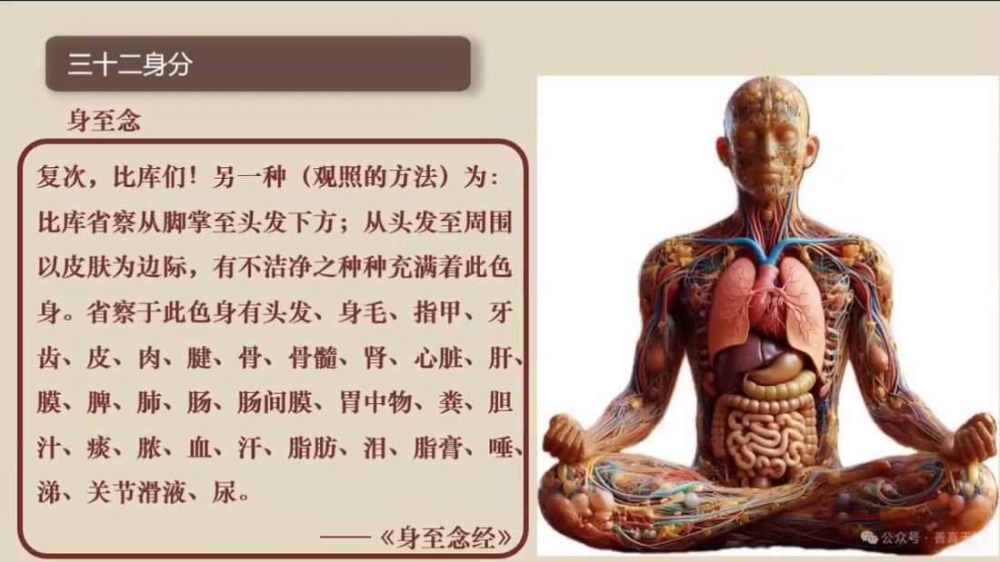
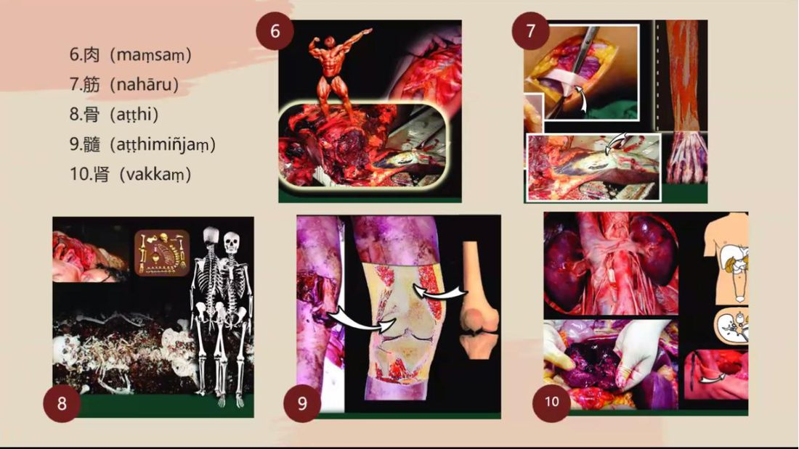
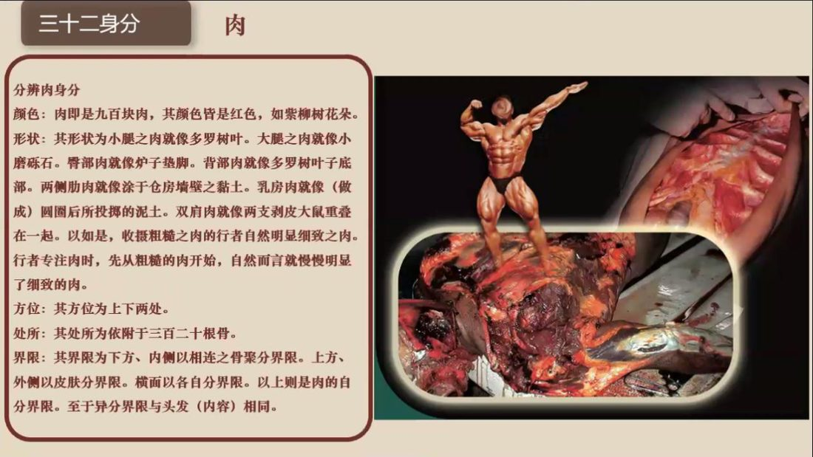
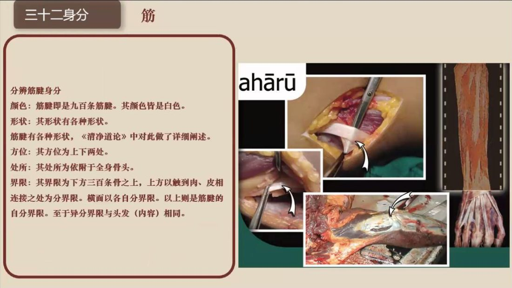
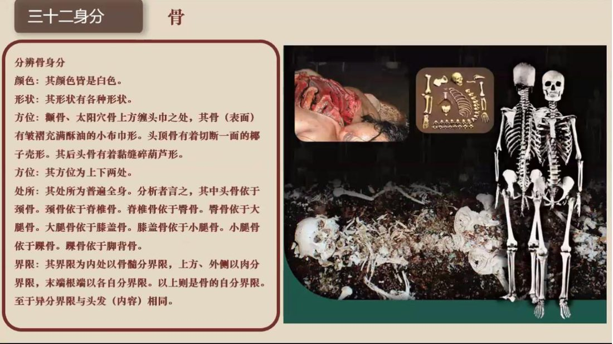
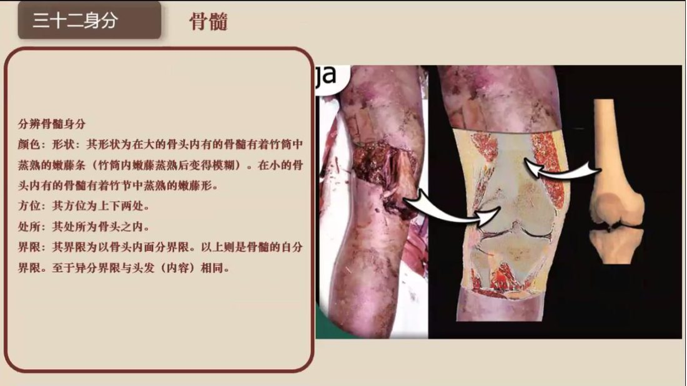
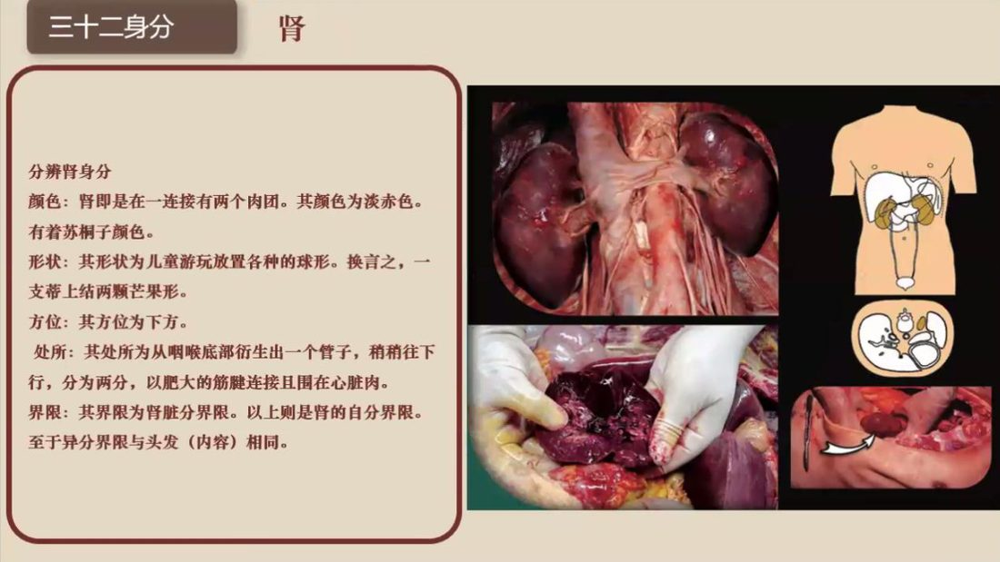

📅 最近更新：2026-09-29 12:30　|　第5版精修（朗读优化版）

# 第1周：总论与第一·二组身分（主持人版）

> ⭐ **本讲主持人速览**（新主持人必读，2分钟看完）
>
> 你不是老师，是"共学同行者"。你不需要提前懂内容，只需要按流程走。
> **本周由连续两周内容合并**而成，含两段共读、两轮分享与两轮讨论，单讲 120 分钟。
>
> | 环节 | 标准时长 | ⏱ 时间不够→ | ⏱ 时间富余→ |
> |:-----|:----:|:-----|:-----|
> | 🧘 静心开场 | 10 min | 缩至5 min | 加2分钟静坐 |
> | 📖 共读原文1 | 20 min | 只读★核心段（约15 min） | 加读◈扩展段 |
> | 💬 第一轮分享 | 10 min | 每人1句话 | 每人3分钟 |
> | 🎯 第一轮主题讨论 | 10 min | 只讨论问题① | 讨论全部问题+扩展 |
> | 🧘 禅修练习 | 15 min | 缩至8 min（只念引导词前半） | 延长至20 min |
> | 📖 共读原文2 | 20 min | 只读★核心段 | 加读◈扩展段 |
> | 💬 第二轮分享 | 10 min | 每人1句话 | 每人3分钟 |
> | 🎯 第二轮主题讨论 | 10 min | 只讨论问题① | 讨论全部问题+扩展 |
> | 🔚 收尾与回向 | 15 min | 缩至10 min | 保持 |
>
> **主持人10条守则（精简版）**：
> ① 不讲解、不提供答案——让原文自己说话；② 有人问"正确答案"→说"先听听大家的看法"；③ 冷场→主持人先分享自己的真实感受；④ 跑题→温和拉回："这个有意思，我们回到今天的原文"；⑤ 争论→"两种看法都很好，大家保留自己的理解"；⑥ 确保人人发言；⑦ 不评判任何人的分享；⑧ 时间到了就推进；⑨ 禅修练习照读引导词即可；⑩ 结束一起回向。

> 本周主题：**从「我」到「三十二个零件」——看清「身至念」的定义、出处与六组划分；五种分辨法与八类修习利益，分别留待本系列第 5、7 周细讲。**；**从「皮囊」看到「骨头」，用颜色·形状·方位·处所·界限五种分辨法，把第一组与第二组的十个身分一一「可验」——不是在想象里造一个身体，而是把已经存在的这个身体看清。**。

---

## 📋 本周信息卡

| 项目 | 内容 |
|:----|:-----|
| 时长 | 120分钟（4周版 · 9环节） |
| 核心问题 | 什么是「身至念」？三十二身分出自哪部经、分成哪六组？「可厌」与「厌恶」差在哪里？ |
| 共读原文 | 共读原文1：材料①《18_三十二身分1-古源尊者-20250122（录音）》。　｜　共读原文2：材料①《19_三十二身分2-古源尊者-20250123（课件）》。 |
| 本周作业 | ①每日静坐后，把三十二身分六组名单抄读一遍；②选一个身分（建议从「头发」开始），用「颜色／形状／方位／处所／界限」任意两栏写一句观察体会。看得清、看不清、对不上，都可以写。 |

## 🧘 静心开场（10 min）

**开场准备与氛围（会前 10 分钟完成）**

> 1. **环境**：灯光柔和（不要顶灯直射），通风但不直吹，手机静音并集中放置；座位围成圆形或半圆，让每个人都能看见「别人的身体也是身体」，但视线不必互盯。
> 2. **坐姿三选**：①坐垫（盘腿或散盘，膝盖不适者用两个垫子）；②椅子（双脚踏实、背不靠死，可垫小枕）；③跪坐（备垫子）。开场就说明：**「哪一种都好，中途可以换，换姿势不是失败。」**
> 3. **物**：备水（本周涉身体观察，有人会口干）、面纸、薄毯（有人观察时体温会下降）。
> 4. **开场三句话（先讲纪律，再进引导）**：①「全程 120 分钟，中途可自由起身、可去喝水。」②「本讲会谈到身体里的东西，任何人随时可以选择**只听不说、只取一处、随时暂停**，这是我的承诺。」③「**我们在这里只谈自己看到什么，不谈别人的事、不评断任何人。**」
> 5. **主持人自己的准备**：会前 5 分钟静坐，把三十二身分的**六组名单**在心里过一遍，并确认自己能把「可厌＝不可喜，不是厌恶」这句话用一句白话讲出来。**主持人心里稳了，场子就稳了。**
> 6. **不做的三件事**：不布置「必须看到什么」；不要求成员报告观察结果；不在开场引入医学、解剖学的知识补充（器官观察≠医学）。
> 7. **静心阶段的三层节奏（主持人心里有数）**：第一层「松身体」（约 2 分钟）——呼吸、放松肩颈、下巴、眉心；第二层「收心思」（约 3 分钟）——把未完成的事「打包扔掉」，给心按清零键；第三层「带问题」（约 3 分钟）——把「我真的看过这个身体吗」轻轻放进心里。最后 2 分钟留给静默，**不急着开口**。
> 8. **会前主持人独处三分钟（照做）**：找个角落坐下，放下手机，做三次深呼吸，心里默念三句话——①「今晚我只带路，不评判」；②「可厌＝不可喜，不是厌恶」；③「看得清、看不清，都算数」。带着一张安稳的脸进入场地。**主持人的脸，就是全场的定心锚。**
> 9. **开场前先在心里划好本讲的边界（主持人参考）**：本周只带大家看「定义、出处、六组」这一张地图；**第1讲录音 [00:16:31]–[00:33:29] 段（五种分辨法、十种作意善巧、两喻、五种可厌、八类利益）归本系列第5、7周使用（本讲不取）**。若有人在开场或共读中提前问到这些，只回一句方向话——「**这个我们留到第 5、7 周专门讲**」——**不展开、不硬讲、不引原文**。心里有这条边界，场上就不会被「越问越深」带跑，也不会把后面周次的材料提前讲空。
> 10. **本周的「温度」设定（主持人参考）**：这是一门「看清自己」的功课，不是「修理自己」的功课。开场与全场，请把语气的温度定在「**好奇、宽松、不评判**」——你越不急，成员越敢看；你越稳，成员越安心。**不要把「不净」念成一种道德审判，也不要把「可厌」念成一种处罚**；「可厌」只是「不可喜」，是去掉一层美化滤镜而已。

**主持人引导语**（照读即可）：

> 各位贤友，请找一个让自己舒服的姿势坐好，背自然挺直，双手轻轻放在腿上，眼睛可以微微闭上，也可以垂目看着前方一小块地面。
>
> 先做三次深长的呼吸：吸气，知道自己在吸气；呼气，知道自己在呼气。让肩膀松下来，让下巴松下来，让眉心松下来。
>
> 现在，把注意力轻轻带到「坐着的这个身体」上——你能感觉到身体的重量、接触坐垫的压力、呼吸进出时的起伏。这个身体，就是今天我们要一起看的课本。它不用买、不用借，从出生到现在一直带着，还从来没有好好看过它一遍。
>
> 心里也许还挂着今天未完成的事。不赶它们走，只是跟它们说：等一下再说。我们先给心按一下清零键——不是把念头压下去，而是先把纠结、期待、担忧「打包，扔掉」。心松了，身体才会松；心不松，身体松一会儿又会紧起来。
>
> 好，我们保持轻松、开放的觉察，带着一个问题来开始今天的共读：**我每天说「我的身体」，可我真的看过它吗？它到底是「我」，还是一堆我一直没认真看过的零件？**……不必急着回答，只是把它轻轻放在心里。

> 主持人：本段第 3、4 段的意思呼应材料① [00:00:03]「通过对自己身体的……部位的观察……看到自己……色身本身的这种不净，和去除对自己身体的贪爱，以及对他人身体的贪爱」；照读即可，语速放缓，句间停顿两拍。开场只做「安静」与「说明纪律」，不做任何身体内部的具体观察，把「可退出」的话先讲在前头。

> 💬 **破冰｜3–5分钟**：说说看：你有没有认真看过、也想过自己的身体？它是熟悉，还是陌生？

> 🛡️ **心理安全三约定**（每次开场在心里过一遍）：① **保密**——这里说的话不出这间屋子；② **不评判**——不评价任何人的分享，也不急着评价自己；③ **可随时暂停**——任何时候觉得不舒服，都可以停下来休息、喝水或离开，不需要解释。

## 📖 共读原文1（20 min）

### 原文材料①：★核心·《18_三十二身分1-古源尊者-20250122（录音）》

- **文件**：《18_三十二身分1-古源尊者-20250122（录音）》

> ⚠️ 主持人操作：本讲**只就材料①第1讲录音取三段（[00:00:03]–[00:16:31]），时间码段不越界**。**30 分钟内可读必读一段（第二段），选读段只挑 3–4 句念**。建议：①先读《身至念经》引文与六组名单（第二段）作为总纲，**这一段必须读完**；②第一段（地位·作用·释义）挑开头两三句念；③第三段「顺逆序念诵」只挑「从头发一直到脚底，从脚底一直回到头发」一句念，说明「要顺着背、也要逆着背」。**第1讲录音 [00:16:31]–[00:33:29] 段（五种分辨法、十种作意善巧、水井喻与多罗树·猕猴喻、以「头发」为例的五种分辨法与可厌、八类利益）归本系列第5、7周使用（本讲不取），本周不照录、不照读、不预告细节。**（注：本讲只照录材料①录音；材料②课件因与读书会03第5周同文件，本系列不作共读，仅在文末《📖 延伸阅读》列出。）**

#### 一、导入：身至念的地位、作用与释义（[00:00:03]–[00:02:15]）

> [00:00:03.540] 好，今天我们来学习一下三十二身分。三十二身分，也是身至念，那也是不净。所以三十二身分的作用，他就是通过对自己身体的像这个部位的观察，然后看到自己这个色身本身的这种不净，和去除对自己身体的贪爱，以及对他人身体的贪爱。哎呀。诶，怎么一直有个回音。我自己的回音已经关掉了，怎么还有？这个是。我的。杨文旭。这有什么特别？什么？两，两科。
>
> [00:01:56.540] 那什么是身至念呢？身至念的巴利语叫卡亚嘎达萨蒂。kāya 即色身（身）；gata 呢，是「至／到达」的意思，sati呢，是正念，你正念的到达自己的色身，叫身至念。

#### 二、《身至念经》经文与六组划分（[00:02:15]–[00:07:47]）

> [00:02:15.920] 有佛陀在身至念经中提到，复次，比库（对此身）省察：从脚掌以上、头发以下。从头发至周围，以皮肤为边际，有不洁净之种种充满之此身充满着此色身，请察于此色身中有头发、身毛、指甲、牙齿、皮肤。肉、肌肉、筋腱、骨头、骨髓、肾、心脏、肝膜、脾、肺、肠、肠间膜、胃中物、粪、胆汁、痰脓血汗、脂肪类、膏脂、膏脂、唾液、鼻涕、关节滑液、尿。
>
> [00:03:04.100] 那这里面呢，主要是指我们身体固体的。为主的部分和液体为主的部分。这个。也就是以地界为主和水界为主的部分。那风界部分和火界部分呢，加在一起呢，是形成四十二身分，那这个因为它不能够被很清晰的观察，所以呢，在三十二身分里面呢，就没有把它包含在内。
>
> [00:03:44.540] 那在清净道论里面呢，这个。这个。是把身至念呢，分成六组了。六组呢，前面四组呢，都是以地界为主的，地界的特相为主的，所以我们记住的时候就第一组，头发，身毛，指甲，牙齿皮肤。第二组呢，是肌肉，筋腱，骨头，骨髓，肾。第三组呢，是心肝膜脾肺。第四组是肠，肠间膜，胃中物粪大脑，脑就是。第五组呢，是胆汁痰脓血汗，脂肪。
>
> [00:04:25.620] 第六组呢，是眼泪膏脂。眼泪指的是什么？这个膏脂呢，是指我们会渗透到毛孔外面那个油油的东西。唾液，唾液就是白白的唾液鼻涕，关节滑液尿。那么这个唾液呢，跟这个痰呢不同，痰就是那个浓痰，黏黏的那个痰。唾液呢，它就是清的，但是白色的口中的那个唾液。
>
> [00:04:58.220] 那再一个呢，不大可能一些人不是很了解的就是这个膜，这个膜。这个膜呢，有包括三个地方。一个呢就是皮肤，我们皮肤以下在肌肉以上的那一层筋膜。那一层筋膜到死的时候呢，这个它是是很明显的，活体的时候很明显。所以大家如果以后修完世界，
>
> [00:05:28.215] 这个入出息念第四禅开始修三十二身分。它那个活体的膜呢，它就很清晰。
>
> [00:05:36.580] 那第二个膜呢，是指心脏的瓣膜，心脏的包膜。也就是我们经常讲的心包，心脏外面包着一层膜。那第三个膜呢，是讲那个肾，我们的肾脏的外面也包了一层膜。所以这个膜呢，包含了三种膜。
>
> [00:05:59.640] 好，那么要学这个三十二身分呢。在清净道论里面教导了七种学习的善巧。那。分别是什么呢？就是。用口念诵，用心作意。取不同颜色标记，以形状标记，以方位标记，以处所标记，以界限标记。那也就是说我们要学清净道论呢，
>
> [00:06:31.120] 就学三十二身分呢，首先对三十二个身分的这些名称。我们要清楚，到底是哪三十二个身分？第一组是以皮肤为第五的身分结尾。就是头发这个发毛，我们讲发毛爪齿皮。第二组呢，是以肾为结束的。这个五组，叫肉筋、骨髓、肾。第三组呢，是以肺为结尾的，这些心肝膜脾肺。第四组呢，是以脑为结尾的，就肠、肠间膜胃中物，粪脑。
>
> [00:07:12.060] 那么根据注疏呢？这在这个组别中，把脑作为一项列入其中。这个四个组别呢，每个都有五个身分，总共二十种身分，属于四大，就以四大的为主的身分。那也有一些经典呢，大脑并没有被列进去，但不影响。
>
> [00:07:35.480] 第五组呢，是以脂肪为第六的身分、结尾，就胆胆汁痰脓血汗脂肪。那么这里的脓呢，如果你现这个身体现在没有脓呢，就是取过去曾经化脓的那个脓，作为对象。第六呢，是以尿为结尾的，就是眼泪、膏脂鼻涕、唾液、关节滑液、尿。

> 主持人：第二段是本周总纲，**照读后停 10 秒**，然后主持人用白话点一次六组（见下方「主持人精讲」）。转写把「三十二身分」听成「三色生分／三者身份」，把「地界（四大之一）」听成「B大」，把「脓」听成「龙」，把「脂膏」听成「膏脂」；照读时可直接跳过不通的句子，不必逐字念讹字。

#### 三、地界四组／水界两组、顺逆序念诵与分别论注释念诵法（[00:07:35]–[00:16:31]）

> [00:08:01.040] 所以第五组跟第六组是水大的身分为主，就总共是十二种。
>
> [00:08:09.900] 所以首先呢，我们要能够清楚，三十二身分的分组，并且以顺顺序逆序两种来记忆并口诵。就是就像我们早上，有三十二身分练冲，从头发一直到脚底，然后从脚底一直在头发，就是顺顺着练和逆着练都要会。
>
> [00:08:37.160] 那举个例子说，第一组身分念诵呢，先以顺序的方式念诵头发、身毛、指甲、牙齿、皮肤，再以逆序的方式练诵皮肤、牙齿、指甲、身毛、头发，就是来回的这样的去观察。第二种身分呢，就是肉筋骨髓，肾，那再以逆序的方式念诵。这个不单单是念诵，这五个身分呢，还要把皮肤等五个身分。一起加进去，就是十个身分，肾骨髓。骨筋腱，肉、皮肤，牙齿、指甲、身毛、头发，就是这个。第二组的这个「顺、逆（序念诵）」了，也就是说，从第一组开始，然后后面再加的时候，都把前面一起加进去。
>
> [00:09:37.780] 那第三组呢，就是发毛，爪齿皮肉筋骨，所以心肝膜脾肺。好，然后逆着上去呢，就是肺脾膜，肝心，肾髓骨筋肉，然后皮齿爪毛发，就是一一个个的往上加。
>
> [00:10:00.080] 第四组呢，那就是它虽然是肠、肠间膜胃中物，粪脑。然后先把这一组练习好了。好，两个（都念到）脑。粪、胃中物、膜、肠这一组熟悉完以后呢，那再把前面的加进去。发毛爪齿，皮肉筋骨髓于肾心肝膜，脾肺肠、肠间膜胃中物粪便大脑然后在大脑粪便胃中物肠、肠间膜、肠，肺脾膜肝心，肾髓骨筋肉，皮齿爪毛发。好，那么这个是这四组呢，就是四大为主的了，四大的特项为主的，

## 💬 第一轮分享（10 min）

**分享规则（开场先说明，约 2 分钟）**

> 各位贤友，接下来是自愿分享的环节。规则很简单，就四条：
> 第一，**自愿为限**，不想说完全可以不说，坐着听也是一种参与；主持人不点名。
> 第二，每人 **2–3 分钟**，我会轻轻地举手提示时间，不是催你，是让每个人都有机会。
> 第三，**不说别人**。可以谈自己的观察、自己的困难，不评价他人的修行，也不替别人下结论。
> 第四，**不辩论**。有人说的和原文不一样，不必当场纠正；记录下来，交给原文与各自的观察去回答。
> 还有一条软提醒：**今天只谈「我看过我自己什么」，不谈「别人身上是什么」。**

**起手问题（挑 2–3 个，先小组再大组）**

> 1. 第一次听到「三十二身分」，你的第一反应是什么？（有人觉得新鲜，有人觉得「有点恶心」，有人说「这就是解剖学」——都很好，先让反应出来。）
> 2. 今天读到的《身至念经》经文说「从脚掌至头发下方，从头发至周围以皮肤为边际」——**你有没有过某一刻，真的「看过」自己身上某一个零件？**（例如剪指甲时、掉头发时、看牙时。）
> 3. 「去除对自己身体的贪爱，以及对他人身体的贪爱」——这句话你听了，心里是**松**，还是**紧**？为什么？
> 4. 今天我们只读了「定义、出处、六组」这三样，「怎么看、有什么用」要留到第 5、7 周——**你是期待，还是着急？**（先把「着急」说出来，主持人再说明「按次第来，不贪快」。）

> 主持人：第 1 题是「破冰」，接受一切反应，不做对错；第 2 题把话题落到「具体经验」，避免空谈；第 3 题是本周心理安全的前哨，若有人答「紧」，正是说明「可厌被误读为厌恶」，**这正是本周要一起澄清的重点**，先记下，留到主题讨论与特别提醒里回应。

**分享记录建议（主持人参考）**

> 准备一张纸，分三栏记：①「成员提到的原话关键词」；②「大家重复出现的困惑」；③「留到主题讨论或下周的问题」。**只记关键词，不记人名**；若必须指涉，用代称（如「甲贤友」）。记录只用于本周共识与下周交接，**不外传、不引用到别的场合**。
> 常见困惑预判（提前想好答复口径）：①「这不就是解剖学？」——答：解剖学看的是「物」，这里看的是「心与身的关系」，重点是去贪，不是记结构。②「我看了会怕。」——答：那就先不看，或只做「抄名单」；你有全部选择权。③「我妈病重，还让我看身体？」——答：先照顾人，绝不与病痛对抗；照护本身也是修。

**分享环节的主持人参考提醒**

> 本周的分享里，最可能出现两种反应，主持人先想好怎么接：①有人说「听着挺有意思」，那很好，请他说具体一点（比如「六组里哪一组你最有感觉」）；②有人说「有点怕／有点不舒服」，**这更要紧**——先肯定他「说出来很好」，再重复三句承诺：**可以只听不说、可以只取一处、可以随时暂停**；**绝不追问「你为什么不舒服」**，也不做心理分析、不下诊断。若有人想「跳过去」，主持人只需接一句「**跳过去完全可以，今天先记住名字就够了**」。分享只谈自己、不谈别人；不辩论、不纠错。**一场顺利的分享，不是『大家都说得多』，而是『每个人都觉得安全』。** 另外记住：今天分享的话题若自然滑向「五种分辨法／修了有什么用」，主持人**不接细节**，一句「**这个留到第 5、7 周**」轻轻拉回即可。

## 🎯 第一轮主题讨论（10 min）

> 主持人：三问由浅入深，指向实修；建议「小组 8 分钟＋大组归拢 5 分钟」三轮，最后一轮可由主持人收束。每问给一句「提示」，避免冷场；不追求「标准答案」。

**第一问｜定义与出处：为什么叫「身至念」？（提示：kāyagatāsati ＝ 色身＋到达＋正念）**

> 提示语：材料① [00:01:56] 说，身至念的巴利语叫「卡亚嘎达萨蒂」——「卡亚」是色身，「嘎达」是到达，「萨蒂」是正念，合起来是「到达自己色身的正念」。**问题**：日常我们会「到达」很多东西（手机、工作、关系），却常常到不了自己的身体。**如果「身至念」就是「心真的回到这个身体」，你觉得「回不去」通常卡在哪里？**（预期方向：心向外跑、把身体当成「我」而不去看、忙。主持人不给结论，只让人说。）
> 收束一句：**身至念不是「多一样功课」，而是「心从别处回来」。**

**第二问｜六组划分：为什么先分「地界为主」与「水界为主」？（提示：固体＝地界，液体＝水界；四组二十＋两组十二）**

> 提示语：材料① [00:03:04]–[00:04:25] 把三十二身分分成六组，前四组以地界（固体）为主、后两组以水界（液体）为主。**问题**：这样分有什么好处？**如果让你把「自己的身体」分成「硬的部分」和「流的部分」，你会怎么分？**（预期方向：先分类，才看得清；分类是「拆解」不是「切割」；硬—骨肉，流—血汗尿等。）主持人可补一句：**分类是为了看得清楚，不是为了把身体切成敌人。**
> 收束一句：**先把「一整个我」拆成「六组零件」，是看清的起点，不是讨厌的起点。**

**第三问｜分辨法与心理安全：五种分辨法看清之后，「可厌」到底是什么？（提示：可厌＝不可喜 asubha，不是厌恶）**

> 提示语：材料① [00:20:05] 说「心直接专注在三十二身分的厌恶相上……就是他这个不可喜」，[00:21:11] 说「它是可厌的，是可厌离的、是不可爱的」。**问题**：这里的「可厌／厌恶相」，跟「我讨厌我自己」是不是一回事？**如果看清之后，一个人越看越嫌自己、越看越嫌别人，是哪里走偏了？**（预期方向：可厌＝去掉「净／可爱」的美化滤镜，是**去掉贪着**；不是生嗔、不是自我嫌弃、不是嫌恶他人。三十二身分对治的是「贪」，同时也**征服「嗔」**。）
> 收束一句：**三句定调话——可厌＝不可喜，不是厌恶；要松的是贪着，不是嫌弃自己、也不是嫌恶别人；用功的方向是看清事实，不是加强情绪。**

> 主持人：三问结束，把「小组共识」写成 2–3 条交给记录人（建议三条：①身至念＝心回到身体；②六组＝地界四组＋水界两组，先分类才看清；③可厌＝不可喜，非厌恶）。**第 3 问若成员情绪明显起伏，随时启用「只听不说／只取一处／随时暂停」的选项。**

**三问的「追问」备选（冷场或太顺时用）**

> - 第一问的追问：「如果今晚回家，你只做一件事让心回到身体，你会做什么？」
> - 第二问的追问：「把身体分成『硬的』与『流的』两类，你觉得哪一类你更陌生？为什么？」
> - 第三问的追问：「请举一个例子——你哪一次『看清事实』，其实不小心变成了『嫌弃自己』或『嫌弃别人』？」
> - 收束追问（三问共用）：「听完今天，你更愿意把身至念当成『一门功课』，还是『一条回家的路』？」
> 追问只为打开话头，**不设标准答案**；有人答得「不对」，也只是他此刻的实况，记录即可。

**三问的「本讲口径」收束（主持人参考）**

> 三问做完，主持人用三句话收束，并**明确划出本讲的边界**：①**今天的三问都围绕「定义、出处、六组」**——这是本周的全部任务；②**没问到的部分不是不重要，而是排期在后面**：「五种分辨法」在第 5 周、「五种可厌与顺逆序」在第 6 周、「八类利益」在第 7 周——**第1讲录音 [00:16:31]–[00:33:29] 段归本系列第5、7周使用（本讲不取）**；③**如果今天有人把问题「越界」了**（例如「怎么取相」「怎么修到四禅」），**不必也不要在本讲回答**，只需记下来，交给相应周次的主持人——「**这个问题很好，我们留到第 5 周专门讲**」。这样做不是省事，而是让**每一周都站得住、不重复、不挤压**：一周一件事，八周走得稳。

> **分层追问**（可视时间取用，由浅入深）：
> - 【现象】三十二身分的六组划分，你觉得这样分开来看，是为了什么？
> - 【影响】把身体当成「我」、或当成「很干净」，会带来哪些贪与怖？
> - 【应对】这周你愿意先熟读哪一组身分？

## 🧘 禅修练习（15 min）

### 练习一

> ⚠️ **禅修禁忌提示**：若你正处在严重抑郁、焦虑、创伤后应激，或精神类疾病的发作／用药期，或正经历强烈的情绪危机，请先咨询医生或心理师，再决定是否练习；练习中若出现明显不适（如心悸、胸闷、情绪失控），请立即停止，睁开眼睛，把注意力放回呼吸与身体，必要时离场休息。

**本周练习：三十二身分「六组点名」＋「头发」一处的初体验（照读即可）**

> 各位贤友，请坐好，背自然挺直，眼睛轻闭或垂目。
>
> 我们先做三次深呼吸……让身体松下来。今天我们不急着「看里面」，只做两件很简单的事。
>
> **第一件：把三十二个「零件」的名字，像点名一样在心里过一遍。** 不用看清，只要知道有这些名字——
> 第一组：发、毛、爪、齿、皮；
> 第二组：肉、筋、骨、骨髓、肾；
> 第三组：心、肝、膜、脾、肺；
> 第四组：肠、肠间膜、胃中物、粪、脑；
> 第五组：胆汁、痰、脓、血、汗、脂肪；
> 第六组：泪、脂膏、唾、涕、关节滑液、尿。
> ……好，这就是我们这个身体里的「三十二位」。它们一直都在，只是我们很少点名。
>
> **第二件：只取「头发」一处，练习「五种分辨法」的前两栏。** 感觉你的心从心脏那里轻轻往上看，看到头顶上的一片头发。
> ——看它的**颜色**：黑、褐、黄、白，是什么就是什么，不修饰；
> ——看它的**形状**：一根一根，细细长长，像丝线。
> 停在这里就好。**看得清、看不清，都算数**；不清楚的，就让它模糊着，一样可以坐着。
>
> 心里如果冒出「这头发好脏」「我头发挺好看」——都只是念头，看到了，就轻轻放掉。**我们不是要把头发看成丑的，是要如实看它是什么样。**
>
> 好，最后把注意力放回整个身体，感觉坐着的重量，做一次深呼吸。……慢慢睁开眼睛。

> 主持人：本练习刻意**不涉**内脏与液体（那是第 3、4 周的内容），本周只用「头发」一处的**颜色＋形状**两栏，让成员尝到「原来可以这样看」即可。**全程允许睁眼、允许只做第一件、允许什么都不做。**若有人出现不适（头晕、心慌、恶心），立即引导其睁眼、看窗外、喝水，回到呼吸。

### 练习二

> ⚠️ **禅修禁忌提示**：若你正处在严重抑郁、焦虑、创伤后应激，或精神类疾病的发作／用药期，或正经历强烈的情绪危机，请先咨询医生或心理师，再决定是否练习；练习中若出现明显不适（如心悸、胸闷、情绪失控），请立即停止，睁开眼睛，把注意力放回呼吸与身体，必要时离场休息。

**主持人引导语**（照读即可；语速比平日更慢，每段之间默停约 10 秒）：

> 各位贤友，请把身体调整到一个自然坐好的姿势：骨盆稳稳地坐实，腰自然挺直但不僵，肩膀放松，双手轻轻放在腿上。头部像气球一样轻轻向上飘，让下巴微收。
>
> 先做三次深呼吸……吸气，知道自己在吸气；呼气，知道自己在呼气。然后把注意力放到「坐着的这个身体」，感觉它的重量、它的温度、它和坐垫接触的压力。这个身体，就是我们今天要看的课本。
>
> 现在，我们按顺序，一个身分一个身分地「知道」它。不需要造出影像，只要知道它在这里，就已经是看了。
>
> 第一个，**头发**。头顶的头发，颜色黑褐，长在头皮上，它的位置在头部。你不需要去想象每一根头发，只要知道：头发在头顶，我知道。
>
> 第二个，**身毛**。全身的体毛，除了脚掌和手掌没有，其他每一个部位都有汗毛。皮肤上这些细小的毛，我知道。
>
> 第三个，**指甲**。十个手指甲，脚趾甲。摸一摸指尖的硬处，它是指甲。指甲在指端，我知道。
>
> 第四个，**牙齿**。上下两排牙齿，正在咬合。它在你口中，我知道。
>
> 第五个，**皮**。全身的皮，从头顶到脚底，把整个身体包在里面。外侧是虚空，内侧是身体。**皮，是我和世界之间那一层很薄的界限。** 我知道。
>
> 好，第一组五个身分，到这里。尊者的原话是：「知道可验就可以了，有可验感就可以了；并不需要去重复加强。」如果你刚刚有几个身分对不上，完全没关系，**不清楚的就跳过去**。
>
> 接下来，我们往里面看第二组。
>
> 第六个，**肉**。皮的下方是肉，红色的肉，遍布全身——头部、颈项、肩膀、手臂、前胸、后背、臀部、腿部。先从粗的知道起：这裡有一块肉，我知道。
>
> 第七个，**筋**。肌肉的周边、各种关节的周围，有很多白色的筋腱。像网一样遍布全身，细的像藤条，其他的像琴弦。它附着在全身的骨头上。筋腱，我知道。
>
> 第八个，**骨**。再往里面是骨头。全身三百多块骨头，从头骨到脚骨。头骨依着颈骨，颈骨依着脊椎骨，脊椎骨依着臀骨，臀骨依着大腿骨，一路往下到膝盖骨、小腿骨、踝骨、脚背骨。**没有任何一块骨头是自己独立站着的。** 骨头，我知道。
>
> 第九个，**骨髓**。骨头里面是骨髓。在大骨头里，它像竹筒中蒸熟的嫩藤——本质是白色，因为里面有血液，平常看是红色。骨髓，我知道。
>
> 第十个，**肾**。腰部的后方有两个肾，淡赤色，像一支蒂上结着的两颗芒果，外面包着一层膜。肾，我知道。
>
> 好。现在，我们把两组合起来，做一个总的「知道」：**外面是皮，里面是肉、筋、骨、骨髓、肾。这里面，外面，都是这个身体。** 尊者说：「可以两组结合起来观察。」你就这样知道一遍，不必强化，也不必反复确认。如果心里浮起了什么，不赶它，轻轻回到「我知道」这三个字上。
>
> （默静 2 分钟）
>
> 最后，把注意力回到呼吸上三次：吸气……呼气。感觉一下此刻的身体，感觉一下此刻的心。
>
> 如果刚才在观察中出现了任何不适、紧张、心慌，那是身体在提醒我们「太快了」。**可以睁开眼睛，看看四周，喝口水，或者只做「皮」这一处。** 观察身体是为了更清明、更放松，不是为了忍耐。我们用一个安稳的心，把今天的练习收下来。

> 主持人：本段引导词的骨架来自材料②的现场引导（[00:03:02] 坐姿、[00:06:57]–[00:20:54] 十身分顺序、[00:25:03] 两组结合观察），但**引导语为本周整理稿**，不是原文照录；文中若干白话比喻（如「没有任何一块骨头是自己独立站着的」）为帮助理解的整理表述，朗读时可直接使用，也可按现场情况简化。练习结束后**不做体验分享、不追问感受**，只接着进入收尾。

**（时间富余时的加练：顺逆序试念，5 min）**
> 若时间宽松，可加一段「顺逆序」的尝试（本周只做「试念」，不作为练习要求）：**顺序**：发→毛→爪→齿→皮→肉→筋→骨→骨髓→肾；**逆序**：肾→骨髓→骨→筋→肉→皮→齿→爪→毛→发。先由主持人慢速带两遍，再让成员自己心里过一遍，**不要求记住、不要求在会场背出来**（顺逆序与可厌作意的完整修法在第6周才展开）。若成员明显觉得吃力或不适，立即停止，回到呼吸。

## 📖 共读原文2（20 min）

> 主持人：本周两个材料是**同一讲（2025-01-23 第2讲）的两种载体**——材料①课件是「五分辨法」的文字底本，材料②录音是「怎么看」的口述示范。建议**交叉读**：先读材料①的经文引文与「皮」段，再读材料②[00:06:57]–[00:09:51]（第一组复习），接着读材料①的肉／筋段与材料②[00:09:51]–[00:14:24]，依此类推。这样「纸上的五栏」与「口头的怎么看」就能对上一次。

### 原文材料①：★核心·《19_三十二身分2-古源尊者-20250123（课件）》

- **文件**：《19_三十二身分2-古源尊者-20250123（课件）》

> ⚠️ 主持人操作：全课件约 3,160 字原文（含经文引文、六段分辨文与回向），**30 分钟内可读完全部原文，但不必逐字念**。建议：①先读《身至念经》引文（三十二身分名单）作为总纲；②再逐段照读本讲六个身分的分辨文，**每段照读后停 10 秒**，让成员在心里「对一遍」；③每段末句「至于异分界限与头发（内容）相同」第一次读全，之后几段可略读；④回向与巴利文可在收尾时随回向环节一并念。**（注：本课件未含 发／毛／爪／齿 四身分的分辨段，该缺口由材料②口述补足，见材料②缺口注记。）**

> **【照录·课件原文，逐页逐字】**
>
> #   百花古寺2025百日禅
>
> #   三十二身分
>
> 古源如应讲述
>
> 2025年1月
>
> #   三十二身分
>
> #   身至念
>
> 复次，比库们！另一种（观照的方法）为：比库省察从脚掌至头发下方；从头发至周围以皮肤为边际，有不洁净之种种充满着此色身。省察于此色身有头发、身毛、指甲、牙齿、皮、肉、腱、骨、骨髓、肾、心脏、肝、膜、脾、肺、肠、肠间膜、胃中物、粪、胆汁、痰、脓、血、汗、脂肪、泪、脂膏、唾、涕、关节滑液、尿。
>
> ——《身至念经》
>
> #   三十二身分
>
> #   皮
>
> #   分辨皮肤身分
>
> 颜色：皮肤即是覆盖全身之外厚皮。其外厚皮上方有黑、褐、黄颜色薄皮。薄皮从全身脱下堆积之后仅有枣核子一般大。外厚皮之颜色是相同的。覆盖外厚皮因为被火烧、被武器所伤，破皮之际可以看到里头的皮，很明显。
>
> 形状：其形状为全身形状。以上则是略过罢了。
>
> 方位：其方位为上下两处。
>
> 处所：其处所为全身覆盖。
>
> 界限：其界限为下方、内侧乃以所处之外分界限，外侧以虚空分界限。以上则是皮肤的自分界限。至于异分界限与头发（内容）相同。
>
> 6.肉 (maṃsaṃ)
>
> 7. 筋 (nahāru)
>
> 8.骨 (atthi)
>
> 9.髓 (atṭhimiñjaṃ)
>
> 10. 肾 (vakkaṃ)
>
> #   三十二身分
>
> #   肉
>
> #   分辨肉身分
>
> 颜色：肉即是九百块肉，其颜色皆是红色，如紫柳树花朵。
>
> 形状：其形状为小腿之肉就像多罗树叶。大腿之肉就像小磨砾石。臀部肉就像炉子垫脚。背部肉就像多罗树叶子底部。两侧肋肉就像涂于仓房墙壁之黏土。乳房肉就像（做成）圆圈后所投掷的泥土。双肩肉就像两支剥皮大鼠重叠在一起。以如是，收摄粗糙之肉的行者自然明显细致之肉。行者专注肉时，先从粗糙的肉开始，自然而言就慢慢明显了细致的肉。
>
> 方位：其方位为上下两处。
>
> 处所：其处所为依附于三百二十根骨。
>
> 界限：其界限为下方、内侧以相连之骨聚分界限。上方、外侧以皮肤分界限。横面以各自分界限。以上则是肉的自分界限。至于异分界限与头发（内容）相同。
>
> #   三十二身分
>
> #   筋
>
> #   分辨筋腱身分
>
> 颜色：筋腱即是九百条筋腱。其颜色皆是白色。
>
> 形状：其形状有各种形状。
>
> 筋腱有各种形状，《清净道论》中对此做了详细阐述。
>
> 方位：其方位为上下两处。
>
> 处所：其处所为依附于全身骨头。
>
> 界限：其界限为下方三百条骨之上，上方以触到肉、皮相连接之处为分界限。横面以各自分界限。以上则是筋腱的自分界限。至于异分界限与头发（内容）相同。
>
> #   三十二身分
>
> #   骨
>
> #   分辨骨身分
>
> 颜色：其颜色皆是白色。
>
> 形状：其形状有各种形状。
>
> 方位：颧骨、太阳穴骨上方缠头巾之处，其骨（表面）
>
> 有皱褶充满酥油的小布巾形。头顶骨有着切断一面的椰子壳形。其后头骨有着黏缝碎葫芦形。
>
> 方位：其方位为上下两处。
>
> 处所：其处所为普遍全身。分析者言之，其中头骨依于颈骨。颈骨依于脊椎骨。脊椎骨依于臀骨。臀骨依于大腿骨。大腿骨依于膝盖骨。膝盖骨依于小腿骨。小腿骨依于踝骨。踝骨依于脚背骨。
>
> 界限：其界限为内处以骨髓分界限，上方、外侧以肉分界限，末端根端以各自分界限。以上则是骨的自分界限。至于异分界限与头发（内容）相同。
>
> 三十二身分
>
> 骨髓
>
> #   分辨骨髓身分
>
> 颜色:形状:其形状为在大的骨头内有的骨髓有着竹筒中蒸熟的嫩藤条(竹筒内嫩藤蒸熟后变得模糊)。在小的骨头内有的骨髓有着竹节中蒸熟的嫩藤形。
>
> 方位:其方位为上下两处。
>
> 处所:其处所为骨头之内。
>
> 界限:其界限为以骨头内面分界限。以上则是骨髓的自分界限。至于异分界限与头发(内容)相同。
>
>
> #   三十二身分
>
> #   肾
>
> #   分辨肾身分
>
> 颜色：肾即是在连接有两个肉团。其颜色为淡赤色。
>
> 有着苏桐子颜色。
>
> 形状:其形状为儿童游玩放置各种的球形。换言之,一支蒂上结两颗芒果形。
>
> 方位:其方位为下方。
>
> 处所:其处所为从咽喉底部衍生出一个管子，稍稍往下行，分为两分，以肥大的筋腱连接且围在心脏肉。
>
> 界限:其界限为肾脏分界限。以上则是肾的自分界限。
>
> 至于异分界限与头发(内容)相同。
>
> Idam me puññam asavakkhayavaham hotu.
>
> Idam me puñam nibbänassa paccayo hotu.
>
> Mama puñña-bhāgam sabba-sattānam bhājemi.
>
> te sabbe me samaµpuñà-bhāgam labhantu.
>
> 愿我此功德 导向诸漏尽
>
> 愿我此功德为证涅槃缘
>
> 我此功德分回向诸有情
>
> 愿彼等一切同得功德分
>
> Sādhu! Sādhu! Sādhu!

> ⚠️ **缺口注记（材料①）**：本课件仅含 **皮、肉、筋、骨、骨髓、肾** 六个身分的「分辨（五法）」段；**发（头发）、毛（身毛）、爪（指甲）、齿（牙齿）** 四身分的分辨段**未包含在本课件内**（备课稿页码序列显示第 6–10 项为肉、筋、骨、髓、肾，前五项身分页疑为图形页／未转出文字）。此四身分的可验内容由**材料②录音 [00:06:57]–[00:08:40] 段**口述补足。缺口如实注明，未作任何补写。

## 💬 第二轮分享（10 min）

**分享规则（开场先说明，约 2 分钟）**

> 各位贤友，接下来是自愿分享的环节。规则很简单，就四条：
> 第一，**自愿为限**，不想说完全可以不说，坐着听也是一种参与；主持人不点名。
> 第二，每人 **2–3 分钟**，我会轻轻地举手提示时间，不是催你，是让每个人都有机会。
> 第三，**不说别人**。可以谈自己的观察、自己的困难，不评价他人的修行，也不替别人下结论。
> 第四，**不辩论**。有人说的和原文不一样，我们把那句话记下来，回到原文去看，不在现场争对错。
> 我们要练的不是「讲得好」，而是**如实地说自己看到什么、没看到什么**。

**起手问题（3 个，任选 2 个先答，时间够再补第三个）**

**问题一｜本周原文里，哪一句最让你「心里一动」？**
> 提示：可以是最像画面的一句（例如「小腿之肉就像多罗树叶」「双肩肉就像两支剥皮大鼠重叠在一起」），也可以是最平淡的一句（例如「其方位为上下两处」）。不必解释为什么，先说句子，再说你心里的动静。
> 主持人可以示范一句自己的「一动」，把气氛放松：例如「我最先被『皮的界限外侧以虚空分界限』这句打动——原来我和世界之间只隔了一层皮。」

**问题二｜「皮，是我和世界之间那一层很薄的界限」——这句话在你生活里让你想到什么？**
> 提示：可以从三个方向谈——①身体的界限（不舒服、疼痛、被碰到时的反应）；②与人相处的界限（哪些是我该管的、哪些不是我的事）；③心里的界限（别人一句话就穿透了我，还是我还能守在自己的位置上）。
> 提醒：这个话题容易走到人际纠葛。若有人开始讲具体的人，主持人温和地把话拉回：「我们只谈自己那一层皮，不谈别人的。」

**问题三｜尊者在录音里说「知道可验就可以了，有可验感就可以了，并不需要去重复加强」——你生活里有没有「非要看到什么」的时刻？**
> 提示：这是本周最能鬆动执着的提问。可以谈：打坐时非要看到影像、非要「有感觉」；生活里非要某个结果、非要别人明白我。请成员注意：尊者这句话不是叫我们不用功，而是告诉我们**可验是「知道」，不是「制造」**。
> 主持人小结可用一句：**「看到就看到，看不到就还它一个看不到——两者都是可验。」**

**问题四（备用，时间宽松或分享热络时用）｜十个身分里，你最「不认识」的是哪一个？**
> 提示：这个问题常常带来最真实的分享。可以谈：筋的走向我说不上来、骨髓我完全没概念、肾我只在体检报告里见过、牙齿我从来没想过「至少三十二颗」。请成员只描述「不认识」本身，不必急着补上知识。主持人可回应：**「不认识」是一个很好的起点——本周我们不是来补齐解剖知识的，是来开始看的。**
> 若有人问「要不要去查医学书」，回答：**不必。** 本周依课件的比喻与方位来认就够了；器官观察不等于医学，两者不要混在一起。

**分享收束与过渡（主持人参考）**

> 听完大家的分享，可以用三句话收束本轮，再进入主题讨论：
> 第一句，**「今天我们都在同一件事上——原来我从来没这样看过这个身体。」**
> 第二句，**「看到多少都对，看不到也不缺；尊者说『知道可验就可以了』。」**
> 第三句，**「接下来我们要往深处问三个问题：为什么要先看颜色形状？界限要我们学什么？为什么两组要合起来看？」**
> 过渡时留意：如果刚才有成员分享了较沉重的内容（身体状况、家人病痛等），**不要在主题讨论里把它当成例子继续讨论**，只轻轻带一句「刚才某某贤友提到的事，我们把它放在心里」，然后进入原定问题。

**主持人倾听与回应提示（自用）**

1. **控时**：每人 2–3 分钟，用手机计时但不出声；时间到用手掌轻抬一下即可，不打断正在说的最后一句。
2. **回应三句法**：先「复述」——「你的意思是……我理解得对吗？」；再「肯定」——「在这一点上你已经在看自己了」；然后「交回原文」——「这一句原文是这么说的，你看和你刚才讲的对得上吗？」
3. **不诊断、不贴标签**：不说「你这是焦虑」「你这样做不对」，也不给医学建议。若谈到身体不适、疾病，只回应：「我们这里是练习观察，身体的病要看医生，两边不是一回事。」
4. **保护沉默的人**：若某位成员一直不说，可以邀请但不勉强：「某某贤友要不要说一句？一句也行，不说也完全可以。」
5. **收束分享**：用一句话总结本轮的共同点。本周常见共同点是：**「原来我以为我很懂这个身体，其实我从来没认真看过它。」** 可以把这句写在小板上。

## 🎯 第二轮主题讨论（10 min）

> 组织方式：3 个问题依次深入。每问先给成员 **3 分钟静默思考**（可以闭眼），再 **8 分钟自由发言**；每问结束由主持人做 1 分钟小结。3 问之间不跳级，前一问没谈清就多给 2 分钟，宁可少做第三问。
> 全程底线：本讲涉及身体内部（骨髓、肾等）与「可厌」话题，**任何成员都可以选择只听不说、只读一处、随时暂停**；主持人开场就把这句话讲出来。

### 引导问题一（由浅）：为什么课件每一段都先讲「颜色、形状」，再讲「方位、处所、界限」？

> **提示（主持人参考）**：
> - 先把事实摆出来：请一位成员照读「皮」段的顺序——颜色→形状→方位→处所→界限。再请一位照读「肾」段的顺序——颜色→形状→方位→处所→界限。**两段的顺序完全一样**，这不是巧合，而是方法本身：**先看清「它像什么」，再确定「它在哪里、到哪里为止」。**
> - 为什么不直接讲「它很脏、很可厌」？因为**跳过事实的感受，是情绪，不是观**。如果一上来就告诉自己「这个很脏」，那是对自己念头的暗示，不是对身体的观察；明天换个心情，看法就变了。而颜色的红白、形状的方圆、方位的高低，是**不管心情怎样都能核对的事实**。
> - 这里要把本系列的底线讲清：**「可厌」＝不可喜（asubha），不是厌恶。** 它的意思是**去掉美化滤镜**——不再给身体自动打上「美丽、干净、可爱」的标签，从而不再因贪着而起苦；它**不是**叫我们讨厌自己的身体，**更不是**叫我们嫌恶别人。有了前面颜色形状的如实观察，「可厌」才立在事实上；没有事实，只剩嫌弃。
> - 可引材料②[00:17:56]口述的口径：骨髓「藏在臭臭的肉里面」「被腥臭血液所灌溉」——这是**如实描述所处的处境**，不是为了让人厌恶而说的话。照读原文、不添加情绪词，就是本周的练习原则。
> - 若有人问：「那这样看下去，会不会变得讨厌自己的身体？」回答：**观察事实不会带来嗔，添加情绪才会。** 我们的动作只有一个——看清楚；干净与肮脏的判断，本身也是要看清的对象。

### 引导问题二（进一层）：「界限（自分界限／异分界限）」这一栏，要我们学什么？

> **提示（主持人参考）**：
> - 先解决名相。**自分界限**：这个身分自己的管辖范围。以「皮」为例——下方、内侧以所处之外为界，外侧以虚空为界；也就是「这层皮到此为止」。**异分界限**：它与别的身分交界之处。课件六段末句统一收于「至于异分界限与头发（内容）相同」，意思是**分界的口径可沿用「发」段，不必每段重讲**。
> - 请成员注意一个常被忽略的事实：**三十多种身分之所以能一个一个分开看，靠的就是「界限」。** 没有界限，皮、肉、筋、骨、骨髓、肾就会糊成一团，我们只能说「我这一团」，说不出别的。所以「界限」这一栏不是细节，而是**让观察成为可能的条件**。
> - 生活上的转译（这是本问的落点）：①**身体与身体之间是有界限的**——别人的身体不是我的领域，我的身体也不是别人的领域；②**情绪与事实之间有界限**——「他这么说」是事实，「他在看不起我」是我加上的；③**责任与代受之间有界限**——我可以关心别人，但不能替别人承担他的因果。可以问身：「本周你哪一次把界限看丢了？」
> - 主持人小结可用这句：**「看清界限，不是划清敌我，而是让每个东西各就各位。」**
> - 提醒：不要把「界限」谈成「疏远」或「冷漠」。原文明明白白说的是**观察的界限**；若成员引申到人际、边界感，先接住感受，再拉回「我们在练的是看得清，不是躲得远」。

### 引导问题三（指向实修）：为什么要「两组结合起来观察」？

> **提示（主持人参考）**：
> - 回到原文两处：①材料②[00:08:40] 尊者示范了第一组的「具象构形」——「先作为皮肤……出现一个圆形的皮状皮囊。然后给他装上牙齿……一个有毛发有爪的毛囊」；②材料②[00:25:03]「可以两组结合起来观察。」两处合起来看，本周的难点与答案都在这里。
> - **第一组（发·毛·爪·齿·皮）是「外面」**：看得见、摸得到，从镜子、从指尖就能对上。**第二组（肉·筋·骨·骨髓·肾）是「里面」**：平时看不见，只能依比喻与方位去认。若只做外面的第一组，我们会以为身体就是「一具还算好看的外壳」；若只做里面的第二组，容易陷入空想与不适。**两组结合，才有「里外都是这样」的完整一瞥。**
> - 结合的具体做法（照原文口径）：**由外向内、由粗到细**——先站稳在皮（我和世界之间的界限），再往里：皮之下是肉，肉之间与关节处是筋腱（如网、如藤条、如琴弦），肉与筋所依是骨（三百多块，一块依一块），骨之内是骨髓（如竹筒中蒸熟的嫩藤），最后是腰后的两个肾（一支蒂上结两颗芒果）。也可以反向：**由内向外**——从肾、骨髓、骨、筋、肉，回到皮。尊者在 [00:06:57] 说得很清楚：「你可以从先从下往上看。可以从上往下看。你也可以从后往前看。也可以从前往后看。」**顺序自由，能对上就好。**
> - 这一问的实修落点在「破整体」。我们平常把这一堆东西合称为「我的身体」，并且以此为我、为我所。**结合观察一次，就松动一点「这是一整块」的感觉**；三十多个身分逐个对上，「我的身体」这个整体感就不再是理所当然的。这与不做「整体」美化滤镜是同一条路——**先看清，再说不喜；不喜的是贪着，不是身体本身，更不是任何一个人。**
> - 若时间允许，可做 5 分钟现场演练：请成员闭眼，主持人按「皮→肉→筋→骨」慢速报四个身分，每报一个停 10 秒，成员只做「知道它在这里」的动作，不出声、不评判。演练后不追问体验，只说一句：「知道可验就可以了，并不需要去重复加强。」
> - 与后续周的接口（只预告不展开）：下周（第3周）进入**第三组：心、肝、脾、肺、膜**，处理「五藏的可厌性」；第4周走完**第四至六组（肠·肠间膜·胃中物·粪·脑／胆汁·痰·脓·血·汗·脂肪／泪·脂膏·唾·涕·关节滑液·尿）**。第5周才谈**七种学习善巧与十种作意善巧**，第6周谈**可厌作意与顺逆序**。所以本周不必急着「修出效果」，**本周的任务是把前十个身分认全、界线分清。**

**常见追问与应答**

> 本系列是**实修专修**，讨论现场最容易出现的就是「我做不出来」的焦虑。以下八问几乎每周都会被问到，请主持人先熟悉口径：**一律不承诺效果、不评价体验、不越界做医学或心理判断，把问题交回原文与「知道」本身。**

1. **「我闭着眼什么都看不见，是不是不适合修这个？」**
   → 「看不见很正常，看得见也算不上好。尊者说『知道可验就可以了』——你知道头发在头顶、知道皮包着全身，这就是可验了。**可验不是影像，是知道。**」
2. **「我看到的和课件比喻的不一样，是不是错了？」**
   → 「课件的比喻是帮助我们对上，不是标准答案。**你亲自核对到的，比比喻更重要。** 对不上就放着，不必硬改。」
3. **「顺序要不要固定？我从上往下看，别人从下往上看。」**
   → 直接引原话：「你可以从先从下往上看。可以从上往下看。你也可以从后往前看。也可以从前往后看。」**顺序自由，能对上就好。**
4. **「看久了会不会变得讨厌自己、讨厌身体？」**
   → 「观察事实不会带来嗔，添加情绪才会。**可厌＝不可喜，不是厌恶**；我们要松的是贪着，不是嫌弃自己，更不是嫌恶别人。**如果越练越厌烦自己，那是走偏了，要回来只做『知道』。**」
5. **「这跟不净观是不是一样？我听说不净观有危险。」**
   → 「方向是一致的，都属于身至念的范畴。至于方法与风险，本系列会一步一步来：**第3、4周走完身分，第5周学善巧，第6周才正式谈可厌作意与顺逆序**。今天只做前十个身分的『认清』，**不需要也不建议自己加码。**」（涉不净观整体脉络可注明「详见读书会03第5周」；涉慈心对治可注明「详见读书会02」。）
6. **「我身体某个部位有病／做过手术，观想那里会不舒服。」**
   → 「**跳过它。** 可以只做『皮』这一处，也可以只做『发』。身体的事交给医生，我们这里只练观察；两边不要混在一起。」
7. **「要不要数数字、记名字？我记不住三十二个。」**
   → 「本周只需十个身分，名字记不住就记顺序：**发、毛、爪、齿、皮、肉、筋、骨、骨髓、肾**。念到哪算哪，**不需要背给谁听**。背诵与作意善巧是第5、6周的事。」
8. **「修这个能治病／能开智慧吗？」**
   → 「我们不做这种承诺。身至念的定位是**『止→观』的桥梁**：它让心有所依、让对身体的看法变得如实。至于定力、智慧、利益，是修习自然的结果，**不是我们下手时抓的目标**；抓目标反而会障碍它。」

**分组结合观察·现场演练脚本（5 min，主题讨论第三问之后执行）**

> 请成员保持坐姿，不必盘腿。主持人按以下四步慢速引导，每步之间默停约 20 秒：
> 第 1 步｜**立外**：「先知道皮——全身的皮，把整个身体包在里面，外面是虚空。你知道它在这里。」
> 第 2 步｜**入内**：「现在就在这层皮的里面：下面是肉，红色的，遍布全身；肉之间、关节处是白色的筋腱，像网一样。」
> 第 3 步｜**依骨**：「再往里，是骨头。三百多块，一块依着一块——头骨依颈骨，一路到脚背骨。没有一块是自己站着的。」
> 第 4 步｜**合观**：「最后，把外面和里面合成一次知道：**外面是皮，里面是肉、筋、骨、骨髓、肾。** 尊者说：『可以两组结合起来观察。』就这样知道一次，不必重复加强。」
> 演练结束后**不追问体验**，只说：「知道可验就可以了。」然后进入禅修练习环节（可与禅修练习合并，省时）。

**练习分档与照护（主持人参考）**

> 本环节**只引导、不讲解**：引导词照读即可，不必临场加内容。可视现场状态在三档中选择一档——
> - **完整档（约 15 min）**：静心 2 min＋十身分引导 8 min＋两组结合 2 min＋默静 2 min＋回向 1 min。适合成员状态稳、时间充裕时。
> - **精简档（约 8 min）**：坐姿与呼吸 1 min＋第一组（发·毛·爪·齿·皮）3 min＋第二组要点（肉·筋·骨）2 min＋两组结合 1 min＋收束 1 min。适合时间紧或现场较疲惫时。**注意：精简档不要省略「皮」与「骨」两处**，它们是本周两根支柱。
> - **单点档（3–5 min）**：只做「皮」一处——全身的皮包住身体，外侧是虚空，知道它在这里；然后回到呼吸。适合有成员明显不适、或整场时间已被讨论占满时。
>
> **照护要点（务必执行）**：①引导前先说明「可随时睁眼、可只听不说」；②语速要慢，句间留白，**不要追问任何人「你看到了吗」**；③出现呼吸急促、心慌、想哭等反应，立即停止引导，请其睁眼看看四周、喝口水，**不追问原因、不做分析**；④练习结束后立刻进入收尾，**不给体验交流的时间**（体验留到个人日记与下周作业）；⑤不要在会场上让成员「报告」自己的观察结果，避免比较与压力。

> **分层追问**（可视时间取用，由浅入深）：
> - 【现象】为什么修行要从观察这些最熟悉的身体部分入手？
> - 【影响】对身体的贪爱，怎样影响你对人对己的眼光？
> - 【应对】这周你愿意怎么把「从头到脚、顺逆来回」念熟？

## 🔚 收尾与回向（15 min）

### 收尾一

**总结引导（主持人照读，约 3 分钟）**

> 各位贤友，我们今天把「地图」铺开了三件事：第一，**定义**——三十二身分是「身至念」的所缘，「身至念」就是心真的回到这个色身；第二，**出处**——《身至念经》的经文，从脚掌至头发、以皮为边际；第三，**六组**——地界为主四组二十身分、水界为主两组十二身分。至于「用哪五把尺子看」（五种分辨法）与「修了有什么利益」（八类利益），留给本系列第 5、7 周再讲，今天先不展开。
>
> 今天最值得带回家的一句话，也许是这句：**「三十二身分，是把『一整个我』，拆成三十二个我一直没认真看过的零件。」** 看清它，不是为了讨厌它，也不是为了嫌恶谁；是为了**不再被「这是我、这是我所有」的美化滤镜牵着走**。看清一点，就自在一点。
>
> 也要记得：本周我们只是「认识地图」。看不到影像、对不上细节、觉得有点别扭，都是正常的；不清楚的跳过去，明天再来看。**修行不怕慢，怕的是走偏。**

**下周预告（照读，约 2 分钟）**

> 下周是第 2 周：**第一组·第二组身分观照——发、毛、爪、齿、皮／肉、筋、骨、骨髓、肾**。我们会把本周的「五种分辨法」真正用起来，一个身分一个身分地看颜色、形状、方位、处所、界限，并学会把第一组与第二组**结合起来观察**。请各位把本周的「六组名单」继续带着，下周我们会用到它。**看不到影像、顺序记不住，都不要紧**，我们只求「看得懂、对得上」。

**成员回馈三问（约 5 分钟，每人一句，主持人记录）**

> 收尾环节也让成员把今天「带回去一点东西」。三问一人一句为限，**说的话不作回应、不作点评**，主持人只记在纸上或板上：
> 1. 今天起身时，你想带走的一个词是什么？（常见答案会是「身至念」「六组」「可厌＝不可喜」「以皮为边际」。）
> 2. 本周你打算先记住哪一组？（建议先记第一组「发毛爪齿皮」。）
> 3. 有哪一句话，你觉得以后会用得上？现在说给自己听一次。（例如「看清不等于嫌弃」。）
> 若有人不愿说，直接跳过，不留空、不追问。**不要把分享变成评估。**

**一分钟静默（约 1 分钟，照读）**

> 我们用一分钟，什么都不做，只是坐着，知道自己在坐着；知道呼吸在进、在出；知道皮在外面，三十二个零件在里面。……（默静一分钟）……好，请轻轻动一动手指，睁开眼睛。

**交接清单（散会前必做）**

**散会后三件事（主持人参考）**
> ①把「共识三条＋遗留问题」写成一行，交下周主持人；②把今天**未答上来的问题**记下，下周开场先补；③给自己 3 分钟静坐，把今天的印象放下，不带情绪离场。

**本周作业（照读，约 1 分钟）**
> 本周作业只有一件事，一句话就够：**每日静坐后，把三十二身分的六组名单抄读一遍；并选一个身分（建议从「头发」开始），用「颜色／形状／方位／处所／界限」五栏中的任意两栏，写一句话的观察体会。**看得清、看不清、对不上，都可以写。下周带来分享，一句话即可。**不要评判自己，也不要追求影像清晰。**

**回向（照读；本系列以通用汉译四句回向，念汉译即可）**

> 愿我此功德 导向诸漏尽
> 愿我此功德 为证涅槃缘
> 我此功德分 回向诸有情
> 愿彼等一切 同得功德分
>
> Sādhu! Sādhu! Sādhu!

> 主持人：本系列回向词用通用汉译四句；主持人若熟悉巴利音，可另诵 `Idam me puññam āsavakkhayāvahaṃ hotu.`，不熟悉则念汉译四句即可，不必勉强。回向后请成员合掌，静默数秒，再散会。

### 收尾二

**总结引导（主持人照读，约 3 分钟）**

> 各位贤友，我们今天做了两件事：第一，用「颜色／形状／方位／处所／界限」五栏，把第一组（发·毛·爪·齿·皮）与第二组（肉·筋·骨·骨髓·肾）这十个身分走了一遍；第二，我们听到尊者一句话——**「知道可验就可以了，并不需要去重复加强。」**
>
> 今天最值得带回家的一句话，也许是这句：**「皮，是我和世界之间那一层很薄的界限。」** 我们每一天都在用这个身体，却很少这样看过它。看清它，不是为了讨厌它，也不是为了嫌恶谁；是为了**不再被「这是我、这是我所有」的美化滤镜牵着走**。看清一点，就自在一点——「可厌」的本意是**不可喜**，是去掉滤镜，不是生气。
>
> 也要记得：本周我们只是「认身分」「分界限」。看不到影像、对不上细节，都是正常的；不清楚的跳过去，明天再来看。**修行不怕慢，怕的是走偏。**

**下周预告（照读，约 2 分钟）**

> 下周是第3周：**第三组身分观照——心、肝、脾、肺、膜**。我们会处理「五藏的可厌性」，并且要一起把它搞明白：**「可厌」的本质是体认「不可喜性」，不是嗔心。** 请各位把本周最熟的那个身分（建议是「皮」）继续带着，下周我们会用到它。涉内脏的段落比较容易引起不适，**下周开始，任何人随时可以选择只听不说、可只取一处、可随时暂停**，这是我先把话讲在前头。

**成员回馈三问（约 5 分钟，每人一句，主持人记录）**

> 收尾环节不只是主持人讲话，也让成员把今天「带回去一点东西」。三问一人一句为限，**说的话不作回应、不作点评**，主持人只记在纸上或板上，让众人看见这一周的共识：
> 1. 今天起身时，你想带走的一个词是什么？（常见的答案会是「界限」「可验」「皮」「相依」「不重复加强」。）
> 2. 本周你打算只做哪一个身分？（建议集中在「皮」或「发」一个；一人一处，不要贪多。）
> 3. 有哪一句话，你觉得以后会用得上？现在说给自己听一次。（例如「看到就看到，看不到就还它一个看不到」。）
> 若有人不愿说，直接跳过，不留空、不追问。**不要把分享变成评估**：主持人不评「说得深／说得浅」。

**一分钟静默（约 1 分钟，照读）**

> 我们用一分钟，什么都不做，只是坐著，知道自己在坐著；知道呼吸在进、在出；知道皮在外面，骨头在里面。……（默静一分钟）……好，请轻轻动一动手指，睁开眼睛。

**交接清单（散会前必做）**

**下周预告细化（口述时挑两句即可）**

> 下周第3周进入**第三组：心、肝、脾、肺、膜**。要点有两个：①**五藏的可厌性**——逐一身分照五栏分辨；②**可厌的本质是体认「不可喜性」，不是嗔心**——这一点是第3周的核心，也是本周「可厌＝不可喜」话题的正式展开。请成员本周**继续用「皮」**做练习的锚点，下周会用到它（从皮的里面进入五藏）。同时预告：下周起涉内脏，**可跳读、可只取一处、可随时暂停**，这话下周会再讲一次。

**散会前后的小提醒（主持人参考）**

1. **不留人单独深谈。** 若有人散会后想继续谈身体观察的体验，只需回应「很好，把它写在作业里，下周带来」，避免在会场外进行个别「指导」。
2. **不转发、不外传。** 会上成员的分享内容到此为止，不写进群消息、不作案例引用。
3. **建议与专业分工。** 若有人提到身体症状、疾病、情绪困扰，一律建议找医生或可信任的师长、专业人士；主持人**不诊断、不分析、不给医学建议**。
4. **留一点余味。** 散会时不必讲得太满；把「皮，是我和世界之间那一层很薄的界限」留在空中就够，让成员自己带回家去用。
5. **主持人的自我照顾。** 本周内容涉及身体内部，主持人在照读与引导时也可能起反应；**准备时先在安静处自己过一遍五栏，觉知自己的反应，再带会**——带得稳，场才稳。

**本周作业（照读，约 1 分钟）**
> 本周作业只有一件事，一句话就够：**每日静坐后，用「颜色／形状／方位／处所／界限」五栏中的任意两栏，记录一个身分（建议本周只做「发」或「皮」一个）的可验体会**——看得清、看不清、对不上，都可以写。下周带来分享，一句话即可。**不要评判自己，也不要追求影像清晰。**

**回向（照读；课件原文汉译四句＋巴利文，念汉译即可）**

> 愿我此功德 导向诸漏尽
> 愿我此功德为证涅槃缘
> 我此功德分回向诸有情
> 愿彼等一切同得功德分
>
> Sādhu! Sādhu! Sādhu!

> 主持人：课件所附巴利回向四句为 `Idam me puññam asavakkhayavaham hotu.`／`Idam me puñam nibbänassa paccayo hotu.`／`Mama puñña-bhāgam sabba-sattānam bhājemi.`／`te sabbe me samaµpuñà-bhāgam labhantu.`，主持人若熟悉巴利音可一并诵读，不熟悉则念汉译四句即可，不必勉强。回向后请成员合掌，静默数秒，再散会。

## 📌 本讲主持人特别提醒

1. **心理安全（本讲第一优先）：可厌＝不可喜（asubha），不是厌恶。** 本周是「总论」，虽未深入内脏，但已出现「不净／可厌」语境与三十二身分名单。请全程守住三句话：**不自我嫌弃、不嫌恶他人、不追求境界**。凡感觉越听越嫌自己、越看别人越不顺眼，就是走偏了，当场回到「只观察事实」。「可厌＝不可喜」的原文依据在第 5 周「五种分辨法」段（本讲录音 [00:20:05]），本讲不取，只作定调提醒。
2. **「随时可退出」的选项，必须开场就讲。** 明确告诉成员：可跳读、可只取一处、可随时暂停、可睁眼、可暂离。后四周（第 3、4、6、8 周）涉内脏、粪尿、尸相等极易不适，本周要把这个「承诺」先立起来，形成惯例。有人情绪波动时，只给呼吸放松或暂离的选项，**不追问「你为什么不舒服」、不做心理分析、不下诊断、不给医学建议**（器官观察≠医学，身体不适请就医）。
3. **涉「异性贪爱／身体贪着」等话题时，照读原文、不点名、不举例到具体人。** 本周经文有「去除对自己身体的贪爱，以及对他人身体的贪爱」（材料① [00:00:03]），请说明「这是佛陀给修行人的通用对治法，与评断任何人无关」；具体名字、具体事件一律不出现在会场。若成员开始指向某个人，主持人温和拉回：「我们只谈自己的贪着，不谈别人的事。」（进一步见读书会 02 慈心禅：不净观与慈心互为对治。）
4. **本周是「总论」，不要急着进入身体内部细节。** 材料①只取三段（[00:00:03]–[00:16:31]），选读段（释义、顺逆序念诵）至多取一两句；**共读的完整观察（皮肉筋骨髓肾等）在第 2 周**。主持人不要为了「讲得深」而越界到第 3、4 周的内脏内容，或第 5、7 周的分辨法、利益内容，免得成员过早不适。
5. **转写照录有讹字，念的时候不要猜。** 材料①为语音识别原始稿（「三色生分／三者身份」＝三十二身分、「B大」＝四大〔地界〕、「龙」＝脓、「变禅／四场」＝遍禅／四禅、「安之灿烂」＝安止）；**明显不通的句子直接跳过**，宁可少念一句，不可临场硬猜。
6. **时间纪律与交接：** 严守 120 分钟（10/25/20/35/15/15），时间不足先保「第一轮分享＋回向」；散会前记录本周共识与遗留问题（例如「可厌会不会变成厌恶」），交下周主持人。收尾务必把下周主题（第一组·第二组身分观照）与作业说清。
7. **带回一句话就够：可厌＝不可喜，不是厌恶。** 本讲是总论，不必求全；成员能带走这一句，本周就成功了。若有人今天状态不好，允许他只坐着听完——**陪伴也是参与**；若有人对「不净」一词反应大，主持人只需回应「听见了，慢慢来」，**不追问、不深挖、不贴标签**。

<!--EXT_READ-->
## 📖 延伸阅读（课后自由选读）
- 《18_三十二身分1-古源尊者-20250122（课件）》——第1讲课件（《身至念经》经文·六组列表·修法要点·八类利益概览）。
- 《13_禅修引导-三十二身分-古源尊者-20231108》——约 16 分钟的三十二身分全程禅修引导，供个人日常练习。
- 《03_三十二身分1-古源尊者-20250503》——可厌作意指认与顺逆背诵专题录音。
<!--/EXT_READ-->
