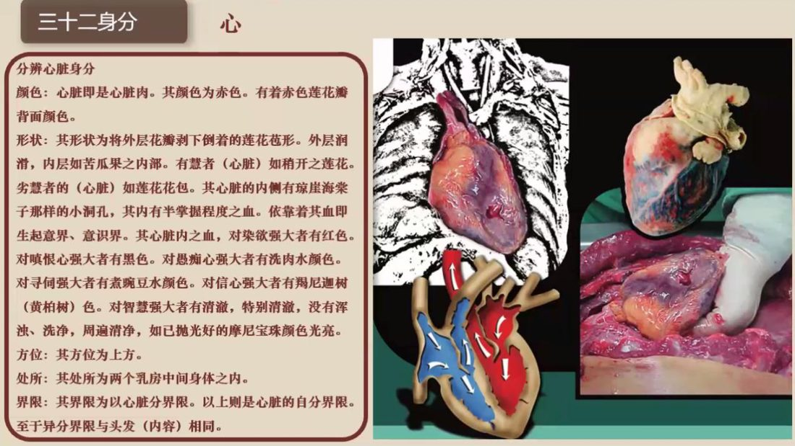
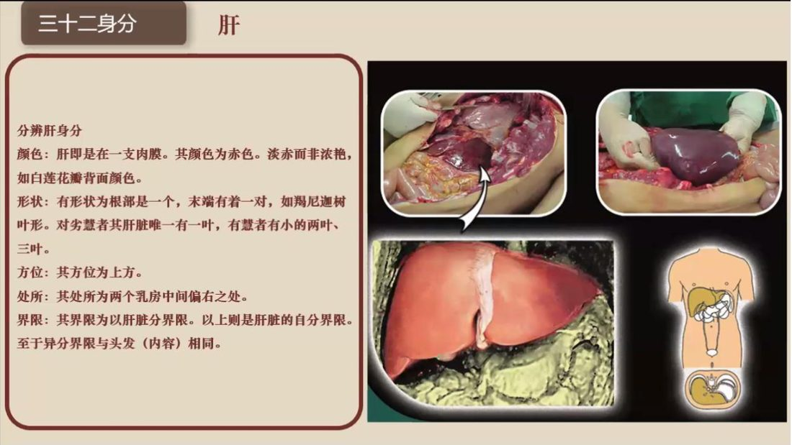
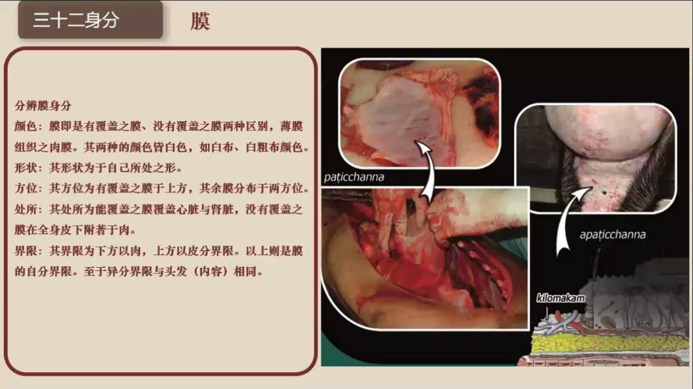
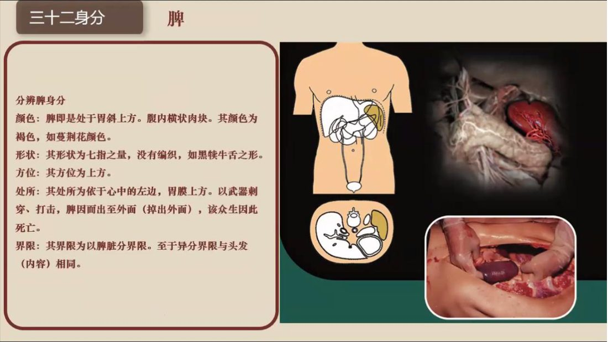
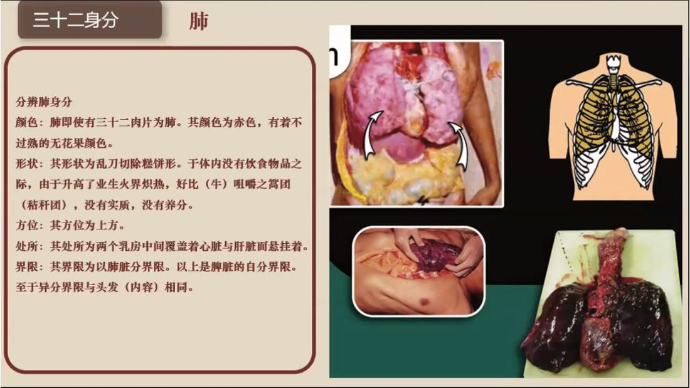
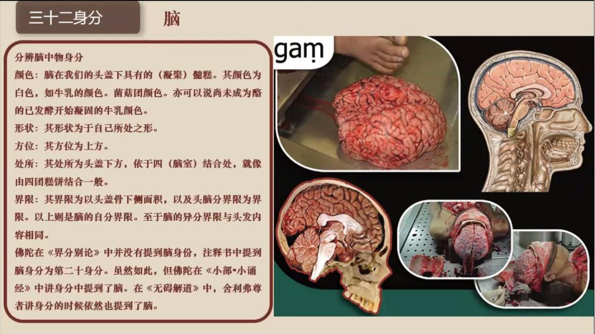
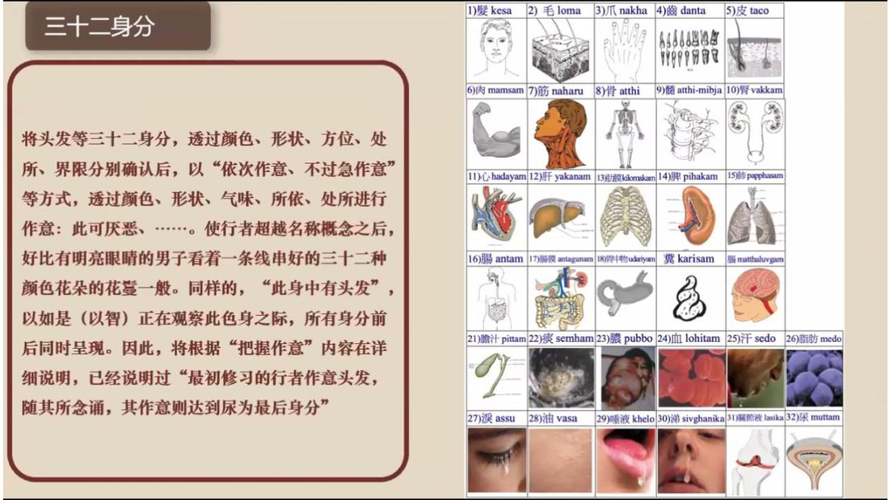
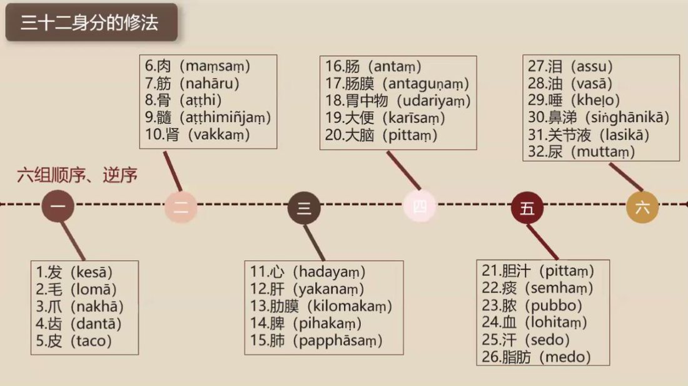

📅 最近更新：2026-09-29 12:30　|　第5版精修（朗读优化版）

# 第2周：第三至六组身分观照（主持人版）

> ⭐ **本讲主持人速览**（新主持人必读，2分钟看完）
>
> 你不是老师，是"共学同行者"。你不需要提前懂内容，只需要按流程走。
> **本周由连续两周内容合并**而成，含两段共读、两轮分享与两轮讨论，单讲 120 分钟。
>
> | 环节 | 标准时长 | ⏱ 时间不够→ | ⏱ 时间富余→ |
> |:-----|:----:|:-----|:-----|
> | 🧘 静心开场 | 10 min | 缩至5 min | 加2分钟静坐 |
> | 📖 共读原文1 | 20 min | 只读★核心段（约15 min） | 加读◈扩展段 |
> | 💬 第一轮分享 | 10 min | 每人1句话 | 每人3分钟 |
> | 🎯 第一轮主题讨论 | 10 min | 只讨论问题① | 讨论全部问题+扩展 |
> | 🧘 禅修练习 | 15 min | 缩至8 min（只念引导词前半） | 延长至20 min |
> | 📖 共读原文2 | 20 min | 只读★核心段 | 加读◈扩展段 |
> | 💬 第二轮分享 | 10 min | 每人1句话 | 每人3分钟 |
> | 🎯 第二轮主题讨论 | 10 min | 只讨论问题① | 讨论全部问题+扩展 |
> | 🔚 收尾与回向 | 15 min | 缩至10 min | 保持 |
>
> **主持人10条守则（精简版）**：
> ① 不讲解、不提供答案——让原文自己说话；② 有人问"正确答案"→说"先听听大家的看法"；③ 冷场→主持人先分享自己的真实感受；④ 跑题→温和拉回："这个有意思，我们回到今天的原文"；⑤ 争论→"两种看法都很好，大家保留自己的理解"；⑥ 确保人人发言；⑦ 不评判任何人的分享；⑧ 时间到了就推进；⑨ 禅修练习照读引导词即可；⑩ 结束一起回向。

> 本周主题：**五藏（心、肝、膜、脾、肺）的可厌性——「可厌」＝不可喜，是拿掉滤镜、松开贪着，不是自我厌弃。**；**第四至六组身分观照——以「颜色·形状·方位·处所·界限」五种分辨法，把第四组（肠·肠间膜·胃中物·粪·脑）与以水界为特征的两组（胆汁痰脓血汗脂肪／泪膏脂唾液涕关节滑液尿）逐一身分看清楚，并把「可验」落到实处：取到「不可喜」相即可，不必生起厌恶。**。

---

## 📋 本周信息卡

| 项目 | 内容 |
|:----|:-----|
| 时长 | 120分钟（4周版 · 9环节） |
| 核心问题 | 五藏（心、肝、膜、脾、肺）如何用「颜色·形状·方位·处所·界限」五种分辨法观照？「可厌＝不可喜」而不是自我厌弃，是什么意思？ |
| 共读原文 | 共读原文1：材料①《20_三十二身分3-古源尊者-20250124（课件）》。　｜　共读原文2：材料①《21_三十二身分4-古源尊者-20250125（课件）》。 |
| 本周作业 | 每天挑一处（心／肝／膜／脾／肺任一），按「颜色·形状·方位·处所·界限」在心里过一遍，3–5 分钟，只记一句；顺序不必完美，平静像「点货」即可。 |

## 🧘 静心开场（10 min）

**主持人引导语**（照读即可）：

> 我们先静坐一分钟。闭上眼睛，感受自己的呼吸，让心慢慢安静下来。（停顿60秒）
> 上周我们看过发、毛、爪、齿、皮，还有肉、筋、骨、骨髓、肾——从最外面的皮肤，一直看到骨架。这一周，我们往"里"再走一步，进入胸腹里的五样：心、肝、膜、脾、肺。
> 在开始之前，先说清一件最重要的事。三十二身分里面反复出现"可厌"两个字，很多人一听心里就一紧：是不是要我觉得自己的身体很恶心？是不是要讨厌自己？——**不是**。原文讲得很清楚：可厌的意思是"不可喜"——它不是一个令人喜爱的东西。它是让我们把"美化滤镜"拿掉，看清楚身体的本来面目，然后松开那份抓紧不放的贪着。"可厌"**不是嗔心、不是厌恶，更不是自我嫌弃**。它既不对治"喜欢"，也不制造"讨厌"，它只是**如实知道**。
> 今天原文里，尊者用了一个很生动的比喻，等一下共读会读到：你走在路上，路边有一泡狗屎，你避开走过去——你既不会跑过去欣赏它，也不会对着它生气，你只是知道"那是狗屎"，然后走开。对身体的观照，就是这个态度。今天我们要体会的，不是"它多恶心"，而是"它并没有我以为的那么可爱"。心凉下来、不抓了，这就是本周的功课。
> 今天的流程是：读两段原文、第一轮分享、主题讨论，还有一次15分钟的禅修练习——照引导词，把心、肝、膜、脾、肺一个一个"在心里过一遍"。坐一会儿如果觉得胸口发闷、情绪上来，随时可以睁眼、深呼吸，或者只是安静地听，都没关系。我们开始。
>
> （停顿5秒）先做一个很短的"落地"练习：把注意力放到脚掌，感觉两只脚踩在地上；再放到臀部，感觉自己坐稳了；再放到肩膀，让肩膀自然沉下来；最后放到胸口和腹部，感觉呼吸一起一伏。（停顿20秒）
>
> 在正式开始前，我们再做一次"心理安全"的小约定：接下来的一段时间里，如果你对"看内脏""看可厌"有任何不适——胸口发紧、反胃、想哭、想离开——都是正常的，你可以随时把眼睛睁开，深深吸一口气，把注意力放回呼吸；也可以就安静地坐着听，不必勉强。我们不是要"消灭"什么，也不是要"讨厌自己"；我们只是学习一种更诚实、也更松开的看法。（停顿5秒）
>
> 还有一个小小的提醒，也许能让"可厌"这个词更好懂：请在心里把它改一个说法——"它，不是我原来以为的那么可爱"。带着这句话，我们开始共读。
>
> 我们这三周一路走来：第1周看的是"身体是什么、怎么拆成三十二块"；第2周从皮肤、头发、指甲，看到骨头和肾脏；这一周，我们第一次走进身体里面——看心、肝、膜、脾、肺。你会发现，越往里看，"可爱"就越站不住脚。这不是我们在丑化身体，而是身体本来就是这样，只是我们平时不去看、或者不愿看。看清了，贪着就松了；松了，心就清凉。这就是今天唯一要做的事。

---

> 💬 **破冰｜3–5分钟**：说说看：说到「心、肝、脾、肺、膜」，你有没有一点不适，或一点好奇？

## 📖 共读原文1（20 min）

> ⚠️ 主持人操作：以下为完整原文文字，可直接照读或让大家轮流朗读，无需查知识库。出处信息见各材料下方；录音转写段落前的时间码（如 `[00:04:00]`）是出处标记，朗读时跳过不念；（ ）内的口语重复、以及（注：）内的整理注记也跳过不念。**若现场有人对内脏内容不适，可只读"★核心"中的一小段，或改为听读。**

### 原文材料①：★核心·《20_三十二身分3-古源尊者-20250124（课件）》

- **文件**：《20_三十二身分3-古源尊者-20250124（课件）》

> ⚠️ 主持人操作：本材料为**第三讲课件**（百花古寺2025百日禅「三十二身分」第3讲，2025-01-24）幻灯片文字照录，含心／肝／膜／脾／肺五身分的颜色·形状·方位·处所·界限，逐段各成一体，**可五段全读，也可只读"心""肺"两段**。课件页面上方原附3D内脏模型图（图形页，文字不可提取），读过文字即可。**★核心**＝五段"分辨"全读；时间不够时保留"心""肺"、跳过"肝""膜""脾"。

**〔照录·课件文字〕**

百花古寺2025百日禅

三十二身分

古源如应讲述

2025年1月

11.心 (hadayaṃ)

12. 肝 (yakanam)

13. 肋膜 (kilomakam)

14. 脾 (pihakam)

15.肺 (papphāsam)

> **分辨心脏身分**
>
> 颜色：心脏即是心脏肉。其颜色为赤色。有着赤色莲花瓣背面颜色。
>
> 形状：其形状为将外层花瓣剥下倒着的莲花苞形。外层润滑，内层如苦瓜果之内部。有慧者（心脏）如稍开之莲花。劣慧者的（心脏）如莲花花包。其心脏的内侧有琼崖海棠子那样的小洞孔，其内有半掌握程度之血。依靠着其血即生起意界、意识界。其心脏内之血，对染欲强大者有红色。对嗔恨心强大者有黑色。对愚痴心强大者有洗肉水颜色。对寻伺强大者有煮豌豆水颜色。对信心强大者有羯尼迦树（黄柏树）色。对智慧强大者有清澈，特别清澈，没有浑浊、洗净，周遍清净，如已抛光好的摩尼宝珠颜色光亮。方位：其方位为上方。
>
> 处所：其处所为两个乳房中间身体之内。
>
> 界限：其界限为以心脏分界限。以上则是心脏的自分界限。至于异分界限与头发（内容）相同。

> **分辨肝身分**
>
> 颜色：肝即是在一支内膜。其颜色为赤色。淡赤而非浓艳，如白莲花瓣背面颜色。
>
> 形状:有形状为根部是一个，末端有着一对，如羯尼迦树叶形。对劣慧者其肝脏唯一有一叶，有慧者有小的两叶、三叶。
>
> 方位:其方位为上方。
>
> 处所:其处所为两个乳房中间偏右之处。
>
> 界限:其界限为以肝脏分界限。以上则是肝脏的自分界限。至于异分界限与头发(内容)相同。

> **分辨膜身分**
>
> 颜色：膜即是有覆盖之膜、没有覆盖之膜两种区别，薄膜组织之肉膜。其两种的颜色皆白色，如白布、白粗布颜色。形状：其形状对于自己所处之形。
>
> 方位：其方位为有覆盖之膜于上方，其余膜分布于两方位。
> 处所：其处所为能覆盖之膜覆盖心脏与肾脏，没有覆盖之膜在全身皮下附若干肉。
>
> 界限：其界限为下方以肉，上方以皮分界限。以上则是膜的自分界限。至于异分界限与头发（内容）相同。

> **分辨脾身分**
>
> 颜色：脾即是处于胃斜上方。腹内横状肉块。其颜色为褐色，如蔓荆花颜色。
>
> 形状：其形状为七指之量，没有编织，如黑犊牛舌之形。
>
> 方位：其方位为上方。
>
> 处所：其处所为依于心中的左边，胃膜上方。以武器刺穿、打击，脾因而出至外面（掉出外面），该众生因此死亡。
>
> 界限：其界限为以脾脏分界限。至于异分界限与头发（内容）相同。

> **分辨肺身分**
>
> 颜色：肺即使有三十二肉片为肺。其颜色为赤色，有着不过熟的无花果颜色。
>
> 形状：其形状为乱刀切除糕饼形。于体内没有饮食物品之际，由于升高了业生火界炽热，好比（牛）咀嚼之篙团（秸秆团），没有实质，没有养分。
>
> 方位：其方位为上方。
>
> 处所：其处所为两个乳房中间覆盖着心脏与肝脏而悬挂着。
>
> 界限：其界限为以肺脏分界限。以上是脾脏的自分界限。至于异分界限与头发（内容）相同。

> **〔回向偈〕**
>
> Idam me puññam asavakkhayavaham hotu.
>
> Idam me puñam nibbänassa paccayo hotu.
>
> Mama puñña-bhāgam sabba-sattānam bhājemi.
>
> te sabbe me samaµpuñà-bhāgam labhantu.
>
> 愿我此功德 导向诸漏尽
>
> 愿我此功德为证涅槃缘
>
> 我此功德分回向诸有情
>
> 愿彼等一切同得功德分
>
> Sādhu! Sādhu! Sādhu!

（注：本段为课件文字层照录，未删改。课件「膜」即《身至念经》三十二身分列表第13身分「肋膜 kilomakaṁ」；「分辨肺身分」页末句课件作「以上是脾脏的自分界限」，**疑为课件误植（应为「肺脏」）**，此处照录原样。课件3D内脏模型页为图形页，文字不可提取，缺口如实注明。）

**〔材料①逐段导读（主持人参考）〕**

- **心段**：先把"心脏"当一块"肉"来看——它只是心脏肉，赤色，像赤色莲花瓣的背面。原文特别讲"血"：染欲强者偏红、嗔心强者偏黑、愚痴者如洗肉水色、寻伺强者如煮豌豆水色、信心强者带黄柏色、智慧强者清澈如摩尼宝珠。**导读时只念原文，不作健康解读、不当面相算命。**
- **肝段**：肝是"一支内膜"上的肉；根部一、末端一对；劣慧者一叶、有慧者二至三叶。
- **膜段**：分"有覆盖之膜"与"没有覆盖之膜"；覆盖者覆盖心与肾，未覆盖者在全身皮下附若干肉。
- **脾段**：胃斜上方、腹内横状肉块；"以武器刺穿、打击，脾因而出至外面……该众生因此死亡"——照读即可，不作恐怖化渲染。
- **肺段**：三十二肉片；无饮食时如"（牛）咀嚼的篙团（秸秆团）"，没有实质、没有养分——这一句是全段最"可厌"处，可重点慢读，让大家体会"它本身不可喜"。

（共读节奏建议：五段全读约12-15分钟；若时间紧，只读"心""肺"两段，其余由主持人一句带过："肝、膜、脾的结构，请大家看原文的注记版。"）

### 原文材料②：★核心·《20_三十二身分3-古源尊者-20250124（第3讲录音）》

- **文件**：《20_三十二身分3-古源尊者-20250124（第3讲录音）》

> ⚠️ 主持人操作：本材料为**第三讲录音**（2025-01-24）的逐字转写照录，保留时间码，口语重复（呃／啊／嗯）与破碎残句均照录不改；转写含较多**同音误字**，下表供主持人理解，**朗读时按正字念即可**。**★核心**＝`[00:00:05]`–`[00:03:28]`（可厌作意说明·狗屎喻）＋`[00:04:00]`–`[00:16:08]`（逐身分细说）；`[00:17:03]` 之后的静坐引导段可全读，也可并入"🧘禅修练习"环节使用。**本讲转写至 `[00:28:37.060]` 止**（末尾为引导收束句，无回向收尾段，缺口如实注明）。

**〔同音讹字校订对照（原词 → 正字；正文已按同音讹字统一校订·直用正字）〕**

- 「可验」「可焰」「可言」「可约」「可研」「考验」→ **可厌**（身至念之可厌作意，kāya-gatā asubha）
- 「三十二生分」「三十二身份」「生分」「生风」「身份」→ **三十二身分／身分**
- 「生之念」→ **身至念**
- 「称心重」「称清重」「嗔清重」→ **嗔心重／嗔恚重**
- 「巡视心」→ **寻伺心**
- 「不敬」（就身体贪着处语境）→ **不净**
- 「心所一出」→ **心所依处**；「心所欲处」「新手艺宿舍」「心锁艺术」→ **心所依处**（hadaya-vatthu）
- 「夜生」→ **业生**（业生色）
- 「深净色」「深色就是时节」→ **身净色／时节**
- 「柏树」「黄柏素」→ **羯尼迦树（黄柏树）色**
- 「标枪」（肩部引导语）→ **肩膀**
- 「冇」→**毛**；「平」→**脾**；「废」→**肺**；「军舰」→**筋腱**；「品好」→**皮**；「糖」→**痰**；「两页」（肝）→**两叶**
- 「新包」「包膜」→ **心包膜**；「两粒肾脏」「肾脏的包膜」→ **两颗肾脏／肾膜**
- 「包子评价」「谁渠道？」「心战的新的可验」等引导残句 → 转写破碎，照录不改

**〔照录·录音转写原文〕**

> [00:00:05.800] 那今天我们练习下一组，心肝膜，脾肺。再次给大家说明，就是。
>
> [00:00:15.660] 三十二身分。好。是可以证的两种禅那，
>
> [00:00:23.010] 一种呢，就是你直接对这个身分修那个身分，取那个身分为概念。他可以真的出定。那。也可以对着那个身分，取它的可厌作用，就是它不可喜、不可爱。这种可验作业，可以证得出定。那身至念呢？修不净是修这个身分的可验？那这个可验的把握，可能有些同学呢，他是。把握不到。
>
> [00:00:59.670] 有一种人呢，就觉得说这是我身体的一部分，现在我在用，这个也没什么可验，不好我也得接受，那就是不是正确的态度。那当然，理他是身体的一部分一部分。那我们现在呢，是要透由对他的不可喜，要去获得定力。然后，然后这个要获得对自己身体的这个因为不净，而要对这个对身体的执着的放下。
>
> [00:01:33.280] 他的目标是这样。而他的可验呢，就是不是说不管他可厌不可厌，而是他的可厌是他的本质。那我们可以通过它的颜色、它的形状、它的处所、它的味道、它周边的边界，就可以去去体会它的这个可验。那可验呢？
>
> [00:01:58.120] 第二一个呢，就是可厌升起来的时候，不是不断地做一，他越来越可厌，越来越讨厌，然后，最后就想吐。可厌呢，就是知道它是不可喜的。它这个它不是一个很令人喜爱的东西。不需要不断地加强它。如果你能取到这个身分的可验，原则上，你就会有清凉感。就是因为它无贪，他起来了肯定是无贪的。但是他又不是厌恶。可厌不是等于厌恶。
>
> [00:02:41.880] 这个怎么讲呢。就是举个例子说。你走在路上。你看到路边有一泡狗屎。你就是避开就完了，对吧？你知道那个是死。你不会跑过去说欣赏一下？也就是走过就知道他，你知道那是狗屎，但是你不会跑过去想说你太讨厌了，这什么狗屎，那这个有毛病，那就是你既不会觉得那个狗屎很好，你也不会觉得那个狗屎很讨厌，你就知道那个是狗屎，你不会对它采取什么行动。就不会有这个喜爱他，也不会有这个我们那种排斥性，

## 💬 第一轮分享（10 min）

**主持人引导**：

> 请大家轮流分享：读完这两段文字，关于"可厌"这两个字，你现在心里的第一感觉是什么？"可厌"和你原来以为的"讨厌／嫌弃"，是不是同一件事？
> （主持人先分享自己的，然后按顺序轮流。这一轮只说不评论；每人1-2分钟，讲一件就好。）

**起手问题（任选其一，也可都问）**：

1. 原文说"可厌呢，就是知道它是不可喜的……可厌不是等于厌恶"。这句话让你意外吗？在此之前，你听到"不净观""可厌"会想到什么？
2. 尊者用"路边一泡狗屎"来比喻：既不去欣赏它，也不对着它生气，只是知道"那是狗屎"，然后走开。"知道"和"讨厌"，在你的生活里分得开吗？试着举一件你自己的小事。
3. 五藏里（心、肝、膜、脾、肺），哪一样最让你觉得"它确实没什么可爱"？哪一样又让你有点抗拒、不忍心去看？——说出一件就可以，不用说原因，也可以只说"还不能说"。

（小提示：这一轮不追答案、不点评，让大家把真实的"第一反应"放出来。若有人说"我不想看我的内脏""听着有点反胃"，请先肯定："这个反应很正常，能说出来就很好——我们本周要学的，恰恰是怎样不讨厌、也不迷恋地去看。"）

**分享规则（主持人照此推进）**：

- **自愿为限**：想说的说，不想说的可以只点头、或者说"先听大家"；**不点名指定**。
- **一轮只说不评论**：不打断、不追问、不纠正；一句"谢谢你的分享"即可。
- **每人1-2分钟**；主持人第一个说，给一个"1分钟版"示范——说一件具体的小事，不说大道理。
- **只记录、不评判**；若出现自我贬低的话（如"我就是看不惯自己"），只温柔复述："把它放一放，我们今天先看看原文怎么说。"

**可选的追加起手问题（时间富余时）**：

4. 这两周你在家有没有"过一遍"三十二身分？哪一次最顺利、哪一次最难？——说一次具体的经历就好。
5. 材料②说"如果你能取到（不可喜），原则上你就会有清凉感"。读到"清凉感"这个词，你想到的是什么样的感觉？
6. 如果给"可厌"换一个你自己的说法，你会怎么说？（例如"放下滤镜""不再美化""如实知道"。）

**主持人示范（示例，可改写为自己的话）**：

> "我先说一个。我第一次读到'可厌不是等于厌恶'时，心里松了一口气——原来不用讨厌自己，也可以修。我想到有一次我盯着镜子挑自己的毛病，越挑越烦；今天原文说的'知道它是不可喜的'，是另外一种看法，不跟自己较劲。"

---

## 🎯 第一轮主题讨论（10 min）

**主持人引导**：朗读下面3个问题，让大家自由讨论。**你不提供答案**，只引导。三问由浅入深，最后一问落到"实修怎么做"。

**讨论问题（按优先级）**：

- **问题①（★必答，时间不够时只讨论这个）**："可厌"到底是什么意思？原文一方面说要取它的"可厌作用"，一方面又说"可厌不是等于厌恶""可厌的不是让你生起嗔心"——这两句矛盾吗？你怎么理解？（主持人提示：先把"不可喜"和"厌恶"分开——不可喜＝拿掉美化的滤镜、看清本来面目、从而松开贪着；厌恶＝多出一个"排斥、生气"的动作。可回到材料② `[00:01:58]`"如果你能取到这个身份的可验呢……你就会有清凉感"与 `[00:02:41]`"狗屎"比喻，让原文自己说话。**这一问的核心是把"可厌≠自我厌弃"说透。**）

- **问题②（◈选答）**：材料②开头讲，有人觉得"这是我身体的一部分啊，现在我在用啊，这个也没什么可厌啊，不好我也得接受"，尊者说"那就是不是正确的态度"。为什么"这没什么可厌的"反而不是正确态度？"接受自己"和"看清它不可喜"，两者冲突吗？（提示：可回到材料② `[00:00:59]`–`[00:01:33]` 那段。要点是——不是要你讨厌身体，而是不要被"它很可爱"的错觉牵着走；看清之后，反而更能善待它。可请一位同学区分：一句是"我讨厌我的身体"，一句是"我看见身体只是身体"，两句的心里感觉有什么不同。）

- **问题③（◈选答，时间富余或大家感兴趣时讨论）**：课件把每一样身分都拆成"颜色·形状·方位·处所·界限"五项。如果本周只挑一样来练，你会挑心、肝、膜、脾、肺里的哪一样？为什么？材料②给了方法："通过它的颜色、形状、处所、味道、周边的边界，去体会它的这个（不可喜）"——你打算在什么时间、什么场合去"过"这一样？（提示：把讨论收在"落地"上——具体的人、具体的时间、具体的一次练习。提醒：不求画面清晰，"知道它在那里"就够了，见材料② `[00:27:10]`"观察不要太快、不要太慢，不清楚的就过"。）

**主持人备用追问（冷场或讨论浮于表面时用，不必全用）**：

- 追问①-1：请各举一个你自己生活里的例子，看看"不可喜"和"厌恶"，究竟一样不一样。
- 追问①-2：如果把"可厌"换成"放下滤镜"，这句话你会怎么复述？
- 追问②-1："接受自己"和"看清它不可喜"，如果只能保留一个，你保留哪个？为什么？
- 追问②-2：材料②里尊者也承认"它是身体的一部分"，那么所谓"正确的态度"，到底差在哪里？
- 追问③-1：你打算什么时候、在哪里"过"这一样？（请把答案具体到时间、地点。）
- 追问③-2：如果"看清楚了"反而有点难受，你会怎么做？（引导回到"只取一处、随时暂停、转向慈心"。）

**讨论收束话术（主持人照读）**：

> 今天大家讲了很多。我帮大家收一句原文里的话："可厌呢，就是知道它是不可喜的……可厌不是等于厌恶。"请带着这一句回去。它不是让我们讨厌自己，而是让我们看清、松开。看清之后，我们反而更能善待这具身体，也更能善待别人。

**时间分配建议（约 35 min）**：问题①约15分钟（必答，含"可厌≠厌恶"的澄清）；问题②约10分钟；问题③约8分钟；收束约2分钟。若时间不足，宁可问题②③简略，也**要把问题①说透**。

> **分层追问**（可视时间取用，由浅入深）：
> - 【现象】看清身体内部的样子，对你意味着什么？
> - 【影响】若一直回避、只活在想象里，会怎样？
> - 【应对】这周你愿意怎么练——看图、记名，还是安静地默念？

---

## 🧘 禅修练习（15 min）

### 练习一

> ⚠️ **禅修禁忌提示**：若你正处在严重抑郁、焦虑、创伤后应激，或精神类疾病的发作／用药期，或正经历强烈的情绪危机，请先咨询医生或心理师，再决定是否练习；练习中若出现明显不适（如心悸、胸闷、情绪失控），请立即停止，睁开眼睛，把注意力放回呼吸与身体，必要时离场休息。

> 本引导词为照读版（据本周素材材料②《20_三十二身分3-古源尊者-20250124》现场引导段 `[00:17:03]`–`[00:28:37]` 整理摘编；括号内为操作提示与停顿，不念出来）。照读约5分钟，静坐约8分钟。**全程提醒：只"知道"，不"讨厌"；看不清没关系。**

**主持人引导语**（照读即可）：

> 请大家自然地坐好，坐在椅子上也完全可以，让背自然挺直、放松，轻轻闭上眼睛。（停顿5秒）
> 先找到自己的座位、坐姿，把骨盆调稳，腰坐稳；两边的肩膀轮流向前、向上、向后，转一圈，轻轻放下；头像是在空中轻轻浮着，两耳和两肩在同一个平面上。（停顿10秒）
> 回到心脏的位置——胸口偏左、心里面的这个地方。跟自己的心说一声：接下来这几分钟，我要练习三十二身分的"可厌作意"。（停顿5秒）
> 先在心里知道：这里有一颗心脏。能看到就看到，看不到就知道它大概的形状、颜色、位置，知道它和周围的边界。（停顿15秒）
> 心里知道——心跳动的地方，里面有血液在流。血液是腥的。贪心重的时候，它黏稠；嗔心重的时候，它是黑的。（停顿15秒）
> 这一点"不可喜"，你只是知道它。不去讨厌它，也不去美化它。就像路边有一泡狗屎，你看见了，知道那是什么，走过去，不欣赏、也不生气。（停顿15秒）
> 心往下、往右，是肝。它是人体里最大的一块，赤红色，偏右边大一点。肝储存血液、净化血液。总熬夜的人，肝里会有很多颗粒。（停顿15秒）
> 再回到心的外面——心外面有一层包膜，上面有黄色的脂肪。往上、往下，皮肤下面覆盖着全身，有一层白色的膜；后腰的两颗肾脏外面，也各有一层膜。它就是一层膜，覆盖着、包裹着。知道它在那里。（停顿15秒）
> 心往下、往左，是脾。横着的一块肉，褐色的，负责运化。我们吃下去的东西，它处理的多是脏物。（停顿15秒）
> 再往上、往两边，是肺。胸腔里左右各一边，赤色偏粉，里面有很多小片，装着气，也藏着痰。知道它在。（停顿15秒）
> 现在，把心、肝、膜、脾、肺挨着过一遍——正着来一遍：心、肝、膜、脾、肺；再倒着来一遍：肺、脾、膜、肝、心。（停顿20秒）
> 每一个，只是取它"不可喜"的那一点：它不美、不香、不是我以为的那个样子。取到了，心是清凉的——因为没有贪，也没有嗔，只是知道。（停顿20秒）
> 如果你熟练了，也可以把前面两周学过的两组加进来：发、毛、爪、齿、皮；肉、筋、骨、骨髓、肾。一组一组来，不熟练也没关系，只练一组也可以。（停顿20秒）
> 最后，轻轻地把注意力放回呼吸，感觉这一副身体就坐在那里。（停顿15秒）
> 好，慢慢动动手指、脚趾，搓搓手掌，把温热的手掌敷在眼睛上，轻轻睁开眼睛。（停顿10秒）
> 今天只求"过了一遍"——知道它不可喜，而不是"它很恶心"。心清凉了，就对了。

**〔备用短版引导（8分钟，时间不够时用）〕**（主持人照读，只过心、肝、膜、脾、肺）：

> 请大家坐好，闭上眼睛，回到心脏的位置。（停顿5秒）这里有一颗心脏，在胸口偏左，有血液在流——知道它，不讨厌它。（停顿10秒）心往右，是肝，赤红色，储血、净血。（停顿10秒）心的外面有一层包膜，皮肤下面全身也有膜，后腰两颗肾外面也有膜——知道它在那里。（停顿10秒）心往左下，是脾，横着的一块肉，负责运化。（停顿10秒）往上、往两边，是肺，胸腔左右各一，装着气、也藏着痰。（停顿10秒）现在，正着过一遍：心、肝、膜、脾、肺；再倒着过一遍：肺、脾、膜、肝、心。（停顿15秒）每一样只取"不可喜"的那一点；取到了，心是清凉的。（停顿15秒）好，动动手指，搓搓手，敷在眼睛上，慢慢睁开。

**〔引导要点（主持人须知）〕**：

- 引导词**照读即可**，不必讲解；每样身分只给一句"已知的事实"（如"心在胸口偏左""肺在胸腔两边"），再加一句"知道它不可喜"。
- **不要引导"画面尽量清晰"**；要在每次停顿时留白，让学员自己去"知道"。
- 全程反复一句："**只是知道、不讨厌、不美化**"；若有人明显不适，随时改为慈心（见"特别提醒"）。
- 结束前留 20-30 秒静默；收尾语优先用"**心清凉了，就对了**"。
- 本引导词整合自材料② `[00:17:03]`–`[00:28:37]` 的现场引导。

---

### 练习二

> ⚠️ **禅修禁忌提示**：若你正处在严重抑郁、焦虑、创伤后应激，或精神类疾病的发作／用药期，或正经历强烈的情绪危机，请先咨询医生或心理师，再决定是否练习；练习中若出现明显不适（如心悸、胸闷、情绪失控），请立即停止，睁开眼睛，把注意力放回呼吸与身体，必要时离场休息。

> 本引导词为照读版（依本周共读原文整理而成）。**本周涉内脏与体液，练习只取「熟」「软」「流动」一类温和的作意，绝不刻意制造恶心画面。** 照读约 5 分钟，练习约 8 分钟。若有人不适，随时可睁眼、回呼吸、改做慈心。

**主持人引导语**（照读即可）：

> 请大家坐好，背自然挺直，双手轻轻放在腿上。做三次深呼吸。（停顿10秒）
>
> 我们先用身体感受一下：吸气，知道气息进到腹部；呼气，知道腹部轻轻落下。就这样，让腹部一起一伏，三十秒。（停顿30秒）
>
> 现在，我们把注意力放在腹部里面。不急着「看」某个器官，只是感受这里有一团东西在轻轻动着——这团东西，平时我们叫它「我的肚子」。（停顿15秒）
>
> 好，我们轻轻地作意一个身分，只取一个，你选一个不让你紧张的就好。可以是「地界」的：肠、肠间膜、胃中物、骨、脑；也可以是「水界」的：血、汗、唾液、尿。请在心里默念它的名字一次。（停顿10秒）
>
> 然后，用一句很温和的描述提醒自己：**它是一团东西，它有它自己的颜色和形状，它就在这个身体里的某一个位置，它有一个到哪儿为止的界限。** 就这样，取到「有个概念」就好，不必更清楚。（停顿30秒）
>
> 接着，把这一句放到心里——**「它不是特别可爱。」** 注意，这不是「它很恶心」，也不是「我很糟糕」；只是「去掉美化滤镜，看清它本来的样子」。如果心里升起排斥或难受，就轻轻地回到呼吸，不批评自己。（停顿30秒）
>
> 现在，把这一份「看清」扩展一下：这个身体里，从头发到尿，三十二个部分，其实都是这样——各有各的颜色、形状、位置、界限，都不是「特别可爱」的。**它们合起来，才是我们一直说的「我的身体」。**（停顿20秒）
>
> **可验的感觉，是心放松、清凉的感觉；如果你的心现在发紧、发热，那不是可验——那就停下来，回到呼吸。**（停顿15秒）
>
> 最后，我们以慈心收尾，心里默念：愿我平安，愿我身心安稳；愿一切有情平安，愿一切众生身心安稳。（停顿20秒）
>
> 好，轻轻动一动手指，慢慢睁开眼睛。

**主持人练习提示**：①本练习**只取一个身分**，且由成员自选——不要主持人指定「大家一起来看粪」，否则容易造成不适；②若有人对所选身分仍感紧张，改为只做「呼吸＋慈心」两步即可，同样有效；③引导语里「它不是特别可爱」一句，务必接上后半句解释：「这不是恶心，是去掉美化滤镜」；④练习结束时留 10 秒静默，让大家带着「清凉」而非「厌恶」离座。**本周练习的成败标准只有一个：结束时，大家的心是松的。**

---

## 📖 共读原文2（20 min）

> 主持人：本周两个材料是**同一讲（2025-01-25 第4讲）的两种载体**——材料①课件是「五分辨法」的文字底本，材料②录音是「怎么看」的口述示范。建议**交叉读**：先读材料①第四组（肠→脑），再读材料②[00:04:20]–[00:10:21]（第四组口述），接着读材料①第五、六组，再读材料②[00:10:21]–[00:17:38]（水界两组口述）。这样「纸上的五栏」与「口头的怎么看」就能对上一次。**注意**：材料②录音本周**只取 [00:04:20]–[17:38] 段**（第四至六组逐一身分细说）；同录音 [00:00:00]–[01:48]（可厌作意原理）归第 5 周、[00:23:31]–[38:00]（整体联系与顺逆序引导）归第 6 周，本周**不取**，以免跨周重复。

### 原文材料①：★核心·《21_三十二身分4-古源尊者-20250125（课件）》

- **文件**：《21_三十二身分4-古源尊者-20250125（课件）》

> ⚠️ 主持人操作：全课件约 6,000 字原文（含第四至六组十七个身分的分辨文、三十二身分的修法、完整列表与回向），**30 分钟内可读完全部原文，但不必逐字念**。建议：①先读第四组（肠／肠间膜／胃中物／粪／脑）五段，**每段照读后停 10 秒**，让成员在心里「对一遍」；②再读第五组（胆汁／痰／脓／血／汗／脂肪）、第六组（泪／油膏／唾液／涕／关节滑液／尿），每段末句「至于异分界限与头发（内容）相同」第一次读全，之后几段可略读；③「三十二身分的修法」段（超越名称概念）请务必读——它是本周「可验」原理的底本；④回向与巴利文可在收尾时随回向环节一并念。**（注：本课件对身分序号与巴利转写有若干 OCR 讹误，如第 20 身分标「20.大脑（pittam）」、第 13 身分作「腈膜」、第 19 身分作「藁 karisam」，一律照录原样，必要处括注。）**

> **【照录·课件原文，逐页逐字】**
>
> 百花古寺2025百日禅
>
> 三十二身分
>
> 古源如应讲述
>
> 2025年1月
>
> 16.肠（antam）
>
> 17.肠膜（antaguṇaṃ）
>
> 18.胃中物（udariyaṃ）
>
> 19.大便（karīsaṃ）
>
> 20.大脑（pittam）（按：课件原标如此；巴利 matthaluṅgaṃ，见下「脑」条）
>
> #   三十二身分
>
> #   肠
>
> #   分辨肠身分
>
> 颜色：肠即是男有三十二肘、女有二十八肘曲折肠子。于二十一处有着皱化、曲折着。其颜色为白色，如砂石、混合泥颜色。
>
> 形状：其形状为于赤染料液体内，所放置的无头蛇盘绕形。
>
> 方位：其方位为两方（上下）。
>
> 处所：其处所为上至咽喉，以及下至肛门，由于曲折着咽喉开始至肛门为终点，其处于体内。
>
> 界限：其界限为以肠子（周边）分界限。以上是肠的自分界限。至于异分界限与头发（内容）相同。
>
> #   三十二身分
>
> #   肠间膜
>
> #   分辨肠间膜身分
>
> 颜色：肠间膜即是附著于肠子曲折之处。其颜色为白色，如睡莲根颜色，或为水草根颜色。
>
> 形状：其形状为水里之水草根形。
>
> 方位：其方位为两方（上下）。
>
> 处所：其处所为连接在一起，好比制作锄子、斧头的人的肠子避免脱落而连接在一起（做粗工的人没有脱肠，其肠子连结在一起）；牵着引擎之际，将引擎绳索与引擎板连结在一起那样。擦脚布边之间所裁缝隙的小细线那样，连结于二十一个肠子间。
>
> 界限：其界限为以肠间膜分界限。以上是肠间膜的自分界限。至于异分界限与头发（内容）相同。
>
> #   三十二身分
>
> #   胃中物
>
> #   分辨胃中物身分
>
> 颜色：胃中物即是胃中曾所饮食、啖食之食物。其颜色为所吞食之食物颜色。
>
> 形状：其形状为所吞食物之食物形状，如在滤馕中将米松散包装之形。
>
> 方位：其方位为两方（上下）。
>
> 处所：其处所为胃中。
>
> 界限：其界限为以胃膜与胃物分界限。以上则是胃中物的自分界限。至于异分界限与头发（内容）相同。
>
> #   三十二身分
>
> #   粪
>
> #   分辨粪中物身分
>
> 颜色：粪即是粪便。其颜色为绝大部分所吞食食物的颜色。
>
> 形状：其形状为自己所处之形。
>
> 方位：其方位为下方。
>
> 处所：其处所为直肠。所谓直肠即是前面从肚脐下，后面至脊椎骨节中间，大肠末端，如同高度八指的竹筒。若要举例而言，其直肠就像雨水从高处流向低处而堆积着一般。同样的，在直肠内将落的饮物、食物，消化之火使其隆起气泡，每次煮沸，就像石臼研磨一般，以致成为细末（粪）。其（粪）从肠道流下而集中，就像将黄土细粉塞入竹筒一般。
>
> 界限：其界限为以直肠膜与粪界限。以上是自分界限。至于粪的异分界限与头发内容相同。
>
> #   三十二身分
>
> #   脑
>
> #   分辨脑中物身分
>
> 颜色：脑在我们的头盖下具有的（凝聚）髓糕。其颜色为白色，如牛乳的颜色。菌菇团颜色。亦可以说尚未成为酪的已发酵开始凝固的牛乳颜色。
>
> 形状：其形状为自己所处之形。
>
> 方位：其方位为上方。
>
> 处所：其处所为头盖下方，依于四（脑室）结合处，就像由四团糕饼结合一般。
>
> 界限：其界限为以头盖骨下侧面积，以及头脑分界限为界限。以上则是脑的自分界限。至于脑的异分界限与头发内容相同。
>
> 佛陀在《界分别论》中并没有提到脑身份，注释书中提到脑身为第二十身分。虽然如此，但佛陀在《小部·小诵经》中讲身分中提到了脑。在《无碍解道》中，舍利弗尊者讲身分的时候依然也提到了脑。
>
> 21. 胆汁（pittam）
>
> 22.痰（semhaṃ）
>
> 23. 脓（pubbo）
>
> 24.血（lohitaṃ）
>
> 25. 汗（sedo）
>
> 26.脂肪（medo）
>
> #   三十二身分
>
> #   胆汁
>
> #   分辨胆汁中物身分
>
> 颜色：胆汁有两种：有组织性的胆汁，以及没有组织性胆汁。其中，有组织性胆汁其颜色为浓稠的蜜树油颜色，没有组织性胆汁其颜色为枯萎的玉蕊花颜色。
>
> 形状：其形状两种都是依自己所处之形。
>
> 方位：其方位有组织性的胆汁在上方，没有组织性胆汁在上下两方。
>
> 处所：其处所为没有组织性胆汁处于除了毛、发、牙齿、指爪等之无肉处，以及干硬之皮肤以外其余全身，好比浮油弥漫于水（面）一般散布全身。若没有组织性的胆汁代谢异常则发生黄疸、眩晕、抖动、瘙痒。有组织胆汁处于心脏和肺脏之间，依于肝脏之肉，犹如大丝瓜囊在胆囊之中。假如有组织性胆汁有异常，则变为癫狂，心神异常，不知羞愧，所做不宜之举，所言不易言之语，所思不宜想法。
>
> 界限：其界限为以胆囊为界限。以上是自分界限。至于胆囊的异分界限与头发内容相同。
>
> #   三十二身分
>
> #   痰
>
> #   分辨痰中物身分
>
> 颜色：体内满钵之量（其量为两个炼乳罐）为痰。其颜色为白色，如那伽巴罗叶汁颜色。
>
> 形状：其形状为于自己所处之形。
>
> 方位：其方位为上方。
>
> 处所：其处所为胃膜管道。当吞咽食物之际，其往四处移动；用餐结束以后再次覆盖胃。好比水面有水草，当木头、石头降落之际，水面覆盖的水草往两边移动；当木头、石头降落水下面之后，移动后的水草再次恢复。其痰若减少，就像熟脓、腐败蛋卵、胃中臭气，极为厌恶。此外，从胃中打气的味道，逆流之气、口腔之气有着腐尸之味。此人被人嫌弃："你这个人着实恶臭，走开！"然则，其痰若增多，以致厚实，于直肠内就像盖子一般，将恶臭之气积于胃内侧。痰是覆盖住胃。当痰减少的时候，它就没办法全部覆盖胃，胃里的腐臭味道会逆流，嘴巴发臭，让人厌恶。假如痰增多的话，于直肠内就像盖子一般，将恶臭之气积于胃内侧，因为痰多可以覆盖住胃。
>
> 界限：其界限以痰为界限。以上则是痰自分界限。至于痰的异分界限与头发内容相同。
>
> #   三十二身分
>
> #   脓
>
> #   分辨脓中物身分
>
> 颜色：脓即是败坏的血液，即脓血。其颜色为枯萎黄叶颜色。若是尸体，其流溢出来的脓血则有米汤发酵之颜色。
>
> 形状：其形状为自己所处之形。
>
> 方位：其方位为两方（上下）。
>
> 处所：其处所为不固定。当被短木、芒刺、武器、火焰所伤，于彼处血液集中，将成为伤口、疮痍。其脓血依于此处。
>
> 界限：其界限以脓分为界限。以上则是脓自分界限。至于脓的异分界限与头发内容相同。
>
> #   三十二身分
>
> #   血
>
> #   分辨血中物身分
>
> 颜色：血有两种：凝聚血、循环血。其中凝聚血的颜色为已经煮熟的粘稠罗具颜色（指虫胶，古时候使用于封条），循环血为澄清罗具（虫胶音译）颜色。
>
> 形状：其形状为其两种所处之形。
>
> 方位：其方位为凝聚血在上方。循环血在两方。
>
> 处所：其处所为循环血除了头发、身毛、牙齿、爪等之无肉处，以及干硬之皮肤以外，随着其余所有执取身遍布静脉网。凝聚血有满体量，充满在肝脏下方。于心脏、肾脏、肺脏之上方，渐次流溢，使肾脏、心脏、肝脏、肺脏滋润。假如凝聚血没有滋润肾脏、心脏等，其众生则干渴。
>
> 界限：其界限以血（周边）为界限。以上则是血自分界限。至于血的异分界限与头发内容相同。
>
> #   三十二身分
>
> #   汗
>
> #   分辨汗中物身分
>
> 颜色：汗就是从细毛洞孔等流溢出来的水界。其颜色为澄清的胡麻油颜色。
>
> 形状：其形状为自己所处之形。
>
> 方位：其方位为上下两。
>
> 处所：其处所如同与凝聚血所处那样，汗没有时常所处之处。事实上，任何火热、太阳热、或由于气候异常，身体则发热而出汗。此时就像从水池中拔出，不整齐切断莲藕、莲根、莲茎（从其中水流出来）那样，一切的头发、毛的空隙流出（汗）。因此其汗形状透过毛、发之空隙而知。将摄汗的行者，作意毛、发空隙充满汗水。
>
> 界限：其界限以汗周边为界限。以上则是汗自分界限。至于汗的异分界限与头发内容相同。
>
> #   三十二身分
>
> #   脂肪
>
> #   分辨脂肪中物身分
>
> 颜色：脂肪即是凝固的油脂。其颜色为裂开之姜黄。
>
> 形状：其形状为对于肥胖者的皮肤与肉之间，放置姜黄色睹具罗布片形；对于瘦小者，脂肪依靠着小腿肉、大腿肉、脊椎、背肉、腹肉，就像叠成两、三层的姜黄色睹具罗布片形。
>
> 方位：其方位为上下两方。
>
> 处所：其处所为肥胖的人遍布全身，瘦小的人依靠小腿肉等。虽然称其为脂肪，然而其脂肪极为厌恶，因此不能把它使用抹头油，涂鼻油。
>
> 界限：其界限为下方以肉分界限，上方以皮分界限，横面以各自分界限。以上则是脂肪自分界限。至于脂肪的异分界限与头发内容相同。
>
> 27.泪（assu）
>
> 28.油（vasā）
>
> 29.唾（kheḷo）
>
> 30.鼻涕（siṅghāṇikā）
>
> 31.关节液（lasikā）

## 💬 第二轮分享（10 min）

**主持人引导**：

> 请大家轮流分享：读完这两段材料，**最触动你的一句话或一个画面**是什么？为什么触动你？不必求「对不对」，只说你的真实感受即可。**说不出也没关系；如果某个身分让你不舒服，也可以直接说「这一处我先跳过」。**（主持人先分享自己的，然后按顺序轮流。这一轮只说不评论。）

**起手问题（供主持人选用，不必全问）**：

1. 读原文时，你心里最先出现的是「好奇」，还是「有点抗拒」？这两种反应，你觉得哪一种更接近「可验」的意思？
2. 「脑和粪放在一组」——你听到这个消息的第一反应是什么？如果连「脑」都能被看得这么平等，那我们平时对身体的哪些「分别」其实也是自己加上去的？
3. 第五、六组是「水界」——胆汁、痰、汗、泪、唾液、尿这些「液体身分」，和前面那些「硬的身分」比，看的时候感觉有什么不同？
4. 「三十二身分的名字要先熟悉……有个概念，心里面能想到这个样子就可以了」——这句话有没有让你松一口气？你平时是不是习惯对自己要求「必须看得很清楚」？

**主持人控场提示**：

- **本轮的定位是「说出来」而不是「答对」**。请务必先说清楚规则：**只说自己读到的感受，不评判别人的感受**；有人说「我读不下去」，和有人说「我觉得很平静」，都是好答案。
- **先给「可以跳过」的台阶**。开场就说：「今天有几个身分，可能有人读着不舒服。你完全可以跳过它，只听别人的分享，这也算参加了。」——这一句能显著降低现场的紧张。
- **主持人示范要「敢示弱」**。轮到自己时，可以坦白说一个真实的、不太完美的反应（例如「我读到『痰』那一段时，第一反应是想快点翻页」），成员往往因此更愿意说真话。
- **留意三种信号**：有人反复清嗓子、有人突然沉默、有人笑着回避——都可能是不适的信号。主持人可顺势说一句：「没关系，这个话题到这里就够了，我们继续下一个。」**不当众点名、不追问。**
- **限时与轮转**：每人 1.5–3 分钟，主持人计时；到点用「谢谢你，我们听下一位」温和收束，不打断到一半。
- **收束一句**：本轮结束前，用一句话把大家拉回主题——「大家刚才说的『别扭』也好、『平静』也好，其实都在回答同一个问题：**可验，到底是让心更紧，还是让心更松？** 我们带着这个问题进入讨论。」

---

## 🎯 第二轮主题讨论（10 min）

**主持人引导**：朗读下面 3 个问题，让大家自由讨论。**你不提供答案**，只引导。

**讨论问题（按优先级）**：

- **问题①（★必答，时间不够时只讨论这个）**：原文（材料②[00:11:24]）说「他也是可验……就后面的这个可验都是很好取的」；本周守则也强调「可验＝取到不可喜的相，而不是厌恶」。**请用自己的话，说说「取到不可喜的相」和「讨厌自己的身体」，到底差在哪里？** 提示：一个让人心「放松、清凉」，一个让人心「紧绷、发热」——从自己身体的感受去分辨，不必讲道理。
- **问题②（◈选答）**：佛陀把「脑」与「粪」并列在第四组。原文的理由是它们在分辨法里「处境相同」（都是腔体里一团一团的东西）。**生活中，你有没有哪一件「我一直觉得它比较高贵／比较低贱」的事，其实去掉标签以后，它们是同一回事？** 提示：可以是身体、工作、外貌、别人对你的评价；不要求结论，只谈观察。
- **问题③（◈选答，时间富余或大家感兴趣时讨论）**：本周把三十二身分分成「地界为主的前四组」与「水界为主的两组」。**如果让你给自己的某一个烦恼也这样「分组」——它更像「硬邦邦、卡住的」，还是「流动的、会变的」？** 这个「界性」的观察，能不能给你一点处理烦恼的启发？提示：只谈感受与观察，不做心理分析。

**（时间富余时）现场小演练：「脑与粪并列」三问**：主持人依次问——「它是一团一团的吗？」「它装在某个腔体里吗？」「它有固定形状吗？」让成员对「脑」和「粪」各答一次，自己体会两者在分辨法上的「处境相同」。（此演练非原文，仅供体验；2–3 分钟即可。）

**主持人控场与递进提示**：

- **由浅入深的三步推进**：①先谈「感受」（问题①：可验 vs 厌恶，从身体的感觉分辨）；②再谈「分别心」（问题②：高贵／低贱的标签）；③最后落到「生活运用」（问题③：用界性看烦恼）。若时间只够一问，保问题①。
- **「可验 vs 厌恶」是本周最容易被误解处**。讨论时主持人**不要替成员下结论**，只需重复原文里两个关键词：**「取到不可喜就可以了」**（材料②[00:11:55]）与**「心是放松的、清凉的」**（材料②[00:01:05]）。让成员自己对照自己此刻的身体感受：是松，还是紧？
- **遇到「我看了觉得恶心」的分享**：先承认「恶心是很自然的反应」，再轻轻区分——「恶心是身体的一种反应；可验是『看到它不可喜就好，不必加强，也不必厌恶』。如果它让你越来越紧，那就先停下来。」**不做心理分析、不贴标签。**
- **遇到「脑高贵／粪低贱」的争论**：拉回原文的事实层——「它在分辨法的五栏里处境相同」，不上升到「你三观对不对」。**两种看法都允许并存。**
- **冷场时**：主持人先分享自己读「胃中物」或「尿」那一小段时的真实反应（哪怕是「一开始有点别扭，后来觉得还挺平静」），往往能带动一轮坦诚的分享。
- **要防止两种偏**：一是把「可验」讲成「幻想恶心画面」（偏）；二是把「不净」讲成「自虐式地贬低自己」（偏）。两个偏都有一个共同的校正句：**「看清它本来的样子，心是松的、清凉的——这才是可验。」**

**（时间紧时的取舍）**：只做问题①＋现场三问演练，问题②③留作课后思考；不追求人人发言，但**确保愿意说的人都说得完**。

> **分层追问**（可视时间取用，由浅入深）：
> - 【现象】身分观到细处，最容易冒出什么念头或情绪？
> - 【影响】若观到厌烦就停手，和观到清明而住，差在哪里？
> - 【应对】这周你愿意怎么调自己的心——太松就加力，太紧就放松？

---

## 🔚 收尾与回向（15 min）

### 收尾一

1. **每人一句话**：今天最大的收获是什么？（可提示：一句关于"可厌"的新理解就够。）
2. **主持人小结（照读参考）**：这一周我们读了心、肝、膜、脾、肺五样。请记住今天最要紧的一句话——**"可厌"就是"不可喜"，不是"讨厌"**。它不是要我们恨自己的身体，而是让我们把美化的滤镜放下，如实看见；看清之后，贪着松了、心清凉了，我们反而更能善待这具身体，也更能善待别人。
3. **下周预告**：下周我们继续三十二身分——"第四至六组身分观照"：肠、肠间膜、胃中物、粪、脑；胆汁、痰、脓、血、汗、脂肪；泪、脂膏、唾、涕、关节滑液、尿。会讲到"可验（paccavekkhana）"的原理。请带一样东西来：这周你有哪一次，对"可厌＝不可喜"有了亲身的体会（哪怕只是一闪念）？下周开头聊聊。
4. **本周作业**：每天挑一处（心／肝／膜／脾／肺任一），按"颜色·形状·方位·处所·界限"过一遍，3-5分钟。小提示：顺序不必完美，像"点货"一样平静；过的时候心是清凉的，不是难受的。
5. **回向**（一起念）：

> **愿我此功德，导向诸漏尽！**
> **愿我此功德，为证涅槃缘！**
> **我此功德分，回向诸有情！**
> **愿彼等一切，同得功德分！**

6. **主持人总结·长版（照读参考，时间富余时用）**：

> 今天这一课，我们其实只学了一件事：把"可厌"读对。它不是"讨厌"，是"不可喜"——是拿掉美化的滤镜、如实看见。我们看了心、肝、膜、脾、肺：心脏肉、肝叶、一层一层的膜、一块脾、两片肺。原文一项一项地写它们的颜色、形状、方位、处所、界限，不是为了吓我们，而是为了让我们**看得清、放得下**。看清了，贪着就松了；松了，心就清凉。回去以后，每天挑一样，静静地"知道"它一下，就很好。愿我们把这份清凉带回生活里，也带给身边的人。

7. **收尾三选一（按现场状态）**：

- **时间紧**：只做"每人一句话"＋回向。
- **常规**：每人一句话＋下周预告＋回向。
- **时间富余**：加做"主持人总结·长版"＋每人分享一个"这周的小体会"＋回向。

---

### 收尾二

1. **每人一句话**：今天最大的收获是什么？（可跳过，自愿。）
2. **本周小结（主持人）**：这一周，我们一次看完了三十二身分剩下的三组。请大家记住三句话：**第一，可验（paccavekkhana）＝取到「不可喜」的相，不是生起厌恶——心是放松、清凉的。第二，脑与粪并列在一组，是在教我们松开「高贵／下贱」的分别心。第三，第五、六组是「水界两组」，和前面「地界为主」的四组相对，分组不是随意的，是按界性归类的。**
3. **本周作业认领**：每日静坐后，从第四至六组**只选一个身分**，用「颜色／形状／方位／处所／界限」中的任两栏，记一句「可验」的体会（例如「胃中物，是一团正在消化的食物」）。一句话即可，下周带来分享；不做评判、不追求影像清晰、不必背全三十二身分。
4. **下周预告**：下周进入第 5 周「**七种学习善巧与十种作意善巧**」——我们会回过头，用几种「善巧」把这些身分学得更顺：怎么依次第、颜色、形状、方位、处所、界限去「取相」，以及十种让作意更善巧的方法。请带着本周的「可验」体会来。
5. **回向**（一起念）：

> **愿我此功德，导向诸漏尽！**
> **愿我此功德，为证涅槃缘！**
> **我此功德分，回向诸有情！**
> **愿彼等一切，同得功德分！**

---

## 📌 本讲主持人特别提醒

- ⚠️ **一句话定调（最重要）**：本周全部内容围绕"可厌＝不可喜（asubha）"。开场、共读、讨论、练习、收尾**每一环都要回到这一点**：「可厌」是拿掉美化的滤镜、松开贪着，**不是自我嫌弃，更不是嫌恶他人**。任何时候听到"我是不是要讨厌自己的身体"，立即用材料②原话回应——"可厌不是等于厌恶"。

- ⚠️ **情绪安全（内脏内容易触发不适）**：本讲素材直接触及胸腹内脏（心、肝、膜、脾、肺）。共读与练习全程遵守"**可跳读、可只取一处、可随时暂停**"。若有人出现**强烈的自我厌恶、恶心反胃、焦虑被触发**（尤其有进食障碍史、体像障碍史或近期丧亲者），立即停止观想，改修慈心（照读书会02的祝愿句：愿我快乐、安宁……），必要时会后单独沟通。主持人不做任何"心理疏导"或诊断，只做两件事：**停下、转向慈心**。

- **"不可喜"与"厌恶"的区别，要讲清楚**：可厌作意取的是"不可喜的性质"，取到时"心是清凉的，因为它无贪，但又不是厌恶"（材料② `[00:01:58]`）。若有同学越练越"讨厌""想吐"，那已从"不可喜"滑进了"嗔"，应暂停、回到慈心。**"可厌"不对治"喜欢"，只对治"贪着"；练习的目标是松开，不是厌恶。**

- **材料②为录音转写整理**：语句口语化、含较多同音误字（"可验"＝可厌、"生分"＝身分 等），已列"同音误字对照"表，照读时按正字念即可；时间码（`[00:xx:xx]`）与（注：）内注记为出处标记，朗读跳过不念。转写至 `[00:28:37.060]` 止，其后无内容，主持人不必追问"后面还有什么"。

- **不引导"解剖式想象"、不比较"看得清不清"**：引导以"知道它在"为标准（材料②"不能看到就知道这个形状"）。若有人问"我什么都没看到是不是没修对"——回答："原文说'清楚就清楚，不清楚就不清楚'，知道它在就是练习。"

- **不点名、不举例到具体人**：材料②把心肝膜脾肺与"贪／嗔／痴／寻伺／信／慧"联系起来讲，属**普遍规律的说明**，照读即可，**切勿指向现场任何人的身体、性格或健康**；也不对任何人的气色、面相作评价。

- **案例与功效不外推、不涉医学**：材料②中"搭桥""抽烟肺变黑""面相看心理状态"等是尊者修行语境的描述，**不构成医学建议**；本周不展开器官病理、不推荐任何治疗。身体不适请就医；器官观察≠医学。

- **不比较"看得清不清"、不攀比"定力"**：本周练习以"知道"为标尺。若有人把"我看到了内脏""我看到光了"当作进步来比拼，请温和拉回："原文说'清楚就清楚、不清楚就不清楚'；知道它不可喜，才是重点。"（见材料② `[00:27:10]`。）

- **不与"慈心"对立**：三十二身分的可厌作意，与修慈心并非相反——一个对治"贪着"，一个长养"善意"。若现场气氛偏"冷、硬、嫌弃"，可插入一小段慈心（照读书会02的祝愿句）来平衡。详见读书会02《慈心禅修习》。

- **本周关键词（供板书或口头提示）**：可厌＝不可喜；不可喜≠厌恶；取"不可喜的性质"，心得清凉；看清、松开、善待。

<!--EXT_READ-->
## 📖 延伸阅读（课后自由选读）
- 《20_三十二身分3-古源尊者-20250124（第3讲录音）》——第三组（心·肝·膜·脾·肺）完整讲解。
- 《21_三十二身分4（录音）》——第四至六组身分观照录音。
- 读书会02《慈心禅修习》——不净观与慈心互为对治。
- 读书会03《四护卫禅实修》第5周「不净观（一）三十二身分」——同主题不同讲次。
<!--/EXT_READ-->
