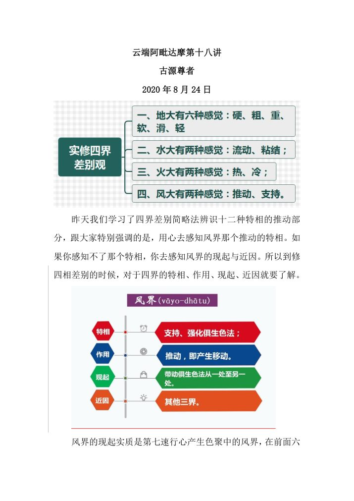
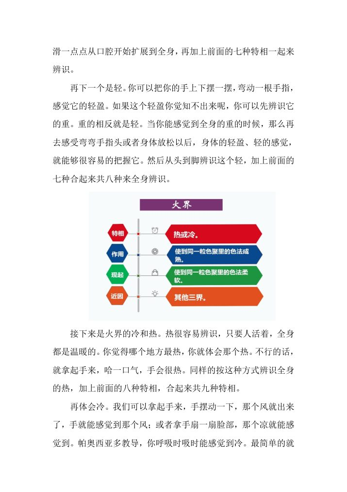
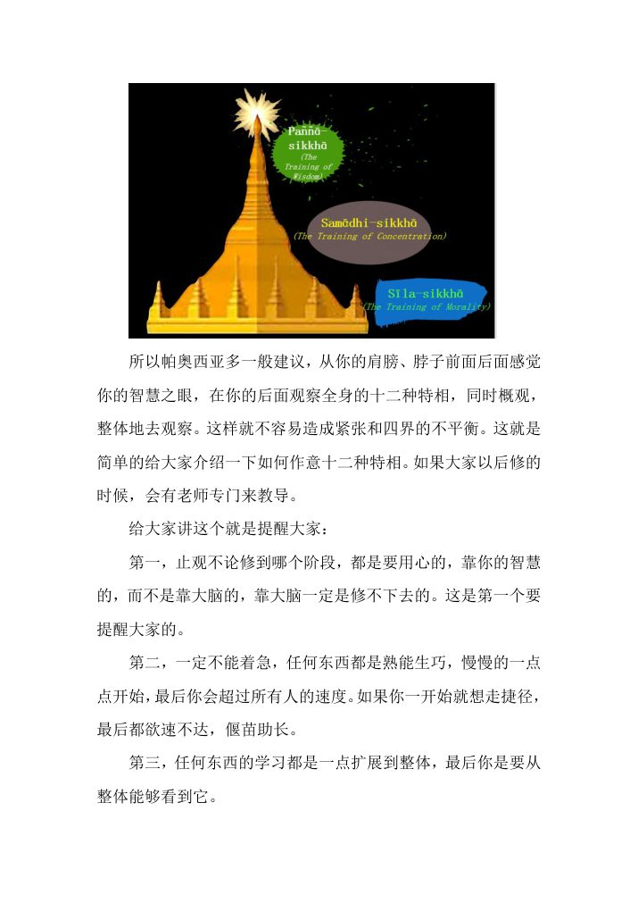
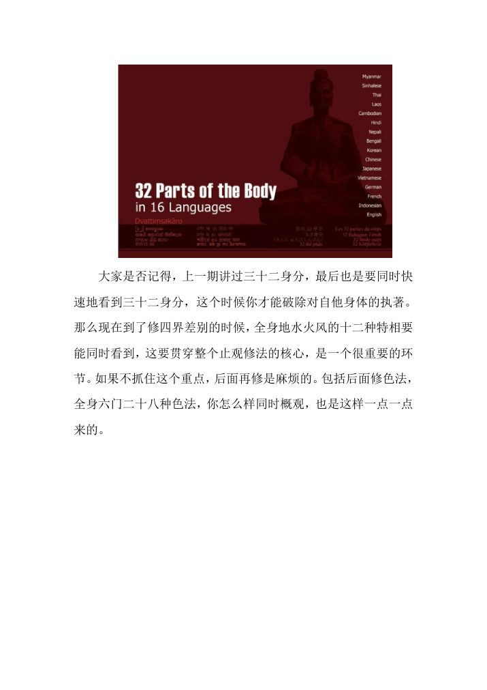
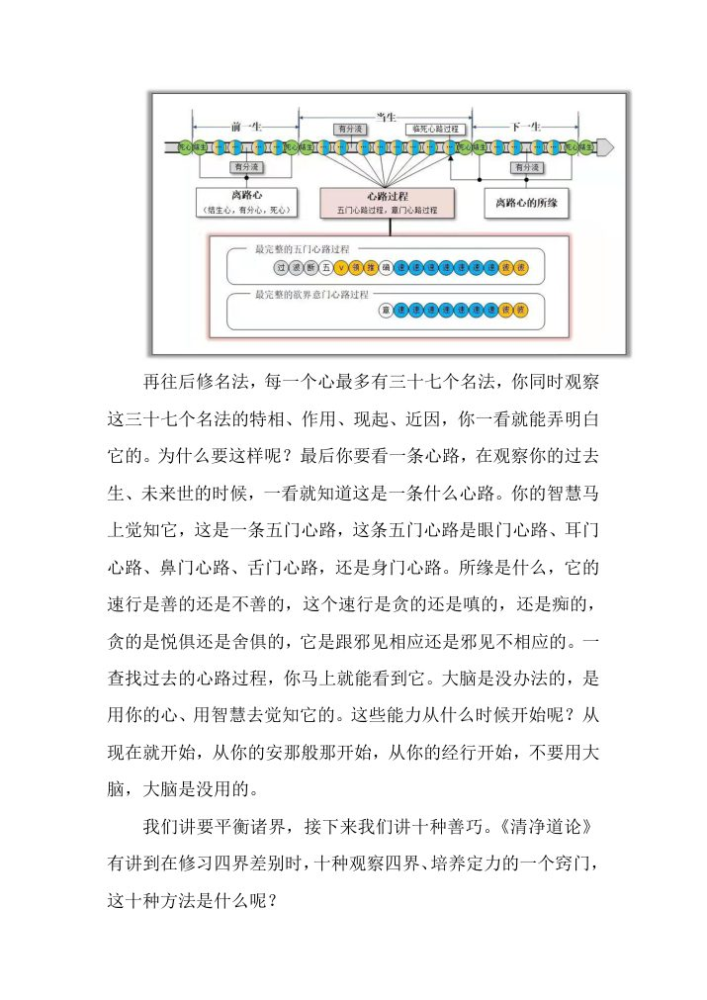
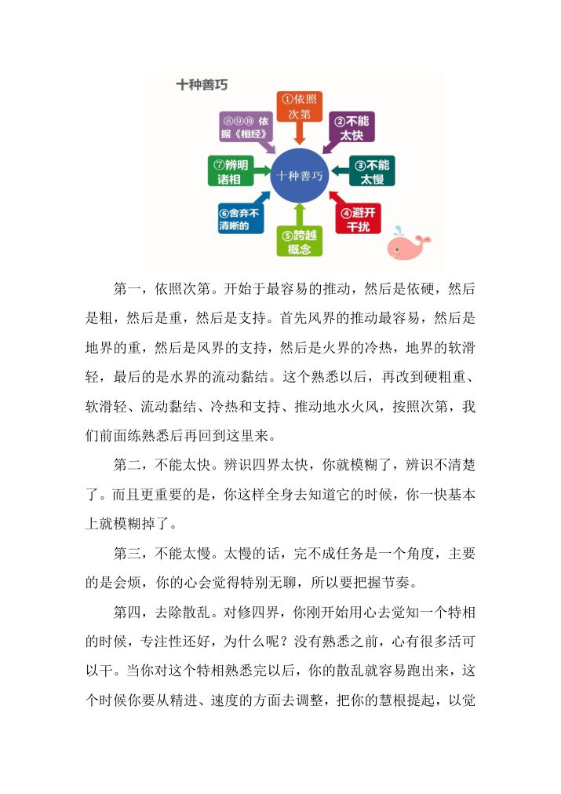

📅 最近更新：2026-09-29 12:30　|　第5版精修（朗读优化版）

# 第4周：修习利益与观智次第（主持人版）

> ⭐ **本讲主持人速览**（新主持人必读，2分钟看完）
>
> 你不是老师，是"共学同行者"。你不需要提前懂内容，只需要按流程走。
> **本周由连续两周内容合并**而成，含两段共读、两轮分享与两轮讨论，单讲 120 分钟。
>
> | 环节 | 标准时长 | ⏱ 时间不够→ | ⏱ 时间富余→ |
> |:-----|:----:|:-----|:-----|
> | 🧘 静心开场 | 10 min | 缩至5 min | 加2分钟静坐 |
> | 📖 共读原文1 | 20 min | 只读★核心段（约15 min） | 加读◈扩展段 |
> | 💬 第一轮分享 | 10 min | 每人1句话 | 每人3分钟 |
> | 🎯 第一轮主题讨论 | 10 min | 只讨论问题① | 讨论全部问题+扩展 |
> | 🧘 禅修练习 | 15 min | 缩至8 min（只念引导词前半） | 延长至20 min |
> | 📖 共读原文2 | 20 min | 只读★核心段 | 加读◈扩展段 |
> | 💬 第二轮分享 | 10 min | 每人1句话 | 每人3分钟 |
> | 🎯 第二轮主题讨论 | 10 min | 只讨论问题① | 讨论全部问题+扩展 |
> | 🔚 收尾与回向 | 15 min | 缩至10 min | 保持 |
>
> **主持人10条守则（精简版）**：
> ① 不讲解、不提供答案——让原文自己说话；② 有人问"正确答案"→说"先听听大家的看法"；③ 冷场→主持人先分享自己的真实感受；④ 跑题→温和拉回："这个有意思，我们回到今天的原文"；⑤ 争论→"两种看法都很好，大家保留自己的理解"；⑥ 确保人人发言；⑦ 不评判任何人的分享；⑧ 时间到了就推进；⑨ 禅修练习照读引导词即可；⑩ 结束一起回向。

> 本周主题：**三十二身分修习的利益——征服不乐与乐、忍苦缘、四色遍→四禅、乃至神通，最终落在「当下安乐住处」；定力成就是「止」的稳固自然呈现，不追求境界、不以体验自许。**；**三十二身分成就定力之后，须转向四界差别（见色聚→究竟色法→究竟名法→苦谛），再渐次修习观智（坏灭随观智…行舍智→圣道生起）；身至念是「止→观」的桥梁。仅凭三十二身分、生起厌离乃至证初禅，离证阿拉汉道果还很远。**。

---

## 📋 本周信息卡

| 项目 | 内容 |
|:----|:-----|
| 时长 | 120分钟（4周版 · 9环节） |
| 核心问题 | 三十二身分修习有哪些利益？它为什么是「当下的安乐住处」？定力成就之后，如何「从止转观」？ |
| 共读原文 | 共读原文1：材料①《第018讲-色法-四界_定力培育（共修版）》。　｜　共读原文2：材料①《13_禅修引导-三十二身分（录音）》。 |
| 本周作业 | 每日以「利益清单」为纲，择一组做一次身分作意（约 5 分钟），记录一次「烦恼被看轻／心转清凉／苦受不再被加重」的当下（一两句话即可）；不追求任何境界与奇妙体验。 |

## 🧘 静心开场（10 min）

（主持人照读即可，语速放慢，每句之间留呼吸的间隙。）

「各位同修，现在我们把这一段路走完的话，请先把自己安顿好。

请自然地坐好，找到自己正确的坐姿。观察一下你的坐骨，是不是垂直地坐在坐垫上。检查一下你的骨盆，是不是在自然的中立位——腰部有浅浅的脊柱沟，两边的肌肉是松软的。如果你的腰肌是挺硬的，说明你的骨盆有点前倾；如果脊柱沟消失了、腰部塌下来，说明有点后倾。所以请**旋转你的骨盆**前后调整，而不是靠挺胸去找位置。

好，旋转我们的右肩，向前、向上，向后轻轻放下，打开右边的胸腔；再旋转我们的肘尖，向前、向上，向后放下，打开左边的胸腔。想象自己的头部像一颗氢气球，自然向上飞；两个耳垂和两个肩峰，大致在同一个平面上。头不要仰着，也不要刻意收下巴。全身上下，松、静、自然。

现在，想象自己坐在一片空旷的原野上。左边是广袤的草原，鲜花盛开；背后是喜马拉雅山巍峨的雪山；前方是广阔的大海，阳光明媚、微风徐徐。

把过去的纠结，打包，扔到外太空。把对未来的恐惧和担忧，打包，扔到外太空。把对当下的不满和焦虑，打包，扔到外太空。注意，给自己的心按一个「清零键」——清空心里所有的思绪。

好，心静下来之后，我们跟自己的心说一句：**我们今天要修习三十二身分；并且，我们今天不追求任何境界，只求如实认识这颗心。**」

（静默约 30 秒。若时间富余，主持人可做下面这一段「身至念式放松」暖身，约 3–4 分钟——）

「【暖身·身至念式放松，选做】我们把注意力慢慢移到脚趾尖，放松；移到脚掌、脚跟，放松。移上小腿、膝盖，放松。移上大腿、臀部，放到坐垫的重量上。把注意力移到腹部——这里有小肠、大肠，它们正在安静地工作，我们只是知道，不去干预。移到胸腔，肺在起伏，心脏在轻跳，放松。移到两肩、两臂、两手十指，放松。移到颈部、下巴、面颊、眼周、额头，放松。最后移到头顶——这里有头发，从毛囊里长出来，我们心平气和地知道它。好，全身像被一遍温柔的水洗过，松、静、自然。」

（若心仍散乱，主持人可在静心末尾再加下面这一段「补白引导」，约 1 分钟——）

「如果此时心还是散乱的，不要着急。把注意力轻轻放在鼻端，跟随三次完整的呼吸：**吸气**，知道在吸气；**呼气**，知道在呼气。**第一次呼吸**，放下今天进门前的所有事；**第二次呼吸**，放松身体最紧的那个地方；**第三次呼吸**，跟自己说一句：『我只是来认识这颗心。』好，就这样安安静静地坐着——**不迎，不拒**。

再跟自己轻轻说一句：**今天的练习，不急。** 然后我们睁开眼睛，开始今天的共读。」

---

> 💬 **破冰｜3–5分钟**：说说看：你坚持最久的一件「修行功课」是什么？它给你带来了什么？

> 🛡️ **心理安全三约定**（每次开场在心里过一遍）：① **保密**——这里说的话不出这间屋子；② **不评判**——不评价任何人的分享，也不急着评价自己；③ **可随时暂停**——任何时候觉得不舒服，都可以停下来休息、喝水或离开，不需要解释。

## 📖 共读原文1（20 min）

> **主持人：** 本环节分两材料。**材料①为本周★核心**，逐条列出「修习三十二身分的利益」；材料②讲「有定力者」的成就相。以下照录均为**逐字原始转写**，保留时间码；转写为自动语音识别稿，个别同音讹字已在校对说明中列出，**照读时可直接跳过明显不通的句子**。

> **开读前的交代（约 1–2 分钟，请务必说）**：
> 1. **关于内容**：这两段录音是尊者 2025 年百日禅专讲与 2025-05-03 专题的现场开示，本周讲「修习三十二身分能得到什么」。我们**只读与『利益／定力成就』直接相关的段落**，其余段分属第4/5/6/8周。
> 2. **关于转写**：录音是由语音自动转写而来的**逐字稿**，同音讹字较多（如「三色生分／三四分分」＝三十二身分、「边浊」＝染着、「盲蚊」＝蚊虫、「青便／红便／白便」＝青遍／红遍／白遍、「四三八丁」＝四禅八定、「生之念」＝身至念、「山学生」＝三十二身分、「休学了」＝修学了）——**照读时遇不通处直接跳过**，一切以尊者原声为准。
> 3. **关于心理安全（本周重中之重）**：今天会读到「神通」「禅那光」「三十一界」等果德描述。**请每一位记住**：这是**佛法的果德地图，不是让我们去求的门票**。**不追求境界、不以体验自许、不互相比较**；有人一辈子也没取到任何「奇妙相」，这完全正常，也不影响他这一周把心安住在「安乐住处」里。
> 4. **关于方向**：本周的定盘句是——**利益是「止」稳、贪嗔轻之后自然亮的，不是「求」来的**。整场请守住：**不自我嫌弃、不嫌恶他人、不追求境界**。
> 5. **关于方式**：不必求全、不必求快；**能记住是好，不能记住也没关系，选一组有感觉的就练**。

**共读节奏控制（30 min 参考排布）**：

- 0–3 min：开读前交代（上框五条）（照读要点，不长篇）
- 3–12 min：材料①`[00:12:04]–[00:15:18]` 利益前六项（慢读，逐项点一下纲目）
- 12–16 min：材料①`[00:15:54]` 四色遍→四禅→神通（读后补「不追求境界」一句）
- 16–20 min：材料②`[00:01:48]–[00:03:16]` 有定力者（读「举目所及皆三十二身分」时放慢）
- 20–24 min：材料②`[00:03:16]–[00:04:20]` 无定力者两类（本讲取）（视时间取舍，做对照）
- 24–30 min：主持人串讲「利益清单→安乐住处」（用后文对照读与表格）

**利益清单（主持人边读边点，约 1 分钟；请慢、请稳）**：

「（一）**乐与不乐的征服者**——对自己的身体、对他人的身体，不再起贪乐。
（二）**怖畏恐惧的征服者**——对衰老、病痛的种种恐惧，看穿它只是『一堆身分』出问题。
（三）**能忍冷热、饥渴、蚊虫叮咬**——只是身分的反应，接纳它，就不加重困扰。
（四）**能忍恶言怨语**——他骂的只是『我身上的一个身分』，没有『我』。
（五）**能忍不愉悦、不致危害生命的『身苦受』**——同上理。
（六）**以青黄红白四色遍成就四禅**，进而成就神通。
（七）**当下安乐住处**——身至念本身，就是心当下安稳的家。」

> 领读时**不要赶**，每一条之间留一口气；读到「神通」一句，紧跟一句**「这不是要求我们求的，是给我们看清方向的地图」**，即进入下一环节或讨论。

### 原文材料①：★核心·《03_三十二身分1-古源尊者-20250503（录音）》

- **文件**：《03_三十二身分1-古源尊者-20250503（录音）》

> ⚠️ 主持人操作：**必读**`[00:12:04]–[00:16:34]`（八类利益，逐句皆为要点，建议全读约 8 min）。**建议提纲小卡**：把七项利益写在手边卡上，读时点纲目。**时间紧**：只读 `[00:12:04]–[00:15:18]`（前六项），`[00:15:54]` 四色遍段由主持人以要点口述。**心理安全**：涉「神通」处，**照读后必补「不追求境界、不以体验自许」**。

**【照录·录音转写原文，保留全部时间码】**（依据录音转写整理，已按同音讹字统一校订·正文直用正字）

**（一）修习三十二身分的八类利益（[00:12:04]–[00:16:34]）〔★核心段〕**

> [00:12:04.580] 打修这个三十二身分呢，它有什么样的利益呢？第一个，它是「乐与不乐的征服者」，那怎么理解呢？就是我们这个。对自己的身体。然后。对他人的身体，身体欢喜，觉得拥有自己很美貌，或者你这个，这个男朋友很帅，然后产生快乐。那那这个呢，就是当你去观察它都是一堆三十二种成分的时候，那么它就不会产生这个染着，就可以征服我们这个。这个对自身身体的贪爱和对他人身体的贪爱。第二个，是「怖畏恐惧的征服者」。
>
> [00:12:56.920] 这个怖畏恐惧的征服者。哪怖畏恐惧呢？我就是我们对身体对。衰老对于病痛，他很多的这种恐惧，他其实并没有一个我在生病呢。它只是那一堆身分，这个出现问题了。那这个能够忍耐。很热，好。能忍耐饥渴，
>
> [00:13:26.750] 蚊虫叮咬，就是你知道那个所谓的冷热，蚊虫叮咬，它只是那个三十二身分的一个反应。他把那个信息传导到你心里面来，那你为了传统我们在我们这个思维底层，是为了保护自己，这个身体，这个这个防御机制起作用的。等于你只要接纳接纳这个冷热，接纳这个饥渴，接纳这个蚊虫叮咬，它就这个知道它就向热身份传递的信息，我们自然而然就不会加重那个困扰。
>
> [00:14:07.920] 这个我记得当时我在。在莆田广化寺的时候，那是零几年？零四年零三年的时候，然后参加他的一个活动，就下午五点多钟六点钟的时候。
>
> [00:14:23.800] 看，有个老和尚。对他就穿个裤衩，就坐在那个外面，一个一个，一个一个废塔的边上喂蚊子。对，浑身长满长满蚊子，但是那个老和尚满脸红光，据他们说，已经喂蚊子喂了十几年了。也没有出现问题，对吧，我们讲说蚊子的有害会传播这个疾病，而且它那个那个那个附近就是个粪坑。所以那个蚊子应该是很毒的，我想看。车在那边喂了十几年，那也没有发现他有什么毛病，满脸红光。所以，一般我们就是认为这个蚊子咬了我们有多大的问题，但是很多是我们心造成，你心越恐惧呢，它就越有毒。它所以这是心毒。
>
> [00:15:18.740] 好，那么能够忍，能特言辞抱怨？能够这个人家骂你？是骂什么呢？是骂我哪一个身分？对吧，是骂我的肠子，还是，还是骂你的粪便？对对你就想你骂你骂的就是我一个身分，没有我，他就可以忍耐，就可以超越了，能够忍耐不愉悦，不可以危害生命的身受，跟刚才那个是一样的意思。这个所谓危害生命呢，就是三十二身分的这个出现状况。
>
> [00:15:54.760] 昨天那尊者讲的，就是你只要最差最差，你这个要死了。我们心在依住上，我们就安全，对吧？那么能够以四种色变成就四禅青黄红白，青色呢，就是我们的头发。我们可以取我们头发的颜色修青遍，可以修我们的尿，可以用尿的颜色或者脂肪的颜色来修黄遍。可以用我们的血液来修红遍，可以用我们的白骨来修白遍。就是取这个颜色了，那你取这个青黄红白修四禅八定，最后可以成就神通。

> ⚠️ 主持人操作：`[00:16:34.940]` 起转入「发毛爪齿皮」练习与四界差别段落，**归他周（第8周）**，本讲**不取**；本节照录止于 `[00:15:54.760]` 段末。

> **主持人对照读（口头串讲，不必逐字，可据下面要点用自己的话说）：**
> - **「乐与不乐的征服者」**：尊者把「不乐（忧、悔、失落）」与「乐（贪着、欢喜）」并提——**这是一条腿的两面**。我们对自己身体「觉得自己很美」，对他人身体「觉得男朋友很帅」，那一点「乐」一冒头，一观察「它只是一堆三十二成分」，**染着（边浊）就起不来**，对自他身体的贪爱便被征服。反过来说，**「不乐」**（不满、自卑、忧悔）也是同一个根——都以为「有一个我、有一个身体可执」，看清只是成分，两个一起松。

## 💬 第一轮分享（10 min）

**分享规则（开场先声明）**：①**自愿**为限，不想说可以「跳过」，说「我听听就好」即可；②每人约 **3 分钟**，先说感受、再说事例，**不评判他人**、不给建议；③分享内容**只谈自己**，不涉及具体他人、不指名；④涉及身体句子若令你不适，可只说「跳过这一句」，无需勉强；⑤主持人不追问、不诊断、不给心理学标签；⑥**本周特别声明**——分享**不以「境界／体验」论高低**，说我「没感觉」也很珍贵。

**起手问题（按人数选 2–4 个，由易到难）**：

1. **最相应的一项利益**：尊者的「利益清单」里，哪一项最打动你？是「征服不乐与乐」、是「忍冷热饥渴蚊叮」、是「忍恶言」、还是「当下安乐住处」？（提示：没有标准答案，说真实的那个。）
2. **生活里的「心毒」**：有没有一次经验，是「事情本来不大，是恐惧把它放大了」？比如怕蚊子、怕冷、怕被批评？（提示：对应本周「心毒」之喻。）
3. **「不乐」的那一面**：我们常谈「对治贪（乐）」，其实「不乐」（不满、自卑、忧悔）也是同根。你有什么「不乐」是最近常冒出来的？（提示：允许只说一句。）
4. **「安乐住处」的体会**：有没有一刻，你坐下来念了三十二身分几句，心就「安」了下来、不再乱窜？那一刻，你觉得它像什么？（提示：这就是本周的「利益」最朴素的样子。）
5. **「不追求境界」的自查**：听到「四禅／神通」时，你心里第一反应是什么？（提示：若冒出「我也想要」，很正常——说出来，我们一起校准方向。）

**分享形式**：人多时按 **3 人一轮**、每人限时 3 min（可用手机计时）；轮到的第一个人先做「一分钟静默」，再开口。**主持人不总结对错**，只在每轮末尾用一句「谢谢你的分享，我们把它放在心里」收束。

**主持人串场建议**：分享环节**不做结论**，把问题留在心里，带进讨论。若出现「我什么境界都没有，是不是白学了」这类表述，轻轻接一句：「**本周我们要学的，恰恰是——不必有境界，也能有利益。**」

## 🎯 第一轮主题讨论（10 min）

（四问由浅入深，指向实修。每问先给成员 2–3 分钟静默思考，再自由发言，主持人最后用「小结框」收束。）

### 第一问：什么是「乐与不乐的征服者」？——一条腿的两面

**引导**：尊者把「**乐**（贪着、欢喜）」和「**不乐**（忧、悔、失落、不满）」并在一项里说，为什么？我们平常修不净观，多半以为是对治「贪（乐）」；那么「不乐」算什么？「观察它只是一堆三十二成分」这句话，怎么同时把「乐」和「不乐」都松掉？

**讨论提示（主持人可用）**：
- **同一个根**：乐与不乐，都建立在「**有一个我、有一个可爱的身体**」这个假设上。觉得自己「很美」→ 起贪（乐）；觉得自己「不够美」→ 起忧（不乐）——**一体的两面**。
- **拆假设**：当如实观察「它只是一堆三十二成分」（发毛爪齿皮……尿），「有一个我、有一个身体可执」的假设就松了；**贪与忧同时失去燃料**。尊者用「**边浊**（染着）起不来」形容这个过程。
- **落到日常**：对着镜子、美颜相、朋友圈——乐与不乐都在这里生。修三十二身分，不是要你「觉得丑」（那是另一种不乐），而是**把两种都看清、都松掉**，回到「如实」。

**小结框**：乐与不乐是一体的两面，**拆掉「有一个我、有一个可爱的身体」这个共同假设**，两面一起松——这才是第一项利益的完整义。

### 第二问：为什么三十二身分能「忍冷热饥渴恶言身苦」？——「只是身分在反应」

**引导**：尊者讲了广化寺那位「**喂蚊十几年、满脸红光**」的老和尚，也讲了被骂时怎么想。请想一想：**「忍」到底是怎么个忍法？** 是把牙一咬、硬撑过去的「忍」，还是别的什么？「你心越恐惧，它就越有毒——这是心毒」这句话，说明了什么？

**讨论提示（主持人可用）**：
- **不是硬撑，是「不加重」**：尊者说，冷热饥渴蚊咬，**只是三十二身分的反应**、只是「信息传导到心」，而我们的「**防御机制**」一恐惧，就**把信号放大**。所以「忍」= **接纳信号 + 不额外加戏**，烦扰自然「**不会被加重**」。
- **「心毒」的现代译**：同样的蚊子包，有人一夜睡不着，有人浑然不觉——**差别在心**。「很多是心造成的，你越恐惧它就越有毒」，说的正是**恐惧本身在喂养痛苦**。
- **「忍恶言」的钥匙**：被骂时想——「**你骂的是我哪一个身分？肠子？粪便？**」把「被骂的我」拆成「一堆身分」，**「我」就从被骂的位置上下来了**，是「超越」，不是压抑。
- **安全提醒**：这里说的「耐」，**不是要你麻木、也不是要你忍受真正的伤害**（如暴力、长期霸凌——那要保护自己、求助）。**「勿以忍辱之名，行自伤之实」**：范围限于**不直接危害生命的一般苦受**（尊者明说「所谓危害生命，就是三十二身分本身出现状况」）。

**小结框**：身至念的「忍」，是**接纳＋不加戏**——把「我」从受苦位置上请下来，苦受就不再被「心毒」加重。**但这不是自伤式的隐忍**；真正的伤害，要保护、要求助。

### 第三问：「四色遍→四禅→神通」这段该怎么读？——定力成就与「不追求境界」

**引导**：这是本周最需要把分寸讲清楚的一问。尊者说，取发之青、尿之黄、血之红、骨之白，修四色遍入四禅，进而成就神通。请问：**这段是给谁听的？我们该拿它怎么办？** 如果我们读着读着，心里冒出「我也想有神通」，那该怎么办？「有定力者举目所及皆三十二身分、禅那光投向三十一界」——这段又和我们有什么关系？

**讨论提示（主持人可用）**：
- **先定性质**：这是尊者在报「**利益清单**」时，把**定力一路通向的果德**一并告诉我们——像一份**地图**，标出这条路能走多远。**地图不是奖券**，我们看到山顶就行，脚下这一步才是我们的事。
- **「不追求境界」的四条落地**：
  ① **不以求神通为目的**——修行的目的是**离苦、离执**，不是求得异能；
  ② **不以体验自许**——「我取到似相了／我见到光了」，**不是身份、不是资本**，说了也放下；
  ③ **不互相比较**——你「有」我「没有」，都在这条路上，**不比快慢、不排名次**；
  ④ **不追求、也不排斥**——真有境界现起，**如实知道、不执取**；没有，也**不乱找、不焦虑**。
- **「有定力者」这段的用处**：它是**「利益的深层次样本」**——告诉我们「念熟了会是什么样」，**给我们信心**，但**不是尺子**。我们在自己这一层老实念，同样在得利益（第 7 项「安乐住处」）。
- **一句翻译带回家**：把「我也想神通」译成——**「我先把这一组身分念熟、把心念安，就已经在利益里了。」**

**小结框**：四色遍与神通是**地图上的远山**，**看方向、不攀缘**。本周真正的落脚处是第 7 项——**当下安乐住处**。**不追求境界、不以体验自许、不互相比较**，是本周、也是全系列涉定力处的第一安全线。

### 第四问：身至念为什么是「当下安乐住处」？——「止」的层面与日常运用

**引导**：尊者把整份「利益清单」的最后一格，留给了四个字——「**当下安乐住处**」（现法乐住）。请想想：这难道是清单里最「小」的一项吗？为什么它反而是**最平常、最随时可用**的？「定力成就」与「当下的安住」，是一件事还是两件事？三十二身分作为「**止的层面**」，怎么在我们的日常生活里落地？

**讨论提示（主持人可用）**：
- **「安乐住处」＝心的家**：身至念可成就「**两种安止定**」（第5/6周已学）。它给我们的，不是一个「要完成的项目」，而是**随时可以回去的住处**——散乱了，来几句身分作意，心就有着落。**「现法乐住」的意思，就是『当下这一法上，就能住得安稳』。**
- **「止」的两层**：其一，**镇伏五盖、令心平静**（无定力者也能得——材料②的「第一类修习」）；其二，**成就近行定乃至安止定/四禅**（有定力者的深果）。**两层都叫「定力成就」**，只是深浅不同，**别拿上层否定下层**。
- **为什么它「最平常也最珍贵」**：前六项多少要「条件」（对境、定力）；**唯独「安乐住处」当下就能用**——昏沉时用它（内容多、有层次，不易睡着）、散乱时用它（先来回觉察几组，心静了再回根本业处）。**它把修行从「特殊时刻」带回「此刻」。**
- **落地两把钥匙**：**钥匙一·「护卫业处」**——昏沉、散乱时，拿三十二身分「急救」。**钥匙二·「安乐住处」**——把身至念当「心的家」，每天回去坐一坐，不求结果，只求「住得安」。
- **串回「止→观」**：身至念**既是安稳的住处（止），也是观身的桥梁（观）**——它**不是终点，是从止到观的一段路**。第8周我们会看到它如何与四界差别、观智次第衔接。

**小结框**：「当下安乐住处」不是清单的末位陪衬，而是**最能随时兑现的一项**——散乱、昏沉、烦恼起时，身至念就是心的家。**止稳了，果自然亮；住得安了，路才走得远。**

### 第五问：把这周的「利益」带回生活——你的「安乐住处」怎么「开张」？

**引导**：清单听完了，落脚处也找到了。现在只剩一件事：**下周这七天，你打算怎么用？** 请具体到——**哪一组身分、大约什么时候、一次几分钟、为了哪一项利益。** 「安乐住处」不是抽象口号，它要有一个能「开张」的日常动作。

**讨论提示（主持人可用）**：
- **把利益变成「一句话动机」**：与其说「我要修三十二身分」，不如说「**我每天下班坐 5 分钟，念第一组，为了『心不乱窜』**」——**动机越具体，越住得稳**。
- **三种可开张的场景**：**①晨起**——坐好，用第一组（发毛爪齿皮）唤一唤心的「清醒与安稳」；**②散乱/昏沉时**——拿它当「护卫业处」急救；**③临睡前**——顺逆各念一遍，把一天的攀缘「卸下来」。
- **「一间屋」的比喻**：不要一开始就想着「把三十二间房全装修好」。**先找一间最喜欢的、最『住得安』的房住进去**（一组身分、乃至一两个身分），住稳了，再慢慢扩。**能记住是好，不能记住也没关系。**
- **一张作业纸**：请每位写下「组别＋时段＋分钟＋动机」四格，本周带回分享（自愿）。

**小结框**：「安乐住处」要**能开张**才算数——**一组身分、一个固定时段、一个具体动机**，就是本周最好的落地。**不求多、不求快、不求境界，只求住得稳。**

## 🧘 禅修练习（15 min）

### 练习一

（主持人照读即可。本练习分四步：安顿 → 一组作意（顺） → 利益对照体会 → 收束。全程强调「松、凉、舍」，且**不求任何境界**。）

「好，我们一起来练一小会儿。

**第一步·安顿（约 3 分钟）**。自然地坐好，坐骨垂直，骨盆转到中立位，腰有浅浅的脊柱沟，两肩打开、放松，头如氢气球轻轻上提。想象自己坐在空旷的原野——左边草原、背后雪山、前方大海。把过去的纠结、未来的担忧、当下的不满，一一打包，扔到外太空。给自己的心按一个清零键。

**第二步·一组作意（顺）（约 6 分钟）**。现在，我们跟自己的心说：**我要修习三十二身分；今天不求境界，只求如实。** 我们选**第一组**来练。

在心里，从头顶开始，**发**——从毛囊看到头发，它的颜色、它的味道；**毛**——除了手掌脚掌，全身都遍布，细的或粗的皮毛；**爪**——两个手指甲、十个脚趾甲，从肉一直看出去；**齿**——三十二颗牙，从牙根一直看到，充满牙垢；**皮**——把它看成全身的一个皮囊，或选一片皮肤来看。

不要停留在名字上。让**名字和它的样子合一**，乃至只剩那个样子。看到它，**如实知道：它不具可喜性，它不可喜**——仅仅是「不可喜」，**不是讨厌**。心是松的、凉的、舍的。**能取到全部就取到，取不到，取一个两个也可以。**

**第三步·利益对照体会（约 4 分钟）**。现在，我们**只是安安静静地坐着，念熟这一组身分**。念三两遍。此刻，请留意——**你的心，是不是比刚坐下来时，平了一点、松了一点？**

（轻轻停一拍）**这一点「平」与「松」，本身就是本周利益清单里的第 7 项——「当下安乐住处」。** 我们不是要在这里「求」到四禅、求到神通；我们只是**让心回家**。若有杂念，就再回到「发、毛、爪、齿、皮」，**如实地念**。

如果你愿意，也可以轻轻对自己说一句：**「冷热饥渴、他人言语，只是身分的反应；我接纳它，不加戏。」** 然后**放下这句话**，只是安静地坐着。

**第四步·收束（约 2 分钟）**。好，现在把心从这组身分上**轻轻松开**，回到自己的根本业处；没有根本业处的，就回到自然的呼吸。**若有任何「体验」现起，如实知道它、不执取、不追寻**；若什么也没有，**那就更对了——我们练的是「如实」，不是「奇妙」**。对自己说一句：**我练过了，不急。**」

> ⚠️ 主持人操作：①练习中若有人举手示意不适，**立即**请其睁眼、做三次深呼吸、必要时暂离；②**绝不点名**让谁「取到」谁「取不到」，**更不比较境界**；③练习结束后，先做 30 秒「回到身体、听声音、松肩」的落地，再进入下一环节；④若现场普遍出现「恶心/紧绷」，第二步可改为**只练「皮→齿→爪→毛→发」的轻柔版**，或干脆只做安顿与呼吸。

> ⚠️ **禅修禁忌提示**：若你正处在严重抑郁、焦虑、创伤后应激，或精神类疾病的发作／用药期，或正经历强烈的情绪危机，请先咨询医生或心理师，再决定是否练习；练习中若出现明显不适（如心悸、胸闷、情绪失控），请立即停止，睁开眼睛，把注意力放回呼吸与身体，必要时离场休息。

### 🧘 附录 · 利益清单微练习（选做，3–5 分钟；主持人照读）

> **用法**：时间富余时，可在练习中挑**一项利益**做「微体会」，各约 1 分钟，**点到即止、不贪多**。**全程不求效果**，只求「如实知道」。

- **「乐与不乐」微体会**：「想一件你最近对自己身体起『乐』或『不乐』的小事——只是知道：哦，这是『乐』，或这是『不乐』。然后，把它放回三十二身分里看：它其实只是一堆成分。知道即放下。」
- **「心毒」微体会**：「想一个最近让你烦的小麻烦（蚊子、冷、堵车）。观察：**是事情本身难，还是我把它放大了？** 只是知道，不评判；把『放大』的那个手，松一松。」
- **「恶言」微体会**：「回想一句你最近听到的、让你不舒服的话。想——他骂的，是我身上的哪一个身分？肠？粪？…… 把『我』从被骂的位置上，轻轻请下来。」
- **「安乐住处」微体会**：「只是安静坐着，念熟一组身分，或者只是跟随呼吸。接受：**此刻，我哪里也不用去，就已经住下来了。**」

> 每段做完，都回到「**松、凉、舍**」再换下一段；**同一次不要贪多，一到两段足矣**。重点不是「得到什么」，而是「**练在正确的方向上**」。

---

### 练习二

（主持人照读即可。本练习分四步：安顿 → 一组身分作意（**用心版**）→ 四界微体验（选做）→ 收束。全程强调「**用心不用脑；松、凉、舍**」，且**不求任何境界**。）

「好，我们一起来练一小会儿。

**第一步·安顿（约 3 分钟）**。自然地坐好，坐骨垂直，骨盆转到中立位，两肩打开、放松，头如氢气球轻轻上提。想象自己坐在空旷的原野——左边草原、背后雪山、前方大海。把过去的纠结、未来的担忧、当下的不满，一一打包，扔到外太空。给自己的心按一个清零键。**今天我们再提醒自己一句：用心，不用脑；心知道，就够了。**

**第二步·一组身分作意·用心版（约 7 分钟）**。我们跟自己的心说：**我要修习三十二身分；今天不求境界，只求如实。** 我们把心轻轻放在**心脏**这个地方，把它当成一面**显示屏**。现在，让我们选**第一组**来练：

在心里，**头发**在这里出现——可以是头顶的一根、一片，或整个头顶的头发；**它的颜色、它的味道、它那油腻黏黏的样子**，我们都如实知道：它**不具可喜性，它不可喜**。接着，**体毛**在这里出现——腋下的、全身的；**指甲**在这里出现——从指甲根一直看出去；**牙齿**在这里出现——从牙床开始，牙缝里的牙垢；**皮肤**在这里出现——皮下冒着膏脂，一天不洗就发臭。

**不要用脑子去想它，让它在心里呈现出来就好。** 不要停留在名字上，让**名字和它的样子合一**。如实知道：**它不可喜**——仅仅是「不可喜」，**不是讨厌**，心是松的、凉的、舍的。**能取到全部就取到；取不到，取一个两个也可以。**

**第三步·四界微体验（选做，约 3 分钟；时间紧时跳过，直接到第四步）**。现在，请把心放在**呼吸**上，感受身体里的**推动**——吸气、呼气，胸腔、腹腔在微微起伏；再把心放在**坐骨**上，感受身体被**支持**着——我们坐得住，就是因为有这个「支持」。就是这两个：**推动，支持**。**只是知道，不必分析，也不必求它「明显」。**

**第四步·收束（约 2 分钟）**。好，把心从这一组身分上**轻轻松开**，回到自己的根本业处；没有根本业处的，就回到自然的呼吸。**若有任何「体验」现起，如实知道它、不执取、不追寻**；若什么也没有，**那就更对了——我们练的是「如实」，不是「奇妙」**。对自己说一句：**我练过了，不急。**」

> ⚠️ 主持人操作：①练习中若有人举手示意不适（尤其第二步涉内脏气味等想象），**立即**请其睁眼、做三次深呼吸、必要时暂离；②**绝不点名**让谁「取到」谁「取不到」，**更不比较境界**；③**第三步「四界微体验」为选做**，且**只取「推动、支持」两个最容易的特相**，**不涉**「把身体破掉／找空界」等进阶内容——**那些是方向，不是今晚的练习**；④练习结束后，先做 30 秒「回到身体、听声音、松肩」的落地，再进入收尾。

> ⚠️ **禅修禁忌提示**：若你正处在严重抑郁、焦虑、创伤后应激，或精神类疾病的发作／用药期，或正经历强烈的情绪危机，请先咨询医生或心理师，再决定是否练习；练习中若出现明显不适（如心悸、胸闷、情绪失控），请立即停止，睁开眼睛，把注意力放回呼吸与身体，必要时离场休息。

### 🧘 附录 · 材料②完整引导词（选做，10–16 分钟；主持人照读，或播放录音）

> **用法**：时间富余、且现场状态平稳时，主持人可**照读材料②的完整引导词**（`[00:00:08]–[00:16:25]`，见「共读原文」所附前半＋下列续段），带领一次**完整的三十二身分观照**；**时间紧时只用上文的「第二步·用心版」**。**全程务必先声明「可厌＝不可喜，非厌恶；可跳过、可暂停」。**

> [00:07:41.920] 全身就是一个骨架。我们看到那个骨架，身上这个骨架。这个骷髅。一个可怜的骷髅。这骨头里面有骨髓。现在是红色的。有血液。然后是肾脏。腰上面一点的两个肾脏，外面包着一层膜。
>
> [00:08:11.620] 啊扫描文扫描文。我心下。心脏外面有一层。心包。心脏在。左边胸里面，左胸下一点。在在波动着。输送血液，它是血腥血腥的。下来是肝脏。左边大右边小一点。肝脏的辣腥味儿。
>
> [00:09:02.380] 然后是膜，包括心脏的包膜、肾脏的包膜（三种膜）。皮肤，以下全身，肉跟皮肤之间那一层。触觉神经为主的这样的包膜。然后是脾。脾在心，心脏往下，胃部往上，那个靠左边的那个旮旯里面。那个小拳头一样的，脾。肺，（肺）在心脏上方，就是左胸右胸，里面主要是那个肺腑。是。肉红色的，有点像。
>
> [00:10:00.620] （如）未熟的无花果，里面的果仁、果肉。然后是腹腔里面的肠子，小肠。大肠，大肠是绕着小肠。肠与肠之间有膜，脂肪性的膜。肠间膜。然后是胃。胃里面的食物，那个。跟粪坑一样的。充满了这种臭味的。胃中物。然后小肠里面呢，是胃中物的，往下推到大肠里面就变成粪便。的分别。很臭的粪便。而是大脑。脑壳里面的大脑。看下是胆汁。肝脏左边靠下部后下方的。感觉。痰在你的这个。食道跟肺，整个肺部和。脾脏，里面都有储痰的地方，就有很多痰，黏黏的。
>
> [00:11:40.880] 脓呢，就是想象你可以回忆一下过去曾经，皮肤发炎，肌肉发炎，那个白白的那个脓。血液呢就是从心脏出来。遍布全身的这个。暗红色的血液。然后是汗。
>
> [00:12:08.470] 现在没有流汗，你可以想着天气热的时候，浑身的这个冒汗，汗滴。新新的，咸咸的那种。好。脂肪，像肚皮。在臀部，大腿根部。里面都有那个。

> **收束引导（照读）**：好，让我们的心平静下来。回到心脏。鼓励一下自己——**给自己点个赞，表现不错。** 搓一搓手，把手心的温度敷在眼睛上，梳梳头，揉揉腰。保持正念，慢慢地回到当下。

---

## 📖 共读原文2（20 min）

> **开读前的交代（约 2 分钟，请务必说）**：
> 1. **关于内容**：这一讲是把前七周「止」的功夫，接到「观」的门上。我们**只读与『意门修习＋四界差别＋观智次第』直接相关的段落**，其余段分属第2/5/6/7周。
> 2. **关于转写**：录音是语音自动转写的**逐字稿**，同音讹字较多（如「三者身份／三色身份／三十二身」＝三十二身分、「意门」＝意门〔识知之门〕、「单CPU」＝单一「运算中枢」之喻、「世界差别」＝四界差别、「进行定」＝近行定、「究竟设法／旧金色法」＝究竟色法、「十六观制」＝十六观智）——**照读时遇不通处直接跳过**，一切以尊者原声为准。
> 3. **关于心理安全（本周重中之重）**：今天会读到「近行定」「光明」「把身体破掉」「找空界」「修名法看心路」「十六观智」等内容。**请每一位记住**：这是**佛法修学历程的『方向图』**，**不是让我们本周就去追求的境界**。**不追求境界、不以体验自许、不互相比较**；我们本周要做的，只是**把这张地图看明白，然后回到脚下这一组身分**。
> 4. **关于方向**：本周的定盘句是——**身至念是「止→观」的桥，过桥是为了如实看清，不是为了「得到什么」。** 整场请守住：**不自我嫌弃、不嫌恶他人、不追求境界**。
> 5. **关于方式**：不必求全、不必求快；**能记住方向是好，不能记住也没关系**，把「身至念→四界差别→观智」这三步的顺序记住，本周即达标。

**共读节奏控制（30 min 参考排布）**：

- 0–2 min：开读前交代（上框五条）（照读要点，不长篇）
- 2–8 min：材料①`[00:23:02]–[00:26:37]`「用心不用脑」要点（慢读，读到「用心去指导」时停一拍）
- 8–12 min：材料③照录3-1（三十二身分→四界→色／名法→看心路）（读后点「这三步就是今天的路线」）
- 12–16 min：材料③照录3-2（近行定→把身体破掉、找空界）（读后补「这是方向图，不是追求目标」）
- 16–19 min：材料③照录3-6（结语·阿毗达摩是拿来修的）（放慢「都要用心，都要轻松自然，都要如实」）
- 19–24 min：主持人串讲「止→观」主线（见后文精讲）（用后文对照读与表格）
- 24–28 min：材料④`[00:00:38]–[00:03:18]`（止观／纯观行者；十六观智起修）（读后补「不追求境界」一句）
- 28–30 min：材料③照录3-4、3-5（十二特相辨识／十种善巧，节选）（视时间取舍，只作「方法面」点读）

### 原文材料①：★核心·《03_三十二身分1-古源尊者-20250503（录音）》

- **文件**：《03_三十二身分1-古源尊者-20250503（录音）》

- 适用定位：W8 主力·「用心不用脑／意门」修习要点（心是精神活动中枢、大脑是开关、单CPU与六门）；有定力者以心为「显示屏」呈现身分；现场静坐引导与收束

> ⚠️ 主持人操作：本材料为本周★核心。**必读段**：`[00:23:02]–[00:26:37]`（「用心不用脑／意门」要点，逐句皆要点，建议全读）；`[00:26:37]–[00:36:36]`（现场静坐引导与收束）**可作为「禅修练习」环节的补充照读**或要点口述。**时间紧时**：只读 `[00:23:02]–[00:26:37]` 的意门要点。**音声说明：依据录音转写整理，已按同音讹字统一校订·正文直用正字**；转写为语音识别原始稿，同音讹字较多（如「发毛爪子皮」＝发毛爪齿皮、「大麻床和沙牙床」＝上牙床和下牙床、「羽毛」＝体毛、「通知卡」＝〔取〕一团、「皮张」＝皮囊、「军工」＝功〔能〕〔转写存疑〕等），**正文已按同音讹字统一校订（直用正字）**。**心理安全**：本段涉「用心不用脑」「单CPU」「六门」等修习技术性提醒与静坐引导，照读后可加一句「**不追求境界、不以体验自许**」。

**【照录·录音转写原文，保留全部时间码】**（依据录音转写整理，已按同音讹字统一校订·正文直用正字）

**一、「用心不用脑／意门」修习要点（[00:23:02]–[00:26:37]）〔★核心段〕**

> [00:23:02.770] 大家要记住。佛陀教导的所有止观业处啊，都是用我们的意门啊，用我们的心。用心来去观察啊。
>
> [00:23:19.040] 那不要用脑子想。。脑子想呢，你修三十二身分就会想到脑子疼啊，很多人就会脑子疼呃，下来的时候很不轻松很不爽。
>
> [00:23:31.600] 心里想呢，就是很简单，就是说我们想一下你的脚。想一下你的手啊，那就是想出来的啊，但是呢，你要拉着自己的这个感觉，拉着你的眼睛去看你的手，看你的脚的时候呢，他就会用脑子去做，那脑子呢，其实脑呢。这个他是不会想东西的哈。这个在我们的观察里面呢，这个大脑呢，它是个开关。它并不是这个精神活动活动的这个中枢啊，我们精神活动的这个中枢呢，就是心脏。大脑是个开关。开关什么开关呢，就是连接。五官四肢跟心之间的这个开关。因为心只有一个，
>
> [00:24:26.430] 人类呢，单CPU啊，所有的一切生命都只是单CPU，它只有一个运算系统，就在心脏里面。
>
> [00:24:35.380] 但是呢，我们有六个心灵感官窗口，就我们有个六个信息来源的窗口，
>
> [00:24:43.130] 眼睛啊，耳朵啊，鼻子啊，舌头啊，身体啊啊以及我们心里面遐想的，那这个除了。这个心里想的，其他的眼耳鼻舌身呢，他。所有信息收集完以后，都是要通过大脑然后再跟大跟我们的心脏连接了啊。所以，
>
> [00:25:05.450] 那么这样的这个过程呢，它是用大脑来切换的。所以，你感觉好像大脑在想东西，其实大脑不想东西，大脑是负责（来回）切换啊。那么，你觉得要用大脑去想的时候呢，其实是我们的心。先抛大脑，但是你也不知道所谓大脑在哪个部分啊，你就想去整个大脑去想这个东西，所以整个大脑里面呢，这个首先呢，它的这个这个大脑的这个这个开关啊，它就会出现紊乱。，他又没有办法正常的运作，所以糊糊的啊，蒙蒙的那种感觉啊啊，
>
> [00:25:43.050] 那第二一个呢，就是我们心到大脑来，心里产生的心生色法就在这个大脑沉积停滞哈，所以就会造成这个大脑沉重啊，这些情况就会出现了啊。所以因此呢。
>
> [00:25:57.720] 要学会只是用心去指导，用心去指导，那你如果实在不会用心呢，你就心就把你的心就放在心脏这个地方。然后头发就让它在这里出现啊，体毛在这里出现。啊牙齿在出现，皮肤在这里出现啊啊这个这个熟练完以后呢，你再去知道啊，这些发毛爪齿皮呢，它其实在身体哪一些部位，这样你知道它啊，它就不会太就是啊这个出现这些啊问题啊。
>
> [00:26:34.340] 这个是三十二身分的一个基本的原则，

**二、现场静坐引导与收束（[00:26:37]–[00:36:36]）**

> [00:26:37.490] 给大家讲一下啊。大家现在坐好，我们练习一小会儿。，找到自己。舒适的位置，。，观察自己的臀部啊，看看我们的。要不啊？，然后调整自己的骨盆，让自己的腰部在一个自然的位置上。，旋转一下我们的肩膀啊，中间坠肘啊，那我们的胸腔打开，那肩膀放松。想想我们的头部被。项目。气球一样的向上飘。。对拉我们的这个这个脊椎啊，然后把这股力量放开。，然后在。这个。这个。创建马桶的平面上。，一般呢，我都建议让。身体调好以后呢，就把身心也放空一下。
>
> [00:28:18.140] 所以自己坐在一个宽阔的。原野上。，后面是。巍峨的喜马拉雅山。始终是。宽阔的草原。。阳光明媚。微风徐徐。前方是。广阔的大海。忙。。回到我们心脏的位置。。过去的纠结。追回。打个包。在上海。把对未来的。恐惧。，有。各种没有意义的规划。打个包。奔向大海。当下的不满、焦虑。。面向大海。给自己的内心放一个清零键。清零。好，跟自己的心讲，我们现在要修习三十二身分。
>
> [00:30:34.300] 头发。用你的心。感知一下头顶的头发。或者让那个头发在你心里面的位置呈现出来。把你的心脏当做一个显示屏。。你可以看一根头发，或者一个片头发，或者整个头顶的头发。好吧。并不可爱，但是可厌。那是体毛。注意观察自己的眉毛。或者让眉毛在心里面呈现。。身体的汗毛。体毛是可。你可以在全身的每一个部位，或者从大到脚慢慢的去。观察那个皮毛。就这样。的某一个指甲。然后选手的视角。两个手的指甲。然后是脚指甲。有些人指甲有灰，指甲。，指甲已经腐烂了。指甲是可验。

## 💬 第二轮分享（10 min）

**分享规则（请主持人先讲清，约 2 分钟）**：①本轮以**自愿**为限，每人**2–3 分钟**，说**自己的体会**，不说别人的对错；②**只听不评**——他人分享后，我们不判「对／错」、不比较「高／低」；③**不以体验自许**——有没有「感觉」、有没有「光」「相」，都不作为分享的资格；④分享围绕本周两个落点：**「我这一周，练身至念的那点功夫，感觉是停在『止』上，还是已经开始松动对身体的执取？」** 与 **「听完今天的『桥』，我最想在生活里迈出的一小步是什么？」**

**起手问题（选 2–3 个，请慢，给沉默留出空间）**：

1. **「本周之前，你有没有过这样的想法：『只要我一直念三十二身分，就该离证果越来越近了？』」**——今天尊者告诉我们，「证初禅」也还「非常遥远」。**问**：听到这句，你心里的第一反应是什么？是失落，还是松了一口气？为什么？
2. **「用心，不用脑——这句话你能举出一个『用脑』的小例子吗？」**——比如练到又紧又胀、越想越乱的时候。**问**：你一般是什么时候发现自己「用脑」了？后来怎么换回「用心」的？
3. **「身至念这座桥，你走到哪一段了？」**——是才刚学会「念成链」，还是已经能「取到不可喜相、心能定下来」？**问**：这一周，你更想继续把「止」扎稳，还是想试着了解一下「观」的门在哪儿？为什么？

> ⚠️ 主持人操作：若有人分享「我看到了光／我取到似相了」，**先随喜、不追问细节、不比较**，再把话题带回「**如实**」二字：**「好，那我们再回到脚下一步——今天你安住在哪一组身分上？」** 若有人因为「证初禅还很远」而气馁，温和提醒：**「方向清楚，本身就是大利益；不急，一步有一步的安稳。」**

## 🎯 第二轮主题讨论（10 min）

### 第一问：为什么「生了厌离、证了初禅」，还「离阿拉汉道果很远」？

- **引导**：先请大家说出自己的理解，再由主持人归纳。
- **主持人提示**：关键在**「止」与「观」的分工**。「可厌作意」能成就的是**定力**（乃至初禅），而**道果必须经「无常、苦、无我」三门**。**类比**：可厌作意像**擦干净眼镜**，让你看得清；但**看清什么、看出无常苦无我**，是「观」的活儿。**擦镜子≠看见镜中的真相**，但**不擦，就看不见**——所以身至念**不是没用，是「必要但不充分」**。

### 第二问：「用心，不用脑」——这对我们的实修意味着什么？

- **引导**：请一位同修现场示范「用心想一下自己的左手」与「用眼睛去找左手」，说说两者的差别。
- **主持人提示**：①**门不同**：意门（心的知）vs 脑（切换、用力）；②**可验证**：用脑会紧、会胀、会「下来后不爽」，用心是松的、轻的；③**下手处**：「实在不会用心，就把心放在心脏，让身分在这里呈现」。**落到生活**：开会、通勤、被人激怒时，也可以「用心知道」而不「用脑硬想」——**这一句，比三十二身分本身更普适**。

### 第三问：从「一堆身分」到「一堆色聚」到「一堆名色法」——这一路在干什么？

- **引导**：请同修试着用自己的话说一遍：三十二身分→四界差别→色聚→究竟色法→究竟名法→苦谛。
- **主持人提示**：这一路，是**「把『我』拆得越来越细、越来越真实」**。「头发」还带着一点「我的」味道；到「色聚、究竟色法」，就只剩下**生灭的、无主的**；到「名色法」，就**直指苦谛**（五蕴、五取蕴）。**一句话**：「**不是要把身体想得恶心，是要把它看得真实。**」**边界**：这是**方向**，**不是今晚的任务**；听不懂名相完全没关系，**把顺序记住就好**。

### 第四问：身至念为什么是「止→观」的桥？——桥的两头各是什么？

- **引导**：请同修各说「桥的这一头」（止）与「桥的那一头」（观）各是什么。
- **主持人提示**：**这一头**是「可厌作意成就的定力＋不执取身体之见」；**那一头**是「四界差别→名色法→观智→圣道」。**桥的意义**：**身至念不让你停在「厌离」里，也不让你跳过「止」去硬观**。**主持人可说**：「停在桥中间（只求厌离、只求初禅）会怎样？——**那是舒服的休息站，不是终点站**。今天我们把桥看清楚，就是给自己一个『敢往下走』的方向。」

### 第五问：把这周的「方向」带回生活——你这一周，只做哪一件事？

- **引导**：请每位同修说**一件**、而且是**最小的一件**——「这一周我只做：____」。
- **主持人提示**：把大题目收成小动作。**示例**：「这一周我每天只做一次：坐下来，用心、不用脑地念一遍『发毛爪齿皮』，然后回到呼吸。」**边界**：不承诺「我要修到四界差别／要见色聚」——**那是方向；这一周的作业，是脚下的这一小步**。**分享末尾，主持人再强调一遍**：**不追求境界、不以体验自许。**

> ⚠️ 主持人操作：五问**不必全做**（时间紧时做前三问）。每一问后**留够沉默**，不抢话、不代答。若有人问「四界差别要不要现在就学」，回答：**「了解方向就够，本周不要求修到；真要修，依止善知识、按次第来。」** 若有人追问「色聚、名法」，回答：**「这些是方向图上的地名，记住名字、知道大致位置就好，不必现在就去『看到』。」**

## 🔚 收尾与回向（15 min）

### 收尾一

**一、总结引导（主持人照读）**：

「今天我们收了一份『利益清单』。

第一，我们知道：**修三十二身分，是有利益的**——征服「乐与不乐」，征服「怖畏恐惧」，能忍冷热饥渴蚊叮、能忍恶言、能忍身苦；再往上，是由四色遍入四禅，乃至神通。**但请一定记住**：这份利益**不是『求』来的奖赏，是心静了、贪嗔轻了，自然亮的果**。

第二，我们要把方向守住：**涉定力、涉神通处，不追求境界、不以体验自许、不互相比较。** 「四禅、神通、禅那光」是**地图上的远山**——看方向就好；脚下这一步，才是我们的事。有人一辈子没取到任何『奇妙相』，**照样在得利益**。

第三，也是最重要的一项，请带回家：**「当下安乐住处」**。散乱时、昏沉时、烦恼起时，坐下来念几句三十二身分，心就有地方安放。**身至念，是心的家；止稳了，路才走得远。**」

**二、下周预告**：第8周《三十二身分与四界差别、观智次第》——我们将说明**仅凭三十二身分不足以直证阿拉汉，须结合四界差别与观智次第**，把这条链**从「止」引向「观」**。请带着本周的「安乐住处」来——下周我们会看到，身至念这座桥，通向哪里。**温馨提示**：下周所取录音段与本周不同，请仍按当周的取段说明聆听，勿越界混听。

**三、本周作业（认领）**：每日以本周「利益清单」为纲，择一组做一次身分作意（约 5 分钟），记录一次「烦恼被看轻／心转清凉／苦受不再被加重」的当下（一两句话即可）；**不追求任何境界与奇妙体验**，只记录「如实」的那一点。**请把「选定组别」与「最相应的那一项利益」写在纸上**，下周可带回分享（自愿）。

**五、带组者周间陪伴指引（主持人备用）**：
- **周中轻提醒（群内一句话即可）**：「本周记得练一组身分、为着『安乐住处』；练到任何『奇妙感』，如实知道、不执取就好。」
- **三类回访**：①对**没感觉**的——鼓励继续「只默念名字」，不追求相；②对**攀缘境界**的——提醒「不追求、不排斥」，回到当下安住；③对**没练**的——不施压，只问一句「这周哪一天方便，我把要点再说一遍」。
- **红线**：**不比较进度、不排名、不以境界论高低**；遇到情绪困扰者，**转介专业人士**，主持人不做心理「处理」。
- **下周衔接**：预告第8周「三十二身分与四界差别、观智次第」；请提醒组员**把本周的「安乐住处」带在身上**，下周才好谈「由止入观」。可顺手把本周材料①`[00:12:04]–[00:16:34]`再听一遍（**只听本周段，勿越界听第5/6/8周段**）。

**六、下周预习提示**：带着一个「本周落脚处」来——你练得最安的是哪一组？「安乐住处」对你来说，是什么样子？下周我们看这座桥，通向哪里。**也请提前想一个问题**：如果「仅凭三十二身分不足以直证阿拉汉」，那么这条链，还要接上什么？（下周揭晓。）

**七、本周金句（主持人念一遍，学员可选记一两条）**：
1. **利益是果，不是酬劳**——心静了、贪嗔轻了，它自然亮。
2. **忍＝接纳＋不加戏**——减少的是「心毒」，不是「界限」。
3. **越往上，越要不求**——四禅、神通是地图上的远山，看方向就好。
4. **身至念是心的家**——散乱、烦恼起时，回去坐一坐。
5. **没有境界，也在得利益**——「住得安」本身就是第 7 项。

**四、回向词（合掌齐诵）**：

> 愿以此功德，普及于一切；
> 我等与众生，皆共成佛道。
>
> 愿一切众生，无怨敌，无瞋害，
> 无苦恼，安住于快乐。

---

### 收尾二

**一、总结引导（主持人照读）**：

「今天我们走了八周的最后一段路，把三十二身分这座桥，看清楚了。

第一，我们纠正了一个**美丽的误会**：**「修三十二身分可以证得阿拉汉道果」不是「对着它来回练」就会证果。** 哪怕能生起厌离、能证初禅，那也只是**止禅的最高成就**，**离道果还很远**。

第二，我们看清了一条**路线**：**三十二身分成就定力 → 转向四界差别 → 见色聚、究竟色法、究竟名法 → 名色法就是苦谛 → 渐次修观智（坏灭随观智…行舍智）→ 圣道生起、涅槃。** 身至念，是**「止→观」的桥**。

第三，也是最重要的一句，请带回家：**这一张图，是『方向』，不是『门票』。****不追求境界、不以体验自许、不互相比较。** 我们走在哪一步，就在哪一步老实住。

第四，我们守住了**那条根本**：**用心，不用脑。** 无论修四界差别、修安那般那，还是在生活里训练正念正知——**都要用心，都要轻松自然，都要如实。**」

**二、八周回顾与叮嘱（约 3 分钟，主持人恳谈）**：八周里，我们从「认清楚」到「念成链」，从「取到不可喜相」到「练得心能安住」，今天又上了「止→观」的桥。**请记住**：**这八周的重点从来不是「修到什么」，而是「如实看清、不自我嫌弃、不嫌恶他人、不追求境界」。** 这四条若有，八周就没白走。

**三、下周／后续预告**：本系列（读书会24·三十二身分专修）八周**至此圆满**。后续可依止善知识，按次第深入**四界差别与观禅**；**涉身念处整体脉络，详见读书会06**；**涉慈心禅，详见读书会02**。**温馨提示**：本讲所取录音段（材料①`[00:23:02]–[00:36:36]`、材料④`[00:00:01]–[00:12:49]`）与第2/5/6/7周**不同**，请仍按当周取段说明聆听，**勿越界混听**。

**四、本周作业（认领）**：每日择一组身分做一次**「用心不作意于脑」**的身分作意（约 5 分钟）——**把心放在心脏的位置，让身分在这里呈现，不用脑子去硬想**；收束时把心松开、回到呼吸。**只记录「如实」的一点**（一句「今天心比昨天平了一点」即可）；**不追求任何境界与奇妙体验**，**也不与人比较**。**请把「今天用心练的那一组」写下来**（自愿分享）。

**五、带组者周间陪伴指引（主持人备用）**：
- **周中轻提醒（群内一句话即可）**：「本周记得练一组身分、记得**用心不用脑**；练到任何『奇妙感』，如实知道、不执取就好。」
- **三类回访**：①对**气馁**的（「我还差得远」）——提醒「**方向清楚就是进度**」，把大题目收成每天 5 分钟；②对**冒进**的（「我要去修观智了」）——提醒「**先止后观、依师而修；本周只做脚下这一步**」；③对**没练**的——不施压，只问一句「这周哪一天方便，我把要点再说一遍」。
- **一句总纲**：**桥要走，但不赶、不跳、不比。**

**六、回向（主持人领众念，四句）**：

「**愿以此功德，普及于一切；**
**我等与众生，皆共成佛道。**
**愿三十二身分之学，成止观之桥；**
**愿见法如实，离苦得清凉。**」

（另可依传统念：**「愿以此功德，导向诸漏尽；愿以此功德，为证涅槃缘。」** 由在场者随喜。）

---

## 📌 本讲主持人特别提醒

1. **【本周重中之重·不追求境界】** 本讲涉「定力／神通／禅那光／三十一界」，**务必反复强调三条**：**①不追求境界、②不以体验自许、③不互相比较**。把三十二身分定位为「**止→观的桥梁**」与「**当下的安乐住处**」，**不是目标本身**。凡有人以「我取到似相／见到光」自许或攀比，**随喜、不追问细节、把话题带回『如实、不执取』**。真实的伤害（暴力、急病）要**保护自己、及时就医、求助**，**绝不以「忍辱」之名行自伤之实**。

2. **【心理安全·可厌与忍的分寸】** 本讲会读到「不净」「可厌」的延续语境。全程守住——**「可厌」＝不可喜（asubha），不是厌恶、不是自我嫌弃、也不是嫌恶他人**；三十二身分**对治贪，亦征服嗔（不喜欢）**。涉「忍」处，**澄清「接纳＋不加戏」≠「挨着、忍着、别反抗」**。凡涉内脏等段落，**开头先声明**：「可跳读、可只取一处、可随时暂停」；**不点名、不举例到具体人、不展开医学建议**（器官观察≠医学）。

3. **【「利益」的正确读法】** 帮助学员把「利益」读成**果**、不是**酬劳**：**是心静、贪嗔轻之后自然亮的**。前五项（对治）可踏实做；第六项（四禅/神通）列为**方向**，不求；**第七项「当下安乐住处」是本周真正的落脚处**——不必等四禅、不必等神通。

4. **【时间码纪律】** 本周两材料均为**同文件多周共用**：材料①只读 `[00:12:04]–[00:16:34]`，材料②只读 `[00:01:48]–[00:04:20]`（`[00:03:16]–[00:04:20]` 本讲取、第6周不取）；**其余时间码归第4/5/6/8周，请勿越界朗读**。照录为自动转写稿，个别同音讹字已列，照读遇不通处**直接跳过**。

5. **【跨周呼应】** 本讲「利益」是第6周「可厌作意与顺逆序」的自然延伸——顺逆串链让心「住得稳」，本周点出「住得稳」带来的果。**下周（第8周）**接「四界差别与观智次第」，把桩子从「止」打进「观」。涉慈心处（忍/不净与慈心互为对治）可注明「详见读书会02」；涉身念处整体脉络处可注明「详见读书会06」。

6. **【落地与陪伴】** 练习结束务必做**30 秒落地**（回到身体、听声音、松肩）再散场；如有人在练习中明显不适，会后**单独、温和**地关心一句即可，不追问、不贴标签、不做心理「处理」。带组者请留意：**「境界」议题易引发攀比与自我怀疑**，全程以「**不追求、不比较、可只听不做**」为底线。

<!--EXT_READ-->
## 📖 延伸阅读（课后自由选读）
- 《03_三十二身分1-古源尊者-20250503（录音）》——可厌作意与顺逆序修法。
- 《13_禅修引导-三十二身分-古源尊者-20231108（录音）》——三十二身分禅修引导。
- 《第018讲-色法-四界_定力培育（共修版）》——四界差别观与定力培育。
- 《08_四界差别-古源尊者-20250508（录音）》——从「止」转「观」的四界差别修法。
- 《第 182 讲 应用（摄集30）：三十七道品／苦之集［身念处·可厌作意］》——可厌作意应用讲记。
<!--/EXT_READ-->
