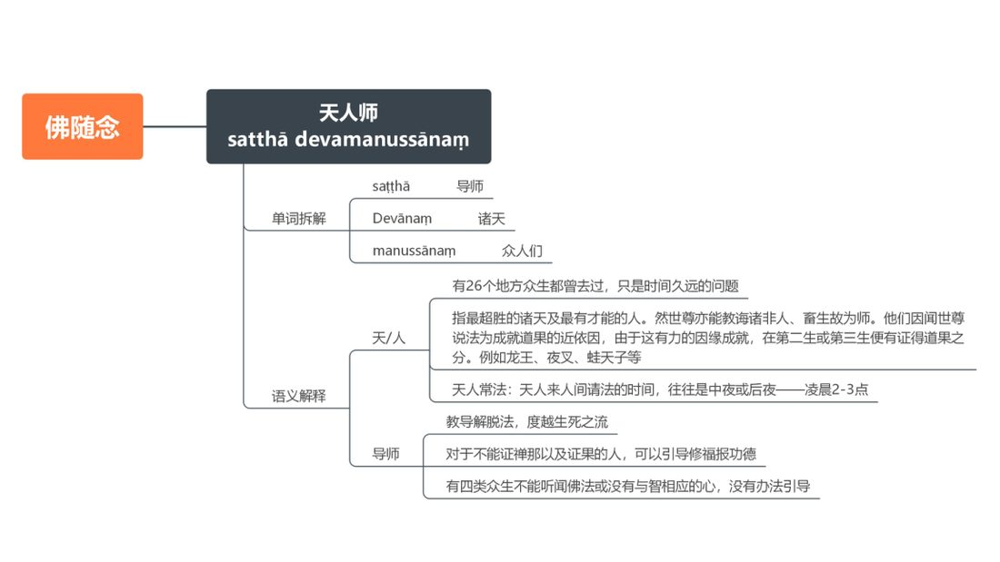

📅 最近更新：2026-09-29 12:30　|　第5版精修（朗读优化版）

# 第1周：总论与佛随念（主持人版）

> ⭐ **本讲主持人速览**（新主持人必读，2分钟看完）
>
> 你不是老师，是"共学同行者"。你不需要提前懂内容，只需要按流程走。
> **本周由连续两周内容合并**而成，含两段共读、两轮分享与两轮讨论，单讲 120 分钟。
>
> | 环节 | 标准时长 | ⏱ 时间不够→ | ⏱ 时间富余→ |
> |:-----|:----:|:-----|:-----|
> | 🧘 静心开场 | 10 min | 缩至5 min | 加2分钟静坐 |
> | 📖 共读原文1 | 20 min | 只读★核心段（约15 min） | 加读◈扩展段 |
> | 💬 第一轮分享 | 10 min | 每人1句话 | 每人3分钟 |
> | 🎯 第一轮主题讨论 | 10 min | 只讨论问题① | 讨论全部问题+扩展 |
> | 🧘 禅修练习 | 15 min | 缩至8 min（只念引导词前半） | 延长至20 min |
> | 📖 共读原文2 | 20 min | 只读★核心段 | 加读◈扩展段 |
> | 💬 第二轮分享 | 10 min | 每人1句话 | 每人3分钟 |
> | 🎯 第二轮主题讨论 | 10 min | 只讨论问题① | 讨论全部问题+扩展 |
> | 🔚 收尾与回向 | 15 min | 缩至10 min | 保持 |
>
> **主持人10条守则（精简版）**：
> ① 不讲解、不提供答案——让原文自己说话；② 有人问"正确答案"→说"先听听大家的看法"；③ 冷场→主持人先分享自己的真实感受；④ 跑题→温和拉回："这个有意思，我们回到今天的原文"；⑤ 争论→"两种看法都很好，大家保留自己的理解"；⑥ 确保人人发言；⑦ 不评判任何人的分享；⑧ 时间到了就推进；⑨ 禅修练习照读引导词即可；⑩ 结束一起回向。

> 本周主题：**从「一张业处地图」到「十随念与四护卫禅」——认清四十种业处的框架、十随念的清单、四护卫禅的分工；各随念的细节，分别留给本系列第2–8周细讲。**；**以「十号功德」为所缘修佛随念——认清十号、学会对机而念、认识「建塔法」这一内外护卫的实操；修的深浅不重要，念对方向最重要。**。

---

## 📋 本周信息卡

| 项目 | 内容 |
|:----|:-----|
| 时长 | 120分钟（4周版 · 9环节） |
| 核心问题 | 四十种业处的框架是什么？十随念是哪十支？佛随念的所缘——佛陀的十种功德，如何「对机而念」？ |
| 共读原文 | 共读原文1：材料①《231111大佛禅修营第九天·四十种业处-古源尊者-20231111》，材料②《2一切业处&根本业处-古源尊者-20230704》。　｜　共读原文2：材料①《4_佛随念-佛陀的十种功德&Arahaṃ-古源尊者-20240914》，材料②《16_佛随念-天人导师-古源尊者-20250120（课件）》，材料③《6_佛随念建塔-古源尊者-20240916》。 |
| 本周作业 | 每日择佛随念一支（或十号中一号）随念三至五分钟，念对方向即可；并记一句「今天我是靠什么安住的」。不要求修得深，只求念得对。 |

## 🧘 静心开场（10 min）

**开场准备与氛围（会前 10 分钟完成）**

> 1. **环境**：灯光柔和（不要顶灯直射），通风但不直吹，手机静音并集中放置；座位围成圆形或半圆，让每个人都能安稳地看见前方。
> 2. **坐姿三选**：①坐垫（盘腿或散盘，膝盖不适者用两个垫子）；②椅子（双脚踏实、背不靠死，可垫小枕）；③跪坐（备垫子）。开场就说明：**「哪一种都好，中途可以换，换姿势不是失败。」**
> 3. **物**：备水、面纸、薄毯。本周谈「业处地图」，有人听到「死随念、不净随念」等名相可能心头一紧，面纸与薄毯备在旁。
> 4. **开场三句话（先讲纪律，再进引导）**：①「全程 120 分钟，中途可自由起身、可去喝水。」②「本周会点到『死』『不净』这些名相，任何人随时可以选择**只听不说、只取一处、随时暂停**，这是我的承诺。」③「**我们在这里只谈自己的体会，不谈别人的事、不评断任何人。**」
> 5. **主持人自己的准备**：会前 5 分钟静坐，把**十随念名单**在心里念一遍（佛、法、僧、戒、舍、天、死、寂止、身、入出息念），并确认自己能一句白话讲出「四护卫禅是哪四个、各护什么」。**主持人心里有地图，全场就不乱。**
> 6. **不做的三件事**：不布置「必须记住全部名相」；不要求成员报告修到哪；不在开场引入神通、鬼神、境界的猎奇话题。
> 7. **静心阶段的三层节奏（主持人心里有数）**：第一层「松身体」（约 2 分钟）——呼吸、放松肩颈、下巴、眉心；第二层「收心思」（约 3 分钟）——把未完成的事「打包扔掉」，给心按清零键；第三层「带问题」（约 3 分钟）——把「我此刻的心，站在这张地图的哪一格」轻轻放进心里。最后 2 分钟留给静默，**不急着开口**。
> 8. **会前主持人独处三分钟（照做）**：找个角落坐下，放下手机，做三次深呼吸，心里默念三句话——①「今晚我只带路，不评判」；②「先铺地图，再走路」；③「认得名、知道护什么，就算数」。带着一张安稳的脸进入场地。**主持人的脸，就是全场的定心锚。**
> 9. **开场前先在心里划好本讲的边界（主持人参考）**：本周只带大家「认得地图、记住清单、分清分工」；**各随念的详细修法归本系列第2–8周**（佛随念→W2、法随念→W3、僧随念→W4、天随念→W5、死随念→W6、不净随念与食厌想→W7、寂止随念与皈依·从止转观→W8）。若有人在开场或共读中提前问到某支随念怎么修，只回一句方向话——「**这个我们留到那一周专门讲**」——**不展开、不硬讲、不引原文**。心里有这条边界，场上就不会被「越问越深」带跑。
> 10. **本周的「温度」设定（主持人参考）**：这是一门「先看清地图」的功课，不是「比谁懂得多」的功课。开场与全场，请把语气的温度定在「**从容、宽松、不评判**」——你越不急，成员越敢问；你越稳，成员越安心。**不要把「业处」念成一堆吓人的术语，也不要把「随念」念成一种任务**；它只是「把心安放在一个善的所缘上」的朴素方法。
> 11. **开场就把「本讲的坐标」给成员**（主持人参考）：本周是全系列八周的**总论**——像一张地图的「图例页」，先告诉大家有哪些格子、各护什么；真正的「走进每一格」，从下周佛随念开始，一周一格，共七格加一个收束。**先给坐标，成员就不会迷失在一堆名相里**；也请把「本周不评比、不赶进度」讲在最前面，让大家带着轻松的心进入共读。

**主持人引导语**（照读即可）：

> 各位贤友，请找一个让自己舒服的姿势坐好，背自然挺直，双手轻轻放在腿上，眼睛可以微微闭上，也可以垂目看着前方一小块地面。
>
> 先做三次深长的呼吸：吸气，知道自己在吸气；呼气，知道自己在呼气。让肩膀松下来，让下巴松下来，让眉心松下来。
>
> 现在，把注意力轻轻带到「正在呼吸的这个身体」上——你能感觉到气息的进出、身体的重量、接触坐垫的压力。这个呼吸，就是今天我们要讲到的一个最朴素的业处；它一直都在，从来没有离开过你。
>
> 心里也许还挂着今天未完成的事。不赶它们走，只是跟它们说：等一下再说。我们先给心按一下清零键——不是把念头压下去，而是先把纠结、期待、担忧「打包，扔掉」。心松了，才装得下一张新地图。
>
> 好，我们保持轻松、开放的觉察，带着一个问题来开始今天的共读：**我学佛、修行这么久，我心里有没有一张『地图』——知道自己在修什么、它护什么、下一步往哪走？**……不必急着回答，只是把它轻轻放在心里。

> 主持人：本段第 3、4 段的意思呼应材料① [00:26:12]「佛陀教导的业处呢？我们分两类，一类叫职业处（止业处），一类叫观业处」；照读即可，语速放缓，句间停顿两拍。开场只做「安静」与「说明纪律」，不做任何业处的具体讲解，把「可退出」的话先讲在前头。

> 💬 **破冰｜3–5分钟**：说说看：说到「忆念」，你平时最常想起的是什么——人、事，还是佛、法、僧？

> 🛡️ **心理安全三约定**（每次开场在心里过一遍）：① **保密**——这里说的话不出这间屋子；② **不评判**——不评价任何人的分享，也不急着评价自己；③ **可随时暂停**——任何时候觉得不舒服，都可以停下来休息、喝水或离开，不需要解释。

## 📖 共读原文1（20 min）

### 原文材料①：★核心·《231111大佛禅修营第九天·四十种业处-古源尊者-20231111》（音声转写）

- **文件**：《231111大佛禅修营第九天·四十种业处-古源尊者-20231111》

> ⚠️ 主持人操作：本材料为本周★核心。**30 分钟内建议照读四段**：①[00:26:12]–[00:26:46]「四十种业处框架」；②[00:26:46]–[00:32:15]「十遍＋十不净」；③[00:32:15]–[00:53:15]「十随念逐支点名」；④[00:53:15]–[01:03:37]「四梵住＋四无色」。**不照读 [01:03:37] 之后的「筑基／世界差别」段**（与总论关系较远）。第1周为**总论**，各随念只「点名」不抠细节：佛随念→W2、法随念→W3、僧随念→W4、天随念→W5、死随念→W6、不净随念与食厌想→W7、寂止随念与皈依·从止转观→W8；涉慈心禅修法处注明「慈心禅详见读书会02」。时间紧时只读①③两段（框架＋清单）。

> 【照录·录音转写原文，保留全部时间码】（依据录音转写整理，已校对明显同音错字）

#### 一、四十种业处的分类：止业处四十种＝十遍＋十不净＋十随念＋四梵住＋四无色（[00:26:12]–[00:26:46]）

> [00:26:12.220] 佛陀教导的业处？我们分两类，一类叫止业处，一类叫观业处。
>
> [00:26:21.020] 止业处，佛陀总共教导过四十种，四十种，叫十遍十不净，
>
> [00:26:30.570] 十随念。他就取了三个十、两个四，然后「一想」「一分别」。

> 主持人注：本段为全讲的「总纲第一句」——**止业处（奢摩他业处）四十种＝十遍、十不净、十随念、四梵住、四无色**（另加「食厌想」「差别」两项，故有「三个十＋两个四＋想一想」之说，共四十二或四十之数，随传承分法而异）。本周只建立这张「科目表」，不逐项展开。念完**停 10 秒**，让「十遍—十不净—十随念—四梵住—四无色」五个词在心里落一落。

#### 二、十遍（转写作「十变」）与十不净（[00:26:46]–[00:32:15]）

> [00:26:46.540] 十个遍，就地水火风青黄红白、光明遍、虚空遍。
>
> [00:26:55.800] 地水火风是修我们世界的那种概念相，如果未来大家要修的话。地，去取那种青泥色，最好那种池塘色，或者那个小河边上那种那种烂泥，那种颜色，没有石头颜色比较纯的，给它糊一个圆圆的。你这个看着那个干干了以后看着那个土的颜色，注意它是地，这个是地，地是这种青泥色，是一种用种土状的东西。要注意它的地，取这样的。地的颜色，不是那个颜色就是地的这个概念，作为他地，内心会升起地变的相专住这个相，
>
> [00:27:58.495] 可以证得初三二三四场，也可以证得后面的事无色界。
>
> [00:28:04.870] 水，就是取那个一桶水，你看那个水心里面会升起水的变相，火就是看火。那个火焰。风，就是，心里面想的那个风，就想或者风吹在你身上，你知道这是风，看到外面风吹树在摇曳，知道这是风，心里面取到这个风的概念。专注它，能够取得证得分辨一二三四场，同样的，他这些电场，都可以证得四无色界定。这个是取地水火风的概念，不是它的究竟法。比如我们在修地界的时候，地界有青红华，就印出重法华轻。对？你取这个印出重法华轻，就不能够真的禅，那他只能证得进行定。
>
> [00:29:13.160] 后面的青红黄白，是色变。青红黄白，青就是青色，青色，这个青色，这个一般，我们不去取这种这种青绿色的东西。青色，一般是取，最最好的取，取你的头发的颜色，就是有些人我们叫青丝，对，头发被称为青丝，但是现代人头发搞了很多名堂，又是染黄了，又是染的，就不是去那样了。那有些人的头发，会偏褐色，那也是可以。青或者褐都可以，黄就是最好取那个紫檀，或者你的尿尿液的颜色。红，就血液的颜色，或者外在的白红的颜色。
>
> [00:30:04.470] 白，就是白骨，或者取这样的这个白纸，这样的颜色。去，专注他。那这个光明变，就是取光明，
>
> [00:30:20.255] 一般，我们是取早上八九点钟的太阳。这个太阳，不直接取它，而是取这个太阳从树梢上照下来，那个光光线，就很明亮的那个光线，光线取那个颜色。或者，你合适，你也觉得太阳刚冒出来那个很明亮的，直接看太阳颜色也可以，看你自己喜欢。
>
> [00:30:50.060] 这九种变禅，都可以证得，大定，现定虚空变，它是，在天上无云的时候，你可以拿一个空间的东西看天上，就那个空间是被限定的，所以它空，如果得去证得。以限定虚空遍不能证得四种无色界禅，因为它容易跟对于初学来讲，它容易跟这个，空无边处混起来对，所以大部分情况下，限定之空变作用不大，所以大部分人就不怎么很认真去练习它。第十种变场。
>
> [00:31:41.260] 十种不净，主要指指坟场观，就是，这个尸体从青瘀相、膨胀相、脓烂相、断坏相、食残相、散乱相，这个展其离散相好，这个血徒相重聚相，骸骨相就是尸体腐烂的这个十个过程，去专注它的不净，和可厌，每一个相都能够证得出藏。但是他不能够更深入，

> 主持人注：**十遍＝地、水、火、风、青、黄、红、白、光明遍、限定虚空遍**（转写把「遍」听成「变」）；**十不净＝坟场观的十种尸体相**（青瘀／膨胀／脓烂／断坏／食残／散乱／斩斫离散／血涂／虫聚／骸骨等，转写讹字多，只作点名）。**本周只建立清单，不展开修法**；涉不净处**只说「不可喜（asubha）、去贪着」，不讲尸体细节、不渲染恐怖**，详法见本系列第7周。

#### 三、十随念清单与逐支点名（[00:32:15]–[00:53:15]）

> [00:32:15.540] 十种随念，佛随念、法随念、僧随念、戒随念、舍随念、天随念、死随念、身至念、入出息念、寂止随念。死随念我们也学习过了，那法随念跟身随念，跟佛随念的修法很类似。所有的随念，它的一个特点就随随的，随的意思是数数就一直重复的，你重复的意念分开一下，重复的意念，它的这个，它的特点或者它的功德。或者这个对他那种状态的赞叹。那佛随念从十个功德名号里面取它的相应功德来修，法随念，有五种功德，
>
> [00:33:10.740] 大家以后可以看法。第一个，它是佛陀所善说的，什么叫佛陀善说？佛陀说的法前善中善后善，佛陀说的法，他自始至终都是。向美的，它不会有自相矛盾。
>
> [00:33:28.660] 所以我们现在很多人学佛，就发现有很多佛教的理论是自相矛盾的。那是因为后期发展有不同的流派。那不同流派显然就有后期的人的加工，
>
> [00:33:43.310] 有些就不见得都是，佛陀的本意，从好或者说，有些它是方便说我们不能够理解里面的深意，所以，
>
> [00:33:54.935] 就会觉得他有很多的矛盾，但是你有真正第一个部派里面。比如说，上座部的佛陀的巴利三藏，巴利三藏佛陀的经典里面，不会有。你因为找不到有哪一个经经典它会互相矛盾，不会是佛陀所上说的是自见的，就是你可以去亲见的。佛陀说的法，都是你可以亲见的，无实的，无实的，就是当你道智升起的下一个刹那，果智就一定会生起。就是道果的道的果报，它是无间的。对你一正果，立即涅槃就现前，对？你的心就会沉入果定。无实的来见的，来见的，就是所有人都可以来学。
>
> [00:34:57.520] 我们后期佛教里面有密法。但是，真正像佛陀教导的是没有秘法，没有秘密，就像佛陀的法，就像一个人你手上拿的都是宝贵，都是宝贝一样的，都是珠宝一样，你不会想说我不敢给你看，佛陀的法是这个，这个来见的所有人，你愿意都可以来见。
>
> [00:35:24.880] 实际上是导向涅槃的，什么意思？就像我们第一天开始讲卡拉马经一样的，就是它一定是导向烦恼的断境。佛陀的法是导向烦恼的断尽，而不是导向轮回，导向更精美的轮回，这个要很仔细的去分析它。
>
> [00:35:45.500] 智者可以各自正直的，一个有志的人，什么志，观智。一个有志的人，他可以自己知知道他挣到了什么。他不需要哪一个人来给你认证，自己很了解，而且道字升起的时候，他一定会升起。省察之省察，已生的道智果智涅槃已断烦恼和未断烦恼自动会升起来。这样的一种智慧，自己去检查的，这个是法的定则，就是跟自然规律一样的。对，这是五种法的这种。
>
> [00:36:25.480] 这个功德了，我们在每天早晚功课的时候都会念到，索阿卡拉多那个就是法的功德。那我们意念法的功德，你可以思维这个法的功德，赞叹这个法的功德，希望获得这个法的功德，希望修习这个法的功德，你数数的这样历练。你心里面会升起，这个一种定力，这种静心定的定力。好，就是当我们对法的信心不足，或者我们不能够投入法的时候，可以多修法的功德。

## 💬 第一轮分享（10 min）

**分享规则**：自愿分享、不点名；每人 2–3 分钟；只谈自己的体会，不评价别人的分享；主持人在每人分享后给一句「承接」，把话题轻轻带过。

> 主持人开场话（照读即可）：接下来是第一轮分享。这一轮不谈「修得好不好」，只谈「今天的这张地图，哪一格让你有了感觉」。说多少都可以，不想说也可以，坐着听就是参与。

**起手问题（2–3 个，可任选）**：
1. 今天讲的「四十种业处」这张地图里，你对哪一格最有感觉——十遍？十不净？十随念？四梵住？四无色？为什么？
2. 「十随念」这十个名字里，有没有哪一个，你以前听过、甚至念过，却从来没想过「它到底随念什么」？
3. 听到「四护卫禅」——佛随念护『心无力、恐惧』、慈心护『没有危难』、不净随念护『去身贪』、死随念护『防懈怠、破死惧』——你觉得**自己此刻最需要哪一件「护身之物」**？（没有标准答案，说一句就好。）

> 主持人提示：分享环节最忌「变成名相考试」。若有人开始背术语、比谁知道得多，请温和接住：「**名相是用来认路的，不是用来比的；认得一格，就够了。**」若有人「一时都没感觉」，也接一句：「**没感觉也是真实的感觉，先放身上，八周慢慢就熟了。**」
>
> 主持人备选追问（气氛较冷时，可挑一个轻轻抛出，帮成员开口）：①「你以前有没有把『随念』理解成『随便想想』？今天有没有一点点改观？」②「如果『随念』就是反复地把心安放在一个善的所缘上，你觉得自己最容易安放、也最愿意安放的，是哪一类所缘（人、事、功德、呼吸）？」③「今天这四个护卫禅里，哪一个名字让你觉得最亲切、最不陌生？」——**追问只为帮开口，不为考答案**；有人不愿答，直接过，不追。

## 🎯 第一轮主题讨论（10 min）

**组织形式**：先小组（3–4 人，10 min），再大组汇总（约 20 min），最后由主持人记下「共识三条」。三问由浅入深，指向实修。

- **问题①（★必答，时间不够时只讨论这个）**：原文说，止业处四十种里，**十随念是「数数量、重复地把心安放在一个善的所缘上」**。对照你自己的经验：你平常「心里反复想」的那些事，大多落在什么所缘上？如果要挑一支随念（佛／法／僧／戒／舍／天／死／寂止／身／入出息念），你愿意先试哪一支？为什么？（提示：可回到材料① [00:32:15] 段「随的意思是数数就一直重复的」；没有标准答案，对照生活说感受即可）

> 主持人可补充：材料① [00:32:15] 特别提醒——**「随念」的「随」＝数数（反复地），不是「随便想一想」**。反复地、甘愿地把心安放在一个善的所缘上，这就是随念的骨架；所缘换了，名字就换了。

- **问题②（★必答）**：材料②把业处分成了「**一切业处＝四护卫禅**」与「**根本业处＝入出息念**」。为什么护卫禅被称为「一切业处」——「所有的佛弟子都应该修」？它「护」的到底是什么？（提示：可回到材料② [00:46:45]；结合「为什么修行人会心无力、会害怕、会贪着、会懈怠」来谈）

> 主持人可提示：材料② [00:46:45] 的落点是——护卫禅「保护佛弟子，也保护禅修者」。它是**护心**，不是**求定**；四支各护一处，缺哪一块，就先补哪一块。

- **问题③（◈选答，时间富余或大家感兴趣时讨论）**：材料① [00:52:27] 说，尊者「**在这个时代，主推入出息念**」，因为它时时刻刻都在、最方便；但也提醒它「越来越微细」，容易修出毛病。**「最方便」与「最容易出错」为什么能同时成立？**这对你「选一支法门长期用功」，有什么提醒？（提示：可回到材料② [00:50:29]「越修越微细，所以心要跟上去」与 [00:51:38]「错误理解所缘，就修出毛病」）

> 主持人守则：本问最容易被带向「我到底该修哪个法门」。**请把落点拉回「先认识它、再谈选它」**——「本周只铺地图，选法门是后七周的事」。若有人因此焦虑，温和地说：「**今天不需要决定修什么，先知道地图上有什么，就够了。**」

> 主持人收束（讨论后 2 分钟，白话）：请把今天的讨论收成一张「个人定位卡」——
> ① **我最需要的「护身之物」是哪一件？**（佛随念／慈心／不净随念／死随念，四选一）
> ② **我最想先认得的那一支随念是哪一个？**（十随念任选一）
> ③ **我这一周愿意做的最小一件事是什么？**（例如：每天把十随念名单默念一遍）
> 不必交出来，写在自己心里或手机备忘录即可。八周结束后再回头看看——当初的定位，和最后走到的地方，是不是同一张地图。这一步能让大家带着「自己的坐标」进入 W2。

> **分层追问**（可视时间取用，由浅入深）：
> - 【现象】十随念、四护卫禅在你听来，是一个大清单，还是一套工具？
> - 【影响】把这么多业处一次性揽下，会怎样？
> - 【应对】这周你愿意先从哪一念上入手？

## 🧘 禅修练习（15 min）

### 练习一

> ⚠️ **禅修禁忌提示**：若你正处在严重抑郁、焦虑、创伤后应激，或精神类疾病的发作／用药期，或正经历强烈的情绪危机，请先咨询医生或心理师，再决定是否练习；练习中若出现明显不适（如心悸、胸闷、情绪失控），请立即停止，睁开眼睛，把注意力放回呼吸与身体，必要时离场休息。

> 主持人说明：本周练习分两步——**先「十随念点名」（把十个名字在心里过一遍，每个停留几秒），再「入出息念片刻安住」（材料① [00:52:27] 所说、也是材料② [00:47:25] 的「根本业处」）**。全程允许睁眼、允许不做、允许中途停下。引导语照读即可，语速放缓，句间留白。

**主持人引导语（照读即可）**：

> 各位贤友，请坐好，背自然挺直，双手轻放腿上。眼睛可以微闭，也可以垂目。先做三次深长的呼吸，让肩膀、下巴、眉心依次松下来。
>
> 现在，我们先把这张「十随念地图」在心里走一遍。我会念名字，你只需要在心里轻轻地跟着过，不分析、不评判——
>
> 佛随念……（停 8 秒）法随念……（停 8 秒）僧随念……（停 8 秒）戒随念……（停 8 秒）舍随念……（停 8 秒）天随念……（停 8 秒）死随念……（停 8 秒）寂止随念……（停 8 秒）身随念……（停 8 秒）入出息念……（停 8 秒）
>
> 好。十个名字走完了，地图就在你心里了。现在，我们不再动它，把心轻轻放到其中**最朴素的那一格——呼吸**上。
>
> 知道吸气，知道呼气；不控制它，不修饰它。呼吸长，知道长；呼吸短，知道短。就像尊者说的：它一直都在，不需要特别去取它。
>
> （静默 3–5 分钟，可偶尔轻声提示：「呼吸在哪里出现，就在哪里知道它。」）
>
> 好，慢慢把注意力带回身体，带回这个房间。动一动手指，轻轻睁开眼睛。

> 主持人提示：若有人报告「十个名字根本记不住」，请回一句——**「记不住很正常，今天只求『认得』，不求『记全』；念到哪个名字心里动一下，就够了。」**若有人报告「一放到呼吸就紧张」，请温柔地说：「**那就松一点，只知道自己还在呼吸，就可以；紧了，就是错了，先放掉。**」

### 练习二

> ⚠️ **禅修禁忌提示**：若你正处在严重抑郁、焦虑、创伤后应激，或精神类疾病的发作／用药期，或正经历强烈的情绪危机，请先咨询医生或心理师，再决定是否练习；练习中若出现明显不适（如心悸、胸闷、情绪失控），请立即停止，睁开眼睛，把注意力放回呼吸与身体，必要时离场休息。

> 主持人说明：本周练习分两步——**先「观想光明灌注」（材料① [00:27:26]–[00:33:30]），再「阿拉汉功德随念」（材料① [00:33:28]）**。全程允许睁眼、允许不做、允许中途停下。引导语照读即可，语速放缓，句间留白。

**（一）调身（约 2 min，照读）**

> 好，大家坐好，想好你的坐姿。摸摸你的腰，看看有没有浅浅的脊柱沟，周边的腰肌是松软有弹性的。打开你的胸腔，感觉你的头像一个气球，向上轻轻飘起；头顶的百会穴与你的会阴穴在一条直线上，垂直于大地。自然、舒适、放松地坐好。

**（二）观想光明灌注（约 6 min，照读）**

> 这个时候，让我们在心里意念一尊你最喜欢的佛像。你要想象这一尊佛，他是活着的、栩栩如生，就站着，或坐在你的斜上方，无比的庄严。佛陀的身体散发着光明。
>
> 佛陀伸出他那金色的手臂，用有轮辐的手掌，轻轻地抚摩到我们的头顶。如同甘露一般的光明——充满着慈悲和智慧的光明，像甘露一样，从我们的顶门倾注而入。你感受到你的头部充满了甘露般的光明；你的颈部、肩部、手臂，充满了甘露般的光明；胸部、背部、整个胸腔、心肺，充满了甘露般的光明；肝脏、胆囊、脾脏、胃腑、胰腺，仿佛充满了甘露般的光明；肾脏、膀胱、小肠、大肠，整个腹部，充满了甘露般的光明；整个臀部、双腿、膝盖、脚踝、脚掌，充满了甘露般的光明。全身从上到下，五官四肢、五脏六腑，都充满了甘露般的光明。
>
> 佛陀那阿拉汉的功德，无比的清净、清凉，像甘露一般，浸润了我们全身的每一个细胞、每一个毛孔。它洗去了我们无始以来所累积的那些不善、那些污垢，都从身体里排出去。佛陀充满慈悲与智慧、清净的光明，也涤荡着我们的心灵，净化着我们无始以来内心中所存留的贪嗔痴。就在这一刻，我们的身心也变得无比的清净、清凉，整个身心都融入阿拉汉清凉的功德海里。

**（三）阿拉汉功德随念（约 5 min，照读）**

> 现在，我们随念世尊阿拉汉的功德。在心里轻轻地念：**阿拉汉**——远离一切烦恼、清净清凉。如果你身体有不适的部位，就让阿拉汉清净清凉的功德，照到那个地方，去净化它。我随喜阿拉汉的功德——愿我早日断除一切烦恼，以智慧之剑，斩杀贪嗔痴；愿我早日斩除轮回的束缚，不再受生命的捆绑，全然自由、清净清凉。愿我们像阿拉汉一样，打开心扉，内心没有隐藏的负面情绪，没有秘密的恶。
>
> （静默约 2 分钟，让心停在「清净清凉」里，不急于出来。）

**（四）收束（约 2 min）**

> 好，轻轻地把注意力回到心这里。鼓励一下自己：刚才坐得不错。深呼吸三次，慢慢地动动手指、脚趾，可以睁开眼睛了。

> 主持人提示：若有人报告「什么都没看到」，请回一句——**「随念功德，本来就不是看画面；心安静下来，就已经在了。」**若有人报告「太亮的、太强的感受」，请温柔地说：「那是心的状态，不必抓、不必怕，回到呼吸就好。」

## 📖 共读原文2（20 min）

### 原文材料①：★核心·《4_佛随念-佛陀的十种功德&Arahaṃ-古源尊者-20240914》（音声转写）

- **文件**：《4_佛随念-佛陀的十种功德&Arahaṃ-古源尊者-20240914》

> ⚠️ 主持人操作：本材料为本周★核心。**30 分钟内建议照读三段**：①[00:00:54]–[00:04:07]「阿拉汉＝五大功德」；②[00:04:28]–[00:24:07]「十号逐一＋对机总纲」；③[00:26:23]–[00:33:30]「[00:27:26] 观想佛陀光明灌注全身＋[00:33:28] 阿拉汉功德随念」为**禅修练习段的引导词底本**（练习环节照读）。**不照读 [00:42:05] 之后的数息十法段**（归第8周）。音声标题（依据录音转写整理，已校对明显同音错字）：本讲音声共约 57 分钟；转写含语音识别原文痕迹，一律照录，括注内为整理注记，朗读时跳过。

> 【照录·录音转写原文】
>
> [00:00:00.500] 我们一起来努力的合作。南无阿，南无三。南无阿阿萨。南无阿三。你今那位世尊阿拉汉正此抉择。各位哥哥，各位法师，各位贤友，早上吉祥。继士们，来一天凑结论。I need for come back.
>
> [00:00:53.080] 
>
> [00:00:54.880] 佛陀？在他成佛的时候？他宣称，自己有十种功德名号。用这十种功德名号来称呼他，都是可以。即佛陀有十大功德？第一个，是佛陀有阿拉汉的功德。阿罗汉的功德，它又分成五个小功德。那阿拉汉，是远离了一切烦恼。那第二是破诸烦恼之贼，第三个，是斩破轮回的福。第四个，应受，人天供养。
>
> [00:01:41.000] 我们讲应供，第五是无秘密之恶，不密行恶。
>
> [00:01:47.880] 阿拉汉？我们古人翻译成阿罗汉。这个拉这个罗，如果用古汉语来翻译，也是拉。你现在用这个闽南话，或者用客家话来念这个阿罗汉？它也就是阿拉汉。它其实它没有差别，但是，阿罗汉，千万不要叫成罗汉。
>
> [00:02:13.500] 在巴黎里面，是一个否定词，就是否定词。拉汉，是这个秘密的恶。就是复查你的恶行，就是呐喊。那如果我们只是叫这个阿拉汉为罗汉？那即他这个有秘密的二。那虽然，我们可能在说这句话的时候并没有恶意，然而，他这个印度的，不管是巴利还是梵文，它都不是这个意思。所以，我们懂的人就要懂，这个就以后我们说你这个罗汉，罗汉是骂人的意思，要记住，对这个要既然懂了，我们就要改过来。
>
> [00:03:02.120] 对阿拉汉，简单来讲，它就是远离了一切烦恼。断除了轮回的福，应受人天供养。他这个没有秘密的恶。所以古人，我们这个因为有大小乘之争，总是把这个不好意思把佛陀称为阿拉汉。认为阿拉汉是小乘的说法，阿拉汉就是断除了一切烦恼，应受人天供养的意思。所以，但是我们古人，就是把它翻译成应供。
>
> [00:03:35.060] 如果大家有念过拜过三十五佛忏的人知道，这那摩破学法如来应供正遍知，明行足、善逝、世间解、无上士、调御丈夫、佛、世尊。
>
> [00:03:47.440] 那个应供，就是阿拉汉的第四个功德应受之具。这个最盛的应供，人间的供养，这样的应供。但其实阿拉汉的最核心的这个功德，是断除了一切的烦恼，斩断了轮回的福好。
>
> [00:04:07.020] 所以，我们在忆念佛陀用阿拉汉这些功德的时候，你内心就应该觉得说我烦恼断经这个样子，这样去礼敬佛陀，去恭敬佛陀，是一念佛陀这样的功德，去分享佛陀这样的功德，那就是佛属一面阿拉汉的意思。那第二个，就是。
>
> [00:04:28.680] 正自觉者，也有翻译成叫等正觉者，古人翻译成叫阿鸟多罗三藐三菩提。阿鲁达拉，阿鲁达拉达马三不陀，阿鲁达拉就是无上的，这个最高的，在三藐三步头，三三就是这个三么就是正三步多，就正觉者三么三步头就是正自觉者的意思，无上正自觉者。阿鲁达罗三马丹不头。古人翻译成阿耨多罗三藐三菩提。那其实这个语音上也是一样的，它的根本的意思，就是没无师自通证悟的四圣谛，成就了一切资质，那就是，等正觉者的意思的功德。第三个是明行具足好，那个维家迦南上班的。
>
> [00:05:24.500] 明心具足，分成两个，一个是明，一个是行。明简单来讲就是智慧，行，简单来讲就是福德。那名，又分为三名和八名。三名就四度随念名、有情生死名和漏尽名。这个八名，就这个六神通，再加上观智，还有就是一所成变神通，就是一生可以化很多生，多生可以化一生的这种一所成变之。那这是八名，八名三名，在简单上来讲，就是这个名，就是讲你能够透视究竟法，那个看到究竟法无常苦我的这样一种能力，我们称为叫这个运处界根地缘的这种透视，对他的无常无我的这种认知，这是明。
>
> [00:06:14.820] 行，就是这个有十五种行，包括持戒，守护根门，饮食之节量，修习景物，修息景物的意思，即你每一天的这个时间是有规划有安排的。
>
> [00:06:33.100] 接下来是七妙法，信禅慧多闻精进念和慧，也称为这个，它不能叫七圣财，七圣财跟七妙法不一样，这个七圣财是加一个戒，但是那个多闻不在这里面，这个称为七妙法，信惭愧多闻精进慧。再加上色界四种禅，初禅、二禅、三禅、四禅，合起来是十五种行。所以什么是福德？福德是包含这十五种。
>
> [00:07:07.430] 什么是名？就包括三明和八名。简单来讲，就是对究竟法的透视。就是为加拿大上班喽，好，再往下，就是上市，我们叫苏嘎多。上市就善自正行，正语，正确的到达的意思，
>
> [00:07:26.850] 我们后面这个要详细学的话，展开就有很多的内容。
>
> [00:07:31.720] 这个上次，我们这个汉地的古人翻译成就是佛陀以音演说法，演说法，众生随意各得解，就是这种善事的这种能力了，
>
> [00:07:45.770] 那简单来讲，佛陀。他说话，他不会随便说的，好这个。
>
> [00:07:57.820] 这个佛陀，有几种不说，有几种说，那举个例子讲。那第一个内涵就是。佛陀，对于那些不实不真没有利益的话。这个他不会说，对于别人不喜欢不适意的话，如来也不说，所以如来肯定不会，佛陀肯定不会说不真实的，没有利益的话的。别人不喜欢的话，那佛陀，知道哪些人是哪些是真实的是真的，这这个有利益的，别人又是喜欢的，而且又是恰当的。那他佛陀会是这样来讲，这个是属于，这个赠予的部分。所以，
>
> [00:08:55.070] 如果详细来说，如来知道哪些是不实不真无利益的话，也为他人不喜而不思议的话，如来不说。如来不会说不真实没有利益，别人不喜欢的话，如来知道哪些是真实是真的又无利益的。但是为人不喜欢不思议的，如来也不说。如来知道哪些是实的是真的是能给予利益的。
>
> [00:09:22.130] 但是，依然别人不喜不思议的那如来是知道时机，
>
> [00:09:27.555] 根据他的因缘来说。那如来知道那些不实不真无有利益的话，但为人所喜所思意的，如来也不说那样的话。如来知道那些话是实是真但无力的话？然为他人所喜所思意的话？如来也不说这样的话。那如来如果知道那些是实是真是给予利益的，又为他人所欢喜和失意的话，如来知道那是适当的时候才说的话。这个就是善事，就是我们经常讲说，你要有正念正知的吃饭。
>
> [00:10:02.440] 对，如果用词源学来去翻译这个善事善善事，就是善进行故善过来人就是这一个非常，这个完美的一个过来人，也称为善子，即佛陀所走所有的正确的道路，佛陀都走走过了。我们只要跟着这位善过来人，就不会就能够保证不出错会正确的行道。
>
> [00:10:33.525] 所以，佛陀是一个善过来人。佛陀是基于涅槃中行，佛陀已经断除了各种烦恼中的正行。那我们这样去意念赞叹，佛陀这个善事的功德，这个就是苏干豆，善事。那第五个就是世间解。那佛陀依照世间的自信？依照世间极其的原因？依照世间灭和即灭的方便？而普遍的了知通达于世界。
>
> [00:11:04.020] 那这个世间，这个有三种世间，一个是行世间，一个是有情世间，一个是空间世间。那这个行世间是什么？这个行世间，就是，佛陀有分成十八类，即一世间是什么，一切有情一时而住。我们昨天讲到了第二个世间是名色，这个世间是名色组成的。第三个世间，有三种受，就是乐受苦受不苦不乐收。第四种世间，叫四食。我们昨天讲到段食，或者叫触食思食识食。
>
> [00:11:44.020] 第五个世间就五曲运，第六个世间是六类处，第七个世间是七十处，第八个世间是八种世间法，九世间是九有情居，十世间是十处。十二世间，是十八处，十八世间就十八界，这些被称为行世间，也就是跟友情相关的，就一跟我们的生命状态相关的。
>
> [00:12:08.365] 佛陀讲说什么是时间，就是。他讲说贤友，我绝不说，由于不行而能知能见得达那世间的边际，不生不老，不死不亡，不再生起的地方原则，我亦不说，不能得到世间的边际，普通的尽中。然而，
>
> [00:12:33.555] 贤者，我却先是记在这，有想有意情一旬的身体之类的，世间与世间的集因，世间的灭及世间之灭之道。即佛陀对于这个宇宙到底有多么宽广时，这个时间从什么时候开始？这个人类是什么样的起源？这个众生，不是人类众生是怎么来的？佛陀这个灭度的去哪里？

## 💬 第二轮分享（10 min）

**分享规则（主持人先讲）**

> 1. 自愿为先，不点名；不想说就点头、说「我听」。
> 2. 每人 2–3 分钟，主持人控时；先讲「自己的体会」，不发议论、不评判别人。
> 3. 只谈自己：不谈别人的修行、不给别人贴标签、不替别人下结论。
> 4. 谈「念德」的体会，不谈「看见什么光／什么相」——**有相无相，都算数。**

**起手问题（2–3 个，结合本周主题与生活经验）**

> **问题一**：材料① [00:22:20] 说，佛随念可以「对机」而念——求吉祥念世尊、求解脱念阿拉汉、求福慧念明行具足。**回看你自己：近一段时间，你的心最常缺的是什么——是信心、是安心、还是力量？如果从十号里挑一号来念，你会先挑哪一号？为什么？**（预期方向：不评对错，只帮人「认出」自己此刻最需要的那扇门。）
>
> **问题二**：材料① [00:00:54] 说，阿拉汉的第一个功德是「远离一切烦恼」，且「没有秘密的恶」。**「内心没有隐藏的负面情绪」这句话，让你想到什么？你生活里有没有一个「不敢/was 不想被人看见」的心事，是念德时会被照见的？**（预期方向：只谈自己，谈「被照见」而非「被审判」；主持人不追问内容。）
>
> **问题三（择人）**：材料① [00:23:46] 说，若「心常有很多恐惧」，任何一个佛陀的功德都值得忆念，「它都会让我们内心升起信心」。**你有没有过「心里发慌、没有靠」的时候？那时你靠什么稳住的？如果能早一点想起佛陀的功德，会不会不一样？**（预期方向：把「随念」落到生活场景；有人若不欲谈，可跳过。）

> 主持人提示：分享环节最忌「变成修行报告评比」。若有人开始说「我修得不怎么样」，请温和接住：「**说不怎么样，也是一种真实的体会；我们今天不看高低，只看真不真。**」

## 🎯 第二轮主题讨论（10 min）

> 讨论方式：先小组 3–4 人（约 15 min），再大组汇总（约 15 min），最后写「共识三条」上板（约 5 min）。每问给一个「提示」，主持人只搭桥、不给标准答案。

**引导问题一（认全十号）**

> 提示语：材料① [00:04:28]–[00:21:22] 把十号逐一讲了一遍：阿拉汉、正自觉者、明行具足、善逝、世间解、无上士·调御丈夫、天人导师、佛陀、世尊。**问题**：如果请你用「一句白话、一个生活场景」来讲清其中一号，你会挑哪一号、怎么讲？**十号为什么不是十个称号，而是十扇门？**（预期方向：每号对治一种匮乏；称号是「标签」，功德是「可忆念、可依靠的内容」。）
>
> 主持人可补充：材料① [00:01:47] 特别提醒——**「阿拉汉」不可简称「罗汉」**，因为在巴利／梵文里「罗汉」＝「有秘密的恶」，与原义相反；这不是抠字眼，是「懂的人要改过来」。

**引导问题二（对机而念）**

> 提示语：材料① [00:22:20]「你想具足祥瑞……就多修八嘎哇的功德；想尽快解脱……就多意念阿拉汉的功德；福报智慧不够……多意念明行足；说话总惹人生气……多学善逝；当老师学生不听……多念无上士调御丈夫；内心没有力量、心常有恐惧……任何一个佛陀的功德都值得意念。」**问题**：**「对机」是什么意思？它是「按需取用」，还是「挑自己喜欢的」？十号里，哪一号是你「最陌生、最少念」的？为什么会被你忽略？**（预期方向：对机＝依当下缺什么补什么；被忽略的，往往正是当下最缺的。）
>
> 主持人可提示：材料① [00:18:15] 讲到天人导师时，特意补了一句——佛陀不只教化天与人，也教化畜生、鬼类、夜叉，「**会根据他的因缘而度化他**」。对机的底层，是「因缘」。

**引导问题三（建塔与防护，守心理安全）**

> 提示语：材料③ [00:00:35] 说，建塔法「有内外的两种护卫」——对内让心「变得有自信、有信心」，对外「对非人的干扰」有一定护卫力；[00:02:12] 说它的原理是「正面一点、反面一点」，让执念强的恶趣众生「跟不上」。**问题**：**「防护怖畏」这四个字，对你是安慰，还是会让你更紧张？如果把「建塔」理解成「把十号功德摆在身上、守住自己的心」，它和「求神通、斗鬼神」有什么根本不同？**（预期方向：建塔＝安住功德、护心不护身；不是驱鬼、不是斗法。若成员对「非人」感到害怕，主持人应立刻把落点收回「念德安心、可随时暂停」，见「特别提醒」。）
>
> 主持人守则：本问最敏感。**只要有人面露不安或沉默紧绷，立刻转向「我们只谈自己的心怎么安」，并给深呼吸选项；绝不追问「你是不是遇到过」。**

> **分层追问**（可视时间取用，由浅入深）：
> - 【现象】佛的十号功德里，哪一个最打动你？
> - 【影响】只把佛当成远处的「神明」，佛随念会少了什么？
> - 【应对】这周你愿意怎么随念——默念功德，还是先弄清一句的意思？

## 🔚 收尾与回向（15 min）

### 收尾一

1. **每人一句话**：今天最大的收获是什么？
2. **下周预告**：下周我们正式走进**第一支随念——佛随念**，主题是「佛随念：十号功德与建塔法」。我们会认全佛陀的十种功德名号，学会「对机」而念，并认识「建塔法」这一内外护卫的实操。到时候不用带任何东西，只需要在心里备好：一个你「心没力量时会想靠一靠」的场景。
3. **本周作业**：
   - 每天静坐后，把**十随念的名单**默念一遍（佛／法／僧／戒／舍／天／死／寂止／身／入出息念，可照读本讲）。
   - 从四护卫禅里选**一支**（建议从「佛随念」开始），在心里过一分钟「**它护什么**」，并记一句话：这一周，我最需要哪一件「护身之物」？下周带来分享。
   - 小提示：记不住全部名字没关系；尊者说「记不住也很正常」。不做评判、不追求境界。
4. **回向**（一起念）：

> **愿我此功德，导向诸漏尽！**
> **愿我此功德，为证涅槃缘！**
> **我此功德分，回向诸有情！**
> **愿彼等一切，同得功德分！**

> 主持人总结引导（回向前，照读即可）：各位贤友，今天我们做了一件很重要的事——**把地图铺开了**。现在你心里至少有五组词：十遍、十不净、十随念、四梵住、四无色；也认识了十随念那十个名字，知道了四护卫禅各护什么。接下来七周，我们会一格一格地走进这张地图。**今天不必记住全部，只要带走一个问题就好：这一周，我最需要哪一件「护身之物」？**把它放在心上，下周见。

---

### 收尾二

**总结引导（主持人照读，约 5 min）**

> 各位贤友，我们一起来收一收今天。今天我们做了三件事：
>
> 第一，**认全了十号**——阿拉汉、正自觉者、明行具足、善逝、世间解、无上士·调御丈夫、天人导师、佛陀、世尊。这十号不是十个称号，而是十扇门。
>
> 第二，**学会了「对机」**——缺什么，就念什么：求解脱念阿拉汉，求福慧念明行具足，想说会说法念善逝，想教导别人念无上士·调御丈夫，求安稳吉祥念世尊；**而心里发虚、发慌时，任何一号都值得念。**
>
> 第三，**认识了「建塔法」**——把十号功德依次安立在身体中线，正念一遍、反念一遍，用作内外护卫。它是护心的，不是斗法的。
>
> 请带回一句话：**佛随念随念的是功德，不是特效；修成的是近行定，不是瑞相。心安静下来、有了靠，就已经在了。**

**下周预告（约 3 min）**

> 下周我们进入第三支随念——**法随念：六特质与法随法行**。我们不再念「佛陀」，而是念「法」本身：善说、自见、无时、来见、引导、智者证知。请本周先把「十号」和「对机」用起来，下周我们换一扇门：**从「依靠佛」走向「依靠法」。**

**本周作业认领（约 4 min）**

> 1. 每日静坐后，把佛陀**十号**用中文念诵一遍（可照读本讲）。
> 2. 选**一号**（建议从「阿拉汉」开始）作两分钟的随念，体会「心有没有靠」。
> 3. 记录一次「心慌／没力量时念了哪一号、念完如何」，下周带来分享。
> 4. **不评判、不追求瑞相**——看见什么、看不见什么，都算数。

**回向词（四句，合掌齐诵）**

> 愿以此功德，导向诸漏尽；
> 愿以此功德，为证涅槃缘；
> 我此功德分，回向诸有情；
> 愿彼等一切，同得功德分。
>
> （Sādhu! Sādhu! Sādhu!）

## 📌 本讲主持人特别提醒

> 1. **本周是「铺地图」，不是「赶进度」。** 全系列八周，第1周只做一件事：把「四十种业处—十随念—四护卫禅」这张地图铺开。**认得名、记住清单、分清分工，就算完成。**不深讲任何一支随念的修法——那是 W2–W8 的事。
> 2. **名相只「点名」，不「考试」。** 业处、止业处、观业处、十遍、十不净、十随念、四梵住、四无色、护卫禅、根本业处……主持人只需照读，不必解释到懂；有人问就说：「**我们跟着原文读，读几周自然就熟了。**」**绝不拿名相去考成员。**
> 3. **「死随念」「不净随念」只点到「护什么」，不渲染、不举例。** 本周涉「死」「尸体」等词，**只说它们是四护卫禅之一、各护『防懈怠·破死惧』与『去身贪』**，不展开尸体相、不讲恐怖细节、不举具体人和事。若有人因此不安，立刻给深呼吸或暂离的选项，绝不追问。心理安全三约定照常开启（**非心理治疗／可随时暂停／保密**）；主持人只承接、不解释、不诊断、不给心理学标签。
> 4. **「不净」＝不可喜（asubha），不是厌恶。** 若有人问「不净观是不是让人讨厌自己的身体」，请回：「**它是去掉美化滤镜、去除贪着，不是自我嫌弃，更不是嫌恶他人。**」详法见本系列第7周；涉三十二身分处另注「详见读书会24／06」。
> 5. **「慈心」不展开。** 四护卫禅含慈心，但**本系列不涉慈心禅修法**——若有人问「慈心怎么修」，回答：「**慈心禅详见读书会02；我们这套讲的是『随念』。**」不提前展开。
> 6. **边界守住，别越界到别周。** 材料① [01:03:37] 之后的「筑基／世界差别」段归「止观前行」主题（详见读书会01／05），本周不照读；材料② [00:52:37] 之后段归读书会03已用区间，本周不取。**本讲不照读、不预告细节。**
> 7. **第一次活动，先把「约定」立好、把「期待」放平。** 若本班是新组合，正式共读前先请每人一句自我介绍（姓名＋为什么来），并说明两条课堂约定——①**不评判任何人的分享**；②**讨论没有标准答案，原文说了什么，比「谁说得对」更重要**。同时把「本周只铺地图、不评比谁懂得多」讲在最前面，能最大程度化解成员对着一堆名相的紧张与焦虑。若有人问「八周能不能修成」，请温和地说：「**八周只求认得地图、找到自己那一格；走得稳，比走得快重要。**」第一次活动也可留 2 分钟，请各人自己记住「今天最想带走的一句话」，不必分享。
> 8. **照读即可，不必「讲透」。** 本周共读原文口语化、讹字多，主持人**照读、跳读、停一停**，比逐句解释更稳；遇到明显不通的句子直接跳过，不临场硬猜。**把「安静地把原文念完」当成任务，把「解释」交给讨论环节与后面七周。**

<!--EXT_READ-->
## 📖 延伸阅读（课后自由选读）
- 《231111大佛禅修营第九天·四十种业处-古源尊者-20231111》——四十种业处总框架。
- 《2一切业处&根本业处-古源尊者-20230704》——根本业处与业处抉择。
- 《5_四护卫禅-古源尊者-20240414》——四护卫禅的分工。
- 《6_佛随念建塔-古源尊者-20240916》——建塔法：内外护卫的实操。
- 《16_佛随念-天人导师-古源尊者-20250120》——佛随念·天人导师。
- 《世尊的十种德号.pdf》——十号功德的语义与修法。
<!--/EXT_READ-->
