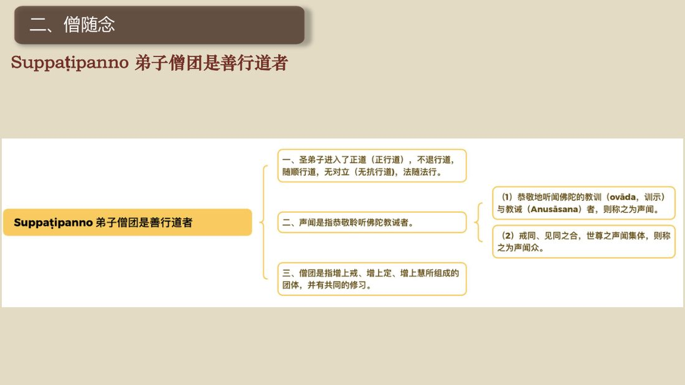
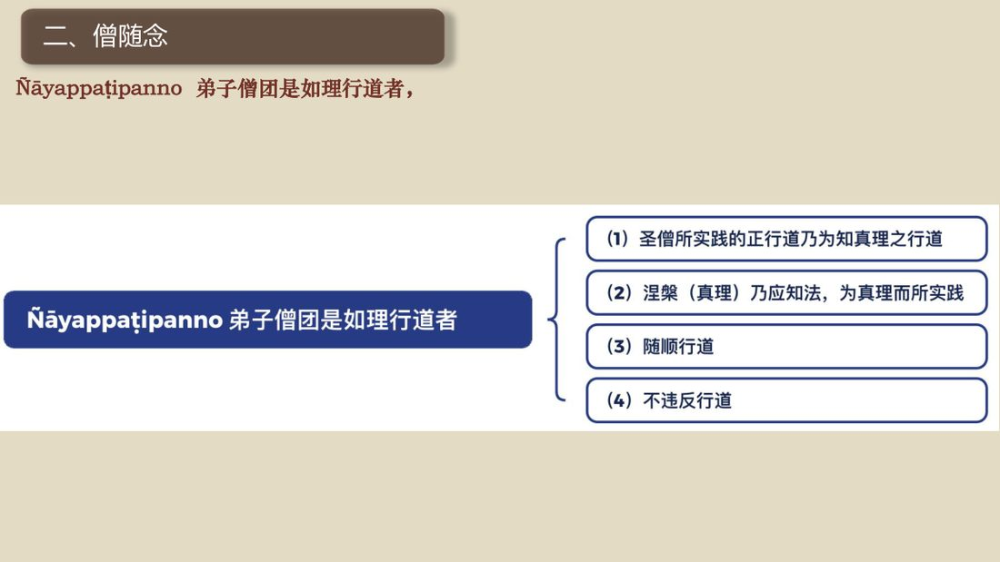
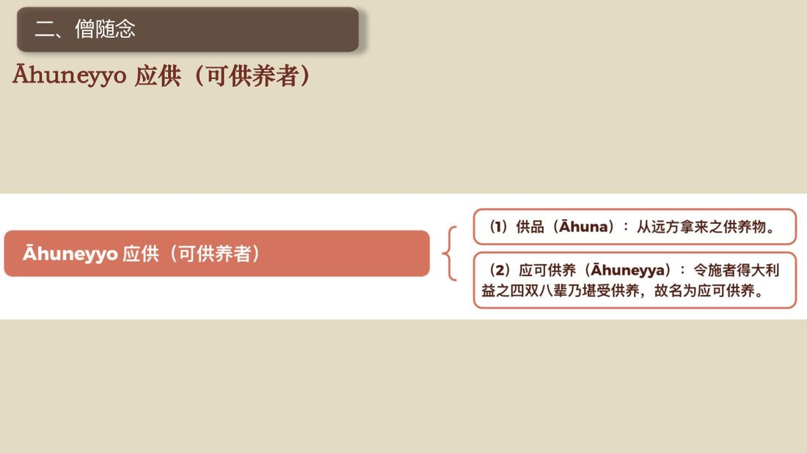
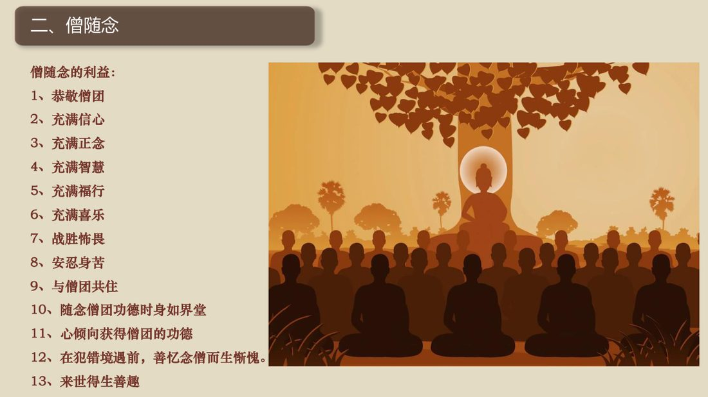

<div align="right">📅 最近更新：2026-09-29 12:30　|　第5版精修（朗读优化版）</div>

# 第2周：法随念与僧随念（主持人版）

> ⭐ **本讲主持人速览**（新主持人必读，2分钟看完）
>
> 你不是老师，是"共学同行者"。你不需要提前懂内容，只需要按流程走。
> **本周由连续两周内容合并**而成，含两段共读、两轮分享与两轮讨论，单讲 120 分钟。
>
> | 环节 | 标准时长 | ⏱ 时间不够→ | ⏱ 时间富余→ |
> |:-----|:----:|:-----|:-----|
> | 🧘 静心开场 | 10 min | 缩至5 min | 加2分钟静坐 |
> | 📖 共读原文1 | 20 min | 只读★核心段（约15 min） | 加读◈扩展段 |
> | 💬 第一轮分享 | 10 min | 每人1句话 | 每人3分钟 |
> | 🎯 第一轮主题讨论 | 10 min | 只讨论问题① | 讨论全部问题+扩展 |
> | 🧘 禅修练习 | 15 min | 缩至8 min（只念引导词前半） | 延长至20 min |
> | 📖 共读原文2 | 20 min | 只读★核心段 | 加读◈扩展段 |
> | 💬 第二轮分享 | 10 min | 每人1句话 | 每人3分钟 |
> | 🎯 第二轮主题讨论 | 10 min | 只讨论问题① | 讨论全部问题+扩展 |
> | 🔚 收尾与回向 | 15 min | 缩至10 min | 保持 |
>
> **主持人10条守则（精简版）**：
> ① 不讲解、不提供答案——让原文自己说话；② 有人问"正确答案"→说"先听听大家的看法"；③ 冷场→主持人先分享自己的真实感受；④ 跑题→温和拉回："这个有意思，我们回到今天的原文"；⑤ 争论→"两种看法都很好，大家保留自己的理解"；⑥ 确保人人发言；⑦ 不评判任何人的分享；⑧ 时间到了就推进；⑨ 禅修练习照读引导词即可；⑩ 结束一起回向。

> 本周主题：**随念「法的六种特质」——善说、自见、无时、来见、引导、智者各自证知；以四道四果涅槃为目标，落到「依法随法行」。**；**认清「僧随念」的所缘——四双八士与四种行道；由「世间无上福田」与十三项利益，把随念僧团的信心，落实为一条「亲近僧团→听闻正法→如理作意→法随法行」的修行路。**。

---

## 📋 本周信息卡

| 项目 | 内容 |
|:----|:-----|
| 时长 | 120分钟（4周版 · 9环节） |
| 核心问题 | 法的六种特质分别是什么？僧随念的所缘——「四双八士」与四种行道，如何落实为「亲近僧团→听闻正法」的一条路？ |
| 共读原文 | 共读原文1：材料①《27_法随念-20250131（课件）》，材料②《27_法随念-20250131（录音）》。　｜　共读原文2：材料①《28_僧随念-20250201（课件）》，材料②《29_僧随念2-20250202（课件）》，材料③《30_僧随念3-20250203（课件）》。 |
| 本周作业 | 每日择法随念一支（六特质之一）或僧随念一支（四双八士／四种行道）随念三至五分钟，记一句「今天法与僧，让我安住的那一点」。 |

## 🧘 静心开场（10 min）

**开场准备与氛围（会前 10 分钟完成）**

> 1. **环境**：灯光柔和（不要顶灯直射），通风但不直吹，手机静音并集中放置；座位围成圆形或半圆。
> 2. **坐姿三选**：①坐垫（盘腿或散盘，膝盖不适者用两个垫子）；②椅子（双脚踏实、背不靠死，可垫小枕）；③跪坐（备垫子）。开场就说明：**「哪一种都好，中途可以换，换姿势不是失败。」**
> 3. **物**：备水、面纸、薄毯（有人静坐时体温会下降）。
> 4. **开场三句话（先讲纪律，再进引导）**：①「全程 120 分钟，中途可自由起身、可去喝水。」②「本讲会谈『证果、证悟』这类话，任何人随时可以选择**只听不说、只取一处、随时暂停**，这是我的承诺。」③「**我们在这里只谈自己的体会，不谈别人的修行、不评断任何人。**」
> 5. **主持人自己的准备**：会前 5 分钟静坐，把**法随念六特质**（善说／自见／无时／来见／引导／智者各自证知）在心里过一遍，并确认自己能用一句白话讲清「拿法来用、当下烦恼就减轻，这就是自见」。**主持人心里稳了，场子就稳了。**
> 6. **不做的三件事**：不布置「必须体会到什么」；不要求成员报告修行体验；不在开场引入「证果等级、认证」一类的话题。
> 7. **静心阶段的三层节奏（主持人心里有数）**：第一层「松身体」（约 2 分钟）——呼吸、放松肩颈、下巴、眉心；第二层「收心思」（约 2 分钟）——把未完成的事「打包扔掉」；第三层「带问题」（约 3 分钟）——把「我信的是法，还是信某个人」轻轻放进心里。最后 3 分钟留给静默。
> 8. **会前主持人独处三分钟（照做）**：找个角落坐下，放下手机，做三次深呼吸，心里默念三句话——①「今晚我只带路，不评判」；②「法值得自见、值得来见，我讲解时可随时回头读原文」；③「体会到、体会不到，都算数，不追求境界」。带着一张安稳的脸进入场地。
> 9. **开场前先在心里划好本讲的边界（主持人参考）**：本周只带大家看「法随念的六特质与落点『法随法行』」这一条主线；**录音 [00:00:14]–[00:06:51] 段（四十种止禅业处总表）归本系列第1周〈总论〉使用（本讲不取）**；「从止转观」的定力—观智次第归本系列第 8 周。若有人在开场或共读中提前问到这些，只回一句方向话——「**这个我们留到第 1、8 周专门讲**」——**不展开、不硬讲、不引原文**。
> 10. **本周的「温度」设定（主持人参考）**：这是一门「拿法来用」的功课，不是「背条目、评高低」的功课。开场与全场，请把语气的温度定在「**落到实处、如理作意、不评判**」——你越不急，成员越敢说；你越稳，成员越安心。**不要把「证果」「证悟」讲成可以攀比的目标，也不要把「我修道、我证果、我证灭」念成一句口号。**

**主持人引导语**（照读即可）：

> 各位贤友，请找一个让自己舒服的姿势坐好，背自然挺直，双手轻轻放在腿上，眼睛可以微微闭上，也可以垂目看着前方一小块地面。
>
> 先做三次深长的呼吸：吸气，知道自己在吸气；呼气，知道自己在呼气。让肩膀松下来，让下巴松下来，让眉心松下来。
>
> 现在，把注意力轻轻带到「心脏位置」的这一片——不去找什么，只是知道：我这里有一颗会想事情的心。今天我们不放它到外面去跑，我们让它安静下来，听一听「法」的六个特质。
>
> 心里也许还挂着今天未完成的事。不赶它们走，只是跟它们说：等一下再说。先把纠结、期待、担忧「打包，扔掉」。心松了，才听得进话；心不松，听一会儿又跑了。
>
> 好，我们保持轻松、开放的觉察，带着一个问题来开始今天的共读：**我口口声声说「皈依法」，可「法」到底是什么？它凭什么值得我信？它又要把我导向哪里？**……不必急着回答，只是把它轻轻放在心里。

> 主持人：本段语速放缓，句间停顿两拍。开场只做「安静」与「说明纪律」，不涉「证果、认证」等具体话题，把「可退出」的话先讲在前头。呼应材料② [00:06:51]「每天早晚……都有三宝随念……其中的法随念……」——法随念是我们**日常三宝随念**里的一部分，天天都可以用。

> 💬 **破冰｜3–5分钟**：说说看：这一周，法在你生活里「现前」过一次吗？

> 🛡️ **心理安全三约定**（每次开场在心里过一遍）：① **保密**——这里说的话不出这间屋子；② **不评判**——不评价任何人的分享，也不急着评价自己；③ **可随时暂停**——任何时候觉得不舒服，都可以停下来休息、喝水或离开，不需要解释。

## 📖 共读原文1（20 min）

### 原文材料①：★核心·《27_法随念-20250131（课件）》

- **文件**：《27_法随念-20250131（课件）》

> ⚠️ 主持人操作：材料①为**课件（要点框架）**，字少、信息密集，**建议做成板书，不逐字念**。用白话串一遍即可：①先念巴利总句与中文六项；②再把六特质的**一句核心词**写到板上（善说＝初中后善／自见＝依见而征服烦恼／无时＝给出结果／来见＝值得来看／引导＝导向涅槃／智者各自证知＝「我修道、我证果、我证灭」）；③最后板书「法随念的利益·13 条」中的前 4 条（恭敬佛陀／充满信心／充满正念／充满智慧）。**课件第「无时」页夹杂的 `graph TD…` 为「圣道心路」流程图的抽取语法，原样保留但不朗读**——若要讲「道心果心无间」，只用一句白话（见下方主持人精讲），不推演阿毗达摩细节。
>

**【照录·课件原文（要点框架）】**

> 27_法随念-古源尊者-20250131（课件）.pdf
>
> #   百花古寺2025
>
> #   百日禅修营
>
> 如来禅修学体系
>
> 古源如应讲述
>
> 2025年1月
>
> #   礼敬佛陀
>
> Namo tassa bhagavato arahato
> sammā-sambuddhassa (x3)
>
> 礼敬那位世尊、阿拉汉、正自觉者
>
> #   一、法随念
>
> svākkhāto bhagavatā dhammo
>
> sanditţhikoakāliko ehipassiko opaneyyiko
>
> paccattam veditabbo viññūhī' ti.
>
> 法是世尊（一）善说，（二）自见，
>
> (三)无时的，(四)来见的，
>
> （五）引导的，（六）智者各自证知的
>
> #   一、法随念 · 善说Sväkkhāto
>
> 先就教法说：
>
> （1）初中后善之故，
>
> （2）说明有义有文完全圆满遍净的梵行之故为"善说"。
>
> #   一、法随念 · 现见/自见 Sanditthiko
>
> 或以值得赞叹的见为见;依见而征服烦恼,故为"见"。此中
>
> (1)于圣道依相应正见而征服烦恼，
>
> (2)于圣果依原因正见，及
>
> (3)于涅槃依所缘正见而征服一切烦恼。故譬如以车战胜敌人的为车兵，如是因见九种出世间法而征服烦恼，故为"见"。
>
> #   一、法随念 · 无时（给出结果） Akāliko
>
> #   出世间禅那的心路--圣道心路 ( maggavīthi )
>
> #   【大慧】
>
> graph TD\n    A1[有分心] --> A2[过去有分]\n    A2 --> A3[有分波动]\n    A3 --> A4[有分断]\n    A4 --> A5[意门转向]\n    A5 --> A6[近行]\n    A6 --> A7[随顺]\n    A7 --> A8[种姓]\n    A8 --> A9[道心]\n    A9 --> A10[果心]\n    A10 --> A11[果心]\n    A11 --> A12[果心]\n    A12 --> A13[有分心]
>
> #   【中慧】
>
> graph TD\n    A1[有分心] --> A2[过去有分]\n    A2 --> A3[有分波动]\n    A3 --> A4[有分断]\n    A4 --> A5[意门转向]\n    A5 --> A6[遍作]\n    A6 --> A7[近行]\n    A7 --> A8[随顺]\n    A8 --> A9[种姓]\n    A9 --> A10[道心]\n    A10 --> A11[果心]\n    A11 --> A12[果心]\n    A12 --> A13[有分心]
>
> #   一、法随念 · 邀请来检视（来见）Ehipassiko
>
> "这是来见之法"，因为值得这样说来看的话，故为"来见"。为什么（出世法）值得这样说法呢？的确存在故，遍净故。
>
> #   一、法随念 · 引导的/导入 Opaneyyiko
>
> 引进为引导。即火烧自己的衣或头亦可置之不理，而值得以 修定引导出世法于自心中，为引导的。这是说从事于有为的出世间法（四向与四果）。若是无为的涅槃则值得以自心引进为引导的——即值得取证之义。或者以圣道为引导者，因为导至涅槃故。以果与涅槃为引导者，因引其取证故。引导者即引导的。
>
> #   一、法随念 · 智者各自证知Paccattam veditabbo viññūhi
>
> "智者各自证知"即一切敏智
>
> （提头即悟）等的智者，当各各
>
> 自知："我修道，我证果，我证灭。"
>
> #   一、法随念 · 法随念的利益：
>
> 1、恭敬教导法的佛陀
>
> 2、充满信心
>
> 3、充满正念
>
> 4、充满智慧
>
> 5、充满福行
>
> 6、充满喜乐
>
> 7、战胜怖畏
>
> 8、能安忍身苦
>
> 9、与法同住想
>
> 10、随念法时，身如佛塔
>
> 11、心倾向成就阿拉汉
>
> 12、在犯错境遇前，善忆念法故生惭愧。
>
> 13、来世得生善趣
>
> Idam me puñnam āsavakkhayāvaham hotu.
>
> Idam me puñnam nibbānassa paccayo hotu.
>
> Mama puñña-bhāgam sabba-sattānam bhājemi.
>
> te sabbe me samaṃ puñña-bhāgaṃ labhantu.
>
> 愿我此功德 导向诸漏尽
>
> 愿我此功德 为证涅槃缘
>
> 我此功德分 回向诸有情
>
> 愿彼等一切 同得功德分
>
> Sādhu! Sādhu! Sādhu!

### 原文材料②：★核心·《27_法随念-20250131（录音）》（依据录音转写整理，已校对明显同音错字）

- **文件**：《27_法随念-20250131（录音）》

> ⚠️ 主持人操作：材料②为**正文主体**。本讲**只取三段（[00:06:51]–[00:26:23]），时间码段不越界**：**第一段（[00:06:51]–[00:08:20]）**讲「法·随法·四道四果与三十七道品」，**必读**；**第二段（[00:08:20]–[00:25:21]）**讲六特质逐一，**必读**，六项每项念完停 10 秒；**第三段（[00:25:21]–[00:26:23]）**讲利益十三条与皈依法，**选读**，时间紧只念前四条。**录音 [00:00:14]–[00:06:51] 段（四十种止禅业处总表）归本系列第1周〈总论〉使用（本讲不取），本周不照录、不照读；录音 [00:27:10] 之后的引导与随喜段只作背景，不作共读正文。**转写把「善说」记成「上说／善说」混用（读作「善说」）、把「善说／善行」的「说」误作「上」，把「四道四果」听成「四到四国家／四相与四国」，把「三十七道品」听成「三十三三十七道品」，把「无时（akāliko）」听成「无实」，把「阿罗汉」听成「阿拉汉／罗佛罗」——照读时可直接跳过不通的句子，不必逐字念讹字。

**【照录·录音转写原文，保留全部时间码】**

#### 一、导入：法·随法·四道四果与三十七道品（[00:06:51]–[00:08:20]）

> [00:06:51.380] 把锤练，就是我们每天早晚上。这个网课的时候都有三宝随念，
>
> [00:06:57.590] 其中的法随念就索瓦卡多巴嘎瓦达达摩三迪提阿卡尼西，巴西国欧巴那伊国巴加单位的大波维尼迪，这个就是。法随念，也就是佛陀亲口讲的法有哪一些功德了，这位翻译成中文，就是法是世尊所上说的。自见的，是无实的，是来见的，是引导的，或者说导向涅槃的，是智者们可以各自正知的。那这个法，在这里的法，是指四道四果涅盘，还有水法。我们讲法，就是这个法和随法。我们讲以此法随法行是包含了法随法，
>
> [00:07:55.670] 行法，就四到四国家涅盘随法，三十三十七道品。所以我们经常讲的法，要包含这些内容，那四道四果和涅盘，
>
> [00:08:07.330] 不是纯粹只是指这个四道四果涅盘，那即你导向，四道四果涅盘的这个法喽。

> 主持人：第一段是本周的「定位」——先讲清「法」在这里指什么（四道四果涅槃，广说含三十七道品），再引出「六特质」。**照读后停 10 秒**，然后主持人用白话点一次（见下方「主持人精讲」）。转写把「善说」记成「上说」、把「四道四果」记成「四到四国家」、把「三十七道品」记成「三十三三十七道品」，照读时按括注读作正名即可。

#### 二、六特质逐一详讲（[00:08:20]–[00:25:21]）

> [00:08:20.680] 这法，有六种特质，或者说，法有六种功德。
>
> [00:08:26.860] 第一个，是法师世尊所善说的，就是善说。那其实上说，就是包含了手有后面的内容了所谓上说，就初中后上。说明这个有义有文，完全圆满变进的放行之故，故意上说。即世尊，从。怎么来讲世尊的前中后上？最小的从世尊只说一个偈颂，他也是全部善美的法。所以以那个偈的第一句，第一句为初上，第二第三句为中上，最后一句为后上。
>
> [00:09:08.240] 那如果是一个连接的经，就以因缘为菩萨，我们叫序分结语，为后上，现在过去我们。大德把它翻译成叫流通分，那其余，就正中分它为中上。
>
> [00:09:25.830] 若有许多连接的经，则以第一连接为初上，最后的连接为后上，其余的是中上。也是以因缘生起的事由，为初善，为遁世诸弟子而说不颠倒之意，以及他的音和欲的相应为中上，令诸听众闻而生信，以及最后正果的结语为后上。所以全部教法的自己的要义的戒为初上，只观道果为中善，涅槃为后善。或者以戒为定，为初善，或止观以道为中善，果以涅盘为后善。
>
> [00:10:02.240] 因为三宝当中，佛的善觉性为初善，法的善善法性为中善，僧的善行道性为后善。又比如听闻佛法，如法行道得正正菩提为初善。辟支菩提为中善，声闻菩提为后善，又闻此法而得正府五盖，亦以以闻而得，就是以闻而得善得到的善为初善行道之时，取得直观之乐。故以故意以行道得善为中善，如法行道及完成行道之果时取得那一如的状态，故意以取得行道之果的善为后善，这个是依教法的初衷后善，所以说叫善说。
>
> [00:10:52.690] 那那也有以世尊的文艺，就是巴利的这个意哈略说开显分别阐释这个叙述，这些，我们就不展开，因为它涉及到这个巴利的文法，它也是全是上。或者以教法，它是无颠倒意，这个故说它是善。那佛陀，说的法，它不会有矛盾。之间的这个，这个全是一以贯之的，是关联的。
>
> [00:11:27.840] 世尊？都对这个诸声闻是通达涅盘的行道，那其涅盘与行道是符合的，譬如恒河的水和那耶摩那河的水相会合并一流，世尊对诸声闻善，是通达涅盘的行道，其涅盘和行道也是合流的。所以圣道，不采取两个极端而从中道而说，因为中道故为善说。

## 💬 第一轮分享（10 min）

**分享规则（照读）**

> 我们做一轮开放式分享。规则三条：①**自愿**，不想说就跳过，没人点你；②**只谈自己**，谈自己的体会，不谈别人的修行、不给别人打分；③**限时**，每人 2–3 分钟，主持人到点温和提示。分享的是「我听到、我想到、我身上发生过的」，不是「标准答案」。

**起手问题（2–3 个，结合本周主题与生活经验）**

> **第一问**：材料② [00:08:26] 说法是「**善说**」——初中后善、有义有文。回想一下，你读过的哪一段佛法、听过的那一句话，曾经让你觉得「**这话讲得真好，挑不出毛病**」？
> **第二问**：材料② [00:13:32] 说「**自见**」——佛陀的法「拿来用的时候，转念的当下，你就能看到烦恼在削弱」。**你有没有一次「拿法来用、当下就受益」的亲身经验？**（比如生气时转一个念、纠结时想起一句话。）
> **第三问**（时间紧可略）：材料② [00:20:26] 说法「**没有秘密、法不传六耳**」——只要愿意听都可以。**这跟你印象里「佛法很神秘、要有人认证」的感觉，一样吗？**

> 主持人：第一轮**只做「听与说」**，不点评、不评比。若有人分享时提到「感应、境界」，回应一句「**听见了，很好**」，然后温和带回「**那我们回到法本身**」。若冷场，主持人可用「第一问」自曝一句自己的经验破冰。

## 🎯 第一轮主题讨论（10 min）

**第一问｜六特质里，哪一条最打动你？为什么？**

> 提示语：材料②把法讲成六个特质——**善说／自见／无时／来见／引导／智者各自证知**（对照上表）。**问题**：这六条里，哪一条你以前没注意、今天听到却「心里一动」？**它和你过往对「佛法」的印象，有什么不一样？**（预期方向：有人会选「自见」——原来不用等人认证；有人会选「来见」——原来法不神秘；有人会选「引导」——原来法是导向苦灭，不是求升官发财。）主持人可补一句：**六特质是一体的——正因为「善说」，才「值得来见」；正因为「值得来见」，才能「自见」；正因为「自见」，才「智者各自证知」。**
> 收束一句：**随念法的功德，就是把这六条，一条一条在自己心里「认下来」。**

**第二问｜「自见」到底是自己看见什么？**

> 提示语：材料② [00:13:32] 说「自见」是「圣道依相应正见而征服烦恼……这是自建的，不需要别人给你认证」；[00:15:28] 说「圣法能够使圣者及时亲见亲证，让烦恼远离」。**问题**：尊者说的「自见」，是看见「一个神奇境界」，还是看见「**烦恼真的少了**」？**如果我们把「自见」理解成「要有别人看不出、只有我知道的神秘体验」，是哪里走偏了？**（预期方向：自见＝烦恼地被征服、自己清楚；不是神秘体验、不是自我标榜；老师的作用是指导，不是「发证书」。）
> 收束一句：**「自见」的尺子很朴素——转念当下，烦恼轻了没有。**

**第三问｜「法随法行」：知道六特质之后，明天我具体做什么？（提示：落到「依法随法行」，不追求境界）**

> 提示语：材料② [00:07:55] 说「以此法随法行是包含了法随法」——「法」指四道四果涅槃，「随法」指三十七道品等随顺之法。也就是说，**信仰法，最终要落到「依教奉行」。** **问题**：听完六特质，如果只让你带走一件事，明天就做得到的那一件，会是什么？（比如：每天读一小段法、烦恼起时用一句话提醒自己、把「善说」记在心里遇事不乱。）**我们要警惕什么？**（预期方向：把「证果」当攀比、把「自见」当炫耀、把「随念」当背条目——都不是法随法行。）
> 收束一句：**法是拿来行的，不是拿来供的；随念之后，是「依教奉行」四个字。**

> 主持人：三问结束，把「小组共识」写成 2–3 条交给记录人（建议三条：①法有六特质：善说／自见／无时／来见／引导／智者证知；②「自见」＝烦恼地被征服、自己清楚，不是神秘体验；③随念法的落点是「依法随法行」，不追求境界）。**第 3 问若有人急于谈「证果、境界」，温和拉回「我们谈明天做得到的这一件事」。**

**三问的「追问」备选（冷场或太顺时用）**

> - 第一问的追问：「六特质里，你最想在生活里用上哪一条？」
> - 第二问的追问：「请举一个例子——你哪一次以为在『修行』，其实是想要一个『别人认证的体验』？」
> - 第三问的追问：「如果今晚回家只做一件小事来『法随法行』，你会做什么？」
> - 收束追问（三问共用）：「听完今天，你更愿意把『法』当成一门要考的学问，还是一片随身的地图？」
> 追问只为打开话头，**不设标准答案**；有人答得「不对」，也只是他此刻的实况，记录即可。

**三问的「本讲口径」收束（主持人参考）**

> 三问做完，主持人用三句话收束，并**明确划出本讲的边界**：①**今天的三问都围绕「六特质与法随法行」**——这是本周的全部任务；②**没问到的部分不是不重要，而是排期在后面**：「十随念框架」在第 1 周、「随念→皈依→从止转观」在第 8 周——**录音 [00:00:14]–[00:06:51] 段（四十种业处总表）归本系列第1周使用（本讲不取）**；③**如果今天有人把问题「越界」了**（例如「怎么证初果」「果定怎么入」），**不必也不要在本讲回答**，只需记下来，交给相应周次的主持人——「**这个问题很好，我们留到相关周次专门讲**」。这样做不是省事，而是让**每一周都站得住、不重复、不挤压**：一周一件事，八周走得稳。

> **分层追问**（可视时间取用，由浅入深）：
> - 【现象】法的六种特质里，哪一条你听着最有感觉？
> - 【影响】法只停留在书本上，会怎样影响你的用功？
> - 【应对】这周你愿意用哪一件小事，去体会一次「法随法行」？

## 🧘 禅修练习（15 min）

### 练习一

> ⚠️ **禅修禁忌提示**：若你正处在严重抑郁、焦虑、创伤后应激，或精神类疾病的发作／用药期，或正经历强烈的情绪危机，请先咨询医生或心理师，再决定是否练习；练习中若出现明显不适（如心悸、胸闷、情绪失控），请立即停止，睁开眼睛，把注意力放回呼吸与身体，必要时离场休息。

**本周练习：忆念「法」的六特质 + 「自见」转念体验（照读即可）**

> 各位贤友，请坐好，背自然挺直，眼睛轻闭或垂目。先做三次深呼吸……让身体松下来。今天我们不急着「修」，只做两件很简单的事。
>
> **第一件：把法的六个功德，像认亲人一样，在心里过一遍。** 不用背巴利语，只要知道意思——
> ——法是**善说**的：佛陀四十五年讲法，初中后善，没有矛盾；
> ——法是**自见**的：你拿来用，当下就看得见烦恼在减轻；
> ——法是**无时**的：它给结果不待时，最快的果报就是法的果报；
> ——法是**来见**的：它没有秘密，只要愿意听、愿意看，都可以；
> ——法是**引导**的：它不导向升官发财、长生不老，它导向苦的灭尽；
> ——法是**智者各自证知**的：真正的体证是你自己的，不需要谁来发证书。
> ……好，这就是「法」的六个样子。它们一直都在，只是我们很少一条一条去认。
>
> **第二件：只取一条——「自见」，做一次转念的练习。** 请想一件最近让你有点不舒服的小事。别陷进去，只在旁边看着它——**心里的那点紧、那点堵**。现在，轻轻对自己说一句法的话（任何一句你熟悉、信得过的），比如「**生气是苦，我不必跟着它走**」。说完，停一下，感觉那点紧是不是松了一点点。
> 松了一点点，就是「自见」——**你亲眼看见，法在起作用。** 看得清、看不清，都算数。
>
> 好，最后把注意力放回整个身体，感觉坐着的重量，做一次深呼吸。……慢慢睁开眼睛。

> 主持人：本练习刻意**不涉**「证果、境界、果定」等话题，只用「六特质认一认＋自见转一念」两件小事，让成员尝到「原来法可以这样用」即可。**全程允许睁眼、允许只做第一件、允许什么都不做。**若有人出现不适（头晕、心慌、情绪起伏），立即引导其睁眼、看窗外、喝水，回到呼吸。**提醒：不追求体验、不以体验自许。**

### 练习二

> ⚠️ **禅修禁忌提示**：若你正处在严重抑郁、焦虑、创伤后应激，或精神类疾病的发作／用药期，或正经历强烈的情绪危机，请先咨询医生或心理师，再决定是否练习；练习中若出现明显不适（如心悸、胸闷、情绪失控），请立即停止，睁开眼睛，把注意力放回呼吸与身体，必要时离场休息。

> 本周练习＝**随念僧团**。引导词依材料④（28讲录音 [00:07:50]–[00:23:35]）与材料⑥（30讲录音 [00:01:38]–[00:04:02]、[00:21:41] 段）整理，**照读即可**。全程 15 分钟：坐姿引导约 3 分钟，观想随念约 8 分钟，静默认持约 4 分钟。**允许睁眼、允许换姿势、允许不做**；不做者静坐即可，不必交代。

**主持人引导词（照读）：**

> 请大家自然坐好，找一个正确的坐姿。身体垂直于坐垫，臀部的坐骨正正地接触在座位上。调整、旋转自己的骨盆，让腰部处在自然的中立位，让腰部有浅浅的脊柱沟，两边的肌肉是松软的。

> 旋转我们的右肩：向前、向上、向后，轻轻放下，打开右边的胸腔。旋转我们的左肩：向前、向上、向后，打开左边的胸腔。想象头部像一个氢气球，自然向上飞；双耳与两肩的肩峰，在同一个平面上。不可以抬头，也不可以收紧下颌。全身上下，松、静、自然。

> 现在，幻想自己坐在一个开阔的原野上。背后是巍峨的喜马拉雅山，两边是宽阔的草原，鲜花盛开，微风徐徐；前方是无边的大海，广博深邃。回到我们的心，心脏的位置：把过去的纠结、所有的负面情绪打包，扔向大海；把对未来的担忧、无谓的计划打包，扔向大海；把对当下的不满、焦虑打包，扔向大海。给自己的心按一下清零键。

> 观想我们的斜上方：世尊坐在菩提树下，为一千二百五十位阿拉汉圣弟子围绕着。以佛陀为首的圣弟子僧团，是**善行道者**——他们在佛陀的指导下，已经进入正道，不退行道，随顺行道，无对立（无抗行道），法随法行。他们以自己的修行实践，证明了佛陀教导的有效、伟大。

> 随喜世尊的圣弟子僧团。随喜弟子僧团是**正直行道者**——远离欲乐与苦行而行于中道，舍弃了身语意的扭曲。愿我也能像圣弟子一般，远离极端、行于中道，做一个坦荡不覆盖自己缺点的人。［停一拍］

> 随喜弟子僧团是**如理行道者**——世尊的圣弟子，所实践的正行道，是为了彻知真理（涅槃）的行道。愿我也能早日彻知真理、体证涅槃而行道。［停一拍］

> 随喜弟子僧团是**正当行道者**——他们值得恭敬，以正当行道于增上三学，堪为佛陀所称赞，并从轮回中解脱。愿我效学、追随世尊的弟子僧团，而正当行道。［停一拍］

> 世尊的弟子僧团，应受供养、应受供奉、应受布施、应受合掌，是世间无上的福田。愿我以财供养、以法供养、以无畏的布施供养僧团。以此功德，愿我早日断除烦恼，证悟涅槃。我赞叹、我恭敬、我供养。愿僧团护佑于我，让我融入以世尊为首的弟子僧团、无量光明的功德海中，分享僧团的功德；愿我也能早日成为圣弟子僧团的一员。［静默约 4 分钟，任其安住；不追求境界、不期待光明与影像，只把心轻轻放回这四句行道偈上］

> 好，大家可以回到心，再转向你自己的根本业处（或随呼吸安住）。慢慢睁开眼睛。

> 主持人：引导词末段呼应材料⑥录音 [00:21:41]「愿我以财供养。以法供养。以无畏的布施供养僧团」与材料④录音 [00:20:27]「亲近上师……得以听闻正法……如理作意……」。若场上有成员神色波动，引导后**先给两句落地话**：「刚才若起了什么，也不用抓住它；没起什么，也很好。」（本行学员版删除）

## 📖 共读原文2（20 min）

> 本周照录材料共六份：**核心三份为 pdf 课件**（材料①②③），**补正文三份为同一主题（僧随念）各讲次之录音转写**（材料④⑤⑥）。课件原文合计偏短（约2千余字），故以录音转写补足正文，均逐字照录、不改写。**必读**＝材料①「四种行道偈」＋材料③「四双八士＋无上福田＋十三利益」；其余为选读与禅修取材。若时间不足，先保必读，其余只念小标题。

### 原文材料①：★核心·《28_僧随念-20250201（课件）》

- **文件**：《28_僧随念-20250201（课件）》



> ⚠️ 主持人操作：本课件为第28讲（20250201）之幻灯片原文。**必读**两处——①开头的「僧随念巴利偈＋中文对译」（即四种行道＋四双八士＋应供四句＋无上福田）；②「Suppaīpanno 弟子僧团是善行道者」小节的「一、二、三」三点释义。**标题作「三种行道」为源稿用词，本讲依经文实际讲四种行道（善行道·正直·如理·正当），如实讲、不擅改标题**；可在读完偈颂后加一句白话：「标题说三种，经文列了四种，我们按经文讲的四种来学。」课件末尾的回向文（愿我此功德 导向诸漏尽……）照念，作为共读收束。（本行学员版删除）

> 逐字照录原文：

```
#   百花古寺2025

#   百日禅修营

如来禅修学体系

古源如应讲述

2025年1月

#   礼敬佛陀

Namo tassa bhagavato arahato
sammā-sambuddhassa (x3)

礼敬那位世尊、阿拉汉、正自觉者

#   二、僧随念

suppaṭipanno bhagavato sāvakasaṅgho

ujuppaṭipanno bhagavato sāvakasaṅgho

ñāyappaṭipanno bhagavato sāvakasaṅgho

sāmīcippaṭipanno bhagavato sāvakasaṅgho,

yadidam cattāri purisayugāni aṭṭha purisapuggalā

esa bhagavato sāvakasaṅgho, āhuneyyo

pāhuneyyo dakkhiņeyyo añjalikaraņiyo anuttaram

puññakkhettam lokassā' ti.

跋葛瓦的弟子僧团是善行道者，

跋葛瓦的弟子僧团是正直行道者，

跋葛瓦的弟子僧团是如理行道者，

跋葛瓦的弟子僧团是正当行道者。

也即是四双八士，此乃跋葛瓦的弟子僧团，

应受供养，应受供奉，应受布施，

应受合掌，是世间无上的福田。

#   二、僧随念

#   Suppaīpanno 弟子僧团是善行道者

Suppatipanno 弟子僧团是善行道者

一、圣弟子进入了正道（正行道），不退行道，随顺行道，无对立（无抗行道），随随法行。

二、声闻是指恭敬聆听佛陀教诫者。

三、僧团是指增上戒、增上定、增上慧所组成的团体，并有共同的修习。

(1)恭敬地听闻佛陀的教训(ovāda,训示)与教诫(Anusāsana)者,则称之为声闻。

(2)戒同、见同之合，世尊之声闻集体，则称之为声闻众。

Idam me puñnam āsavakkhayāvaham hotu.

Idam me puñnam nibbānassa paccayo hotu.

Mama puñña-bhāgam sabba-sattānam bhājemi.

te sabbe me samaṃ puñña-bhāgaṃ labhantu.

愿我此功德 导向诸漏尽

愿我此功德 为证涅槃缘

我此功德分 回向诸有情

愿彼等一切 同得功德分

Sādhu! Sādhu! Sādhu!
```

> 主持人：本材料读完后，可用一句白话收束——「僧随念的第一句，就是把这四句偈念清楚：**善行道、正直行道、如理行道、正当行道**；这四句，是僧团的样子，也是我们想成为的样子。」（本行学员版删除）

### 原文材料②：★核心·《29_僧随念2-20250202（课件）》

- **文件**：《29_僧随念2-20250202（课件）》



> ⚠️ 主持人操作：本课件为第29讲（20250202）之幻灯片原文，**选读**。重点两处小标题：「Ujuppaipanno 弟子僧团是正直行道者」（一、二、三三点）与「Ñāyappaṭipanno 弟子僧团是如理行道者」（四条）。时间紧时只念小标题与各点首句；时间松时逐条念，并接材料⑤（29讲录音）之「正直行道三喻」白话讲解。（本行学员版删除）

> 逐字照录原文：

```
#   百花古寺2025

#   百日禅修营

如来禅修学体系

古源如应讲述

2025年1月

#   礼敬佛陀

Namo tassa bhagavato arahato
sammā-sambuddhassa (x3)

礼敬那位世尊、阿拉汉、正自觉者

#   二、僧随念

Ujuppaīpanno 弟子僧团是正直行道者，

#   Ujuppaipanno 弟子僧团是正直行道者

一、圣弟子无染遍净行道，离二极端而行中道，舍弃身、语、意扭曲之过失。

二、正直是指坦直或不弯曲，即不覆盖自己的缺点，亦不表现非真实的成就或品质。

三、不退行道

#   二、僧随念

Ñāyappaṭipanno 弟子僧团是如理行道者，

#   Ñāyappaṭipanno 弟子僧团是如理行道者

(1) 圣僧所实践的正行道乃为知真理之行道

(2) 涅槃（真理）乃应知法，为真理而所实践

(3) 随顺行道

(4) 不违反行道

Idam me puñnam āsavakkhayāvaham hotu.

Idam me puñnam nibbānassa paccayo hotu.

Mama puñña-bhāgam sabba-sattānam bhājemi.

te sabbe me samaṃ puñña-bhāgaṃ labhantu.

愿我此功德 导向诸漏尽

愿我此功德 为证涅槃缘

我此功德分 回向诸有情

愿彼等一切 同得功德分

Sādhu! Sādhu! Sādhu!
```

### 原文材料③：★核心·《30_僧随念3-20250203（课件）》

- **文件**：《30_僧随念3-20250203（课件）》




> ⚠️ 主持人操作：本课件为第30讲（20250203）之幻灯片原文，**必读**。这是本周「干货最密」的一份：含「正当行道者」三点、四双八士之定义、应供/应供奉/应予施/应礼敬四词之释义、「世间无上福田」之喻，以及**僧随念的十三项利益**。建议在「十三项利益」处**逐条点名**（一条一条念，念完停一拍），让成员有「一条一条数的是我这周要长的东西」之感。（本行学员版删除）

> 逐字照录原文：

```
#   百花古寺2025

#   百日禅修营

如来禅修学体系

古源如应讲述

2025年1月

#   礼敬佛陀

Namo tassa bhagavato arahato
sammā-sambuddhassa (x3)

礼敬那位世尊、阿拉汉、正自觉者

#   二、僧随念

Sāmīcippaṭipanno 弟子僧团是正当行道者。

#   Sāmīcippaṭipanno 弟子僧团是正当行道者

(1)顺应解脱轮回而实践正行道

(2) 值得人们恭敬地实践正行道

(3)法随法行道

#   二、僧随念

yadidam cattări purisayugāni aţtha purisapuggalā esa bhagavato sāvakasaņgho, 也即是四双八士，此乃跋葛瓦的弟子僧团，

四双指四对四道四果——预流道与预流果、一来道与一来果、不还道和不还果、阿罗汉道与阿罗汉果这些圣者四双八士

#   二、僧随念

#   Āhuneyyo 应供（可供养者）

#   Āhuneyyo 应供（可供养者）

(1) 供品 (Āhuna)：从远方拿来之供养物。

(2) 应可供养 (Āhuneyya)：令施者得大利益之四双八辈乃堪受供养，故名为应可供养。

#   二、僧随念

#   Pāhuneyyo 应供奉（可供奉者）

#   Pāhuneyyo 应供奉（可供奉者）

(1) 备办物品 (pāhuna)：来自四面八方的眷属朋友，殷勤接待备办物品。

(2) 应可供奉 (pāhuneyya)：圣僧乃能堪受为宾客所备办物品，故名为应可供奉。

(3)无宾客等同僧伽也。

#   二、僧随念

#   Dakkhineyyo 是应予施（可施予者）

Dakkhíeyyo 是应予施（可施予者）

(1)施物(Dakkina):(人们)相信来生而所施之物。

(2)应可受施(dakkhiñeyya):圣僧乃应受所施，故名应可受施。

(3)令促成得大利益之布施，令促成布施利益广大而使其清净，故名应可施。

#   二、僧随念

#   Añjalikaraņīyo 应礼敬（可予合掌者）

#   Añjalikaraņīyo 应礼敬（可予合掌者）

1. 圣弟子值得全世界礼敬，双手合掌于头顶。

2、甚至比库的物品，如袈裟、钵、腰带都是用品塔。

#   二、僧随念

#   Anuttaram puññäkhettam lokassa
是世间无上的福田

(1)国王之谷麦田则称国王之谷田、麦田。

(2)大臣之谷麦田则称大臣之谷田、麦田。

(3)圣僧乃一切世间之诸法长养处，故名世间之无上福田。

#   二、僧随念

#   僧随念的利益：

1、恭敬僧团

2、充满信心

3、充满正念

4、充满智慧

5、充满福行

6、充满喜乐

7、战胜怖畏

8、安忍身苦

9、与僧团共住

10、随念僧团功德时身如界堂

11、心倾向获得僧团的功能

12、在犯错境遇前，善忆念僧而生惭愧。

13、来世得生善趣

Idam me puñnam āsavakkhayāvaham hotu.

Idam me puñnam nibbānassa paccayo hotu.

Mama puñña-bhāgam sabba-sattānam bhājemi.

te sabbe me samaṃ puñña-bhāgaṃ labhantu.

愿我此功德 导向诸漏尽

愿我此功德 为证涅槃缘

我此功德分 回向诸有情

愿彼等一切 同得功德分

Sādhu! Sādhu! Sādhu!
```

### 原文材料④：补正文·《28_僧随念-20250201（录音）》（依据录音转写整理，已校对明显同音错字）

- **文件**：《28_僧随念-20250201（录音）》

> ⚠️ 主持人操作：**选读**。宜取 [00:01:25]–[00:07:26] 段（四双八士特指证得圣道圣果之僧团／善行道者「不退·随顺·随法行」／声闻＝恭敬聆听佛陀教诫者／僧团＝戒同·见同·和合），此段与材料①「一二三」三点互为白话详解，**是本周理解「善行道者」的关键**。[00:07:50] 之后为**坐姿与观想念诵引导**，请留作「🧘 禅修练习」环节取材，不在共读时段念。**时间紧时可只读 [00:01:25]–[00:03:29] 一段。**（本行学员版删除）

> 逐字照录原文（保留时间码）：

```
[00:00:00.000] 宝水链，最后一个深水链。佛陀的圣弟子僧团？。它有。这些特质也有这些功德？。从。特此的话，他是善行道者，是正直行道者，是如理行道者，是正当行道者。功德，应受供奉，应受供养，应受布施，应受合掌，是世间无上的福田。我们每天早晚功课都有练。

[00:00:47.700] 苏巴迪班罗巴格瓦多萨瓦的山沟，就是。苏巴迪班诺，苏巴迪班诺是善行道者。巴格瓦多就是世尊。

[00:01:03.180] 三，这是弟子，僧团。ujuppaṭipanno 正直行道者、ñāyappaṭipanno 如理行道者、sammāpaṭipanno 正当行道者。那我们。

[00:01:25.860] 来看，就是佛陀的弟子僧团，它是特指四双八字。也就是证得圣道圣果的僧团。那。那现在，这个僧团，都是圣道圣果的，这个僧团，不多，我们圣道弟子不少不多，那怎样来去确认？佛陀讲就是。随顺于圣弟子僧团辗转传承下来他的法和律。他的法和律没有变化，传承没有变化，那就还是随顺于师尊的弟子僧团？所以同样是应受供养，应受布施，应受合掌，应受是世间无上的福田。

## 💬 第二轮分享（10 min）

**分享规则（主持人开场念一遍）**

> 1. **自愿为限**：想说就说，不想说就安静听，不点名、不轮圈强迫。
> 2. **只谈自己**：谈自己的观察与体会，不谈别人的是非，不评判任何师父、寺院与传承。
> 3. **不发散**：每人 1.5–3 分钟，主持人控时；时间到，温和一句「先到这里，谢谢你」。
> 4. **不劝募、不比较**：本周涉「供养、福田、功德」，请只谈发心，不谈金额、不比大小。
> 5. **可退出**：任何时候可以只听不说、只取一处、随时暂停。

**起手问题（结合本周主题与生活经验，任选 2–3 个）**

1. **「有一条路，真的有人走通过」——你相信吗？** 说说你生命里，有没有遇到过一个人（不一定出家、不一定有名），让你觉得「原来人还可以活成这个样子」？那一次，你心里起了什么？——提示：不必谈宗教，谈「被一个人的样子打动」的经验即可。

2. **「四双八士」是什么？** 说说你第一次听到这个词，以为是「八位圣人」还是别的？今天读完材料③，你能用自己的话说清「四双」是哪四对、「八士」是哪八个吗？——提示：四人破题即可，重点是「四道四果」＝四种「走在路上的阶段」，不是「八个人头」。

3. **「正直行道」＝不覆盖自己的缺点。** 你生活里有没有过「明明做了、却说没做」的小事？当时心里是什么感觉？后来呢？——提示：只谈一件小事，不谈隐私；这是「体会自欺的重量」，不是自我审判。

4. **「供养」到底是供养什么？** 你供过花、供过饭、随过喜吗？那一刻你的心是想「换点什么」，还是想「表达敬意」？——提示：只谈自己的心，不评价别人的供法。

## 🎯 第二轮主题讨论（10 min）

> 讨论分小组（3–4 人）8 分钟＋大组 20 分钟＋写共识 7 分钟。主持人**不抢答、不代答**，把问题交回原文与各自的观察；每问先在小组里过，再回大组分享。三问由浅入深，最后一问指向实修。

**第一问：僧随念念的「僧」，是「某个人」还是「一条路」？**

> 提示：把材料①的偈颂摊开来看——「跋葛瓦的弟子僧团是善行道者……正直……如理……正当」，念的不是「某位师父的功德」，而是「这一群人所走的这条道」。请小组先各自说一句「我以前以为僧随念是念什么」，再对照原文修正。**关键落点**：所缘是「僧团（共同体）」与「法在僧团中的实践」；「四双八士」指的是「证得四道四果的圣者」，不是「四位或八位具体的人」。主持人可补一句：「认清所缘，心才不会跑偏到『偶像崇拜』上去。」

**第二问：四种行道（善行道·正直·如理·正当）落到我身上，是一句怎样的自我要求？**

> 提示：**本轮守心理安全**——先声明「讲行道，是让我们向光，不是让我们更讨厌自己」。逐一过四种行道：
> - **善行道者（suppaṭipanno）**：严谨按佛陀教导行道，**不退、随顺、法随法行**（[00:02:24]）；
> - **正直行道者（ujuppaṭipanno）**：坦直不弯曲、离二极端行中道，**不覆盖自己的缺点、不表现非真实的成就**（[00:02:24]–[00:06:21]）；三喻＝不像**流尿液路**忽左忽右、不像**月牙**（做了却自称怕做）、不像**犁田工具手柄**（偶然做了却反问「谁不怕」）；
> - **如理行道者（ñāyappaṭipanno）**：为**知真理（涅槃）**而行道，随顺、不违反（[00:07:47]–[00:09:04]）；
> - **正当行道者（sāmīcippaṭipanno）**：顺应解脱轮回而行道、值得恭敬、**法随法行道**（材料③）。
> **关键落点**：四种行道不是四张「道德考卷」，而是一件事的四个侧面——**方向对（如理）、身口意直（正直）、不停步（善行）、配得上恭敬（正当）**。请成员各挑一种，说一句「这周我可以在哪件小事上，向它靠近一点」。**若有人因此陷入自责，立即把话头拉回**：「我们看方向，不看分数；看得见、看不见，都算数。」

**第三问：「世间无上福田」——供养的重点，在「对象」还是「发心」？**

> 提示：引出材料⑥录音 [00:14:21]–[00:20:09] 的因缘——**安吉罗天子**曾以**一万年**、**十二由旬**的布施凉亭广施，因受施者杂、布施不清净，功德反不及其后；**因陀卡天子**只以**一瓢食物**供养已证阿拉汉的**阿那律尊者**，功德却远超前者。再加「世间如田主、供养品如种子、僧团如福田」之喻（[00:18:35]–[00:19:22]）。**关键落点**：供养的「田」（对象）与「种子」（发心）都重要；重点不在「花了多少」，而在「心清不清净、朝向哪里」。**特别提示（防止走偏）**：这不是「鼓励大家去比功德、去追『高福田』」，而是提醒「发心与所缘」之重要；**不劝募、不涉金额、不评人供法**。三施并举：**财施、法施、无畏施**（[00:21:41] 段）。

**（圆桌小结·主持人带写）** 请各组写出三条共识，交下周主持人。示例方向：①僧随念所缘是「僧团与法」，念的是「一条被走通的路」；②四种行道是「方向·直·不停·配恭敬」四侧面，重在方向、不评分数；③供僧重发心与所缘，不比较、不劝募，三施并举。

> **分层追问**（可视时间取用，由浅入深）：
> - 【现象】四双八士、三种行道，你觉得随念僧，随念的到底是什么？
> - 【影响】少了同修同行，修行会不会更容易退？
> - 【应对】这周你愿意怎么与同修「结伴」一次？

## 🔚 收尾与回向（15 min）

### 收尾一

**总结引导（主持人照读，约 3 分钟）**

> 各位贤友，今天我们一起随念了「法」的六个特质：**善说、自见、无时、来见、引导、智者各自证知**。
>
> 请记住：这六条不是六个要背的名词，而是六面镜子——照出「法到底是什么、值不值得信、要把我导向哪里」。法讲得好（善说）、用了就见效（自见）、当下给结果（无时）、不怕人看（来见）、只往解脱走（引导）、自己心里有数（智者证知）——**一句话：法是真的，而且我用得上。**
>
> 但听懂了不等于修到了。所以本周最后要落四个字：**法随法行**——依教奉行、如理作意。**把法拿来用，明天就用；不要等一个「以后的境界」。**

**下周预告（照读，约 2 分钟）**

> 下周是第 4 周：**僧随念：四双八士与三种行道**。我们会随念「僧」的功德——善行道、正直、如理、正当四种行道，世间无上福田，以及十三项利益。这一周，我们继续把「三宝」的第三支锚点立起来。请大家把本周的作业带来：六特质各念一遍，选一条写一句话的体会。

**小组共识与遗留问题（记录，约 3 分钟）**

> 请记录人念出今天小组的三条共识（建议：①法有六特质：善说／自见／无时／来见／引导／智者证知；②「自见」＝烦恼地被征服、自己清楚，不是神秘体验；③随念法的落点是「依法随法行」，不追求境界）。再把本周没回答完的问题记下（例如「法随念怎么配合观呼吸」「十随念之间的顺序」），交下周主持人。

**回向词（合掌，照读四句）**

> 愿我此功德，导向诸漏尽；
> 愿我此功德，为证涅槃缘；
> 我此功德分，回向诸有情；
> 愿彼等一切，同得功德分。
>
> Sādhu! Sādhu! Sādhu!

### 收尾二

**总结引导（主持人照读或串讲）**

> 各位贤友，今晚我们一起认得了三样东西：**第一，僧随念的所缘**——忆念的是「跋葛瓦的弟子僧团」这一群走在同一条路上的人，是「法被真实实践」的样子，而不是某一个人。**第二，四双八士与四种行道**——四双是「四道四果」，八士是「这八种圣者」；四种行道是「善行道·正直·如理·正当」，是同一件事的四个侧面：方向对、身口意直、不停步、配得上恭敬。**第三，世间无上福田与十三项利益**——僧团是最善的培福之地，随念僧团，能让我们的心「充满信心、充满正念、充满智慧、充满喜乐，战胜怖畏、安忍身苦、心生惭愧，来世得生善趣」。

> 请记住今晚的温度：**「正直」不是审判自己，是坦直不弯曲、不覆盖自己的缺点；「供养」不是买卖功德，是以清净的心朝向善的方向。** 看得清、看不清，都算数；有信心、没信心，也都算数——只要你愿意，明天再朝着这条路，多走一小步。

**下周预告（照读）**

> 下周是第5周，「**天随念：依圣者五德与四功德**」。我们会看：为什么天随念要「依信、戒、闻、施、慧」五德来随念诸天？它为什么只能到达「近行定」，而不能再深入？哪些天界并不利于修行？带着今晚「认清所缘」的眼光，我们下周再看「天随念」这面镜子。**（相关：四护卫禅中慈心部分详见读书会02；止观入门详见读书会01/05。）**

**回向词（四句，合掌同念）**

> 愿我此功德，导向诸漏尽；
> 愿我此功德，为证涅槃缘；
> 我此功德分，回向诸有情；
> 愿彼等一切，同得功德分。
> Sādhu! Sādhu! Sādhu!

## 📌 本讲主持人特别提醒

1. **心理安全（本讲第一优先）：随念法的落点是「依法随法行」，不是「追求境界、以体验自许」。** 本讲涉「证果、自见、智者各自证知」等话，最容易被误读成「谁有境界谁高」。请全程守住三句话：**自见＝烦恼轻了没有、不是有没有境界；老师的作用是指导、不是发证书；随念法的落点是依教奉行、不是比体验。** 凡感觉有人开始攀比境界、指向「我证到什么」，温和拉回：「**我们只谈明天做得到的那一件事。**」
2. **「随时可退出」的选项，必须开场就讲。** 明确告诉成员：可跳读、可只取一处、可随时暂停、可睁眼、可暂离。涉「证悟」一类话题，有人会紧张或自卑（「我肯定不行」），主持人要提前铺垫——**起头即悟的敏智者、要次第引导的所引导者，都是「智者各自证知」；佛陀时代大部分人也是所引导者**（材料② [00:22:36]〔[00:23:29]〕）。**根基不同不等于不行。**
3. **涉「证果／圣人」等话题时，照读原文、不点名、不举例到具体人。** 材料②有「不需要哪一个人来给你认证」「不应如看别人的头饰一样」等语，请说明「这是法自己的特质，与评断任何人无关」；具体名字、具体「谁开悟了」一律不出现在会场。若成员开始指向某个人或某位老师，主持人温和拉回：「**我们只谈自己怎么用这个法。**」
4. **本讲的「让出」口径要守住，不要越界。** 材料②录音 [00:00:14]–[00:06:51] 段（四十种止禅业处总表）归本系列第1周使用（本讲不取）；「从止转观」的定力—观智次第归第 8 周。主持人不要为了「讲得深」而越界到业处、观智内容，免得成员过早混乱。
5. **转写照录有讹字，念的时候不要猜。** 材料②为语音识别原始稿（「上说／善说」＝善说、「自荐／自建」＝自见、「无实」＝无时 akāliko、「A hi 帕西口／A 一般虚」＝来见 ehipassiko、「欧巴那个」＝引导 opaneyyiko、「智者各自政治／搁置整治」＝智者各自证知、「四到四国家／四相与四国」＝四道四果、「三十三三十七道品」＝三十七道品、「水法」＝修法、「阿卡里」＝akāliko）；**明显不通的句子直接跳过**，宁可少念一句，不可临场硬猜。
6. **时间纪律与交接：** 严守 120 分钟（10/25/20/35/15/15），时间不足先保「第一轮分享＋回向」；散会前记录本周共识与遗留问题（例如「自见会不会变成我慢」），交下周主持人。收尾务必把下周主题（僧随念：四双八士与三种行道）与作业说清。
7. **带回一句话就够：法是拿来行的，不是拿来供的；随念之后，是「依法随法行」。** 本讲涉六特质，不必求全；成员能带走这一句，本周就成功了。若有人今天状态不好，允许他只坐着听完——**陪伴也是参与**；若有人对「证果」一词反应大，主持人只需回应「**听见了，慢慢来**」，**不追问、不深挖、不贴标签**。

<!--EXT_READ-->
## 📖 延伸阅读（课后自由选读）
- 《13_法随念-古源尊者-20250515》——法随念同主题讲次。
- 《28_僧随念-20250201》《29_僧随念2-20250202》《30_僧随念3-20250203》（录音）——僧随念三讲录音。
- 读书会03第3周「法随念」——同主题相关共读。
<!--/EXT_READ-->
