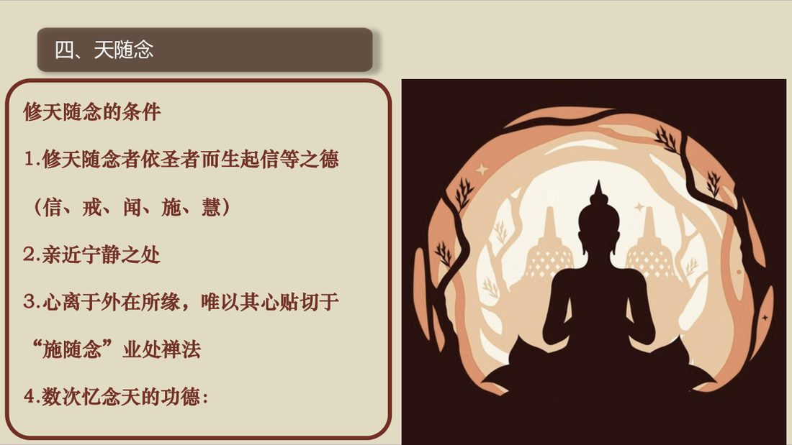
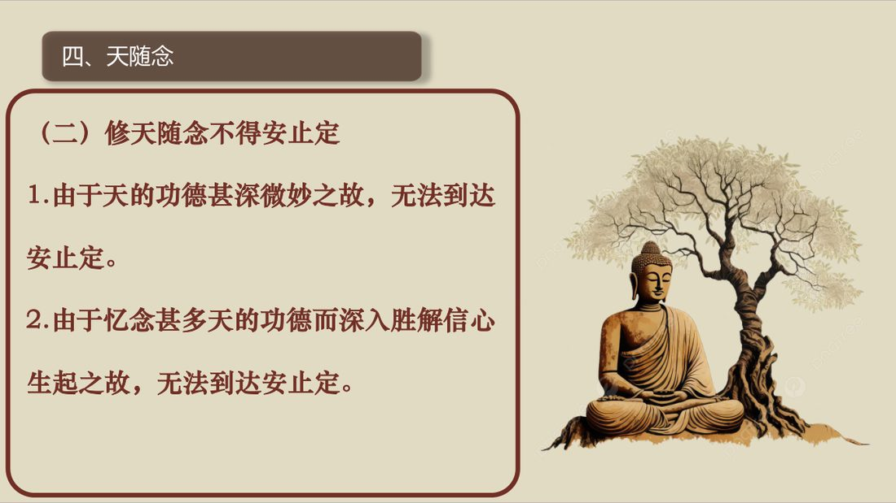

📅 最近更新：2026-09-29 12:30　|　第5版精修（朗读优化版）

# 第3周：天随念与死随念（主持人版）

> ⭐ **本讲主持人速览**（新主持人必读，2分钟看完）
>
> 你不是老师，是"共学同行者"。你不需要提前懂内容，只需要按流程走。
> **本周由连续两周内容合并**而成，含两段共读、两轮分享与两轮讨论，单讲 120 分钟。
>
> | 环节 | 标准时长 | ⏱ 时间不够→ | ⏱ 时间富余→ |
> |:-----|:----:|:-----|:-----|
> | 🧘 静心开场 | 10 min | 缩至5 min | 加2分钟静坐 |
> | 📖 共读原文1 | 20 min | 只读★核心段（约15 min） | 加读◈扩展段 |
> | 💬 第一轮分享 | 10 min | 每人1句话 | 每人3分钟 |
> | 🎯 第一轮主题讨论 | 10 min | 只讨论问题① | 讨论全部问题+扩展 |
> | 🧘 禅修练习 | 15 min | 缩至8 min（只念引导词前半） | 延长至20 min |
> | 📖 共读原文2 | 20 min | 只读★核心段 | 加读◈扩展段 |
> | 💬 第二轮分享 | 10 min | 每人1句话 | 每人3分钟 |
> | 🎯 第二轮主题讨论 | 10 min | 只讨论问题① | 讨论全部问题+扩展 |
> | 🔚 收尾与回向 | 15 min | 缩至10 min | 保持 |
>
> **主持人10条守则（精简版）**：
> ① 不讲解、不提供答案——让原文自己说话；② 有人问"正确答案"→说"先听听大家的看法"；③ 冷场→主持人先分享自己的真实感受；④ 跑题→温和拉回："这个有意思，我们回到今天的原文"；⑤ 争论→"两种看法都很好，大家保留自己的理解"；⑥ 确保人人发言；⑦ 不评判任何人的分享；⑧ 时间到了就推进；⑨ 禅修练习照读引导词即可；⑩ 结束一起回向。

> 本周主题：**随念诸天依「信戒闻施慧」五德而生天之功德，回照自己已有的善德；并弄清本周两个关键问题——为什么天随念只到近行定、不到安止定，以及哪些天界不利修行。**；**如实认识死亡的必然与不可控——四种死亡、八种思维切入、九种利益；把「念死」从忌讳与恐惧，转成紧迫感与精进，落到「呼吸之间」的当下修行。**。

---

## 📋 本周信息卡

| 项目 | 内容 |
|:----|:-----|
| 时长 | 120分钟（4周版 · 9环节） |
| 核心问题 | 天随念为什么只到近行定、不到安止定？哪些天界不利修行？如何把「念死」从忌讳与恐惧，转成紧迫感与精进？ |
| 共读原文 | 共读原文1：材料①《15_天随念-20250119（课件）》，材料②《15_天随念-20250119（录音）》。　｜　共读原文2：材料①《09_死随念-古源尊者-20231107》。 |
| 本周作业 | 每日静坐后，随念诸天的五德（信、戒、闻、施、慧）各一句，并对照自己写下「我学佛以来已经具备的一分德」；不发愿求天、不与人比较、不追求境界。 |

## 🧘 静心开场（10 min）

**开场准备与氛围（会前 10 分钟完成）**

> 1. **环境**：灯光柔和（不要顶灯直射），通风但不直吹，手机静音并集中放置；座位围成圆形或半圆，让每个人都能看见彼此，但视线不必互盯。
> 2. **坐姿三选**：①坐垫（盘腿或散盘，膝盖不适者用两个垫子）；②椅子（双脚踏实、背不靠死，可垫小枕）；③跪坐（备垫子）。开场就说明：**「哪一种都好，中途可以换，换姿势不是失败。」**
> 3. **物**：备水、面纸、薄毯。本周以「随喜、回照」为主，情绪偏暖，气氛宜轻松，可备一小段轻音乐（可选）。
> 4. **开场三句话（先讲纪律，再进引导）**：①「全程 120 分钟，中途可自由起身、可去喝水。」②「本讲会谈到『生到天界』这样的话题，如果有人因此联想到生死、亲人，或觉得不舒服，随时可以选择**只听不说、只取一处、随时暂停**，这是我的承诺。」③「**我们在这里只谈自己看到什么、做到什么，不谈别人的事、不评断任何人。**」
> 5. **主持人自己的准备**：会前 5 分钟静坐，把「信戒闻施慧」五德与「四种功德」在心里过一遍，并确认自己能把「天随念是一面向善的镜子」这句话用一句白话讲出来。**主持人心里稳了，场子就稳了。**
> 6. **不做的三件事**：不布置「必须看到什么」；不要求成员报告境界；不在开场引入「命理、运势、谁将来生哪里」的算命式话题。
> 7. **静心阶段的三层节奏（主持人心里有数）**：第一层「松身体」（约 2 分钟）——呼吸、放松肩颈、下巴、眉心；第二层「收心思」（约 3 分钟）——把未完成的事「打包扔掉」，给心按清零键；第三层「带问题」（约 3 分钟）——把「我学佛以来，已经具备了哪一分德」轻轻放进心里。最后 2 分钟留给静默，**不急着开口**。
> 8. **会前主持人独处三分钟（照做）**：找个角落坐下，放下手机，做三次深呼吸，心里默念三句话——①「今晚我只带路，不评判」；②「天随念是随喜，不是求赐福」；③「能随喜一分，就已经在修了」。带着一张安稳的脸进入场地。**主持人的脸，就是全场的定心锚。**
> 9. **开场前先在心里划好本讲的边界（主持人参考）**：本周只带大家看「五德、四种功德、天界取舍」这一张地图；**与佛/法/僧随念的分工**已在第2–4周完成，本周**不重讲十号功德、六特质、四双八士**；天随念的「不得安止定」与「生天之道」，也与第8周「随念与皈依、从止转观」**分工不重叠**——本周只到「近行定」，**如何从止转观是第8周的事**。若有人提前问到，只回一句方向话——「**这个我们留到第 8 周专门讲**」——**不展开、不硬讲、不引原文**。
> 10. **本周的「温度」设定（主持人参考）**：这是一门「向善回照」的功课，不是「计较投资回报」的功课。开场与全场，请把语气的温度定在「**温暖、随喜、不比较**」——你越不评判谁修得好，成员越敢说实话；你越随喜，成员越愿意看见自己的一点好。**不要把「生天」讲成一种买卖，也不要把「五德」讲成一种考核**；天随念只是借诸天这面镜子，照见自己已有的、可以继续增长的善德。

**主持人引导语**（照读即可）：

> 各位贤友，请找一个让自己舒服的姿势坐好，背自然挺直，双手轻轻放在腿上，眼睛可以微微闭上，也可以垂目看着前方一小块地面。
>
> 先做三次深长的呼吸：吸气，知道自己在吸气；呼气，知道自己在呼气。让肩膀松下来，让下巴松下来，让眉心松下来。
>
> 现在，把注意力轻轻带到「坐着的这个身体」上——你能感觉到身体的重量、接触坐垫的压力、呼吸进出时的起伏。放松，不需要用力。
>
> 今天我们要做的功课，叫做「随念诸天的功德」。听起来很遥远，其实很简单：我们先在心里想起那些「因为信、戒、闻、施、慧」而得到善果的天人，为他们高兴；再轻轻回过头来，看看自己——学佛以来，我是不是也已经有了这么一点点信、一点点戒、一点点闻法、一点点布施、一点点智慧？不评判，只如实地看一看。
>
> 心里也许还挂着今天未完成的事。不赶它们走，只是跟它们说：等一下再说。我们先给心按一下清零键——不是把念头压下去，而是先把纠结、期待、担忧「打包，扔掉」。心松了，身体才会松。
>
> 好，我们保持轻松、开放的觉察，带着一个问题来开始今天的共读：**诸天凭五德生到天界；那么，我学佛以来，已经生起了哪一分德？**……不必急着回答，只是把它轻轻放在心里。

> 主持人：本段「随喜诸天、回照自己」的意思呼应材料② [00:34:22]「对照诸天的功德，看到我们其实自学佛以来确实是多有善德」；照读即可，语速放缓，句间留白。

> 主持人：开场务必把「可退出」承诺说清（呼应守则 10 与特别提醒第 2 条）；若成员对「生天／死亡」话题敏感，只给呼吸放松或暂离的选项，**不追问、不深挖**。

> 💬 **破冰｜3–5分钟**：说说看：你有没有过「想到还有很多人也在走这条路，心里就宽了」的时候？

> 🛡️ **心理安全三约定**（每次开场在心里过一遍）：① **保密**——这里说的话不出这间屋子；② **不评判**——不评价任何人的分享，也不急着评价自己；③ **可随时暂停**——任何时候觉得不舒服，都可以停下来休息、喝水或离开，不需要解释。

## 📖 共读原文1（20 min）

### 原文材料①：★核心·《15_天随念-20250119（课件）》

- **文件**：《15_天随念-20250119（课件）》

> ⚠️ 主持人操作：本件为**骨架**，篇幅短，**整篇照读或投影要点**。其中「修天随念的条件」「不得安止定」「四种功德」三节**必须读完**；巴利语礼敬文与回向文可照读、也可只念汉译四句。课件第三条第 3 点原文作「唯以其心贴切于『施随念』业处禅法」，系课件原有表述，**照录不改**。

**【照录·课件原文】**

> # 百花古寺2025
>
> # 百日禅修营
>
> 如来禅修学体系
>
> 古源如应讲述
>
> 2025年1月
>
>
> # 礼敬佛陀
>
> Namo tassa bhagavato arahato
> sammā-sambuddhassa (x3)
>
> 礼敬那位世尊、阿拉汉、正自觉者
>
>
> # 四、天随念
>
> # 修天随念的条件
>
> 1. 修天随念者依圣者而生起信等之德
> (信、戒、闻、施、慧)
>
> 2. 亲近宁静之处
>
> 3. 心离于外在所缘，唯以其心贴切于“施随念”业处禅法
>
> 4. 数次忆念天的功德：
>
>
> # 四、天随念
>
> # （二）修天随念不得安止定
>
> 1. 由于天的功德甚深微妙之故，无法到达安止定。
>
> 2. 由于忆念甚多天的功德而深入胜解信心生起之故，无法到达安止定。
>
>
> # 四、天随念
>
> # 修天随念四种功德：
>
> 1. 为诸天所喜爱；
>
> 2. 增益信等；
>
> 3. 生起欣慰喜悦；
>
> 4. 若不得上分道果，则得生善趣。
>
> Idam me puñnam āsavakkhayāvaham hotu.
>
> Idam me puñnam nibbānassa paccayo hotu.
>
> Mama puñña-bhāgam sabba-sattānam bhājemi.
>
> te sabbe me samaṃ puñña-bhāgaṃ labhantu.
>
> 愿我此功德 导向诸漏尽
>
> 愿我此功德 为证涅槃缘
>
> 我此功德分 回向诸有情
>
> 愿彼等一切 同得功德分
>
> Sādhu! Sādhu! Sādhu!

> 主持人：课件读完，用一句话收束骨架——**「四个条件、不能到安止定、四种功德」**，让成员心里先有三个框。

### 原文材料②：★核心·《15_天随念-20250119（录音）》

- **文件**：《15_天随念-20250119（录音）》

> ⚠️ 主持人操作：本件为**正文主体**，转写为自动语音识别原始稿，讹字较多（「天水链／天水念」＝天随念；「进行定」＝近行定；「四名运」＝名法／名蕴；「夜生色」＝业生色；「插画自在天／茶化自在」＝他化自在天；「多率天／斗率天」＝兜率天；「月摩天／夜魔天」＝夜摩天；「市场／四十」＝四禅；「出藏天」＝初禅天；「正果」＝证果；「信界文思慧」＝信戒闻施慧等）。照读时**明显不通的句子直接跳过，不临场硬猜**。全篇建议**节选照读**：必读「哪些天界不利修行」（[00:00:47]–[00:05:03]）；选读「欲界六天与耆婆故事」（[00:06:48]–[00:16:50]）与「四种功德与五德条件」（[00:19:40]–[00:22:48]）；末段发愿（[00:22:48]–[00:37:10]）由主持人在禅修练习中化用即可，不必在共读段全念。**与读书会03第3周（佛随念）文件不同，本讲不取 03 段落。**

**【照录·录音转写原文，保留全部时间码】**（依据录音转写整理，已校对明显同音错字）

**一、导入：十随念之一的天随念（[00:00:00]–[00:00:47]）**

> [00:00:00.050] 新的月出，叫天随念。天水应该是。十种水链之一了，有的称六水链的。其中的一种了。天水念，就是随念，诸天。依圣者而生信之德——信、戒、闻、施、慧。就随念诸天有这样的功德。
>
> [00:00:35.060] 来来，修这种天水炼？天随念也是可以证得进行定。那。

**二、哪些天界不利修行：无想有情天与四无色界天（[00:00:47]–[00:03:41]）**（必读）

> [00:00:47.440] 传统我们认为。天界不好，投身到天界，不好。那。这个有不是很。
>
> [00:01:07.280] 叫怎么说，不是很客观。那偏见？这个对一个还没有证悟道果的人来讲？有一些天界，他是不应该去的。比如说。无想有情天，无想有情天，它就是一块肉。他没有明法，但是一堆色法。寿命很长，五百个大劫。那五百个大劫是毫无意义的一种生命方式。我们叫无想有情天。
>
> [00:01:51.040] 再一个？没有证得道果的人？他是不应该投身到四种无色界天。四种无色界天？他没有办法在无色界天里面来修行取证道果。因为他们不能够听闻佛法。因为无色界天的天人，他没有眼耳鼻舌身、没有色法，只有四名蕴，只有是一个精神体。所以，无无法听闻这个佛法，就是无法听闻别人给他传授佛法，他又还没有正果，因此，他就不知道怎么修。
>
> [00:02:32.830] 所以，去四种无色界天，也是不恰当的。除此之外，其他的天界，都是可以去投身的。因为。这个色界天和无色界天，都还有过去七佛的弟子。过去七佛的圣弟子都还在现在的天界里面，所以我们经常念诵，就是要忆念过去七佛，还有过去七佛的圣弟子们还在天界。尤其像长的这个。这个广果天，
>
> [00:03:19.740] 四天四是四禅天，还有净居天，
>
> [00:03:24.140] 三果以上圣者才住的这种净居天，它都是很殊胜的。那色戒篇？大部分的色戒片，也是很殊胜的。除了无想有情天，无想有情天，它也是色界天，它是四禅天。

**三、无想有情天的由来与色界天为何利修（[00:03:41]–[00:06:48]）**（必读/选读）

> [00:03:41.660] 他是怎么获得的？是外道。他挣了禅那以后，他对于这个。这个烦恼的认知，他认为人的烦恼就是这个精神造成的。就是我们胡思乱想造成的，没有想法，那就没有，就没有那么多苦恼，所以他在。这个证了四禅以后临命终时。他这个决议，不再有这种。精神哈就无想。没有任何的思想，这样的决议，在他随着他的禅那维持到临终，那死了以后，他就会在无想有情天结生。
>
> [00:04:29.500] 只有夜生色和世界生色，而没有其他的，四名运。那其他的色界天？都是很殊胜。色界天？它没有男女之别。没有欲贪，就没有眼耳鼻舌身引发的欲贪，也没有称慧。不会生气。但然也不需要吃饭。
>
> [00:04:56.780] 他长月为食那一个长时间的住在禅那里面。
>
> [00:05:03.140] 因为色界天的天人，他只有。这个眼镜色耳镜色。还有心所依处色，这种三种夜生色，所以，他可以听闻佛法。而且色界天，有很多圣者。如果你去跟圣者们一起请教，还可以很好的修习佛法，而且因为他。这几天的，天神，他没有这种，我们这种只有光明体。他没有我们这种，这种这个食身的这种肉体。所以他这个我们以前经典里面叫内外盈彻。它是半透明的，这个透明体类型的，但是它就是有有眼镜色，耳近色，长得，很高大，很光明，光洁。这个所以，
>
> [00:06:04.355] 他如果要修习佛法。就非常容易。它可以长时间这个几百年上万年的坐在那儿不起来修止观，它的禅那是自动就可以入禅，不要像我们这么辛苦要做的就可以入场。因为是他的，比如说他出场天，
>
> [00:06:29.455] 他一坐下来就是初禅了，眼睛不用眼睛闭住，那就是初禅的。就定力非常容易培养，
>
> [00:06:36.730] 培养完以后，他要修观，那个名色也非常的清晰。
>
> [00:06:42.275] 所以这个世界片，理论上它是非常容易体现的，对。

**四、欲界六天与魔王、兜率天、三十三天（[00:06:48]–[00:13:55]）**（选读）

> [00:06:48.020] 好，下来是这个欲界天，欲界天有六成天，从这个，他化自在天，化乐天那个这个兜率天夜摩天，三十三天，四天王天。
>
> [00:07:09.360] 离我们最近的是四天王天，再往上是三十三天，是夜摩天，是兜率天化乐天他化自在天。
>
> [00:07:19.520] 那我们经常讲的这个。魔王。这个天魔的这个魔王，就是他化自在天的天主。他不是魔鬼，他是一个非常有福报的天神天主。非常的光明。这个他化自在天天主为什么要来干扰佛陀？或者干扰佛弟子？因为这个他化自在天的天主，他认为欲界天最高天。他认为一阶以下的所有的众生都是他的子民呐。而这些子民，动不动就解脱了。解脱完以后，就不是他的子民了，管不了了，他很恼火，所以他又来骚扰你了，就希望你不正，希望你不要逃脱他的这个天魔的掌控。
>
> [00:08:19.840] 他化自在天它有什么特点？就是他别人的所有的这个福报，他只要想了，他就可以很快的一样的拥有，有他化自在就是他化自在。
>
> [00:08:37.680] 那怎样去到这个他化自在天。那首先，就是在人间里面，或者在其他的天界做大布施，做大福报。这个有很大的功德。但是，这个大功德的人，当然一个什么毛病，他就喜欢管别人。对他有很大的福报，他喜欢管别人。所以，我们就是看我们在社会上有很多这个很大的这个福报的大老板。做很多大供养，但是他如果很爱管别人，他做完供养还是想管别人。
>
> [00:09:17.450] 有可能是投身到他化自在天大天竺佛，就是那个类型的，去到大话自在天的天神很多就是这种类型的，对，有很大的福报，都是爱管别人。
>
> [00:09:29.900] 那这个兜率天，是这个一切诸佛，他来成佛之前的最后一生就菩萨的最后一生的居住地了，就是兜率天，那所以兜率天，就有会有很多。这个菩萨，在那儿居住了，但据这个以前，我们会讲兜率天有个内院。但据这些观察的同学们去观察，都找不到内院的。因为兜率天，它不需要内院，它就是一个广摩的天界，非常殊胜。这个男天子女天子，都非常的光明。这个容貌非常的殊胜。

## 💬 第一轮分享（10 min）

**分享规则（主持人照读）**

> 各位贤友，接下来是第一轮分享。规则很简单：**每人 2–3 分钟，只说自己的体会，不谈别人的事，不互相评判，也不急着给建议。** 愿意说的就说，不想说的直接跳过，**跳过不是不参与，是给自己留空间**。

**起手问题（主持人参考）**

> 1. **今天第一次听到「天随念」这个词，你最先想到的是什么？**（可能会有人联想到「求天保佑」「升天」——先接住，再说明「天随念是随喜诸天之德、回照自己，不是求赐福」。）
> 2. **「信、戒、闻、施、慧」这五德，你觉得自己哪一分最弱、哪一分最有体会？**（不评比，只如实说。）
> 3. **诸天「想吃什么就自然出现、不用劳作」——听到这里，你心里是羡慕，还是有一点警醒？**（引导：便利不必然是好事，天人纯乐反而难生修行之心。）

> 主持人：第一轮分享只做「打开话头」，**不纠正、不深挖**。若有人把「天随念」当成「求保佑」，只温和说明一句——「我们今天是随喜诸天的德行、照见自己已有的善德」——然后交回给分享者。

## 🎯 第一轮主题讨论（10 min）

**第一问｜五德之镜：诸天凭什么生天？我们要「随喜」什么？**

> 提示语：材料①课件与材料② [00:20:57] 都讲：投生天界的诸天，是「依圣者而生起信等之德」——即**信、戒、闻、施、慧**。**问题**：这五德里，哪一分是你此刻就能做的？**天随念为什么要「随喜」诸天，而不是「羡慕」诸天？**（预期方向：随喜＝为他们高兴，同时「照见自己已有的善德」；羡慕＝比较与贪求。天随念是**向善的镜子**，不是「求天赐福」。）
> 收束一句：**随喜诸天，不是为了「也想去天上」，而是为了「看见自己也有这几分善德」，并且愿意让它继续长。**

**第二问｜只到近行定：为什么天随念「修不到安止定」？**

> 提示语：材料①课件「（二）修天随念不得安止定」列出两点原因：**①天的功德甚深微妙之故；②忆念甚多天的功德而深入胜解信心生起之故**。**问题**：这两条原因，是不是说「天随念修不深、没什么用」？**为什么「随念类」业处天然只到近行定？**（预期方向：因为随念所缘是「众多、深妙、广大」的德行，心一生起胜解信心就随之流动，难以像「遍禅取相」那样专注静止于单一所缘；**近行定已足以镇伏五盖、心正直**，是很有力的定，不是「不够」。不要把「近行定」听成「差一点」。）
> 收束一句：**定有深浅，功用不必相同；天随念给我们的是「心正直、信坚固、志生天」，不是「一心不动的深定」。**

**第三问｜天界取舍与心理安全：「生天」是好还是不好？哪些天界不利修行？**

> 提示语：材料② [00:01:07] 说「有些天界不应该去」——**无想有情天**（一块色法、无明法、寿五百大劫、毫无意义）与**四无色界天**（无眼耳鼻舌身、不能闻法、不能在此证道果）对未证果者**不宜投生**；而**色界天**（可闻法、有圣者、定力易培养、名色清晰）与**欲界天**则殊胜。材料② [00:13:55] 又说：**天人纯乐、恶趣纯苦、人苦乐参半，所以人最好修行**。**问题**：听下来，「生天」到底好不好？**如果有人说「我就想生天享福」，你会怎么回应？**（预期方向：天界不是统一的好或坏——**利修行的天界好，不利修行的天界不好**；而且「生天」不是目的，「继续修行、直至解脱」才是；我们今生在人道，**苦乐参半，正是最好修行的身份**，不必急于羡慕天人。）
> 收束一句：**天界不是天堂梦，是一条「换个身体继续修行」的路；而当下这个人身，苦乐参半，恰恰是八周里最该珍惜的修行资粮。**

> 主持人：三问结束，把「小组共识」写成 2–3 条交给记录人（建议三条：①天随念＝依信戒闻施慧五德随喜诸天、回照自己；②只到近行定，缘在「功德深妙＋胜解信心流动」；③天界有好有坏——利修行的去得，无想有情天与四无色界天不宜）。**第 3 问若成员对「死亡／生天」话题情绪起伏，随时启用「只听不说／只取一处／随时暂停」的选项。**

**三问的「追问」备选（冷场或太顺时用）**

> - 第一问的追问：「如果今晚回家，你只做一件事增长这五德中的一分，你会做哪一分？」
> - 第二问的追问：「随念佛、法、僧、天这类随念，为什么都偏『近行定』？你能用一句话说说你的理解吗？」
> - 第三问的追问：「请举一个例子——你哪一次『想要快乐』，反而让自己离修行更远了？」
> - 收束追问（三问共用）：「听完今天，你更愿意把『天随念』当成『求天保佑』，还是『照见自己已有的善德』？」
> 追问只为打开话头，**不设标准答案**；有人答得「不对」，也只是他此刻的实况，记录即可。

> 主持人：三问做完，用三句话收束并**明确划出本讲边界**：①今天三问都围绕「五德、四种功德、天界取舍」——这是本周全部任务；②「如何从止转观、近行定如何转观」排在第 8 周——**本周不取、不预告细节**；③若有人把问题「越界」（例如「怎么修到安止定」「怎么证初果」），**不必也不要在本讲回答**，只记下来交给相应周次的主持人——「**这个问题很好，我们留到第 8 周专门讲**」。

> **分层追问**（可视时间取用，由浅入深）：
> - 【现象】天随念是依着「圣者五德」来念，你觉得它念的是「天」，还是「信」？
> - 【影响】只羡慕果报、不看因，会带来什么？
> - 【应对】这周你愿意拿哪一德，对照一下自己？

## 🧘 禅修练习（15 min）

### 练习一

> ⚠️ **禅修禁忌提示**：若你正处在严重抑郁、焦虑、创伤后应激，或精神类疾病的发作／用药期，或正经历强烈的情绪危机，请先咨询医生或心理师，再决定是否练习；练习中若出现明显不适（如心悸、胸闷、情绪失控），请立即停止，睁开眼睛，把注意力放回呼吸与身体，必要时离场休息。

**本周练习：随喜诸天五德 · 回照自己（照读即可）**

> 各位贤友，请坐好，背自然挺直，眼睛轻闭或垂目。
>
> 我们先做三次深呼吸……让身体松下来，肩颈松，下巴松，眉心松。
>
> **第一步：随喜诸天。** 在心里轻轻想起：有很多天人，是因为在人间时具足了「信、戒、闻、施、慧」这五德，才投生到天界；他们如今有光明、有福报，很多还是过去七佛的圣弟子，还在天上继续修行。（对应材料② [00:24:57]。）
> 为他们高兴——**「愿他们安稳，愿他们的善德继续增长。」** 只是随喜，不羡慕、不比较。
>
> **第二步：一句一句，随喜五德。**
> ——随喜诸天的**信**：他们对三宝有信心；愿我也有这样的信。
> ——随喜诸天的**戒**：他们持戒清净；愿我此生也能持守清净的戒。
> ——随喜诸天的**闻**：他们多闻佛法；愿我也愿意听闻、学习经律论。
> ——随喜诸天的**施**：他们乐善好施；愿我也做一个乐于布施的人。
> ——随喜诸天的**慧**：他们有业果的智慧；愿我至少相信「善有善报、帮助他人有利益」。
> （对应材料② [00:26:28]–[00:31:42] 的引导大意，一句一句慢慢过。）
>
> **第三步：回照自己。** 把注意力轻轻收回到自己身上，问一句：**「学佛以来，这五德里，我其实已经有了哪一分？哪怕只有一点点。」**（对应材料② [00:34:22]：「对照诸天的功德，看到我们其实自学佛以来确实是多有善德。」）不评判、不自夸，只是如实看见，然后轻轻为这一分德**随喜自己**。
>
> 也许你想发一个愿：**「愿我这一生，继续圆满信戒闻施慧；若不得道果，愿我投生到利修行的天界，成为修法天神，与诸上善人聚会一处，继续修行，直至解脱。」**（对应材料② [00:16:50]、材料③ [00:04:43]。）愿不必说出口，心里轻轻放下就好。
>
> 好，最后把注意力放回整个身体，感觉坐着的重量，做一次深呼吸。……慢慢睁开眼睛。

> 主持人：本练习**只做「随喜＋回照＋发愿」**，不涉观想造像；**全程允许睁眼、允许只做第一步、允许什么都不做**。若有人对「发愿生天／死亡」感到不安，可跳过发愿段，只做「随喜自己已有的善德」。若出现明显不适（心慌、焦虑），立即引导睁眼、看窗外、喝水，回到呼吸。

### 练习二

> ⚠️ **禅修禁忌提示**：若你正处在严重抑郁、焦虑、创伤后应激，或精神类疾病的发作／用药期，或正经历强烈的情绪危机，请先咨询医生或心理师，再决定是否练习；练习中若出现明显不适（如心悸、胸闷、情绪失控），请立即停止，睁开眼睛，把注意力放回呼吸与身体，必要时离场休息。

> 本周练习＝**呼吸之间念死**。引导词依材料② [00:31:48]–[00:55:11] 的完整引导**简化**而成，**照读即可**。全程 15 分钟：坐姿引导约 4 分钟，「呼吸之间念死」约 6 分钟，静默认持与收束约 5 分钟。**本次只做「坐姿引导＋呼吸间念死」，材料② 中的「尸体观（取同性尸体）」与「火箭／热能引导」为可选环节——主持人自己决定是否带，且必须明确告知成员可跳过、可睁眼、可只做呼吸。** 不做者静坐即可，不必交代。**若成员中有人近期经历丧亲、重病等，务必让其知道：今晚可以只听、只静坐。**

**主持人引导词（照读）：**

> 请大家自然坐好，找一个正确的坐姿。身体垂直于坐垫，臀部的坐骨正正地接触在座位上。调整、旋转自己的骨盆，让腰部处在自然的中立位，让腰部有浅浅的脊柱沟，两边的肌肉是松软的。

> 旋转我们的右肩：向前、向上、向后，轻轻放下，打开右边的胸腔。旋转我们的左肩：向前、向上、向后，打开左边的胸腔。想象头部像一个氢气球，自然向上飞；双耳与两肩的肩峰，在同一个平面上。不可以抬头，也不可以收紧下颌。全身上下，松、静、自然。

> 感觉头部像气球一样往上飘，颈部有支撑；肩部沉肩坠肘；胸腔前胸、后背这个倒三角自然平衡；腰部和臀部为支撑，稳稳落在这个正三角上。想象我们像坐在一棵青松下：臀部以下，是深深扎进大地的根系；身体，是自然向上的树干；头，是迎风的树梢；双手与肩，是自然伸展的树枝。

> （以下三步，念、停、再念，每步后留白约十秒）

> 第一步，**「我一定会死。」** 轻轻地，对自己说：**我一定会死，死亡是必然的，谁也挡不住。** ……不需要画面，只是知道，就是这样一句真话。

> 第二步，**「我不知道何时、何地、以何方式死。」** 轻轻地，对自己说：**我不知道会在什么时候死，不知道会在什么地方死，也不知道会以什么方式死；连下一口气，我都不敢肯定。** ……只是知道，就是这样一句真话。

> 第三步，**「趁还有一口气，回到呼吸。」** 把注意力放回鼻端、放回这一呼一吸。**吸气，知道自己在吸气；呼气，知道自己在呼气。** 告诉自己：**既然死亡就在呼吸之间，那我就把这一口气，用来安住、用来行善、用来修行。**

> （尸体观·可选、可跳过·主持人按现场情况决定是否带；如带，照下段慢慢念）

> 若你觉得可以，也可以轻轻地，在心里想起曾经见过的一具同性的尸体——它没有温度，将走向腐烂；然后把这具尸体换成你自己，感觉躺在那里的，就是你。对自己说：**我也会这样死去。** ……如果这一步让你不安，**请立刻回到呼吸，或者睁开眼睛，看着前方的一块地面**——回到呼吸，就是回到当下，就是修行。

> （收束）

> 好，现在，把心回到心脏的位置。鼓励一下自己的心，表扬一下自己的心：**今天我愿意直面一件人人都在回避的事，这很不容易。** 搓搓自己的腰，搓搓膝盖。我们准备下座。

> 主持人：引导词呼应材料② [00:26:51]–[00:28:36]「呼吸，就在一吸一呼之间……你只要说我将会死，这是必然的」、[00:36:53]「在心里面想到那具尸体……没有温度、将走向腐烂」、[00:49:19]「我将会死亡，死亡必将到来」与 [00:54:28]「把心回到心脏那个位置，鼓励一下自己的心」。**引导后先给两句落地话**：「刚才若起了什么，不用抓住它；没起什么，也很好。**无论想起、想不起，今晚你都已经尽了力。**」（本行学员版删除）

## 📖 共读原文2（20 min）

> 本周共读**两份音声材料**，均为录音转写。**读法建议**：材料①「死亡必然＋四种死亡＋八种思维＋九种利益」为**必读正文**，只求听懂，不求背；材料②「护卫禅实操·织工女儿与农夫一家」为**选读故事**，用来把心从「道理」带回「温度」。**时间码后接正文，是出处标记，朗读时跳过**；括注（ ）内为整理注记，同样跳过。

### 原文材料①：★核心·《09_死随念-古源尊者-20231107》（依据录音转写整理，已校对明显同音错字）

- **文件**：《09_死随念-古源尊者-20231107》

> ⚠️ 主持人操作：本讲为死随念**正文主体**（约 51 分钟转写）。**必读**＝「死亡必然」（[00:09:43]–[00:18:20]）＋「四种死亡·食死与非食死」（[00:18:34]）＋「九种利益」（[00:48:27]–[00:51:06]）。**点名不展开**＝「八种思维切入」（[00:22:03]–[00:29:45]，逐条念小标题、念完停一拍即可，不追细节、不渲染尸体与横死画面）。**背景不作正文**＝开头礼敬与业处请求（[00:00:13]–[00:08:56]）、修法引导（[00:37:41]–[00:43:29]）、三十三天因缘与六道之辨（[00:32:22]–[00:36:49]）。**本段「八种思维」原文序号有跳跃（第一、第二、第四、第五…），如实照录、不擅改编号。**（本行学员版删除）

> 逐字照录原文：

[00:00:13.740] 已经工作。礼敬（佛陀）。各位法师，各位贤友，早上吉祥。西人。对。Mi.Hello.西兰的。那个什么哪个干。有无个呾死人？I，咪。都行到。西的。的。布萨塔西人。伊兰的。One.。南米，桑米。不，萨南咪，萨南米。大地萨南米，大地萨南米，桑米。Eight.

[00:04:54.200] 巴拉的巴达尼达尼。阿布拉哈马加利亚尼。萨瓦。苏了，没了亚麻加。他妈的卡，那你。南尼。马加滴嗒，马滴哒。回收甲加。阿的为人。Good.。不加白亚拉马哈白人。玛利亚。一单三。爸爸那的。阿。我受持以慈句之心，我受持念满一切众生类，而住一切众美。一旦没西拉，你把那有多？对。达西、阿巴马、桑巴。今天会。教大家一个新页数，是随便表达，求取页数。班的。喽，干。肝胆。看那吉他迷茫的。他。Looking young的。达。各行各热。南达。阿达亚加。喽。

[00:08:56.500] 鲁干班有八大。尊者，我请求业处。请尊者出于怜悯，这时后给我列出。OK，yes.那今天，我们学习一个。护卫船的第三种。是，随便。死随念怎么修？

[00:09:43.000] 首先，我们要明白。？我们可以不死吗？我们害怕死吗？既然不能不死，又害怕死，那怎么办？对，我们一定要死？你又害怕死。那死的时候，你就很不甘愿，对不对？要么很舍不得，要么很愤怒。那会去哪里？这是一个很很现实的问题，对？我们一定会死。但是。我们又不想和。？那不想死？那死的时候？你一定没有好心情。美好心情，就是不善心，不善心，一定就去恶趣了。

[00:10:34.520] 不开玩笑的，所以佛陀？为了帮我们，就让我们修持死随念？就你先，正确的认识死亡。在这个问题上，我们中国人特别麻烦，因为我们很忌讳说死对，我们说谁谁死，晦气，呸，不要说，好像那个屎会跑到你身上来一样。在佛陀的教法里面？就是我们要能够如实的看到生命的真相，接受生命就是这样一个状态。那对于生命可能发生的一切，我们都要有所准备。

[00:11:18.700] 我们每个人，都没有存善的业。不但我们过去生没有存善的业，这一生即使作为人，他也很少能够有一生都很。这个圆满或者说，这个完全都很舒适的这种状态。

[00:11:44.020] 为什么。我们看看自己这一生就知道，我们做过多少好事儿。那如果我们这个习惯就不是经常做好事儿，那我们怎么保证过去都是做好事儿？那过去没有做好事儿，你怎么能知怎么保证？你这一生没有不善业成。不善业成熟的时候，你就会有各种不如意的事情发生。

[00:12:11.700] 不是被人家说，就被人家批，被人家骗，被人家骂，被人家委屈，被人家不公觉得不公正的对待，生病，老，很难看，满脸皱纹，会不会死掉。你都是自作自受。没有人害你，你觉得是谁对我不好？那百分之一百都是你的问题。百分之一百不是我们的问题，并不代表说我们要为别人的这个错误去纵容，或者是视之不见。

[00:12:56.440] 它是两个层面的东西。一个层面，即当我们遭遇。不可喜的果报的时候。我们的基本态度是，这是我的果报。它是有因有缘的，我要接受，要接纳。那至于说这个不是可惜，果报明显对方就是不讲理。那我们并不代表我们要去纵容对方不讲理，不讲理，这是两个东西。那怎么来体现在你身上？就是你碰到再不好的果报，你都不要起不善心。你这是你的事儿。

[00:13:40.580] 第二一个，你起不上心，你就害你自己，为什么？一不上心就伤害自己。那接下来我们再来看说对方是怎么做，那我有什么方法可以规避这样的事情重复发生就是智慧。所以要把它分开，我们说外面可以有对错，有是非，但你内心不能有不善心，生情不能有烦恼出现，这是修行人的。不同的地方，要明白，所以同样的，我们将会遭遇死亡，死亡一定会到来。

[00:14:20.900] 只要有生，就有死。没有人可以逃得过。不管你这个权威多大，或者你钱那么多，

[00:14:29.420] 因为我们现在很多有钱人说要死了，要把尸体冰冻起来，说据说，他们认为再过个三百年、五百年，可能技术发展了，可以把它复活。你是想的太简单，从佛法的角度上来讲，那根本不可能。当然有可能说你未来的这种技术发展，可能什么叫克隆再整一个跟你长得差不多的这样的乃至于，他可能可以摘取他的一些信息，再给他放到他的身体里面去这是可能。但它一定不是你原来的你你原来你就已经不懂都到哪去了，对？

[00:15:10.570] 死亡心升起的下一刻，结生心就升起。你都被冻起来了，还会活着吗？还会有生命在里面吗？你的心流还会再继续产生吗？绝没有可能，

[00:15:21.945] 你死了，你在冰冻，在零下六十度，一百度的没有用。死亡，一生起，一结这个死心一升起。灭去结生，心就无间的生起，它必然是这样的一种运作，这是法的定则，是自然法则。谁都逃不过。好。即使我们在高级的生命，这个乃自于天人，半天人，无色界天的天人，最高阶的天人是非想非非想处的天人，八万四千大劫的寿命，他就会死。那死亡？依然会在三十一界里面轮回都跑不掉。那即使你是这个初果圣者，二果圣者，三果圣者。四国甚至阿拉汉。你也会死。

[00:16:22.840] 佛陀也会死。当然，我们希望佛陀不死，那是我们美好的愿望。我们认为佛陀死的是化身，那也是美好的愿望。我，我就是会死掉。这是一个自然的规律，如果佛陀不会死掉，那就佛陀自己亲自否认了业果法则。佛陀不会这样的。就是。

[00:16:53.240] 只要是因缘和合的，这样的一种生命状态，不管是动物、植物还是人类，还是天界的生命，他只要有生就一定有死亡，只是时间长短的问题，所以我们需要充分的认识到这一点。那死？是指生命的终结。命根的中断。有情的死亡就从一期生命。中断转向另一期生命，这个这一期生命结束这一个阶段，这个当下，就称为死亡。那这个死亡，我们看到就是这个，

[00:17:38.520] 死随念我们要修习的。它主要是指你还在轮回当中的生命，它不是阿拉汉的正断死就阿拉汉的死。你不需要一念那个死随念了，它已经无声了，对。它也不是像动物，是一个植物一样的，这个树死掉。也不是我们说你观察到你的明法和色法，它刹那生灭的那个死那个灭，它就是有情，就是还在轮回的，

[00:18:12.080] 这个有学以下的，这个圣者跟凡夫，他的死亡。

[00:18:20.580] 正常来讲，圣者以上他们都不需要太修死随念，因为他已经充分的明白这个道理，最主要是我们还对死还会有恐惧的反复。

[00:18:34.800] 死，有几种，一种是食死，一种是非食死，食死，就是业尽而死，寿尽而死，业寿俱尽。比如说，我们年老了，这个身体器官完全衰竭了，就是叫受尽。业尽，就是上一生临死前的那个成熟的业，不足以在支撑你的乳分流继续的发生。就业尽而死，就是你那个油灯，那油已经烧干了。业受接近，就是两者都合在一起。那非死死，就是毁坏业，就是你横死该死的时候就不该死的时候。你死了，包括生病，车祸，战争，灾难，这些都是要灰石死亡的。

[00:19:18.520] 好，对于这个死随念的这个修法。有很多种类型，那我们这里，主要讲两种。

[00:19:30.440] 对于死亡？一般我们会。两种态度，两大类的态度。

[00:19:40.220] 平常我们的态度，就是非理作意。那在死的时候，他会想起他很喜爱的，这个孩子，先生，这个可爱的人，乃至于动物，像这样意念的时候，你的悲伤会升起，那是不善心。你的临时出行可能用不上现。第二种，他就是意念敌对者，我的仇没有报，你这一辈子这个经常欺负我，我现在死了不甘愿，我死不瞑目，那就很麻烦。

## 💬 第二轮分享（10 min）

**分享规则（主持人开场念一遍）**

> 1. **自愿为限**：想说就说，不想说就安静听，不点名、不轮圈强迫。
> 2. **只谈自己**：谈自己的观察与体会，不谈别人的生死，不评判任何人的经历。
> 3. **不发散**：每人 1.5–3 分钟，主持人控时；时间到，温和一句「先到这里，谢谢你」。
> 4. **可退出**：任何时候可以只听不说、只取一处、随时暂停，也可到外面坐一会儿再回来。
> 5. **不追问情绪**：若有人谈着谈着情绪上来，主持人**不追问「为什么」**，只说「谢谢你愿意说，我们先深呼吸三口气，你想停就停。」

**起手问题（结合本周主题与生活经验，任选 2–3 个）**

1. **「我们中国人特别麻烦，因为我们很忌讳说死。」**（材料① [00:10:34]）说说你家里、你长大的环境里，人们是怎么谈「死」的？这个词落在你心里，是害怕、是避讳、还是别的？——提示：只谈文化记忆与自己的感受，不谈亲人的具体死状；这是「看清那层忌讳」，不是「回忆伤痛」。

2. **「我可以不死吗？」**（材料① [00:09:43]）如果今晚是你最后一夜，你现在最放不下的是一件什么小事？——提示：不必宏大，可以是一句话没说出口、一件小事没做完；重点在「看见什么还挂着」，不在「渲染悲情」。

3. **「死亡就在呼吸之间。」**（材料① [00:25:00]、材料② [00:27:50]）你生命里有没有过一次「差一点」的时刻——一次摔跤、一场病、一次意外——让你忽然意识到「原来我也随时会死」？那次之后，你改变了什么？——提示：只谈自己的经历，不劝、不吓；这是「一次真实的提醒」，不是「一次恐怖的展示」。

4. **「念死是好事还是坏事？」** 很多人一听「死随念」就觉得晦气。今天读完两则故事（织工女儿证初果、农夫一家同生善趣），你对「念死」的印象，有没有一点改变？——提示：只谈印象的变化，不要求结论。

## 🎯 第二轮主题讨论（10 min）

> 讨论分小组（3–4 人）8 分钟＋大组 20 分钟＋写共识 7 分钟。主持人**不抢答、不代答**，把问题交回原文与各自的观察；每问先在小组里过，再回大组分享。**本周为敏感周，三问全程守心理安全：以「看清真相、提起精进」为落点，不以「制造恐惧、追究个人伤痛」为落点。** 三问由浅入深，最后一问指向实修。

**第一问：死亡为什么是「必然」而又「不可控」？——从「四种死亡」看。** 

> 提示：把材料① [00:18:34] 摊开——**食死**＝夜（业）尽、受尽、夜受俱尽（如油灯烧干、器官衰竭）；**非食死**＝毁坏业所召的横死（病、车祸、战争、灾难）。再引材料① [00:15:21]：「即使是非想非非想处的天人，八万四千大劫的寿命，他也会死……佛陀也会死。」请小组先各自说一句「我以前以为『死』离我很远，读完这段，我觉得……」。**关键落点**：**必然**＝谁都逃不过；**不可控**＝不知何时·何地·以何方式。承认这两点，不是为了绝望，而是为了不再自欺。主持人可补一句：「『必然』让我们不侥幸，『不可控』让我们不拖延。」

**第二问：「八种思维」里，哪一种最能帮你把心「唤醒」？** 

> 提示：**本轮守心理安全——强调「八种思维是八把温和的闹钟，不是八场恐怖片」**。可从材料① [00:22:03]–[00:29:45] 逐一轻轻点过：①**杀戮者追近**（死亡如剑悬头顶）；②**兴衰**（七种形象比较：大名望·大福德·大力量·大神通·大智慧·独觉佛·正等正觉佛皆会死）；③**身多共同者**（此身与八十种虫共住）；④**生命脆弱**（缅甸老居士砸石头、别墅滑跌两例）；⑤**无相**（不知何时·何处·死后何往）；⑥**时限**（呼吸之间，佛陀最赞叹）；⑦**刹那短促**（色法命根一刹那，生命如搓麻绳）。请成员各挑**一种**，说一句「这一种，为什么让我停一停」。**关键落点**：八种不是要你「想得越惨越好」，而是要你「比昨天更清醒一点」。**若有人因此发怵或坐立不安，立即把话头拉回**：「我们不是要看恐怖，是要看真相；不舒服就回到呼吸，随时可以停。」**主持人注意：原文八种序号有跳跃（第一、第二、第四…），如实呈现，不擅补编号。**

**第三问：「念死」到底是为了恐惧，还是为了精进？——九种利益里的答案。** 

> 提示：引材料① [00:48:27] 起的**九种利益**：得一切诸有不可乐想／克服对生命的执取／谴责罪恶／不多储藏（于资具不悭吝）／熟练于无常想／苦想无我想易现起／临终无畏无昏迷／来世得生善趣；再引材料② [00:18:59]「一个舍俱相应的心，它一定是在善趣」与材料② [00:17:47]「此随念会给我们很多正能量」。**关键落点**：九种利益没有一条是「让人害怕」，条条都是「让人变轻、变坦荡、变精进」。**请成员各说一句**：「今天这堂课，让我最想在『活着的时候』去做的一件小事是什么？」**特别提示（防止走偏）**：这不是「叫你想死、厌世」，更不是「追求惨烈体验」；**念死指向『于诸有不可乐想』与『当下即修行』，不是自我折磨、也不涉任何医学或心理学建议**。

**（圆桌小结·主持人带写）** 请各组写出三条共识，交下周主持人。示例方向：①死亡必然且不可控，承认它让我们不侥幸、不拖延；②八种思维是温和的闹钟，重在「清醒一点」，不在「想得越惨越好」；③九种利益的落点是精进与坦荡（临终无畏、来世善趣），念死＝提起紧迫感，不是恐惧悲观的自我折磨。

> **分层追问**（可视时间取用，由浅入深）：
> - 【现象】修行人念死，念的到底是什么？
> - 【影响】不敢念死，会在生活里带来哪些拖延与放逸？
> - 【应对】这周你愿意怎么念——想到「今日可能是我最后一日」，然后把哪件事先做？

## 🔚 收尾与回向（15 min）

### 收尾一

**总结引导（主持人照读，约 3 分钟）**

> 各位贤友，我们今天把「天随念」的三件事说清了：第一，**依什么**——诸天是依「信、戒、闻、施、慧」这五德而生天的，我们随喜他们，也回照自己已有的善德；第二，**为何只到近行定**——因为天的功德甚深微妙，又因忆念众多天的功德而深入胜解信心生起，所以修天随念**不到安止定，只到近行定**；第三，**四种功德与天界取舍**——天随念能令我们**为诸天所喜爱、增益信等、生起欣慰喜悦、若不得上分道果则得生善趣**；而**无想有情天与四无色界天不利修行，其余天界皆可**。
>
> 今天最值得带回家的一句话，也许是这句：**「天随念，是借诸天这面镜子，照见自己已有的善德。」** 看清它，不是为了羡慕天人、也不是为了求天赐福；是为了**看见自己那一点点信、一点点戒、一点点闻、一点点施、一点点慧，并愿意让它继续长**。看见一分，就踏实一分。
>
> 也要记得：本周我们只是「认镜子」。看不到、对不上、觉得遥远，都是正常的；不清楚的跳过去，明天再来看。**修行不怕慢，怕的是走偏。**

**下周预告（照读，约 2 分钟）**

> 下周是第 6 周：**死随念：四种死亡与九种利益**。我们会一起看清「念死」到底在念什么——**四种死亡的类型、八种思维的切入、九种利益、以及常见的误区**。请先记住一句话：**「念死」不是恐惧与悲观，而是提起紧迫感与精进。** 下周我们会专门讲一次「心理安全」，会前也请你带着今天「随喜自己已有的善德」的这份安稳，一起来。

**成员回馈三问（约 5 分钟，每人一句，主持人记录）**

> 收尾环节也让成员把今天「带回去一点东西」。三问一人一句为限，**说的话不作回应、不作点评**，主持人只记在纸上或板上：
> 1. 今天起身时，你想带走的一个词是什么？（常见答案会是「五德」「近行定」「随喜」「利修行的天界」。）
> 2. 五德（信戒闻施慧）里，你打算先增长哪一分？
> 3. 有哪一句话，你觉得以后会用得上？现在说给自己听一次。（例如「随喜不是羡慕」「人身最好修行」。）
> 若有人不愿说，直接跳过，不留空、不追问。**不要把分享变成评估。**

**一分钟静默（约 1 分钟，照读）**

> 我们用一分钟，什么都不做，只是坐着，知道自己在坐着；知道呼吸在进、在出；知道有一分善德在心里，静静地长。……（默静一分钟）……好，请轻轻动一动手指，睁开眼睛。

**交接清单（散会前必做）**

**散会后三件事（主持人参考）**
> ①把「共识三条＋遗留问题」写成一行，交下周主持人；②把今天**未答上来的问题**记下，下周开场先补；③给自己 3 分钟静坐，把今天的印象放下，不带情绪离场。

**本周作业（照读，约 1 分钟）**
> 本周作业只有一件事，一句话就够：**每日静坐后，随念诸天的五德（信、戒、闻、施、慧）各一句；并对照自己，写下「我学佛以来已经具备的一分德」。** 不发愿求天、不与人比较、不追求境界；写得对不对、多不多，都不重要。下周带来分享，一句话即可。**看见自己一点好，就是今天最好的功课。**

**回向（照读；本系列以通用汉译四句回向，念汉译即可）**

> 愿我此功德 导向诸漏尽
> 愿我此功德 为证涅槃缘
> 我此功德分 回向诸有情
> 愿彼等一切 同得功德分
>
> Sādhu! Sādhu! Sādhu!

> 主持人：本系列回向词用通用汉译四句；主持人若熟悉巴利音，可另诵 `Idam me puññam āsavakkhayāvahaṃ hotu.`，不熟悉则念汉译四句即可，不必勉强。回向后请成员合掌，静默数秒，再散会。

### 收尾二

**总结引导（主持人照读或串讲）**

> 各位贤友，今晚我们一起认得了三样东西：**第一，死亡是必然且不可控的**——四种死亡（食死／非食死）告诉我们：一息不来，便是隔世；连佛陀、天人、圣者也不例外。**第二，八种思维切入**——从「杀戮者追近」到「刹那短促」，是一层比一层细的八把温和闹钟，帮我们比昨天更清醒一点。**第三，九种利益**——随念死亡，会让我们的心「于诸有不可乐想、克服执取、谴责罪恶、不悭吝、熟于无常、苦无我想易现起、临终无畏、来世善趣」。而织工女儿与农夫一家，正是这九种利益活生生的印证。

> 请记住今晚的温度：**「念死」＝提起紧迫感与精进（urgency），不是恐惧、悲观的自我折磨。** 它揭掉的，是我们心里那层「我永远不会死」的错觉；它换来的，是「趁活着，把该做的修行做起来」。**如果你今晚因此有些不安——请回到呼吸；呼吸在，当下就在；当下在，修行就在。** 看得清、看不清，都算数；想起、想不起，也都算数——只要你愿意，明天再比今天，多清醒一点。

**下周预告（照读）**

> 下周是第7周，「**不净随念与食厌想**」。我们会看：十不净与尸体观为什么能对治贪欲？食厌想又怎样从「行乞、遍求、受用」等十个维度，帮我们「于食知量」？**本周的「死随念」是「念无常」；下周的「不净随念」，则是「去贪着」——两周合起来，是同一枚硬币的两面。** 带着今晚「看清真相」的眼光，我们下周再看「不净」。**（相关：三十二身分／身至念详见读书会24；四护卫禅之慈心修法详见读书会02；止观入门详见读书会01/05。）**

**回向词（四句，合掌同念）**

> 愿我此功德，导向诸漏尽；
> 愿我此功德，为证涅槃缘；
> 我此功德分，回向诸有情；
> 愿彼等一切，同得功德分。
> Sādhu! Sādhu! Sādhu!

## 📌 本讲主持人特别提醒

1. **心理安全（本讲第一优先）：天随念是「随喜」，不是「求赐福」。** 全程守住三句话：**不求赐福、不比高低、不追求境界**。凡感觉越听越羡慕天人、越容易拿自己与别人比「谁修得好」，就是走偏了，当场回到「随喜诸天、回照自己已有的善德」。
2. **涉「生天／死亡」话题的照护，必须开场就讲清「可退出」。** 明确告诉成员：可跳读、可只听不说、可随时暂停、可睁眼、可暂离。若有人因「生天」联想到亡者、亲人而情绪起伏，只给呼吸放松或暂离的选项，**不追问「你为什么不舒服」、不做心理分析、不下诊断、不给医学建议**。
3. **「不可对号入座、不评判谁将生何处」。** 本周谈天界与投生，请只谈**原理与发愿**，**绝不给任何人「算命」、不评判谁将来生哪里**；成员若问「我会不会生天」，温和拉回：「我们只谈自己此刻能做的五德，将来的事交给因果。」
4. **涉「五德自检」时，只谈自己、不评比他人。** 五德是**回照自己的镜子**，不是**评价别人的尺子**。若成员开始指向某个人（「某某持戒不好」），主持人温和拉回：「我们只谈自己。”
5. **本周是「框架与取舍」，不要急着深入定学细节。** 材料②只取三段（必读「天界取舍」＋选读「欲界六天/耆婆/四种功德」），**「近行定如何转观」是第 8 周的内容**。主持人不要为了「讲得深」而越界到第 8 周，免得成员过早混乱。
6. **转写照录有讹字，念的时候不要猜。** 材料②为语音识别原始稿（「天水链」＝天随念、「进行定」＝近行定、「四名运」＝名法、「夜生色」＝业生色、「插画自在天」＝他化自在天、「出藏天」＝初禅天、「市场」＝四禅）；**明显不通的句子直接跳过**，宁可少念一句，不可临场硬猜。
7. **时间纪律与交接：** 严守 120 分钟（10/25/20/35/15/15），时间不足先保「第一轮分享＋回向」；散会前记录本周共识与遗留问题（例如「近行定如何转观」），交下周主持人。收尾务必把下周主题（死随念：四种死亡与九种利益）与心理安全预告说清。

<!--EXT_READ-->
## 📖 延伸阅读（课后自由选读）
- 《35_天随念-古源尊者-20240712》——天随念同主题讲次。
- 《15_天随念-古源尊者-20250119（录音）》——天随念完整讲解。
- 《09_死随念-古源尊者-20231107》——死随念讲记。
- 《5护卫禅（死随念）-古源尊者-20230605》——死随念作为护卫禅。
- 《10_禅修引导-死随念-古源尊者-20231107》——死随念禅修引导。
- 《6_死随念&入出息念-古源尊者-20241005》——死随念与入出息念合修。
<!--/EXT_READ-->
