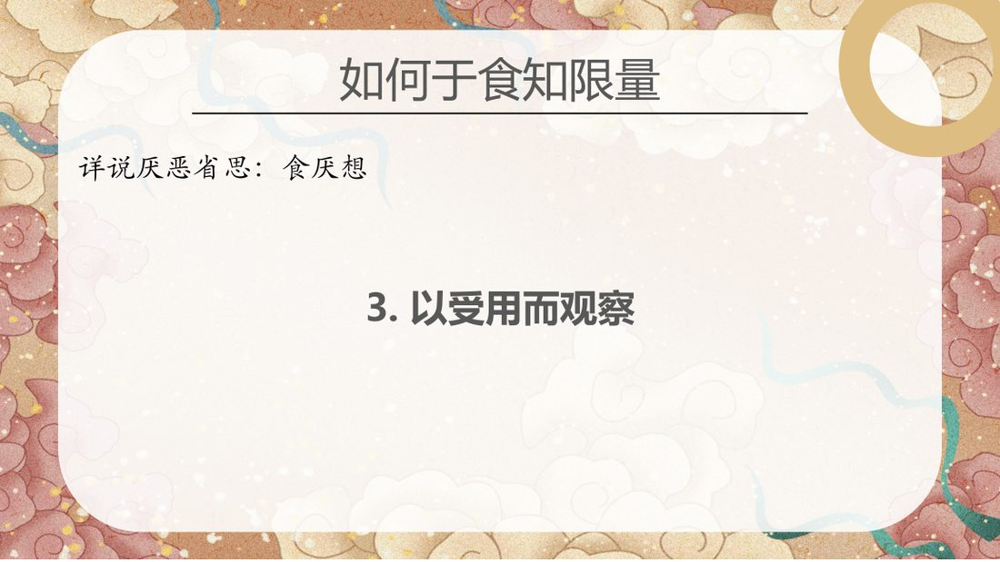
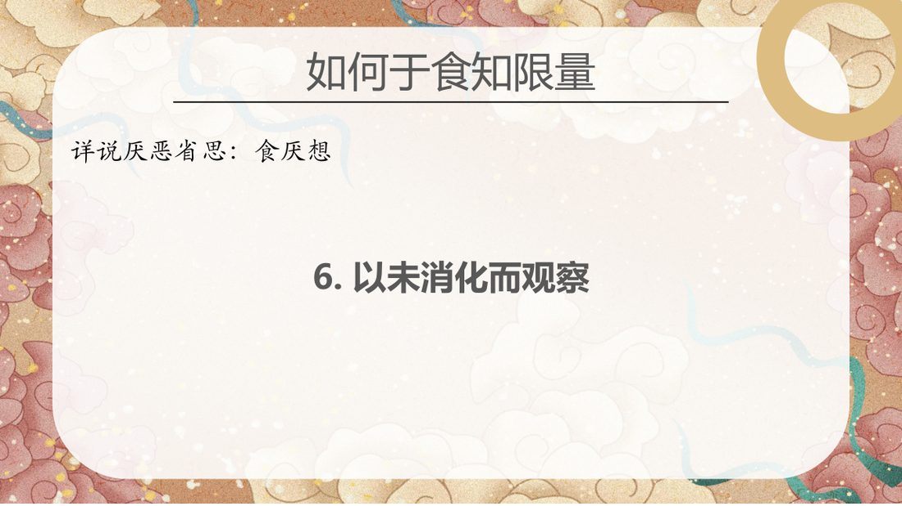
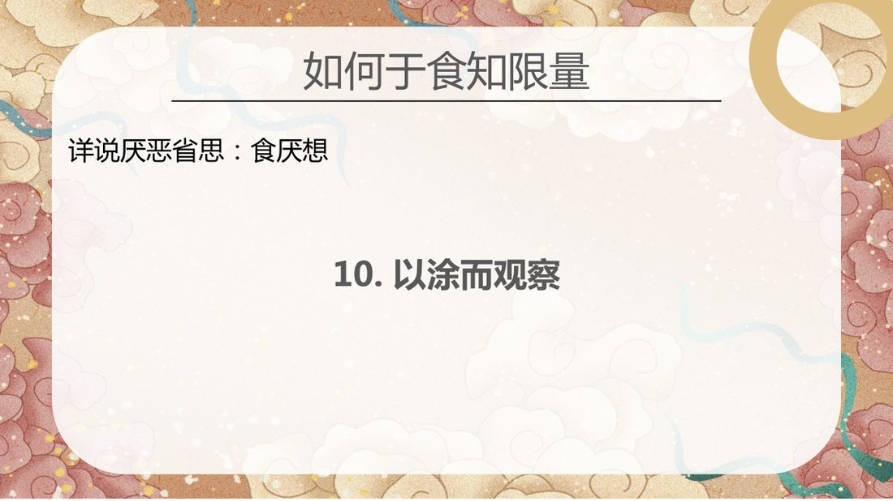

📅 最近更新：2026-09-29 12:30　|　第5版精修（朗读优化版）

# 第4周：不净随念·食厌想与从止转观（主持人版）

> ⭐ **本讲主持人速览**（新主持人必读，2分钟看完）
>
> 你不是老师，是"共学同行者"。你不需要提前懂内容，只需要按流程走。
> **本周由连续两周内容合并**而成，含两段共读、两轮分享与两轮讨论，单讲 120 分钟。
>
> | 环节 | 标准时长 | ⏱ 时间不够→ | ⏱ 时间富余→ |
> |:-----|:----:|:-----|:-----|
> | 🧘 静心开场 | 10 min | 缩至5 min | 加2分钟静坐 |
> | 📖 共读原文1 | 20 min | 只读★核心段（约15 min） | 加读◈扩展段 |
> | 💬 第一轮分享 | 10 min | 每人1句话 | 每人3分钟 |
> | 🎯 第一轮主题讨论 | 10 min | 只讨论问题① | 讨论全部问题+扩展 |
> | 🧘 禅修练习 | 15 min | 缩至8 min（只念引导词前半） | 延长至20 min |
> | 📖 共读原文2 | 20 min | 只读★核心段 | 加读◈扩展段 |
> | 💬 第二轮分享 | 10 min | 每人1句话 | 每人3分钟 |
> | 🎯 第二轮主题讨论 | 10 min | 只讨论问题① | 讨论全部问题+扩展 |
> | 🔚 收尾与回向 | 15 min | 缩至10 min | 保持 |
>
> **主持人10条守则（精简版）**：
> ① 不讲解、不提供答案——让原文自己说话；② 有人问"正确答案"→说"先听听大家的看法"；③ 冷场→主持人先分享自己的真实感受；④ 跑题→温和拉回："这个有意思，我们回到今天的原文"；⑤ 争论→"两种看法都很好，大家保留自己的理解"；⑥ 确保人人发言；⑦ 不评判任何人的分享；⑧ 时间到了就推进；⑨ 禅修练习照读引导词即可；⑩ 结束一起回向。

> 本周主题：**以「不可喜（asubha）」去贪着——认识十不净与尸体观（修止／修观两条路），并以食厌想十种观察维度（行乞／遍求／受用／分泌／贮藏处／未消化／消化／结果／排泄／涂）看待饮食，从而止息贪欲与贪食。**；**佛／法／僧随念即三皈依的实质与「四不坏信」的所缘；随念修到顶只达近行定，它是「从止转观」的桥梁——由定力入名色分别智，观无常而生离染与厌离。**。

---

## 📋 本周信息卡

| 项目 | 内容 |
|:----|:-----|
| 时长 | 120分钟（4周版 · 9环节） |
| 核心问题 | 十不净与食厌想如何以「不可喜」对治贪着？佛／法／僧随念即三皈依的实质，它为何是「从止转观」的桥梁？ |
| 共读原文 | 共读原文1：材料①《33_食厌想-20250208（课件）》。　｜　共读原文2：材料①《三皈依2-古源尊者-20250428（课件）》，材料②《三皈依2-古源尊者-20250428（录音）》。 |
| 本周作业 | 每天至少一次，在佛／法／僧三随念里轮着选一支，忆念三宝的功德；并写一行「今天我是靠三宝，还是靠烦恼」。做得少没关系，做一句也算数。 |

## 🧘 静心开场（10 min）

**开场准备与氛围（会前 10 分钟完成）**

> 1. **环境**：灯光柔和（不要顶灯直射），通风但不直吹，手机静音并集中放置；座位围成圆形或半圆。**灯光比平时再柔一档**——本周涉尸体相，明亮的顶灯会让人更容易起反应。
> 2. **坐姿三选**：①坐垫（盘腿或散盘，膝盖不适者用两个垫子）；②椅子（双脚踏实、背不靠死，可垫小枕）；③跪坐（备垫子）。开场就说明：**「哪一种都好，中途可以换，换姿势不是失败。」**
> 3. **物**：备水（本周涉饮食与尸体观，有人会口干或胃部不适）、面纸、薄毯。**额外备一条**：出口旁留一个空位（有人需要暂离时不必穿过人群）。
> 4. **开场三句话（先讲纪律，再进引导）**：①「全程 120 分钟，中途可自由起身、可去喝水，**可以随时离场，不必说明理由**。」②「本讲会谈到尸体、排泄与饮食里的东西，**任何人随时可以选择只听不说、只取一处、随时暂停**，这是我的承诺，**不是客套**。」③「**我们在这里只谈自己看到什么，不谈别人的事、不评断任何人。**」
> 5. **主持人自己的准备**：会前 5 分钟静坐，把「十项食厌想」与「十不净」两张名单在心里过一遍，并确认自己能把「**不净＝不可喜（asubha），不是厌恶**」这句话用一句白话讲出来。**主持人心里稳了，场子就稳了。**
> 6. **不做的三件事**：不布置「必须看到什么」；不要求成员报告观察结果；**不渲染、不添油加醋**——原文写「可厌」就念「可厌」，**不加形容词、不描述气味与画面细节**（渲染是本周最常见的失误）。
> 7. **静心阶段的三层节奏（主持人心里有数）**：第一层「松身体」（约 2 分钟）——呼吸、放松肩颈、下巴、眉心；第二层「收心思」（约 3 分钟）——把未完成的事「打包扔掉」；第三层「带问题」（约 3 分钟）——把「我是怎么看待这个身体、这顿饭的」轻轻放进心里。最后 2 分钟留给静默，**不急着开口**。
> 8. **会前主持人独处三分钟（照做）**：找个角落坐下，放下手机，做三次深呼吸，心里默念三句话——①「今晚我只带路，不评判」；②「不可喜，不是嫌恶」；③「看得清、看不清，都算数」。带着一张安稳的脸进入场地。**主持人的脸，就是全场的定心锚。**
> 9. **开场前先在心里划好本讲的边界（主持人参考）**：本周只带大家看「**两张清单、一条分界线**」——两张清单＝食厌想十项、十不净；一条分界线＝**不净随念是「不可喜、去贪着」，不是「嫌恶、自我嫌弃」**。若有人提前追问定境、观智、三十二身分细节，只回一句方向话——「**三十二身分详见读书会24／06；定境与观智我们留到第8周**」——**不展开、不硬讲、不引原文**。
> 10. **本周的「温度」设定（主持人参考）**：这是一门「**看清自己**」的功课，不是「**修理自己**」的功课，更不是「**审判别人**」的功课。开场与全场，请把语气的温度定在「**好奇、宽松、不评判**」——你越不急，成员越敢看；你越稳，成员越安心。**不要把「不净」念成一种道德审判，也不要把「可厌」念成一种处罚**；「可厌」只是「不可喜」，是去掉一层美化滤镜而已。**本周台上最有力的工具是你的语速：慢半拍。**

**主持人引导语**（照读即可）：

> 各位贤友，请找一个让自己舒服的姿势坐好，背自然挺直，双手轻轻放在腿上，眼睛可以微微闭上，也可以垂目看着前方一小块地面。
>
> 先做三次深长的呼吸：吸气，知道自己在吸气；呼气，知道自己在呼气。让肩膀松下来，让下巴松下来，让眉心松下来。
>
> 现在，把注意力轻轻带到「坐着的这个身体」上——你能感觉到身体的重量、接触坐垫的压力、呼吸进出时的起伏。这个身体，就是今天我们要一起看的课本。它不用买、不用借，从出生到现在一直带着，还从来没有好好看过它一遍。
>
> 心里也许还挂着今天未完成的事。不赶它们走，只是跟它们说：等一下再说。我们先给心按一下清零键——不是把念头压下去，而是先把纠结、期待、担忧「打包，扔掉」。心松了，身体才会松；心不松，身体松一会儿又会紧起来。
>
> 好，我们保持轻松、开放的觉察，带着两个问题来开始今天的共读：**我每天说「我的身体」，可我真的看过它吗？我每天都要吃饭，可我真的看过这顿饭吗？**……不必急着回答，只是把它们轻轻放在心里。
>
> 最后，我想把一句话放在最前面，也是今天最重要的一句话：**「不净」＝不可喜（asubha），是拿掉一层美化的滤镜；不是讨厌自己，也不是嫌恶别人。** 今天我们只做「看清」，不做「评价」。如果中间有任何一段让你不舒服，**你可以跳过它、可以只看一处、可以随时暂停、可以随时离场**——这不是不专心，这是本周的纪律。**愿我们在看清楚的同时，心比来时更宽。**

> 主持人：本段第 5、6 段的意思呼应材料① [00:07:19]「我们只要在你内心里面能看到这具尸体，它是不净的……它是可厌的……你亲爱的人你都不会想着把他的尸体放在客厅摆着」——**原文的落点是「不可喜」，不是「恶心」**；照读即可，语速放缓，句间留白。**若场上有人在开场时已显紧绷，直接省略「尸体」一词，只念「不净＝不可喜、去贪着」，并把静心延长到 12 分钟。**

---

> 💬 **破冰｜3–5分钟**：说说看：吃东西的时候，你有多少时候是「知道自己在吃」的？

> 🛡️ **心理安全三约定**（每次开场在心里过一遍）：① **保密**——这里说的话不出这间屋子；② **不评判**——不评价任何人的分享，也不急着评价自己；③ **可随时暂停**——任何时候觉得不舒服，都可以停下来休息、喝水或离开，不需要解释。

## 📖 共读原文1（20 min）

（原表为课件图形页，见《原文全集》）

### 原文材料①：★核心·《5不净随念&死随念-20230708》（音声）

- **文件**：《5不净随念&死随念-20230708》

> 【照录·录音转写原文，保留全部时间码】（依据录音转写整理，已校对明显同音错字）
>
> [00:00:49.120] 我们今天来再学习，两个不，这个护卫业处。不净的业处，一个是不净业处，一个是不净随念。不净业处，它也有两种。修法，一种是止禅的不净业处，一种是观禅的不净业处。那修习止禅的不净业处？我们是可以证得，这个初禅。那观察，是要去观修观好。这个不净业处，我们叫不净随念，它是要配合死随念来。我们后面会再学习三十二身分，叫做厌恶省思。那修行这个，
>
> [00:01:50.480] 不净业处的时候，同样的，跟那个慈金禅一样的，就是同性只能观想同性的尸体。女性长久者只能观想女性的尸体，男性长就者只能观想男性的尸体。这个在清净道论里面，对于修习不净。这个业处的指示，它有两种，一种，就是你已经证得了入出息（念）禅那，或者白遍第四禅，那你可以借助禅那的力量力量来修习不净。那你就很容易这个能够。证得不净业处的初禅。那我们如果还没有正的采纳。可以不进水面，纯粹是，所以来休息，护卫来用。
>
> [00:02:54.880] 那我们心里面要取一个。就是自己过去曾经见到过的，同性的尸体，我们相信，很多人，对自己的，有时年年纪大一点的，对亲人过世的，同性的尸体，都见过。取那一具，同性的尸体，越难看越好。现在尸体都化妆，不容易，不难看，但也没有关系。那所以大家做好，
>
> [00:03:31.390] 你可以去。想象一下自己曾经见过的。四题。那你去在心里面呈现那一具尸体的样子。那过去？如果你着重于看这个尸体的头部，那可能你在心里面呈现的就是他的。头部比较多，如果你以前侧重于在他的右边看到，就是右边就左边看到就会左边。无所谓，
>
> [00:04:09.865] 前提，是当你看到那具尸体的时候，心里面出现那种尸体的时候，就是如果他在你心里面变得清晰，或者不够清晰，你就朝向它那个更清晰的。地方。这个注意它是。近的。是。不会令人喜欢了。那如果你实在没见过，你可以取这个图片上的字体，这是一具干尸。你也不知道这个是男女，这是女的就把他当成女的，男的就把他当做男的，都没关系，那个那么。取这样的视频，如果他在心里面呈现出来。呈现出来，那就注意它是不敬，注意它是不尽是可厌的好。
>
> [00:05:19.400] 那如果你的在作揖的时候，内心的定力会有提升？那具尸体？会不会那么干瘪，它会变得饱满一些。那如果你是已经证得了阿那巴那斯禅或者白变四禅，你在修这样的尸体的时候，那个尸体就会很明显的好像就变好看了，对他就会比较。这个饱满，忽视颜色，也会比较不那么难看，对，甚至于，你修着修着，你喜悦会生起，你是即使作意他可厌可厌不净不净，但是你依然会。这个升起喜悦和快乐，而证得初禅，那。
>
> [00:06:19.880] 为什么会这样？我们就像这个缅甸人，说这个他们有一种食物。就像我们中国的这个臭虾酱一样。很多臭臭鱼烂虾，拿来这个发酵。这个缅甸人叫雅比。对，它其实是很臭的。但你把它炒了以后，炒个鸡蛋味道挺好的，
>
> [00:06:51.525] 就同样，当我们专注于尸体的不净而达到静情定的这个阶段的时候，不净的尸体的这个像就会暂时变得。好看起来，那由于定力的力量，所以，喜和乐的禅支就会生起，所以他就会证得初禅。那，那对于我们修这个不净随念作为护卫业处来看，
>
> [00:07:19.760] 我们只要，在你内心里面能看到这具尸体。它是不进的。它是可厌的。那没有人，你再亲爱的人，都不会想着把他的尸体放在你的床边，放在你的。客厅摆着。因为它是不敬的，它是可厌的，就这样，所以它是可厌可厌可不敬然后。让他在你内心里面这种不敬和可厌的这种感觉升起来，对于还没有采纳的人，基本上就是，不做是一种不错的一种状态。当有这种状态起来的时候，我们就可以接着下来修行随念。
>
> [00:08:13.080] 好，现在，我们可以根据你自己过去曾经见过的字体。
>
> [00:08:21.120] 或者说。图片上的尸体，休息对于尸体的不敬，不敬作意。
>
> ——【以下为选读段：由尸体作意转修死随念（死随念详解见本系列第6周）】——
>
> [00:12:44.180] 随着那具尸体在你内心中清晰的呈现，知道它是不敬。它是可厌的，那我们接下来就转修，死随念。
>
> [00:12:57.860] 但是死随念我们在第一天已经讲过。那一切的生命？他都会死。死，是生命的终结。但是，随念，不是修那个阿拉汉的，正断死。阿拉汉死亡以后，他不会再结生。它也不是我们名色法的刹那，刹那生灭的这种事。也不像是一棵树枯了，它就不会再挣扎了这种事。手碎链是指。轮回的友情，生命的这种一个阶段的生命的终结。命根的中断，我们称为叫友情的死亡。
>
> [00:13:46.540] 死亡它有四种类型。一种叫业尽而死，就是过去的善业，上一生临死前，成熟的那主业结束了。就业的力量耗完了，要业尽而死。还有就叫寿终而死，寿尽而死。受尽而死，一般我们说人生百岁。这个人，这个我们的身体的器官。他的这种这个正常的这种生命。它的存活时间，
>
> [00:14:19.320] 在我们这个时代。大概就是百岁左右。在佛陀时代，有说是人寿一百二十岁，也有说是一百岁。每过一百年，寿命减一岁。那我们属于简洁，这个时代如果按照一百岁来算，我们的的寿精的时间是七十五岁。如果按一百二十岁来看，就是这个九十五岁就像一条狗，它的一般它的寿命就是不会超过二十年那人，寿命一般很少超过一百年。那你到了这个岁数，就会死，叫受尽而死。
>
> [00:15:03.160] 还有一种是业和寿俱尽，业也结束了，寿命也到了，有业寿俱尽，还有一种就是非时死。就是由于毁坏业成熟，就是他的业也没有到，他的寿命也没有到，他突然死，好，就我们讲横死。这个异常情况死亡，由于，灾难，由于这个车祸，由于这种疾病。出现了死亡，最终毁坏液导致的死亡。那。
>
> [00:15:42.440] 对于修死随念，我们有两种方式来修。
>
> [00:15:48.065] 第一种，就是我们在第一天讲过的，我们作揖死亡一定会到来。是，这是我们这一期生命的终结。没有一个生命，不能够。能够不死的好。那死亡的时候？命根会断绝？等于死亡一定会到。我们能生多久不能确定。能活多久不能确定，当然，死亡是必然的，我们可以非常确定的知道，死亡一定会到来。
>
> [00:16:28.340] 好，当我们这样作揖的时候，我们就想到那一具尸体。那一具尸体，对于我们来讲，那个尸体，也就是我们的，终结，我们的终结的时候，也会像那具尸体一样，我们也有这样成为尸体的本性。那这样周一，就周一我们也会死。
>
> [00:16:52.180] 在这个。这个羞耻的嘴脸？他有可能一个错误，就是你想到自己会死的时候，你会很。很害怕，害怕死。那那这个就是属于修死随炼，没有修对。包括，如果你取的这个字体，是你过去曾经喜爱的，修这个字体，你悲伤存起来，这也是错的。如果那个死的是你过去讨厌的人，你修着他的死，你欢喜心神起来。这也是错的，

## 💬 第一轮分享（10 min）

**分享规则（主持人先读一遍）**

> 1. 每人 **2 分钟**（时间紧则 1.5 分钟），**自愿**发言；**不说也可以，说「我跳过」就好**。
> 2. **只谈自己**：我观察到什么、我心里起了什么；**不谈别人的身体、饮食、家务与修行**。
> 3. **不评判**：不说「你这样修不对」，也不给自己打分；**说得乱、说不清，都算分享**。
> 4. **可随时停**：讲到一半不想讲了，**停就停**，主持人接过去就好。
> 5. **注意**：本周涉尸体／排泄观，**如果有人脸色不对，主持人先说一句「谢谢，够了」，把话接过来**，并给一个呼吸的建议。

**起手问题（选 2–3 个，由浅入深）**

> **起手问一（最安全、人人可答）**：今天这两张清单，**哪一项让你觉得新鲜／意外**？不用讲感受，只说「哪一项」。
> **起手问二（生活经验）**：我们平常说「这个东西不干净」「这顿饭不健康」，和今天讲的「不净／食厌」有什么不一样？**（提示：前者常常带着嫌弃与恐惧，后者只是「拿掉滤镜」——这是本周最关键的一处分辨。）**
> **起手问三（自我观察）**：如果要用一句话说出「我今天最需要拿掉的那一层滤镜」是什么，你会怎么说？**（提示：只说自己，一两句即可；不必解释，不许别人追问。）**

> 主持人控时口诀：**「先请三位、再说一句、切换下一段」**；第一轮分享宁短不长，把时间留给主题讨论与练习。

---

## 🎯 第一轮主题讨论（10 min）

**第一问（由浅入深·定义层）：「不净」为什么译成「不可喜」，而不是「厌恶」？**

> 引导：请先一起把材料① [00:07:19] 那段念一遍——「它是可厌可啊不敬不敬不敬然后，让他在你内心里面这种不敬和可厌的这种感觉升起来」。
> 提示：**不可喜（asubha）＝「不是我喜欢的」**，是一句**关于事实**的话；**厌恶＝「我讨厌它」**，是一句**关于情绪＋评价**的话。前者去掉美化滤镜，后者常常又加上一层恨意。
> 落点：**分辨清楚这一点，是本周一切练习的安全阀**。用一句白话讲出来：**「不净，是拿掉滤镜；不是加一层嫌恶。」**
> 小组讨论 6 分钟 → 大组汇总，写三条共识。

**第二问（分辨层）：修止的不净与修观的不净，差在哪里？为什么本周「不追求定境」？**

> 引导：材料① [00:00:49] 说「不净业处也有两种修法，一种是止禅的不净业处，一种是观禅的不净业处」；[00:01:50] 又说「你已经证得了……第四禅，可以借助定力的力量来修习不净」；材料④ [00:00:52] 补充「修定时要取同性尸体，修观则作意可厌即可」。
> 提示：**止**＝取相、入定（可至近行定／初禅，须与死随念配合）；**观**＝作意可厌、破贪着（所缘可更宽）。本周的目标**不是**定境，而是**看清**：看清身体的「就是这样」，看清饮食的「就是这样」。
> 落点：**「不追求境界、不以体验自许」**——随念是「止→观的桥梁」，不是终点（**从止转观见本系列第8周**）。
> 小组讨论 8 分钟 → 大组汇总，写三条共识。

**第三问（应用层·守心理安全）：食厌想为什么「只对治贪吃」？它为什么不能对所有人用？**

> 引导：请念材料③ [00:15:02]：「如果你是一个贪吃的人，就可以用这十种方式来观察……如果本来你胃口就不好，那你就把今天早上我讲的忘记掉……我们法类呢，佛陀教导的法类就是正对治。」
> 提示：**「正对治」是一句关键话**：药要用在「对机」的人身上。食厌想对治的是**贪**（多欲、放逸、贪着美味与囤积），**不是**对治厌食、不是对治身体虚弱、更不是对治「我不想活了」。
> 落点三句护栏：①**不推广**——不劝别人照做，不把「你该少吃」挂在嘴边；②**不兼职**——不做饮食指导、不给医学建议、不诊断；③**可退出**——任何人练了不舒服，**立刻停**，改回正常饮食与呼吸放松。
> 小组讨论 8 分钟 → 大组汇总，写三条共识（写在白板上，**下周开场先复述一次**）。

**（时间富余时的加练·10 分钟）十项接龙**

> 玩法：主持人说「行乞」，下一人接「遍求」，依序接完十项；接不上可以由旁人补。**接完不做点评**，只问一句：「十项里，**哪一项你最不想用在自己身上？不用说理由。**」——让「不想用」被允许，这本身就是本周的安全阀。

> **分层追问**（可视时间取用，由浅入深）：
> - 【现象】不净随念、食厌想，对治的分别是什么？
> - 【影响】对食物与身体的贪，怎样悄悄消耗修行？
> - 【应对】这周你愿意从哪一餐、哪一口开始，练习一次「知量」？

---

## 🧘 禅修练习（15 min）

### 练习一

> ⚠️ **禅修禁忌提示**：若你正处在严重抑郁、焦虑、创伤后应激，或精神类疾病的发作／用药期，或正经历强烈的情绪危机，请先咨询医生或心理师，再决定是否练习；练习中若出现明显不适（如心悸、胸闷、情绪失控），请立即停止，睁开眼睛，把注意力放回呼吸与身体，必要时离场休息。

**本讲练习的两种版本（主持人按场上情况选一，默认 A）**

> - **A · 呼吸版（默认；最安全，人人可做）**——用安般念式的呼吸放松。**若场上有人对尸体／排泄观敏感，一律用这一版。**
> - **B · 单点作意版（可选）**——在呼吸稳定后，只取**一处**作意「不可喜」。**明确说明：可以只做呼吸、不做作意；作意不清、作意不出，都算完成。**

**A · 呼吸版引导词（照读即可）**

> 请把姿势坐好，背自然挺直，肩膀松开。眼睛可以微闭，也可以垂目看着前方一小块地面。
>
> 先做三次深长的呼吸：吸气，知道自己在吸气；呼气，知道自己在呼气。让心跟着呼气，往下沉一点。
>
> 现在，把注意力轻轻放在鼻端——人中附近、或者鼻孔边缘，那个呼吸进出会碰到一点感觉的地方。不用去找，只是放在那里。
>
> 你不需要让呼吸变得明显，也不需要控制它。呼吸或粗或细，都随它。你只要知道：**有入息，有出息**。
>
> 如果发现肩膀紧了、眉心紧了、后脑勺紧了，**大概率是想控制呼吸**——那就不自然。只要提醒自己一句：「松开」，就好了。
>
> 外面的风吹在树叶上，你看不见风的样子，但你知道风在。呼吸也是无形无相的，你不必看见它，只要知道它在这里。
>
> 好，我们就这样，轻轻地、自然地知道呼吸，静默三分钟。（静默）
>
> 现在，请把心从呼吸上放开，回到坐着这个身体的整体感觉上：接触坐垫的压力、身体的重量、呼吸的起伏。**你知道自己在呼吸，也知道自己坐在这里。**
>
> 好，慢慢动一动手指、脚趾，可以睁开眼睛。**今天，我们没有修理任何东西，只是陪着呼吸坐了一会儿。这样就已经很好。**

**B · 单点作意版引导词（在 A 的静默之后接上，约 5 分钟）**

> 现在，我们试着做一次**很轻的**作意，**只取一处**——你可以选下面任何一句，也可以只做呼吸、**不做这一部分**：
>
> 第一句：「**这个身体，将来也会成为一具尸体。**」——只是知道，像知道明天可能下雨一样地知道，**不必想象任何画面，也不必去嗅、去看**。
>
> 第二句（更轻的一版）：「**我不需要美化它。它就是这样。**」
>
> 让这一句在心里轻轻放着，像一片叶子落在水面，**不压它、不追它**。你不需要看到什么，也不需要有什么感觉。
>
> 如果心里起了紧、起了怕、起了厌，**那正好是我们练习「松开」的地方**：把注意力放回呼气，跟着呼气松一次；松了就回到呼吸。**反复几次都可以。**
>
> 好，把这句话放掉。回到呼吸。呼吸回来了，我们就停在这里。

> 主持人：**本段练习与材料① [00:07:19]（作意不净·可厌）同源，但已刻意「降级」为单点作意**——目的是**去贪着**，不是进入定境、也不是追求影像。**若有人报告任何不适（胸闷、恶心、想哭、僵住）：先请他把眼睛睁开、看着场地里的一个固定点、做三次慢呼气；再给「可以去走走、可以喝水、可以提前离场」三个选项；不追问、不分析。** 照录段的安般念调身指引（[00:44:28]、[00:45:22]、[00:55:17]）已编入《原文全集》，主持人可自行取用。

---

### 练习二

> ⚠️ **禅修禁忌提示**：若你正处在严重抑郁、焦虑、创伤后应激，或精神类疾病的发作／用药期，或正经历强烈的情绪危机，请先咨询医生或心理师，再决定是否练习；练习中若出现明显不适（如心悸、胸闷、情绪失控），请立即停止，睁开眼睛，把注意力放回呼吸与身体，必要时离场休息。

**引导语（主持人照读，约 12 分钟）**

> 各位贤友，请坐好，背自然挺直，双手轻放腿上，眼睛可以垂下，也可以轻闭。做三次深长的呼吸……让身体松下来。
>
> 现在，我们把八周的随念，做一次「收拢」。
>
> **第一，佛随念。** 心里轻轻忆念：**「彼世尊亦即是阿拉汉、正自觉者、明行具足、善逝、世间解、无上士、调御丈夫、天人导师、佛陀、世尊。」**（慢慢念一遍，或用自己的话忆念佛陀的功德。）如果你正为某事害怕，就把这句功德放在那件事上。
>
> **第二，法随念。** 心里轻轻忆念：**「法是世尊善说、自见、无时、来见、引导、智者各自证知。」**（忆念法的六种特质，想起「法是一味让人从根上离苦的」。）
>
> **第三，僧随念。** 心里轻轻忆念：**「跋葛瓦的弟子僧团，是善行道者、正直行道者、如理行道者、正当行道者……是世间无上的福田。」**（忆念僧团，想起自己不是一个人在路上。）
>
> 好，三支随念念完，把心安住在「我皈依三宝」这一念上。……不必求什么境界，不必求什么觉受。**知道自己在忆念三宝，就已经在皈依里了。** 就这样安静地坐一会儿……（静默 4–5 分钟）……
>
> 好，请轻轻动一动手指，睁开眼睛。把刚才这一份安稳，带回今天的这一晚。

> 主持人：本练习**只做忆念三宝功德，不追求任何影像或境界**。若有人忆念时情绪上来，只给一句「**听见了，慢慢来，回到呼吸**」，不追问。允许睁眼、允许不做、允许只听。

## 📖 共读原文2（20 min）

### 原文材料①：★核心·《三皈依2-古源尊者-20250428（课件）》

- **文件**：《三皈依2-古源尊者-20250428（课件）》

> 【照录·课件原文】（PDF 解析文本，逐字照录；巴利拼写与明显 OCR 讹字一律保留）

**皈依的定义**

**1 皈依佛 (Buddham Saraṇaṃ Saraṇaṃ Gacchāmi)**

· 佛陀为“无师自悟者”，已证四圣谛与一切知智

● 经典引证：“世尊自成、无师，对先前未曾听闻法，自己已觉悟圣谛。”（《中部注释》）

**2 皈依法 (Dhammam Saranam Gacchāmi)**

· 法为“道、果、涅槃”，能灭苦、导向解脱

· 经典引证：“诸比库，八圣道分是诸法中最上者。”（《增支部》）

**3 皈依僧 (Saṅgḥạm Saraṇaṃ Gacchāmi)**

· 僧为“四双八辈圣者”，实践佛法并传承正法

● 经典引证：“僧是世间的无上福田。”（《长部》）

**一、佛随念**

Iti' piso Bhagavā, arahaṃ, sammā sambuddho, vijā caraṇa-sampanno, sugato, lokavidu, anuttaro, purisadammasā rathi, satthā devamanussā nam, buddho, bhagavā 'ti

彼世尊亦即是是阿拉汉、正自觉者、明行具足、善逝、世间解、无上士、调御丈夫、天人导师、佛陀、世尊。

**二、法随念**

sväkkhäto bhagavatä dhammo / sanditţhikoakaliko ehipassiko opaneyyiko / paccattam veditabbo viñnūhï’ ti.

法是世尊(一)善说，(二)自见，(三)无时的,(四)来见的,(五)引导的，(六)智者各自证知的

**三、僧随念**

suppaţipanno bhagavato sāvakasaångho / ujuppatipanno … / ñāyappaṭipanno … / sāmīcippaṭipanno bhagavato sāvakasaangho, yadidam cattări purisayugāni aţtha purisapuggalā esa bhagavato sāvakasangho, āhuneyyo pähuneyyo dakkhíeyyo añjalikaraņiyo anuttaram puñnakkhettam lokassā’ ti.

跋葛瓦的弟子僧团是善行道者／正直行道者／如理行道者／正当行道者。也即是四双八士，此乃跋葛瓦的弟子僧团，应受供养，应受供奉，应受布施，应受合掌，是世间无上的福田。

**三皈依的譬喻与逻辑次第（选读）**

譬喻阐明：●佛如医王(拔除烦恼箭)，法如良药(治愈病根)，僧如痊愈者(示范疗效)。●佛如船师(指引方向)，法如舟筏(承载渡河)，僧如渡众(已至彼岸)。
次第逻辑：●佛为首:觉者为一切法根源。●法次之：佛所宣说，离苦之道。●僧为终:实践与传承法的圣众。

**皈依的破与果报（选读）**

破皈依的类型：有罪破——转向外道导师（如信仰其他宗教）；无罪破——死亡或程序错误（仅限凡夫）。果报差异：未破者——投生善趣（如天界），最终证圣果（《长部》引证）；已破者——堕苦界（如地狱），需忏悔并重修皈依。经典依据：“凡皈依佛者，不堕恶趣;舍人身后，圆满天身。”（“长部”）

> 主持人注：材料①是「所缘清单」——先让成员看见：**皈依佛的所缘，就是佛陀的功德（十号）；皈依法的所缘，就是法的六种特质；皈依僧的所缘，就是僧团的四种行道。** 这就把「三皈依」和「三种随念」对上了：**随念，就是忆念你所皈依的三宝功德。** 念完停 10 秒。

### 原文材料②：★核心·《三皈依2-古源尊者-20250428（录音）》（音声转写）

- **文件**：《三皈依2-古源尊者-20250428（录音）》

> 【照录·录音转写原文，保留全部时间码】（依据录音转写整理，已校对明显同音错字）

#### 一、皈依的定义：他杀义与三宝各自的作用（[00:00:00]–[00:08:35]）

> [00:00:00.000] 各位仙友，晚上吉祥。真的不明霞。
>
> [00:00:08.860] 我们昨天学习这个三皈依。我们讲到了。
>
> [00:00:17.380] 皈依什么，是皈依的是佛法僧三宝。
>
> [00:00:26.440] 皈依？什么是皈依？。皈依，把你叫萨拉萨拉那？他就是有他杀的意思。他这个他的他杀的意思就是杀杀人，叫他杀。他杀？是什么意思？就是就如他杀为皈依处，就是指以皈依者由其皈依而杀害、破坏、除去、消灭他的。恐惧怖畏战栗，痛苦恶趣和烦恼的意思。修于你皈依的佛陀，就能够杀害我们的恐怖，杀害我们的烦恼，杀害我们的痛苦，杀害我们去恶趣的可能。所以这个 saraṇa，它有这个杀害的意思。或者，由他转起利益与遮止不利而杀害诸有情的怖畏为佛陀？
>
> [00:01:40.440] 就是因为皈依。这个能够。让我们在未来收到很好的利益，同时，因为我们皈依，会遮止，就是会规避很多的不利。同时，能够杀害我们的恐惧，那这个是叫皈依，要皈依佛陀。那那皈依佛陀，就是简单来讲，它能够让我们有利益，遮止不利，会杀害或者有就是去除。这个如果原理上来讲就叫杀害他杀，杀害什么？杀害痛苦，杀害恐惧，所以这样，我们来去皈依佛陀。
>
> [00:02:35.820] 那皈依法？就是令度过三有的沙漠，以及给予安稳，就称为皈依法。因为我们昨天我们讲的是正皈依法，那。那正皈依是法，那这个法起什么作用？我们皈依法起什么作用？它就能够度过三有的沙漠。那个今天刚才我们讲到了，就是如果你认识到生命，就像沙漠一样。或是生命，就像苦海一样，皈依法，我们就可以渡月，就可以穿越，就可以过去，而且，能够获得安稳，能够获得安稳。皈依法，当下就有安稳，证悟涅槃以后可以获得终极的安稳。这个是叫做法，
>
> [00:03:33.300] 皈依法。皈依僧，就是。我们少有所做，就给一点点那比如说布施，供养，恭敬的机会，就能够获得大果报。这个就是皈依僧。皈依僧的利益，就是能够获得大果报，所以称为是世间无上的福田。
>
> [00:03:58.400] 对，这个僧，是指圣贤僧。四双八辈的圣者僧，那那但是，如果我们并不是这个知道某一个人是是不是是不是圣者，但是我们知道这个僧团他是从佛陀。这个辗转传承下来，他的这个清净的法和律。它没有变化。那他这个还是，坚守着，佛陀的原始的教法和他的这个戒律的行持，这样的僧团，就等同于跟佛陀的时代的僧团它是有相续的。都是属于这个佛陀的圣弟子僧团的延续，就是同一个僧团的意思。所以供养这样的僧团，就会有大果报，即是世间无上的福田。
>
> [00:05:06.030] 所以这样的三种这种方法，我们称为因为有这样的作用，因为佛陀，可以让我们消除恐惧，可以让我们消除去恶趣，而且，能够遮止没有利益的事情。
>
> [00:05:21.930] 所以，我们皈依佛，就是皈依他不是。这个的利益在什么地方，我们要搞清楚，那皈依法，就是能够去除我们的这个烦恼，能获得我们的安稳皈依生有大果报。那大果报，就是。
>
> [00:05:51.260] 皈依法，就是我们获得，这个佛陀教导的法和指导我们这个日常的这种生活而获得安稳。我们讲到就是睁眼是圣谛，闭眼是圣谛，都是法，对。归于生，还有一个，即生是上同伴。他既是善事的所在，他也是善同伴。他也是上游。对，那为生，就是现在现前的这个生，他就是修行的专业团体对。出家人？我们是修行的专业团体。好，那他们就这个全心全意致力于修行，那修行什么？依靠这个法来修行，那这个法就修行做什么用？一直佛陀指导的要趋向涅槃。那这样的这个修行团体，
>
> [00:06:48.880] 同时也是我们的善友。就是我们可以依靠的，因为他们在学习，他们在实践，他们专业的在实践，因此，我们依靠他们来去进一步学习。那这也是归医生的一个，
>
> [00:07:05.780] 一个定义，或者一个一个我们要去思考的一个点。
>
> [00:07:14.320] 所以这个皈依，萨拉南，这个伽玛南，就是沙马沙拉南，伽嘛南。那是由该净信该尊重的那个三宝而灭除烦恼，转起那个依附的形象或不由他人资源所生起的心。这个称为皈依。那前提，是因为你有净信。那真正的净信是初果圣者，那还没有到真正的正信的时候，那我们要通过在法的实践里面获得净信。因为净信我们。这个尊重那个佛法僧三宝，尊重说佛法僧三宝干嘛呢？灭除我们的烦恼，那因为灭除烦恼，发现它真的是有用，有大利益，有大果报，我们讲到说佛陀讲说新的训练，有大利益有大果报。

## 💬 第二轮分享（10 min）

**分享规则（照读，约 1 分钟）**

> 我们进入第一轮分享。规则三句：①**自愿**，愿意说的说，不愿意说的就跳过，不点名；②**每位 2–3 分钟**，只讲自己的体会，不点评别人；③**只谈自己，不谈别人的事、不评断任何人的信仰**。今天没有标准答案，说「我还不确定」也是很好的分享。

**起手问题（主持人择 2–3 个，由浅入深）**

> 1. **暖身**：这八周里，哪一支随念你用得上手？（佛／法／僧／天／死／不净？提示：答「哪支都还没上手」完全正常。）
> 2. **本周主题**：回想一次你「遇到烦恼时」的反应——那一刻你第一个靠上去的，是自己惯性的烦恼，还是会想起三宝？如果想起了，你是怎么想起来的？（提示：这正是「皈依」在日常里的样子。）
> 3. **心理安全前哨**：听到「随念只达近行定」「从止转观」这些词，你是感到**有方向**，还是感到**有压力 / 怕自己修不出来**？（提示：无论哪种反应，都是真实反应，先记下，留到主题讨论与特别提醒回应。）

> 主持人：第 1 题是「破冰」，接受一切反应，不做对错；第 2 题把话题落到「具体经验」，避免空谈；第 3 题是本周心理安全的前哨，若有人答「怕修不出来」，正是说明「把桥梁误当成终点」的焦虑，**这正是本周要一起澄清的重点**，先记下，留到主题讨论与特别提醒里回应。**分享不追问、不深挖。**

## 🎯 第二轮主题讨论（10 min）

> 引导语：接下来三问，由浅入深。小组（3–4 人）先讨论 8 分钟，再回大组分享。每问请主持人先给一句「提示」，把抽象问题落到具体处。

**问题一（浅）：把「随念」和「皈依」接起来。**
> 提示：材料①课件说——皈依佛＝佛陀的功德（十号）；皈依法＝法的六特质；皈依僧＝僧团的四行道。那么「忆念佛的功德」和「皈依佛」是不是同一件事？请用一个你自己的例子说明：「忆念三宝功德」是怎样变成「真的靠上三宝」的。（提示指向：材料②「我靠，上你了……我们一般都不靠佛陀，我们靠烦恼来的」。）

**问题二（中）：关于「四不坏信」与「信心会不会动摇」。**
> 提示：材料②说「真正的净信是初果圣者」，又说「圣者的皈依只有不破和没有杂染」。请讨论——（1）凡夫的信心会不会动摇？动摇了是不是就「破皈依」了？（2）「四不坏信」（对佛、法、僧、戒的不坏净信）与「随念」是什么关系？（提示指向：随念＝把心安放在三宝功德上，是长养净信的具体方法；动摇是常态，回到随念即可。**注：「四不坏信」一词三材料原文未出现，此处由主持人白话语境引导，不作原文字句考据。**）

**问题三（深）：把「随念」放回「从止转观」的坐标里。**
> 提示：材料③说「止业处修完之后」要转观，靠定力穿过三遍知、证名色分别智，观名色法的无常→苦→无我，生起厌离。请讨论——（1）随念只达近行定，那么它是不是「修了也没用」？（2）如果你把随念当作「止→观的桥梁」，你下一步会怎么走？（提示指向：桥梁不是终点，但没有桥就过不了河；「不追求境界、不以体验自许」。）

> 主持人：三问后请各组写「共识三条」交上来。第 3 问守心理安全——**若有人因「修不出来」而焦虑，请把它拉回「桥梁／方向」：我们本周不是要比谁修得高，而是要把八周的随念，安放进一条清晰的路上。**

> **分层追问**（可视时间取用，由浅入深）：
> - 【现象】随念、皈依、四不坏信，你听出它们怎么接上「从止转观」了吗？
> - 【影响】只有止、不转观，到哪一步就停了？
> - 【应对】往后你愿意怎么把随念用起来？给自己一个小起点。

## 🔚 收尾与回向（15 min）

### 收尾一

**总结引导（主持人照读，3 分钟）**

> 各位贤友，今天我们一起走了两条路。
>
> 往内的一条：**不净随念**——我们看清楚，「不可喜」不是厌恶，「去贪着」不是修理自己。修止的不净取同性尸体相，修观的不净作意可厌；而这一条路的下一步是死随念（**详解见本系列第6周**）。
>
> 往外的一条：**食厌想**——十项观察（行乞／遍求／受用／分泌／贮藏处／未消化／消化／结果／排泄／涂），把一顿饭从「好吃／不好吃」，还原为「就是这么一回事」。它**只对治贪吃**，尊者提醒得很清楚：**胃口不好的人就不要用**。
>
> 今天我们真正学会的，也许只有一句话：**「看清，不等于讨厌。」** 看清之后，心反而更松、更宽——这才是本周的目标。

**本周作业认领（3 分钟，口头认领，不必写名字）**

> 请每位贤友从三项里**任选一项**，本周做一周，下周来时用**一句话**报告（也可以只说「我选第 3 项」）：
> ① **不净作意**：每日静坐后 3 分钟，只取一处作意「不可喜」，不追求影像清晰；
> ② **食厌想一项**：每餐前用一项观察（建议「受用」或「排泄」之一），一句话记下；
> ③ **呼吸放松**：每日 5 分钟，只报告「我今天呼吸了 5 分钟」。
> **三项等值；选哪一项都算完成。**

**下周预告（约 2 分钟）**

> 下周是**本系列收官**：第8周**「随念与皈依、四不坏信、从止转观」**——我们会把佛、法、僧三随念收束到**三皈依的实质与四不坏信的所缘**，并完成「**随念 → 无常想 → 离染 → 厌离**」这条**从止转观**的路。请带上本周的一句话体会：**「看清之后，我的心是更紧了，还是更松了？」**

**回向（合掌，齐诵，四句）**

> 愿我此功德，导向诸漏尽；
> 愿我此功德，为证涅槃缘；
> 我此功德分，回向诸有情；
> 愿彼等一切，同得功德分。
>
> **Sādhu! Sādhu! Sādhu!**

---

### 收尾二

**总结引导（主持人照读，约 3 分钟）**

> 各位贤友，今天我们做了八周的收束。请把三件事带回家：第一，**佛／法／僧三种随念，忆念的正是三皈依的三宝功德**——所以随念，就是皈依的实修；第二，**「四不坏信」是对佛、法、僧、戒的不坏净信**（圣者的皈依「不破、无杂染」，凡夫则以随念长养信心）；第三，**随念只达近行定，它是「从止转观」的桥梁**——由定力入名色分别智，观无常而生离染与厌离。

> 今天最值得带回家的一句话，也许是这句：**「随念不是终点，是回家的路——顺念三宝的功德，心就回到三宝这里。」** 八周走完，不必问「我修到了没有」，只问「我还愿不愿意继续靠上去」。**愿意，就是皈依的样子。**

**全系列八周回顾与下周预告（照读，约 2 分钟）**

> 这八周，我们从「总论」走到「佛、法、僧、天、死、不净」六支随念，又摸到了「食厌想」，最后把一切收束到「皈依」与「从止转观」。**随念修习到这里告一段落，接下来往哪里走？** 往「观」——依定力深入名色分别智、观五蕴无常苦无我（详见读书会01止观入门、读书会06身念处；涉三十二身分·色业处详见读书会24）。**请把「随念是桥梁」这句话带在身上，等待下一段路的开始。**

**成员回馈三问（约 5 分钟，每人一句，主持人记录）**

> 1. 八周里，你最想带走的一个词是什么？（常见答案：「皈依」「四不坏信」「桥梁」「净信」。）
> 2. 你打算把哪一支随念，变成长伴？（佛／法／僧／天／死／不净？）
> 3. 有哪一句话，你觉得以后会用得上？现在说给自己听一次。（例如「我靠，上你了」「随念是桥梁，不是终点」。）
> 若有人不愿说，直接跳过，不留空、不追问。**不要把分享变成评估。**

**一分钟静默（约 1 分钟，照读）**

> 我们用一分钟，什么都不做，只是坐着，忆念三宝的功德。……（默静一分钟）……好，请轻轻动一动手指，睁开眼睛。

**交接清单（散会前必做）**

**本周作业（照读，约 1 分钟）**

> 本周作业只有一件事：**每天至少一次，在佛／法／僧三随念里轮着选一支，忆念三宝的功德**（可用引导语里的三句话）；并写一行「**今天我是靠三宝，还是靠烦恼**」。再写一句话：这八周，我打算把哪一支随念变成长伴。**做得少没关系，做一句也算数。**

**回向（照读；材料②原回向段可诵，本系列以通用汉译四句回向收束）**

> 愿我此功德 导向诸漏尽
> 愿我此功德 为证涅槃缘
> 我此功德分 回向诸有情
> 愿彼等一切 同得功德分
>
> Sādhu! Sādhu! Sādhu!

> 主持人：本系列回向词用通用汉译四句；材料②录音原回向 [01:12:22] 起「以此法随法行，我敬奉佛／法／僧……我将解脱生老病死」亦可先诵一遍再入四句。回向后请成员合掌，静默数秒，再散会。

## 📌 本讲主持人特别提醒

> 1. **【本周为敏感周·必读】不净＝不可喜（asubha）、去贪着，非自我嫌弃与嫌恶他人。** 「不净」是拿掉美化的滤镜，是一句**关于事实**的话；「厌恶」是加了恨意，是一句**关于情绪与评价**的话。开场、共读、讨论、练习四处**都要各说一次**。**绝不允许**把「不净」讲成道德审判、性别羞辱或身体羞耻——**发现苗头，立刻用一句话拉回来：「我们只谈原理，不谈任何人，也不谈自己好不好。」**
> 2. **【本周为敏感周·必读】涉尸体观／排泄观，随时可跳读、可只取一处、可随时暂停。** 具体做法：①开场先给**明确承诺**（不是客套）；②共读时**主持人可整段跳过**（尤其材料③「排泄」「涂」两项，与材料①尸体相段）；③**不渲染**——原文写「可厌」就念「可厌」，不加形容词、不描述气味与画面；④读前给出「**可以随时离场，不必说明理由**」，并在出口旁留空位。
> 3. **【本周为敏感周·必读】提供呼吸放松选项，并让它成为「同等选择」而非「退而求其次」。** 练习默认走 **A·呼吸版**（材料① [00:44:28]、[00:45:22]、[00:55:17] 三段），单点作意版为**可选**；有人不适时，立即念「身体任何部位觉得紧张了，再去放松它」，并给「喝水／走动／离场」三个选项。**若有人情绪波动：不追问、不分析、不诊断、不贴标签**；主持人不是心理工作者，只做「陪伴＋给选项」。
> 4. **食厌想「正对治」——只对治贪吃，且不推广。** 材料③ [00:15:02] 明确说「本来你胃口就不好，那你就把今天早上我讲的忘记掉」。**主持人不劝人少吃、不做饮食指导、不给医学建议**；若知有成员正在节食、身体虚弱或有身体／食物相关困扰，**主动建议他选「呼吸放松」作业**，并在会前私下确认一句「今天这段你可以只听不说」。
> 5. **不追求境界、不以体验自许。** 本周只求**分清两条路（止／观）＋记住两张清单（十不净、食厌想十项）**；**不讲定境、不比体验、不问「你看到了什么」**。随念是「止→观的桥梁」，不是终点；**从止转观见本系列第8周**。任何「我看到了……／我入定了……」的分享，主持人都温和接回：「**好，谢谢，我们回到原理上来。**」
> 6. **多机边界（讲台上务必说清，避免成员误会重叠）**：①**与读书会03第5／6周（不净观）主题相近、文件不同**（同主题不同讲次，详见《原文全集》）；②涉**三十二身分（可厌作意）**处，**详见读书会24／06**；③**死随念**详解**详见本系列第6周**；④食厌想与「于食知限量」互为表里，**日常饮食之正念运用另见读书会05**。

<!--EXT_READ-->
## 📖 延伸阅读（课后自由选读）
- 《05_不净随念&死随念-20240623》——不净随念的第二种讲法口径。
- 《止观前行实修营3-于食知限量》——食厌想的姊妹法「于食知限量」。
- 《33_食厌想-20250208（课件）》——食厌想十种观察维度。
- 《12_食厌想-20240627》——食厌想专题音频。
- 《5不净随念&死随念-20230708》——不净随念与死随念。
- 《16_佛随念-天人导师-20250120（课件）》——三皈依之佛随念部分。
<!--/EXT_READ-->
