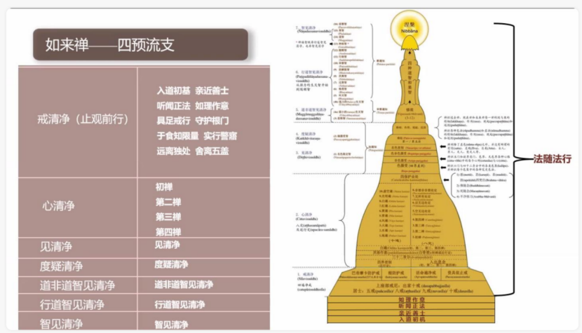

📅 最近更新：2026-09-29 15:00　|　第5版精修（朗读优化版）

# 第1周：禅修的本质与目标与如来禅修学体系（主持人版）

> ⭐ **本讲主持人速览**（新主持人必读，2分钟看完）
>
> 你不是老师，是"共学同行者"。你不需要懂禅修，只需要按流程走。
>
> | 环节 | 标准时长 | ⏱ 时间不够→ | ⏱ 时间富余→ |
> |:-----|:----:|:-----|:-----|
> | 🧘 静心开场 | 10 min | 缩至5 min | 加2分钟静坐 |
> | 📖 共读原文 | 25 min | 只读★核心段（约15 min） | 加读◈扩展段（约40 min） |
> | 💬 第一轮分享 | 20 min | 每人1句话（约15 min） | 每人3分钟（约30 min） |
> | 🎯 主题讨论 | 35 min | 只讨论问题①（约20 min） | 讨论全部问题+扩展（约45 min） |
> | 🧘 禅修练习 | 15 min | 缩至8 min（只念引导词前半） | 延长至20 min |
> | 🔚 收尾回向 | 15 min | 缩至10 min | 保持 |
>
> **主持人10条守则（精简版）**：
> ① 不讲解、不提供答案——让原文自己说话；② 有人问"正确答案"→说"先听听大家的看法"；③ 冷场→主持人先分享自己的真实感受；④ 跑题→温和拉回："这个有意思，我们回到今天的原文"；⑤ 争论→"两种看法都很好，大家保留自己的理解"；⑥ 确保人人发言；⑦ 不评判任何人的分享；⑧ 时间到了就推进；⑨ 禅修练习照读引导词即可；⑩ 结束一起回向。

> 本周主题：禅修的本质与目标与如来禅修学体系。一句话：什么是禅修（培育心的素质、去除五盖）；为什么两千多年后的今天我们依然能修（正法住世五个千年）；这条路的全图是什么（如来禅：戒定慧三学、七清净、十六观智）。**全部原文均为文字版（PDF课件/录音转写整理），可直接共读。**

---

## 📋 本周信息卡

| 项目 | 内容 |
|:----|:-----|
| 时长 | 120分钟 |
| 核心问题 | 什么是禅修？为什么两千多年后的今天我们还能修？ |
| 共读原文 | 《如来禅修学体系介绍06-古源尊者-20240624》；《如来禅修学体系17-禅修次第1-时代特点与确立目标-古源尊者-20250119（课件）》；《2025五月包容寺短期出家修习营01-如来禅修学体系简介-古源尊者-20250501》 |
| 本周作业 | 每天睡前用2分钟回想今天心里最清楚的一次状态（不评判，只观察） |

## 🧘 静心开场（10 min）

> **开场破冰 · 暖场**（约 3 分钟）：用一句话说说：来参加读书会之前，你以为“禅修”是什么？
> （说完不必解释、不点评，只把它轻轻放在心里，带着这份真实进入今天的静心。）

> **本期共同约定（心理安全）**：① **保密**——今天在这里说的话，留在今天；② **不评判**——不评价任何人的分享；③ **可随时暂停**——坐不住、心里不舒服，随时可以调整姿势、起身或暂停，不需要向任何人解释。

**主持人引导语**（照读即可）：

> 我们先静坐一分钟。闭上眼睛，感受自己的呼吸，让心慢慢安静下来。（停顿60秒）
> 今天是《禅修入门与基础》读书会的第一次相聚。在接下来的八周里，我们将一起读古源尊者关于禅修基础的开示，一起练习，一起分享。在这里，我们不比谁坐得久、谁坐得好，也不要求自己"学会"什么——只是每周抽出两个小时，从外面的事情里退回来，陪一陪自己的身心。今天的第一课，我们先弄清楚两个最根本的问题：禅修到底是什么？为什么两千多年后的今天，我们还能修？
> 我们不做讲座，也不考谁记得住名词——只是把原文摊开，一起读、一起坐、一起说。先约定一件事：今天无论听到什么，都不用马上"同意"或"搞懂"，带回去慢慢想就好。如果坐了一分钟发现腿有点麻，这很正常——身体的感觉，恰恰就是我们下一周的主题。今天的环节是：一起读三段原文、第一轮分享、主题讨论，还有我们的第一次禅坐——8分钟，不用紧张。

---

## 📖 共读原文（25 min）

> ⚠️ 主持人操作：以下为完整原文文字，可直接照读或让大家轮流朗读，无需查知识库。出处信息见各材料下方；转写段落前的时间码（如[00:01:35]）是出处标记，朗读时跳过不念。

### 原文材料①：禅修的本质与止观——什么是禅修、止禅与观禅、止观关系

- **文件**：《如来禅修学体系介绍06-古源尊者-20240624》

**★核心段落**（必读）

**一、禅修的本质：培育心的素质**

> [00:01:35] 首先，我们来了解一下什么是禅修。禅修在巴利语，发音叫"巴瓦那"（bhāvanā）。它的意思是发展、培育。即它是用来进行心灵发展、提升我们心的素质的一种修行实践。

> [00:06:33] 我们习惯性是追那个结果的。而修行，它不是为结果，结果是一个自然的呈现。我们说"你只管做好事就行了，果报自然会来"，也是这样的：修行，你只管在每个当下，你的心是在上行的状态、在善心的状态，自然不善心就不会生起。

> [00:07:36] 很多人最后修出很多禅病，就是因为这个心态的原因。所以我们必须从一开始特别地、一再地交代，一再地让自己明白：**禅修的目的是培育心的平静，是去除我们内心的五盖**，这个必须很了解。

**二、止禅(samatha)的定义**

> [00:03:49] 止观禅法，既然是止观，严格来讲，就分成止禅和观禅。

> [00:03:57] 止禅，在巴利叫"萨马塔"（samatha），过去我们翻译成"舍摩他"（奢摩他）。奢摩他的本意是（令烦恼）止息、（心）平静——"萨马塔"是一个组合词，其中"沙玛"（sama）是指平、很平静的意思。即心专注在一个位置上，不动、没烦恼、安宁的状态。

> [00:04:56] "阿"（a）是巴利名词的语基，是语言的基础，它没有实际的含义。

> [00:05:08] 在《辨析道义注》——就是《辨析道》，过去翻译成《无碍解道》，是沙利子尊者（舍利弗尊者）的论著——在《辨析道义注》和《法集义注》里面，对奢摩他有一个这样的解释：**令欲贪等诸障碍法止息、消失，故称为止**。这个诸障碍法，指的就是欲贪等五盖的烦恼——就是我们汉地天台（智者大师）讲的"诃欲、弃盖"里面的那个五盖。让五盖等烦恼止息消失，称为"止"。

> [00:05:56] 因此，止禅的目标是培育我们心的宁静、平静，令我们心的素质提升，得以征服烦恼，为后面开展观禅提供基础，它是起这样的目标的。

**三、观禅(vipassanā)的定义**

> [00:08:01] 接下来这个观，巴利语叫"维巴萨那"（vipassanā）。

> [00:08:08] 过去用我们古汉语翻译成"毗婆舍那"。毗婆舍那，如果用客家话来念，也是"维巴萨那"。

> [00:08:19] 维巴萨那也是组合词，就是"维"（vi）加"巴萨那"（passanā）。"维"（vi）在巴利里的意思是"不同""多样"；"巴萨那"（passanā）就是观照、看。所以合起来，维巴萨那是说"通过无常等种种行相去观照诸行法"的这样一种方法，称为毗婆舍那，称为"观"。现在有人把它翻译成"内观"，其实并不非常准确，因为它不仅仅是内观，还有外观。

> [00:09:14] 观，是指通过观照——我们精神和物质这两个部分称为名色——观照名色等诸行法的无常、苦、无我三相来培养智慧的一种方法。维巴萨那的目的，是舍断对名色法的执取，也就是对五蕴身心（精神与物质）的执取，然后证悟涅槃、体证道果。

> [00:09:45] 所以观禅系统——我们如来禅的观禅系统——强调以佛陀的一代言教，就是以最接近佛陀言教的巴利三藏圣典为依托，特别注重对阿毗达摩的研究和实践。因为阿毗达摩就是修观的说明书。

> [00:10:10] 阿毗达摩讲名法、讲色法、讲缘起法，修观的时候，你就是要去看这个名法、看这个色法、看这个缘起法。

**★核心段落**（必读）

**四、止禅与观禅的关系：止是观的基础**

> [00:03:32] 所以如来禅的禅修，简单来讲，我们就称为止观的禅法。以传承清净的巴利三藏为依托，有着佛陀教导的严格、清晰的禅修次第。

> [00:18:58] 修什么呢？修习心与慧。"心"的修习——这里心就是指止禅的部分，让我们的心变得清净，那就是修止、修定。而"慧"的修习（bhāvanāya）是指观智，即刚才讲的维巴萨那、毗婆舍那。毗婆舍那有十六种观智。

> [00:29:08] 在佛陀时代，我们说佛教的解脱是通过心的修行得以实现，那禅修，是修心的方法。

> [00:45:18] 而止观禅修，是二者（出家人与在家人）获得解脱或者累积解脱资粮的最有效的方式。

**◈扩展段落**（可选）

**五、两条证悟路径：止观行者与纯观行者**

> [00:19:50] 这里（经中）说的有慧比库，是三因结生的，而且懂得如何来修；这样一个很热忱的、致力于熄灭烦恼的出家人，他能够解开这些结缚——即安住于戒、心清净的比库，依据次第培养戒定慧三学，以这样的方式，他可以斩断结缚、断除烦恼。（依戒→心/止→慧/观的次第）

> [00:21:57] 按照佛陀时代的传统，证悟有两种路径：一种路径我们叫做纯观行者，也有一些人称为"干观"；还有一种是止观行者。

> [00:22:28] 纯观行者，就是他并没有证得（安止）禅那（初禅、二禅、三禅、四禅），但是他修观禅，这个就称为纯观行者。

> [00:24:02] 止观行者，在巴利里面叫"萨马塔亚尼卡"（samathayānika）。萨马塔刚才讲过了，就是三摩地、奢摩他，这是指证得初禅二禅乃至八定的这种安止定，再从这些定的高质量的心里面出来培养观智，这个叫止观行者。

> [00:25:46] 传统的纯观行者，虽然不需要培养安止定，但是他要培养近行定和刹那定……因此心的疲劳会经常发生，这种情况下禅修者就需要有休息处。佛陀在《中部·两种寻经》里做了一个比喻：在战场上，战士有时会感到疲惫……对于止观行者来讲，禅那就如同堡垒，可以作为修观过程的休息处；而对于纯观行者来讲，他们因为没有禅那，但可以以近行定作为堡垒来休息。

> [00:27:09] 所以在禅修理论的层面，止观行者的禅修之路完全涵盖了纯观行者。因此，我们如来禅禅修体系的介绍，是以止观行者这个角度来展开，纯观行者本身就包含在里面。

### 原文材料②：正法依然住世——五个千年与确立修行目标

- **文件**：《如来禅修学体系17-禅修次第1-时代特点与确立目标-古源尊者-20250119（课件）》

**★核心段落**（必读）

**一、正法依然住世（时代特点）**

> "以得达辨析者住立千年,以六通者千年,以三明者千年,以纯观者千年,以巴帝摩卡住立千年。"(D.A.3.161)
> ——《长部义注》

> "确实唯有佛陀般涅槃后的(前)一千年能产生辨析(智),在那之后是六神通,之后连那也不能产生,则产生三明。过了(漫长的)时间,连那也不能产生,则是纯观者。不来者、一来者、入流者也是同理。"(A.A.1.1.130)
> ——《增支部义注》

**二、正法住世阶段（五个千年及对应可证果位）**

> 根据长部义注的说法:
> 第一个千年能够得到辨析智。
> 第二个千年能够得到六神通。
> 第三个千年能够得到三明(tevijjā)。
> 第四个千年能够证得纯观的阿拉汉果。
> 第五个千年连断除一切烦恼都不可能了,只能成就更低的三个果位:不来果、一来果与入流果。

**三、确立修行目标（目标总说）**

> 在上座部佛教中,有三种菩提,即正自觉菩提(sammā-sambodhi)、独觉菩提(pacceka-bodhi)、弟子菩提(sāvaka-bodhi)。在这三种菩提中,成就正自觉菩提者又被称为正自觉者(sammā-sambuddha),也即佛陀。成就独觉菩提者被称为独觉佛(pacceka-buddha)。成就弟子菩提者被称为圣弟子(ariya-sāvaka)。
>
> 这三类圣者在证悟阿拉汉果时,皆已彻见四圣谛,断除一切烦恼,完全清凉与寂静,他们在解脱上并无差异。不过,由于其往昔所发之愿、为满愿而积累的巴拉密(pāramī,波罗蜜)及累积巴拉密的时间不同,因此在最后一生解脱后,神通、智慧、福德等有很大差异。

> 《增支部·一集》中说:
> "诸比库,有一人出现于世间时,是稀有之人的出现。哪一人呢?如来、阿拉汉、正自觉者。诸比库,乃此一人出现于世间时,是稀有之人的出现。"
> "诸比库,绝无此理,无有条件,若一个世界中有两位阿拉汉、正自觉者不先不后地出现,绝无此理!诸比库,确有此理,若一个世界中只有一位阿拉汉、正自觉者出现,确有此理。"

> 若禅修者发愿成为普通弟子,致力于尽快解脱,则应了解《增支部·四集》中所说的四类人:
> 1) 敏锐知者(ugghāṭitaññū)
> 2) 详说知者(vipañcitaññū)
> 3) 可引导者(neyya)
> 4) 文句为最者(padaparama)

### 原文材料③（◈扩展）：如来禅体系总览——什么叫如来禅、三学/七清净/十六观智

- **文件**：《2025五月包容寺短期出家修习营01-如来禅修学体系简介-古源尊者-20250501》

**◈扩展段落**（可选）

**一、什么叫如来禅（体系名称的由来）**

> [00:10:48] 什么叫如来禅呢？为什么叫如来禅呢？首先我们知道什么是如来。佛陀说：诸比库，"如是说而如是行，如是行而如是说"者，故被称为如来。

> [00:11:09] 诸比库，于天魔、梵天、沙门、婆罗门、天人世间，如来是胜利者、不被征服者、见一切者、有自在力者，故被称为如来。……诸比库，有如来自觉悟之智，如来般涅槃日于其中间所说一切所谈乃至所说者，只是"如"而已，并非不如，故名如来。

> [00:12:09] （如来）行如所说，言如所行——"行如所言，言如所行"，故名如来。……所以如来是佛陀对自己的自称。所以如来禅，就是佛陀所教导的禅法，从佛陀辗转传来、没有增减的这样的禅法。

> [00:12:46] 那也是我们依据的这个三藏——巴利三藏的圣典，以及义注和复注，对于佛陀所教导的禅法的这样一种解释以及修证的方法。

**二、体系总览：三学、七清净、十六观智**

> [00:13:05] 根据这个三藏，我们的如来禅的禅法，归结出来是这样的次第：有三学、七清净。

> [00:13:22] 十六种观智。三学就是戒定慧三学，大家很熟悉。那七清净，分别是：戒清净、心清净、见清净、度疑清净、道非道智见清净、行道智见清净、智见清净。好，那这个七清净展开来——除了戒清净和心清净之外，从见清净到智见清净这五个清净，又被展开来称为十六种观智。好，所以我们说禅修——从如来禅的角度来讲，禅修包括止禅还有观禅。

（体系的整体框架见下图，投屏给大家看一眼，看图即可，不必逐行读。）

## 💬 第一轮分享（20 min）

**主持人引导**：

> 请大家轮流分享：读完这三段文字，最触动你的一句话是什么？为什么触动你？
> （主持人先分享自己的，然后按顺序轮流。这一轮只说不评论。）

---

## 🎯 主题讨论（35 min）

**主持人引导**：朗读下面3个问题，让大家自由讨论。**你不提供答案**，只引导。

**讨论问题（按优先级）**：
- **问题①（★必答，时间不够时只讨论这个）**：原文说禅修的本质是"培育心的平静，是去除我们内心的五盖"——这和很多人以为的"打坐发呆、放松解压"有什么不同？你来参加读书会之前，以为禅修是什么？（可以先轮流说说"我来之前的想象"，再对照原文找差异）
- **问题②（◈选答）**：止禅与观禅各是什么？为什么说"止是观的基础"？（提示：先用各自的一句话说说"止禅是什么、观禅是什么"，再回到材料①"止禅的目标……为后面开展观禅提供基础"那一段）
- **问题③（◈选答，时间富余或大家感兴趣时讨论）**：正法住世五个千年的划分说明了什么？对照今天的时代，你如何理解"现在依然可以修"？（提示：可回到材料①"禅修的目的是培育心的平静，是去除我们内心的五盖"和材料②"第五个千年"那两段）

---

> **分层追问**（可视时间取用，由浅入深）：
> - 【现象】你平时听到“禅修”这个词时，脑子里浮现的第一幅画面是什么？它又是从哪里来的？
> - 【影响】回想你最近一次想让心静下来的时刻，那时的你，是想解决点什么，还是只想歇一歇？
> - 【应对】这周挑一个安静的十分钟，坐着不动，只观察此刻的心是紧的还是松的，不急着去改变它。

## 🧘 禅修练习（15 min）：第1讲第一次坐

> ⚠️ **禅修禁忌提示**：若你正处在严重抑郁、焦虑、创伤后应激，或精神类疾病的发作／用药期，或正经历强烈的情绪危机，请先咨询医生或心理师，再决定是否练习；练习中若出现明显不适（如心悸、胸闷、情绪失控），请立即停止，睁开眼睛，把注意力放回呼吸与身体，必要时离场休息。

> **练习提示（禁忌与安全）**：如有严重身心疾病（重度抑郁／焦虑发作期、精神障碍等）、近期手术或严重心血管疾病、孕期或有医嘱限制者，请先咨询医生、量力而行；练习中若出现强烈不适，可随时睁眼、停止、调整，或改为静坐观察。

> 本引导词改编自《古源尊者(V.Uttama)禅坐引导文》第一节"自然坐好与身体意象化安放"（**非逐字照读**；括号内为操作提示与停顿，不念出来）。照读约2分钟，静坐约8分钟。

**主持人引导语**（照读即可）：

> 请大家自然地坐好，习惯双盘就双盘，习惯单盘就单盘，习惯散盘就散盘，习惯坐着就坐着。（停顿5秒）
> 不要刻意让身体变得很紧绷、很挺拔，完全自然轻松地坐着。想像自己如同一棵青松：臀部以下就像树根，扎根于泥土，自然、稳重；身体就像树杆，自然、挺拔；头像树梢，自然地朝向空中；双臂像树枝，自然地垂下。（停顿5秒）
> 不要刻意让身体紧绷，也不要松垮地靠着，就是自然、轻松地坐着。（停顿5秒）
> 好，现在，轻轻地把心放到呼吸上。不用控制呼吸，不用加深呼吸，让它自然地进、自然地出。（停顿10秒）
> 这一坐，我们不需要完成什么，也不需要达到什么。不用做任何特别的事，只是知道：呼吸正在进行。吸气的时候，知道呼吸在进行；呼气的时候，知道呼吸在进行。（停顿30秒）
> 心跑掉了，没有关系——发现的那一刻，恰恰就是"知道"回来了。轻轻把心带回来，继续知道呼吸就好。（停顿60秒）
> 呼吸可能清晰，也可能模糊；可能深，也可能浅。无论什么状态，都不去改变它，只是知道：现在有呼吸。（停顿60秒）
> 如果现在心里还有些乱，也没有关系——乱就让它乱着，我们只是安安静静地坐在乱的旁边，知道呼吸。（停顿30秒）
> 期间腿麻了、身体想动了，可以很慢地调整一下姿势，调整的过程也尽量知道动作，然后回到呼吸上。（停顿30秒）
> （继续静坐约3分钟，保持知道呼吸。主持人不再说话。）
> 好，现在，轻轻动一动手指和脚趾，耸耸肩、转转头，然后慢慢睁开眼睛。（停顿10秒）
> 这是我们的第一次坐。腿麻、心乱、犯困，都很正常——今天只求"坐了一会儿、知道有呼吸"，不求别的。下一周，我们就来学习怎样把这"一坐"坐好。

---

## 🔚 收尾与回向（15 min）

1. **每人一句话**：今天最大的收获是什么？
2. **下周预告**：下周我们解决最实际的问题——"如何坐好一坐"：骨盆怎么放、肩膀怎么松、头怎么摆、坐下之前要检查什么。主题是"正确坐姿与身心准备"。到时候请带一样东西来：你平时坐的椅子或坐垫——家里用什么，下周就用什么练。
3. **本周作业**：
   - 每天睡前用2分钟回想今天心里最清楚的一次状态（不评判，只观察）。
   - 小提示：不用回想"最好的一次"，就回想"最清楚的一次"；只观察、只记录，不打分、不自责。
   - 进阶（可选）：把每天回想的内容用一句话记进手机备忘录，八周结束时回看一遍。
4. **回向**（一起念）：

> **愿我此功德，导向诸漏尽！**
> **愿我此功德，为证涅槃缘！**
> **我此功德分，回向诸有情！**
> **愿彼等一切，同得功德分！**

---

## 📌 本讲主持人特别提醒

- **第一次活动**：正式开始前先让大家自我介绍（姓名＋为什么来参加），并说明两条约定：①不评判任何人的分享；②讨论没有标准答案，原文说了什么比"谁说得对"重要。
- **不要被术语吓住**：巴瓦那、萨马塔、维巴萨那、七清净、十六观智……主持人只需照读，不必解释；有人问就说："我们跟着原文读，读几周自然就熟了。"
- **材料①、材料③为录音转写整理**：语句口语化，照读即可；时间码（[00:xx:xx]）与（ ）内的整理注记是出处标记，朗读时跳过不念。
- **材料③整体为◈扩展**：时间紧张时整段跳过，不影响本周主线（材料①②已覆盖"是什么、为什么"）；材料③尤其适合在时间富余时慢读，或留到第8周"修学规划"前回顾。
- **"修行不是为结果"可能被听成"消极躺平"**：若有人这样理解，不争论，把问题交给小组（扩展二问题1），让原文"你只管在每个当下,你的心是在上行的状态、在善心的状态"自己说话。
- **讨论问题②的支架**：若大家分不清止与观，把原文指给大家——材料①第四段：止＝让五盖止息、心平静；观＝看名色的无常、苦、无我。只指路，不讲解。
- **延伸阅读的使用**：学员版末尾附本周全部资源（标题／类型／打开方式），主持人对照《原文全集》即可；因知识库临时链接会过期，本轮文档一律不放链接，需要原文时按"打开方式"到ima知识库搜索即可。
- **查重边界**：本周只讲"体系与目标"。三类菩提的发愿路径与"四类人"详解在第8周；禅修方法（呼吸）从第3周才开始——若有人问"到底怎么修"，回答："方法下周起逐步展开，今天先把'是什么、为什么'弄清楚。"不提前展开。
- **第一坐的期待管理**：有人坐完说"什么感觉都没有"或"全是妄念"。回应："今天只求知道有呼吸，不求感觉。"不评价、不加码。

---

> 📚 **下一份文档**：`第2周_正确坐姿与身心准备_主持人版.md`

<!--EXT_READ-->
## 📖 延伸阅读（课后自由选读）

- 《如来禅修学体系介绍06-古源尊者-20240624》——禅修的本质（巴瓦那＝培育）、止禅与观禅的定义、止观关系。
- 《如来禅修学体系17-禅修次第1-时代特点与确立目标-古源尊者-20250119（课件）》——正法住世五个千年、三类菩提与修行目标总说。
- 《2025五月包容寺短期出家修习营01-如来禅修学体系简介-古源尊者-20250501》——如来禅名称由来、三学／七清净／十六观智体系总览。
<!--/EXT_READ-->
