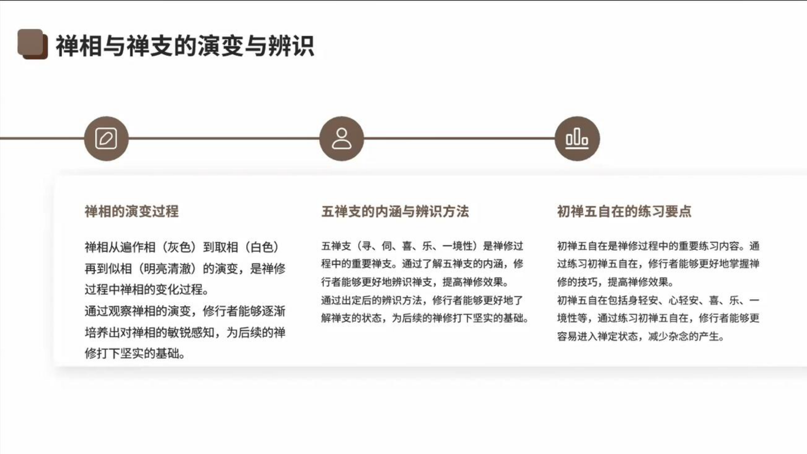

📅 最近更新：2026-09-29 15:00　|　第5版精修（朗读优化版）

# 第5周：微细呼吸、禅相与定的培育（主持人版）

> ⭐ **本讲主持人速览**（新主持人必读，2分钟看完）
>
> 你不是老师，是"共学同行者"。你不需要懂禅相与禅定，只需要按流程走。
> 本周只需要记住一件事：见到光也好，见不到也好，答案都不在主持人这里，在原文里。
>
> | 环节 | 标准时长 | ⏱ 时间不够→ | ⏱ 时间富余→ |
> |:-----|:----:|:-----|:-----|
> | 🧘 静心开场 | 10 min | 缩至5 min | 加2分钟静坐 |
> | 📖 共读原文 | 25 min | 只读★核心段（约15 min） | 加读扩展段落（约40 min） |
> | 💬 第一轮分享 | 20 min | 每人1句话（约15 min） | 每人3分钟（约30 min） |
> | 🎯 主题讨论 | 35 min | 只讨论问题①（约20 min） | 讨论全部问题+扩展（约45 min） |
> | 🧘 禅修练习 | 15 min | 缩至8 min | 延长至20 min |
> | 🔚 收尾回向 | 15 min | 缩至10 min | 保持 |
>
> **主持人10条守则（精简版）**：
> ① 不讲解、不提供答案——让原文自己说话；② 有人问"正确答案"→说"先听听大家的看法"；③ 冷场→主持人先分享自己的真实感受；④ 跑题→温和拉回："这个有意思，我们回到今天的原文"；⑤ 争论→"两种看法都很好，大家保留自己的理解"；⑥ 确保人人发言；⑦ 不评判任何人的分享；⑧ 时间到了就推进；⑨ 禅修练习照读引导词即可；⑩ 结束一起回向。

> 本周主题：微细呼吸、禅相与定的培育——呼吸变细之后，心会看到什么？**全部原文均为文字版（PDF课件/录音转写），可直接共读。**
> 主持人提示：本周常有人问"我见到的光是不是禅相"——你不必回答，共读原文会给出方向；你只需要带大家读原文、做练习、让每个人说话。

---

## 📋 本周信息卡

| 项目 | 内容 |
|:----|:-----|
| 时长 | 120分钟 |
| 核心问题 | 呼吸变细之后，眼前出现的光是禅相吗？ |
| 共读原文 | 《入出息念》；《如来禅修学体系16-入出息念业处十六事-古源尊者-20250118（课件）》；《如来禅修学体系14-入出息念浅析7-修习3-古源尊者-20250116（课件）》；《如来禅修学体系介绍22-古源尊者-20240706》 |
| 本周作业 | 每天坐15-20分钟；若见相，不追不赶，只在触点知道呼吸 |

> 主持人提示：本周共读有三个材料，建议材料①由主持人读，材料②、③轮流朗读（每人一小段）；读不动的段落直接跳到★核心段即可。

## 🧘 静心开场（10 min）

> **开场破冰 · 暖场**（约 3 分钟）：用一句话说说：这一周，你有没有过“心里忽然安静下来”的一瞬间？
> （说完不必解释、不点评，只把它轻轻放在心里，带着这份真实进入今天的静心。）

> **本期共同约定（心理安全）**：① **保密**——今天在这里说的话，留在今天；② **不评判**——不评价任何人的分享；③ **可随时暂停**——坐不住、心里不舒服，随时可以调整姿势、起身或暂停，不需要向任何人解释。

**主持人引导语**（照读即可）：

> 我们先静坐一分钟。闭上眼睛，感受自己的呼吸，让心慢慢安静下来。（停顿60秒）
> 到了第五周，如果你发现呼吸不像刚开始那么清楚了、变得更细更不容易抓住，或者眼前、身体里偶尔出现光——这都正常，它们是心静下来时常见的现象。这是怎么回事？该不该追？今天我们一起读原文——帕奥西亚多《入出息念》和古源尊者的课件与开示会告诉我们：呼吸变细之后，眼前出现的光是什么，真正的"定"又是什么品质。我们不追求"见到什么"，只是把路认清楚，然后老老实实地走。

**主持人提示**：读完后可直接进入共读；若想多坐一会儿，可加2分钟静坐（只默照呼吸，不加任何引导）。

---

## 📖 共读原文（25 min）

> ⚠️ 主持人操作：以下为**完整原文文字**，**可直接照读或让大家轮流朗读**，无需再去查知识库。出处信息见各材料下方。录音转写材料（材料③）中的时间戳〔如00:07:17〕与括号内注释**不必读出**，只读正文即可；每读完一个材料，可停几秒，问一句"这段有没有想分享的？"再进入下一个材料。若某位同修读得吃力，主持人接读即可，不必评论。

### 原文材料①：禅相：从遍作相到似相

- **文件**：《入出息念》

**★核心段落**（必读）

**（一）三种禅相：遍作相、取相、似相的定义与出现**

> 对于不同的禅修者，禅相的出现方式也可能不尽相同，因为不同的人对呼吸的心想也不尽相同故。有些人的禅相可能像雾一般出现，有些人的却可能像烟一般出现，另一些人的像棉絮，或只是单纯的光等等。不过，在刚开始时，禅相通常都是灰色的，那是"遍作相"(parikammanimitta)。当定力提升时，它会变白，那是"取相"(uggahanimitta)。当定力进一步提升时，它会变得明亮且清澈，那就是"似相"(paṭibhāganimitta)。入出息似相基于入出息产生，它是安止定的目标，即入出息禅那的所缘。

【整理者注】原文此处巴利字体转写作 pañibhàganimitta，规范转写为 paṭibhāganimitta。"遍作相即遍作定（预备定）阶段的相"之义，即含于"在刚开始时，禅相通常都是灰色的"一句——原文未另立"遍作定"名目，特此说明。

**（二）禅相的出现、与呼吸结合及稳定过程**

> 当禅相初次出现时，它很容易消失。只要他持续地专念于呼吸，当定力进一步加深时，禅相就能维持愈来愈久。当禅相与呼吸结合，并且其心自然地固定在禅相上时，他就无需再注意呼吸，而只专注禅相。
>
> 当他的定力变得愈来愈深时，禅相也会变得愈来愈明亮。这明亮的光也称为"智慧之光"(paññāloko)。

**（三）从似相到安止定**

> 继续专注入出息似相愈来愈长的时间，他将能体验到安止定。它首先将是入出息的初禅。

**◈扩展段落**（可选）

**禅相的演变过程（课件照录）**

- **文件**：《如来禅修学体系16-入出息念业处十六事-古源尊者-20250118（课件）》

> 禅相从遍作相（灰色）到取相（白色）再到似相（明亮清澈）的演变，是禅修过程中禅相的变化过程。
> 通过观察禅相的演变，修行者能够逐渐培养出对禅相的敏锐感知，为后续的禅修打下坚实的基础。

【整理者注】课件对遍作相注"灰色"、取相注"白色"、似相注"明亮清澈"，即三级禅相（变色与明亮）之原文依据；未另见"禅相如何出现、稳固"的专门段落。

### 原文材料②：安止善巧与净化

- **文件**：《如来禅修学体系14-入出息念浅析7-修习3-古源尊者-20250116（课件）》

**★核心段落**（必读）

**（一）安止——十种安止善巧（照录，皆与初学者直接相关）**

课件标题：「三、入出息念修习／八、安止／十种安止善巧」

> 1. 使事物清洁
> 2. 诸根平衡而行道
> 3. 善巧于相
> 4. 应当策励心时即策励心
> 5. 应当抑制心时即抑制心
> 6. 应当愉悦心时即愉悦心
> 7. 应当舍于心时即舍于心
> 8. 远离无定之人
> 9. 亲近有定之人
> 10. 志向于它

**◈扩展段落**（可选）

**（二）入出息念的杂染与净化——十三种净化（照录·精选）**

课件标题：「三、入出息念修习／五、入出息念的杂染与净化／十三种净化」

> [1] "心追随过去而陷入散乱，避免它并集中于一处。
> [2] "心期待未来而动摇，避免它并仅朝向于那里。"
> [3] "心收缩而陷入懈怠，策励它并舍弃懈怠。
> [4] "心过度策励而陷入掉举，抑制它并舍弃掉举。"
> [5] "心倾向[乐味事]而陷入贪染，正确地了知它并舍弃贪染。
> [6] "心排斥[乏味事]而陷入嗔恚，正确地了知它并舍弃嗔恚。"
> [7] "放舍布施现起的一性。"
> [8] "止禅禅相现起的一性。"
> [9] "坏灭相现起的一性。"这是针对修观者而言的。（原文作"参观者"）
> [10] "灭现起的一性。"
> [11] "进入行道清净。
> [12] "舍已增强。
> [13] "以智而喜悦满足。"

【整理者注】[1]–[6]与第4周文件"十八种杂染"[13]–[18]一一对应（对治过去散乱、未来动摇、懈怠、掉举、贪染、瞋恚）；[7]–[13]课件文字存在引号未闭合等排版脱漏（如[11][12]），照录如此，讲解时请以尊者现场开示为准。

### 原文材料③：定的品质：五禅支

- **文件**：《如来禅修学体系介绍22-古源尊者-20240706》

**★核心段落**（必读）

**（一）五禅支（寻、伺、喜、乐、一境性）的作用（依据录音转写整理）**

> 〔00:07:17〕插一句话：总的来讲，我们讲说禅修——禅修的初禅心呢，跟我们日常生起来的（善）心是相应的：心呢，它看起来是一样的、心的组成是一样的，但是心的素质会有不同。不同在哪里呢？就是它的强度：禅那心的强度会更强。然后，比如说我们要检查一个人的禅定是不是稳定呢，我们要他检查这个五禅支。检查五禅支呢，是只有在佛法的修定方法里面才有的，外道没有。那五禅支呢，是寻、伺、喜、乐、一境性。为什么去查这五个呢？就是这五个（在定中）会很强，会变得很有力量，你很容易观察到。
>
> 〔00:08:05〕寻是什么呢？寻就是——比如大家修习入出息（念），你的心呢就是朝向他。有些人形容为：感觉心要被这个地方吸走掉了、心要被吸进去了，那么这个力量呢，其实就是寻的力量。伺的力量呢，它就是心安在这个地方。伺跟一境性的区别在哪里呢？一境性呢，就是它是定，它是一种完全安静下来的状态；伺呢，就是他待在这个地方……它还是（微）动的；一境性是不动的。
>
> 〔00:09:04〕经典里面这个形容呢，就像蜜蜂去采花蜜：它从看到一朵花，然后飞过去到那个花的那个过程呢，这个就是寻。这个巴利叫 vitakka（原转写"we嘎"），那么我们古人把它翻译成"寻"是有道理的，就是"找"嘛——你找到它，其实它不仅仅是找，（心）朝向它也是（寻）。
>
> 〔00:09:35〕伺呢，就像那个蜜蜂就在那个花上面，在里面找有没有蜜——那个过程呢，它就待在那了，不再乱跑了。那喜呢，就是很喜悦。
>
> 〔00:09:52〕为什么你禅修的时候要有喜呢？大家想想：如果一件事情没有让你生起喜悦，你会愿意长期去做吗？连续在那边坐三个小时、四个小时（呢）？所以禅修的话，一定要生起喜。没有生起喜，初学的人就不干（坚持不下去）。然后呢，还有乐：你不但欢喜，你还有快乐，很舒服、轻安轻快，有些人觉得身体融化掉了、飘起来了。
>
> 〔00:10:24〕佛陀在《沙门果经》里面讲到，一个出家的沙门能够证到什么样的果报、又获得什么样的利益，其中讲到（初）禅的时候，就讲说这个（其）身被喜和乐所浸润、所遍满、所充满。就是你完全被泡（在喜乐里）的那种快乐的感觉。你有这种感觉，你的心才会长时间地愿意在那住着；那么一进去呢，你的心就定在上面了，完全地沉浸在上面。
>
> 〔00:10:56〕那么这五个禅支呢，它其实是心所——我们叫禅支，其实它就是心所，就是心的（素质）。那这五个心（所）的素质呢，它变得非常强有力，而且是平衡的。那个时候你入定呢，你就能够长时间地入在里面。

**（二）辨识五禅支的具体方法（出自帕奥《入出息念》，出处同材料①）**

> 如果能维持初禅大约两或三个小时，他将可以尝试辨识五禅支。一旦他从禅那中出定，即把心念放在有分心(bhavaṅga)所依止的心脏的地方，那是心处色。
>
> 有分心是明亮和光明的，看上去就像在心脏里的一面镜子，称为"意门"。当禅修者辨识意门时，将能看见入出息似相就出现在那里。接着他再辨识五禅支：
>
> 1. 寻(vitakka)：把心投入于入出息似相。
> 2. 伺(vicāra)：维持心投注于入出息似相。
> 3. 喜(pīti)：喜欢并对入出息似相感到高兴。
> 4. 乐(sukha)：体验对入出息似相的快乐感受。
> 5. 一境性(ekaggatā)：让心专注于入出息似相这一目标上。
>
> 他先逐一地辨识禅支，然后再一起辨识五个。

**◈扩展段落**（可选）

**（三）五禅支的内涵与辨识／初禅五自在（课件照录）**

- **文件**：《如来禅修学体系16-入出息念业处十六事-古源尊者-20250118（课件）》

> 五禅支（寻、伺、喜、乐、一境性）是禅修过程中的重要禅支。通过了解五禅支的内涵，修行者能够更好地辨识禅支，提高禅修效果。通过出定后的辨识方法，修行者能够更好地了解禅支的状态，为后续的禅修打下坚实的基础。

【整理者注】课件该部分为总述，未展开各禅支的逐支定义与禅那中辨识的具体步骤；五禅支各自作用的详细讲解见本文件资源C（介绍22录音）。

> 初禅五自在是禅修过程中的重要练习内容。通过练习初禅五自在，修行者能够更好地掌握禅修的技巧，提高禅修效果。
> 初禅五自在包括身轻安、心轻安、喜、乐、一境性等，通过练习初禅五自在，修行者能够更容易进入禅定状态，减少杂念的产生。

【整理者注】课件此处将"初禅五自在"表述为"身轻安、心轻安、喜、乐、一境性等"，与通常所讲的五自在（转向自在、入定自在、决意自在、出定自在、省察自在）不一致，疑课件文字有误或另有所指；照录原文并提示授课时以尊者现场开示为准。

**（四）什么叫做入定（依据录音转写整理）**

> 〔00:02:42〕去看这个心所的特点去了解。昨天呢我们也讲了禅那心路。禅那心路跟我们欲界的心（路）呢，就是短短的心路跟（比较）长的心路的区别（原转写"短短的心路跟无限长的心路"）。禅那心路，标准的禅那心路。我们讲说什么叫做入定呢？就是你的心在一个目标上，然后一直沉在里面，持续（很久），那个才叫入定。那我们讲说，你至少要能够沉入（定境）三到四个小时，那是什么意思？就是你的心（速行）生起来一串——三个小时没有停过、四个小时没有停下来，中间没有什么有分心插进来、没有什么其他念头夹杂在里面，那这个才叫（入）定，才叫真正的定。
>
> 〔00:03:33〕如果说"哎呀，我坐在里面，又有什么画面啊、又什么活菩萨来了、什么稀奇古怪的东西"——对不起，那不叫定，那（还是）打妄想。但是你可能有很好的感受：很好的感受就是你心在一个比较好的状态（而已）。真正的定呢，就叫心的一境性——心的一境性，就是心只在一个所缘境里面。
>
> 〔00:04:01〕然后呢，长时间地在这个所缘境里面安住。佛陀时代的圣者呢，他可以连续安住七天。实际上他可以安住更长的时间，但是佛陀一般不建议超过七天，因为超过七天呢，它会影响到（身心状态）：七天时间你都不吃饭、也不休息、也不睡觉，它会影响到我们的身心状态，所以一般佛陀不建议超过七天。
>
> 〔00:04:39〕包括佛陀时代，三果以上的圣者，他可以入灭尽定。入灭尽定呢，就是他这个心识就停掉，整个心识停掉。一般灭尽定呢，也不建议超过七天。那么这个七天呢，如果你入定七天，那就是真正完全沉入：七天的时间，你的心路从开始入定一直到最后出来都是一样的，心中间没有停，那这个就叫七天完整的定。
>
> 〔00:05:19〕但是我们对于大部分人、初学的人呢，他就是一段一段的，慢慢地这个就串起来了。
>
> 〔00:05:29〕比如我的要求是说你三个小时、四个小时入定。三个小时、四个小时入定，不是刚开始就（一直入定），然后突然间他就变成三个小时四个小时入定，不是这样的，但是可能会偶尔进去一下，然后就出来；进去一下又出来。
>
> 〔00:05:47〕所以我们讲说三个小时、四个小时入定呢，并不代表到了那个时候才叫入定。其实很多人在这之前已经入定：我们的禅那心路——第一次入禅那，心只生起一个禅那（速行）心，那个时候你根本不自觉，那么表现（上）自己感觉好像这个状态不错，其实他已经入过一下定了。但是那种定呢，我们称（为）刹那定，就是它很不坚固、很不稳定。所以我要求三个小时、四个小时的入定呢，是为了未来修观有足够稳定的定力来设定的。经过我这么几年教禅的经验呢：一个禅修者，如果他至少能够三个小时入定，那么他后面应该要观察的这些目标呢，他都不会有任何困难；如果你没有达成这样的话呢，多多少少就会有些障碍。所以我会一直强调至少三个小时到四个小时。但有些人讲说"你不要那么长"——说实在话，你都已经能（坐）两小时了，（到）三小时呢，也就是再努力个一个月两个月而已啦，为什么不稳固一点呢？

## 💬 第一轮分享（20 min）

**主持人引导**：

> 请大家轮流分享：读完这三段文字，最触动你的一句话是什么？为什么触动你？
> （主持人先分享自己的，然后按顺序轮流。这一轮只说不评论。）

**主持人提示**：
- 若冷场，主持人先分享："我最触动的是……"（说自己的真实感受即可，不需要专业）。
- 若有人分享"我打坐见到了光"，请他先放在这里，告诉大家"问题①会专门讨论"，先继续轮流分享，保证人人有机会。
- 10人左右的小组，每人约2分钟；时间到了温和提醒："谢谢你的分享，我们听听下一位。"
- 每人分享后主持人只需点头致谢，不总结、不接话头，避免分享环节变成讨论环节。

---

## 🎯 主题讨论（35 min）

**主持人引导**：朗读下面3个问题，让大家自由讨论。**你不提供答案**，只引导。参考时间分配：问题①约20分钟，问题②约10分钟，问题③约5分钟（如时间不足，只保留问题①）。

**讨论问题（按优先级）**：
- **问题①（★必答，时间不够时只讨论这个）**：打坐时看到光、看到亮，应该去追吗？（提示：回到材料①的原文——"当禅相初次出现时，它很容易消失。只要他持续地专念于呼吸……当禅相与呼吸结合，并且其心自然地固定在禅相上时，他就无需再注意呼吸，而只专注禅相。"可以请大家先把这段读一遍，再说说各自的理解。）
- **问题②（◈选答）**：五禅支——寻、伺、喜、乐、一境性——你在禅修（或做事）中最有体会的是哪一支？可以用材料③里"蜜蜂采花蜜"的比喻说说看。
- **问题③（◈选答，时间富余或大家感兴趣时讨论）**：尊者说，学拿筷子、学说话、学走路都要一年，还提醒警惕"高智商综合症"，要"目标高远、深深海底行"。对照自己：在禅修或生活中，你有哪些急功近利的时刻？打算怎么调整？（可用先读《原文全集》的相应段落再讨论。）

**主持人提示**：
- 问题①是本周核心，务必让每个人都有机会说；出现争论时用守则⑤收束："两种看法都很好，大家保留自己的理解"，然后请大家把材料①那段原文再齐读一遍。
- 问题②可先请一位同修把"蜜蜂采花蜜"的比喻（材料③）读一遍，再请不同的人说不同的禅支，不必每人五支都说全。
- 问题③偏自我观照，不强迫说具体人事，说"一个场景"即可；主持人可先自我暴露一个自己的急功近利例子，降低门槛。
- 若有人追问"禅相到底是什么、我该不该想它"，引导大家读"扩展四"里的课件章节目录标题（"禅相就是光吗？"正是尊者课件的小标题），并说明课后可查知识库原文，现场不展开。
- 若整组对"禅支"一词都感到陌生，先请大家一起把材料③★核心段（五禅支的作用）齐读一遍，再进入问题②。

---

> **分层追问**（可视时间取用，由浅入深）：
> - 【现象】呼吸变浅变细的时候，你能不能分辨出它还在，还是已经快要察觉不到它了？
> - 【影响】当心稍微静下来，你有没有过一瞬光亮、清凉或平静冒出来，随后又悄悄消失？
> - 【应对】这周静坐时，留意呼吸由粗变细的那个过渡，只是看着它变，不追它也不压它。

## 🧘 禅修练习（15 min）

> ⚠️ **禅修禁忌提示**：若你正处在严重抑郁、焦虑、创伤后应激，或精神类疾病的发作／用药期，或正经历强烈的情绪危机，请先咨询医生或心理师，再决定是否练习；练习中若出现明显不适（如心悸、胸闷、情绪失控），请立即停止，睁开眼睛，把注意力放回呼吸与身体，必要时离场休息。

> **练习提示（禁忌与安全）**：如有严重身心疾病（重度抑郁／焦虑发作期、精神障碍等）、近期手术或严重心血管疾病、孕期或有医嘱限制者，请先咨询医生、量力而行；练习中若出现强烈不适，可随时睁眼、停止、调整，或改为静坐观察。

**主持人引导语**（照读即可，全程语速放慢）：

> 请大家坐好。让骨盆立直，肩膀放松，头摆正，手掌轻轻放在腿上。先做两三次深长的呼吸，然后让呼吸恢复自然。（停顿20秒）
> 现在，把注意力轻轻放到鼻端和人中附近的触点上——就是气息进出时感觉最清楚的那个小位置。不用刻意去找，感觉到了就可以安住在那里。（停顿30秒）
> 呼吸经过触点：长的时候，知道长；短的时候，知道短。你只是知道，不去控制它，也不去数它。（停顿90秒）
> 如果呼吸慢慢变细、变浅，甚至变得若有若无——很好，就只是知道它变细了。不要把它拉回来，也不要怕它消失，只是知道。（停顿2分钟）
> 如果心跑掉了，出现了妄念、画面、声音——没有关系，不责备自己，轻轻地把心带回触点，继续知道呼吸。（停顿2分钟）
> 在结束之前，记住：无论出现什么——光、亮、轻安、舒服的感觉，或者什么都没有出现——都只是知道，不去追求任何现象。我们的任务始终只有一个：在触点上知道呼吸。（停顿15秒）
> 现在保持这个方式，安静地坐一会儿。（静默坐5分钟。若有人昏沉，主持人可轻声提醒：挺直背部，睁开眼睛。）
> （收尾）慢慢动一动手指、脚趾，轻轻搓一搓脸和手，缓缓睁开眼睛。

**主持人注意事项**：
- 全程照读引导词即可，不需要解释"禅相""禅支"等任何名词。
- 若环境允许，练习时调暗灯光、保持安静，请大家提前把手机调至静音。
- 有人中途调整姿势、离座都属正常，不打断、不评论；静默坐的5分钟里，主持人自己也可以一起闭目静坐。

---

## 🔚 收尾与回向（15 min）

1. **每人一句话**：今天最大的收获是什么？
2. **下周预告**：下周我们读"五盖"——是什么挡住了定力？贪欲、瞋恚、昏沉睡眠、掉举追悔、疑，我们一个一个认识它们，学会"动态清理"。
3. **本周作业**：
   - 每天坐15-20分钟；
   - 若见到光、亮等禅相，不追不赶，只在触点知道呼吸。
4. **回向**（一起念）：

> **愿我此功德，导向诸漏尽！**
> **愿我此功德，为证涅槃缘！**
> **我此功德分，回向诸有情！**
> **愿彼等一切，同得功德分！**

---

## 📌 本讲主持人特别提醒

- **关于"见光"的分享**：本周最容易引出"我见到了什么"的分享。请大家描述现象即可，主持人不判断真假、不给结论，可以温和引导大家回到问题①的原文。同时告诉同修：禅相因人而异，见到或见不到都正常，本周作业的重点是"不追不赶，只在触点知道呼吸"。
- **关于"标准"**：材料③扩展段提到"入定三四个小时"的标准，那是尊者对长期禅修者的要求，不必让初学者对号入座；若有人因此气馁，可请他看"第一次入禅那，心只生起一个禅那心，那个时候你根本不自觉"那段（材料③扩展段）。
- **时间分配参考**：开场10分钟＋共读25分钟＋分享20分钟＋讨论35分钟＋练习15分钟＋收尾15分钟＝120分钟；若共读超时，优先压缩◈扩展段落，不动讨论时间。
- **录音转写材料**：材料③出自录音转写整理稿，个别词语可能与现场用词有出入（文内括号中为原转写或径改说明），若有人追问，以知识库原录音为准。
- **新主持人**：可提前把"禅修练习"引导词自己先念一遍、熟悉节奏；正式念时放慢语速，停顿自然一些即可。
- **关于"追光"的一句话**（备用，只在有人反复追问时说）："原文说'当禅相与呼吸结合，并且其心自然地固定在禅相上时，他就无需再注意呼吸，而只专注禅相'——注意是'自然地'，不是我们去追。这一句就是本周最好的答案。"（念原文，不算讲解。）

---

> 📚 **下一份文档**：`第5周_微细呼吸-禅相与定的培育_学员版.md`

<!--EXT_READ-->
## 📖 延伸阅读（课后自由选读）

- 《入出息念（帕奥西亚多）》——遍作相／取相／似相与安止善巧。
- 《如来禅修学体系14-入出息念浅析7-修习3-古源尊者-20250116（课件）》——安止善巧与心的净化。
- 《如来禅修学体系介绍22-古源尊者-20240706》——定的品质：五禅支。
- 《如来禅修学体系16-入出息念业处十六事-古源尊者-20250118（课件）》——禅相与禅支的演变、业处十六事。
<!--/EXT_READ-->
