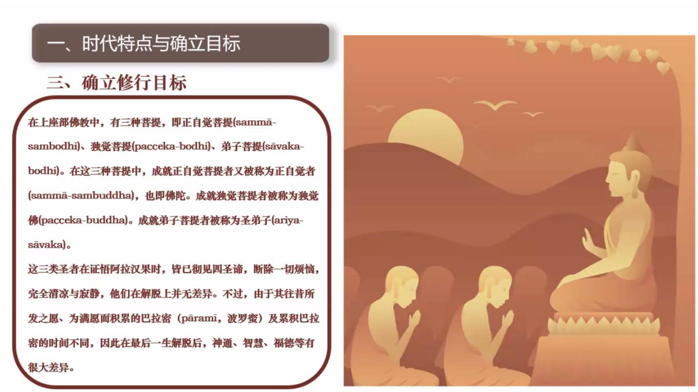
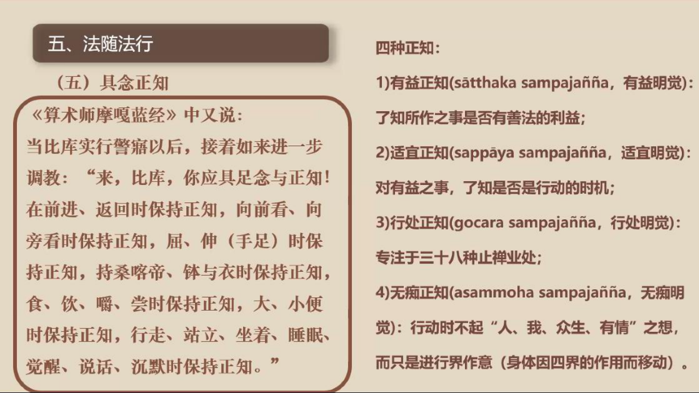

📅 最近更新：2026-09-29 15:00　|　第5版精修（朗读优化版）

# 第8周：禅修总结与修学规划（主持人版）

> ⭐ **本讲主持人速览**（新主持人必读，2分钟看完）
>
> 你不是老师，是"共学同行者"。你不需要懂禅修，只需要按流程走。本周是收官周——**分享比内容重要**，回顾、分享和展望是新内容。
>
> | 环节 | 标准时长 | ⏱ 时间不够→ | ⏱ 时间富余→ |
> |:-----|:----:|:-----|:-----|
> | 🧘 静心开场 | 10 min | 缩至5 min | 加2分钟静坐 |
> | 📖 回顾式共读 | 25 min | 只读★核心段（约15 min） | 加读扩展段落（约40 min） |
> | 💬 第一轮分享（深度回顾） | 20 min | 每人1句话（约15 min） | 每人3-5分钟（约35 min） |
> | 🎯 主题讨论 | 35 min | 只讨论问题①（约20 min） | 讨论全部问题+扩展（约45 min） |
> | 🧘 最后一次禅修练习 | 15 min | 缩至10 min | 延长至25 min |
> | 🔚 收尾与展望 | 15 min | 缩至10 min | 保持（收官周尽量不缩） |
>
> **主持人10条守则（精简版）**：
> ① 不讲解、不提供答案——让原文自己说话；② 有人问"正确答案"→说"先听听大家的看法"；③ 冷场→主持人先分享自己的真实感受；④ 跑题→温和拉回："这个有意思，我们回到今天的原文"；⑤ 争论→"两种看法都很好，大家保留自己的理解"；⑥ 确保人人发言；⑦ 不评判任何人的分享；⑧ 时间到了就推进；⑨ 禅修练习照读引导词即可（最后一次练习是整合版坐禅）；⑩ 结束一起回向。

> 主持人：这是8周旅程的最后一次相聚。这一周不学新内容，重点是回顾、分享和展望。请尽量让每位成员都有充足的时间说话。
> 本周主题：禅修总结与修学规划——两个月之后怎么走？**全部原文均为文字版（PDF课件／讲稿），可直接共读。**

---

## 📋 本周信息卡

| 项目 | 内容 |
|:----|:-----|
| 时长 | 120分钟 |
| 核心问题 | 这8周我们学了什么？两个月之后怎么走？ |
| 共读原文 | 《如来禅修学体系17-禅修次第1-时代特点与确立目标-古源尊者-20250119（课件）》；《如来禅修学体系32-禅修次第15-法随法行3-古源尊者-20250203（课件）》；《云台寺安居禅修13-大念处经略说-古源尊者》 |
| 本周活动 | 8周回顾汇总 + 深度回顾分享 + 三个月修学计划 + 展望与回向 |

## 🧘 静心开场（10 min）

> **开场破冰 · 暖场**（约 3 分钟）：用一句话说说：这8周里，你最想留住的一个练习瞬间是什么？
> （说完不必解释、不点评，只把它轻轻放在心里，带着这份真实进入今天的静心。）

> **本期共同约定（心理安全）**：① **保密**——今天在这里说的话，留在今天；② **不评判**——不评价任何人的分享；③ **可随时暂停**——坐不住、心里不舒服，随时可以调整姿势、起身或暂停，不需要向任何人解释。

**主持人引导语**（照读即可）：

> 今天是第8周，也是我们8周共学的最后一聚。先静坐一分钟，然后我们像第一周那样，一起回顾这8周走过的心路。（停顿60秒）
>
> 第一周，我们认识了什么是禅修、为什么现代人仍然能修；第二周，学会了正确地坐、安顿身心；第三周，找到了呼吸的触点，看清了整条修学路的框架；第四周，练习数息，学会与妄念打交道；第五周，了解心越来越细之后会遇到的禅相；第六周，认识了挡在定前面的五盖；第七周，把觉察带进了行走与日常。今天，我们一起把这八个星期的收获收进行囊，再为下一段路做一份规划。
>
> 收官不是结束。从下周起，没有每周一次的相聚了——练习还剩多少，正好是这一周最好的观察对象。不用紧张，只是观察。

---

## 📖 共读原文（25 min）

> ⚠️ 主持人操作：本周采用"回顾式共读"。以下已嵌入完整原文文字，**可直接照读或邀请成员各选一段读**，无需再去查知识库。回顾材料①为资料包整理的汇总表，供快速回顾。

### 回顾材料（含完整原文，可直接共读）

**回顾材料①：8周回顾汇总表（资料包整理）**

> 📌 **本清单为资料包整理的回顾索引，原文见各周文档。** 时间不够时，可以只请每位成员从清单中挑一条，说说"这一条我练过什么"。

1. **坐姿三要领**——骨盆中立位、松肩坠肘开胸、头部中立（头如氢气球上飘、耳垂对肩、脊柱沟出来且两边腰肌松软）；出处：第2周·《18_入出息念》＋第7周·《觉察姿势与动作》（录音转写）。
2. **触点与三法**——呼吸的“相”在鼻头／人中触点；相·入息·出息三法；触点是工具，不是盯住不放的地方；出处：第3周·《入出息念浅析6·修习2》（PDF课件）。
3. **安般十六步框架**——十六事总表：从觉知呼吸到观照无常苦无我的完整次第——先知道整条路，再一步一步走；出处：第3周·《入出息念业处十六事》（PDF课件）。
4. **四阶段与数息**——入出息→长短息→全息→微息四阶段；慢数快数、收功；妄念来了不压不批判；出处：第4周·《入出息念浅析6·修习2》（PDF课件）＋《14_入出息念·数息》（录音转写）。
5. **禅相与安止善巧**——心细之后的禅相：遍作相／取相／似相；五禅支；十种安止善巧；见细相不追不赶；出处：第5周·《入出息念浅析7·修习3》（PDF课件）＋《入出息念》（帕奥西亚多，PDF）。
6. **五盖与对治**——五盖（欲贪／瞋恚／昏沉睡眠／掉举追悔／疑）的定义、成因、义注五喻与逐一对治；出处：第6周·《止观前行实修营8·舍离五盖1》（PDF＋共修版）＋《止观前行实修营12·舍离五盖5》（录音转写）等。
7. **经行与四威仪**——经行“抬—移—放—触”；眼睛与转身觉察；不批判不标记；觉知锚点让习惯变成有念知；行住坐卧皆觉知；出处：第7周·《云台寺安居禅修04·拆解习惯和经行》＋《177讲·四威仪1》。
8. **修学次第**——禅修次第五步：时代特点与确立目标→亲近善士→听闻正法→如理作意→法随法行；出处：第1／8周·《如来禅修学体系17》＋《如来禅修学体系32》。

**回顾材料②：修学路径——三类菩提与发愿路径（体系17）**

- **文件**：《如来禅修学体系17-禅修次第1-时代特点与确立目标-古源尊者-20250119（课件）》

**★核心段落**（必读）

**一、三类菩提的差异说明（承接第1周"总说"）**

> 在上座部佛教中,有三种菩提,即正自觉菩提(sammā-sambodhi)、独觉菩提(pacceka-bodhi)、弟子菩提(sāvaka-bodhi)。在这三种菩提中,成就正自觉菩提者又被称为正自觉者(sammā-sambuddha),也即佛陀。成就独觉菩提者被称为独觉佛(pacceka-buddha)。成就弟子菩提者被称为圣弟子(ariya-sāvaka)。
>
> 这三类圣者在证悟阿拉汉果时,皆已彻见四圣谛,断除一切烦恼,完全清凉与寂静,他们在解脱上并无差异。不过,由于其往昔所发之愿、为满愿而积累的巴拉密(pāramī,波罗蜜)及累积巴拉密的时间不同,因此在最后一生解脱后,神通、智慧、福德等有很大差异。

> 《增支部·一集》中说:
> "诸比库,有一人出现于世间时,是稀有之人的出现。哪一人呢?如来、阿拉汉、正自觉者。诸比库,乃此一人出现于世间时,是稀有之人的出现。"
> "诸比库,绝无此理,无有条件,若一个世界中有两位阿拉汉、正自觉者不先不后地出现,绝无此理!诸比库,确有此理,若一个世界中只有一位阿拉汉、正自觉者出现,确有此理。"

**二、发愿成佛：已授记与未授记两条路径**

> 假如发愿成佛,又可分为两种情况:已被授记与未被授记。已被授记的菩萨自己清楚如何累积巴拉密,他的未来是确定的,当巴拉密圆满时,就将成就无上正觉。
>
> 假如尚未被授记,就应致力于完整地学习佛陀的教法,并修习八定与五神通,培育观智至行舍智,累积足够的资粮以等待下一位佛陀或其他佛陀的授记。

**三、具备被授记的八项条件（菩萨八法）**

> (1) 生为人
> (2) 生为男性
> (3) 遇到一位活着的佛陀
> (4) 是一位相信业报的修行者
> (5) 具有四禅八定与五神通
> (6) 具足悟阿罗汉果的条件
> (7) 愿为佛陀奉献自己的性命
> (8) 有极强想要成佛的善欲

**四、三种菩萨与巴拉密累积时长（发愿所需的时间代价）**

> 一、慧者菩萨:慧者菩萨慧强信弱;
> 二、信者菩萨:信者菩萨慧中信强;
> 三、精进者菩萨:精进者菩萨信与慧皆弱,但精进强。
>
> 1. 智慧型:四阿僧祇十万大劫
> 2. 信心型:八阿僧祇十万大劫
> 3. 精进型:十六阿僧祇十万大劫

**五、发愿成为普通弟子：四类修行资质**

> 若禅修者发愿成为普通弟子,致力于尽快解脱,则应了解《增支部·四集》中所说的四类人:
> 1) 敏锐知者(ugghāṭitaññū)
> 2) 详说知者(vipañcitaññū)
> 3) 可引导者(neyya)
> 4) 文句为最者(padaparama)

**六、未获授记者的修习建议（发愿确立后的行动指引）**

> 假如尚未被授记,就应致力于完整地学习佛陀的教法,并修习八定与五神通,培育观智至行舍智,累积足够的资粮以等待下一位佛陀或其他佛陀的授记。

（说明：本课件末尾附有《Mettābhāvanā ca Patthanā ca》散播慈爱与发愿全文本——巴利原文、注音转写与中文对照，与第2周《禅坐引导文》中的发愿文本相同，此处不重复收录；发愿·回向见本周"收尾与展望"的大回向。）

**回顾材料③：日常践行——四种正知与三种远离（体系32）**

- **文件**：《如来禅修学体系32-禅修次第15-法随法行3-古源尊者-20250203（课件）》

**★核心段落**（必读）

**具念正知：《算术师摩嘎蓝经》的践行场景**

> 《算术师摩嘎蓝经》中又说:
> 当比库实行警寤以后,接着如来进一步调教:"来,比库,你应具足念与正知!在前进、返回时保持正知,向前看、向旁看时保持正知,屈、伸(手足)时保持正知,持桑喀帝、钵与衣时保持正知,食、饮、嚼、尝时保持正知,大、小便时保持正知,行走、站立、坐着、睡眠、觉醒、说话、沉默时保持正知。"

**四种正知的定义**

> 四种正知:
> 1) 有益正知(sātthaka sampajañña,有益明觉):了知所作之事是否有善法的利益;
> 2) 适宜正知(sappāya sampajañña,适宜明觉):对有益之事,了知是否是行动的时机;
> 3) 行处正知(gocara sampajañña,行处明觉):专注于三十八种止禅业处;
> 4) 无痴正知(asammoha sampajañña,无痴明觉):行动时不起"人、我、众生、有情"之想,而只是进行界作意(身体因四界的作用而移动)。

**具念正知（践行场景清单）**

> 具念正知:
> (1) 在前进返回时保持正知
> (2) 向前看、向旁看时保持正知
> (3) 行走、站立、坐着、睡眠、觉醒时保持正知
> (4) 说话时保持正知
>
> 佛陀说话有两个原则:
> 一、只说真实、如实、有利益之语,即说正确的话;
> 二、无论那话语对于听众是否可喜、是否合意,佛陀知道说话的合适时机,即正确地说话。

**◈扩展段落**（可选）

**修习远离：三种层次的远离**

> 《算术师摩嘎蓝经》中接着教导:
> "来,比库,你要亲近偏远的坐卧处——林野、树下、山丘、幽谷、山洞、坟场、树林、露地、草堆。"

> 有三种层次的远离,即:
> 身远离(kāyaviveka)、
> 心远离(cittaviveka)、
> 依着远离(upadhiviveka)。
> 《法句义注》说:"身远离遣除群体之乐,心远离遣除烦恼之乐,依着远离遣除诸行之乐。"

> 《中部·大空经》(Mahāsuññatasuttaṃ, M.3.3.2)中指出:"阿难,乐于集会、喜好集会、致力乐于集会、乐于群聚、喜好群聚、喜爱群聚的比库无法辉耀。阿难,若乐于集会、喜好集会、致力乐于集会、乐于群聚、喜好群聚、喜爱群聚的比库确实将对出离乐、独处乐、寂静乐、正觉乐的那种乐随欲而得、不难而得、易于获得,无有此理。阿难,若那比库独自远离群聚而住,这可被预期:该比库将对出离乐、独处乐、寂静乐、正觉乐的那种乐随欲而得、不难而得、易于获得,乃有此理。"

> 《大空经》中又教导:
> "阿难,你怎么想:'见到何种利益时,弟子在被驱逐时仍值得追随导师呢?'阿难,弟子确实不值得以经、应颂、记说之因追随导师,那是什么原因呢?因为你已长久听闻、忆持、背诵、以心随观察、以见善通达法。然而,阿难,凡这(关于)削减、有益于心离盖、导向完全厌离、离染、灭、寂静、证智、正觉、涅槃的言论,即少欲论、知足论、远离论、独处论、发勤精进论、戒论、定论、慧论、解脱论、解脱智见论——由于像这样的言论之因,阿难,弟子即使被驱逐,仍值得追随导师。"

**回顾材料④：把目标调整为可行（云台寺13）**

- **文件**：《云台寺安居禅修13-大念处经略说-古源尊者》

**★核心段落**（必读）

**一、把"追求禅那"调整为"每天保持若干小时念知"的可行目标**

> 很欣喜地看到,已经有一些同学在一天的生活中,念知慢慢绵密起来,他因此感觉充实,感觉法喜,这就是修行。修行不是说现在禅修成就有多高,或者定力有多强——有定力当然是好的,但它真的不是最重要的。最重要的是在日常生活中,能不能始终活在法上。
>
> "法"是什么呢?法就是念住。佛陀讲:"四念住是唯一之道"。所以你在四念住上,你就在法上;你在法上就能体会法味,这是最重要的。
>
> 所以如果你到这里来是想"什么时候证得禅那?"你最好调整为"什么时候能够一天有两个小时保持念知,或者一天有十个小时保持念知。"
>
> 想要证禅那不容易,有些人混了几十年都没搞到。但是如果你下一个目标是"一天保持两个小时的念知",只要你愿意,只要用心,就一定能做到(特别在禅林这个地方)。当你保持念住两小时的时候,体会真的不一样,禅那可能就不远了。
>
> 所以我希望大家转个角度,虽然可能不容易,但希望大家有机会转转试试。

---

## 💬 第一轮分享（20 min）

**主持人引导**：

> 今天不按顺序也行，谁想先说都可以。请大家分享：这8周里，你最难忘的一次练习、或最触动你的一句话是什么？
> （这一轮尽量不打断、不评论，让每个人说完。）

---

## 🎯 主题讨论（35 min）——深度回顾

**主持人引导**：朗读问题，让大家自由讨论。**你不提供答案**，只引导。

**讨论问题（按优先级）**：
- **问题①（★必答，时间不够时只讨论这个）**：8周里对你改变最大的一个认知／一个方法是什么？（比如"修行不是控制呼吸，而是知道呼吸""妄念不用赶，知道就已经是正念""目标可以调成'一天两小时念知'"……）
- **问题②（◈选答）**：对照回顾材料②的"发愿路径"与四类修行资质，你现在对自己修学的定位是什么？（如实就好，不比较、不高推——"可引导者""文句为最者"精勤修习，同样能走到终点。）
- **问题③（◈选答，时间富余或大家感兴趣时讨论）**：未来3个月你的禅修计划是什么？请具体到**频次／时长／检查方式**（比如"每天早上坐15分钟＋经行10分钟；每周日晚上用3句话检查这一周的念知"）。

---

> **分层追问**（可视时间取用，由浅入深）：
> - 【现象】回头看这八周，哪一次静坐是你觉得最踏实、最想再回去待一会儿的时刻？
> - 【影响】这段时间里，你有没有发现，自己对烦躁或昏沉的反应，和从前有些不一样了？
> - 【应对】这周给自己定一个下周还做得到的小练习，简单到再忙也不容易把它放下。

## 🧘 最后一次禅修练习（15 min）

> **练习提示（禁忌与安全）**：如有严重身心疾病（重度抑郁／焦虑发作期、精神障碍等）、近期手术或严重心血管疾病、孕期或有医嘱限制者，请先咨询医生、量力而行；练习中若出现强烈不适，可随时睁眼、停止、调整，或改为静坐观察。

> ⚠️ **禅修禁忌提示**：若你正处在严重抑郁、焦虑、创伤后应激，或精神类疾病的发作／用药期，或正经历强烈的情绪危机，请先咨询医生或心理师，再决定是否练习；练习中若出现明显不适（如心悸、胸闷、情绪失控），请立即停止，睁开眼睛，把注意力放回呼吸与身体，必要时离场休息。

> ⚠️ 主持人操作：照读完整引导词（整合8周所学：坐姿三要领、感恩身体、触点与呼吸、细相不追不赶、以回向心结束；改编自《禅坐引导文》与各周原文，**非逐字照读**）。

**引导词**：

> 请大家自然地坐好——骨盆坐稳、身体中正，散盘、单盘或坐在椅子上都可以。头轻轻往上顶，像氢气球往上飘；肩膀松下来，胸自然打开。（停顿）
>
> 先花一点时间，感恩身体：这8周里，是它支撑着你每一次行走、站立、坐卧、禅修。从头顶到脚底，哪里还紧，就请它再松一点。（停顿）
>
> 现在，把心轻轻放到鼻头、人中附近——气息进出时碰到皮肤的那个触点。气息进来，知道进来；气息出去，知道出去。长的时候知道长，短的时候知道短；只是知道，不控制，不评判。（停顿2-3分钟）
>
> 如果心静下来，眼前或心里出现一些细的光、细的感受——不用兴奋地追上去，也不用害怕地赶它走；轻轻地回到呼吸上就好。相只是路上的风景，我们只管走自己的路。（停顿）
>
> 如果妄念来了，知道"妄念来了"——这本身就已经是正念。轻轻回来，不用责备自己。（停顿1-2分钟）
>
> 最后，我们一起在心中默念回向：愿我此功德，导向诸漏尽；愿我此功德，为证涅槃缘；我此功德分，回向诸有情；愿彼等一切，同得功德分。（停顿）
>
> 好，慢慢动动手指、脚趾，搓搓手掌，把温热的手掌敷在眼睛上，轻轻睁开眼睛。这8周的每一次呼吸、每一步抬移放触，都会留在心里。

---

## 🔚 收尾与展望（15 min）

1. **每人一句话**："8周后的我 vs 8周前的我"——说一个你最明显的变化（哪怕很小：睡得好了、走路慢了、发火前多了半秒钟……）。
2. **展望：后续读书会系列**（照读即可）：
   - **读书会02 · 慈心禅修习**：把心变软、变暖，对治瞋恚；
   - **读书会03 · 四护卫禅**：禅修路上的四道护卫——为修行保驾护航；
   - **四念处方向读书会**：身受心法——第7周四威仪的观禅部分将在那里深入。
   - 不进下一个读书会也很好：按"三个月计划卡"每天自己练，这就是这条路的走法。
   - 不确定选哪个？散会后翻一翻各周文档开头的"核心问题"，哪个问题还让你心里一动，就从哪里继续。
3. **互道祝福**：每人向右边的伙伴说一句祝愿（自由发挥，比如"愿你每天都有一点念知""愿你的禅修路上不孤单"）。
4. **大回向**（一起念，作为8周的圆满收尾）：

> **愿我此功德，导向诸漏尽！**
> **愿我此功德，为证涅槃缘！**
> **我此功德分，回向诸有情！**
> **愿彼等一切，同得功德分！**

---

## 🎉 结语

> 8周的禅修入门之旅结束了，但"知道此刻"的功课是一生的。
> 愿你把坐垫上的觉察，带进行走、站立、坐卧的每一个当下。
> **8周之后怎么走？——就从下一次知道"我在呼吸"开始。**

---

## 📌 本讲主持人特别提醒
- **结营周组织要点**：时间分配向分享倾斜（分享与讨论合计可占40-50分钟），宁可压缩共读与练习，也要让每个人说完——尤其"8周后的我 vs 8周前的我"环节，不要赶。
- **气氛营造比内容重要**：今天不是"上课"，是一场温暖的告别与互相见证。多肯定、多感谢每一位成员的坚持；有条件可以准备简单的茶点。
- **人数超过8人时**："每人一句话"环节可先两人小组互说，再每组回报一句，确保不超时、不漏人。
- **若本讲换了新主持人**：不用慌——本周没有新知识，你的任务只是"主持好一场回顾与告别"。开场可以坦白说："今天我们一起回顾，我也没有全部答案。"
- **讨论"修学定位"时把好关**：三类菩提、四类人只是对修行者类型的描述，不是等级评判——主持人不给任何人"定位答案"，也不允许成员互相贴标签。
- **物料准备**：提前打印或投屏"8周回顾汇总表"（回顾材料①）与"三个月计划卡"（扩展三），人手一份带走；如发放后续读书会（读书会02／03／06方向）报名表，安排在回向之前。

---

<!--EXT_READ-->
## 📖 延伸阅读（课后自由选读）

- 《如来禅修学体系17-禅修次第1-时代特点与确立目标-古源尊者-20250119（课件）》——三类菩提与发愿路径。
- 《如来禅修学体系32-禅修次第15-法随法行3-古源尊者-20250203（课件）》——四种正知与三种远离。
- 《云台寺安居禅修13-大念处经略说-古源尊者》——把目标调整为可行。
<!--/EXT_READ-->
